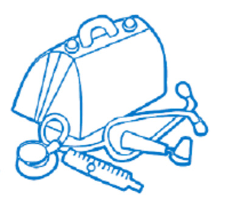
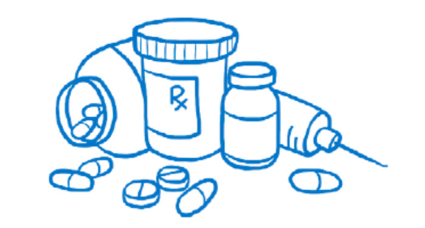
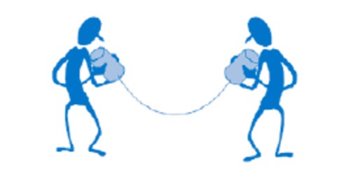
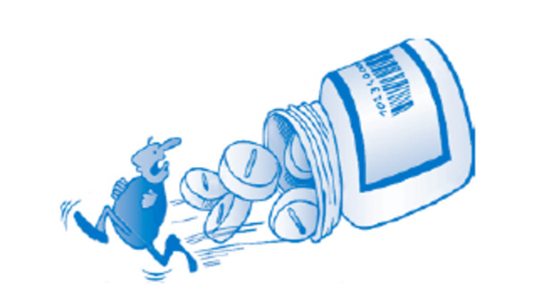

# Introduction and Preface

## Introduction to Uganda Clinical Guidelines

This fully updated publication replaces the UCG 2023 and is being circulated to all public and private sector prescribers, pharmacists, Training
Institutions and regulatory authorities in the country.
For effective use of the UCG, it is recommended that carefully designed
dissemination sessions be organized countrywide to ensure that users
appreciate the new features, changes, structural arrangement and content
to improve it’s usability .
The following sections will present the structure and main features of
the guideline to highlight the changes in this latest edition and help the
user become familiar with the book and use it effectively.

### What is the aim of the UCG?

The UCG aims to provide summarized easy-to-use, practical, complete and
useful information on how to quickly and correctly diagnose and manage
common conditions you are likely to encounter. Thiswillensurethatpatients
receivethebestpossibleclinical servicesandobtainpromptandeffectiverelief
from or cure of their complaint, thereby making the most appropriate use of
scarce diagnostic and clinical resources, including medicines. It should,
however, be emphasised that the UCG does not replace or substitute
available textbooks on the subject.
Why is the UCG necessary?

Medicine is an ever-evolving and expanding field in terms of needs and
knowledge. The UCG helps the country to prioritize and effectively
use limited resources by guiding the procurement system to ensure the
availability of the most needed medicines and supplies.

<figure markdown="1">

{ width="500" }

</figure>
In the context of new knowledge and changing priorities, as a tool,
the UCG assists health workers in their daily practice by providing
information in an easy-to-follow and practical format.
How do I use the UCG?

First of all, familiarize yourself with it. Check the table of contents
and see how the chapters are arranged and organized.
New Feature
The order of chapters has been maintained as in the previous versions. However, new chapters have been introduced, namely, self-care,
management of hypoxia and COVID-19. The Palliative Care section
has been expounded with more clarity. For the first time a purely
herbal preparation with selenium has been included for management
of stress. The snake bite section has been enriched with photographs
of the common virulent snakes found in Uganda, to ease identification
and thus more accurate intervention and management.

Most chapters are organised by disease monographs, arranged either in
alphabetical order or another logical order (e.g., according to occurrence of disease progression). However, some chapters are organised
according to syndrome or symptoms (e.g., child health, palliative care,
oncology, sexually transmitted infections, emergencies and trauma), while
TB and HIV are presented as individual sub-chapters.

!!! note "New Feature"
 The chapters Covid -19, Self-care and Hypoxia management have
 been added with focus on primary care (prevention and early recognition of symptoms).

 Disease monographs are organized in the order of: definition, cause/
 risk factors, clinical features and complications, differential diagnosis,
 investigations, management, and prevention.

!!! note "New Feature"
 Palliative care ladder has been introduced to make it easier for pain
 assessment. Treatments are presented in logical order from non-pharmacological to
 pharmacological, from the lower to the higher level of care. Where
 possible, alternatives and second-line options have been presented,
 as well as referral criteria.

Medicines are presented by their generic name, in bold. Unless otherwise
specified, dosages are for adults and via oral route. Children’s dosages
are added whenever indicated, as well as duration and other instructions.
The level of care (LOC) is an important feature; it provides information
about the level at which the condition can be appropriately managed.
Often, treatment can be initiated at lower level, but the patient needs to
be referred for further management, or for second-line treatment, or for
complications. For antibiotics, it is recommended that treatment can be
initiated in some cases awaiting laboratory results. HC1-4 refers to health
centres of different levels (with HC1 being the community level), H to general
hospital, RR to regional referral hospital, and NR to national referral hospital.
After familiarizing yourself with it, try using it! Practice finding
conditions and looking them up to see how they are managed, using either
the table of contents at the beginning or the index at the end.

Use it in your daily practice. The UCG is designed as a simple reference
manual to keep at your work station, where you can consult it any time.
Using it in front of patients and colleagues will show that you care deeply
about the quality of your work, and it will provide good examples to
other health workers.

Read all the introductory sections. They will give you useful advice
for your daily practice. There is always something new to learn or to
be reminded of.

The UCG cannot replace health workers’ knowledge and skills; like your
thermometer and stethoscope, it is a tool to help improve clinical practice
by providing a quick and easily available summary of the recommended
management of common health conditions.

<figure markdown="1">

{ width="500" }

</figure>

### What is the difference between the UCG and a textbook?

The UCG gives a summary of recommendations for managing priority
conditions in Uganda. It does not provide extensive or in-depth information
about all diseases and all treatments available in the world.
Conditions have been selected based on their prevalence in the country
and their impact on the population’s health status. Treatments have been
selected based on the following criteria:Scientific evidence: recommendations are evidence-based, from international literature and local experts. 
!!! example
The situation analysis on antimicrobial resistance in Uganda conducted by the National Academy of
Sciences was used to guide the choice of antibiotic treatments.
Cost-effectiveness:treatments have been selected based on their effectiveness, but also their affordability, to get the best “value for money”, meaning the maximum benefit with the limited resources available.
!!! example
A liver transplant is a very effective way to treat terminal cirrhosis, but it is definitely not affordable—money is better invested in treating patients with chronic hepatitis B!

### What has changed compared to the previous edition?

- There are more chapters as explained before.

- The management sections have been re-edited to be more user-friendly, using the suggestions collected during a user survey.

- Information on new diseases has been added following new epidemics and public health priorities (e.g., viral haemorrhagic fevers, COVID-19, yellow fever, nodding disease, sickle cell disease, newborn illnesses).

- More attention has been paid to non-communicable chronic diseases.

- Stroke and chronic obstructive pulmonary disease (COPD), and sections on diabetes, hypertension, asthma and mental conditions including diseases of the elderly and dementia have been expanded.

- Recommendations have been aligned with the most recent national and international guidelines related to ART, TB, malaria, IMNCI, IMPAC and mhGAP (see Appendix 4).

- Medications have been added or deleted and levels of care have been changed according to recent evidence and national policies.

- Skin management for Albinos using a sunscreen protection product has been included under the dermatological section.

- The essential medicines list has been removed from this edition to make the book pocket-friendly.
What about the Essential Medicines and Health Supply List (EMHSLU)?

The essential medicines list has been removed from this edition to make
the book pocket friendly. Always refer to the separate EMHSLU.

To implement the recommendations in the UCG, the medicines listed in
the EMHSLU have to be procured and distributed in adequate quantity.
This is why the procurement and supply system plays a fundamental role
in the provision of quality healthcare.

<figure markdown="1">

{ width="500" }

</figure>

The EMHSLU has all the medicines recommended in the UCG, with
specification of the level of care (LOC) at which they can start being used,
but it also has additional “specialty” medicines, which are items used at
referral level (regional or national) or in the context of specialized services.
They may not be included in the UCG, which focus more on primary care,
but are still part of the list because they need to be procured to ensure the
provision of a wider range of services at secondary and tertiary levels. In
the context of limited resources, it is very important to learn to prioritize
medicines for procurement: this is reflected by the vital, essential, necessary
(VEN) classification in the EMHSLU, introduced in 2012.
Medicines are classified into three categories according to health impact:

**V — Vital medicines**

Vital medicines are potentially life-saving and lack of availability would cause serious harm. These must **always be available**.

Examples include insulin, metformin, most antibiotics, first-line antimalarials, some anti-epileptics and parenteral diuretics.

**E — Essential medicines**

Essential medicines are important and are used to treat common illnesses that may be less severe but still significant. They are not absolutely required for the provision of basic healthcare (e.g., anti-helminthics, pain killers).

**N — Necessary medicines**

Necessary (sometimes called non-essential) medicines are used for minor or self-limiting illnesses, may have limited efficacy, or may have a higher cost compared to the benefit.
Every effort must be made to ensure that health facilities do not experience stock-outs of vital medicines.

### AWaRe classification
The WHO AWaRe classification was used to describe overall antibiotic
use as assessed by the variation between use of Access, Watch, and
Reserve antibiotics.

### Why is a laboratory test menu in the appendix?

Laboratory is an important tool in supporting the diagnosis and management of various conditions. Tests are listed according to the level at
which they can be performed, in order to inform health workers about the
available diagnostics at each level for the suspected condition and guide
on managemeent or referral decisions.

## Primary Health Care

!!! info "Definition"
 Primary healthcare is essential healthcare based on practical,
 scientifically sound and socially acceptable methods and
 technologies. Primary healthcare should be universally accessible
 to individuals and families in the community through their full
 participation and at a cost that the community and country can
 afford in the spirit of self-reliance and self-determination.

Primary healthcare forms an integral part of both the country’s
health system, of which it is the main focus, and of the community’s
overall social and economic development.
Primary healthcare brings healthcare as close as possible to
where people live and work and is the community’s first level of
contact with the national health system.

> “Primary health care is the key to the attainment of the goal of Health for All.”
>
> — Declaration of Alma-Ata International Conference on Primary Health Care 
> Alma-Ata, USSR, 6–12 September 1978

 

<figure markdown="1">

{ width="500" }

</figure>

 
### How to diagnose and treat in primary care

The principles of healthcare are the same wherever it takes place.

> “Listen to the patient; he is telling you the diagnosis.”
>
> — Sir William Osler, MD (1849–1919)

### Communication skills in the consultation room

Good communication skills are essential for making a correct diagnosis and
for explaining or counselling on the illness, its treatment, and prevention of
future illness.

<figure markdown="1">

{ width="500" }

</figure>
At the beginning of the consultation, use open questions, which allow
the patient to express him or herself freely, listen without interrupting, and
give him or her the chance to share their interpretations, fears and worries.

!!! tip "The Golden Minute"
 The golden 60 seconds at the start of the consultation is for eliciting
 ideas, concerns and expectations without interrupting.

Move to more specific questions later, to ask for further details and clarifications.
### The Seven Steps in a Primary Care Consultation

1. **Greet**
 Greet and welcome the patient. Ensure adequate space and privacy.

2. **Look**
 Observe the patient as he or she walks into the room for degree or state of illness. 
 Look for danger signs and act immediately if necessary.

3. **Listen**
 Ask about the main complaint or complaints, establish duration, and explore each symptom by asking relevant questions. 
 Briefly ask about previous medical history, other past or present illnesses and current or recent medications.

4. **Examine**
 Perform a complete medical examination, focused on but not limited to the complaints.

5. **Suspect diagnosis**
 Write your findings and think about possible diagnosis and differentials.

6. **Test**
 Request tests to confirm or exclude possible diagnoses.

7. **Treat**
 Conclude on a diagnosis and decide on the treatment if needed. 
 Explain diagnosis, treatment and follow-up to the patient. 
 Give counselling and advice as appropriate.

!!! note "New Feature"
    A section on self-care interventions for sexual and reproductive health (SRH) has been introduced.

    These include self-awareness, self-testing and self-management across areas such as antenatal care, family planning, HIV and STIs, and post-abortion care.

    WHO defines self-care as the ability of individuals, families and communities to promote health, prevent disease, maintain health and cope with illness or disability with or without the support of a healthcare provider.

    The Ministry of Health has developed the National Guideline on Self-Care Interventions for SRH. Refer to the current guideline for details.

### Chronic Care

- Health workers are faced with an increasing number of chronic diseases and conditions that require additional attention, such as hypertension, chronic heart problems, diabetes, cancers, mental conditions, HIV/AIDS, and TB.

**Communication is even more important to:**

- Find out the duration of the symptoms, previous diagnosis, previous or current treatments and impact on daily life

- Explain the nature and management of the condition to the patient and counsel on lifestyle and adjustment

- Chronic diseases require long-term (sometimes lifelong) follow-up and treatment:

- Counsel and advise the patient on the importance of follow-up and treatment adherence

- Set up a system for scheduling appointments (on the model of HIV care!)

- At each monitoring visit, determine whether the patient’s condition is improving, stable, or deteriorating and assess whether patients are taking prescribed treatments properly (the right medicines, in the right doses, at the right time). Try to be consistent in prescribing and change the regimen only if it is not working or has side effects. If a treatment is working and well tolerated, maintain it!

- Counsel and motivate the patient to follow lifestyle recommendations, including selfcare.

- Assess the need for further support (e.g., pain management, counselling, etc.)

- A chronic care system requires collaboration among and integration of all levels of healthcare

- Higher levels of care may be responsible for initial diagnosis and prescription of treatment and periodic reviews and re-assessment in case of problems or complications

- Lower levels of care (including the community) may be responsible for routine follow-up, counselling and education, medication refills and prompt and early referral in case of problems.

### Appropriate Medicines Use

According to WHO, “Rational [appropriate] use of medicines requires that patients receive medications appropriate to their clinical needs, in doses that meet their own individual requirements, for an adequate period of time, and at the lowest cost to them and their community”.

Inappropriate medicine use can not only harm the patient, but by wasting resources, may limit the possibility of other people accessing healthcare! Both health workers and patients have an important role to play in ensuring appropriate use by:

- Prescribing (and taking) medicines ONLY when they are needed

- Avoiding giving unnecessary multiple medications to satisfy patients’ demands or for financial gain

- Avoiding expensive alternative or second-line medications when an effective and inexpensive first-line is available

- Avoiding injections when oral treatment is perfectly adequate

- Ensuring that the correct dose and duration of treatment is prescribed, especially for antibiotics, to avoid resistance

- Providing adequate information and counselling to the patient to ensure adherence with instructions.

### Antimicrobial Resistance (AMR)

According to the WHO definition

“Antimicrobial resistance occurs when microorganisms such as bacteria,
viruses, fungi and parasites change in ways that render the medications
used to cure the infections they cause ineffective. Antimicrobial resistance
is facilitated by the inappropriate use of medicines, for example, when
taking substandard doses or not finishing a prescribed course of treatment.
Low-quality medicines, wrong prescriptions and poor infection prevention
and control also encourage the development and spread of drug resistance.”

The problem of AMR is a serious threat for the modern world:

- The resistance of malaria parasites has caused several changes in antimalarial regimens in the last 15 years

- MDR-TB (multi-drug resistant tuberculosis) is spreading and requires long and complex treatments

- HIV resistance is a serious concern, especially after long-term treatment

- AMR is spreading and, in some cases, commonly used antimicrobials are not as effective as before

- Antimicrobial resistance among bacteria other than TB and fungi (moulds and yeasts) that affect the immune-compromised is evolving, spreading and responsible for death from sepsis in general and high dependency units.

Inappropriate use of antibiotics (in human medicine but also in animal agriculture),
poor quality products and ineffective infection control measures are all
contributing factors. We are seriously at risk of finding ourselves in a situation
with no affordable antimicrobial available to cure common and dangerous infections.

It is URGENT that both health workers and patients become aware of the
problem and start acting by:

- Using antimicrobials only when it is really necessary and according to recommendations (e.g. not for simple viral infections!)

- Avoiding self-prescription of antibiotics

- Avoiding using last generation and broad spectrum antibiotics as first-line treatment

- Prescribing correct dosages for the correct duration and ensuring adherence to the prescription

- Practising strict measures of infection control in health facilities

- Improving hygiene and sanitation in the community, thereby reducing the circulation of germs.

### AWaRe

- WHO has further introduced the AWaRe classification to guide prescribers during prescribing of antibiotics. The major focus of AWaRe approach is to reduce the increasing antimicrobial resistance.

- The principal of AWaRe prescribing is based on **Access, Watch, Reserve**.

- Prescribers are encouraged to adhere to the above.

### Prescribing Guidelines

The current PGD (Practical Guidelines for Dispensing at Lower/ Higher
Level Health Facilities), provide comprehensive information about how
to prescribe and dispense the medicines listed in the EMHSLU and UCG
1. Carefully consider the following key questions before writing
any prescription:

| **QUESTIONS** | **COMMENTS** |
|---------------|--------------|
| **Does the diagnosed condition require drug treatment?** | Not all patients or conditions need a prescription for medicines. If the condition is self-limiting, non-medicine treatments or simple advice may be more suitable in certain situations. |
| **Is the prescribed treatment likely to have optimum therapeutic effect and benefit the patient?** | Good therapeutics depends on: • Accurate diagnosis of the condition • Knowledge of the relevant available medicines • Asking the patient about previous drug history (e.g., drug reactions or allergies) • Selection of the most appropriate medicine, dose, route, and duration • Carefully considering the expected benefit of a prescribed medication against its potential risks |
| **Is the selected dosage form the most appropriate?** | • For systemic medications, **always use the oral route** if possible, as it is the cheapest and least hazardous route. • Always resist patient demands for injections or other expensive dose forms when they are not clearly indicated or appropriate. • **Limit injections** to situations where they are absolutely necessary (they carry risks and are more expensive). • Always explain to the patient the reasons for choosing a particular route. |
| **Can I justify using a combination of medicines?** | Do not prescribe a combination of medicines unless they have a proven and significant therapeutic advantage over corresponding single-ingredient preparations. |
| **Do I really need to prescribe more than one medicine?** | Do not practise multiple medicine prescribing (polypharmacy), especially when the diagnosis is uncertain. It wastes resources and puts the patient at increased risk without clear benefit. |
| **Have I taken into account all relevant patient criteria?** | Consider the following: • Age, gender, weight—especially for children and the elderly • Likelihood of side effects (including allergies) • Presence of renal or hepatic disease (many medicines may need dose reduction or avoidance) • Other medicines the patient may be taking (risk of interactions or adverse effects) |
| **Pregnancy and breastfeeding considerations** | Only use medicines in pregnancy if the expected benefit to the mother outweighs the risk to the foetus or baby. Avoid medicines if possible during the **first trimester**. |
| **Will the patient adhere to treatment?** | Consider the likely degree of adherence to treatment. Simpler and shorter dosage regimens increase the chance of the patient correctly following prescribed therapy. |

### Prescribing placebos

Avoid placebos whenever possible. Instead, spend some time reassuring
and educating the patient. Use home remedies when possible (e.g., honey
for cough in adults and children above 1 year).

### Prescription writing
A wrong prescription is very risky for you and your patient.

Unclear, incomplete, or inaccurate prescriptions are very dangerous for
the patient. To avoid problems, follow the guidance below in writing
your prescriptions:

**Prescription Writing Rules**

| Rule | Guidance |
|-----|----------|
| Legibility | Write all prescriptions clearly and legibly in ink. Poor writing may lead to errors in interpretation by the dispenser, which may have harmful or life-threatening consequences for the patient. |
| Patient details | Write the full name, age, gender, and address of the patient, then sign and date the prescription form. |
| Prescriber details | All prescriptions should clearly indicate the name and address of the prescriber and the health facility. |
| Legal status | A prescription is a legal document. |
| Medicine name | Write the name of the medicine or preparation using its full generic name. |
| Naming conventions | Do not use unofficial abbreviations, trade names, or obsolete names. |
| Strength of medicine | Clearly state the strength of the medicine prescribed where relevant. |
| Quantities ≥ 1 g | Quantities of one gram or more should be written as 1 g, 2.5 g, 10 g, etc. |
| Quantities between 1 mg and 1 g | Express these quantities in milligrams (mg) rather than grams.   <em>Example:</em> 500 mg and not 0.5 g |
| Quantities < 1 mg | Express these quantities in micrograms rather than milligrams.   <em>Example:</em> 100 micrograms rather than 0.1 mg or 100 mcg |
| Decimal notation | Always write a zero before a decimal point when there is no leading figure.   <em>Example:</em> 0.5 ml and not .5 ml |
| Dose regimen | Always state the dose regimen in full: dose size, dose frequency, and duration of treatment. |
| Quantity to dispense | The quantity to be dispensed should be calculated from the regimen.   <em>Example:</em> Doxycycline 100 mg every 12 hours for 7 days = 14 tablets of 100 mg |
| In-patient prescriptions | Clearly state the route of administration and specify time of administration where relevant. |
| “As required” medicines | Avoid instructions such as “prn” or “to be used/taken as required”. Indicate a suitable dose frequency instead. |
| When “as required” is appropriate | Always state the actual quantity to be supplied, when to take it, and the maximum amount. |
| Special instructions | Include any special instructions necessary for correct use such as “before food” or “apply sparingly”. |

### Controlled medicine prescriptions

These medicines are covered by the provisions of the National Drug Policy
and Authority Act 1993, which should be consulted for details of the
appropriate legal requirements as stipulated. Medicines covered by the
Act and appearing in the UCG 2023 or EMHSLU 2023 include:

- Morphine injection

- Morphine oral solution

- Papaveretum + hyoscine injection

- Pethidine injection

- Codeine

- Tramadol

- Diazepam injection

These are all medicines of potential abuse that may result in dependence.
All procedures involving them should be carefully recorded in the
appropriate record books. They may only be prescribed by authorised
prescribers who must observe the following legal requirements:

- Prescriptions must be in the prescriber’s own handwriting, with a
 signature, date and the prescriber’s address.

- Prescriptions must state the name and address of the patient.

- Prescriptions must state the total amount of the product to be supplied
 in words and figures.

- It is an offence for a prescriber to issue and for a pharmacy to dispense
 prescriptions for controlled medicines unless they are in full compliance
 with the requirements of the law.

!!! Note
    - Specialised palliative care nurses and clinical officers are authorised to prescribe oral morphine and other medicines used in palliative care.

    - Morphine rarely causes psychological dependence when prescribed for severe pain.

    - In certain exceptional circumstances, senior nurses in charge of departments, wards or theatres and midwives may also obtain and administer certain specified controlled medicines. Consult the relevant sections of the Act for details of the appropriate legal requirements in each case.

    - Hospital in-patient prescriptions written on treatment cards or case sheets and signed/dated by the person administering the medicine are considered compliant under the Act.

### Prescribing in children and the elderly

In these guidelines, paediatric medicine doses are usually given according
to body weight and not age, and are therefore expressed as mg/kg.

The main reason for this is that children of the same age may vary
significantly in weight. Thus, it is safer and more accurate to prescribe
medicines according to body weight. Moreover, this should encourage the
good practice of weighing children whenever possible.

However, as a guide to prescribing by weight when a weighing scale is
not available, the weight-for-age charts at the end of Chapter 17 can be
used as an estimate for children from 1–24 months and 2–15 years,
respectively.

Always use lean/ideal body weight for children who are overweight or
obese to avoid giving them overdoses.

!!! Note
    Paediatric doses calculated using mg/kg should not exceed the normal adult dose.

In the case of some medicines that have a wide therapeutic range and
a good safety profile, dosages are given for age ranges for easy reference.

Prescriptions in the elderly also need additional attention because the
elderly are more prone to side effects; they are more likely to take several
medications (polypharmacy) with possible interactions, and they often
have co-morbidities that can affect their response to medicines.

Reduced doses and careful monitoring are always advised, and specific
warnings have been added for some medicines.

### Medicine interactions

Before prescribing any medicine, take care to avoid problems of
interactions with other medicines by obtaining details of any other
medication that the patient is taking, whether the medication is:

- Also prescribed at the same time

- Previously prescribed by another prescriber for the same or another
 condition and currently being taken by the patient

- Purchased or otherwise obtained by the patient for the purposes of
 self-medication at home

<figure markdown="1">

{width="500"}

</figure>

!!! Note on interactions with alcohol
    If a prescribed medicine interacts with alcohol (for example, metronidazole, diazepam, anti-diabetic medicines, and tricyclic antidepressants), caution the patient to avoid taking alcoholic drinks during the course of treatment and for 48 hours afterwards.

### Patient counselling

This vital part of patient management is often neglected with potentially
serious consequences. Although counselling the patient may take time,
if done systematically it should only take a few minutes and could make
the difference between treatment success and failure.

Include the following key components when counselling the patient:

- Explain the diagnosis and the likely cause of the disease or condition
 and discuss the proposed approach to treatment.

- Describe the prescribed medicine therapy in detail including:

- Medicine name
- Function of the medicine
- Dose regimen (size, frequency, duration)
- Any additional instructions on correct use or storage of the medicine
- Any likely side effects and what to do if they occur
- Advice on important medicine interactions (including alcohol)

- Give advice on how to contribute to the success of the treatment
 (for example, rest, diet, fluids and other lifestyle changes) and how to
 avoid the same problem in future.

- Ensure the patient or caretaker fully understands the information and
 advice provided — ask him or her to repeat key points.

- For health conditions that require self-care, proper advice should be
 given to the patient on self-awareness, self-testing and self-management.

- Ensure the patient is satisfied with the proposed treatment and has an
 opportunity to raise any problems or queries with you.
 
 
## Abbreviations

??? note "Abbreviations (A–H)"
    | Abbreviation | Meaning |
    |---|---|
    | 3TC | Lamivudine |
    | ABC | Abacavir |
    | Ab | Antibody |
    | ACE | Angiotensin Converting Enzyme |
    | ACP | AIDS Control Program |
    | ACT | Artemisinin-Based Combination Therapy |
    | ACTH | Adrenocorticotropic Hormone |
    | ADHD | Attention Deficit Hyperactivity Disorder |
    | ADR | Adverse Drug Reaction |
    | AFASS | Acceptable, Feasible, Affordable, Sustainable and Safe |
    | (A)AFB | (Alcohol) Acid-Fast Bacillus |
    | AIDS | Acquired Immunodeficiency Syndrome |
    | ALP | Alkaline Phosphatase |
    | ALT | Alanine Aminotransferase |
    | AMI | Acute Myocardial Infarction |
    | ANC | Antenatal Care |
    | APH | Antepartum Haemorrhage |
    | APPE | Appropriate Personal Protective Equipment |
    | APRI | Aspartate Aminotransferase to Platelets Ratio Index |
    | aPTT | Activated Partial Thromboplastin Time |
    | AQ | Amodiaquine |
    | ARB | Angiotensin Receptor Blocker |
    | ART | Antiretroviral Therapy |
    | ARV | Antiretroviral |
    | AS | Artesunate |
    | ASA | Acetylsalicylic Acid |
    | ASOT | Anti-Streptolysin O Titre |
    | AST | Aspartate Aminotransferase |
    | ATV | Atazanavir |
    | AZT | Zidovudine |
    | BCG | Bacillus Calmette-Guérin |
    | BMI | Body Mass Index |
    | BNP | Brain Natriuretic Peptide |
    | BP | Blood Pressure |
    | BPH | Benign Prostatic Hyperplasia |
    | bpm | Beats Per Minute |
    | BSE | Breast Self-Examination |
    | BUN | Blood Urea Nitrogen |
    | C&S | Culture and Sensitivity |
    | Ca2+ | Calcium |
    | CBC | Complete Blood Count |
    | CCB | Calcium Channel Blocker |
    | CD4 | Cluster of Differentiation 4 |
    | CIN | Cervical Intraepithelial Neoplasia |
    | CPK | Creatine Phosphokinase |
    | CrAg | Cryptococcal Antigen |
    | CRP | C-Reactive Protein |
    | CSF | Cerebrospinal Fluid |
    | CT | Computed Tomography |
    | Cu-IUD | Copper Bearing Intra-Uterine Device |
    | CVD | Cardiovascular Disease |
    | CXR | Chest X-Ray |
    | DBP | Diastolic Blood Pressure |
    | DBS | Dried Blood Spots |
    | DHA | Dihydroartemisinin |
    | DIC | Disseminated Intravascular Coagulation |
    | DKA | Diabetic Ketoacidosis |
    | DMPA | Depot Medroxyprogesterone Acetate |
    | DNA | Deoxyribonucleic Acid |
    | DOT | Directly Observed Therapy |
    | DOTS | Directly Observed Treatment, Short-Course |
    | DPT | Diphtheria, Pertussis, and Tetanus |
    | DRE | Digital Rectal Examination |
    | DRV | Darunavir |
    | DST | Drug Susceptibility Testing |
    | DT | Dispersible Tablet |
    | DTG | Dolutegravir |
    | DVT | Deep Vein Thrombosis |
    | EBV | Epstein-Barr Virus |
    | EC | Enteric Coated |
    | ECG | Electrocardiogram |
    | ECP | Emergency Contraceptive Pill |
    | EDD | Estimated Delivery Date |
    | EFV | Efavirenz |
    | ELISA | Enzyme-Linked Immunosorbent Assay |
    | eMTCT | Elimination of Mother-to-Child Transmission |
    | ENT | Ear, Nose, and Throat |
    | ESR | Erythrocyte Sedimentation Rate |
    | ETV | Etravirine |
    | FB | Foreign Body |
    | FBC | Full Blood Count |
    | FDC | Fixed Dose Combination |
    | FEV | Forced Expiratory Volume |
    | FNAC | Fine Needle Aspiration Cytology |
    | FP | Family Planning |
    | FSH | Follicle Stimulating Hormone |
    | G6PD | Glucose-6-Phosphate Dehydrogenase |
    | GBV | Gender-Based Violence |
    | GDM | Gestational Diabetes Mellitus |
    | GERD | Gastroesophageal Reflux Disease |
    | GFR | Glomerular Filtration Rate |
    | GGT | Gamma-Glutamyl Transferase |
    | GIT | Gastrointestinal Tract |
    | HAART | Highly Active Antiretroviral Therapy |
    | Hb | Haemoglobin |
    | HBV | Hepatitis B Virus |
    | HbA1c | Glycated Haemoglobin (Haemoglobin A1c) |
    | HBeAg | Hepatitis B Envelope Antigen |
    | HbF | Foetal Haemoglobin |
    | HbS | Abnormal Haemoglobin |
    | HBsAg | Hepatitis B Surface Antigen |
    | HC | Health Centre |
    | Hct/Ht | Haematocrit |
    | HCW | Health Care Worker |
    | HDU | High Dependency Unit |
    | HE | Hepatic Encephalopathy |
    | HHS | Hyperosmolar Hyperglycaemic State |
    | Hib | Haemophilus influenzae Type B |
    | HIV | Human Immunodeficiency Virus |
    | HPV | Human Papillomavirus |
    | HR | Heart Rate |
    | HRP | High-Risk Pregnancy |
    | HRS | Hepatorenal Syndrome |
    | HSV | Herpes Simplex Virus |
    | HVS | High Vaginal Swab |

??? note "Abbreviations (I–N)"
    | Abbreviation | Meaning |
    |---|---|
    | ICCM | Integrated Community Case Management |
    | ICU | Intensive Care Unit |
    | Ig | Immunoglobulin |
    | IM | Intramuscular |
    | IMNCI | Integrated Management of Neonatal and Childhood Illness |
    | IMPAC | Integrated Management of Pregnancy and Childbirth |
    | INH | Isoniazid |
    | INR | International Normalised Ratio |
    | IOP | Intraocular Pressure |
    | IPT | Intermittent Preventive Treatment |
    | IPTi | Intermittent Preventive Treatment in Infants |
    | IPTp | Intermittent Preventive Treatment of Malaria in Pregnancy |
    | IRIS | Immune Reconstitution Inflammatory Syndrome |
    | ITN | Insecticide-Treated Net |
    | IU | International Unit |
    | IUD | Intrauterine Device |
    | IUGR | Intrauterine Growth Restriction |
    | IYCF | Infant and Young Child Feeding |
    | IVU | Intravenous Urogram |
    | JMS | Joint Medical Store |
    | JVP | Jugular Venous Pressure |
    | KOH | Potassium Hydroxide |
    | LAM | Lactational Amenorrhoea |
    | LBW | Low Birth Weight |
    | LDH | Lactate Dehydrogenase |
    | LFT | Liver Function Test |
    | LGV | Lymphogranuloma Venereum |
    | LH | Luteinizing Hormone |
    | LLINs | Long-Lasting Insecticide-Treated Nets |
    | LMP | Last Menstrual Period |
    | LMWH | Low Molecular Weight Heparin |
    | LNG | Levonorgestrel |
    | LOC | Level of Care |
    | LP | Lumbar Puncture |
    | LPV | Lopinavir |
    | LTBI | Latent Tuberculosis Infection |
    | Max | Maximum Dose |
    | MB | Multibacillary |
    | mcg | Microgram |
    | MCH | Maternal and Child Health |
    | MCV | Mean Corpuscular Volume |
    | MDR-TB | Multidrug-Resistant Tuberculosis |
    | MDT | Multidrug Therapy |
    | MDVP | Multi-Dose Vial Policy |
    | mhGAP | Mental Health Gap Action Programme |
    | MOH | Ministry of Health |
    | MRI | Magnetic Resonance Imaging |
    | MRSA | Methicillin-Resistant Staphylococcus Aureus |
    | MTB | Mycobacterium tuberculosis |
    | MU | Mega Unit |
    | MUAC | Mid-Upper Arm Circumference |
    | NaCl | Sodium Chloride |
    | NBTS | National Blood Transfusion Services |
    | NCD | Noncommunicable Disease |
    | NDA | National Drug Authority |
    | NET-EN | Norethisterone Enanthate |
    | NG | Nasogastric |
    | NGT | Nasogastric Tube |
    | NMS | National Medical Store |
    | NMCP | National Malaria Control Programme |
    | NNRTI | Non-Nucleoside Reverse Transcriptase Inhibitor |
    | NPH | Neutral Protamine Hagedorn (Isophane Insulin) |
    | NPO | Nil Per Os (Nothing by Mouth) |
    | NR | National Referral Hospital |
    | NS | Normal Saline |
    | NSAID | Nonsteroidal Anti-Inflammatory Drug |
    | NTLP | National Tuberculosis and Leprosy Programme |
    | NTRL | National TB Reference Laboratory |
    | NRTI | Nucleoside Reverse Transcriptase Inhibitor |
    | NVP | Nevirapine |

??? note "Abbreviations (O–T)"
    | Abbreviation | Meaning |
    |---|---|
    | OI | Opportunistic Infection |
    | OPD | Outpatient Department |
    | OPV | Oral Polio Vaccine |
    | ORS | Oral Rehydration Solution |
    | OTC | Over the Counter |
    | PAP | Papanicolaou Smear/Test |
    | PB | Paucibacillary |
    | PBC | Primary Biliary Cirrhosis |
    | PCP | Pneumocystis jirovecii Pneumonia |
    | PCR | Polymerase Chain Reaction |
    | PCV | Pneumococcal Conjugate Vaccine |
    | PE | Pulmonary Embolism |
    | PEFR | Peak Expiratory Flow Rate |
    | PEM | Protein Energy Malnutrition |
    | PEP | Post-Exposure Prophylaxis |
    | PI | Protease Inhibitor |
    | PID | Pelvic Inflammatory Disease |
    | PIH | Pregnancy-Induced Hypertension |
    | PMTCT | Prevention of Mother-to-Child Transmission |
    | PNFP | Private Not-For-Profit |
    | POC | Products of Conception |
    | POP | Progestogen-Only Pill |
    | PPD | Purified Protein Derivative |
    | PPE | Personal Protective Equipment |
    | PPH | Postpartum Haemorrhage |
    | PPQ | Piperaquine |
    | PrEP | Pre-Exposure Prophylaxis |
    | PROM | Premature Rupture of Membranes |
    | PSA | Prostate-Specific Antigen |
    | PT | Prothrombin Time |
    | PTT | Partial Thromboplastin Time |
    | PUD | Peptic Ulcer Disease |
    | PV | Per Vagina |
    | QA | Quality Assurance |
    | RAL | Raltegravir |
    | RBC | Red Blood Cell |
    | RDT | Rapid Diagnostic Test |
    | RIA | Radioimmunoassay |
    | RF | Rheumatoid Factor |
    | RFT | Renal Function Test |
    | RHZE | Rifampicin + Isoniazid + Pyrazinamide + Ethambutol |
    | RIF | Rifampicin |
    | RL | Ringer’s Lactate |
    | RNA | Ribonucleic Acid |
    | RPR | Rapid Plasma Reagin |
    | RR-TB | Rifampicin-Resistant Tuberculosis |
    | RTV | Ritonavir |
    | RUTF | Ready-to-Use Therapeutic Food |
    | SAM | Severe Acute Malnutrition |
    | SARS | Severe Acute Respiratory Syndrome |
    | SBP | Systolic Blood Pressure |
    | SC | Subcutaneous |
    | SCA | Sickle Cell Anaemia |
    | SCD | Sickle Cell Disease |
    | SFH | Symphysis-Fundal Height |
    | SJS | Stevens-Johnson Syndrome |
    | SP | Sulphadoxine + Pyrimethamine |
    | SpO2 | Arterial Oxygen Saturation |
    | SSRI | Selective Serotonin Reuptake Inhibitor |
    | STI | Sexually Transmitted Infection |
    | TB | Tuberculosis |
    | TDF | Tenofovir Disoproxil Fumarate |
    | TEN | Toxic Epidermal Necrolysis |
    | TSH | Thyroid Stimulating Hormone |
    | TST | Tuberculin Skin Test |
    | TT | Tetanus Toxoid |

??? note "Abbreviations (U–Z)"
    | Abbreviation | Meaning |
    |---|---|
    | UBTS | Uganda Blood Transfusion Service |
    | UCI | Uganda Cancer Institute |
    | UCMB | Uganda Catholic Medical Bureau |
    | UE | Urea and Electrolytes |
    | UHI | Uganda Heart Institute |
    | UHSC | Uganda Health Supply Chain |
    | ULN | Upper Limit of Normal |
    | UNEPI | Uganda National Expanded Programme on Immunisation |
    | UNHLS | Uganda National Health Laboratory Services |
    | USAID | United States Agency for International Development |
    | US | Ultrasound Sonography |
    | UTI | Urinary Tract Infection |
    | UV | Ultraviolet |
    | UVF | Ureterovaginal Fistula |
    | UVRI | Uganda Virus Research Institute |
    | VCT | Voluntary Counselling and Testing |
    | VDRL | Venereal Disease Research Laboratory Test |
    | VHT | Village Health Team |
    | VIA | Visual Inspection with Acetic Acid |
    | VILI | Visual Inspection with Lugol’s Iodine |
    | VL | Viral Load |
    | VTE | Venous Thromboembolism |
    | VVF | Vesicovaginal Fistula |
    | VVM | Vaccine Vial Monitor |
    | VZV | Varicella Zoster Virus |
    | WBC | White Blood Cell |
    | WFA | Weight for Age |
    | WFH/L | Weight for Height/Length |
    | WHO | World Health Organization |
    | WOA | Weeks of Amenorrhea |
    | XDR-TB | Extensively Drug-Resistant Tuberculosis |
    | ZN | Ziehl–Neelsen Stain |
    | Zn | Zinc |