# Chapter 1: Emergencies and Trauma

## 1.2 TRAUMA AND INJURIES

### 1.2.1 Bites and Stings

## 1.2.1 Bites and Stings

Wounds caused by teeth, fangs or stings.

### Causes

- Animals (e.g. dogs, snakes), humans or insects

### Clinical features

- Depend on the cause

### General management

| TREATMENT | LOC |
|---|---|
| **First aid** | HC2 |
| Immediately clean the wound thoroughly with plenty of clean water and soap to remove any dirt or foreign bodies | |
| Stop excessive bleeding by applying pressure where necessary | |
| Rinse the wound and allow to dry | |
| Apply an antiseptic: Chlorhexidine solution 0.05% or Povidone iodine solution 10% | |
| **Supportive therapy** | HC3 |
| Treat anaphylactic shock (see section 1.1.1) | |
| Treat swelling if significant as necessary, using ice packs or cold compresses | |
| Give analgesics prn | |
| Reassure and immobilise the patient | |
| **Antibiotics** | |
| Give only for infected or high-risk wounds including: | |
| Moderate to severe wounds with extensive tissue damage | |
| Very contaminated wounds | |
| Deep puncture wounds (especially by cats) | |
| Wounds on hands, feet, genitalia or face | |
| Wounds with underlying structures involved | |
| Wounds in immunocompromised patients | |
| See next sections on wound management, human and animal bites for more details | |
| **Tetanus prophylaxis** | |
| Give TT immunisation (tetanus toxoid, TT 0.5 ml) if not previously immunised within the last 10 years | |

| TREATMENT | LOC |
|---|---|
| **Caution** | |
| Do not suture bite wounds | |

#### 1.2.1.1 Snakebites

Snakebites can cause both local and systemic effects. Non-venomous snakes usually cause local effects such as swelling, redness, and laceration. Venomous snakes may cause both local and systemic effects due to envenomation.

Over 70% of snakes in Uganda are non-venomous, and most bites are from non-venomous snakes. Among venomous snakes, more than 50% of bites are “dry” bites, meaning no venom is injected. When venom is injected, its effect depends on the type and amount of venom, the location of the bite, and the size and general condition of the patient.

## Cause

Common venomous snakes in Uganda include:

- Puff adder

- Gaboon viper

- Black mamba

- Brown forest cobra

- Egyptian cobra

- Boomslang

See the image section below for examples of some common snakes in Uganda.

## Clinical features

| Local symptoms and signs | Generalized/systemic symptoms and signs |

|---|---|

| Fang marks Malaise Swelling Local bleeding Pain Blistering Redness Skin discoloration or necrosis | Vomiting Difficulty in breathing Abdominal pain Weakness Loss of consciousness Confusion Shock |

### Cytotoxic venom

Examples: Puff adder and Gaboon viper.

Features may include:

- extensive local swelling

- pain

- lymphadenopathy

- symptoms starting about 10 to 30 minutes after the bite

### Neurotoxic venom

Examples: Jameson’s mamba, Egyptian cobra, forest cobra, and black mamba.

Features may include:

- weakness

- paralysis

- difficulty in breathing

- drooping eyelids

- difficulty in swallowing

- double vision

- slurred speech

- excessive sweating and salivation

- symptoms starting about 15 to 30 minutes after the bite

### Haemotoxic venom

Examples: Boomslang and vine/twig snake.

Features may include:

- excessive swelling and oozing from the bite site

- skin discoloration

- excessive bleeding

- bloody blisters

- haematuria

- haematemesis, even after some days

- shock

### Combined venom toxicity

Combined venom toxicity may present with late appearance of signs and symptoms.

## Investigations

Whole blood clotting test should be done on arrival and repeated every 4 to 6 hours after the first day.

Procedure:

- put 2 to 5 ml of blood in a dry tube

- observe after 30 minutes

- incomplete clotting or failure to clot indicates coagulation abnormality

Other useful tests depend on severity, level of care, and availability:

- oxygen saturation, pulse rate, blood pressure, and respiratory rate

- haemoglobin, PCV, platelet count, PT, APTT, and D-dimer

- serum creatinine, urea, and potassium

- urine tests for proteinuria, haemoglobinuria, and myoglobinuria

- ECG, X-ray, and ultrasound where indicated

## Management

| What to do | What not to do |

|---|---|

| Reassure the patient and keep them calm  Lay the patient on the side to avoid movement of affected areas  Remove all tight items around the affected area  Leave the wound or bite area alone  Immobilize the patient | Do not panic  Do not lay the patient on their back, as this may block the airway  Do not apply a tourniquet  Do not squeeze or incise the wound  Do not attempt to suck out the venom  Do not try to kill or attack the snake  Do not use traditional methods or herbs |

### Venom in eyes

- Irrigate eyes with plenty of water

- Cover with eye pads

## Treatment

| Treatment | LOC |

|---|---|

| Assess skin for fang penetration.  If there are signs of fang penetration:  - immobilise the limb with a splint - give analgesic such as paracetamol - avoid NSAIDs such as aspirin, diclofenac, and ibuprofen  If there are no signs and symptoms for 6 to 8 hours, this is most likely a bite without envenomation.  Observation for 12 to 24 hours is recommended.  Give tetanus toxoid 0.5 ml IM if the patient has not been immunised in the last 10 years.  If local necrosis develops:  - remove blisters - clean and dress daily - debride after lesions stabilise, minimum 15 days | HC2 |

## Criteria for referral for antivenom

Refer for administration of antivenom if there are signs of systemic envenoming, including:

- paralysis

- respiratory difficulty

- bleeding

Refer where there is spreading local damage, including:

- swelling of the hand or foot within 1 hour of the bite

- swelling of the elbow or knee within 3 hours of the bite

- swelling of the groin or chest at any time

- significant swelling of the head or neck

### Antivenom

Use polyvalent antivenom sera for Africa where indicated.

- Check the package insert for IV dosage details.

- Ensure the solution is clear.

- Check that the patient has no history of allergy.

- Antibiotics are indicated only if the wound is infected.

## Images of some common snakes in Uganda

<figure>
  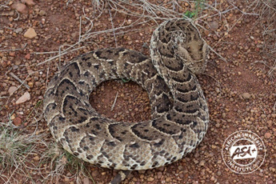
  <figcaption>Puff adder (<em>Bitis arietans</em>)</figcaption>
</figure>

<figure>
  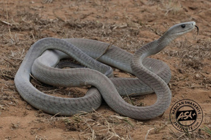
  <figcaption>Black mamba (<em>Dendroaspis polylepis</em>)</figcaption>
</figure>

<figure>
  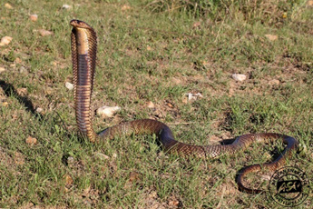
  <figcaption>Egyptian cobra (<em>Naja haje</em>)</figcaption>
</figure>

<figure>
  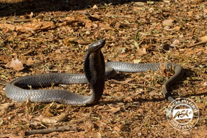
  <figcaption>Black-necked spitting cobra (<em>Naja nigricollis</em>)</figcaption>
</figure>

<figure>
  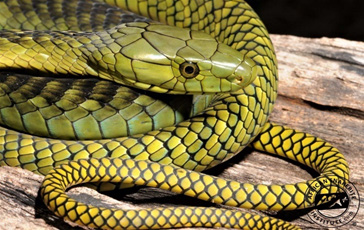
  <figcaption>Jameson’s mamba (<em>Dendroaspis jamesoni</em>)</figcaption>
</figure>

<figure>
  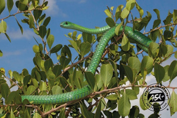
  <figcaption>Boomslang (<em>Dispholidus typus</em>)</figcaption>
</figure>

<figure>
  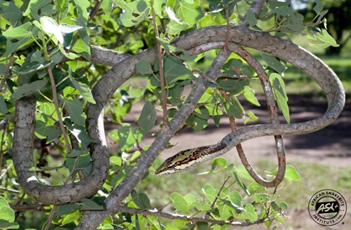
  <figcaption>Vine, bird, twig or tree snake (<em>Thelotornis spp.</em>)</figcaption>
</figure>

<figure>
  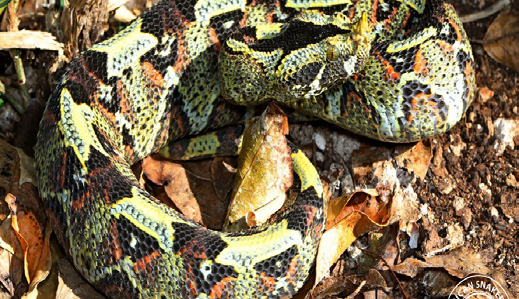
  <figcaption>Rhino-horned viper (<em>Bitis nasicornis</em>)</figcaption>
</figure>

<figure>
  
  <figcaption>Egyptian cobra (<em>Naja haje</em>)</figcaption>
</figure>

<figure>
  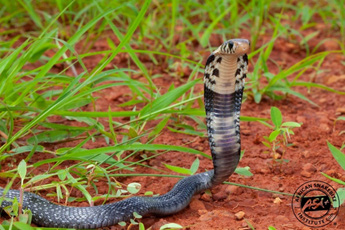
  <figcaption>Eastern forest cobra (<em>Naja subfulva</em>)</figcaption>
</figure>

<figure>
  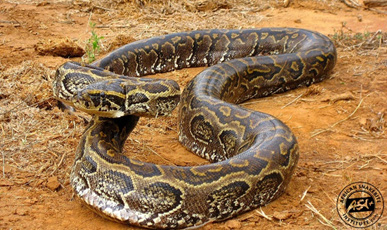
  <figcaption>Rock python (<em>Python sebae</em>)</figcaption>
</figure>

<figure>
  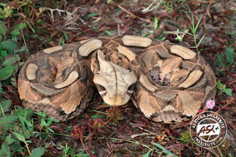
  <figcaption>Gaboon adder (<em>Bitis gabonica</em>)</figcaption>
</figure>

<figure>
  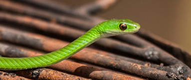
  <figcaption>Battersby’s green snake (<em>Philothamnus battersbyi</em>)</figcaption>
</figure>

<figure>
  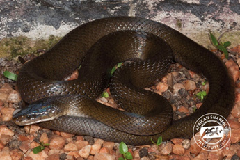
  <figcaption>Olive house snake (<em>Lycodonomorphis inornatus</em>)</figcaption>
</figure>

#### 1.2.1.2 Insect Bites & Stings

**1.2.1.2 Insect Bites & Stings**

ICD10 CODE: T63.4

Causes

- Bees, wasps, hornets and ants: venom is usually mild and

causes only local reaction but may cause anaphylactic shock in previously sensitized persons

- Spiders and scorpions: Most are non-venomous or only

mildly venomous Other stinging insectsClinical features

- Swelling, discolouration, burning sensation, pain at the site

of the sting

- There may be signs of anaphylactic shock. Differential diagnosis

- Allergic reaction

|MANAGEMENT|LOC|
|---|---|
|‰ If the sting remains implanted in the skin, carefully remove  with a needle or knife blade ‰ Apply cold water/ice If severe local reaction|HC2|

|MANAGEMENT|LOC|
|---|---|
|‰ Give chlorpheniramine 4 mg every 6 hours (max: 24 mg daily) until swelling subsides Child 1-2 years: 1 mg every 12 hours  Child 2-5 years: 1 mg every 6 hours (max: 6 mg daily) Child 6-12 years: 2 mg every 6 hours (max: 12 mg daily) ‰ Apply calamine lotion prn every 6 hours If very painful scorpion sting ‰ Infiltrate 2 ml of lignocaine 2% around the area of the bite If signs of systemic envenomation ‰ Refer|HC2|

Prevention

- Clear overgrown vegetation/bushes around the home

- Prevent children from playing in the bush

- Cover exposed skin while moving in the bush

- Use pest control methods to clear insect colonies.

#### 1.2.1.3 Animal and Human Bites

ICD10 CODE: W50.3, W54.0

Clinical features

- Teeth marks or scratches, lacerations

- Puncture wounds (especially cats)

- Complications: bleeding, lesions of deep structures, wound

infection (by mixed flora, anaerobs), tissue necrosis, transmission of diseases (tetanus, rabies, others)

|MANAGEMENT|LOC|
|---|---|
|First aid ‰ Immediately clean the wound thoroughly with plenty of  clean water and soap to remove any dirt or foreign bodies|HC2|

|MANAGEMENT|LOC|
|---|---|
|‰ Stop excessive bleeding where necessary by applying  pressure ‰ Rinse the wound and allow to dry ‰ Apply an antiseptic: Chlorhexidine solution 0.05% or  povidone iodine solution 10% ‰ Soak punture wounds in antiseptic for 15 minutes ‰ Thorough cleaning, exploration and debridement (under  local anesthesia if possible) As a general rule DO NOT SUTURE BITE WOUNDS ‰ Refer wounds on hands and face, deep wounds, wounds  with tissue defects to hospital for surgical management Tetanus prophylaxis ‰ Give TT immunisation (tetanus toxoid, TT 0.5 ml) if not  previously immunised within the last 10 years|HC2  HC4|
|Prophylactic antibiotics ‰ Indicated in the following situations:  - Deep puncture wounds (especially Cats) - Human bites - Severe (deep, extensive) wounds - Wounds on face, genitalia, hands - Wounds in immunicompromised hosts   ‰ Amoxicillin 500 mg every 8 hours for 5-7 days Child: 15 mg/kg per dose ‰ Plus Metronidazole 400 mg every 12 hours Child: 10-12.5 mg/kg per dose|HC2|
|Note  ƒ Do not use routine antibiotics for small uncomplicated dog bites/wounds|Note  ƒ Do not use routine antibiotics for small uncomplicated dog bites/wounds|

#### 1.2.1.4 Rabies Post Exposure Prophylaxis

ICD10 CODE: Z20.3, Z23

Z20.3, Z23

Post exposure prophylaxis effectively prevents the development of rabies after the contact with saliva of infected animals, through bites, scratches, licks on broken skin or mucous membranes. For further details refer to Rabies Post-Exposure Treatment Guidelines, Veterinary Public Health Unit, Community Health Dept, Ministry of Health, September 2001

General management Dealing with the animal

|TREATMENT|LOC|
|---|---|
|If the animal can be identified and caught ‰ If domestic, confirm rabies vaccination ‰ If no information on rabies vaccination or|HC2|
|If the animal can be identified and caught ‰ If domestic, confirm rabies vaccination ‰ If no information on rabies vaccination or  wild: quarantine for 10 days (only dogs, cats or endangered species) or kill humanely andsend the head to the veterinary Department for analysis  ƒ If no signs of rabies infection shown within 10 ƒ days: release the animal, stop immunisation ƒ If it shows signs of rabies infection: kill the animal,  remove its head, and send to the Veterinary Department for verification of the infection  If animal cannot be identified ‰ Presume animal infected and patient at risk|HC2|
|Notes  ƒ Consumption of properly cooked rabid meat is not harmful ƒ Animals at risk: dogs, cats, bats, other wild carnivores ƒ Non-mammals cannot harbour rabies|Notes  ƒ Consumption of properly cooked rabid meat is not harmful ƒ Animals at risk: dogs, cats, bats, other wild carnivores ƒ Non-mammals cannot harbour rabies|

**Dealing with the patient**

- The combination of local wound treatment plus passive immunisation with rabies immunoglobulin (RIG) plus vaccination with rabies vaccine (RV) is recommended for all suspected exposures to rabies

- if the RI is not available, the patient should still be vaccinated with the Rabies Vaccine alone

- Since prolonged rabies incubation periods are possible, persons who present for evaluation and treatment even months after having been bitten should be treated in the same way as if the contact occurred recently

- Administration of Rabies IG and vaccine depends on the type of exposure and the animal’s condition

|TREATMENT|LOC|
|---|---|
|‰ LOCAL WOUND TREATMENT: Prompt and thorough local treatment is an effective method to reduce risk of infection  ‰ For mucous mebranes contact, rinse throroughly with water or normal saline  

- if the wound is deep Tetanus Toxoid (TT) should be given as well to prevent tetanus|HC2|
|‰ Local cleansing is indicated even if the patient presents late ‰ DO NOT SUTURE THE WOUND  If Veterinary Department confirms rabies infection or if animal cannot be identified/tested  ‰ Give rabies vaccine+/- rabies immunoglobulin human as per the recommendations in the next table.|H|

**Recommendations for Rabies Vaccination/Serum**

| |Condition Of Animal|Condition Of Animal| |
|---|---|---|---|
|Nature Of Exposure|At Time Of Exposure|10 Days Later|Recommended Action|
|Saliva in contact with skin but no skin lesion|Healthy|Healthy|Do not vaccinate|
|Saliva in contact with skin but no skin lesion|Healthy|Rabid|Vaccinate|
|Saliva in contact with skin but no skin lesion|Suspect/ Unknown|Healthy|Do not vaccinate|
|Saliva in contact with skin but no skin lesion| |Rabid|Vaccinate|
|Saliva in contact with skin but no skin lesion| |Unknown|Vaccinate|
|Saliva in contact with skin that has lesions, minor bites on trunk or proximal limbs|Healthy|Healthy|Do not vaccinate|
|Saliva in contact with skin that has lesions, minor bites on trunk or proximal limbs|Healthy|Rabid|Vaccinate|
|Saliva in contact with skin that has lesions, minor bites on trunk or proximal limbs|Suspect/ unknown|Healthy|Vaccinate; but stop course if animal healthy after 10 days|
|Saliva in contact with skin that has lesions, minor bites on trunk or proximal limbs|Suspect/ unknown|Rabid|Vaccinate|
|Saliva in contact with skin that has lesions, minor bites on trunk or proximal limbs|Suspect/ unknown|Unknown|Vaccinate|
|Saliva in contact with mucosae, serious bites (face, head, fingers or multiple bites)|Domestic or wild rabid animal or suspect|Suspect|Vaccinate and give antirabies immunoglobulin|
| |Domestic or wild rabid animal or Suspect| |Vaccinate but stop course if animal healthy after 10 days|

Prevention

- Vaccinate all domestic animals against rabies e.g. dogs,

cats and others

**Administration of Rabies Vaccine (RV)**

The following schedules use Purified VERO Cell Culture Rabies Vaccine (PVRV), which contains one intramuscular immunising dose (at least 2.5 IU) in 0.5 ml of reconstituted vaccine.

|RV and RIG are both very expensive and should only be used when there is an absolute indication|
|---|

**Post-Exposure Vaccination in Non-Previously Vaccinated Patients**

Give RV to all patients unvaccinated against rabies together with local wound treatment. In severe cases, also give rabies immunoglobulin

|The 2-1-1 intramuscular regimen  This induces an early antibody response and may be particularly effective when post-exposure treatment does not include administration of rabies immunoglobulins  ‰ Day 0: One dose (0.5 ml) in right arm + one dose in left arm ‰ Day 7: One dose ‰ Day 21: One dose|
|---|
|Notes on IM doses  ƒ Doses are given into the deltoid muscle of the arm. In young children, the anterolateral thigh may also be used ƒ Never use the gluteal area (buttock) as fat deposits may interfere with vaccine uptake making it less effective.|
|Alternative: 2-site intradermal (ID) regimen ‰ This uses PVRV intradermal (ID) doses of 0.1 ml (i.e. one fifth  of the 0.5 ml IM dose of PVRV) ‰ Day 0: one dose of 0.1 ml in each arm (deltoid) ‰ Day 3: one dose of 0.1 ml in each arm|

|‰ Day 3: one dose of 0.1 ml in each arm ‰ Day 7: one dose of 0.1 ml in each arm ‰ Day 28: one dose of 0.1 ml in each arm  Notes on ID regime  ƒ Much cheaper as it requires less vaccine ƒ Requires special staff training in ID technique using 1 ml syringes  and short needles|
|---|
|ƒ Compliance with the Day 28 is vital but may be difficult to achieve ƒ Patients must be followed up for at least 6-18 months to confirm the outcome of treatment ƒ If on malaria chemoprophylaxis, do NOT use.|

**Post-exposure immunisation in previously vaccinated patients**

In persons known to have previously received full pre- or post-exposure rabies vaccination within the last 3 years

|Intramuscular regimen  ‰ Day 0: One booster dose IM ‰ Day 3: One booster dose IM|
|---|
|Intradermal regimen  ‰ Day 0: One booster dose ID ‰ Day 3: One booster dose ID|
|Note  ƒ If incompletely vaccinated or immunosuppressed: give full post exposure regimen.|

Passive immunisation with rabies immunoglobulin (RIG) Give in all high-risk rabies cases irrespective of the time between exposure and start of treatment BUT within 7 days of first vaccine.DO NOT USE in patient previously immunised.

**Human rabies immunoglobulin (HRIG)**

|‰ HRIG 20 IU/kg (do not exceed)  - Infiltrate as much as possible of this dose around the wound/s (if multiple wounds and insufficient quantity, dilute it 2 to 3 fold with normal saline) - Give the remainder IM into gluteal muscle |
|---|
|- Follow this with a complete course of rabies vaccine - The first dose of vaccine should be given at the same time as the immunoglobulin, but at a site as far away as possible from the site where the vaccine was injected. If the bite is at or near the upper arm, do not infiltrate the wound with the immunoglobulin unless the vaccine won’t be injected in the deltoid muscle of that arm. If the wound near the deltoid is infiltrated with the immunoglobulin, use the deltoid muscle of the opposite arm for the vaccine”. |

|Notes ƒ If RIG not available at first visit, its administration can be delayed  up to 7 days after the first dose of vaccine.|
|---|

Pre-exposure immunisation Offer rabies vaccine to persons at high risk of exposure such as: ‰ Laboratory staff working with rabies virus ‰ Veterinarians ‰ Animal handlers ‰ Zoologists/wildlife officers ‰ Any other persons considered to be at high risk

|‰ Day 0: One dose IM or ID ‰ Day 7: One dose IM or ID ‰ Day 28: One dose IM or ID|
|---|

#### 1.2.1.5 Rabies Vaccine Schedules

### Intramuscular Regimen

|DAY|Vaccine Dose|No. of Doses|Comments|
|---|---|---|---|
|Intramuscular Regimen|Intramuscular Regimen|Intramuscular Regimen|Intramuscular Regimen|
|0|0.5ml|2 (one in each deltoid)|Into the deltoid muscle NEVER IN THE GLUTEAL MUSCLE (buttocks) Children with less muscle mass: Anterolateral aspect of the thigh Note: Day 14 is skipped The 2:1:1 regimen uses 4doses in 3weeks It has fewer patient appointments and it is easy to comply with  If the patient is on anti-malarial prophylaxis with Chloroquine, it should be withheld and an alternative malaria prophylaxis should be started if needed.|
|7|0.5ml|1|Into the deltoid muscle NEVER IN THE GLUTEAL MUSCLE (buttocks) Children with less muscle mass: Anterolateral aspect of the thigh Note: Day 14 is skipped The 2:1:1 regimen uses 4doses in 3weeks It has fewer patient appointments and it is easy to comply with  If the patient is on anti-malarial prophylaxis with Chloroquine, it should be withheld and an alternative malaria prophylaxis should be started if needed.|
|21|0.5ml|1|Into the deltoid muscle NEVER IN THE GLUTEAL MUSCLE (buttocks) Children with less muscle mass: Anterolateral aspect of the thigh Note: Day 14 is skipped The 2:1:1 regimen uses 4doses in 3weeks It has fewer patient appointments and it is easy to comply with  If the patient is on anti-malarial prophylaxis with Chloroquine, it should be withheld and an alternative malaria prophylaxis should be started if needed.|
|2-site Intradermal (ID) Regimen|2-site Intradermal (ID) Regimen|2-site Intradermal (ID) Regimen|2-site Intradermal (ID) Regimen|
|0|0.1ml|2 (one in each deltoid)|It is cheaper since it uses less drug It requires special staff training in ID technique using 1ml syringes with shorter needles Note: Days 14 and 21 are skipped|
|3|0.1ml|2 (one in each deltoid)|It is cheaper since it uses less drug It requires special staff training in ID technique using 1ml syringes with shorter needles Note: Days 14 and 21 are skipped|
|7|0.1ml|2 (one in each deltoid)|It is cheaper since it uses less drug It requires special staff training in ID technique using 1ml syringes with shorter needles Note: Days 14 and 21 are skipped|
|28|0.1ml|2 (one in each deltoid)|It is cheaper since it uses less drug It requires special staff training in ID technique using 1ml syringes with shorter needles Note: Days 14 and 21 are skipped|
|Rabies Immunoglobulin|Rabies Immunoglobulin|Rabies Immunoglobulin|Rabies Immunoglobulin|

|DAY|Vaccine Dose|No. of Doses|Comments|
|---|---|---|---|
|DAYS|Immunoglobulin dose|Number of doses|Comments|
|0|20IU/ kg|Infiltrate in the area around and in the wound at the same depth as the wound|The Immunoglobulin should be administered as far as possible from the vaccine to avoid antibody-antigen reaction|

### 1.2.2 Fractures

ICD10 CODE: S00–T88

- Trauma e.g. road traffic accident, assault, falls, sports

- Bone weakening by disease, e.g., cancer, TB, osteomyeli-

tis, osteoporosis Clinical features

- Pain, tenderness, swelling, deformity

- Inability to use/move the affected part

- May be open (with a wound) or closed Differential diagnosis

- Sprain, dislocations

- Infection (bone, joints and muscles)

- Bone cancer

Investigations  X-ray: 2 views (AP and lateral) including the joints above and below Management Suspected fractures should be referred to HC4 or Hospital after initial care.

|TREATMENT|LOC|
|---|---|
|If polytrauma ‰ Assess and manage airways ‰ Assess and treat shock (see section 1.1.2) Closed fractures ‰ Assess nerve and blood supply distal to the injury: if  no sensation/pulse, refer as an emergency ‰ Immobilise the affected part with a splint ‰ Apply ice or cold compresses ‰ Elevate any involved limb|HC2|
|‰ Give Tetanus Toxoid if not fully vaccinated ‰ Start antibiotic  - Amoxicillin 500 mg every 8 hours - Child: 25 mg/kg every 8 hours (or 40 mg/kg every 12 hours)   If severe soft tissue damage ‰ Add gentamicin 2.5 mg/kg every 8 hours ‰ Refer URGENTLY to hospital for further management|HC3|
|Note  ƒ Treat sprains, strains and dislocations as above  Note  ƒ Treat sprains, strains and dislocations as above|Note  ƒ Treat sprains, strains and dislocations as above  Note  ƒ Treat sprains, strains and dislocations as above|
|Caution ƒ Do not give pethidine and morphine for rib fractures and head  injuries as they cause respiratory depression|Caution ƒ Do not give pethidine and morphine for rib fractures and head  injuries as they cause respiratory depression|

### 1.2.3 Burns

ICD10 CODE: T20–T25

Causes

- Thermal, e.g., hot fluids, flame, steam, hot solids, sun

- Chemical, e.g., acids, alkalis, and other caustic chemicals

- Electrical, e.g., domestic (low voltage) transmission lines

(high voltage), lightening

- Radiation, e.g., exposure to excess radiotherapy or radioactive materials

Clinical features

- Pain, swelling

- Skin changes (hyperaemia, blisters, singed hairs)

- Skin loss (eschar formation, charring)

- Reduced ability to use the affected part

- Systemic effects in severe/extensive burns include shock,

low urine output, generalised swelling, respiratory insufficiency, deteriorated mental state

- Breathing difficulty, hoarse voice and cough in smoke inhalation injury – medical emergency

Criteria for classification of the severity of burns The following criteria are used to classify burns:

|CRITERIA|LEVEL|
|---|---|
|Depth of the burn (a factor of temperature, of agent, and of duration of contact with the skin)|1st Degree burns|
|Depth of the burn (a factor of temperature, of agent, and of duration of contact with the skin)|Superficial epidermal injury with no blisters. Main sign is redness of the skin, tenderness, or hyper sensitivity with intact two-point discrimination. Healing in 7 days|

|CRITERIA|LEVEL|
|---|---|
| |2nd Degree burns or Partial thickness burns It is a dermal injury that is sub-classified as superficial and deep 2nd degree burns. In superficial 2nd degree burns, blisters result, the pink moist wound is painful. A thin eschar is formed. Heals in 10-14 days. In deep 2nd degree burns, blisters are lacking, the wound is pale, moderately painful, a thick escar is formed. Heals in >1 month, requiring surgical debridement|
| |3rd Degree burns  Full thickness skin destruction, leather- like rigid eschar. Painless on palpation or pinprick. Requires skin graft.  4th Degree burns Full thickness skin and fascia, muscles, or bone destruction. Lifeless body part|
|Percentage of total body surface area (TBSA)|Small areas are estimated using the open palm of the patient to represent 1% TBSA. Large areas estimated using the “rules of nines” or a Lund-Browder chart. Count all areas except the ones with erythema only|
|The body parts injured|Face, neck, hands, feet, perineum and major joints burns are considered severe|
|Age/general condition|In general, children and the elderly fare worse than young adults and need more care. A person who is sick or debilitated at the time of the burn will be more affected than one who is healthy|

Categorisation of severity of burns Using the above criteria, a burn patient may be categorised as follows:

|SEVERITY|CRITERIA|
|---|---|
|Minor/mild burn|- Adult with <15% TBSA affected or - Child/elderly with <10% TBSA affected or - Full thickness burn with <2% TBSA affected and no serious threat to function |
|Minor/mild burn|- Adult with <15% TBSA affected or - Child/elderly with <10% TBSA affected or - Full thickness burn with <2% TBSA affected and no serious threat to function |
|Moderate (intermediate) burn|Adult with partial thickness burn 15- 25% TBSA or Child/elderly with partial thickness burn 10-20% TBSA All above with no serious threat to function and no cosmetic impairment of eyes, ears, hands, feet or perineum|
|Major (severe) burn|Adult with  - Partial thickness burn >25% TBSA or - Full thickness burn >10% TBSA   Child/elderly with  - Partial thickness burn >20% TBSA or full  thickness burn of >5% TBSA affected Irrespective of age  - Any burns of the face and eyes, neck, ears, hand, feet, perineum and major joints with cosmetic or functional impairment risks, circumferential burns - Chemical, high voltage, inhalation burns - Any burn with associated major trauma |

Chart for Estimating Percentage of Total Body Surface Area (TBSA) Burnt LUND AND BROWDER CHARTS Ignore simple erythema Superficial Deep

|Region|%|
|---|---|
|Head| |
|Neck| |
|Region|%|
|Ant. Trunk| |
|Post. Trunk| |
|Right Arm| |
|Left Arm| |
|Buttocks| |
|Genitalia| |
|Right Leg| |
|Left Leg| |
|Total Burn| |

Relative percentage of body surface area affected by growth

|Area|Age 0|1|5|10|15|Adult|
|---|---|---|---|---|---|---|
|A = ½ of head|9½|8½|6½|5½|4½|3½|
|B = ½ of one thigh|2¾|3¼|4|4½|4½|4¾|
|C = ½ of one lower leg|2½|2½|2¾|3|3¼|3½|

Management

|TREATMENT|LOC|
|---|---|
|Mild/moderate burns – First aid ‰ Stop the burning process and move the patient to safety ‰ Roll on the ground if clothing is on fire|HC1|

Management

|TREATMENT|LOC|
|---|---|
|‰ Switch off electricity  ‰ Cool the burn by pouring or showering or soaking the affected area with cold water for 30 minutes, especially in the first hour after the burn (this may reduce the depth of injury if started immediately)  ‰ Remove soaked clothes, wash off chemicals, remove any  constrictive clothing/rings ‰ Clean the wound with clean water ‰ Cover the wound with a clean dry cloth and keep the  patient with warm|HC1|
|At health facility ‰ Give oral or IV analgesics as required ‰ If TBSA <10% and patient able to drink, give oral fluids  otherwise consider IV ‰ Give TT if not fully immunised  ‰ Leave small blisters alone, drain large blisters and dress if closed dressing method is being used the urine output. The normal urine output is: Children (<30 kg) 1-2 ml/kg/ hour and adults 0.5 ml/kg/hour (30-50 ml /hour)|HC2|
|‰ Dress with silver sulphadiazine cream 1%, add saline moistened gauze or paraffin gauze and dry gauze on top to prevent seepage  ‰ Small superficial 2nd degree burns can be dressed directly  with paraffin gauze dressing ‰ Change after 1-3 days then prn ‰ Patient may be exposed in a bed cradle if there are ex-  tensive burns ‰ Saline bath should be done before wound dressing|HC3|

|TREATMENT|LOC|
|---|---|
|‰ If wound infected dress more frequenly with silver sulphad-  iazine cream until infection is controlled. Severe burns ‰ First aid and wound management as above PLUS ‰ Give IV fluid replacement in a total volume per 24 hours  according to the calculation in the box below (use crystalloids, i.e., Ringer’s lactate, or normal saline)  ‰ If patient in shock, run the IV fluids fast until BP improves  (see section 1.1.2) ‰ Manage pain as necessary ‰ Refer for admission ‰ Monitor vital signs and urine output ‰ Use antibiotics if there are systemic signs of infection:  benzylpenicillin 3 MU every 6 hours  +/- gentamicin 5-7 mg/kg IV or IM once a day ‰ Blood transfusion may be necessary ‰ If signs/symptoms of inhalation injury, give oxygen and  refer for advanced life support (refer to regional level) Surgery ‰ Escharotomy and fasciotomy for circumferential finger,  hand, limb or torso burns ‰ Escharectomy to excise dead skin ‰ Skin grafting to cover clean deep burn wounds Eye injury ‰ Irrigate with abundant sterile saline ‰ Place eye pad over eye ointment and refer|HC3 HC4   H|

|TREATMENT|LOC|
|---|---|
|Additional care ‰ Nutritional support ‰ Physiotherapy of affected limb| |
|‰ Counselling and psychosocial support ‰ Health education on prevention (e.g. epilepsy control)| |
|Caution ‰ Silver sulphadiazine contraindicated in pregnancy, breast-  feeding and premature babies| |

Fluid replacement in burns

- The objective is to maintain normal physiology as shown by

urine output, vital signs and mental status

- Fluid is lost from the circulation into the tissues surrounding the burns and some is lost through the wounds, especially in 18-30 hours after the burns

- Low intravascular volume results in tissue circulatory insufficiency (shock) with results such as kidney failure and deepening of the burns

- The fluid requirements are often very high and so should be given as necessary to ensure adequate urine output

|TREATMENT|LOC|
|---|---|
|‰ Give oral fluids (ORS or others) and/or IV fluids e.g. normal saline or Ringer’s Lactate depending on the degree of loss of intravascular fluid  V The total volume of IV solution required in the first 24 hours of the burns is:  4 ml x weight (kg) x % TBSA burned plus the normal daily fluid requirement ‰ Give 50% of fluid replacement in the first 8 hours and 50%  in the next 16 hours. The fluid input is balanced against|HC2 HC3|

Prevention

- Public awareness of burn risks and first aid water use in

cooling burnt skin

- Construction of raised cooking fire places as safety measure

- Ensure safe handling of hot water and food, keep well out of the reach of children

- Particular care of high risk persons near fires e.g. children, epileptic patients, alcohol or drug abusers

- Encourage people to use closed flames e.g. hurricane lamps. Avoid candles.

- Beware of possible cases of child abuse

### 1.2.4 Wounds

ICD10 CODE: S00–T88

Any break in the continuity of the skin or mucosa or disruption in the integrity of tissue due to injury.

Causes

- Sharp objects, e.g. knife, causing cuts, punctures

- Blunt objects causing bruises, abrasions, lacerations

- Infections, e.g. abscess

- Bites, e.g. insect, animal, human

- Missile and blast injury, e.g. gunshot, mines, exlosives,

landmines

- Crush injury, e.g. RTA, building collapse Clinical features

- Raw area of broken skin or mucous membrane

- Pain, swelling, bleeding, discharge

- Reduced use of affected part

- Cuts: sharp edges

- Lacerations: Irregular edges

- Abrasions: loss of surface skin

- Bruises: subcutaneous bleeding e.g. black eye Management

|TREATMENT|LOC|
|---|---|
|Minor cuts and bruises ‰ First aid, tetanus prophylaxis, dressing and pain man-  agement ‰ Antibiotics are not usually required but if the wound is grossly contaminated, give  - Cloxacillin or amoxicillin 500 mg every 6 hours - as empiric treatment   Child: 125-250 mg every 6 hours|HC2|
|Deep and/or extensive ‰ Identify the cause of the wound or injury if possible ‰ Wash affected part and wound with plenty of water or  saline solution  - (you can also clean with chlorhexidine 0.05% - or hydrogen peroxide 6% diluted with equal amount of saline to 3% if wound is contaminated)   ‰ Explore the wound under local anesthesia to ascertain the extent of the damage and remove foreign bodies  ‰ Surgical toilet: carry out debridement to freshen the wound ‰ Tetanus prophylaxis, pain management, immobilization|HC4|

|TREATMENT|LOC|
|---|---|
|If wound is clean and fresh (<8 hours) ‰ Carry out primary closure by suturing under local anaes-  thetic  - Use lignocaine hydrochloride 2% (dilute to 1% with equal volume of water for injection)|HC3|
|If wound is >8 hours old or dirty ‰ Clean thoroughly and dress daily f Check the state of  the wound for 2-3 days f Carry out delayed primary closure if clean  - Use this for wounds up to 2-4 days old If wound >4 days old or deep pucture wound, contaminated wounds, bite/gunshot wounds, abscess cavity  ‰ Let it heal by secondary closure (granulation tissue) ‰ Dress daily if contaminated/dirty, every other day if clean ‰ Pack cavities (e.g. abscesses) with saline-soaked gauzes In case of extensive/deep wound ‰ Consider closure with skin graft/flap| |
|Note  

- Use SOP for collection of wound discharge, or deep tissue, submit to lab  

- Start on treatment, change treatment when results return  

- If MDR, gramnegative or MRSA or VRE impleme the respective transmission-based precautions.  

- Where can, use chlorine release for environmental decontamination or alternate fumigation (not formaldehyde)| |

### 1.2.5 Head Injuries

## 1.2.5 Head Injuries

ICD10 CODE: S00–S09

- Direct damage to the brain (contusion, concussion, penetrating injury, diffuse axonal damage)

- Haemorrhage from rupture of blood vessels around and in the brain

- Severe swelling of the cerebral tissue (cerebral oedema)

**Causes**

- Road traffic accident

- Assault, fall or a blow to the head Clinical features

- May be closed (without a cut) or open (with a cut)

- Swelling on the head (scalp hematoma)

- Fracture of the skull, e.g., depressed area of the skull, open

fracture (brain matter may be exposed)

- Racoon eyes (haematoma around the eyes), bleeding and/ or leaking of CSF through nose, ears – signs of possible skull base fracture

Severe head injury

- Altered level of consciousness, agitation, coma (see GCS

below)

- Seizures, focal neurological deficits, pupil abnormalities

Minor head injury (concussion)

- Transient and short lived loss of mental function, e.g., loss

of consciousness (<5 minutes), transient amnesia, headache, disorientation, dizziness, drowsiness, vomiting

- symptoms should improve by 4 hours after the trauma

**Severity classification of head injuries Head injuries are classified based on Glasgow Coma Scale (GCS) score as:**

- Severe (GCS 3-8)

- Moderate ( GCS 9-13)

- Mild (GCS > 13)

Glasgow Coma Scale (GCS)

|Eye Opening|Verbal Response|Motor Response|
|---|---|---|
|1 = No response 1 = No response|1 = No response 1 = No response|1 = No response|
|2 = Open in response to pain|2 = Incomprehensible sounds (grunting in children)|2= Extension to painful stimuli (decerebrate)|
|3 = Open in response to voice|3 = Inappropriate words (cries and screams/ cries inappropriately in children)|3 = Abnormal flexion to painful stimuli (decorticate)|
|4 = Open spontaneously|4 = Disoriented able to converse (use words inappropriately / cries in children)|4 = Flexion/ withdrawal from painful stimuli|
|NA|5 = Oriented able to converse (use words appropriately/ cries appropriately in children)|5 = Localize pain|
|NA| |6 = Obeys command (NA in children <1 yr)|

For infants and children use AVPU

|A|Alert|GCS >13|
|---|---|---|
|V|Responds to voice|GCS 13|

|P|Responds to pain|GCS 8|
|---|---|---|
|U|Unresponsive|GCS <8|

**Note**

Mild injuries can still be associated with significant brain damage and can be divided into low and high risk according to the following criteria:

| Low Risk Mild Head Injury | High Risk Mild Head Injury |
|---------------------------|-----------------------------|
| - GCS 15 at 2 hours - No focal neurological deficits - No signs/symptoms of skull fracture - No recurrent vomiting - No risk factors (age >65 years, bleeding disorders, dangerous mechanism) - Brief LOC (<5 minutes) and post traumatic amnesia (<30 minutes) | - GCS <15 at 2 hours - Deterioration of GCS - Focal neurological deficits - Clinical suspicion of skull fracture - Recurrent vomiting - Known bleeding disorder - Age >65 years - Post traumatic seizure - LOC >5 minutes - Persistent amnesia - Persistent abnormal behaviour - Persistent severe headache |

Investigations ¾ Skull X ray useful only to detect fracture ¾ CT scan is the gold standard for detection of head injury

**Differential diagnosis**

- Alcoholic coma - may occur together with a head injury

- Hypoglycaemia

- Meningitis

- Poisoning

- Other cause of coma

Management (general principles) Management depends on:

- GCS and clinical features at first assessment

- Risk factors (mechanism of trauma, age, baseline conditions)

- GCS and clinical features at follow up

|TREATMENT|LOC|
|---|---|
|‰ Assess mechanism of injury to assess risks of severe injury (which may not be apparent at the beginning)  ‰ Assess medical history to assess risk of complication  (e.g., elderly, anticoagulant treatment etc.) ‰ Assess level of consciousness using GCS or AVPU ‰ Perform general (including ears) and neurological exami-  nation (pupils, motor and sensory examination, reflexes)  - Assess other possible trauma especially if road traffic accident, e.g., abdominal or chest trauma ‰ DO NOT SEDATE. Do NOT give opioids ‰ Do NOT give NSAIDs (risk of bleeding)|HC3|

|Low Risk Mild Head Injury|High Risk Mild Head Injury|
|---|---|
|

- No persistent headache 

- No large haematoma/ laceration

- Isolated head injury

- No risk of wrong information|

- Large scalp haematoma

- Polytrauma

- Dangerous mechanism (fall from height, car crash etc.) 

- Unclear information|

|TREATMENT|LOC|
|---|---|
|‰ >90 mmHg ‰ Monitor GCS, pupils and neurological signs|H|
|‰ Early CT if available, otherwise observe and refer immediately if not improving in the following hours| |

**Management of severe traumatic head injury**

|TREATMENT|LOC|
|---|---|
|‰ Early CT if available, otherwise observe and refer immediately if not improving in the following hours Refer immediately for specialist management f Supportive care as per moderate head injury f If open head injury, give first dose of antibiotic prereferral  - Ceftriaxone 2 g IV Child: 100 mg/kg|NR|

Prevention

- Careful (defensive) driving to avoid accidents

- Use of safety belts by motorists

- Wearing of helmets by cyclists, motor-cyclists and people

working in hazardous environments

- Avoid dangerous activities (e.g., climbing trees) 1.2.5.1 Traumatic Spinal Injury

Early recognition of spinal injury. Immobilizations with a rigid cervical collar or thoracolumbar corset to prevent further nerve damage.

Decompression: Non operative Skull traction, Skin traction of lower limbs Operative e.g., discectomy, anterior or posterior spinal decompression surgery 59

#### 1.2.5.1 Traumatic Spinal Injury

## 1.2.5.1 Traumatic Spinal Injury

Early recognition of spinal injury.

Immobilizations with a rigid cervical collar or thoracolumbar corset to prevent further nerve damage.

**Decompression**

- Non operative: Skull traction, skin traction of lower limbs 

- Operative e.g., discectomy, anterior or posterior spinal decompression surgery

### 1.2.6 Sexual Assault/Rape

ICD10 CODE Z04.4

Rape is typically defined as oral, anal or vaginal penetration that involves threats or force against an unwilling person.

Such penetration, whether wanted or not, is considered statutory rape if victims are younger than the age of consent (18 years).

Sexual assault or any other sexual contact that results from coercion is rape, including seduction of a child through offers of affection or bribes; it also includes being touched, grabbed, kissed or shown genitals.

Clinical features Rape may result in the following: Management of mild traumatic head injury

|TREATMENT|LOC|
|---|---|
|‰ First aid if necessary ‰ Mild analgesia if necessary e.g. paracetamol ‰ Observe for at least 4-6 hours, monitor GCS and neuro-  logical symptoms If low risk (see above) ‰ Discharge on paracetamol ‰ Advise home observation and return to the facility in case  of any change If high risk ‰ Monitor for 24 hours ‰ Refer immediately if GCS worsens or other clinical signs  appear/persist  ‰ If patient is fine at the end of observation period, send home with instructions to come back in case of any problem (severe headache, seizures, alteration of consciousness, lethargy, change in behaviour etc.)|HC3|

- Extragenital injury

- Genital injury (usually minor, but some vaginal lacerations

can be severe)

- Psychologic symptoms: often the most prominent

- - Short term: fear, nightmares, sleep problems, anger, embarrassment

- - Long term: Post traumatic Stress Disorder, an anxiety

- - disorder; symptoms include re-experiencing (e.g., flashbacks, intrusive upsetting thoughts or images), avoidance (e.g., of trauma-related situations, thoughts, and feelings) and hyperarousal (e.g., sleep difficulties, irritability, concentration problems).

- - Symptoms last for >1 month and significantly impair social and occupational functioning.

- - Shame, guilt or a combination of both

- - Sexually transmitted infections (STIs, e.g., hepatitis, syphilis, gonorrhea, chlamydial infection, trichomoniasis, HIV infection)

- Pregnancy (may occur)

|Note  ƒ Headaches and dizziness following mild traumatic brain injury may persist for weeks/months|
|---|

Management of moderate traumatic head injury

|TREATMENT|LOC|
|---|---|
|‰ Refer to hospital for appropriate management ‰ Careful positioning (head 300 up) ‰ Use fluids with caution ‰ Keep oxygen saturation >90% and systolic BP|H|

**Investigations**

 Pregnancy test  HIV, hepatitis B and RPR tests

**Management**

Whenever possible, assessment of a rape case should be done by a specially trained provider. Victims are traumatized so should be approached with empathy and respect. Explain and ask consent for every step undertaken.

The goals are:

- Medical assessment and treatment of injuries

- Assessment, treatment and prevention of pregnancy and

STIs Collection of forensic evidence

- Psychologic evaluation and support

|TREATMENT|LOC|
|---|---|
|‰ Advise not to throw out or change clothing, wash, shower, douche, brush their teeth or use mouthwash; doing so may destroy evidence|HC2|
|‰ Initial assessment (history and examination) – use standard forms if available  - Type of injuries sustained (particularly to the - mouth, breasts, vagina and rectum) - Any bleeding from or abrasions on the patient or assailant (to help assess the risk of transmission of HIV and hepatitis) - Description of the attack (e.g., the orifices which - were penetrated, whether ejaculation occurred, or whether a condom was used) |HC4|

|TREATMENT|LOC|
|---|---|
|- Assailant’s use of aggression, threats, weapons - and violent behavior - Description of the assailant - Use of contraceptives (to assess risk of pregnancy), previous coitus (to assess validity of sperm testing) - Clearly describe size, extent, nature of any injury. - If possible take photos of the lesions (with patient’s consent) |HC4|
|‰ Test for HIV, RPR, hepatitis B and pregnancy, to assess baseline status of the patient  - If possible test for flunitrazepam and gamma hydroxybutyrate (”rape drugs”)|HC4|
|‰ Collect forensic evidence (with standard kits if available)  - Condition of clothing (e.g., damaged, stained, - adhering foreign material) - Small samples of clothing including an unstained sample, given to the police or laboratory - Hair samples, including loose hairs adhering to - the patient or clothing, semen-encrusted pubic hair, and clipped scalp and pubic hairs of the patient (at least 10 of each for comparison) - Semen taken from the cervix, vagina, rectum, mouth and thighs - Blood taken from the patient - Dried samples of the assailant’s blood taken from the patient’s body and clothing - Urine, saliva - Smears of buccal mucosa - Fingernail clippings and scrapings - Other specimen as indicated by the history or physical examination | |

|TREATMENT|LOC|
|---|---|
|‰ Prophylaxis for STD including:  - Ceftriaxone 1g IM or cefixime 400 mg orally stat - Azithromycin 1 g stat or doxycycline 100 mg - twice a day for 1 week - Metronidazole 2 g stat - HIV Post Exposure Prophylaxis if within 72 hours:   Adults : TDF+3TC+ATV/r for 28 days Children: ABC+3TC+LPV/r ‰ Hepatitis B vaccine if not already immunised ‰ Emergency contraception if within 72 hours (but may  be useful up to 5 days after)  - Levonorgestrel 1.5 mg (double the dose if patient is HIV positive on ARVs)|HC4|
|‰ Counselling: use common sense measures (e.g., reassurance, general support, non-judgmental attitude) to relieve strong emotions of guilt or anxiety  ‰ Provide links and referral to:  - Long-term psycho-social support - Legal counseling - Police investigations, restraining orders - Child protection services - Economic empowerment, emergency shelters - Long-term case management | |
|Notes  ƒ Because the full psychologic effects cannot always be ascertained at the first examination, follow-up visits should be scheduled at 2 weeks intervals  ƒ Reporting: Health facilities should use HMIS 105 to report Gender-Based Violence (GBV)| |

|TREATMENT|LOC|
|---|---|
|Harm classification for police reporting

- Harm: any body hurt, disease or disorders,  whether permanent or temporary  

- Grievous harm: any harm which amounts to a main or dangerous harm, or seriously or permanently injures health, or causes permanent disfigurement or any permanent injeury to any internal or external organ, membrane or sense  

- Dangerous harm: means harm endangering life

- ”Main” means the destruction or permanent disabling of any external membrane or sense| |
