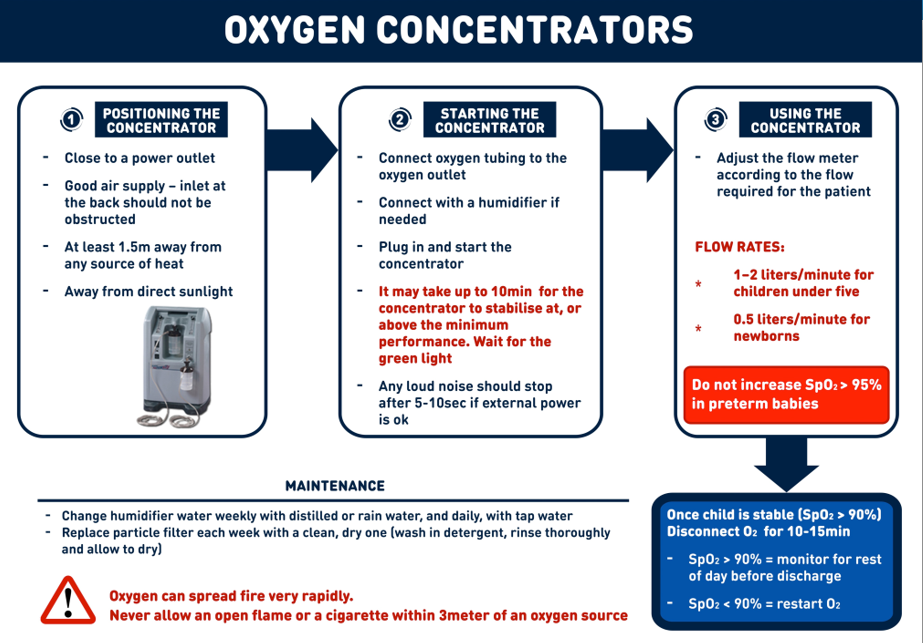
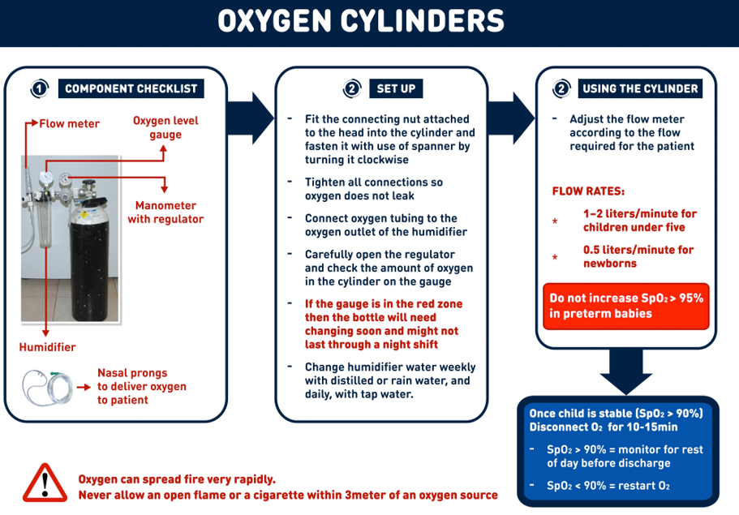

# Chapter 1: Emergencies and Trauma

## 1.4 HYPOXEAMIA MANAGEMENT AND OXYGEN THERAPY GUIDELINES

Hypoxaemia is the low concentration of Oxygen in blood or oxygen saturation (SpO2) less than 90% in peripheral arterial blood detected on pulse oximeter reading. Hypoxaemia is a life-threatening condition correlated with disease severity and an emergency stat. Left untreated and for prolonged periods of time, it results into low tissue oxygen concentration (Hypoxia), and this leads to death.

Causes

- Surgical causes.

- - Head Injury, Chest trauma

- Medical Causes

- - Severe Asthma, Pneumonia, Sepsis, Shock, Malaria, Covid-19, Heart Failure, Cardiac arrest, Upper airway obstruction, Severe anaemia, Pertussis, Carbon Monoxide poisoning.

- Obstetric, gynaecological, and perioperative causes.

- Obstructed labour, Ruptured uterus, Pre-eclampsia and

eclampsia, Post caesarean section,

- Neonatal causes

- Transient tachypnoea of the new-born, Hypoxic Ischaemic encephalopathy (Birth asphyxia), Respiratory distress Syndrome, Neonatal Septicaemia.

Diagnosis  Do a clinical assessment (history taking for symptoms and physical

examination for signs)

 Pulse oximetry and blood gas analysis. The findings on clinical assessment (symptoms and signs) [It is non-invasive but associated with missed opportunities for diagnosis].

Symptoms

ƒ Fast/very slow breathing, Difficulty in breathing, ƒ Inability to talk, complete sentences ƒ Extreme weakness ƒ Inability to feed ƒ Confusion, sleepy, agitated ƒ Convulsions

Clinical Features Fast breathing rate for age (Tachypnoea)

|Rate|Age|Implication|
|---|---|---|
|> 60 bpm|0 – 2months|Tachypnoea|
|> 50 bpm|2-12 months|Tachypnoea|
|> 40bpm|12- 59 months|Tachypnoea|
|> 40bpm|5-12years|Tachypnoea|
|> 20bpm|Adults|Tachypnoea|

Note: bpm = Breaths per minute  Nasal flaring  Head nodding  Chest in drawing (Intercostal, subcostal recession)  Cyanosis (peripheral or central)  Prostration  Glasgow coma scale< 10/15  Use of any accessory muscles of respiration

Management

- Pulse oximetry use. Always refer to the manufacturer’s in-

sert or the steps outlined below for guidance on how to use the pulse oximetera.

- The steps involved in conducting pulse-oximetry ‰ Turn on the Pulse oximeter. ‰ Attach the Oximeter probe to the finger or toe. ‰ Wait until there is a consistent pulse -wave signal before you take

the reading, this may take 20-30 seconds. ‰ Record the reading and act accordingly.

- Interpreting pulse-oximetry results

‰ SpO2 > 90% without danger signs = Normal ‰ SpO2 < 90% =Low oxygen concentration in blood (Hypoxaemia) ‰ SpO2 <92- 95% in Pregnancy = Low oxygen concentration in

blood (Hypoxaemia) ‰ SpO2 < 94 % with danger signs = Low oxygen concentration in blood (Hypoxaemia

Blood gas analysis-direct measurement of the partial pressure of oxygen (Pao2) and Carbon dioxide (PC02) 2, the PH and electrolytes concentration in blood. It is the most accurate, but it is highly skill dependant, expensive and invasive.

Treatment Oxygen therapy

The treatment of hypoxaemia includes the use of Medical Oxygen (Oxygen therapy) and specifically treating the underlying cause.

Indications

- All patients with documented Hypoxaemia-arterial Carbon-

dioxide tension (Paco2) of < 60 mmHg or peripheral arterial oxygen saturation (SpO2) OF < 90%.

- Patients with the following danger/emergency signs irrespective of the documented SpO2, PaCO2.

- Absent or obstructed breathing, Features of severe respiratory distress, Central cyanosis, Convulsions, Signs of shock, Coma

- All acute conditions in which Coma is suspected like:

- Acute Asthma, Severe Trauma, Acute myocardial Infarc-

tion, Carbon monoxide poisoning

- Post anaesthesia recovery.

- Increased metabolic demand

- Severe burns, Poisoning, Multiple injuries, Severe infec-

tions

Medical Oxygen dosing and appropriate use of delivery device.

- The dosing of oxygen is dependent on the age of the patient and severity of disease while the choice of appropriate delivery devices depends on the amount or dose of oxygen to be delivered to a patient.

Titrate oxygen based on oxygen saturation and delivery device.

|Delivery device|Neonates|Infants (1month  -1yr)|Preschool age (1-3 yrs.)|School age (4 yrs. above)|Adults|Comments|
|---|---|---|---|---|---|---|
|Nasal Canulae|0.5– 1.0 L/ min |1–2 L/ min|1–4 L/ min|1–6 L/min| | |
|Face Mask|NA|NA| |6-10L/ min|6-10L /min|At 5-7L/ min to avoid CO2 rebreathing|

|Delivery device|Neonates|Infants (1month  -1yr)|Preschool age (1-3 yrs.)|School age (4 yrs. above)|Adults|Comments|
|---|---|---|---|---|---|---|
|Face mask with reservoir|NA|NA|NA|NA|1015L / min|Reservoir must be filled correctly before administration|
|CPAP|When nasal canulae failed to raise SpO2 above 90%|When nasal canulae failed to raise SpO2 above 90%|When nasal canulae failed to raise SpO2 above 90%|When nasal canulae failed to raise SpO2 above 90%|NA|-Bubble CPAP with modified nasal prongs can be run with an oxygen concentrator/ cylinder -CPAP decreases atelectasis and respiratory fatigue and improves oxygenation |
|High Flow Nasal Canula|NA|NA|NA|NA| | |

|Illness/disease categorization|Illness/disease categorization|FiO2|O2 flow rate|O2 flow rate|Delivery devices|
|---|---|---|---|---|---|
| | | |Range|Average|Name|
|1|Mild|25-40%|1-5l/min|3L/ min|Nasal Cannula|
|2|Moderate|40-60%|6-10l/ min|8L/ min|Face Mask|
|3|Severe|60-90%|10-15l/ min|13L/ min|Face mask with reservoir bag|

|Illness/disease categorization|Illness/disease categorization|FiO2|O2 flow rate|O2 flow rate|Delivery devices|
|---|---|---|---|---|---|
|4|Critical|100%|20-60l/ min|40l/ min|High flow nasal cannula|
|5|?/|?|16-20l/ min|18l/ min|Mechanical ventilation|

NB: Mild –Moderate illness start with 5l/min by nasal cannula ‰ For older children and adults with severe disease, give 10-15l/min

via face mask with a reservoir bag. ‰ Older children and severe disease with mild –moderate disease give 6-10l/min via a simple face mask ‰ Children below 5years of age that require >5l/min of oxygen, the

preferred delivery device is CPAP.

- Titration and weaning patients off Oxygen  How to Escalate or increase oxygen in non-Responsive Adult

patients with consistent Spo2 below 90%.

|Start oxygen therapy at a rate of 1-5litres/min Use Nasal prongs Assess response|
|---|

|Worsening respiratory distress with SpO2<90%|
|---|

|Use a simple face mask, give 5-10litres/minute Assess response|
|---|

|Worsening respiratory distress with SpO2<90%|
|---|

|Use a mask with a reservoir bag, ensure the bag is well inflated. Give 10-15litres/minute. Assess for response.|
|---|

|Worsening respiratory distress with SpO2<90%|
|---|

|Continue to try to find a higher level of care and consider one of the following if available and adequate O2 supply: HFNO: 30-60 LPM (may also adjust FiO2)| CPAP: 10-15 cmH20  BIPAP: PS (ΔP) 5-15/PEEP (EPAP) 5-15|
|---|

- Weaning patient off oxygen ‰ The oxygen flowrate/ dose should be decreased if patient stabilizes

or improves with SpO2 above 90%. ‰ Decrease oxygen flow by 1-2Litre/min once patient is stable with Oxygen saturation above 92%.

‰ Observe the patient for 2-3 minutes, reassess after 15 mins to ensure Sp02 is still above 90% (by recording clinical exam and SpO2)

‰ If a patient does not tolerate less oxygen, then maintain the flow rate that the patient has been on prior to reducing until the patient is stable (Sp02 >92%)

‰ If a patient is in increased respiratory distress or Sp02 less than 90%, then increased the oxygen flow rate to the previous rate until the patient is stable.

‰ If a patient remains stable after 15 mins of reassessment and Sp02 >92%, continue to titrate oxygen down as tolerated.

Recheck clinical status and Sp02 on the patient after 1 hour for delayed hypoxemia or respiratory distress.

Basic use and Maintenance of Oxygen sources

