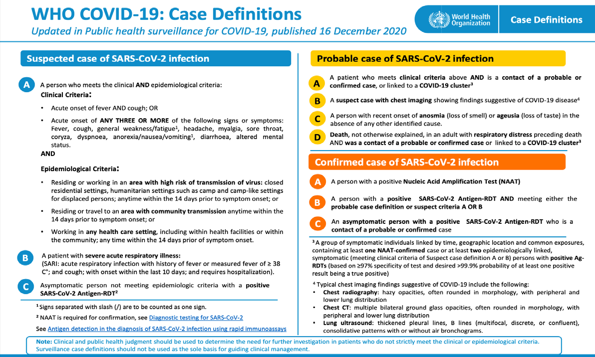

# Chapter 2: Infectious Diseases

## 2.3.7 COVID-19 Disease

Coronavirus disease (COVID-19) results from infection with the Severe
Acute Respiratory Syndrome Coronavirus 2 (SARS-CoV-2). It is a novel
virus in humans, knowledge of which and its pathogenesis still evolving.
Additionally, the population-level immunity is uncertain. Complications
of the severe infection can result in death.

Early symptoms are non-specific and may include:
 fever, cough, myalgia, fatigue, shortness of breath, sore throat,

headache, flu-like symptoms, diarrhea, nausea, respiratory
distress, features of renal failure, pericarditis, and Disseminated
Intravascular Coagulation (DIC).
It is important to know that many individuals with COVID-19 are asymptomatic. It is therefore paramount that all health workers observe strict
infection prevention and control (IPC) measures at all times.

Clinical features

Classification of COVID 19 disease

Hallmark

Features

Mild Disease

No Respiratory Distress

Normal Vital Signs

Moderate
Disease

Non-Severe
Pneumonia

Crackles in chest but Normal
SPO2,
mild respiratory distress (Resp
Rate <30)

Severe
Disease

Oxygen
Severe Respiratory distress
De saturation (Resp Rate >30) & SPO2 <90%,

Critical

Organ Dysfunction

CHAPTER 2: Infectious Diseases

Disease Stage

CNS: Altered Mental State
CVS: Hypotension & Shock
Kidney: Decreased Urine
Output, Raised Creatinine
• Liver: Elevated liver enzymes
• Coagulation: Raised PT &
INR, Thrombocytopenia
• Endocrine: Hypoglycemia

Groups at High Risk of Developing Severe Disease or Complications

ƒ Age > 65 year
ƒ Obesity
ƒ Lung diseases (e.g. asthma, TB, COPD)
ƒ Hypertension

Patient enters health facility grounds

Wash or sanitize hands
Take temperature (if infrared or
axillary thermometer available)
Low risk for
COVID-19:
Direct to facility for further
management

No
to
All

1. Is the temperature T>37.5OC?
2. Have had a fever?
3. Do you have symptoms such as cough,
shortness of breath, muscle aches, weakness,
sore throat, or headache?
Yes to at least 1

CHAPTER 2: Infectious Diseases

SUSPECT CASE

Danger signs
+ Rapid breathing:

Provide a medical mask to the
patient and direct to designated
triage area
Stabilize

Yes

(Oxygen if available) in a designated isolation area

Danger signs
No

Collect samples for:
• COVID-19
• Malaria RDT (if fever)

>30 per min (adult/child>5y)
>40 per min (child 1-5y)
>50 per min (child<1y)
+ Difficult breathing and/or
chest indrawing
+ Persistent high fever for 3 or
more days
+ Disorientation, seizures or
convulsions
+ Lethargy (excessive weakness,
tiredness)
+ Sunken eyes or other signs of
severe dehydration
+ Inability to drink or eat

No

High risk for development of
serious illness or complications
Yes

ADMIT FOR ISOLATION
Admit for isolation to hospital, another designated
facility (if available), or
home (case-by-case basis:
must have ability for close
follow up)

ADMIT FOR ISOLATION
Prioritize for admission to
isolation ward with critical
care capability

ƒ Heart conditions such as history of heart attack or stroke
ƒ Diabetes
ƒ Cancer patients whether or not on chemotherapy
ƒ Advanced liver disease
ƒ Person living with HIV
ƒ Kidney disease
ƒ Severe Acute Malnutrition
ƒ Sickle cell disease
ƒ COVID 19 unvaccinated
ƒ Pregnancy and recent pregnancy
ƒ Hypertension
### Differential diagnoses
Malaria and other febrile illnesses.
 common respiratory, infectious, cardiovascular, oncological, and gastrointestinal diseases.

#### Investigations

<figure markdown="1">

<figcaption>Figure 5: COVID-19 Disease case defination</figcaption>

</figure>
 


#### Management
 Perform SARS-CoV-2 Rapid Diagnostic Test (RDT)
 Carry out nasopharyngeal swabs for RT-RNA test

### COVID-19 screening and triage process at health facilities

COVID-19 triage aims to flag suspected patients at first
point of contact within the healthcare system in order to

protect other patients and staff from potential exposure.

identify and rapidly address severe symptoms, rule out other conditions with features similar to COVID-19, ascertain
if suspect case definition is met

All suspected patients should be directed to a designated
area away from other patients and handled as per standard
covid protection guidelines

Refer to the Comprehensive COVID-19 Case Management
Guidelines for details.

TREATMENT

LOC

Safety of health workers and caregivers: maximum HC2
level of infection control procedures

Strict isolation of suspect cases
Use of adequate protective gear
Minimize invasive intervention
Safe handling of linen
Appropriate use of chlorine mixtures
Proper disposal of health care waste
Educate the patient and care givers on appropriate infection
control measures
No Hospitalization (mild to moderate diseases)

HC2

LOC

All patients with no risk of developing severe COVID-19
diseases.
‰ symptom management, supportive care, and monitoring
(at home, or in the community).
‰ Control fevers with paracetamol, multivitamins and
advise on balanced diet
Adults and Children >40kg at increased risk of developing severe COVID-19 diseases. Refer to current
Covid-19 treatment guidelines.

TREATMENT

‰

CHAPTER 2: Infectious Diseases

nimatrelvir/ritonavir 300/100mg orally (PO) twice
daily for 5 days (must be initiated within 5 days of
symptom onset)
‰ OR remdesivir IV infusion Once daily for 3 days with a
loading dose 200mg on Day 1 and 100mg on subsequent days. (initiated within 7 days of symptom onset)
‰ OR molnupiravir 800mg orally (PO) twice daily for 5
days ONLY when ritonavir-boosted nirmatrelvir or
remdesivir cannot be used; treatment should be initiated
as soon as possible and within 5 days of symptom
onset (contraindicated in pregnant or breastfeeding
women and children)
If the patient requires hospitalization (Severe to Critical
disease)

RR

Oxygen therapy  
And Corticosteroids  
And Venous thromboembolism prophylaxis  
And Interleukin-6 receptor blocker (tocilizumab
or sarilumab)  

or JAK Inhibitor (baricitinib)
For details refer to the Comprehensive COVID-19 case
Management Guidelines

Prevention

Vaccination (Refer to chapter 18: Immunization)

Epidemic preparedness i.e. prompt detection and treatment

Infection Prevention and control measures including Mask
wearing, social distancing, regular handwashing, avoid
shaking hands etc.
