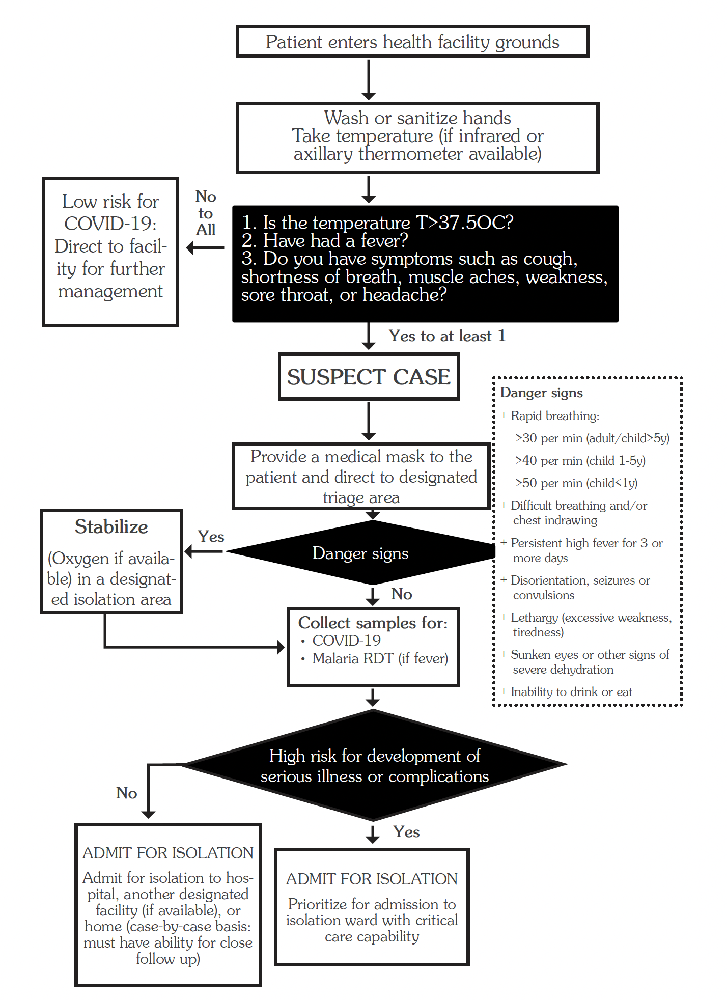

# Chapter 2: Infectious Diseases

## 2.1 Bacterial Infections

### 2.1.1 Anthrax

Anthrax is an acute zoonotic infectious disease caused by the bacterium *Bacillus anthracis*. It most commonly occurs in wild and domestic animals such as cattle, sheep, goats, camels, antelopes, and other herbivores. *B. anthracis* spores can live in the soil for many years.

**Clinical features**

Symptoms vary depending on how the disease was contracted and usually occur within 7 days.

| Type | Features |
|---|---|
| Cutaneous | Accounts for most anthrax infections and usually occurs through a skin cut or abrasion. It starts as a raised itchy bump that resembles an insect bite. Within 1–2 days, it develops into a vesicle and then a painless ulcer, usually 1–3 cm in diameter, with a characteristic black necrotic area in the centre, known as an eschar. Lymph glands in the adjacent area may swell. Untreated cutaneous anthrax may result in death. |
| Inhalation | Initial symptoms resemble a cold. After several days, symptoms may progress to severe breathing problems and shock. Inhalation anthrax is usually fatal. |
| Gastrointestinal | Presents with acute inflammation of the intestinal tract, nausea, loss of appetite, vomiting, fever, abdominal pain, vomiting blood, and severe diarrhoea. Gastrointestinal anthrax may result in death in severe cases. |

**Investigations**

- Isolation of *Bacillus anthracis* from blood, skin lesions, or respiratory secretions
- Smear microscopy showing many bacilli
- Measurement of specific antibodies in the blood of persons with suspected infection

**Management**

| Treatment | LOC |
|---|---|
| **Cutaneous anthrax** | HC2 |
| Treat for 7–10 days | |
| Ciprofloxacin 500 mg every 12 hours | |
| Alternative: doxycycline 100 mg every 12 hours | |
| Alternative: amoxicillin 1 g every 8 hours | |

**Prevention**

The following public health measures are key for quick prevention and control of anthrax infection:

- Health education and information
- Proper disposal of carcasses, hides, and skins by burying. Do not burn, as this can spread spores
- Avoid skinning dead animals, as this allows spore formation which can remain in soil for decades
- Avoid eating meat from dead animals
- Restrict movement of animals and animal by-products from infected to non-infected areas
- Mass vaccination of animals in endemic areas
- Vaccination using human anthrax vaccine for persons who work directly with the organism in the laboratory
- Vaccination using human anthrax vaccine for persons who handle potentially infected animal products in high-incidence areas

### 2.1.2 Brucellosis

**Causes**

- *Brucella abortus* in cattle
- *Brucella canis* in dogs
- *Brucella melitensis* in goats and sheep
- *Brucella suis* in pigs

**Clinical features**

- Intermittent, fluctuating fever
- Aches and pains
- Orchitis, which is inflammation of the testes
- Vertebral osteomyelitis, which is uncommon but characteristic

**Differential diagnosis**

- Typhoid fever, malaria, and tuberculosis
- Trypanosomiasis, also known as sleeping sickness
- Other causes of prolonged fever

**Investigations**

- Blood complement fixation test or agglutination test, where available
- Isolation of the infectious agent from blood, bone marrow, or other tissues by culture

!!! note "Interpretation of serological tests"
    The interpretation of serological tests can be difficult, particularly in endemic areas where a high proportion of the population has antibodies against brucellosis. Positive serological test results can persist long after recovery in treated individuals, so results should be interpreted based on the clinical picture.

**Management**

| Treatment | LOC |
|---|---|
| **Adults and children above 8 years** | HC4 |
| Doxycycline 100 mg every 12 hours for 6 weeks | |
| Child above 8 years: doxycycline 2 mg/kg per dose | |
| Plus gentamicin 5–7 mg/kg IV daily for 2 weeks | |
| Child below 8 years: gentamicin 7.5 mg/kg daily in 1–3 divided doses | |
| Alternative: ciprofloxacin 500 mg twice daily for 2 weeks | |
| Child below 12 years: do not use ciprofloxacin | |
| **Children below 8 years** | |
| Cotrimoxazole 24 mg/kg every 12 hours for 6 weeks | |
| Plus gentamicin 5–7 mg/kg IV in single or divided doses for 2 weeks | |

!!! caution "Caution"
    - Treatment duration must be adhered to at all times.
    - Ciprofloxacin is contraindicated in children below 12 years.
    - Doxycycline and gentamicin are contraindicated in pregnancy.

**Prevention**

- Provide public health education on drinking only pasteurised or boiled milk.
- Promote careful handling of pigs, goats, dogs, and cattle, especially where a person has wounds or cuts.
- Provide veterinary services for domestic animals.

### 2.1.3 Diphtheria

**ICD-10 CODE:** A36.9

An acute bacterial infection caused by *Corynebacterium diphtheriae*, which is spread through droplet infection and mainly occurs in the nasopharynx. The bacteria produce a toxin which is responsible for the systemic effects. The incubation period is 2–7 days.

**Cause**

- Toxin of *Corynebacterium diphtheriae*

**Clinical features**

- Pseudomembranous tonsillitis, with grey, tough, and very sticky membranes
- Dysphagia and cervical adenitis, sometimes progressing to massive swelling of the neck
- Airway obstruction and possible suffocation when infection extends to the nasal passages, larynx, trachea, and bronchi
- Low-grade fever
- Effects of the toxin, including cardiac dysfunction such as myocarditis with heart failure
- Neuropathies 1–3 months after onset, affecting swallowing, vision, breathing, and ambulation
- Renal failure

**Investigation**

- Culture from throat swab

**Management**

| Treatment | LOC |
|---|---|
| Refer urgently to hospital | H |
| Isolate using contact and droplet precautions until 3 throat swabs from nose, throat, or skin are negative | |
| Give procaine benzylpenicillin 1.2 MIU daily IM until the patient can switch to oral treatment | |
| Child: procaine benzylpenicillin 50,000 IU/kg per day IM once daily until the patient can swallow | |
| When the patient is able to swallow, give Penicillin V 250 mg every 6 hours to complete 14 days | |
| Child 1–6 years: Penicillin V 125 mg every 6 hours | |
| Child below 1 year: Penicillin V 12.5 mg/kg every 6 hours | |
| In case of penicillin allergy, give erythromycin 500 mg every 6 hours for 14 days | |
| Child: erythromycin 50 mg/kg every 6 hours | |

**Prevention**

- Isolate the patient and properly manage close contacts.
- Monitor close contacts for 7 days.
- Give prophylactic antibiotics to close contacts: single-dose benzathine penicillin IM.
- Child below 10 years: benzathine penicillin 600,000 IU IM.
- Child above 10 years and adults: benzathine penicillin 1.2 MIU IM.
- Verify immunisation status and complete immunisation if needed.
- Give a booster if the last dose was more than one year before exposure.
- Immunise all children during routine childhood immunisation.

### 2.1.4 Leprosy/Hansen’s Disease

**ICD-10 CODE:** A30.0

A chronic infectious disease caused by *Mycobacterium leprae*, also known as Hansen’s bacillus. It is an acid-fast bacillus. The disease mainly affects the skin, peripheral nerves, and mucous membranes. It is transmitted from one person to another via the respiratory tract and, very rarely, possibly through broken skin. It is classified into paucibacillary (PB) or multibacillary (MB) leprosy.

**Clinical features**

- Pale or reddish patches on the skin, which are the most common sign of leprosy
- Loss or decrease in feeling in the skin patch
- Numbness or tingling of the hands or feet
- Weakness of the hands, feet, or eyelids
- Painful or tender nerves
- Swelling or lumps in the face or earlobes
- Painless wounds or burns on the hands or feet

**Case definition**

A case of leprosy is a person with clinical signs of leprosy who requires chemotherapy.

**Diagnosis of leprosy**

Diagnosis of leprosy must be based on careful clinical examination of the patient and, where necessary, supported by bacteriological examination.

Leprosy is diagnosed by finding at least one of the three cardinal signs:

- Hypopigmented patches with definite loss of sensation
- Thickened or enlarged peripheral nerves, with loss of sensation and/or weakness of the muscles supplied by those nerves
- Presence of acid-fast bacilli in a slit skin smear

**Classification of leprosy**

- Paucibacillary (PB) leprosy: 1–5 patches
- Multibacillary (MB) leprosy: more than 5 patches

**Differential diagnosis**

- Hypopigmentation, e.g., birthmark or early vitiligo
- Fungal infections of the skin
- Molluscum contagiosum
- Other nodular conditions, e.g., Kaposi’s sarcoma, neurofibromatosis, or secondary syphilis
- Other causes of peripheral nerve damage, e.g., diabetes mellitus
- Psoriasis

**Investigations**

- In most cases, a definite diagnosis of leprosy can be made using clinical signs alone.
- At referral centre: stain slit skin smears for acid-fast bacilli (AFB).
- Skin biopsies are not recommended as a routine procedure.

**Management**

Multi-drug therapy (MDT) for leprosy is presented in the form of various monthly dose blister packs. The same three drugs are used for both PB leprosy and MB leprosy, with special packs for children.

**Summary of treatment of leprosy**

| PB Leprosy | MB Leprosy |
|---|---|
| Rifampicin | Rifampicin |
| Dapsone | Dapsone |
| Clofazimine | Clofazimine |
| All for 6 months | All for 12 months |

**Recommended treatment: drugs and doses**

| Patient group | Drug | Dosage and frequency | PB duration | MB duration |
|---|---|---|---|---|
| Adult | Rifampicin | 600 mg once a month | 6 months | 12 months |
| Adult | Clofazimine | 300 mg once a month and 50 mg daily | 6 months | 12 months |
| Adult | Dapsone | 100 mg daily | 6 months | 12 months |
| Children 10–14 years | Rifampicin | 450 mg once a month | 6 months | 12 months |
| Children 10–14 years | Clofazimine | 150 mg once a month and 50 mg daily | 6 months | 12 months |
| Children 10–14 years | Dapsone | 50 mg daily | 6 months | 12 months |
| Children below 10 years or below 40 kg | Rifampicin | 10 mg/kg once a month | 6 months | 12 months |
| Children below 10 years or below 40 kg | Clofazimine | 6 mg/kg once a month and 1 mg/kg daily | 6 months | 12 months |
| Children below 10 years or below 40 kg | Dapsone | 2 mg/kg daily | 6 months | 12 months |

**Steroids for treatment of severe leprae reactions**

| Treatment | LOC |
|---|---|
| Prednisolone 40 mg once daily in the morning | RR |
| Treat for 12 weeks in PB and 24 weeks in MB | |
| Reduce dose gradually by 10–5 mg once every 2 weeks for PB or every 3 weeks for MB | |

!!! note "Notes"
    - In patients co-infected with HIV and on cotrimoxazole, do not use dapsone.
    - The health worker should directly observe that the medicines taken once a month are actually swallowed.
    - Treatment durations longer than 12 months and steroids for leprae reactions should only be prescribed by specialists at referral centres.
    - Lepra reactions are sudden inflammatory reactions involving pain, redness, swelling, new lesions, or loss of nerve function in the skin lesions or nerves of a person with leprosy. They can occur before, during, or after MDT completion.
    - Severe leprae reactions, also known as Type 2 reactions, are called Erythema Nodosum Leprosum (ENL).
    - All patients should undergo rehabilitation and physiotherapy.
    - Counsel patients on the need to complete treatment and on the possible presence of residual signs after completion of treatment.
    - Presence of residual signs or post-treatment reactions is not an indication to restart treatment.
    - Refer to the National Tuberculosis and Leprosy Programme (NTLP) manual 2016 for more details.

**Prevention**

- Early diagnosis of cases and effective treatment
- Screening of contacts of known patients
- Administration of single-dose rifampicin to contacts of leprosy patients to prevent development of leprosy disease

**Rifampicin dose used in contacts of leprosy patients**

| Age/weight | Rifampicin single dose |
|---|---|
| 15 years and above | 600 mg |
| 10–14 years | 450 mg |
| Children 6–9 years, weight ≥20 kg | 300 mg |
| Children below 20 kg and aged ≥2 years | 10–15 mg/kg |

- BCG vaccination may help.

**Disability due to leprosy**

Leprosy commonly causes physical disabilities which generate social stigma. Disability refers to an impairment, primary or secondary, that makes it difficult or impossible for the affected person to carry out certain activities, such as manual dexterity, personal care, mobility, and communication behaviour.

**Definitions of disability in the hands and feet**

- Grade 0: no anaesthesia, no visible deformity or damage
- Grade 1: anaesthesia, but no visible deformity or damage
- Grade 2: visible deformity or damage present

**Definitions of disability in the eyes**

- Grade 0: no eye problem due to leprosy and no evidence of visual loss
- Grade 1: eye problem due to leprosy, but vision not severely affected as a result; 6/60 or better, able to count fingers at six metres
- Grade 2: severe visual impairment, vision worse than 6/60, inability to count fingers at six metres, lagophthalmos, iridocyclitis, or corneal opacities

**Management of disability in the hands and feet**

- Rest the affected limb in the acute phase. This can be aided by splinting, especially at night.
- Soak and oil dry skin for about 30 minutes every day to prevent cracking and preserve the integrity of the epidermis.
- Use a clean dry cloth to cover wounds.
- Walk as little as possible and walk slowly, taking frequent rests.
- Use passive exercise and stretching to avoid contractures and strengthen weak muscles.
- Use a rough stone to smoothen the skin on the feet or palms.
- Use protective footwear, such as MCR sandals, at all times.
- Use protective appliances such as gloves for insensitive hands.

**Eye complications due to leprosy**

Eye complications may include:

- Lagophthalmos
- Corneal hypoesthesia, with or without corneal ulcers
- Acute iritis and scleritis
- Chronic iritis and iris atrophy

**Treatment and management of eye complications**

Medical therapy for eye complications due to leprosy includes the use of topical antibiotics and topical steroids. It is strongly recommended that an ophthalmologist and a trained leprologist, where available, be included in the treatment of Hansen’s disease with ocular manifestations.

### 2.1.5 Meningitis

**ICD-10 CODES:** A39.0 (Meningococcal), G00, G01, G02

Meningitis is acute inflammation of the meninges, which are the membranes covering the brain. Bacterial meningitis is a notifiable disease.

**Causative organisms**

The most common causes are bacterial, including:

- *Streptococcus pneumoniae*
- *Haemophilus influenzae* type b, mainly in young children
- *Neisseria meningitidis*
- Enteric bacilli

Other causes include:

- Viral infections, e.g., HSV, enteroviruses, HIV, VZV
- *Cryptococcus neoformans*, especially in immunosuppressed patients
- *Mycobacterium tuberculosis*

**Clinical features**

- Rapid onset of fever
- Severe headache and neck stiffness or pain
- Photophobia
- Haemorrhagic rash in *N. meningitidis* infection
- Convulsions, altered mental state, confusion, or coma
- In mycobacterial and cryptococcal meningitis, the clinical presentation can be sub-acute, over several days or 1–2 weeks

**Differential diagnosis**

- Brain abscess
- Space-occupying lesions in the brain
- Drug reactions or intoxications

**Investigations**

- CSF analysis: usually cloudy if bacterial and clear if viral
- CSF white cell count and type
- CSF protein and sugar
- Indian ink staining for *Cryptococcus*
- Gram stain, culture, and sensitivity
- Blood for serological studies and full blood count
- Blood culture and sensitivity
- Chest X-ray and ultrasound to look for a possible primary site

!!! warning "Referral"
    Because of the potential severity of the disease, refer all patients to hospital after a pre-referral dose of antibiotic. Carry out lumbar puncture promptly and initiate an empirical antibiotic regimen.

**Management**

Treatment depends on whether the causative organism has already been identified.

| Treatment | LOC |
|---|---|
| **General measures** | HC4 |
| Give IV fluids | |
| Control temperature | |
| Provide nutrition support, using NGT if necessary | |
| **Causative organism not yet identified** | |
| Start appropriate empirical broad-spectrum therapy | |
| Ceftriaxone 2 g IV or IM every 12 hours for 10–14 days | |
| Child: ceftriaxone 100 mg/kg daily dose | |
| Change to a cheaper effective antibiotic if and when culture and sensitivity results become available | |
| If ceftriaxone is not available or the patient is not improving, use chloramphenicol 1 g IV every 6 hours for up to 14 days. Use IM if IV is not possible | |
| Child: chloramphenicol 25 mg/kg per dose | |
| Once clinical improvement occurs, change to chloramphenicol 500–750 mg orally every 6 hours to complete the course | |
| Child: chloramphenicol 25 mg/kg per dose | |

**Treatment when causative organism is identified**

| Organism | Treatment | LOC |
|---|---|---|
| *Streptococcus pneumoniae* | Treat for 10–14 days, or up to 21 days in severe cases. Give benzylpenicillin 3–4 MU IV or IM every 4 hours. Child: 100,000 IU/kg per dose. Alternatively, give ceftriaxone 2 g IV or IM every 12 hours. Child: 100 mg/kg daily dose. | H |
| *Haemophilus influenzae* | Treat for 10 days. Give ceftriaxone 2 g IV or IM every 12 hours. Child: 100 mg/kg per dose. If the isolate is susceptible, change to chloramphenicol 1 g IV every 6 hours. Child: 25 mg/kg per dose. Alternatively, use ampicillin 2–3 g IV every 4–6 hours. Child: 50 mg/kg per dose. | H |
| *Neisseria meningitidis* | Treat for up to 14 days. Give benzylpenicillin IV 5–6 MU every 6 hours. Child: 100,000–150,000 IU/kg every 6 hours. Alternatively, give ceftriaxone 2 g IV or IM every 12 hours. Child: 100 mg/kg daily dose. Alternatively, give chloramphenicol 1 g IV every 6 hours, IM if IV is not possible. Child: 25 mg/kg IV per dose. Once clinical improvement occurs, change to chloramphenicol 500–750 mg orally every 6 hours to complete the course. Child: 25 mg/kg per dose. | H |
| *Listeria monocytogenes* | Treat for at least 3 weeks. It is a common cause of meningitis in neonates and immunosuppressed adults. Give benzylpenicillin 3 MU IV or IM every 4 hours, or ampicillin 3 g IV every 6 hours. Therapy may need to be prolonged for up to 6 weeks in some patients. | H |

!!! note "Prophylaxis of close contacts"
    Consider prophylaxis of close contacts, especially children below 5 years, for *Neisseria meningitidis*. Adults and children above 12 years: ciprofloxacin 500 mg single dose. Child below 12 years: ciprofloxacin 10 mg/kg single dose. Alternative, including in pregnancy: ceftriaxone 250 mg IM single dose. Child below 12 years: ceftriaxone 150 mg IM single dose.

!!! note "Notes"
    Benzylpenicillin and ampicillin are both effective for *Listeria monocytogenes*. Therapy may need to be prolonged for up to 6 weeks in some patients.

**Prevention**

- Avoid overcrowding
- Improve sanitation and nutrition
- Promptly treat primary infection, e.g., respiratory tract infection
- Immunise according to national schedules
- Conduct mass immunisation if there is an *N. meningitidis* epidemic

#### 2.1.5.1 Neonatal Meningitis

Organisms causing neonatal meningitis are similar to those causing neonatal septicaemia and pneumonia. These include *S. pneumoniae*, group A and B streptococci, and enteric Gram-negative bacilli.

Meningitis due to group B streptococci may occur because these organisms often colonise the vagina and rectum of pregnant women, can be transmitted to babies during labour, and can cause infection. Meningitis and septicaemia during the first week after birth may be particularly severe.

**Clinical features**

Clinical presentation is non-specific and may include:

- Temperature disturbances
- Lethargy
- Irritability
- Vomiting
- Feeding problems
- Convulsions
- Apnoea
- Bulging fontanel

**Management**

| Treatment | LOC |
|---|---|
| Refer to hospital after initial dose of antibiotics | H |
| Keep baby warm | |
| For high temperature, control the environment by undressing the baby and avoid paracetamol | |
| Prevent hypoglycaemia through breastfeeding if tolerated or possible, NGT, or IV glucose | |
| Ensure hydration and nutrition | |
| Give oxygen if needed, especially if SpO₂ is below 92% | |
| **Empirical regimen for 21 days** | |
| Ampicillin IV: neonate below 7 days, 50–100 mg/kg every 12 hours | |
| Ampicillin IV: neonate above 7 days, 50–100 mg/kg every 8 hours | |
| Plus gentamicin 2.5 mg/kg IV every 12 hours | |
| Blood culture is needed | |
| **If group B streptococci** | |
| Benzylpenicillin 100,000–150,000 IU/kg IV every 4–6 hours | |
| Neonates below 7 days: benzylpenicillin 50,000–100,000 IU/kg IV every 8 hours | |
| Plus gentamicin 2.5 mg/kg IV every 12 hours | |
| Continue treatment for a total of 3 weeks | |

#### 2.1.5.2 Cryptococcal Meningitis

**ICD-10 CODE:** B45.1

Cryptococcal meningitis is fungal meningitis caused by *Cryptococcus neoformans*. It usually occurs in severely immunosuppressed patients, especially patients with advanced HIV disease, often with CD4 count below 100.

**Clinical features**

It commonly presents with:

- Headache
- Fever
- Malaise developing over 1 or 2 weeks
- Confusion
- Photophobia
- Stiff neck

**Diagnosis**

- Cryptococcal antigen test (CrAg) in serum, plasma, or CSF
- Indian ink stain on CSF
- CSF culture

**Management**

| Treatment | LOC |
|---|---|
| Refer to hospital | H |

#### 2.1.5.3 TB Meningitis

**ICD-10 CODE:** A17.0

TB meningitis is meningitis caused by *Mycobacterium tuberculosis*. Onset may be gradual, with fatigue, fever, vomiting, weight loss, irritability, and headache, progressing to confusion, focal neurological deficits, meningeal irritation, and coma.

**Diagnosis**

- Check CSF for raised protein and lymphocytosis
- Look for a possible primary TB site

**Management**

| Treatment | LOC |
|---|---|
| Refer to hospital | H |
| Treat as pulmonary TB, but the continuation phase is 10 months instead of 4 months: 2RHZE/10RH | |
| See section 5.3 for more details | |

### 2.1.6 Plague

Severe acute bacterial infection with high fatality rate, transmitted by infected rodent fleas. It is a notifiable disease.

**Cause**

- *Yersinia pestis*, a coccobacillus transmitted from ground rodents to humans by bites from infected fleas
- It may also be spread from person to person by droplet infection and may occur in epidemics

**Clinical features**

| Type | Features |
|---|---|
| Bubonic plague (A20.0) | Involves lymph nodes, usually femoral and inguinal. Presents with rapidly rising temperature with rigors and headache. |
| Pneumonic plague (A20.2) | Very infectious and highly fatal. The patient must be isolated. Death may occur within 2 days if not treated early. Infection is localised in the lungs with fever, general malaise, headache, and frothy blood-stained sputum. It may be complicated by respiratory and cardiac distress. |

**Differential diagnosis**

- Malaria and typhoid
- Lymphogranuloma venereum
- Pneumonia

**Investigations**

- Bubo aspirate for microscopy, culture, and sensitivity
- Blood and sputum to check for presence of the bacilli

**Management**

| Treatment | LOC |
|---|---|
| Doxycycline 100 mg every 12 hours for 14 days | HC2 |
| Child above 8 years: doxycycline 2 mg/kg per dose | |
| **Alternatives** | HC4 |
| Chloramphenicol 500 mg orally or IV every 6 hours for 10 days | |
| Child: chloramphenicol 25 mg/kg per dose | |
| Or gentamicin 1.7 mg/kg IV or IM every 8 hours for 7–10 days | |

!!! note "Note"
    For use in pregnancy, consider gentamicin.

**Prevention**

- Health education
- Improved housing
- Destruction of rats, rodents, and fleas
- Early detection and treatment to reduce further spread

### 2.1.7 Septicaemia

Blood infection due to various bacteria. It may be associated with infection in specific sites, such as lungs, urinary tract, or gastrointestinal tract, or there may be no specific focus. It is life-threatening because it can progress into multi-organ dysfunction and septic shock.

**Cause**

Organisms commonly involved include:

- *Staphylococcus aureus*
- *Klebsiella*
- *Pseudomonas*
- *Staphylococcus epidermidis*
- Fungal organisms, especially *Candida* spp.
- Coliforms and *Salmonella* spp.
- Pneumococci
- *Proteus* spp.

**Risk factors**

- Extremes of age, especially children and the elderly
- Diabetes, cancer, and immunosuppression
- Hospital admission
- Community-acquired pneumonia

**Clinical features**

- Fever and prostration, meaning extreme tiredness
- Hypotension and anaemia
- Toxic shock as a complication
- Signs and symptoms of the primary site of infection, for example pneumonia

**Differential diagnosis**

- Severe cerebral malaria
- Meningitis
- Typhoid fever, also known as enteric fever
- Infective endocarditis

**Investigations**

- Look for the possible primary source of infection.
- If identified, use the SOP for the respective sample collection and convey the sample to the laboratory.
- Blood WBC count, culture, and sensitivity.
- Use aseptic technique and collect sample(s) for culture and sensitivity before initiation of treatment, and send to RRH where the service is available.

!!! warning "Referral"
    Septicaemia is a life-threatening condition. Refer to hospital after a pre-referral dose of antibiotics.

**Management**

| Treatment | LOC |
|---|---|
| **General measures** | H |
| Give IV fluids | |
| Control temperature | |
| Provide nutrition support, using NGT if necessary | |
| Monitor vital signs and urinary output | |
| If the focus of infection is known, treat immediately with IV antibiotics as per guidelines | |
| If the focus is unknown, give empirical treatment as below | |

| Treatment | LOC |
|---|---|
| Use aseptic technique to take a blood sample before initiating treatment | H |
| **Adults** | |
| Gentamicin 7 mg/kg IV every 24 hours or 1.5–2 mg/kg IV or IM every 8 hours | |
| Plus either cloxacillin 2 g IV every 4–6 hours or chloramphenicol 750 mg IV every 6 hours | |
| **Children** | |
| Gentamicin 3.5–4 mg/kg IV every 8 hours. In neonates, give every 8–12 hours | |
| Plus either ceftriaxone 50 mg/kg every 8 hours. In neonates below 7 days, give every 12 hours | |
| Or cloxacillin 50 mg/kg IV every 4–6 hours | |
| Or benzylpenicillin 50,000 IU/kg IV every 4–6 hours | |

**Prevention**

- Protect groups at risk, for example immunosuppressed and post-surgical patients.
- Follow strictly aseptic surgical procedures.

#### 2.1.7.1 Neonatal Septicaemia

Organisms causing neonatal septicaemia are similar to those causing neonatal pneumonia and meningitis. Refer to hospital after a pre-referral dose of antibiotics.

**Management**

| Treatment | LOC |
|---|---|
| **Supportive care** | H |
| Keep baby warm | |
| For high temperature, control the environment by undressing the baby and avoid paracetamol | |
| Prevent hypoglycaemia through breastfeeding if tolerated or possible, NGT, or IV glucose | |
| Ensure hydration and nutrition | |
| Give oxygen if needed, especially if SpO₂ is below 90% | |
| **First-line treatment** | H |
| Give ampicillin 50 mg/kg IV every 6 hours plus gentamicin 5 mg/kg every 24 hours for 10 days | |
| If there is risk of staphylococcal infection, such as infected umbilicus or multiple skin pustules, give cloxacillin 50 mg/kg IV or IM every 6 hours plus gentamicin 5–7 mg/kg every 24 hours | |
| Clean infected umbilicus and pustules and apply gentian violet | |
| If there is no improvement after 48–72 hours, change from ampicillin to ceftriaxone 100 mg/kg daily | |

#### 2.1.7.2 Septic Shock Management in Adults

**At the Emergency Unit**

- Recognise septic shock early.
- Start resuscitation with IV crystalloids or blood as appropriate.
- Give empirical broad-spectrum antibiotics early and adequately.
- Establish intravenous access. Use a large-bore cannula, preferably gauge 16 in adults.
- Administer 30 ml/kg of crystalloids.
- Insert urinary catheter. Urine output in adults should be 0.5 ml/kg/hour or more, equivalent to about 30–50 ml/hour.
- Transfer to ICU if the patient is not responding to resuscitation.

**At ICU: intubation and mechanical ventilation**

- Use recommended tidal volume of 6 ml/kg.
- Keep plateau pressure at or below 30 cmH₂O.
- Give IV vasopressor norepinephrine 5–20 µg/min.
- Second-line options include synthetic human angiotensin II or vasopressin.
- Target CVP ≤8 mmHg.
- Provide inotropic therapy and augmented oxygen therapy.
- Dobutamine may be used up to 20 µg/kg/min.
- Give corticosteroid therapy where indicated.
- IV hydrocortisone 200 mg/day in 4 divided doses may be used.
- Maintenance infusion of methylprednisolone 1 mg/kg/day for 7 days may be used, then tapered down for at least another 7 days.
- Maintain glycaemic level below 180 mg/dl through insulin therapy.
- Provide deep venous thrombosis prophylaxis using UFH 2 or 3 times a day or LMWH.

**Disseminated intravascular coagulation management**

- Platelet and plasma transfusion
- Anticoagulant therapy where indicated
- Fresh frozen plasma (FFP)
- Antifibrinolytic therapy, e.g., tranexamic acid 1 g every 8 hours

### 2.1.8 Tetanus

**ICD-10 CODE:** A35

**Cause**

- Exotoxin of *Clostridium tetani*
- Common sources of infection include tetanus spores entering the body through deep penetrating skin wounds, the umbilical cord of the newborn, ear infection, or wounds produced during delivery and septic abortions

**Clinical features**

- Stiff jaw and difficulty in opening the mouth, known as trismus
- Generalised spasms induced by sounds and/or strong light, characterised by grimace, also known as risus sardonicus
- Arching of the back, known as opisthotonus, with the patient remaining clearly conscious
- Fever
- Glottal spasms and difficulty in breathing
- Absence of a visible wound does not exclude tetanus

**Differential diagnosis**

- Meningoencephalitis and meningitis
- Phenothiazine side-effects
- Febrile convulsions

**Management**

| Treatment | LOC |
|---|---|
| **General measures** | H |
| If at HC2 or HC3, refer to hospital | |
| Nurse the patient intensively in a quiet isolated area | |
| Maintain close observation and attention to airway, temperature, and spasms | |
| Insert nasogastric tube (NGT) for nutrition, hydration, and medicine administration | |
| Give oxygen therapy if needed | |
| Prevent aspiration of fluid into the lungs | |
| Avoid IM injections as much as possible. Use alternative routes, such as NGT or rectal route, where possible | |
| Maintain adequate nutrition, as spasms result in high metabolic demands | |
| Treat respiratory failure in ICU with ventilation | |

| Treatment | LOC |
|---|---|
| **Neutralise toxin** | H |
| Give tetanus immunoglobulin human (TIG) 150 IU/kg for adults and children | |
| Give the dose IM in at least 2 different sites, different from the tetanus toxoid site | |
| In addition, administer a full course of age-appropriate tetanus toxoid vaccine, TT or DPT, starting immediately | |
| See section 18.1.4 | |

| Treatment | LOC |
|---|---|
| **Eliminate source of toxin** | H |
| Clean wounds and remove necrotic tissue | |
| **First-line antibiotics** | |
| Metronidazole 500 mg every 8 hours IV or by mouth for 7 days | |
| Child: metronidazole 7.5 mg/kg every 8 hours | |
| **Second-line antibiotics** | |
| Benzylpenicillin 2.5 MU every 6 hours for 10 days | |
| Child: benzylpenicillin 50,000–100,000 IU/kg per dose | |

| Treatment | LOC |
|---|---|
| **Control muscle spasms** | H |
| **First line:** diazepam 10 mg IV or rectal every 1–4 hours | |
| Child: diazepam 0.2 mg/kg IV or 0.5 mg/kg rectal every 1–4 hours, maximum 10 mg | |
| **Other agents** | |
| Magnesium sulphate, alone or with diazepam: 5 g or 75 mg/kg IV loading dose, then 2 g/hour until spasm control is achieved | |
| Monitor knee-jerk reflex and stop infusion if absent | |
| Or chlorpromazine, alone or alternating with diazepam: 50–100 mg IM every 4–8 hours | |
| Child: chlorpromazine 4–12 mg IM every 4–8 hours, or 12.5–25 mg by NGT every 4–6 hours | |
| Continue for as long as spasms or rigidity last | |

| Treatment | LOC |
|---|---|
| **Control pain** | H |
| Morphine 2.5–10 mg IV every 4–6 hours. Monitor for respiratory depression | |
| Child: morphine 0.1 mg/kg per dose | |
| Paracetamol 1 g every 8 hours | |
| Child: paracetamol 10 mg/kg every 6 hours | |

**Prevention**

- Immunise all children against tetanus during routine childhood immunisation.
- Provide proper wound care and immunisation, as described in Chapter 18.
- Give a full course if the patient is not immunised or not fully immunised.
- Give a booster if fully immunised but the last dose was more than 10 years ago.
- Fully immunised persons who had a booster within the last 10 years do not need any specific treatment.
- For prophylaxis in patients at risk as a result of contaminated wounds, give tetanus immunoglobulin human (TIG) IM:
    - Child below 5 years: 75 IU
    - Child 5–10 years: 125 IU
    - Child above 10 years and adults: 250 IU
- Double the dose if there is heavy contamination or if the wound was obtained more than 24 hours earlier.

#### 2.1.8.1 Neonatal Tetanus

Neonatal tetanus may result from cutting the umbilical cord with unsterile instruments or from putting cow dung or other unsuitable materials on the stump.

It usually presents 3–14 days after birth with irritability and difficulty in feeding due to masseter, or jaw muscle, spasm, rigidity, and generalised muscle spasms. The neonate behaves normally for the first few days before symptoms appear.

**Management**

| Treatment | LOC |
|---|---|
| Refer to hospital immediately | H |
| **General measures** | RR |
| Nurse in a quiet, dark, and cool environment | |
| Suction the mouth and turn the infant 30 minutes after sedative administration | |
| A mucus extractor or other suction equipment should be available for use when needed | |
| Ensure hydration and feeding | |
| Start with IV fluids, half saline and dextrose 5% | |
| Insert NGT and start feeding with expressed breast milk 24 hours after admission, using small frequent feeds | |
| Monitor and maintain body temperature | |
| Monitor cardiorespiratory function closely and refer for ICU management if possible | |

| Treatment | LOC |
|---|---|
| **Neutralise toxin** | H |
| Give tetanus immunoglobulin human (TIG) 500 IU IM | |
| Give the dose in at least 2 different IM sites, different from the tetanus toxoid site | |
| In addition, give the first dose of DPT | |

| Treatment | LOC |
|---|---|
| **Eliminate source of toxin** | H |
| Clean and debride the infected umbilicus | |
| **First-line antibiotics** | |
| Metronidazole loading dose 15 mg/kg over 60 minutes | |
| Infant below 4 weeks: metronidazole 7.5 mg/kg every 12 hours for 14 days | |
| Infant above 4 weeks: metronidazole 7.5 mg/kg every 8 hours for 14 days | |
| **Second-line antibiotics** | |
| Benzylpenicillin 100,000 IU/kg every 12 hours for 10–14 days | |

| Treatment | LOC |
|---|---|
| **Control muscle spasm** | H |
| Diazepam 0.2 mg/kg IV or 0.5 mg/kg rectal every 1–4 hours | |
| **Other medicines** | |
| Chlorpromazine oral 1 mg/kg every 8 hours via NGT | |

**Prevention**

- Immunise all pregnant women during routine ANC visits.
- Ensure proper cord care.

### 2.1.9 Typhoid Fever (Enteric Fever)

**ICD-10 CODE:** A01.00

Typhoid fever is a bacterial infection characterised by fever and abdominal symptoms. It is spread through contaminated food and water.

**Causes**

- *Salmonella typhi*
- *Salmonella paratyphi* A and B

**Clinical features**

- Gradual onset of chills and malaise, headache, anorexia, epistaxis, backache, and constipation
- Usually occurs 10–15 days after infection
- Abdominal pain and tenderness are prominent features
- High fever above 38°C
- Delirium and stupor in advanced stages
- Tender splenomegaly, relative bradycardia, and cough
- Complications may include perforation of the gut with peritonitis and gastrointestinal haemorrhage

**Differential diagnosis**

- Severe malaria
- Other severe febrile illnesses

**Investigations**

- Blood culture, which is the most reliable test
- Stool culture
- Rapid antibody tests, e.g., Tubex or Typhidot. These are not very sensitive or specific, but may be useful in epidemics

!!! note "Note"
    Widal’s agglutination reaction is neither sensitive nor specific for typhoid diagnosis. A single positive screening does not indicate presence of infection.

**Management**

| Treatment | LOC |
|---|---|
| Do culture and sensitivity to confirm the right treatment | HC3 |
| Ciprofloxacin 500 mg every 12 hours for 10–14 days | |
| Child: ciprofloxacin 10–15 mg/kg per dose | |
| **Other antibiotics** | HC3 |
| Chloramphenicol 500 mg every 6 hours for 10 days | |
| Child: chloramphenicol 25 mg/kg IV, IM, or oral for 10–14 days | |
| **In severe resistant forms or pregnancy** | HC4 |
| Ceftriaxone 1 g IV every 12 hours for 10–14 days | |
| Child: ceftriaxone 50 mg/kg per dose | |
| **Alternative in pregnancy** | |
| Amoxicillin 1 g every 8 hours for 10 days | |
| Child: amoxicillin 10–15 mg/kg per dose | |

**Prevention**

- Early detection, isolation, treatment, and reporting
- Proper faecal disposal
- Use of safe clean water for drinking
- Personal hygiene, especially hand washing
- Good food hygiene

### 2.1.10 Typhus Fever

**ICD-10 CODE:** A75.9

Typhus fever includes several rickettsial infections.

**Causes**

- Epidemic typhus fever caused by *Rickettsia prowazekii*. This is the common type in Uganda and is transmitted to humans by lice.
- Murine, or endemic, typhus fever caused by *Rickettsia typhi* or *Rickettsia mooseri*, and transmitted by rat fleas. Rats and mice are the reservoir.
- Scrub typhus fever, also known as mite-borne typhus, caused by *Rickettsia tsutsugamushi* and transmitted by rodent mites.

**Clinical features**

- Headache, fever, chills, severe weakness, and muscle pains
- Macular rash that appears around the 5th day on the rest of the body, except the face, palms, and soles
- Jaundice, confusion, and drowsiness
- Murine typhus has a similar presentation but is usually less severe

**Differential diagnosis**

- Malaria
- HIV
- Urinary tract infection
- Typhoid fever
- Other causes of fever

**Investigations**

- Blood for Weil-Felix reaction

**Management**

| Treatment | LOC |
|---|---|
| Doxycycline 100 mg every 12 hours for 5–7 days | HC2 |
| Child above 8 years: doxycycline 2 mg/kg per dose | |
| Or chloramphenicol 500 mg orally or IV every 6 hours for 5 days | HC4 |
| Child: chloramphenicol 15 mg/kg per dose | |

!!! note "Note"
    One single dose of doxycycline 200 mg may cure epidemic typhus, but there is risk of relapse.

**Prevention**

- Personal hygiene
- Destruction of lice and rodents

## 2.2 FUNGAL INFECTIONS

### 2.2.1 Candidiasis

**ICD-10 CODE:** B37

Candidiasis is a fungal infection usually confined to the mucous membranes and external layers of skin. Severe forms are usually associated with immunosuppressive conditions such as HIV/AIDS, diabetes, pregnancy, cancer, prolonged antibiotic use, and steroid use.

**Cause**

- *Candida albicans*, transmitted by direct contact

**Clinical features**

Candidiasis may present as:

- Oral thrush
- Intertrigo, occurring between skin folds
- Vulvovaginitis and abnormal vaginal discharge. Vaginal candidiasis is not a sexually transmitted disease
- Chronic paronychia, which is inflammation involving the proximal and lateral fingernail folds
- Gastrointestinal candidiasis, which may present with pain on swallowing, vomiting, diarrhoea, epigastric pain, and retrosternal pain

**Investigations**

- Diagnosis is mainly clinical.
- In case of vaginitis, collect a high vaginal swab protected by a speculum.
- Tests may include pH, KOH, wet preparation, Gram stain, culture and sensitivity.
- Smear examination with potassium hydroxide (KOH) may be done.

**Management**

| Treatment | LOC |
|---|---|
| **Oral candidiasis** | HC3 / HC2 |
| Nystatin tablets 500,000–1,000,000 IU every 6 hours for 10 days, chewed then swallowed | |
| Child below 5 years: nystatin oral suspension 100,000 IU every 6 hours for 10 days | |
| Child 5–12 years: nystatin 200,000 IU per dose every 6 hours for 10 days | |
| **Oropharyngeal candidiasis** | HC3 |
| Fluconazole 150–200 mg daily for 14 days | |
| Child: loading dose 6 mg/kg, then 3 mg/kg daily | |
| **Vaginal candidiasis** | HC2 |
| Insert clotrimazole pessary 100 mg high into the vagina with an applicator each night for 6 days or twice a day for 3 days | |
| Or insert one nystatin pessary 100,000 IU each night for 10 days | |
| For recurrent vaginal candidiasis, give fluconazole 150–200 mg once daily for 5 days | |

!!! caution "Pregnancy"
    Fluconazole is associated with spontaneous abortions and congenital anomalies and should be avoided in pregnancy.

| Treatment | LOC |
|---|---|
| **Chronic paronychia** | HC3 / HC4 |
| Keep hands dry and wear gloves for wet work | |
| Apply hydrocortisone cream twice daily | |
| If not responding, apply betamethasone cream twice daily | |
| Fluconazole 150–200 mg once daily for 5–7 days may be used where indicated | |
| **Intertrigo** | HC3 |
| Apply clotrimazole cream twice daily for 2–4 weeks | |
| In severe forms, use fluconazole 150–200 mg once daily for 14–21 days | |

**Prevention**

- Early detection and treatment
- Improve personal hygiene
- Avoid unnecessary antibiotics

## 2.3 VIRAL INFECTIONS

### 2.3.1 Avian Influenza

**ICD-10 CODE:** J09.X2

Influenza caused by avian (bird) influenza Type A viruses, mainly the H5N1 strain. It is endemic in the poultry population in Eurasia and can occasionally be transmitted to humans through direct contact with sick birds, including inhalation of infectious droplets.

The disease can be mild or severe and has limited potential to spread from person to person. However, there is risk of mutation, which may give rise to a highly infectious virus capable of causing widespread epidemics.

Avian flu is a notifiable disease.

**Cause**

- Avian (bird) influenza Type A viruses

**Clinical features**

- Conjunctivitis
- Flu-like symptoms, including fever, cough, sore throat, and muscle aches
- Gastrointestinal symptoms, including diarrhoea
- Neurological symptoms
- In some cases, severe acute respiratory syndrome (SARS)

**Investigations**

- Blood and respiratory specimens, including nose swab, for laboratory testing for influenza and to rule out bacterial infection
- Testing must be done in a special laboratory

**Management**

| Treatment | LOC |
|---|---|
| **If the patient requires hospitalisation** | RR |
| Hospitalise the patient under appropriate infection prevention and control precautions | |
| Administer oxygen as required | |
| Avoid nebulisers and high-flow oxygen masks | |
| Give paracetamol or ibuprofen for fever when required | |
| Give oseltamivir phosphate to patients aged ≥1 year who have been symptomatic for no more than 2 days | |
| Treat for 5 days using the doses below | |

**Oseltamivir dosing**

| Patient group | Dose |
|---|---|
| Adults and children ≥13 years | 75 mg twice daily |
| Child >1 year and <15 kg | 30 mg twice daily |
| Child 15–23 kg | 45 mg twice daily |
| Child 23–40 kg | 60 mg twice daily |
| Child >40 kg | 75 mg twice daily |

**If the case does not require hospitalisation**

Educate the patient and family on:

- Personal hygiene and infection prevention and control measures
- Hand washing
- Use of a paper or surgical mask by the ill person
- Restriction of social contact
- Seeking prompt medical care if the condition worsens

**Prophylactic use of oseltamivir**

| Treatment | LOC |
|---|---|
| Indicated in persons aged 13 years and above who have come into contact with affected birds or patients | RR |
| Close contact: give 75 mg once daily for at least 7 days | |
| Community contacts: give 75 mg once daily for up to 6 weeks | |
| Protection lasts only during the period of chemoprophylaxis | |

**Discharge policy**

- Infection prevention and control precautions for adult patients should remain in place for 7 days after resolution of fever
- For children younger than 12 years, precautions should remain in place for 21 days
- Children should not attend school during this period

**Control and prevention of nosocomial spread of influenza A (H5N1)**

Health workers should observe the following measures to prevent the spread of avian influenza in health care facilities:

- Observe droplet and contact precautions
- Use a negative pressure room if available
- Isolate the patient in a single room
- Place beds more than 1 metre apart, preferably separated by a physical barrier such as a curtain or partition
- Use appropriate personal protective equipment (APPE) for all persons entering patients’ rooms
- APPE includes a high-efficiency mask, gown, face shield or goggles, and gloves
- Limit the number of health care workers and other hospital employees who have direct contact with the patient
- Ensure health care workers are properly trained in infection prevention and control precautions
- Health care workers should monitor their temperature twice daily and report any febrile event to hospital authorities
- A health care worker who has fever above 38°C and has had direct patient contact should be treated immediately
- Restrict the number of visitors
- Provide visitors with APPE and instruct them on its use

### 2.3.2 Chicken Pox

**ICD-10 CODE:** B01

**Cause**

- Varicella zoster virus (VZV), spread by droplet infection

**Clinical features**

- Incubation period is usually 14 days, but may be shorter in immunocompromised patients
- Mild fever may occur 10–20 days after exposure
- Prodromal symptoms include low-grade fever, headache, and malaise, usually occurring 2–3 days before the eruption
- Eruptive phase: lesions appear as macules, papules, vesicles, pustules, and crusts
- The most characteristic lesion is a vesicle that looks like a drop of water on the skin
- Vesicles rupture easily and may become infected
- The rash begins on the trunk and spreads to the face and extremities
- Lesions at different stages may exist together in the same body area
- Complications may include septicaemia, pneumonia, fulminating haemorrhagic varicella, and meningoencephalitis

**Differential diagnosis**

- Drug-induced eruption
- Scabies
- Insect bites
- Erythema multiforme
- Impetigo
- Other viral infections with fever and skin rash

**Investigations**

- Virus isolation is possible but not usually necessary
- Diagnosis is mainly clinical

**Management**

| Treatment | LOC |
|---|---|
| **Symptomatic and supportive treatment** | HC2 |
| Apply calamine lotion every 12 hours | |
| Use cool, wet compresses to provide relief | |
| Give chlorpheniramine for itching | |
| Adult: chlorpheniramine 4 mg every 12 hours | |
| Child <5 years: chlorpheniramine 1–2 mg every 12 hours for 3 days | |
| Give paracetamol 10 mg/kg every 6 hours for pain or fever | |
| Keep the child at home or remove from school until healed to avoid spread | |
| **In adults and children >12 years, consider antiviral treatment** | HC4 |
| Give oral aciclovir 800 mg every 6 hours for 7 days | |

**Prevention**

- Isolate infected patients
- Avoid contact between infected persons and immunosuppressed persons

### 2.3.3 Measles

**ICD-10 CODE:** B05

An acute, highly communicable viral infection characterised by a generalised skin rash, fever, and inflammation of mucous membranes.

Measles is a notifiable disease.

**Cause**

- Measles virus, spread by droplet infection and direct contact

**Clinical features**

- Catarrhal stage: high fever, Koplik’s spots, runny nose, barking cough, and conjunctivitis
- Koplik’s spots are diagnostic
- Misery, anorexia, vomiting, and diarrhoea
- Later: generalised maculopapular skin rash followed by desquamation after a few days

**Complications**

- Secondary bacterial respiratory tract infection, e.g., bronchopneumonia and otitis media
- Severe acute malnutrition, especially following diarrhoea
- Cancrum oris from mouth sepsis
- Corneal ulceration and panophthalmitis, which may lead to blindness
- Demyelinating encephalitis
- Thrombocytopaenic purpura

**Differential diagnosis**

- German measles (rubella)
- Other viral diseases causing skin rash

**Investigations**

- Clinical diagnosis is usually sufficient
- Virus isolation is possible but not routinely required

**Management**

| Treatment | LOC |
|---|---|
| Isolate the patient at home or at the health centre | HC2 |
| Give paracetamol when required for fever | |
| Apply tetracycline eye ointment 1% every 12 hours for 5 days | |
| Increase fluid and nutritional intake because of the high risk of malnutrition and dehydration | |
| Give 3 doses of vitamin A: first dose at diagnosis, second dose the next day, and third dose on day 14 | |
| Child <6 months: vitamin A 50,000 IU | |
| Child 6–12 months: vitamin A 100,000 IU | |
| Child >12 months: vitamin A 200,000 IU | |
| Monitor for secondary bacterial infections and treat immediately with appropriate antibiotics | |
| Refer to hospital if complications occur | |

**Prevention**

- Measles vaccination (see Chapter 18)
- Avoid contact between infected and uninfected persons
- Educate the public against common local myths, such as stopping meat and fish intake for measles patients

### 2.3.4 Poliomyelitis

**ICD-10 CODE:** A80.3

An acute viral infection characterised by acute onset of flaccid paralysis of skeletal muscles. It is transmitted from person to person through the faecal-oral route.

Poliomyelitis is a notifiable disease.

**Cause**

- Poliovirus, an enterovirus, types I, II, and III

**Clinical features**

- Majority of cases are asymptomatic
- Only about 1% of cases result in flaccid paralysis
- Non-paralytic form: minor illness with fever, malaise, headache, vomiting, and muscle pains, with spontaneous recovery in about 10 days
- Paralytic form: after non-specific symptoms, there is rapid onset of asymmetrical flaccid paralysis, often progressing from morning to evening
- Paralysis predominantly affects the lower limbs and may progress upwards
- Paralysis of respiratory muscles is life-threatening, especially in bulbar polio
- Aseptic meningitis may occur as a complication

**Differential diagnosis**

- Guillain-Barré syndrome
- Traumatic neuritis
- Transverse myelitis
- Pesticide poisoning
- Food poisoning

!!! warning "Important"
    Consider all cases of acute flaccid paralysis as possible poliomyelitis. Alert the district focal person for epidemic control and send 2 refrigerated stool samples.

**Investigations**

- Isolation of the virus from stool samples
- Viral culture

!!! note "Note"
    Ensure other possible causes of diarrhoeal or neurological illness are considered where clinically indicated, including *Giardia intestinalis*, *Entamoeba histolytica*, *Cryptosporidium*, *Cyclospora*, *Sarcocystis*, and *Toxoplasma gondii*.

**Management**

| Treatment | LOC |
|---|---|
| **Acute stage** | H |
| Poliomyelitis without paralysis is difficult to diagnose at this stage | |
| **Paralytic form** | |
| If paralysis is recent, allow the patient to rest completely | |
| Do not give IM injections because they may worsen paralysis | |
| Refer the patient to hospital for supportive care | |
| After recovery, complete the recommended immunisation schedule if the patient is partially immunised or not immunised | |
| **Chronic stage** | H |
| Encourage active use of the limb to restore muscle function | |
| Provide physiotherapy | |
| In case of severe contractures, refer for corrective surgery | |

**Prevention**

- Isolate the patient for nursing and treatment
- Apply contact and droplet precautions
- Immunise all children below 5 years from the area of the suspected case
- If the case is confirmed, organise a mass immunisation campaign
- Ensure proper disposal of children’s faeces
- Immunise according to the national immunisation schedule (see Chapter 18)
- Promote proper hygiene and sanitation

### 2.3.5 Rabies

**ICD-10 CODE:** A82

Rabies is a viral infection of wild and domestic animals. It is transmitted to humans through saliva of infected animals, usually through bites, scratches, or licks on broken skin or mucous membranes.

Once symptoms develop, rabies presents as fatal encephalitis. There is no cure, and treatment is palliative.

Before symptomatic disease develops, rabies can be effectively prevented by post-exposure prophylaxis.

**Cause**

- Rabies virus
- The incubation period is usually 20–90 days
- Incubation may be shorter in severe exposure, such as multiple bites or bites on the face or neck
- In a few cases, incubation may be longer than 1 year

**Clinical features**

- Itching or paraesthesia, which is abnormal sensation around the site of exposure
- Malaise
- Fever
- Neurological phase

**Furious form**

- Psychomotor agitation
- Hydrophobia, with throat spasm and panic triggered by attempts to drink or by the sight, sound, or touch of water
- Aerophobia, with similar response to a draft of air

**Paralytic form**

- Rarer form
- Progressive ascending paralysis

**Management**

| Treatment | LOC |
|---|---|
| There is no cure once symptoms develop | H |
| In case of suspected exposure, take all appropriate steps to prevent infection (see section 1.2.1.3 on animal bites) | |
| Start post-exposure management as soon as exposure occurs or as soon as the patient presents for medical attention, regardless of the time that has passed since exposure | |
| Admit the case | |
| Provide palliative and supportive care | |
| Observe strict hygiene precautions | |
| Avoid contact with the patient’s body fluids or secretions | |
| Use personal protective equipment (PPE) | |
| Counsel caregivers on rabies and its consequences | |

!!! caution "Caution"
    The patient may bite. Health workers and caregivers should observe strict protective measures.

### 2.3.6 Viral Haemorrhagic Fevers

#### 2.3.6.1 Ebola and Marburg

**ICD-10 CODE:** A99

Ebola and Marburg are severe zoonotic multisystem febrile diseases caused by RNA viruses. They are notifiable diseases.

**Cause**

- Ebola and Marburg viruses
- Transmission to humans occurs through contact with meat or body fluids of an infected animal
- Human-to-human transmission occurs through body fluids, including semen for months after recovery
- The disease is highly contagious

**Risk factors**

- Communities around game parks
- Communities in endemic areas
- Cultural practices such as burial rituals
- Poor infection prevention and control practices
- History of exposure to infected people in the last 2–21 days, including sexual partners and breastfeeding mothers
- Recent contact with infected animals, e.g., monkeys, bats, or infected game meat

**Clinical features**

**Early signs, usually non-specific:**

- Sudden fever
- Weakness
- Headache
- Muscle pains
- Loss of appetite
- Conjunctivitis

**Late signs:**

- Diarrhoea, watery or bloody
- Vomiting
- Mucosal and gastrointestinal bleeding
- Chest pain
- Respiratory distress
- Circulatory shock
- CNS dysfunction, confusion, and seizures
- Miscarriage in pregnancy
- Elevated AST and ALT
- Kidney injury
- Electrolyte abnormalities

!!! note "Note"
    Haemorrhage is seen in less than a third of Ebola patients.

**Differential diagnosis**

- Malaria
- Rickettsiosis
- Meningitis
- Shigellosis
- Typhoid
- Anthrax
- Sepsis
- Viral hepatitis
- Dengue
- Leptospirosis

**Investigations**

- Send blood sample to a referral laboratory for specific testing.
- Blood sample collection from patients suspected of viral haemorrhagic fever should be done by a trained healthcare worker using appropriate PPE.
- Notify the district surveillance focal person.

**Management**

| Treatment | LOC |
|---|---|
| Refer all patients to a regional referral hospital for management in an appropriate setting | RR |
| Notify the district health team | |

**Safety of health workers: maximum level of infection control procedures**

Health workers should maintain a high level of suspicion for Ebola virus disease. Standard precautions should be followed for all patients at all times. Transmission-based precautions are essential for suspected or confirmed Ebola or Marburg virus disease.

This includes:

- Screening for rapid identification and isolation of cases
- Hand hygiene according to the WHO 5 moments
- Safe injection practices
- Use of personal protective equipment, including eye protection, medical mask or respirator, gloves, gown or coverall, head covering, apron, and gum boots
- Handling and disposing of all waste related to the care of Ebola patients as infectious
- Safe handling and disinfection of linens, or disposal where disinfection is not possible
- Thorough cleaning and disinfection of the environment and medical equipment
- Preparation and use of disinfectants, e.g., chlorine mixture of 0.5% for surfaces, ensuring adequate concentration and contact time

**Handling of the deceased**

Handling of the deceased is particularly high risk and should be kept to a minimum. Strict adherence to IPC measures is required, including hand hygiene and use of personal protective equipment such as eye protection, medical mask or respirator, gloves, gown or coverall, head covering, apron, and gum boots.

**Patient care**

Refer to the most recent Ministry of Health guidelines for management of viral haemorrhagic fevers.

- Provide optimised supportive treatment of signs and symptoms
- Replace and monitor fluids and electrolytes for patients with diarrhoea or vomiting

**Triage and contact tracing**

- Triage patients based on whether they had contact with a case or not
- Conduct contact identification
- Conduct contact listing
- Conduct contact follow-up

**Dead body handling**

- Avoid washing or touching the dead
- There should be no gathering at funerals
- The dead should be buried promptly by a designated burial team

**Prevention**

- Provide health education to the population, e.g., avoid eating wild animals
- Ensure effective outbreak communication
- Put viral haemorrhagic fever protocols in place
- Use appropriate safety gear for patients and health workers in suspected cases
- Modify burial practices
- Use condoms

#### 2.3.6.2 Yellow Fever

An acute viral haemorrhagic fever transmitted through the bite of infected female *Aedes aegypti* mosquitoes. The incubation period is 3–6 days.

Yellow fever is a notifiable disease.

**Cause**

- Yellow fever RNA virus

**Risk factors**

- Residents in endemic areas
- Hunters and settlers around game parks

**Clinical features**

**First stage:**

- Fever
- Chills
- Headache
- Backache
- Muscle pain
- Prostration
- Nausea and vomiting
- Fatigue

This stage usually resolves within 3–4 days.

**Second stage:**

- About 15% of cases enter a second or toxic stage after 1–2 days of remission
- High fever and prostration
- Signs and symptoms of hepatic failure
- Renal failure
- Bleeding, including jaundice, nose bleeding, gingival bleeding, vomiting blood, and blood in stool
- About half of these patients die within 7–10 days

**Differential diagnosis**

- Hepatitis E
- Liver failure
- Malaria
- Ebola

**Investigations**

- PCR in early phases
- ELISA in the late stage

**Management**

| Treatment | LOC |
|---|---|
| Refer all cases to a regional referral hospital | RR |
| Notify the district health team | |
| There is no specific antiviral drug treatment | |
| Provide supportive treatment | |
| Rehydration | |
| Management of liver and kidney failure | |
| Antipyretics for fever | |
| Blood transfusion where indicated | |
| Treat associated bacterial infections with antibiotics | |

!!! note "Note"
    Individuals who have recovered from yellow fever infection develop lifelong immunity.

**Prevention**

- Vaccination (see Chapter 18)
- Elimination of mosquito breeding sites
- Epidemic preparedness, including prompt detection and treatment

### 2.3.7 COVID-19 Disease

Coronavirus disease (COVID-19) results from infection with the Severe Acute Respiratory Syndrome Coronavirus 2 (SARS-CoV-2). It is a novel virus in humans, and knowledge of the virus and its pathogenesis is still evolving. Population-level immunity is also uncertain. Complications of severe infection can result in death.

**Clinical features**

Early symptoms are non-specific and may include:

- Fever
- Cough
- Myalgia
- Fatigue
- Shortness of breath
- Sore throat
- Headache
- Flu-like symptoms
- Diarrhoea
- Nausea
- Respiratory distress
- Features of renal failure
- Pericarditis
- Disseminated intravascular coagulation (DIC)

Many individuals with COVID-19 are asymptomatic. It is therefore important that all health workers observe strict infection prevention and control (IPC) measures at all times.

**Classification of COVID-19 disease**

| Disease stage | Hallmark | Features |
|---|---|---|
| Mild disease | No respiratory distress | Normal vital signs |
| Moderate disease | Non-severe pneumonia | Crackles in the chest but normal SpO₂; mild respiratory distress with respiratory rate <30 |
| Severe disease | Oxygen desaturation | Severe respiratory distress with respiratory rate >30 and SpO₂ <90% |
| Critical disease | Organ dysfunction | CNS: altered mental state CVS: hypotension and shock Kidney: decreased urine output, raised creatinine Liver: elevated liver enzymes Coagulation: raised PT and INR, thrombocytopenia Endocrine: hypoglycaemia |

**Groups at high risk of developing severe disease or complications**

- Age above 65 years
- Obesity
- Lung diseases, e.g., asthma, TB, COPD
- Hypertension
- Heart conditions, such as history of heart attack or stroke
- Diabetes
- Cancer, whether or not on chemotherapy
- Advanced liver disease
- Person living with HIV
- Kidney disease
- Severe acute malnutrition
- Sickle cell disease
- COVID-19 unvaccinated status
- Pregnancy and recent pregnancy

**Differential diagnoses**

- Malaria and other febrile illnesses
- Common respiratory diseases
- Infectious diseases
- Cardiovascular diseases
- Oncological conditions
- Gastrointestinal diseases

**Investigations**

- Perform SARS-CoV-2 rapid diagnostic test (RDT)
- Carry out nasopharyngeal swab for RT-PCR test
- Investigate for other likely causes based on presentation, including malaria RDT if fever is present

**COVID-19 screening and triage process at health facilities**

COVID-19 triage aims to flag suspected patients at the first point of contact within the healthcare system in order to:

- Protect other patients and staff from potential exposure
- Identify and rapidly address severe symptoms
- Rule out other conditions with features similar to COVID-19
- Ascertain whether the suspect case definition is met

All suspected patients should be directed to a designated area away from other patients and handled according to standard COVID-19 protection guidelines.

Refer to the Comprehensive COVID-19 Case Management Guidelines for details.

**Screening steps**

At entry into the health facility:

- Patient enters health facility grounds
- Patient washes or sanitises hands
- Temperature is taken if an infrared or axillary thermometer is available

Screen for the following:

- Temperature above 37.5°C
- History of fever
- Symptoms such as cough, shortness of breath, muscle aches, weakness, sore throat, or headache

If the answer is **no to all**, classify as low risk for COVID-19 and direct the patient to the facility for further management.

If the answer is **yes to at least one**, classify as a suspected case.

**Management of suspected cases at triage**

- Provide a medical mask to the patient
- Direct the patient to a designated triage area
- Collect samples for COVID-19 testing
- If fever is present, collect malaria RDT
- Assess for danger signs

**Danger signs**

- Rapid breathing:
    - Adults and children above 5 years: >30 breaths per minute
    - Children 1–5 years: >40 breaths per minute
    - Children below 1 year: >50 breaths per minute
- Difficult breathing and/or chest indrawing
- Persistent high fever for 3 or more days
- Disorientation
- Seizures or convulsions
- Lethargy or excessive weakness/tiredness
- Sunken eyes or other signs of severe dehydration
- Inability to drink or eat

**Disposition**

If there are danger signs:

- Stabilise the patient in a designated isolation area
- Give oxygen if available
- Prioritise admission to an isolation ward with critical care capability

If there are no danger signs but the patient is at high risk of serious illness or complications:

- Admit for isolation to hospital, another designated facility if available, or home on a case-by-case basis
- Home isolation should only be considered where close follow-up is possible

**Management**

| Treatment | LOC |
|---|---|
| **Safety of health workers and caregivers: maximum level of infection control procedures** | HC2 |
| Strict isolation of suspected cases | |
| Use adequate protective gear | |
| Minimise invasive interventions | |
| Ensure safe handling of linen | |
| Use chlorine mixtures appropriately | |
| Properly dispose of health care waste | |
| Educate the patient and caregivers on appropriate infection control measures | |

**No hospitalisation: mild to moderate disease**

| Treatment | LOC |
|---|---|
| Patients with no risk of developing severe COVID-19 disease should receive symptom management, supportive care, and monitoring at home or in the community | HC2 |
| Control fever with paracetamol | |
| Provide multivitamins where appropriate | |
| Advise on a balanced diet | |

**Adults and children above 40 kg at increased risk of developing severe COVID-19 disease**

Refer to the current COVID-19 treatment guidelines.

Treatment options may include:

- Nirmatrelvir/ritonavir 300/100 mg orally twice daily for 5 days, initiated within 5 days of symptom onset
- Or remdesivir IV infusion once daily for 3 days, with a loading dose of 200 mg on day 1 and 100 mg on subsequent days, initiated within 7 days of symptom onset
- Or molnupiravir 800 mg orally twice daily for 5 days, only when ritonavir-boosted nirmatrelvir or remdesivir cannot be used

!!! caution "Caution"
    Molnupiravir is contraindicated in pregnant women, breastfeeding women, and children.

**If the patient requires hospitalisation: severe to critical disease**

| Treatment | LOC |
|---|---|
| Oxygen therapy | RR |
| Corticosteroids | |
| Venous thromboembolism prophylaxis | |
| Interleukin-6 receptor blocker, such as tocilizumab or sarilumab, or JAK inhibitor, such as baricitinib | |
| Refer to the Comprehensive COVID-19 Case Management Guidelines for details | |

**Prevention**

- Vaccination (see Chapter 18: Immunisation)
- Epidemic preparedness, including prompt detection and treatment
- Infection prevention and control measures, including mask wearing, social distancing, regular hand washing, and avoiding hand shaking

## 2.4 HELMINTH PARASITES

### 2.4.1 Intestinal Worms

**ICD-10 CODE:** B83.9

Intestinal worms enter the human body through ingestion of worm eggs in food or water, through dirty hands, or through injured skin when walking barefoot.

Examples include:

| Type of infestation | Features |
|---|---|
| **Ascariasis** *Ascaris lumbricoides* (roundworm) Infests the small intestines | Oro-faecal transmission Usually few or no symptoms Persistent dry irritating cough Patient may pass live worms through the anus, nose, or mouth Pneumonitis, also known as Loeffler’s syndrome Heavy infestations may cause nutritional deficiencies Worms may cause obstruction of the bowel, bile duct, pancreatic duct, or appendix |
| **Enterobiasis** *Enterobius vermicularis* (threadworm) | Transmitted by the faecal-oral route Mainly affects children Intense itching at the anal orifice |
| **Hookworm** Caused by *Necator americanus* and *Ancylostoma duodenale* | Chronic parasitic infestation of the intestines Transmitted by penetration of the skin by larvae from the soil Dermatitis, also known as ground itch Cough and inflammation of the trachea, known as tracheitis, during larval migration Iron-deficiency anaemia Reduced blood proteins in heavy infestations |
| **Strongyloidiasis** *Strongyloides stercoralis* | Skin symptoms: itchy eruption at the site of larval penetration Intestinal symptoms, e.g., abdominal pain, diarrhoea, and weight loss Lung symptoms due to larvae in the lungs, e.g., cough and wheezing Specific organ involvement, e.g., meningoencephalitis Hyperinfection syndrome may occur when immunity against auto-infection fails, e.g., in immunosuppressed patients |
| **Whipworm** Infests the human caecum and upper colon | May be symptomless Heavy infestation may cause bloody mucoid stools and diarrhoea Complications include anaemia and prolapse of the rectum |

**Differential diagnosis**

- Other causes of cough and diarrhoea
- Other causes of intestinal obstruction and nutritional deficiency
- Loeffler’s syndrome
- Other causes of iron-deficiency anaemia

**Investigations**

- Stool examination for ova, live worms, or segments
- Full blood count

**Management**

| Treatment | LOC |
|---|---|
| **Roundworm, threadworm, hookworm, and whipworm** | HC1 |
| Albendazole 400 mg single dose | |
| Child <2 years: albendazole 200 mg single dose | |
| Or mebendazole 500 mg single dose | |
| Child <2 years: mebendazole 250 mg single dose | |
| **Strongyloides** | HC3 |
| Albendazole 400 mg every 12 hours for 3 days | |
| Or ivermectin 150 micrograms/kg single dose | |

**Prevention**

- Proper faecal disposal
- Personal and food hygiene
- Regular deworming of children every 3–6 months
- Avoid walking barefoot

#### 2.4.1.1 Taeniasis (Tapeworm)

**ICD-10 CODE:** B68

An infestation caused by *Taenia* species, including *Taenia saginata* from undercooked beef, *Taenia solium* from undercooked pork, and *Diphyllobothrium latum* from undercooked fish.

**Cause**

- Adult tapeworm intestinal infestation occurs through ingestion of undercooked meat containing cysticerci, the larval form of the worm
- Larval forms, or cysticercosis, occur through ingestion of food or water contaminated by eggs of *T. solium*
- The eggs hatch in the intestine, and the embryos invade the intestinal walls and disseminate to the brain, muscles, or other organs

**Clinical features**

**T. saginata and T. solium adult tapeworm**

- Usually asymptomatic, but live segments may be passed
- Epigastric pain
- Diarrhoea
- Sometimes weight loss

**Cysticercosis**

- Muscular: muscle pains, weakness, fever, and subcutaneous nodules
- Neurocysticercosis: headache, convulsions, coma, meningoencephalitis, and epilepsy
- Ocular: exophthalmia, strabismus, and iritis

**D. latum**

- Usually asymptomatic, but mild symptoms may occur
- Megaloblastic anaemia may occur as a rare complication

**Differential diagnosis**

- Other intestinal worm infestations

**Investigations**

- Stool examination for eggs or worm segments
- Collection of eggs or segments from perianal skin using the scotch tape method
- In cysticercosis: check for hypereosinophilia in blood and CSF

**Management**

| Treatment | LOC |
|---|---|
| **Tapeworm** | HC3/HC4 |
| Praziquantel 5–10 mg/kg single dose | |
| **Alternative** | |
| Niclosamide single dose | |
| Adult and child >6 years: niclosamide 2 g single dose | |
| Child <2 years: niclosamide 500 mg single dose | |
| Child 2–6 years: niclosamide 1 g single dose | |
| Give bisacodyl 2 hours after the dose | |
| **Cysticercosis** | RR |
| Refer to specialised facilities | |
| Antiparasitic treatment without diagnosis of location by CT or MRI scan can worsen symptoms and may threaten the life of the patient | |
| Neurosurgical treatment may be required | |

**Prevention**

- Cook all fish and meat thoroughly
- Ensure proper hygiene, including hand washing, nail cutting, and proper disposal of faeces

### 2.4.2 Echinococcosis (Hydatid Disease)

**ICD-10 CODE:** B67

Tissue infestation by larvae of *Echinococcus granulosus*. It is transmitted through direct contact with dogs or by ingesting water and food contaminated by dog faeces.

**Clinical features**

- Cough
- Chest pain
- Liver cysts may be asymptomatic
- Liver cysts may cause abdominal pain, palpable mass, and jaundice if the bile duct is obstructed
- Rupture of cysts may cause fever, urticaria, or anaphylactic reaction
- Pulmonary cysts can be seen on chest X-ray
- Pulmonary cysts may rupture and cause cough, chest pain, and haemoptysis

**Differential diagnosis**

- Amoebiasis
- Hepatoma
- Other causes of liver mass and obstructive jaundice
- Tuberculosis (TB)

**Investigations**

- Skin test
- Ultrasound
- Chest X-ray for pulmonary cysts
- Serological tests
- Needle aspiration under ultrasound sonography or CT-scan guidance

**Management**

| Treatment | LOC |
|---|---|
| Refer for specialist management | RR |
| Surgical excision | |
| Prior to surgery, or in cases not amenable to surgery, give albendazole | |
| Child >2 years and adults: albendazole 7.5 mg/kg every 12 hours for 3–6 months | |

**Prevention**

- Food hygiene
- Health education
- Proper disposal of faeces

### 2.4.3 Dracunculiasis (Guinea Worm)

**ICD-10 CODE:** B72

**Cause**

- *Dracunculus medinensis*, transmitted to humans by drinking water containing cyclops, also known as water fleas or small crustaceans, infected with larvae of the guinea worm

**Clinical features**

- Adult worm may be felt beneath the skin
- Local redness, tenderness, and blister, usually on the foot, at the point where the worm emerges from the skin to discharge larvae into water
- Fever, nausea, vomiting, diarrhoea, dyspnoea, generalised urticaria, and eosinophilia may occur before vesicle formation
- Complications may include cellulitis, septicaemia, aseptic arthritis, pyogenic arthritis, and tetanus

**Differential diagnosis**

- Cellulitis from other causes
- Myositis

**Investigations**

- Recognition of the adult worm under the skin
- X-ray may show calcified worms

**Management**

| Treatment | LOC |
|---|---|
| There is no known drug treatment for guinea worm | HC2 |
| Slowly and carefully roll the worm onto a small stick over a period of days to facilitate removal | |
| Dress the wound occlusively to prevent the worm from passing ova into water | |
| Give analgesics for as long as necessary | |
| If there is ulceration and secondary infection, give amoxicillin 500 mg every 8 hours for 5 days | |
| Child: amoxicillin 250 mg every 8 hours for 5 days | |
| Or give cloxacillin 500 mg every 6 hours for 5 days | |

**Prevention**

- Filter or boil drinking water
- Infected persons should avoid all contact with sources of drinking water

### 2.4.4 Lymphatic Filariasis

**ICD-10 CODE:** B74.9

**Cause**

- *Wuchereria bancrofti*

**Clinical features**

**Acute**

- Adenolymphangitis, which is inflammation of lymph nodes and lymphatic vessels
- May affect the lower limbs, external genitalia, testis, epididymis, or breast
- May occur with or without general symptoms such as fever, nausea, and vomiting
- Attacks resolve spontaneously in about one week and may recur regularly in patients with chronic disease

**Chronic**

- Lymphoedema, which is chronic hard swelling of limbs or external genitalia
- Hydrocele
- Chronic epididymo-orchitis
- Initially reversible but may progressively become chronic and severe, leading to elephantiasis

**Differential diagnosis**

- Deep vein thrombosis (DVT)
- Cellulitis

**Investigations**

- Blood slide for microfilaria
- Collect specimen between 9:00 pm and 3:00 am

**Management**

| Treatment | LOC |
|---|---|
| **Case treatment** | HC2 |
| Provide supportive treatment during an attack, including bed rest, limb elevation, analgesics, cooling, and hydration | |
| Give doxycycline 100 mg twice a day for 4–6 weeks | |
| Do not administer antiparasitic treatment during an acute attack | |
| **Chronic case** | |
| Provide supportive treatment, including bandaging during the day, elevation of the affected limb at rest, and analgesics | |
| Surgery may be required, e.g., hydrocelectomy | |
| **Large-scale treatment / preventive chemotherapy** | |
| Give annually to all population at risk for 4–6 years | |
| Ivermectin 150–200 micrograms/kg plus albendazole 400 mg single dose | |

!!! note "Notes"
    Ivermectin is not effective against adult worms. It is not recommended in children below 5 years, pregnant women, or breastfeeding mothers. No food or alcohol should be taken within 2 hours of a dose.

**Prevention**

- Use of treated mosquito nets
- Patient education

### 2.4.5 Onchocerciasis (River Blindness)

**ICD-10 CODE:** B73.0

Onchocerciasis is transmitted by the bite of infected black flies, including *Simulium damnosum*, *S. naevi*, and *S. oodi*. These flies breed in rapidly flowing and well-aerated water.

**Clinical features**

**Skin**

- Onchocercoma: painless, smooth subcutaneous nodules containing adult worms, adherent to underlying tissues
- Nodules are usually found on body prominences such as iliac crests, pelvic girdle, ribs, and skull
- Acute papular onchodermatitis: intense pruritic rash and oedema due to microfilariae
- Late chronic skin lesions: dry, thickened, peeling skin, also known as lizard skin
- Skin atrophy
- Patchy depigmentation

**Eye**

- Inflammation of the eye, including cornea, uvea, and retina
- Visual disturbances
- Blindness

**Differential diagnosis**

- Other causes of skin depigmentation, e.g., yaws, burns, and vitiligo
- Other causes of fibrous nodules in the skin, e.g., neurofibromatosis

**Investigations**

- Skin snip after sunshine to show microfilariae in fresh preparations
- High eosinophils on blood slide or complete blood count
- Excision of nodules to identify adult worms
- Slit-lamp eye examination for microfilariae in the anterior chamber of the eye

**Management**

| Treatment | LOC |
|---|---|
| **Case treatment for adult worms** | HC3 |
| Doxycycline 100 mg twice a day for 6 weeks, followed by ivermectin 150 micrograms/kg single dose | |
| **Mass treatment** | |
| Ivermectin 150 micrograms/kg once yearly for 10–14 years | |
| Use the dose table below where dosing is based on height | |

!!! note "Notes"
    Ivermectin is not recommended in children below 5 years, pregnant women, or breastfeeding mothers. No food or alcohol should be taken within 2 hours of a dose.

**Ivermectin dose based on height**

| Height (cm) | Dose |
|---|---|
| >158 | 12 mg |
| 141–158 | 9 mg |
| 120–140 | 6 mg |
| 90–119 | 3 mg |
| <90 | Do not use |

**Prevention**

- Vector control
- Mass chemoprophylaxis

### 2.4.6 Schistosomiasis (Bilharziasis)

**ICD-10 CODE:** B65.1

The larval form, known as cercariae, of *Schistosoma* penetrates the skin from contaminated water. The larvae migrate to different parts of the body, usually the urinary tract in *Schistosoma haematobium* infection and the gut in *S. mansoni* infection.

**Clinical features**

**S. haematobium: urinary tract**

- Painless blood-stained urine at the end of urination, known as terminal haematuria
- Frequent and painful micturition
- In females: lower abdominal pain and abnormal vaginal discharge
- Late complications include fibrosis of the bladder and ureters, increased risk of urinary tract infections, hydronephrosis, and infertility

**S. mansoni: gastrointestinal tract**

- Abdominal pain
- Frequent stool with blood-stained mucus
- Hepatomegaly
- Chronic cases may develop hepatic fibrosis with cirrhosis and portal hypertension
- Haematemesis and melaena may occur

**Differential diagnosis**

- Cancer of the bladder in *S. haematobium*
- Dysentery in *S. mansoni*

**Investigations**

- History of staying in an endemic area or exposure to water bodies
- Urine examination for *S. haematobium* ova
- Stool examination for *S. mansoni* ova
- Rectal snip for *S. mansoni*

**Management**

| Treatment | LOC |
|---|---|
| Praziquantel 40 mg/kg single dose | HC4 |
| Refer the patient if they develop obstruction or bleeding | |

**Prevention**

- Avoid urinating or defecating in or near water
- Avoid washing or stepping in contaminated water
- Ensure effective treatment of cases
- Clear bushes around landing sites

## 2.5 PROTOZOAL PARASITES

### 2.5.1 Leishmaniasis

**ICD-10 CODE:** B55

**Cause**

- Flagellated protozoa of *Leishmania* species

**Clinical features**

**Visceral leishmaniasis (Kala-azar)**

- Chronic disease characterised by fever, hepatosplenomegaly, lymphadenopathy, anaemia, leucopenia, progressive emaciation, and weakness
- Fever of gradual onset, irregular, with two daily peaks and alternating periods of apyrexia
- The disease progresses over several months and is fatal if not treated
- After recovery from Kala-azar, cutaneous leishmaniasis may develop

**Cutaneous and mucosal leishmaniasis (Oriental sore)**

- Starts as a papule
- Enlarges to become an indolent ulcer
- Secondary bacterial infection is common

**Differential diagnosis**

- Other causes of chronic fever, e.g., brucellosis
- For dermal leishmaniasis: other causes of cutaneous lesions, e.g., leprosy

**Investigations**

- Stained smears from bone marrow, spleen, liver, lymph nodes, or blood to demonstrate Leishman-Donovan bodies
- Culture of the above materials to isolate the parasites
- Serological tests, e.g., indirect fluorescent antibody test
- Leishmanin skin test, which is negative in Kala-azar

**Management**

Refer all cases to a regional referral hospital.

| Treatment | LOC |
|---|---|
| **Cutaneous leishmaniasis: all patients** | RR |
| Frequently heals spontaneously | |
| If severe or persistent, treat as for visceral leishmaniasis below | |
| **Visceral leishmaniasis (Kala-azar): all patients** | RR |
| Sodium stibogluconate 20 mg/kg per day IM or IV for 17 days | |
| Plus paromomycin 15 mg/kg, equivalent to 11 mg base, per day IM for 17 days | |
| **Alternative first-line treatment where paromomycin is contraindicated** | RR |
| Sodium stibogluconate 20 mg/kg per day for 30 days | |
| **In relapse or pregnancy** | RR |
| Liposomal amphotericin B, e.g., AmBisome, 3 mg/kg per day for 10 days | |
| **In HIV-positive patients** | RR |
| Liposomal amphotericin B 5 mg/kg per day for 8 days | |
| **Post Kala-Azar dermal leishmaniasis (PKDL)** | RR |
| Rare in Uganda | |
| Sodium stibogluconate injection 20 mg/kg/day until clinical cure | |
| Several weeks or even months of treatment may be necessary | |

!!! note "Notes"
    Continue treatment until no parasites are detected in 2 consecutive splenic aspirates taken 14 days apart.

    Patients who relapse after a first course of treatment with sodium stibogluconate should immediately be re-treated with AmBisome 3 mg/kg/day for 10 days.

**Prevention**

- Case detection and prompt treatment
- Residual insecticide spraying
- Elimination of breeding places

### 2.5.2 Malaria

**ICD-10 CODE:** B50

Malaria is an acute febrile illness caused by infection with *Plasmodium* parasites. It is transmitted from person to person by infected female *Anopheles* mosquitoes.

**Cause**

There are five *Plasmodium* species of malaria parasites that infect humans:

- *P. falciparum*
- *P. vivax*
- *P. ovale*
- *P. malariae*
- *P. knowlesi*

*P. falciparum* is the most virulent and is also the most common malaria parasite in Uganda.

**Clinical features of malaria**

- Malaria may be asymptomatic, uncomplicated, or severe.
- Intermittent fever is the most characteristic symptom of malaria.
- Three classical stages may be seen in a typical malaria attack:
    - Cold stage: the patient feels cold and shivers
    - Hot stage: the patient feels hot
    - Sweating stage: associated with sweating and relief of symptoms
- A complete physical examination should be performed in any patient presenting with fever or history of fever.
- People who are frequently exposed to malaria may develop partial immunity. In such people, the classical stages may not be observed.
- In people who have had partial treatment with antimalarial medicines, the classical stages may also not be pronounced.

#### 2.5.2.1 Uncomplicated Malaria

**Common symptoms and signs of uncomplicated malaria**

- Fever above 37.5°C, taken from the axilla, or history of fever
- Loss of appetite
- Mild vomiting
- Diarrhoea
- Weakness
- Headache
- Joint and muscle pain
- Mild anaemia, shown by mild pallor of palms and mucous membranes, commonly seen in children
- Mild dehydration
- Enlarged spleen, which may be minimally enlarged, soft, and mildly tender in acute malaria

#### 2.5.2.2 Complicated/Severe Malaria

**ICD-10 CODE:** B50.0, B50.8

**Classical definition of severe malaria**

| Complication | Criterion for diagnosis |
|---|---|
| **Cerebral malaria** | Deep coma, inability to localise a painful stimulus, normal CSF, and parasitaemia |
| **Severe anaemia** | Hb <5 g/dL with parasitaemia; <7 g/dL in pregnancy |
| **Respiratory distress** | Tachypnoea, nasal flaring, and intercostal recession in a patient with parasitaemia |
| **Hypoglycaemia** | Blood glucose <40 mg/dL, equivalent to 2.2 mmol/L, with parasitaemia |
| **Circulatory collapse** | Clinical shock, systolic pressure <50 mmHg in children or <80 mmHg in adults, with cold peripheries and clammy skin, with parasitaemia |
| **Renal failure** | Urine output <12 mL/kg in 24 hours and plasma creatinine >3.0 mg/dL, with parasitaemia |
| **Spontaneous bleeding** | Parasitaemia with unexplained spontaneous bleeding, e.g., haematemesis, melaena, or prolonged bleeding from nose, gums, or venipuncture site |
| **Repeated convulsions** | Two or more convulsions in 24 hours, with parasitaemia |
| **Acidosis** | Deep acidotic breathing and plasma bicarbonate <15 mmol/L, with parasitaemia |
| **Haemoglobinuria** | Parasitaemia with haemoglobin in urine, dark-coloured urine, but no red blood cells |
| **Pulmonary oedema** | Deep breathing, fast breathing, laboured breathing, nasal flaring, intercostal recession, chest indrawing, or Cheyne-Stokes breathing |

**Supporting manifestations**

| Manifestation | Criterion |
|---|---|
| **Impaired consciousness** | Parasitaemia with depressed level of consciousness, but patient can localise a painful stimulus, or has change of behaviour, confusion, or drowsiness |
| **Jaundice** | Parasitaemia with unexplained jaundice |
| **Prostration** | Unable to sit in a child normally able to do so, or unable to drink in a child too young to sit |
| **Severe vomiting** | Vomiting everything, not able to drink or breastfeed |
| **Severe dehydration** | Sunken eyes, coated tongue, lethargy, inability to drink |
| **Hyperpyrexia** | Temperature >39.5°C, with parasitaemia |
| **Hyperparasitaemia** | Parasite count >250,000/µL or >10% |
| **Threatened abortion** | Uterine contractions and vaginal bleeding |

**Differential diagnosis**

- Respiratory tract infection
- Urinary tract infection
- Meningitis
- Otitis media
- Tonsillitis
- Abscess
- Skin sepsis
- Measles or other infections with rashes before the rash appears

**Investigations for malaria**

!!! note "Important"
    All suspected malaria patients must be tested by blood slide or RDT before they are treated. Not all fevers are malaria.

- RDT or thick blood slide for diagnosis of malaria
- Random blood sugar and Hb level, if clinically indicated
- Lumbar puncture in case of convulsion or coma and negative malaria test
- Thin film for parasite identification

**Note on RDTs**

- Rapid diagnostic tests detect malaria antigen, not whole parasites like the blood slide.
- RDTs may remain positive for 2–3 weeks after effective treatment.
- RDTs do not become negative if the patient has already taken antimalarials.
- RDTs are reliable, quick, and easily accessible tools for malaria diagnosis.

A blood slide for microscopy is specifically recommended over RDT in the following situations:

- Patients who have completed antimalarial treatment and symptoms persist
- Patients who completed treatment but return within 3 weeks
- RDT-negative patients without any other evident cause of fever

**Management of malaria**

**National malaria treatment policy**

| Condition / patient category | Recommended treatment |
|---|---|
| **Uncomplicated malaria: all patients, including children <4 months and pregnant women in 2nd and 3rd trimester** | First-line medicine: artemether/lumefantrine First-line alternative: artesunate/amodiaquine Second-line medicine: dihydroartemisinin/piperaquine If not available: quinine tablets |
| **Pregnant women in 1st trimester** | ACT currently used |
| **Severe malaria: all age groups and patient categories** | First-line: IV artesunate First-line alternative: IV quinine or artemether injection Pre-referral treatment: rectal artesunate for children 6 years and below only; IM artesunate, IM artemether, or quinine where parenteral medicine is available |
| **Intermittent preventive treatment in pregnancy** | Sulfadoxine/pyrimethamine (SP) for IPT. Start at 13 weeks and give monthly until delivery |

**Treatment of uncomplicated malaria**

The following tables contain dosages for medicines used in the treatment of uncomplicated malaria.

**Dosage of artemether/lumefantrine 20/120 mg**

| Weight (kg) | Day 1 | Day 2 | Day 3 |
|---|---|---|---|
| <14 | 1 tablet at 0 hours, then 1 tablet at 8 hours | 1 tablet twice daily | 1 tablet twice daily |
| 15–24 | 2 tablets at 0 hours, then 2 tablets at 8 hours | 2 tablets twice daily | 2 tablets twice daily |
| 25–34 | 3 tablets at 0 hours, then 3 tablets at 8 hours | 3 tablets twice daily | 3 tablets twice daily |
| >35 | 4 tablets at 0 hours, then 4 tablets at 8 hours | 4 tablets twice daily | 4 tablets twice daily |

!!! note "Note"
    Give day 2 and day 3 doses every 12 hours.

**Dosage of artesunate tablets 50 mg once daily**

| Age | Day 1 | Day 2 | Day 3 |
|---|---|---|---|
| 0–11 months | 25 mg, equivalent to ½ tablet | 25 mg, equivalent to ½ tablet | 25 mg, equivalent to ½ tablet |
| 1–6 years | 50 mg, equivalent to 1 tablet | 50 mg, equivalent to 1 tablet | 50 mg, equivalent to 1 tablet |
| 7–13 years | 100 mg, equivalent to 2 tablets | 100 mg, equivalent to 2 tablets | 100 mg, equivalent to 2 tablets |
| >13 years | 200 mg, equivalent to 4 tablets | 200 mg, equivalent to 4 tablets | 200 mg, equivalent to 4 tablets |

!!! caution "Caution"
    Do not use artesunate alone. Give with amodiaquine tablets.

**Dosage of amodiaquine 153 mg tablets**

| Age | Day 1 | Day 2 | Day 3 |
|---|---|---|---|
| 0–11 months | 76 mg, equivalent to ½ tablet | 76 mg, equivalent to ½ tablet | 76 mg, equivalent to ½ tablet |
| 1–6 years | 153 mg, equivalent to 1 tablet | 153 mg, equivalent to 1 tablet | 153 mg, equivalent to 1 tablet |
| 7–13 years | 306 mg, equivalent to 2 tablets | 306 mg, equivalent to 2 tablets | 306 mg, equivalent to 2 tablets |
| >13 years | 612 mg, equivalent to 4 tablets | 612 mg, equivalent to 4 tablets | 612 mg, equivalent to 4 tablets |

!!! caution "Caution"
    Do not use amodiaquine alone. Use with artesunate tablets.

**Dosage of dihydroartemisinin/piperaquine tablets 40/320 mg**

| Weight (kg) | Age | Day 1 | Day 2 | Day 3 |
|---|---|---|---|---|
| 5–9.9 | 6 months–1 year | 0.5 tablet | 0.5 tablet | 0.5 tablet |
| 10–20 | 2–7 years | 1 tablet | 1 tablet | 1 tablet |
| 20–40 | 8–13 years | 2 tablets | 2 tablets | 2 tablets |
| 40–60 |  | 3 tablets | 3 tablets | 3 tablets |
| 60–80 |  | 4 tablets | 4 tablets | 4 tablets |
| >80 |  | 5 tablets | 5 tablets | 5 tablets |

**Dosage for pyronaridine tetraphosphate/artesunate (Pyramax)**

| Body weight | Product description | Day 1 dose | Day 2 dose | Day 3 dose |
|---|---|---:|---:|---:|
| 5 kg to <8 kg | Pyronaridine/artesunate 60 mg/20 mg sachet granules for oral suspension | 1 sachet | 1 sachet | 1 sachet |
| 8 kg to <15 kg | Pyronaridine/artesunate 60 mg/20 mg sachet granules for oral suspension | 2 sachets | 2 sachets | 2 sachets |
| 15 kg to <20 kg | Pyronaridine/artesunate 60 mg/20 mg sachet granules for oral suspension | 3 sachets | 3 sachets | 3 sachets |
| 20 kg to <24 kg | Pyronaridine/artesunate 180 mg/60 mg film-coated tablet | 1 tablet | 1 tablet | 1 tablet |
| 24 kg to <45 kg | Pyronaridine/artesunate 180 mg/60 mg film-coated tablet | 2 tablets | 2 tablets | 2 tablets |
| 45 kg to <65 kg | Pyronaridine/artesunate 180 mg/60 mg film-coated tablet | 3 tablets | 3 tablets | 3 tablets |
| ≥65 kg | Pyronaridine/artesunate 180 mg/60 mg film-coated tablet | 4 tablets | 4 tablets | 4 tablets |

**Dosage of quinine tablets**

1 quinine tablet = 300 mg salt.

| Weight (kg) | Age | Dose to be given every 8 hours for 7 days |
|---|---|---|
| <5–10 | 3 months–1 year | 75 mg (¼ tablet) |
| 10–18 | 1–5 years | 150 mg (½ tablet) |
| 18–24 | 5–7 years | 225 mg (¾ tablet) |
| 24–30 | 7–10 years | 300 mg (1 tablet) |
| 30–40 | 10–13 years | 375 mg (1¼ tablets) |
| 40–50 | 13–15 years | 450 mg (1½ tablets) |
| >50 | >15 years | 600 mg (2 tablets) |

**Management of severe malaria**

**General principles**

- Manage complications as recommended in the section below.
- Manage fluids very carefully.
- Adults with severe malaria are very vulnerable to fluid overload.
- Children are more likely to be dehydrated.
- Monitor vital signs carefully, including urine output.
- Intravenous artesunate is the medicine of choice.

At a health unit without admission and IV drug administration facilities:

- Give a pre-referral dose of rectal artesunate as soon as possible and refer for further management.
- Rectal artesunate is only recommended for children 6 years and below.

At a health unit with admission and IV drug administration facilities:

- Treat with IV artesunate as shown in the table below.
- If the IV route is not possible, use the IM route.
- If IV artesunate is not available, use IM artemether, injected into the thigh and never into the buttock, or IV quinine.

**Dosage of rectal artesunate**

| Weight (kg) | Age | Artesunate dose | Regimen |
|---|---|---:|---|
| 5 kg to <14 kg | 4 months to <3 years | 100 mg | 1 suppository of 100 mg |
| 14–19 kg | 3 years to <6 years | 200 mg | 2 suppositories of 100 mg |

!!! note "Notes"
    If an artesunate suppository is expelled from the rectum within 30 minutes of insertion, insert a repeat dose.

    Hold the buttocks together, especially in young children, for 10 minutes to ensure retention of the rectal dose.

**Dosage of intravenous artesunate for severe malaria**

| Dose | Time | Quantity |
|---|---|---|
| First dose: loading dose on admission | 0 hours | Child <20 kg: 3 mg/kg Adults and children >20 kg: 2.4 mg/kg |
| Second dose | 12 hours | Child <20 kg: 3 mg/kg Adults and children >20 kg: 2.4 mg/kg |
| Third dose | 24 hours | Child <20 kg: 3 mg/kg Adults and children >20 kg: 2.4 mg/kg |
| Subsequent doses | Once daily | Continue once daily until the patient is able to tolerate oral medication, then give a full course of oral ACT |

!!! note "Note"
    Currently, all severe malaria cases should be discharged on dihydroartemisinin/piperaquine (DP), reviewed every month for 3 months, and given monthly DP for post-severe malaria chemoprevention.

**Preparation of IV or IM artesunate**

- IV artesunate is usually dispensed as powder vials of 30 mg, 60 mg, or 120 mg, pre-packed with sodium bicarbonate solution 1 mL.
- Calculate the dose in mg according to the patient’s weight and the number of vials needed.
- Reconstitute each vial separately and use within 1 hour.
- For reconstitution, inject all the contents of the bicarbonate ampoule, 1 mL, into the artesunate vial.
- Shake gently until the solution becomes clear.
- Discard if the solution is not clear after 2 minutes.

**IV use**

- Dilute the solution by adding 5 mL of sodium chloride 0.9%, also known as normal saline, or dextrose 5%.
- This gives a concentration of 10 mg/mL.
- Calculate the required volume and withdraw.
- Give by slow IV injection over 5 minutes.

**IM use**

- Dilute the solution by adding 2 mL of sodium chloride 0.9%.
- This gives a concentration of 20 mg/mL.
- Inject into the upper outer anterior thigh.
- Never inject into the buttock.

!!! caution "Caution"
    Do not use water for injection for dilution.

**Dosage of IM artemether**

| Dose | Time | Quantity |
|---|---|---|
| First dose: loading dose on admission | 0 hours | 3.2 mg/kg |
| Second dose | 24 hours | 1.6 mg/kg |
| Third dose | 48 hours | 1.6 mg/kg |
| Subsequent doses | Once daily | Continue once daily until the patient is able to tolerate oral medication, then give a full course of oral ACT |

!!! note "Note"
    If after 48 hours, day 3, the patient is still unstable and parasite density is still almost the same as at day 0, switch to IV quinine for 3–4 doses, then discharge on ACT, preferably DP.

**Dosage of IV quinine**

| Dose | Treatment |
|---|---|
| IV quinine | 10 mg/kg in dextrose 5% every 8 hours until the patient is able to tolerate oral medication |
| Completion treatment | Then complete with a full dose of ACT for 3 days, or quinine tablets to complete 7 days |

#### 2.5.2.3 Management of Complications of Severe Malaria

| Complication | Treatment |
|---|---|
| **Hyperpyrexia** | Give paracetamol 1 g every 6 hours. Child: 10 mg/kg. Use tepid sponging and fanning. |
| **Convulsions** | Give diazepam 0.2 mg/kg, maximum 10 mg, slow IV or, in adults, IM. Alternatively, give diazepam 0.5 mg/kg rectally. If convulsions persist, give phenobarbital 200 mg IM/IV. Child: phenobarbital 10–15 mg/kg loading dose, then 2.5 mg/kg once or twice daily if still necessary. Alternatively, give phenytoin 15 mg/kg loading dose. |
| **Hypoglycaemia** | Adult: dextrose 25%, 2 mL/kg by slow IV bolus over 3–5 minutes. To prepare, take dextrose 50%, 1 mL/kg, and dilute with an equal volume of water for injection. Child: dextrose 10%, 5 mL/kg by slow IV bolus over 5–7 minutes. To prepare, take dextrose 50%, 1 mL/kg, and dilute with 4 mL/kg water for injection. Do not give undiluted 50% dextrose. Monitor blood glucose frequently. Ensure the patient is feeding. |
| **Acidosis** | Correct fluid and electrolyte balance. If there is severe acidosis without sodium depletion, give sodium bicarbonate 8.4% infusion 50 mL IV. Monitor plasma pH. |
| **Severe anaemia** | Do blood grouping and cross-matching. Transfuse with packed cells 10–15 mL/kg or whole blood 20 mL/kg, especially if anaemia is causing heart failure. Repeat Hb before discharge and preferably 28 days after discharge. |
| **Pulmonary oedema** | Regulate IV infusion and avoid fluid overload. Prop up the patient. Give oxygen. Give furosemide 1–2 mg/kg. |
| **Acute renal failure** | Suspect if urine output is <17 mL/hour in an adult or <0.3 mL/kg/hour in a child. Check that the cause of oliguria is not dehydration or shock. If due to acute renal failure, give a challenge dose of furosemide 40 mg IM or slow IV. Child: furosemide 1 mg/kg. If this fails, refer for peritoneal dialysis or haemodialysis. |
| **Shock** | If systolic BP is <80 mmHg in an adult, <50 mmHg in a child, or if peripheral pulse is absent and capillary refill is slow, >2 seconds: Raise the foot of the bed. Give sodium chloride 0.9% by fast IV infusion bolus, 20 mL/kg in 15 minutes. Review fluid balance and urinary output. Look for evidence of haemorrhage or septicaemia and treat accordingly. |
| **Haemoglobinuria, intravascular haemolysis** | Rehydrate the patient. Assess for anaemia and transfuse if necessary. |
| **Dehydration** | Rehydrate using ORS, IV Ringer’s lactate, or normal saline. See rehydration, section 1.1.3. Avoid over-enthusiastic IV infusion because it may harm the patient and lead to fluid overload and pulmonary oedema. |
| **Bleeding** | Transfuse with whole fresh blood to provide lacking clotting factors. |
| **Coma** | Check and treat for hypoglycaemia. If the patient does not respond within 20 minutes, consider another cause. Provide intensive nursing care with IV drip for rehydration and IV medication, NGT for feeding and oral medication, urethral catheter to monitor urine output, and frequent turning to avoid bed sores. |

**Criteria for referral to regional or tertiary hospital**

- Persistent renal failure needing dialysis
- Any complication that cannot be managed locally

**Management of RDT or blood smear negative patients**

Patients who have a negative malaria test, most likely if RDT is used, usually do not have malaria. Other causes of fever should therefore be investigated and treated appropriately.

Reassess patient history, clinical signs, and laboratory results. Consider other frequent causes of fever, such as:

- Viral upper respiratory infection, if there is running nose, sore throat, and cough
- Tonsillitis, if there are swollen tonsils with exudate
- Otitis, if there is ear pain and discharge
- Pneumonia, if there is cough, rapid breathing, and difficulty in breathing
- Urinary tract infection, if there are urinary symptoms
- Gastroenteritis, if there is vomiting, diarrhoea, and abdominal pain
- Measles or other viral rash, if there is skin rash

If malaria is still suspected, investigate according to the flowchart below.

- If signs or symptoms of severe malaria are present, RDT and blood slide are negative, and no other diagnosis is found, consider treating for malaria anyway.
- Repeat RDT after 12–24 hours to confirm.
- Add a broad-spectrum antibiotic.
- If RDT and blood slide are negative, there are no signs of other illness, and there are no signs of severe sickness or danger signs, treat symptomatically with antipyretics.
- Advise the patient to return immediately if the condition worsens or in 2 days if fever persists.

**Possible reasons for false negative tests**

A malaria test may be negative even when the patient has malaria because of:

- Low peripheral parasitaemia
- Technical error in performing the test
- Test reagents that are out of date
- Sequestration of parasites in internal organs
- Prior use of antimalarial drugs, inadequate dose, or incomplete dose

!!! note "Note"
    Prior use of antimalarial drugs affects microscopy, while RDT may remain positive even if the patient has already taken an antimalarial or used prophylactic treatment for malaria.

 **Decision flow for negative blood smear or RDT**

| Step | Action |
|---|---|
| Patient has negative blood smear or RDT | Assess for evidence of non-malarial illness |
| Evidence of non-malarial illness present | Treat the non-malarial illness |
| No evidence of non-malarial illness | Assess for signs and symptoms suggestive of severe malaria |
| Signs and symptoms suggestive of severe malaria present | Treat for severe disease with artesunate and broad-spectrum antibiotics. Repeat RDT in 12–24 hours |
| No signs or symptoms of severe malaria | Withhold malaria treatment, give symptomatic treatment, and ask the patient to return immediately if illness worsens or persists for more than 2 days |

#### 2.5.2.4 Malaria Prophylaxis

Malaria prophylaxis is not recommended for all people living in a highly endemic area like Uganda. However, it is recommended for certain high-risk groups, although it is not 100% effective.

| Patient group | Prophylaxis |
|---|---|
| **Pregnancy** | In endemic areas, pregnant women may carry malaria parasites in their blood or placenta, which is harmful to both mother and foetus. Give intermittent preventive treatment (IPT) to ensure the wellbeing of mother and foetus. Give sulfadoxine/pyrimethamine (SP) single dose, 3 tablets, starting at 13 weeks and continue monthly until delivery. Ensure doses are taken under direct supervision by the health provider as directly observed therapy (DOT). Record doses on the patient’s card and treatment register, and summarise further in the delivery book and monthly returns. Do not give SP to HIV-positive patients on cotrimoxazole. |
| **Sickle cell disease** | Sulfadoxine/pyrimethamine (SP). See section 11.1.3. Chloroquine is the alternative. Adult: 300 mg base weekly. Child: 5 mg base/kg weekly. |
| **People living with HIV** | Cotrimoxazole daily as per national guidelines. |
| **Non-immune visitors or tourists** | Mefloquine. Adult: 250 mg once weekly. Child: 5 mg/kg once weekly. |

#### 2.5.2.5 Malaria Prevention and Control

**Give effective treatment and prophylaxis**

- Eliminate parasites from the human population through early diagnosis and effective treatment.
- Protect vulnerable groups with chemoprophylaxis.
- Give intermittent preventive treatment (IPT) to all pregnant women.

**Reduce human-mosquito contact**

- Use insecticide-treated materials, e.g., bed nets.
- Destroy adult mosquitoes by indoor residual spraying of dwellings with insecticide or use of knock-down sprays.
- Screen houses.
- Carefully select house sites, avoiding mosquito-infested areas.
- Wear clothes that cover the arms and legs.
- Use repellent mosquito coils and creams or sprays on the skin when sitting outdoors at night.

**Control mosquito breeding sites**

- Eliminate collections of stagnant water where mosquitoes breed, e.g., empty cans or containers, potholes, old car tyres, plastic bags, and footprints.
- Dispose of, drain, or cover stagnant water collections with soil or sand.
- Destroy mosquito larvae by dosing stagnant water bodies with larvicides or by using biological methods, e.g., larvae-eating fish.

**Public health education**

Provide public health education on the above measures, including the need for self-testing using RDT before taking any medication.

