# Chapter 3: HIV/AIDS and Sexually Transmitted Infections

Always refer to the latest Ministry of Health PMTCT, ART, and STI guidelines for the management of HIV and sexually transmitted infections. This chapter has been adapted from the current consolidated guidelines for prevention and treatment of HIV in Uganda.

## 3.1 HIV Infection and Acquired Immunodeficiency Syndrome (AIDS)

**ICD-10 CODE:** B20

Acquired Immunodeficiency Syndrome (AIDS) is a condition of reduced immunity as a result of infection with the Human Immunodeficiency Virus (HIV). HIV should be confirmed with an HIV test.

!!! note "Test and Treat policy"
    Uganda has adopted the Test and Treat Policy, which involves providing lifelong antiretroviral therapy (ART) to all people living with HIV, irrespective of CD4 count or clinical staging.

**Cause**

- Human Immunodeficiency Virus (HIV)

**Modes of transmission**

- Sexual intercourse with an HIV-infected person
- Transfusion with HIV-infected blood
- Mother-to-child transmission during pregnancy, delivery, or breastfeeding
- HIV-contaminated sharp instruments, e.g., dental and surgical equipment, needles, scalpels, razors, hair shaving equipment, nail cutters, and other sharp objects
- Exposure to HIV-infected materials through an open wound or cut

**Epidemiological risk factors for HIV**

- Present or past high-risk behaviour, including multiple sexual partners
- Loss of a spouse or partner from HIV disease
- Having sexually transmitted infections, especially herpes simplex virus type 2
- Being an uncircumcised man
- Being in an HIV-discordant sexual relationship or marriage
- History of blood transfusion between 1975 and 1986

### 3.1.1 Clinical Features of HIV

The WHO clinical staging of HIV for adults and children in the tables below shows the typical clinical features of HIV infection. The staging is based on demonstration of one or more opportunistic infections or key findings and correlates with disease progression and prognosis. Clinical staging should be performed at HIV diagnosis, on entry into HIV care, at ART initiation, and at every visit thereafter to help guide patient care and monitor disease progression.

**WHO staging for HIV infection and disease in adults and adolescents**

| Clinical stage | Features |
|---|---|
| **Clinical Stage I: Asymptomatic** | 1. Asymptomatic 2. Persistent generalised lymphadenopathy  Performance scale 1: asymptomatic, normal activity |
| **Clinical Stage II: Mild** | 1. Moderate unexplained weight loss, less than 10% of presumed or measured body weight 2. Minor mucocutaneous manifestations, including seborrhoeic dermatitis, papular pruritic eruptions, fungal nail infections, recurrent oral ulcerations, and angular cheilitis 3. Herpes zoster 4. Recurrent upper respiratory tract infections, e.g., bacterial sinusitis, tonsillitis, otitis media, and pharyngitis  And/or performance scale 2: symptomatic but normal activity |
| **Clinical Stage III: Advanced** | 1. Unexplained severe weight loss, more than 10% of presumed or measured body weight 2. Unexplained chronic diarrhoea for longer than one month 3. Unexplained persistent fever, intermittent or constant, for longer than one month 4. Persistent oral candidiasis 5. Oral hairy leukoplakia 6. Pulmonary tuberculosis 7. Severe bacterial infections, such as pneumonia, pyomyositis, empyema, bone or joint infection, bacteraemia, or meningitis 8. Acute necrotising ulcerative stomatitis, gingivitis, or periodontitis 9. Unexplained anaemia below 8 g/dL, neutropenia below 0.5 × 10⁹/L, or chronic thrombocytopenia below 50 × 10⁹/L  And/or performance scale 3: bedridden for less than 50% of the day during the last month |
| **Clinical Stage IV: Severe** | 1. HIV wasting syndrome 2. Pneumocystis jirovecii pneumonia (PCP) 3. Recurrent severe bacterial pneumonia, more than 2 episodes within 1 year 4. Toxoplasmosis of the brain 5. Cryptosporidiosis with diarrhoea for longer than 1 month 6. Chronic isosporiasis 7. Extrapulmonary cryptococcosis, including meningitis 8. Cytomegalovirus infection, including retinitis or infection of organs other than liver, spleen, or lymph nodes 9. Chronic oro-labial, genital, or ano-rectal herpes simplex virus (HSV) infection for more than 1 month 10. Progressive multifocal leukoencephalopathy (PML) 11. Any disseminated endemic mycosis, such as histoplasmosis or coccidioidomycosis 12. Candidiasis of the oesophagus, trachea, bronchi, or lungs 13. Disseminated non-tuberculous mycobacterial infection 14. Recurrent septicaemia, including non-typhoid salmonella 15. Extrapulmonary tuberculosis 16. Lymphoma, cerebral or B-cell non-Hodgkin 17. Invasive cancer of the cervix 18. Kaposi sarcoma 19. HIV encephalopathy 20. Atypical disseminated leishmaniasis 21. Symptomatic HIV-associated nephropathy or symptomatic HIV-associated cardiomyopathy  And/or performance scale 4: bedridden for more than 50% of the day during the last month |

**Differential diagnosis**

- Tuberculosis (TB)
- Untreated diabetes mellitus
- Malnutrition
- Cancer
- Other chronic diseases

### 3.1.2 Diagnosis and Investigations of HIV

HIV testing is the point of entry into comprehensive HIV care services. The aim of HIV testing services (HTS) is to promptly identify HIV status to ensure early linkage to prevention, treatment, and support services. Early diagnosis is fundamental for early treatment, good prognosis, and reduction in transmission.

HTS should be availed to all persons at risk of HIV infection using cost-effective and high-impact approaches. HTS should be differentiated to subpopulations and geographical locations because some people living with HIV aged 15 years and above do not know their status. Uganda is currently implementing targeted HIV testing to optimise HIV case identification and linkage to care.

People at high risk of HIV acquisition include those who:

- Are in a sexual relationship with multiple concurrent partners
- Belong to a key, vulnerable, or priority population, e.g., children, adolescent girls and young women, pregnant women, or breastfeeding women
- Are sexual contacts of an index client
- Are biological children of an HIV-positive client
- Do not know their partner’s HIV status
- Are in a serodiscordant relationship

The following approaches are used in targeted HIV testing:

1. Screening for HIV testing eligibility for children, adolescents, and adults
2. Index client testing (ICT), including Assisted Partner Notification (APN) and testing for biological children, also known as Know Your Child Status (KYCS)
3. Social Network Strategy (SNS)
4. HIV self-testing (HIVST)

Pre- and post-test counselling and consent are needed except in the following situations:

- **Diagnostic testing:** testing carried out on very sick, unconscious, symptomatic, or mentally ill patients by the attending health care team for the purpose of better patient management
- **Routine testing:** testing for individuals likely to pose a risk of HIV infection to others, e.g., pregnant and breastfeeding mothers, sexual offenders and survivors, and blood, body tissue, or organ donors

Individuals tested using these approaches must be given an opportunity to know their status.

If a patient is positive, they must be immediately connected to HIV care services.

In adults and children older than 18 months, testing is based on serological antibody testing.

Due to the window period between infection and production of detectable levels of antibodies, patients who test negative should be retested after 3 months if they had possible exposure in the 3 months before the test.

**Serial HIV testing algorithm for persons above 18 months of age in Uganda**

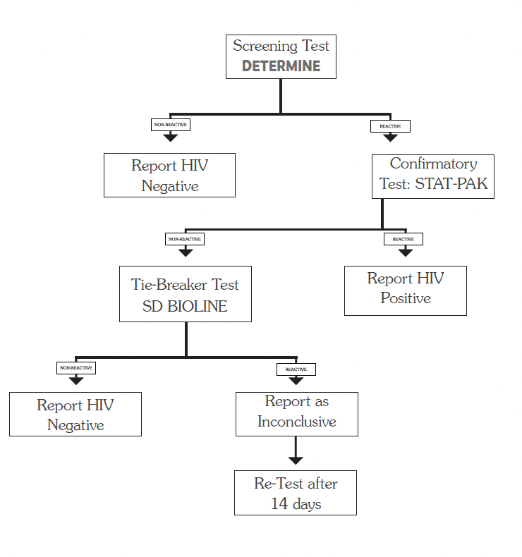

| Step | Action |
|---|---|
| Screening test | Determine |
| If screening test is non-reactive | Report HIV negative |
| If screening test is reactive | Perform confirmatory test using STAT-PAK |
| If confirmatory test is reactive | Report HIV positive |
| If confirmatory test is non-reactive | Perform tie-breaker test using SD Bioline |
| If tie-breaker test is reactive | Report as inconclusive and retest after 14 days |
| If tie-breaker test is non-reactive | Report HIV negative |

**HIV testing algorithm using the HIV-Syphilis Duo Kit in MCH settings**

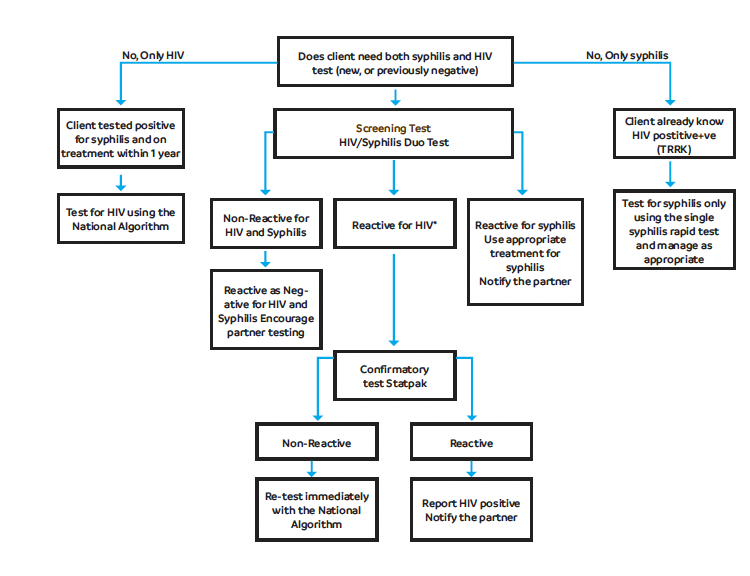

| Scenario | Action |
|---|---|
| Client needs both syphilis and HIV test, either new or previously negative | Use HIV/Syphilis Duo test |
| Client needs only HIV test | Test for HIV using the national algorithm |
| Client needs only syphilis test | Test for syphilis using the single syphilis rapid test and manage as appropriate |
| Client has tested positive for syphilis and is on treatment within 1 year | Manage according to syphilis treatment guidance |
| Client already knows they are HIV-positive | Test for syphilis only and manage as appropriate |
| HIV/Syphilis Duo test is non-reactive for HIV and syphilis | Report as negative for HIV and syphilis, and encourage partner testing |
| HIV/Syphilis Duo test is reactive for syphilis | Use appropriate treatment for syphilis and notify the partner |
| HIV/Syphilis Duo test is reactive for HIV | Perform confirmatory test using STAT-PAK |
| STAT-PAK is reactive | Report HIV positive and notify the partner |
| STAT-PAK is non-reactive | Retest immediately using the national algorithm |
Serological testing is available from HC2 level. In children below 18 months, testing is virological, based on direct detection of viral DNA using DNA-PCR.

Virological testing, including DNA-PCR and viral load, is done on dried blood spot (DBS) samples. These samples can be collected from HC2 and are sent to a central national laboratory through the hub system.

**HIV testing in children less than 18 months**

The recommended test for children below 18 months is virological testing using DNA-PCR. Antibody tests are not recommended for diagnosis in this age group because they may detect maternal antibodies passed from the mother to the child, which can give a false positive result.

**If the mother is HIV negative**

- The child is classified as HIV negative.

**If the mother is HIV positive**

- Do DNA-PCR at 6 weeks of age or at the earliest opportunity thereafter.
- Start cotrimoxazole prophylaxis and nevirapine syrup until the child’s HIV status is confirmed.
- If PCR is positive, enrol the child for ART.
- If PCR is negative and the child has never breastfed, classify the child as HIV negative.
- Stop cotrimoxazole and nevirapine.
- Follow up every 3 months and do an HIV rapid test, serological test, at 18 months.
- If PCR is negative but the child is breastfeeding or has breastfed in the last 6 weeks, recheck PCR 6 weeks after cessation of breastfeeding.

**If the mother’s HIV status is unknown**

- Test the mother and continue management according to the result.

**If the mother is unavailable**

- Perform rapid antibody testing on the child.
- The result gives an indication of the mother’s HIV status:
    - If the test is negative, classify the child as HIV negative.
    - If the test is positive, follow the algorithm for managing a child from an HIV-positive mother.

**Key HIV monitoring and diagnostic tests**

| Test | Description | LOC |
|---|---|---|
| CD4 | Measures the level of CD4 T lymphocytes, a subtype of white blood cell. It reflects the level of compromise of the immune system. It is used for initial assessment before ART and for monitoring ART effect. | HC2 |
| Viral load | Measures the quantity of virus in the blood. It is used to monitor the effect of ARVs. It is currently done using dried blood spot (DBS) samples. | HC2 |
| Genotype testing | HIV genotypic resistance testing is a qualitative test that detects mutations associated with ARV drug resistance. It evaluates whether the HIV strain infecting the individual has developed resistance to one or more ARV drugs. This helps identify a combination of ARVs to which the HIV strain is susceptible. |  |

**HIV-exposed infant testing algorithm**

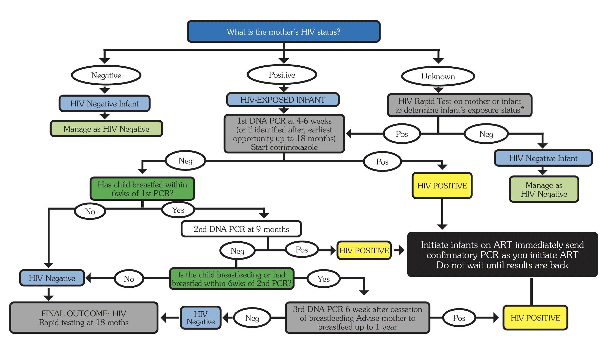{ .clinical-dosing-table }

!!! note "Notes"
    - If an infant with a negative previous PCR is symptomatic while still breastfeeding, take off a PCR sample at that point in time. If negative, another PCR sample must be taken according to the algorithm, either at 9 months or 6 weeks after breastfeeding.
    - If the mother’s status cannot be ascertained, a rapid test may be used in babies to determine HIV exposure status. DNA-PCR should be performed for a baby who is symptomatic, malnourished, or has TB as routine.
    - If breastfeeding is stopped before 9 months, a final DNA-PCR can be done at any point 6 weeks after cessation of breastfeeding.
    - For infants whose mothers are failing on any regimen, take off 2 DBS samples at the time of confirming the positive test: one for confirmation and one for HIV drug resistance testing.

**Summary of HIV-exposed infant testing pathway**

- Determine the mother’s HIV status.
- If the mother is HIV positive, classify the child as HIV-exposed and start cotrimoxazole prophylaxis.
- Do the first DNA-PCR at 4–6 weeks, or at the earliest opportunity up to 18 months.
- If PCR is positive, initiate ART immediately and send confirmatory PCR while starting ART.
- If PCR is negative, continue follow-up according to breastfeeding status.
- Repeat PCR after breastfeeding cessation where indicated.
- Do rapid testing at 18 months to determine final HIV status.

### 3.1.4 General Principles of Antiretroviral Treatment (ART)

**Assessment of patient history**

Assess the patient’s history, including:

- Level of understanding of HIV/AIDS
- Length of time since diagnosis of HIV infection
- Demographics and lifestyle, including employment status and nature of work
- History of previous ART
- Pregnancy risks, including contraception options and choices, current or planned pregnancy, and access to contraceptive services
- Sexual risks and disclosure, including willingness to practise safer sex, disclosure of HIV serostatus, condom use, HIV counselling, and testing of sex partners and children
- Symptoms of chronic pain and depression
- History of opportunistic infections and other significant illnesses, e.g., TB and STIs, hospitalisations, and surgeries
- Current medications, including anti-TB drugs and traditional therapies

**Physical examination**

Assess:

- Weight
- Nutritional status
- Functional capacity and level of disability
- Vital signs
- Skin
- Eyes
- Oropharynx, including presence of thrush
- Lymph nodes
- Lungs
- Heart
- Abdomen
- Genital tract, including STIs
- Extremities
- Nervous system

**Baseline laboratory tests to assess immunosuppression and disease aggressiveness**

- Confirm HIV serostatus
- CD4 testing
- Pregnancy test
- Full blood count, particularly for patients starting an AZT-containing regimen

**Baseline laboratory tests to assess general health and diagnose pre-existing HIV complications**

- Sputum smear for AFB for patients who have coughed for more than 2–3 weeks
- Chest X-ray for patients who have unproductive cough or whose AFB smears are negative
- Urine analysis for proteinuria, particularly for patients starting a TDF-containing regimen
- Syphilis and hepatitis B screening
- Liver and renal function tests, if available
- Cryptococcal antigen and urine LAM screening for patients whose CD4 count is <200 cells/mL
- Symptom-directed laboratory tests to diagnose pre-existing illnesses

**Staging of disease**

- Use WHO clinical criteria. See tables above.

**Counselling and assessment of patient readiness to start therapy**

- Assess education, information, or counselling support needs
- Develop an adherence plan

**Goals of treatment with antiretroviral medicines**

The goals of treatment are to:

- Inhibit viral replication, as reflected in plasma HIV concentration, to as low as possible and for as long as possible
- Promote restoration of the immune system
- Preserve or enhance immune function, including CD4 restoration, which prevents or delays clinical progression of HIV disease
- Minimise toxicities and side effects associated with medicines
- Improve quality of life and reduce HIV-related morbidity and mortality
- Promote growth and neurological development in children

**Tools to achieve the goals of therapy**

- Maximise adherence to ART through adequate patient support and access to community or facility-level adherence counselling
- Encourage disclosure of HIV serostatus, which reinforces adherence to ART
- Use rational sequencing of medicines to preserve future treatment options
- Use ARV medicine resistance testing when appropriate and available
- Use viral load estimates for monitoring

**Principles of ART**

Antiretroviral therapy is part of comprehensive HIV care. The guiding principles of good ART include:

- Efficacy and durability of the chosen medicine regimens
- Freedom from serious adverse effects and low toxicity
- Ease of administration, including no food restrictions, better palatability, and lower pill burden
- Affordability and availability of medicines and medicine combinations
- Organised sequencing, which spares other available formulations for second-line use while allowing harmonisation of regimens across age and population groups
- Ongoing support to help the patient maintain adherence

**Limitations of ART**

- Antiretroviral medicines are not a cure for HIV but greatly improve quality of life when used appropriately
- ARVs are relatively expensive and require adequate infrastructure and knowledgeable healthcare workers
- Medicine interactions and resistance may decrease the potency of ARVs
- Patients may develop adverse medicine reactions
- Patients have to take at least 95% of their pills in order to respond well
- Adherence is key to successful therapy
- The medicines have to be taken for life
- Some patients may not respond or benefit from treatment and may continue to regress despite high adherence
- Children are dependent on adults for adherence to ART

**Available medicines for ART**

At present, antiretroviral medicines come in six classes. These classes attack different sites and stages of the HIV life cycle, thereby interfering with viral reproduction.

| Class | Examples |
|---|---|
| **Nucleoside/nucleotide reverse transcriptase inhibitors (NRTIs/NtRTIs)** These incorporate themselves into the DNA of the virus, thereby stopping the building process. | Tenofovir (TDF) Zidovudine (AZT) Lamivudine (3TC) Abacavir (ABC) |
| **Non-nucleoside reverse transcriptase inhibitors (NNRTIs)** These stop HIV production by binding directly onto the reverse transcriptase enzyme and prevent conversion of RNA to DNA. | Efavirenz (EFV) Nevirapine (NVP) Etravirine (ETV) |
| **Integrase inhibitors** These interfere with the ability of HIV DNA to insert itself into host DNA and copy itself. | Dolutegravir (DTG) Raltegravir (RAL) |
| **Protease inhibitors (PIs)** These prevent HIV from being successfully assembled and released from the infected CD4 cell. Boosted PIs are combinations of low-dose ritonavir (RTV) with a PI for pharmacoenhancement. | Atazanavir (ATV) Lopinavir (LPV) Darunavir (DRV) Ritonavir (RTV), abbreviated as “r” when boosting other PIs, e.g., ATV/r, LPV/r |
| **Entry inhibitors / HIV fusion inhibitors** These prevent the HIV virus particle from infecting the CD4 cell. | Enfuvirtide (T-20) |
| **CCR5 antagonists** These block the CCR5 co-receptor molecules that HIV uses to infect new target T-cells. Some forms of HIV use a different co-receptor, so some patients may not benefit from maraviroc. | Maraviroc |

**Initiation of ART**

!!! note "Test and Treat"
    It is recommended to initiate ART at the earliest opportunity in all documented HIV-infected adults, adolescents, and children, regardless of CD4 count and WHO clinical staging.

Evidence and programmatic experience have shown that early initiation of ART reduces mortality, morbidity, and HIV transmission. However, priority should be given to patients with lower CD4 counts and those who are symptomatic.

A CD4 count is not necessary for ART initiation, but it should be used to identify patients with advanced HIV disease.

**ART in children**

The vast majority of infants and children with HIV, about 90%, acquire the infection through mother-to-child transmission.

HIV infection follows a more aggressive course among infants and children than among adults. Without access to life-saving medicines, including ART and preventive interventions such as cotrimoxazole prophylaxis, 30% die by age 1 year and 50% die by age 2 years.

Early HIV diagnosis and ARV treatment are critical for infants. A significant number of lives can be saved by initiating ART for HIV-positive infants immediately after diagnosis within the first 12 weeks of life.

**General principles**

- ARV doses need to be adjusted from time to time as children grow quickly and their weight changes.
- Before a child begins ART, the following assessments must be made:
    - Readiness of parents, caretakers, or the child, if older, to start ART
    - Complete pre-treatment baseline assessment. See previous sections.

**Process of initiating ART**

Before initiating ART, health workers should:

- Assess all clients for any evidence of opportunistic infections (OIs).
- If the patient has TB or cryptococcal meningitis, defer ART and initiate it after starting treatment for these opportunistic infections.
- For patients without TB or cryptococcal meningitis, offer ART on the same day through an opt-out approach.
- In the opt-out approach, patients should be prepared and assessed for readiness to start ART on the same day.

!!! note "Same-day ART initiation"
    If a client is ready, ART should be initiated on the same day.

    If a client is not ready or opts out of same-day initiation, a timely ART preparation plan should be agreed upon, with the aim of initiating ART within 7 days for children and pregnant women, and within 1 month for adults.

### 3.1.5 Recommended First-Line Regimens in Adults, Adolescents, Pregnant Women and Children

!!! note "Use latest official HIV management guidelines"
    HIV management guidelines are constantly updated according to emerging evidence and public policy decisions. Always refer to the latest official Ministry of Health guidelines.

The 2022 guidelines recommend dolutegravir (DTG), an integrase inhibitor, as the anchor ARV in the preferred first-line and second-line treatment regimens for all HIV-infected clients, including children, adolescents, men, women, pregnant women, breastfeeding women, adolescent girls, and women of childbearing potential.

ART regimens in children are age- and weight-dependent. As children grow, doses and regimens have to be changed according to the guidelines.

**Recommended first-line ARV regimens in adults, adolescents, pregnant or breastfeeding women and children**

| Patient category | Preferred regimen | Alternative regimens |
|---|---|---|
| **Adults, including pregnant women, breastfeeding mothers, and adolescents ≥30 kg** | TDF + 3TC + DTG | If DTG is contraindicated, use TDF + 3TC + EFV 400.  If TDF is contraindicated, use TAF + FTC + DTG.  If TDF or TAF is contraindicated, use ABC + 3TC + DTG.  If TDF or TAF and DTG are contraindicated, use ABC + 3TC + EFV 400.  If EFV and DTG are contraindicated, use TDF + 3TC + ATV/r or ABC + 3TC + ATV/r. |
| **Children ≥20 kg to <30 kg** | ABC + 3TC + DTG | If DTG is contraindicated, use ABC + 3TC + LPV/r tablets.  If ABC is contraindicated, use TAF + FTC + DTG for children >6 years and >25 kg.  If ABC and TAF are contraindicated, use AZT + 3TC + DTG. |
| **Children <20 kg** | ABC + 3TC + DTG | If intolerant or appropriate DTG formulations are not available, use ABC + 3TC + LPV/r granules.  If intolerant to LPV/r, use ABC + 3TC + EFV in children >3 years and >10 kg.  If ABC is contraindicated, use AZT + 3TC + DTG or LPV/r. |

!!! note "Notes"
    1. Contraindications for DTG should be assessed using the DTG screening tool before DTG initiation. These include known diabetes and use of anticonvulsants such as carbamazepine, phenytoin, and phenobarbital.
    2. Contraindications for TDF and TAF include renal disease, GFR <60 mL/min, and weight <30 kg.
    3. TAF can be used in sub-populations with bone density anomalies.
    4. Children should be assessed individually for ability to correctly take the different formulations of LPV/r.

**Important drug interactions**

| Drug family | ARV drug | Interaction | Action |
|---|---|---|---|
| Anti-TB medicines | NVP | Rifampicin decreases NVP concentrations in blood and may cause liver toxicity. | Do not co-administer NVP and rifampicin.  See TB/ARV co-management guidance. |
| Anti-TB medicines | DTG | Rifampicin lowers DTG levels. | Adjust DTG dose to twice daily. |
| Anti-TB medicines | ATV/r, LPV/r, DRV, RTV | Rifampicin increases metabolism of protease inhibitors (PIs). | If given together with LPV/r, increase the dose of RTV to achieve a 1:1 ratio. |
| Combined oral contraceptive pills and hormonal implants, e.g., etonogestrel | EFV or ATV/r, LPV/r, DRV, RTV | Risk of contraceptive failure due to increased metabolism of contraceptives. | Use an additional barrier method, Depo-Provera, or IUDs. |
| Anxiolytics, e.g., midazolam and diazepam | ATV/r, LPV/r, DRV, RTV | Risk of respiratory depression with midazolam and increased sedation with diazepam. | Reduce dose of midazolam or diazepam. |
| Simvastatin, rosuvastatin, atorvastatin | ATV/r, LPV/r, DRV, RTV | Inhibition of CYP450 3A4, leading to reduced metabolism of statins. | Use atorvastatin with lowered dose and monitor for side effects such as muscle pains. |
| Anti-epileptics, e.g., carbamazepine, phenobarbital, phenytoin | EFV, DTG, etravirine | Carbamazepine decreases DTG levels by 30–70%. | Use valproic acid. |
| Drugs for acid reflux or ulcers, e.g., omeprazole, esomeprazole, lansoprazole, pantoprazole | ATV/r | Reduced concentrations of atazanavir. | Use alternatives such as ranitidine or cimetidine. |
| Polyvalent cation products containing Mg, Al, Fe, Ca, or Zn, e.g., vitamin supplements and antacids | DTG | Reduce DTG levels. | Take DTG 2 hours before or 6 hours after the product to avoid interaction. |
| Antimalarial drugs, e.g., artemether/lumefantrine and halofantrine | ATV | Both could prolong the QT interval. | When given with artemether/lumefantrine, monitor closely for undesired effects.  Do not give halofantrine together with ATV. |
| Metformin | DTG | DTG increases metformin levels and may increase the risk of hypoglycaemia and metabolic acidosis. | Close follow-up is recommended, including routine electrolytes, BUN, creatinine, and random blood sugar tests. |

### 3.1.6 Monitoring of ART

The schedule of monitoring visits follows a preset calendar during the first year after initiation of ART:

- At 1, 2, and 3 months from the start of ART
- At 6, 9, and 12 months

After 12 months on ART, the Differentiated Service Delivery (DSD) model is followed. Under this model, the schedule and type of periodic review are based on the individual needs and characteristics of the patient.

The aims of the DSD model are to:

- Provide a client-centred approach, allowing stable patients to have spaced clinical reviews and fast-track medicine pick-ups
- Use resources more efficiently by reducing overcrowding and long waiting times
- Give more attention to unstable or complex patients

Refer to the Ministry of Health HIV/ART guidelines for more details.

**Types of ART monitoring**

| Type of monitoring | Components |
|---|---|
| **Clinical monitoring** | Screen for and manage opportunistic infections (OIs) and STIs.  Assess pregnancy status and/or the use or need for family planning.  Screen for and manage comorbidities, including depression.  Assess weight and nutritional status.  Assess disclosure.  For children and adolescents, assess growth and development, school attendance, behavioural issues, and sexual awareness. |
| **Laboratory monitoring** | Viral load is the preferred method for monitoring response to ART and detecting treatment failure.  CD4 monitoring is recommended at baseline to screen for risk of opportunistic infections, in patients who are virally suppressed but are in WHO clinical stage 3 or 4, and in patients on prophylaxis for cryptococcal infection to guide when to stop fluconazole.  Other tests should be done according to clinical findings. |

**Viral load monitoring**

Viral load is the preferred method for monitoring response to ART and detecting treatment failure.

- Children and adolescents under 19 years of age: first viral load at 6 months and 12 months from ART initiation. If suppressed, repeat every 6 months thereafter.
- Adults: first viral load at 6 months after ART initiation. If suppressed, repeat at 12 months, then every 12 months thereafter if suppression is maintained.
- HIV-positive pregnant and breastfeeding women newly initiated on ART at ANC: conduct viral load testing at 3 months on ART. If suppressed, repeat every 3 months throughout pregnancy and until cessation of breastfeeding.
- HIV-positive pregnant and breastfeeding women already on ART at ANC1 or MBCP: conduct viral load testing at the first ANC or MBCP visit. If suppressed, repeat every 3 months throughout pregnancy and until cessation of breastfeeding.
- If viral load is unsuppressed, refer to the viral load testing algorithm.
- After every treatment switch following treatment failure, conduct viral load testing 6 months after switching to second-line or third-line ART.
- For patients on third-line ART, conduct viral load testing every 6 months. If viral load is unsuppressed, genotype testing is recommended.

**CD4 monitoring**

CD4 monitoring is recommended:

- At baseline to screen for risk of opportunistic infections
- In patients who are virally suppressed but are in WHO clinical stage 3 or 4
- In patients on prophylaxis for cryptococcal infection, to guide the decision on when to stop fluconazole

**Other tests**

Other laboratory tests should be done according to clinical findings.

**ART clinical assessment and laboratory monitoring schedule**

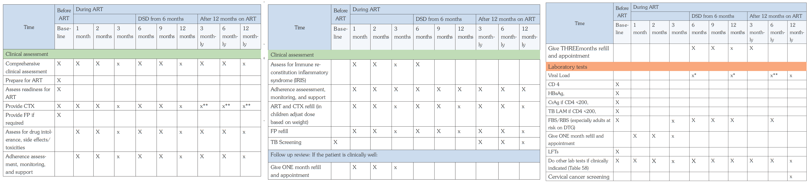{ .clinical-dosing-table }

!!! note "Use of schedule"
    The image above preserves the official ART clinical assessment, follow-up, refill, and laboratory monitoring schedule from the source guideline. The notes below support navigation and mobile reading but should be interpreted together with the official schedule image.

!!! note "Monitoring schedule notes"
    - If viral load is not suppressed, call the patient back for intensive adherence counselling.
    - Additional viral load monitoring applies to children, adolescents, pregnant women, and breastfeeding women as specified in the schedule.

**Viral load testing algorithm for children, adolescents and adults**

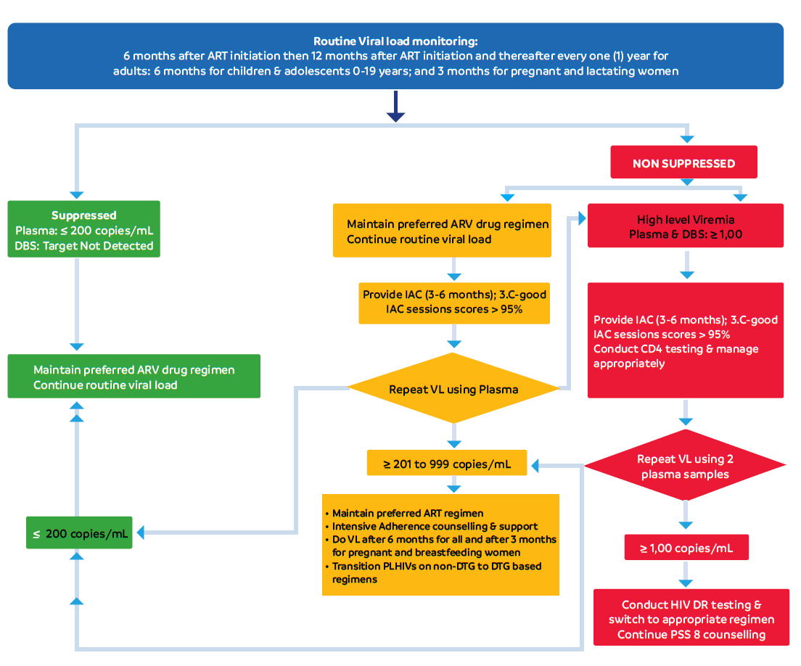{ .clinical-dosing-table }

**Summary of viral load testing pathway**

- Conduct routine viral load monitoring according to patient category and time on ART.
- If viral load is suppressed, maintain the preferred ART regimen and continue routine viral load monitoring.
- If viral load is between 201 and 999 copies/mL, maintain the preferred ART regimen, provide intensive adherence counselling and support, and repeat viral load testing as recommended.
- If viral load is ≥1,000 copies/mL, provide intensive adherence counselling and repeat viral load testing using the appropriate sample type.
- If repeat viral load remains unsuppressed despite good adherence, conduct HIV drug resistance testing where indicated and switch to an appropriate regimen.
- Continue psychosocial support and counselling throughout the process.

<!-- Source: 3-01-07-arv-toxicity.md -->

### 3.1.7 ARV Toxicity

ARV drugs can cause a wide range of toxicities, from mild to life threatening. Active monitoring and management of toxicities and side effects is important not only to avoid negative medical outcome but also to ensure that they do not negatively affect adherence.

|CATEGORY|ACTION|
|---|---|
|Severe LifeThreatening Reactions (e.g. SJS/TEN, severe hepatitis|Immediately discontinue all ARV drugs (possibly all drugs in general), manage the medical event and substitute the offending drug when the patient is stabilised|
|Severe Reactions (e.g. Hepatitis, anaemia)|Stop the offending drug and substitute it without stopping the ART (if clinically possible)|
|Moderate Reactionsy (Gynaecomastia, lipodystrophy)|Substitute with a drug in the same ARV class but with a different toxicity profile, or with a drug in a different class Do not discontinue ART. Continuation of ART as long as feasible. If the patient does not improve on symptomatic therapy, consider single- drug substitution|
|Mild Reactions (Headache, minor rash, nausea)|Do not discontinue or substitute ART. Reassure the patient or caregiver that while the reaction may be bothersome, it does not require a change in therapy and often it subsides in few weeks.|
| |Provide support to mitigate the adverse reactions as well as counseling about the events|

**Major ARV toxicity events and suggested management**

| ARV drug / regimen | Major adverse / toxicity events | Presenting signs / symptoms | Suggested management |
|---|---|---|---|
| **DTG** | 1. Hyperglycaemia 2. Insomnia 3. Hepatotoxicity 4. Hypersensitivity reactions | 1. Excessive drinking or eating, excessive urination  2. Difficulty falling asleep  3. Nausea, vomiting, right upper quadrant abdominal pain, yellow urine or eyes  4. Skin itching, localized or diffuse; dizziness; faintness; difficulty breathing; nausea; vomiting; diarrhoea; and abdominal cramping | Do RBS to confirm hyperglycaemia, then substitute with EFV.  For insomnia, ensure the patient is taking DTG during the day. If insomnia persists, substitute with EFV.  If EFV is contraindicated, substitute with ATV/r. |
| **EFV** | 1. Convulsions 2. Hepatotoxicity 3. Severe skin and hypersensitivity reactions 4. Gynaecomastia 5. Persistent central nervous system toxicity | New-onset seizures  Nausea, vomiting, right upper quadrant abdominal pain, yellow urine or eyes  New-onset skin rash  Breast enlargement in men  Dizziness, insomnia, abnormal dreams, or mental symptoms such as anxiety, depression, mental confusion, or suicidality | If symptoms persist, substitute EFV with DTG.  If DTG is contraindicated, substitute with ATV/r.  In case the patient is on EFV 600 mg, lower the dose of EFV to 400 mg.  In case the patient is on EFV 400 mg, reassure the patient. |
| **TDF** | 1. Chronic kidney disease, acute kidney injury, and Fanconi syndrome 2. Decreased bone mineral density 3. Lactic acidosis or severe hepatomegaly with steatosis 4. Severe vomiting | 1. Lower back pain, change in urine volume  2. Bone aches, spontaneous fractures  3. Exhaustion or extreme fatigue, muscle cramps or pain, headache, abdominal pain or discomfort, decrease in appetite  4. Persistent vomiting resulting in severe dehydration | Do LFTs and RFTs. If deranged, for example elevated liver enzymes and/or GFR <60 mL/min, substitute with ABC.  If ABC is contraindicated, substitute with AZT. |
| **ABC** | 1. Hypersensitivity reaction | Skin itching, localized or diffuse; dizziness; faintness; difficulty breathing; nausea; vomiting; diarrhoea; and abdominal cramping | Substitute with TDF.  If TDF is contraindicated, substitute with AZT. |
| **AZT** | 1. Severe anaemia, neutropenia 2. Lactic acidosis or severe hepatomegaly with steatosis 3. Lipoatrophy, lipodystrophy, myopathy 4. Severe vomiting | 1. Easy fatigability, breathlessness, recurrent infections  2. Exhaustion or extreme fatigue, muscle cramps or pain, headache, abdominal pain or discomfort, decrease in appetite  3. Body fat changes, muscle symptoms or weakness  4. Persistent vomiting resulting in severe dehydration | Do Hb. If Hb is <8 g/dL, substitute with TDF.  If TDF is contraindicated, substitute with ABC. |

<!-- Source: 3-01-08-recommended-second-line-regimens-in-adults-adolescents-pregnant-women-and-childr.md -->

### 3.1.8 Recommended Second-Line Regimens in Adults, Adolescents, Pregnant Women and Children

Patients may need to be switched to second-line regimens in case of treatment failure, and to third-line regimens if they fail on second-line drugs.

Third-line regimens require HIV drug resistance testing to guide the choice of appropriate medicines. Patients requiring third-line regimens should be referred to specialised ART centres.

Factors involved in treatment failure include:

- Poor adherence
- Inadequate drug levels
- Pre-existing drug resistance

!!! note "Before switching therapy"
    Before switching therapy, it is essential to assess and address adherence issues, and provide intensive adherence counselling where necessary.

**Criteria for defining treatment failure**

| Definition | Comment |
|---|---|
| **Virological failure** | Two consecutive viral loads >1,000 copies/mL, done 3 to 6 months apart, with intensive adherence support following the first viral load test.  The patient should have been on ART for at least 6 months. |
| **Clinical failure: adults and adolescents** | New or recurrent WHO clinical stage 3 or 4 disease, except TB, in a patient who has been on an effective ART regimen for at least 6 months.  The condition must be differentiated from immune reconstitution inflammatory syndrome (IRIS) occurring after ART initiation. |
| **Clinical failure: children** | New or recurrent WHO clinical stage 3 or 4 event, except TB, in a child who has been on an effective ART regimen for at least 6 months.  The condition must be differentiated from immune reconstitution inflammatory syndrome (IRIS) occurring after ART initiation. |

**Recommended second-line ARV regimens**

| Population | Failing first-line regimen | Recommended second-line regimen | Alternative second-line regimen | Third-line guidance |
|---|---|---|---|---|
| Adults and adolescents ≥30 kg, including pregnant and breastfeeding women | TDF + 3TC + EFV TDF + 3TC + NVP TAF + FTC + EFV | AZT + 3TC + DTG | AZT + 3TC + DRV/r or ATV/r | All third-line regimens should be guided by HIV drug resistance testing. If there is susceptibility to all drugs, use the preferred or alternative regimen choices in the guideline table. |
| Adults and adolescents ≥30 kg, including pregnant and breastfeeding women | TDF + 3TC + DTG TAF + FTC + DTG | AZT + 3TC + DRV/r | AZT + 3TC + ATV/r | All third-line regimens should be guided by HIV drug resistance testing. |
| Adults and adolescents ≥30 kg, including pregnant and breastfeeding women | AZT + 3TC + NVP AZT + 3TC + EFV ABC + 3TC + NVP ABC + 3TC + EFV | TDF + 3TC + DTG or TAF + FTC + DTG | TDF + 3TC + ATV/r or TAF + FTC + ATV/r | All third-line regimens should be guided by HIV drug resistance testing. |
| Adults and adolescents ≥30 kg, including pregnant and breastfeeding women | AZT + 3TC + DTG ABC + 3TC + DTG | TDF + 3TC + DRV/r or TAF + FTC + DRV/r | TDF + 3TC + ATV/r or TAF + FTC + ATV/r | All third-line regimens should be guided by HIV drug resistance testing. |
| Children ≥20 kg to <30 kg | ABC + 3TC + EFV ABC + 3TC + NVP | AZT + 3TC + DTG | AZT + 3TC + LPV/r | All third-line regimens should be guided by HIV drug resistance testing. |
| Children ≥20 kg to <30 kg | ABC + 3TC + LPV/r | AZT + 3TC + DTG | AZT + 3TC + DRV/r | All third-line regimens should be guided by HIV drug resistance testing. |
| Children ≥20 kg to <30 kg | ABC + 3TC + DTG | AZT + 3TC + DRV/r | AZT + 3TC + LPV/r | All third-line regimens should be guided by HIV drug resistance testing. |
| Children <20 kg | AZT + 3TC + EFV AZT + 3TC + NVP | ABC + 3TC + DTG or TAF + FTC + DTG | ABC + 3TC + LPV/r or TAF + FTC + LPV/r | For details on third-line ART, refer to the third-line ART implementation guides. |
| Children <20 kg | AZT + 3TC + LPV/r | ABC + 3TC + DTG or TAF + FTC + DTG | ABC + 3TC + DRV/r or TAF + FTC + DRV/r | For details on third-line ART, refer to the third-line ART implementation guides. |
| Children <20 kg | AZT + 3TC + DTG | ABC + 3TC + DRV/r or TAF + FTC + DRV/r | ABC + 3TC + LPV/r or TAF + FTC + LPV/r | For details on third-line ART, refer to the third-line ART implementation guides. |
| Children <20 kg | ABC + 3TC + EFV ABC + 3TC + NVP | AZT + 3TC + DTG | AZT + 3TC + LPV/r | For details on third-line ART, refer to the third-line ART implementation guides. |
| Children <20 kg | ABC + 3TC + LPV/r | AZT + 3TC + DTG | AZT + 3TC + DRV/r | For details on third-line ART, refer to the third-line ART implementation guides. |
| Children <20 kg | AZT + 3TC + EFV AZT + 3TC + NVP | ABC + 3TC + DTG | ABC + 3TC + LPV/r | For details on third-line ART, refer to the third-line ART implementation guides. |
| Children <20 kg | AZT + 3TC + LPV/r ABC + 3TC + DTG | Not clearly extracted | ABC + 3TC + DRV/r | For details on third-line ART, refer to the third-line ART implementation guides. |
| Children <20 kg | AZT + 3TC + DTG | ABC + 3TC + DRV/r | ABC + 3TC + LPV/r | For details on third-line ART, refer to the third-line ART implementation guides. |

**Notes on second-line and third-line ART**

- All people living with HIV should receive resistance testing to inform prescription of second-line and third-line medicines.
- Since all third-line clients will have prior protease inhibitor exposure, DRV/r should be taken twice daily.
- For recipients of care on an NNRTI-based first-line regimen whose viral load is not suppressed, switch without a second viral load, but conduct intensive adherence counselling to improve adherence to the new regimen.
- For all people living with HIV failing first-line ART, optimise the second-line ART regimen using HIV drug resistance testing.

**Dosing tables for ARV medicines**

The following dosing tables should be used together with the latest Ministry of Health HIV/ART guidelines. The tables are retained as images to preserve the official dosing layout and avoid transcription errors.

**Fixed-dose combination tablets/granules: ABC/3TC, AZT/3TC, TDF/3TC and TDF/3TC/EFV**

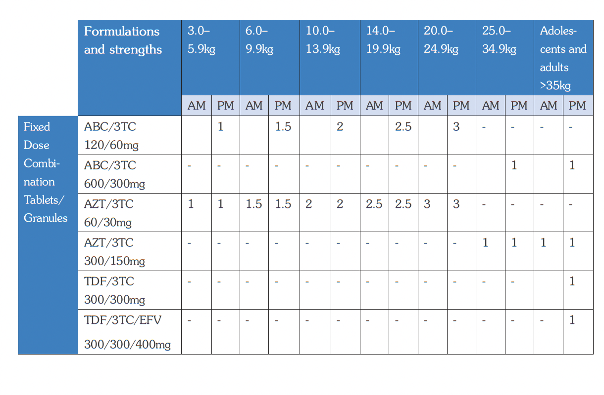{ .clinical-dosing-table }

**Fixed-dose combination tablets/granules: DTG-based and LPV/r-based regimens**

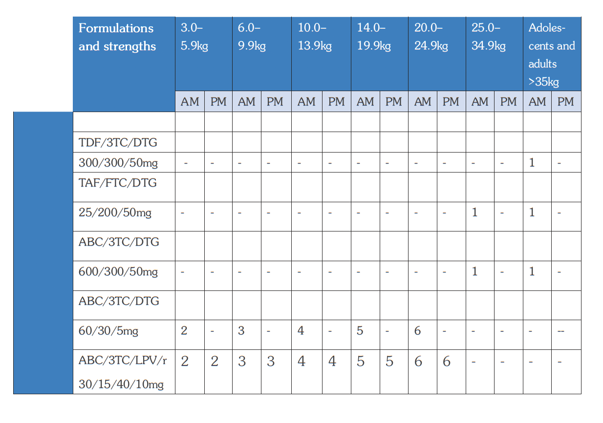{ .clinical-dosing-table }

**Individual ARV formulations: DTG, EFV, LPV/r, DRV/r, ATV/r and raltegravir**

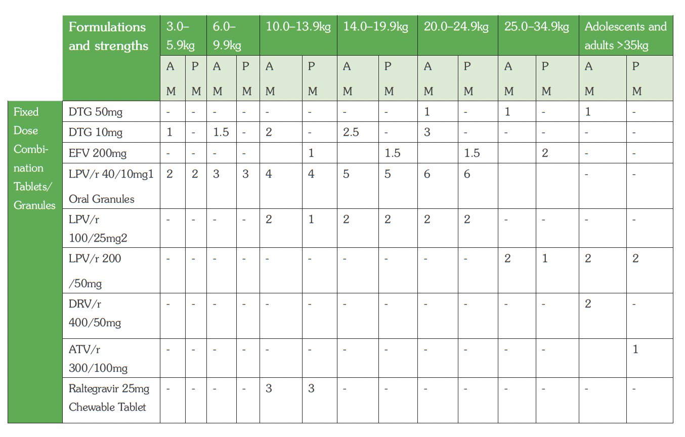{ .clinical-dosing-table }

**Individual ARV formulations: raltegravir, DRV, RTV and ETV**

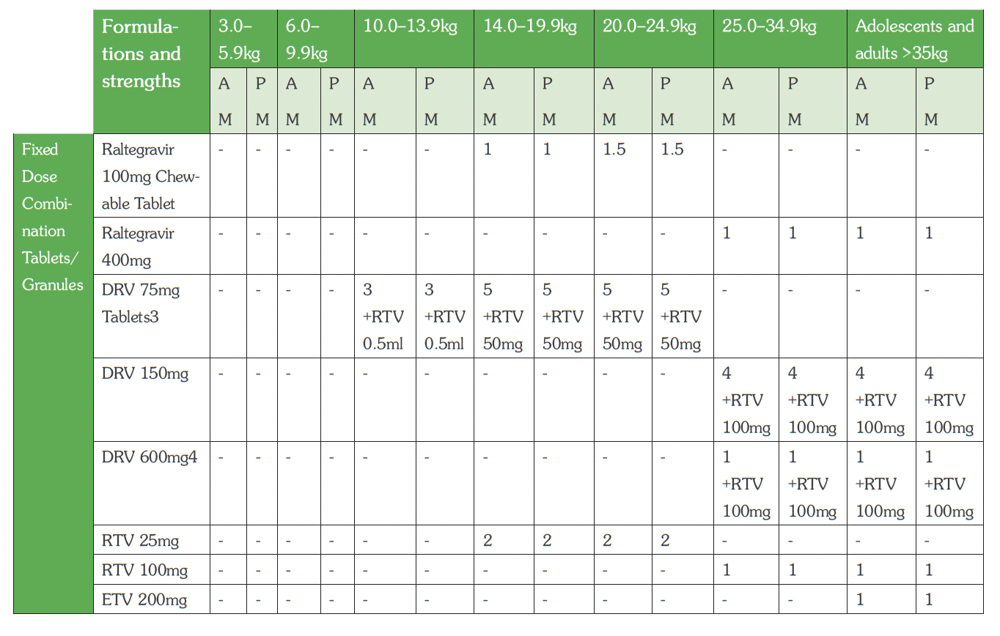{ .clinical-dosing-table }

!!! note "Use of ARV dosing tables"
    The ARV dosing tables above preserve the official source layout. Because dosing tables are clinically sensitive, the image tables should be used as the authoritative dosing reference.

**Dosing table notes**

- For children ≥10 kg who are able to swallow tablets, give LPV/r 100/25 mg tablets.
- Two tablets of LPV/r 100/25 mg can be substituted with one tablet of LPV/r 200/50 mg to reduce pill burden. These tablets should be administered whole and should not be cut or crushed.
- DRV must be administered with RTV. In children <15 kg, use 0.5 mL of RTV 80 mg/mL oral suspension. In children 15 to 25 kg, use 2 tablets of RTV 25 mg. In children above 25 kg, use 3 tablets of RTV 25 mg. DRV is always taken with food.
- DRV 600 mg must be co-administered with RTV 100 mg.

### 3.1.9 Mother-to-Child Transmission of HIV

Mother-to-child transmission of HIV may occur:

- During pregnancy: 15–20%
- During labour and delivery: 60–70%
- After delivery through breastfeeding: 15–20%

**Predisposing factors**

- High maternal viral load
- Depleted maternal immunity, e.g., very low CD4 count
- Prolonged rupture of membranes
- Intrapartum haemorrhage and invasive obstetric procedures
- Twin delivery, where the first twin is at higher risk of infection than the second twin
- Prematurity, where a premature baby is at higher risk than a term baby
- Mixed feeding, which carries a higher risk than exclusive breastfeeding or replacement feeding

**Investigations**

- HIV serological testing
- HIV DNA-PCR testing of babies. See infant testing algorithm in section 3.1.2.
- Viral load testing every 6 months

**Management**

All HIV services for pregnant mothers are offered in the MCH clinic. After delivery, the mother and baby remain in the MCH postnatal clinic until the HIV status of the child is confirmed. They are then transferred to the general ART clinic.

The current policy aims at elimination of mother-to-child transmission of HIV (eMTCT) through a continuum of care with the following elements:

- Primary HIV prevention for men, women, and adolescents
- Prevention of unintended pregnancies among women living with HIV
- Prevention of HIV transmission from women living with HIV to their infants
- Provision of treatment, care, and support to all women infected with HIV, their children, and their families

### 3.1.9.1 Management of HIV-Positive Pregnant Mother

Management of HIV-positive pregnant women should include routine HIV testing services, syphilis screening, antenatal care, laboratory monitoring, ART initiation or optimisation, risk assessment for the unborn baby, and risk reduction counselling.

**HTS and syphilis testing in ANC**

Offer routine HIV testing services (HTS) and syphilis testing to pregnant women and their partners, with same-day results using the SD Bioline HIV/Syphilis Duo test according to the recommended algorithm.

If syphilis is diagnosed, treat to reduce the risk of adverse pregnancy outcomes and mother-to-child transmission.

- For pregnant women or girls with early syphilis, give benzathine penicillin G 2.4 million units intramuscularly once.
- Early syphilis includes primary, secondary, and early latent syphilis of not more than two years’ duration.
- For late syphilis or syphilis of unknown stage, give benzathine penicillin G 2.4 million units intramuscularly once weekly for three consecutive weeks.
- Late syphilis is defined as infection of more than two years’ duration without evidence of treponemal infection.
- Adequate maternal treatment for prevention of congenital syphilis is defined as at least one injection of 2.4 million units of intramuscular benzathine penicillin at least 30 days before delivery.
- If allergic to penicillin, alternative treatment may include procaine penicillin, erythromycin, azithromycin, or ceftriaxone, according to clinical guidance.

For mothers already on ART, offer syphilis screening using syphilis rapid tests.

**HIV prevention, retesting, and linkage**

- Offer HTS, including provider-initiated testing and counselling (PITC), voluntary counselling and testing (VCT), and couple testing.
- Support mutual disclosure.
- Link all HIV-positive seroconcordant couples and HIV-positive individuals in serodiscordant relationships to ART.
- Offer PrEP to all pregnant and breastfeeding mothers at substantial risk of HIV acquisition, and to HIV-negative partners in serodiscordant couples.
- For HIV-negative pregnant women, retest in the third trimester, during labour, or shortly after delivery because of the high risk of acquiring HIV infection during pregnancy.
- Retest HIV-negative pregnant women in serodiscordant relationships every three months.
- Retest the following HIV-negative pregnant women within four weeks of the first test:
    - Pregnant women with STI, HBV, or TB infection
    - Pregnant women with a specific incident of HIV exposure within the past three months
- Provide risk reduction counselling to HIV-negative women.

**Hepatitis B testing in ANC**

Test pregnant women or girls and their partners for hepatitis B during antenatal care.

For patients who are HBsAg positive:

- Assess HBeAg and HBV viral load.
- If HBeAg negative and HBV viral load is <200,000 IU/mL, monitor with CBC, LFTs, and viral load at 6 and 12 months.
- If HBeAg positive and HBV viral load is >200,000 IU/mL, initiate prophylactic treatment at 24 weeks of gestation or at the earliest contact.
- Discontinue hepatitis B prophylactic medication 3 months after delivery.
- After starting treatment, monitor LFTs at 4, 8, 12, and 24 weeks, and thereafter annually.
- Monitor HBV viral load at 6 and 12 months.

**Antenatal care package for all pregnant women**

All pregnant women, regardless of HIV status, should receive the standard antenatal care package.

General care includes:

- At least eight ANC visits, with encouragement and support to start ANC in the first trimester
- Routine iron, folic acid, and multivitamin supplementation
- Deworming in the second trimester using mebendazole
- Nutrition assessment, counselling, and support
- Counselling and encouragement to deliver at a health facility
- TB screening and appropriate action
- Weight and blood pressure measurement at every visit

Laboratory services include:

- Screening and treatment for syphilis, HIV, hepatitis B, other STIs, and anaemia
- Syndromic management of STIs where appropriate
- Urinalysis to detect urinary tract infection, proteinuria, haematuria, or glycosuria
- Blood slide for malaria for all pregnant women
- Blood grouping in anticipation of possible transfusion
- Screening for hereditary conditions where suspected, such as sickling test

**Laboratory investigations specific to HIV-positive pregnant women**

- Perform a baseline CD4 count for HIV-positive women. The result is not required for ART initiation.
- Do haemoglobin testing for women or girls starting AZT-based ART at baseline and four weeks after ART initiation.
- For HIV-positive pregnant women or girls already on ART, do viral load testing at the first ANC visit, then follow the viral load testing algorithm for pregnant and breastfeeding women.
- For newly diagnosed HIV-positive pregnant women or girls, do viral load testing 3 months after ART initiation and then every 3 months until the end of the mother-to-child transmission risk period.

**Comprehensive care for pregnant women with HIV**

At each visit, provide:

- Comprehensive clinical evaluation
- TB screening and appropriate action
- INH for eligible women or girls
- Screening and management of opportunistic infections
- Ongoing adherence support

Pregnant women on cotrimoxazole preventive therapy should not be given sulphadoxine-pyrimethamine (Fansidar) for intermittent preventive treatment of malaria in pregnancy.

**Risk assessment of the unborn baby**

Conduct a risk assessment of the unborn baby at the first ANC visit for all HIV-positive pregnant women, and repeat the assessment at every visit.

Flag pregnancies as high risk if the mother is:

- Newly initiated on ART in the third trimester or during the breastfeeding period
- Having a most recent viral load that is non-suppressed
- Testing HIV-positive later in pregnancy or during breastfeeding

Closely monitor all high-risk pregnancies.

**ART for pregnant and breastfeeding women with HIV**

All women or girls living with HIV who are identified during pregnancy, labour, delivery, or breastfeeding should be started on lifelong ART.

- Initiate ART on the same day.
- Initiate adherence counselling immediately and sustain it intensively for the first three months, then maintain adherence support for life.
- Initiate the mother on once-daily fixed-dose combination TDF + 3TC + DTG with pharmacovigilance.
- Mothers initiated on TDF + 3TC + EFV400 should transition to TDF + 3TC + DTG at 6 to 9 months postpartum if the viral load within the past 6 months is suppressed.
- If the mother is already on ART for more than 6 months with TDF + 3TC + EFV, do viral load testing. If virally suppressed, maintain TDF + 3TC + EFV400 until 6 to 9 months after delivery, then substitute EFV with DTG if the viral load within the past 6 months is suppressed.
- If she is already on a DTG-based first-line regimen and virally suppressed, maintain the same regimen.
- If she is already on ART and the viral load is not suppressed, manage as treatment failure and switch to a DTG-based second-line regimen if there has been no previous exposure to DTG.
- If she is on second-line ART with ATV/r or LPV/r and is virally suppressed, maintain the same regimen until 6 to 9 months after delivery, then substitute the protease inhibitor with DTG if the viral load within the past 6 months is suppressed and there has been no previous exposure to DTG.
- All women should receive pre-ART adherence counselling before initiating ART and ongoing adherence support thereafter.
- ART should be initiated and maintained at the mother-baby care point in MCH.

!!! note "If the mother refuses ART or adherence is poor"
    Maternal viral load suppression is key for preventing breastfeeding transmission. If viral load suppression is not certain, infant prophylaxis may serve as a backup to prevent mother-to-child transmission. Clinical providers should continue infant prophylaxis with NVP in these specific scenarios. Continuation of prophylaxis should be seen as an interim measure while maternal adherence is improved.

**Risk reduction counselling and support**

- Encourage consistent and correct condom use.
- Encourage women to deliver at health facilities.
- For HIV-negative pregnant women, offer other prevention services, such as safe male circumcision for the partner, and mitigate or manage gender-based violence.

**Visit schedules for HIV-positive pregnant women**

| Category | Definition | Visit schedule |
|---|---|---|
| **HIV-positive pregnant woman or girl already on ART and stable** | Stable pregnant or breastfeeding mother with viral suppression, adherence above 95%, on ART for more than one year, WHO stage 1 or 2, no active opportunistic infections, not due for vital laboratory tests in the next two months such as viral load, and has disclosed to a significant other, household member, or family member. | Attend 8 ANC visits.  Synchronise ART refills and adherence support with ANC visits. |
| **HIV-positive pregnant woman or girl initiating ART in ANC** | Unstable pregnant or breastfeeding woman or adolescent girl who was recently initiated on ART, has been on ART for less than one year, has poor viral suppression or recent non-suppressed viral load, adherence below 95%, WHO stage 3 or 4 disease, active opportunistic infections, comorbidities or coinfection, CD4 less than 500, is due for vital laboratory tests in the next two months such as viral load, or has not disclosed to a significant other, household member, or family member. | Review two weeks after ART initiation.  Thereafter, review monthly until delivery.  After delivery, follow the routine MCH schedule together with the HIV-exposed infant visit schedule. |

### 3.1.9.2 HIV-Exposed Infant Care Services

HIV-exposed infant care services include identification of exposed infants, HIV testing, immunisation, growth and development monitoring, ARV prophylaxis, opportunistic infection prophylaxis, early identification and treatment of infections, feeding counselling, caregiver education, referral and linkage, and ART initiation for infected infants.

**Identification of HIV-exposed infants**

Identify all HIV-exposed infants and document the mother’s HIV status in the child card and mother’s passport.

Infants whose HIV exposure status is not documented or is unknown should be offered HIV testing. This includes infants whose mothers did not receive eMTCT services and those whose mothers became newly infected after pregnancy.

Rapid diagnostic tests for HIV serology can be used to assess HIV exposure among infants younger than four months of age. For infants and children aged 4 to 18 months, HIV exposure status should be ascertained by HIV serological testing of the mother.

The mother should be tested every three months until the end of breastfeeding.

Entry points for identification of HIV-exposed infants include:

- Young Child Clinic (YCC)
- OPD
- Paediatric wards
- Nutrition wards
- TB wards
- Outreaches
- Immunisation points, both static and outreach

Special attention should be paid during immunisation services to ensure that all children have their HIV exposure status ascertained.

**HIV testing for infants**

Follow the infant testing algorithm to test and interpret infant HIV test results.

- Provide the first PCR within 4 to 6 weeks, or at the earliest opportunity thereafter.
- Provide the second PCR at 9 months.
- Provide the third PCR 6 weeks after cessation of breastfeeding.
- Do DBS for confirmatory DNA PCR for all infants who test positive on the day they start ART.
- Do a DNA PCR test for all HIV-exposed infants who develop signs or symptoms suggestive of HIV during follow-up, irrespective of breastfeeding status.
- Conduct a rapid HIV test at 18 months for all infants who test negative on the first, second, and third PCR tests.
- Where available, point-of-care nucleic acid testing should be used to diagnose HIV among infants and children younger than 18 months.

**Indeterminate infant HIV test results**

ART for mothers and enhanced postnatal prophylaxis may lead to low viral particles that are difficult to detect, sometimes below the cycle threshold. An indeterminate range of viral copy equivalents should be used to improve the accuracy of nucleic acid-based early infant diagnosis assays.

The indeterminate range refers to viral copy equivalents that are too low to accurately diagnose HIV infection. The suggested indeterminate range is approximately equivalent to a cycle threshold of 33 on the Roche COBAS Ampliprep/COBAS TaqMan HIV-1 Qualitative Test v2.0 assay.

Guidance for indeterminate test results:

- Take whole blood and test at CPHL.
- Transport the sample within 2 days.
- Hold off ART until whole blood results are available.
- Communicate results clearly to the caregiver.
- For infants with repeated discordant results, testing intervals may include 4 weeks, 4 months, and 8 months.

**Routine immunisation**

HIV-infected children are more susceptible to vaccine-preventable diseases than HIV-uninfected children. HIV-infected infants and children can safely receive most childhood vaccines if given at the right time.

All HIV-infected and HIV-exposed children should be immunised according to the EPI immunisation schedule.

Health workers should review the child’s immunisation status at every visit.

Special considerations for HIV-exposed children:

- **BCG:** When considering BCG vaccination at a later age, such as revaccination for no scar or missed earlier vaccination, exclude symptomatic HIV infection. Children with symptomatic HIV infection should not receive BCG.
- **Measles:** Although the measles vaccine is a live vaccine, it should be given at 6 and 9 months even when the child has symptoms of HIV. Measles illness from the vaccine is milder than wild measles virus infection, which is more severe and more likely to cause death.
- **Yellow fever:** Do not give yellow fever vaccine to symptomatic HIV-infected children. Asymptomatic children in endemic areas should receive the vaccine at 9 months of age.

**Growth monitoring and nutritional assessment**

Growth and child nutrition should be monitored at all encounters using:

- Weight
- Length or height
- MUAC, starting from 6 months of age

Findings should be recorded on the growth monitoring card.

Failure to gain weight or height, slow weight or height gain, and weight loss may indicate HIV infection in an infant or young child. Failure to thrive affects many HIV-infected infants and children and is associated with increased risk of mortality.

Counsel the mother or caregiver on the child’s growth trend and take appropriate action where necessary.

**Development monitoring**

At each visit, assess the infant’s age-specific developmental milestones.

Infants are at high risk of HIV encephalopathy and severe neurological disease. Early identification of developmental delay can facilitate intervention, and children may improve with treatment.

Forms of developmental delay may include:

- The child reaches some developmental milestones but not others.
- The child reaches some milestones but later loses them.
- The child fails to reach any developmental milestones.

Test children with developmental delay for HIV and, if infected, initiate ART.

Measure the infant’s head circumference.

**Early childhood development**

The first two years of life are critical for brain development, and experiences during this period contribute significantly to longer-term developmental outcomes.

Early childhood development (ECD) includes the essential care and support a young child needs to survive and thrive. It spans the period from prenatal life to 8 years of age and includes physical, cognitive, language and communication, social, emotional, and spiritual development.

Infants and young children exposed to or affected by HIV have poorer health and developmental outcomes compared to non-HIV-affected peers. PMTCT services provide an important platform for integrating ECD services and messages because they reach mothers and infants throughout the HIV exposure period.

ECD services and messages should therefore be integrated into PMTCT and HIV-exposed infant services to improve outcomes.

**ARV prophylaxis**

Provide nevirapine (NVP) syrup to HIV-exposed infants from birth until 6 weeks of age.

For high-risk infants, give NVP syrup from birth until 12 weeks of age.

High-risk infants are breastfeeding infants whose mothers:

- Received ART for 4 weeks or less before delivery
- Had viral load >1,000 copies/mL within 4 weeks before delivery
- Were diagnosed with HIV during the third trimester or breastfeeding period

**If the baby presents after 6 weeks**

If a baby presents after 6 weeks:

1. Do the first PCR.
2. Give ART using the first-line paediatric regimen at the appropriate dose for weight for 6 weeks.
3. If PCR results are negative, give NVP for 6 weeks after completing the 6 weeks of ART.
4. If PCR results are positive, continue first-line ART.

Irrespective of timing, the mother should be started on ART as soon as possible for her own health and to decrease the risk of transmission to the breastfeeding baby.

**Opportunistic infection prophylaxis**

Cotrimoxazole prophylaxis significantly reduces the incidence and severity of Pneumocystis jirovecii pneumonia. It also offers protection against common bacterial infections, toxoplasmosis, and malaria.

- Provide cotrimoxazole prophylaxis to all HIV-exposed infants from 6 weeks of age until they are proven to be uninfected.
- Infants who become HIV-infected should continue cotrimoxazole prophylaxis for life.
- If cotrimoxazole is contraindicated, offer dapsone at 2 mg/kg once daily, up to 100 mg.

**TB preventive treatment**

- Give INH for 6 months to HIV-exposed infants who are exposed to TB, after excluding TB disease.
- For newborn infants, if the mother has TB disease and has been on anti-TB medicines for at least 2 weeks before delivery, INH prophylaxis should not be given.

**Malaria prevention**

All HIV-exposed infants and HIV-infected children should receive insecticide-treated nets and cotrimoxazole. Using both reduces the risk of malaria.

**Actively look for and treat infections early**

HIV-exposed infants are susceptible to common infections and opportunistic infections.

- Counsel caregivers to seek care early so the child can receive timely treatment.
- At every visit, assess HIV-exposed infants for signs and symptoms of common childhood illnesses using the Integrated Maternal, Newborn and Childhood Illness guidelines.
- Provide treatment as appropriate.

**Counselling and feeding advice**

Provide infant feeding counselling and advice according to current guidance.

**Educate the caregiver and family**

HIV-exposed infants depend on their caregivers to receive care. Provide caregivers and families with information about the care plan, including what to expect and how to care for the infant.

Caregivers should participate in decisions and care planning for the child, including decisions about therapy and where the child should receive care.

Empower caregivers to work as partners with the health facility.

Key aspects of home-based care include:

- Dispensing prophylaxis and treatment
- Maintaining adherence
- Complying with the follow-up schedule
- Ensuring good personal and food hygiene to prevent common infections
- Seeking prompt treatment for infections or other health-related problems

The most important thing for the child is to have a healthy mother. Ensure that the mother or infected caregiver is receiving care. If the mother is sick, the infant may not receive adequate care.

When members of the same family, such as a mother-baby pair, are in care, their appointments should be scheduled on the same day.

**Referrals and linkage**

Link the caregiver and HIV-exposed infant to appropriate services, including:

- OVC care
- Psychosocial support
- Family support groups
- Other community support groups

**ART for infected infants**

Initiate ART in infants who become infected according to the recommended guidance.

### 3.1.9.3 Care of HIV-Exposed Infant

HIV-exposed infants should receive care at the mother-baby care point together with their mothers until they are 18 months of age.

The goals of HIV-exposed infant care services are to:

- Prevent the infant from acquiring HIV
- Diagnose HIV infection early among infants who become infected and initiate treatment
- Provide child survival interventions to prevent early death from preventable childhood illnesses

The HIV-exposed infant and the mother should consistently visit the health facility at least nine times during this period.

The visits are synchronised with the child’s immunisation schedule:

- 6 weeks
- 10 weeks
- 14 weeks
- 5 months
- 6 months
- 9 months
- 12 months
- 15 months
- 18 months

**Nevirapine prophylaxis**

Provide nevirapine (NVP) suspension from birth for 6 weeks.

Give NVP for 12 weeks for babies at high risk. High-risk babies are breastfeeding infants whose mothers:

- Received ART for 4 weeks or less before delivery
- Had viral load >1,000 copies/mL within 4 weeks before delivery
- Were diagnosed with HIV during the third trimester or breastfeeding period

**Infant HIV testing and follow-up**

Do PCR at 6 weeks, or at the first encounter after this age, and start cotrimoxazole prophylaxis.

- If PCR is positive, start treatment with ARVs and cotrimoxazole, and repeat PCR for confirmation.
- If PCR is negative and the baby has never breastfed, classify the child as HIV negative. Stop cotrimoxazole, continue clinical monitoring, and do HIV serology at 18 months.
- If PCR is negative but the baby has breastfed or is breastfeeding, start or continue cotrimoxazole prophylaxis and repeat PCR 6 weeks after stopping breastfeeding.
- Follow up any exposed child and do PCR if they develop any clinical symptoms suggestive of HIV at any time, regardless of previous negative results.
- For infants who remain negative, do HIV serology at 18 months before final discharge.

**Nevirapine dosage**

| Age / weight | Dose |
|---|---|
| Child 0–6 weeks, 2–2.5 kg | 10 mg once daily, equivalent to 1 mL of syrup 10 mg/mL |
| Child 0–6 weeks, >2.5 kg | 15 mg once daily, equivalent to 1.5 mL of syrup 10 mg/mL |
| Child 6–12 weeks | 20 mg once daily, equivalent to 2 mL of syrup 10 mg/mL |

**Cotrimoxazole prophylaxis**

Provide cotrimoxazole prophylaxis to all HIV-exposed infants from 6 weeks of age until they are proven to be uninfected.

| Weight | Cotrimoxazole dose |
|---|---|
| Child <5 kg | 120 mg once daily |
| Child 5–14.9 kg | 240 mg once daily |

Infants who become HIV-infected should continue cotrimoxazole prophylaxis for life.

If cotrimoxazole is contraindicated, offer dapsone at a dose of 2 mg/kg once daily, up to a maximum of 100 mg.

**TB preventive therapy**

Give isoniazid preventive therapy for 6 months to HIV-exposed infants who are exposed to TB, such as close contact with a pulmonary TB case, after excluding TB disease.

Recommended dose:

- Isoniazid 10 mg/kg daily
- Pyridoxine 25 mg daily

For newborn infants, if the mother has TB disease and has been on anti-TB medicines for at least 2 weeks before delivery, isoniazid prophylaxis is not required.

**Immunisation**

Immunise HIV-exposed children according to the national immunisation schedule.

Special considerations:

- If BCG was missed at birth, do not give BCG later if the child has symptomatic HIV infection.
- Avoid yellow fever vaccine in symptomatic HIV infection.
- Measles vaccine can be given even in symptomatic HIV infection.

**Counselling on infant feeding choice**

Counsel the mother or caregiver on infant feeding options, including the benefits, risks, and practical requirements of each option.

During counselling:

- Explain the risk of HIV transmission through breastfeeding.
- Explain the risks of not breastfeeding, including malnutrition and diarrhoea.
- Explain that mixed feeding may increase the risk of HIV transmission and diarrhoea.
- Discuss available feeding options, their advantages, and their risks.
- Help the mother assess her choices and decide on the best option.
- Support the mother’s informed choice.

**Feeding options**

The recommended option is exclusive breastfeeding for the first 6 months, followed by complementary feeding after the child is 6 months old.

Other options include:

- Exclusive breastfeeding with stopping at 3–6 months if replacement feeding is possible after that
- Replacement feeding with home-prepared formula or commercial formula, followed by family foods, provided this is acceptable, feasible, safe, sustainable, and affordable

If replacement feeding is introduced early, the mother must stop breastfeeding.

**If the mother chooses breastfeeding**

Advise exclusive breastfeeding. The risk of HIV transmission may be reduced by maintaining breast health, because mastitis and cracked nipples increase the risk of HIV transmission.

**If the mother chooses replacement feeding**

Counsel and teach the mother on:

- Safe preparation of feeds
- Hygiene
- Correct amounts
- Feeding times
- Safe follow-up practices

Follow up within one week from birth and at any subsequent visit to the health facility.

### 3.1.10 Opportunistic Infections in HIV

People living with HIV are at increased risk of opportunistic infections, co-infections, and other HIV-related complications. The following sections provide guidance on selected important opportunistic infections and co-infections.

### 3.1.10.1 Tuberculosis and HIV Co-Infection

Active TB may be present when ART needs to be initiated, or it may develop during ART.

TB and HIV care for co-infected patients should be provided in an integrated manner, under one roof, by one care team using a one-stop-shop model.

Co-management of TB and HIV is complicated by:

- Drug interactions between rifampicin and both NNRTI and PI classes
- Immune reconstitution inflammatory syndrome (IRIS)
- Pill burden, overlapping toxicities, and adherence issues

**Management**

ART should be initiated in all TB/HIV co-infected people, irrespective of clinical stage or CD4 count. However, the timing of ART initiation may differ depending on whether the patient is diagnosed with TB before or after starting ART.

**Timing of ART initiation in TB/HIV co-infection**

| Situation | Recommendation |
|---|---|
| TB patient diagnosed with HIV | Start anti-TB medicines immediately, then start ARVs 2 weeks later. |
| Patient already on ART and diagnosed with TB | Start anti-TB medicines immediately and adjust ART regimen according to guidance. |
| Adult TB patient diagnosed with HIV | Start anti-TB medicines immediately and start ARVs before completing 2 weeks. |

**ARV regimen in ART-naive patients on TB treatment**

| Age group | Recommended regimen |
|---|---|
| Adults, pregnant and breastfeeding women, and adolescents | TDF + 3TC + EFV |
| Children aged 3 to <12 years | ABC + 3TC + EFV |
| Children aged 0 to <3 years | ABC + 3TC + AZT |

**ARV regimen substitution for patients initiating TB treatment while on ART**

| Age group | Regimen when diagnosed with TB | Recommended action / substitution |
|---|---|---|
| Adults, pregnant and breastfeeding women, and adolescents | EFV-based regimen | Continue the same regimen. |
| Adults, pregnant and breastfeeding women, and adolescents | DTG-based regimen | Continue the same regimen but double the dose of DTG, giving DTG twice daily. |
| Adults, pregnant and breastfeeding women, and adolescents | NVP-based regimen | Substitute NVP with EFV. If EFV is contraindicated, give DTG as above. If DTG is not available, give a triple NRTI regimen: ABC + 3TC + AZT. |
| Adults, pregnant and breastfeeding women, and adolescents | LPV/r-based regimen | Continue the same regimen and give rifabutin for TB treatment. |
| Adults, pregnant and breastfeeding women, and adolescents | ATV/r-based regimen | Continue the same regimen and give rifabutin for TB treatment. |
| Children aged 3 to <12 years | EFV-based regimen | Continue the same regimen. |
| Children aged 3 to <12 years | NVP-based regimen | Substitute NVP with EFV. If EFV is contraindicated, give a triple NRTI regimen: ABC + 3TC + AZT. |
| Children aged 3 to <12 years | LPV/r-based regimen | Continue the same regimen and give rifabutin for TB treatment. |
| Children aged 0 to <3 years | LPV/r-based or NVP-based regimen | Give triple NRTI regimen: ABC + 3TC + AZT. |

**Second-line ART for patients with TB**

There are significant drug interactions between protease inhibitors and rifampicin.

If rifabutin is available, it may be used in place of rifampicin with ATV/r or LPV/r. However, rifabutin is contraindicated in patients with WBC counts below 1,000/mm³.

**TB prevention**

- BCG immunisation protects children against severe forms of TB and can be given at birth.
- If BCG vaccination is delayed, avoid giving it to children with symptomatic HIV.
- Isoniazid preventive treatment (IPT) should be provided according to guidance. See section 5.3.2.3.

### 3.1.10.2 Cryptococcal Meningitis

**ICD-10 CODE:** B45

In Uganda, mortality associated with cryptococcal meningitis is high. Patients with CD4 cell count <100 cells/µL are at highest risk, so early screening and management are critical.

**Screening in ART-naive patients and suspected treatment failure**

Screen routinely for cryptococcal meningitis using the cryptococcal antigen test (CrAg), a bedside finger-prick test, in:

- All ART-naive individuals with CD4 <100 cells/µL
- Patients on ART with suspected treatment failure, including:
    - Viral load >1,000 copies/mL
    - WHO clinical stage 3 or 4 disease

**Interpretation and initial management**

- If serum CrAg is negative and there are no signs of meningitis, start ART immediately or switch regimen as appropriate.
- If serum CrAg is positive and/or the patient has signs or symptoms of meningitis, perform lumbar puncture and test CSF for CrAg. Culture should be done if possible.
- Signs and symptoms of meningitis include headache, seizures, altered consciousness, photophobia, neck stiffness, and positive Kernig’s sign.
- If CSF CrAg is positive, diagnose and treat as cryptococcal meningitis.
- If CSF CrAg is negative but blood CrAg is positive, give pre-emptive treatment for asymptomatic cryptococcal disease or non-CNS cryptococcal disease.

**Cryptococcal screening and management algorithm**

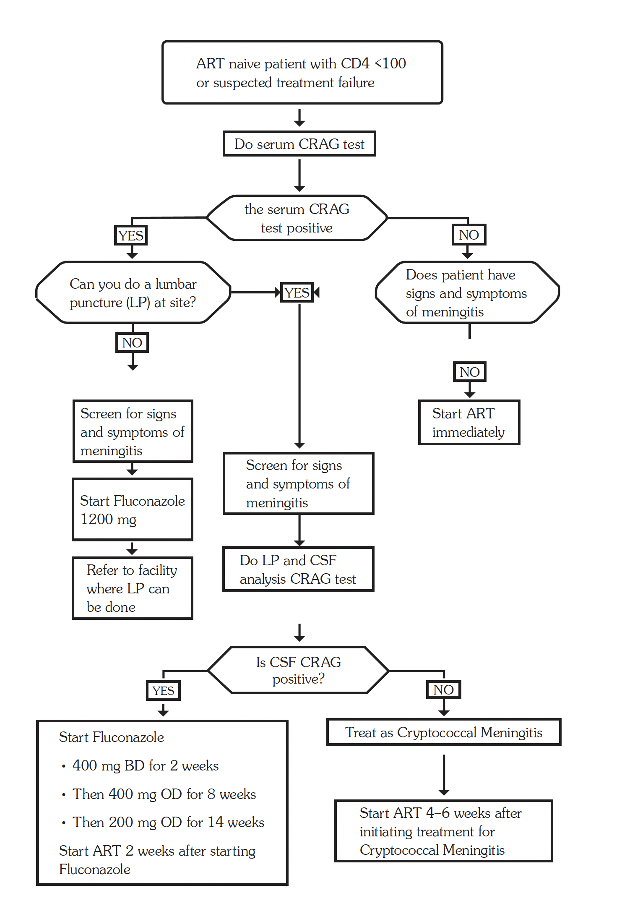{ .clinical-flowchart }

**ART timing with cryptococcal meningitis**

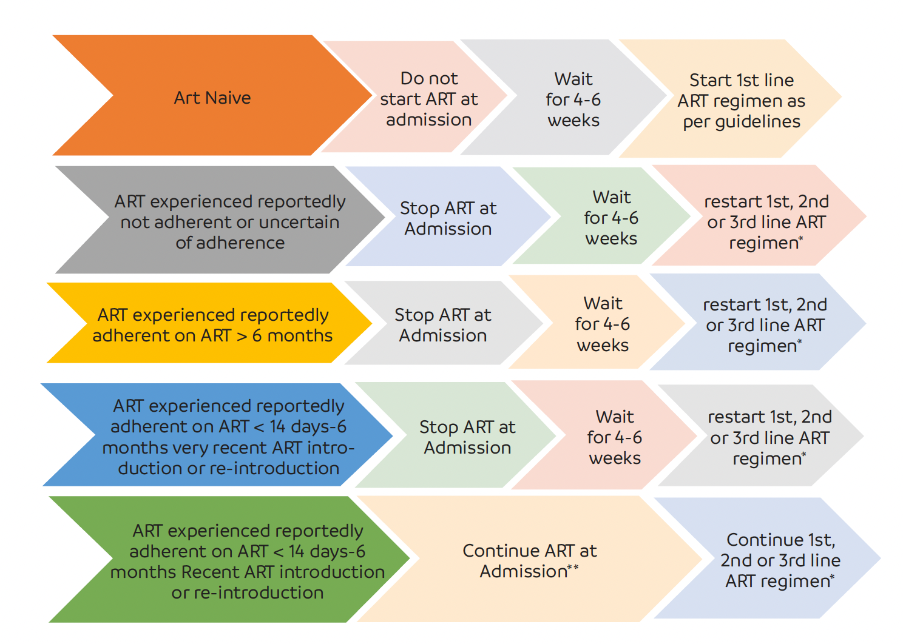{ .clinical-flowchart }

!!! note "ART timing notes"
    Decision on which ART regimen to restart should be made according to the patient’s history, ART guidelines, HIV viral load, and genotypic resistance testing where possible.

    If it is considered likely that the patient has developed resistance to first-line ARVs, restart with a second-line regimen containing a boosted PI or DTG may be considered.

    ART may be continued only where the patient is documented to have a suppressed viral load at admission or within the month before admission.

**Treatment of newly diagnosed cryptococcal meningitis**

| Phase | Drug / regimen | Comments | LOC |
|---|---|---|---|
| **Induction phase: 2 weeks** | **Recommended regimen:**  Amphotericin B liposomal single high dose 10 mg/kg + flucytosine 100 mg/kg/day in four divided doses + fluconazole 1,200 mg/day for 14 days.  **Alternative regimen:**  Amphotericin B deoxycholate 1 mg/kg/day + flucytosine 100 mg/kg/day in four divided doses for 1 week, followed by 1 week of fluconazole 1,200 mg/day for adults, or 12 mg/kg/day for children and adolescents.  **Alternative where flucytosine is unavailable:**  Amphotericin B deoxycholate 1 mg/kg/day + high-dose fluconazole 1,200 mg/day.  **Fluconazole-based option:**  Fluconazole 1,200 mg daily for adults, or 12 mg/kg/day for children and adolescents, plus flucytosine 100 mg/kg/day divided into four doses per day. | **Preventing amphotericin toxicity:**  For patients on amphotericin B deoxycholate, prevent nephrotoxicity and hypokalaemia by giving pre-hydration with 1 L normal saline before the daily amphotericin B dose.  Monitor serum potassium and creatinine at initiation and at least twice weekly to detect changes in renal function.  Routine potassium supplementation may reduce amphotericin B-related hypokalaemia, for example potassium chloride 40 mEq/day mixed in 500 mL normal saline over 4 hours, or potassium chloride 600 mg twice daily while on amphotericin B.  For electrolyte supplementation, give two tablets daily of magnesium chloride 310 mg, slow magnesium chloride 535 mg, or magnesium trisilicate 250 mg while on amphotericin B.  Consider alternate-day amphotericin B if creatinine is >3 mg/dL.  To monitor for flucytosine toxicity, CBC with differential count at least twice weekly is recommended. | H4/H/RR |
| **Consolidation phase: 8 weeks** | Fluconazole 800 mg/day, or 6–12 mg/kg/day in children and adolescents. | Initiate ART 4–6 weeks after starting cryptococcal meningitis treatment, if there is clinical response to antifungal therapy. | H4 |
| **Maintenance phase: 18 months** | Fluconazole 200 mg/day, or 6 mg/kg/day up to 200 mg/day in children and adolescents. | Criteria to stop after a minimum of 18 months of maintenance therapy:  Adults: viral load <1,000 copies/mL and CD4 ≥200, or CD4 ≥200 if viral load is not available, after 12 and 18 months.  Children: CD4 >25% or viral suppression. | H4 |

**Relapse disease**

Relapse disease presents with recurrence of symptoms of meningitis and a positive CSF culture following a prior confirmed diagnosis of cryptococcal meningitis.

**Management of relapse disease**

- Evaluate for drug resistance.
- Send CSF to Central Public Health Laboratory (CPHL) for culture and sensitivity testing.
- If drug resistance results are not available, re-initiate induction therapy for two weeks and complete the other phases of treatment.

**Adequate control of elevated CSF pressure**

Control of increased intracranial pressure improves survival in persons with cryptococcal meningitis.

- All patients with CSF pressure >250 mm H₂O need a therapeutic lumbar puncture the following day to reduce CSF pressure to <200 mm H₂O.
- In the absence of a manometer, an IV giving set may be used to create an improvised manometer and measure height using a metre stick.
- Removing 20–30 mL of CSF, even in the absence of a manometer, may be adequate to decrease CSF pressure.
- Most patients need 2–3 lumbar punctures during the induction phase.

### 3.1.10.3 Hepatitis B and HIV Co-Infection

**ICD-10 CODE:** B18

Hepatitis B virus (HBV) is a leading cause of chronic liver disease among people living with HIV. In Uganda, the prevalence of hepatitis B among HIV patients is estimated at 17%. See section 6.5.2 for more details on hepatitis B infection.

All HIV-infected patients initiating ART and those failing ART should be routinely screened for HBV infection using hepatitis B surface antigen (HBsAg).

People living with HIV who have a positive HBsAg should have complementary tests at baseline and every 6 months. These include:

- Complete blood count
- Liver function tests, including ALT, AST, albumin, bilirubin, and PT-INR
- Liver ultrasound scan to assess the stage of liver fibrosis

Repeat tests every 6 months because patients with chronic HBV infection are at increased risk of hepatocellular carcinoma.

**Management of HBV/HIV co-infection**

The goal of HBV/HIV treatment is to prevent dual disease progression and reduce HBV-related morbidity and mortality.

| Treatment | LOC |
|---|---|
| Preferably use an ART regimen containing TDF 300 mg + 3TC 300 mg orally once daily for life. | H |
| After 6 months of treatment, patients should be evaluated for HBV treatment failure. | H |

If jaundice, malaise, right upper quadrant abdominal pain, or abnormal liver function tests are present:

- Do HBV DNA, also known as hepatitis B viral load.

**Treatment failure**

Patients with HBV viral load >2,000 IU/mL at 24 weeks of therapy should be referred for further evaluation and management.

**Prevention of HBV infection**

- Provide counselling, emphasising sexual transmission and risks associated with sharing needles and syringes, tattooing, or body piercing.
- Advise patients with chronic HBV disease to avoid alcohol consumption.
- Screen all household members and sexual partners of people living with HIV and HBV for HBsAg.
- HBV vaccination is the most effective way to prevent HBV infection and its consequences.
- All HIV-infected patients who test negative for HBsAg should be vaccinated with HBV vaccine.
- All sexual partners and contacts should receive HBV vaccination, regardless of whether they are HIV-infected or not.

### 3.1.10.4 Pneumocystis Pneumonia

**ICD-10 CODE:** B59

**Clinical features**

- Fever
- Dry cough
- Shortness of breath with significant hypoxaemia

**Investigations**

- Chest X-ray showing characteristic bilateral interstitial infiltrates

**Management**

| Treatment | LOC |
|---|---|
| Give oxygen if SpO₂ <94%. | HC4 / H / RR |
| Cotrimoxazole 120 mg/kg/day in 2–4 divided doses for 21 days. | HC4 / H / RR |
| Example using cotrimoxazole 480 mg tablets: If patient is <60 kg, give 3 tablets. If patient is >60 kg, give 4 tablets. | HC4 / H / RR |
| Add prednisolone 2 mg/kg daily in 3 divided doses for 5 days, then reduce dose to complete 21 days of treatment. | HC4 / H / RR |
| If the patient cannot tolerate or does not respond to cotrimoxazole, give pentamidine 4 mg/kg by IV infusion daily for 21 days. Reduce dose in renal impairment. | H / RR |
| Avoid direct bolus injections whenever possible. If unavoidable, never give rapidly. | H / RR |
| Alternative 21-day regimen if the above is unavailable or not tolerated: clindamycin 600 mg every 8 hours plus dapsone 100 mg daily. | H / RR |

**Prophylaxis**

Give prophylaxis to all patients with a history of PCP infection. Consider prophylaxis also for severely immunocompromised patients.

Options include:

- Cotrimoxazole 960 mg daily
- Dapsone 100 mg daily

Continue prophylaxis until immunity recovers sufficiently.

### 3.1.10.5 Other Diseases

People living with HIV are at higher risk of acquiring other infections and diseases, including non-communicable diseases, due to HIV itself and medicine side effects.

- Treat other infections, such as malaria and STIs, according to guidelines for the general population.
- Screen regularly for non-communicable diseases, including diabetes, hypertension, and depression.
- Screen women at enrolment in HIV care and then annually for cervical cancer using visual inspection with acetic acid (VIA). See section 12.2.2.

### 3.1.11 Prevention of HIV

HIV prevention includes behavioural, biomedical, and health-system interventions. These approaches should be combined based on the individual’s risk, context, and service delivery setting.

**Behavioural change**

Key behavioural prevention measures include:

- Reducing the number of sexual partners
- Never sharing used needles, syringes, razors, hair shavers, nail cutters, or other sharp objects
- Avoiding tattooing, body piercing, and scarification unless carried out under strictly hygienic conditions in properly controlled premises
- Delaying the start of sexual activity in adolescence
- Discouraging cross-generational and transactional sex
- Avoiding violence and abuse

**Biomedical prevention interventions**

Biomedical HIV prevention interventions include:

- Prevention of mother-to-child transmission (PMTCT)
- Safe male circumcision
- ART with viral suppression
- Post-exposure prophylaxis (PEP)
- Pre-exposure prophylaxis (PrEP)
- Blood transfusion safety
- STI screening and treatment
- Safe infusion and injection practices
- Adherence to infection prevention and control procedures

### 3.1.11.1 Post-Exposure Prophylaxis

**ICD-10 CODE:** Z20.6

Post-exposure prophylaxis (PEP) is the short-term use of ARVs to reduce the likelihood of acquiring HIV infection after potential occupational or non-occupational exposure.

**Types of exposure**

- **Occupational exposures:** occur in healthcare settings and include sharps injuries, needlestick injuries, or splashes of body fluids to the skin or mucous membranes.
- **Non-occupational exposures:** include unprotected sex, exposure following assault such as rape or defilement, road traffic accidents, and injuries at construction sites where exposure to body fluids occurs.

**Steps in providing PEP**

| Step | Action | LOC |
|---|---|---|
| **Step 1: Rapid assessment and first aid** | Conduct a rapid assessment of the client to assess exposure and risk, and provide immediate care.  **After a needlestick or sharp injury:** - Do not squeeze or rub the injury site. - Wash the site immediately with soap and water or mild disinfectant such as chlorhexidine gluconate solution. - If there is no running water, use antiseptic hand rub or gel. - Do not use strong irritating antiseptics such as bleach or iodine.  **After a splash of blood or body fluids on intact or broken skin:** - Wash the area immediately, or use antiseptic hand rub or gel if there is no running water. - Do not use strong irritating antiseptics.  **After a splash of blood or body fluids on mucous membranes:** - Wash abundantly with water. | HC2 |
| **Step 2: Eligibility assessment** | **Provide PEP when:** - Exposure occurred within the past 72 hours. - The exposed individual is not infected with HIV. - The source is HIV-infected, has unknown HIV status, or is at high risk.  **Do not provide PEP when:** - The exposed individual is already HIV-positive. - The source is confirmed HIV-negative. - The exposure involves body fluids that do not pose significant risk, such as tears, non-blood-stained saliva, urine, sweat, or small splashes on intact skin. - The exposed person declines an HIV test. | HC2 |
| **Step 3: Counselling and support** | Counsel the client on: - The risk of HIV from the exposure. - Risks and benefits of PEP. - Side effects of ARVs. - Enhanced adherence counselling if PEP is prescribed. - Linkage to further support for sexual assault cases. | HC2 |
| **Step 4: Prescription** | Start PEP as early as possible and not beyond 72 hours from exposure.  **Recommended regimens:** - Adults: TDF + 3TC + ATV/r - Children: ABC + 3TC + LPV/r  A complete course of PEP should run for 28 days.  Do not delay the first dose because of lack of baseline HIV test results. | HC2 |
| **Step 5: Follow-up** | Monitor adherence and manage side effects.  Discontinue PEP after 28 days.  Perform follow-up HIV testing at 6 weeks, 3 months, and 6 months after exposure.  If the client is HIV-infected, provide counselling and link to the HIV clinic for care and treatment.  If the client remains HIV-uninfected, provide HIV prevention education and risk reduction counselling. | HC2 |

**Post-rape care**

See also section 1.2.6.

Health facilities should provide the following clinical services as part of post-rape care:

- Initial assessment of the client
- Rapid HIV testing and referral to care and treatment if HIV-infected
- Post-exposure prophylaxis for HIV
- STI screening, testing, and treatment
- Forensic interviews and examinations
- Emergency contraception if the person presents within the first 72 hours
- Counselling

The health facility should also identify, refer, and link clients to non-clinical services, including:

- Long-term psychosocial support
- Legal counselling
- Police investigations and restraining orders
- Child protection services, such as emergency out-of-family care, reintegration into family care, or permanent care options where reintegration is impossible
- Economic empowerment
- Emergency shelters
- Long-term case management

Health facilities should use HMIS 105 to report gender-based violence (GBV).

#### 3.1.11.2 Pre-Exposure Prophylaxis (PrEP)

Pre-exposure prophylaxis (PrEP) is the use of ARV medicines by HIV-negative persons to prevent acquisition of HIV before exposure. PrEP provides an additional biomedical prevention option for people at substantial risk of acquiring HIV infection.

**Process of providing PrEP**

| Process | Description |
|---|---|
| Screening for HIV risk | Identify HIV-negative people at substantial risk of acquiring HIV infection. |
| Screening for PrEP eligibility | Confirm HIV-negative status, rule out acute HIV infection, assess for hepatitis B infection, assess renal function where available, and check contraindications to TDF/FTC or TDF/3TC. |
| Initiation of PrEP | Provide risk-reduction counselling, adherence counselling, condoms, and prescribe oral PrEP where eligible. |
| Follow-up and monitoring | Review adherence, HIV status, side effects, STI symptoms, pregnancy status where relevant, and ongoing risk exposure. |
| Discontinuing PrEP | Stop PrEP where HIV infection occurs, acute HIV infection is suspected, HIV acquisition risk reduces, toxicity occurs, adherence remains poor, or the client chooses to stop. |

**Screening for risk of HIV**

PrEP should be considered for HIV-negative people at substantial risk of acquiring HIV infection, including people who:

- Live in serodiscordant sexual relationships
- Have had unprotected vaginal sex with more than one partner of unknown HIV status in the past six months
- Have had anal sex in the past six months
- Have had sex in exchange for money, goods, or services in the past six months
- Use or abuse drugs, especially injectable drugs, in the past six months
- Have had more than one episode of an STI within the past twelve months
- Are part of a serodiscordant couple, especially where the HIV-positive partner is not on ART, has been on ART for less than six months, or is not virally suppressed
- Are recurrent PEP users, meaning PEP use more than three times in a year
- Are members of key or priority populations who are unable or unwilling to use condoms consistently

Eligibility is likely to be more common among populations such as serodiscordant couples, sex workers, fisherfolk, long-distance truck drivers, men who have sex with men, uniformed forces, adolescents, young women, and pregnant or lactating adolescent girls and young women at substantial risk.

**Screening for PrEP eligibility**

After confirming substantial risk for HIV acquisition:

- Confirm HIV-negative status using the national HIV testing services algorithm.
- Rule out signs and symptoms of acute HIV infection.
- Assess for hepatitis B infection.
    - If hepatitis B negative, the client is eligible for PrEP.
    - If hepatitis B positive, refer for hepatitis B management.
- Assess for renal impairment where possible.
- Assess for contraindications to TDF/FTC or TDF/3TC.

!!! note "Hepatitis B and renal function"
    Hepatitis B infection is not a contraindication to initiating PrEP. However, caution is needed when deciding to stop PrEP because stopping may cause hepatitis B viral load flare.

    Creatinine testing and creatinine clearance calculation should be done where available. Absence of creatinine testing should not delay PrEP initiation in persons with no signs or symptoms of renal impairment. If available, creatinine testing can be done at initiation and repeated every six months.

**Steps to initiation of PrEP**

Provide risk-reduction counselling and PrEP adherence counselling.

- Provide condoms and education on correct use.
- Initiate a medication adherence plan.
- Prescribe once-daily oral PrEP:
    - TDF 300 mg + FTC 200 mg, or
    - TDF 300 mg + 3TC 300 mg
- Initially provide a one-month prescription of TDF/FTC or TDF/3TC, one tablet orally once daily.
- Give a one-month follow-up appointment.
- Counsel the client on possible side effects of TDF/FTC or TDF/3TC.

**Follow-up and monitoring for clients on PrEP**

After the initial visit, give a two-month follow-up appointment, then schedule quarterly appointments thereafter.

At follow-up visits:

- Perform an HIV antibody test using the national HIV testing services algorithm every three months.
- Where the national HTS standard test is not available, blood-based HIV self-testing may be used as an alternative for PrEP refill.
- For women, perform a pregnancy test if there is a history of amenorrhoea.
- Review the client’s understanding of PrEP.
- Assess barriers to adherence.
- Assess medication tolerance and side effects.
- Review the client’s risk exposure profile and provide risk-reduction counselling.
- Evaluate and support PrEP adherence at each clinic visit.
- Evaluate the client for symptoms of STIs at every visit and treat according to current STI treatment guidelines.

**Guidance on discontinuing PrEP**

PrEP may be discontinued in the following situations:

- Acquisition of HIV infection
- Suspected signs and symptoms of acute HIV infection following recent exposure within four weeks
- Changed life situation resulting in reduced risk of HIV acquisition
- Intolerable ARV toxicities or side effects
- Chronic non-adherence to the prescribed regimen despite efforts to improve daily pill-taking
- Personal choice
- HIV-negative person in a serodiscordant relationship where the HIV-positive partner has been on ART for more than six months and has achieved sustained viral load suppression

Condoms should still be used consistently. The HIV-negative partner may continue PrEP even if the HIV-positive partner is virally suppressed, if they choose to do so.

For detailed guidance on PrEP provision, refer to the Technical Guidance on Pre-Exposure Prophylaxis for Persons at High Risk of HIV in Uganda, 2022.

**The PrEP ring**

The PrEP ring is a long-acting HIV prevention method developed for clients who are unable or unwilling to take oral PrEP, or where oral PrEP is not available.

The ring is made of flexible silicone material and contains 25 mg of dapivirine, an ARV medicine in the non-nucleoside reverse transcriptase inhibitor class. It is inserted into the vagina and remains in place for one month.

The ring delivers dapivirine directly to the site of potential infection over one month, with low absorption elsewhere in the body, which lowers the likelihood of systemic side effects.

**Possible side effects of the PrEP ring**

Possible side effects are typically mild and may include:

- Urinary tract infections
- Vaginal discharge
- Vulvar itching
- Pelvic or lower abdominal pain

**Contraindications for PrEP ring use**

The PrEP ring should not be provided to people with:

- An HIV-positive test result according to the national HIV testing algorithm
- Known exposure to HIV in the past 72 hours, where PEP may be more appropriate
- Signs of acute HIV infection and potential exposure within the past 14 days
- Inability to commit to effective ring use and scheduled follow-up visits
- Allergy or hypersensitivity to dapivirine or other substances listed in the product information sheet

**Long-acting injectable cabotegravir (CAB-LA)**

Long-acting injectable cabotegravir is an injectable HIV prevention medicine containing cabotegravir, an integrase inhibitor. It is effective in preventing HIV among people at high risk of acquiring HIV.

It is indicated for HIV-negative persons at high risk of HIV acquisition.

Before initiation, individuals must be screened for HIV using the national HIV testing services algorithm and assessed for signs of acute HIV infection, as with oral PrEP.

Key points:

- **Administration:** given as an injection in the buttock once every eight weeks.
- **Side effects:** generally safe and well tolerated.
- **Efficacy:** injectable cabotegravir has been shown to be highly effective.
- **Safety:** no major safety concerns are noted in the guideline extract.
- **Acceptability:** highly acceptable in study settings.
- **Contraindication:** hypersensitivity to the active substance.

!!! note "CAB-LA guidance"
    For detailed guidance on CAB-LA, refer to the Technical Guidance on Pre-Exposure Prophylaxis for Persons at High Risk of HIV in Uganda, 2022.

### 3.1.12 Psychosocial Support for HIV-Positive Persons

HIV-positive persons benefit greatly from psychosocial support after the first impact of the test result is overcome.

Support should include:

- Providing emotional support
- Helping the person understand the social, medical, and psychological implications for themselves, the unborn child in the case of a pregnant woman, and any sexual partners
- Connecting the person with support services, including religious support groups, orphan care, income-generating activities, home care, and other available services
- Helping the person find strategies to involve their partner and extended family in sharing responsibility
- Helping the person identify someone from the community to support and care for them
- Discussing with HIV-positive mothers how to provide for the other children in the family
- Helping the person identify a person from the extended family or community who will provide support
- Confirming and supporting information given in HIV counselling and testing on mother-to-child transmission, possibility of ARV treatment, safer sex, infant feeding, and family planning advice, as appropriate
- Helping the person understand and develop strategies to apply new information within daily life

## 3.2 Sexually Transmitted Infections (STI)

Sexually transmitted infections (STIs) are a collection of disorders, several of which are better managed as syndromes using a syndromic approach.

**Prevention of STIs**

General preventive measures include:

- Giving health education about STIs
- Providing specific education on the need for early reporting and compliance with treatment
- Ensuring notification and treatment of sexual partners
- Counselling patients on risk reduction, including safer sex, condom use, remaining faithful to one sexual partner, and personal hygiene
- Providing condoms
- Scheduling return visits where necessary and possible

### 3.2.1 Urethral Discharge Syndrome (Male)

**ICD-10 CODE:** R36

Urethral discharge syndrome refers to urethral discharge in men, with or without dysuria. It is caused by a number of diseases usually spread by sexual intercourse, which produce similar manifestations in males and may be difficult to distinguish clinically.

**Causes**

Common causes include:

- *Neisseria gonorrhoeae*, causing gonorrhoea
- *Chlamydia trachomatis*
- *Ureaplasma urealyticum*

Uncommon cause:

- *Trichomonas vaginalis*

**Clinical features**

- Mucus or pus at the tip of the penis
- Staining of underwear
- Burning pain on passing urine, also known as dysuria
- Frequent urination

**Investigations**

- Pus swab for Gram stain, culture, and sensitivity
- Blood screening for syphilis and HIV
- Careful examination of the patient to confirm discharge

**Urethral discharge syndrome management algorithm**

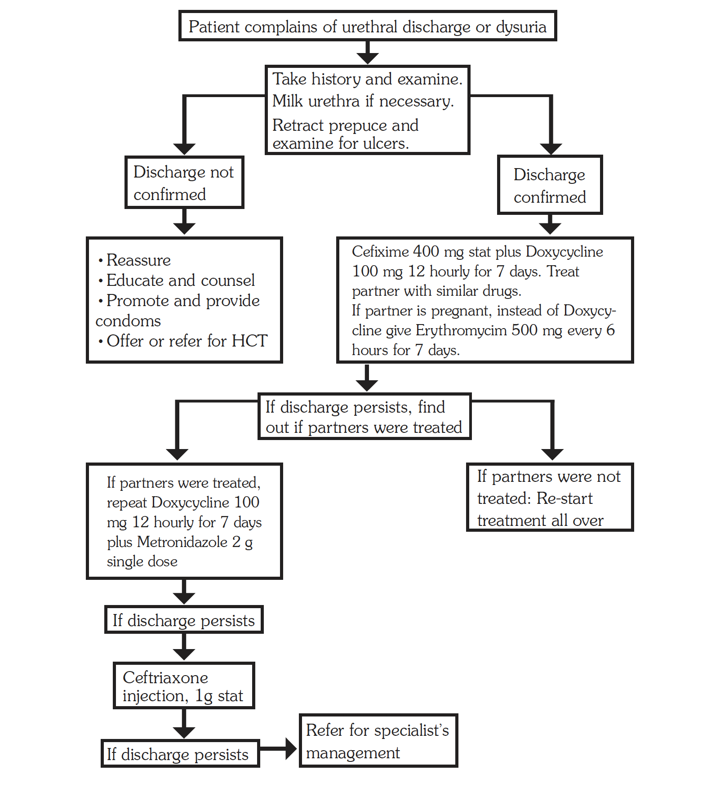{ .clinical-flowchart }

**Management**

| Treatment | LOC |
|---|---|
| Take history and examine the client. Milk the urethra if discharge is not obvious. | HC2 |
| Retract the prepuce and examine for ulcers. Treat both the patient and sexual partners. Advise abstinence or condom use. | HC2 |
| **Medicines:** Ceftriaxone 250 mg IM or cefixime 400 mg single dose, plus doxycycline 100 mg every 12 hours for 7 days. | HC3 |
| If the partner is pregnant, substitute doxycycline with erythromycin 500 mg every 6 hours for 7 days. | HC3 |
| Alternatively, give azithromycin 1 g stat if available. | HC3 |
| **If discharge or dysuria persists and partners were treated:** exclude ulcers under the prepuce, repeat doxycycline 100 mg every 12 hours for 7 days, and also give metronidazole 2 g single dose. | HC3 |
| **If discharge or dysuria persists and partners were not treated:** start the initial treatment all over again and treat partners. | HC3 |
| **If discharge still persists:** give ceftriaxone 1 g IM. | HC3 |
| Refer for specialist management if not better. | HC3 |

### 3.2.2 Abnormal Vaginal Discharge Syndrome

**ICD-10 CODE:** N76

Abnormal vaginal discharge syndrome is often the first evidence of genital infection, although absence of abnormal discharge does not mean absence of infection. Normal vaginal discharge is small in quantity and white to colourless.

Not all vaginal infections are sexually transmitted diseases.

**Causes**

Abnormal vaginal discharge may be caused by a variety of organisms, and often by a mixture of organisms.

Common causes include:

- **Vaginitis**, caused by:
    - *Candida albicans*
    - *Trichomonas vaginalis*
    - Bacterial vaginosis caused by *Gardnerella vaginalis* and *Mycoplasma hominis*
- **Cervicitis**, commonly due to gonorrhoea and chlamydia. Cervicitis is usually asymptomatic and is rarely a cause of abnormal vaginal discharge.

!!! note
    Candida vaginitis and bacterial vaginosis are not sexually transmitted diseases, even though sexual activity is a risk factor.

**Clinical features**

- Increased quantity of discharge
- Abnormal colour and odour
- Lower abdominal pain, itching, and pain during sexual intercourse
- In *Candida albicans* vaginitis: very itchy, thick or lumpy white discharge, with red inflamed vulva
- In *Trichomonas vaginalis*: itchy, greenish-yellow frothy discharge with offensive smell
- In bacterial vaginosis: thin discharge with a fishy smell from the vagina
- Gonorrhoea may cause cervicitis and rarely vaginitis. There may be purulent thin mucoid, slightly yellow pus discharge, with no smell and no itching.
- Chlamydia may cause cervicitis, which may present with a non-itchy, thin, colourless discharge.

**Differential diagnosis**

- Cancer of the cervix, especially where there is blood-stained smelly discharge
- Intravaginal use of detergents, chemicals, physical agents, herbs, or chronic tampon use
- Allergic vaginitis

**Investigations**

- Speculum examination
- Pus swab for microscopy, Gram stain, culture and sensitivity
- pH and KOH test
- Blood test for syphilis using RPR or VDRL
- HIV testing

**Abnormal vaginal discharge syndrome management algorithm**

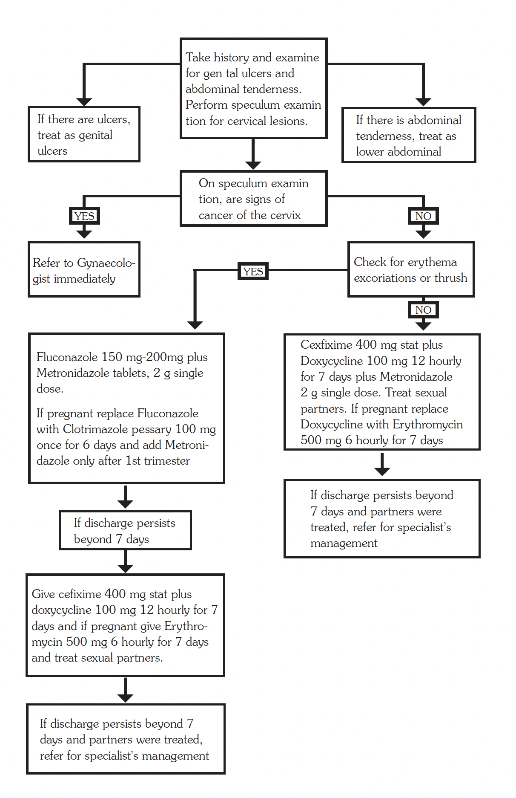{ .clinical-flowchart }

**Management**

| Treatment | LOC |
|---|---|
| Take history and examine for genital ulcers and abdominal tenderness. | HC2 |
| Perform speculum examination for cervical lesions. | HC2 |
| Assess risk for sexually transmitted disease. | HC2 |
| If there is lower abdominal tenderness and the client is sexually active, treat as pelvic inflammatory disease. See section 14.1.2. | HC2 |
| If there is no lower abdominal pain and the discharge is thick and lumpy, with vaginal itching and erythema or excoriations, treat as likely candidiasis. | HC2 |
| For likely candidiasis: give clotrimazole pessaries 100 mg. Insert high in the vagina once daily before bedtime for 6 days, or twice daily for 3 days. | HC2 |
| Alternatively, give fluconazole 200 mg orally as a single dose. | HC2 |
| Add metronidazole 2 g stat. | HC2 |
| If discharge is abundant or smelly, and vaginosis, trichomonas, or bacterial vaginosis is possible, give metronidazole 2 g stat. | HC2 |
| If there is purulent discharge, high risk of STI, or previous treatment was ineffective, treat for gonorrhoea, chlamydia, and trichomonas. | HC3 |
| Give cefixime 400 mg stat, or ceftriaxone 1 g IV stat. | HC3 |
| Add doxycycline 100 mg every 12 hours for 7 days. | HC3 |
| Add metronidazole 2 g stat. | HC3 |
| If the client is pregnant, replace doxycycline with erythromycin 500 mg every 6 hours for 7 days, or azithromycin 1 g stat. | HC3 |
| Treat the partner. | HC3 |
| If discharge or dysuria still persists and partners were treated, refer for further management. | HC3 |

### 3.2.3 Pelvic Inflammatory Disease (PID)

See section 14.1.2.

### 3.2.4 Genital Ulcer Disease (GUD) Syndrome

**ICD-10 CODES:** N76.5-6, N48.5

Genital ulcer syndrome is one of the commonest STI syndromes affecting men and women. It may present with single or multiple ulcers.

**Causes**

Multiple organisms can cause genital sores. Common causes include:

- *Treponema pallidum*, causing syphilis
- Herpes simplex virus, causing genital herpes
- *Haemophilus ducreyi*, causing chancroid
- *Donovania granulomatis*, causing granuloma inguinale
- Chlamydia strains, causing lymphogranuloma venereum (LGV)

**Clinical features**

Mixed infections are common.

- **Primary syphilis:** the ulcer is initially painless and may occur between or on the labia, or on the penis.
- **Secondary syphilis:** multiple painless ulcers may occur on the penis or vulva.
- **Genital herpes:** small, multiple, usually painful blisters, vesicles, or ulcers, often recurrent.
- **Granuloma inguinale:** an irregular ulcer that increases in size and may cover a large area.
- **Chancroid:** multiple, large, irregular ulcers with enlarged painful suppurating lymph nodes.

**Differential diagnosis**

- Cancer of the penis in elderly men
- Cancer of the vulva in women older than 50 years

**Investigations**

- Swab for microscopy
- Blood test for VDRL/TPR

**Genital ulcer disease management algorithm**

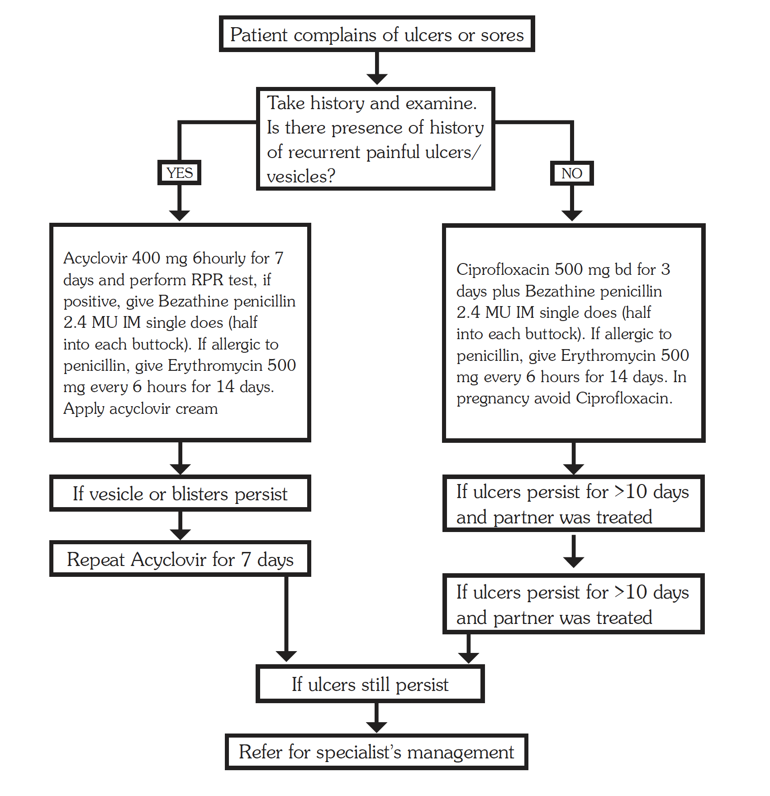{ .clinical-flowchart }

**Management**

| Treatment | LOC |
|---|---|
| **Multiple painful blisters or vesicles, likely herpes:** give aciclovir 400 mg every 6 hours for 7 days. | HC3 / HC4 |
| If RPR is positive, add benzathine penicillin 2.4 million units IM as a single dose, half in each buttock. | HC3 / HC4 |
| If lesions persist, repeat aciclovir for 7 days. | HC3 / HC4 |
| **All other cases:** give ciprofloxacin 500 mg every 12 hours for 3 days plus benzathine penicillin 2.4 million units IM as a single dose, half in each buttock. | HC3 / HC4 |
| In penicillin allergy, give erythromycin 500 mg every 6 hours for 14 days. | HC3 / HC4 |
| If the ulcer persists for more than 10 days and the partner was treated, add erythromycin 500 mg every 6 hours for 7 days. | HC3 / HC4 |
| If the ulcer still persists, refer for specialist management. | HC3 / HC4 |

!!! note
    A negative RPR does not exclude early syphilis.

    Genital ulcers may appear with enlarged and fluctuant inguinal lymph nodes, also known as buboes. Do not incise buboes.

### 3.2.5 Inguinal Swelling (Bubo)

Inguinal swelling, or bubo, is an STI syndrome presenting as localised swelling or enlarged lymph glands in the groin and femoral area.

**Causes**

- Chlamydia strains, causing lymphogranuloma venereum (LGV)
- *Haemophilus ducreyi*, causing chancroid
- *Treponema pallidum*, causing syphilis

**Clinical features**

- Excessively swollen inguinal glands
- Pain and tenderness
- Swelling may become fluctuant if pus forms

**Differential diagnosis**

- Other causes of swollen inguinal lymph nodes, such as leg ulcer
- Obstructed inguinal hernia

**Investigations**

- Investigations as for genital ulcers
- Culture and sensitivity of pus where available

**Inguinal swelling management algorithm**

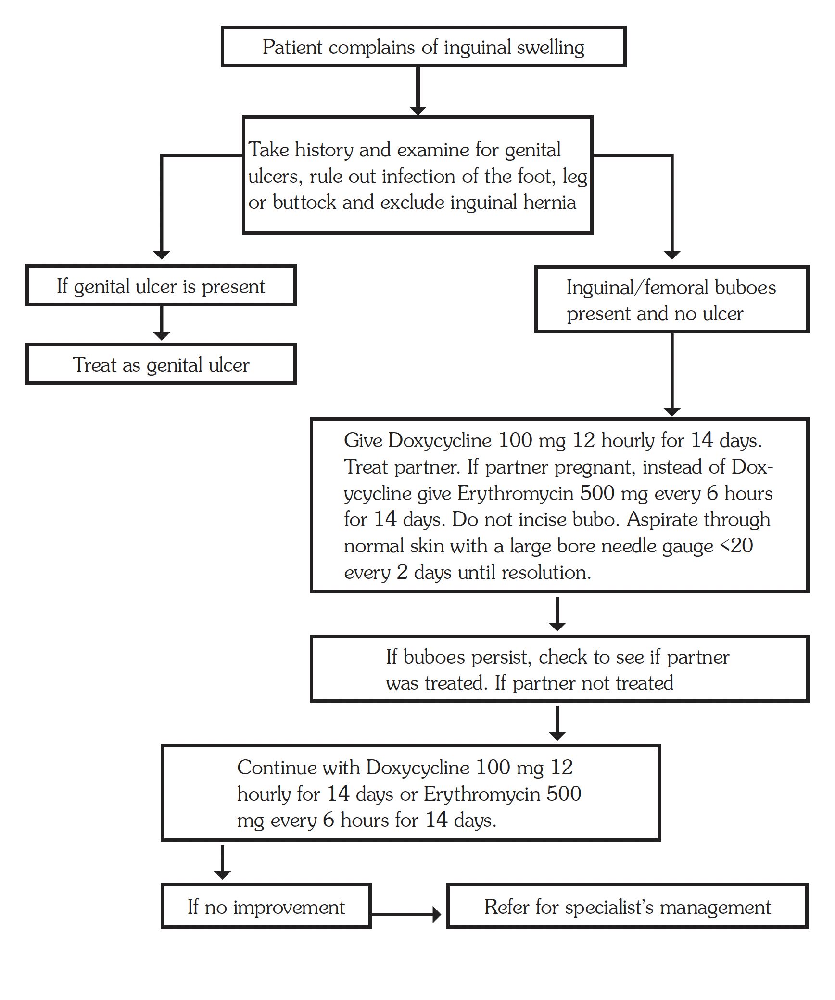{ .clinical-flowchart }

**Management**

| Treatment | LOC |
|---|---|
| Examine for genital ulcers, rule out infection of the foot, leg, or buttock, and exclude inguinal hernia. | HC2 / HC3 |
| If genital ulcer is present, treat according to the genital ulcer disease protocol. | HC2 / HC3 |
| Give doxycycline 100 mg every 12 hours for 14 days. | HC2 / HC3 |
| Treat the sexual partner. | HC2 / HC3 |
| If the partner is pregnant, give erythromycin 500 mg every 6 hours for 14 days instead of doxycycline. | HC2 / HC3 |
| If bubo persists and the partner was not treated, continue treatment for 14 days and treat the partner. | HC2 / HC3 |
| If there is no improvement, refer for specialist management. | HC2 / HC3 |

!!! caution
    Do not incise a bubo. Aspirate through normal skin with a large-bore needle, gauge <20, every 2 days until resolution.

    Azithromycin 1 g single dose may be used as an alternative to doxycycline.

### 3.2.6 Genital Warts

**ICD-10 CODE:** A63.0

**Causes**

- Human papillomavirus (HPV), causing condylomata acuminata
- *Treponema pallidum*, causing syphilitic warts or condylomata lata
- Molluscum contagiosum virus

**Clinical features**

- The penis, foreskin, labia, and vagina are the most common sites.
- Warts may vary in number and size, from few and small to multiple and very large.
- HPV warts are soft fleshy growths on the genitals.
- Syphilitic warts are flat-topped and broad-based growths.
- Molluscum contagiosum presents as light-coloured, umbilicated growths on the face and genital areas.

**Differential diagnosis**

- Rashes
- Eruptive skin lesions

**Management**

| Treatment | LOC |
|---|---|
| Advise on personal hygiene. | HC3 / HC4 |
| Treat the underlying infection. | HC3 / HC4 |
| **HPV viral warts:** apply podophyllum resin paint 15% to the warts 1–3 times weekly until the warts resolve. Multiple weekly treatments may be required. | HC3 / HC4 |
| Protect normal skin with petroleum jelly before application. | HC3 / HC4 |
| Apply precisely on the lesion and avoid normal skin. | HC3 / HC4 |
| Wash off with water 4 hours after each application. | HC3 / HC4 |
| Do not use podophyllum in pregnancy. | HC3 / HC4 |
| If there is no improvement after 3 applications, refer for specialist management. | HC3 / HC4 |
| **Syphilitic warts:** give benzathine penicillin injection 2.4 million units as a single dose, half into each buttock. | HC3 |
| **Molluscum contagiosum:** usually self-limiting. Treat underlying conditions that may be compromising immunity. | HC3 / HC4 |

### 3.2.7 Syphilis

**ICD-10 CODE:** A51-53

Syphilis is a complex chronic bacterial infection affecting a variety of organs and presenting with multiple manifestations.

**Cause**

- *Treponema pallidum*

Syphilis is transmitted sexually and from mother to foetus. Rarely, it may be transmitted through blood transfusion or non-sexual contact.

**Clinical features**

The disease has several stages.

**Primary syphilis**

Primary syphilis occurs 10–90 days after inoculation. It is characterised by a painless genital ulcer with a clean base and indurated margins, and regional lymphadenopathy. The ulcer may heal spontaneously, but the disease may progress to secondary syphilis.

**Secondary syphilis**

Secondary syphilis occurs a few weeks to months after the primary lesion, usually within 6 months. It may present with:

- Generalised maculopapular rash
- Mucous membrane lesions, including patches and ulcers
- Weeping papules, also known as condyloma lata, in moist skin areas
- Generalised non-tender lymphadenopathy
- Fever, meningitis, hepatitis, osteitis, arthritis, or iritis

**Early latent syphilis**

Early latent syphilis is less than 1 year in duration. It is clinically quiescent, but relapse of secondary syphilis may occur.

**Late latent syphilis**

Late latent syphilis is clinically quiescent and is not very infectious, although maternal-foetal transmission may still occur.

**Late or tertiary syphilis**

Late syphilis may occur any time after secondary syphilis, even many years later. Features include:

- Infiltrative tumours of the skin, bones, or liver
- Aortitis, aneurysms, and aortic regurgitation
- Central nervous system disorders, including neurosyphilis, meningovascular syphilis, hemiparesis, seizures, progressive degeneration, paraesthesias, shooting pains, dementia, and psychosis

**Investigations**

- Non-treponemal antibody tests, including VDRL and RPR
    - Positive 4–6 weeks after infection
    - Used as screening tests
    - May give false-positive results
    - May remain positive for 6–12 months after treatment
- Treponemal antibody tests, including TPHA
    - Very sensitive
    - Used to confirm a positive non-treponemal test
    - May remain positive for a long time after treatment, so positivity may not indicate active disease

**Management**

| Condition | Treatment | LOC |
|---|---|---|
| Primary, secondary, and early latent syphilis | Benzathine penicillin 2.4 million IU IM stat, half in each buttock. | HC3 |
| Primary, secondary, and early latent syphilis, alternative | Doxycycline 100 mg every 12 hours for 14 days. | HC3 |
| Late latent syphilis, syphilis of uncertain duration, or tertiary syphilis without neurosyphilis | Benzathine penicillin 2.4 million IU IM weekly for 3 weeks. | HC3 |
| Late latent syphilis, syphilis of uncertain duration, or tertiary syphilis without neurosyphilis, alternative | Doxycycline 100 mg every 12 hours for 28 days. | HC3 |
| Neurosyphilis | Benzylpenicillin 4 million IU IV every 4 hours, or ceftriaxone 2 g IV or IM daily for 10–14 days. | HC2 / HC3 |
| Follow-up treatment | Benzathine penicillin 2.4 million IU IM weekly for 3 weeks. Treat partner(s). Abstain from sex during treatment and for 10 days after treatment. | HC3 |

### 3.2.8 Other STI Syndromes

### 3.2.8.1 Balanitis

**ICD-10 CODE:** N48.1

Balanitis is inflammation of the glans penis.

**Cause**

Balanitis is usually caused by *Candida*, and rarely by *Trichomonas*.

**Clinical features**

- Discharge
- Erythema
- Erosions
- Retractable prepuce

**Management**

| Treatment | LOC |
|---|---|
| Give fluconazole 200 mg stat. | HC3 |
| Add metronidazole 400 mg every 12 hours for 7 days. | HC3 |
| Advise on hygiene and circumcision. | HC3 |
| If not better, treat the partner. | HC3 |

### 3.2.8.2 Painful Scrotal Swelling

**ICD-10 CODE:** N45

Painful scrotal swelling presents as acute painful and tender unilateral swelling of the epididymis and testis, with or without urethral discharge.

**Differential diagnosis**

- Acute testicular torsion
- Scrotal hernia
- Tumours

**Management**

| Treatment | LOC |
|---|---|
| Treat according to the urethral discharge protocol. See section 3.2.1. | HC3 |

### 3.2.9 Congenital STI Syndromes

Congenital STIs in newborns occur as a result of infection of babies in utero or during delivery as a complication of untreated STIs among mothers.

The most serious congenital STIs include:

- Syphilis
- HIV
- Gonococcal infection
- Chlamydia
- Herpes simplex

### 3.2.9.1 Neonatal Conjunctivitis (Ophthalmia Neonatorum)

**ICD-10 CODE:** P39.1

Neonatal conjunctivitis refers to conjunctival infection of neonates by STI organisms in the infected mother’s birth canal. It is a serious condition that can lead to corneal ulceration and blindness. Blindness in children is associated with high infant morbidity and mortality.

**Causes**

Common causes include:

- *Neisseria gonorrhoeae*
- *Chlamydia trachomatis*

Other non-STI causes of neonatal conjunctivitis may be associated with difficult labour, early rupture of membranes, vacuum extraction, or other assisted vaginal delivery.

**Clinical features**

- Purulent discharge from one or both eyes within 30 days of birth
- Inflamed and swollen eyelids
- Complications of untreated conjunctivitis, including corneal ulceration, perforation, scarring, and blindness

**Investigations**

- Pus swab for Gram stain, culture, and sensitivity

**Management**

| Treatment | LOC |
|---|---|
| Treatment should cover both gonorrhoea and chlamydia. | HC2 / HC3 |
| Start cleaning with normal saline and apply tetracycline ointment every hour while referring for systemic treatment. | HC2 / HC3 |
| Give ceftriaxone 125 mg single dose IM plus azithromycin syrup 20 mg/kg orally once daily for 3 days. | HC2 / HC3 |
| Irrigate the eyes with saline or sterile water. | HC2 / HC3 |
| Use gloves and wash hands thoroughly after handling the eyelids. | HC2 / HC3 |
| Cover the eye with gauze while opening the eyelid, because pus may be under pressure. | HC2 / HC3 |
| Topical tetracycline eye ointment has no added benefit in active disease. | HC2 / HC3 |
| Treat both parents for gonorrhoea and chlamydia, and screen for HIV and syphilis. | HC2 / HC3 |

**Prevention**

- Screen and treat all infected mothers in antenatal care.
- Apply prophylactic tetracycline eye ointment 1% to both eyes of all newborns at the time of delivery.

### 3.2.9.2 Congenital Syphilis

**ICD-10 CODE:** A50

Congenital syphilis is a serious debilitating and disfiguring condition that can be fatal. About one third of syphilis-infected mothers have adverse pregnancy outcomes, one third give birth to a healthy baby, and the remaining third may result in congenital syphilis infection.

**Cause**

- *Treponema pallidum*

**Clinical features**

Congenital syphilis may be asymptomatic.

**Early congenital syphilis**

Early congenital syphilis begins to show after 6–8 weeks of delivery. Features include:

- Snuffles
- Palmar or plantar bullae
- Hepatosplenomegaly
- Pallor
- Joint swelling with or without paralysis
- Cutaneous lesions

These signs are non-specific.

**Late congenital syphilis**

Late congenital syphilis begins to show at 2 years. Features include:

- Microcephaly
- Depressed nasal bridge
- Arched palate
- Perforated nasal septum
- Failure to thrive
- Mental subnormality
- Musculoskeletal abnormalities

**Investigations**

Preferably perform the tests on the mother:

- VDRL/RPR
- TPHA

**Management**

| Treatment | LOC |
|---|---|
| Assume cerebrospinal involvement in all babies less than 2 years. | HC3 |
| Give aqueous benzylpenicillin 150,000 IU/kg body weight IV every 12 hours for a total of 10 days. | HC3 |
| Alternatively, give procaine penicillin 50,000 IU/kg body weight IM once daily for 10 days. | HC3 |
| Treat both parents for syphilis with benzathine penicillin 2.4 million units as a single dose, half in each buttock. | HC3 |

!!! note
    Assume that infants whose mothers had untreated syphilis or started treatment within 30 days of delivery have congenital syphilis.

    If the mother is diagnosed with syphilis during pregnancy, use benzathine penicillin as first line because erythromycin does not cross the placental barrier and therefore does not effectively prevent in-utero acquisition of congenital syphilis.

    Do not use doxycycline in pregnancy.

**Prevention**

- Routine screening and treatment of syphilis-infected mothers in antenatal clinics.

