THE REPUBLIC OF UGANDA MINISTRY OF HEALTH

Uganda Clinical Guidelines 2023 National Guidelines for Management of Common Health Conditions

### Foreword

The overall goal of Uganda’s health system is to provide accessible, equitable and quality services to the population, in order to promote a healthy and productive life, which is a necessary factor for achieving socio-economic growth and national development.

Currently, the health system is faced with multiple challenges that include a high burden of infectious diseases that remain major causes of morbidity and mortality, such as HIV, malaria, tuberculosis, lower respiratory tract infections, malnutrition and meningitis. In addition, new threats keep emerging, for example, epidemics of hepatitis B, yellow fever, haemorrhagic fevers, COVID-19 and nodding disease. The increase of non-communicable conditions including diabetes, hypertension, heart diseases, cancer and mental disorders complicates the scenario.

The push towards universal health coverage, including universal access to AntiRetroviral Therapy (ART) and particular attention to neonatal, child, adolescent and maternal health, is also placing more demands on a system with limited resources.

To respond appropriately, the health system has to ensure high standards of quality and efficiency in service delivery. The Uganda Clinical Guidelines manual helps to achieve these standards by presenting updated, practical, and useful information on the diagnosis and management of common health conditions in Uganda. It also provides a rational basis for an efficient procurement and supply system that ensures the availability of safe, efficacious, quality medicines and health supplies.

The guidelines are based on principles of scientific evidence, cost effectiveness and prioritization of conditions to maximize the health benefit with limited resources.

The regular update of clinical guidelines and essential medicines lists is one of the key interventions in the Health Sector Development Plan 2015-2020, to promote the appropriate use of health products and technologies.

I wish to thank all the members of the Ministry of Health Update Task Force, government parastatals, medical consultants, district health workers, the private sector, the Uganda Reproductive Maternal Child and Adolescent Health Improvement Project (URMCHIP) and development partners for their immense input in developing the 2023 UCG edition.

Finally, I thank the consultancy firm, Zenith Solutions Limited, that coordinated the overall inputs that led to the successful development of this book.

######## Dr. Aceng Jane Ruth Ocero Hon. Minister of Health

III

################## IV

## Contents

Foreword ......................................................................................II Preface .......................................................................................XXI Acknowledgements ...................................................................... XXIII UCG Taskforce .......................................................................... XXIII Contributors to the clinical chapters ...............................................XXIV Administrative Support ................................................................ XXXII Design/ Layout ......................................................................... XXXII Abbreviations .............................................................................XXXIII Introduction to Uganda Clinical Guidelines 2023 ..............................XLIV

1 EMERGENCIES AND TRAUMA ....................................................1

- 1.1 Common Emergencies ...............................................................1

- 1.1.1 Anaphylactic Shock........................................................................................1
- 1.1.2 Hypovolaemic Shock .......................................................................................3

- 1.1.2.1 Hypvovolaemic Shock In Children................................................................6

1.1.3 Dehydration ...................................................................................................8

- 1.1.3.1 Dehydration in Children under 5 years ..........................................................8

- 1.1.5 Febrile Convulsions.........................................................................................22
- 1.1.6 Hypoglycaemia...............................................................................................24

- 1.1.3.2 Dehydration in Older Children and Adults.....................................................13

1.1.4 Fluids and Electrolytes Imbalances .................................................................15

- 1.1.4.1 IV Fluid management in children .................................................................19

- 1.2 Trauma and Injuries .................................................................26

- 1.2.1 Bites and Stings .............................................................................................26

- 1.2.1.1 Snakebites........................................................................................28
- 1.2.1.2 Insect Bites & Stings ..........................................................................33
- 1.2.1.3 Animal and Human Bites...................................................................34
- 1.2.1.4 Rabies Post Exposure Prophylaxis .....................................................36
- 1.2.1.5 Rabies Vaccine Schedules...................................................................42

- 1.2.2 Fractures .......................................................................................................43
- 1.2.3 Burns.............................................................................................................45
- 1.2.4 Wounds..........................................................................................................52
- 1.2.5 Head Injuries..................................................................................................55 1.2.5.1 Traumatic Spinal Injury.......................................................................59
- 1.2.6 Sexual Assault/Rape ......................................................................................60

- 1.3 Poisoning ...............................................................................65

- 1.3.1 General Management of Poisoning ..................................................................65 1.3.1.2 Removal and Elimination of Ingested Poison .......................................68
- 1.3.2 Acute Organophosphate Poisoning..................................................................70
- 1.3.3 Paraffin and Other Petroleum Products Poisoning.............................................72
- 1.3.4 Acetylsalicylic Acid (Aspirin) Poisoning.............................................................74
- 1.3.5 Paracetamol Poisoning....................................................................................75
- 1.3.6 Iron Poisoning................................................................................................76
- 1.3.7 Carbon Monoxide Poisoning ...........................................................................77
- 1.3.8 Barbiturate Poisoning......................................................................................78
- 1.3.9 Opioid Poisoning............................................................................................79
- 1.3.10 Warfarin Poisoning .......................................................................................80
- 1.3.11 Methyl Alcohol (Methanol) Poisoning.............................................................81
- 1.3.12 Alcohol (Ethanol) Poisoning ..........................................................................82

- 1.3.12.1 Acute Alcohol Poisoning...................................................................82
- 1.3.12.2 Chronic Alcohol Poisoning................................................................84

- 1.3.13 Food Poisoning ............................................................................................85

- 1.4 Hypoxeamia Management and Oxygen Therapy Guidelines ............87

- 2 INFECTIOUS DISEASES .............................................................95

- 2.1 Bacterial Infections ..................................................................95

- 2.1.1 Anthrax .........................................................................................................95
- 2.1.2 Brucellosis......................................................................................................97
- 2.1.3 Diphtheria.....................................................................................................100
- 2.1.4 Leprosy/Hansens disease ..............................................................................101
- 2.1.5 Meningitis .....................................................................................................107

- 2.1.5.1 Neonatal Meningitis...........................................................................111
- 2.1.5.2 Cryptococcal Meningitis .......................................................................
- 2.1.5.3 TB Meningitis ...................................................................................113

- 2.1.6 Plague...........................................................................................................113
- 2.1.7 Septicaemia ..................................................................................................115

- 2.1.7.1 Neonatal Septicaemia........................................................................117
- 2.1.7.2 Septic Shock Management, In Adults................................................118

- 2.1.8 Tetanus.........................................................................................................119 2.1.8.1 Neonatal Tetanus ..............................................................................123
- 2.1.9 Typhoid Fever (Enteric Fever) ........................................................................124
- 2.1.10 Typhus Fever...............................................................................................126

################## V

################## VI

####################### 2.2 Fungal Infections ....................................................................128

- 2.2.1 Candidiasis....................................................................................................128

2.3 Viral Infections .......................................................................130

- 2.3.1 Avian Influenza ............................................................................................130

- 2.3.2 Chicken pox..................................................................................................133
- 2.3.3 Measles.........................................................................................................134
- 2.3.4 Poliomyelitis..................................................................................................136
- 2.3.5 Rabies...........................................................................................................138
- 2.3.6 Viral Haemorrhagic Fevers.............................................................................140

- 2.3.6.1 Ebola and Marburg............................................................................140
- 2.3.6.2 Yellow Fever .....................................................................................143

- 2.3.7 COVID-19 Disease ........................................................................................144

2.4 Helminthes Parasites ...............................................................150

- 2.4.1 Intestinal Worms ...........................................................................................150

- 2.4.1.1 Taeniasis (Tapeworm)........................................................................153

- 2.4.2 Echinococcosis (Hydatid Disease) ..................................................................154
- 2.4.3 Dracunculiasis (Guinea Worm)........................................................................156
- 2.4.4 Lymphatic Filariasis .......................................................................................157
- 2.4.5 Onchocerciasis (River Blindness).....................................................................159
- 2.4.6 Schistosomiasis (Bilharziasis)...........................................................................161

2.5 Protozoal Parasites .................................................................162 2.5.1 Leishmaniasis................................................................................................162

- 2.5.2 Malaria..........................................................................................................164

2.5.2.1 Uncomplicated Malaria......................................................................165

- 2.5.2.2 Complicated/Severe Malaria..............................................................166
- 2.5.3.3 Management of Complications of Severe Malaria................................175

- 2.5.3.4 Malaria Prophylaxis...........................................................................179
- 2.5.3.5 Malaria Prevention and Control..........................................................180

- 2.5.4 Human African Trypanosomiasis (Sleeping Sickness) .....................................181

3 HIV/AIDS AND SEXUALLY TRANSMITTED INFECTIONS ............186

- 3.1 HIV Infection And Acquired Immunodeficiency Syndrome (AIDS) .186

- 3.1.1 Clinical Features of HIV ................................................................................187

- 3.1.2 Diagnosis and Investigations of HIV................................................................190
- 3.1.3 Measures before ARV Treatment ....................................................................197
- 3.1.4 General Principles of Antiretroviral Treatment (ART) .......................................200

- 3.1.5 Recommended First Line Regimens................................................................206
- 3.1.6 Monitoring of ART ........................................................................................211
- 3.1.7 ARV Toxicity.................................................................................................218
- 3.1.8 Recommended Second Line Regimens ..........................................................222
- 3.1.9 Mother-to-Child Transmission of HIV..............................................................229

- 3.1.9.1 Management of HIV Positive Pregnant Mother ...................................231

Key Interventions for eMTCT ..................................................................................231

- 3.1.9.2 HIV-exposed infant care services .......................................................239
- 3.1.9.3 Care of HIV Exposed Infant...............................................................248

- 3.1.10 Opportunistic Infections In HIV...................................................................252

- 3.1.10.1 Tuberculosis and HIV Co-Infection...................................................252
- 3.1.10.2 Cryptococcal Meningitis ..................................................................255
- 3.1.10.3 Hepatitis B and HIV Co-Infection ....................................................261
- 3.1.10.4 Pneumocystis Pneumonia................................................................263
- 3.1.10.5 Other Diseases................................................................................264

- 3.1.11 Prevention of HIV........................................................................................264

- 3.1.11.1 Post-Exposure Prophylaxis...............................................................265
- 3.1.11.2 Pre-Exposure Prophylaxis (PrEP)......................................................269

- 3.1.12.......................................................................................................................

- 3.2 Sexually Transmitted Infections (STI) .........................................276

3.2.1 Urethral Discharge Syndrome (Male) ..............................................................276

- 3.2.2 Abnormal Vaginal Discharge Syndrome ..........................................................279
- 3.2.3 Pelvic Inflammatory Disease (PID)...................................................................283

- 3.2.4 Genital Ulcer Disease (GUD) Syndrome.................................................283
- 3.2.5 Inguinal Swelling (Bubo)........................................................................286
- 3.2.6 Genital Warts.......................................................................................288
- 3.2.7 Syphilis................................................................................................290
- 3.2.8 Other Genital Infections .................................................................................292

- 3.2.8.1 Balanitis.....................................................................................................292
- 3.2.8.2 Painful Scrotal Swelling...............................................................................293

- 3.2.9 Congenital STI Syndromes.............................................................................294

- 3.2.9.1 Neonatal Conjunctivitis (Ophthalmia Neonatorum) .......................................294
- 3.2.9.2 Congenital Syphilis.....................................................................................295

- 4 CARDIOVASCULAR DISEASES ..................................................298

- 4.1.1 Deep Vein Thrombosis/Pulmonary Embolism (DVT/P) ...................................298

- 4.1.2 Infective Endocarditis.....................................................................................301
- 4.1.3 Heart Failure.................................................................................................304
- 4.1.4 Pulmonary Oedema.......................................................................................308

################## VII

################## VIII

- 4.1.5 Atrial Fibrillation............................................................................................309
- 4.1.6 Hypertension ................................................................................................311

- 4.1.6.1 Hypertensive Emergencies and urgency ............................................316

- 4.1.7 Ischaemic Heart Disease (Coronary Heart Disease)..........................................317 4.1.8 Pericarditis ....................................................................................................320 4.1.9 Rheumatic Fever............................................................................................322 4.1.10 Rheumatic Heart Disease.............................................................................325 4.1.11 Stroke.........................................................................................................326
- 5 RESPIRATORY DISEASES .........................................................329

5.1 Non-Infectious Respiratory Diseases ..........................................329

- 5.1.1 Asthma ........................................................................................................329

5.1.1.1 Acute Asthma...................................................................................331

- 5.1.1.2 Chronic Asthma................................................................................337

5.1.2 Chronic Obstructive Pulmonary Disease (COPD).............................................340

- 5.2 Infectious Respiratory Diseases .................................................344

- 5.2.1 Bronchiolitis..................................................................................................344
- 5.2.2 Acute Bronchitis............................................................................................346
- 5.2.3 Coryza (Common Cold) .................................................................................347
- 5.2.4 Acute Epiglottitis ...........................................................................................349
- 5.2.5 Influenza (” Flu”)............................................................................................350
- 5.2.6 Laryngitis.....................................................................................................352
- 5.2.7 Acute Laryngotracheobronchitis (Croup) ......................................................353
- 5.2.8 Pertussis (Whooping Cough)...........................................................................355
- 5.2.9 Pneumonia....................................................................................................357

5.2.9.1 Pneumonia in an Infant (up to 2 months) ...........................................358

- 5.2.9.2 Pneumonia in a Child of 2 months-5 years.........................................360
- 5.2.9.3 Pneumonia in Children > 5 years and adults.......................................363
- 5.2.9.4 Pneumonia by Specific Organisms .....................................................364
- 5.2.9.5 Pneumocystis jirovecii Pneumonia .....................................................365
- 5.2.9.6 Lung Abscess....................................................................................366

- 5.3 Tuberculosis (Tb) ....................................................................367

- 5.3.1 Definition, Clinical Features and Diagnosis of TB ............................................367

- 5.3.1.1 Tuberculosis in Children and adolescents .....................................................373
- 5.3.1.2 Drug-Resistant TB......................................................................................374
- 5.3.1.3 Post-TB patient management .....................................................................375

- 5.3.2 Management of TB........................................................................................376

- 5.3.2.1 Anti-TB Drugs Side Effects..........................................................................382

- 5.3.2.2 Prevention and Infection Control of TB........................................................385
- 5.3.2.3 Tuberculosis Preventive Treatment...............................................................386

- 5.3.2.5 TB Preventive Treatment Dosing Chart........................................................388 6 GASTROINTESTINAL AND HEPATIC DISEASES .........................394
- 6.1 Gastrointestinal Emergencies ....................................................394

- 6.1.1 Appendicitis (Acute).......................................................................................394
- 6.1.2 Acute Pancreatitis.........................................................................................395
- 6.1.3 Upper Gastrointestinal Bleeding ....................................................................400
- 6.1.4 Peritonitis......................................................................................................401
- 6.1.5 Diarrhoea......................................................................................................403

####################### 6.2 Gastrointestinal Infections .......................................................405

- 6.2.1 Amoebiasis....................................................................................................405
- 6.2.2 Bacillary Dysentery (Shigellosis)......................................................................407

- 6.2.4 Giardiasis ......................................................................................................409

6.3 Gastrointestinal Disorders ........................................................410

- 6.3.1 Dysphagia.....................................................................................................410

- 6.3.2 Dyspepsia ....................................................................................................412
- 6.3.3 Gastroesophageal Reflux Disease (GERD/GORD) ...........................................413
- 6.3.4 Gastritis ........................................................................................................415
- 6.3.5 Peptic Ulcer Disease (PUD) ............................................................................417
- 6.3.6 Chronic Pancreatitis.......................................................................................419

6.4 Anorectal Disorders ..........................................................................................421

- 6.4.1 Constipation .................................................................................................421

- 6.4.2 Haemorrhoids (Piles) and Anal Fissures ..........................................................423

6.5 Hepatic and Biliary Diseases .....................................................425

- 6.5.1 Viral Hepatitis ...............................................................................................425 6.5.1.1 Acute Hepatitis.................................................................................425 6.5.1.2 Chronic Hepatitis..............................................................................427

- 6.5.2 Chronic Hepatitis B Infection.........................................................................428

- 6.5.2.1 Inactive Hepatitis B Carriers..............................................................430
- 6.5.2.2 Pregnant Mother HbsAg Positive........................................................430
- 6.5.3 Chronic Hepatitis C Infection................................................................431
- 6.5.4 Liver Cirrhosis...............................................................................................431

- 6.5.4.1 Ascites..............................................................................................434
- 6.5.4.2 Spontaneous Bacterial Peritonitis (SBP) .............................................436
- 6.5.4.3 Hepatic Encephalopathy (HE) ...........................................................437 IX

################## X

- 6.5.4.2 Oesophageal Varices.........................................................................439
- 6.5.4.3 Hepatorenal Syndrome......................................................................440
- 6.5.4.4 Hepatocellular Carcinoma..................................................................440

- 6.5.5 Hepatic Schistosomiasis.................................................................................441
- 6.5.6 Drug-Induced Liver Injury...............................................................................442
- 6.5.7 Jaundice (Hyperbilirubinemia).........................................................................443
- 6.5.8 Gallstones/Biliary Colic .................................................................................444
- 6.5.9 Acute Cholecystitis/Cholangitis......................................................................445

- 7 RENAL AND URINARY DISEASES..............................................448

- 7.1 Renal Diseases .......................................................................448

- 7.1.1 Acute Renal Failure........................................................................................448

- 7.1.2 Chronic Kidney Disease (CKD).......................................................................450
- 7.1.3 Use of Drugs in Renal Failure.........................................................................453
- 7.1.4 Glomerulonephritis........................................................................................454
- 7.1.5 Nephrotic Syndrome......................................................................................457

- 7.2 Urological Diseases .................................................................458

- 7.2.1 Acute Cystitis ................................................................................................458
- 7.2.2 Acute Pyelonephritis......................................................................................460
- 7.2.3 Prostatitis......................................................................................................463
- 7.2.4 Renal Colic....................................................................................................464
- 7.2.5 Benign Prostatic Hyperplasia .........................................................................465
- 7.2.6 Bladder Outlet Obstruction.............................................................................466
- 7.2.7 Urine Incontinence ........................................................................................467
- 8 ENDOCRINE AND METABOLIC DISEASES .................................468

- 8.1.1 Addison’s Disease..........................................................................................468

- 8.1.2 Cushing’s Syndrome......................................................................................470

- 8.1.3 Diabetes Mellitus ...........................................................................................471

- 8.1.4 Diabetic Ketoacidosis and Hyperosmolar Hyperglycaemic State .......................478
- 8.1.5 Goitre ...........................................................................................................481
- 8.1.6 Hyperthyroidism............................................................................................482
- 8.1.7 Hypothyroidism.............................................................................................484
- 8.1.8. Central precocious puberty ...........................................................................486

####################### 9 MENTAL, NEUROLOGICAL AND SUBSTANCE USE DISORDERS .488

- 9.1 Neurological Disorders .............................................................488

- 9.1.1 Epilepsy........................................................................................................488
- 9.1.2 Nodding Disease............................................................................................496
- 9.1.3 Headache......................................................................................................497

- 9.1.3.1 Migraine...........................................................................................498

- 9.1.4 Dementia......................................................................................................499 9.1.5 Parkinsonism.................................................................................................502 9.1.6 Delirium (Acute Confusional State)..................................................................504
- 9.2 Psychiatric And Substance Use Disorders ...................................506

- 9.2.1 Anxiety.........................................................................................................506
- 9.2.2 Depression....................................................................................................508

9.2.2.1 Postnatal Depression.........................................................................512 9.2.2.2 Suicidal Behaviour/Self Harm ...........................................................511

- 9.2.3 Bipolar Disorder (Mania) ................................................................................515
- 9.2.4 Psychosis ......................................................................................................520 9.2.4.1 Postnatal Psychosis............................................................................522

- 9.2 Psychiatric And Substance Use Disorders ...................................524

- 9.2.1 Anxiety.........................................................................................................524
- 9.2.2 Depression....................................................................................................526

- 9.2.2.1 Postnatal Depression...................................................................................530
- 9.2.2.2 Suicidal Behaviour/Self Harm .....................................................................531
- 9.2.3 Bipolar Disorder (Mania) ................................................................................533
- 9.2.4 Psychosis ......................................................................................................538

- 9.1.1.1 Postnatal Psychosis.....................................................................................541

- 9.1.1 Alcohol Use Disorders ...................................................................................543
- 9.1.2 Substance Abuse ...........................................................................................547
- 9.1.3 Childhood Behavioural Disorders ...................................................................550
- 9.1.4 Childhood Developmental Disorders...............................................................552

10 MUSCULOSKELETAL AND JOINT DISEASES ...........................554

- 10.1 Infections .............................................................................554

- 10.1.1 Pyogenic Arthritis (Septic Arthritis)...............................................................554

- 10.1.2 Osteomyelitis...............................................................................................556
- 10.1.3 Pyomyositis.................................................................................................559

################## XI

################## XII

- 10.1.4 Tuberculosis of the Spine (Pott’s Disease)......................................................560

- 10.2 Inflammatory/Degenerative Disorders ......................................562

- 10.2.1 Rheumatoid Arthritis....................................................................................562
- 10.2.2 Gout Arhthritis............................................................................................564
- 10.2.3 Osteoarthritis ..............................................................................................566

11 BLOOD DISEASES AND BLOOD TRANSFUSION GUIDELINES ...568

- 11.1 Blood Disorders ....................................................................568

- 11.1.1 Anaemia ...........................................................................................568

- 11.1.1.1 Iron Deficiency Anaemia..................................................................571
- 11.1.1.2 Megaloblastic Anaemia...................................................................573
- 11.1.1.3 Normocytic Anaemia .....................................................................575

- 11.1.2 Bleeding Disorders............................................................................577
- 11.1.3 Sickle Cell Disease .............................................................................579

11.2 Blood and Blood Products ......................................................588 11.2.1 General Principles of Good Clinical Practice in Transfusion Medicine....589 11.2.2 Blood and Blood Products: Characteristics and Indications ..................590

- 11.2.2.1 Whole Blood ..................................................................................590
- 11.2.2.2 Red Cell Concentrates (packed red cells) ..........................................591
- 11.2.2.3 Clinical Indications for Blood Transfusion ........................................592

11.2.3 Adverse Reactions following Transfusion ......................................................595

- 11.2.3.1 Acute Transfusion Reactions ...........................................................598

12 ONCOLOGY ..........................................................................602

12.1 Introduction .........................................................................602 12.1.1 Special Groups at Increased Risk of Cancer ..................................................602 12.1.2 Early Signs and Symptoms...........................................................................603

- 12.1.2.1 Urgent Signs and Symptoms............................................................605

- 12.2 Prevention of Cancer ............................................................605

- 12.2.1 Primary Prevention .....................................................................................605 12.2.1.1 Control of Risk Factors....................................................................606 12.2.2 Secondary Prevention ........................................................................609

12.3 Common Cancers .................................................................612

- 12.3.1 Common Cancers in Children......................................................................612

1.1.1 Common Cancers in Adults ...........................................................................614

- 13 PALLIATIVE CARE .................................................................621

- 13.1 Pain...............................................................................................................622

- 13.1.1 Clinical Features and Investigations...............................................................623 13.1.2 Nociceptive Pain Management............................................................623 13.1.2.1 Pain Management In Adults.........................................................625

- 13.1.2.3 Pain Management In Children..........................................................627

- 13.1.3 Neuropathic Pain........................................................................................631
- 13.1.4 Back or Bone Pain.......................................................................................632

13.2 Other Conditions In Palliative Care ..........................................633 13.2.1 Breathlessness.............................................................................................633

- 13.2.2 Nausea and Vomiting...................................................................................634
- 13.2.3 Pressure Ulcer (Decubitus Ulcers)..................................................................634
- 13.2.4 Fungating Wounds.......................................................................................635

- 13.2.5 Anorexia and Cachexia.......................................................................636

- 13.2.6 Hiccup...............................................................................................637
- 13.2.7 Dry or Painful Mouth .........................................................................638
- 13.2.8 Other Symptoms................................................................................639
- 13.2.9 End of Life Care.................................................................................639

- 14 GYNECOLOGICAL CONDITIONS .............................................643

14.1.1 Dysmenorrhoea...........................................................................................643 14.1.2 Pelvic Inflammatory Disease (PID)................................................................644 14.1.3 Abnormal Uterine Bleeding.........................................................................647 14.1.4 Menopause..................................................................................................649

- 15 FAMILY PLANNING (FP) ..........................................................651

- 15.1 Key steps to be followed in provision of FP services ..................651

- 15.1.1 Provide Information about FP.......................................................................652
- 15.1.2 Counsel High-Risk Clients............................................................................653
- 15.1.3 Pre-Conception Care with Clients Who Desire to Conceive ..........................654
- 15.1.4 Discuss with PLW HIV Special Consideration for HIV Transmission..............654
- 15.1.5 Educate and Counsel Clients to Make Informed Choice of FP Method...........654
- 15.1.6 Obtain and Record Client History.......................................................655
- 15.1.7 Perform a Physical Assessment..........................................................657
- 15.1.8 Perform a Pelvic Examination ............................................................658
- 15.1.9 Manage Client for Chosen FP Method................................................658

################## XIII

################## XIV

- 15.1.10 Summary of Medical Eligibility for Contraceptives.............................659

####################### 15.2 Overview Of Key Contraceptive Methods ................................664

- 15.2.1 Condom (Male)............................................................................................664
- 15.2.2 Condom (Female) ........................................................................................666
- 15.2.3 Combined Oral Contraceptive Pill (COC) ............................................667
- 15.2.4 Progestogen-Only Pill (POP) ...............................................................671
- 15.2.5 Injectable Progestogen-Only Contraceptive ..........................................674
- 15.2.6 Progestogen-Only Sub-Dermal Implant................................................679
- 15.2.7 Emergency Contraception (Pill and IUD) .............................................683
- 15.2.8 Intrauterine Device (IUD)..............................................................................685
- 15.2.9 Natural FP: Cervical Mucus Method (CMM) and Moon Beads ........................688
- 15.2.10 Natural FP: Lactational Amenorrhoea Method (LAM)..................................689
- 15.2.11 Surgical Contraception for Men: Vasectomy................................................690
- 15.2.12 Surgical Contraception for Women: Tubal Ligation.....................................691

####################### 16 OBSTETRIC CONDITIONS .......................................................693

- 16.1 Antenatal Care (ANC) ...........................................................693 16.1.1 Goal-Oriented Antenatal Care Protocol .........................................................693 16.1.2 Management of Common Complaints during Pregnancy ..............................698 16.1.3 High Risk Pregnancy (HRP)..........................................................................700
- 16.2 Management Of Selected Conditions in Pregnancy ...................701

- 16.2.1 Anaemia in Pregnancy................................................................................701
- 16.2.2 Pregnancy and HIV Infection ......................................................................704

- 16.2.2.1 Care for HIV Positive Women (eMTCT) ...........................................705
- 16.2.2.2 Counselling for HIV Positive Mothers...............................................706

- 16.2.3 Chronic Hypertension in Pregnancy .............................................................708
- 16.2.4 Malaria in Pregnancy ................................................................................709
- 16.2.5 Diabetes in Pregnancy ................................................................................7 1 1
- 16.2.6 Urinary Tract Infections in Pregnancy..........................................................713

- 16.3 Antenatal Complications .................................................................................714

- 16.3.1 Hyperemesis Gravidarum ...................................................................714
- 16.3.2 Vaginal Bleeding in Early Pregnancy/ Abortion ..................................715
- 16.3.3 Ectopic Pregnancy..............................................................................719
- 16.3.4 Premature Rupture of Membranes (PROM & PPROM)........................721
- 16.3.5 Chorioamnionitis...............................................................................725
- 16.3.6 Antepartum Haemorrhage (APH) – Abruptio Placentae and Placenta Praevia . 726
- 16.3.7 Pre-Eclampsia..............................................................................................729

- 16.3.8 Eclampsia ...................................................................................................733
- 16.4 Labour, Delivery and Acute Complications ...............................737 16.4.1 Normal Labour and Delivery...............................................................737 16.4.2 Induction of Labour............................................................................740

- 16.4.3 Obstructed Labour.......................................................................................742
- 16.4.4 Ruptured Uterus..........................................................................................743
- 16.4.5 Retained Placenta........................................................................................745
- 16.4.6 Postpartum Haemorrhage (PPH) ..................................................................746
- 16.4.7 Puerperal Fever/Sepsis ...............................................................................750
- 16.4.8 Care of Mother and Baby Immediately After Delivery....................................752

- 16.4.8.1 Care of Mother Immediately After Delivery.................................................753
- 16.4.8.2 Care of Baby Immediately After Delivery...................................................754

- 16.5 Essential Care of the Newborn ...............................................756

- 16.5.1 Newborn Resuscitation ................................................................................756
- 16.5.2 General Care of Newborn After Delivery......................................................759
- 16.5.3 Extra Care of Small Babies or Twins in the First Days of Life......................761
- 16.5.4 Newborn Hygiene at Home.........................................................................763

- 16.6 Postpartum Conditions ..........................................................764

- 16.6.1 Postpartum Care .........................................................................................764 16.6.1.1 Postpartum Counselling...................................................................764 16.5.1.2 Postpartum Examination of the Mother Up to 6 Weeks.....................767
- 16.6.2 Postnatal Depression....................................................................................781
- 16.6.3 Mastitis/Breast Abscess ...............................................................................782
- 16.6.4 Obstetric Fistula...........................................................................................784

- 16.7 Intrauterine Fetal Demise (IUFD) Or Fetal Death In Utero (FDIU) .788

- 17 CHILDHOOD ILLNESS ............................................................796

- 17.1 Sick Newborn ......................................................................796

- 17.1.1 Newborn Examination/Danger Signs............................................................796
- 17.1.2 Assess for Special Treatment Needs, Local Infection, and Jaundice ................801

- 17.2 Sick Young Infant Age Up To 2 Months ...................................806

- 17.2.1 Check for Very Severe Disease and Local Bacterial Infection..........................807
- 17.2.2 Check for Jaundice......................................................................................810
- 17.2.3 Check for Diarrhoea/Dehydration ................................................................811

################## XV

################## XVI

- 17.2.4 Check for HIV Infection ...............................................................................815
- 17.2.5 Check for Feeding Problem or Low Weight-for-Age ......................................817 17.2.5.1 All Young Infants Except HIV-exposed Infants Not Breastfed.............817 17.2.5.2 HIV-exposed Non Breastfeeding Infants ..........................................820
- 17.2.6 Check Young Infant’s Immunization Status...................................................823
- 17.2.7 Assess Other Problems ...............................................................................823
- 17.2.8 Assess Mother’s Health Needs.....................................................................823
- 17.2.9 Summary of IMNCI Medicines Used for Young Infants ..................................823 117.2.10 Counsel the Mother................................................................................824

####################### 17.3 Sick Child Age 2 Months to 5 Years .......................................825

- 17.3.21 Check for General Danger Signs...............................................................826

- 17.3.2 Check for Cough or Difficult Breathing........................................................827
- 17.3.3 Child Has Diarrhoea...................................................................................830
- 17.3.4 Check for Fever..........................................................................................834
- 17.3.5 Check for Ear Problem...............................................................................841
- 17.3.6 Check for Malnutrition and Feeding Problems ..............................................842
- 17.3.7 Check for Anaemia.....................................................................................846
- 17.3.8 Check Immunization, Vitamin A, Deworming...............................................850
- 17.3.9 Assess Other Problems ...............................................................................850
- 17.3.10 Summary of Medicines Used.....................................................................850

- 17.3.10.1 Medicines Used Only in Health Centers ........................................851
- 17.3.10.2 Medicines for Home Use.............................................................852
- 17.3.10.3 Treatment of Local Infections at Home..........................................856

- 17.3.11 Counsel the Mother..................................................................................858 17.3.12.1 Feeding Recommendation during Illness........................................858 17.3.12.2 Assessing Appetite and Feeding....................................................858 17.3.12.3 Feeding Recommendations..........................................................860 17.3.12.4 Counselling for Feeding Problems ................................................863 17.3.12.5 Mother’s Health...........................................................................865

- 17.4 Integrated Community Case Management ................................866
- 17.5 Child Growth Weight Standards Charts ...................................868

- 18 IMMUNIZATION .....................................................................875

- 18.1 Routine Childhood Vaccination ..............................................875

- 18.1.1 National Immunization Schedule.................................................................875
- 18.1.2 Hepatitis B Vaccination ..............................................................................881
- 18.1.3 Yellow Fever Vaccination ............................................................................882
- 18.1.4 Tetanus Prevention.....................................................................................882

- 18.2.3.1 Prophylaxis Against Neonatal Tetanus.............................................883

- 18.2.4 Vaccination against COVID-19....................................................................885

- 19 NUTRITION............................................................................887

19.1 Nutrition Guidelines In Special Populations ..............................887

- 19.1.1 Infant and Young Child Feeding (IYCF) ........................................................887
- 19.1.2 Nutrition in HIV/AIDS................................................................................888
- 19.1.3 Nutrition in Diabetes...................................................................................889

- 19.2 Malnutrition ........................................................................890

- 19.2.1 Introduction on Malnutrition........................................................................890 19.2.1.1 Classification of Malnutrition .....................................................................892 19.2.1.2 Assessing Malnutrition in Children 6 months to 5 years..............................893
- 19.2.2 Management of Acute Malnutrition in Children ...........................................897

19.2.2.1 Management of Moderate Acute Malnutrition ...................................897 19.2.2.2 Management of Uncomplicated Severe Acute Malnutrition ................898 19.2.2.3 Management of Complicated Severe Acute Malnutrition....................899 19.2.2.4 Treatment of Associated Conditions .................................................914 19.2.2.5 Discharge from Nutritional Programme.............................................916

- 19.2.3 SAM in Infants Less than 6 Months ............................................................918
- 19.2.4 Obesity and Overweight.............................................................................919

20 EYE CONDITIONS ..................................................................923

- 20.1 Infections And Inflammatory Eye Conditions ............................923

- 20.1.1 Notes on Use of Eye Preparations................................................................923

- 20.1.2 Conjunctivitis (“Red Eye”) ............................................................................923
- 20.1.3 Stye (Hordeolum).........................................................................................925
- 20.1.4 Trachoma....................................................................................................926
- 20.1.5 Keratitis ......................................................................................................927
- 20.1.6 Uveitis.........................................................................................................928
- 20.1.7 Orbital Cellulitis...........................................................................................930
- 20.1.8 Postoperative Endophthalmitis......................................................................931
- 20.1.9 Xerophthalmia.............................................................................................932

- 20.2 Decreased or Reduced Vision Conditions........................................................933

- 20.2.1 Cataract.............................................................................................933 20.2.1.1 Paediatric Cataract ..........................................................................934
- 20.2.2 Glaucoma..........................................................................................935
- 20.2.3 Diabetic Retinopathy..........................................................................936 XVII

- 20.2.4 Refractive Errors...............................................................................937
- 20.2.5 Low Vision ........................................................................................939

- 20.2.5.1 Vision Loss.....................................................................................939

20.3 Trauma and Injuries to the Eye ...............................................941

- 20.3.1 Foreign Body in the Eye...............................................................................941
- 20.3.2 Ocular and Adnexa Injuries ..........................................................................942

- 20.3.2.1 Blunt Injuries...................................................................................942 20.3.2.2 Penetrating Eye Injuries...................................................................943 20.3.2.3 Chemical Injuries to the Eye.............................................................944

- 20.4 Ocular Tumours ............................................................................................945 20.4.1 Retinoblastoma ..................................................................................945

- 20.4.2 Squamous Cell Carcinoma of Conjunctiva.....................................................946

21 EAR,NOSE &THROAT CONDITIONS ........................................947

- 21.1.1 Foreign Body in the Ear...............................................................................947

- 21.1.2 Wax in the Ear ...........................................................................................948 21.1.3 Otitis External .............................................................................................949 21.1.4 Otitis Media (Suppurative)............................................................................951 21.1.5 Glue Ear (Otitis Media with Effusion).............................................................953 21.1.6 Mastoiditis ..................................................................................................954

- 21.2 Nasal Conditions ..................................................................955 21.2.1 Foreign Body in the Nose ............................................................................955 21.2.2 Epistaxis (Nose Bleeding) .............................................................................957 21.2.3 Nasal Allergy...............................................................................................958 21.2.4 Sinusitis (Acute)...........................................................................................960

- 21.2.6 Atrophic Rhinitis .........................................................................................962

- 21.2.6 Adenoid Disease..........................................................................................963

21.3 Throat Conditions ................................................................965

- 21.3.1 Foreign Body (FB) in the Airway...................................................................965

- 21.3.2 Foreign Body in the Food Passage................................................................967 21.3.3 Pharyngitis (Sore Throat) .............................................................................969 21.3.4 Pharyngo-Tonsillitis .....................................................................................970 21.3.5 Peritonsillar Abscess (Quinsy) .......................................................................971

- 22. SKIN DISEASES .....................................................................974

22.1 Bacterial Skin Infections .......................................................974

- 22.1.1 Impetigo .....................................................................................................974

################## XVIII

- 22.1.2 Boils (Furuncle)/Carbuncle...........................................................................976
- 22.1.3 Cellulitis and Erysipelas................................................................................977

####################### 22.2 Viral Skin Infections .............................................................979

- 22.2.1 Herpes Simplex ..........................................................................................979
- 22.2.2 Herpes Zoster (Shingles)..............................................................................981
- 22.3 Fungal Skin Infections ..........................................................982

- 22.3.1 Tineas.........................................................................................................982

22.4 Parasitic Skin Infections ........................................................987

- 22.4.1 Scabies .......................................................................................................987 22.4.2 Pediculosis/Lice...........................................................................................989 22.4.3 Tungiasis (Jiggers)........................................................................................991

22.5 Inflamatory & Allergic Skin Infections .....................................994

- 22.5.1 Acne...........................................................................................................994

- 22.5.2 Urticaria/Papular Urticari ............................................................................996
- 22.5.3 Eczema (Dermatitis) ....................................................................................997
- 22.5.4 Psoriasis......................................................................................................999

22.6 Skin Ulcers and Chronic Wounds ..........................................1001

- 22.6.1 Leg Ulcers..................................................................................................1001

22.7 Drug Induced Skin Reactions ................................................1002

- 22.7.1 Steven-Johnson Syndrome (SJS) and Toxic Epidermal Necrolysis (TEN).........1002

- 22.8 Congenital Disorder ............................................................1004 23 ORAL AND DENTAL CONDITIONS .........................................1005

######################## 23.1.1. Halitosis/Bad Breath..................................................................................1005

- 23.1.2 Dentin Hypersensitivity...............................................................................1006 23.1.3 Malocclusion ..............................................................................................1006 23.1.4 Fluorosis (Mottling) .....................................................................................1007

####################### 23.2 Oro-Dental Infections ..........................................................1009

- 23.2.1. Prevention of Dental Caries & Other Conditions Due to Poor Oral lannin ...1009
- 23.2.2 Dental Caries .............................................................................................1010
- 23.2.3 Pulpitis.......................................................................................................1012
- 23.2.4 Acute Periapical Abscess or Dental Abscess.................................................1013
- 23.2.5. Gingivitis...................................................................................................1016

################## XIX

################## XX

- 23.2.5.1 Chronic Gingivitis....................................................................................1017
- 23.2.6. Acute Necrotizing Ulcerative Gingivitis (ANUG)/Periodontitis/Stomatitis .....1018
- 23.2.7 Periodontitis...............................................................................................1020
- 23.2.8 Periodontal Abscess....................................................................................1021
- 23.2.9 Stomatitis...................................................................................................1022
- 23.2.10 Aphthous Ulceration.................................................................................1025
- 23.2.11 Pericoronitis .............................................................................................1027
- 23.2.12 Osteomyelitis of the Jaw ...........................................................................1028

- 23.3 HIV/AIDS Associated Conditions ..........................................1030

- 23.3.1 Oral Candidiasis .........................................................................................1030
- 23.3.2 Herpes Infections .......................................................................................1030
- 23.3.3 Kaposi’s Sarcoma.......................................................................................1031
- 23.3.4 Hairy Leukoplakia.......................................................................................1032

- 23.4 Oral Trauma ......................................................................1032

- 23.4.1 Traumatic lesions I......................................................................................1032
- 23.4.2 Traumatic lesions II.....................................................................................1033
- 23.4.3 Traumatic lesions III....................................................................................1035

- 23.5 Oral Tumours .....................................................................1036 23.5.1 Burkitt’s Lymphoma ...................................................................................1036

####################### 24. SURGERY, RADIOLOGY AND ANAESTHESIA ........................1036

####################### 24.1 Surgery .............................................................................1039

- 24.1.1 Intestinal Obstruction..................................................................................1039
- 24.1.2 Internal Haemorrhage.................................................................................1041
- 24.1.3 Management of Medical Conditions in Surgical Patient.................................1042
- 24.1.4 Newborn with Surgical Emergencies............................................................1045
- 24.1.5 Surgical Antibiotic Prophylaxis ....................................................................1046

- 24.2 Diagnostic Imaging ..............................................................1047

- 24.2.1 Diagnostic Imaging: A Clinical Perspective...................................................1047

24.3 Anaesthesia .......................................................................1055

- 24.3.1 General Considerations...............................................................................1055 24.3.1.1 General Anaesthesia................................................................................1057 24.3.3 Selection of Type of Anaesthesia for the Patient ..........................................1060

### Preface

The Uganda Clinical Guidelines (UCG) evolved from the National Standard Treatment Guidelines 1993, which were the first of the type published in Uganda. Before then, individual guidelines existed to manage a limited number of specific conditions.

The purpose of national standard treatment guidelines is to provide evidence-based, practical and implementable guidance to prescribers to provide the most cost-effective and affordable treatment of priority health conditions in a country.

Together with the Practical Guidelines for Dispensing at Lower/ Higher Health Facility Level, which provide information about medicine characteristics, administration, and side effects, the UCG is designed as a practical tool to support daily clinical practice by providing a reliable reference for health workers on appropriate management of Uganda’s common health conditions. It also gives health managers a reference tool to assess and measure service quality.

The guidelines are also the basis for the formulation of the essential medicines and health supplies list of Uganda (EMHSLU), which is used to guide supply and procurement. This allows for more efficient use of limited resources to improve rational prescribing.

The treatments described in the UCG are the nationally recognised standard treatments, and in many cases, they are derived from those recommended in the Ministry of Health Vertical Programmes, World Health Organisation, and other international guidelines.

The guidelines have been reviewed and updated through a three-month process involving extensive consultations with public health programs staff, medical experts and health workers of all cadres and various health development partners.

################## XXI

################## XXII

As medicine is an ever-evolving field, this manual is to be used for guidance, but cannot replace clinical judgement in individual cases.

The Ministry of Health and all those involved in updating the UCG sincerely hope that the manual will make a significant contribution to ongoing improvements in national therapeutic services and medicines utilisation.

######## Dr. Henry G. Mwebesa

DIRECTOR GENERAL HEALTH SERVICES Ministry of Health

### Acknowledgements

The UCG 2023 was produced by the Ministry of Health with financial assistance from the World Bank-funded Uganda Reproductive Maternal and Child Health Services Improvement Project (URMCHIP).

We extend sincere gratitude to all health workers from the health facilities, academia, Ministry of Health Programmes and Departments, the Uganda National Health Laboratory Services, Regional and District Health Offices, World Health Organisation Country Office, Private-notfor- profit, private for profit organisations and development partners, who have cooperated extensively to make sure the UCG 2023 update is produced in line with national and international guidelines and policies.

#### UCG Taskforce

Dr. Olaro Charles (DHS- Clinical Services), Dr. Jackson Amone (CHSClinical Services, MOH), Mrs. Okuna Neville Oteba (CHS- Pharmacy), Mr. Morries Seru (ACH - Pharmacy, MOH), Ms. Martha G. Ajulong (ACH – Pharmacy, MOH), Dr. Nakwagala Fredrick (Senior Consultant Physician), Dr. Fualal Jane Odubu (Senior Consultant Surgeon), Dr. Byanyima Rosemary (Senior Consultant Radiologist), Dr. Lakor Francis (Senior Consultant Maxillo-facial Surgery), Dr. Kajumbula Henry (Senior Lecturer- Clinical Microbiology), Dr. Namagembe Imelda (Senior Consultant OBS/GYN), Dr. Orem Jackson (Senior Consultant Oncology), Dr. Munube Deogratius (Senior Lecturer Paediatricts), Dr. Wasomoka Alex (ACHS – HLLHFs), Dr. Bahatungire R Rony (PMO – Clinical Services), Dr. Namwanje Lydia (SMO - Clinical Services), Dr. Katwesigye Elizabeth (Physician, internal Medicine), Ms. Harriet Akello - (Senior Pharmacist MoH DPNM)

################## XXIII

#### Contributors to the clinical chapters

Dr. Jacqueline Mabweijano, Consultant Surgeon Mulago NRH Dr. Charles Kabugo, Director / Consultant Kiruddu Hospital Dr. Denis Rubahika (MCP-MOH) Dr. Florence Christine Najjuka (Microbiology) Dr. Charles Mondo (Cardiovascular) Dr. J B Waniaye – Emergency and Trauma Dr. John.O. Omagino (Cardiovascular) Dr. William Worodria, Senior Consultant, Mulago NRH Dr. Kalani SMO-MOH, Dr. Francis Lakor, Consultant, maxilla facial surgery Mulago NRH Dr. Dhabangi consultant haematology – Blood transfusion Mulago NRH Dr. Christine Sekaggya-Wiltshire, Physician-Hematologist, Mulago NRH Dr. Henry Ddungu, Physician-Hematologist, UCI Mr. Lule Albert, PNO- Mulago NRH Dr. Patrick Musinguzi, Consultant, Mulago NRH Dr. Abubaker Bugembe, Consultant, Mulago NRH Dr. Jackson Orem, Director, Uganda Cancer Institute Mr. Rodney Tabaruka, Pharmacist Kabale RRH Mr. Emmanuel Ongom, Medical Clinical Officer, Gulu RRH Ms. Martha Ajulong, (ACHS, Pharmacy) Ms. Harriet Akello, Senior Pharmacist MOH Mr. Gad Twikirize, Senior Pharmacist, Butabika NRH Dr. Fualal Jane Odubu, Sen.Cons. -Mulago NRH, Dr. Kajumbula Henry- S/Lecturer, MAK CHS, Dr. Munube Deogratias, Consultant Paed-MNRH, Ms. Atim Mary Gorret - Sen. Pharm-KNRH Dr. Namagembe Imelda, Sen. Cons.- MNRH Dr. Amone Jackson CHS(CS)-MOH Dr. Wasomoka Alex ACHS - HLLHF -MOH Dr. Namubiru Saudah Kizito, Clinical Microbiologist, MOH/NHLDS Dr. Bahatungire Rony, PMO/CS -MOH

################## XXIV

Mrs. Okuna Neville Oteba, CHS – PNM-MOH Ms. Amuge Beatrice, CHS N&M-MOH Mr. Komakech Alfred, Pharmacist-UCI Dr. Katwesigye Elizabeth, SMO-MOH Dr. Namwanje Lydia, SMO-MOH Dr. Nakwagala Fred, Sen. Cons.-MNRH Dr. Olaro Charles, DHS(CS)-MOH Mr. Seru Morris, ACHS- Pharm-MOH Mr. Opio Patrices Otuke, ASS. DHO/DMMS Mr. Muwonge Raymond, Intern Pharm, Kiruddu NRH Mr. Gidudu Ivan, Dispenser Soroti-RRH Sr. Limio Christine, Mbale RRH-PNO Mr. Sande Alex, Sen. Pharm Mbale RRH Dr. Senjokyo Wilson, M.O Arua RRH Mr. Manzi Mbabazize Gerald, Pharmacist-Mbarara RRH Mr. Katugira Lauben, Pharmacist Mbarara RRH Mr. Obua Thomas O, Sen. Pharm-MOH Mr. Kabonero Timothy, PharmacistMasaka RRH Mr. Tabaruka Rodney, Sen. Pharm-Kabale RRH Sr. Oyella M. Josephine, Pharmacist-Lacor Hospital Mr. Aguma Daniel, Pharmacist-Lira RRH Dr. Kiwanuka Ivan, SMO-MOH Ms. Twemanye Vivian, Project Pharmacist-IDI/Global Health Mr. Lule Falisy, Pharmacist-Kiruddu NRH Ms. Marion A Murungi - USAID/ MTaPS Mr. Owona Joseph, PCO- Soroti RRH Ms. Irene Bagaya Nurse -IDI Mr. Muwaza Eriabu, Sen. Pharm- Azan-Fort Portal Mr. Gideon Kisuule, P/Pharmacist -Butabika NRH Mr. Bewayo Victor, Pharmacist-Arua RRH Ms. Nyombi Vicky R. Babirye, Sen. Pharm Mulago-NRH Ms. Kahwa Oliva, O.A-MOH Ms. Nanyonga Stella, Sen. Pharm-Mulago Women Hospital

################## XXV

Mr. Emmanuel Watongola, LSCO-MOH/OPPU Mr. Julius Mubiru, Regional Coordinator MSH Ms. Gladys Karungi, Dispenser-Jinja RRH Ms. Sandra Achiro, Dispenser-Lira RRH Ms. Prossy Atimango, C.O Gulu RRH Ms. Kabonesa Winnie, Dispenser- Mbarara RRH Ms. Namirembe Maliyamu, C.O Masaka RRH Mr. Julius Mayengo, SBO-NDA Dr. Florence Oyella Otim, Paed-Gulu RRH Ms. Nambatya Winnie, Pharmacist-MUK – CHS Ms. Pamela Achii, PSM Specialist-MOH Mr. Mugerwa Ibrahim, PO AMR/GHSA -MOH - NHLDS Mr. Nankoola Dennis, Sen. Pharm -Gulu RRH Ms. Akello Zainab, Pharmacist-Gulu RRH Dr. Okot Christopher, Gen. Surgeon- Gulu RRH Mr. Henry Kizito, SCA-NTLP Ms. Tino Harriet O, Pharmacist-Lira RRH Mr. Olum William, Sen. Pharm-JRRH Dr. Helen Byomire Ndagije, DPS-NDA Dr. Denis Kibira, Coordinator-META Mr. Emmanuel Higenyi, DTS-JMS Ms. Musoke Joanne, META Ms. Namulira John B, SPN-MAK Mr Joseph Mwoga, NPO /EDM-WHO Dr. Otiti Richard, UWEC Dr. Victor Musiime, UWEC Dr. James Ntulume, Snakes Uganda Dr. Alfred Mubangizi ACHS -VB & MTD-MOH Dr. Mukajayaka Ritah, Intern Pharmacist Dr. Nabiryo Mary. Citycare Medical Centre- Jinja Dr. Nakireka Susan Tumwesigye, Mengo Hospital /UNDA Mr. Edson I. Munanura, Secretary PSU Dr. Joanita Bamwanga Nanteza, Physician-Jinja RRH

################## XXVI

Mr. Ambrose Jakira, SPQS-MOH/DPNM Mr. Rodgers Katusigye, Pharmacist-MJAP Mr. Caroline Birungi, Psychiatrist -MJAP/CHS Dr. Martin Muddu, Physician- MJAP Dr. Musimbaggo Douglas, Coordinator -MJAP Dr. Mugabe Frank, PMO-MOH/MCD Dr. Patricia Alupo, Physician-MLI Dr. Cewa Ssenyange, SDA-NDA Dr. Wabwona George William, Physician-Mubende RRH Dr. Katagira Winceslaus, Physician-Lung Institute Dr. Ann Akiteng, D/Director-UINCD Dr. Lumu William, Physician Diabetologist -MENGO Dr. John B. Kiggundu, Coordinator-IDRC Dr. Ocakacon James, SMO-MOH Dr. Omale William, Sen. Pharm- Arua RRH Mr. Daniel Chans Mwandah, Clinical Pharmacist MRRH/MUST Dr. Kwizera Christopher, Proj. Manager-Uganda NCD Alliance Dr. Isaac Kimera, Coordinator-MJAP Dr. Oyoo Charles A, CHS – NCD-MOH Dr. Gracious Ahumuza, ACHS – PSCL-MOH Dr. Nantaba Deborah, MCO/Selfcare Trainer-MDLG Ms. Jacqueline Twemanye, Comms Officer-CEHURD Dr. Kimbowa Richard, MDRH Dr. Kukundakwe Annah, SPO-CEHURD Ms. Awilli Grace, Volunteer-CEHURD Dr. Nsingo Simon Peter, M.O-Mukono C.O.U Hospital Dr. Isaac Ssinabulya, Cons. Cardiologist-UHI/UINCD Ms. Kironde Stella M, PHO- Komamboga HCIII Mr. Pascal Aliganyira, SCO-SAMASHA Dr. Christopher Arineitwe, NFPP Advisor- USAID FPA Ms. Aruho Carol, Proj. Officer-HEPS UG Ms. Precious Mutoni, Advocacy & Partnership-PSI Uganda Ms. Joyce Zalwango, Ag. Programs Manager-PCAU

################## XXVII

Dr. Karima Amin Kamru K, Head-MPU -Hospice Africa Uganda Mr. Ogwang Christopher, SPO-CEHURD Dr. Niwagaba Peter, Technical Advisor, SCM-USAID RHITES EC Mr. Lubogo Patrick, Clinical Pharmacist Mr. Tadele Mekuriya Yedesa Clinical Pharmacist - Mbarara RRH Mr Aboda Alex Komakech Clinical Pharmacist - Kitgum District Hospital Dr. Isiiko John, Oncology Pharmacist - Mbarara RRH, Mr. Aguma Bush Herbert, Makerere University, School of Pharmacy, Ms. Farida Khaukha. Pharmacist-NDA Mr. Dennis Rogers Buwembo-Consultant R4D. Mr. Patrick Mpiima, Registrar-Allied Health Professionals Mr. Eric Jemera Nabuguzi, Principal Advisor, RMNCH Mr. Lawrence Were, - RCHSC/TA-CHAI Dr. Hafsa Lukwata, Mental Health/MOH Dr. Benjamin Mwesige, Pharmacist, UCI Dr. Martin Ssendyona, Quality Assurance/MOH Dr. Fatunmbi Bayo Segun, WHO, Dr. Patrick Tusiime, NDC/MOH, Dr. S. Nanyonga, Jinja, Dr. J. Ddamulira, MUSPH, Makerere. Dr. Suuna Micheal, Dr. D Musingo, Dr. Turyahabwe Stavia, ACHS-NTLP/MOH Dr. Henry Luzze, PMO -NTLP/MOH Dr. Winters Mutamba, Consultant -MLI Dr. Aldo Burua, TB case finding Advisor - NTLP/ LPHS Ms. Hawa Nakato, Supply Chain Advisor -NTLP/MOH Mr. Abdunoor Nyombi, Lab – NTRL - NTLP/MOH Dr. Jeff Amanya, Epidemiologist - NTLP/MOH Dr. Joshua Muhumuza, PPM Advisor - NTLP/ LPHS Dr. Simon Muchuro, TB Prevention Advisor -NTLP/ LPHS Mr. Muzamir Bamuloba, CSS Advisor - NTLP/MOH Dr. Mary Mudiope, Project Director - LPHS TB Activity Dr. Prossy Namuwenge, SPO TB/HIV - ACP/MOH Mr. Ebony Quinto, M&E - NTLP/MOH

################## XXVIII

Dr. Raymond Byaruhanga, STA-Global Fund - NTLP/MOH Ms. Shamimu Masika, Adm Assistant - LPHS TB Activity Mr. Busingye Evas, IT Officer - NTLP/MOH Dr. Ajuna Patrick , TB DSD Advisor - NTLP/MOH Mr. Kamara Vincent, Data Manager - NTLP/MOH Mr. Didas Tugumisirize, Laboratory Technologist - NTLP/MOH Mr. Ignatius Senteza, STA LPHS- TB Activity Mr. Moses Arineitwe, TA-M&E - NTLP/MOH Dr. Gemagaine Godfrey, Cons. Pathologist-Naguru Hospital Dr. Susan N. Nabadda, CHS-NHLDS- UNHLS/CPHL- MoH Dr. Sam Kalungi Dr. Achola Caroline Dr. Kubengi Henry Mr. Kenneth Mwehonge - HEPS-Uganda, ED. Mr. Serunkuuma Richard-Positive Men’s Union, ED Ms. Jackline Mutimba - HEPS-Uganda, Senior M&E Officer Ms. Bridget Jjuuko - ACTS101, ED Ms. May Ndagire - Preventive Care International, Programs Officer Mr. Peter Eceru – CEHURD- Program Coordinator Mr. Okoth Charles - AWAC, CMO Mr. Ssebibubbu Stuart - HEPS-Uganda, Pharmacist Mr. Bukenya Denis Joseph - HURIC Ms. Joan Esther Kilande - HEPS-Uganda, Health Policy Advocacy Manager Ms. Mable Kukunda Musinguzi – UNHCO, Head of Advocacy and networking Mr. Talibita Moses – UNHCO -Legal Officer Ms. Kangabe Claire - Transparency International Uganda Ms. Ninsiima Dorothy - Action Group for Health, Human Rights & HIV/ AIDS Executive Associate Ms. Nanteza Ruth - Uganda Young Positives (UYP), Peer Leader Mr. Principle Edimon - Vision Group, Journalist Mr. Gilbert Musinguzi - Uganda Debt Network (UDN)-Quality Assurance Manager Ms. Nabirah Namawanda - Lady Mermaid Empowerment Center, Communication & Advocacy Officer

################## XXIX

################## XXX

Mr. Jude Opolot - Oxygen Task Force Logistician, MoH Ms. Doreen Nyakato - Oxygen Task Force Coordinator, MoH Dr. Samalie Namukose (Assistant Commissioner, Nutrition Division, Ministry of Health) Dr. Alex Mokori (Nutrition Specialist, UNICEF) Ms. Jeniffer Luande (Nutrition Supply Chain Consultant, UNICEF) Mr. Tim Mateba (Senior Nutritionist, Nutrition Division, Ministry of Health) Dr. Hanifa Bachu (Technical Director Nutrition, USAID MCHN Activity) Dr, Elizabeth Kiboneka (Nutrition Consultant) Mr. George Kemugisha (Nutritionist, Mulago National Referral Hospital) Ms. Amanda Murungi (Nutritionist, Mulago National Referral Hospital) Ms. Agnes Kiro (Programme Officer, Nutrition Division, Ministry of Health) Dr. Anne Mary Nanyonjo - Pharmacist Mubende RRH Mr. Absolom Zisanhi - Senior Associate, CHAI Dr. Margaret Abigaba - Senior Pharmacist, Hoima RRH Mr. Michael Lukunyanga - Distribution manager, NMS Dr. Emily Tumwakire - Senior Medical Officer, MoH Ms. Dorcas Kemigisha - Senior Coordinator, CHAI Eng. Owen Muhimbise - Biomedical Engineer, MoH Blasio Kunihiira - M&E coordinator, CHAI Eng. Saad Waigonda - Senior Biomedical Engineer, MoH Eng. Tadeo Byabagambi - ACHS-Biomedical/Electromechanical Engineering, MoH Dr. Yewande Kamuntu, Program Manager, CHAI Dr. Santa Engol, Senior Coordinator, CHAI Dr. Aanyu Hellen, Consultant Pediatrician, Mulago NRRH Mr. Jovan Baryamujura, Oxygen Task Force Administrator Ms. Nakade Shamim – National Activity Manager SSCS Activity Mr. Daniel Mawerere – Senior Technical Advisor MoH DPNM Mr. Kasule Timothy – RHSC Analysts UNFPA Mr. Joel Miti - Senior Technical Advisor NMCD MoH Ms. Magona Sandra RMNCAH & Nutrition Senior Technical Officer MoH DPNM Ms. Sarah Taratwebirwe, Condoms Logistics Management Officer MoH DPNM

Mr. Tabu Fred – Senior Technical Officer MoH DPNM Mr. Ian Nyamitoro, HP Quantification Specialist MoH DPNM Mr. Deogratius Kamulegeya - Administrator, IMT Logistics Pillar, MoH Mr. Ambrose Jakira, HP Quantification Specialist MoH DPNM Mr. Isaac Namoma, GHSA Senior Technical Officer USAID/SSCS Activity Ms. Judith Kyokushaba, Laboratory Advisor MoH DPNM Mr. Henry Oundo, Technical Advisor MoH DPNM Ms. Linacy Nampa, Technical Advisor MoH DPNM Mr. Emiku Joseph, HIV/TB Technical Officer MoH DPNM Mr. Denis Okidi Ladwar, Director Supply Chain USAID/SSCS Activity Mr. Bamwine Jeremiah - Support on AIDS and Life Through Telephone Helpline (SALT), IT Officer Mr. Raymond Ruyoka - YADNET UG, ED Dr. Lutakome Jamadah Aldine - Hepatitis Aid Organisation, Programs Director Ms. Beatrice Ajonye- PC-International Community of Women Living with HIV Eastern Africa (ICWEA) Mr. Moses Supachager – JABASA, ED Mr. Georgina Mugwera - Ministry of Trade Mr. Grace Kiwanuka - Uganda Health Care Federation-ED Mr. Ssebagereka Anthony - HEPS-Uganda- Research Ms. Nakalute Mastulah - GHC Mbarara Ms. Aliyenka Lydia – BCCO Ms. Baguma Anne Peace - SALT Helpline, ED Mr. Kirunda Anthony - Sub-National Activity Manager USAID/SSCS Activity Mr. Charles Twesige - HEPS-Uganda, M&E Officer Ms. Barbara Amumphaire - HEPS-Uganda, Program Officer Mr. Cliff Abenaitwe - HEPS-Uganda, Communication Officer Dr. George Mukone Mudanga, MD- IFOTRODE Dr. Sam Ononge (PhD), Sen. Lecturer- Ob&Gyn Muk-CHS Mr. Joshua Musasizi, Knowledge Exchange Specialist USAID/SSCS Activity

################## XXXI

#### Administrative Support

Ms. Noeline Namulindwa -MOH, Ms. Annet Namutebi- MOH, Mr. Dissan Ssentumbwe, Coordinator -MOH, Ms. Namwano Babra, MOH PA/DHS/ CS, Ms. Nalugonda Barbara, Admin. Pharmacy-MOH/DPNM, Ms. Irene Nabatanzi, Admin. Zenith, Mr. Migadde Charles Kunobwa, RA-Zenith.

We thank the Zenith Solutions Consultancy team comprised of;- Mr. Gordon Sematiko, Dr. Fred Sebisubi, Dr. Henry W Kakande, Dr. Andrew Kiboneka, Dr. Watya S, Dr. Edward Ssemafumu and Dr. Clare Lubulwa who have led and coordinated the entire process of reviewing and updating the UCG 2023 to completion.

#### Design/ Layout

Finally, we thank the MoH taskforce secretariat and USAID/SSCS Activity for editing and formatting this edition.

Dr. Morries Seru Ag. Commissioner Health Services, Pharmaceuticals and Natural Medicines, Ministry of Health

################## XXXII

### Abbreviations

3TC Lamivudine ABC Abacavir Ab Antibody ACE Angiotensin Converting Enzyme ACP Aids Control Program ACT Artemisinin-Based Combination Therapy ACTH Adrenocorticotropic Hormone ADHD Attention Deficit Hyperactivity Disorder ADR Adverse Drug Reaction AFASS Acceptable, Feasible, Affordable, Sustainable And Safe (A)AFB (Alcohol) Acid-Fast Bacillus AIDS Acquired Immunodeficiency Syndrome ALP Alkaline Phosphatase ALT Alanine Aminotransferase AMI Acute Myocardial Infarction ANC Antenatal Care APH Antepartum Haemorrhage APPE Appropriate Personal Protective Equipment APRI Aspartate Aminotransferase (Ast) To Platelets Ratio Index aPTT Activated Partial Thromboplastin Time AQ Amodiaquine ARB Aldosterone Recepto Blocker ART Antiretroviral Therapy ARV Antiretroviral AS Artesunate ASA Acetylsalicylic Acid ASOT Anti-Streptolysin O Titre AST Aspartate Aminotransferase

################## XXXIII

ATV Atazanavir AZT Zidovudine BCG Bacillus Calmette-Guérin BMI Body Mass Index BNP Brain Natriuretic Peptide BP Blood Pressure BPH Benign Prostatic Hyperplasia bpm Beats Per Minute BSE Breast Self-Examination BUN Blood Urea Nitrogen C&S Culture And Sensitivity Ca2+ Calcium CBC Complete Blood Count CCB Calcium Channel Blocker CD4 Cluster Of Differentiation 4 CIN Cervical Intraepithelial Neoplasia CK Creatin Kinase CKD Chronic Kidney Disease CLL Chronic Lymphocytic Leukaemia CM Cryptococcal Meningitis CML Chronic Myeloid Leukaemia CMM Cervical Mucus Method CMV Cytomegalovirus CNS Central Nervous System COC Combined Oral Contraceptive COPD Chronic Obstructive Pulmonary Disease CPD Cephalopelvic Disproportion CPK Creatine Phosphokinase

################## XXXIV

CrAg Cryptococcal Antigen CRP C-Reactive Protein CSF Cerebrospinal Fluid CT Computed Tomography CuIUD Copper Bearing Intra-Uterine Device CVD Cardiovascular Disease CXR Chest X-Ray DBP Diastolic Blood Pressure DBS Dried Blood Spots DHA Dihydroartemisinin DIC Disseminated Intravascular Coagulation DKA Diabetic Ketoacidosis DMPA Depot Medroxyprogesterone Acetate DNA Deoxyribonucleic Acid DOT Directly Observed Therapy DOTS Directly Observed Treatment, Short-Course DPT Diphtheria, Pertussis, And Tetanus DRE Digital Rectal Exam DRV Darunavir DST Drug Susceptibility Testing DT Dispersible Tablet DTG Dolutegravir DVT Deep Vein Thrombosis EBV Epstein-Barr Virus EC Enteric Coated ECG Electrocardiogram ECP Emergency Contraceptive Pill EDD Estimated Delivery Date EFV Efavirenz

################## XXXV

ELISA Enzyme-Linked Immunosorbent Assay eMTCT Elimination Of Mother-To-Child Transmission ENT Ear, Nose, And Throat ESR Erythrocyte Sedimentation Rate

|ETV|Etravirine F-75/F-100 TherapeuticMilkFormula75Or 100Kcals/100Ml|
|---|---|
|FB|Foreign Body|
|FBC|Full Blood Count|
|FDC|Fixed Dose Combination|
|FEV|Forced Expiratory Volume|
|FNAC|Fine Needle Aspiration Cytology|
|FP|Family Planning|
|FSH|Follicle Stimulating Hormone|
|G6PD|Glucose 6 Phosphate Dehydrogenase|
|GBV|Gender-Based Violence|
|GDM|Gestational Diabetes Mellitus|
|GERD|Gastroesophageal Reflux Disease|
|GFR|Glomerular Filtration Rate|
|GGT|Gamma-Glutamyl Transferase|
|GIT|Gastrointestinal Tract|
|H|Hospital|
|HAART|Highly Active Antiretroviral Therapy|
|Hb|Haemoglobin|
|HB|Hepatitis B|
|HbA1c|Glycated Haemoglobin, Haemoglobin A1c|
|HBeAg|Hepatitis B Envelope Antigen|
|HbF|Foetal Haemoglobin F|
|HbS|Abnormal Haemoglobin|
|HBsAg|Hepatitis B Surface Antigen|

################## XXXVI

HBV Hepatitis B Virus HC Health Centre Hct/Ht Haematocrit HCW Health Care Worker HDU High Dependency Unit HE Hepatic Encephalopathy HepB Hepatitis B HHS Hyperosmolar Hyperglycaemic State Hib Haemophilus Influenzae Type B HIV Human Immunodeficiency Virus HPV Human Papilloma Virus HR Heart Rate HRP High-Risk Pregnancy HRS Hepatorenal Syndrome HSV Herpes Simplex Virus HVS High Vaginal Swab ICCM Integrated Community Case Management ICU Intensive Care Unit Ig Immunoglobulin IM Intramuscular IMNCI Integrated Management Of Neonatal And Childhood Illness IMPAC Integrated Management Of Pregnancy And Childbirth INH Isoniazid INR International Normalised Ratio IOP Intraocular Pressure IPT Intermittent Preventive Treatment IPT Isoniazid Preventive Therapy

Intermittent Preventive Treatment Of Malaria In Pregnancy

IPTp

################## XXXVII

IPV Injectable Polio Vaccine IRIS Immune Reconstitution Inflammatory Syndrome ITN Insecticide -Treated Nets IU International Units IUD Intrauterine Device IUGR Intrauterine Growth Restriction Iv IYCF Infant And Young Child Feeding IVU Intravenous Urogram JMS Joint Medical Store JVP Jugular Vein Pressure KOH Potassium Hydroxide LAM Lactational Amenorrhoea LBW Low Birth Weight LDH Lactate Dehydrogenase LFT Liver Function Test LGV Lymphogranuloma Venerium LH Luteinizing Hormone LLINs Long-Lasting Insecticide Treated Nets LMP Last Menstrual Period LMWH Low Molecular Weight Heparin LNG Levonorgestrel LOC Level Of Care LP Lumbar Puncture LPV Lopinavir LTBI Latent Tuberculosis Infection Max Maximum Dose MB Multibacillary mcg Microgram MCH Maternal And Child Health

################## XXXVIII

MCH Mean Corpuscular (Cell) Haemoglobin MCV Mean Corpuscular Volume MDR-TB Multi-Drug Resistant Tuberculosis MDT Multi-Drug Therapy MDVP Multi-Dose Vial Policy mhGAP Mental Health Gap Action Program MOH Ministry Of Health MRI Magnetic Resonance Imaging MRSA Multi-Resistant Staphylococcus Aureus MTB Mycobacterium Tuberculosis MU Mega Unit MUAC Mid-Upper Arm Circumference NaCl Sodium Chloride NBTS National Blood Transfusion Services NCD Noncommunicable Disease NDA National Drug Authority NET-EN Norethisterone Enanthate NG Nasogastric NGT Nasogastric Tube NMS National Medical Store NMCP National Malaria Control Program NNRTI Non-Nucleoside Reverse Transcriptase Inhibitors NPH Neutral Protamine Hagedorn (Isophane Insulin) NPO Nil Per Os (Nothing By Mouth) NR National Referral (Hospital) NS Normal Saline NSAID Nonsteroidal Anti-Inflammatory Drugs NTLP National Tuberculosis And Leprosy Programme NTRL National TB Reference Laboratory NtRTI Nucleoside Reverse Transcriptase Inhibitors

################## XXXIX

################## XL

NVP Nevirapine OI Opportunistic Infection OPD Outpatient Department OPV Oral Polio Vaccine ORS Oral Rehydration Solution OTC Over The Counter PAP Papanicolaou Smear/Test PB Paucibacillary PBC Primary Biliary Cirrhosis PCP Pneumocystis Jirovecii Pneumonia PCR Polymerase Chain Reaction PCV Pneumococcal Conjugate Vaccine PE Pulmonary Embolism PEFR Peak Expiratory Flow Rate PEM Protein Energy Malnutrition PEP Post-Exposure Prophylaxis

|PGD|Practical Guidelines For Dispensing At Lower/ Higher Level Health Facilities|
|---|---|
|PI|Protease Inhibitor|
|PID|Pelvic Inflammatory Disease|
|PIH|Pregnancy Induced Hypertension|
|PMTCT|Prevention of Maternal-To-ChildTransmission|
|PNFP|Private Not-For-Profit|
|POC|Products Of Conception|
|POI|Progestogen Only Injection|
|POIM|Progestogen Only Implant|
|POP|Progestogen Only Pill|
|PPD|Purified Protein Derivative|
|PPE|Personal Protective Equipment|
|PPH|Postpartum Haemorrhage|

PPQ Piperaquine PrEP Pre-Exposure Prophylaxis Prn As Needed PROM Premature Rupture Of Membrane PSA Prostate Specific Antigen PT Prothrombin Time PTT Partial Thromboplastin Time PUD Peptic Ulcer Disease PV Per Vagina QA Quality Assurance RAL Raltegravir RBC Red Blood Cell RDT Rapid Diagnostic Test Rhd RIA Radio Immune Assay RF Rheumatoid Factor RFT Renal Function Test RH Rifampicin + Isoniazid RHZE Rifampicin + Isoniazid + Pyrazinamide + Ethambutol RIF Rifampicin RL Ringer’s Lactate RNA Ribonucleic Acid RPR Rapid Plasma Reagin [Assay] RR Regional Referral RR-TB Rifampicin-Resistant Tuberculosis RTV Ritonavir RUTF Ready-To-Use Therapeutic Food SAM Severe Acute Malnutrition SARS Severe Acute Respiratory Syndrome SBP Systolic Blood Pressure SC Subcutaneous

################## XLI

################## XLII

SCA Sickle Cell Anaemia SCC Squamous Cell Carcinoma SCD Sickle Cell Disease sdNVP Single Dose Nevirapine SFH Symphysis-Fundal Height SJS Stevens-Johnson Syndrome SP Sulphadoxine + Pyrimethamine SpO2 Arterial Oxygen Saturation SSRI Selective Serotonin Reuptake Inhibitor STI Sexually Transmitted Infections T3 or T4 Thyroxine 3 Or 4 TB Tuberculosis TDF Tenofovir Disoproxil Fumarate TEN Toxic Epidermal Necrolysis TIG Tetanus Immunoglobulin Human TSH Thyroid Stimulating Hormone TST Tuberculin Skin Test TT Tetanus Toxoid U/S or US Ultrasound Sonography UBTS Uganda Blood Transfusion Service UCI Uganda Cancer Institute UCMB Uganda Catholic Medical Bureau UE Urea Electrolytes UHI Uganda Heart Institute UHSC Uganda Health Supply Chain ULN Upper Limit Of Normal UNEPI Uganda National Expanded Program On Immunisation UNHLS Uganda National Health Laboratory Services

USAID United States Agency For International Development UTI Urinary Tract Infection UV Ultraviolet UVF Ureterovaginal Fistula UVRI Uganda Virus Research Institute VCT Voluntary Counselling And Testing

######### [HIV] VDRL

Venereal Disease Research Laboratory [Test]

VEN Vital Essential Necessary VHT Village Health Team VIA Visual Inspection With Acetic Acid VILI Visual Inspection With Lugol’s Iodine VL Viral Load VSC Voluntary Surgical Contraception VTE Venous Thromboembolism VVF Vulvovaginal Fistula VVM Vaccine Vial Monitor VZV Varicella Zoster Virus WB Whole Blood WBC White Blood Cell WFA Weight For Age WFH/L Weight For Height/ Length WHO World Health Organisation WOA Weeks of Amenorrhea XDR-TB Extensively Drug Resistant Tuberculosis ZN Ziehl - Neelsen [Stain] Zn Zinc

################## XLIII

### Introduction to Uganda Clinical Guidelines 2023

This fully updated publication replaces the UCG 2023 and is being circulated to all public and private sector prescribers, pharmacists, Training Institutions and regulatory authorities in the country.

For effective use of the UCG, it is recommended that carefully designed dissemination sessions be organized countrywide to ensure that users appreciate the new features, changes, structural arrangement and content to improve it’s usability .

The following sections will present the structure and main features of the guideline to highlight the changes in this latest edition and help the user become familiar with the book and use it effectively.

############## What is the aim of the UCG?

The UCG aims to provide summarized easy-to-use, practical, complete and useful information on how to quickly and correctly diagnose and manage common conditions you are likely to encounter. Thisw ill ensure that patients receive the best possible clinical services and obtain prompt and effective relief from or cure of their complaint, thereby making the most appropriate use of scarce diagnostic and clinical resources, including medicines. It should, however, be emphasised that the UCG does not replace or substitute available textbooks on the subject.

############## Why is the UCG necessary?

Medicine is an ever-evolving and expanding field in terms of needs and knowledge. The UCG helps the country to prioritize and effectively use limited resources by guiding the procurement system to ensure the availability of the most needed medicines and supplies.

################## XLIV

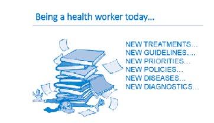

In the context of new knowledge and changing priorities, as a tool, the UCG assists health workers in their daily practice by providing information in an easy-to-follow and practical format.

How do I use the UCG? First of all, familiarize yourself with it. Check the table of contents and see how the chapters are arranged and organized.

|New Feature  The order of chapters has been maintained as in the previous versions. However, new chapters have been introduced, namely, self-care, management of hypoxia and COVID-19. The Palliative Care section has been expounded with more clarity. For the first time a purely herbal preparation with selenium has been included for management of stress. The snake bite section has been enriched with photographs of the common virulent snakes found in Uganda, to ease identification and thus more accurate intervention and management.|
|---|

Most chapters are organised by disease monographs, arranged either in alphabetical order or another logical order (e.g., according to occurrence of disease progression). However, some chapters are organised according to syndrome or symptoms (e.g., child health, palliative care, oncology, sexually transmitted infections, emergencies and trauma), while TB and HIV are presented as individual sub-chapters.

################## XLV

|New Feature  The chapters Covid -19, Self-care and Hypoxia management have been added with focus on primary care (prevention and early recognition of symptoms).|
|---|

Disease monographs are organized in the order of: definition, cause/ risk factors, clinical features and complications, differential diagnosis, investigations, management, and prevention.

|New Feature  Palliative care ladder has been introduced to make it easier for pain assessment. Treatments are presented in logical order from non-pharmacological to  pharmacological, from the lower to the higher level of care. Where possible, alternatives and second-line options have been presented, as well as referral criteria.|
|---|

Medicines are presented by their generic name, in bold. Unless otherwise specified, dosages are for adults and via oral route. Children’s dosages are added whenever indicated, as well as duration and other instructions.

The level of care (LOC) is an important feature; it provides information about the level at which the condition can be appropriately managed. Often, treatment can be initiated at lower level, but the patient needs to be referred for further management, or for second-line treatment, or for complications. For antibiotics, it is recommended that treatment can be initiated in some cases awaiting laboratory results. HC1-4 refers to health centres of different levels (with HC1 being the community level), H to general hospital, RR to regional referral hospital, and NR to national referral hospital.

After familiarizing yourself with it, try using it! Practice finding conditions and looking them up to see how they are managed, using either the table of contents at the beginning or the index at the end.

################## XLVI

Read all the introductory sections. They will give you useful advice for your daily practice. There is always something new to learn or to be reminded of.

Use it in your daily practice. The UCG is designed as a simple reference manual to keep at your work station, where you can consult it any time. Using it in front of patients and colleagues will show that you care deeply about the quality of your work, and it will provide good examples to other health workers.

The UCG cannot replace health workers’ knowledge and skills; like your thermometer and stethoscope, it is a tool to help improve clinical practice by providing a quick and easily available summary of the recommended management of common health conditions.

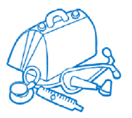

############## What is the difference between the UCG and a textbook?

The UCG gives a summary of recommendations for managing priority conditions in Uganda. It does not provide extensive or in-depth information about all diseases and all treatments available in the world.

Conditions have been selected based on their prevalence in the country and their impact on the population’s health status. Treatments have been selected based on the following criteria:

################## XLVII

Scientific evidence: recommendations are evidence-based, from international literature and local experts. For example, the situation analysis on antimicrobial resistance in Uganda conducted by the National Academy of Sciences was used to guide the choice of antibiotic treatments.

Cost-effectiveness:treatments have been selected based on their effectiveness, but also their affordability, to get the best “value for money”, meaning the maximum benefit with the limited resources available. For example, a liver transplant is a very effective way to treat terminal cirrhosis, but it is definitely not affordable—money is better invested in treating patients with chronic hepatitis B!

What has changed compared to the previous edition? ~ There are more chapters as explained before. ~ The management sections have been re-edited to be more

user-friendly, using the suggestions collected during a user survey.

~ Information on new diseases has been added, following new epidemics and public health priorities (e.g., viral haemorrhagic fevers, Covid-19, yellow fever, nodding disease, sickle cell disease, newborn illnesses).

~ More attention has been paid to non-communicable chronic diseases; for example, stroke and chronic obstructive pulmonary disease (COPD), and sections on diabetes, hypertension, asthma and mental conditions including diseases of elderly and dementia have been expanded.

~ Recommendations have been aligned with the most recent national and international guidelines related to ART, TB, malaria, IMNCI, IMPAC, mhGAP (see the list of references in Appendix 4).

~ Medications have been added or deleted and level of care has changed according to recent evidence and national policies.

################## XLVIII

~ Skin management of Albinos using a sunscreen protection product has been included under the dermatological section.

~ The essential medicines list has been removed from this edition to make the book pocket friendly.

############## What about the Essential Medicines and Health Supply List (EMHSLU)?

The essential medicines list has been removed from this edition to make the book pocket friendly. Always refer to the separate EMHSLU.

To implement the recommendations in the UCG, the medicines listed in the EMHSLU have to be procured and distributed in adequate quantity. This is why the procurement and supply system plays a fundamental role in the provision of quality healthcare.

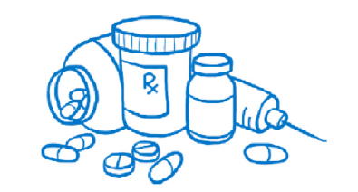

The EMHSLU has all the medicines recommended in the UCG, with specification of the level of care (LOC) at which they can start being used, but it also has additional “specialty” medicines, which are items used at referral level (regional or national) or in the context of specialized services. They may not be included in the UCG, which focus more on primary care, but are still part of the list because they need to be procured to ensure the provision of a wider range of services at secondary and tertiary levels. In the context of limited resources, it is very important to learn to prioritize medicines for procurement: this is reflected by the vital, essential, necessary (VEN) classification in the EMHSLU, introduced in 2012.

################## XLIX

################## L

Medicines are classified into three categories according to health impact: V: vital medicines are potentially life-saving, and lack of availability would cause serious harm and side effects. These must ALWAYS be available—for example insulin, metformin, most antibiotics, first-line antimalarials, some anti-epileptics, and parenteral diuretics.

E: essential medicines are important; they are used to treat common illnesses that are maybe less severe but still significant. They are not absolutely needed for the provision of basic health care (e.g., anti-helminthics, pain killers).

N: necessary (or sometimes called non-essential) medicines are used for minor or self-limiting illnesses, or may have a limited efficacy, or a higher cost compared to the benefit.

Every effort has to be made to ensure health facilities do not suffer stock-outs of VITAL MEDICINES.

AWaRe classification

The WHO AWaRe classification was used to describe overall antibiotic use as assessed by the variation between use of Access, Watch, and Reserve antibiotics.

############## Why is a laboratory test menu in the appendix?

Laboratory is an important tool in supporting the diagnosis and management of various conditions. Tests are listed according to the level at which they can be performed, in order to inform health workers about the available diagnostics at each level for the suspected condition and guide on managemeent or referral decisions.

### Primary Health Care

############## Definition

|Primary healthcare is essential healthcare based on practical, scientifically sound and socially acceptable methods and technologies. Primary healthcare should be universally accessible to individuals and families in the community through their full participation and at a cost that the community and country can afford in the spirit of self-reliance andself-determination.  Primary healthcare forms an integral part of both the country’s health system, of which it is the main focus, and of the community’s overall social and economic development.  Primary healthcare brings healthcare as close as possible to where people live and work and is the community’s first level of contact with the national health system.  “Primary health care is the key to the attainment of the goal of Health for All.”  —Declaration of Alma-Ata International Conference on Primary Health Care, Alma-Ata, USSR, 6–12 September 1978|
|---|

LI

################## LII

How to diagnose and treat in primary care The principles of healthcare are the same wherever it takes place.

“Listen to the patient; he is telling you the diagnosis”

—Sir William Osler, MD, 1849–1919.

############## Communication skills in the consultation room

Good communication skills are essential for making a correct diagnosis and for explaining or counselling on the illness, its treatment, and prevention of future illness.

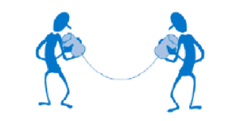

At the beginning of the consultation, use open questions, which allow the patient to express him or herself freely, listen without interrupting, and give him or her the chance to share their interpretations, fears and worries.

The Golden Minute

The golden 60 seconds at the start of the consultation is eliciting ideas, concerns and expectations without interrupting.

Move to more specific questions later, to ask for further details and clarifications.

The Seven Steps in a Primary Care Consultation

- 01
- 02
- 03
- 04
- 05
- 06
- 07

|•|Greet Greet and welcome the patient. Ensure adequate space and privacy!  |
|---|---|
|•  |Look  Observe the patient as he/she walks into your room for degree or state of illness. Look for danger signs and act immediately if necessary|
|•|Listen Ask about the main complaint or complaints, establish duration, and explore each symptom asking relevant questions|
|•|Briefly ask about previous medical history, other past or present illnesses and current or recent medications|
|•|Examine Perform a complete medical examination, focused on but not limited to the complaints  |
|•|Suspect diagnosis Write your findings, and think about possible diagnosis and differentials  |
|•  |Test Request tests to confirm or exclude possible diagnosis|
|• • •|Treat Conclude on a diagnosis and decide on the treatment, if needed Explain diagnosis, treatment, and follow-up to the patient Give counselling and advice as appropriate  |

LIII

|NEW FEATURE  Introduced a section on self-care interventions for sexual and reproductive health (SRH), in the categories of self-awareness, self-testing and self-management, across the various health areas of Antenatal Care, Family Planning, HIV and STIs and post abortion care.  WHO defines self-care as the ability of individuals, families and communities to promote health, prevent disease, maintain health, and cope with illness and disability with or without the support of a healthcare provider.  The Ministry of Health developed the National Guideline on Self-Care Interventions for SRH. For details refer to the current guidelines|
|---|

############## Chronic Care

~ Health workers are faced with an increasing number of chronic diseases and conditions that require additional attention, such as hypertension, chronic heart problems, diabetes, cancers, mental conditions, HIV/AIDS, and TB.

~ Communication is even more important to: ~ Find out the duration of the symptoms, previous diagnosis,

previous or current treatments and impact on daily life ~ Explain the nature and management of the condition to the patient and counsel on lifestyle and adjustment ~ Chronic diseases require long-term (sometimes lifelong) follow-up and treatment: ~ Counsel and advise the patient on the importance of follow- up and treatment adherence ~ Set up a system for scheduling appointments (on the model of HIV care!)

~ At each monitoring visit, determine whether the patient’s LIV

condition is improving, stable, or deteriorating and assess whether patients are taking prescribed treatments properly (the right medicines, in the right doses, at the right time). Try to be consistent in prescribing and change the regimen only if it is not working or has side effects. If a treatment is working and well tolerated, maintain it!

~ Counsel and motivate the patient to follow lifestyle recommendations, including selfcare.

~ Assess the need for further support (e.g., pain management, counselling, etc.)

~ A chronic care system requires collaboration among and integration of all levels of healthcare

~ Higher levels of care may be responsible for initial diagnosis and prescription of treatment and periodic reviews and re-assessment in case of problems or complications

~ Lower levels of care (including the community) may be responsible for routine follow-up, counselling and education, medication refills and prompt and early referral in case of problems.

############## Appropriate Medicines Use

According to WHO, “Rational [appropriate] use of medicines requires that patients receive medications appropriate to their clinical needs, in doses that meet their own individual requirements, for an adequate period of time, and at the lowest cost to them and their community”.

Inappropriate medicine use can not only harm the patient, but by wasting resources, may limit the possibility of other people accessing healthcare! Both health workers and patients have an important role to play in ensuring appropriate use by:

~ Prescribing (and taking) medicines ONLY when they are needed

~ Avoiding giving unnecessary multiple medications to satisfy patients’ demands or for financial gain

LV

################## LVI

~ Avoiding expensive alternative or second-line medications when an effective and inexpensive first-line is available

~ Avoiding injections when oral treatment is perfectly adequate

~ Ensuring that the correct dose and duration of treatment is prescribed, especially for antibiotics, to avoid resistance

~ Providing adequate information and counselling to the patient to ensure adherence with instructions.

Antimicrobial Resistance (AMR) According to the WHO definition

“Antimicrobial resistance occurs when microorganisms such as bacteria, viruses, fungi and parasites change in ways that render the medications used to cure the infections they cause ineffective. Antimicrobial resistance is facilitated by the inappropriate use of medicines, for example, when taking substandard doses or not finishing a prescribed course of treatment. Low-quality medicines, wrong prescriptions and poor infection prevention and control also encourage the development and spread of drug resistance”.

The problem of AMR is a serious threat for the modern world: ~ The resistance of malaria parasites has caused several changes in antimalarial regimens in the last 15 years ~ MDR-TB (multi-drug resistant tuberculosis) is spreading and

requires long and complex treatments ~ HIV resistance is a serious concern, especially after longterm treatment ~ AMR is spreading and, in some cases, commonly used antimicrobials are not as effective as before

~ Antimicrobial resistance amomg bacteria other than TB and fungi (moulds and yeasts) that affect the immune-compromised is evolving, spreading and responsible for death from sepsis in general and high dependency units.

Inappropriae use of antibiotics (in human medicine but also in animal agriculture), poor quality products and ineffective infection control measures are all contributing factors. We are seriously at risk of finding ourselves in a situation with no affordable antimicrobial available to cure common and dangerous infections.

It is URGENT that both health workers and patients become aware of the problem and start acting by: ~ Using antimicrobials only when it is really necessary and

according to recommendations (e.g. not for simple viral infections!)

~ Avoiding self-prescription of antibiotics ~ Avoiding using last generation and broad spectrum antibi-

otics as first-line treatment ~ Prescribing correct dosages for the correct duration and ensuring adherence to the prescription ~ Practising strict measures of infection control in health facilities ~ Improving hygiene and sanitation in the community, there-

by reducing the circulation of germs. AWaRE

~ WHO has further introduced the AWaRE classification to guide prescribers during prescribing of antibiotics. The major focus of AWaRe approach is to reduce on the increasing antimicrobial resistance.

~ The principal of AWaRe prescribing is based on Access,

############## Watch, Reserve.

~ Prescribers are encouraged to adhere to the above.

################## LVII

############## Prescribing Guidelines

The current PGD (Practical Guidelines for Dispensing at Lower/ Higher Level Health Facilities), provide comprehensive information about how to prescribe and dispense the medicines listed in the EMHSLU and UCG 2023. Carefully consider the following key questions before writing any prescription:

|QUESTION|COMMENTS|
|---|---|
|Does the diagnosed condition require drug treatment?|~ Not all patients or conditions need a prescription for medicines (condition is self-limiting): non-medicine treatments or simple advice may be more suitable in certain situations|
|Is the prescribed treatment likely to have optimum therapeutic effect and to benefit the patient?|~ Good therapeutics depends on: ~ Accurate diagnosis of the condition ~ Knowledge of the relevant vavailable  medicines ~ Ask patient about previous drug history (eg. drug reaction /allergy) ~ Selection of the most appropriate medicine, dose, route, and duration  ~ In all cases, carefully consider the expected benefit of a prescribed medication against its potential risks|
| |~ Good therapeutics depends on: ~ Accurate diagnosis of the condition ~ Knowledge of the relevant vavailable  medicines ~ Ask patient about previous drug history (eg. drug reaction /allergy) ~ Selection of the most appropriate medicine, dose, route, and duration  ~ In all cases, carefully consider the expected benefit of a prescribed medication against its potential risks|
|Is the selected dosage-form the most appropriate?|~ For systemic medications, ALWAYS USE THE ORAL ROUTE if possible, as it is the cheapest and least hazardous route  ~ Always resist patient demands for you to prescribe injections or other expensive dose forms when they are not clearly indicated or appropriate|

################## LVIII

|QUESTION|COMMENTS|
|---|---|
| |~ LIMIT INJECTIONS to situations where they are absolutely necessary (they carry risks and are more expensive)  ~ Always explain to the patient the reasons for choosing a certain route|
|Can I justify using a combination of medicines?  Do I really need to prescribe more than one medicine?|~ Do not prescribe a combination of medicines unless they have a proven and significant therapeutic advantage over corresponding single ingredient preparations  ~ Do not practise multiple medicine prescribing (polypharmacy), especially when the diagnosis is uncertain. It is a tremendous waste of resources and puts the patient at increased risk without clear benefit|
|Have I taken into account all relevant patient criteria?|Consider the following: ~ Age, gender, weight—especially of  children and elderly ~ Likelihood of side effects (including allergies)  ~ Presence of renal or hepatic disease (many medicines may have to be used in reduced doses or avoided completely)  ~ Any other medicines the patient may be taking (risk of unwanted medicine interactions or adverse effects)|

################## LIX

################## LX

|QUESTION|COMMENTS|
|---|---|
| |~ Pregnancy and breastfeeding: only use medicines in pregnancy if the expected benefit to the mother is greater than any risk to the foetus/ baby and avoid all medicines if possible during the first trimester (the first three months of pregnancy)  ~ Likely degree of adherence to treatment (simpler, shorter dosage regimes increase the chance of  ~ the patient correctly following prescribed therapy)|

############## Prescribing placebos

Avoid placebos whenever possible. Instead, spend some time reassuring and educating the patient. Use home remedies when possible (e.g., honey for cough in adults and children above 1 year).

Prescription writing A wrong prescription is very risky for you and your patient.

Unclear, incomplete, or inaccurate prescriptions are very dangerous for the patient. To avoid problems, follow the guidance below in writing your prescriptions:

|PRESCRIPTION WRITING RULES|
|---|
|~ Write all prescriptions legibly in ink ~ Poor writing may lead to errors in interpretation by  the dispenser, which may have harmful and possibly life-threatening consequences for the patient|

|PRESCRIPTION WRITING RULES|
|---|
|~ Write the full name, age, gender and address of the patient, then sign and date the prescription form  ~ All prescriptions should clearly indicate the name and address of the prescriber and of the facility  ~ A PRESCRIPTION IS A LEGAL DOCUMENT|
|~ Write the name of the medicine or preparation using its full generic name.  ~ Unofficial abbreviations, trade names, and obsolete names should not be used.|
|~ State the strength of the medicine prescribed where relevant:  ~ Quantities of one gram or more should be written as 1g, 2.5g, 10g, and so on  ~ Quantities <1g but >1mg should be expressed in milligrams rather than grams, for example, 500mg and not 0.5g  ~ Quantities <1mg should be expressed in micrograms and not in mg, for example, 100 micrograms rather than 0.1 mg or 100 mcg|
|~ If decimal figures are used, always write a zero in front of the decimal point where there is no other figure, for example 0.5 ml and not .5 ml|
|~ Always state dose regimen in full:  - Dose size, Dose frequency, Duration of treatment  ~ The quantity to be dispensed is calculated from the regimen.  ~ For example, doxycycline 100 mg every 12 hours for 7 days = to be dispensed: 14 tablets of 100 mg.  ~ For in-patients, clearly state the route of administration and specify time of administration, if relevant|

################## LXI

################## LXII

|PRESCRIPTION WRITING RULES|
|---|
|~ Avoid use of instructions like “prn” or “to be used/taken as required”. Indicate a suitable dose frequency instead  ~ In the few cases where “as required” is appropriate, always state the actual quantity of the medicine to be supplied, when to take it and maximum amount|
|~ Where relevant, always remember to include on the prescription any special instructions necessary for the correct use of a medicine or preparation, for example “before food” or “apply sparingly”.|

############## Controlled medicine prescriptions

These medicines are covered by the provisions of the National Drug Policy and Authority Act 1993, which should be consulted for details of the appropriate legal requirements as stipulated. Medicines covered by the Act and appear in the UCG 2023 or EMHSLU 2023 include:

~ Morphine injection ~ Morphine oral solution ~ Papaveretum + hyoscine injection ~ Pethidine injection ~ Codeine ~ Tramadol ~ Diazepam injection

These are all medicines of potential abuse that may result in dependence. All procedures involving them should be carefully recorded in the appropriate record books. They may only be prescribed by authorised prescribers who must observe the following legal requirements:

~ Prescriptions must be in the prescriber’s own handwriting, with a signature, date and the prescriber’s address

~ Prescriptions must state the name and address of the patient

~ Prescriptions must state the total amount of the product to be supplied in words and figures

~ It is an offence for a prescriber to issue and for a pharmacy to dispense prescriptions for controlled medicines unless they are in full compliance with the requirements of the law.

############## Notes

ƒ Specialised palliative care nurses and clinical officers are authorised to prescribe oral morphine and other medicines used in palliative care.

ƒ Morphine rarely causes psychological dependence when prescribed for severe pain.

ƒ In certain exceptional circumstances, senior nurses in charge of departments, wards or theatres and midwives may also obtain and administer certain specified controlled medicines. Consult the relevant sections of the Act for details of the appropriate legal requirements in each case.

ƒ Hospital in-patient prescriptions written on treatment cards or case sheets and signed/dated by the person administering the medicine are considered as compliant under the Act.

############## Prescribing in children and the elderly

In these guidelines, paediatric medicine doses are usually given according to body weight and not age, and are therefore expressed as mg/kg.

The main reason for this is that children of the same age may vary significantly in weight. Thus, it is safer and more accurate to prescribe medicines according to body weight. Moreover, this should encourage the good practice of weighing children whenever possible.

################## LXIII

However, as a guide to prescribing by weight when a weighing scale is not available, the weight-for-age charts at the end of Chapter 17 can be used as an estimate for children from 1-24 months and 2-15 years, respectively. Always use lean/ideal body weight for children who are overweight/obese to avoid giving them overdoses.

Note: Paediatric doses calculated using mg/kg should not exceed the normal adult dose.

In the case of some medicines that have a wide therapeutic range and a good safety profile, dosages are given for age ranges for easy reference.

Prescriptions in the elderly also need additional attention because the elderly are more prone to side effects; they are more likely to take several medications (polypharmacy) with possible interactions, and they often have co-morbidities that can affect their response to medicines. Reduced doses and careful monitoring are always advised, and specific warnings have been added for some medicines.

############## Medicine interactions

Before prescribing any medicine, take care to avoid problems of interactions with other medicines by obtaining details of any other medication that the patient is taking, whether the medication is:

~ Also prescribed at the same time ~ Previously prescribed by another prescriber for the same or another condition and currently being taken by the patient ~ Purchased or otherwise obtained by the patient for the pur-

poses of self-medication at home.

################## LXIV

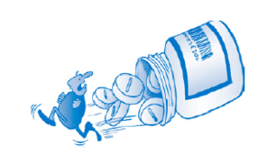

Note on interactions with alcohol. If a prescribed medicine interacts with alcohol (for example, metronidazole, diazepam, anti-diabetic medicines, and tricyclic antidepressants), caution the patient to avoid taking alcoholic drinks during the course of treatment and for 48 hours afterwards.

############## Patient counselling

This vital part of patient management is often neglected with potentially serious consequences. Although counselling the patient may take time, if done systematically, it should only take a few minutes and could make the difference between treatment success and failure.

Include the following key components when counselling the patient: ~ Explain the diagnosis and the likely cause of the disease or

condition and discuss the proposed approach to treatment ~ Describe the prescribed medicine therapy in detail includ-

ing: ƒ Medicine name ƒ Function of the medicine ƒ Dose regimen (size, frequency, duration) ƒ Any additional instructions on correct use or storage of the med-

icine

################## LXV

################## LXVI

ƒ Any likely side effects and what to do if they occur ƒ Advise on important medicine interactions (including with alcohol)

~ Give advice on how to contribute to the success of the treatment (for example, rest, diet, fluids and other lifestyle changes) and how to avoid the same problem in future

~ Ensure the patient or caretaker fully understands the information and advice provided—ask him or her to repeat key points

~ For health conditions that require self-care, proper advice should be given to the patient on self-awareness, self-testing and self-management.

ƒ Ensure the patient is satisfied with the proposed treatment and has an opportunity to raise any problems or queries with you.

# Emergencies and T rauma1

#### 1.1 COMMON EMERGENCIES 1.1.1 Anaphylactic Shock ICD10 CODE: T78.2

Severe allergic reaction that occurs rapidly (seconds or minutes) after administration, or exposure, and may be life threatening. It generally affects the whole body.

Causes ~ Allergy to pollens, some medicines (e.g., penicillins, vac-

cines, acetylsalicylic acid), or certain foods (e.g. eggs, fish, cow’s milk, nuts, some food additives)

~ Reaction to insect bites, e.g., wasps and bees

Clinical features ~ Body itching, hives (urticarial rash), swelling of lips, eyes,

tongue ~ Difficulty in breathing (stridor, wheezing) ~ Hypotension and sudden collapse, excessive sweating, thin

pulse ~ Abdominal cramps, vomiting and diarrhoea.

############## Differential diagnosis

~ Other causes of shock, e.g., haemorrhagic (due to bleed-

ing), hypovolemic (severe dehydration), septic ~ Asthma, foreign body in airways.

Uganda Clinical Guidelines 2023CHAPTER 1:Emergencies and Trauma

Uganda Clinical Guidelines 2023CHAPTER 1:Emergencies and Trauma

Management

|TREATMENT|LOC|
|---|---|
|General measures Determine and remove the cause Secure the airways Restore BP: lay the patient flat and raise feet Keep patient warm|HC2|
|Sodium chloride 0.9% infusion 20 ml/kg by IV infusion over 60 minutes  – Start rapidly then adjust rate according to BP Administer oxygen|HC3 HC4 |
|Adrenaline (epinephrine) injection 1 in 1000 (1 mg/ml) 0.5 mg (0.5 ml) IM immediately, into anterolateral thigh  – Repeat every 5-10 minutes according to BP, pulse rate, and respiratory function until better Child <6 years: 150 micrograms (0.15 ml) Child 6-12 years: 300 micrograms (0.3 ml)  In severely affected patients  Hydrocortisone 200 mg IM or slow IV stat Child <1 year: 25 mg  Child 1-5 years: 50 mg Child 6-12 years: 100 mg  If urticaria/itching  Give an antihistamine as useful adjunctive treatment e.g., chlorpheniramine 4 mg every six hours  Child 1-2 years: 1mg every 12 hours Child 2-5 years: 1 mg every 6 hours Child 5-12 years: 2 mg every 6 hours   -Or Cetrizine 5mg once daily for adults Child 6 and above years: 5mg daily  Child 1-6 years: 2.5mg once daily. |HC2 HC3   HC2V|

|TREATMENT|LOC|
|---|---|
|or promethazine 25-50 mg by deep IM or very slow IV (or oral) Child 1-5 years: 5 mg by deep IM Child 5-10 years: 6.25-12.5 mg by deep IM Repeat dose every 8 hours for 24-48 hours to prevent relapse Repeat adrenaline and hydrocortisone every 2-6 hours prn depending on the patient’s progress|HC4|
|Notes  ƒ Adrenaline: IM is the route of choice: absorption is rapid and more reliable than SC ƒ Monitor the patient for several hours (reaction may recur after several hours) ƒ If drug reaction, compile adverse drug reaction reporting form (see appendix 2)|Notes  ƒ Adrenaline: IM is the route of choice: absorption is rapid and more reliable than SC ƒ Monitor the patient for several hours (reaction may recur after several hours) ƒ If drug reaction, compile adverse drug reaction reporting form (see appendix 2)|

Prevention ~ Always ask about allergies before giving patients new med-

icine

~ Keep emergency drugs at hand at health facilities and in situatiuons where risk of anaphlaxis is high, e.g. visiting bee hives or places that usually harbour snakes

~ Counsel allergic patients to wear alert bracelet or tag. 1.1.2 Hypovolaemic Shock ICD10 CODE: R57.1

Condition caused by severe acute loss of intravascular fluids leading to inadequate circulating volume and inadequate perfusion.

Causes ~ Loss of blood due to internal or external haemorrhage (e.g.,

post partum haemorrhage, splenic rupture etc.)

Uganda Clinical Guidelines 2023CHAPTER 1:Emergencies and Trauma

Uganda Clinical Guidelines 2023CHAPTER 1:Emergencies and Trauma

~ Acute loss of fluids, e.g. in gastroenteritis, or extensive

burns Clinical features ~ High heart rate, fast breathing rate ~ Thin or absent pulse, cold extremities, slow capillary refill ~ Low blood pressure ~ Mental agitation, confusion

############## Classification of hypovolaemia in adults

|Indicator|Class 1 Mild|Class 2 ProGressing|Class 3 Severe|Class 4 End Stage|
|---|---|---|---|---|
|Blood loss (Litres)|<0.75|0.75 – 1.5|1.5 –2|>2|
|% of total blood volume loss|<15|15- 30|30 – 40|>40|
|Pulse rate|Normal|>100|>120|>140|
|Pulse pressure|Normal|â|ââ|/A|
|Systolic BP|Normal|N|â|ââ|
|Capillary refill|Normal|á|áá|Absent|
|Respiratory rate|Normal|20 – 30|30 – 40|>45 or gasping|
|Mental state|Alert|Anxious|Confused|Confused/ unconscious|
|Urine output (ml/h)|>30|20 - 30|5 – 20|<5|

Differential diagnosis ~ Other types of shock

Management in adults

|TREATMENT|LOC|
|---|---|
|‰ Control obvious bleeding with pressure ‰ Keep patient lying down with raised legs.|HC3|
|If established hypovolaemia class 2 and above  ƒ Set 2 large bore IV lines ƒ IV fluidsNormal Saline 0.9%(orRinger’s lactate)20-  30 ml/kg over 60 minutes according to response  - If possible, warm the fluid - Start rapidly, monitor BP - Assess response to fluid resuscitation: BP, HR, RR, capillary refill, consciousness and urinary output   ‰ If internal or external haemorrhage, consider blood transfusion  If rapid improvement and stable (blood loss <20% and not progressing)  ‰ Slow IV fluids to maintenance levels ‰ No immediate transfusion but do cross-matching ‰ Regular reassessment ‰ Detailed examination and definitive treatment according  to the cause  If transient improvement (blood loss 20-40% or ongoing bleeding)  ‰ Rapid administration of fluids ‰ Initiate blood transfusion (see section 11.2) ‰ Regular reassessment ‰ Detailed examination and early surgery If no improvement ‰ Vigorous fluid administration ‰ Urgent blood transfusion ‰ Immediate surgery|HC4|

Uganda Clinical Guidelines 2023CHAPTER 1:Emergencies and Trauma

- Uganda Clinical Guidelines 2023CHAPTER 1:Emergencies and Trauma

|TREATMENT|LOC|
|---|---|
|Caution Do not use glucose solution or plain water as replacement fluids| |

########### 1.1.2.1 Hypvovolaemic Shock In Children Principles of management are similar to the ones in adults BUT:

- - Recognising this may be more difficult than in adults
- - Vital signs may change little, even when up to 25% of blood volume is lost (class 1 and 2 hypovolaemia)

- Tachycardia is often the first response to hypovolaemia but may also be caused by fear or pain

Classification of hypovolaemia in children

|Indicator|Class 1 Mild|Class 2 ProgresSing|Class 3 Severe|Class 4 End Stage|
|---|---|---|---|---|
|% of total blood volume loss <15|% of total blood volume loss <15|15-25|25-40|>40|
|Pulse rate|Normal|>150|>150|>150|
|Pulse pressure|Normal|N||Absent|
|Systolic BP|Normal|N||Absent|
|Capillary refill|Normal|á|áá|Absent|
|Respiratory rate|Normal|N/á|áá|áá Slow sighing|
|Mental state|Normal|Irritable|Lethargic|Comatose|
|Urine output (ml/ kg/ hour)|<1|<1|<1|<1|

Normal ranges for vital signs in children

|Age (Years)|Pulse (Rate/Min)|Systolic Bp (Mmhg)|Respiration (Rate/Min)|Blood Vol (Ml/Kg)|
|---|---|---|---|---|
|<1|120–160|70–90|30–40|85–90|
|1–5|100–120|80–90|25–30|80|
|6–12|80–100|90–110|20–25|80|
|>12|60–100|100–120|15–20|70|

Management

|TREATMENT|LOC|
|---|---|
|‰ Initial fluid challenge should represent 25% of blood volume as signs of hypovolaemia may only show after this amount is lost  ‰ If there are signs of class 2 hypovolaemia or greater, give 20-30 ml/kg of Normal Saline 0.9% (or Ringer’s lactate) over 60 minutes  - Start rapidly - Monitor BP - Reduce rate depending on BP response   ‰ Dependingo n response,r epeat upt o 3t imesi f nec-  essary i.e. up to max 60 ml/kg ‰ If no response: ‰ Give further IV fluids and blood transfusion ‰ Initially transfuse 20 ml/kg of whole blood or 10 ml/  kg of packed cells (only in severe anaemia)|HC3 HC4 |

Uganda Clinical Guidelines 2023CHAPTER 1:Emergencies and Trauma

- Uganda Clinical Guidelines 2023CHAPTER 1:Emergencies and Trauma

########## 1.1.3 Dehydration ICD10CODE: E86.0

A condition brought about by the loss of significant quantities of fluids and salts from the body.

Causes ~ Vomiting and/or diarrhoea ~ Decreased fluid intake ~ Excessive loss of fluids, e.g. due to polyuria in diabetes,

excessive sweating as in high fever, burns Clinical features ~ Apathy, sunken eyes/fontanel, loss of skin turgor (especially

in children) ~ Hypotension, tachycardia, deep (acidotic) breathing, dry mu-

cosae, poor or no urine output. 1.1.3.1 Dehydration in Children under 5 years Assess degree of dehydration following the table below: Clinical features of dehydration in children

|Signs|Degree of Dehydration|Degree of Dehydration|Degree of Dehydration|
|---|---|---|---|
|Signs|None|Some|Severe|
|General condition|Well, alert|Restless, irritable|Lethargic, drowsy or unconscious|
|Eyes|Not sunken|Sunken|Sunken|
|Fontanel|Not sunken|Sunken|Sunken|
|Ability to drink|Drinks normally|Drinks eagerly, thirsty|Drinks poorly or not able to drink|
|Skin pinch|Goes back immediately|Goes back slowly; <2 seconds|Goes back very slowly; >2 seconds|
|Treatment|Plan A|Plan B|Plan C|

Management

- Plan A (No dehydration and for prevention)

|TREATMENT|LOC|
|---|---|
|‰ Counsel the mother on the 4 rules of home treatment: extra fluids (ORS), continue feeding, zinc supplementation, when to return  ‰ Give extra fluids: as much as the child will take  - If child exclusively breastfed, give ORS or safe clean water in addition to breast milk - If child not exclusively breastfed, give one or more   of: ORS, soup, rice-water, yoghurt, clean water  - In addition to the usual fluid intake, give ORS after each loose stool or episode of vomiting Child <2 years: 50-100 ml  Child 2-5 years: 100-200 ml  - Give the mother 2 packets to use at home - Giving ORS is especially important if the child has been treated with Plan B or Plan C during current visit - Give frequent small sips from a cup   ‰ Advice the mother to continue or increase breastfeeding. If child vomits, wait 10 minutes, then give more slowly  - In a child with high fever or respiratory distress, give plenty of fluids to counter the increased fluid losses in these conditions - Continue giving extra fluid as well as ORS until - the diarrhoea or other cause of dehydration stops   ‰ If diarrhoea, give Zinc supplementation Child <6 months: 10 mg once a day for 10 days Child >6 months: 20 mg once a day for 10 days|HC2|

Uganda Clinical Guidelines 2023CHAPTER 1:Emergencies and Trauma

- Uganda Clinical Guidelines 2023CHAPTER 1:Emergencies and Trauma

- Plan B (Some dehydration)

|TREATMENT|LOC|
|---|---|
|‰ Give ORS in the following approximate amounts during the first 4 hours  |Age (Months)|<4|4–12|13–24|25–60|
|---|---|---|---|---|
|Weight (Kg)|<6|6–9.9|10–11.9|12–19|
|Ors (Ml)|200–400|400–700|700–900|900–1400|
  - Only use child’s age if weight is not known - You can also calculate the approximate amount of ORS to give a child in the first 4 hours as weight (kg) x 75 ml   ‰ Show the mother how to give the ORS  - Give frequent small sips from a cup - If the child wants more than is shown in the table, give more as required - If the child vomits, wait 10 minutes, then continue - more slowly   ‰ For infants <6 months who are not breastfed, also give 100-200 ml of clean water during the first 4 hours  ‰ Reassess patient frequently (every 30-60 minutes) for classification of dehydration and selection of Treatment Plan  After 4 hours ‰ Reassess the patient ‰ Reclassify the degree of dehydration ‰ Select the appropriate Treatment Plan A, B or C ‰ Begin feeding the child in the clinic|HC2|

|TREATMENT|LOC|
|---|---|
|If mother must leave before completing the child’s treatment ‰ Show her how to prepare ORS at home and how much  ORS to give to finish the 4-hour treatment  - Give her enough packets to complete this and 2 more to complete Plan A at home  ‰ Counsel mother on the 4 rules of home treatment: extra fluids, continue feeding, zinc, when to return| |

- Plan C (Severe dehydration)

|TREATMENT|LOC|
|---|---|
|If you are unable to give IV fluids and this therapy is not available nearby (within 30 minutes) but a nasogastric tube (NGT) is available or the child can drink  ‰ Start rehydration with ORS by NGT or by mouth: Give  20 ml/kg/hour for 6 hours (total = 120 ml/ kg) ‰ Reassess the child every 1-2 hours  - If there is repeated vomiting or increasing abdominal distension, give more slowly - If hydration status is not improving within 3hours, refer the child urgently for IV therapy   ‰ After 6 hours, reassess the child ‰ Classify the degree of dehydration ‰ Select appropriate Plan A, B, or C to continue treatment|HC2|

Uganda Clinical Guidelines 2023CHAPTER 1:Emergencies and Trauma

########################## Uganda Clinical Guidelines 2023CHAPTER 1:Emergencies and Trauma

|TREATMENT|LOC|
|---|---|
|If you are unable to give IV fluids but IV treatment is available nearby (i.e. within 30 minutes)  ‰ Refer urgently for IV treatment If the child can drink: ‰ Provide mother with ORS and show her how to give frequent sips during the trip to the referral facility|HC2|
|If you are able to give IV fluids ‰ Set up an IV line immediately  - If child can drink, give ORS while the drip is set up  ‰ Give 100 ml/kg of Ringer’s Lactate  - Or half-strength Darrow’s solution in glucose 2.5% or sodium chloride 0.9% - Divide the IV fluid as follows:   ‰ Reassess patient frequently (every 30-60 minutes) to  re-classify dehydration and treatment plan If the patient is not improving ‰ Give the IV fluids more rapidly|HC3|
|As soon as patient can drink, usually after 3-4 hours in infants or 1-2 hours in children ‰ Also give ORS 5 ml/kg/hour| |
|‰ Continue to reassess patient frequently; classify degree of dehydration; and select appropriate Plan A, B, or C to continue treatment.| |
|Note If possible, observe child for at least 6 hours after rehydration to ensure that the mother can correctly use ORS to maintain hydration.|Note If possible, observe child for at least 6 hours after rehydration to ensure that the mother can correctly use ORS to maintain hydration.|

1.1.3.2 Dehydration in Older Children and Adults

Assess degree of dehydration following the table below.

CLINICAL FEATURE DEGREE OF DEHYDRATION

|MILD|MODERATE SEVERE|
|---|---|
|General appearance Thirsty, alert|Thirsty, alert Generally conscious, anxious, clammy, cold extremities, cyanosis, wrinkly skin of fingers, muscle cramps, dizzy if standing|
|Pulse Normal|Rapid Rapid, thready, sometimes absent|
|Respiration Normal|Deep, may be rapid  Deep and rapid|
|Systolic BP Normal|Normal Low, may be immeasurable|
|Skin pinch Rturns  rapidly Eyes Normal Tears Present Mucous membranes  Moist|Rturns slowly  Returns very slowly (>2 seconds)  Sunken Very sunken Absent Absent Dry Very dry|
|Urine output Normal|Reduced, dark urine  Anuria, empty bladder|

Note At least 2 of these signs must be present

Uganda Clinical Guidelines 2023CHAPTER 1:Emergencies and Trauma

- Uganda Clinical Guidelines 2023CHAPTER 1:Emergencies and Trauma

############## Management

|TREATMENT|LOC|
|---|---|
|Mild dehydration ‰ Give oral ORS 25 ml/kg in the first 4 hours  - Increase or maintain until clinical improvement Moderate dehydration ‰ Give oral ORS 50 mg/kg in the first 4 hours Severe dehydration ‰ Ringer’s lactate (or Normal Saline 0.9%) IV, 50 ml/kg  in the first 4 hours  - Give IV fluids rapidly until radial pulse can be felt, - then adjust rate - Re-evaluate vitals after 4 hours   Volumes that are given over the first 24 hours in adults are shown in the table below|HC2 HC3 |

|Time period|Volume of iv fluid|
|---|---|
|First hour|1 L|
|Next 3 hours|2 L|
|Next 20 hours|3 L|

‰ After 4 hours, evaluate rehydration in terms of clinical signs (NOT in terms of volumes of fluid given)

‰ As soon as signs of dehydration have disappeared (but not before), start fluid maintenance therapy, alternating ORS and water (to avoid hypernatraemia) as much as the patient wants

Continue for as long as the cause of the original dehydration persists.

|Notes  ƒ Volumes shown are guidelines only. If necessary, volumes can be increased or initial high rate of administration maintained until clinical improvement occurs  ƒ In addition toORS, other fluids such as soup, fruit juice and safe clean water may be given  - Initially, adults can take up to 750 ml ORS/hour.  ƒ If sodium lactate compound IV infusion (Ringer’s Lactate) is not available, use half-strength Darrow’s solution in glucose 2.5% or sodium chloride infusion 0.9%. However, both of these are less effective  ƒ Continued nutrition is important, and food should be continued during treatment for dehydration.|
|---|
|Caution  ƒ Avoid artificially sweetened juices.|

Prevention (for all age groups) ~ Encourage prompt use of ORS at home if the personis

vomiting and/or having diarrhoea.

######## 1.1.4 Fluids and Electrolytes Imbalances ICD10 CODE: E87.8

A condition where losses of bodily fluids from whatever cause has led to significant disturbance in the normal fluid and electrolyte levels needed to maintain physiological functions.

Causes

Disorders may occur in the fluid volume, concentration (sodium composition), and distribution of fluid and other electrolytes and ph. The main cause is problems in intake, loss and/or distribution and balance between water and electrolytes, as shown in the table below:

Uganda Clinical Guidelines 2023CHAPTER 1:Emergencies and Trauma

- Uganda Clinical Guidelines 2023CHAPTER 1:Emergencies and Trauma

|MECHANISM|EXAMPLES|
|---|---|
|Gastrointestinal loss|~ Excessive vomiting and diarrhoea ~ Nasogastric drainage ~ Fistula drainage|
|Haemorrhage|~ Internal or external|
|Fluid sequestration|~ Paralytic ileus, intestinal obstruc-  tion ~ Peritonitis|
|Loss through skin/ wounds|~ Sweating ~ Extensive burns|
|Urinary loss|~ Decompensated diabetes|
|Fluid retention and electrolytes or water imbalances|~ Renal, hepatic and heart failure (see specific section for management)|
|Reduced intake|~ Post operative patients|
|Excessive intake|~ Water intoxication, IV fluids overload|

Clinical features ~ Dehydration in mild/moderate fluid (water and electrolytes)

deficiency ~ Hypovolaemic shock in severe fluid deficiency ~ Oedema (including pulmonary oedema) in fluid excess ~ Specific effects due to electrolytes imbalances Management IV fluids and electrolytes therapy has three main objectives:

~ Replace lost body fluids and continuing losses ~ Correct eventual imbalances ~ Maintain daily fluid requirements.

|Always use an IV drip for patients who are seriously ill (except patients with congestive heart failure; for these, use only an indwelling needle) and may need IV drugs or surgery. If the fluid is not needed urgently, run it slowly to keep the IV line open.|
|---|

Maintenance fluid therapy

|TREATMENT|LOC|
|---|---|
|Administer daily fluid and electrolyte requirements to any patient not able to feed ‰ The basic 24-hour maintenance requirement for an  adult is 2.5-3 litres  - One third of these daily fluids should be (isotonic) - sodium chloride 0.9% infusion (or Ringer’s Lactate), the other two thirds Glucose 5% infusion   ‰ As well as the daily requirements, replace fluid lost due to the particular condition according to the assessed degree of dehydration.|HC3|
|Notes  ƒ Closely monitor all IV drips to ensure that the rate is adjusted as required  ƒ Check the drip site daily for any signs of infection; change drip site every 2-3 days or when the drip goes into tissues (extravasation).|Notes  ƒ Closely monitor all IV drips to ensure that the rate is adjusted as required  ƒ Check the drip site daily for any signs of infection; change drip site every 2-3 days or when the drip goes into tissues (extravasation).|

Uganda Clinical Guidelines 2023CHAPTER 1:Emergencies and Trauma

- Uganda Clinical Guidelines 2023CHAPTER 1:Emergencies and Trauma

Replecment therapy in specific conditions

|TREATMENT|LOC|
|---|---|
|Dehydration ‰ see section 1.1.3|HC3|
|Diarrhoea and vomiting with severe dehydration, paralytic ileus, intestinal obstruction  ‰ Replace fluid losses with isotonic (sodium) solutions containing potassium e.g. compound sodium lactate infusion (Ringer’s Lactate solution)  ‰ Or half-strength Darrow’s solution in 2.5% glucose infusion|Diarrhoea and vomiting with severe dehydration, paralytic ileus, intestinal obstruction  ‰ Replace fluid losses with isotonic (sodium) solutions containing potassium e.g. compound sodium lactate infusion (Ringer’s Lactate solution)  ‰ Or half-strength Darrow’s solution in 2.5% glucose infusion|
|Haemorrhage If there is blood loss and the patient is not in shock ‰ Use sodium chloride 0.9% infusion for blood volume replacement  giving 0.5-1 L in the 1st hour and not more than 2-3 L in 4 hours If there is blood loss >1 litre ‰ Give 1-2 units of blood to replace volume and concentration|Haemorrhage If there is blood loss and the patient is not in shock ‰ Use sodium chloride 0.9% infusion for blood volume replacement  giving 0.5-1 L in the 1st hour and not more than 2-3 L in 4 hours If there is blood loss >1 litre ‰ Give 1-2 units of blood to replace volume and concentration|
|Shock ‰ Give Ringer’s Lactate or sodium chloride 0.9% infusion 20 ml/  kg IV over 60 minutes for initial volume resuscitation  - Start rapidly, closely monitor BP - Reduce the rate according to BP response   ‰ In patients with severe shock and significant haemorrhage, give a blood transfusion|Shock ‰ Give Ringer’s Lactate or sodium chloride 0.9% infusion 20 ml/  kg IV over 60 minutes for initial volume resuscitation  - Start rapidly, closely monitor BP - Reduce the rate according to BP response   ‰ In patients with severe shock and significant haemorrhage, give a blood transfusion|
|Notes  ƒ Closely monitor all IV drips to ensure that the rate is adjusted as required  ƒ Check the drip site daily for any signs of infection; change drip site every 2-3 days or when the drip goes into tissues (extravasation).|Notes  ƒ Closely monitor all IV drips to ensure that the rate is adjusted as required  ƒ Check the drip site daily for any signs of infection; change drip site every 2-3 days or when the drip goes into tissues (extravasation).|

######## 1.1.4.1 IV Fluid management in children ICD10 CODE: E87.8

|TREATMENT|LOC|
|---|---|
|‰ Total daily maintenance fluid requirement is 100 ml/kg for the first 10 kg plus  - 50 ml/kg for the next 10 kg plus 25 ml/kg for each subsequent kg  ‰ Give more than above if child is dehydrated or in fluid loss or fever (10% more for each 1°C of fever)|HC4|

Fluid management in neonates

|TREATMENT|LOC|
|---|---|
|‰ Encourage mother to breastfeed or if child unable, give expressed breast milk via NGT  ‰ Withhold oral feeding in case of bowel obstruction, necrotizing enterocolitis, or if feeding is not tolerated (abdominal distension, vomiting everything)  ‰ Withhold oral feeding in acute phase of severe sickness, in infants who are lethargic, unconscious or having frequent convulsions|HC4|
|Total amount of fluids (oral and/or IV)  Day 1: 60 ml/kg/day of Dextrose 10% Day 2: 90 ml/kg/day of Dextrose 10% Day 3: 120 ml/kg/day of half normal saline and dextrose 5% Day 4 onwards: 150 ml/kg/day ‰ If only IV fluids are given, do not exceed 100 ml/ kg/   day unless child is dehydrated, under a radiant heater or phototherapy  ‰ If facial swelling develops, reduce rate of infusion ‰ When oral feeding is well established, raise the total amount  to 180 ml/kg/day.| |

Uganda Clinical Guidelines 2023CHAPTER 1:Emergencies and Trauma

- Uganda Clinical Guidelines 2023CHAPTER 1:Emergencies and Trauma

Shock in non-malnourished child

|TREATMENT|LOC|
|---|---|
|‰ Use Ringer’s lactate or normal saline ‰ Infuse 20 ml/kg as rapidly as possible|HC3|
|If no improvement ‰ Repeat 10-20 ml/kg of IV fluids ‰ If bleeding, give blood at 20 ml/kg If still no improvement ‰ Give another 20 ml/kg of IV fluids If no improvement further still ‰ Suspect septic shock ‰ Repeat 20 ml/kg IV fluids and consider adrenaline or  dopamine  If improvement noted at any stage (reducing heart rate, increase in blood pressure and pulse volume, capillary refill <2 seconds)  ‰ Give 70 ml/kg of Ringer’s lactate (or Normal saline if Ringer’s not available) over 5 hours (if infant <12 months) or 2.5 hours (if child >12 months)|HC4|
|Note ƒ In children with suspected malaria or anaemia with shock, IV fluids  should be administered cautiously and blood should be used in severe anaemia|Note ƒ In children with suspected malaria or anaemia with shock, IV fluids  should be administered cautiously and blood should be used in severe anaemia|

Shock in malnourished child

|TREATMENT|LOC|
|---|---|
|‰ In malnourished children, give 15 ml/kg over 1 hour, use one of the following:  - Ringer’s lactate with 5% glucose - Half strength darrow’s solution with 5% glucose - 0.45% Sodium chloride plus 5% glucose |HC3|

Shock in malnourished child

|TREATMENT|LOC|
|---|---|
|‰ Repeat once If signs of improvement ‰ Switch to oral or NGT ReSoMal at 10 ml/kg/hour for  up to 10 hours If no improvement ‰ Give maintenance IV fluids 4 ml/kg/hour f Transfuse  10 ml/kg slowly (over 3 hours) f Start refeeding ‰ Start IV antibiotics.|HC3|
|‰ Repeat once If signs of improvement ‰ Switch to oral or NGT ReSoMal at 10 ml/kg/hour for  up to 10 hours If no improvement ‰ Give maintenance IV fluids 4 ml/kg/hour f Transfuse  10 ml/kg slowly (over 3 hours) f Start refeeding ‰ Start IV antibiotics.| |

Commonly used IV fluids and indication

|NAME|COMPOSITION|INDICATIONS|
|---|---|---|
|Sodium Chloride 0.9% (normal saline)|Na 154 mmol/L Cl 154 mmol/L|Shock, dehydration in adults (and children) Maintenance fluid in adults|
|Dextrose (Glucose) 5%|Glucose 25 g in 500 ml|Maintenance fluid in adults|
|Dextrose (Glucose) 10%1 (to be prepared)|Glucose 50 g in 500 ml|Hypoglycaemia in children and adults Maintenance fluids in newborns day 1 and 2|
|Dextrose 50%|Glucose 50 g in 100 ml|Hypoglycaemia in adults|
|Ringer’s lactate (Sodium lactate compound, Harmann’s solution)|Na 130 mmol/L K 5.4 mmol/L Ca 1.8 mmol/L|Shock, dehydration in children (and adults) Maintenance fluid in adults|
|½ strenghth Darrow’s solution in 5% glucose|Na 61 mmol/L K 17 mmol/L Glucose 25 g in 500 ml|Shock and dehydration in malnourished children|

Uganda Clinical Guidelines 2023CHAPTER 1:Emergencies and Trauma

- Uganda Clinical Guidelines 2023CHAPTER 1:Emergencies and Trauma

|NAME|COMPOSITION|INDICATIONS|
|---|---|---|
|Half normal saline (Nacl 0.45%) dextrose  5%2 (to be prepared)|Na 77 mmol/L Cl 77 mmol/L Glucose 25 g in 500 ml|Maintenance fluid in children  Shock and dehydration in malnourished children|
|Normal saline or Ringer’s lactate with 5% dextrose3  (to be prepared)|Na 154/130 K 0/5.4  Glucose 25 g in 500 ml|Maintenance fluid in children|

|Note  1 Prepare from Dextrose 5% and 50%:  ƒ Remove 50 ml from Dextrose 5% 500 ml bottle and discard ƒ Replace with 50 ml of Dextrose 50%. Shake ƒ Follow normal aseptic techniques ƒ Use immediately, DO NOT STORE  2 Prepare from Normal saline 500 ml bottle and dextrose 5% and 50%  ƒ Replace 250 ml of Normal saline with 225 ml of ƒ Dextrose 5% and 25 ml of Dextrose 50%  3 Prepare by replacing 50 ml of normal saline or Ringer’s 500 ml bottle with 50 ml of Dextrose 50% |
|---|

######## 1.1.5 Febrile Convulsions ICD10 CODE: R56

########### A generalized tonic-clonic seizure associated with a rapid rise in temperature due to an extracranial illness. It is a diagnosis of exclusion: specific conditions (cerebral malaria, meningitis, epilepsy) should be excluded. It commonly affects children from age 3 months to 6 years.

Causes ~ Malaria ~ Respiratory tract infections ~ Urinary tract infections

~ Other febrile conditions Clinical features

~ Elevated temperature (>38°C) ~ Convulsions usually brief and self-limiting (usually <5 min-

utes, always <15 minutes) but may recur if temperature remains high

~ No neurological abnormality in the period between con-

vulsions ~ Generally benign and with good prognosis Differential diagnosis

~ Epilepsy, brain lesions, meningitis, encephalitis ~ Trauma (head injury) ~ Hypoglycaemia ~ If intracranial pathology cannot be clinically excluded (es-

pecially in children <2 years) consider lumbar puncture or treat children empirically for meningitis

############## Investigations

 Blood: Slide/RDT for malaria parasites  Random blood glucose  Full blood count  LP and CSF examination

¾ Urinalysis, culture and sensitivity ¾ Chest X-ray Management

|TREATMENT|LOC|
|---|---|
|‰ Use tepid sponging to help lower temperature ‰ Give an antipyretic: paracetamol 15 mg/kg every 6 hours  until fever subsides|HC2|

Uganda Clinical Guidelines 2023CHAPTER 1:Emergencies and Trauma

- Uganda Clinical Guidelines 2023CHAPTER 1:Emergencies and Trauma

|TREATMENT|LOC|
|---|---|
|If convulsing ‰ Give diazepam 500 micrograms/kg rectally (using suppos-  itories/rectal tube or diluted parenteral solution)  Maximum dose is 10 mg Repeat prn after 10 minutes If unconscious ‰ Position the patient on the side (recovery position) and  ensure airways, breathing and circulation (ABC)  If persistent convulsions ‰ see section 9.1.1|HC2  HC4|

############## Prevention

Educate caregivers on how to control fever (tepid sponging and paracetamol)

########## 1.1.6 Hypoglycaemia ICD10 CODE: E16.2

A clinical condition due to reduced levels of blood sugar (glucose). Symptoms generally occur with a blood glucose <3.0 mmol/L (55 mg/dl).

############## Cause

~ Overdose of insulin or anti-diabetic medicines ~ Excessive alcohol intakeSepsis, critical illnesses ~ Hepatic disease ~ Prematurity ~ Starvation ~ Operations to reduce the size of the stomach (gastrectomy) ~ Tumours of the pancreas (insulinomas) ~ Certain drugs e.g. quinine

~ Hormone deficiencies (cortisol, growth hormone) Clinical features ~ Early symptoms: hunger, dizziness, tremors, sweating, ner-

vousness and confusion

~ Profuse sweating, palpitations, weakness ~ Convulsions ~ Loss of consciousness Differential diagnosis ~ Other causes of loss of consciousness (poisoning, head in-

jury etc.) Investigations

 Blood sugar (generally <3.0 mmol/L)  Specific investigations: to exclude other causes of hypoglycaemia Management

|TREATMENT|LOC|
|---|---|
|If patient is able to swallow ‰ Oral glucose or sugar 10-20 g in 100-200 ml water (2-4  teaspoons) is usually taken initially and repeated after 15 minutes if necessary  If patient is unconscious ‰ Adults: glucose 50% 20-50 ml IV slowly (3 ml/ minute)  or diluted with normal saline, followed by 10 % glucose solution by drip at 5-10 mg /kg/  minute until patient regains consciousness, then encourage oral snacks  Child: Dextrose 10% IV 2-5 ml/kg ‰ If patient does not regain consciousness after 30 minutes,  consider other causes of coma  ‰ Monitor blood sugar for several hours (at least 12 if hypoglycaemia caused by oral antidiabetics) and investigate the cause – manage accordingly.|HC2 HC3 |

Uganda Clinical Guidelines 2023CHAPTER 1:Emergencies and Trauma

- Uganda Clinical Guidelines 2023CHAPTER 1:Emergencies and Trauma

|Note ƒ After dextrose 50%, flush the IV line to avoid sclerosis of the vein  (dextrose is very irritant) ƒ Preparation of Dextrose 10% from Dextrose 5% and Dextrose 50%:  - Remove 50 ml from Dextrose 5% bottle and discard - Replace with 50 ml of Dextrose 50%. Shake - Follow normal aseptic techniques - Use immediately, DO NOT STORE. |
|---|

############## Prevention

~ Educate patients at risk of hypoglycaemia on recognition of early symptoms e.g. diabetics, patients who have had a gastrectomy

~ Advise patients at risk to have regular meals and to always have glucose or sugar with them for emergency treatment of hypoglycaemia

~ Advise diabetic patients to carry an identification tag

1.2 TRAUMA AND INJURIES 1.2.1 Bites and Stings Wounds caused by teeth, fangs or stings. Causes ~ Animals (e.g. dogs, snakes), humans or insects Clinical features ~ Depend on the cause

General management

|TREATMENT|LOC|
|---|---|
|First aid ‰ Immediately clean the wound thoroughly with plenty of  clean water and soap to remove any dirt or foreign bodies ‰ Stop excessive bleeding by applying pressure where  necessary ‰ Rinse the wound and allow to dry ‰ Apply an antiseptic: Chlorhexidine solution 0.05% or  Povidone iodine solution 10%|HC2|
|Supportive therapy ‰ Treat anaphylactic shock (see section 1.1.1) ‰ Treat swelling if significant as necessary, using ice packs  or cold compresses ‰ Give analgesics prn ‰ Reassure and immobilise the patient|HC3|
|Antibiotics ‰ Give only for infected or high-risk wounds including:  - Moderate to severe wounds with extensive tissue - damage - Very contaminated wounds - Deep puncture wounds (especially by cats) | |
|- Wounds on hands, feet, genitalia or face - Wounds with underlying structures involved - Wounds in immunocompromised patients   ‰ See next sections on wound management, human and  animal bites for more details Tetanus prophylaxis ‰ Give TT immunisation (tetanus toxoid, TT 0.5 ml) if not  previously immunised within the last 10 years| |

Uganda Clinical Guidelines 2023CHAPTER 1:Emergencies and Trauma

- Uganda Clinical Guidelines 2023CHAPTER 1:Emergencies and Trauma

|TREATMENT|LOC|
|---|---|
|Caution  ‰ Do not suture bite wounds|Caution  ‰ Do not suture bite wounds|

1.2.1.1 Snakebites

Snakebites can cause both local and systemic effects. Non-venomous snakes cause local effects (swelling, redness, laceration) and venomous snakes cause both local and systemic effects due to envenomation. Over 70% of snakes in Uganda are non-venomous and most bites are from non-venomous snakes. Of the venomous snakes, more than 50% of bites are “dry” i.e. no envenomation occurs. In the event that venom is injected, the effect of the venom depends on the type of venom, quantity, location of the bite and size and general condition of the victim.

############## Cause

~ Common venomous snakes in Uganda: Puff adder, Gaboon viper, black mambas, Brown Forest cobra, Egyptian cobra and Boomslang (see below images of some of the common snakes in Uganda)

############## Clinical features

|Local symptoms and signs|Generalized (systemic) symptoms and signs|
|---|---|
|ƒ Fang marks ƒ Malaise ƒ Swelling ƒ Local bleeding ƒ Pain ƒ Blistering ƒ Redness ƒ Skin discoloration  (necrosis)|ƒ Vomiting ƒ Difficulty in breathing ƒ Abdominal pain ƒ Weakness ƒ Loss of consciousness ƒ Confusion ƒ Shock|

If cytotoxic venom (Puff adder, Gaboon viper) ~ Extensive local swelling, pain, lymphadenopathy – starting

10-30 minutes after the bite.

If neurotoxic venom (Jameson’s mamba, Egyptian Cobra, Forest Cobra, Black mamba) ~ Weakness, paralysis, difficulty in breathing, drooping eye-

lids, difficulty in swallowing, double vision, slurred speech

– starting 15-30 minutes after the bite ~ Excessive sweating and salivation If hemotoxic venom (Boomslang, Vine/Twig snake) ~ Excessive swelling and oozing from the site ~ Skin discoloration ~ Excessive bleeding, bloody blisters ~ Haematuria, haematemesis – even after some days ~ Shock

If combined venom toxicity ~ Late appearance of signs and symptoms Investigations ~ Whole blood clotting test at arrival and every 4-6 hours

after the first day:

 Put 2-5 ml of blood in a dry tube and observe after 30 minutes  If incomplete or no clotting, it indicates coagulation ab-

normalities

~ Other useful tests depending on severity, level of care and availability:

 Oxygen Saturation/PR/BP/RR  Haemoglobin/PCV/Platelet count/PT/APTT/D-Dimer  Biochemistry for Serum Creatinine/Urea/Potassium  Urine Tests for Proteinuria/Haemoglobinuria/ Myoglobinuria  Imaging ECG/X-Ray/Ultrasound

Uganda Clinical Guidelines 2023CHAPTER 1:Emergencies and Trauma

- Uganda Clinical Guidelines 2023CHAPTER 1:Emergencies and Trauma

Management

|What to do|What not to do|
|---|---|
|ƒ Reassure the patient to stay calm  ƒ Lay the patient on the side to avoid movement of affected areas  ƒ Remove all tight items  around the affected area ƒ Leave the wound/bite  area alone ƒ Immobilize the patient|ƒ Do not panic ƒ Do not lay the patient on  their back as it may block airways  ƒ Do not apply a tourniquet ƒ Do not squeeze or incise the  wound  ƒ Do not attempt to suck the  venom out  ƒ Do not try to kill or attack  the snake  ƒ DON’T use traditional  methods/herbs|

Venom in eyes

~ Irrigate eyes with plenty of water ~ Cover with eye pads

|TREATMENT|LOC|
|---|---|
|~ Assess skin for fang penetration If signs of fang penetration ~ Immobilise limb with a splint ~ Analgesic e.g. paracetamol (avoid NSAIDS like  aspirin, diclofenac, ibuprofen)  If no signs and symptoms for 6-8 hours: most likely bite without envenomation  ~ Observation for 12-24 hours recommended ~ Tetanus toxoid (TT) IM 0.5 ml if not previously  immunised in the last 10 years If local necrosis develops ~ Remove blisters, clean and dress daily, debride after lesions stabilise (minimum 15 days)|HC2|

|TREATMENT|LOC|
|---|---|
|Criteria for referral for administration of antivenom ~ Signs of systemic envenoming (paralysis, respiratory dif-  ficulty, bleeding) ~ Spreading local damage:  - Swelling of hand or foot (site of most bites) within 1 hour of bite - Swelling of elbow or knee within 3 hours of bite - Swelling of groin or chest at any time - Significant swelling of head or neck   ‰ Antivenom sera polyvalent (Africa)  - Check package insert for IV dosage details. Ensure the  solution is clear and check that patient has no history of allergy Antibiotics ‰ Indicated only if wound is infected|Criteria for referral for administration of antivenom ~ Signs of systemic envenoming (paralysis, respiratory dif-  ficulty, bleeding) ~ Spreading local damage:  - Swelling of hand or foot (site of most bites) within 1 hour of bite - Swelling of elbow or knee within 3 hours of bite - Swelling of groin or chest at any time - Significant swelling of head or neck   ‰ Antivenom sera polyvalent (Africa)  - Check package insert for IV dosage details. Ensure the  solution is clear and check that patient has no history of allergy Antibiotics ‰ Indicated only if wound is infected|

############## Images of some common snakes in Uganda

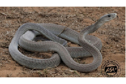

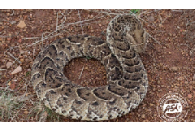

Puff Adder (Bitis arietans) Black Mamba (Dendroaspispolylepis)

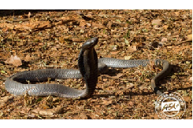

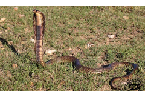

Egyptian cobra (Najahaje) Black-necked spitting cobra (Najanigricollis)

Uganda Clinical Guidelines 2023CHAPTER 1:Emergencies and Trauma

- Uganda Clinical Guidelines 2023CHAPTER 1:Emergencies and Trauma

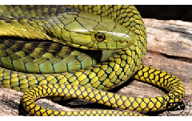

Jameson’s mamba (Dendroaspisjamesoni) Boomslang (Dispholidus typus)

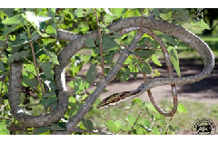

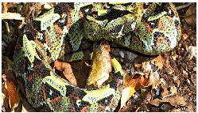

Vine, bird, twig or tree snakes (Thelotornisspp.) Rhino-horned Viper (Bitis nasicornis)

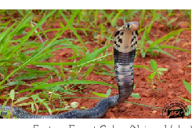

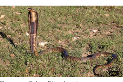

Egyptian Cobra (Naja haje) Eastern Forest Cobra (Naja subfulva)

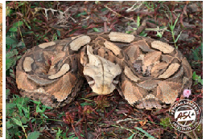

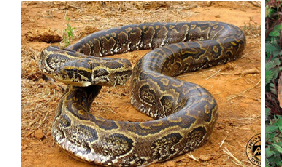

Rock Python (Python sebae) Gaboon Adder (Bitis gabonica)

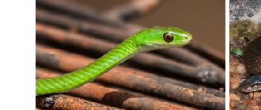

Battersby’s green snake (Philothamnus battersbyi) Olive House Snake (Lycodonomorphis inornatus)

###### 1.2.1.2 Insect Bites & Stings ICD10 CODE: T63.4

Causes ~ Bees, wasps, hornets and ants: venom is usually mild and

causes only local reaction but may cause anaphylactic shock in previously sensitized persons

~ Spiders and scorpions: Most are non-venomous or only

mildly venomous Other stinging insectsClinical features ~ Swelling, discolouration, burning sensation, pain at the site

of the sting ~ There may be signs of anaphylactic shock. Differential diagnosis ~ Allergic reaction

|MANAGEMENT|LOC|
|---|---|
|‰ If the sting remains implanted in the skin, carefully remove  with a needle or knife blade ‰ Apply cold water/ice If severe local reaction|HC2|

Uganda Clinical Guidelines 2023CHAPTER 1:Emergencies and Trauma

- Uganda Clinical Guidelines 2023CHAPTER 1:Emergencies and Trauma

|MANAGEMENT|LOC|
|---|---|
|‰ Give chlorpheniramine 4 mg every 6 hours (max: 24 mg daily) until swelling subsides Child 1-2 years: 1 mg every 12 hours  Child 2-5 years: 1 mg every 6 hours (max: 6 mg daily) Child 6-12 years: 2 mg every 6 hours (max: 12 mg daily) ‰ Apply calamine lotion prn every 6 hours If very painful scorpion sting ‰ Infiltrate 2 ml of lignocaine 2% around the area of the bite If signs of systemic envenomation ‰ Refer|HC2|

Prevention ~ Clear overgrown vegetation/bushes around the home ~ Prevent children from playing in the bush ~ Cover exposed skin while moving in the bush ~ Use pest control methods to clear insect colonies.

######## 1.2.1.3 Animal and Human Bites ICD10 CODE: W50.3, W54.0

Clinical features ~ Teeth marks or scratches, lacerations ~ Puncture wounds (especially cats) ~ Complications: bleeding, lesions of deep structures, wound

infection (by mixed flora, anaerobs), tissue necrosis, transmission of diseases (tetanus, rabies, others)

|MANAGEMENT|LOC|
|---|---|
|First aid ‰ Immediately clean the wound thoroughly with plenty of  clean water and soap to remove any dirt or foreign bodies|HC2|

|MANAGEMENT|LOC|
|---|---|
|‰ Stop excessive bleeding where necessary by applying  pressure ‰ Rinse the wound and allow to dry ‰ Apply an antiseptic: Chlorhexidine solution 0.05% or  povidone iodine solution 10% ‰ Soak punture wounds in antiseptic for 15 minutes ‰ Thorough cleaning, exploration and debridement (under  local anesthesia if possible) As a general rule DO NOT SUTURE BITE WOUNDS ‰ Refer wounds on hands and face, deep wounds, wounds  with tissue defects to hospital for surgical management Tetanus prophylaxis ‰ Give TT immunisation (tetanus toxoid, TT 0.5 ml) if not  previously immunised within the last 10 years|HC2  HC4|
|Prophylactic antibiotics ‰ Indicated in the following situations:  - Deep puncture wounds (especially Cats) - Human bites - Severe (deep, extensive) wounds - Wounds on face, genitalia, hands - Wounds in immunicompromised hosts   ‰ Amoxicillin 500 mg every 8 hours for 5-7 days Child: 15 mg/kg per dose ‰ Plus Metronidazole 400 mg every 12 hours Child: 10-12.5 mg/kg per dose|HC2|
|Note  ƒ Do not use routine antibiotics for small uncomplicated dog bites/wounds|Note  ƒ Do not use routine antibiotics for small uncomplicated dog bites/wounds|

########################## Uganda Clinical Guidelines 2023CHAPTER 1:Emergencies and Trauma

- Uganda Clinical Guidelines 2023CHAPTER 1:Emergencies and Trauma

1.2.1.4 Rabies Post Exposure Prophylaxis ICD10 CODE:

Z20.3, Z23

Post exposure prophylaxis effectively prevents the development of rabies after the contact with saliva of infected animals, through bites, scratches, licks on broken skin or mucous membranes. For further details refer to Rabies Post-Exposure Treatment Guidelines, Veterinary Public Health Unit, Community Health Dept, Ministry of Health, September 2001

General management Dealing with the animal

|TREATMENT|LOC|
|---|---|
|If the animal can be identified and caught ‰ If domestic, confirm rabies vaccination ‰ If no information on rabies vaccination or|HC2|
|If the animal can be identified and caught ‰ If domestic, confirm rabies vaccination ‰ If no information on rabies vaccination or  wild: quarantine for 10 days (only dogs, cats or endangered species) or kill humanely andsend the head to the veterinary Department for analysis  ƒ If no signs of rabies infection shown within 10 ƒ days: release the animal, stop immunisation ƒ If it shows signs of rabies infection: kill the animal,  remove its head, and send to the Veterinary Department for verification of the infection  If animal cannot be identified ‰ Presume animal infected and patient at risk|HC2|
|Notes  ƒ Consumption of properly cooked rabid meat is not harmful ƒ Animals at risk: dogs, cats, bats, other wild carnivores ƒ Non-mammals cannot harbour rabies|Notes  ƒ Consumption of properly cooked rabid meat is not harmful ƒ Animals at risk: dogs, cats, bats, other wild carnivores ƒ Non-mammals cannot harbour rabies|

############## Dealing with the patient

~ The combination of local wound treatment plus passive immunisation with rabies immunoglobulin (RIG) plus vaccination with rabies vaccine (RV) is recommended for all suspected exposures to rabies

~ if the RI is not available, the patient should still be vaccinated with the Rabies Vaccine alone

~ Since prolonged rabies incubation periods are possible, persons who present for evaluation and treatment even months after having been bitten should be treated in the same way as if the contact occurred recently

~ Administration of Rabies IG and vaccine depends on the type of exposure and the animal’s condition

|TREATMENT|LOC|
|---|---|
|‰ LOCAL WOUND TREATMENT: Prompt and thorough local treatment is an effective method to reduce risk of infection  ‰ For mucous mebranes contact, rinse throroughly with water or normal saline  ~ if the wound is deep Tetanus Toxoid (TT) should be given as well to prevent tetanus|HC2|
|‰ Local cleansing is indicated even if the patient presents late ‰ DO NOT SUTURE THE WOUND  If Veterinary Department confirms rabies infection or if animal cannot be identified/tested  ‰ Give rabies vaccine+/- rabies immunoglobulin human as per the recommendations in the next table.|H|

Uganda Clinical Guidelines 2023CHAPTER 1:Emergencies and Trauma

- Uganda Clinical Guidelines 2023CHAPTER 1:Emergencies and Trauma

############## Recommendations for Rabies Vaccination/Serum

| |Condition Of Animal|Condition Of Animal| |
|---|---|---|---|
|Nature Of Exposure|At Time Of Exposure|10 Days Later|Recommended Action|
|Saliva in contact with skin but no skin lesion|Healthy|Healthy|Do not vaccinate|
|Saliva in contact with skin but no skin lesion|Healthy|Rabid|Vaccinate|
|Saliva in contact with skin but no skin lesion|Suspect/ Unknown|Healthy|Do not vaccinate|
|Saliva in contact with skin but no skin lesion| |Rabid|Vaccinate|
|Saliva in contact with skin but no skin lesion| |Unknown|Vaccinate|
|Saliva in contact with skin that has lesions, minor bites on trunk or proximal limbs|Healthy|Healthy|Do not vaccinate|
|Saliva in contact with skin that has lesions, minor bites on trunk or proximal limbs|Healthy|Rabid|Vaccinate|
|Saliva in contact with skin that has lesions, minor bites on trunk or proximal limbs|Suspect/ unknown|Healthy|Vaccinate; but stop course if animal healthy after 10 days|
|Saliva in contact with skin that has lesions, minor bites on trunk or proximal limbs|Suspect/ unknown|Rabid|Vaccinate|
|Saliva in contact with skin that has lesions, minor bites on trunk or proximal limbs|Suspect/ unknown|Unknown|Vaccinate|
|Saliva in contact with mucosae, serious bites (face, head, fingers or multiple bites)|Domestic or wild rabid animal or suspect|Suspect|Vaccinate and give antirabies immunoglobulin|
| |Domestic or wild rabid animal or Suspect| |Vaccinate but stop course if animal healthy after 10 days|

Prevention ~ Vaccinate all domestic animals against rabies e.g. dogs,

cats and others

############## Administration of Rabies Vaccine (RV)

The following schedules use Purified VERO Cell Culture Rabies Vaccine (PVRV), which contains one intramuscular immunising dose (at least 2.5 IU) in 0.5 ml of reconstituted vaccine.

|RV and RIG are both very expensive and should only be used when there is an absolute indication|
|---|

############## Post-Exposure Vaccination in Non-Previously Vaccinated Patients

Give RV to all patients unvaccinated against rabies together with local wound treatment. In severe cases, also give rabies immunoglobulin

|The 2-1-1 intramuscular regimen  This induces an early antibody response and may be particularly effective when post-exposure treatment does not include administration of rabies immunoglobulins  ‰ Day 0: One dose (0.5 ml) in right arm + one dose in left arm ‰ Day 7: One dose ‰ Day 21: One dose|
|---|
|Notes on IM doses  ƒ Doses are given into the deltoid muscle of the arm. In young children, the anterolateral thigh may also be used ƒ Never use the gluteal area (buttock) as fat deposits may interfere with vaccine uptake making it less effective.|
|Alternative: 2-site intradermal (ID) regimen ‰ This uses PVRV intradermal (ID) doses of 0.1 ml (i.e. one fifth  of the 0.5 ml IM dose of PVRV) ‰ Day 0: one dose of 0.1 ml in each arm (deltoid) ‰ Day 3: one dose of 0.1 ml in each arm|

Uganda Clinical Guidelines 2023CHAPTER 1:Emergencies and Trauma

- Uganda Clinical Guidelines 2023CHAPTER 1:Emergencies and Trauma

|‰ Day 3: one dose of 0.1 ml in each arm ‰ Day 7: one dose of 0.1 ml in each arm ‰ Day 28: one dose of 0.1 ml in each arm  Notes on ID regime  ƒ Much cheaper as it requires less vaccine ƒ Requires special staff training in ID technique using 1 ml syringes  and short needles|
|---|
|ƒ Compliance with the Day 28 is vital but may be difficult to achieve ƒ Patients must be followed up for at least 6-18 months to confirm the outcome of treatment ƒ If on malaria chemoprophylaxis, do NOT use.|

############## Post-exposure immunisation in previously vaccinated patients

In persons known to have previously received full pre- or post-exposure rabies vaccination within the last 3 years

|Intramuscular regimen  ‰ Day 0: One booster dose IM ‰ Day 3: One booster dose IM|
|---|
|Intradermal regimen  ‰ Day 0: One booster dose ID ‰ Day 3: One booster dose ID|
|Note  ƒ If incompletely vaccinated or immunosuppressed: give full post exposure regimen.|

Passive immunisation with rabies immunoglobulin (RIG) Give in all high-risk rabies cases irrespective of the time between exposure and start of treatment BUT within 7 days of first vaccine.DO NOT USE in patient previously immunised.

############## Human rabies immunoglobulin (HRIG)

|‰ HRIG 20 IU/kg (do not exceed)  - Infiltrate as much as possible of this dose around the wound/s (if multiple wounds and insufficient quantity, dilute it 2 to 3 fold with normal saline) - Give the remainder IM into gluteal muscle |
|---|
|- Follow this with a complete course of rabies vaccine - The first dose of vaccine should be given at the same time as the immunoglobulin, but at a site as far away as possible from the site where the vaccine was injected. If the bite is at or near the upper arm, do not infiltrate the wound with the immunoglobulin unless the vaccine won’t be injected in the deltoid muscle of that arm. If the wound near the deltoid is infiltrated with the immunoglobulin, use the deltoid muscle of the opposite arm for the vaccine”. |

|Notes ƒ If RIG not available at first visit, its administration can be delayed  up to 7 days after the first dose of vaccine.|
|---|

Pre-exposure immunisation Offer rabies vaccine to persons at high risk of exposure such as: ‰ Laboratory staff working with rabies virus ‰ Veterinarians ‰ Animal handlers ‰ Zoologists/wildlife officers ‰ Any other persons considered to be at high risk

|‰ Day 0: One dose IM or ID ‰ Day 7: One dose IM or ID ‰ Day 28: One dose IM or ID|
|---|

Uganda Clinical Guidelines 2023CHAPTER 1:Emergencies and Trauma

- Uganda Clinical Guidelines 2023CHAPTER 1:Emergencies and Trauma

1.2.1.5 Rabies Vaccine Schedules

|DAY|Vaccine Dose|No. of Doses|Comments|
|---|---|---|---|
|Intramuscular Regimen|Intramuscular Regimen|Intramuscular Regimen|Intramuscular Regimen|
|0|0.5ml|2 (one in each deltoid)|Into the deltoid muscle NEVER IN THE GLUTEAL MUSCLE (buttocks) Children with less muscle mass: Anterolateral aspect of the thigh Note: Day 14 is skipped The 2:1:1 regimen uses 4doses in 3weeks It has fewer patient appointments and it is easy to comply with  If the patient is on anti-malarial prophylaxis with Chloroquine, it should be withheld and an alternative malaria prophylaxis should be started if needed.|
|7|0.5ml|1|Into the deltoid muscle NEVER IN THE GLUTEAL MUSCLE (buttocks) Children with less muscle mass: Anterolateral aspect of the thigh Note: Day 14 is skipped The 2:1:1 regimen uses 4doses in 3weeks It has fewer patient appointments and it is easy to comply with  If the patient is on anti-malarial prophylaxis with Chloroquine, it should be withheld and an alternative malaria prophylaxis should be started if needed.|
|21|0.5ml|1|Into the deltoid muscle NEVER IN THE GLUTEAL MUSCLE (buttocks) Children with less muscle mass: Anterolateral aspect of the thigh Note: Day 14 is skipped The 2:1:1 regimen uses 4doses in 3weeks It has fewer patient appointments and it is easy to comply with  If the patient is on anti-malarial prophylaxis with Chloroquine, it should be withheld and an alternative malaria prophylaxis should be started if needed.|
|2-site Intradermal (ID) Regimen|2-site Intradermal (ID) Regimen|2-site Intradermal (ID) Regimen|2-site Intradermal (ID) Regimen|
|0|0.1ml|2 (one in each deltoid)|It is cheaper since it uses less drug It requires special staff training in ID technique using 1ml syringes with shorter needles Note: Days 14 and 21 are skipped|
|3|0.1ml|2 (one in each deltoid)|It is cheaper since it uses less drug It requires special staff training in ID technique using 1ml syringes with shorter needles Note: Days 14 and 21 are skipped|
|7|0.1ml|2 (one in each deltoid)|It is cheaper since it uses less drug It requires special staff training in ID technique using 1ml syringes with shorter needles Note: Days 14 and 21 are skipped|
|28|0.1ml|2 (one in each deltoid)|It is cheaper since it uses less drug It requires special staff training in ID technique using 1ml syringes with shorter needles Note: Days 14 and 21 are skipped|
|Rabies Immunoglobulin|Rabies Immunoglobulin|Rabies Immunoglobulin|Rabies Immunoglobulin|

|DAY|Vaccine Dose|No. of Doses|Comments|
|---|---|---|---|
|DAYS|Immunoglobulin dose|Number of doses|Comments|
|0|20IU/ kg|Infiltrate in the area around and in the wound at the same depth as the wound|The Immunoglobulin should be administered as far as possible from the vaccine to avoid antibody-antigen reaction|

1.2.2 Fractures ICD10 CODE: S00-T88 A fracture is a complete or incomplete break in a bone. Causes

~ Trauma e.g. road traffic accident, assault, falls, sports ~ Bone weakening by disease, e.g., cancer, TB, osteomyeli-

tis, osteoporosis Clinical features ~ Pain, tenderness, swelling, deformity ~ Inability to use/move the affected part ~ May be open (with a wound) or closed Differential diagnosis

~ Sprain, dislocations ~ Infection (bone, joints and muscles) ~ Bone cancer

Uganda Clinical Guidelines 2023CHAPTER 1:Emergencies and Trauma

- Uganda Clinical Guidelines 2023CHAPTER 1:Emergencies and Trauma

Investigations  X-ray: 2 views (AP and lateral) including the joints above and below Management Suspected fractures should be referred to HC4 or Hospital after initial care.

|TREATMENT|LOC|
|---|---|
|If polytrauma ‰ Assess and manage airways ‰ Assess and treat shock (see section 1.1.2) Closed fractures ‰ Assess nerve and blood supply distal to the injury: if  no sensation/pulse, refer as an emergency ‰ Immobilise the affected part with a splint ‰ Apply ice or cold compresses ‰ Elevate any involved limb|HC2|
|‰ Give Tetanus Toxoid if not fully vaccinated ‰ Start antibiotic  - Amoxicillin 500 mg every 8 hours - Child: 25 mg/kg every 8 hours (or 40 mg/kg every 12 hours)   If severe soft tissue damage ‰ Add gentamicin 2.5 mg/kg every 8 hours ‰ Refer URGENTLY to hospital for further management|HC3|
|Note  ƒ Treat sprains, strains and dislocations as above  Note  ƒ Treat sprains, strains and dislocations as above|Note  ƒ Treat sprains, strains and dislocations as above  Note  ƒ Treat sprains, strains and dislocations as above|
|Caution ƒ Do not give pethidine and morphine for rib fractures and head  injuries as they cause respiratory depression|Caution ƒ Do not give pethidine and morphine for rib fractures and head  injuries as they cause respiratory depression|

1.2.3 Burns ICD10 CODE: T20-T25 Tissue injury caused by thermal, chemical, electrical, or radiation energy.

Causes ~ Thermal, e.g., hot fluids, flame, steam, hot solids, sun ~ Chemical, e.g., acids, alkalis, and other caustic chemicals ~ Electrical, e.g., domestic (low voltage) transmission lines

(high voltage), lightening ~ Radiation, e.g., exposure to excess radiotherapy or radioactive materials

Clinical features ~ Pain, swelling ~ Skin changes (hyperaemia, blisters, singed hairs) ~ Skin loss (eschar formation, charring) ~ Reduced ability to use the affected part ~ Systemic effects in severe/extensive burns include shock,

low urine output, generalised swelling, respiratory insufficiency, deteriorated mental state

~ Breathing difficulty, hoarse voice and cough in smoke inhalation injury – medical emergency

Uganda Clinical Guidelines 2023CHAPTER 1:Emergencies and Trauma

Criteria for classification of the severity of burns The following criteria are used to classify burns:

|CRITERIA|LEVEL|
|---|---|
|Depth of the burn (a factor of temperature, of agent, and of duration of contact with the skin)|1st Degree burns|
|Depth of the burn (a factor of temperature, of agent, and of duration of contact with the skin)|Superficial epidermal injury with no blisters. Main sign is redness of the skin, tenderness, or hyper sensitivity with intact two-point discrimination. Healing in 7 days|

########################## Uganda Clinical Guidelines 2023CHAPTER 1:Emergencies and Trauma

|CRITERIA|LEVEL|
|---|---|
| |2nd Degree burns or Partial thickness burns It is a dermal injury that is sub-classified as superficial and deep 2nd degree burns. In superficial 2nd degree burns, blisters result, the pink moist wound is painful. A thin eschar is formed. Heals in 10-14 days. In deep 2nd degree burns, blisters are lacking, the wound is pale, moderately painful, a thick escar is formed. Heals in >1 month, requiring surgical debridement|
| |3rd Degree burns  Full thickness skin destruction, leather- like rigid eschar. Painless on palpation or pinprick. Requires skin graft.  4th Degree burns Full thickness skin and fascia, muscles, or bone destruction. Lifeless body part|
|Percentage of total body surface area (TBSA)|Small areas are estimated using the open palm of the patient to represent 1% TBSA. Large areas estimated using the “rules of nines” or a Lund-Browder chart. Count all areas except the ones with erythema only|
|The body parts injured|Face, neck, hands, feet, perineum and major joints burns are considered severe|
|Age/general condition|In general, children and the elderly fare worse than young adults and need more care. A person who is sick or debilitated at the time of the burn will be more affected than one who is healthy|

Categorisation of severity of burns Using the above criteria, a burn patient may be categorised as follows:

|SEVERITY|CRITERIA|
|---|---|
|Minor/mild burn|- Adult with <15% TBSA affected or - Child/elderly with <10% TBSA affected or - Full thickness burn with <2% TBSA affected and no serious threat to function |
|Minor/mild burn|- Adult with <15% TBSA affected or - Child/elderly with <10% TBSA affected or - Full thickness burn with <2% TBSA affected and no serious threat to function |
|Moderate (intermediate) burn|Adult with partial thickness burn 15- 25% TBSA or Child/elderly with partial thickness burn 10-20% TBSA All above with no serious threat to function and no cosmetic impairment of eyes, ears, hands, feet or perineum|
|Major (severe) burn|Adult with  - Partial thickness burn >25% TBSA or - Full thickness burn >10% TBSA   Child/elderly with  - Partial thickness burn >20% TBSA or full  thickness burn of >5% TBSA affected Irrespective of age  - Any burns of the face and eyes, neck, ears, hand, feet, perineum and major joints with cosmetic or functional impairment risks, circumferential burns - Chemical, high voltage, inhalation burns - Any burn with associated major trauma |

Uganda Clinical Guidelines 2023CHAPTER 1:Emergencies and Trauma

- Uganda Clinical Guidelines 2023CHAPTER 1:Emergencies and Trauma

Chart for Estimating Percentage of Total Body Surface Area (TBSA) Burnt LUND AND BROWDER CHARTS Ignore simple erythema Superficial Deep

|Region|%|
|---|---|
|Head| |
|Neck| |
|Region|%|
|Ant. Trunk| |
|Post. Trunk| |
|Right Arm| |
|Left Arm| |
|Buttocks| |
|Genitalia| |
|Right Leg| |
|Left Leg| |
|Total Burn| |

Relative percentage of body surface area affected by growth

|Area|Age 0|1|5|10|15|Adult|
|---|---|---|---|---|---|---|
|A = ½ of head|9½|8½|6½|5½|4½|3½|
|B = ½ of one thigh|2¾|3¼|4|4½|4½|4¾|
|C = ½ of one lower leg|2½|2½|2¾|3|3¼|3½|

Management

|TREATMENT|LOC|
|---|---|
|Mild/moderate burns – First aid ‰ Stop the burning process and move the patient to safety ‰ Roll on the ground if clothing is on fire|HC1|

Management

|TREATMENT|LOC|
|---|---|
|‰ Switch off electricity  ‰ Cool the burn by pouring or showering or soaking the affected area with cold water for 30 minutes, especially in the first hour after the burn (this may reduce the depth of injury if started immediately)  ‰ Remove soaked clothes, wash off chemicals, remove any  constrictive clothing/rings ‰ Clean the wound with clean water ‰ Cover the wound with a clean dry cloth and keep the  patient with warm|HC1|
|At health facility ‰ Give oral or IV analgesics as required ‰ If TBSA <10% and patient able to drink, give oral fluids  otherwise consider IV ‰ Give TT if not fully immunised  ‰ Leave small blisters alone, drain large blisters and dress if closed dressing method is being used the urine output. The normal urine output is: Children (<30 kg) 1-2 ml/kg/ hour and adults 0.5 ml/kg/hour (30-50 ml /hour)|HC2|
|‰ Dress with silver sulphadiazine cream 1%, add saline moistened gauze or paraffin gauze and dry gauze on top to prevent seepage  ‰ Small superficial 2nd degree burns can be dressed directly  with paraffin gauze dressing ‰ Change after 1-3 days then prn ‰ Patient may be exposed in a bed cradle if there are ex-  tensive burns ‰ Saline bath should be done before wound dressing|HC3|

Uganda Clinical Guidelines 2023CHAPTER 1:Emergencies and Trauma

########################## Uganda Clinical Guidelines 2023CHAPTER 1:Emergencies and Trauma

|TREATMENT|LOC|
|---|---|
|‰ If wound infected dress more frequenly with silver sulphad-  iazine cream until infection is controlled. Severe burns ‰ First aid and wound management as above PLUS ‰ Give IV fluid replacement in a total volume per 24 hours  according to the calculation in the box below (use crystalloids, i.e., Ringer’s lactate, or normal saline)  ‰ If patient in shock, run the IV fluids fast until BP improves  (see section 1.1.2) ‰ Manage pain as necessary ‰ Refer for admission ‰ Monitor vital signs and urine output ‰ Use antibiotics if there are systemic signs of infection:  benzylpenicillin 3 MU every 6 hours  +/- gentamicin 5-7 mg/kg IV or IM once a day ‰ Blood transfusion may be necessary ‰ If signs/symptoms of inhalation injury, give oxygen and  refer for advanced life support (refer to regional level) Surgery ‰ Escharotomy and fasciotomy for circumferential finger,  hand, limb or torso burns ‰ Escharectomy to excise dead skin ‰ Skin grafting to cover clean deep burn wounds Eye injury ‰ Irrigate with abundant sterile saline ‰ Place eye pad over eye ointment and refer|HC3 HC4   H|

|TREATMENT|LOC|
|---|---|
|Additional care ‰ Nutritional support ‰ Physiotherapy of affected limb| |
|‰ Counselling and psychosocial support ‰ Health education on prevention (e.g. epilepsy control)| |
|Caution ‰ Silver sulphadiazine contraindicated in pregnancy, breast-  feeding and premature babies| |

Fluid replacement in burns ~ The objective is to maintain normal physiology as shown by

urine output, vital signs and mental status

~ Fluid is lost from the circulation into the tissues surrounding the burns and some is lost through the wounds, especially in 18-30 hours after the burns

~ Low intravascular volume results in tissue circulatory insufficiency (shock) with results such as kidney failure and deepening of the burns

~ The fluid requirements are often very high and so should be given as necessary to ensure adequate urine output

|TREATMENT|LOC|
|---|---|
|‰ Give oral fluids (ORS or others) and/or IV fluids e.g. normal saline or Ringer’s Lactate depending on the degree of loss of intravascular fluid  V The total volume of IV solution required in the first 24 hours of the burns is:  4 ml x weight (kg) x % TBSA burned plus the normal daily fluid requirement ‰ Give 50% of fluid replacement in the first 8 hours and 50%  in the next 16 hours. The fluid input is balanced against|HC2 HC3|

Uganda Clinical Guidelines 2023CHAPTER 1:Emergencies and Trauma

- Uganda Clinical Guidelines 2023CHAPTER 1:Emergencies and Trauma

Prevention ~ Public awareness of burn risks and first aid water use in

cooling burnt skin ~ Construction of raised cooking fire places as safety measure ~ Ensure safe handling of hot water and food, keep well out of the reach of children ~ Particular care of high risk persons near fires e.g. children, epileptic patients, alcohol or drug abusers ~ Encourage people to use closed flames e.g. hurricane lamps. Avoid candles. ~ Beware of possible cases of child abuse

########## 1.2.4 Wounds ICD10 CODE: S00-T88

Any break in the continuity of the skin or mucosa or disruption in the integrity of tissue due to injury.

Causes ~ Sharp objects, e.g. knife, causing cuts, punctures ~ Blunt objects causing bruises, abrasions, lacerations ~ Infections, e.g. abscess ~ Bites, e.g. insect, animal, human ~ Missile and blast injury, e.g. gunshot, mines, exlosives,

landmines ~ Crush injury, e.g. RTA, building collapse Clinical features

~ Raw area of broken skin or mucous membrane ~ Pain, swelling, bleeding, discharge

~ Reduced use of affected part ~ Cuts: sharp edges ~ Lacerations: Irregular edges ~ Abrasions: loss of surface skin ~ Bruises: subcutaneous bleeding e.g. black eye Management

|TREATMENT|LOC|
|---|---|
|Minor cuts and bruises ‰ First aid, tetanus prophylaxis, dressing and pain man-  agement ‰ Antibiotics are not usually required but if the wound is grossly contaminated, give  - Cloxacillin or amoxicillin 500 mg every 6 hours - as empiric treatment   Child: 125-250 mg every 6 hours|HC2|
|Deep and/or extensive ‰ Identify the cause of the wound or injury if possible ‰ Wash affected part and wound with plenty of water or  saline solution  - (you can also clean with chlorhexidine 0.05% - or hydrogen peroxide 6% diluted with equal amount of saline to 3% if wound is contaminated)   ‰ Explore the wound under local anesthesia to ascertain the extent of the damage and remove foreign bodies  ‰ Surgical toilet: carry out debridement to freshen the wound ‰ Tetanus prophylaxis, pain management, immobilization|HC4|

Uganda Clinical Guidelines 2023CHAPTER 1:Emergencies and Trauma

########################## Uganda Clinical Guidelines 2023CHAPTER 1:Emergencies and Trauma

|TREATMENT|LOC|
|---|---|
|If wound is clean and fresh (<8 hours) ‰ Carry out primary closure by suturing under local anaes-  thetic  - Use lignocaine hydrochloride 2% (dilute to 1% with equal volume of water for injection)|HC3|
|If wound is >8 hours old or dirty ‰ Clean thoroughly and dress daily f Check the state of  the wound for 2-3 days f Carry out delayed primary closure if clean  - Use this for wounds up to 2-4 days old If wound >4 days old or deep pucture wound, contaminated wounds, bite/gunshot wounds, abscess cavity  ‰ Let it heal by secondary closure (granulation tissue) ‰ Dress daily if contaminated/dirty, every other day if clean ‰ Pack cavities (e.g. abscesses) with saline-soaked gauzes In case of extensive/deep wound ‰ Consider closure with skin graft/flap| |
|Note  ~ Use SOP for collection of wound discharge, or deep tissue, submit to lab  ~ Start on treatment, change treatment when results return  ~ If MDR, gramnegative or MRSA or VRE impleme the respective transmission-based precautions.  ~ Where can, use chlorine release for environmental decontamination or alternate fumigation (not formaldehyde)| |

########### 1.2.5 Head Injuries ICD10 CODE: S00-S09 Trauma to the head resulting in brain injuries due to:

- - Direct damage to the brain (contusion, concussion, penetrating injury, diffuse axonal damage)
- - Haemorrhage from rupture of blood vessels around and in
- - the brain
- - Severe swelling of the cerebral tissue (cerebral oedema)

Causes ~ Road traffic accident ~ Assault, fall or a blow to the head Clinical features

~ May be closed (without a cut) or open (with a cut) ~ Swelling on the head (scalp hematoma) ~ Fracture of the skull, e.g., depressed area of the skull, open

fracture (brain matter may be exposed)

~ Racoon eyes (haematoma around the eyes), bleeding and/ or leaking of CSF through nose, ears – signs of possible skull base fracture

Severe head injury ~ Altered level of consciousness, agitation, coma (see GCS

below) ~ Seizures, focal neurological deficits, pupil abnormalities

Minor head injury (concussion) ~ Transient and short lived loss of mental function, e.g., loss

of consciousness (<5 minutes), transient amnesia, headache, disorientation, dizziness, drowsiness, vomiting

- symptoms should improve by 4 hours after the trauma

Uganda Clinical Guidelines 2023CHAPTER 1:Emergencies and Trauma

- Uganda Clinical Guidelines 2023CHAPTER 1:Emergencies and Trauma

########### Severity classification of head injuries Head injuries are classified based on Glasgow Coma Scale (GCS) score as:

- - Severe (GCS 3-8)
- - Moderate ( GCS 9-13)
- - Mild (GCS > 13)

Glasgow Coma Scale (GCS)

|Eye Opening|Verbal Response|Motor Response|
|---|---|---|
|1 = No response 1 = No response|1 = No response 1 = No response|1 = No response|
|2 = Open in response to pain|2 = Incomprehensible sounds (grunting in children)|2= Extension to painful stimuli (decerebrate)|
|3 = Open in response to voice|3 = Inappropriate words (cries and screams/ cries inappropriately in children)|3 = Abnormal flexion to painful stimuli (decorticate)|
|4 = Open spontaneously|4 = Disoriented able to converse (use words inappropriately / cries in children)|4 = Flexion/ withdrawal from painful stimuli|
|NA|5 = Oriented able to converse (use words appropriately/ cries appropriately in children)|5 = Localize pain|
|NA| |6 = Obeys command (NA in children <1 yr)|

For infants and children use AVPU

|A|Alert|GCS >13|
|---|---|---|
|V|Responds to voice|GCS 13|

|P|Responds to pain|GCS 8|
|---|---|---|
|U|Unresponsive|GCS <8|

############## Note

Mild injuries can still be associated with significant brain damage and can be divided into low and high risk according to the following criteria:

|Low Risk Mild Head Injury|High Risk Mild Head Injury|
|---|---|
|~ GCS 15 at 2 hours ~ No focal neurologi-  cal deficits ~ No signs/symptoms of skull fracture ~ No recurrent vomiting  ~ No risk factors (age >65 years, bleeding disorders, dangerous mechanism)  ~ Brief LOC (<5 minutes) and post traumatic amnesia (<30 minutes)|~ GCS <15 at 2 hours ~ Deterioration of GCS ~ Focal neurological  deficits ~ Clinical suspicion of  skull fracture ~ Recurrent vomiting ~ Known bleeding disor-  der ~ Age >65 years ~ Post traumatic seizure ~ LOC >5 minutes ~ Persistent amnesia ~ Persistent abnormal  behaviour ~ Persistent severe hea ~ ache|

Uganda Clinical Guidelines 2023CHAPTER 1:Emergencies and Trauma

Investigations ¾ Skull X ray useful only to detect fracture ¾ CT scan is the gold standard for detection of head injury

############## Differential diagnosis

~ Alcoholic coma - may occur together with a head injury ~ Hypoglycaemia

- Uganda Clinical Guidelines 2023CHAPTER 1:Emergencies and Trauma

~ Meningitis ~ Poisoning ~ Other cause of coma

Management (general principles) Management depends on: ~ GCS and clinical features at first assessment ~ Risk factors (mechanism of trauma, age, baseline condi-

tions) ~ GCS and clinical features at follow up

|TREATMENT|LOC|
|---|---|
|‰ Assess mechanism of injury to assess risks of severe injury (which may not be apparent at the beginning)  ‰ Assess medical history to assess risk of complication  (e.g., elderly, anticoagulant treatment etc.) ‰ Assess level of consciousness using GCS or AVPU ‰ Perform general (including ears) and neurological exami-  nation (pupils, motor and sensory examination, reflexes)  - Assess other possible trauma especially if road traffic accident, e.g., abdominal or chest trauma ‰ DO NOT SEDATE. Do NOT give opioids ‰ Do NOT give NSAIDs (risk of bleeding)|HC3|

|Low Risk Mild Head Injury|High Risk Mild Head Injury|
|---|---|
|~ No persistent headache  ~ No large haemato-  ma/ laceration ~ Isolated head injury ~ No risk of wrong information|~ Large scalp haema-  toma ~ Polytrauma ~ Dangerous mechanism  (fall from height, car crash etc.)  ~ Unclear information|

|TREATMENT|LOC|
|---|---|
|‰ >90 mmHg ‰ Monitor GCS, pupils and neurological signs|H|
|‰ Early CT if available, otherwise observe and refer immediately if not improving in the following hours| |

############## Management of severe traumatic head injury

|TREATMENT|LOC|
|---|---|
|‰ Early CT if available, otherwise observe and refer immediately if not improving in the following hours Refer immediately for specialist management f Supportive care as per moderate head injury f If open head injury, give first dose of antibiotic prereferral  - Ceftriaxone 2 g IV Child: 100 mg/kg|NR|

Prevention ~ Careful (defensive) driving to avoid accidents ~ Use of safety belts by motorists ~ Wearing of helmets by cyclists, motor-cyclists and people

working in hazardous environments ~ Avoid dangerous activities (e.g., climbing trees) 1.2.5.1 Traumatic Spinal Injury

Uganda Clinical Guidelines 2023CHAPTER 1:Emergencies and Trauma

Early recognition of spinal injury. Immobilizations with a rigid cervical collar or thoracolumbar corset to prevent further nerve damage.

Decompression: Non operative Skull traction, Skin traction of lower limbs Operative e.g., discectomy, anterior or posterior spinal decompression surgery 59

- Uganda Clinical Guidelines 2023CHAPTER 1:Emergencies and Trauma

######## 1.2.6 Sexual Assault/Rape ICD10 CODE Z04.4

Rape is typically defined as oral, anal or vaginal penetration that involves threats or force against an unwilling person.

Such penetration, whether wanted or not, is considered statutory rape if victims are younger than the age of consent (18 years).

Sexual assault or any other sexual contact that results from coercion is rape, including seduction of a child through offers of affection or bribes; it also includes being touched, grabbed, kissed or shown genitals.

Clinical features Rape may result in the following: Management of mild traumatic head injury

|TREATMENT|LOC|
|---|---|
|‰ First aid if necessary ‰ Mild analgesia if necessary e.g. paracetamol ‰ Observe for at least 4-6 hours, monitor GCS and neuro-  logical symptoms If low risk (see above) ‰ Discharge on paracetamol ‰ Advise home observation and return to the facility in case  of any change If high risk ‰ Monitor for 24 hours ‰ Refer immediately if GCS worsens or other clinical signs  appear/persist  ‰ If patient is fine at the end of observation period, send home with instructions to come back in case of any problem (severe headache, seizures, alteration of consciousness, lethargy, change in behaviour etc.)|HC3|

~ Extragenital injury ~ Genital injury (usually minor, but some vaginal lacerations

can be severe) ~ Psychologic symptoms: often the most prominent

- - Short term: fear, nightmares, sleep problems, anger, embarrassment
- - Long term: Post traumatic Stress Disorder, an anxiety
- - disorder; symptoms include re-experiencing (e.g., flashbacks, intrusive upsetting thoughts or images), avoidance (e.g., of trauma-related situations, thoughts, and feelings) and hyperarousal (e.g., sleep difficulties, irritability, concentration problems).
- - Symptoms last for >1 month and significantly impair social and occupational functioning.
- - Shame, guilt or a combination of both
- - Sexually transmitted infections (STIs, e.g., hepatitis, syphilis, gonorrhea, chlamydial infection, trichomoniasis, HIV infection)

~ Pregnancy (may occur)

|Note  ƒ Headaches and dizziness following mild traumatic brain injury may persist for weeks/months|
|---|

Management of moderate traumatic head injury

|TREATMENT|LOC|
|---|---|
|‰ Refer to hospital for appropriate management ‰ Careful positioning (head 300 up) ‰ Use fluids with caution ‰ Keep oxygen saturation >90% and systolic BP|H|

Uganda Clinical Guidelines 2023CHAPTER 1:Emergencies and Trauma

- Uganda Clinical Guidelines 2023CHAPTER 1:Emergencies and Trauma

############## Investigations

 Pregnancy test  HIV, hepatitis B and RPR tests

############## Management

Whenever possible, assessment of a rape case should be done by a specially trained provider. Victims are traumatized so should be approached with empathy and respect. Explain and ask consent for every step undertaken.

The goals are: ~ Medical assessment and treatment of injuries ~ Assessment, treatment and prevention of pregnancy and

STIs Collection of forensic evidence ~ Psychologic evaluation and support

|TREATMENT|LOC|
|---|---|
|‰ Advise not to throw out or change clothing, wash, shower, douche, brush their teeth or use mouthwash; doing so may destroy evidence|HC2|
|‰ Initial assessment (history and examination) – use standard forms if available  - Type of injuries sustained (particularly to the - mouth, breasts, vagina and rectum) - Any bleeding from or abrasions on the patient or assailant (to help assess the risk of transmission of HIV and hepatitis) - Description of the attack (e.g., the orifices which - were penetrated, whether ejaculation occurred, or whether a condom was used) |HC4|

|TREATMENT|LOC|
|---|---|
|- Assailant’s use of aggression, threats, weapons - and violent behavior - Description of the assailant - Use of contraceptives (to assess risk of pregnancy), previous coitus (to assess validity of sperm testing) - Clearly describe size, extent, nature of any injury. - If possible take photos of the lesions (with patient’s consent) |HC4|
|‰ Test for HIV, RPR, hepatitis B and pregnancy, to assess baseline status of the patient  - If possible test for flunitrazepam and gamma hydroxybutyrate (”rape drugs”)|HC4|
|‰ Collect forensic evidence (with standard kits if available)  - Condition of clothing (e.g., damaged, stained, - adhering foreign material) - Small samples of clothing including an unstained sample, given to the police or laboratory - Hair samples, including loose hairs adhering to - the patient or clothing, semen-encrusted pubic hair, and clipped scalp and pubic hairs of the patient (at least 10 of each for comparison) - Semen taken from the cervix, vagina, rectum, mouth and thighs - Blood taken from the patient - Dried samples of the assailant’s blood taken from the patient’s body and clothing - Urine, saliva - Smears of buccal mucosa - Fingernail clippings and scrapings - Other specimen as indicated by the history or physical examination | |

########################## Uganda Clinical Guidelines 2023CHAPTER 1:Emergencies and Trauma

########################## Uganda Clinical Guidelines 2023CHAPTER 1:Emergencies and Trauma

|TREATMENT|LOC|
|---|---|
|‰ Prophylaxis for STD including:  - Ceftriaxone 1g IM or cefixime 400 mg orally stat - Azithromycin 1 g stat or doxycycline 100 mg - twice a day for 1 week - Metronidazole 2 g stat - HIV Post Exposure Prophylaxis if within 72 hours:   Adults : TDF+3TC+ATV/r for 28 days Children: ABC+3TC+LPV/r ‰ Hepatitis B vaccine if not already immunised ‰ Emergency contraception if within 72 hours (but may  be useful up to 5 days after)  - Levonorgestrel 1.5 mg (double the dose if patient is HIV positive on ARVs)|HC4|
|‰ Counselling: use common sense measures (e.g., reassurance, general support, non-judgmental attitude) to relieve strong emotions of guilt or anxiety  ‰ Provide links and referral to:  - Long-term psycho-social support - Legal counseling - Police investigations, restraining orders - Child protection services - Economic empowerment, emergency shelters - Long-term case management | |
|Notes  ƒ Because the full psychologic effects cannot always be ascertained at the first examination, follow-up visits should be scheduled at 2 weeks intervals  ƒ Reporting: Health facilities should use HMIS 105 to report Gender-Based Violence (GBV)| |

|TREATMENT|LOC|
|---|---|
|Harm classification for police reporting ~ Harm: any body hurt, disease or disorders,  whether permanent or temporary  ~ Grievous harm: any harm which amounts to a main or dangerous harm, or seriously or permanently injures health, or causes permanent disfigurement or any permanent injeury to any internal or external organ, membrane or sense  ~ Dangerous harm: means harm endangering life ~ ”Main” means the destruction or permanent disabling of any external membrane or sense| |

1.3 POISONING 1.3.1 General Management of Poisoning ICD10 CODE: T36-T50

Bodily entry of toxic substances in amounts that cause dysfunction of body systems.

Causes ~ Microorganisms (food poisoning) ~ Fluids and gases (organic), e.g., agricultural chemicals, pet-

rol, paraffin, carbon monoxide ~ Metal poisoning (inorganic), e.g., lead, mercury, copper ~ Alcohol, drugs of abuse, medicines (in excessive amounts)

Acute poisoning can occur by ingestion, inhalation, injection or cutaneous/mucosal absorption.

Exposure can be intentional (e.g., suicide or homicide attempt), unintentional (e.g., medication error) or environmental/ occupational.

Uganda Clinical Guidelines 2023CHAPTER 1:Emergencies and Trauma

- Uganda Clinical Guidelines 2023CHAPTER 1:Emergencies and Trauma

Principles of general management ‰ If possible, refer patients showing signs of poisoning to hospital

for admission. Send a note of what is known about the poison and what treatment has been given

‰ Also refer/admit patients who have taken slow-acting poisons even if they appear well. These include: acetylsalicylic acid, iron, paracetamol, tricyclic antidepressants (e.g., amitriptyline, imipramine), paraquat, modified-release products

‰ Optimal management of the poisoned patient depends upon the specific poison(s) involved, the presenting and predicted severity of illness and time that has elapsed between exposure and presentation

‰ Treatment includes supportive care, decontamination, antidotal therapy and enhanced elimination techniques

‰ It may not always be possible to identify the poison and the amount

taken. Anyway, ‰ Only a few poisons have specific antidotes ‰ Few patients need active removal of the poison ‰ Most patients must be treated symptomatically

However, knowledge of the poison will help you anticipate the likely effects on the patient.

Supportive Treatment in Poisoning

|TREATMENT|LOC|
|---|---|
|‰ Ensure safety of the patient and minimize/stop exposure e.g., wash off/clean skin with water and soap  ‰ Monitor and stabilize all vitals (blood pressure, heart rate, respiratory rate, oxygen saturation AND temperature)|HC2|

|TREATMENT|LOC|
|---|---|
|Airway and breathing (often impaired in unconscious patient)  ‰ Ensure the airway is cleared and maintained ‰ Insert an airway cannula if necessary ‰ Position patient semiprone to minimise risk of inhalation  of vomit ‰ Assist ventilation if necessary ‰ Administer oxygen if necessary|HC2  HC4|
|Blood pressure  - Hypotension is common in severe poisoning with CNS depressants. A systolic BP <70 mmHg may cause irreversible brain or renal damage  ‰ Carry the patient’s head down on the stretcher and nurse in this position in the ambulance|HC2|
|‰ Set up an IV normal saline line  - Fluid depletion without hypotension is common after prolonged coma and after aspirin poisoning due to vomiting, sweating and hyperpnoea  ‰ Hypertension is less common but may be associated with sympathomimetic poisoning e.g. amphetamines, cocaine, pseudoephedrine|HC3|
|Heart  - Cardiac conduction defects and arrhythmias may  occur in acute poisoning especially with tricyclic antidepressants, but the defects usually respond to correction of any hypoxia or acidosis|HC4|

########################## Uganda Clinical Guidelines 2023CHAPTER 1:Emergencies and Trauma

- Uganda Clinical Guidelines 2023CHAPTER 1:Emergencies and Trauma

|TREATMENT|LOC|
|---|---|
|Body temperature  - Hypothermia may develop in patients with prolonged unconciousness especially after overdose of barbiturates or phenothiazines e.g., chlorpromazine, trifluoperazine - Hypothermia may be missed unless temperature is monitored - Treat by covering the patient with a blanket - f Hyperthermia may occur with anticholinergics and sympathomimetics - Treat by tepid sponging and antipyretics if - appropriate |HC2|
|Convulsions  ‰ Diazepam 10 mg rectally repeated if necessary Child: 0.5 mg/kg per dose (1.5-2.5 mg if <1 month, 5 mg if 1 month-2 years, 5-10 mg if 2-12 years) Or diazepam 5- 10 mg slow IV repeated if necessary max 30 mg  Child: 200 micrograms (0.2 mg)/kg max 10 mg|HC2 HC3 |
|Other considerations ‰ Counsel patient and families concerning poisoning ‰ A psychiatric evaluation is necessary if poisoning was  intentional  ‰ If environmental or ccupational exposure, follow up to assess if other people have been affected and take appropriate measures|HC4|

1.3.1.2 Removal and Elimination of Ingested Poison

Removal and elimination of poison (decontamination) has to be implemented AFTER stabilization of vital signs.

############## Removal from the stomach

~ Balance the dangers of attempting to empty the stomach against the likely toxicity of any swallowed poison as determined by the type of poison and amount swallowed against the risk of inhalation

~ Do not induce vomiting ~ Gastric lavage ‰ Only useful if done within 2 hours of poisoning (except with salicylates

or anticholinergics when it may be of use within 4 to 6 hours) ‰ Seldom practicable or necessary before the patient reaches hospital ‰ Contraindications: drowsy or comatose patients and if poisoning with

corrosive or petroleum products Prevention of absorption and active elimination ~ Oral activated charcoal can bind many poisons in the stom-

ach and reduce their absorption

~ It is more effective the sooner it is given but may still work up to 2 hours after poisoning (longer with modified-release products and anticholinergics)

~ Contraindications

- - Depressed mental status
- - Late presentation
- - Ingestion of corrosives and petroleum products
- - Toxins poorly absorbed by charcoal (e.g. metals like iron, lithium, alcohol)
- - Intestinal obstruction

~ It is generally safe and especially useful for poisons toxicn ismall amounts, e.g. antidepressants

Uganda Clinical Guidelines 2023CHAPTER 1:Emergencies and Trauma

- Uganda Clinical Guidelines 2023CHAPTER 1:Emergencies and Trauma

|TREATMENT|LOC|
|---|---|
|Prevention of absorption ‰ Dose: activated charcoal powder 50 g Child: 0.5-1 g/kg  - Grind tablets into a fine powder before mixing with 100-200 ml of water (50 g = 200 tablets of 250 mg) - If patient unable to swallow the charcoal/water - mixture (slurry), give by gastric lavage tube   Active elimination  ‰ Repeated doses of activated charcoal may be beneficial in some cases, e.g., acetylsalicylic acid, carbamazepine, phenobarbital, phenytoin, quinine, theophylline  - Give activated charcoal 50 g repeated every 4 hours|HC2|
|‰ Treat any vomiting as this may reduce the effectiveness  of the charcoal In case of intolerance ‰ Reduce dose and increase frequency, e.g., 25 g every  2 hours, or 12.5 g every hour| |

1.3.2 Acute Organophosphate Poisoning ICD10 CODE: T60.0 Organophosphates are ingredients of some pesticides and insecticides intended for agricultural and household use. Poisoningo ccursb yi ngestion, inhalation or absorption through the skin.

Causes ~ May be accidental, e.g., contamination of food ~ Intended poisoning, i.e., suicidal or homicidal

~ Occupational hazard, e.g., agricultural workers Clinical features

~ Patient may smell of the chemicals ~ Constricted pupils ~ Cold sweat, anxiety, restlessness ~ Abdominal pain, diarrhoea and vomiting ~ Twitching, convulsions ~ Bradycardia ~ Excessive salivation, difficulty in breathing, abundant respi-

ratory secretions ~ Headache, hypotension, urine incontinence ~ Coma Differential diagnosis

~ Other causes of poisoning ~ Other causes of convulsions Management

|TREATMENT|LOC|
|---|---|
|‰ Remove contaminated clothing (use gloves) ‰ Wash contaminated skin with lots of water ‰ Establish and maintain the airway ‰ Assisted respiration with air or oxygen may be required  during the first 24 hours after poisoning ‰ Give IV fluids, e.g., normal saline prn for dehydration,  hypovolaemia, and shock ‰ Prevent and treat convulsions with diazepam 10 mg IV Child: 0.2 mg/kg IV or 0.5 mg/kg rectal ‰ Salbutamol 5 mg (2.5 mg for children <5 years) nebuli-  sation if bronchospasm:|HC4|

Uganda Clinical Guidelines 2023CHAPTER 1:Emergencies and Trauma

- Uganda Clinical Guidelines 2023CHAPTER 1:Emergencies and Trauma

|TREATMENT|LOC|
|---|---|
|‰ Perform gastric lavage if the poison was ingested (up to 6 hours after ingestion) but consider risk of aspiration ‰ Give standard dose of activated charcoal if patient presents within 2 (up to 4) hours ‰ Monitor patient for a few days (worsening can occur a  few days after ingestion) In moderate to severe poisoning (only if not responding to adequate doses of atropine) ‰ Add pralidoxime mesylate 30 mg/kg IV over 30 minutes Child: 25-50 mg/kg IV  - Continue with infusion 8 mg/kg/hour - Child: 10-20 mg/kg/hour | |

|Note  ƒ Pralidoxime: Only effective if given within 24 hours of poisoning|
|---|

Prevention ~ Label agricultural and domestic pesticides properly – do

not use unlabelled bottles for pesticides ~ Store such products away from children ~ Wear protective clothing when using the products

1.3.3 Paraffin and Other Petroleum Products Poisoning ICD10

CODE: T53.7 Includes paraffin, petrol, paint thinners, organic solvents, and turpentine. Clinical features

~ Patient may smell of paraffin/other petroleum product ~ Burning sensation in mouth and throat ~ Patient looks pale (transient cyanosis)

~ Vomiting, diarrhoea, bloody stools ~ Cough, dyspnoea, wheezing, tachypnoea, nasal flaring (due

to chemical pneumonitis) ~ Lethargy, convulsions, difficulty in breathing

|The main risk is damage to lung tissue due to aspiration. AVOID gastric lavage or use of emetics as this may lead to inhalation of gastric content and pneumonitis|
|---|

Differential diagnosis ~ Other causes of poisoning ~ Acute infections Management

|TREATMENT|LOC|
|---|---|
|Treatment is supportive and symptomatic ‰ Remove clothes and wash skin if contaminated ‰ Avoid gastric lavage or use of an emetic ‰ Charcoal is NOT useful ‰ Give oxygen if patient has hypoxia|HC4|

Prevention

|‰ Atropine 2-4 mg IM or IV (according to the severity of the poisoning)  Child: 0.05 mg/kg per dose  - Double dose every 3-5 minutes until signs of atropinisation occur (stopping of bronchial secretions and broncoconstrictions) - Continuous infusion of atropine 0.05 mg/kg/ - hour may be necessary - hour may be necessary - Reduce dose of atropine slowly over 24 hours but monitor for patient’s status | |
|---|---|

Uganda Clinical Guidelines 2023CHAPTER 1:Emergencies and Trauma

- Uganda Clinical Guidelines 2023CHAPTER 1:Emergencies and Trauma

~ Store paraffin and other petroleum products safely (e.g. in a locked cupboard, out of reach of children)

~ Do not store paraffin and other petroleum products in common beverage bottles.

1.3.4 Acetylsalicylic Acid (Aspirin) Poisoning ICD10 CODE: T39.0

Overdose of ASA, due to consumption of >10 g of ASA in adults and 3 g in children. Clinical features ~ Mild to moderate toxicity (after 1-2 hours): hyperventila-

tion, tinnitus, deafness, nausea, vomiting, dizziness, vasodilation

~ Severe toxicity: hyperpyrexia, convulsions, altered mental

status, non cardiac pulmonary oedema, coma ~ Complex acid-base disturbances (acidosis) Management

|TREATMENT|LOC|
|---|---|
|Stabilise vital signs ‰ Oxygen and IV fluids as necessary ‰ Gastric lavage: worthwhile up to 4 hours after poisoning  as stomach emptying is delayed ‰ Activated charcoal 50 g repeated as needed every 4 hours or 25 g repeated prn every 2 hours  - It delays absorption of any remaining salicylate ‰ Treat/prevent hypoglycaemia with Dextrose 50% 50-100 ml (Dextrose 10% 2-5 ml/kg in children)|H|

|TREATMENT|LOC|
|---|---|
|‰ Tepid sponging for hyperpyrexia ‰ Treat convulsions with IV diazepam 10 mg prn  Refer to higher level of care if coma, pulmonary oedema, renal insufficiency, clinical deterioration in spite of above measures  ‰ Treat acidosis and enhance renal excretion in symptomatic patients with Sodium bicarbonate  - Bolus 1-2 mEq/kg (max 100 mEq) in 3-5 minutes - Followed by an infusion of 50-75 mEq in 500 ml of Dextrose 5 %; run at 250 ml/hour in adults (run at 1.5-2 times maintenance in children) - Mantain urine pH 7.5-8 |RR|

######## 1.3.5 Paracetamol Poisoning ICD10 CODE: T39.1

Accidental or intentional assumption of excessive amount of paracetamol. Toxic dose: >150 mg/kg or >7.5 g (200 mg/kg for children <6 years)

Clinical features ~ First 24 hours: asymptomatic or aspecific symptoms such

as nausea and vomiting, malaise, anorexia, abdominal pain

~ In patients with mild poisoning, symptoms will resolve and patient will recover. In patients with severe poisoning, symptoms will progress to the next phase

~ In 24-72 hours: progressive signs of hepatic toxicity (e.g. right upper quadrant abdominal pain, enlarged tender liver, increased transaminases)

~ After 72 hours: signs and symptoms peak at 72-96 hours and this may be followed by full recovery in 5-7 days or progression into irreversible hepatic failure (less frequently renal failure) and death

Uganda Clinical Guidelines 2023CHAPTER 1:Emergencies and Trauma

- Uganda Clinical Guidelines 2023CHAPTER 1:Emergencies and Trauma

############## Investigations

 Monitor liver function, renal funtion, INR  Rule out pregnancy (it crosses the placental barrier)

Management

|Treatment|LOC|
|---|---|
|‰ Give repeated doses of activated charcoal (25-50 g every 4 hours) ‰ If ingestion was <2 hours, empty the stomach to remove any remaining medicine using gastric lavage  ‰ Give acetylcysteine IV preferrably within8 hours from ingestion; if patient presents later, give it anyway  - 150 mg/kg (max 15 g) in 200 ml of Dextrose 5% in - 60 minutes followed by - 50 mg/kg (max 5 g) in Dextrose 5% 500 ml in 4 hours followed by - 100 mg/kg (max 10 g) in Dextrose 5% 1000 ml in - 16 hours   ‰ Supportive treatment|HC2  H|
|Note  ƒ Acetylcysteine may cause histamine release, mimicking an allergic reaction. If patient is stable, slow the infusion. If bronchospasm, stop the infusion|Note  ƒ Acetylcysteine may cause histamine release, mimicking an allergic reaction. If patient is stable, slow the infusion. If bronchospasm, stop the infusion|

######## 1.3.6 Iron Poisoning ICD10 CODE: T45.4

Common in children, due to the candy-like aspect of iron tablets. Ingestion of a quantity <40 mg/kg of elemental iron is unlikely to cause problems. Doses >60 mg/kg can cause serious toxicity. Note: the common tablet of 200 mg of an iron salt contains 60-65 mg of elemental iron.

Clinical features ~ Clinical symptoms vary according to the time from ingestion

|TIME|SYMPTOMS|
|---|---|
|Phase 1 (30 minutes to 6 hours)|Initial symptoms (by corrosive action of iron in GIT): nausea, vomiting (may be blood stained), abdominal pain, shock, metabolic acidosis|
|Phase 2 (6–12 hours)|Symptoms improve or disappear|
|Phase 3 (12-48 hours)|Severe shock, vascular collapse, metabolic acidosis, hypoglycaemia, convulsions, coma|
|Phase 4 (2-4 days)|Liver and renal failure, pulmonary oedema|
|Phase 5 (>4 days)|Gastrointestinal scarring and obstruction in survivors|

Management

|TREATMENT|LOC|
|---|---|
|‰ IV fluids to manage shock and hypovolaemia Indication for use of antidote:  - Severe symptoms - Metabolic acidosis   ‰ Desferroxamine continuous infusion 15 mg/kg/ hour in normal saline or glucose 5%  - Do not use for more than 24 hours - Increase IV fluids if BP drops - Continue until metabolic acidosis clears or clinical condition improves - Contraindication: renal failure/anuria |NR|

Uganda Clinical Guidelines 2023CHAPTER 1:Emergencies and Trauma

######## 1.3.7 Carbon Monoxide Poisoning ICD10 CODE: T58

Usually due to inhalation in confined spaces of smoke, car exhaust or fumesc ausedb yi ncompletec ombustiono ff uel gases e.g. use of charcoal stoves in unventilated rooms.

- Uganda Clinical Guidelines 2023CHAPTER 1:Emergencies and Trauma

Cause ~ Carbon monoxide, a colourless and odourless non- irritat-

ing gas

############## Clinical features

~ Due to hypoxia ~ Headache, nausea, vomiting, dizziness, confusion, weak-

ness ~ Collapse, seizures, coma, death Management

|TREATMENT|LOC|
|---|---|
|‰ Move person to fresh air ‰ Clear the airway ‰ Give oxygen 100% (use non-rebreather masks) as soon  as possible ‰ IV fluids for hypotension ‰ Diazepam for seizures|HC4|

######## 1.3.8 Barbiturate Poisoning ICD10 CODE: T42.3

Barbiturates are used in the treatment of epilepsy and convulsions (e.g. phenobarbital). Clinical features ~ Confusion, irritability, combativeness ~ Drowsiness, lethargy ~ Hypotension, bradycardia or tachycardia, until shock ~ Respiratory depression, until coma

|TREATMENT|LOC|
|---|---|
|Supportive care ‰ Oxygen therapy ‰ IV fluids for hypotension ‰ Charcoal may be useful but only if given within 1 hour  from ingestion and if the patient is not drowsy (risk of inhalation)  ‰ Refer for ventilatory support if necessary ‰ Alkalinisation to increase renal excretion  - Sodium bicarbonate 1 mEq/kg bolus followed by infusion (specialist only)|H  RR|

######## 1.3.9 Opioid Poisoning ICD10 CODE: T40

########### Voluntary or accidental overdose of opioid drugs like codeine, morphine, heroin used for therapeutic or recreational purposes.

############## Clinical features

~ Respiratory depression ~ Hypotension, hypothermia ~ Pinpoint pupils ~ Decreased mental status until coma

|TREATMENT|LOC|
|---|---|
|‰ Gastric lavage if ingestion within 1 hour from arrival or  pills visible in the stomach at X-ray ‰ NB: charcoal is NOT EFFECTIVE ‰ Patients who are asymptomatic after 6 hours from inges-  tion most likely do not need specific treatment. Monitor for at least 12 hours  ‰ IV fluids to manage shock and hypovolaemia|H|

Uganda Clinical Guidelines 2023CHAPTER 1:Emergencies and Trauma

- Uganda Clinical Guidelines 2023CHAPTER 1:Emergencies and Trauma

|TREATMENT|LOC|
|---|---|
|Antidote: ‰ Naloxone 0.4-2 mg IV or IM, repeat every 2-3 minutes  if not improving until max 10 mg Child: 0.01 mg/kg, increase to 0.1 mg/kg if necessary  ‰ Aim at restoring ventilation not consciousness f Repeated doses or infusion may be necessary f Manage complications accordingly|H|
|Note  ƒ Naloxone doses used in acute poisoning may not be suitable for treating opioid-induced respiratory depression and sedation in palliative care and in chronic opioid use|Note  ƒ Naloxone doses used in acute poisoning may not be suitable for treating opioid-induced respiratory depression and sedation in palliative care and in chronic opioid use|

######## 1.3.10 Warfarin Poisoning ICD10 CODE: T45.5

########### Overdose may result from accidental ingestion of rat poison (containing a warfarin-like substance) or overdose of warfarin used for therapeutic purposes. Warfarin inhibits the production of coagulation factors in the liver.

Clinical features ~ Bleeding (can be life threatening) internal or from mucosae ~ Usually evident 24 hours after ingestion Management

|TREATMENT|LOC|
|---|---|
|‰ Empty the stomach ‰ Give activated charcoal 50 g if presenting early Child:25g (50g if severe) ‰ Phytomenadione (vitamin K1) 5 mg IV slowly|HC2  HC4 RR|

|TREATMENT|LOC|
|---|---|
|‰ Supportive treatment (IV fluids, bloodtransfusion, fresh frozen plasma if active bleeding)|HC2|

|Note  ƒ Intoxication with rat poison may require prolonged treatment with vitamin K|
|---|

- 1.3.11 Methyl Alcohol (Methanol) Poisoning ICD10 CODE: T51.1

Methanol is used as an industrial solvent and is an ingredient of methylated spirits. It is often ingested for self-harm or as a substitute for alcohol. It can form in home-distilled crude alcohol due to incomplete conversion to ethanol. A dose >1 g/kg is potentially lethal: it is transformed into toxic metabolites and causes profound acidosis.

Clinical features ~ Initial inebriation (as in alcohol assumption) ~ Latent asymptomatic period of 12-24 hours ~ Headache, dizziness, nausea, vomiting, visual disturbances,

CNS depression and respiratory failure ~ Toxic metabolites may cause severe acidosis and retinal/

optic nerve damage Management

|TREATMENT|LOC|
|---|---|
|‰ Gastric aspiration and lavage  - Only use if done within 2 hours of ingestion (it has  a very rapid absorption) ‰ Charcoal is NOT USEFUL|H|

Uganda Clinical Guidelines 2023CHAPTER 1:Emergencies and Trauma

- Uganda Clinical Guidelines 2023CHAPTER 1:Emergencies and Trauma

|TREATMENT|LOC|
|---|---|
|‰ Give 1.5-2 ml/kg of oral alcohol 40% (e.g. waragi, whisky, brandy) in 180 ml of water as loading dose, oral or via NGT  - Maintenance dose: 0.3 ml/kg/hour ‰ Sodium bicarbonate 50-100 ml IV over 30-45 minutes ‰ Check for and correct hypoglycaemia|H|

######## 1.3.12 Alcohol (Ethanol) Poisoning ICD10 CODE: T51

Alcohol poisoning may be acute or chronic. 1.3.12.1 Acute Alcohol Poisoning

Symptoms of alcoholic poisoning following ingestion of a large amount of alcohol over a short period.

Cause ~ Deliberate consumption of excessive alcohol in a short pe-

riod of time ~ Accidental ingestion (may occur in children) Clinical features

~ Smell of alcohol in the breath ~ Slurred speech, uninhibited behaviour, ~ Altered cognition and perception ~ Nausea and vomiting ~ Excessive sweating, dilated pupils ~ Hypoglycaemia and hypothermia ~ In later stages, stupor and coma develop

As coma deepens the following appear: ~ Thready pulse and falling BP ~ Fall in body temperature ~ Noisy breathing Differential diagnosis

Other causes of coma: ~ Malaria and other intracranial infections ~ Diabetes mellitus ~ Head injury ~ Stroke (cerebrovascular accidents)

Low blood sugar (hypoglycaemia) due to other causes ~ Poisoning by other medicines e.g., narcotics ~ Mental illness

Investigations ~ Blood: alcohol content, glucose level ~ Urine: for glucose and protein ~ Lumbar puncture

Management

|TREATMENT|LOC|
|---|---|
|‰ Manage airways (ventilation may be needed) ‰ Correct hypothermia and hypovolaemia if present f Check  and correct hypoglycaemia with Dextrose 50% 20-50 ml IV  - Give it via NGT or rectal if IV not available - Maintain infusion of Dextrose 5-10% until patient wakes up and can eat   ‰ Thiamine IV 100 mg in 1 L of Dextrose 5%|H  H|

Uganda Clinical Guidelines 2023CHAPTER 1:Emergencies and Trauma

- Uganda Clinical Guidelines 2023CHAPTER 1:Emergencies and Trauma

1.3.12.2 Chronic Alcohol Poisoning Cause ~ Heavy habitual drinking combined with poor nutrition Clinical features Features of malnutrition ~ Weight loss, dry scaly skin ~ Brittle discolored hair, pale mucous membranes Cerebral damage ~ Memory loss, hallucinations, tremors Liver disease ~ Poor appetite ~ Fluid in the abdomen (ascites) as a result of cirrhosis Withdrawal ~ Mild: 12-48 hours after the last drink, with anxiety, agita-

tion, insomnia, tremors, palpitation, sweating. If not progressing it may resolve over 24-48 hours

~ Severe: seizures, hallucinations (from 12 to 48 hours after the last drink)

~ Very severe: delirium tremens characterized by hallucinations, disorientation, tachycardia, hypertension, hyperthermia, agitation, and diaphoresis In the absence of complications, symptoms of delirium tremens typically persist for up to seven days

Wernicke encephalopathy ~ Due to thiamine deficiency. Common in chronic alcohol

abuse

~ Characterized by acute mental confusion, ataxia (unstable gait) and nystagmus/ophthalmoplegia (abnormal eye movements)

Management

|TREATMENT|LOC|
|---|---|
|Withdrawal syndrome ‰ Supportive care (IV fluids, nutrition) ‰ Check and correct hypoglycaemia with Dextrose 50%  20-50 ml IV  - Give it via NGT or rectal if IV not available - Maintain infusion of Dextrose until patient wakes up and can eat   ‰ Diazepam 5-10 mg every 10 minutes until appropriate sedation is achieved  - Very high doses may be required - Monitor respiration |HC3|
|‰ If not responsing, consider phenobarbital 100- 200 mg slow IV but it has a risk of respiratory depression and hypotension  ‰ Thiamine IV 100 mg in 1 L of Dextrose 5% ‰ If delirium or hallucinations persist in spite of treatment, consider haloperidol 2.5-5 mg up to 3 times a day If Wernicke encephalopathy ‰ Thiamine 100 mg IV or IM every 8 hours for 3-5 days|HC4|

|Note  ƒ See section 9.1.1 for general management of alcohol use disorders|
|---|

Uganda Clinical Guidelines 2023CHAPTER 1:Emergencies and Trauma

######## 1.3.13 Food Poisoning ICD10 CODE: A05

Illness caused by consumption of food or water contaminated by certain pathogenic microorganisms. It usually affects large numbers of people after ingestion of communal food in homes, hospitals, hotels and parties.

- Uganda Clinical Guidelines 2023CHAPTER 1:Emergencies and Trauma

############## Causes

~ Can be infective or toxic ~ Infective: by bacteria e.g. Salmonella typhimurium, Campy-

lobacter jejuni, Bacillus cereus ~ Toxic: by toxins from Staphylococcus aureus and Clostridium botulinum

Clinical features ~ Nausea, vomiting ~ Intermittent abdominal pain (colic) with associated diar-

rhoea ~ Fever (especially if poisoning is the infective type) ~ Often self-limiting

Botulism ~ Paralysis of skeletal, ocular, pharyngeal and respiratory

muscles

Differential diagnosis ~ Cholera, dysentery ~ Other causes of stomach and intestinal infections

Investigations  Good history and examination is important for diagnosis  Stool microscopy, C&S Management

|TREATMENT|LOC|
|---|---|
|‰ Establish the cause and treat accordingly ‰ Give oral (ORS) or IV fluids (Normal saline) for rehydra-  tion as required ‰ For pain, give paracetamol 1 g every 4-6 hours Child: 10 mg/kg per dose If diarrhoea severe and persisting or bloody, high fever ‰ Give an antibiotic for 3-7 days, depending on response:  - Ciprofloxacin 500 mg every 12 hours - Child: 10 mg/kg per dose - Or erythromycin 500 mg every 6 hours   Child: 10 mg/kg per dose|HC2  HC2|

Prevention ~ Heat cooked foods thoroughly before eating and avoid eat-

ing cold left-over cooked foods ~ Ensure adequate personal and domestic hygiene

#### 1.4 HYPOXEAMIA MANAGEMENT AND OXYGEN THERAPY GUIDELINES

Hypoxaemia is the low concentration of Oxygen in blood or oxygen saturation (SpO2) less than 90% in peripheral arterial blood detected on pulse oximeter reading. Hypoxaemia is a life-threatening condition correlated with disease severity and an emergency stat. Left untreated and for prolonged periods of time, it results into low tissue oxygen concentration (Hypoxia), and this leads to death.

Causes ~ Surgical causes.

- - Head Injury, Chest trauma ~ Medical Causes
- - Severe Asthma, Pneumonia, Sepsis, Shock, Malaria, Covid-19, Heart Failure, Cardiac arrest, Upper airway obstruction, Severe anaemia, Pertussis, Carbon Monoxide poisoning.

~ Obstetric, gynaecological, and perioperative causes.

- Obstructed labour, Ruptured uterus, Pre-eclampsia and

eclampsia, Post caesarean section, ~ Neonatal causes

- Transient tachypnoea of the new-born, Hypoxic Ischaemic encephalopathy (Birth asphyxia), Respiratory distress Syndrome, Neonatal Septicaemia.

Uganda Clinical Guidelines 2023CHAPTER 1:Emergencies and Trauma

- Uganda Clinical Guidelines 2023CHAPTER 1:Emergencies and Trauma

Diagnosis  Do a clinical assessment (history taking for symptoms and physical

examination for signs)

 Pulse oximetry and blood gas analysis. The findings on clinical assessment (symptoms and signs) [It is non-invasive but associated with missed opportunities for diagnosis].

Symptoms

ƒ Fast/very slow breathing, Difficulty in breathing, ƒ Inability to talk, complete sentences ƒ Extreme weakness ƒ Inability to feed ƒ Confusion, sleepy, agitated ƒ Convulsions

Clinical Features Fast breathing rate for age (Tachypnoea)

|Rate|Age|Implication|
|---|---|---|
|> 60 bpm|0 – 2months|Tachypnoea|
|> 50 bpm|2-12 months|Tachypnoea|
|> 40bpm|12- 59 months|Tachypnoea|
|> 40bpm|5-12years|Tachypnoea|
|> 20bpm|Adults|Tachypnoea|

Note: bpm = Breaths per minute  Nasal flaring  Head nodding  Chest in drawing (Intercostal, subcostal recession)  Cyanosis (peripheral or central)  Prostration  Glasgow coma scale< 10/15  Use of any accessory muscles of respiration

Management ~ Pulse oximetry use. Always refer to the manufacturer’s in-

sert or the steps outlined below for guidance on how to use the pulse oximetera.

~ The steps involved in conducting pulse-oximetry ‰ Turn on the Pulse oximeter. ‰ Attach the Oximeter probe to the finger or toe. ‰ Wait until there is a consistent pulse -wave signal before you take

the reading, this may take 20-30 seconds. ‰ Record the reading and act accordingly. ~ Interpreting pulse-oximetry results

‰ SpO2 > 90% without danger signs = Normal ‰ SpO2 < 90% =Low oxygen concentration in blood (Hypoxaemia) ‰ SpO2 <92- 95% in Pregnancy = Low oxygen concentration in

blood (Hypoxaemia) ‰ SpO2 < 94 % with danger signs = Low oxygen concentration in blood (Hypoxaemia

Blood gas analysis-direct measurement of the partial pressure of oxygen (Pao2) and Carbon dioxide (PC02) 2, the PH and electrolytes concentration in blood. It is the most accurate, but it is highly skill dependant, expensive and invasive.

Treatment Oxygen therapy

The treatment of hypoxaemia includes the use of Medical Oxygen (Oxygen therapy) and specifically treating the underlying cause.

Indications ~ All patients with documented Hypoxaemia-arterial Carbon-

dioxide tension (Paco2) of < 60 mmHg or peripheral arterial oxygen saturation (SpO2) OF < 90%.

Uganda Clinical Guidelines 2023CHAPTER 1:Emergencies and Trauma

- Uganda Clinical Guidelines 2023CHAPTER 1:Emergencies and Trauma

~ Patients with the following danger/emergency signs irrespective of the documented SpO2, PaCO2.

~ Absent or obstructed breathing, Features of severe respiratory distress, Central cyanosis, Convulsions, Signs of shock, Coma

~ All acute conditions in which Coma is suspected like: ~ Acute Asthma, Severe Trauma, Acute myocardial Infarc-

tion, Carbon monoxide poisoning ~ Post anaesthesia recovery. ~ Increased metabolic demand ~ Severe burns, Poisoning, Multiple injuries, Severe infec-

tions

Medical Oxygen dosing and appropriate use of delivery device.

~ The dosing of oxygen is dependent on the age of the patient and severity of disease while the choice of appropriate delivery devices depends on the amount or dose of oxygen to be delivered to a patient.

Titrate oxygen based on oxygen saturation and delivery device.

|Delivery device|Neonates|Infants (1month  -1yr)|Preschool age (1-3 yrs.)|School age (4 yrs. above)|Adults|Comments|
|---|---|---|---|---|---|---|
|Nasal Canulae|0.5– 1.0 L/ min |1–2 L/ min|1–4 L/ min|1–6 L/min| | |
|Face Mask|NA|NA| |6-10L/ min|6-10L /min|At 5-7L/ min to avoid CO2 rebreathing|

|Delivery device|Neonates|Infants (1month  -1yr)|Preschool age (1-3 yrs.)|School age (4 yrs. above)|Adults|Comments|
|---|---|---|---|---|---|---|
|Face mask with reservoir|NA|NA|NA|NA|1015L / min|Reservoir must be filled correctly before administration|
|CPAP|When nasal canulae failed to raise SpO2 above 90%|When nasal canulae failed to raise SpO2 above 90%|When nasal canulae failed to raise SpO2 above 90%|When nasal canulae failed to raise SpO2 above 90%|NA|-Bubble CPAP with modified nasal prongs can be run with an oxygen concentrator/ cylinder -CPAP decreases atelectasis and respiratory fatigue and improves oxygenation |
|High Flow Nasal Canula|NA|NA|NA|NA| | |

|Illness/disease categorization|Illness/disease categorization|FiO2|O2 flow rate|O2 flow rate|Delivery devices|
|---|---|---|---|---|---|
| | | |Range|Average|Name|
|1|Mild|25-40%|1-5l/min|3L/ min|Nasal Cannula|
|2|Moderate|40-60%|6-10l/ min|8L/ min|Face Mask|
|3|Severe|60-90%|10-15l/ min|13L/ min|Face mask with reservoir bag|

########################## Uganda Clinical Guidelines 2023CHAPTER 1:Emergencies and Trauma

- Uganda Clinical Guidelines 2023CHAPTER 1:Emergencies and Trauma

|Illness/disease categorization|Illness/disease categorization|FiO2|O2 flow rate|O2 flow rate|Delivery devices|
|---|---|---|---|---|---|
|4|Critical|100%|20-60l/ min|40l/ min|High flow nasal cannula|
|5|?/|?|16-20l/ min|18l/ min|Mechanical ventilation|

NB: Mild –Moderate illness start with 5l/min by nasal cannula ‰ For older children and adults with severe disease, give 10-15l/min

via face mask with a reservoir bag. ‰ Older children and severe disease with mild –moderate disease give 6-10l/min via a simple face mask ‰ Children below 5years of age that require >5l/min of oxygen, the

preferred delivery device is CPAP. ~ Titration and weaning patients off Oxygen  How to Escalate or increase oxygen in non-Responsive Adult

patients with consistent Spo2 below 90%.

|Start oxygen therapy at a rate of 1-5litres/min Use Nasal prongs Assess response|
|---|

|Worsening respiratory distress with SpO2<90%|
|---|

|Use a simple face mask, give 5-10litres/minute Assess response|
|---|

|Worsening respiratory distress with SpO2<90%|
|---|

|Use a mask with a reservoir bag, ensure the bag is well inflated. Give 10-15litres/minute. Assess for response.|
|---|

|Worsening respiratory distress with SpO2<90%|
|---|

|Continue to try to find a higher level of care and consider one of the following if available and adequate O2 supply: HFNO: 30-60 LPM (may also adjust FiO2)| CPAP: 10-15 cmH20  BIPAP: PS (ΔP) 5-15/PEEP (EPAP) 5-15|
|---|

~ Weaning patient off oxygen ‰ The oxygen flowrate/ dose should be decreased if patient stabilizes

or improves with SpO2 above 90%. ‰ Decrease oxygen flow by 1-2Litre/min once patient is stable with Oxygen saturation above 92%.

‰ Observe the patient for 2-3 minutes, reassess after 15 mins to ensure Sp02 is still above 90% (by recording clinical exam and SpO2)

‰ If a patient does not tolerate less oxygen, then maintain the flow rate that the patient has been on prior to reducing until the patient is stable (Sp02 >92%)

‰ If a patient is in increased respiratory distress or Sp02 less than 90%, then increased the oxygen flow rate to the previous rate until the patient is stable.

‰ If a patient remains stable after 15 mins of reassessment and Sp02 >92%, continue to titrate oxygen down as tolerated.

Recheck clinical status and Sp02 on the patient after 1 hour for delayed hypoxemia or respiratory distress.

Uganda Clinical Guidelines 2023CHAPTER 1:Emergencies and Trauma

- Uganda Clinical Guidelines 2023CHAPTER 1:Emergencies and Trauma

Basic use and Maintenance of Oxygen sources

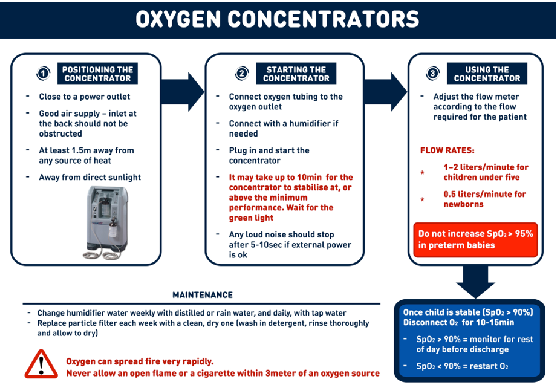

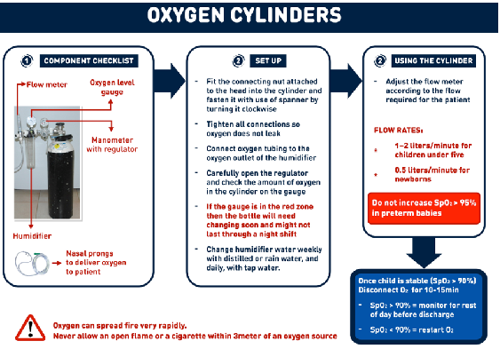

# Infectious Diseases2

#### 2.1 BACTERIAL INFECTIONS

########## 2.1.1 Anthrax ICD10 CODE: A22.10-A22.9

Anthrax is an acute zoonotic infectious disease caused by the bacterium Bacillus anthracis. It most commonly occurs in wild and domestic animals, such as cattle, sheep, goats, camels, antelopes, and other herbivores. B. anthracis spores can live in the soil for many years.

It occurs in humans when they are exposed to infected animals or tissue from infected animals. The incubation period is usually 1-3 days. Anthrax is a notifiable disease.

Cause ~ Exposure to B. anthracis spores by handling products

from infected animals or by inhaling anthrax spores from contaminated animal products

~ Anthrax can also be spread by eating undercooked meat

from infected animals Clinical features

Symptoms vary depending on how the disease was contracted, and usually occur within 7 days

Uganda Clinical Guidelines 2023CHAPTER 2:Infectious Diseases

- Uganda Clinical Guidelines 2023CHAPTER 2:Infectious Diseases

|TYPE|FEATURES|
|---|---|
|Cutaneous|~ 95% of anthrax infections occur through skin cut or abrasion  ~ Starts as raised itchy bump that resembles an insect bite  ~ Within 1-2 days, it develops into a vesicle and then a painless ulcer, usually 1-3 cm in diameter, with a characteristic black  ~ necrotic (dying) area in the centre (eschar) ~ Lymph glands in adjacent area may swell ~ About 20% of untreated cutaneous an-  thrax results in death|
|Inhalation|~ Initial symptoms resemble a cold ~ After several days, symptoms may prog-  ress to severe breathing problems and shock  ~ Inhalation anthrax is usually fatal|
|Gastro- intestinal|~ Acute inflammation of the intestinal tract ~ Initial signs of nausea, loss of appetite,  vomiting and fever ~ Then abdominal pain, vomiting blood, and severe diarrhoea ~ Intestinal anthrax results in death in 25% to 60% of the cases|

############## Investigations

¾ Isolation of Bacillus anthracis from blood, skin lesions, or respiratory secretions- Smear-many bacilli

¾ Or measure specific antibodies in the blood of persons with suspected infection

Management

|TREATMENT|LOC|
|---|---|
|Cutaneous anthrax ‰ Treat for 7–10 days ‰ First line is ciprofloxacin 500 mg every 12 hours ‰ Alternatives: doxycycline 100 mg every 12 hours ‰ Or amoxicillin 1 g every 8 hours|HC2|

Prevention

The following public measures are key for quick prevention and control of anthrax infection:

~ Health education and information ~ Proper disposal by burying of carcasses, hides and skins;

(no burning as it can spread spores) ~ No skinning of dead animals; this allows spore formation,

which can stay in soil for decades ~ No eating of meat from dead animals ~ Restrict movement of animals and animal by-products from

infected to non-infected areas ~ Mass vaccination of animals in endemic areas ~ Vaccination using human anthrax vaccine for:

- - Persons who work directly with the organism in the laboratory
- - Persons who handle potentially infected animal products
- - in high-incidence areas

Uganda Clinical Guidelines 2023CHAPTER 2:Infectious Diseases

2.1.2 Brucellosis ICD11CODE: A23.9 (Undulant fever, malta fever, abortus fever) A zoonotic bacterial infection of acute onset. Common as an occupational

- Uganda Clinical Guidelines 2023CHAPTER 2:Infectious Diseases

########### disease among people working with infected livestock or associated fresh animal products, for example butchers, farmers, abattoir workers, and vendors of contaminated roasted meat (muchomo). Incubation is 2-4 weeks on average, but it can be from 1 to 8 weeks.

Causes ~ Brucella abortus (cattle) ~ Brucella canis (dog) ~ Brucella melitensis (goats and sheep) ~ Brucella suis (pigs) Clinical features

~ Intermittent (fluctuating) fever ~ Aches and pains ~ Orchitis (inflammation of the testes) ~ Vertebrae osteomyelitis (uncommon but characteristic) Differential diagnosis

~ Typhoid fever, malaria, tuberculosis ~ Trypanosomiasis (sleeping sickness) ~ Other causes of prolonged fever

Investigations ¾ Blood: complement fixation test or agglutination

test (where possible)

|The interpretation of serological tests can be difficult, particularly in endemic areas where a high proportion of the population has antibodies against brucellosis. Positive serological test results can persist long after recovery in treated individuals so results have to be interpreted on the basis of the clinical picture.|
|---|

########### Isolation of the infectious agent from blood, bone marrow, or other tissues by culture

############## Management

|TREATMENT|LOC|
|---|---|
|Adult and child > 8 years: ‰ Doxycycline 100 mg every 12 hours for 6 weeks Child > 8 years: 2 mg/kg per dose|HC4|
|‰ Plus gentamicin 5-7 mg/kg IV daily for 2 weeks Child < 8 years: 7.5 mg/kg daily in 1-3 divided doses  - Or ciprofloxacin 500 mg twice daily for 2 weeks Child < 12 years: do not use Children below 8 years  ‰ Cotrimoxazole 24 mg/kg every 12 hours for 6 weeks ‰ Plus gentamicin 5-7 mg/kg IV in single or divided doses  for 2 weeks| |
|Caution  ƒ Treatment duration must be adhered to at all times ƒ Ciprofloxacin is contraindicated in children <12  years ƒ Doxycyline, gentamicin: Contraindicated in pregnancy| |

Prevention ~ Provide public health education on

- - Drinking only pasteurised or boiled milk
- - Careful handling of pigs, goats, dogs, and cattle if a person has wounds or cuts
- - Provide veterinary services for domestic animals

Uganda Clinical Guidelines 2023CHAPTER 2:Infectious Diseases

- Uganda Clinical Guidelines 2023CHAPTER 2:Infectious Diseases

########## 2.1.3 Diphtheria ICD10 CODE: A36.9

An acute bacterial infection caused by Corynebacterium diphtheriae, which is spread through droplet infection and mainly occurs in the nasopharynx. The bacteria produce a toxin which is responsible for the systemic effects. Incubation period is 2-7 days.

2

Cause ~ Toxin of Corynebacterium diphtheriae Clinical features ~ Pseudomembranous tonsillitis (grey, tough and very stickly

membranes) with dysphagia, cervical adenitis, at times progressing to massive swelling of the neck

~ Airway obstruction and possible suffocation when infection

extends to the nasal passages, larynx, trachea and bronchi ~ Low grade fever ~ Effects of the toxin: cardiac dysfunction (myocarditis with

heart failure), neuropathies 1-3 months after the onset affecting swallowing, vision, breathing and ambulation

~ Renal failure Investigation

¾ Culture from throat swab

Management

|TREATMENT|LOC|
|---|---|
|‰ Refer urgently to hospital ‰ Isolate (contact and droplet precautions) until 3 throat  swabs (nose, throat, or skin) are negative ‰ Give procaine benzylpenicillin 1.2 MIU daily IM until patients can switch to oral|H|

############## Management

|TREATMENT|LOC|
|---|---|
|Child: procaine benzylpenicillin 50,000 IU/kg per day IM once daily until patient can swallow When patient is able to swallow ‰ Give Penicillin V 250 mg every 6 hours per day to  complete 14 days. Child 1-6 years: 125 mg 6 hourly Child< 1 years: 12.5 mg/kg every 6 hours In case of penicillin allergy ‰ Erythromycin 500 mg every 6 hours for 14 days  Child: 50 mg/kg every 6 hours|H|

Prevention ~ Isolation of patient and proper management of close con-

tacts

- - Monitor close contacts for 7 days and give prophylactic
- - antibiotics: single dose benzathine penicillin IM (child
- - <10 years: 600,000 IU, child >10 yrs and adults: 1.2 MIU)
- - Verify immunisation status, complete if needed, give a booster if the last dose was more than a year before

~ Immunise all children during routine childhood immunisation

Uganda Clinical Guidelines 2023CHAPTER 2:Infectious Diseases

######## 2.1.4 Leprosy/Hansens disease ICD10 CODE: A30.0

A chronic infectious disease caused by Mycobacterium leprae/Hansens bacillus - an acid-fast bacillus. It mainly affects the skin, peripheral nerves and mucous membranes. It is transmitted from one person to another via the respiratory tract (possibly, very rarely, through broken skin). It is classified into paucibacillary (PB) or Multibacillary (MB) Leprosy.

- Uganda Clinical Guidelines 2023CHAPTER 2:Infectious Diseases

Clinical features ~ Pale or reddish patches on the skin (The most common

sign of leprosy) ~ Loss or decrease in feeling in the skin patch ~ Numbness or tingling of the hands or feet. ~ Weakness of the hands, feet or eyelids ~ Painful or tender nerves ~ Swelling or lamps in the face or earlobes ~ Painless wounds or burns on the hands or feet Case definition

A case of leprosy is a person with clinical signs of leprosy who requires chemotherapy.

############## Diagnosis of leprosy

Diagnosis of Leprosy must be based on careful clinical examination of the patient and when necessary, backed by bacteriological examination

Leprosy is diagnosed by finding at least one of the three cardinal signs:

- - Hypopigmented patches with definite loss of sensation in them
- - Thickened or enlarged peripheral nerves, with loss of sensation and/or weakness of the muscles supplied by those nerves
- - The presence of acid-fast bacilli in a slit skin smear

Classification of leprosy Paucibacillary (PB) leprosy - 1-5 patches Multibacillary (MB) Leprosy - More than 5 patches

Differential diagnosis ~ Hypopigmentation e.g. birthmark, early vitiligo ~ Fungal infections of the skin ~ Molluscum contagiosum ~ Other nodular conditions, e.g. Kaposi’s sarcoma, neurofibro-

matosis, secondary syphilis ~ Other causes of peripheral nerve damage, e.g. diabetes

mellitus ~ Psoriasis, molluscum contagiosum Investigations

¾ In most cases, a definite diagnosis of leprosy can be made using clinical signs alone

¾ At referral centre: stain slit skin smears for Acid Fast Bacilli (AFB)

¾ Skin biopsies NOT recommended as a routine procedure Management

Multi-drug therapy (MDT) for leprosy is presented in the form of various monthly dose blister packs. The same three drugs are used for both PB leprosy and MB leprosy, with special packs for children

Summary of Treatment of leprosy

|PB Leprosy|MB Leprosy|
|---|---|
|Rifampicin|Rifampicin|
|Dapsone|Dapsone|
|Clofazimine|Clofazimine|
|All for 6 months|All for 12 months|

Uganda Clinical Guidelines 2023CHAPTER 2:Infectious Diseases

- Uganda Clinical Guidelines 2023CHAPTER 2:Infectious Diseases

Recommended treatment (drugs and their doses)

| |Drug|Dosage and frequency|Duration|Duration|
|---|---|---|---|---|
| | | |PB|MB|
|Adult|Rifampicin|600 mg once a month|6 months|12 months|
|Adult|Clofazimine|300 mg once a month and 50 mg daily|6 months|12 months|
|Adult|Dapsone|100 mg daily|6 months|12 months|
|Children (10–14 years)|Rifampicin|450 mg once a month|6 months|12 months|
|Children (10–14 years)|Clofazimine|150 mg once a month, 50 mg daily|6 months|12 months|
|Children (10–14 years)|Dapsone|50 mg daily|6 months|12 months|
|Children <10 years old or <40 kg|Rifampicin|10 mg/kg once month|6 months|12 months|
|Children <10 years old or <40 kg|Clofazimine|6 mg/kg once a month and 1 mg/kg daily|6 months|12 months|
|Children <10 years old or <40 kg|Dapsone|2 mg/kg daily|6 months|12 months|
|Steroids for treatment of severe leprae reactions ‰ Prednisolone 40 mg once daily in morning  - Treat for 12 weeks in PB and 24 weeks in MB - Reduce dose gradually by 10–5 mg once every 2 weeks (PB) or 3 weeks (MB) |Steroids for treatment of severe leprae reactions ‰ Prednisolone 40 mg once daily in morning  - Treat for 12 weeks in PB and 24 weeks in MB - Reduce dose gradually by 10–5 mg once every 2 weeks (PB) or 3 weeks (MB) |Steroids for treatment of severe leprae reactions ‰ Prednisolone 40 mg once daily in morning  - Treat for 12 weeks in PB and 24 weeks in MB - Reduce dose gradually by 10–5 mg once every 2 weeks (PB) or 3 weeks (MB) |Steroids for treatment of severe leprae reactions ‰ Prednisolone 40 mg once daily in morning  - Treat for 12 weeks in PB and 24 weeks in MB - Reduce dose gradually by 10–5 mg once every 2 weeks (PB) or 3 weeks (MB) |RR|
| | | | | |
|Note  ƒ In patients co-infected with HIV and on cotrimoxazole , do not use dapsone. ƒ Health worker should directly observe that the medicines taken once a month are actually swallowed  ƒ Treatment durations longer than 12 months and steroids for leprae reactions should only be prescribed by specialists at referral centres  ƒ Lepra reactions: sudden inflammation (pain, redness, swelling, new lesions, loss of nerve function) in skin lesions or nerves of a person with leprosy. They can occur before, during or after MDT completion.|Note  ƒ In patients co-infected with HIV and on cotrimoxazole , do not use dapsone. ƒ Health worker should directly observe that the medicines taken once a month are actually swallowed  ƒ Treatment durations longer than 12 months and steroids for leprae reactions should only be prescribed by specialists at referral centres  ƒ Lepra reactions: sudden inflammation (pain, redness, swelling, new lesions, loss of nerve function) in skin lesions or nerves of a person with leprosy. They can occur before, during or after MDT completion.|Note  ƒ In patients co-infected with HIV and on cotrimoxazole , do not use dapsone. ƒ Health worker should directly observe that the medicines taken once a month are actually swallowed  ƒ Treatment durations longer than 12 months and steroids for leprae reactions should only be prescribed by specialists at referral centres  ƒ Lepra reactions: sudden inflammation (pain, redness, swelling, new lesions, loss of nerve function) in skin lesions or nerves of a person with leprosy. They can occur before, during or after MDT completion.|Note  ƒ In patients co-infected with HIV and on cotrimoxazole , do not use dapsone. ƒ Health worker should directly observe that the medicines taken once a month are actually swallowed  ƒ Treatment durations longer than 12 months and steroids for leprae reactions should only be prescribed by specialists at referral centres  ƒ Lepra reactions: sudden inflammation (pain, redness, swelling, new lesions, loss of nerve function) in skin lesions or nerves of a person with leprosy. They can occur before, during or after MDT completion.|Note  ƒ In patients co-infected with HIV and on cotrimoxazole , do not use dapsone. ƒ Health worker should directly observe that the medicines taken once a month are actually swallowed  ƒ Treatment durations longer than 12 months and steroids for leprae reactions should only be prescribed by specialists at referral centres  ƒ Lepra reactions: sudden inflammation (pain, redness, swelling, new lesions, loss of nerve function) in skin lesions or nerves of a person with leprosy. They can occur before, during or after MDT completion.|

|ƒ Severe leprae reaction (Type 2) are also known as Erythema Nodosum Leprosum (ENL or Type 2 reactions)  ƒ All patients should undergo rehabilitation and physiotherapy Counsel patient on: need to complete treatment, presence of residual signs after completion of treatment  ƒ Presence of residual signs or post-treatment reactions is NOT an indication to re-start the treatment ƒ Refer to the National Tuberculosis and Leprosy Programme (NTLP) manual 2016 for more details|
|---|

############## Prevention

~ Early diagnosis of cases and effective treatment ~ Screening of contacts of known patients ~ Administration of Single dose rifampicine in contacts of

leprosy patients to prevent contacts of leprosy patients from developing leprosy disease

~ Rifampicine dose used in contacts of leprosy patiients

|Age/weight|Rifampicin single dose|
|---|---|
|15 years and above|600mg|
|10-14years|450mg|
|Children 6-9years (weight ≥20kg)|300mg|
|Children 20kg (≥2years)|10-15mg/kg|

~ BCG vaccination may be help Disability due to Leprosy

Uganda Clinical Guidelines 2023CHAPTER 2:Infectious Diseases

Leprosy commonly causes physical disabilities which generate social stigma. Disability refers to an impairment (primary or secondary) that makes it difficult or impossible for the affected person to carry out certain activities, e.g. affecting manual dexterity, personal care, mobility and communication behavior

Definitions of disability: In the hands and feet:

- Grade 0 = No anesthesia, no visible deformity or damage
- Grade 1 = Anaesthesia, but no visible deformity or damage 105

- Uganda Clinical Guidelines 2023CHAPTER 2:Infectious Diseases

- Grade 2 = Visible deformity or damage present In the eyes

- Grade 0 = no eye problem due to leprosy, no evidence of visual loss
- Grade 1 = eye problem due to presence of leprosy, but vision not severy affected as a result (6/60 or better, can count fingers at six meters)
- Grade 2 = severe visual impairment (vision worse than 6/60; inability to count fingers at six meters), lagophthalmos, iridocyclitis, corneal opacities

############## Management of Disability in the hand and feet

Resting of the affected limb in the acute phase can be aided by splinting, especially at night ~ Soaking and oiling for about 30 minutes every day of dry

skin helps to prevent cracking and preserves the integrity of the epidermis.

~ Use of a clean dry cloth to cover the wounds and walking as little as possible and walk slowly, taking frequent rest. Passive exercise and stretching to avoid contractures and strengthen muscle weakness

~ Use of a rough stone to smoothen the skin on the feet or palms,

~ Protective foot wear (MCR Sandals) al, the time. For insensitive feet and protective appliances like gloves for insensitive hands

Eye complications due to Leprosy These include

1. Lagophthalmos: whole spectrum 2.Corneal hypoesthesia: with/without corneal ulcers

3. Acute iritis and scleriti 4.Chronic iritis and iris atrophy

############## Treatment & Management of eye complications

Medical therapy for eye complications due to Leprosy- use of the topical antibiotics and topical steroids. It is strongly recommended that an ophthalmologist and a trained leprologist, if available, be included in the treatment of Hansen disease with ocular manifestations.

2.1.5 Meningitis ICD10 CODES: A39.0 (MENINGOCOCCAL), G00, G01, G02

Meningitis is acute inflammation of the meninges (the membranes covering the brain). Bacterial meningitis is a notifiable disease.

############## Causative organisms

Most commonly bacterial: Streptococcus pneumoniae, Haemophilus influenzae type b (mainly in young children), Neisseria meningitidis, Enteric bacilli

~ Viral (HSV, enteroviruses, HIV, VZV etc) ~ Cryptococcus neoformans (in the immune-suppressed) ~ Mycobacterium tuberculosis Clinical features

~ Rapid onset of fever ~ Severe headache and neck stiffness or pain ~ PhotophobiaHaemorrhagic rash (N.meningitidis infection) ~ Convulsions, altered mental state, confusion, coma ~ In mycobacterial and cryptococcal meningitis, the clinical

presentation can be sub-acute , over a period of several days or 1-2 weeks

Uganda Clinical Guidelines 2023CHAPTER 2:Infectious Diseases

- Uganda Clinical Guidelines 2023CHAPTER 2:Infectious Diseases

Differential diagnosis ~ Brain abscess ~ Space-occupying lesions in the brain ~ Drug reactions or intoxications Investigations  CSF: usually cloudy if bacterial, clear if viral. Analyse for white

cell count and type, protein, sugar, Indian-ink staining (for Cryptococcus), gram stain, culture and sensitivity

 Blood: For serological studies and full blood count  Blood: for culture and sensitivity  Chest X-ray and ultrasound to look for possible primary site Management

|Because of the potential severity of the disease, refer all patients to hospital after pre-referral dose of antibiotic. Carry out lumbar puncture promptly and initiate empirical antibiotic regimen|
|---|

Treatment depends on whether the causative organisms are already identified or not.

|TREATMENT|LOC|
|---|---|
|General measures ‰ IV fluids ‰ Control of temperature  ‰ Nutrition support (NGT if necessary) Causative organisms not yet identified ‰ Start initial appropriate empirical broad spectrum therapy  - Ceftriaxone 2 g IV or IM every 12 hours for 1014 days|HC4|

|TREATMENT|LOC|
|---|---|
|- Child: 100 mg/kg daily dose given as above - Change to cheaper effective antibiotic if and when C&S results become available   If ceftriaxone not available/not improving ‰ Use chloramphenicol 1 g IV every 6 hours for up to 14  days (use IM if IV not possible) Child: 25 mg/kg per dose Once clinical improvement occurs  - Change to 500-750 mg orally every 6 hours to  complete the course; Child: 25 mg/kg per dose| |
|Causative organisms identified Streptococcus pneumoniae (10-14 day course; up to 21 days in severe case) ‰ Benzylpenicillin 3-4 MU IV or IM every 4 hours Child: 100,000 IU/kg per dose ‰ Or ceftriaxone 2 g IV or IM every 12 hours Child: 100 mg/kg daily dose|H|
|Haemophilus influenzae (10 day course) ‰ Ceftriaxone 2 g IV or IM every 12 hours Child: 100 mg/kg per dose ‰ Only if the isolate is reported to be susceptible to the  particular drug ‰ Change to chloramphenicol 1 g IV every 6 hours Child: 25 mg/kg per dose ‰ Or ampicillin 2-3 g IV every 4-6 hours Child: 50 mg/kg per dose|H|

########################## Uganda Clinical Guidelines 2023CHAPTER 2:Infectious Diseases

########################## Uganda Clinical Guidelines 2023CHAPTER 2:Infectious Diseases

|TREATMENT|LOC|
|---|---|
|Neisseria meningitidis (up to 14 day course) ‰ Benzylpenicillin IV 5-6 MU every 6 hours Child: 100,000-150,000 IU/kg every 6 hours ‰ Or Ceftriaxone 2 g IV or IM every 12 hours Child: 100 mg/kg daily dose ‰ Or Chloramphenicol 1 g IV every 6 hours (IM if IV not  possible)  Child: 25 mg/kg IV per dose Once clinical improvement occurs  - Change to chloramphenical 500-750 mg orally every 6 hours to complete the course  Child: 25 mg/kg per dose Note: Consider prophylaxis of close contacts (especially children < 5 years):  ‰ Adults and children >12 years: Ciprofloxacin 500 mg single dose| |
|Child <12 yrs: 10 mg/kg single dose ‰ Alternative (e.g. in pregnancy): ceftriaxone 250 mg IM  single dose  Child < 12 yrs: 150 mg IM single dose|H|
|Listeria monocytogenes (at least 3 weeks course) ‰ Common cause of meningitis in neonates and immu-  nosuppressed adults  Benzylpenicillin 3 MU IV or IM every 4 hours ‰ Or ampicillin 3 g IV every 6 hours  Notes  ƒ Both medicines are equally effective ƒ Therapy may need to be prolonged for up to 6 weeks  in some patients|H|

Prevention ~ Avoid overcrowding ~ Improve sanitation and nutrition ~ Prompt treatment of primary infection (e.g. in respiratory

tract) ~ Immunisation as per national schedules ~ Mass immunisation if N. Meningitis epidemic

- 2.1.5.1 Neonatal Meningitis

########### Bacterial infection of the meninges in the first month of life.

~ Organisms causing neonatal meningitis are similar to those causing neonatal septicaemia and pneumonia, i.e. S.pneumoniae, group A & B streptococci, and enteric Gram-negative bacilli.

Meningitis due to group B streptococci: These organisms often colonise the vagina and rectum of pregnant women, can be transmitted to babies during labour, and cause infection. Meningitis and septicaemia during the 1st week after birth may be particularly severe.

~ Clinical presentation is aspecific with temperature disturbances, lethargy, irritability, vomiting, feeding problems, convulsions, apnoea, bulging fontanel

Management

|TREATMENT|LOC|
|---|---|
|Refer to hospital after initial dose of antibiotics Supportive care ‰ Keep baby warm ‰ For high temperature control environment (undress), avoid  paracetamol|H|

Uganda Clinical Guidelines 2023CHAPTER 2:Infectious Diseases

- Uganda Clinical Guidelines 2023CHAPTER 2:Infectious Diseases

|TREATMENT|LOC|
|---|---|
|‰ Prevent hypoglycaemia (breastfeeding if tolerated/possible,  NGT or IV glucose) ‰ Ensure hydration/nutrition ‰ Give oxygen if needed (SpO2 <92%) Empirical regimen (for 21 days) ‰ Ampicillin IV Neonate < 7 days: 50-100 mg/kg every 12 hours Neonate > 7 days: 50-100 mg/kg every 8 hours ‰ Plus Gentamicin 2.5 mg/kg IV every 12 hours Need for  blood culture If group B streptococci ‰ Benzylpenicillin 100,000-150,000 IU/kg IV every 4-6 hours ‰ Neonates <7 days: 50,000-100,000 IU/kg IV every 8 hours ‰ Plus gentamicin 2.5 mg/kg IV every 12 hours ‰ Continue treatment for a total of 3 weeks|H|

######## 2.1.5.2 Cryptococcal Meningitis ICD10 CODE: B45.1

Fungal meningitis caused by Crypotococcus neoformans and usually occurs in severely immunosuppressed patients (e.g. advanced HIV, usually CD4 < 100).

~ It commonly presents with headache, fever, malaise developing over 1 or 2 weeks, progressing into confusion, photophobia, stiff neck

 Diagnosis is through identification of the microorganism in the CSF with Indian Ink stain, antigen in CSF or culture Management

|TREATMENT|LOC|
|---|---|
|‰ Refer to hospital|H|

######## 2.1.5.3 TB Meningitis ICD10 CODE: A17.0

Meningitis caused by M. tuberculosis. Onset may be gradual with fatigue, fever, vomiting, weight loss, irritability, headache, progressing to confusion, focal neurological deficits, meningeal irritation, till coma.

 For diagnosis: check CSF (raised protein, lymphocytosis), look

for possible primary TB site Management

|TREATMENT|LOC|
|---|---|
|‰ Refer to hospital ‰ Treat as per pulmonary TB but continuation phase is  10 months instead of 4 (2RHZE/10RH) ‰ See section 5.3 for more details|H|

########## 2.1.6 Plague ICD10 CODE: A20.9

Severe acute bacterial infection with high fatality rate transmitted by infected rodent fleas. It is a notifiable disease.

Cause ~ Yersinia pestis (a coccobacillus) transmitted from ground

rodents to man by bites from infected fleas ~ It may also be spread from person to person by droplet

infection and may occur in epidemics Clinical features

|TYPE|FEATURES|
|---|---|
|Bubonic (A20.0)|~ Involves lymph nodes (usually femoral and inguinal)  ~ Rapidly rising temperature  with rigors ~ Headache|

Uganda Clinical Guidelines 2023CHAPTER 2:Infectious Diseases

- Uganda Clinical Guidelines 2023CHAPTER 2:Infectious Diseases

|TYPE|FEATURES|
|---|---|
|Pneumonic (A20.2)|~ Very infectious and highly fatal: PATIENT MUST BE ISOLATED  - Death occurs within 2 days if not treated early  ~ Infection is localised in the lungs with fever, general malaise, headache, and frothy blood stained sputum  ~ May be complicated by respiratory and cardiac distress|

Differential diagnosis ~ Malaria, typhoid ~ Lymphogranuloma venereum ~ Pneumonia Investigations

 Bubo aspirate: for microscopy, C&S  Blood and sputum: check for presence of the bacilli Management

|TREATMENT|LOC|
|---|---|
|‰ Doxycycline 100 mg every 12 hours for 14 days Child > 8 years: 2 mg/kg per dose Alternatives: ‰ Chloramphenicol 500 mg orally or IV every 6 hours  for 10 days Child: 25 mg/kg per dose ‰ Or gentamicin 1.7 mg/kg (adult and child) IV or IM  every 8 hours for 7-10 days|HC2  HC4|

|Note  ƒ For use in pregnancy, consider gentamicin|
|---|

Prevention ~ Health education ~ Improved housing ~ Destruction of rats (rodents) and fleas ~ Early detection and treatment to reduce further spread

########## 2.1.7 Septicaemia ICD10 CODE: A41.9

Blood infection due to various bacteria which may be associated with infection in specific sites (e.g., lungs, urinary tract, gastrointestinal tract) or there may be no specific focus. It is life threatening because it can progress into multi-organ dysfunction and septic shock.

############## Cause

~ Organisms commonly involved are Staphylococcus aureus, Klebsiella, Pseudomonas, Staphylococcus epidermidis, fungal (Candida spp), Coliforms and Salmonella spp, Pneumococci, Proteus spp

Risk factors ~ Extremes of age (children, elderly) ~ Diabetes, cancer, immunosuppression ~ Hospital admission ~ Community acquired pneumonia Clinical features

~ Fever, prostration (extreme tiredness) ~ Hypotension, anaemia

Uganda Clinical Guidelines 2023CHAPTER 2:Infectious Diseases

- Uganda Clinical Guidelines 2023CHAPTER 2:Infectious Diseases

~ Toxic shock is a complication ~ Signs and symptoms of the primary site of infection (e.g.

,pneumonia) Differential diagnosis ~ Severe cerebral malaria ~ Meningitis ~ Typhoid fever (enteric fever) ~ Infective endocarditis Investigations

¾ Look for possible primary source of infection ~ (If identified use SOP for respective sample collection coey to the lab) ¾ Blood: WBC count, culture and sensitivity

~ (Use the aseptic technique and collect sample(s) for culture and sensitivity, to RRH (if service present) before initiation of treatment)

############## Management

|Septicaemia is a life-threating condition, refer to hospital after pre-referral dose of antibiotics.|
|---|

|TREATMENT|LOC|
|---|---|
|General measures ‰ IV fluids ‰ Control of temperature ‰ Nutrition support (NGT if necessary) ‰ Monitoring of vitals and urinary output  If known focus of infection, treat immediately with IV antibiotics as per guidelines. If unknown focus, give:|H|

|TREATMENT|LOC|
|---|---|
|Use aseptic technique to tale blood sample before initiating treatment Adult ‰ Gentamicin 7 mg/kg IV every 24 hours or 1.5-2 mg/  kg IV or IM every 8 hours ‰ Plus either cloxacillin 2 g IV every 4-6 hours f Or chloramphenicol 750 mg IV every 6 hours  Child ‰ Gentamicin 3.5-4 mg/kg IV every 8 hours (neonate:  every 8-12 hours) ‰ Plus either: Ceftriaxone 50 mg/kg every 8 hours (<  7 days old: every 12 hours) ‰ Or cloxacillin 50 mg/kg IV every 4-6 hours ‰ Or benzylpenicillin 50,000 IU/kg IV every 4-6 hours|H|

Prevention ~ Protect groups at risk, for example immunosuppressed and

post-surgical patients ~ Follow strictly aseptic surgical procedures

############ 2.1.7.1 Neonatal Septicaemia

|Organisms causing neonatal septicemia are similar to the ones causing neonatal pneumonia and meningitis. Refer to hospital after pre-referral dose of antibiotics.|
|---|

Management

|TREATMENT|LOC|
|---|---|
|Supportive care ‰ Keep baby warm|H|

Uganda Clinical Guidelines 2023CHAPTER 2:Infectious Diseases

- Uganda Clinical Guidelines 2023CHAPTER 2:Infectious Diseases

|TREATMENT|LOC|
|---|---|
|‰ For high temperature, control environment i.e. (undress), avoid paracetamol  ‰ Prevent hypoglycaemia (breastfeeding if tolerated/  possible, NGT or IV glucose) ‰ Ensure hydration/nutrition ‰ Give oxygen if needed (SpO2 < 90%)| |
|First line treatment ‰ Give ampicillin 50 mg/kg IV every 6 hours plus gentamicin 5 mg/kg every 24 hours for 10 days If risk of staphylococcus infection (infected umbilicus or multiple skin pustules, ‰ Give cloxacillin 50 mg/Kg IV/IM every 6 hours and  gentamicin 5-7 mg/Kg every 24 hours  - Clean infected umbilicus and pustules and  apply gentian violet If no improvement after 48-72 hours change from ampicillin to: ‰ Ceftriaxone 100 mg/kg daily|H|

############ 2.1.7.2 Septic Shock Management, In Adults

################# 1. At Emergency Unit

ƒ Early recognition and resuscitation with iv crystalloids Or Blood ƒ Empirical Broad spectrum antibiotics Treatment: ƒ Early and adequate broad-spectrum antibiotics ƒ Intravenous access. Administer 30ml/kg of crystalloids. A large

bore cannula, in an adult (gauge 16) is preferred. ƒ Urinary catheterization: UOP in an adult is 0.5ml/kg/hr or more, an equivalent of 30-50mls/hr. ƒ Transfer for management to ICU if not responding to resuscitation

################# 2. At ICU, Intubation and Mechanical Ventilation.

ƒ The recommended tidal volume is kept at 6ml/Kg, with plateau

pressure kept at or below 30ml of water. ƒ Iv vasopressor Norepinephrine; 5-20µg/min. ƒ Second line is synthetic human angiotensin ii, ƒ or vasopressin CVP; ≤8mmHg ƒ Ionotropic therapy and Augumented oxygen therapy ƒ Dobutamine up to 20µg/kg/ml ƒ Corticosteroids Therapy: ƒ Iv hydrocortisne200mg/Kg/day in 4 divided dosages, ƒ Maintenance infusion of methyl prednisolone 1mg/kg/day for 7

days, then tapper down for at least another 7 days. ƒ Glycemic control Maintain glycemic level below 180mg/dl

through insulin therapy ƒ Deep Venous Thrombosis prophylaxis ƒ UFH 2 or 3 times a day and LMWH

############## Disseminated Intravenous Coagulation Management

ƒ Platelets and plasma transfusion ƒ Anticoagulant ƒ Fresh Frozen Plasma (FFP) ƒ Antifibrinolytic e.g. tranexamic acid 1g 8hly

2.1.8 Tetanus ICD10 CODE: A35

########### Bacterial disease characterised by intermittent spasms (twitching) of voluntary muscles. Incubation period is from few days to few weeks (average7-10 days).

Cause ~ Exotoxin of Clostridium tetani

~ Common sources of infection: tetanus spores enter the body through deep penetrating skin wounds, the umbilical cord of the newborn, ear infection, or wounds produced during delivery and septic abortions

Uganda Clinical Guidelines 2023CHAPTER 2:Infectious Diseases

- Uganda Clinical Guidelines 2023CHAPTER 2:Infectious Diseases

Clinical features ~ Stiff jaw, difficulty in opening mouth (trismus) ~ Generalised spasms induced by sounds and/or strong light,

characterised by grimace (risus sardonicus) ~ Arching of back (opisthotonus) with the patient remaining

clearly conscious ~ Fever ~ Glottal spasms and difficulty in breathing ~ Absence of a visible wound does not exclude tetanus Differential diagnosis

~ Meningoencephalitis, meningitis ~ Phenothiazine side-effects ~ Febrile convulsions

Management

|TREATMENT|LOC|
|---|---|
|General measures ‰ If at HC2 or 3, refer to hospital ‰ Nurse patient intensively in a quiet isolated area ‰ Maintain close observation and attention to airway,  temperature, and spasms ‰ Insert nasogastric tube (NGT) for nutrition, hydration, and medicine administration|H|

|TREATMENT|LOC|
|---|---|
|‰ Oxygen therapy if needed ‰ Prevent aspiration of fluid into the lungs ‰ Avoid IM injections as much as possible; use alternative  routes (e.g. NGT, rectal) where possible ‰ Maintain adequate nutrition as spasms result in hugh metabolic demands ‰ Treat respiratory failure in ICU with ventilation| |
|Neutralise toxin ‰ Give tetanus immunoglobulin human (TIG)  - 150 IU/kg (adults and children). Give the dose in at least 2 different sites IM, different from the tetanus toxoid site  ‰ In addition, administer full course of age- appropriate TT  vaccine (TT or DPT) – starting immediately ‰ See section 18.1.4|H|
|Treatment to eliminate source of toxin ‰ Clean wounds and remove necrotic tissue. First line antibiotics ‰ Metronidazole 500 mg every 8 hours IV or by mouth  for 7 days Child: 7.5 mg/kg every 8 hours Second line antibiotics ‰ Benzylpenicillin 2.5 MU every 6 hours for 10 days Child: 50,000-100,000 IU/kg per dose|H|
|Control muscle spasms First line ‰ Diazepam 10 mg (IV or rectal) every 1 to 4 hours  Child: 0.2 mg/kg IV or 0.5 mg/kg rectal (maximum of 10 mg) every 1 to 4 hours|H|

########################## Uganda Clinical Guidelines 2023CHAPTER 2:Infectious Diseases

- Uganda Clinical Guidelines 2023CHAPTER 2:Infectious Diseases

|TREATMENT|LOC|
|---|---|
|Other agents ‰ Magnesium sulphate (alone or with diazepam): 5 g (or  75 mg/kg) IV loading dose then 2 g/hour till spasm control is achieved  - Monitor knee-jerk reflex, stop infusion if absent  ‰ Or chlorpromazine (alone or alternate with diazepam) 50-100 mg IM every 4-8 hours  Child: 4-12 mg IM every 4-8 hours or ‰ 12.5 mg-25 mg by NGT every 4-6 hours  - Continue for as long as spasms/rigidity lasts| |
|Control pain ‰ Morphine 2.5-10 mg IV every 4-6 hours (monitor for  respiratory depression) Child: 0.1 mg/kg per dose ‰ Paracetamol 1 g every 8 hours Child: 10 mg/kg every 6 hours| |

Prevention ~ Immunise all children against tetanus during routine child-

hood immunisation ~ Proper wound care and immunisation (see chapter 18):

- - Full course if patient not immunised or not fully immunised
- - Booster if fully immunised but last dose >10 years ago
- - Fully immunised who had a booster <10 years ago do not need any specific treatment

~ Prophylaxis in patients at risk as a result of contaminated wounds: give Tetanus immunoglobulin human (TIG) IM Child < 5 years: 75 IU

Child 5-10 years: 125 IU Child > 10 years and adults: 250 IU Double the dose if heavy contamination or wound obtained > 24 hours.

2.1.8.1 Neonatal Tetanus ICD10 CODE: A33 Neonatal tetanus is a notifiable disease ~ Caused by infection of the umbilicus through cutting of the

cord with unsterile instruments or from putting cow dung or other unsuitable materials on the stump

~ Usually presents 3-14 days after birth with irritability and difficulty in feeding due to masseter ( jaw muscle) spasm, rigidity, generalised muscle spasms. The neonate behaves normally for the first few days before the symptoms appear.

Management

|TREATMENT|LOC|
|---|---|
|‰ Refer to hospital immediately General measures ‰ Nurse in quite, dark and cool environment ‰ Suction the mouth and turn the infant 30 min after  sedative. A mucous extractor or other suction should be available for use prn  ‰ Ensure hydration/feeding  - Start with IV fluids (half saline and dextrose 5%) - Put NGT and start feeding with expressed breast milk 24 hours after admission– in small frequent feeds - Monitor and maintain body temperature - Monitor cardiorespiratory function closely. Refer for ICU management if possible |H  RR|
|Neutralise toxin ‰ Give tetanus immunoglobulin human (TIG)  - 500 IU IM. Give the dose in at least 2 different sites  IM, different from the tetanus toxoid site ‰ In addition give 1st dose of DPT|H|

Uganda Clinical Guidelines 2023CHAPTER 2:Infectious Diseases

########################## Uganda Clinical Guidelines 2023CHAPTER 2:Infectious Diseases

|TREATMENT|LOC|
|---|---|
|Treatment to eliminate source of toxin ‰ Clean and debride the infected umbilicus First line antibiotics ‰ Metronidazole loading dose 15 mg/kg over 60 min then  - Infant <4 weeks : 7.5 mg/kg every 12 hours for 14 - days |H|
|- Infant >4 weeks: 7.5 mg/kg every 8 hours for 14  days Second line antibiotics ‰ Benzylpenicillin 100,000 IU/kg every 12 hours for 10-  14 days|H|
|Control muscle spasm ‰ Diazepam 0.2 mg/kg IV or 0.5 mg/kg rectal every 1 to  4 hours  Other medicines ‰ Chlorpromazine oral 1 mg/kg 8 hourly via NGT| |

Prevention ~ Immunise all pregnant women during routine ANC visits ~ Proper cord care 2.1.9 Typhoid Fever (Enteric Fever) ICD10 CODE: A01.00

Bacterial infection characterised by fever and abdominal symptoms. It is spread through contaminated food and water.

Causes ~ Salmonella typhi and S. paratyphi A & B

Clinical features ~ Gradual onset of chills and malaise, headache, anorexia,

epistaxis, backache, and constipation

~ Usually occurring 10-15 days after infection ~ Abdominal pain and tenderness are prominent features ~ High fever > 38°C ~ Delirium and stupor in advanced stages ~ Tender splenomegaly, relative bradycardia, cough ~ Complications may include perforation of the gut with peri-

tonitis, gastrointestinal hemorrhage Differential diagnosis ~ Severe malaria, other severe febrile illnesses Investigations

¾ Blood culture (most reliable) ¾ Stool culture ¾ Rapid antibody test (e.g. Tubex, Typhidot) – not very sensitive or specific, possibly useful in epidemics

|Widal’s agglutination reaction is neither sensitive nor specific for typhoid diagnosis: a single positive screening does not indicate presence of infection|
|---|

Management

|TREATMENT|LOC|
|---|---|
|~ Do culture and sensitivity to confirm right treat-  ment ‰ Ciprofloxacin 500 mg every 12 hours for 10–14 days Child: 10-15 mg/kg per dose Other antibiotics|HC3|

Uganda Clinical Guidelines 2023CHAPTER 2:Infectious Diseases

- Uganda Clinical Guidelines 2023CHAPTER 2:Infectious Diseases

|TREATMENT|LOC|
|---|---|
|‰ Chloramphenicol 500 mg 6 hourly for 10 days Child: 25 mg/kg IV, IM or oral for 10-14 days In severe, resistant forms or pregnancy ‰ Ceftriaxone 1 g IV every 12 hours for 10-14 days Child: 50 mg/kg per dose Alternative in pregnancy ‰ Amoxicillin 1 g every 8 hours for 10 days Child: 10-15 mg/kg per dose|HC3 HC4 |

Prevention ~ Early detection, isolation, treatment, and reporting ~ Proper faecal disposal ~ Use of safe clean water for drinking ~ Personal hygiene especially hand washing ~ Good food hygiene

2.1.10 Typhus Fever ICD10 CODE: A75.9 Febrile infection caused by Rickettsia species Causes ~ Epidemic louse-borne typhus fever: caused by Rickettsia

prowazeki; the common type in Uganda, which is transmitted to man (the reservoir) by lice

~ Murine (endemic) typhus fever: caused by Rickettsia typhi (mooseri) and transmitted by rat fleas. Rats and mice are the reservoir

~ Scrub typhus fever (mite-borne typhus): caused by R. tsutsugamushi and transmitted by rodent mites

Clinical features ~ Headaches, fever, chills, severe weakness, muscle pains ~ Macular rash that appears on the 5th day on the rest of the

body except the face, palms, and soles ~ Jaundice, confusion, drowsiness ~ Murine typhus has a similar picture but is less severe Differential diagnosis ~ Any cause of fever such as malaria, HIV, UTI, or typhoid Investigations

¾ Blood: For Weil-Felix reaction Management

|TREATMENT|LOC|
|---|---|
|‰ Doxycycline 100 mg every 12 hours for 5-7 days Child > 8 years: 2 mg/kg per dose ‰ Or chloramphenicol 500 mg orally or IV every 6 hours  for 5 days  Child: 15 mg/kg per dose|HC2 HC4|

|Note  ƒ One single dose of doxycycline 200 mg may cure epidemic typhus but there is risk of relapse|
|---|

Prevention ~ Personal hygiene ~ Destruction of lice and rodents

Uganda Clinical Guidelines 2023CHAPTER 2:Infectious Diseases

- Uganda Clinical Guidelines 2023CHAPTER 2:Infectious Diseases

#### 2.2 FUNGAL INFECTIONS 2.2.1 Candidiasis ICD10 CODE: B37

Fungal infection usually confined to the mucous membranes and external layers of skin. Severe forms are usually associated with immunosuppressive conditions, such as HIV/AIDS, diabetes, pregnancy, cancer, prolonged antibiotic use, and steroids.

Causes ~ Candida albicans, transmitted by direct contact Clinical features It may present as: ~ Oral thrush ~ Intertrigo (between skin folds) ~ Vulvo vaginitis and abnormal vaginal discharge (vaginal

candida is not a sexually transmitted disease) ~ Chronic paronychia (inflammation involving the proximal and lateral fingernail folds)

~ Gastrointestinal candidiasis may present with pain on swallowing, vomiting, diarrhoea, epigastric and retrosternal pain

Investigations  Diagnosis is mainly clinical  In case of vaginitis, sample collection –a high vaginal swab

(protected by a speculum), pH, KOH , wet preparation and ~ Gram stain, C&S  Smear examination with potassium hydroxide (KOH) Investigations  Diagnosis is mainly clinical  In case of vaginitis, sample collection –a high vaginal swab

(protected by a speculum), pH, KOH , wet preparation and ~ Gram stain, C&S ~ Smear examination with potassium hydroxide (KOH)

Investigations  Diagnosis is mainly clinical  In case of vaginitis, sample collection –a high vaginal swab (pro-

tected by a speculum), pH, KOH , wet preparation and ~ Gram stain, C&S  Smear examination with potassium hydroxide (KOH) Management

|TREATMENT|LOC|
|---|---|
|Oral candidiasis ‰ Nystatin tablets 500,000-1,000,000 IU every 6 hours  for 10 days (chewed then swallowed) Child < 5 years: Nystatin oral suspension 100,000 IU every 6 hours for 10 days Child 5-12 years: 200,000 IU per dose every 6 hours for 10 days|HC3 HC2|
|Oropharyngeal candidiasis  ‰ Fluconazole 150-200 mg daily for 14 days Child: loading dose 6 mg/kg, then 3 mg/kg daily|HC3|
|Vaginal ‰ Insert clotrimazole pessary 100 mg high into the  vagina with an applicator each night for 6 days or twice a day for 3 days  ‰ Or insert one nystatin pessary 100,000 IU each night for 10 days  ‰ For recurrent vaginal candidiasis, give fluconazole 150-200 mg once daily for 5 days  Fluconazole is associated with spontaneous abortions and congenital anomalies and should be avoided in pregnancy|HC2|

Uganda Clinical Guidelines 2023CHAPTER 2:Infectious Diseases

- Uganda Clinical Guidelines 2023CHAPTER 2:Infectious Diseases

|TREATMENT|LOC|
|---|---|
|Chronic paronychia ‰ Keep hand dry and wear gloves for wet work ‰ Hydrocortisone cream twice daily If not responding ‰ Betametasone cream twice daily ‰ Fluconazole 150-200 mg once a day for 5-7 days|HC3 HC4 |
|Intertrigo ‰ Clotrimazole cream twice a day for 2-4 weeks ‰ In severe forms use fluconazole 150-200 mg once  a day for 14-21 days|HC3|

Prevention ~ Early detection and treatment ~ Improve personal hygiene ~ Avoid unnecessary antibiotics 2.3 VIRAL INFECTIONS 2.3.1 Avian Influenza ICD10 CODE: J09.X2

Influenza caused by avian (bird) influenza Type A viruses (mainly H5N1 strain). It is endemic in the poultry population in Eurasia and can occasionally be transmitted to humans through direct contact with sick birds (inhalation of infectious droplets). Disease can be mild or severe and has limited potential to spread from person to person but there is risk of mutations giving rise to a very infectious virus which could cause widespread epidemics. Avian flu is a notifiable disease.

Cause ~ Avian (bird) influenza Type A viruses Clinical features ~ Conjuctivitis

~ Flu symptoms: fever, cough, sore throat, muscle aches ~ Gastrointestinal (diarrhoea) and neurological symptoms ~ In some cases, severe acute respiratory syndrome (SARS) Investigations  Blood and respiratory specimens, nose swab: lab test for influenza

########### and rule out bacterial infection

- Testing must be in a special laboratory Management

|TREATMENT|LOC|
|---|---|
|If patient requires hospitalisation ‰ Hospitalise patient under appropriate infection control  precautions ‰ Administer oxygen as required. Avoid nebulisers and high air flow oxygen masks|RR|
|‰ Give paracetamol or ibuprofen for fever prn ‰ Give oseltamivir phosphate in patients ≥ 1 year who have  been symptomatic for no more than two days. Treat for 5 days as below:  Adults and children ≥ 13 years: 75 mg twice daily Child > 1 year and < 15 kg: 30 mg twice daily Child 15– 23 kg: 45 mg twice daily Child 23–40 kg body weight:60 mg twice daily Child > 40 kg body weight: 75 mg twice daily If a case does not require hospitalisation f Educate the patient and his/her family on: Personal hygiene and infection control measures Hand-washing, use of a paper or surgical mask by the ill person Restriction of social contacts Seek prompt medical care if the condition worsens Prophylactic use of oseltamivir|RR|

Uganda Clinical Guidelines 2023CHAPTER 2:Infectious Diseases

- Uganda Clinical Guidelines 2023CHAPTER 2:Infectious Diseases

|TREATMENT|LOC|
|---|---|
|‰ Indicated in persons 13 years and above who have come  into contact with affected birds/patients ‰ Close contact: 75 mg once daily for at least 7 days ‰ Community contacts: 75 mg once daily up to 6 weeks ‰ Protection lasts only during the period of chemoprophylaxis|RR|

Discharge policy ~ Infection control precautions for adult patients should re-

main in place for 7 days after resolution of fever and for 21 days in children younger than 12 years

~ Children should not attend school during this period Control and Prevention of Nosocomial Spread of Influenza A (H5N1)

Health workers should observe the following to prevent the spread of avian influenza in the health care facilities: ~ Observe droplet and contact precautions. In addition, get

negative pressure room if available ~ Isolate the patient to a single room ~ Place beds more than 1 metre apart and preferably separat-

ed by a physical barrier (e.g., curtain, partition)

~ Appropriate personal protective equipment (APPE) in all those entering patients’ rooms. APPE includes high efficiency mask, gown, face shield or goggles, and gloves

~ Limit the number of health care workers (HCWs) and other hospital employees who have direct contact with the patient(s). These HCWs should:

~ Be properly trained in infection control precautions ~ Monitor their own temperature twice daily and report any

febrile event to hospital authorities ~ A HCW who has a fever (>380C) and who has had direct patient contact should be treated immediately

~ Restrict the number of visitors, provide them with APPE, and instruct them in its use

######## 2.3.2 Chicken pox ICD10 CODE: B01

########### A highly contagious viral infection. Patients are contagious from 2 days before onset of the rash until all lesions have crusted. An attack of chicken pox usually confers lifelong immunity. Disease is more severe and complicated in adults.

Causes ~ Varicella Zoster virus (VZV) by droplet infection

Clinical features ~ Incubation period is 14 days, but shorter in immuno- com-

promised host ~ Mild fevers occur 10-20 days after exposure ~ Prodromal symptoms consisting of low fever, headache,

and malaise occurring 2 to 3 days before the eruption

~ Eruptive phase: they appear as macules, papules, vesicles, pustules and crusts. The most characteristic lesion is a vesicle looking like a drop of water on the skin. Vesicles rupture easily and may become infected

~ The rash begins on the trunk and spreads to the face and extremities

~ Lesions of different stages (crops) exist together at the same time in any given body area

~ Complications may include septicaemia, pneumonia, ful-

minating haemorrhagic varicella, and meningoencephalitis Differential diagnosis

Uganda Clinical Guidelines 2023CHAPTER 2:Infectious Diseases

~ Drug-induced eruption ~ Scabies ~ Insect bites ~ Erythema multiforme, impetigo

~ Other viral infections with fever and skin rash 133

- Uganda Clinical Guidelines 2023CHAPTER 2:Infectious Diseases

############## Investigations

¾ Virus isolation possible but not necessary ¾ Diagnosis is practically clinical

############## Management

|TREATMENT|LOC|
|---|---|
|Symptomatic and supportive treatment ‰ Apply calamine lotion every 12 hours f Cool, wet  compresses to provide relief Chlorpheniramine: Adult 4 mg every 12 hours Child <5 years: 1-2 mg every 12 hours for 3 days Pain relief: paracetamol 10 mg/kg every 6 hours  In adults and children >12 years consider antivirals: Oral aciclovir 800 mg every 6 hours for 7 days Keep child at home/remove from school till healed to avoid spread|HC2  HC4|

Prevention ~ Isolation of infected patient ~ Avoid contact between infected persons and immuno- sup-

pressed persons

########## 2.3.3 Measles ICD10 CODE: B05

An acute, highly communicable viral infection characterized by a generalised skin rash, fever, and inflammation of mucous membranes. Measles is a notifiable disease.

Cause ~ Measles virus spreads by droplet infection and direct

contact

Clinical features ~ Catarrhal stage: high fever, Koplik’s spots (diagnostic) run-

ny nose, barking cough, conjunctivitis ~ Misery, anorexia, vomiting, diarrhoea ~ Later: generalised maculopapular skin rash followed by des-

quamation after few days Complications ~ Secondary bacterial respiratory tract infection, e.g. bron-

chopneumonia, otitis media ~ Severe acute malnutrition especially following diarrhoea ~ Cancrum oris (from mouth sepsis) ~ Corneal ulceration and panophthalmitis – can lead to blind-

ness ~ Demyelinating encephalitis ~ Thrombocytopaenic purpura Differential diagnosis

~ German measles (Rubella) ~ Other viral diseases causing skin rash Investigations  Clinical diagnosis is sufficient though virus isolation is possible Management (symptomatic)

|TREATMENT|LOC|
|---|---|
|‰ Isolate patients (at home or health centre) ‰ Paracetamol prn for fever  Apply tetracycline eye ointment 1% every 12 hours for 5 days ‰ Increase fluid and nutritional intake (high risk of mal-  nutrition and dehydration|HC2|

Uganda Clinical Guidelines 2023CHAPTER 2:Infectious Diseases

########################## Uganda Clinical Guidelines 2023CHAPTER 2:Infectious Diseases

|TREATMENT|LOC|
|---|---|
|‰ Give 3 doses of vitamin A: first dose at diagnosis, 2nd dose the next day and 3rd dose on day 14 Child <6 months: 50,000 IU  Child 6-12 months: 100,000 IU Child >12 months: 200,000 IU ‰ Monitor for and treat secondary bacterial infections  with appropriate antibiotics immediately ‰ Refer to hospital in case of complications| |

Prevention ~ Measles vaccination (see chapter 18) ~ Avoid contact between infected and uninfected persons ~ Educate the public against the common local myths e.g.

stopping to feed meat and fish to measles patients

########## 2.3.4 Poliomyelitis ICD10 CODE: A80.3

An acute viral infection characterised by acute onset of flaccid paralysis of skeletal muscles. It is transmitted from person to person through the faecal-oral route. Poliomyelitis is a notifiable disease.

Cause ~ Polio virus (enterovirus) types I, II, and III Clinical features ~ Majority of cases are asymptomatic, only 1% result in flac-

cid paralysis

~ Non-paralytic form: minor illness of fever, malaise, headache, and vomiting, muscle pains, spontaneous recovery in 10 days

~ Paralytic form: after the aspecific symptoms, rapid onset (from morning to evening) of asymmetric flaccid paralysis,136

predominantly of the lower limbs, with ascending progression

~ Paralysis of respiratory muscles is life threatening (bulbar

polio) ~ Aseptic meningitis may occur as a complication Differential diagnosis

~ Guillain-Barré syndrome ~ Traumatic neuritis ~ Transverse myelitis ~ Pesticides and food poisoning

|Consider all cass of Acute Flaccid Paralysis as possible Poliomyelitis: alert the district focal person for epidemic control, and send 2 stool samples (refrigerated).|
|---|

############## Investigations

 Isolation of the virus from stool samples  Viral culture  Ensure that Giardia intestinalis, Entamoeba histolytica, Cryp-

tosporidium, Cyclospora, sarcocystis, Toxoplasma gondii are included in the investigations

Management

|TREATMENT|LOC|
|---|---|
|Acute stage Poliomyelitis in this stage without paralysis is difficult to diagnose Paralytic form ‰ If paralysis is recent, rest the patient completely Note:  Do not give IM injections as they make the paralysis worse|H|

Uganda Clinical Guidelines 2023CHAPTER 2:Infectious Diseases

- Uganda Clinical Guidelines 2023CHAPTER 2:Infectious Diseases

|TREATMENT|LOC|
|---|---|
|‰ Refer the patient to a hospital for supportive care ‰ After recovery (if partially/not immunised), complete  recommended immunisation schedule Chronic stage ‰ Encourage active use of the limb to restore muscle  function/physiotherapy ‰ In event of severe contractures, refer for corrective surgery|H|

Prevention ~ Isolate patient for nursing and treatment, applying contact

and droplets precautions ~ Immunise all children below 5 years from the area of the

suspected case ~ If case is confirmed, organize mass immunisation campaign ~ Proper disposal of children’s faeces ~ Immunisation (see chapter 18) ~ Proper hygiene and sanitation

########## 2.3.5 Rabies ICD10 CODE: A82

Rabies is a viral infection of wild and domestic animals, transmitted to humans by saliva of infected animals through bites, scratches or licks on broken skin or mucuos membranes. Once symptoms develop, rabies presents as a fatal encephalitis: there is no cure and treatment is palliative.

Before symptomatic disease has developed, rabies can effectively be prevented by post-exposure prophylaxis.

Cause ~ Rabies virus. Incubation is average 20-90 days but can be

shorter in severe exposure (multiple bites, bites on face/ neck) of even longer (> a year) in a few cases

Clinical features ~ Itching or paraesthesiae (abnormal sensation) around site

of exposure, malaise, fever ~ Neurologic phase

~ Furious form: psychomotor agitation or hydrophobia (throat spasm and panic, triggered by attempt to drink or sight/ sound/touch of water) and aerophobia (similar response to a draft of air)

~ Paralytic form (rarer): progressive ascending paralysis Management

|TREATMENT|LOC|
|---|---|
|‰ There is no cure. In case of suspected exposure, take all the appropriate steps to prevent the infection (see section1.2.1.3 on animal bites)  ‰ Start as soon as the exposure happens or as soon as the patient comes for medical attention, regardless of whatever time has passed from the exposure|H|
|‰ Admit case ‰ Palliative and supportive care ‰ Observe strict hygienic precautions  Avoid contact with patient’s body fluids or secretions PPE (personal protective equipment) Caution: the patient may bite ‰ Counsel caregivers on rabies and consequences|H|

Uganda Clinical Guidelines 2023CHAPTER 2:Infectious Diseases

- Uganda Clinical Guidelines 2023CHAPTER 2:Infectious Diseases

#### 2.3.6 VIRAL HAEMORRHAGIC FEVERS 2.3.6.1 Ebola and Marburg ICD11 CODE: A99

Ebola and Marburg are severe zoonotic multisystem febrile diseases caused by RNA viruses. They are notifiable diseases.

############## Cause

~ Ebola and Marburg viruses. Transmission to humans happens through contact with meat or body fluids of an infected animal. The disease can then be transmitted from human to human through body fluids (including semen for months after recovery) and it is highly contagious.

Risk factors ~ Communities around game parks ~ Communities in endemic area ~ Cultural practices like burial rituals ~ Poor infection control practices ~ History of exposure to infected people in the last 2 to 21

days i.e sexual partner, breastfeeding mothers ~ Recent contact with infected animals e.g. monkeys, bats,

infected game meat ~ Clinical features ~ Early signs (non specific): sudden fever, weakness, headache,

muscle pains, loss of appetite, conjunctivitis ~ Late signs: ~ Diarrhoea (watery or bloody), vomiting ~ Mucosal and gastrointestinal bleeding: chest pain, respiratory

distress, circulatory shock ~ CNS dysfunction, confusion, seizures

~ Miscarriage in pregnancy ~ Elevated AST and ALT, kidney injury, electrolyte abnormalities Note: Haemorrhage is seen in less than a third of Ebola patients Differential diagnosis

~ Malaria, rickettsiosis, meningitis ~ Shigellosis, typhoid ~ Anthrax, sepsis, viral hepatitis, dengue, leptospirosis Investigations

~ Send blood sample to a referral laboratory for specific testing (taking off blood samples from patients suspected of viral hemorrhagic fever should be done by a trained healthcare worker in appropriate PPE.

~ Notify district surveillance focal person Management

|TREATMENT|LOC|
|---|---|
|‰ Refer all patients to regional referral hospital for man-  agement in an appropriate setting ‰ Notify the district health team|RR|

Uganda Clinical Guidelines 2023CHAPTER 2:Infectious Diseases

|Safety of health workers: maximum level of infection control procedures  Health workers should maintain a high level of suspicion for Ebola virus disease. While standard precautions should be followed for all patients at all times, implementation of transmission-based precautions for cases suspected or confirmed to have Ebola or Marburg virus diseases is essential. This includes: screening for rapid identification and isolation of cases,|
|---|

- Uganda Clinical Guidelines 2023CHAPTER 2:Infectious Diseases

|ƒ Hand hygiene according to the WHO 5 moments safe injection practices use of personal protective equipment (e.g. eye protection, mask (medical or respirator), gloves, gown or coverall, head covering, apron and gum (rubber) boots.  ƒ Handling and disposing of all waste related to the care of an Ebola patients as infectious  ƒ Safe handling and disinfection of linens (or disposal if not possible) and thorough cleaning and disinfection of the environment and medical equipment.  ƒ Disinfectants (e.g. chlorine mixture of 0.5% for surfaces) used must be prepared and used ensuring adequate concentration and contact time on surfaces.  ƒ Handling of the deceased is particularly high risk and should be kept to a minimum. Strict adherence to IPC measures including hand hygiene, use of personal protective equipment (e.g. eye protection, mask (medical or respirator), gloves, gown or coverall, head covering, apron and gum (rubber) boots is required.  Patient care Refer to the MoH recent guidelines for management of viral hemorrrhagic fevers ƒ Optimised Supportive treatment of signs and symptoms ƒ Replace and monitor fluids and electrolytes for patients with  diarrhoea or vomiting Triage and contact tracing ƒ Triage patient (those who had contact with a patient or not) ƒ Contact identification, contact listing and contact follow up Dead Body handling ƒ Avoid washing or touching the dead f There should be no gathering  at funerals. The dead should be buried promptly by a designated burial team|
|---|

Prevention ~ Health education of the population (e.g. avoid eating wdil ani-

mals)

~ Effective outbreak communication and having haemorrhagic viral fever protocols in place

~ Appropriate safety gear for patients/health workers ni suspect

cases ~ Modification of burial practices ~ Use of condoms 2.3.6.2 Yellow Fever

An acute viral haemorrhagic fever transmitted through the bite of infected female Aedes aegypti mosquito. Incubation period is 3 to 6 days. It is a notifiable disease.

cause ~ Yellow fever RNA virus

Risk factors ~ Residents in endemic area ~ Hunters and settlers around game parks Clinical features First stage: ~ Fever, chills, headache, backache, muscle pain, prostration,

nausea, vomiting, fatigue. Usually resolves within 3-4 days. Second stage:

~ About 15% of cases enter into a second or toxic stage after 1-2 day of remission: high fever, prostration, signs and symptoms of hepatic failure, renal failure and bleeding ( jaundice, nose bleeding, gingival bleeding, vomiting blood, blood in stool)

~ About half of these patients die within 7-10 days Differential diagnosis

~ Hepatitis E, liver failure ~ Malaria, Ebola

########################## Uganda Clinical Guidelines 2023CHAPTER 2:Infectious Diseases

- Uganda Clinical Guidelines 2023CHAPTER 2:Infectious Diseases

investigations ~ PCR in early phases ~ ELISA in the late stageIt is a notifiable disease. Management

|TREATMENT|LOC|
|---|---|
|‰ Refer all cases to regional referral hospital ‰ Notify the district health team ‰ There is no specific antiviral drug treatment ‰ Supportive treatment is recommended:  - Rehydration - Management of liver and kidney failure - Antipyretics for fever - Blood transfusion   ‰ Treat associated bacterial infections with antibiotics|RR|
|Note  ƒ Individuals who have recovered from a yellow fever infection develop life-long immunity|Note  ƒ Individuals who have recovered from a yellow fever infection develop life-long immunity|

Prevention ~ Vaccination (see chapter 18) ~ Elimination of mosquito breeding sites ~ Epidemic preparedness i.e prompt detection and treatment

2.3.7 COVID-19 Disease

Coronavirus disease (COVID-19) results from infection with the Severe Acute Respiratory Syndrome Coronavirus 2 (SARS-CoV-2). It is a novel virus in humans, knowledge of which and its pathogenesis still evolving. Additionally, the population-level immunity is uncertain. Complications

of the severe infection can result in death.144

Clinical features Early symptoms are non-specific and may include:

 fever, cough, myalgia, fatigue, shortness of breath, sore throat, headache, flu-like symptoms, diarrhea, nausea, respiratory distress, features of renal failure, pericarditis, and Disseminated Intravascular Coagulation (DIC).

It is important to know that many individuals with COVID-19 are asymptomatic. It is therefore paramount that all health workers observe strict infection prevention and control (IPC) measures at all times.

############## Classification of COVID 19 disease

|Disease Stage|Hallmark|Features|
|---|---|---|
|Mild Disease|No Respiratory Distress|Normal Vital Signs|
|Moderate Disease|Non-Severe Pneumonia|Crackles in chest but Normal SPO2,  mild respiratory distress (Resp Rate <30)|
|Severe Disease|Oxygen De saturation|Severe Respiratory distress (Resp Rate >30) & SPO2 <90%,|
|Critical|Organ Dysfunction|• CNS: Altered Mental State • CVS: Hypotension & Shock • Kidney: Decreased Urine Output, Raised Creatinine • Liver: Elevated liver enzymes • Coagulation: Raised PT & INR, Thrombocytopenia • Endocrine: Hypoglycemia |

Groups at High Risk of Developing Severe Disease or Complications ƒ Age > 65 year ƒ Obesity ƒ Lung diseases (e.g. asthma, TB, COPD) ƒ Hypertension

Uganda Clinical Guidelines 2023CHAPTER 2:Infectious Diseases

- Uganda Clinical Guidelines 2023CHAPTER 2:Infectious Diseases

|Patient enters health facility grounds|
|---|

|Wash or sanitize hands Take temperature (if infrared or axillary thermometer available)|
|---|

|Low risk for COVID-19: Direct to facility for further management|
|---|

No to All

- 1. Is the temperature T>37.5OC?
- 2. Have had a fever?
- 3. Do you have symptoms such as cough, shortness of breath, muscle aches, weakness, sore throat, or headache?

Yes to at least 1

|SUSPECT CASE|
|---|

########################### Danger signs

+ Rapid breathing: >30 per min (adult/child>5y) >40 per min (child 1-5y) >50 per min (child<1y) + Difficult breathing and/or

|Provide a medical mask to the patient and direct to designated triage area|
|---|

|Stabilize  (Oxygen if available) in a designated isolation area|
|---|

chest indrawing

Yes

+ Persistent high fever for 3 or more days

Danger signs

+ Disorientation, seizures or convulsions

No

|Collect samples for:  • COVID-19 • Malaria RDT (if fever) |
|---|

+ Lethargy (excessive weakness, tiredness)

+ Sunken eyes or other signs of severe dehydration

+ Inability to drink or eat

High risk for development of serious illness or complications

No

|ADMIT FOR ISOLATION Admit for isolation to hospital, another designated facility (if available), or home (case-by-case basis: must have ability for close follow up)|
|---|

Yes

|ADMIT FOR ISOLATION Prioritize for admission to isolation ward with critical care capability|
|---|

ƒ Heart conditions such as history of heart attack or stroke ƒ Diabetes ƒ Cancer patients whether or not on chemotherapy ƒ Advanced liver disease ƒ Person living with HIV ƒ Kidney disease ƒ Severe Acute Malnutrition ƒ Sickle cell disease ƒ COVID 19 unvaccinated ƒ Pregnancy and recent pregnancy ƒ Hypertension

############## Differential diagnoses

 Malaria and other febrile illnesses.  common respiratory, infectious, cardiovascular, oncological,

and gastrointestinal diseases.

Investigations

|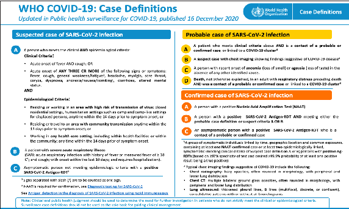|
|---|

Uganda Clinical Guidelines 2023CHAPTER 2:Infectious Diseases

- Uganda Clinical Guidelines 2023CHAPTER 2:Infectious Diseases

Management  Perform SARS-CoV-2 Rapid Diagnostic Test (RDT)  Carry out nasopharyngeal swabs for RT-RNA test

COVID-19 screening and triage process at health facilities ~ COVID-19 triage aims to flag suspected patients at first

point of contact within the healthcare system in order to ~ protect other patients and staff from potential exposure. ~ identify and rapidly address severe symptoms, rule out oth-

er conditions with features similar to COVID-19, ascertain if suspect case definition is met

~ All suspected patients should be directed to a designated area away from other patients and handled as per standard covid protection guidelines

~ Refer to the Comprehensive COVID-19 Case Management Guidelines for details.

|TREATMENT|LOC|
|---|---|
|Safety of health workers and caregivers: maximum level of infection control procedures|HC2|
|Strict isolation of suspect cases Use of adequate protective gear Minimize invasive intervention Safe handling of linen Appropriate use of chlorine mixtures Proper disposal of health care waste Educate the patient and care givers on appropriate infection control measures| |
|No Hospitalization (mild to moderate diseases)|HC2|

|TREATMENT|LOC|LOC|
|---|---|---|
|All patients with no risk of developing severe COVID-19 diseases. ‰ symptom management, supportive care, and monitoring  (at home, or in the community). ‰ Control fevers with paracetamol, multivitamins and advise on balanced diet  Adults and Children >40kg at increased risk of developing severe COVID-19 diseases. Refer to current Covid-19 treatment guidelines.  ‰ nimatrelvir/ritonavir 300/100mg orally (PO) twice daily for 5 days (must be initiated within 5 days of symptom onset)  ‰ OR remdesivir IV infusion Once daily for 3 days with a loading dose 200mg on Day 1 and 100mg on subsequent days. (initiated within 7 days of symptom onset)  ‰ OR molnupiravir 800mg orally (PO) twice daily for 5 days ONLY when ritonavir-boosted nirmatrelvir or remdesivir cannot be used; treatment should be initiated as soon as possible and within 5 days of symptom onset (contraindicated in pregnant or breastfeeding women and children)|All patients with no risk of developing severe COVID-19 diseases. ‰ symptom management, supportive care, and monitoring  (at home, or in the community). ‰ Control fevers with paracetamol, multivitamins and advise on balanced diet  Adults and Children >40kg at increased risk of developing severe COVID-19 diseases. Refer to current Covid-19 treatment guidelines.  ‰ nimatrelvir/ritonavir 300/100mg orally (PO) twice daily for 5 days (must be initiated within 5 days of symptom onset)  ‰ OR remdesivir IV infusion Once daily for 3 days with a loading dose 200mg on Day 1 and 100mg on subsequent days. (initiated within 7 days of symptom onset)  ‰ OR molnupiravir 800mg orally (PO) twice daily for 5 days ONLY when ritonavir-boosted nirmatrelvir or remdesivir cannot be used; treatment should be initiated as soon as possible and within 5 days of symptom onset (contraindicated in pregnant or breastfeeding women and children)| |
|If the patient requires hospitalization (Severe to Critical disease)|If the patient requires hospitalization (Severe to Critical disease)|RR|
|~ Oxygen therapy ~ And Corticosteroids ~ And Venous thromboembolism prophylaxis ~ And Interleukin-6 receptor blocker (tocilizumab  or sarilumab) or JAK Inhibitor (baricitinib) For details refer to the Comprehensive COVID-19 case Management Guidelines|~ Oxygen therapy ~ And Corticosteroids ~ And Venous thromboembolism prophylaxis ~ And Interleukin-6 receptor blocker (tocilizumab  or sarilumab) or JAK Inhibitor (baricitinib) For details refer to the Comprehensive COVID-19 case Management Guidelines| |

########################## Uganda Clinical Guidelines 2023CHAPTER 2:Infectious Diseases

- Uganda Clinical Guidelines 2023CHAPTER 2:Infectious Diseases

Prevention ~ Vaccination (Refer to chapter 18: Immunization) ~ Epidemic preparedness i.e. prompt detection and treatment ~ Infection Prevention and control measures including Mask

wearing, social distancing, regular handwashing, avoid shaking hands etc.

#### 2.4 HELMINTHES PARASITES 2.4.1 Intestinal Worms ICD10 CODE: B83.9

Intestinal worms enter the human body through ingestion of the worm eggs in food or water via dirty hands or through injured skin when walking barefoot. Examples include:

|TYPE OF INFESTATION|FEATURES|
|---|---|
|Ascariasis: Ascaris lumbricoides (round worm). Infests small intestines|ƒ Oro-faecal transmission ƒ Usually few or no symptoms ƒ Persistent dry irritating cough ƒ Patient may pass out live worms  through the anus, nose, or mouth ƒ Pneumonitis- Loeffler’s syndrome ƒ Heavy infestations may cause  nutritional deficiencies  ƒ Worms may also cause obstruction to bowel, bile duct, pancreatic duct, or appendix|
|Enterobiasis: (threadworm) Enterobias vermicularis|ƒ Transmitted by faecal-oral route ƒ Mainly affects children ƒ Intense itching at the anal orifice|

|TYPE OF INFESTATION|FEATURES|
|---|---|
|Hook worm Caused by Necator americanus and Ancylostoma duodenale|ƒ Chronic parasitic infestation of the intestines ƒ Transmitted by penetration of the  skin by larvae from the soil ƒ Dermatitis (ground itch) ƒ Cough and inflammation of the  trachea (tracheitis) common during larvae migration phase  ƒ Iron-deficiency anaemia ƒ Reduced blood proteins in heavy  infestations ƒ Reduced blood proteins in heavy infestations|
|Strongyloidiasis Strongyloides stercoralis|ƒ Skin symptoms: Itchy eruption at the site of larval penetration ƒ Intestinal symptoms e.g. abdominal  pain, diarrhoea, and weight loss ƒ Lung symptoms due to larvae in  the lungs, e.g. cough and wheezing ƒ Specific organ involvement, e.g.  meningoencephalitis  ƒ Hyperinfection syndrome: Occurs when immunity against auto-infection fails, e.g. in immunosuppressed cases|
|Whip worm Infests human caecum and upper colon|ƒ May be symptomless ƒ Heavy infestation may cause bloody, mucoid stools, and diarrhoea  ƒ Complications include anaemia and prolapse of the rectum|

########################## Uganda Clinical Guidelines 2023CHAPTER 2:Infectious Diseases

- Uganda Clinical Guidelines 2023CHAPTER 2:Infectious Diseases

############## Differential diagnosis

 Other causes of cough, diarrhea  Other causes of intestinal obstruction and nutritional deficiency  Loeffler’s Syndrome  Other causes of iron-deficiency anaemia Investigations

 Stool examination for ova, live worms or segments  Full blood count Management

|TREATMENT|LOC|
|---|---|
|Roundworm, threadworm, hookworm, whipworm ‰ Albendazole 400 mg single dose  Child <2 years: 200 mg ‰ Mebendazole 500 mg single dose  Child <2 years: 250 mg Strongyloides ‰ Albendazole 400 mg every 12 hours for 3 days ‰ Or Ivermectin 150 micrograms/kg single dose|HC1  HC3|

Prevention ~ Proper faecal disposal ~ Personal and food hygiene ~ Regular deworming of children every 3-6 months ~ Avoid walking barefoot

######## 2.4.1.1 Taeniasis (Tapeworm) ICD10 CODE: B68

########### An infestation caused by Taenia (Taenia saginata (from undercooked beef ), Taenia solium (from undercooked pork), Diphyllobothrium latum (from undercooked fish).

Cause ~ Adult Tapeworms: intestinal infestation, by ingestion of

undercooked meat containing cysticerci (larval form of the worm)

~ Larvae forms (cysticercosis): by ingestion of food/water contaminated by eggs of T.solium. The eggs hatch in the intestine, the embryos invade the intestinal walls and disseminate in the brain, muscles or other organs

Clinical features T. saginata, T.solium (adult tapeworm)

ƒ Usually asymptomatic, but live segments may be passed ƒ Epigastric pain, diarrhoea, sometimes weight loss

Cysticercosis

ƒ Muscular: muscle pains, weakness, fever, subcutaneous nodules ƒ Neurocysticercosis: headache, convulsions, coma, meningo-

encephalitis, epilepsy ƒ Ocular: exophthalmia, strabismus, iritis

D. latum

ƒ Usually asymptomatic, but mild symptoms may occur ƒ Megaloblastic anaemia may occur as a rare complication

############## Differential diagnosis

ƒ Other intestinal worm infestations

Uganda Clinical Guidelines 2023CHAPTER 2:Infectious Diseases

- Uganda Clinical Guidelines 2023CHAPTER 2:Infectious Diseases

Investigations  Laboratory: eggs, worm segments in stool or collected from

perianal skin (scotch tape method)  Cysticercosis: hypereosinophilia in blood and CSF Management

|TREATMENT|LOC|
|---|---|
|Tapeworm ‰ Praziquantel 5-10 mg/kg single dose Alternative ‰ Niclosamide  Adult and child > 6 years: 2 g single dose Child < 2 years: 500 mg Child 2-6 years: 1 g  - Give Bisacodyl 2 hours after the dose|HC3 HC4|
|Cysticercosis ‰ Refer to specialised facilties ‰ Antiparasitic treatment without diagnosis of location  by CT or MRI scan can worsen symptoms, and even threaten the life of the patient.  ‰ Neurosurgical treatment required|RR|

Prevention ƒ Cook all fish and meat thorougly ƒ Proper hygiene: handwashing, nail cutting, proper disposal of

faeces

######## 2.4.2 Echinococcosis (Hydatid Disease) ICD 10 CODE: B67

Tissue infestation by larvae of Echinococcus granulosus. It is transmitted through direct contact with dogs or by ingesting water and food contaminated by dog faeces.

Clinical features ~ Cough, chest pain ~ Liver cysts may be asymptomatic but may also give abdom-

inal pain, palpable mass and jaundice (if the bile duct is obstructed)

~ Rupture of cysts may cause fever, urticaria, or anaphylactic reaction

~ Pulmonary cysts can be seen on chest X-ray and may rup-

ture to cause cough, chest pain and haemoptysis Differential diagnosis ~ Amoebiasis, hepatoma ~ Other causes of liver mass and obstructive jaundice ~ Tuberculosis (TB) Investigations

 Skin test  Ultrasound  Chest X-ray: for pulmonary cysts  Serological tests  Needle aspiration under Ultrasound Sonography (US) or CT-

scan guidance Management

|TREATMENT|LOC|
|---|---|
|Refer for specialist management ‰ Surgical excision ‰ Prior to surgery or in cases not amenable to surgery ‰ Albendazole  - Child >2 years and adults: 7.5 mg/kg every 12 hours for 3-6 months|RR|

Uganda Clinical Guidelines 2023CHAPTER 2:Infectious Diseases

- Uganda Clinical Guidelines 2023CHAPTER 2:Infectious Diseases

Prevention ~ Food hygiene ~ Health education ~ Proper disposal of faeces

######## 2.4.3 Dracunculiasis (Guinea Worm) ICD10 CODE: B72

########### An infestation of the subcutaneous and deeper tissue with the guinea worm. It is a notifiable disease.

Cause ~ Dracunculus medinensis, transmitted to man by drinking

water containing cyclops (waterflea or small crustacean) infected with larvae of the guinea worm

Clinical features ~ Adult worm may be felt beneath the skin ~ Local redness, tenderness, and blister (usually on the foot)

at the point where the worm comes out of the skin to discharge larvae into the water

~ There may be fever, nausea, vomiting, diarrhoea, dyspnoea, generalised urticaria, and eosinophilia before vesicle formation

~ Complications may include cellulitis, septicaemia, and aseptic or pyogenic arthritis; tetanus may also occur Differential diagnosis ~ Cellulitis from any other causes ~ Myositis Investigations

¾ Recognition of the adult worm under the skin

¾ X-ray may show calcified worms Management

|TREATMENT|LOC|
|---|---|
|There is no known drug treatment for guinea worm All patients: ‰ To facilitate removal of the worm, slowly and carefully  roll it onto a small stick over a period of days ‰ Dress the wound occlusively to prevent the worm passing ova into the water ‰ Give analgesics for as long as necessary  If there is ulceration and secondary infection give: ‰ Amoxicillin 500 mg every 8 hours for 5 days  Child: 250 mg every 8 hours for 5 days ‰ Or cloxacillin 500 mg every 6 hours for 5 days|HC2|

############## Prevention

ƒ Filter or boil drinking water ƒ Infected persons should avoid all contact with sources o fdrinking

water

######## 2.4.4 Lymphatic Filariasis ICD10 CODE: B74.9

########### Lymphatic filariasis is a disease caused by tissue dwelling nematode, transmitted by the Aedes aegypti mosquito bite

Causes ~ Wuchereria bancrofti Clinical features Acute ~ Adenolymphangitis- inflammation of lymph nodes and lym-

phatic vessels (lower limbs, external genitalia, testis, epididymis or breast)

Uganda Clinical Guidelines 2023CHAPTER 2:Infectious Diseases

- Uganda Clinical Guidelines 2023CHAPTER 2:Infectious Diseases

~ With or without general signs like fever, nausea, vomiting ~ Attacks resolve spontaneously in one week and recur regu-

larly in patients with chronic disease Chronic

~ Lymphoedema (chronic hard swelling) of limbs or external genitalia, hydrocele, chronic epididymo orchitis, initially reversible but progressively chronic and severe (elephantiasis)

############## Differential diagnosis

ƒ DVT ƒ Cellulitis

Investigations  Blood slide for Microfilaria (collect specimen between 9 pm

and 3 am) Management

|TREATMENT|LOC|
|---|---|
|Case treatment ‰ Supportive treatment during an attack (bed rest, limb  elevation, analgesics, cooling, hydration)|HC2|
|‰ Doxycycline 100 mg twice a day for 4-6 weeks (do not  administer antiparasitic treatment during an acute attack) Chronic case ‰ Supportive treatment: bandage during the day, elevation of  affected limb at rest, analgesics and surgery (hydrocelectomy)| |
|Large scale treatment/preventive chemotherapy Give annually to all population at risk, for 4-6 years ‰ Ivermectin 150-200 mcg/kg plus albendazole 400 mg  single dose| |

|TREATMENT|LOC|
|---|---|
|Not effective against adult worms Ivermectin is not recommended in children < 5 years, pregnancy, or breast-feeding mothers No food or alcohol to be taken within 2 hours of a dose| |

############## Prevention

ƒ Use of treated mosquito nets ƒ Patient Education

2.4.5 Onchocerciasis (River Blindness) ICD10 CODE: B73.0 Chronic filarial disease present in areas around rivers Cause ~ Onchocerca volvulus, transmitted by a bite from a female

black fly (Simulium damnosum, S. naevi and S. oodi, etc), which breeds in rapidly flowing and well-aerated water

############## Clinical features Skin

~ Onchocercoma: painless smooth subcutaneous nodules containing adult worms, adherent to underlying tissues,usually on body prominences like iliac crests, pelvic girdle, ribs, skull

~ Acute papular onchodermatitis: Intense pruritic rash, oedema (due to microfilariae)

~ Late chronic skin lesions: dry thickened peeling skin (lizard skin), atrophy, patchy depigmentation Eye

~ Inflammation of the eye (of the cornea, uvea, retina) leading to visual disturbances and blindness

Uganda Clinical Guidelines 2023CHAPTER 2:Infectious Diseases

Differential diagnosis ~ Other causes of skin depigmentation (e.g. yaws, burns, vit-

iligo) ~ Other causes of fibrous nodules in the skin (e.g. neurofibromatosis) 159

- Uganda Clinical Guidelines 2023CHAPTER 2:Infectious Diseases

Management

|TREATMENT|LOC|
|---|---|
|Case treatment (adult worms) ‰ Doxycycline 100 mg twice a day for 6 weeks followed by ‰ Ivermectin 150 micrograms/kg single dose Mass treatment ‰ Ivermectin 150 micrograms/kg once yearly for 10-14  years (see also dose table below)  ƒ Not recommended in children <5 years, pregnancy, or breast-feeding mothers ƒ No food or alcohol should be taken within 2 hours of a dose Ivermectin dose based on height|HC3|

Investigations

 Skin snip after sunshine to show microfilariae in fresh preparations  High eosinophils at the blood slide/CBC  Excision of nodules for adult worms  Slit-lamp eye examination for microfilariae in the anterior

chamber of eye

|HEIGHT (CM)|DOSE|
|---|---|
|>158|12 mg|
|141–158|9 mg|
|120–140|6 mg|
|90–119|3 mg|
|< 90|Do not use|

############## Prevention

ƒ Vector control ƒ Mass chemoprophylaxis

######## 2.4.6 Schistosomiasis (Bilharziasis) ICD10 CODE: B65.1

########### Disease of the large intestine and the urinary tract due to infestation by a Schistosoma blood fluke.

############## Causes

~ The larvae form (cercariae) of Schistosoma penetrate the skin from contaminated water and they migrate to different parts of the body, usually the urinary tract (Schistosoma haematobium) and the gut (S. mansoni)

Clinical features S. haematobium (urinary tract) ~ Painless blood stained urine at the end of urination - termi-

nal haematuria ~ Frequent and painful micturition ~ In females: low abdominal pain and abnormal vaginal dis-

charge ~ Late complications: fibrosis of bladder and ureters with in-

creased UTI risks, hydronephrosis, infertility S. mansoni (gastrointestinal tract) ~ Abdominal pain, frequent stool with blood-stained mucus,

hepatomegaly ~ Chronic cases: hepatic fibrosis with cirrhosis and portal hypertension, haematemesis/melena are frequent

Differential diagnosis ~ Cancer of the bladder (S. haematobium) ~ Dysentery (S. mansoni)

Uganda Clinical Guidelines 2023CHAPTER 2:Infectious Diseases

- Uganda Clinical Guidelines 2023CHAPTER 2:Infectious Diseases

############## Investigations

 History of staying in an endemic area (exposure to water bodies)  Urine examination (for S. haematobium ova)  Stool examination (for S. mansoni ova)  Rectal snip (for S. mansoni) Management

|TREATMENT|LOC|
|---|---|
|‰ Praziquantel 40 mg/kg single dose ‰ Refer patient if they develop obstruction or bleeding|HC4|

Prevention ~ Avoid urinating or defecating in or near water ~ Avoid washing or stepping in contaminated water ~ Effective treatment of cases ~ Clear bushes around landing sites

#### 2.5 PROTOZOAL PARASITES

- 2.5.1 Leishmaniasis ICD10 CODE: B55 A chronic systemic infectious disease transmitted by the bite of a sand fly.

Cause ~ Flagellated protozoa Leishmania species

Clinical features Visceral Leishmaniasis (Kala-azar) ~ Chronic disease characterized by fever, hepatosplenomeg-

aly, lymphadenopathy, anaemia, leucopenia, progressive emaciation and weakness

~ Fever of gradual onset, irregular, with 2 daily peaks and alternating periods of apyrexia162

~ The disease progresses over several months and is fatalif not treated

~ After recovery from Kala-azar, skin (cutaneous) leishmani-

asis may develop Cutaneous and Mucosal Leishmaniasis (Oriental sore) ~ Starts as papule, enlarges to become an indolent ulcer ~ Secondary bacterial infection is common Differential diagnosis

~ Other causes of chronic fever, e.g. brucellosis ~ (For dermal leishmaniasis) Other causes of cutaneous le-

sions, e.g. leprosy Investigations

¾ Stained smears from bone marrow, spleen, liver, lymph

nodes, or blood to demonstrate Leishman Donovan bodies ¾ Culture of the above materials to isolate the parasites ¾ Serological tests, e.g. indirect fluorescent antibodies ¾ Leishmanin skin test (negative in Kala-azar)

Management Refer all cases to regional referral hospital

|TREATMENT|LOC|
|---|---|
|Cutaneous Leishmaniasis (all patients) ‰ Frequently heals spontaneously but if severe or persistent,  treat as for Visceral Leishmaniasis below Visceral Leishmaniasis (Kala-azar): All patients ‰ Combination: Sodium stibogluconate 20 mg /kg per  day IM or IV for 17 days ‰ Plus paromomycin 15 mg/kg [11 mg base] per day IM for 17 days|RR|

Uganda Clinical Guidelines 2023CHAPTER 2:Infectious Diseases

- Uganda Clinical Guidelines 2023CHAPTER 2:Infectious Diseases

|TREATMENT|LOC|
|---|---|
|‰ Plus paromomycin 15 mg/kg [11 mg base] per day IM  for 17 days Alternative first line treatment is: ‰ Sodium Stibogluconate 20 mg/kg per day for 30 days  (in case paromomycin is contraindicated) In relapse or pregnancy ‰ Liposomal amphotericin B (e.g. AmBisome) 3 mg/kg  per day for 10 days In HIV+ patients ‰ Liposomal amphotericin B 5 mg/kg per day for 8 days|RR|
|Post Kala-Azar Dermal Leishmaniasis (PKDL) ‰ Rare in Uganda ‰ Sodium Stibogluconate injection 20 mg/kg/day until  clinical cure. Several weeks or even months of treatment are necessary|RR|
|Note Continue treatment until no parasites detected in 2 consecutive splenic aspirates taken 14 days apart Patients who relapse after a 1st course of treatment with Sodium stibogluconate should immediately be re- treated with Ambisome 3 mg/kg/day for 10 days| |

Prevention ~ Case detection and prompt treatment ~ Residual insecticide spraying ~ Elimination of breeding places

########## 2.5.2 Malaria ICD10 CODE: B50

Malaria is an acute febrile illness caused by infection with Plasmodium parasites and is transmitted from person to person by an infected female anopheles mosquito.

############## Cause

ƒ There are five Plasmodium species of malaria parasites which infect humans namely: P. falciparum, P. vivax, P. ovale, P. malariae and P. knowlesi.

ƒ P. falciparum is the most virulent and also the most common

malaria parasite in Uganda. Clinical Features of Malaria

ƒ It may be asymptomatic, mild illness (uncomplicated malaria) or severe illness (severe malaria)

ƒ Intermittent fever is the most characteristic symptom of malaria. Three classical stages can be distinguished in a typical attack of malaria:

ƒ The cold stage: the patient feels cold and shivers ƒ The hot stage: the patient feels hot ƒ The sweating stage: associated with sweating and relief of

symptoms. ƒ A complete physical examination has to be performed n iany patient presenting with fever or history of fever.

ƒ When people are frequently exposed to malaria, they develop partial immunity. In such people, the classical stages of a malaria attack above may not be observed.

ƒ Also, in people who have had partial treatment with antimalarial medicines, these classical stages may not be pronounced.

######## 2.5.2.1 Uncomplicated Malaria ICD 10 CODE: B50.9

Common symptoms/signs of uncomplicated malaria ~ Fever: above 37.5°C (taken from the axilla ) or history of

fever. ~ Loss of appetite, mild vomiting, diarrhoea ~ Weakness, headache, joint and muscle pain ~ Mild anaemia (mild pallor of palms and mucous mem-

branes); occurs commonly in children. ~ Mild dehydration

Uganda Clinical Guidelines 2023CHAPTER 2:Infectious Diseases

- Uganda Clinical Guidelines 2023CHAPTER 2:Infectious Diseases

~ Enlarged spleen (in acute malaria it may be minimally enlarged, soft and mildly tender)

######## 2.5.2.2 Complicated/Severe Malaria ICD10 CODE: B50.0, B50.8

########### It is an immediate threat to life and is therefore a medical emergency. Malaria is regarded as severe if there are asexual forms of P. falciparum in blood plus one or more of the following complications in the table below.

Classical definition of severe malaria

|COMPLICATION|CRITERION FOR DIAGNOSIS|
|---|---|
|Defining manifestations|Defining manifestations|
|Cerebral malaria|Deep coma (unable to localise a painful stimulus), Normal CSF, parasitaemia|
|Severe anaemia|Hb <5g/dl with parasitaemia (<7 g/dl in pregnancy)|
|Respiratory distress|Tachypnoea, nasal flaring and intercostal recession in a patient with parasitaemia|
|Hypoglycaemia|Blood glucose <40 mg/dl (2.2 mmol/L) with parasitaemia|
|Circulatory collapse|Clinical shock (systolic pressure <50 mmHg for children and <80mmHg for adults, with cold peripheries, clammy skin) with parasitaemia|
|Renal failure|Urine output < 12 ml/kg in 24 hours and plasma creatinine > 3.0 mg/dl, with parasitaemia|
|Spontaneous bleeding|Parasitaemia with unexplained spontaneous bleeding (haematemesis, melaena, or prolonged bleeding from nose, gum or venipuncture site|
|Repeated convulsions|2 or more convulsions in 24 hours, with parasitaemia|

|COMPLICATION|CRITERION FOR DIAGNOSIS|
|---|---|
|Acidosis|Deep (acidotic) breathing and plasma bicarbonate <15 mmol/L, with parasitaemia|
|Haemoglobinuria|Parasitaemia, haemoglobin in urine (dark coloured urine but no RBC’s)|
|Pulmonary Oedema|Deep breathing, fast breathing, laboured breathing (nasal flaring, intercostal recession and chest in- drawing), Cheyne stokes breathing|
|Supporting manifestations (some other signs in addition to above complications)|Supporting manifestations (some other signs in addition to above complications)|
|Impaired consciousness|Parasitaemia with depressed level of consciousness but can localize a painful stimulus, or change of behavior, confusion, drowsiness|
|Jaundice|Parasitaemia with unexplained jaundice|
|Prostration|Unable to sit, in a child normally able to do so or unable to drink in one too young to sit|
|Severe vomiting|Vomiting everything, not able to drink or breastfeed|
|Severe dehydration|Sunken eyes, coated tongue, lethargy, inability to drink|
|Hyperpyrexia|Temperature >39.50 C, with parasitaemia|
|Hyper- parasitaemia|Parasite count > 250,000 /µl, > 10%|
|Threatening abortion|Uterine contractions and vaginal bleeding|

Differential diagnosis ~ Respiratory tract infection ~ Urinary tract infection

Uganda Clinical Guidelines 2023CHAPTER 2:Infectious Diseases

- Uganda Clinical Guidelines 2023CHAPTER 2:Infectious Diseases

~ Meningitis, otitis media, tonsillitis ~ Abscess, skin sepsis ~ Measles or other infections with rashes (before rash comes) Investigations for Malaria

|Note: All suspected malaria patients MUST be tested by blood slide or RDT before they are treated. NOT all fevers are malaria.|
|---|

 RDT or thick blood slide for diagnosis of malaria  Random blood sugar and Hb level if clinically indicated  Lumbar puncture: in case of convulsion/coma and negative

malaria test

¾ Thin film for parasite identification Note on RDTs

ƒ RDTs (Rapid Diagnostic tests) detect malaria antigen (not whole parasites like the blood slide) and remain positive for 2 to 3 weeks after effective treatment

ƒ RDT do not become negative if the patient has already taken antimalarials ƒ RDTs are reliable, quick and easily accessible tools for malaria

diagnosis. A blood slide for microscopy is specifically recommended over RDT in the following situations: ¾ Patients who have completed antimalarial treatment and

symptoms persist ¾ Patients who completed treatment but comes back within 3 weeks ¾ RDT negative patients without any other evident cause of fever

############## Management of Malaria

|NATIONAL MALARIA TREATMENT POLICY|NATIONAL MALARIA TREATMENT POLICY|
|---|---|
|Uncomplicated Malaria|Uncomplicated Malaria|
|All patients: including children <4 months of age and pregnant women in 2nd and 3rd trimesters|First line medicine Artemether/Lumefantrine First line alternative Artesunate/Amodiaquine Second line medicine  Dihydroartemisin/ Piperaquine If not available: quinine tablets|
|Pregnant women 1st trimester|ACT currently used|
|Severe Malaria|Severe Malaria|
|All age groups or patient categories|First line IV Artesunate First line alternative  IV Quinine Or Artemether injection  Pre-referral treatment  Rectal artesunate for children 6 years and below only. IM Artesunate, IM artemether or quinine where the parental medicine is available|
|Intermittent preventive treatment in pregnancy|Intermittent preventive treatment in pregnancy|
|Sulfadoxine/Pyrimethamine (SP) for IPT. Start at 13 weeks and give monthly till delivery|Sulfadoxine/Pyrimethamine (SP) for IPT. Start at 13 weeks and give monthly till delivery|

Uganda Clinical Guidelines 2023CHAPTER 2:Infectious Diseases

Treatment of uncomplicated malaria The following tables contain dosages for medicines used in treatment of uncomplicated malaria.

- Uganda Clinical Guidelines 2023CHAPTER 2:Infectious Diseases

Dosage of artemether/lumefantrine 20/120 mg

|WEIGHT (KG)|DAY 1|DAY 2|DAY 3|
|---|---|---|---|
|<14|1 tablet at 0 hours then 1 tablet at 8 hours|1 tab twice daily|1 tab twice daily|
|15–24|2 tablets at 0 hours, then, 2 tablets at 8 hours|2 tab twice daily|2 tab twice daily|
|25–34|3 tablets at 0 hours then 3 tablets at 8hours|3 tab twice daily|3 tab twice daily|
|>35|4 tablets at 0 hours then 4 tablets at 8 hours|4 tab twice daily|4 tab twice daily|
|Note: Give day 2 and day 3 doses every 12 hours|Note: Give day 2 and day 3 doses every 12 hours|Note: Give day 2 and day 3 doses every 12 hours|Note: Give day 2 and day 3 doses every 12 hours|

Dosage of artesunate (AS) tablets 50 mg once a day

|AGE|DAY 1|DAY 2|DAY 3|
|---|---|---|---|
|0–11 months|25 mg (½ tab)|25 mg (½ tab)|25 mg (½ tab)|
|1–6 years|50 mg (1 tab)|50 mg (1 tab)|50 mg (1 tab)|
|7–13 years|100 mg (2 tabs)|100 mg (2 tabs)|100 mg (2 tabs)|
|>13 years|200 mg (4 tabs)|200 mg (4 tabs)|200 mg (4 tabs)|
|Note: Do not use artesunate alone, give with amodiaquine tabs|Note: Do not use artesunate alone, give with amodiaquine tabs|Note: Do not use artesunate alone, give with amodiaquine tabs|Note: Do not use artesunate alone, give with amodiaquine tabs|

Dosage of amodiaquine (AQ) 153 mg tablets

|AGE|DAY 1|DAY 2|DAY 3|
|---|---|---|---|
|0–11 months|76 mg (1/2 tab)|76 mg (1/2 tab)|76 mg (1/2 tab)|
|1–6 years|153 mg (1 tab)|153 mg (1 tab)|153 mg (1tab)|
|7–13 years|306 mg (2 tabs)|306 mg (2 tabs)|306 mg (2 tabs)|
|>13 years|612 mg (4 tabs)|612 mg (4 tabs)|612 mg (4 tabs)|
|Note: Do not use amodiaquine alone, use with artesunate tabs|Note: Do not use amodiaquine alone, use with artesunate tabs|Note: Do not use amodiaquine alone, use with artesunate tabs|Note: Do not use amodiaquine alone, use with artesunate tabs|

Dosage of dihydroartemisinin (DHA)/Piperaquine tablets (PPQ) (40/320 mg) tablets

|WEIGHT (KG)|AGE|DAY 1|DAY 2|DAY 3|
|---|---|---|---|---|
|<5–9.9|<6 month– 1 year|0.5|0.5|0.5|
|10–20|2–7 years|1|1|1|
|20-40|8-13 years|2|2|2|
|40-60| |3|3|3|
|60-80| |4|4|4|
|>80| |5|5|5|

Dosage for Pyronaridine Tetraphosphate / Artesunate

||5kg to < 8kg|
|---|
  |8kg to < 15kg|
|---|
  |15kg to < 20kg|
|---|
  PYRONARIDINE TETRAPHOSPHATE/ ARTESUNATE (PYRAMAX)  1 SachetPyronaridine/Artesunate  (60mg/20mg) Sacket granules for Oral Suspension  Pyronaridine/Artesunate (180mg/60mg) Film Coated Tablet  Body Weight Product Description Day 1 Dose Day 2 Dose Day 3 Dose  20kg to < 24kg 24kg to < 45kg 45kg to < 65kg > = 65kg  1 Tablet 2 Tablet 3 Tablet 4 Tablet   2 Sachet 3 Sachet   1 Sachet  1 Tablet 2 Tablet 3 Tablet 4 Tablet   2 Sachet 3 Sachet   1 Sachet  1 Tablet 2 Tablet 3 Tablet 4 Tablet   2 Sachet 3 Sachet |
|---|

Uganda Clinical Guidelines 2023CHAPTER 2:Infectious Diseases

- Uganda Clinical Guidelines 2023CHAPTER 2:Infectious Diseases

Dosage of quinine tablets (1 quinine tab = 300 mg salt)

|WEIGHT (KG)|AGE|DOSE (TO BE GIVEN EVERY 8 HOURS FOR 7 DAYS)|
|---|---|---|
|<5–10|3 months–1 year|75 mg (¼ tab)|
|10–18|1–5 years|150 mg (½ tab)|
|18–24|5–7 years|225 mg (¾ tab)|
|24–30|7–10 years|300 mg (1 tab)|
|30–40|10–13 years|375 mg (1¼ tab)|
|40–50|13–15 years|450 mg (1½ tab)|
|> 50|> 15 years|600 (2 tabs)|

Management of severe malaria General principles

Manage complications as recommended in the section below Manage fluids very carefully. Adults with severe malaria are very vuner-

able to fluid overload, while children are more likely to be dehydrated Monitor vitals signs carefully, including urine output. Intravenous artesunate is the medicine of choice

- - At a health unit without admission and IV drug administration facilities, give a pre-referral dose of rectal artesunate* only recommended for children of 6 years and below( see dosing tables below) as soon as possible and refer for further management
- - At a health unit with admission and IV drug administration facilities, treat with IV artesunate as in the table below
- - If IV route is not possible, use IM route.
- - If Iv artesunate is not available, use IM artemether (into the thigh, never in the buttock) or IV quinine

Dosage of rectal artesunate

|WEIGHT (KG)|AGE|ARTESUNATE DOSE (MG)|REGIMEN (SINGLE DOSE)|
|---|---|---|---|
|5kg to<14|4 months to <3years|100mg|1 supp (100 mg)|
|14-19|3 years to less than 6 years|100 mg|2 supp of 100mg|
|Note  ƒ In the event that an artesunate suppository is expelled from the rectum within 30 minutes of insertion, insert a repeat dose.  ƒ Hold the buttocks (especially in young children) together for 10 minutes to ensure retention of rectal dose|Note  ƒ In the event that an artesunate suppository is expelled from the rectum within 30 minutes of insertion, insert a repeat dose.  ƒ Hold the buttocks (especially in young children) together for 10 minutes to ensure retention of rectal dose|Note  ƒ In the event that an artesunate suppository is expelled from the rectum within 30 minutes of insertion, insert a repeat dose.  ƒ Hold the buttocks (especially in young children) together for 10 minutes to ensure retention of rectal dose|Note  ƒ In the event that an artesunate suppository is expelled from the rectum within 30 minutes of insertion, insert a repeat dose.  ƒ Hold the buttocks (especially in young children) together for 10 minutes to ensure retention of rectal dose|

Dosage of intravenous artesunate for severe malaria Artesunate IV

|DOSE|TIME|QUANTITY|
|---|---|---|
|First dose: on admission Loading dose|At 0 hours|Child less than 20 kg: 3 mg/kg Adults and child >20kg: 2.4 mg/kg|
|Second dose|At 12 hours|Child less than 20 kg: 3 mg/kg Adults and child >20kg: 2.4 mg/kg|
|Third dose|At 24 hours|Child less than 20 kg: 3 mg/kg Adults and child >20kg: 2.4 mg/kg|
|Then once a day until patient is able to tolerate oral medication, then give a full course of oral ACT.* currently all severe malaria cases to be discharged on DP. Then reviewed every month for 3 months and given monthly DP for post severe malaria chemoprevention.|Then once a day until patient is able to tolerate oral medication, then give a full course of oral ACT.* currently all severe malaria cases to be discharged on DP. Then reviewed every month for 3 months and given monthly DP for post severe malaria chemoprevention.|Then once a day until patient is able to tolerate oral medication, then give a full course of oral ACT.* currently all severe malaria cases to be discharged on DP. Then reviewed every month for 3 months and given monthly DP for post severe malaria chemoprevention.|

Uganda Clinical Guidelines 2023CHAPTER 2:Infectious Diseases

Preparation of IV or IM artesunate ~ IV artesunate is usually dispensed in powder vial of 30mg,

60mg,120mg, pre-packed with sodium bicarbonate solution 1 ml

- Uganda Clinical Guidelines 2023CHAPTER 2:Infectious Diseases

Preparation of IV or IM artesunate ~ IV artesunate is usually dispensed in powder vial of 30mg,

60mg,120mg, pre-packed with sodium bicarbonate solution 1 ml

~ Calculate the dose in mg according to the weight and the

number of vials needed ~ Reconstitute each vial separately, and use within 1 hour ~ Reconstitution: inject all the content of the bicarbonate am-

poule (1 ml) in the artesunate vial. Shake gently till solution become clear (discard if not clear after 2 minutes)

IV use ~ Dilution: dilute solution by adding 5 ml of sodium chloride

0.9% (normal saline) or Dextrose 5%, obtaining a concentration of 10 mg/ml

~ Calculate the required volume and withdraw ~ Give by IV injection slowly over 5 minutes IM use ~ Dilution: dilute solution by adding 2 ml of sodium chloride

0.9%, obtaining a concentration of 20 mg/ml ~ Inject into the upper outer anterior thigh, NEVER in the buttock

Do not use water for injection for dilution

Dosage of IM artemether Artemether

|DOSE|TIME|QUANTITY|
|---|---|---|
|First dose: on admission Loading dose|At 0 hours|3.2 mg/kg|
|Second dose|At 24 hours|1.6 mg/kg|
|Third dose|At 48 hours|1.6 mg/kg|
|Then once a day until patient is able to tolerate oral medication, then give a full course of oral ACT. If after 48hours (day 3) the patient is still un stable and parasites density is still almost the same as at day 0, switch to IV quinine for 3 to 4 doses then discharge on ACT (DP).|Then once a day until patient is able to tolerate oral medication, then give a full course of oral ACT. If after 48hours (day 3) the patient is still un stable and parasites density is still almost the same as at day 0, switch to IV quinine for 3 to 4 doses then discharge on ACT (DP).|Then once a day until patient is able to tolerate oral medication, then give a full course of oral ACT. If after 48hours (day 3) the patient is still un stable and parasites density is still almost the same as at day 0, switch to IV quinine for 3 to 4 doses then discharge on ACT (DP).|

Dosage of quinine IV

|Dose|‰ 10 mg/kg in dextrose 5% every 8 hours till patient is able to tolerate oral medication  ‰ Then complete with a full dose of ACT (3 days) or quinine tablets to complete 7 days|
|---|---|

2.5.3.3 Management of Complications of Severe Malaria

Dosage of IM artemether

|COMPLICATION|TREATMENT|
|---|---|
|Hyperpyrexia|Give paracetamol 1 g every 6 hours Child: 10 mg/ kg + tepid sponging + fanning|
|Convulsions|Give diazepam 0.2 mg/kg (max 10 mg) slow IV or (in adults) IM or 0.5 mg/kg rectally  If convulsions still persist: Give phenobarbital 200 mg IM/IV Child: 10-15 mg/kg loading dose then 2.5 mg/kg once or twice daily if still necessary or  phenytoin 15 mg/kg loading dose|
|Hypoglycaemia|Adult: dextrose 25% 2 ml/kg by slow IV bolus over 3-5 min (to prepare, take dextrose 50% 1 ml/kg and dilute with an equal volume of water for injections)  Child: dextrose 10% 5 ml/kg by slow IV bolus over 5-7 min (to prepare, take 1 ml/kg of dextrose 50% and dilute with 4 ml/kg water for injection)  DO NOT GIVE UNDILUTED 50% dextrose Monitor blood glucose frequently Ensure patient is feeding|
|Acidosis|Correct fluid & electrolyte balance If there is severe acidosis without sodium depletion:|

Uganda Clinical Guidelines 2023CHAPTER 2:Infectious Diseases

- Uganda Clinical Guidelines 2023CHAPTER 2:Infectious Diseases

Dosage of IM artemether

|COMPLICATION|TREATMENT|
|---|---|
| |- Give sodium bicarbonate 8.4% infusion 50 ml IV - Monitor plasma pH |
|Severe anaemia|‰ Do blood grouping and cross- matching ‰ Transfuse patient with packed cells 10-15 ml/  kg or whole blood 20 ml/ kg especially if the anaemia is also causing heart failure  ‰ Repeat Hb before discharge and preferably 28 days after discharge|
|Pulmonary Oedema|Regulate the IV infusion (do not overload with IV fluids) ‰ Prop up the patient ‰ Give oxygen ‰ Give furosemide 1-2 mg/kg|
|Acute Renal Failure|‰ Urine output: <17 ml/hour for adult or <0.3 ml/kg/hour for a child ‰ Check to ensure that the cause of oliguria is not dehydration or shock  ‰ If due to acute renal failure: Give a challenge dose of furosemide 40 mg IM or slow IV (child: 1 mg/kg)  If this fails: ‰ Refer for peritoneal dialysis or haemodialysis|
|Shock|‰ If systolic BP <80 mmHg (adult) or <50 mmHg (child) or if peripheral pulse absent and capillary refill is slow (>2 seconds)  - Raise the foot of the bed - Give sodium chloride 0.9% by fast IV infusion bolus 20 ml/kg in 15 min - Review fluid balance and urinary outputs - Look for evidence of haemorrhage or septicaemia and treat accordingly |

|COMPLICATION|TREATMENT|
|---|---|
|Haemoglo- binuria (intravascular haemolysis)|‰ Rehydrate the patient ‰ Assess for anaemia and transfuse if necessary|
|Dehydration|‰ Rehydrate using ORS or IV RL or NS (see rehydration, section 1.1.3)  ‰ Over-enthusiasitc IV infusion may harm the patient and lead to fluid overlaod and pulmonary oedema|
|Bleeding|‰ Transfuse patient with whole fresh blood to provide lacking clotting factors|
|Coma|‰ Check and treat for hypoglycaemia: if not re-  sponding within 20 min, consider another cause ‰ f Provide intensive nursing care with:  - IV drip (for rehydration and IV medication) - NGT (for feeding and oral - medication) - Urethral catheter (to monitor urine output) - Turning of patient frequently to avoid bed sores |

Criteria for referral to regional/tertiary hospital ~ Persistent renal failure needing dialysis ~ Any complication that cannot be managed locally

Uganda Clinical Guidelines 2023CHAPTER 2:Infectious Diseases

Management of RDT/Blood Smear Negative Ptients

Patients who have a negative malaria test (most likely, if RDT is used) do not have malaria so other causes of fever have to be investigated for appropriate treatment.

- Uganda Clinical Guidelines 2023CHAPTER 2:Infectious Diseases

~ Re-assess patient history, clinical signs and laboratory results. Consider other frequent causes of fever such as:

‰ If running nose, sore throat and cough: viral upper respiratory

infection ‰ If swollen tonsils with exudate on it: tonsilitis ‰ If ear pain and discharge: otitis ‰ If cough, rapid breathing and difficulty in breathing: pneumonia ‰ If urinary symptoms: urinary tract infection ‰ If vomiting, diarrhoea and abdominal pain: gastro-enteritis ‰ If skin rash: measles or other viral rash ~ If malaria is still suspected, investigate according to the

flowchart below

‰ If signs/symptoms of severe malaria, RDT and blood slide negative but no other diagnosis is found, consider treating for malaria anyway but repeat RDTs after 24 hours to confirm.Also add a broad spectrum antibiotic

‰ If RDT and blood slide negative, no signs of other illness and no signs of severe sickness (patient has no danger signs) treat symptomatically with antipyretics, advise patient to return immediately if condition worsens or in 2 days if fever persists.

Possible reasons for false negative tests (test is negative but patient has malaria):

~ Low peripheral parasitaemia ~ Technical error in performing the test or test reagents that

are out of date ~ Sequestration of parasites in the internal organs

~ Having already taken antimalarial drugs, inadequate or incomplete dose: this affects only microscopy, while RDT remains positive even if the patient has already taken an antimalarial using prophylactic treatment for malaria

|Patient with negative blood smear or RDT|
|---|

Is there evidence of non-malarial illness?

Y s

N

|Treat non-malarial illness|
|---|

Are there signs and symptoms suggestive of severe malaria?

N

Y s

|Treat for severe disease with artesunate and broadspectrum antibiotics. Repeat testing (RDT) in 12-24 hours|
|---|

|Withhold treatment for malaria, give symptomatic treatment and ask the patient to come back immediately if the illness becomes worse or if it persists for more than two days.|
|---|

Uganda Clinical Guidelines 2023CHAPTER 2:Infectious Diseases

- 2.5.3.4 Malaria Prophylaxis

Not recommended for all those living in a highly endemic area like Uganda. However, it is recommended for certain high-risk groups but is not 100% effective

- Uganda Clinical Guidelines 2023CHAPTER 2:Infectious Diseases

|PATIENT GROUP|PROPHYLAXIS|
|---|---|
|Pregnancy  In endemic areas, pregnant women carry malaria parasites in their blood or placenta, which is harmful to the health of both mother and foetus|~ Give intermittent preventive treatment (IPT) to ensure the well-being of mother and foetus  ‰ SP single dose (3 tabs) given at 13 weeks and continued monthly until delivery  ‰ Ensure doses are taken under supervision by the health provider as directly observed therapy (DOT)  ‰ Record doses on the patient’s card and treatment register and summarise further in the delivery book and monthly returns  ‰ Do not give SP in HIV patients on cotrimoxazole|
|Sicke cell disease|~ Sulphadoxine- pyrimethamine (SP) -  see section 11.1.3 Chloroquine is the alteranative: Adult: 300 mg base weekly Child: 5 mg (base)/kg weeklyf|
|People living with HIV|~ Cotrimoxazole daily as per national guidelines|
|Non-immune visitors/tourists|~ Mefloquine Adult: 250 mg once weekly Child: 5 mg/kg once weekly|

############ 2.5.3.5 Malaria Prevention and Control

Give effective treatment and prophylaxis ~ Eliminate parasites from the human population by early diag-

nosis and effective treatment ~ Protect vulnerable groups with chemoprophylaxis ~ Give IPT to all pregnant women

Reduce human-mosquito contact ~ Use insecticide-treated materials (e.g. bed nets) ~ Destroy adult mosquitoes by indoor residual spraying of dwellings with insecticide or use of knock-down sprays ~ Screen houses ~ Carefully select house sites avoiding mosquito-infested areas ~ Wear clothes which cover the arms and legs and use repel-

lent mosquito coils and creams/sprays on the skin when sitting outdoors at night

############## Control mosquito breeding sites

~ Eliminate collections of stagnant water where mosquitoes breed, e.g. in empty cans/ containers, potholes, old car tyres, plastic bags, and footprints by disposal, draining, or covering with soil or sand

~ Destroy mosquito larvae by dosing stagnant water bodies with larvicides or with biological methods (e.g. larvae- eating fish)

Give public health education on the above measures include the need for self testing (self-care) using RDT before any medication.

2.5.4 Human African Trypanosomiasis (Sleeping Sickness)

ICD10 CODE: B56

A disease caused by trypanosomes (a protozoa) and transmitted to humans by several species of tsetse fly

Cause ~ Trypanosoma rhodesiense (mostly in the Central and East-

ern regions of Uganda) ~ Trypanosoma gambiense (mostly in West Nile region) ~ Clinical features ~ May be history of tsetse fly bite and swelling at site of bite

after 7-14 days (more often in T. rhodesiense, rarely in T. Gambiense)

Uganda Clinical Guidelines 2023CHAPTER 2:Infectious Diseases

- Uganda Clinical Guidelines 2023CHAPTER 2:Infectious Diseases

T. Rhodesiense ~ Incubation is 2-3 weeks ~ Early stage (haemolymphatic stage): headache not respond-

ing to common analgesics, fever, generalised lymphadenopathy, joint pains

~ Late stage (meningoencephalitis stage): after some weeks, neurological and psychiatric symptoms like apathy, day sleepiness, paralysis, seizures

~ If not treated: cachexia, lethargy, coma and death within 3-6

months T. gambiense ~ Similar to the rhodesiense but less acute and with slower

progression ~ Incubation can last several years Differential diagnosis

~ Malaria, meningitis ~ TB, HIV/AIDS Investigations

 Blood: Slides for trypanosomes  CSF: For trypanosomes, lymphocyte count  Aspirate from chancre/lymph node: for trypanosomes Management

This is based on the findings of the CSF analysis, determining the stage of disease. To determine the medicine of choice, the disease is divided into two stages: early and late stage

|STAGE|FEATURES|
|---|---|
|Early (first) stage|~ CSF is normal ~ Lymphocytes <5 cells/mm3  ~ Total protein <37 mg/dl (by dye-binding protein assay) or < 25 mg/dl (by Double Standard & Centrifuge Metod)  ~ Absence of trypanosomes (by Double Standard and Centrifuge Method)|
|Late (second) stage|~ Lymphocytes > 5 cell/ mm3 And/ or  ~ Presence of trypanosomes|

Patient with suspected or diagnosed sleeping sickness should be managed at referral facilities.

|TREATMENT|LOC|
|---|---|
|Early (first) stage T. rhodesiense sleeping sickness For both children and adults ‰ Suramin IV  - A test dose of 5 mg/kg of body weight should first be administered to test for anaphylactic reaction - Followed by five injections of 20 mg/kg every 5 days interval   Day 0: 5 mg/kg body weight Day 3: 20 mg/kg body weight Day 8: 20 mg/kg body weight Day 13: 20 mg/kg body weight Day 18: 20 mg/kg body weight Day 23: 20 mg/kg body weight If anaphylaxis: do not administer|RR|

Uganda Clinical Guidelines 2023CHAPTER 2:Infectious Diseases

- Uganda Clinical Guidelines 2023CHAPTER 2:Infectious Diseases

|TREATMENT|LOC|
|---|---|
|T. gambiense sleeping sickness For both children and adults ‰ Pentamidine IM 4 mg/kg daily for 7 days  - Give food 1 hour before to prevent hypoglycaemia - The patient should be in a supine position during administration and 1 hour after to prevent hypotension | |
|Late (second) stage T. rhodesiense sleeping sickness  - For both children and adults  ‰ IV Melarsoprol 2.2 mg/kg body weight daily for 10 days  - T.gambiense sleeping sickness Children ≤ 12 years and <35 kg - f Eflornithine IV 150 mg/kg 6 hourly for 14 days (total dose of 600 mg/kg/day. Dilute 150 mg/ kg dose of eflornithine into the 100 ml of distilled water. Administer the infusion over at least 2 hours - Children >12 years up to 15 years   ‰ Eflornithine IV 100 mg/kg 6 hourly for 14 days (total dose of 400 mg/kg per day). Dilute the eflornithine dose of 100 mg/kg into the 100 ml of distilled water. Administer the infusion over at least 2 hours (rate 20 drops/minute)|RR|

|Adults >15 years  - Nifurtimox/Elfornithine combination therapy (NECT) - Nifurtimox: 5 mg/kg every 8 hours orally for 10 - days (15 mg/kg/day) - Plus Eflornithine 200 mg/kg 12 hourly for 7 days (400 mg/kg/day). Dilute Eflornithine dose of 200 mg/kg into 250 ml of distilled water and administer the infusion over at least 2 hours (50 drops/minute) - Infusions are given slowly to prevent convulsions |
|---|

|Relapses ‰ IV melarsoprol 2.2 mg/kg once daily for 10 days|
|---|
|Note ~ Corticosteroids: Should be given to patients with late try-  panosomiasis on melarsoprol who may have ~ hypoadrenalism - the steroids may also reduce any drug reactions ~ Do not give hydrocortisone after day 24, even though the melarsoprol treatment is not yet complete|
|~ If prednisolone is used instead of hydrocortisone, the anti-inflammatory action is similar but the correction of the hypoadrenalism will be much less marked  ~ Suramin: Do not use this medicine for early or late stage  T. gambiense treatment in onchocerciasis-endemic areas as it may cause blindness in any onchocerciasis-infected patients by killing the filariae in the eye|

Prevention ~ Trapping of tsetse flies ~ Clearing of bushes around homes and paths ~ Early detection and treatment of cases

Uganda Clinical Guidelines 2023CHAPTER 2:Infectious Diseases

- Uganda Clinical Guidelines 2023CHAPTER 3:HIV/AIDS and Sexually Transmitted Infections

# Infections3

### HIV/AIDS and Sexually Transmitted

Always refer to the latest Ministry of Health PMTCT, ART, and STI Guidelines for the management of HIV and Sexually Transmitted Infections. This section has been adapted from the “current Consolidated guidelines for prevention and treatment of HIV in Uganda”.

#### 3.1 HIV INFECTION AND ACQUIRED IMMUNODEFICIENCY SYNDROME (AIDS) ICD 10 CODE: B20

Acquired Immunodeficiency Syndrome (AIDS) is a condition of reduced immunity as a result of infection with the Human Immunodeficiency Virus (HIV). HIV should be confirmed with an HIV test.

|Test and Treat policy  Uganda has adopted the “Test and Treat Policy”, which involves providing lif long antiretroviral therapy (ART) to ALL people living with HIV irrespective of CD4 count or clinical staging.|
|---|

Causes ~ Human Immunodeficiency Virus Modes of transmission

~ Sexual intercourse with an HIV-infected person ~ Transfusion with HIV-infected blood ~ Mother-To-Child Transmission during pregnancy, delivery,

or through breastfeeding

~ HIV-contaminated sharp instruments, e.g., dental and surgical equipment, needles, scalpels, razors, hair shaving equipment, nail cutters, and other sharp objects

~ Exposure to HIV-infected materials through an open wound

or cut Epidemiological risk factors for HIV ~ Present or past high-risk behaviour (multiple sexual part-

ners) ~ Loss of a spouse or partner from HIV disease ~ Having sexually transmitted infections, especially Herpes

simplex virus type 2 ~ Being an uncircumcised man ~ Being in an HIV-discordant sexual relationship or marriage ~ History of blood transfusion between 1975 and 1986

3.1.1 Clinical Features of HIV

The WHO Clinical Staging of HIV for adults and children in the tables below shows the typical clinical features of HIV infection. The staging is based on demonstration of one or more opportunistic infections or key findings and correlates with disease progression and prognosis. Clinical staging should be performed at HIV diagnosis, on entry into HIV care, at ART initiation and at every visit hereafter to help guide patient care and monitor disease progress.

Uganda Clinical Guidelines 2023CHAPTER 3:HIV/AIDS and Sexually Transmitted Infections

- Uganda Clinical Guidelines 2023CHAPTER 3:HIV/AIDS and Sexually Transmitted Infections

WHO Staging for HIV Infection and Disease in Adults and Adolescents

|Clinical Stage I: Asymptomatic  1. Asymptomatic 2. Persistent generalised lymphadenopathy Performance Scale 1: asymptomatic, normal activity |
|---|
|Clinical Stage II: Mild  1. Moderate unexplained weight loss (< 10% of presumed or measured body weight) 2. Minor mucocutaneous manifestations (seborrheic dermatitis, popular pruritic eruptions, fungal nail infections, recurrent oral ulcerations, angular cheilitis) 3. Herpes zoster 4. Recurrent upper respiratory tract infections (e.g., bacterial sinusitis, tonsillitis, otitis media, pharyngitis)   And/or performance scale 2: symptomatic but normal activity|
|Clinical Stage III: Advanced  1. Unexplained severe weight loss (more than 10% of presumed or measured body weight) 2. Unexplained chronic diarrhoea for longer than one month 3. Unexplained persistent fever (intermittent or constant for longer than one month) 4. Persistent oral candidiasis 5. Oral hairy leukoplakia 6. Pulmonary tuberculosis 7. Severe bacterial infections (such as pneumonia, pyomyositis, empyema, bone or joint infection, bacteraemia, meningitis) |

|8. Acute necrotizing ulcerative stomatitis, gingivitis or periodontitis 9. Unexplained anaemia (below 8 g/dl), neutropenia (below 0.5×109per litre), or chronic thrombocytopenia (below 50× 109 per litre)   And/or performance scale 3: Bed ridden for less than 50% of the day during the last month|
|---|
|Clinical Stage IV: Severe  1. HIV wasting syndrome 2. Pneumocystis jirovecii pneumonia (PCP) 3. Recurrent severe bacterial pneumonia (> 2 episodes within 1 year) 4. Toxoplasmosis of the brain 5. Cryptosporidiosis with diarrhoea for longer than 1 month 6. Chronic isosporiasis 7. Extrapulmonary cryptococcosis including meningitis 8. Cytomegalovirus infection (retinitis or infection of other organs other than liver, spleen or lymph nodes) 9. Chronic oro-labial, genital or ano-rectal herpes simplex virus (HSV) infection for >1 month 10. Progressive multifocal leukoencephalopathy (PML) 11. Any disseminated endemic mycosis such as histoplasmosis, coccidioidomycosis 12. Candidiasis of the oesophagus, trachea, bronchi, or lungs 13. Disseminated non-tuberculous mycobacterial infection 14. Recurrent septicaemia (including non-typhoid salmonella) 15. Extrapulmonary tuberculosis 16. Lymphoma (cerebral or B-cell non-Hodgkin) 17. Invasive cancer of the cervix |

######################### Uganda Clinical Guidelines 2023CHAPTER 3:HIV/AIDS and Sexually Transmitted Infections

- Uganda Clinical Guidelines 2023CHAPTER 3:HIV/AIDS and Sexually Transmitted Infections

|18. Kaposi sarcoma 19. HIV encephalopathy 20. Atypical disseminated leishmaniasis 21. Symptomatic HIV-associated nephropathy or symptomatic HIV associated cardiomyopathy and/or performance scale 4: Bed-ridden for more than 50% of the day during the last month |
|---|

Differential diagnosis ~ TB ~ Untreated diabetes mellitus ~ Malnutrition ~ Cancer ~ Other chronic diseases 3.1.2 Diagnosis and Investigations of HIV

HIV testing is the point of entry into comprehensive care HIV services. The aim of HIV testing services (HTS) is to promptly identify HIV status to ensure early linkage to prevention, treatment, and support services. Early diagnosis is fundamental for early treatment, good prognosis and reduction in transmission. HTS should be availed to all persons at risk of HIV infection using cost-effective and high-impact approaches. HTS should be differentiated to subpopulations and geographical locations because less than 20% of PLHIV aged 15 years and above do not know their status. Uganda is currently implementing targeted HIV testing to optimize HIV case identification and linkage to care. People at high risk of HIV acquisition include: being in a sexual relationship with multiple concurrent partners; belonging to a key, vulnerable or priority population (e.g., children, adolescent girls and young women, pregnant or breastfeeding women); being a sexual contact to an index client; being a biological child to an HIV positive client; not knowing your partner’s HIV status; or being in a serodiscordant relationship.

The following approaches are utilized in targeted HIV testing.

- 1. Screening for HIV testing eligibility for children, adolescents and adults
- 2. Index client testing (ICT), including Assisted Partner notification (APN) and testing for biological children/ Know Your Child Status (KYCS).
- 3. Social Network Strategy (SNS)
- 4. HIV Self-Testing (HIVST)

Pre and post counselling and consent are needed except in the following situations:

‰ Diagnostic testing: test carried out on very sick,

unconscious, symptomatic or mentall ill by attending health care team for the purpose of better patient management

‰ Routine testing: for individuals likely to pose a risk of HIV infection to others e.g. pregnant and breastfeeding mothers, sexual offenders and survivors, blood or body tissue or organ donors. Individuals tested using this appraoch must be given an opportunity to know their status

If a patient is positive, he/she must be IMMEDIATELY connected to HIV care services.

In adults and children >18 months, testing is based on serological (antibody) testing.

Due to the window period between infection and production of detectable levels of antibodies, patients who are negative should be re-tested after three months if they had a possible exposure in the 3 months before the test.

Uganda Clinical Guidelines 2023CHAPTER 3:HIV/AIDS and Sexually Transmitted Infections

- Uganda Clinical Guidelines 2023CHAPTER 3:HIV/AIDS and Sexually Transmitted Infections

Serial HIV Testing Algorithm for testing persons above 18 months of age in Uganda.

|Screening Test DETERMINE|Screening Test DETERMINE|
|---|---|
| | |

|Report HIV Negative|
|---|

Confirmatory Test: STAT-PAK

|Tie-Breaker Test SD BIOLINE|Tie-Breaker Test SD BIOLINE|
|---|---|
| | |

|Report HIV Positive|
|---|

|Report HIV Negative|
|---|

|Report as Inconclusive|
|---|

|Re-Test after 14 days|
|---|

############## HIV Testing Algorithm using the HIV-Syphilis Duo Kit in MCH Settings

|Does client need both syphilis and HIV test (new, or previously negative)|
|---|

No, Only HIV No, Only syphilis

|Client tested positive for syphilis and on treatment within 1 year|
|---|

|Screening Test HIV/Syphilis Duo Test|
|---|

|Client already know HIV postitive+ve (TRRK)|
|---|

|Test for syphilis only using the single syphilis rapid test and manage as appropriate|
|---|

|Test for HIV using the National Algorithm|
|---|

|Reactive for syphilis Use appropriate treatment for syphilis Notify the partner|
|---|

|Non-Reactive for HIV and Syphilis|
|---|

|Reactive for HIV*|
|---|

|Reactive as Negative for HIV and Syphilis Encourage partner testing|
|---|

|Confirmatory test Statpak|
|---|

|Non-Reactive|
|---|

|Reactive|
|---|

|Re-test immediately with the National Algorithm|
|---|

|Report HIV positive Notify the partner|
|---|

Serological testing is available from HC2 level. In children below 18 months, testing is virological, that is based on direct detection of viral DNA (DNA-PCR).

Virological testing (DNA-PCR and viral load) is done on DBS (dried blood spots) samples which can be collected from HC2 and are sent to a central national laboratory through the hub system.

Uganda Clinical Guidelines 2023CHAPTER 3:HIV/AIDS and Sexually Transmitted Infections

- Uganda Clinical Guidelines 2023CHAPTER 3:HIV/AIDS and Sexually Transmitted Infections

############## HIV testing in children less than 18 months

The recommended test for children <18 months is virological (DNA-PCR) testing, since antibody tests will detect antibodies passed to the child from the mother (so the test can give a false positive).

If the mother is HIV negative: f The child is classified as HIV negative If the mother is positive:  Do DNA PCR at 6 weeks of age or at an earlier opportunity

thereafter ‰ Start cotrimoxazole prophylaxis and Niverapine syrup till

HIV status is confirmed for the child  If PCR is positive, enroll child for ART  If PCR is negative and child never breasted the child is negative.

‰ Stop cotrimoxazole and Niverapine. ‰ Follow up every 3 months and do HIV rapid test (serolog-

ical) at 18 months.

 If PCR is negative BUT child is breastfeeding/has breasfed in the last 6 weeks, re-check PCR 6 weeks after cessation of breastfeeding.

If mother’s status is unknown:  Test the mother and continue management according to the

result If mother unavailable:  Perform rapid antibody testing on the child. The result will give

indication on the mother’s status: - If the test is negative: child negative

- If the test is positive, follow algorithm for managing a child from a HIV positive mother.

|TEST|DESCRIPTION|LOC|
|---|---|---|
|CD4|It measures the level of CD4 T lymphocytes, a subtype white blood cell. It reflects the level of compromise of the immune system. It is used for initial assessment pre ART and for monitoring of ART effect.|HC2|
|Viral Load|It measures the quantity of virus in the blood. It is used to monitor the effect of ARVs. It is currently done by DBS (Dried Blood Spot)|HC2|
|Genotype Testing|HIV genotypic resistance test is a qualitative test that detects mutations associated with ARV drug resistance. The test evaluates if the HIV strain infecting the individual has developed resistance to one or more ARV drugs. This is useful in identifying a combination of ARVs to which the HIV strain is susceptible| |

######################### Uganda Clinical Guidelines 2023CHAPTER 3:HIV/AIDS and Sexually Transmitted Infections

- Uganda Clinical Guidelines 2023CHAPTER 3:HIV/AIDS and Sexually Transmitted Infections

############## HIV-Exposed Infants Testing Algorithm

Initiate infants on ART immediately send

confirmatory PCR as you initiate ART

HIV Negative Infant

Do not wait until results are back

HIV Negative

Manage as

HIV POSITIVEHIV

to determine infant’s exposure status*

HIV Rapid Test on mother or infant

Neg

HIV POSITIVE

Pos

Unknown

Rapid testing at 18 moths 3rd DNA PCR 6 week after cessation

of breastfeeding Advise mother to

Pos

breastfeed up to 1 year

HIV POSITIVE

Pos

What is the mother’s HIV status?

opportunity up to 18 months)

(or if identified after, earliest

1st DNA PCR at 4-6 weeks

Yes

HIV-EXPOSED INFANT

Start cotrimoxazole

Pos

Positive

breastfed within 6wks of 2nd PCR?

2nd DNA PCR at 9 months

Is the child breastfeeding or had

Neg

Neg

Negative

Neg

Has child breastfed within

Yes

6wks of 1st PCR?

Manage as HIV Negative

HIV Negative Infant

No

FINAL OUTCOME: HIV

Negative

No

HIV Negative

•If an infant with a Negative previous PCR is symptpmatic while still breastfeeding, take off a PCR sample at that point in time. If negative,

•If monther’ status cannot be ascertained, may use rapid test in bables to determine HIV exposure status, should perform DNA PCR for

- •If breastfeeding is stopped before 9 months then a final DNA PCR can be done at any point 6 weeks after cessation of breastfeeding.
- •For infants whose mothers are filling on any regimen: take off 2 DBS at the time of confirming the positive test – one for confirmation

another PCR sample must be taken according to the algorithm either 9 konths or 6bweeks after breastfeeding

baby who is symptomatic, mainourished or has TB as routine

and one for HIVDR tseting

3.1.3 Measures before ARV Treatment

Even without the use of specific ARV treatment, there are many ways in which good HIV management can help patients:

|TREATMENT|LOC|
|---|---|
|Prophylaxis against opportunistic infections The following groups have been prioritized for cotrimoxazole preventive therapy:  • All PLHIV newly initiating on ART. • Those having a current WHO stage 3 or 4 event or other symptoms of advanced disease. • Pregnant and breast-feeding women.  Note: Additional intermittent preventive treatment for malaria using Sulfadoxine-Pyrimethamine (SP) is not required for pregnant women on CPT.  • Children and adolescents aged 0-15 years. Patients suspected to have treatment failure   ‰ Cotrimoxazole 960 mg once daily for adults and children >30 kg  Child <5 kg: 120 mg once daily Child 5-14.9 kg: 240 mg once daily Child 15-29.9 kg: 480 mg once daily  ‰ Contraindications: known allergies, severe anaemia and neutropenia  Guidance for when to stop CPT in stable PLHIV  • Patient should be older than 15 years of age. • Patient should not be pregnant. |HC2|

Uganda Clinical Guidelines 2023CHAPTER 3:HIV/AIDS and Sexually Transmitted Infections

######################### Uganda Clinical Guidelines 2023CHAPTER 3:HIV/AIDS and Sexually Transmitted Infections

|TREATMENT|LOC|
|---|---|
|• Patient should have been on ART for at least one year. • Patient’s last VL should be suppressed. • Patient should not have a current WHO stage 3 or 4 event or other symptoms of advanced HIV disease at the time of stopping CPT. When to re-start CPT in PLHIV CPT can be restarted in the following scenarios: • New pregnancy • Suspected treatment failure • New Treatment WHO stage 3 or 4 condition Alternative: dapsone   Adults and child >12 years: dapsone 100 mg daily Children below 12 years: dapsone 2 mg/kg daily|HC2|
|TPT (TB Preventive treatment)  ‰ such as; isoniazid + rifapentine(3HP) weekly for 3 months in all adults, adolescents and children >12 months living with HIV and in whom TB disease has been excluded (other medications for TPT refer to the current HIV/TB guidelines)  ‰ If child <12 months, give only if history of contact with TB case and no active disease (one-month daily rifapentine and isoniazid (1HP).)  – Dose: (see section 5.3.2.1 )|HC3|
|Prompt and appropriate medical care  By treating opportunistic infections as they occur By treating symptoms, such as pain, diarrhoea, and skin problems, as they develop Going for treatment promptly if unwell|HC3|

Positive health, dignity, and prevention intervention

|Intervention|Description|
|---|---|
|Preventing HIV transmission|PLHIV should be encouraged to adopt safer sexual practices including abstinence, correct and consistent condom use. Condom use prevents HIV transmission, reduces risk of other STIs, and prevents unintended pregnancies.|
|Disclosure and partner testing|PLHIV should actively explore ways of disclosing their HIV status to sexual partners, family members and significant others. Offer provider- and/or counselor-mediated or supported disclosure as options for those who do not feel comfortable disclosing on their own.|
|Family planning|Encourage PLHIV to discuss their reproductive choices and support them to adopt those which do not compromise their health. For women who choose to conceive, link them to eMTCT services.|
|Alcohol and other risk reduction|Educate on risks of alcohol abuse leading to poor treatment adherence resulting in disease progression, and the likelihood of engaging in risky sexual behaviours, placing themselves at increased risk for acquiring STIs and placing their negative partners at risk for infection.|

Uganda Clinical Guidelines 2023CHAPTER 3:HIV/AIDS and Sexually Transmitted Infections

- Uganda Clinical Guidelines 2023CHAPTER 3:HIV/AIDS and Sexually Transmitted Infections

############ 3.1.4 General Principles of Antiretroviral Treatment (ART) Assessment of patient’s history

~ Level of understanding of HIV/AIDS ~ Length of time since the diagnosis of HIV infection ~ Demographics and lifestyle: whether employed and nature

of work ~ History of previous ART ~ Pregnancy risks: contraception options and choices, current

or planned pregnancy, access to contraceptive services

~ Sexual risks and disclosure: willingness to practice safer sex, disclosure of HIV serostatus, use of condoms, HIV counselling, and testing of sex partners and children

~ Symptoms of chronic pain and depression ~ History of opportunistic infections and other significant ill-

nesses e.g. TB and STIs, hospitalisations, and surgeries ~ Current medications (including anti-TB drugs, traditional

therapies, etc.) Physical exam ~ Weight ~ Nutritional status ~ Functional capacity and level of disability ~ Vital signs, skin, eyes, oropharynx (presence of thrush),

lymph nodes, lungs, heart, abdomen, genital tract (STIs), extremities, nervous system

############## Baseline laboratory tests to assess immunosuppression and disease aggressiveness

~ Confirming HIV serostatus ~ CD4 testing

~ Pregnancy test ~ Full blood count particularly for patients starting on a

AZT-containing regimen

############## Baseline Labs to assess general health and diagnose any pre-existing HIV complications

~ Sputum smear for AFB for patients who have coughed for > 2-3 weeks and a chest X-ray for patients who have unproductive cough or whose AFB smears are negative

~ Urine analysis for proteinuria, particularly for patients start-

ing on TDF-containing regimen ~ Syphilis and Hepatitis B screening ~ Liver and renal function tests if available ~ Cryptococcal antigen and urine LAM screening for patients

whose CD4 count is < 200 cells/ml ~ Symptom-directed lab tests to diagnose pre-existing illnesses Staging of disease ~ Using WHO clinical criteria (see tables above) Counselling and assessment of patient’s readiness to start therapy ~ Assess for education, information or counselling support

needs ~ Develop an adherence plan Goals of treatment with antiretroviral medicines are to: ~ Inhibit viral replication as reflected in plasma HIV concen-

tration to as low as possible and for as long as possible. This promotes restoration of the immune system.

~ Preserve or enhance the immune function (CD4 restoration), which prevents/delays the clinical progression of HIV disease

~ Minimise toxicities and side effects associated with the medicines

Uganda Clinical Guidelines 2023CHAPTER 3:HIV/AIDS and Sexually Transmitted Infections

- Uganda Clinical Guidelines 2023CHAPTER 3:HIV/AIDS and Sexually Transmitted Infections

~ Improve quality of life and reduce HIV-related morbidity and

mortality ~ Promote growth and neurological development in children Tools to achieve the goals of therapy ~ Maximisation of adherence to ART: adequate support to pa-

tient to adhere to treatment and/or access to community/ facility level adherence counselling

~ – Disclosure of HIV serostatus reinforces patient’s adherence to ART

~ Rational sequencing of medicines to preserve future treatment options

~ Use of ARV medicine resistance testing when appropriate

and available ~ Use of viral load estimates for monitoring Principles of ART ~ Antiretroviral therapy is part of comprehensive HIV care.

The guiding principles of good ART include: ~ Efficacy and durability of the chosen medicine regimens ~ Freedom from serious adverse effects; low toxicity ~ Ease of administration including no food restrictions, better

palatability, and lower pill burden ~ Affordability and availability of medicines and medicine combinations

~ Organised sequencing – spares other available formulations for use in second line while allowing for harmonisation of regimens across age and population

~ Ongoing support of the patient to maintain adherence

Limitations of ART ~ Antiretroviral medicines are not a cure for HIV but greatly

improve quality of life when used appropriately ~ ARVs are relatively expensive, require an adequate infrastructure, and knowledgeable healthcare workers ~ Medicine interactions and resistance may decrease the po-

tency of ARVs ~ Patients may develop adverse medicine reactions ~ Patients have to take at least 95% of their pills in order to

respond well (adherence is key to successful therapy) ~ The medications have to be taken for life ~ Some patients may not respond (benefit) to treatment and

continue to regress in spite of high adherence ~ Children are dependent on adults for adherence to ART Available Medicines for ART

At present, antiretroviral medicines come in six classes, which attack different sites and stages of the HIV life cycle, thereby interfering with its reproduction.

|CLASS|EXAMPLES|
|---|---|
|Nucleoside reverse transcriptase inhibitors (NtRTIs) incorporate themselves into the DNA of the virus, thereby stopping the building process|Tenofovir (TDF) Zidovudine (AZT) Lamivudine (3TC)  Abacavir (ABC|
|Non-nucleoside reverse transcriptase inhibitors (NNRTIs) stop HIV production by binding directly onto the reverse  transcriptase enzyme, and prevent the conversion of RNA to DNA|Efavirenz (EFV) Nevirapine (NVP) Etravirine (ETV)|

Uganda Clinical Guidelines 2023CHAPTER 3:HIV/AIDS and Sexually Transmitted Infections

- Uganda Clinical Guidelines 2023CHAPTER 3:HIV/AIDS and Sexually Transmitted Infections

|CLASS|EXAMPLES|
|---|---|
|Integrase inhibitors interfere with the HIV DNA’s ability to insert itself into the host DNA and copy itself.|Dolutegravir (DTG) Raltegravir (RAL)|
|Protease inhibitors (PIs) prevent HIV from being successfully assembled and released from the infected CD4 cell. Boosted PIs are combinations of low-dose ritonavir (RTV) with a PI for pharmacoenhancement|Atazanavir (ATV) Lopinavir (LPV) Darunavir (DRV)  Ritonavir (RTV, abbreviated as ”r” if boosting other PIs, e.g. ATV/r, LPV/r|
|Entry inhibitors (HIV fusion inhibitors) prevent the HIV virus particle from infecting the CD4 cell|Enfuvirtide (T-20)|
|CCR5 antagonists block the CCR5 co-receptor molecules that HIV uses to infect new target T-cells. Some forms of HIV use a different co-  receptor and thus, some patients may not benefit from maraviroc|Maraviroc|

############## Initiation of ART

|It is recommended to initiate ART at the earliest opportunity in all do umented HIV-infected adults, adolescents and children regardless of CD4 count and WHO clinical staging (Test and Treat)|
|---|

Evidence and programmatic experience have shown that early initiation of ART results in reduced mortality, morbidity and HIV transmission outcomes. However,

priority should be given to patients with lower CD4 counts as well as those who are symptomatic.

A CD4 count is not necessary for initiation but should be used to identify patients with advanced HIV disease.

############## ART in children

The vast majority (about 90%) of infants and children with HIV acquire the infection through mother-to-child transmission.

HIV infection follows a more aggressive course among infants and children than among adults; 30% die by age 1 year and 50% die by age 2 years without access to life-saving medicines, including ART and preventive interventions, such as cotrimoxazole prophylaxis.

Early HIV diagnosis and ARV treatment is critical for infants. A significant number of lives can be saved by initiating ART for HIV-positive infants immediately after diagnosis within the first 12 weeks of life.

General principles ~ ARV doses need to be adjusted from time to time as the chil-

dren grow quickly and thus, their weight changes. ~ Before a child begins ART, the following assessments must

be made: ‰ Readiness of parents/caretakers or child (if older) to start ART ‰ Complete pre-treatment baseline assessment (see previous sections)

Process of initiating ART Health workers should do the following before initiating ART:

Assess all clients for any evidence of opportunistic infections (OIs). If the patient has TB or cryptococcal meningitis, ART should be deferred and initiated after starting treatment of these OIs.

For patients without TB or cryptococcal meningitis, offer ART on the same day through an opt-out approach. In this approach, patients should be prepared and assessed for readiness to start ART on the same day.

Uganda Clinical Guidelines 2023CHAPTER 3:HIV/AIDS and Sexually Transmitted Infections

- Uganda Clinical Guidelines 2023CHAPTER 3:HIV/AIDS and Sexually Transmitted Infections

########### If a client is ready, ART should be initiated on the same day. If a client is not ready or opts out of same-day initiation, a timely ART preparation plan should be agreed upon with the aim of initiating ART within seven days for children and pregnant women, and within one month for adults.

############ 3.1.5 Recommended First Line Regimens in Adults, Adolescents, Pregnant Women and Children

|HIV management guidelines are constantly being updated according to evidence and public policy decisions. Always refer to the latest official guidelines.  The 2022 guidelines recommend DOLUTEGRAVIR (DTG) an integrase inhibitor as the anchor ARV in the preferred first and second-line treatment regimens for all HIV infected clients; children, adolescents, men, women (including pregnant women, breastfeeding women, adolescent girls and women of child bearing potential).|
|---|
|ART regimens in children are age and weight dependent. When children grow, doses and regimens have to be changed according to the guidelines below.|

Recommended first-line ARV regimens in adults, adolescents, pregnant or breastfeeding women and children

|Patient Category|Preferred regimens|Alternative regimens|
|---|---|---|
|Adults And Adolescents|Adults And Adolescents|Adults And Adolescents|
|Adults (including pregnant women and breast feeding mothers and adolescents 30Kg|TDF +3TC+ DTG|If DTG is contraindicated1 use: ;: TDF + 3TC + EFV400 If TDF is contraindicated use: TAF-  +FTC+ DTG If TDF or TAF is contraindicated,|

|Patient Category|Preferred regimens|Alternative regimens|
|---|---|---|
|Adults And Adolescents|Adults And Adolescents|Adults And Adolescents|
| | |ABC + 3TC +DTG If TDF or TAF and DTG are contraindicated: ABC +3TC +EFV400 If EFV and DTG are contraindicated: TDF +3TC + ATV/r or + 3TC + ATV/r|
|ChIldren|ChIldren|ChIldren|
|Children ≥20Kg-<30Kg|ABC + 3TC + DTG|If DTG is contraindicated: ABC + 3TC + LPV/r (tablets) If ABC is contraindicated: TAF+FTC+ DTG (For Children >6 years and >25kgs) if ABC and TAF are contraindicated AZT + 3TC + DTG|
|Children<20Kg|ABC + 3TC + DTG|If intolerant or appropriate DTG formulations are not available: ABC +3TC + LPV/r Granules. If intolerant to LPV/r: ABC + 3TC + EFV (in children > 3 years and >10Kg) If ABC is contraindicated: AZT + 3TC + DTG or LPV/r|

######################### Uganda Clinical Guidelines 2023CHAPTER 3:HIV/AIDS and Sexually Transmitted Infections

- Uganda Clinical Guidelines 2023CHAPTER 3:HIV/AIDS and Sexually Transmitted Infections

|1. Contraindications for DTG (use DTG screening tool prior to DTG initiation) including: known diabetics, patients on anticonvulsants (carbamazepine, phenytoin, phenobarbital) 2. Contraindications for TDF and TAF: Renal disease and/or GFR   <60ml/min, weight <30Kg|3 TAF can be used in sub populations with bone density anomalies. 4. Children will be assessed individually for ability to correctly take the different formulations of LPV/r. |
|---|---|

Important drug interactions

|Drug Family|ARV Drug|Interaction|Action|
|---|---|---|---|
|Anti-TB medicines|NVP|Rifampicin decreases NVP concentrations in blood.  Could cause liver toxicity|Do not co-administer NVP and rifampicin  See Table 30 and Table 31 for  TB/ARV co-management|
| |DTG|Rifampicin lowers DTG levels|Adjust DTG dose to twice daily|
| |ATV/r, LPV/r, DRV and RTV|Rifampicin boosts metabolism of PIs|If given together with LPV/r increase the dose of RTV to  achieve 1:1 ratio|

Important drug interactions

|Drug Family|ARV Drug|Interaction|Action|
|---|---|---|---|
|Combined oral contraceptive pills, hormonal implants (etonogestrel)|EFV or ATV/r, LPV/r, DRV and RTV|Risk of contraceptive failure due to increased  metabolism of contraceptives|Use additional barrier method or  Use Depo-Provera or IUDs|
|Anxiolytics, e.g. midazolam, diazepam|ATV/r, LPV/r, DRV and RTV|Risk of respiratory depression  (midazolam) Increased sedation (diazepam)|Reduce dose of midazolam or diazepam|
|Simvastatin, rosuvastatin, atorvastatin|ATV/r, LPV/r, DRV and RTV|Inhibition of CYP450 3A4 (reduced metabolism of statins)|Use atorvastatin with lowered dose and monitor for side effects like muscle pains|
|Anti-epileptics, e.g. carbamazepine, phenobarbital, and phenytoin.|EFV, DTG, Etravirine|Carbamazepine decreases DTG levels by 30-70%|Use valproic acid|
|Drugs for acid reflux or ulcers, e.g. omeprazole,  esomeprazole, lansoprazole, pantoprazole|ATV/r|Reduced concentrations of Atazanavir|Use alternatives like ranitidine, cimetidine, etc.|

Uganda Clinical Guidelines 2023CHAPTER 3:HIV/AIDS and Sexually Transmitted Infections

######################### Uganda Clinical Guidelines 2023CHAPTER 3:HIV/AIDS and Sexually Transmitted Infections

|Drug Family|ARV Drug|Interaction|Action|
|---|---|---|---|
|Polyvalent cation products containing Mg, Al, Fe, Ca, Zn (e.g.  vitamin supplements and antacids)|DTG|Reduce DTG levels|Use DTG 2 hours before or 6 hours after the product to avoid interaction|
|Antimalarial drugs:  artemether/ lumefantrine, halofantrine|ATV|Both could prolong QT interval|When given with artemether/ lumefantrine monitor closely for undesired effects  Halofantrine: do not give together (contraindicated)|
|Metformin|DTG|DTG increases metformin levels. May  increase risk of hypoglycaemia and metabolic acidosis|Close follow-up (routine electrolytes, BUN and  Creatinine, Random Blood Sugar tests) recommended|

3.1.6 Monitoring of ART The purpose of monitoring patients on ART is to assess: ~ Response to ART and early detection of treatment failure ~ Side effects and toxicity ~ Adherence

The schedule of monitoring visits follow a pre-set calendar for the 1st one year after initiation of ART, i.e: ‰ At 1, 2 and 3 months from start of ART ‰ At 6, 9, 12 months

After 12 months from initiation of ART, the Differentiated Model of Care Delivery is followed, in which schedule and modalities of periodic checks are based on individual needs and characteristics of the patient. The aim of this model is:

‰ A client centered approach, so that stable patients have spaced checks and fast tracks drug pick ups

‰ More efficient use of resources by avoiding overcrowding and long

waiting times ‰ More focus on unstable/complex patients (Refer to MOH HIV/ART guidelines for more details). Important drug interactions

|TYPE OF MONITORING|COMPONENTS|
|---|---|
|Clinical Monitoring|- Screen for and manage opportunistic infections (OI) and STI - Assess for pregnancy, and/or use or - need of FP - Screen and manage comorbidities including depression - Weight and nutritional assessement |

Uganda Clinical Guidelines 2023CHAPTER 3:HIV/AIDS and Sexually Transmitted Infections

######################### Uganda Clinical Guidelines 2023CHAPTER 3:HIV/AIDS and Sexually Transmitted Infections

|TYPE OF MONITORING|COMPONENTS|
|---|---|
| |- Disclosure  For children and adolescents:  - Growth and development, school attendance, behavioural issues, sexual awareness  ATV/r, LPV/r, DRV and RTV|
|Laboratory Monitoring| Viral load  Is preferred method to monitor re-  sponse to ART and treatment failure:   Children and adolescents under 19 years of age: first VL at 6 and 12 months from initiation, if suppressed every 6 months thereafter.   Adults: First VL at 6 months after initiation. Second VL following suppressed viral load at 12 months , then every 12 months if suppressed.|
| | HIV positive pregnant and breastfeeding women: If newly initiated on ART at ANC, conduct a VL test at 3 months on ART. If VL suppressed repeat VL every 3 months throughout pregnancy and until cessation of breastfeeding.   HIV-positive pregnant and breastfeeding women already on ART at ANC1 or MBCP: conduct a VL test at first ANC or MBCP visit. If VL is supressed repeat VL every 3 months throughout pregnancy until cessation of breastfeeding.|

|TYPE OF MONITORING|COMPONENTS|
|---|---|
| | If unsuppressed in the above, refer to the algorithm below.   After every switch in treatment (after failure): VL at 6 months after a switch to second- and third-line ART.  Third line ART patients: VL every 6 months. If VL is un-suppressed, then genotype testing is recommended.|
| | CD4 monitoring  Recommended at baseline to screen  for risk of opportunistic infections  In patients who are suppressed butare in clinical stage 3-4   In patients on prophylaxis for cryptococcus to inform decison on when to stop fluconazole|
| |Other tests  - According to clinical findings|

######################### Uganda Clinical Guidelines 2023CHAPTER 3:HIV/AIDS and Sexually Transmitted Infections

- Uganda Clinical Guidelines 2023CHAPTER 3:HIV/AIDS and Sexually Transmitted Infections

(Refer to MOH HIV/ART guidelines for more details).

|During ART|After 12 months on ART|12  month-  ly|Clinical assessment|x| | |x**| |x|x|
|---|---|---|---|---|---|---|---|---|---|---|
|During ART|After 12 months on ART|6  month-  ly|Clinical assessment|X| | |x**| |X|X|
|During ART|After 12 months on ART|3  month-  ly|Clinical assessment|X| | |x**| |X|X|
|During ART|DSD from 6 months|12  months|Clinical assessment|x| | |x| |x|x|
|During ART|DSD from 6 months|9  months|Clinical assessment|X| | |X| |X|X|
|During ART|DSD from 6 months|6  months|Clinical assessment|X| | |X| |X|X|
|During ART| |3  months|Clinical assessment|x| | |x| |x|x|
|During ART| |2  months|Clinical assessment|X| | |X| |X|X|
|During ART| |1  month|Clinical assessment|X| | |X| |X|X|
|Before  ART|Before  ART|Base-  line|Clinical assessment|X|X|X|X|X| | |
|Time|Time|Time|Clinical assessment|Comprehensive  clinical assessment|Prepare for ART|Assess readiness for  ART|Provide CTX|Provide FP if  required|Assess for drug intol-  erance, side effects/  toxicities|Adherence assess-  ment, monitoring,  and support|

|During ART|After 12 months on ART|12  month-  ly|
|---|---|---|
|During ART|After 12 months on ART|6  month-  ly|
|During ART|After 12 months on ART|3  month-  ly|
|During ART|DSD from 6 months|12  months|
|During ART|DSD from 6 months|9  months|
|During ART|DSD from 6 months|6  months|
|During ART| |3  months|
|During ART| |2  months|
|During ART| |1  month|
|Before  ART|Before  ART|Base-  line|
|Time|Time|Time|

| |X|x|x|x|Follow up review: If the patient is clinically well:| |
|---|---|---|---|---|---|---|
| |X|X|X|X|Follow up review: If the patient is clinically well:| |
| |X|X|X|X|Follow up review: If the patient is clinically well:| |
| |X|x|x| |Follow up review: If the patient is clinically well:| |
| |X|X|X| |Follow up review: If the patient is clinically well:| |
|X|X|X|X| |Follow up review: If the patient is clinically well:| |
|x|X|x|x| |Follow up review: If the patient is clinically well:|x|
|X|X|X|X| |Follow up review: If the patient is clinically well:|X|
|X|X|X|X| |Follow up review: If the patient is clinically well:|X|
| | | | |X|Follow up review: If the patient is clinically well:| |
|Assess for Immune re-  constitution inflammatory  syndrome (IRIS)|Adherence asseessment,  monitoring, and support|ART and CTX refill (in  children adjust dose  based on weight)|FP refill|TB Screening|Follow up review: If the patient is clinically well:|Give ONE month refill  and appointment|

Clinical assessment

Uganda Clinical Guidelines 2023CHAPTER 3:HIV/AIDS and Sexually Transmitted Infections

- Uganda Clinical Guidelines 2023CHAPTER 3:HIV/AIDS and Sexually Transmitted Infections

|During ART|After 12 months on ART|12  month-  ly| |
|---|---|---|---|
|During ART|After 12 months on ART|6  month-  ly| |
|During ART|After 12 months on ART|3  month-  ly|X|
|During ART|DSD from 6 months|12  months|x|
|During ART|DSD from 6 months|9  months|X|
|During ART|DSD from 6 months|6  months|X|
|During ART| |3  months| |
|During ART| |2  months| |
|During ART| |1  month| |
|Before  ART|Before  ART|Base-  line| |
|Time|Time|Time|Give THREEmonths refill  and appointment|

|x| | | | | | | |x|x|
|---|---|---|---|---|---|---|---|---|---|
|x**| | | | |X| | |X| |
| | | | | | | | |X| |
|x*| | | | |X| | |X| |
| | | | | |X| | |X| |
|x*| | | | |X| | |X| |
| | | | | |x|x| |x| |
| | | | | | |X| |X| |
| | | | | | |X| |X| |
| |X|X|X|X|X| |X|X| |
|Viral Load|CD 4|HBsAg,|CrAg if CD4 <200,|TB LAM if CD4 <200,|FBS/RBS (especially adults at  risk on DTG)|Give ONE month refill and  appointment|LFTs|Do other lab tests if clinically  indicated (Table 58)|Cervical cancer screening|

Laboratory tests

x* If VL is not suppressed, call the patient back for intensive adherence counseling

x** This is to be done in children, adolescents, pregnant and breastfeeding women

VL testing algorithm for children, adolescents and adults for health facilities using plasma and DBS samples

Provide IAC (3-6 months); 3.C-good

switch to appropriate regimen

Continue PSS 8 counselling

Conduct HIV DR testing &

Conduct CD4 testing & manage

Plasma & DBS:1,00

NON SUPPRESSED

High level Viremia

Repeat VL using 2

regimens 1,00 copies/mL

IAC sessions scores > 95%

plasma samples

adults: 6 months for children & adolescents 0-19 years; and 3 months for pregnant and lactating women

6 months after ART initiation then 12 months after ART initiation and thereafter every one (1) year for

appropriately

- •Intensive Adherence counselling & support
- •Do VL after 6 months for all and after 3 months

Maintain preferred ARV drug regimen

Provide IAC (3-6 months); 3.C-good

•Transition PLHIVs on non-DTG to DTG based

IAC sessions scores > 95%

for pregnant and breastfeeding women

Repeat VL using Plasma

201 to 999 copies/mL

Continue routine viral load

•Maintain preferred ART regimen

Routine Viral load monitoring:

Maintain preferred ARV drug regimen

Continue routine viral load

DBS: Target Not Detected

Plasma:200 copies/mL

200 copies/mL

Suppressed

Uganda Clinical Guidelines 2023CHAPTER 3:HIV/AIDS and Sexually Transmitted Infections

- Uganda Clinical Guidelines 2023CHAPTER 3:HIV/AIDS and Sexually Transmitted Infections

3.1.7 ARV Toxicity

ARV drugs can cause a wide range of toxicities, from mild to life threatening. Active monitoring and management of toxicities and side effects is important not only to avoid negative medical outcome but also to ensure that they do not negatively affect adherence.

|CATEGORY|ACTION|
|---|---|
|Severe LifeThreatening Reactions (e.g. SJS/TEN, severe hepatitis|Immediately discontinue all ARV drugs (possibly all drugs in general), manage the medical event and substitute the offending drug when the patient is stabilised|
|Severe Reactions (e.g. Hepatitis, anaemia)|Stop the offending drug and substitute it without stopping the ART (if clinically possible)|
|Moderate Reactionsy (Gynaecomastia, lipodystrophy)|Substitute with a drug in the same ARV class but with a different toxicity profile, or with a drug in a different class Do not discontinue ART. Continuation of ART as long as feasible. If the patient does not improve on symptomatic therapy, consider single- drug substitution|
|Mild Reactions (Headache, minor rash, nausea)|Do not discontinue or substitute ART. Reassure the patient or caregiver that while the reaction may be bothersome, it does not require a change in therapy and often it subsides in few weeks.|
| |Provide support to mitigate the adverse reactions as well as counseling about the events|

| | |Do RBS to confirm hyperglycaemia  then substitute with EFV  Insomnia: Ensure patient is taking  DTG during the day if it persists then  substitute with EFV  If EFV is contraindicated: Substitute  with ATV/r|In case on EFV 600mg  •Lower the dose of EFV to 400mg.  In case on EFV 400mg  • Reassure,|
|---|---|---|---|
|PRESENTING SIGNS/SYMPTOMS SUGGESTED MANAGEMENT|REGIMENS FOR ADULTS AND ADOLESCENTS|1. 2. 3.  4. Excessive drinking/eating,  excessive urination  Difficulty falling asleep  Nausea, vomiting, right upper  quadrant abdominal pain, yellow  urine or eyes  Skin itching (localized or diffuse),  dizziness, faintness, difficulty  breathing, nausea, vomiting, diar-  rhoea, and abdominal cramping|1. 2. 3. 4.  5. Dizziness, insomnia, abnormal  dreams, or mental symptoms (anx-  iety, depression, mental confusion,  suicidality)|
|Major Adverse/  Toxicity Events|REGIMENS FOR ADULTS AND ADOLESCENTS|1. 2. 3.  4. Hyperglycaemia  Insomnia  Hepatotoxicity  Hypersensitivity  reactions|1. 2. 3. 4.  5. Persistent  central nervous  system toxicity|
| |REGIMENS FOR ADULTS AND ADOLESCENTS| |EFV|

######################### Uganda Clinical Guidelines 2023CHAPTER 3:HIV/AIDS and Sexually Transmitted Infections

######################### Uganda Clinical Guidelines 2023CHAPTER 3:HIV/AIDS and Sexually Transmitted Infections

| |If symptoms persist  •Substitute EFV with DTG  If DTG is contraindicated: substitute  with ATV/r|Do LFTs and RFTs. If deranged (ele-  vated liver enzymes and/or GFR is <  60mls/min) then substitute with ABC  If ABC is contraindicated: substitute  with AZT|
|---|---|---|
|PRESENTING SIGNS/SYMPTOMS SUGGESTED MANAGEMENT|New-onset seizures  Nausea, vomiting, right upper quad-  rant abdominal pain, yellow urine  or eyes New-onset skin rash  Breast enlargement in men|1. 2. 3.  4. Lower back pain, change in  urine volume  Bone aches, spontaneous frac-  tures  Exhaustion or extreme fatigue,  muscle cramps or pain, headache.  Abdominal pain or discomfort,  decrease in appetite.|
|Major Adverse/  Toxicity Events|Convulsions  Hepatotoxicity  Severe skin and  hypersensitivity  reactions  Gynecomastia|1. 2. 3. 4.  Chronic kidney  disease, acute  kidney injury and  Fanconi  syndrome  Decreased bone  mineral density  Lactic acidosis or  severe  Hepatomegaly  with steatosis|
| | |TDF|

|SUGGESTED MANAGEMENT|Substitute with TDF  If TDF is contraindicated: substitute  with AZT|Do Hb (if < 8mg/dl): Substitute with TDF  If TDF is contraindicated: substitute  with ABC|
|---|---|---|
|PRESENTING SIGNS/  SYMPTOMS|1. Skin itching (localized or dif-  fuse) dizziness, faintness, difficulty  breathing, nausea, vomiting, di-  arrhoea, and abdominal cramping|1. 2. 3.  4. Easy fatigability, breathlessness,  recurrent infections Exhaustion or  extreme fatigue, muscle cramps or  pain, headache.  Abdominal pain or discomfort de-  crease in appetite.  Persistent vomiting resulting in se-  vere dehydration|
|Major Adverse/  Toxicity Events|1. Hypersensitivity  reaction|1. 2. 3.  4. Severe anae-  mia, neutropenia  Lactic acidosis or  severe hepatomeg-  aly with steatosis  Lipoatrophy,  lipodystrophy,  myopathy  Severe vomiting|
| |ABC|AZT|

######################### Uganda Clinical Guidelines 2023CHAPTER 3:HIV/AIDS and Sexually Transmitted Infections

- Uganda Clinical Guidelines 2023CHAPTER 3:HIV/AIDS and Sexually Transmitted Infections

3.1.8 Recommended Second Line Regimens in Adults, Adolescents, Pregnant Women and Children

Patients may need to be switched to second line regimens in case of treatment failure, and to third line if they fail on second line drugs. Third line regimens require resistancetesting to inform the choice of appropriate drugs, and needs referral to specialised ART centres.

Factors involved in treatment failure are poor adherence, inadequate drug levels or prior existing drug resistance.

|Before switching therapy, it is essential to assess and address adherence issues, and provide intensive adherence counselling if necessary.|
|---|

Criteria for defining treatment failure are presented in the following table:

|DEFINITION|COMMENT|
|---|---|
|VIROLOGICAL FAILURE  Two consecutive viral loads >1000 copies/ml, done at three to six months apart, with intensive adherence support following the 1st VL test|Patient should have been on ART for at least six months|
|CLINICAL FAILURE Adults and adolescents:  New or recurrent WHO clinical stage 3 or 4 (with exception of TB) in a patient who has been on effective ART regimen for at least six months  Children:  New or recurrent WHO clinical stage 3 or stage 4 event (with the exception of TB) in a patient who has been on effective ART regimen for at least six months|The condition must be differentiated from Immune Reconstitution Inflammatory Syndrome (IRIS)  occurring after initiating ART|

|Third line  regimens1,2|All third line regimens  to be guided by HIV  drug resistance test-  ing.  In case of suscepti-  bility  to all drugs, use  the table to guide the  preferred or alterna-  tive choices.|All third line regimens  to be guided by HIV  drug resistance test-  ing.  In case of suscepti-  bility  to all drugs, use  the table to guide the  preferred or alterna-  tive choices.|All third line regimens  to be guided by HIV  drug resistance test-  ing.  In case of suscepti-  bility  to all drugs, use  the table to guide the  preferred or alterna-  tive choices.|All third line regimens  to be guided by HIV  drug resistance test-  ing.  In case of suscepti-  bility  to all drugs, use  the table to guide the  preferred or alterna-  tive choices.|All third line regimens  to be guided by HIV  drug resistance test-  ing.  In case of suscepti-  bility  to all drugs, use  the table to guide the  preferred or alterna-  tive choices.|All third line regimens  to be guided by HIV  drug resistance test-  ing.  In case of suscepti-  bility  to all drugs, use  the table to guide the  preferred or alterna-  tive choices.|All third line regimens  to be guided by HIV  drug resistance test-  ing.  In case of suscepti-  bility  to all drugs, use  the table to guide the  preferred or alterna-  tive choices.|
|---|---|---|---|---|---|---|---|
|Alternative second  line regimen|AZT+3TC++DRV/r  orATV/r|AZT+3TC+ATV/r|TDF+3TC+ATV/r or  TAF + FTC +ATV/r|TDF+3TC+ATV/r or  TAF + FTC +ATV/r|AZT+3TC+LPV/r|AZT+3TC+DRV/r|AZT+3TC+LPV/r|
|Recommended second  line regimen|AZT+3TC+DTG|AZT+3TC+DRV/r|TDF+3TC+DTG or TAF  + FTC + DTG|TDF+3TC+DRV/r or TAF  + FTC + DRV/r|AZT+3TC+DTG|AZT+3TC+DTG|AZT+3TC+DRV/r|
|Failing first line  regimens|TDF + 3TC+EFV  TDF+3TC+NVP  TAF + FTC + EFV|TDF+3TC+DTG or  TAF + FTC + DTG|AZT+3TC+NVP  AZT+3TC+EFV  ABC/3TC/NVP  ABC+ 3TC+ EFV|AZT+3TC+DTG  ABC+3TC+DTG|ABC+3TC+EFV  ABC+3TC+NVP|ABC+3TC+LPV/r|ABC+3TC+DTG|
|Population|Adults and  adolescents ≥  30Kg, includ-  ing pregnant  and breast-  feeding  women|Adults and  adolescents ≥  30Kg, includ-  ing pregnant  and breast-  feeding  women|Adults and  adolescents ≥  30Kg, includ-  ing pregnant  and breast-  feeding  women|Adults and  adolescents ≥  30Kg, includ-  ing pregnant  and breast-  feeding  women|Children ≥  20Kg -  <30Kg|Children ≥  20Kg -  <30Kg|Children ≥  20Kg -  <30Kg|

Criteria for defining treatment failure are presented in the following table:

Uganda Clinical Guidelines 2023CHAPTER 3:HIV/AIDS and Sexually Transmitted Infections

- Uganda Clinical Guidelines 2023CHAPTER 3:HIV/AIDS and Sexually Transmitted Infections

|Third line  regimens1,2|NOTE: For details  on the third-line  ART,  Please see the third-  line ART  implementation  guides.|NOTE: For details  on the third-line  ART,  Please see the third-  line ART  implementation  guides.|NOTE: For details  on the third-line  ART,  Please see the third-  line ART  implementation  guides.|NOTE: For details  on the third-line  ART,  Please see the third-  line ART  implementation  guides.|NOTE: For details  on the third-line  ART,  Please see the third-  line ART  implementation  guides.|NOTE: For details  on the third-line  ART,  Please see the third-  line ART  implementation  guides.|NOTE: For details  on the third-line  ART,  Please see the third-  line ART  implementation  guides.|NOTE: For details  on the third-line  ART,  Please see the third-  line ART  implementation  guides.|
|---|---|---|---|---|---|---|---|---|
|Alternative second  line regimen|ABC+3TC+LPVr or TAF  + FTC + LPV/r|ABC+3TC+DRV/r or  TAF + FTC + DRV/r|ABC+3TC+LPV/r or  TAF + FTC + LPV/r|AZT+3TC+LPV/r|AZT+3TC+DRV/r|ABC+3TC+LPV/r|ABC+3TC+DRV/r|ABC+3TC+LPV/r|
|Recommended second  line regimen|ABC+3TC+DTG or TAF  + FTC + DTG|ABC+3TC+DTG or TAF  + FTC + DTG|ABC+3TC+DRV/r or TAF  + FTC + DRV/r|AZT+3TC+DTG|AZT+3TC+DTG|ABC+3TC+DTG| |ABC+3TC+DRV/r|
|Failing first line  regimens|AZT+3TC+EFV  AZT+3TC+NVP|AZT+3TC+LPV/r|AZT+3TC+DTG|ABC+3TC+EFV  ABC+3TC+NVP|AC+3TC+LPV/r|AZT+3TC+EFV  AZT+3TC+NVP|AT+3TC+LPV/r ABC+3TC+DTG|AZT+3TC+DTG|
|Population| | | |Children  <20Kg|Children  <20Kg|Children  <20Kg|Children  <20Kg|Children  <20Kg|

- •All PLHIV should receive resistance testing to inform the prescription of 2ndand 3rd-line medicines.
- •Since all 3rd-line PLHIV will have prior PI Exposure, DRV/r will be taken twice a day.
- •For recipients of care on NNRTI-based First Line regimen whose VL is not suppressed, switch

without a second VL but conduct IAC to improve adherence to new regimen.

•For all PLHIV failing first-line ART, optimize the second-line ART using HIVDR test

################# Dosing Tables for ARV Medicines

cents and

34.9kg Adoles-

>35kg

adults

24.9kg 25.0–

19.9kg 20.0–

13.9kg 14.0–

9.9kg 10.0–

5.9kg 6.0–

and strengths 3.0–

Formulations

AMPMAMPMAMPMAMPMAMPMAMPMAMPM

120/60mg 11.522.53----

ABC/3TC

----------11

600/300mg

ABC/3TC

60/30mg 111.51.5222.52.533----

AZT/3TC

----------1111

------------1

300/150mg

AZT/3TC

300/300mg

TDF/3TC

-------------1

TDF/3TC/EFV

300/300/400mg

Granules

Tablets/

Combi-

nation

Fixed

Dose

Uganda Clinical Guidelines 2023CHAPTER 3:HIV/AIDS and Sexually Transmitted Infections

- Uganda Clinical Guidelines 2023CHAPTER 3:HIV/AIDS and Sexually Transmitted Infections

cents and

34.9kg Adoles-

>35kg

adults

24.9kg 25.0–

19.9kg 20.0–

13.9kg 14.0–

9.9kg 10.0–

5.9kg 6.0–

and strengths 3.0–

Formulations

AMPMAMPMAMPMAMPMAMPMAMPMAMPM

TDF/3TC/DTG

300/300/50mg¬------------1-

TAF/FTC/DTG

25/200/50mg----------1-1-

ABC/3TC/DTG

600/300/50mg----------1-1-

ABC/3TC/DTG

60/30/5mg2-3-4-5-6------

30/15/40/10mg 2233445566----

ABC/3TC/LPV/r

9.9kg 10.0–13.9kg14.0–19.9kg20.0–24.9kg25.0–34.9kgAdolescents and

adults >35kg

5.9kg 6.0–

and strengths 3.0–

Formulations

M

M P

M A

M P

M A

M P

M A

M P

M A

M P

M A

M P

M A

M P

A

DTG 50mg--------1-1-1-

DTG 10mg11.522.53

EFV 200mg-11.51.52--

Oral Granules 2233445566--

LPV/r 40/10mg1

----212222----

100/25mg2

LPV/r

/50mg 2122

LPV/r 200

------------2-

400/50mg

DRV/r

------------1

----33--------

300/100mg

ATV/r

Raltegravir 25mg

Chewable Tablet

Uganda Clinical Guidelines 2023CHAPTER 3:HIV/AIDS and Sexually Transmitted Infections

- Uganda Clinical Guidelines 2023CHAPTER 3:HIV/AIDS and Sexually Transmitted Infections

9.9kg 10.0–13.9kg14.0–19.9kg20.0–24.9kg25.0–34.9kgAdolescents and

adults >35kg

5.9kg 6.0–

3.0–

M

M P

M A

M P

M A

M P

M A

M P

M A

M P

M A

M P

M A

M P

A

tions and

strengths

Formula-

------111.51.5----

100mg Chew-

able Tablet

Raltegravir

----------1111

+RTV

50mg

5

+RTV

50mg

5

+RTV

50mg

5

+RTV

50mg

5

+RTV

0.5ml

3

+RTV

0.5ml

-3

Raltegravir

400mg

DRV 75mg

Tablets3

100mg

+RTV

4

100mg

+RTV

1

100mg

+RTV

4

100mg

+RTV

1

100mg

+RTV

4

100mg

+RTV

1

100mg

+RTV

DRV 150mg----------4

100mg

+RTV

DRV 600mg4----------1

RTV 25mg------2222----

RTV 100mg----------1111

ETV 200mg------------11

|1. For children≥10kg that are able to swallow tablets, give LPV/r 100/25mg tablet. 2. tablets of LPV/r 100/25mg can be substituted with 1 tablet of LPV/r 200/50mg in order to reduce the pill burden. These tablets should be administered fully intact/whole i.e. not cut or crushed. 3. DRV must be administered with 0.5mL of RTV 80mg/mL oral suspension in children <15kg, with 2 tab of RTV 25mg in children 15 to 25kg and 3 tab of RTV 25mg in children above 25kg. DRV is always taken with food. 4. DRV 600mg must be co-administered with RTV 100mg. |
|---|

3.1.9 Mother-to-Child Transmission of HIV

########### Approximately one-third of the women who are infected with HIV can pass it to their babies.

############## Cause Time of transmission

~ During pregnancy (15-20%) ~ During time of labour and delivery (60%-70%) ~ After delivery through breast feeding (15%-20%) Pre-disposing factors

~ High maternal viral load ~ Depleted maternal immunity (e.g. very low CD4 count) ~ Prolonged rupture of membranes ~ Intra-partum haemorrhage and invasive obstetrical proce-

dures

Uganda Clinical Guidelines 2023CHAPTER 3:HIV/AIDS and Sexually Transmitted Infections

- Uganda Clinical Guidelines 2023CHAPTER 3:HIV/AIDS and Sexually Transmitted Infections

~ If delivering twins, first twin is at higher risk of infection than

second twin ~ Premature baby is at higher risk than term baby ~ Mixed feeding carries a higher risk than exclusive breastfeed-

ing or use of replacement feeding Investigations

 Blood: HIV serological test  HIV DNA PCR testing of babies (see algorithm in section 3.1.2

above)  Viral load testing every 6 months Management

All HIV services for pregnant mothers are offered in the MCH clinic. After delivery, mother and baby will remain in the MCH postnatal clinic till HIV status of the child is

confirmed, then they will be transferred to the general ART clinic.

The current policy aims at elimination of Mother-to-Child Transmission (eMTCT) through provision of a continuum of care with the following elements:

- - Primary HIV prevention for men, women and adolescents
- - Prevention of unintended pregnancies among women living with HIV
- - Prevention of HIV transmission from women living with HIV to their infants
- - Provision of treatment, care and support to ALL women infected with HIV, their children and their families

3.1.9.1 Management of HIV Positive Pregnant Mother Key Interventions for eMTCT eMTCT Services for Pregnant Women

|Service|Description|
|---|---|
|Provide HTS and syphilis testing in ANC|ƒ • Offer routine HTS and testing for syphilis to pregnant women and their partner(s) with same-day results using the SDBioline duo HIV/syphilis test according to algorithm If found positive treat for syphilis in order to reduce HIV transmission from mother to child using the following:  ƒ o Pregnant women/girls with early syphilis: give Benzathine Penicillin G 2.4 million units intramuscularly once. Early syphilis for this guideline is: (primary, secondary and early latent syphilis of not more than two years’ duration).  ƒ o In late syphilis or unknown stage of syphilis: give Benzathine Penicillin G 2.4 million units intramuscularly once weekly for three consecutive weeks. Late syphilis for this guideline is defined as infection of more than two years’ duration without evidence of treponemal infection.  ƒ o Note: Adequate maternal treatment for prevention of congenital syphilis is defined as at least one injection of 2.4 million units of intramuscular Benzathine Penicillin at least 30 days prior to delivery.  ƒ o Alternative treatment with Procaine Penicillin or Erythromycin, Azithromycin and Ceftriaxone if allergic to penicillin.|

Uganda Clinical Guidelines 2023CHAPTER 3:HIV/AIDS and Sexually Transmitted Infections

######################### Uganda Clinical Guidelines 2023CHAPTER 3:HIV/AIDS and Sexually Transmitted Infections

|Service|Description|
|---|---|
| |• Offer syphilis screening using syphilis rapid tests for mothers who are already on ART.  o Offer HTS (including PITC, VCT and couple testing) and support mutual disclosure.  • Link all HIV-positive seroconcordant couples as well as HIV-positive individuals in serodiscordant relationships to ART. • Offer PrEP to all pregnant and breastfeeding mothers at substantial risk of HIV acquisition as well as negative partners in the discordant couples. • For HIV-negative pregnant women, retest in the third trimester, during labor, or shortly after delivery, because of the high risk of acquiring HIV infection during pregnancy. • Re-test HIV-negative pregnant women in a discordant relationship every three months. • Re-test the following HIV negative pregnant women within four weeks of the first test:   o STI, HBV or TB-infected pregnant woen. o Those with a specific incident of HIV-exposure within the past three months   • Provide risk reduction counseling to HIV-negative women. • Test pregnant women/girls and their partners for Hepatitis B during antenatal |

|Service|Description|
|---|---|
| |oFor patients who are HBsAg positive, assess the HBeAg and HBV viral load. Patients who are HBeAG negative with a HBV VL of <200,000 IU/ml should be monitored with CBC, LFTs and VL at 6 and 12 months (see Figure 10).  oFor patients who are HBsAg positive assess the HBeAg and HBV viral load. Patients who are HBeAg positive with HBV VL of >200,000 IU/ml should initiate prophylactic treatment at 24 weeks gestation or at the earliest contact. Discontinue medication 3 months after delivery. After starting treatment, LFTs should be monitored at 4, 8, 12 and 24 weeks and thereafter annually. Monitor HBV viral load at 6 and 12 months|
|Antenatal care package for all pregnant women (regardless of HIV status)|General care:  • All pregnant women/girls should have at least eight ANC visits: encourage and support mothers to start ANC in the first trimester • Routinely provide iron, folic acid, and multivitamin supplements • Deworm in the 2nd trimester using Mebendazole • Provide nutrition assessment, counseling and support • Counsel and encourage women to deliver at the health facility •Screen for TB and take appropriate action •Take weight and BP at every visit |

######################### Uganda Clinical Guidelines 2023CHAPTER 3:HIV/AIDS and Sexually Transmitted Infections

######################### Uganda Clinical Guidelines 2023CHAPTER 3:HIV/AIDS and Sexually Transmitted Infections

|Service|Description|
|---|---|
| |Laboratory services:  •Screen and treat for syphilis, HIV, hepatitis B, other STIs and anemia. Use syndromic approach to treating STIs •Perform urinalysis to detect a urinary tract infection (UTI), protein in the urine (proteinuria), or blood in the urine (hematuria) indicating kidney damage, or sugar in urine suggesting diabetes •Do a blood slide for malaria for all pregnant women. •Perform a blood group test in anticipation of blood transfusion and check for hereditary conditions if suspected (sickling test) |
|Laboratory investigations specific to HIV-positive pregnant women|•For HIV-positive women, perform a baseline CD4 count. The test result is not required for ART initiation. •Do Hb test for women/girls beginning AZT-based ART at baseline and four weeks after initiating ART. •For HIV-positive pregnant women/girls already on ART, do VL test at first ANC visit, then follow the VL testing algorithm for pregnant and breast feeding women. •For newly diagnosed HIV-positive pregnant women/girls, do VL test 3 months after initiating ART and then every 3 months until end of MTCT period |

|Service|Description|
|---|---|
|Comprehensive care for pregnant women with HIV|At each visit provide:  •Comprehensive clinical evaluation •Pregnant women on CPT should not be given Sulphadoxine-Pyrimethamine (Fansidar) for intermittent preventive treatment for malaria (IPTp) •Screen for TB and take appropriate action •INH for eligible women/girls •Screening and management of opportunistic infections (OIs) |
|Assess risk of unborn baby among pregnant women with HIV at ANC 1|• Conduct a risk assessment of the unborn baby at 1st ANC among all HIV positive pregnant women and at every visit and flag those at high-risk including:  o Newly initiated on ART in the 3rd trimester or breastfeeding period o Most recent VL is non-suppressed o Mothers testing HIV positive later in pregnancy or during breastfeeding   • Closely monitor all high-risk pregnancies |

######################### Uganda Clinical Guidelines 2023CHAPTER 3:HIV/AIDS and Sexually Transmitted Infections

######################### Uganda Clinical Guidelines 2023CHAPTER 3:HIV/AIDS and Sexually Transmitted Infections

|Service|Description|
|---|---|
|ART|o All women/girls living with HIV identified during pregnancy, labour and delivery or while breastfeeding should be started on lifelong ART o ART should be initiated on the same day, and adherence counseling should be initiated and sustained intensively for the first three months then maintained for life. o Initiate mother on once-daily FDC of TDF+3TC+DTG with pharmacovigilance o The mothers initiated on TDF + 3TC  +EFV400 shall be transitioned to TDF + 3TC + DTG at 6-9 months post-partum if VL within past 6 months is suppressed.  o If mother is already on ART >6 months with TDF/3TC/EFV, do VL test. If she is virally suppressed, maintain her on TDF/3TC/EFV400 until 6-9 months after delivery and then substitute EFV with DTG if VL within the past 6 months is suppressed. o If she is already on a DTG-based 1st-line regimen and virally suppressed, maintain on the same regimen.   o If she is already on ART and VL is not suppressed, manage as treatment failure and switch to DTG-based 2nd line regimen (if no previous exposure to DTG).|

|Service|Description|
|---|---|
|ART|o If she is on 2ndline ART with ATV/r or LPV/r and virally suppressed, maintain on the same regimen until 6-9 months after delivery and then substitute PI with DTG if VL within the past 6 months is suppressed and no previous exposure to DTG. o All women should receive Pre-ART adherence counseling before initiating ART and ongoing adherence support after that   o ART should be initiated and maintained in mother-baby care point in MCH.|
| |What to do if mum refuses ART or if you know adherence is poor:  Maternal VL suppression is key for preventing breastfeeding transmission, so if VL suppression is not certain infant prophylaxis may serve as a “back up” to prevent MTCT - similar to “Option A”. Clinical providers should continue infant prophylaxis with NVP for these specific scenarios. Continuation of prophylaxis should be seen as an interim measure while maternal adherence is improved|
|Risk reduction counseling and support|•Encourage consistent and correct condom use •Encourage women to deliver at the health facilities •For negative pregnant women, offer other prevention services like SMC to partner and mitigate or manage GBV |

######################### Uganda Clinical Guidelines 2023CHAPTER 3:HIV/AIDS and Sexually Transmitted Infections

######################### Uganda Clinical Guidelines 2023CHAPTER 3:HIV/AIDS and Sexually Transmitted Infections

|Service|Description| |
|---|---|---|
|Visit schedules for HIV-infected pregnant women|HIV-positive pregnant woman/ girl already on ART and stable:  Stable pregnant and breastfeeding mother  • Viral suppression • Adherence above 95% • On ART for more than one-year Stage T1 and no active OIs • Not due for vital lab tests in the next twomonths,e.g., viral load • Has disclosed to significant other/ household member/ family member |HIV-positive pregnant woman/girl initiating ART in ANC (new clients):  Unstable pregnant and breastfeeding women/ adolescent girl  • Recently initiated on ART (less than one year on ART) • Poor viral suppression: most recent VL • Adherence less than 95% • Stage T3,4 and active OIs • Comorbidities/ co-infection • CD4 less than 500 • Due for vital lab tests in the next two months,e.g., viral load • Has not disclosed to significant other/ household member/ family member |

|Service|Description| |
|---|---|---|
| |• 8 ANC visits • Synchronize ART refills and adherence support with the ANC visits |• Two weeks after initiating ART • After that, monthly until delivery • Follow routine MCH schedule after delivery together with the exposed infant visit schedule |

3.1.9.2 HIV-exposed infant care services

|Service|Description|
|---|---|
|Identification of HIV-exposed infants|• Identify all HIV-exposed infants; document the HIV status of the mother in the child card and mothers’ passport. Infants whose HIV status is not documented or is unknown should be offered rapid HIV testing; including those whose mothers did not receive eMTCT services or have become newly infected after pregnancy. Rapid diagnostic tests for HIV serology can be used to assess HIV exposure among infants younger than four months of age. HIV-exposure status among infants and children 4–18 months of age should therefore be ascertained by HIV serological testing the mother. The mother should be tested every 3 months until end of breastfeeding. The entry points for identification of HIV-exposed infants include YCC, OPD pediatric/ Nutrition/TB wards and outreaches. Special attention should be paid during immunization both at static and outreach areas to ensure that all children have their exposure status ascertained.|

Uganda Clinical Guidelines 2023CHAPTER 3:HIV/AIDS and Sexually Transmitted Infections

######################### Uganda Clinical Guidelines 2023CHAPTER 3:HIV/AIDS and Sexually Transmitted Infections

|Service|Description| |
|---|---|---|
|HIV testing for infants|• 8 ANC visits  Follow the infant testing algorithm in to test and interpret the test results:  • Provide 1st PCR within 4-6 weeks or the earliest opportunity thereafter. |Provide 1st PCR within 4-6 weeks or the earliest opportnity|
| |Follow the infant testing algorithm in to test and interpret the test results:  • Provide 1st PCR within 4-6 weeks or the earliest opportunity thereafter. • Provide 2nd PCR at 9months thereafter • Provide 3rdPCR 6 weeks after cessation of breastfeeding • Do DBS for confirmatory DNA PCR for all infants who test positive on the day they start ART • Do a DNA PCR test for all HEI who develop signs/symptoms suggestive of HIV during follow-up, irrespective of breastfeeding status. • Conduct rapid HIV test at 18 months for all infants who test negative at 1st, 2nd and 3rdPCR •*** Where available Point-of-care nucleic acid testing should be used to diagnose HIV among infants and children younger than 18 months of age • 8 ANC visits |Provide 1st PCR within 4-6 weeks or the earliest opportunity|

|Service|Description| |
|---|---|---|
|HIV testing for infants|Follow the infant testing algorithm in to test and interpret the test results:  • Provide 1st PCR within 4-6 weeks or the earliest opportunity thereafter.|Provide 1st PCR within 4-6 weeks or the earliest opportnity|
| |• ART for mothers and ePNP causing low viral particles difficult to detect, sometimes below cycle threshold. An indeterminate range of viral copy equivalents should be used to improve the accuracy of all nucleic acid–based early infant diagnosis assays • Indeterminate range: a range of viral copy equivalents that would be too low to be accurately diagnosed as HIV infected. The indeterminate range suggested is currently estimated to be approximately equivalent to a cycle threshold of 33 on the Roche COBAS® Ampliprep/COBAS® TaqMan® HIV-1 Qualitative Test v2.0 assay •Indeterminate range: a range of viral copy equivalents that would be too low to be accurately diagnosed as HIV infected. The indeterminate range suggested is currently estimated to be approximately equivalent to a cycle threshold of 33 on the Roche COBAS® Ampliprep/COBAS® TaqMan® HIV-1 Qualitative Test v2.0 assay |Guidance for indeterminate test:  Take off whole blood and test at CPHL and transport within 2 days  Hold off ART until results of whole blood.  Communicating results to caregiver  Testing intervals for infants with repeated discordant results 4 weeks, 4 months, 8 months|

######################### Uganda Clinical Guidelines 2023CHAPTER 3:HIV/AIDS and Sexually Transmitted Infections

######################### Uganda Clinical Guidelines 2023CHAPTER 3:HIV/AIDS and Sexually Transmitted Infections

|SERVICE|DESCRIPTION|
|---|---|
|Routine immunization|• HIV-infected children are more susceptible to diseases preventable by immunization than their HIV-uninfected counterparts. • HIV-infected infants and children can safely receive most childhood vaccines if given at the right time. All HIV-infected and exposed children should be immunized as per EPI immunization schedule. • Health workers should review child immunization status at every visit • Some special considerations/modifications for HIV-exposed children:   o BCG: When considering BCG vaccination at a later age (re-vaccination for no scar or missed earlier vaccination), exclude symptomatic HIV infection. Children with symptomatic HIV infection should not receive BCG. o Measles: Although the measles vaccine is a live vaccine, it should be given at six and nine months even when the child has symptoms of HIV. The measles illness from the vaccine is milder than that from the wild measles virus, which is more severe and likely to cause death. o Yellow Fever: Do not give yellow fever vaccine to symptomatic HIV-infected children; asymptomatic children in endemic areas should receive the vaccine at nine months of age |

|SERVICE|DESCRIPTION|
|---|---|
|Growth monitoring and nutritional assessment|ƒ Growth and child nutrition should be monitored using weight, length/height, and MUAC at all encounters with a child, and recorded on the growth monitoring card  ƒ MUAC should only be measured starting at six months of age.  ƒ Failure to gain weight or height, slow weight or height gain, and loss of weight may be an indication of HIV infection in an infant/young child. Failure to thrive affects as many as 50% of HIV-infected infants and children. HIV-infected infants and children who are failing to thrive have a significantly increased risk of mortality.  ƒ Counsel the mother/caregiver on the child’s growth trend and take appropriate action where necessary.|
|Development monitoring|ƒ At each visit assess the infant’s age-specific developmental milestones.  ƒ Infants are at high risk for HIV encephalopathy and severe neurologic disease  ƒ Early identification of developmental delay can facilitate intervention and these children can improve with treatment.  ƒ • Some forms of development delay are: ƒ The child may reach some developmental  milestones but not others. ƒ The child may reach some milestones but lose them after some time. ƒ The child may fail to reach any developmental milestones at all. ƒ Test children with developmental delay for HIV and, if infected, initiate on ART. ƒ Measure the infant’s head circumference.|

######################### Uganda Clinical Guidelines 2023CHAPTER 3:HIV/AIDS and Sexually Transmitted Infections

######################### Uganda Clinical Guidelines 2023CHAPTER 3:HIV/AIDS and Sexually Transmitted Infections

|SERVICE|DESCRIPTION|
|---|---|
|Early Childhood Development|ƒ The first two years of life are the most critical for brain development and influences during this period significantly contribute to longer-term developmental outcomes.  ƒ ECD therefore comprises all the essential care and support a young child needs to survive and thrive in life and spans the period from prenatal to eight years of age across multiple domains consisting of physical, cognitive, language and communication, social and emotional and spiritual development. Years 0-8 most critical stage of life because the brain undergoes most dramatic growth  ƒ It is well established that infants and young children exposed or affected by HIV have poorer health and developmental outcomes compared to their non-HIV affected peers. Prevention of motherto-child transmission (PMTCT) services, which focus on mothers and infants throughout the exposure period provide an ideal platform during a period of life that affects both longer-term health and developmental potential, moreover, the services along the PMTCT cascade are well aligned with intervention points for ECD.  ƒ ECD services and messages will therefore be well integrated into PMTCT/HEI services to improve outcomes of HEI.|

|SERVICE|DESCRIPTION|
|---|---|
|ARV prophylaxis|• Provide NVP syrup to HEI from birth until six weeks of age. • For high-risk infants, give NVP syrup from birth until 12 weeks of age. • High-riskinfants are breastfeeding infants whose mothers:   o Have received ART for four weeks or less before delivery; or o Have VL >1000 co.pies in four weeks before delivery; or o Diagnosed with HIV during 3rd trimester or breastfeeding period (postnatal). |
| |What to do if baby presents after 6 weeks:  a. Do first PCR b. Give ART (First Line Paed regimen; give weight appropriate dose) for 6weeks c. If PCR results are negative, give NVP for 6 weeks (after completing the 6 weeks of ART) d. If PCR results are positive, continue with ART first line ART.   Irrespective of timing, the mother should be started on ART as soon as possible for her own health and to decrease risk of transmission to breastfeeding baby.|

######################### Uganda Clinical Guidelines 2023CHAPTER 3:HIV/AIDS and Sexually Transmitted Infections

######################### Uganda Clinical Guidelines 2023CHAPTER 3:HIV/AIDS and Sexually Transmitted Infections

|SERVICE|DESCRIPTION|
|---|---|
|Opportunistic infection prophylaxis|Cotrimoxazole prophylaxis Cotrimoxazole (CTX) prophylaxis significantly reduces the incidence and severity of Pneumocystis Jiroveci pneumonia. It also offers protection against common bacterial infections, Toxoplasmosis and Malaria.  • Provide CTX prophylaxis to all HIV-exposed infants from six weeks of age until they are proven to be uninfected. • Infants who become HIV-infected should continue to receive CTX prophylaxis for life. • If CTX is contraindicated, offer Dapsone at dose of 2mg/kg once daily (up to 100mg). TB Preventive Treatment (TPT) • Give INH for six months to HEI who are exposed to TB after excluding TB disease. • For newborn infants, if the mother has TB disease and has been on anti-TB drugs for at least two weeks before delivery, INH prophylaxis should not be given. Malaria prevention: • All HEI and HIV-infected children should receive insecticide treated nets and CTX. Using both reduces risk of malaria by 97%. |
|Actively look for and treat infections early|HEI are susceptible to common infections and OIs.  • Counsel caregivers to seek care to receive timely treatment.|

|SERVICE|DESCRIPTION|
|---|---|
| |• At every visit, assess HEI for signs and symptoms of common childhood illnesses using the Integrated Maternal, New-born and Childhood Illnesses Guidelines and provide treatment.|
|Counseling and feeding advice|Provide infant feeding counseling and advice according to guidance.|
|Educate the caregiver and family|• HEI depend on their caregivers to receive care. • Provide information to the caregivers and family about the care plan including what to expect and how to provide care for the infant. • Caregivers should participate in making decisions and planning care for the child, including decisions about therapy and where the child should receive care. • Empower caregivers to be partners with the health facility. • Provide key aspects of home-based care for the child, including:   o Dispensing prophylaxis and treatment o Maintaining adherence o Complying with the follow-up schedule o Ensuring good personal and food hygiene to prevent common infections o Seeking prompt treatment for any infections or other health-related problem |
| |The most important thing for the child is to have a healthy mother. Ensure the mother/infected caregiver is receiving their care. If the mother is sick, the infant will not receive care.|

######################### Uganda Clinical Guidelines 2023CHAPTER 3:HIV/AIDS and Sexually Transmitted Infections

- Uganda Clinical Guidelines 2023CHAPTER 3:HIV/AIDS and Sexually Transmitted Infections

|SERVICE|DESCRIPTION|
|---|---|
| |• When members of the same family such as mother-baby pair are in care, their appointments should be on the same day.|
|Referrals and Linkage|• Link the caregiver and HEI to appropriate services like OVC care, psychosocial support including FSG and other community support groups.|
|ART for infected infants|Initiate ART in infants who become infected according to guidance|

3.1.9.3 Care of HIV Exposed Infant

HIV-exposed infants should receive care at the mother-baby care point together with their mothers until they are 18 months of age. The goals of HIV-exposed infant care services are:

~ To prevent the infant from being HIV infected ~ Among those who get infected: to diagnose HIV infection

early and treat ~ Offer child survival interventions to prevent early death from preventable childhood illnesses

The HIV Exposed Infant and the mother should consistently visit the health facility at least nine times during that period.

The visits are synchronised with the child’s immunisation schedule (i.e., at 6, 10 and 14 weeks, then at 5, 6, 9, 12, 15 and

18 months).

Management

|TREATMENT|LOC|
|---|---|
|Nevirapine prophylaxis  ‰ Provide NVP suspension from birth for 6 weeks ‰ Give NVP for 12 weeks for babies at high risk, that is breastfeeding infants who mothers:  - Have received ART for 4 weeks or less before - delivery; or - Have VL >1000 copies in 4 weeks before delivery; or - Diagnosed with HIV during 3rd trimester or   breastfeeding period (Postnatal)  ‰ Do PCR at 6 weeks (or at first encounter after this age) and start cotrimoxazole prophylaxis  - If PCR positive, start treatment with ARVs and - cotrimoxazole and repeat PCR (for confirmation) - If PCR negative and baby never breastfed, child is confirmed HIV negative. Stop cotrimoxazole, - continue clinical monitoring and do HIV serology test at 18 months. - If PCR negative but baby has breastfed/is   breasfeeding, start/continue cotrimoxazole prophylaxis and repeat PCR 6 weeks after stopping breastfeeding  ‰ Follow up any exposed child and do PCR if they develop any clinical symptom suggestive of HIV at any time and independently of previously negative results  ‰ For negative infants, do serology at 18 months before final discharge|HC3|

Uganda Clinical Guidelines 2023CHAPTER 3:HIV/AIDS and Sexually Transmitted Infections

######################### Uganda Clinical Guidelines 2023CHAPTER 3:HIV/AIDS and Sexually Transmitted Infections

|TREATMENT|LOC|
|---|---|
|Dosages of nevirapine  - Child 0-6 weeks, 2-2.5 Kg: 10 mg once daily (1 ml of syrup 10 mg/ml) - Child 0-6 weeks, >2.5 kg: 15 mg once daily (1.5 ml - of syrup 10 mg/ml) - Child 6 weeks – 12 weeks: 20 mg once daily (2 ml) |HC3|
|Cotrimoxazole prophylaxis ‰ Provide cotrimoxazole prophylaxis to all HIV- exposed  infants from 6 weeks of age until they are proven to be uninfected. Dosages:  Child <5 kg: 120 mg once daily Child 5-14.9 kg: 240 mg once daily ‰ Infants who become HIV infected should continue to  receive cotrimoxazole prophylaxis for life  ‰ If cotrimoxazole is contraindicated, offer dapsone at a dose of 2 mg/kg once daily ( up to 100 mg max)|HC2|
|TB preventive therapy (TPT) ‰ Give INH for six months to HIV-exposed infant who  are exposed to TB (close contact with PTB case) after excluding TB disease (see section 5.3.2.3)  ‰ Dose: Isoniazid 10 mg/kg + pyridoxine 25 mg daily ‰ For newborn infants, if the mother has TB disease and  has been on anti-TB drugs for at least two weeks before delivery, INH prophylaxis is not required.|HC3|

|Immunisation ‰ Immunise HIV exposed children as per national immu-  nisation schedule ‰ In case of missed BCG at birth, do not give if child has  symptomatic HIV ‰ Avoid yellow fever vaccine in symptomatic HIV ‰ Measles vaccine can be given even in symptomatic HIV| |
|---|---|

############## Counselling on infant feeding choice

- - Explain the risks of HIV transmission by breastfeeding (15%) and other risks of not breastfeeding (malnutrition, diarrhoea)
- - Mixed feeding may also increase risk of HIV transmission
- - and diarrhoea
- - Tell her about options for feeding, advantages, and risks
- - Help her to assess choices, decide on the best option, and then support her choice
- - Feeding options
- - Recommended option: Exclusive breastfeeding then complementary feeding after child is six months old
- - Exclusive breastfeeding stopping at 3-6 months old if
- - replacement feeding possible after this
- - If replacement feeding introduced early, mother must stop breastfeeding
- - Replacement feeding with home-prepared formula or commercial formula and then family foods (provided this is acceptable, feasible, safe, and sustainable/ affordable)

############## If mother chooses breastfeeding

- - The risk may be reduced by keeping the breasts healthy (mastitis and cracked nipples raise HIV infection risk)
- - Advise exclusive breastfeeding for 3-6 months

Uganda Clinical Guidelines 2023CHAPTER 3:HIV/AIDS and Sexually Transmitted Infections

- Uganda Clinical Guidelines 2023CHAPTER 3:HIV/AIDS and Sexually Transmitted Infections

If mother chooses replacement feeding ‰ Counsel and teach her on safe preparation, hygiene, amounts,

times to feed the baby etc. ‰ Follow up within a week from birth and at any visit to health facility.

#### 3.1.10 OPPORTUNISTIC INFECTIONS IN HIV 3.1.10.1 Tuberculosis and HIV Co-Infection

Active TB may be present when ART needs to be initiated or it may develop during treatment.

TB and HIV care for co-infected patients should be provided in an integrated manner under one roof by one care team (one-stop-shop).

Co-management of TB and HIV is complicated by: ~ Drug interactions between rifampicin and both the NNRTI

and PI classes ~ Immune reconstitution inflammatory syndrome (IRIS) ~ Pill burden, overlapping toxicities and adherence issues. Management

ART should be initiated in all TB/HIV co-infected people irrespective of their clinical stage or CD4 count. However, the timing of initiation of treatment may differ based on whether the patient is diagnosed with TB before or after initiating ART.

|SITUATION|RECOMMENDATIONS|
|---|---|
|TB patients diagnosed with HIV|Start anti-TB medicines immediately, THEN start ARVs 2 weeks later (see table below)|
|Patient already on ART, diagnosed with TB|Start anti-TB medicines immediately, adjust regimen as per guidelines below|
|ADULT TB patients diagnosed with TB|Start anti-TB medicines immediately, start ARVs before completing 2 weeks|

ARV regimen in ART-naive patients on TB treatment

|AGE GROUP|RECOMMENDED REGIMEN|
|---|---|
|Adults, Pregnant and Breastfeeding Women, and Adolescents|TDF+3TC+EFV|
|Children aged 3 - < 12 years|ABC+3TC+EFV|
|Children 0 - < 3 years|ABC+3TC+AZT|

ARV regimen substitution for patients initiating TB treatment while on ART

|Age Group|Regimen When Diagnosed With Tb|Recommended Action/ Substitution|
|---|---|---|
|Adults, Pregnant and Breastfeeding Women and Adolescents|If on EFV- based regimen|Continue the same regimen but double the dose of DTG (give DTG twice daily)|
|Adults, Pregnant and Breastfeeding Women and Adolescents|If on NVP based regimen|Substitute NVP with EFV. If EFV is contraindicated, give DTG as above. If DTG not available, give a triple NRTI regimen (ABC+3TC+AZT).|

Uganda Clinical Guidelines 2023CHAPTER 3:HIV/AIDS and Sexually Transmitted Infections

- Uganda Clinical Guidelines 2023CHAPTER 3:HIV/AIDS and Sexually Transmitted Infections

ARV regimen substitution for patients initiating TB treatment while on ART

|Age Group|Regimen When Diagnosed With Tb|Recommended Action/ Substitution|
|---|---|---|
|Adults, Pregnant and Breastfeeding Women and Adolescents|If on LPV/r based regimen|Continue the same regimen but double the dose of DTG (give DTG twice daily)|
|Adults, Pregnant and Breastfeeding Women and Adolescents|If on ATV/r based regimen|Continue the same regimen and give Rifabutin for TB treatment|
|Children aged 3 - <12 years|If on EFV- based regimen|Continue the same regimen|
| |If on NVP or based regimen|Substitute NVP with EFV.  If EFV is contraindicated, give a triple NRTI regimen (ABC+3TC+AZT)|
| |LPV/r|Continue the same regimen and give Rifabutin for TB treatment|
|Children 0 - <3 years|If on LPV/r or NVP based regimen|Give triple NRTI regimen ABC+3TC+AZT|

Second line ART for patients with TB ~ There are significant drug interactions with PIs and rifam-

picin.

~ If rifabutin is available, it may be used in place of rifampicin with ATV/r or LPV/r, but it is contraindicated in patients with WBC counts below 1000/mm3.

~ Maintaining PI in second line regimens while switching from

Rifampicin to Rifabutin (if available) is ideal TB prevention ~ BCG immunisation: it protects children against severe

forms of TB. It can be given at birth. If delayed, avoid in symptomatic HIV

~ IPT (Isoniazid Preventive Treatment) (see section 5.3.2.3)

######## 3.1.10.2 Cryptococcal Meningitis ICD10 CODE: B45

########### Crytococcal meningitis is an opportunistic infection caused by a fungus Cryptococcus neoformans.

~ In Uganda, cryptococcal meningitis (CM) associated mortality is up to 39%. Patients with a CD4 cell count of <100 are at the highest risk, so early screening and management is critical.

~ Screening In ART-Naive Patients ~ Screen routinely for Cryptococcal Meningitis with the cryp-

tococcal antigen (CrAg) test (a bedside finger prick test):

- - All ART naive individuals with CD4 <100 cells/µL
- - Patients on ART with viral load (VL >1000 copies/ml) or clinical (stage 3 or 4 disease) failure

~ If serum CrAg negative and no signs of meningitis: start ART immediately (or switch regimen)

~ If CrAg positive and/or signs or symptoms of meningitis (headache, presence of seizures, altered consciousness, photophobia, neck stiffness, and a positive Kernigs’ sign)

- Perform lumbar puncture and test for CSF CrAg (culture if possible)

~ If CSF CrAg positive, diagnose and treat for Cryptococcal Meningitis

~ If CSF CrAg negative but blood CrAg positive, give pre emptive treatment for asymptomatic cryptococcal disease or non CNS cryptococcal disease

Uganda Clinical Guidelines 2023CHAPTER 3:HIV/AIDS and Sexually Transmitted Infections

- Uganda Clinical Guidelines 2023CHAPTER 3:HIV/AIDS and Sexually Transmitted Infections

ART naive patient with CD4 <100 or suspected treatment failure

|Do serum CRAG test|
|---|

the serum CRAG test positive

|NO|
|---|

|YES|
|---|

Does patient have signs and symptoms of meningitis

Can you do a lumbar puncture (LP) at site?

|YES|
|---|

|NO|
|---|

|NO|
|---|

|Screen for signs and symptoms of meningitis|
|---|

|Start ART immediately|
|---|

|Screen for signs and symptoms of meningitis|
|---|

|Start Fluconazole 1200 mg|
|---|

|Do LP and CSF analysis CRAG test|
|---|

|Refer to facility where LP can be done|
|---|

Is CSF CRAG positive?

|YES|
|---|

|NO|
|---|

|Treat as Cryptococcal Meningitis|
|---|

|Start Fluconazole  • 400 mg BD for 2 weeks • Then 400 mg OD for 8 weeks • Then 200 mg OD for 14 weeks   Start ART 2 weeks after starting Fluconazole|
|---|

|Start ART 4–6 weeks after initiating treatment for Cryptococcal Meningitis|
|---|

################# ART timing with CCM

Do not start ART at admission

Wait for 4-6 weeks

Start 1st line ART regimen as per guidelines

Art Naive

Wait for 4-6 weeks

ART experienced reportedly not adherent or uncertain of adherence

restart 1st, 2nd or 3rd line ART regimen*

Stop ART at Admission

Wait for 4-6 weeks

restart 1st, 2nd or 3rd line ART regimen*

ART experienced reportedly adherent on ART > 6 months

Stop ART at Admission

ART experienced reportedly adherent on ART < 14 days-6 months very recent ART introduction or re-introduction

Wait for 4-6 weeks

restart 1st, 2nd or 3rd line ART regimen*

Stop ART at Admission

ART experienced reportedly adherent on ART < 14 days-6 months Recent ART introduction or re-introduction

Continue 1st, 2nd or 3rd line ART regimen*

Continue ART at Admission**

Decision on which ART regimen to restart should be made according to patient’s history, ART guidelines, HIV viral and genotypic resistance testing if possible. If it is considered likely that the patient has developed resistance to 1stline ARVs, then restart with 2ndline containing boosted PI or DTG is possible. ** Unless documented to have a suppressed viral load at time of admission or within the month prior to admission, in which case continue ART

Uganda Clinical Guidelines 2023CHAPTER 3:HIV/AIDS and Sexually Transmitted Infections

######################### Uganda Clinical Guidelines 2023CHAPTER 3:HIV/AIDS and Sexually Transmitted Infections

|P h a s e|D r u g|Comments|LOC|
|---|---|---|---|
|Newly Diagnosed Patient|Newly Diagnosed Patient|Newly Diagnosed Patient|Newly Diagnosed Patient|
|Induction Phase  (2 weeks)|Recommended:  • Amphotericin B liposomal single high dose (10mg/ kg) + Flucytosine  (100mg/kg/day in four divided doses) + Fluconazole 1200mg/ day for  14 days OR  • Amphotericin B deoxycholate (1mg/kg/day) + Flucytosine (100mg/kg/  day in four divided doses) for 1 week, followed by 1 week of fluconazole  (1200 mg/day for adults, 12 mg/kg/ day for children and adolescents). OR|Preventing Amphotericin toxicity:  To prevent nephrotoxicity and hypokalemia, for patients on amphotericin deoxycholate do the following:  •Pre-hydration with 1L normal saline before starting the daily Amphotericin B dose. • Monitor serum potassium and creatinine levels at initiation and at least twice weekly to detect changes in renal function. • Routine administration of 40 mEq/day (mixed in 500ml NS over 4 hours) of potassium chloride or 1 tablet of 600mg twice daily while on amphotericin B can decrease the incidence of Amphotericin B-related hypokalemia. |H RR  H4  H  RR|

|P h a s e|D r u g|Comments|LOC|
|---|---|---|---|
|Induction Phase  (2 weeks)|• Fluconazole (1200 mg daily for adults, 12 mg/kg/day for children and  adolescents) + Flucytosine (100 mg/kg/ day, divided into four doses per day. OR  • Amphotericin B deoxycholate (1mg/kg/day) + high-dose Fluconazole  1200mg/day.|• For electrolyte supplementation, two tablets daily of Magnesium Chloride 310 mg or slow Magnesium Chloride 535mg or Magnesium trisilicate 250mg while on amphotericin B • Consider alternate day Amphotericin B if creatinine is >3mg/dl. • To monitor for flucytosine (5FC) toxicity, CBC with differential counts at least twice weekly is recommended |H4  H  R|
|Consolidation p h a s e  (8 weeks)|Fluconazole 800mg/day  (or 6-12mg/kg/ day in children and adolescents)|Initiate ART 4–6 weeks after starting CM treatment and there is clinical response to antifungal therapy.|H4|

######################### Uganda Clinical Guidelines 2023CHAPTER 3:HIV/AIDS and Sexually Transmitted Infections

######################### Uganda Clinical Guidelines 2023CHAPTER 3:HIV/AIDS and Sexually Transmitted Infections

|P h a s e|D r u g|Comments|LOC|
|---|---|---|---|
|Maintenance  Phase (18 months)|Fluconazole 200mg/day  (or 6 mg/kg/day up to 200mg in children and adolescents)|Criteria to stop after a minimum of 18 months of maintenance phase:  Adults: VL<1,000 copies/mm3 & CD4 ≥ 200 or CD4 ≥200 (if viral load not available) after 12 and 18 months  Children: If CD4>25% or viral suppressed|H4|
|Relapse disease|Relapse disease|Relapse disease| |
|Presents with a recurrence of symptoms of Meningitis and have a positive cerebrospinal fluid culture following a prior confirmed diagnosis of Cryptococcal Meningitis.|Presents with a recurrence of symptoms of Meningitis and have a positive cerebrospinal fluid culture following a prior confirmed diagnosis of Cryptococcal Meningitis.|Presents with a recurrence of symptoms of Meningitis and have a positive cerebrospinal fluid culture following a prior confirmed diagnosis of Cryptococcal Meningitis.| |
|Evaluate for drug resistance: Send CSF to Central Public Health Laboratory (CPHL) for culture and sensitivity testing, if there are no drug resistance results, re-initiate the induction therapy for two weeks and complete other phases of treatment.|Evaluate for drug resistance: Send CSF to Central Public Health Laboratory (CPHL) for culture and sensitivity testing, if there are no drug resistance results, re-initiate the induction therapy for two weeks and complete other phases of treatment.|Evaluate for drug resistance: Send CSF to Central Public Health Laboratory (CPHL) for culture and sensitivity testing, if there are no drug resistance results, re-initiate the induction therapy for two weeks and complete other phases of treatment.| |
|Adequate control of elevated CSF pressure|Adequate control of elevated CSF pressure|Adequate control of elevated CSF pressure| |
|• Control of increased intracranial pressure improves survival by 25% in persons with Cryptococcal Meningitis. • All patients with a CSF Pressure >250mm H2O will need a therapeutic LP the following day to reduce the CSF pressure to <200 mm. • In the absence of a manometer, one may use an IV giving set to create an improvised manometer measuring the height with a meter stick.   Removing 20-30mL of CSF (even in the absence of a manometer) may be adequate to decrease CSF pressure. Most patients will need 2-3LPs during the induction phase.|• Control of increased intracranial pressure improves survival by 25% in persons with Cryptococcal Meningitis. • All patients with a CSF Pressure >250mm H2O will need a therapeutic LP the following day to reduce the CSF pressure to <200 mm. • In the absence of a manometer, one may use an IV giving set to create an improvised manometer measuring the height with a meter stick.   Removing 20-30mL of CSF (even in the absence of a manometer) may be adequate to decrease CSF pressure. Most patients will need 2-3LPs during the induction phase.|• Control of increased intracranial pressure improves survival by 25% in persons with Cryptococcal Meningitis. • All patients with a CSF Pressure >250mm H2O will need a therapeutic LP the following day to reduce the CSF pressure to <200 mm. • In the absence of a manometer, one may use an IV giving set to create an improvised manometer measuring the height with a meter stick.   Removing 20-30mL of CSF (even in the absence of a manometer) may be adequate to decrease CSF pressure. Most patients will need 2-3LPs during the induction phase.| |

############ 3.1.10.3 Hepatitis B and HIV Co-Infection ICD10 CODE: B18

~ Hepatitis B virus (HBV) is the leading cause of chronic liver disease among HIV patients. In Uganda, the prevalence of Hepatitis B among HIV patients is estimated to be at 17%. (see section 6.5.2 for more details on hepatitis B infection)

~ All HIV-infected patients initiating and those failing ART should be routinely screened for HBV infection using Hep B surface Antigen (HBsAg)

~ People living with HIV with a positive HBsAg should have other complementary tests at baseline and repeated every 6 months and these include:

########### ‰ A complete blood count ‰ Liver function tests: ALT, AST, albumin, bilirubin, PT-INR ‰ Liver ultrasound scan: to assess stage of liver fibrosis ~ Repeat tests every 6 months since patients with chronic

HBV infection are at increased risk for hepatocellular carcinoma

Management of HBV/HIV co-infection

The goal of HBV/HIV treatment is to prevent dual disease progression and to reduce HBV-related morbidity and mortality

|TREATMENT|LOC|
|---|---|
|Preferably ART regimen containing: ‰ TDF 300 mg + 3TC 300 mg PO once daily for life ‰ After 6 months of treatment, patients should be evaluated  for HBV treatment failure|H|

Uganda Clinical Guidelines 2023CHAPTER 3:HIV/AIDS and Sexually Transmitted Infections

- Uganda Clinical Guidelines 2023CHAPTER 3:HIV/AIDS and Sexually Transmitted Infections

|TREATMENT|LOC|
|---|---|
|If jaundice, malaise and abdominal right upper quadrant pain are present or if liver function tests are abnormal  ‰ Do HBV DNA (hepatitis viral load) if any of the above  is present Treatment Failure ‰ Patients with HB VL >2000 IU/ml at 24 weeks of  therapy should be referred for further evaluation and management| |

Prevention of HBV infection ~ Counseling: emphasize sexual transmission as well as the

risks associated with sharing needles and syringes, tattooing or body-piercing

~ Advise patients with chronic HBV disease to avoid alcohol consumption

~ All household members and sexual partners of people living with HIV with HBV should be screened for HBsAG

~ HBV Vaccination is the most effective way to prevent HBV infection and its consequences

- - All HIV-infected patients who test negative on HBsAg
- - should be vaccinated with HBV vaccine
- - All sexual partners and contacts should receive HBV vaccination regardless of whether they are HIV-infected or not

- 3.1.10.4 Pneumocystis Pneumonia ICD10 CODE: B59

########### Interstitial pneumonitis caused by the parasite Pneumocystis jirovecii (formerly carinii). It is common in severely immunosuppresed patients (e.g. in HIV).

~ Clinical features ~ Fever ~ Dry cough ~ Shortness of breath (significant hypoxemia) ~ Investigations  Chest x-ray shows characteristic bilateral interstitial infiltrates

Management Pre-emptive treatment for cryptococcal disease

|TREATMENT|LOC|
|---|---|
|Pneumocystis Jirovecii pneumonia ‰ Give oxygen if SpO2 <94% ‰ Cotrimoxazole 120 mg/kg/daily in 2-4 divided doses  for 21 days  - For example cotrimoxazole 480 mg tablets: - If patient is < 60 kg: give 3 tablets If patient >60 kg: give 4 tablets   ‰ Plus prednisolone 2 mg/kg daily in 3 divided doses for 5 days, then reduce dose to complete 21 days of treatment  Or (in patients who cannot tolerate or do not respond to cotrimoxazole)  ‰ Pentamidine 4 mg/kg by IV infusion daily for 21 days  - Reduce dose in renal impairment|HC4  RR  H|

Uganda Clinical Guidelines 2023CHAPTER 3:HIV/AIDS and Sexually Transmitted Infections

- Uganda Clinical Guidelines 2023CHAPTER 3:HIV/AIDS and Sexually Transmitted Infections

|TREATMENT|LOC|
|---|---|
|- Reduce dose in renal impairment - Avoid direct bolus injections whenever possible but if unavoidable, never give rapidly   Alternative regimen (21-day course) if above not available/ tolerated  - Clindamycin 600 mg every 8 hours - Plus dapsone 100 mg daily | |
|Prophylaxis  Give to all patients with history of PCP infection and consider also for severely immunocompromised patients  - Cotrimoxazole 960 mg daily or - Dapsone 100 mg daily - Continue until immunity recovers sufficiently | |

############ 3.1.10.5 Other Diseases

People living with HIV are at higher risk of acquiring any other infection and diseases, including non-communicable diseases, due to HIV itself and drug side effects.

- - Treat any other infection (e.g. malaria, STI) as per guidelines for the general population
- - Screen regularly for NCD (diabetes, hypertension and
- - depression)
- - Screen women at enrolment in HIV care and then annually for cervical cancer using Visual Inspection with Acetic Acid (VIA) (see section 12.2.2)

3.1.11 Prevention of HIV Behavioural change ~ Always follow safe sex practices (e.g. use condoms; avoid

multiple sexual partners)

~ Never share used needles, syringes, razors, hair shavers, nail cutters, and other sharp objects264

~ Avoid tattooing, body-piercing, and scarification unless carried out under strictly hygienic conditions in properly controlled premises

~ Delay start of sexual activity in adolescence ~ Discourage cross generational and transactional sex ~ Avoid violence and abuse Biomedical prevention interventions ~ PMTCT ~ Safe Male Circumcision ~ ART with viral suppression ~ PEP (Post Exposure Prophylaxis) ~ PrEP (Pre Exposure Prophylaxis) ~ Blood transfusion safety ~ STI screening and treatment ~ Safe infusion and injection practices ~ Adherence to infection control procedures 3.1.11.1 Post-Exposure Prophylaxis ICD10 CODE: Z20.6

Post-exposure prophylaxis (PEP) is the short-term use of ARVs to reduce the likelihood of acquiring HIV infection after potential occupational or non-occupational exposure.

Types of Exposure ~ Occupational exposures: Occur in health care settings and

include sharps and needlestick injuries or splashes of body fluids to the skin and mucous membranes

~ Non-occupational exposures: Include unprotected sex, exposure following assault like in rape & defilement, road traffic accidents and injuries at construction sites where exposure to body fluids occur

Uganda Clinical Guidelines 2023CHAPTER 3:HIV/AIDS and Sexually Transmitted Infections

- Uganda Clinical Guidelines 2023CHAPTER 3:HIV/AIDS and Sexually Transmitted Infections

Steps in providing PEP

|TREATMENT|LOC|
|---|---|
|Step 1: Rapid assessment and first aid  Conduct a rapid assessment of the client to assess exposure and risk and provide immediate care  Occupation exposure: After a needle stick or sharp injury: ‰ Do not squeeze or rub the injury site  ‰ Wash the site immediately with soap or mild disinfectant (chlorhexidine gluconate solution) or, use antiseptic hand rub/ gel if no running water (do not use strong irritating antiseptics (like bleach or iodine)  After a splash of blood or body fluids in contact with intact skin/broken:  ‰ Wash the area immediately or use antiseptic hand rub/ gel if no running water (don’t use strong irritating antiseptics)  After a splash of blood or body fluids contact with mucosae: ‰ Wash abundantly with water|HC2|
|Step 2: Eligibility assessment Provide PEP when:  - Exposure occurred within the past 72 hours; and - The exposed individual is not infected with HIV; and - The ‘source’ is HIV-infected or has unknown HIV status or high risk   Do not provide PEP when:  - The exposed individual is already HIV positive; - When the source is established to be HIV negative; | |

|TREATMENT|LOC|
|---|---|
|– Exposure to bodily fluids that do not pose a  significant risk: e.g. to tears, non-blood-stained saliva, urine, and sweat, or small splashes on intact skin  – Exposed people who decline an HIV test | |
|Step 3: Counseling and support ‰ Counsel on:  - The risk of HIV from the exposure - Risks and benefits of PEP - Side effects of ARVs - Provide enhanced adherence counseling if PEP is prescribed - Link for further support for sexual assault cases (see below) | |
|Step 4: Prescription ‰ PEP should be started as early as possible, and not  beyond 72 hours from exposure ‰ Recommended regimens:  - Adults : TDF+3TC+ATV/r - Children: ABC+3TC+LPV/r   ‰ A complete course of PEP should run for 28 days ‰ Do not delay the first doses because of lack of baseline  HIV Test| |
|Step 5: Follow up ‰ To monitor adherence and manage side effects ‰ Discontinue PEP after 28 days ‰ Perform follow-up HIV testing 6-week, 3 and 6 months  after exposure  - If HIV infected, provide counseling and link to - HIV clinic for care and treatment - If HIV uninfected, provide HIV prevention education/risk reduction. | |

######################### Uganda Clinical Guidelines 2023CHAPTER 3:HIV/AIDS and Sexually Transmitted Infections

######################### Uganda Clinical Guidelines 2023CHAPTER 3:HIV/AIDS and Sexually Transmitted Infections

|Post-rape care (see also section 1.2.6)|
|---|
|Health facilities should provide the following clinical services as part of post-rape care:  ~ Initial assessment of the client ~ Rapid HIV testing and referral to care and treatmentif  HIV-infected ~ Post-exposure prophylaxis (PEP) for HIV ~ STI screening/testing and treatment ~ Forensic interviews and examinations ~ Emergency contraception – if person reached within the  first 72 hours ~ Counselling|
|The health facility should also identify, refer and link clients to non-clinical services  ‰ Some of the services include the following: ‰ Long-term psycho-social support ‰ Legal counseling ‰ Police investigations, restraining orders ‰ Child protection services (e.g. emergency out of family care,  reintegration into family care or permanent options when reintegration into family is impossible)  ‰ Economic empowerment ‰ Emergency shelters ‰ Long-term case management  Reporting: Health facilities should use HMIS 105 to report Gender Based Violence (GBV)|

3.1.11.2 Pre-Exposure Prophylaxis (PrEP) Oral Pre-Exposure Prophylaxis (PrEP)

########### Definition: PrEP is the use of ARV drugs by HIV uninfected persons to prevent the acquisition of HIV before exposure to HIV. Table below describes processes involved in offering PrEP.

The process of providing pre-exposure prophylaxis (PrEP)

|Process|Description|
|---|---|
|Screening for risk of HIV|PrEP provides an effective additional biomedical prevention option for HIV-negative people at substantial risk of acquiring HIV infection. These include people who:  a) Live in discordant sexual relationships b) Have had unprotected vaginal sexual intercourse with more than one partner of unknown HIV status in the past six months c) Have had anal sexual intercourse in the past six months d) Have had sex in exchange for money, goods or a service in the last six months e) Use or abuse of drugs especially injectable drugs in the last six months f) Have had more than one episode of a STI within the last twelve months g) Are part of a discordant couple, especially if the HIV-positive partner is not on ART or has been on ART for less than six months or not virally suppressed. h) Recurrent post-exposure prophylaxis (PEP) users. (Recurrent implies PEP use more than 3 times a years). i) Are members of key or priority populations who are unable or unwilling to achieve consistent use of condoms. |

Uganda Clinical Guidelines 2023CHAPTER 3:HIV/AIDS and Sexually Transmitted Infections

######################### Uganda Clinical Guidelines 2023CHAPTER 3:HIV/AIDS and Sexually Transmitted Infections

|Process|Description|
|---|---|
| |NB: Eligibility is likely to be more prevalent in populations such as discordant couple, sex workers, fisher folk, long-distance truck drivers, men who have sex with men (MSM), uniformed forces, and adolescents and young women including pregnant and lactating AGYW at substantial risk.|
|Screening for PrEP eligibility|After meeting the substantial risk for HIV criteria:  ƒ Confirm HIV-negative status using the national HTS algorithm ƒ Rule out signs and symptoms of acute HIV infection  ƒ Assess for hepatitis B infection: if negative, patient is eligible for PrEP; if positive, refer patient for Hepatitis B management.  Note:  ƒ HEP B positive test is not a contraindication for initiating PrEP, however precaution|
| |needs to be taken when making a decision to stop PrEP to avoid HEP B viral load flare.  ƒ Creatinine test and creatinine clearance calculation using GFR formula is done. Do not offer PrEP if Creatinine clearance is less than 1.2mg/dl.  Note: Absence of this should not delay PrEP initiation in persons with no signs and symptoms of renal impairment. If available, creatinine test can be done at initiation and repeated every 6 months.  I. Assess for contraindications to TDF/FTC or TDF/3TC.|

|Process|Description|
|---|---|
|Steps to initiation of PrEP|Provide risk-reduction and PrEP medication adherence counseling:  II. Provide condoms and education on their use III. Initiate a medication adherence plan IV. Prescribe a once-daily pill of TDF (300mg) and FTC (200mg) or TDF (300mg)/ 3TC (300mg) V. Initially, provide a 1-month TDF/FTC or TDF/3TC prescription (1 tablet orally, daily) together with a 1-month follow-up date VI. Counsel client on side effects of TDF/FTC or TDF/3TC |
|Follow-up/ monitoring clients|VII. After the initial visit, the patient should be given a twomonth follow-up appointment and thereafter quarterly appointments|
|on PrEP|VIII.Perform an HIV antibody test using the national HTS algorithm and every three months. Note: Blood based HIVST is an alternative for PrEP refill in case of absence of the national HTS standard recommended in patients on PrEP. IX. For women, perform a pregnancy test if there is history of amenorrhea. X. Review the patient’s understanding of PrEP, any barriers to adherence, tolerance to the medication as well as any side effects. XI. Review the patient’s risk exposure profile and perform risk-reduction counseling. XII. Evaluate and support PrEP adherence at each clinic visit. XIII.Evaluate the patient for any symptoms of STIs at every visit and treat according to current STI treatment Guidelines. |

######################### Uganda Clinical Guidelines 2023CHAPTER 3:HIV/AIDS and Sexually Transmitted Infections

- Uganda Clinical Guidelines 2023CHAPTER 3:HIV/AIDS and Sexually Transmitted Infections

|Process|Description|
|---|---|
|Guidance on discontinuing PrEP|• Acquisition of HIV infection • Suspected signs and symptoms of acute HIV infection following a recent exposure within 4 weeks • Changed life situations resulting in lowered risk of HIV acquisition (no longer at substantial risk of HIV acquisition) • Intolerable toxicities and side effects of ARVs • Chronic non-adherence to the prescribed regimen despite efforts to improve daily pill-taking. • Personal choice • HIV-negative in a sero-discordant relationship when the positive partner on ART for >6months has achieved sustained viral load suppression (condoms should still be used consistently). The HIV negative partner can be allowed to continue PrEP even if the positive partner is virally suppressed if they choose to. |
|For detailed guidance on the provision of PrEP, please refer to the Technical Guidance on Pre-Exposure Prophylaxis for Persons at High Risk of HIV in Uganda, 2022.|For detailed guidance on the provision of PrEP, please refer to the Technical Guidance on Pre-Exposure Prophylaxis for Persons at High Risk of HIV in Uganda, 2022.|

############## The PrEP Ring

The PrEP ring is a long-acting HIV prevention method developed specifically for clients who are unable or do not want to take oral PrEP or when oral PrEP is not available. The ring is made of a flexible silicone material containing 25 mg of an ARV drug called dapivirine. It is inserted into the vagina and should remain in place for one month. Dapivirine belongs to a class of ARVs called non-nucleoside reverse transcriptase inhibitors (NNRTI) that reduce the ability of HIV to replicate itself inside a healthy cell. The ring delivers the drug directly to the site of potential infection over the course of one month, with low absorption elsewhere in the body, lowering the likelihood of systemic side effects.

############## Possible Side Effects of the PrEP Ring

Possible side effects of the ring are typically mild and include urinary tract infections (UTIs – experienced by about 15% of users), vaginal discharge (experienced by about 7% of users), vulvar itching (experienced by about 6% of users), and pelvic and lower abdominal pain (experienced by about 6% of users).

Contraindications for PrEP Ring Use The ring should not be provided to people with:

ƒ An HIV-positive test result according to the national HIV testing algorithm

ƒ Known exposure to HIV in the past 72 hours (because such clients may derive more benefit from post-exposure prophylaxis (PEP) if the potential for HIV exposure was high)

ƒ Signs of AHI (Box 1) AND potential exposure within the past 14 days ƒ Inability to commit to effectively using the ring and attend scheduled follow-up visits ƒ Allergy or hypersensitivity to active substance or other substances listed in the product information sheet

############## Long acting injectable cabotegravir (CAB-LA)

The long acting injectable cabotegravir: Is a long acting injectable drug containing Cabotegravir, an integrase inhibitor, is effective in preventing HIV among people at high risk of acquiring HIV.

It is indicated in all HIV negative persons at high risk of HIV.

Before initiation, individuals must be screened for HIV using the national HTS algorithm and rule out signs of Acute HIV infection as for oral PrEP.

- - Administration: Its administrated in the buttock once every 8 weeks
- - Side effects: The injectable cabotegravir is safe and welltolerated.
- - Efficacy/Effectiveness: The injectable cabotegravir was found to be over 95% effective

Uganda Clinical Guidelines 2023CHAPTER 3:HIV/AIDS and Sexually Transmitted Infections

- Uganda Clinical Guidelines 2023CHAPTER 3:HIV/AIDS and Sexually Transmitted Infections

- - Safety: No safety concerns have been associated
- - Acceptability and barriers: In a study setting it was highly acceptable
- - Contraindications: Hypersensitivity to active substance

|Note:  ƒ For detailed guidance on the provision of CAB-LA, please refer to the Technical Guidance on Pre-Exposure Prophylaxis for Persons at High Risk of HIV in Uganda, 2022.|
|---|

3.1.12 Psychosocial Support for HIV-Positive Persons

########### HIV-positive persons benefit greatly from the following support after the first impact of the test result is overcome:

~ Provide of emotional support ~ Help the person understand the social, medical, and psy-

chological implications for him/herself, the unborn child (in the case of a pregnant woman), and any sexual partners

~ Connect the person with support services, including (religious) support groups, orphan care, income- generating activities, home care and others

~ Help the person find strategies to involve his/her partner and extended family in sharing responsibility

~ Help the person identify someone from the community to support and care for him/her

~ Discuss with HIV positive mothers how to provide for the other children in the family

~ Help him/her identify a person from the extended family or community who will provide support

~ As appropriate, confirm and support information given in HIV counselling and testing on mother-to-child transmission, possibility of ARV treatment, safer sex, infant feeding and FP advice

~ Help the person to understand and develop strategies to apply new information within daily life.

HIV-positive persons benefit greatly from the following support after the first impact of the test result is overcome:

~ Provide of emotional support ~ Help the person understand the social, medical, and psy-

chological implications for him/herself, the unborn child (in the case of a pregnant woman), and any sexual partners

~ Connect the person with support services, including (religious) support groups, orphan care, income- generating activities, home care and others

~ Help the person find strategies to involve his/her partner and extended family in sharing responsibility

~ Help the person identify someone from the community to support and care for him/her

~ Discuss with HIV positive mothers how to provide for the other children in the family

~ Help him/her identify a person from the extended family or community who will provide support

~ As appropriate, confirm and support information given in HIV counselling and testing on mother-to-child transmission, possibility of ARV treatment, safer sex, infant feeding and FP advice

~ Help the person to understand and develop strategies to apply new information within daily life.

Uganda Clinical Guidelines 2023CHAPTER 3:HIV/AIDS and Sexually Transmitted Infections

- Uganda Clinical Guidelines 2023CHAPTER 3:HIV/AIDS and Sexually Transmitted Infections

#### 3.2 SEXUALLY TRANSMITTED INFECTIONS (STI)

STIs are a collection of disorders, several of which are better regarded as syndromes for more effective management using a syndromic approach.

Prevention of STIs ~ General preventive measures include: ~ Give health education about STIs ~ Provide specific education on the need for early reporting

and compliance with treatment ~ Ensure notification and treatment of sexual partners ~ Counsel patient on risk reduction e.g. practice of safe sex

by using condoms, remaining faithful to one sexual partner, personal hygiene

~ Provide condoms ~ If necessary and possible, schedule return visits

######## 3.2.1 Urethral Discharge Syndrome (Male) ICD10 CODE: R36

It refers to urethral discharge in men with or without dysuria, caused by a number of diseases usually spread by sexual intercourse, which produce similar manifestations in males and may be difficult to distinguish clinically.

Causes ~ Common: Neisseria gonorrhoea (causing gonorrhoea), ~ Chlamydia trachomatis and Ureaplasma urealyticum ~ Uncommon: Trichomonas vaginalis

######## Clinical features

~ Mucus or pus at the tip of the penis; staining underwear ~ Burning pain on passing urine (dysuria), frequent urition

Investigations  Pus swab: Gram stain, culture and sensitivity  Blood: Screen for syphilis and HIV  Examine patient carefully to confirm discharge

|Patient complains of urethral discharge or dysuria|
|---|

|Take history and examine. Milk urethra if necessary. Retract prepuce and examine for ulcers.|
|---|

|Discharge confirmed|
|---|

|Discharge not confirmed|
|---|

|•Reassure •Educate and counsel •Promote and provide condoms •Offer or refer for HCT |
|---|

|Cefixime 400 mg stat plus Doxycycline 100 mg 12 hourly for 7 days. Treat partner with similar drugs. If partner is pregnant, instead of Doxycycline give Erythromycim 500 mg every 6 hours for 7 days.|
|---|

|If discharge persists, find out if partners were treated|
|---|

|If partners were not treated: Re-start treatment all over|
|---|

|If partners were treated, repeat Doxycycline 100 mg 12 hourly for 7 days plus Metronidazole 2 g single dose|
|---|

|If discharge persists|
|---|

|Ceftriaxone injection, 1g stat|
|---|

|Refer for specialist’s management|
|---|

|If discharge persists|
|---|

######################### Uganda Clinical Guidelines 2023CHAPTER 3:HIV/AIDS and Sexually Transmitted Infections

######################### Uganda Clinical Guidelines 2023CHAPTER 3:HIV/AIDS and Sexually Transmitted Infections

|TREATMENT|LOC|
|---|---|
|‰ Take history and examine the client. Milk urethra if discharge is not obvious  Retract prepuce and examine for ulcers f Treat both patient and sexual partners f Advise abstinence or condom use  Medicines ‰ Ceftriaxone 250 mg IM or Cefixime 400 mg single  dose plus ‰ Doxycycline 100 mg every 12 hours for 7 days If partner is pregnant ‰ Substitute doxycycline with erythromycin 500 mg every  6 hours for 7 days ‰ or Azithromycin 1 g stat if available If discharge or dysuria persists and partners were treated: ‰ Exclude presence of ulcers under prepuce ‰ Repeat doxycycline 100 mg every 12 hours for 7 days ‰ Also give metronidazole 2 g single dose If discharge or dysuria persists and partners were not treated: ‰ Start the initial treatment all over again and treat partners If dicharge persists still ‰ Ceftriaxone 1 g IM ‰ Refer for specialist management if not better|HC2 HC3 |

3.2.2 Abnormal Vaginal Discharge Syndrome ICD10 CODE: N76

Often the first evidence of genital infection al, though absence of abnormal vaginal discharge does not mean absence

of infection. Normal discharge is small in quantity and white to colourless. Not all vaginal infections are sexually transmitted diseases.

Causes ~ Can be a variety and often mixture of organisms ~ Vaginitis: by Candida albicanis, Trichomonas vaginalis or

bacterial vaginosis (by Gardnerella vaginalis, Mycoplasma hominis)

~ Cervicitis: commonly due to gonorrhoea and chlamydia: usually asymptomatic and rarely a cause of abnormal vaginal discharge.

~ Clinical features ~ Increased quantity of discharge, abnormal colour and odour ~ Lower abdominal pain, itching and pain at sexual inter-

course may be present ~ In Candida albicans vaginitis: very itchy thick or lumpy white discharge, red inflamed vulva ~ Trichomonas vaginalis: itchy greenish-yellow frothy discharge with offensive smell ~ Bacterial vaginosis: thin discharge with a fishy smell from the vagina

Uganda Clinical Guidelines 2023CHAPTER 3:HIV/AIDS and Sexually Transmitted Infections

- Uganda Clinical Guidelines 2023CHAPTER 3:HIV/AIDS and Sexually Transmitted Infections

|Candida vaginitis and bacterial vaginosis are NOT sexually transmitted diseases, even though sexual activity is a risk factor.|
|---|

~ Gonorrhoea causes cervicitis and rarely vaginitis. Thereis a purulent thin mucoid slightly yellow pus discharge with no smell and non-itchy

~ Chlamydia causes cervicitis which may present with a non-

itchy, thin, colourless discharge Differential diagnosis ~ Cancer of the cervix (blood-stained smelly discharge) ~ Intra-vaginal use of detergents, chemicals, physical agents

and herbs, chronic tampon use, allergic vaginitis Investigations  Speculum examination  Pus swab: microscopy, Gram stain, C&S  PH, KOH  Blood: syphilis tests (RPR/VDRL)  HIV Testing

|Take history and examine for gen tal ulcers and abdominal tenderness. Perform speculum examin tion for cervical lesions.|
|---|

|If there are ulcers, treat as genital ulcers|
|---|

|If there is abdominal tenderness, treat as lower abdominal|
|---|

|On speculum examin tion, are signs of cancer of the cervix|
|---|

|YES|
|---|

|NO|
|---|

|Refer to Gynaecologist immediately|
|---|

|YES|Check for erythema excoriations or thrush|
|---|---|
| |Check for erythema excoriations or thrush|

|NO|
|---|

|Fluconazole 150 mg-200mg plus Metronidazole tablets, 2 g single dose.  If pregnant replace Fluconazole with Clotrimazole pessary 100 mg once for 6 days and add Metronidazole only after 1st trimester|
|---|

|Cexfixime 400 mg stat plus Doxycycline 100 mg 12 hourly for 7 days plus Metronidazole 2 g single dose. Treat sexual partners. If pregnant replace Doxycycline with Erythromycin 500 mg 6 hourly for 7 days|
|---|

|If discharge persists beyond 7 days and partners were treated, refer for specialist’s management|
|---|

|If discharge persists beyond 7 days|
|---|

|Give cefixime 400 mg stat plus doxycycline 100 mg 12 hourly for 7 days and if pregnant give Erythromycin 500 mg 6 hourly for 7 days and treat sexual partners.|
|---|

|If discharge persists beyond 7 days and partners were treated, refer for specialist’s management|
|---|

######################### Uganda Clinical Guidelines 2023CHAPTER 3:HIV/AIDS and Sexually Transmitted Infections

- Uganda Clinical Guidelines 2023CHAPTER 3:HIV/AIDS and Sexually Transmitted Infections

Management

|TREATMENT|LOC|
|---|---|
|‰ Take history and examine for genital ulcers, abdominal  tenderness ‰ Perform speculum examination for cervical lesions ‰ Assess risk for sexually transmitted disease If there is lower abdominal tenderness and sexually active: ‰ Treat as in PID (see section 14.1.2)| |
|If no lower abdominal pain and discharge is thick and lumpy, vagina is itchy and erythema or excoriations are present: likely Candida  ‰ Give clotrimazole pessaries 100 mg; insert high in vagina once daily before bedtime for 6 days or twice daily for 3 days  ‰ Or fluconazole 200 mg tablets single dose, orally ‰ ± Metronidazole 2 g stat dose|HC2|
|If abundant/smelly discharge/vaginosis: possible trichomonas or vaginosis  ‰ Metronidazole 2 g stat|HC2|
|If purulent discharge, or high risk of STD, or previous treatment non effective: treat for gonorrhea, and chlamydia, and trichomonas  ‰ Give cefixime 400 mg stat or ceftriaxone 1g IV stat ‰ Plus doxycycline 100 mg 12 hourly for 7 days  Plus metronidazole 2 g stat|HC3|

Uganda Clinical Guidelines 2023CHAPTER 3:HIV/AIDS and Sexually Transmitted Infections

|TREATMENT|LOC|
|---|---|
|However if client is pregnant ‰ Replace doxycycline with erythromycin 500 mg 6  hourly for 7 days or  - Azithromycin 1 g stat ‰ Treat the partner If discharge or dysuria still persists and partners treated: ‰ Refer for further management|HC3|

- 3.2.3 Pelvic Inflammatory Disease (PID) See section 14.1.2
- 3.2.4 Genital Ulcer Disease (GUD) Syndrome ICD10 CODES: N76.5-6, N48.5

Genital ulcer syndrome is one of the commonest syndromes that affect men and women. Single or multiple ulcers can be present. Causes Multiple organisms can cause genital sores, commonly: ~ Treponema pallidum bacteria: syphilis ~ Herpes simplex virus: genital herpes ~ Haemophilus ducreyi: Chancroid ~ Donovania granulomatis: Granuloma inguinale ~ Chlamydia strains: lymphogranuloma venerium (LGV) Clinical features Mixed infections are common ~ Primary syphilis: the ulcer is at first painless and may be

between or on the labia or on the penis ~ Secondary syphilis: multiple, painless ulcers on the penis or vulva ~ Genital Herpes: small, multiple, usually painful blisters, 283

- Uganda Clinical Guidelines 2023CHAPTER 3:HIV/AIDS and Sexually Transmitted Infections

vesicles, or ulcers. Often recurrent ~ Granuloma inguinale: an irregular ulcer which increases in size and may cover a large area ~ Chancroid: multiple, large, irregular ulcers with enlarged painful suppurating lymph nodes

Differential diagnosis ~ Cancer of the penis in elderly men ~ Cancer of the vulva in women >50 years

Investigations  Swab: for microscopy  Blood: for VDRL/TPR

|Patient complains of ulcers or sores|
|---|

|Take history and examine. Is there presence of history of recurrent painful ulcers/ vesicles?|
|---|

|YES|
|---|

|NO|
|---|

|Acyclovir 400 mg 6hourly for 7 days and perform RPR test, if positive, give Bezathine penicillin 2.4 MU IM single does (half into each buttock). If allergic to penicillin, give Erythromycin 500 mg every 6 hours for 14 days. Apply acyclovir cream|
|---|

|Ciprofloxacin 500 mg bd for 3 days plus Bezathine penicillin 2.4 MU IM single does (half into each buttock). If allergic to penicillin, give Erythromycin 500 mg every 6 hours for 14 days. In pregnancy avoid Ciprofloxacin.|
|---|

|If ulcers persist for >10 days and partner was treated|
|---|

|If vesicle or blisters persist|
|---|

|Repeat Acyclovir for 7 days|
|---|

|If ulcers persist for >10 days and partner was treated|
|---|

|If ulcers still persist|
|---|

|Refer for specialist’s management|
|---|

Management

|TREATMENT|LOC|
|---|---|
|Multiple painful blisters or vesicles: likely herpes ‰ Aciclovir 400 mg every 6 hours for 7 days ‰ If RPR positive add Benzathine penicillin 2.4 MU IM  single dose (half in each buttock) ‰ If lesions persist, repeat acyclovir for 7 days|HC4 HC3|
|All other cases ‰ Ciprofloxacin 500 mg every 12 hours for 3 days plus  Benzathine penicillin 2.4 MU IM single dose (half into each buttock)  ‰ In penicillin allergy, give Erythromycin 500 mg every  6 hours for 14 days If ulcer persists >10 days and partner was treated ‰ Add Erythromicin 500 mg every 6 hours for 7 days If ulcer still persists ‰ Refer for specialist management| |
|Note  ƒ Negative RPR does not exclude early syphilis ƒ Genital ulcers may appear with enlarged and  fluctuating inguinal lymph nodes (buboes). Do not incise buboes| |

Uganda Clinical Guidelines 2023CHAPTER 3:HIV/AIDS and Sexually Transmitted Infections

- Uganda Clinical Guidelines 2023CHAPTER 3:HIV/AIDS and Sexually Transmitted Infections

3.2.5 Inguinal Swelling (Bubo) ICD 10 CODE: A57

It is an STI syndrome presenting as localised swellings or enlarged lymph glands in the groin and femoral area.

Causes ~ Chlamydia strains: lymphogranuloma venerium (LGV) ~ Heamophilus ducreyi: chancroid ~ Treponema pallidum: syphilis Clinical features ~ Excessively swollen inguinal glands ~ Pain, tenderness ~ Swellings may become fluctuant if pus forms Differential diagnosis ~ Other causes of swollen inguinal lymph nodes, e.g. leg ul-

cer ~ Obstructed inguinal hernia Investigations

 As for Genital Ulcers  C&S of pus

|Patient complains of inguinal swelling|Patient complains of inguinal swelling|
|---|---|
| | |

|Take history and examine for genital ulcers, rule out infection of the foot, leg or buttock and exclude inguinal hernia|
|---|

|If genital ulcer is present|
|---|

|Inguinal/femoral buboes present and no ulcer|
|---|

|Treat as genital ulcer|
|---|

|Give Doxycycline 100 mg 12 hourly for 14 days. Treat partner. If partner pregnant, instead of Doxycycline give Erythromycin 500 mg every 6 hours for 14 days. Do not incise bubo. Aspirate through normal skin with a large bore needle gauge <20 every 2 days until resolution.|
|---|

|If buboes persist, check to see if partner was treated. If partner not treated|
|---|

|Continue with Doxycycline 100 mg 12 hourly for 14 days or Erythromycin 500 mg every 6 hours for 14 days.|
|---|

|If no improvement|
|---|

|Refer for specialist’s management|
|---|

Uganda Clinical Guidelines 2023CHAPTER 3:HIV/AIDS and Sexually Transmitted Infections

- Uganda Clinical Guidelines 2023CHAPTER 3:HIV/AIDS and Sexually Transmitted Infections

############ Management

|TREATMENT|LOC|
|---|---|
|‰ Examine for genital ulcers, rule out infection of the foot,  leg or buttock and exclude inguinal hernia ‰ If genital ulcer is present, treat as per above protocol ‰ Give doxycycline 100 mg 12 hourly for 14 days ‰ Treat partner If partner is pregnant ‰ Give erythromycin 500 mg every 6 hours for 14 days If bubo persisting, and partner was not treated ‰ Continue treatment for 14 days If not improving ‰ Refer for specialist management|HC2 HC3|
|Caution  ƒ Do not incise bubo. Aspirate through normal skin with a large bore needle gauge <20 every 2 days until resolution ƒ Alternative to doxycycline: azithromycin 1 g single dose|Caution  ƒ Do not incise bubo. Aspirate through normal skin with a large bore needle gauge <20 every 2 days until resolution ƒ Alternative to doxycycline: azithromycin 1 g single dose|

3.2.6 Genital Warts ICD10 CODE: A63.0 Superficial mucocutaneous infection Causes ~ Human papilloma virus (HPV): causes viral warts (condyl

mata acuminata) ~ Treponema pallidum: causes syphilitic warts (condylomata lata) ~ Molluscum contagiosum virus

Clinical features ~ Penis, foreskin, labia and vagina are the most common sites

of the warts ~ Warts can be variable in number and size, either few or

multiple, small to very large ~ HPV warts: soft fleshy growth on genitals ~ Syphilitic warts: flat-topped and broad based growth ~ Molluscum contagiosum: light coloured, umbilicated

growths on the face and genital areas Differential diagnosis

~ Rashes ~ Eruptive skin lesions

Management

|TREATMENT|LOC|
|---|---|
|‰ Advise on personal hygiene ‰ Treat underlying infection HPV viral warts ‰ Apply podophyllum resin paint 15% to the warts 1–3  times weekly until warts have resolved; may require multiple weekly treatments  - Protect normal skin with petroleum jelly before application - Apply precisely on the lesion avoiding normal skin - Wash off with water 4 hours after each application ƒ Do not use in pregnancy   If no improvement after 3 applications ‰ Refer for specialist management Syphilitic Warts ‰ Give: benzathine penicillin injection 2.4 MU single dose  (half into each buttock)|HC4  HC3|

Uganda Clinical Guidelines 2023CHAPTER 3:HIV/AIDS and Sexually Transmitted Infections

- Uganda Clinical Guidelines 2023CHAPTER 3:HIV/AIDS and Sexually Transmitted Infections

|TREATMENT|LOC|
|---|---|
|Molluscum contagiosum ‰ Usually self limiting ‰ Treat underlying conditions that may be compromising  the person’s immunity| |

3.2.7 Syphilis ICD10 CODE: A51-53

Complex chronic bacterial infection affecting a variety of organs and with multiple manifestations.

Cause ~ Treponema pallidum ~ Transmitted sexually and from mother to foetus, rarely

through blood transfusion or non sexual contact Clinical features The disease has several stages

~ Primary syphilis: 10-90 days following inoculation, characterized by a painless genital ulcer with clean base and indurated margins, regional lymphadenopathy. It can heal spontaneously but the disease will progress to secondary lesions

~ Secondary syphilis: few weeks to months (max 6 months)

from primary lesions, characterised by: ‰ Generalised maculopapular rash ‰ Mucous membranes lesions (patches and ulcers) ‰ Weeping papules (condyloma alata) in moist skin areas ‰ Generalized non tender lymphadenopathy

########### ‰ Fever, meningitis, hepatitis, osteitis, arthritis, iritis

~ Early latent syphilis (<1 year in duration): clinically quiescent but possible relapse of secondary syphilis

~ Late latent syphilis: clinically quiescent, not very infectious (but possible maternal foetal transmission)

~ Late (tertiary) syphilis: at any time after secondary syphilis (even many years):

- - nfiltrative tumour of skin, bones, liver
- - Aortitis, aneurysms, aortic regurgitation
- - Central nervous system disorders (neurosyphilis): meningo vascular syphilis, hemiparesis, seizures, progressive degeneration with paraesthesias, shooting pains, dementia, psychosis

########### Investigations  Non-treponemal antibody tests (VDRL and RPR)

- - Positive 4-6 weeks after infection
- - Used as screening test
- - Possibility of false positive
- - Remains positive 6-12 months after treatment

###########  Treponemal antibody tests (TPHA): very sensitive, used to confirm a positive non-treponemal test. Remains positive for long even after treatment so its positivity may not indicate active disease.

Management

|TREATMENT|LOC|
|---|---|
|Primary, seconday and early latent syphilis ‰ Benzathine penicillin 2.4 million IU IM stat, half in  each buttock ‰ or Doxycycline 100 mg every 12 hours for 14 days|HC3|

Uganda Clinical Guidelines 2023CHAPTER 3:HIV/AIDS and Sexually Transmitted Infections

- Uganda Clinical Guidelines 2023CHAPTER 3:HIV/AIDS and Sexually Transmitted Infections

|TREATMENT|LOC|
|---|---|
|Late latent or uncertain duration, or tertiary without neurosyphilis  ‰ Benzathine penicillin 2.4 million IU IM weekly for 3 weeks ‰ Or Doxycycline 100 mg every 12 hours for 28 days|HC3|
|Neurosyphilis ‰ Benzylpenicillin 4 million IU IV every 4 hours or ‰ Ceftriaxone 2 g IV or IM daily for 10-14 days|HC2 HC3|
|Followed by  ‰ Benzathine penicillin 2.4 million IU IM weekly for 3 weeks ‰ Treat partner(s), abstain from sex during treatment and  10 days after|HC3|

3.2.8 Other Genital Infections 3.2.8.1 Balanitis ICD10 CODE: N48.1 Inflammation of the glans penis Cause ~ Usually caused by Candida, rarely by Trichomonas Clinical features

~ Discharge, erythema, erosions ~ Prepuce is retractable

|TREATMENT|LOC|
|---|---|
|‰ Fluconazole 200 mg stat ‰ Plus metronidazole 400 mg every 12 hours for 7 days ‰ Advise on hygiene and circumcision If not better: ‰ Treat partner|HC3|

- 3.2.8.2 Painful Scrotal Swelling ICD10 CODE: N45 ~ Inflammation of epididymis and testis Causes ‰ Usually caused by N. gonorrhoea, Chlamydia ‰ Clinical features

‰ Acute painful and tender unilateral swelling of epididymus and testis, with or without urethral discharge

Differential diagnosis ~ Acute testicular torsion ~ Scrotal hernia, tumors

Management

|TREATMENT|LOC|
|---|---|
|‰ Treat as per urethral discharge protocol above (section 3.2.1)|HC3|

Uganda Clinical Guidelines 2023CHAPTER 3:HIV/AIDS and Sexually Transmitted Infections

- Uganda Clinical Guidelines 2023CHAPTER 3:HIV/AIDS and Sexually Transmitted Infections

3.2.9 Congenital STI Syndromes

Congenital STIs in newborns occur as a result of infection of babies in utero or during delivery as a complication of untreated STIs among mothers. Syphilis, HIV, gonococcal, chlamydia and herpes simplex are the most serious congenital STIs.

- 3.2.9.1 Neonatal Conjunctivitis (Ophthalmia Neonatorum) ICD10 CODE: P39.1

Refers to conjunctival infection of neonates by STI organisms in the infected mother’s birth canal. It is a very serious condition that can lead to corneal ulceration and ultimately to blindness. Blindness in children is associated with high infant morbidity and mortality.

Causes ~ Commonly caused by Neisseria gonorrhoeae and ~ Chlamydia trachomatis

~ Other non-STI causes of neonatal conjunctivitis predisposed by difficult labour such as early rupture of membranes, vacuum extraction or other assisted vaginal delivery

Clinical features ~ Purulent discharge from one or both eyes within 30 days

from birth ~ Inflamed and swollen eyelids ~ Complications of untreated conjuctivitis: corneal ulceration,

perforation, scarring and blindness Investigations  Pus swab: Gram stain, Culture & Sensitivity

|TREATMENT|LOC|
|---|---|
|Treatment should cover both gonorrhoea and chlamydia ‰ Start cleaning with normal saline and apply tetracycline  ointment every hour while referring for systemic treatment ‰ Ceftriaxone 125 mg single dose IM plus azithromycin  syrup 20 mg/kg orally, once daily for 3 days ‰ Irrigate the eyes with saline or sterile water ‰ Use gloves and wash hands thoroughly after handling  the eyelids ‰ Cover the eye with gauze while opening the eyelid as pus may be under pressure ‰ Topical tetracycline eye ointment has NO added benefit in active disease ‰ Treat both parents for Gonorrhoea and Chlamydia and screen for HIV and syphilis|HC2 HC3 |

Prevention ~ Screen and treat all infected mothers in antenatal care ~ Apply prophylactic tetracycline eye ointment 1% to both

eyes of ALL newborns at the time of delivery

~ 3.2.9.2 Congenital Syphilis ICD10 CODE: A50

It is a serious debilitating and disfiguring condition that can be fatal. About one third of syphilis infected mothers have adverse pregnancy outcome, one third give birth to a healthy baby, while the remaining third may result into congenital syphilis infection.

Cause ~ Treponema pallidum bacteria

Uganda Clinical Guidelines 2023CHAPTER 3:HIV/AIDS and Sexually Transmitted Infections

- Uganda Clinical Guidelines 2023CHAPTER 3:HIV/AIDS and Sexually Transmitted Infections

Clinical features ~ May be asymptomatic ~ Early congenital syphilis: begins to show after 6-8 weeks

of delivery

- Snuffle, palmar/plantar bullae, hepatosplenomegaly, pallor, joint swelling with or without paralysis and cutaneous lesions. These signs are non-specific.

~ Late congenital syphilis: begins to show at 2 years

- Microcephaly, depressed nasal bridge, arched palate, perforated nasal septum, failure to thrive, mental sub normality and musculoskeletal abnormalities

Investigations Preferably perform the tests on mother:

 VDRL/RPR  TPHA

Management of congenital syphilis

|TREATMENT|LOC|
|---|---|
|‰ Assume cerebrospinal involvement in all babies less than 2 years  ‰ Aqueous benzylpenicillin 150,000 IU/kg body weight IV every 12 hours for a total of 10 days  ‰ OR procaine penicillin, 50,000 IU/kg body weight, IM single dose daily for 10 days  ‰ Treat both parents for syphilis with benzathine penicillin 2.4 MU single dose (half on each buttock)|HC3|
|Note  ƒ Assume that infants whose mothers had untreated syphilis or started treatment within 30 days of delivery have congenital syphilis  ƒ If mother is diagnosed with syphilis during| |

|TREATMENT|LOC|
|---|---|
|ƒ pregnancy, use benzathine penicilln as first line since erythromycin does not cross the placental barrier and therefore does not effectively prevent in utero acquisition of congenital syphilis  ƒ Do not use doxycycline in pregnancy| |

Prevention ~ Routine screening and treatment of syphilis infected moth-

ers in antenatal clinics

Uganda Clinical Guidelines 2023CHAPTER 3:HIV/AIDS and Sexually Transmitted Infections

- Uganda Clinical Guidelines 2023CHAPTER 4:Cardiovascular Diseases

# Cardiovascular Diseases4

4.1.1 Thrombosis/Pulmonary Embolism (DVT/PE)

ICD10 CODE: I82.409

Clot formation within the deep venous system, usually of the calf, thigh, or pelvic veins. The clot can cause a local problem at site of formation or dislodge, leading to thromboembolism in various parts of the body, particularly the lungs (pulmonary embolism).

Causes ~ Venous stasis (slowing of blood flow) ~ Increased coagulability states ~ Endothelial injury Risk factors ~ Immobilisation, prolonged bed rest, surgery, limb paralysis ~ Heart failure, myocardial infarction ~ Blunt trauma, venous injury including cannulation ~ Oral contraceptive pills, pregnancy and postpartum ~ Malignancies and some forms of chemotherapy ~ Long distance airtravel ~ Inherited thrombophilic states ~ For PE: any other cause of dyspnoea and chest pain e.g.

bronchopneumonia and myocardial infarction

Clinical features ~ 50% of cases may be clinically silent ~ Pain, swelling and warmth of the calf, thigh, and groin ~ Dislodgement of the thrombus may lead to pulmonary em-

bolism characterised by dyspnoea, tachycardia, chest pain, hypotension

~ Half of the cases of PE are associated with silent DVT Differential diagnosis

 Cellulitis, myositis, phlebitis, contusion  For PE: any other cause of dyspnoea and chest pain Investigations Compression ultrasound +/- doppler » In case of pulmonary embolism: chest CT angiogram » Other useful tests (not specific): blood D-dimer, ECG, Chest X ray,

echo cardiogram Management

|TREATMENT|LOC|
|---|---|
|Enoxaparin (Low molecular weight heparin- LMWH) 1 mg/ kg every 12 hours for at least 5 days  - No monitoring is required  Plus warfarin 5 mg single dose given in the evening, commencing on the same day as the heparin  - Maintenance dose: 2.5-7.5 mg single dose daily, - adjusted according to the INR 2 -3   If enoxaparin not available  - Unfractionated heparin given as: 5000 units IV bolus and then 1000 units hourly or 17500 units subcutaneuosly 12 hourly for 5 days. Adjust dose according to activated partial thromboplastin time (APTT)|H  H  H|

Uganda Clinical Guidelines 2023CHAPTER 4:Cardiovascular Diseases

- Uganda Clinical Guidelines 2023CHAPTER 4:Cardiovascular Diseases

Management

|TREATMENT|LOC|
|---|---|
|- Or 333 units/kg SC as an initial dose followed by 250 units/kg SC every 12 hours - Plus warfarin as above   Alternative to warfarin and heparin combination: Rivaroxiban  - No need to initiate with heparin - Dose: 15mg orally twice a day for 3 weeks then 20mg daily for the duration of anticoagulation. - Patients must take the drug at the same time every day to prevent re-thrombosis. - Not to be used in pregnant or breast feeding mothers - Associated with reduced bleeding risk compared to warfarin   Apixaban  - Dose: 10mg twice a day for 7 days then 5mg twice a day for the duration of the anticoagulation - Associated with a reduced bleeding risk than warfarin - Not to be used in pregnant or breast-feeding mothers |H|
|Notes  ƒ Monitor for bleeding complications ƒ When using Apixaban, patients should be asked to  ambulate as soon as possible  ƒ See section 1.3.10. for treatment of warfarin overdose and PGD 2015 monograph on protamine for excessive heparin dose  ƒ Do not start therapy with warfarin alone because it initially increases risk of thrombus progression| |

############## Prevention

ƒ Early mobilisation ƒ Prophylaxis with enoxaparin 40 mg SC daily in any acutely ill

medical patient and in prolonged admission

4.1.2 Infective Endocarditis ICD10 CODE: I33.0

An infection of the heart valves and lining of the heart chambers by microorganisms, usually bacterial, rarely fungal.

Management

|TREATMENT|LOC|
|---|---|
|‰ Low molecular weight heparin-  - (LMWH) e.g., Enoxaparin given as 1 mg/kg - every 12 hours or 1.5mg/kg once a day, for at least 5 days   ‰ Plus warfarin 5 mg single dose given in the evening, commencing on the same day as the heparin. Overlap treatment of warfarin and heparin. Heparin is stopped when the warfarin dose leads to an optimal INR of 2-3.|H  H|

|‰ Maintenance dose: single dose daily, that need a higher maintenance dose than others especially when there are drugs that may interact with warfarin. Typical dose may range between 2.5 – 10mg daily. adjusted according to the INR 2 -3|H|
|---|---|

Uganda Clinical Guidelines 2023CHAPTER 4:Cardiovascular Diseases

- Uganda Clinical Guidelines 2023CHAPTER 4:Cardiovascular Diseases

Causes It is classified into 3 types:

ƒ Sub-acute endocarditis: caused by low virulence organisms such as Streptococcus viridans ƒ Acute endocarditis: caused by common pyogenic organisms such as Staphylococcus aureus

ƒ Post-operative endocarditis: following cardiac surgery and prosthetic heart valve placement. The most common organism involved is Staphylococcus aureus

######## Clinical features

ƒ Disease may present as acute or chronic depending on the

microorganism involved and patient’s condition ƒ Fatigue, weight loss ƒ Low grade fever and chills or acute severe septicaemia ƒ Embolic phenomena affecting various body organs (e.g. brain) ƒ Heart failure, prominent and changing heart murmurs ƒ Splenomegaly, hepatomegaly ƒ Anaemia ƒ Splinter haemorrhages (nail bed and retina) ƒ Finger clubbing ƒ Diagnostic triad: persistent fever, emboli, changing murmur

######## Risk factors

ƒ Rheumatic heart disease, congenital heart disease ƒ Prosthetic valve ƒ Invasive dental/diagnostic/surgical procedures (including cardiac

catheterization) ƒ Immunosuppression ƒ IV drug use/abuse

|Note: Any unexplained fever in a patient with a heart valve problem should be regarded as endocarditis|
|---|

######## Differential diagnosis

ƒ Cardiac failure with heart murmurs ƒ Febrile conditions associated with anaemia

######## Investigations

ƒ Blood cultures: These are usually positive and all efforts should be made to identify the responsible pathogen and obtain sensitivity data

ƒ At least 3 sets of blood cultures (8 ml) each should be obtained

(each from a separate venipucture) at least one hour apart ƒ Blood: Complete blood count, ESR ƒ Urinalysis for microscopic haematuria, proteinuria ƒ Echocardiography ƒ ECG

Uganda Clinical Guidelines 2023CHAPTER 4:Cardiovascular Diseases

- Uganda Clinical Guidelines 2023CHAPTER 4:Cardiovascular Diseases

|TREATMENT|LOC|
|---|---|
|Bed rest  Treat complications e.g. heart failure Initial empirical antibiotic therapy  Benzylpenicillin 5 MU IV every 6 hours for 4 weeks|H|
|Child: Benzylpenicillin 50,000 IU/kg every 6 hours for 4 weeks  Plus gentamicin 1 mg/kg IV every 8 hours for 2 weeks If staphylococcus suspected, (acute onset) add:  Cloxacillin IV 3 g every 6 hours Child: 50 mg/kg every 6 hours for 4 weeks If MRSA (Multi-Resistant Staphylococcus aureus)  Vancomycin 500 mg IV every 6 hours  Child: 10 mg/kg (infused over 1 hour) 6 hourly for 6 weeks Once a pathogen has been identified  Amend treatment to correspond with the sensitivity results|RR|

######## Prevention

ƒ Prophylaxis in case of dental procedures and tonsillectomy in patients at risk (valvular defects, congenital heart disease, prosthetic valve). Give amoxicillin 2 g (50 mg/kg for children) as a single dose, 1 hour before the procedure.

######## 4.1.3 Heart Failure ICD10 CODE: I50

Clinical syndrome caused by inadequate cardiac output for the body’s needs, despite adequate venous return.

For management purposes, it can be classified into:

- Congestive/acute heart failure

- - Chronic heart failure
- - Acute pulmonary oedema (see section 4.1.4) Causes

ƒ Hypertension ƒ Valvular heart disease, e.g. rheumatic heart disease ƒ Myocardial infarction ƒ Myocarditis ƒ Prolonged rapid irregular heartbeat (arrhythmias) ƒ Congenital heart disease ƒ Severe anaemia, thyroid disease

########### Clinical features Infants and young children

ƒ Respiratory distress with rapid respiration, cyanosis, wheezing,

subcostal, intercostal, and sternal recession ƒ Rapid pulse, gallop rhythm, excessive sweating ƒ Tender hepatomegaly ƒ Difficulty with feeding ƒ Cardiomegaly

Older children and adults

ƒ Palpitations, shortness of breath, exercise intolerance ƒ Fatigue, orthopnea, exertional dyspnoea, wheezing ƒ Rapid pulse, gallop rhythm ƒ Raised jugular venous pressure (JVP) ƒ Dependent oedema, enlarged tender liver ƒ Basal crepitations

Differential diagnosis

ƒ Severe anaemia, severe acute malnutrition ƒ Nephrotic syndrome, cirrhosis ƒ Severe pneumonia ƒ Any severe sickness in infants

Investigations

ƒ Chest X-ray ƒ Blood: Haemogram (for ESR, anaemia) ƒ Urea and electrolytes ƒ Echocardiogram, ECG

Uganda Clinical Guidelines 2023CHAPTER 4:Cardiovascular Diseases

########################## Uganda Clinical Guidelines 2023CHAPTER 4:Cardiovascular Diseases

|TREATMENT|LOC|
|---|---|
|Bed rest with head of bed elevated  Prop up patient in sitting position  Reduce salt intake and limit fluid intake (1-1.5 L/ day) Furosemide 20-40 mg oral or IV daily for every 12  hours increasing as required to 80-160 mg according to response Child: 1 mg/kg oral or IV daily or every 12 hours according to response (max: 8 mg/kg daily)  ACE inhibitors: start with low dose Enalapril 2.5 mg once daily, increase gradually over 2 weeks to 1020 mg (max 40 mg) if tolerated (or Lisinopril 5mg increase gradually over 2 weeks to 40mg)  Child: Enalapril 0.1-1 mg/kg daily in 1-2 doses Or  Captopril 6.25-12.5 mg 8 -12 hourly, increase over 2-4 weeks to max 150 mg daily in divided doses  Child: Captopril 0.1-0.3 mg/kg daily every 8-12 hours If available and when patient stable add:  Adults: Carvedilol 3.125 mg every 12 hours, increase gradually every 2 weeks to max 25 mg 12 hourly (or Bisoprolol 1.25mg once daily increase gradually to max 10mg)  Child: Carvedilol 0.05 mg/kg every 12 hours, increase gradually to max 0.35 mg/kg every 12 hours|HC4  HC4  HC4  H  H|

|TREATMENT|LOC|
|---|---|
|Additional medicines (second/third line) Spironolactone 25-50 mg once a day  Child: Initially 1.5-3 mg/kg daily in divided doses  Digoxin 125-250 micrograms/daily Child maintenance dose: 15 micrograms/kg daily|H  HC4|
|Caution  Use ACE inhibitors and beta blockers with caution if systolic BP is less than 90 mmHg: monitor renal function  Use digoxin with caution in elderly and renal disease|Caution  Use ACE inhibitors and beta blockers with caution if systolic BP is less than 90 mmHg: monitor renal function  Use digoxin with caution in elderly and renal disease|

######## Prevention

ƒ Management of risk factors ƒ Early diagnosis and treatment of the cause (e.g. hypertension) ƒ Treatment adherence

######## Chronic heart failure

Patients with chronic heart failure need continuous treatment to control symptoms and prevent disease progression and complications

Management

|TREATMENT|LOC|
|---|---|
|Periodic monitoring of body weight, blood pressure, heart rate, respiratory rate and oxygen saturation  Salt and fluid restriction  Limit alcohol intake  Regular exercise within limits of symptoms  Continued treatment with the medicines listed above, with doses progressively increased to achieve control|HC2  HC4|

Uganda Clinical Guidelines 2023CHAPTER 4:Cardiovascular Diseases

- Uganda Clinical Guidelines 2023CHAPTER 4:Cardiovascular Diseases

########### 4.1.4 Pulmonary Oedema ICD10 CODE: I50.21 Congestion of the lung tissue with fluid, usually due to heart failure. Cause

ƒ Cardiogenic ƒ Severe fluid overload e.g. in renal failure or iatrogenic ƒ Non-cardiogenic pulmonary oedema: severe pneumonia, altitude

sickness, inhalation of toxic gases, acute respiratory distress syndrome

############## Clinical features

ƒ Severe dyspnoea, rapid breathing, breathlessness ƒ Tachycardia, wheezing ƒ Cough with frothy blood stained sputum

############## Differential diagnosis

ƒ Pneumonia, pleural effusion ƒ Foreign body ƒ Trauma (pneumothorax, pulmonary contusion)

Investigations ƒ Chest X-ray ƒ ECG ƒ Renal function, electrolytes ƒ Echocardiography

Management

|TREATMENT|LOC|
|---|---|
|Acute  Prop up patient in sitting position  High concentration oxygen : start with 5 L/min, aim at SpO2 >95%|HC4|

|TREATMENT|LOC|
|---|---|
|Furosemide 40-80 mg IM or slow IV - Repeat prn up to 2 hourly according to response Child: 0.5-1.5 mg/kg every 8-12 hours (max: 6 mg/ kg) daily)  Glyceryl trinitrate 500 microgram sublingually every 4-6 hours  Give morphine 5-15 mg IM or 2-4 mg slow IV Child: 0.1 mg/kg slow IV single dose  Repeat these every 4-6 hours till there is improvement Consider also  Digoxin loading dose IV 250 micrograms 3-4 times in the first 24 hours then maintenance dose of 125250 micrograms daily Child: 10 mg/Kg per dose as above then maintenance dose of 15 microgram/kg/day|HC4  H  HC4  H|
|Caution  Do not give loading dose if patient has had digoxin within the past 14 days but give maintenance dose|Caution  Do not give loading dose if patient has had digoxin within the past 14 days but give maintenance dose|

######## Prevention

ƒ Early diagnosis and treatment of cardiac conditions ƒ Compliance with treatment for chronic cardiac conditions ƒ Avoid fluid overload

Uganda Clinical Guidelines 2023CHAPTER 4:Cardiovascular Diseases

######## 4.1.5 Atrial Fibrillation ICD10 CODE: I48

Common cardiac arrhythmia characterised by irregular pulse due to the loss of the regular atrial electrical activity. Its onset can be acute or chronic, and it can be symptomatic or asymptomatic.

- Uganda Clinical Guidelines 2023CHAPTER 4:Cardiovascular Diseases

######## Risk factors

ƒ Heart disease (heart failure, valvular heart diseases, ischaemic heart disease)

ƒ Thyroid disease (hyperthyroidism) Clinical features

ƒ Irregular pulse (frequency and volume), heart rate can be either normal or very high ƒ Acute onset (often with high heart rate): palpitations, dizziness, fainting, chest pain, shortness of breath ƒ Chronic (with normal or almost normal heart rate): often

asymptomatic, discovered at routine checks ƒ It can precipitate heart failure or pulmonary oedema ƒ It can cause embolic stroke if clots form in the heart and are then

dislodged to the brain circulation Investigations

ƒ ECG

######## Objectives

ƒ Control heart rate ƒ Restore normal rhythm if possible (specialist only) ƒ Prevent or treat complications ƒ Treat underlying conditions

Management

|TREATMENT|LOC|
|---|---|
|If acute onset, high heart rate or patient in congestive heart failure and/ or pulmonary oedema:  Treat heart failure as per guidelines (section 4.1.3), use digoxin and or Carvedilol (or Bisoprolol) to reduce heart rate If acute onset and high heart rate but no signs of heart failure:  Use atenolol 50 mg to control heart rate|HC4  HC4|

Management

|TREATMENT|LOC|
|---|---|
|If chronic but normal heart rate: Only treat underlying conditions  Refer to regional level to assess indication for anticoagulation with aspirin or warfarin to prevent stroke|H|

4.1.6 Hypertension ICD10 code: I10

Persistently high resting blood pressure (>140/90 mmHg for at least two measurements five minutes apart with patient seated) on at least 2 or 3 occasions 1 week apart.

Classification of blood pressure (BP)

|Category|Sbp Mmhg| |Dbp Mmhg|
|---|---|---|---|
|Normal|<120|and|<80|
|Pre-hypertension|120-139|or|80-89|
|Hypertension, stage 1|140-159|or|90-99|
|Hypertension, stage 2|>160|or|>100|
|SBP=systolic blood pressure; DBP=diastolic blood pressure|SBP=systolic blood pressure; DBP=diastolic blood pressure|SBP=systolic blood pressure; DBP=diastolic blood pressure|SBP=systolic blood pressure; DBP=diastolic blood pressure|

Uganda Clinical Guidelines 2023CHAPTER 4:Cardiovascular Diseases

######## Causes

ƒ In the majority of cases, the cause is not known (essential hypertension)

- Uganda Clinical Guidelines 2023CHAPTER 4:Cardiovascular Diseases

######## Secondary hypertension is associated with:

ƒ Kidney diseases ƒ Endocrine diseases ƒ Eclampsia/pre-eclampsia ƒ Medicines (steroids and decongestants containing caffeine and

pseudoephedrine) Risk factors

ƒ Family history, race ƒ Obesity, physical inactivity ƒ Excessive intake of salt and alcohol ƒ Diabetes and dyslipidaemia

######## Clinical features

The majority of cases are symptomless and are only discovered on routine examination or screening.

######## General symptoms include:

ƒ Headache ƒ Palpitations, dizziness

######## Hypertension may present as a complication affecting:

ƒ Brain (stroke) ƒ Heart (heart failure) ƒ Kidney (renal failure) ƒ Eyes (impairment of vision)

######## Differential diagnosis

ƒ Anxiety Investigations To identify complications and possible cases of secondary hypertension: » Urine analysis » Blood sugar » Plasma urea and electrolytes

ƒ Chest X-ray ƒ ECG

Management of hypertension Target: blood pressure below 140/90 mmHg

|TREATMENT|LOC|
|---|---|
|Hypertension, stage 1  Step 1: Lifestyle adjustments  Do not add extra salt to cooked food, increase physical activity/exercise, reduce body weight  Stop smoking  Decrease alcohol intake  If all the above fail (within 3 months), initiate medicine therapy  Step 2:   Emphasize lifestyle changes with medicines  Give amlodipine 5 mg once daily  If not controlled after 1 month, treat as in stage 2|HC3|
|Hypertension, stage 2|Hypertension, stage 2|
|Step3 Give Amlodipine 5 mg once daily Plus  Angiotensin II receptor blocker (ARB) e.g. Losartan 50mg (or Valsartan 80mg or Telmisartan 40mg) once daily  Note: Instead of ARBs, you can use angiotensin converting enzyme inhibitors (ACEI) like Lisinopril 20mg or Enalapril 5mg once daily.|HC3|

Uganda Clinical Guidelines 2023CHAPTER 4:Cardiovascular Diseases

########################## Uganda Clinical Guidelines 2023CHAPTER 4:Cardiovascular Diseases

|TREATMENT|LOC|
|---|---|
|Step4 If blood pressure ≥ 140/90 mmHg after 1 month  Give Amlodipine 10 mg once daily Plus  Losartan 50mg (or Valsartan 80mg or Telmisartan 40mg) once daily|HC3|
|Step5 If blood pressure ≥ 140/90 mmHg after 1 month  Give Amlodipine 10 mg once daily Plus  Losartan 100mg (or Valsartan 160mg or Telmisartan 80mg) once daily Plus  Thiazide diuretic like Hydrochlorothiazide 12.5mg (or Bendroflumethiazide 5mg) once in the morning|HC3|
|Step6 If blood pressure ≥ 140/90 mmHg after 1 month  Give Amlodipine 10 mg once daily Plus  Losartan 100mg (or Valsartan 160mg or Telmisartan 80mg) once daily Plus  Thiazide diuretic like Hydrochlorothiazide 12.5mg (or Bendroflumethiazide 5mg) once in the morning|HC3|

|TREATMENT|LOC|
|---|---|
|Step7  If BP is ≥ 140/90mmHg, refer for further management to a higher level of care.|Step7  If BP is ≥ 140/90mmHg, refer for further management to a higher level of care.|
|| |
|---|
  Provision for specific patients Assess the cardiovascular disease (CVD) risk in all patients with hypertension. Patients with diabetes, coronary heart disease, stroke or chronic kidney disease are considered having a high CVD risk. The target BP is <130/80 mmHg in people with high CVD risk.  | |
|---|
  | |
|---|
  | |
|---|
  | |
|---|
  Start statin (atorvastatin 20-40 mg once daily or simvastatin 20-40 mg once daily) and aspirin 75mg in people with prior heart attack or ischemic stroke. Consider statin in people at high risk.  | |
|---|
  Start beta blocker (Atenolol 50mg or Bisoprolol 5mg or Nebivolol 5mg once daily) in people with heart attack in past 3 years.  | |
|---|
  A combination of ACEI or ARB and a CCB or a diuretic is recommended as initial therapy in patients with chronic kidney disease.  | |
|---|
  For hypertension secondary to thyroid disease consider adding Propranolol 40mg twice daily|| |
|---|
  Provision for specific patients Assess the cardiovascular disease (CVD) risk in all patients with hypertension. Patients with diabetes, coronary heart disease, stroke or chronic kidney disease are considered having a high CVD risk. The target BP is <130/80 mmHg in people with high CVD risk.  | |
|---|
  | |
|---|
  | |
|---|
  | |
|---|
  Start statin (atorvastatin 20-40 mg once daily or simvastatin 20-40 mg once daily) and aspirin 75mg in people with prior heart attack or ischemic stroke. Consider statin in people at high risk.  | |
|---|
  Start beta blocker (Atenolol 50mg or Bisoprolol 5mg or Nebivolol 5mg once daily) in people with heart attack in past 3 years.  | |
|---|
  A combination of ACEI or ARB and a CCB or a diuretic is recommended as initial therapy in patients with chronic kidney disease.  | |
|---|
  For hypertension secondary to thyroid disease consider adding Propranolol 40mg twice daily|
|Caution  In pregnancy, do NOT use ACEI or ARBs and diuretics. Methyldopa and calcium channel blockers are safe to use  Don’t use both an ACEI and ARB due to increased risk of side effects| |

Choice of antihypertensive medicine

Choice of medicine may depend on concomitant risk factors/ other conditions: the table below indicates the suitable medicines for such patients.

Uganda Clinical Guidelines 2023CHAPTER 4:Cardiovascular Diseases

- Uganda Clinical Guidelines 2023CHAPTER 4:Cardiovascular Diseases

|Risk Factor|Diuretic|Beta Blocker|Ace Inhibitor  /Arbs|Ccb|Aldosteron  Antagonist|
|---|---|---|---|---|---|
|Heart failure| | | | | |
|Post myocardial infarction| | | | | |
|Angina| | | | | |
|Diabetes| | | | | |
|Mild/moderate kidney disease| | | | | |
|Advanced chronic kidney disease| | | | | |
|Stroke| | | | | |
|Carvedilol or Bisoprolol only|Carvedilol or Bisoprolol only|Carvedilol or Bisoprolol only|Carvedilol or Bisoprolol only| | |

############ Prevention

ƒ Regular physical exercise ƒ Reduce salt intake ƒ Healthy diet, stop smoking ƒ Periodic screening of blood pressure

4.1.6.1 Hypertensive Emergencies and urgency ICD10 CODE: I16.2 Hypertensive emergency

BP >180/110 mmHg with symptoms and acute life threatening complications:

ƒ Hypertensive encephalopathy (severe headache, confusion,

seizures, visual disturbances) ƒ Acute angina or acute myocardial infarction (AMI) ƒ Pulmonary oedema ƒ Acute kidney failure ƒ Acute aortic dissection ƒ Eclampsia or pre-eclampsia (section 16.3.7 and 16.3.8)

Management

|TREATMENT|LOC|
|---|---|
|Admit and give parenteral medicines. Aim at lowering the blood pressure over 24 hours (not too rapidly except if absolutely necessary)  Treatment depends also on the presenting complications  - In acute ischaemic stroke, do not lower below 220/120 mmHg - In acute aortic dissection, lower BP rapidly - In pulmonary oedema, AMI: treat the complication   Give IV furosemide 40-80 mg  If aggressive BP lowering is needed, use IV hydralazine 5-10 mg slowly over 20 minutes. Check blood pressure regularly, repeat dose after 20-30 minutes if necessary|HC4|

Hypertensive urgency

########### BP > 180/110 mmHg without evidence of target organ damage, such as pulmonary edema, cardiac ischemia, neurologic deficits, or acute renal failure.

Management

|TREATMENT|LOC|
|---|---|
|Admit  Treat with combination of oral antihypertensive therapy (ACEI/ARB inhibitor + calcium channel blocker ± diuretics)  Aim at lowering blood pressure over the next 48- 72 hours|HC4|

4.1.7 Ischaemic Heart Disease (Coronary Heart Disease)

########## ICD10 CODE: I20, I21, I25

A condition in which there is insufficient blood flow through the coronary arteries of the heart, thus leading to ischaemia and/or infarction.

Uganda Clinical Guidelines 2023CHAPTER 4:Cardiovascular Diseases

- Uganda Clinical Guidelines 2023CHAPTER 4:Cardiovascular Diseases

############ Cause

ƒ Deposition of fatty material (cholesterol plaques) and platelet aggregation inside the coronary arteries causing partial or total obstruction of blood flow

############ Risk factors

ƒ Hypertension, diabetes mellitus ƒ Smoking ƒ Obesity, unhealthy diet, physical inactivity ƒ Hyperlipidemia ƒ Family history of heart disease

############ Clinical features

ƒ Acute coronary syndrome (including acute myocardial infarction): prolonged chest pain, which may be localised on the left or central part of the chest, ranging from mild to severe, at times radiating to the left arm, neck and back,

ƒ and associated with sweating, dyspnoea, vomiting, anxiety, low BP, tachycardia

ƒ Stable angina: tightness in the chest or a sense of oppression worsening on exertion, relieved by rest and lasting only a few minutes

ƒ Sudden cardiac death: usually due to fatal arrhythmias Differential diagnosis

ƒ Indigestion, hiatus hernia, peptic ulcer ƒ Pleurisy, pericarditis, pulmonary embolism ƒ Dissecting aneurysm

############ Investigations

ƒ Cardiac enzymes (CPK, troponin) ƒ ECG (at rest and stress ECG) ƒ Echocardiogram

Management of acute coronary syndrome

|TREATMENT|LOC|
|---|---|
|Give acetylsalicylic acid 300 mg single dose (to be chewed) Refer immediately to hospital  Glyceryl trinitrate 500 micrograms sublingually Repeat after 5 min if no response  Oxygen therapy if SpO2 < 94%  Morphine 2.5-5 mg IV if persisting pain  Simvastatin 40 mg or atorvastatin 40 mg  Enoxaparin 1 mg/kg SC every 12 hours  Treat complications accordingly (pulmonary oedema, arrhythmias)|HC2  H|
|Consider adding:  Beta blockers if no contraindications (SBP <90 mmHg, HR <60 bpm) e.g. Atenolol 25-50 mg daily  – Ensure close observation of the pulse rate and circulatory status  ACE inhibitor e.g. Enalapril 2.5-10 mg/daily  Refer for further management to higher level of care if unstable When patient is stable, continue with:  Acetylsalicylic acid 75 mg once daily,  Atorvastatin 40 mg daily  Beta blocker (Atenolol or Carvedilol or Bisoprolol) and ACE inhibitor if tolerated  Emphasize life changes (healthy diet, no smoking, regular exercise, control of other risk factors)|H|

Uganda Clinical Guidelines 2023CHAPTER 4:Cardiovascular Diseases

- Uganda Clinical Guidelines 2023CHAPTER 4:Cardiovascular Diseases

Management of stable angina

|TREATMENT|LOC|
|---|---|
|Aggressive control of risk factors (hypertension, diabetes, smoking, obesity)  Acetylsalicylic acid 75-150 mg once a day  Atorvastatin 40 mg once a day  Beta blockers (e.g. Atenolol 25-100 mg) if not diabetic  Refer to higher level if still uncontrolled|HC2  H|

Prevention

ƒ Low fat, low cholesterol diet ƒ Stop smoking ƒ Effective control of hypertension and diabetes mellitus ƒ Consider treatment with acetylsalicylic acid and statin in patients

with multiple risk factors 4.1.8 Pericarditis ICD10 CODE: I30 Inflammation of the heart membrane (pericardium), which may be:

‰ Acute and self-limiting, sub-acute or chronic ‰ Fibrinous, serous, haemorrhagic or purulent Causes

ƒ Idiopathic or viral (most common causes) e.g. CoxsackieA & B, influenza A & B, varicella ƒ Bacterial e.g. mycobacterium, staphylococcus, meningococcus,

streptococcus, pneumococcus, gonococcus, mycoplasma ƒ Fungal: Histoplasmosis ƒ Severe kidney failure (less common) ƒ Hypersensitivity such as acute rheumatic fever ƒ Myocardial infarction ƒ Radiation, trauma, neoplasms

############ Clinical features

~ Pericarditis without effusion: retrosternal pain radiating to shoulder, which worsens on deep breathing, movement, change of position or exercise; pericardial rub is a diagnostic sign

~ Pericardial effusion: reduced cardiac impulses, muffled heart sounds, cardiomegaly

~ Cardiac tamponade (compression) in case of massive effusion or constrictive pericarditis: dyspnoea, restlessness, rising pulmonary and systemic venous pressure, rapid heart rate, pulsus paradoxus, low BP, and low output cardiac failure

Differential diagnosis ~ Other causes of chest pain ~ Other cause of heart failure Investigations

###########  ECG, chest X-ray  Echo-cardiography Management of stable angina

|TREATMENT|LOC|
|---|---|
|If viral or idiopathic ‰ Rest ‰ Ibuprofen 600 mg every 8 hours ‰ If there is fluid, perform tapping If other causes, treat accordingly|H|

Prevention ~ Early detection and treatment of potential (treatable) causes

Uganda Clinical Guidelines 2023CHAPTER 4:Cardiovascular Diseases

- Uganda Clinical Guidelines 2023CHAPTER 4:Cardiovascular Diseases

4.1.9 Rheumatic Fever ICD10 CODE: I00, I01

A systemic connective tissue disease which follows a streptococcal upper respiratory tract infection. It may involve the heart, joints, skin, subcutaneous tissue, and CNS. The first attack usually occurs between ages of 3–15 years.

Causes ~ Hypersensitivity reaction to group A streptococcal throat

infection Clinical features ~ Arthritis (migrating asymmetric polyarthritis) ~ Acute rheumatic carditis, signs of cardiac failure, murmurs

and pericarditis ~ Subcutaneous nodules ~ Chorea (involuntary movements of limbs) ~ Skin rash ~ Other minor signs/symptoms: fever, arthralgia, laboratory

findings Differential diagnosis ~ Any form of arthralgia/arthritis including sickle cell disease,

haemophilia ~ Pyrexia with cardiac failure Investigations

 Blood: Haemogram (raised ESR)  Chest X-ray  ECG  Echocardiography  Antistreptolysin O titre (ASOT) Diagnostic criteria (revised Jones criteria) ~ Evidence of recent streptococcal infection

########### ‰ Elevated ASO-titer or other streptococcal Ab titres or positive throat swab for group A beta-hemolyticus streptococcus

PLUS ~ Two major manifestations or one major and two minor

manifestations

|MAJOR MANIFESTATIONS|MINOR MANIFESTATIONS|
|---|---|
|~ Polyarthritis ~ Carditis ~ Erythema margina-  tum ~ Subcutaneous nodules ~ Sydehnam’s chorea|~ Polyarthralgia ~ Fever ~ Acute phase reac-  tants (increased ESR/ CRP)  ~ ECG: prolonged PR in|

Management of stable angina

|TREATMENT|LOC|
|---|---|
|‰ Bed rest To eradicate any streptococci: ‰ Phenoxymethylpenicillin (Pen V) 250 mg every 6 hours  for 10 days Child: 125 mg per dose ‰ Or Benzathine benzylpenicillin dose 1.2 MU IM stat  Child < 30 kg: 0.6 MU Child > 30 kg: 1.2 MU To treat the inflammation  ‰ Acetylsalicylic acid 4-8 g/day untill signs of inflammation  subside (usually 4-8 weeks) Child: 80-100 mg/kg/day in 3 doses ‰ Plus magnesium trisilicate compound 2-4 tablets every 8 hours|HC4|

Uganda Clinical Guidelines 2023CHAPTER 4:Cardiovascular Diseases

########################## Uganda Clinical Guidelines 2023CHAPTER 4:Cardiovascular Diseases

|TREATMENT|LOC|
|---|---|
|Taken 30 minutes after the acetylsalicylic acid tablets If allergic to aspirin ‰ Low dose steroid|HC4|
|If carditis/heart failure symptoms ‰ Treat as per heart failure guidelines (section 4.1.3) ‰ Consider high dose steroids (specialist only) If chorea: ‰ Valproate 10-20 mg/kg/day|H|
|Prophylaxis  To prevent further episodes ‰ Pen V 500 mg 12 hourly Child: 125-250 mg 12 hourly ‰ Or Benzathine benzylpenicillin 1.2 MU IM every 4 weeks  Child <30 kg: 0.6 MU If allergic to penicillin: ‰ Erythromycin 250 mg 12 hourly ‰ Child: 10 mg/kg twice a day Duration of prophylaxis depends on severity of disease:  - Rheumatic fever without carditis: for 5 years or until age 18 or 21 years old - Carditis but no residual heart disease: for 10 years - or until age 25 years old - Carditis with residual heart disease: untill age 4045 years or for life |HC3|

Prevention ~ Early diagnosis and treatment of group A Streptococcus

throat infection ~ Avoid overcrowding, good housing ~ Good nutrition

######## 4.1.10 Rheumatic Heart Disease ICD10 CODE: I05-I09

Disease of the heart valves following an episode of rheumatic fever. The valves commonly involved are:

~ Mitral valve, leading to stenosis, incompetence, or both ~ Aortic valve, leading to stenosis and incompetence or both Clinical features ~ Heart failure ~ Arrhythmias, palpitations ~ Thromboembolic problems e.g. stroke ~ Heart murmurs depending on valves affected and nature of

effect caused ~ The patient may be asymptomatic and the valvular lesion discovered as an incidental finding ~ Increased cardiac demand as in pregnancy and anaemia

may present as congestive cardiac failure Differential diagnosis ~ Other causes of cardiac failure Investigations

 Chest X-ray  ECG where available  Echocardiography

Uganda Clinical Guidelines 2023CHAPTER 4:Cardiovascular Diseases

- Uganda Clinical Guidelines 2023CHAPTER 4:Cardiovascular Diseases

|TREATMENT|LOC|
|---|---|
|‰ Treat heart failure if present ‰ Prophylaxis for life as in rheumatic fever above ‰ Cardiac surgery if necessary (only at national referral  hospital)|HC4 NR|

########## 4.1.11 Stroke ICD10 CODE: I63

A cerebral neurological dysfunction due to a problem in blood circulation: a clot (ischaemic stroke) or bleeding (haemorrhagic stroke).

Causes ~ Clot (a thrombus in a brain vessel or an embolus from a clot

sowhere else) – most common ~ Haemorrhage (from trauma or spontaneous) Clinical features ~ Focal neurological deficits as one-sided weakness (face,

arm, leg. Note that eyes are not affected) – hemiparesis or hemiplegia

~ Difficulty in speaking/swallowing ~ Severe headache (especially in haemorrhage) ~ Alteration of consciousness ~ Convulsions Investigations  CT scan of the brain In the absence of neuroimaging, the following clinical features may help to distinguish the stroke subtypes:

|Type|Clinical Course|Risk Factors|Other Clues|
|---|---|---|---|
|Intracerebral haemorrhage|Gradual progression over minutes/ hours|Hypertension, trauma, bleeding disorders, illicit drugs|Patients may have reduced alertness and severe headache|
|Subarachnoid haemorrhage|Abrupt onset of very severe headache, focal symptoms  less common|Smoking, hypertension, illicit drugs, but at times none (due to rupture of congenital aneurysms)|Patients may have reduced alertness  It may happen in young people|
|Ischaemic (thrombotic)|Gradual development of focal deficits over hours or days|Age, smoking, diabetes, dyslipidemia|Symptoms can improve and worsen  in the following days|
|Ischaemic (embolic)|Sudden onset of focal deficits|As above plus valvular heart disease and arrhythmias|Often improves slowly|

Management of stable angina

|TREATMENT|LOC|
|---|---|
|General care ‰ Ensure airways and respiration if unconscious ‰ Do not give anything by mouth before assessing the  ability to swallow, to avoid risk of inhalation ‰ IV or NGT for hydration and nutrition if unable to swallow ‰ Control blood sugar with insulin if diabetic|H|

Uganda Clinical Guidelines 2023CHAPTER 4:Cardiovascular Diseases

########################## Uganda Clinical Guidelines 2023CHAPTER 4:Cardiovascular Diseases

|TREATMENT|LOC|
|---|---|
|If ischaemic stroke ‰ Aspirin 150-300 mg every 24 hours  ‰ In the acute phase, treat hypertension only if extreme (more than 220/120) or if there are other complications (pulmonary oedema, angina, etc), otherwise re-start antihypertensive 24 hours after the event and reduce blood pressure slowly  ‰ Consider DVT prophylaxis with enoxaparin 40 mg  SC daily If stroke clinically haemorrhagic ‰ Supportive care as above ‰ Refer for CT scan and neurosurgical evaluation Chronic care of ischaemic stroke ‰ Early mobilization and physiotherapy f Aspirin 75-100  mg once daily for life f Atorvastatin 40 mg daily for life ‰ Control of risk factors|H|

# Respiratory Diseases5

#### 5.1 NON-INFECTIOUS RESPIRATORY DISEASES 5.1.1 Asthma ICD10 CODE: J45

A chronic inflammatory disease of the airways which leads to muscle spasm, mucus plugging and oedema. It results in recurrent wheezing, cough, breathlessness and chest tightness.

Acute attacks may be precipitated by upper respiratory tract infections (e.g., flu) and exposure to irritant substances (e.g. dust, exercise, and cold).

Causes ~ Not known but associated with allergies, inherited and en-

vironmental factors Clinical features ~ No fever (if fever present, refer to pneumonia)

~ Difficulty in breathing (usually recurrent attacks) with chest tightness, with or without use of accessory muscles. Patients may not appear very distressed despite a severe attack

~ Wheezing, rhonchi ~ Cough – usually dry, may be intermittent, persistent, or

acute, especially at night

Severe forms: failure to complete sentences, darkening of lips, oral mucosa and extremities (cyanosis)

Uganda Clinical Guidelines 2023CHAPTER 5:Respiratory Diseases

- Uganda Clinical Guidelines 2023CHAPTER 5:Respiratory Diseases

Differential diagnosis ~ Heart failure ~ Other causes of chronic cough ~ Bronchiolitis ~ Bronchiectasis Investigations  Diagnosis is mainly by clinical features Specialised investigations  Peak flow rate: the peak flow rate increases to about 200 ml

following administration of a bronchodilator  Spirometry (an increase in Forced Expiratory Volume (FEV) of

>12% after bronchodilation)  Sputum: for eosinophilia If evidence of bacterial infection

 Chest X-ray  Blood: complete blood count General principles of management

The four essential components of Asthma Management: Patient education, control of asthma triggers, monitoring for changes in symptoms or lung function, and pharmacologic therapy.

~ Inhalation route is always preferred as it delivers the medicines directly to the airways; the dose required is smaller, the side-effects are reduced

‰ E.g., nebuliser solutions for acute severe asthma are given ‰ over 5-10 minutes, usually driven by oxygen in hospital

‰ In children having acute attacks, use spacers to administer inhaler puffs ~ Oral route may be used if inhalation is not possible but sys-

temic side-effects occur more frequently, onset of action is slower and dose required is higher

~ Parenteral route is used only in very severe cases when

nebulisation is not adequate. 5.1.1.1 Acute Asthma

Asthma attack is a substantial worsening of asthma symptoms. The severity and duration of attacks are variable and unpredictable. Most attacks are triggered by viral infections. Assess severity using the following table:

|Not all features may be present. If the patient says they feel very unwell, listen to them!|
|---|

Assessment of Severity

|Children Below 12 Years|Adults And Children >12 Yrs|
|---|---|
|Mild to moderate|Mild to moderate|
|~ Able to talk in setences ~ Peak flow is 50% of predicted or best  ~ Pulse (beats/minute) Child > 5 years: 125 bpm Child < 5 years: 140 bpm  ~ Respiratory rate ~ Child > 5 years: 30 ~ Child < 5 years: 40 ~ SpO2 92%  |~ Able to talk ~ Pulse < 110 bpm ~ Respiratory rate < 25 ~ Peak flow >50% of  predicted or best ~ SpO2 92%  |

Uganda Clinical Guidelines 2023CHAPTER 5:Respiratory Diseases

- Uganda Clinical Guidelines 2023CHAPTER 5:Respiratory Diseases

|Children Below 12 Years|Adults And Children >12 Yrs|
|---|---|
|Severe|Severe|
|~ Cannot complete sentences in one breath or, too breathless to talk or feed  ~ Peak flow < 50% of predicted or best  ~ Pulse (beats/minute) Child > 5 years: > 125 bpm Child <5 years: > 140 bpm  ~ Respiratory rate ~ Child > 5 years: > 30 ~ Child < 5 years: >40 ~ Use of accessory  muscles for breathing (young children)  ~ SpO2 < 92%|~ Cannot complete sentences in one breath  ~ Pulse 110 bpm ~ Respiratory rate >25 ~ Peak flow <50% of  predicted or best ~ SpO2 92%  |

|Life threatening (Adults and Children)|
|---|
|~ Silent chest, feeble respiratory effort, cyanosis ~ Hypotension, bradycardia or exhaustion, agitation ~ Reduced level of consciousness ~ Peak flow < 33% of predicted or best ~ Arterial oxygen saturation < 92%|

Management of asthma attacks

|TREATMENT|LOC|
|---|---|
|Mild to moderate|HC3|
|‰ Treat as an out-patient ‰ Reassure patient; place him in a ½ sitting position ‰ Give salbutamol  - Inhaler 2-10 puffs via a large volume spacer|HC3 HC3|

Management of asthma attacks

|TREATMENT|LOC|
|---|---|
|Mild to moderate|HC3|
|- Or 5 mg (2.5 mg in children) nebulisation - Repeat every 20-30 min if necessary   ‰ Prednisolone 50 mg (1 mg/kg for children)  Monitor response for 30-60 min. If not improving or relapse in 3-4 hours  ‰ Refer to higher level If improving, send home with ‰ Prednisolone 50 mg (1 mg/kg for children) once a day  for 5 days (3 days for children) ‰ Institute or step up chronic treatment (see section 5.1.1.2)  ƒ Follow up after 1-2 weeks  ‰ Instruct the patients on self-treatment and when to come back  ‰ Review in 48 hours  ƒ Do not give routine antibiotics unless there are clear signs of bacterial infection|HC3  HC3  HC3  HC3|
|Severe|HC4|
|Patients with severe asthma need to be referred to HC4 or hospital after initial treatment  ‰ Admit patient; place him in a ½ sitting position ‰ Give high flow oxygen continuously, at least 5 litres/ minute, to maintain the SpO2 94% if available ‰ Give salbutamol  - Inhaler 2-10 puffs via a large volume spacer - Or 5 mg (2.5 mg in children) nebulisation - Repeat every 20-30 min if necessary during the 1st hour |HC4  HC4|

Uganda Clinical Guidelines 2023CHAPTER 5:Respiratory Diseases

########################## Uganda Clinical Guidelines 2023CHAPTER 5:Respiratory Diseases

|TREATMENT|LOC|
|---|---|
|‰ Prednisolone 50 mg (1 mg/kg for children) or f Or hydrocortisone 100 mg (children 4 mg/kg max 100 mg) IV every 6 hours until patient can take oral prednisolone  ‰ Monitor response after nebulisation If response poor ‰ Ipratropium bromide nebuliser 500 micrograms (250  microgram in children below 12) every 20- 30 min for the first 2 hours then every 4-6 hours  ‰ Or aminophylline 250 mg slow IV bolus (child 5 mg/ kg) if patient is not taking an oral theophylline  Alternatively, if symptoms have improved, respiration and pulse settling, and peak flow >50%  ‰ Step up the usual treatment ‰ And continue with prednisolone to complete 5 days  of treatment ‰ Review within 24 hours  - Monitor symptoms and peak flow - Arrange self-management plan |HC4  HC4|
|Life threatening|HC4|
|‰ Arrange for immediate hospital referral and admission First aid ‰ Admit patient; place him in a ½ sitting position ‰ Give high flow oxygen continuously, at least 5 litres/ minute, to maintain the SpO2 94% if available ‰ Give salbutamol  - Inhaler 2-10 puffs via a large volume spacer - Or 5 mg (2.5 mg in children) nebulisation - Repeat every 20 min for 1 hour |HC4  HC4|

|Life threatening|HC4|
|---|---|
|‰ Hydrocortisone 100 mg (children 4 mg/kg max 100 mg) IV stat or prednisolone 50 mg (1 mg/kg for children)  ‰ Ipratropium bromide nebuliser 500 micrograms (250 microgram in children below 12) every 20- 30 minutes for the first 2 hours then every 4-6 hours  ‰ Monitor response for 15-30 minutes If response is poor ‰ Aminophylline 250 mg slow IV bolus (child 5 mg/kg) if  patient is not taking an oral theophylline|HC4  HC4|
|Note  ƒ The use of aminophylline and theophylline in the management of asthma exacerbations is discouraged because of their poor efficacy and poor safety profile|Note  ƒ The use of aminophylline and theophylline in the management of asthma exacerbations is discouraged because of their poor efficacy and poor safety profile|

########################## Uganda Clinical Guidelines 2023CHAPTER 5:Respiratory Diseases

########################## Uganda Clinical Guidelines 2023CHAPTER 5:Respiratory Diseases

|PRIMARY CARE - Patient presents with acute or sub-acute asthma exacerbation|
|---|

|ASSESS the PATIENT - Is it asthma? Risk factor for asthma related death? Severity of exacerbation|
|---|

|SEVERE Talks in words, sits hunched forwards, agitated Respiratory rate >30/min Accessory muscles in use Pulse rate >120 bpm|
|---|

|MILD OR MODERATE Talks in phrases, prefers sitting not lying, not agitated. Respiratory rate increased Accessory muscles not used|
|---|

LIFE THREATENING Cyanosis, drowsy, confused or silent chest

|TRANSFER TO HIGHER CARE FACILITYWhile waiting: repeat inhaled Salbutamol Aminophylline: 250mg slow IV bolus if not taking an oral theophylline|
|---|

START TREATMENT HC3 Salbutamol: 5mg by nebulizer or inhaler+ spacer 4 - 6 puffs (200µg) every 20 minutes for 1 hour Prednisolone: adults 1 mg/kg max 50mg, children 1-2 mg/kg

WORSENING

|WORSENING|
|---|

|CONTINUE TREATMENT with salbutamol as needed ASSESS FOR RESPONSE AT 1 HOUR (or earlier)|
|---|

|IMPROVING|
|---|

|ASSESS FOR DISCHARGE Symptoms improved, not needing salbutamol PEF improving, and> 60-80% of personal best inhaler or predicted Oxygen saturation >94% room air|ARRANGE AT DISCHARGE Reliever: continue as needed Controller: start or step up, check techniques, adherence Prednisolone: continue usually for 5 days|
|---|---|

|FOLLOW UP Reliever: reduce to as needed Controller: continue higher dose for short term (3 months), depending on background to exacerb tion Risk factor: check and correct modifiable risk factors that may have contributed to exacerbation, including inhaler technique and adherence.|
|---|

Adapted with modification GINA Pocket Guide for Health Professionals 2016

5.1.1.2 Chronic Asthma General principles of management ~ Follow a stepped approach ‰ Before initiating a new drug, check that diagnosis is correct, compli-

ance and inhaler technique are correct and eliminate trigger factors for acute exacerbations

~ Start at the step most appropriate to initial severity ~ Rescue course ‰ Give a 3-5 days “rescue course” of prednisolone at any step and

at any time as required to control acute exacerbations of asthma at a dose of:

Child < 1 year: 1-2 mg/kg daily; 1-5 years: up to 20 mg daily; 5-15 years: Up to 40 mg daily; adult: 40-60 mg daily for up to 3-5 days. ~ Stepping down

‰ Review treatment every 3-6 months ‰ If control is achieved, stepwise reduction may be possible

‰ If treatment started recently at Step 4 (or contained corticosteroid tablets, see below), reduction may take place after a short interval; in other patients 1-3 months or longer of stability may be needed before stepwise reduction can be done

|TREATMENT|LOC|
|---|---|
|STEP 1: Intermittent asthma  ~ Intermittent symptoms (< once/week) ~ Night time symptoms < twice/month ~ Normal physical activity  Occasional relief bronchodilator ‰ Inhaled short-acting beta2 agonist e.g. salbutamol inhaler  1-2 puffs (100-200 micrograms)|HC3|

Uganda Clinical Guidelines 2023CHAPTER 5:Respiratory Diseases

########################## Uganda Clinical Guidelines 2023CHAPTER 5:Respiratory Diseases

|TREATMENT|LOC|
|---|---|
|‰ 1-2 puffs (100-200 micrograms)  - Use with spacer for children  ‰ Move to Step 2 if use of salbutamol needed more than twice a week or if there are night-time symptoms at least once a week|HC3|
|STEP 2: Mild persistent asthma ~ Symptoms > once/week, but < once/day ~ Night time symptoms > twice/month ~ Symptoms may affect activity Regular inhaled preventer therapy ‰ Salbutamol inhaler 1-2 puffs prn ‰ Plus regular standard-dose inhaled  corticosteroid, e.g. beclomethasone 100-400 micrograms every 12 hours (children: 100-200 micrograms every 12 hours)  - Assess after 1 month and adjust the dose prn - Higher dose may be needed initially to gain control - Doubling of the regular dose may be useful to cover exacerbations |HC3 HC4|
|STEP 3: Moderate persistent asthma ~ Daily symptoms ~ Symptoms affect activity ~ Night time symptoms > once/week ~ Daily use of salbutamol  Children below 5 years: refer to specialist Regular high-dose inhaled corticosteroids|HC4|

|TREATMENT|LOC|
|---|---|
|‰ Salbutamol inhaler 1-2 puffs prn up to 2-3 hourly Usually 4-12 hourly  ‰ PLUS beclomethasone inhaler 400-1000 micrograms every 12 hours (In child 5-12 years: 100-400 micrograms every 12 hours)  In adults, also consider 6-week trial with ‰ Aminophylline 200 mg every 12 hours| |
|STEP 4: Severe persistent asthma ~ Daily symptoms ~ Frequent night time symptoms ~ Daily use of salbutamol Refer to specialist clinic especially children <12 years Regular corticosteroid tablets plus ‰ Regular high-dose beclomethasone (as in Step 3) ‰ Plus regular prednisolone 10-20 mg daily after breakfast|RR|
|Note  ƒ If inhaler not available, consider salbutamol tablets 4 mg every 8 hours Child < 2 years: 100 micrograms/kg per dose Child 2-5 years: 1-2 mg per dose|Note  ƒ If inhaler not available, consider salbutamol tablets 4 mg every 8 hours Child < 2 years: 100 micrograms/kg per dose Child 2-5 years: 1-2 mg per dose|
|Caution  ƒ Do not give medicines such as morphine, propranolol, or other B-blockers to patients with asthma as they worsen respiratory problems  ƒ Do not give sedatives to children with asthma, even if they are restless|Caution  ƒ Do not give medicines such as morphine, propranolol, or other B-blockers to patients with asthma as they worsen respiratory problems  ƒ Do not give sedatives to children with asthma, even if they are restless|

########################## Uganda Clinical Guidelines 2023CHAPTER 5:Respiratory Diseases

- Uganda Clinical Guidelines 2023CHAPTER 5:Respiratory Diseases

Prevention ~ Avoid precipitating factors e.g.

‰ Cigarette smoking ‰ Acetylsalicylic acid ‰ Known allergens such as dust, pollens, animal skins ‰ Exposure to cold air ~ Exercise can precipitate asthma in children, advise them to

keep an inhaler handy during sports and play ~ Effectively treat respiratory infections

5.1.2 Chronic Obstructive Pulmonary Disease (COPD)

####### ICD10 CODE: J42-44

Chronic obstructive pulmonary disease (COPD) is a lung disease characterized by chronic obstruction of lung airflow that interferes with normal breathing and is not fully reversible.

- - The more familiar terms ‘chronic bronchitis’ and ‘emphysema’ are no longer used, but are now included within the COPD diagnosis.
- - Such a diagnosis should be considered in any patient who
- - has symptoms of cough, sputum production, or dyspnea (difficult or labored breathing), and/or a history of exposure to risk factors for the disease.

A COPD exacerbation is an acute worsening of the patient’s respiratory symptoms needing a change in medications.

Causes and predisposing factors ~ Tobacco smoking is the commonest cause ~ Indoor air pollution: Biomass fuel smoke (firewood, char-

coal and cow dung) exposure in poorly ventilated kitchens

~ Exposure to occupational dust and chemicals (cement, paint, saw dust, fumes) without adequate protection

~ It may frequently follow TB disease (residual symptoms)

Clinical features ~ Chronic cough in a current or previous smoker who is over

40 years ~ Breathlessness: persistent, progressive and worse with exercise +/- tight chest and wheezing ~ Chronic sputum (mucuos) production and ‘bronchitis’ for at least 3 months in 2 successive years ~ On examination, there may be a barrel chest (increased antero-posterior diameter)

~ Rapid breathing, reduced chest expansion, with or without increased use of accessory muscles of respiration, rhonchi, cyanosis

~ Decreased breath sounds, ankle swelling and other signs of

right heart failure Differential diagnosis ~ Asthma ~ Congestive heart failure ~ Pulmonary embolism ~ Pulmonary TB Investigation  Spirometry: gold standard for diagnosis but if not available use

all available tools (history of exposure to risk factors + clinical symptoms + any available investigations).

 History of exposure to risk factors  Chest X-ray (Hyper-inflated lungs)  Peak flometry  Echocardiography – when one suspects right-sided heart failure

secondary to COPD

Uganda Clinical Guidelines 2023CHAPTER 5:Respiratory Diseases

- Uganda Clinical Guidelines 2023CHAPTER 5:Respiratory Diseases

Management ~ Treatment aims at:

‰ Removing risk factors and preventing further damage ‰ Relief of symptoms and prevention of the severity and frequency

of COPD exacerbations ‰ Improving the patients exercise tolerance and maintaining ~ good health ~ Inhalers are the preferred formulation for the treatment of

COPD.

|TREATMENT|LOC|
|---|---|
|‰ Explain to the patient that:  - COPD is chronic lung damage and there is no cure - Treatment is to prevent exacerbations, further damage, and infections   Non-pharmacological management ‰ Advise the patient that:  - They must stop smoking – it is the only way to stop it from getting worse - Reduce exposure to charcoal and wood/dung - cooking smoke. Keep cooking areas wellventilated by opening windows and doors. Use alternative clean energy sources like Biogas, improved cooking stoves etc. - Use masks for respiratory protection or stop working in areas with occupational dust or pollution - Physical exercise to train lung capacity - (pulmonary rehabilitation) under supervision - Get treatment quickly in case of increased breathlessness, cough or sputum   ‰ Physiotherapy is beneficial to improve exercise tolerance|HC2|

|TREATMENT|LOC|
|---|---|
|Step 1: Mild ‰ Inhaled salbutamol 2 puffs 2-4 times a day, may be used  periodically for short periods. The main purpose of this treatment is to reduce or prevent symptoms.  If inhalers not available, consider: ‰ Aminophylline 200 mg twice dail|HC3 HC4 |
|Step 2: Moderate ‰ Inhaled salbutamol 2 puffs 2-4 times a day ‰ Plus inhaled steroid beclomethasone 100-400 micro-  grams 2-4 times a day|HC4|
|Step 3: Severe ‰ As in step 2 plus ipratropium inhaler 2 puff 2-4 times  a day|H|
|Note  ƒ If available, long acting bronchodilators salmeterol and formeterol can be used in moderate and severe COPD in combination with inhaled steroids|RR|
|COPD exacerbations ~ If more sputum, changed to more yellow/green  coloured, and/or breathlessness, temp >38°C and or rapid breathing (“bronchitis”), then  ‰ Treat with antibiotic e.g. amoxicillin 500 mg every 8 hours for 7-10 days or doxycycline 100 mg every 12 hours for 7-10 days  ‰ Oral Prednisolone 40 mg once daily in the morning for 5 days. Do NOT use oral steroids for extended periods in patients with COPD  - Refer urgently to hospital if: - Rapid pulse (>100 beats per minute) or breathing (>30 breaths per minute) | |

########################## Uganda Clinical Guidelines 2023CHAPTER 5:Respiratory Diseases

- Uganda Clinical Guidelines 2023CHAPTER 5:Respiratory Diseases

|- Tongue or lips are “blue” (central cyanosis) - Confused - Failure to improve   ‰ Give oxygen by nasal cannula (1-3 litres/min) if available, target SpO2 88-92%| |
|---|---|
|Note  ƒ Give oxygen with care (minimum flow required to reach the target SpO2) because COPD patients are at risk of hypercapnia (CO2 retention) which cause respiratory depression and coma|Note  ƒ Give oxygen with care (minimum flow required to reach the target SpO2) because COPD patients are at risk of hypercapnia (CO2 retention) which cause respiratory depression and coma|

#### 5.2 INFECTIOUS RESPIRATORY DISEASES 5.2.1 Bronchiolitis ICD10 CODE: J21

########### Acute inflammatory obstructive disease of small airways (bronchioles) common in children less than 2 years.

Causes ~ Mainly viral (often respiratory syncitial virus, RSV) ~ Mycoplasma Clinical features ~ First 24-72 hours: rhinopharyngitis with dry cough ~ Later tachypnoea, difficulty in breathing, wheezing (poorly

responsive to bronchodilators) ~ Cough (profuse, frothy, obstructive secretions) ~ Mucoid nasal discharge ~ Moderate or no fever ~ Criteria for severity: child < 3 months, worsening of general

condition, pallor, cyanosis, respiratory distress, anxiety, respiratory rate >60/minute, difficulty feeding, SpO2 < 92%

Differential diagnosis ~ Asthma

~ Pneumonia, whooping cough ~ Foreign body inhalation ~ Heart failure Investigations  Clinical diagnosis  X-ray: Chest (to exclude pneumonia)  Blood: Haemogram

|TREATMENT|LOC|
|---|---|
|Mild-moderate bronchiolitis Wheezing, 50-60 breaths/minute, no cyanosis, able to drink/feed ‰ Treat the symptoms (possibly as an out-patient)  - Nasal irrigation with normal saline - Small, frequent feeds - Increased fluids and nutrition - Treat fever (paracetamol)   Severe bronchiolitis Wheezing, fast breathing > 60 breaths/min, cyanosis  ‰ Admit and give supportive treatment as above f Give humidified nasal oxygen (1-2 litres/min) f Salbutamol inhaler 100 micrograms/puff: 2 puffs with spacer, every 30 minutes or nebulisation salbutamol 2.5 mg in 4 ml normal saline.  - If symptoms improve, continue salbutamol every 6 hours - If symptoms non-responsive, stop the salbutamol   ‰ Nebulise Adrenaline 1:1000, 1 ml diluted in 2-4 ml  normal saline every 2-4 hours ‰ Give as much oral fluids as the child will take: e.g. ORS. Use NGT or IV line if child cannot take orally  - Give basic total fluid requirement of 150 ml/kg in 24 hours plus extra to cover increased losses due to illness| |

Uganda Clinical Guidelines 2023CHAPTER 5:Respiratory Diseases

- Uganda Clinical Guidelines 2023CHAPTER 5:Respiratory Diseases

|TREATMENT|LOC|
|---|---|
|Note  ƒ Antibiotics are usually not needed for bronchiolitis since it is viral. ƒ Steroids are not recommended|Note  ƒ Antibiotics are usually not needed for bronchiolitis since it is viral. ƒ Steroids are not recommended|

############ Prevention

ƒ Avoid exposure to cold and viral infections ƒ Proper handwashing after contact with patients

5.2.2 Acute Bronchitis ICD10 CODE: J20 Acute inflammatory disease of the bronchi. Causes ~ Mostly viral ~ In older children, can be caused by Mycoplasma pneu-

monae ~ Secondary Bacterial infection: Streptococcus pneumoniae,

Haemophilus influenzae Predisposing factors ~ Exposure to cold, dust, smoke ~ Cigarette smoking Clinical features ~ Often starts with rhinopharyngitis, descend progressively

to larynx, pharynx, tracheitis ~ Irritating, productive cough sometimes with scanty mu-

coid, blood streaked sputum ~ Chest tightness, sometimes with wheezing ~ Fever may be present ~ No tachypnoea or dyspnoea ~ Secondary bacterial infection: fever > 38.5°C, dyspnoea,

purulent expectorations

Differential diagnosis ~ Bronchial asthma, emphysema ~ Pneumonia, tuberculosis Investigations  Diagnosis based on clinical features  Chest X-ray

|TREATMENT|LOC|
|---|---|
|‰ Most cases are viral and mild ‰ Paracetamol 1 g every 4-6 hours (max: 4 g daily) ‰ Child: 10 mg/kg (max: 500 mg) per dose f Plenty of  oral fluids ‰ Children: nasal irrigation with normal saline to clear the airway ‰ Local remedies for cough (honey, ginger, lemon)  If there is suspicion of bacterial infection, especially if patient is in general poor conditions (malnutrition, measles, rickets, severe anaemia, elderly, cardiac disease)  ‰ Give Amoxicillin 500 mg every 8 hours Child: 40 mg/kg dispersible tablets every 12 hours ‰ Or Doxycycline 100 mg every 12 hours Child >8 years: 2 mg/kg per dose|HC2|

Prevention ~ Avoid predisposing factors above. 5.2.3 Coryza (Common Cold) ICD10 CODE: J00

########### Acute inflammation of the upper respiratory tract; rhinitis (nasal mucosa) and rhinopharyngitis (nasal and pharyngitis).

Cause ~ Viruses - several types, often rhinoviruses

Uganda Clinical Guidelines 2023CHAPTER 5:Respiratory Diseases

- Uganda Clinical Guidelines 2023CHAPTER 5:Respiratory Diseases

Clinical features ~ Onset usually sudden ~ Tickling sensation in nose and sneezing ~ Throat dry and sore ~ Profuse nasal watery or purulent discharge, tearing

Complications ~ Sinusitis ~ Lower respiratory tract infection (pneumonia) ~ Ear ache, deafness, otitis media ~ Headache Differential diagnosis ~ Nasal allergy

Managemen

|Common cold is a viral disease and so does NOT require any antibiotics. Antibiotics do not promote recovery or prevent complications and cause patients unnecessary side effects|
|---|

|TREATMENT|LOC|
|---|---|
|No antibiotics, give only symptomatic treatment ‰ Increase fluid intake, preferably warm drinks f Give  paracetamol for 2-3 days ‰ Home remedies (steam, honey) ‰ Xylometazoline 0.05 - 0.1% nasal drops 2-3 drops into  each nostril 3 times daily (max: 5 days)  For breastfeeding children ‰ Continue breastfeeding ‰ Clear the nose with normal saline to ease breathing  or feeding ‰ Keep the child warm|HC2  HC4|

|TREATMENT|LOC|
|---|---|
|Note  ƒ Avoid cough syrups in children below 6 years| |

Prevention ~ Avoid contact with infected persons ~ Include adequate fresh fruits and vegetables in the diet

- 5.2.4 Acute Epiglottitis ICD10 CODE: J05.1

An acute inflammation of the epiglottis, a rare but serious disease of young children. Airway obstruction is always severe, and intubation or tracheostomy is often needed. It is rare since routine childhood mmunization with Hib vaccine was introduced.

Cause ~ Bacterial infection, commonly Haemophilus influenzae Clinical features ~ Rapid onset of high fever ~ Typical: “tripod or sniffing” position, preferring to sit, lean-

ing forward with an open mouth, appears anxious ~ Sore throat, difficulty swallowing, drooling, respiratory dis-

tress ~ Stridor and maybe cough ~ Appears critically ill (weak, grunting, crying, drowsy, does

not smile, anxious gaze, pallor, cyanosis) ~ Asphyxia leading to quick death Differential diagnosis ~ Laryngeal cause of stridor e.g., laryngotracheobronchitis Caution

ƒ Avoid tongue depression examination as this may cause complete airway blockage and sudden death ƒ Do not force child to lie down as it may precipitate airway obstruction

Uganda Clinical Guidelines 2023CHAPTER 5:Respiratory Diseases

- Uganda Clinical Guidelines 2023CHAPTER 5:Respiratory Diseases

|TREATMENT|LOC|
|---|---|
|‰ Admit and treat as an emergency – intubation or tracheostomy may often be needed  ‰ Avoid examination or procedures that agitate child as this may worsen symptoms. Avoid IM medication ‰ Insert IV line and provide IV hydration ‰ Ceftriaxone 50 mg/kg once daily for 7-10 days|H|

Prevention ~ Hib vaccine is part of the pentavalent DPT/HepB/Hib vac-

cine used in routine immunisation of children

######## 5.2.5 Influenza (” Flu”) ICD10 CODE: J9-11

########### A specific acute respiratory tract illness occurring in epidemics and occasionally pandemics. Influenza virus strains can be transmitted to humans from animals (pigs, birds) and can occasionally mutate and spread from person to person (e.g., swine flu, or H1N1).

Cause ~ Influenza viruses of several types and strains ~ Spread by droplet inhalation Clinical features ~ Sudden onset ~ Headache, pain in back and limbs ~ Anorexia, sometimes nausea and vomiting ~ Fever for 2-3 days with shivering ~ Inflamed throat ~ Harsh unproductive cough

Complications ~ Secondary bacterial infection: bronchopneumonia ~ Toxic cardiomyopathy and sudden death

Differential diagnosis ~ Other respiratory viral infections Investigations

 Isolation of virus  Viral serology to identify virus

|TREATMENT|LOC|
|---|---|
|If no complications, treat symptoms ‰ Paracetamol 1 g every 4-6 hours (max: 4 g/ day) Child: 10 mg/kg per dose For nasal congestion ‰ Use steam inhalation prn ‰ Or xylometazoline nose drops 0.05 -0.1% 2-3 drops  into each nostril 3 times daily (max: 5 days) In the breastfeeding child ‰ If blockage interferes with breastfeeding, clean/ clear  nose with normal saline ‰ Keep child warm ‰ Breastfeed more frequently For troublesome cough ‰ Frequent warm drinks, home remedies (honey, ginger)|HC2  HC4|

Prevention ~ Avoid contact with infected persons ~ Inactivated Influenza vaccine yearly (for vulnerable popu-

lations)

Uganda Clinical Guidelines 2023CHAPTER 5:Respiratory Diseases

- Uganda Clinical Guidelines 2023CHAPTER 5:Respiratory Diseases

########## 5.2.6 Laryngitis ICD10 CODE: J04

Inflammation of the larynx which may involve surrounding structures, e.g., pharynx and trachea Cause ~ Viruses: Para-influenza group, influenza − by far the most

common cause. Usually acute (up to 3 weeks)

~ Excessive use of the voice, allergic reactions, inhalation of irritating substances, e.g., cigarette smoke, gastroesophageal reflux. Often chronic symptoms (>3 weeks)

Clinical features ~ Onset similar to any upper respiratory tract infection ~ Fever usually mild ~ Hoarseness Differential diagnosis ~ Diphtheria, whooping cough ~ Laryngotracheobronchitis, epiglottitis ~ Bacterial tracheitis ~ Foreign body aspiration ~ Asthma ~ Airway compression by extrinsic mass (e.g., tumours, hae-

mangioma, cysts) Investigations  Blood: Complete blood count  X-ray: Chest  Laryngeal swab for C&S

|TREATMENT|LOC|
|---|---|
|The cause is usually viral for which there is no specific treatment and no need for antibiotics f Give analgesics  ‰ Use steam inhalations 2-3 times daily ‰ Rest the voice ‰ For chronic laryngitis: identify and treat the cause|HC2|

5.2.7 Acute Laryngotracheobronchitis (Croup)

########## ICD10 CODE: J05.0

An acute inflammation of larynx, trachea and bronchi primarily in children < 3 years, usually viral.

Cause ~ Measles virus ~ Influenza and Parainfluenza type 1 viruses ~ Rarely - superinfection with bacteria e.g. H. influenzae

|Note: Secondary bacterial infection is rare, therefore antibiotics are rarely needed|
|---|

Clinical features Early phase (mild croup) ~ Barking cough, hoarse voice or cry ~ Inspiratory stridor (abnormal high-pitched sound) ~ Common cold Late phase (severe croup) ~ Severe dyspnoea and stridor at rest ~ Cyanosis (blue colour of child - especially extremities and

mouth) ~ Asphyxia (suffocation)

Uganda Clinical Guidelines 2023CHAPTER 5:Respiratory Diseases

########################## Uganda Clinical Guidelines 2023CHAPTER 5:Respiratory Diseases

|Caution  ƒ Avoid throat examination. Gagging can cause acute obstruction|
|---|

|TREATMENT|LOC|
|---|---|
|Mild croup ‰ Isolate patient, ensure plenty of rest ‰ Keep well hydrated with oral fluids  - Use oral rehydration solution ‰ Give analgesics ‰ Single dose steroid:  - Prednisolone 1-2 mg/kg single dose - or Dexamethasone 0.15 mg/kg single dose   If condition is severe ‰ Admit the patient f Ensure close supervision ‰ Give humidified oxygen 30-40% ‰ Keep well hydrated with IV fluids ‰ Use Darrow’s solution ½ strength in glucose 2.5% ‰ Steroids: hydrocortisone slow IV or IM Child <1 year: 25 mg Child 1-5 years: 50 mg Child 6-12 years: 100 mg  - Or dexamethasone 300 micrograms/kg IM ‰ Repeat steroid dose after 6 hours if necessary ‰ If not controlled, nebulise adrenaline 0.4 mg/kg (max  5 mg) diluted with normal saline, repeat after 30 min if necessary|HC2 HC3 HC4 H |

|TREATMENT|LOC|
|---|---|
|If severe respiratory distress develops ‰ Carry out nasotracheal intubation or tracheostomy if  necessary ‰ Admit to ICU or HDU|RR|
|Suspect bacterial infection if child does not improve or appears critically ill ‰ Treat as epiglottitis (see section 5.2.4)| |
|Note  ƒ Avoid cough mixtures in children < 6 years|Note  ƒ Avoid cough mixtures in children < 6 years|

Prevention ~ Avoid contact with infected persons ~ Isolate infected persons

######## 5.2.8 Pertussis (Whooping Cough) ICD10 CODE: A37

########### An acute bacterial respiratory infection characterised by an inspiratory whoop following paroxysmal cough. It is highly contagious with an incubation period of 7-10 days. It is a notifiable disease.

Cause ~ Bordetella pertussis, spread by droplet infection Clinical features

Uganda Clinical Guidelines 2023CHAPTER 5:Respiratory Diseases

- Stage 1: Coryzal (catarrhal: 1-2 weeks) ~ Most infectious stage ~ Running nose, mild cough, slight fever
- Stage 2: Paroxysmal (1-6 weeks)

~ More severe and frequent repetitive cough ending in a whoop, vomiting, conjuctival haemorrhage

~ Fever may be present; patient becomes increasingly tired 355

- Uganda Clinical Guidelines 2023CHAPTER 5:Respiratory Diseases

~ In infants <6 months: paroxyms lead to apnoea, cyanosis (coughing bouts and whoops may be absent)

- Stage 3: Convalescent ~ Paroxysmal symptoms reduce over weeks or months ~ Cough may persist Complications may include

~ Respiratory: pneumonia (new onset fever a symptom), atelectasis, emphysema, bronchiectasis, otitis media

~ Nervous system: convulsions, coma, intracranial haemorrhage

~ Others: malnutrition, dehydration, inguinal hernia, rectal

prolapse Differential diagnosis ~ Chlamydial and bacterial respiratory tract infection ~ Foreign body in the trachea Investigations

###########  Clinical diagnosis  Blood: complete blood count  Chest X-ray

Management

|TREATMENT|LOC|
|---|---|
|‰ Maintain nutrition and fluids ‰ Give oxygen and perform suction if the child is cyanotic ‰ For the unimmunised or partly immunised, give DPT (three  doses) as per routine immunisation schedule ‰ Isolate the patient (avoid contact with other infants) until after 5 days of antibiotic treatment ‰ Treatment should be initiated within 3 weeks from onset  of cough: Erythromycin 500 mg every 6 hours for 7 days Child: 10-15 mg/kg every 6 hours|HC4|

|TREATMENT|LOC|
|---|---|
|Note  ƒ Cough mixtures, sedatives, mucolytics, and antihistamines are USELESS in pertussis and should NOT be given| |

Prevention ~ Educate parents on the importance of following the routine

childhood immunisation schedule: ~ Ensure good nutrition ~ Avoid overcrowding ~ Booster doses of vaccine in exposed infants

########## 5.2.9 Pneumonia ICD10 CODE: J13-18

Acute infection and inflammation of the lungs alveoli. There are two major types: ~ Bronchopneumonia: involves both the lung parenchyma and the bronchi. Common in children and the elderly ~ Lobar pneumonia: involves one or more lobes of the lung.

Common in young people Causes

Causative agents can be viral, bacterial or parasitic. Pathogens vary according to age, patient’s condition and whether infection was acquired in the community or hospital (Gram negative are more common in hospital).

~ Neonates: group B streptococcus, Klebsiella, E.coli, Chlamydia and S. aureus

~ Children <5 years: Pneumococcus, Haemophilus influenzae, less frequently: S. aureus, M. catarrhalis, M. Pneumoniae, viruses (RSV, influenza, measles)

~ Adults and children >5 years: most commonly S.pneumo-

########################## Uganda Clinical Guidelines 2023CHAPTER 5:Respiratory Diseases

- Uganda Clinical Guidelines 2023CHAPTER 5:Respiratory Diseases

niae, followed by atypical bacteria, e.g. Mycloplasma pneumoniae, viruses

~ Immunosuppressed: Pneumocystis (in HIV infected) Predisposing factors ~ Malnutrition ~ Old age ~ Immunosuppression (HIV, cancer, alcohol dependence) ~ Measles, pertussis ~ Pre-existing lung or heart diseases, diabetes

Investigations If facilities are available ‰ Do a chest X-ray and look for complications, e.g.

- - Pneumothorax, pyothorax
- - Pneumonitis suggestive of pneumocystis jiroveci pneumonia (PCP)
- - Pneumatocoeles (cavities filled with air) suggestive of staphylococcal pneumonia

 Sputum: For Gram stain, Ziehl-Neelsen (ZN) stain, culture for

AFB  Blood: Complete blood count 5.2.9.1 Pneumonia in an Infant (up to 2 months)

In infants, not all respiratory distress is due to infection. But as pneumonia may be rapidly fatal in this age group,

suspected cases should be treated promptly and referred for parenteral treatment with antimicrobials. Consider all children < 2 months with pneumonia as SEVERE disease.

Clinical features ~ Rapid breathing ( 60 breaths/minute)

~ Severe chest in drawing, grunting respiration ~ Inability to breastfeed ~ Convulsions ~ Drowsiness ~ Stridor in a calm child, wheezing ~ Fever may or may not be present ~ Cyanosis and apnoeic attacks (SpO2 less than 90%)

########### Management Infants with suspected pneumonia should be referred to hospital after pre-referral dose of antibiotics.

Management

|TREATMENT|LOC|
|---|---|
|‰ Admit ‰ Keep baby warm ‰ Prevent hypoglycaemia by breastfeeding/giving expressed  breast milk/NGT ‰ If child is lethargic, do not give oral feeds. Use IV fluids with care (see section 1.1.4)  ‰ Give oxygen to keep SpO2 >94% f Ampicillin 50 mg/ kg IV every 6 hours f Plus gentamicin 7.5 mg/kg IV once daily  ‰ Neonates < 7 days old: 5 mg/kg IV once daily ‰ In premature babies, the doses may need to be reduced  (specialist only) In severely ill infants ‰ Ceftriaxone 100 mg/kg IV once daily Alternative (only use if above not available) ‰ Chloramphenicol 25 mg/kg IV every 6 hours (contrain-  dicated in premature babies and neonates < 7 days old)|H|

Uganda Clinical Guidelines 2023CHAPTER 5:Respiratory Diseases

- Uganda Clinical Guidelines 2023CHAPTER 5:Respiratory Diseases

Management

|TREATMENT|LOC|
|---|---|
|‰ Continue treatment for at least 5 days, and for 3 days  after the child is well ‰ If meningitis is suspected, continue for 21 days ‰ If septicaemia is suspected, continue for 10 days|H|

5.2.9.2 Pneumonia in a Child of 2 months-5 years Clinical features ~ Fever - may be high, low grade or absent (in severe illness) Pneumonia ~ Cough ~ Fast breathing (2-12 months: 50 bpm, 1-5 years: 40

bpm) ~ Mild chest wall in-drawing Severe pneumonia ~ As above plus at least one of the following ~ Central cyanosis (blue lips, oral mucosa, finger nails or ox-

ygen saturation < 90% using a pulse oximeter) ~ Inability to feed, vomiting everything ~ Convulsions, lethargy, decreased level of consciousness ~ Severe respiratory distress (severe chest indrawing, grunt-

ing, nasal flaring)

~ Extrapulmonary features, e.g. confusion or disorientation, may predominate and may be the only signs of pneumonia in malnourished or immunosuppressed children

Management of pneumonia

|TREATMENT|LOC|
|---|---|
|Non-severe pneumonia ‰ Give oral amoxicillin dispersible tabs (DT) 40 mg/kg  every 12 hours for 5 days O  - 2-12 months 250 mg (1 tab) every 12 hours for 5 days - 1-3 years 500 mg (2 tabs) every 12 hours for 5 days - 3-5 years 750 mg (3 tabs) every 12 hours for 5 days   If wheezing present ‰ Salbutamol inhaler 1-2 puffs every 4-6 hours until  wheezing stops ‰ Reassess child for progress after 3 days|HC2 HC3 |
|Severe pneumonia ‰ Refer to hospital after 1st dose of antibiotic ‰ Admit ‰ Give Oxygen if SpO2 < 90% with nasal prongs and  monitor through pulse oximetry ‰ Give ampicillin 50 mg/kg IV every 6 hours or ‰ benzyl penicillin 50,000 IU/kg IM or IV ‰ Plus gentamicin 7.5 mg/kg IM or IV once daily  - Continue treatment for at least 5 days, up to 10 days  ‰ If not better after 48 hours, use second line f Ceftriaxone 80 mg/kg IM or IV once daily f If staphylococcus is suspected (empyema, pneumatocele at X ray) , give gentamicin 7.5 mg/ kg once daily plus cloxacillin 50 mg/kg IM or IV every 6 hours|HC4  HC4|

Uganda Clinical Guidelines 2023CHAPTER 5:Respiratory Diseases

########################## Uganda Clinical Guidelines 2023CHAPTER 5:Respiratory Diseases

|TREATMENT|LOC|
|---|---|
|Once the patient improves ‰ Switch to oral amoxicillin 40 mg/kg every 12 hours for  5 days to complete a total of at least 5 days of antibiotics Alternative (if above not available/not working) ‰ Chloramphenicol 25 mg/kg IV every 6 hours| |
|Other treatments ‰ Give Paracetamol 10 mg/kg every 4-6 hours for fever ‰ If wheezing, give salbutamol 1-2 puffs every 4-6 hours ‰ Gentle suction of thick secretions from upper airway ‰ Daily maintenance fluids – careful to avoid overload  especially in small and malnourished children (see section 1.1.4)  ‰ If convulsions, give diazepam 0.5 mg/kg rectally or 0.2 mg/kg IV| |
|If convulsions are continuous  ‰ Give a long-acting anticonvulsant, e.g., phenobarbital 10-15 mg/kg IM as a loading dose. Depending on response, repeat this dose after 12 hours or switch to oral maintenance dose of 3-5 mg/kg every 8-12 hours| |
|- Monitor and record - Respiratory rate (every 2 hours) - Body temperature (every 6 hours) - Oxygen saturation (every 12 hours) - Improvement in appetite and playing - Use of accessory muscles of respiration - Ability to breastfeed, drink and eat | |

############ 5.2.9.3 Pneumonia in Children > 5 years and adults

Clinical features Moderate ~ Fever, chest pain, cough (with or without sputum), rapid

breathing (> 30 bpm), no chest indrawing

Severe ~ As above plus ~ Chest indrawing ~ Pulse >120/minute ~ Temperature > 39.5 o C ~ Low BP < 90/60 mmHg ~ Oxygen saturation less than 90% Note

ƒ Extrapulmonary features, e.g. confusion or disorientation, may predominate and may be the only signs of pneumonia in elderly or immunosuppressed patients

Management of pneumonia

|TREATMENT|LOC|
|---|---|
|Moderate pneumonia (ambulatory patients) ‰ Amoxicillin 500 mg-1 g every 8 hours for 5 days ‰ Children: 40 mg/kg every 12 hours for 5 days. ‰ Preferably use dispersible tablets in younger children  If penicillin allergy or poor response after 48 hours (possible atypical pneumonia), give:  ‰ Doxycycline 100 mg every 12 hours for 7-10 days ‰ Child > 8 years only: 2 mg/kg per dose ‰ Or Erythromycin 500 mg every 6 hours for 5 days| |

Uganda Clinical Guidelines 2023CHAPTER 5:Respiratory Diseases

Uganda Clinical Guidelines 2023CHAPTER 5:Respiratory Diseases

|TREATMENT|LOC|
|---|---|
|– 14 days in cases of atypical pneumonia Child: 10-15 mg/kg per dose Severe pneumonia (hospitalised patients) ‰ Give oxygen and monitor SpO2 saturation with pulse  oximeter ‰ Benzylpenicillin 2 MU IV or IM daily every 4-6 hours Child: 50,000-100,000 IU/kg per dose If not better in 48 hours: ‰ Ceftriaxone 1 g IV or IM every 24 hours Child: 50 mg/kg per dose (max: 1 g) If S. Aureus is suspected ‰ Cloxacillin 500 mg IV every 6 hours If other options are not available ‰ Chloramphenicol 1 g IV every 6 hours for 7 days Child: 25 mg/kg per dose (max: 750 mg)|HC3|

- 5.2.9.4 Pneumonia by Specific Organisms

Management of pneumonia

|TREATMENT|LOC|
|---|---|
|Stapylococcus pneumonia This form is especially common following a recent influenza infection. It can cause empyema and pneumatocele. Adults and children >5 years: ‰ Cloxacillin 1-2 g IV or IM every 6 hours for 10-14 days Child >5 years: 50 mg/kg per dose (max: 2 g) Child 2 months-5 years| |

Management of pneumonia

|TREATMENT|LOC|
|---|---|
|‰ Cloxacillin 25-50 mg/kg IV or IM every 6 hours ‰ Plus gentamicin 7.5 mg/kg IV in 1-3 divided doses daily  - Continue both medicines for at least 21 days| |
|Mycoplasma pneumoniae ‰ Doxycycline 100 mg every 12 hours for 7-10 days  Child >8 years: 2 mg/kg per dose ‰ Contraindicated in pregnancy ‰ Or erythromycin 500 mg every 6 hours for 5 days  Child: 10-15 mg/kg per dose|H|
|Klebsiella pneumonia ‰ Gentamicin 5-7 mg/kg IV daily in divided doses ‰ Or ciprofloxacin 500 mg every 12 hours  Child: chloramphenicol 25 mg/kg every 6 hours  - Give a 5-day course - Amend therapy as guided by C&S results |H|
|Pneumococcal pneumonia  ‰ Benzylpenicillin 50,000 IU/kg IV or IM every 6 hours for 2-3 days then switch to oral Amoxicillin 500 mg-1 g every 8 hours for 5 days Children: 40 mg/kg every 12 hours for 5 days.  Preferably use dispersible tablets in younger children|H|

Uganda Clinical Guidelines 2023CHAPTER 5:Respiratory Diseases

- 5.2.9.5 Pneumocystis jirovecii Pneumonia Refer to section 3.1.10.2

Uganda Clinical Guidelines 2023CHAPTER 5:Respiratory Diseases

####### 5.2.9.6 Lung Abscess ICD10 CODE: J85.0-1

Localised inflammation and necrosis (destruction) of lung tissue leading to pus formation. It is most commonly

caused by aspiration of oral secretions by patients who have impaired consciousness. Cause

~ Infection of lungs with pus forming organisms: e.g. ~ Klebsiella pneumoniae, Staphylococcus aureus Clinical features ~ Onset is acute or gradual ~ Malaise, loss of appetite, sweating with chills and fever ~ Cough with purulent sputum, foul-smelling breath (halitosis) ~ Chest pain indicates pleurisy ~ Finger clubbing Complications ~ Pus in the pleural cavity (empyema) ~ Coughing out blood (haemoptysis) ~ Septic emboli to various parts of the body, e.g. brain (caus-

ing brain abscess) ~ Bronchiectasis (pus in the bronchi) Differential diagnosis ~ Bronchogenic carcinoma ~ Bronchiectasis ~ Primary empyema communicating with a bronchus ~ TB of the lungs ~ Liver abscess communicating into the lung

########### Investigations  Chest X-ray ‰ Early stages: Signs of consolidation ‰ Later stages: A cavity with a fluid level  Sputum: For microscopy and culture and sensitivity

Management of pneumonia

|TREATMENT|LOC|
|---|---|
|‰ Benzylpenicillin 1-2 MU IV or IM every 4-6 hours ‰ Child: 50,000-100,000 IU/kg per dose (max: 2 MU) ‰ Plus metronidazole 500 mg IV every 8-12 hours Child: 12.5 mg/kg per dose  Once improvement occurs, change to oral medication and continue for 4-8 weeks f Metronidazole 400 mg every 12 hours  Child: 10 mg/kg per dose Plus Amoxicillin 500 mg-1 g 8 hourly Child: 25-50 mg/kg per dose for 4-6 weeks Postural drainage/physiotherapy Surgical drainage may be necessary|HC4|

Prevention ~ Early detection and treatment of pneumonia

Uganda Clinical Guidelines 2023CHAPTER 5:Respiratory Diseases

5.3 TUBERCULOSIS (TB) ICD11 CODE: A15-A19 5.3.1Definition, Clinical Features and Diagnosis of TB

A chronic infection caused by Mycobacterium tuberculosis complex. It commonly affects lungs but can affect any organ (lymph nodes, bones, meninges, abdomen, kidney).

Uganda Clinical Guidelines 2023CHAPTER 5:Respiratory Diseases

|For more information on the management of TB see:  Manual of the National TB/Leprosy Programme (NTLP) in  Uganda 4th Edition, 2022  NTLP desk guide  Latent TB guidelines  National drug resistant TB guidelines|
|---|

Causes ~ Mycobacterium tuberculosis complex (e.g. M. tuberculosis, ~ M. bovis, M. avium, M. africanum and M. Microti) ~ M. tuberculosis is the commonest cause of tuberculosis ~ Transmission by droplet inhalation (cough from a patient

with open pulmonary TB); can also be through drinking unpasteurised milk, especially M.bovis

Clinical features General symptoms ~ Fevers especially in the evening, ~ excessive night sweats ~ Weight loss and loss of appetite Pulmonary TB ~ Chronic cough of >2 weeks (however, in HIV settings,

cough of any duration) ~ Chest pain, purulent sputum occasionally blood-stained, shortness of breath

Extrapulmonary TB ~ Lymphnode TB: Localized enlargement of lymph nodes de-

pending on the site affected (commonly neck)

~ Pleural or pericardial effusion ~ Abdominal TB: ascites and abdominal pain ~ TB meningitis: subacute meningitis (headache, alteration of

consciousness) ~ Bone or joint TB: swelling and deformity Complications ~ Massive haemoptysis - coughing up >250 mL blood per

episode ~ Spontaneous pneumothorax and pleural effusion ~ TB pericarditis, TB meningitis, TB peritonitis ~ Bone TB: can be TB spine with gibbus, TB joints with

deformity) ~ Respiratory failure

TB Case Definitions

|CASE DEFINITION|DESCRIPTION|
|---|---|
|Presumptive TB patient|Any patient who presents with symptoms and signs suggestive of TB or found to have chest X-ray suggestive of active TB disease|
|Bacteriologically confirmed TB patient|Patient in whom biological specimen is positive by smear microscopy, culture or molecular WHO Recommended Diagnostic (mWRD) test like GeneXpert Truenat or TB LAMP. All such cases should be notified (registered in the unit TB register)|
|Clinically diagnosed TB patient|Patient who does not fulfil the criteria for bacteriological confirmation but has been diagnosed with active TB by a clinician on the basis of clinical signs and symptoms supported by relevant investigations|

Uganda Clinical Guidelines 2023CHAPTER 5:Respiratory Diseases

Uganda Clinical Guidelines 2023CHAPTER 5:Respiratory Diseases

Classification of TB Disease

|CASE DEFINITION|DESCRIPTION|
|---|---|
|Site of the disease|Pulmonary TB: bacteriologically confirmed or clinically diagnosed case, affecting lung parenchyma or tracheobronchial tree.|
|Site of the disease|Extrapulmonary TB: Any other case of TB. Isolated TB pleural effusion and mediastinal lymphadenopathy without lung tissue involvement is considered extrapulmonary TB If the patient has pulmonary and extrapulmonary involvement, he/ she will be classified as pulmonary TB|
|History of treatment|New: no previous TB treatment (or treatment less < 1 month)|
|History of treatment|Relapse: patient who completed a previous course of treatment, was declared cured or treatment  completed, and is now diagnosed with a recurrent episode of TB|
|History of treatment|Treatment after failure: those who have previously been treated for TB and whose treatment failed at the end of their most recent course of treatment|
|History of treatment|Treatment after loss to follow-up: Patient has been previously treated for TB and were declared lost to follow-up at the end of their most recent course of treatment.|

|CASE DEFINITION|DESCRIPTION|
|---|---|
| |Treatment history unknown: Those who have previously been treated for TB but whose Outcome after their most recent course of treatment is unknown or undocumented|
|Drug susceptibility status (based on drug susceptibility Tests)|Drug Sensitive TB (DS-TB): These are sensitive to 1st line anti-TB drugs  Drug resistant TB (DR-TB): Resistant to any anti-TB drug. Can be classified as follows.  Rifampicin resistant: any case of  rifampicin resistance (isolated or in combination with other resistance) (RR-TB)|
|Drug susceptibility status (based on drug susceptibility Tests)|Monoresistant: resistant to only one first line anti-TB drug|
|Drug susceptibility status (based on drug susceptibility Tests)|Poly drug resistant: resistant to more than one first line anti TB other than both rifampicin and isoniazid|
| |Multi drug resistant: resistant to rifampicin and isoniazid (MDR –TB)|
| |Extensive drug resistance (XDRTB): resistant to rifampicin, isoniazid (MDR TB) and any fluoroquinolone and at least one of either bedaquiline or Linezolid )|
|HIV status|Positive: patients who tested HIV-positive at time of diagnosis or already enrolled in HIV care|

########################## Uganda Clinical Guidelines 2023CHAPTER 5:Respiratory Diseases

Uganda Clinical Guidelines 2023CHAPTER 5:Respiratory Diseases

|CASE DEFINITION|DESCRIPTION|
|---|---|
|HIV status|Negative: patients who tested negative at the moment of diagnosis  Unknown: If testing is then performed at any moment during treatment, patient should be re classified|

Differential diagnosis ~ Histoplasma pneumonia, trypanosomiasis, brucellosis ~ Pneumonia ~ COVID-19 ~ HIV/AIDS ~ Malignancy ~ COPD, asthma, bronchiectasis, emphysema etc. ~ Post TB lung disease ~ Fungal infection of the lungs e.g. Aspergillosis Screening and diagnosis of TB disease TB screening: is defined as the systematic identification of people at risk for TB disease, in a predetermined target group, by assessing using tests, examinations or other procedures that can be applied rapidly TB screening approaches:

- • Symptom screening or CXR
- • All individuals seeking health care should be screened for TB at each visit

Investigations for TB

Obtain sputum sample or other relevant samples from presumptive TB patients for diagnosis

| |
|---|

• Xpert MTB/RIF is the recommended diagnostic test for TB diagnosis

• Where Xpert MTB/RIF test is not available, do Sputum smear microscopy for AAFBs (ZN stain) but send the sample

for Xpert MTB/RIF test.

GeneXpert MTB/Rif: automated DNA test on body samples (sputum, lymphonodes tissue, pleural fluid, CSF etc) which can diagnose pulmonary TB and determine susceptibility to Rifampicin. It is superior to microscopy. Other investigations

ƒ X- ray, abdominal ultrasound, biopsies etc. can be used for sputum and GeneXpert negative patients or in case of extrapulmonary TB according to clinical judgement

ƒ TST can be used as a supportive test to guide decision to treat for TB in children

 putum culture and Drug susceptibility test: is a confirmatory test for TB and also provides resistance pattern to TB medicines. Do this test for:

‰ Patients with Rifampicin resistance reported with GeneXpert ‰ Also patients on first-line treatment who remain positive at 2 months

and are reported Rifampicin sensitive on GeneXpert ‰ Patients suspected to be failing on first-line treatment

|Note: All presumed and diagnosed TB patients should be offered an HIV test|
|---|

Uganda Clinical Guidelines 2023CHAPTER 5:Respiratory Diseases

5.3.1.1Tuberculosis in Children and adolescents

TB may present at any age in children though the risk is highest below the age of two years. When compared to adults, children are more prone to TB infection, TB disease, and severe forms of TB disease.

Risk factors ~ Contact with infectious (pulmonary) case of TB ~ Age < 5 years

Uganda Clinical Guidelines 2023CHAPTER 5:Respiratory Diseases

~ Immunosuppression (HIV, malnutrition, diabetes, etc). ~ Age < 1 year and lack of BCG vaccination are risk factors

for severe disease Clinical features ~ Suspect TB in all children with

- - Fever > 2 weeks
- - Cough >2 weeks
- - Poor weight gain for one month
- - Close (home) contact of pulmonary TB case.
- - In young children, reduced playfulness, poor feeding, decreased activity
- - Other signs include swollen lymph nodes in the neck, groin region etc.

Investigations  Bacteriological confirmation of TB is more difficult in children.

The diagnosis of TB in children is dependent on conducting a detailed clinical assessment combined with available tests

 Whenever possible, geneXpert should be performed Management

The principles and objectives of TB treatment are similar to those of adults. In addition, effective treatment of TB in children promotes growth and development.

5.3.1.2 Drug-Resistant TB

Drug resistance is said to occur when TB organisms continue to grow in the presence of one or more anti-TB medicines.

~ Although several factors can contribute to the development of drug-resistant TB, inadequate anti-TB treatment is probably the most important. Inadequate anti-TB treatment leads to mutation in drug-susceptibility bacilli making them drug resistant.

Who is at risk for drug-resistant TB:

 Contact with known drug-resistant tuberculosis  Retreatments (relapses, treatment after failures, return after loss

to follow-up)  History of frequent interruption of drug treatment  Patients who remain sputum smear-positive at month 2 or 3 of

first-line anti-TB treatment

~ Patients presumed to have DR-TB should be screened using rapid drug susceptibility testing (DST) of rifampicin (Xpert MTB/RIF, Truenat)

‰ All patients who are drug-resistant TB suspects should therefore have sputum/other specimens taken for culture and DST.

~ Patients with drug-resistant TB should be linked to desi nated MDR TB treatment initiation centers in the respective regions

|DRUG RESISTANT TB IS A MAJOR PUBLIC HEALTH PROBLEM. INADEQUATE TB TREATMENT IS THE MAJOR CONTRIBUTING FACTOR|
|---|

5.3.1.3 Post-TB patient management

A post-TB patient is one who was successfully treated for TB but presents with respiratory symptoms (chest pain, shortness of breath, cough). ~ Re-do standard TB diagnostic evaluation (sputum geneX-

pert and Chest X ray) ~ If negative, evaluate for post-TB lung disease e.g., bronchiectasias, COPD, pulmonary hypertension.

~ In most cases these patients have residual lung damage on Chest X-ray from previous TB, BUT they do not need retreatment if bacteriologically negative

~ Counsel the patient and give supportive treatment e.g., Pulmonary rehabilitation, etc.

Uganda Clinical Guidelines 2023CHAPTER 5:Respiratory Diseases

Uganda Clinical Guidelines 2023CHAPTER 5:Respiratory Diseases

############ 5.3.2 Management of TB General principles

~ The country has adopted patient centered care. It is recommended that all TB medicines are taken under direct observation by a treatment supporter (DOT). Digital Adherence Technologies (DAT) have been introduced to support treatment adherence.

~ Anti-TB drugs are given in fixed dose combination (FDC) regimens according to the patient’s TB classification

• Treatment is divided into two phases: an initial (intensive) phase of 2 months and a continuation phase of 4 months (longer in severe forms of TB particularly TB meningitis and osteoarticular TB)TB treatment regimens are expressed in a standard format, e.g. 2RHZE/4RH where:

- - Letters represent abbreviated drug names
- - Numbers show the duration in months
- - shows the division between treatment phases

~ Other shorter term (4-months) treatment regimen recently adopted

- • 2 HRE(Z)/2RH for children 2 months to 16 years
- • 2 HPMZ/2HPM for adults ~ Anti-TB drugs have side effects and they should be man-

aged appropriately (see section 5.3.2.1) ~ TB treatment monitoring should be done by clinical, sputum and where possible radiological ~ A conclusion of “treatment outcome” status should be done for every patient treated for TB.

First line anti-TB medication

|Drug|Adult Dose|Children Dose|Contraindications (C) / Interactions (I)|
|---|---|---|---|
|Isoniazid (H) oral|5 mg/kg (max 300 mg)|10 mg/ kg (range 7–15 mg/ kg)|C: Liver disease, known hypersensitivity I: carbamazepine, phenytoin|
|Rifampicin (R) oral|10 mg/kg (max 600 mg)|15 mg/ kg (range 10–20 mg/kg)|C: Liver disease, known hypersensitivity I: Oral contraceptives, nevirapine, warfarin, phenytoin, glibenclamide|
|Pyrazina- mide (Z) oral|30-40 mg/kg (max 2500 mg)|35 mg/ kg (range 30–40  mg/kg)|C: Liver disease, known Hypersensitivity|
|Etham- butol (E) oral|15 mg/kg|20 mg/ kg (range 15–25  mg/kg)|C: Pre existing optic neuritis, established kidney failure|
|Moxifloxacin (M) oral|10-15mg / Kg| |Resistance to a fluoroquinolone|
|Note  ƒ Rifampicin interacts with oestrogen-containing contraceptives and reduces the protective efficacy of the contraceptives. Use high dose contraceptive or use an additional barrier method.|Note  ƒ Rifampicin interacts with oestrogen-containing contraceptives and reduces the protective efficacy of the contraceptives. Use high dose contraceptive or use an additional barrier method.|Note  ƒ Rifampicin interacts with oestrogen-containing contraceptives and reduces the protective efficacy of the contraceptives. Use high dose contraceptive or use an additional barrier method.|Note  ƒ Rifampicin interacts with oestrogen-containing contraceptives and reduces the protective efficacy of the contraceptives. Use high dose contraceptive or use an additional barrier method.|

Uganda Clinical Guidelines 2023CHAPTER 5:Respiratory Diseases

Uganda Clinical Guidelines 2023CHAPTER 5:Respiratory Diseases

|Important: The choice of regimen now depends on rifampicin sensitivity and not on the previous history of treatment:  ‰ All patients without rifampicin resistance (either new or re-treatments) are treated with 1st line regimen.  ‰ Patients with rifampicin resistance (either new or re- treatments) are treated with second line medication in a designated MDR-TB treatment facility.|
|---|

Susceptible TB: 1st line treatment regimens

For patients without rifampicin resistance to Gene Xpert MTB/Rif (both new and re-treatment cases).

New cases not belonging to priority (risk) groups and in which diagnosis was done by sputum examination will also be treated with this regimen.

|Type Of TB Disease|Regimen For Susceptible TB|Regimen For Susceptible TB|LOC|
|---|---|---|---|
|Type Of TB Disease|Intensive Phase|Continuation Phase|LOC|
|All forms of TB in adults and children of all ages but excluding TB meningitis and Bone TB)|2RHZE|4RH|HC3|
|TB meningitis Bone (Osteoarticular) TB|2RHZE|10RH|HC4and above|
|Alternative 1st-line treatment regimen| | | |
|All forms of TB in children (2 months to 16 years) with non-severe disease|2 HRE(Z)|2RH|General Hospital and above|
|All forms of TB in adults above 12 years, weight >40 Kgs, if HIV positive CD4>100 cells/L|2 HPMZ|2HPM| |

Drug -resistant TB

Patients with drug-resistant TB should undergo culture and Drug Sensitivity testing, and be treated with second line regimens according to national guidelines.

Notify the relevant TB focal persons and organize referral to MDR-TB treatment initiation center for appropriate management.

|Type Of TB Disease|Regimen For Drug Resistant TB|LOC|
|---|---|---|
|INH mono-resistance|6(H)REZ–levofloxacin)|DTUS|
|RR/MDR TB|Treatment at designated MDR TB treatment initiation centers as per the national guidelines|Hospital and above|
|Pre XDR, XDR|Treatment at designated MDR TB treatment initiation centers as per the national guidelines|Hospital and above in consultation with national panel|

Adjunctive treatment

|TREATMENT|LOC|
|---|---|
|‰ Vitamin B6 (pyridoxine): 25 mg per day; given concomitantly with isoniazid for the duration of therapy, to prevent peripheral neuropathy  ‰ Prednisolone in TB patients in whom complications of fibrosis are anticipated because of severe inflammation such as TB meningitis.  - Prednisolone is given in a dose of 1-2 mg/kg body weight (not more than 60 mg/day) as a single dose for 4 weeks, and then tapered off over 2 weeks|HC3H|

Uganda Clinical Guidelines 2023CHAPTER 5:Respiratory Diseases

Uganda Clinical Guidelines 2023CHAPTER 5:Respiratory Diseases

|Laboratory Monitoring (For Pulmonary Tb)|
|---|
|At the end of the initial 2 months:  - Sputum smear-negative; start continuation phase - Sputum smear-positive; do GeneXpert to rule out rifampicin resistance, start continuation phase and Xpert MTB/XDR where accessible, to rule out resistance to other drugs - If Rifampicin-resistant, refer for MDR-TB treatment and - If Rifampicin-sensitive, continue with first-line - treatment, explore adherence issues but repeat smear at |
|At the beginning of 5 months:  - Sputum smear-negative, continue with continuation treatment - Sputum smear-positive, diagnose Treatment Failure - Take sputum for GeneXpert to rule out Rifampicin Resistance and Xpert MTB/XDR where accessible, to rule out resistance to other drugs - If Rifampicin Resistant, refer for DR treatment - If INH resistant manage as INH mono-resistant TB as above - If TB detected but not Rifampicin Resistant, restart first line regimen but explore adherence issues |

Monitoring of susceptible TB

|During the 6th month:  - Sputum smear-negative, complete treatment and declare cured or treatment completed - Sputum smear-positive, diagnose treatment failure - Take sputum for GeneXpert to rule out rifampicin resistance and Xpert MTB/XDR where accessible, to rule out resistance to other drugs - If Rifampicin-resistant, refer for MDR-TB treatment - If Rifampicin-sensitive, restart first-line treatment, explore adherence issues |
|---|

|Clinical Monitoring (For All Tb Cases)|
|---|
|- Monitor wellbeing and weight gain - Assess and reinforce treatment adherence - Assess and manage side effects |
|Note  ƒ Radiological monitoring– this method should not be used as the sole monitoring tool.|

Management of treatment interruptions Refer to NTLP manual Treatment outcomes

A conclusion should be made regarding treatment outcome of EVERY TB patient who has been started on anti-TB treatment.

|OUTCOME|DESCRIPTION|
|---|---|
|Cure|A pulmonary TB patient with bacteriologically confirmed TB at the beginning of treatment who was smear- or culture-negative in the last month of treatment and on at least one previous occasion|
|Treatment completed|A TB patient who completed treatment without evidence of failure BUT with no record to show that sputum smear or culture results in the last month of treatment and on at least one previous occasion were negative, either because tests were not done or because results are unavailable|
|Lost to follow-up|A TB patient who did not start treatment, or completed more than one month of treatment and whose  treatment was interrupted for two or more consecutive months|

Uganda Clinical Guidelines 2023CHAPTER 5:Respiratory Diseases

Uganda Clinical Guidelines 2023CHAPTER 5:Respiratory Diseases

|OUTCOME|DESCRIPTION|
|---|---|
|Died|A TB patient who dies for any reason before starting or during the course of treatment|
|Treatment failure|A TB patient whose sputum smear or culture is positive at month five or later during treatment|
|Not evaluated|A patient for whom no treatment outcome is assigned. This includes cases “transferred out” to another treatment unit as well as cases for whom the treatment outcome is unknown to the reporting unit|
|Treatment success|The sum of cured and treatment completed|

5.3.2.1 Anti-TB Drugs Side Effects

Common side effects

|Drug|Side-Effects|
|---|---|
|Isoniazid|Hepatitis, peripheral neuropathy|
|Rifampicin|Flu-like syndrome, dermatitis, hepatitis, reddish-brown colouration of urine|
|Pyrazinamide|Joint pains, hepatitis|
|Ethambutol|Impaired visual acuity and colour vision|
|Moxifloxacin|Tendonitis, arthralgia, GI disturbance, heamaturia|
|Treatment completed|A TB patient who completed treatment without evidence of failure BUT with no record to show that sputum smear or culture results in the last month of treatment and on at least one previous occasion were negative, either because tests were not done or because results are unavailable|

Management of side effects

|Side-Effects|Drug(S) Likely To Cause|Management|
|---|---|---|
|Low appetite, nausea, abdominal pain|Pyrazinamide, Rifampicin|Give drugs with small meal or just before going to bed|
|Joint pains|Pyrazinamide|Give an analgesic e.g. ibuprofen or Paracetamol|
|Burning sensation in the feet|Isoniazid|Pyridoxine 25-100 mg daily|
|Orange/red urine|Rifampicin|Reassure the patient that it is not harmful|
|Skin rash (hypersensitivity reaction)|Any anti-TB drug|Depending on degree, see guidelines below|
|Deafness (no wax on auroscopy) Dizziness, vertigo, and nystagmus|Streptomycin|Stop streptomycin. Use Ethambutol|
|Jaundice (other causes excluded)|Pyrazinamide, Rifampicin and Isoniazid|Stop anti-TB drugs see guidelines below|
|Mental confusion|Isoniazid, Rifampicin and Pyrazinamide|1. If jaundiced, suspect liver failure, stop drugs (see below) 2. If no jaundice, suspect Isoniazid, increase dose of pyridoxine |

Uganda Clinical Guidelines 2023CHAPTER 5:Respiratory Diseases

Uganda Clinical Guidelines 2023CHAPTER 5:Respiratory Diseases

|Side-Effects|Drug(S) Likely To Cause|Management|
|---|---|---|
|Visual impairment (other causes  excluded)|Ethambutol|Stop Ethambutol. Use streptomycin|

Hypersensitivity reaction Most anti-TB drugs can cause hypersensitisation between week 3 and week 8 of treatment in order of frequency: ethambutol, pyrazinamide, rifampicin and isoniazid. If mild (simple itchy rash), give antihistamine (e.g. chlorpheniramine) and moisturizer and continue treatment. Severe reactions are characterised by

- - Fever, headache, vomiting
- - Macular dark erythematous rash which can progress to a Steven Johnson-Toxic Epidermal Necrolysis syndrome

Adjunctive treatment

|TREATMENT|LOC|
|---|---|
|‰ Stop all drugs immediately ‰ Manage supportively ‰ Refer for specialised management|H RR|

Drug-induced hepatitis

########### Severe hepatic damage, presenting with jaundice, vomiting, severe malaise. In order of frequency, the implicated drugs are Isoniazid, Pyrazinamide, Rifampicin and Ethambutol.

Adjunctive treatment

|TREATMENT|LOC|
|---|---|
|‰ Stop all drugs immediately ‰ Manage supportively ‰ When jaundice has resolved, re-introduce single drugs at  3-7 days interval, starting from the least likely involved|H RR|

Adjunctive treatment

|TREATMENT|LOC|
|---|---|
|‰ If reaction very severe, do not try to restart pyrazinamide. If RH tolerated, do not try pyrazinamide  ‰ Use alternative regimen avoiding the causative drug|H RR|

- 5.3.2.2 Prevention and Infection Control of TB Case diagnosis and management A TB patient is more infectious before they start TB treatment. ~ Provide PPE to sputum-positive patients

~ Early detection of cases and initiation of appropriate TB treatment ~ Treatment under directly observed treatment (DOT) and fol-

low up to ensure adherence and cure Contact tracing ~ Tracing of contacts of TB patients ~ Routine screening of health workers for latent & active TB High Priority Patients For Contact Tracing ~ Bacteriologically confirmed PTB (Smear positive or Xpert

positive or Culture positive) ~ Cavitation of chest x-ray ~ Age < 5 years ~ MDR TB • PLHIV Other preventive measures ~ BCG vaccination at birth to prevent severe forms of TB ~ TB Preventive Treatment for categories at risk General hygiene ~ Avoidance of overcrowding ~ Avoid drinking unboiled milk

Uganda Clinical Guidelines 2023CHAPTER 5:Respiratory Diseases

Uganda Clinical Guidelines 2023CHAPTER 5:Respiratory Diseases

~ Cough hygiene (cover cough with pieces of cloth, washing

hands with soap, proper disposal of sputum) ~ Good nutrition ~ Promote good ventilation in housing & transport

• Open ventilators, windows & doors that allow air exchange

- 5.3.2.3 Tuberculosis Preventive Treatment

Tuberculosis preventive treatment is recommended to prevent the development of active TB disease in an individual who has latent TB infection (LTBI).

Uganda guidelines for programmatic management of Latent TB infection recommend TB preventive treatment (TPT ) in the following categories of people:

- - Persons living with HIV
- - Child & adult contacts of pulmonary TB patients

|Do not use TPT in cases of active TB Do not use TPT in contacts of MDR-TB|
|---|

|TREATMENT|LOC|
|---|---|
|‰ Exclude active TB  - Assess for cough, fever, weight loss and nights sweats (Children: cough, fever, poor weight gain) - If any of the TB symptoms are present, do clinical - evaluation for TB - If none is present, TB is unlikely, then rule out contra-indications for TPT medicines. If none, then give   ‰ Give TPT as per dosing chart below.|Hc3|
|Note  ƒ HIV-positive children < 1 year should receive TPT only if they have history of contact with TB case and active TB has been excluded|Note  ƒ HIV-positive children < 1 year should receive TPT only if they have history of contact with TB case and active TB has been excluded|

This is a blank page

Uganda Clinical Guidelines 2023CHAPTER 5:Respiratory Diseases

Uganda Clinical Guidelines 2023CHAPTER 5:Respiratory Diseases

5.3.2.5 TB Preventive Treatment Dosing Chart

|Medicine frequency & duration|Formulation|Dose of TPT medicine (mgs)|Dose/ weight| |
|---|---|---|---|---|
|3HP (once weekly rifapentine plus isoniazid for 3 months)|Fixed Doze Combination (FDC) Tablet|Rifapentine 300mg/ Isoniazid 300mg| |3–5.9kgs|
| |Single medicine tablet|Pyridoxine 25mg/day| | |
| |Single medicine tablet|Pyridoxine 25mg/day| | |
| | | | | |
|6H (daily isoniazid for 6 months)|Single medicine tablet| | |3–5.9 kgs|
| |Single medicine tablet|Isoniazid 100 mg|<10 years 10mg/kg|0.5|
| |Single medicine tablet| |> 10 years 5mg/kg| |
| |Single medicine tablet|Isoniazid 300 mg|> 10 years 5mg/kg| |
| |Single medicine tablet|Pyridoxine 25 mg| |0.5|

Recommended number of tablets per body weight in kilograms

3RH (daily Rifampicin Isoniazid for 3 months)

Fixed Doze Combination (FDC) Tablet

< 4kgs

Recommended number of tablets per body weight in kilograms

|3–5.9kgs|6–9.9Kgs|10– 15kgs|16– 23kgs|24– 30kgs|3134kgs|3545kgs|>45kgs| |
|---|---|---|---|---|---|---|---|---|
| | |1|1.5|2|2.5|3|3| |
| | |1|1|1|1|1|1| |
| | | | | | | | | |
| |6–9.9 Kgs|10 13.9 kgs|14 19.9  kgs|20 24.9  kgs|25 34.5 kgs|35 44.5  kgs|45 49.9  kgs|>50 kgs|
| |1|1.5|2|2.5| | | | |
| | | | | |1.5|2|2.5| |
| | | | | | | | |1|
| |0.5|1|1|1|1|1|1|1|

Uganda Clinical Guidelines 2023CHAPTER 5:Respiratory Diseases

< 4kgs 4-7 kgs 8-11 kgs

12-15 kgs

16–24 kgs

2532 kgs

3339 kgs

40-54 kgs

Uganda Clinical Guidelines 2023CHAPTER 5:Respiratory Diseases

RH 75mg/50mg

< 10 years R-15mg/kg H-10mg/kg

0.5

Single medicine tablet

RH 150mg/75mg

>10 years R-10mg/kg H-5 mg/kg

Single medicine tablet

Pyridoxine 25mg/day

0.5

| | | | | |
|---|---|---|---|---|
|Medicine frequency & duration|Formulation|Dose of TPT medicine (mgs)|Dose/ weight| |
|1HP (once daily rifapentine plus isoniazid for 1 month - 28 days) for adolescents >13 years & adults| | |Regardless of weight band|3–5.9kgs|
| |Single medicine tablets|ne Isoniazid (H) 300mg tablet  4 Rifapentine (P) 150mg tablets / day|Regardless of weight band| |
| |Single medicine tablets|ne Isoniazid (H) 300mg tablet  4 Rifapentine (P) 150mg tablets / day| | |
| | |Pyridoxine 25mg/day| | |

Recommended number of tablets per body weight in kilograms

1 2 3 4 4

2 3

1 1 1 1 1 1 1

Recommended number of tablets per body weight in kilograms

3–5.9kgs 6–9.9Kgs 10– 15kgs

16– 23kgs

24– 30kgs

3134kgs

3545kgs

>45kgs

1 1.5 2 2.5 1 1 1 1 1 1 4 4

1 1 1 1 1 1

Uganda Clinical Guidelines 2023CHAPTER 5:Respiratory Diseases

Uganda Clinical Guidelines 2023CHAPTER 5:Respiratory Diseases

| | |
|---|---|
|TPT medicine option| |
|Isoniazid monotherapy| |
| | |
| | |
|Isoniazid/co-trimoxazole/pyridoxine (Q-TIB)|PLHIV;|
| | |
| | |
| | |
| | |
|3 months of Rifapentine/Isoniazid| |
| | |
| | |
|1 month of Rifapentine/Isoniazid|Prisoners|
| |Health workers|
| | |

######## Preferred options for TB Preventive Treatment

Target population (active TB ruled out) Contacts of PBC TB patients < 2 years of age PLHIV on protease inhibitors

3. Pregnant women living with HIV with;

- a. history of contact with a TB patient
- b. CD4 < 200 cells/ml
- c. WHO stage 3 or 4

new (<12 months) in care CD4 < 200 cells/ml WHO stage 3 or 4

PLHIV > 2 years of age (not on protease inhibitors (PI) Contacts of PBC TB patients > 2 years

######## Preferred options for TB Preventive Treatment

Target population (active TB ruled out) Contacts of PBC TB patients < 2 years of age PLHIV on protease inhibitors

3. Pregnant women living with HIV with; a. history of contact with a TB patient b. CD4 < 200 cells/ml c. WHO stage 3 or 4 PLHIV; new (<12 months) in care CD4 < 200 cells/ml WHO stage 3 or 4

PLHIV > 2 years of age (not on protease inhibitors (PI) Contacts of PBC TB patients > 2 years

Prisoners Health workers

Uganda Clinical Guidelines 2023CHAPTER 5:Respiratory Diseases

CHAPTER 6:Gastrointestinal and Hepatic Diseases

# Hepatic Diseases6

### Gastrointestinal and

6.1 GASTROINTESTINAL EMERGENCIES 6.1.1 Appendicitis (Acute) ICD10 CODE: K35-K37 Inflammation of the appendix. Causes ~ Blockage of the appendix duct with stool or particles, fol-

lowed by infection by intestinal bacteria Clinical features ~ Constipation (common) ~ Pain situated around the umbilicus

- Crampy, keeps on increasing in severity

~ After some hours, the pain is localised in the right iliac

fossa and becomes continuous ~ There may be nausea and vomiting ~ Fever (low grade in initial stages) ~ Tenderness and rigidity (guarding) in right iliac fossa ~ Generalized abdominal pain and signs of peritonitis follows

rupture when the contents are poured into the abdominal cavity

Differential diagnosis ~ Salpingitis (in females), ovarian cyst ~ Ectopic pregnancy

~ Pyelonephritis, ureteritis (inflammation of the ureter) ~ Intestinal obstruction Investigations  No special investigations - good history and physical examination

########### are essential for diagnosis  Complete blood count: look for leucocytosis  Transabdominal ultrasound  Abdominal X ray (to assess for perforation and intestinal occlusion)

Management

|TREATMENT|LOC|
|---|---|
|‰ Emergency surgery ‰ If surgery is delayed, start antibiotic treatment while  referring  - ceftriaxone 2 g IV once daily - Child: 80 mg/kg IV once daily - plus metronidazole 500 mg IV every 8 hours child 10 mg/kg IV every 8 hours   ‰ Start antibiotic prophylaxis before the surgery and continue for a duration depending on the findings (< 24 hours for unperforated appendix, at least 5 days for perforated appendix)|H|

6.1.2 Acute Pancreatitis ICD10 CODE: K85 Acute inflammation of the pancreas. Cause ~ Excessive alcohol intake ~ Gall stones, biliary tract disease (obstructive cancer or ana-

tomical abnormalities) ~ Infections, e.g. mumps, HIV, hepatitis A, ascaris ~ Drugs, e.g. sulphonamides, furosemide, lamivudine, anal-

gesics, organosphosphate poisoning

######################### CHAPTER 6:Gastrointestinal and Hepatic Diseases

CHAPTER 6:Gastrointestinal and Hepatic Diseases

~ Peptic/duodenal ulcers Clinical features ~ Acute abdominal pain usually in the epigastrium radiating

to the back ~ Pain worsened by eating or lying down and relieved by

sitting up or leaning forward ~ Nausea, vomiting, abdominal distension ~ Fever, tachycardia, dehydration (may be severely ill with

shock) ~ Abdomen is very tender but in the absence of peritonitis

there is no rigidity/rebound tenderness Complications ~ Pseudocysts ~ Necrotizing pancreatitis with infection ~ Peritonitis Differential diagnosis

~ Perforated peptic ulcer, peritonitis ~ Acute cholecystitis, inflammation of the biliary tract ~ Sickle-cell anaemia crisis Investigations

 Blood: Serum analysis, complete blood count, random blood sugar  Raised pancreatic amylase and lipase > 3 times normal  Ultrasound: gallstones, pancreatic oedema, abdominal fluid  Liver function tests: raised liver enzymes

Management

|TREATMENT|LOC|
|---|---|
|Mild acute pancreatitis (No organ failure, no local or systematic complications, no signs of peritonitis, normal serum creatinine, normal haematocrit [not increased] Early aggressive fluid resuscitation and acid-base balance ‰ Prevent volume depletion (adequate fluids with Ringer’s Lactate). Give 5-10 ml/kg/hour or  250-  500 ml of isotonic crystalloids in the first 12-24 hours or urine output of at least 0.5 ml/kg/ hour  ‰ Give IV fluids to correct metabolic and electrolyte disturbances and to prevent hypovolaemia and hypotension  ‰ Monitor electrolytes ‰ Goal is to decrease haematocrit and BUN in 48  hours, evaluate every 4-6 hours Pain control ‰ Opioids, paracetamol, epidural anaesthesia [avoid  NSAIDs)  - Rectal/IV paracetamol 500 mg 6-8 hourly - or Pethidine 25-100 mg SC or IM or 25-50 mg slow IV. Repeat prn every 4-6 hours - IV morphine 1-3 mg every 4 hours - Be aware of complications e.g. constipation, dysphagia, respiratory depression, confusion Emesis   ‰ Anti-emetics as appropriate  - Metoclopramide 10 mg IV/IM every 8 hours  ‰ Pass a nasogastric tube for suction when persistent vomiting or ileus occurs|HC4|

######################### CHAPTER 6:Gastrointestinal and Hepatic Diseases

######################### CHAPTER 6:Gastrointestinal and Hepatic Diseases

|TREATMENT|LOC|
|---|---|
|Feeding and nutrition  ‰ No feeding by mouth until signs and symptoms of acute inflammation subside (i.e. cessation of abdominal tenderness and pain, return of hunger and well-being)| |
|‰ Provide energy with dextrose 50% 300-500 ml a day (add 50 ml to 500 ml Normal saline) to prevent muscle wasting  ‰ Start early oral re-feeding on demand, start within 48-72 hours as soon as the patient is able and can tolerate feeds  ‰ Start with clear liquids, then low fat semi-solid feeds then a normal diet – according to tolerance  ‰ Monitor daily for vital signs, fluid intake, urinary output, and GI symptoms  ‰ If oral feeding not possible, consider peripheral par-  enteral and central parenteral nutrition Glycaemic control (hyperglycaemia is common) ‰ Keep serum blood sugar between 6-9 mmol/l f Avoid  hypoglycemia Antibiotics ‰ Avoid inappropriate use of antibiotics and other med-  ications e.g. for prophylaxis  ‰ In case of specific infection, e.g. biliary sepsis, pulmonary infection, or UTI, treat vigorously with appropriate antibiotic therapy| |
|Other measures ‰ Address the underlying cause as is appropriate ‰ Stop alcohol or drugs| |
| | |

|TREATMENT|LOC|
|---|---|
|‰ Mobilisation ‰ Evaluation for gall stones by ultrasound scans ‰ Manage complications e.g. acute peri-pancreatic fluid  collections, acute necrosis, pseudocyst| |
|Moderately acute pancreatitis  – Transient organ failure (< 48 hours) – Local or systematic complications without persistent organ failure RR |RR|
|Severe acute pancreatitis  – Persistent organ failure (> 48 hours) – Either single or multiple organ failure |RR|
|Treatment as above plus ‰ Refer or consult with specialist at higher level ‰ HDU/ICU (monitoring and nursing) f Volume resus-  citation ‰ Pain management f Nutrition/ re-feeding f Glycaemic  control f Nasogastric tube ‰ Oxygen / mechanical ventilation ‰ Renal replacement ‰ Address the cause where possible ‰ Manage complications as appropriate e.g. acute  peri-pancreatic fluid collection, acute necrosis, pseudocyst.|RR|
|Note  ƒ Look out for diabetes mellitus as a consequence of damage to the pancreas|Note  ƒ Look out for diabetes mellitus as a consequence of damage to the pancreas|

######################### CHAPTER 6:Gastrointestinal and Hepatic Diseases

CHAPTER 6:Gastrointestinal and Hepatic Diseases

Prevention ~ Reduce alcohol intake - moderate consumption ~ Limit use of toxic drugs

######## 6.1.3 Upper Gastrointestinal Bleeding ICD10 CODE: K92.2

########### Bleeding from the upper gastrointestinal tract (oesophagus, stomach and duodenum). It can be a medical emergency.

Cause ~ Gastro-oesophageal varices ~ Peptic ulcer disease/severe gastritis/cancer ~ Mallory Weiss tear (a tear in the oesophageal mucosa

caused by forceful retching)

Clinical features ~ Vomiting of fresh blood (haematemesis) ~ Coffee brown emesis (degraded blood mixed with stomach

content) ~ Melena: passing of soft dark red smelly stool ~ Black stools (in case of minor bleeding) Complications ~ Acute hypovolaemia (if acute and abundant): syncope, hy-

potension, tachycardia, sweating ~ Chronic anaemia (if subacute/chronic loss) Diagnosis  Endoscopy

6.1.4 Peritonitis ICD10 code K65 Irritation (inflammation) of the peritoneum Causes Infection following: ~ Perforation of the gut and leakage of its contents, e.g. burst

appendix, perforated peptic ulcer ~ Perforated bowel due to obstruction or injury ~ Perforation of gall bladder, containing infected bile ~ Perforation of the uterus ~ Tuberculosis, abscess, typhoid ulcers ~ Malignancy ~ Post-operative peritonitis Chemical causes ~ Leakage of urine, blood, bile or stomach or pancreas con-

tent into the peritoneal cavity Clinical features ~ Severe and continuous pain ‰ Generalised if the whole peritoneum is affected ~ Abdominal swelling (distension) ~ Fever, vomiting, tachycardia, hypoxia ~ Hypovolemic shock, reduced urinary volume ~ Tenderr rigid abdomen ~ Rebound tenderness - pressure on the abdomen and sud-

den release causes sharper pain ~ Absent bowel sounds investigations ~ Abdominal X-ray and/or ultrasound

CHAPTER 6:Gastrointestinal and Hepatic Diseases

######################### CHAPTER 6:Gastrointestinal and Hepatic Diseases

~ Blood: Complete blood cell count, culture and sensitivity ~ Renal function and electrolytes ~ Liver function tests

|TREATMENT|LOC|
|---|---|
|‰ Refer to hospital ‰ Start initial treatment before referral ‰ Monitor temperature ‰ Monitor BP, pulse, Sp02, urine output, mention  ‰ Put up an IV drip with normal saline or ringer’s lactate or any other crystalloid: 1 L every 1-2 hours until BP is normal, then 1 L every 4-6 hours when BP is normal  ‰ Nil by mouth. Pass a nasogastric tube and start suction ‰ Ask patient to lie on their side in a comfortable position ‰ Give oxygen if patient is hypoxic ‰ Pain control (avoid NSAIDs)  - Pethidine 50 mg IM or IV - Child: 0.5-2 mg/kg - Or Morphine 5-15 mg IV or IM or SC   Child: 2.5-5 mg IM IV SC ‰ Refer patient to hospital for further management,  including possible exploratory laparotomy  In suspected bacterial infection and fever: (minimum 7-day course)  ‰ Ceftriaxone 1-2 g IV once daily ‰ Child: 50 mg/kg per dose ‰ Plus gentamicin 7 mg/kg IV daily in divided doses Child: 2.5 mg/kg every 8 hours|H|

|TREATMENT|LOC|
|---|---|
|‰ Plus metronidazole 500 mg by IV infusion every 8 hours; change when possible to 400 mg orally every 8 hours  Child: 12.5 mg/kg IV per dose; change when possible to oral route  ‰ Identify and control the source of infection ‰ Prevent and control complications through: proper  nutrition, early ambulation, rehabilitation| |

6.1.5 Diarrhoea ICD10 CODE: DEPENDING ON THE CAUSE Occurrence of 3 or more loose watery stools in 24 hrs. Acute diarrhoea:

3 loose, watery stools within 24 hours Dysentery: bloody diarrhoea, visible blood and mucus Persistent diarrhoea: episodes of diarrhoea lasting more than 14 days

Causes ~ Viruses: Rotavirus, Norovirus , adenovirus, measles, hepa-

titis A virus , hepatitis E virus, Ebola ~ Bacteria: Vibrio cholera, E.coli , Salmonella, shigella, cam-

pylobacter ~ Protozoa: giardiasis, malaria, cryptosporia ~ Heliminthes e.g. strongyloidiasis, schistosomiasis ~ Infectious diseases, e.g. measles, malaria, and other fever-

causing conditions ~ Malnutrition e.g. kwashiorkor ~ Drugs e.g., prolonged use of purgatives and broad-spec-

trum antibiotics ~ Unhygienic feeding methods ~ Malabsorption syndrome ~ Lactose intolerance

CHAPTER 6:Gastrointestinal and Hepatic Diseases

CHAPTER 6:Gastrointestinal and Hepatic Diseases

~ HIV associated-diarrhoea ~ Irritable bowel syndrome ~ Metabolic: diabetes, thyroid disease ~ Travellers’ diarrhoea ~ Inflammatory bowel disease (persistent diarrhoea usually

bloody) Clinical features ~ Loose watery stools ~ Abdominal cramps ~ Dehydration - thirst, sunken eyes, loss of skin elasticity, low

urine output ~ Signs of malnutrition if diarrhoea persists for > 14 days ~ Blood in stool (in dysentery) Investigations

 Stool: Microscopy, C&S  Other investigations may be necessary according to history and

physical examination Red flags

- - Fever
- - Extremes of age
- - History of travel from a known endemic area
- - Dysentery
- - Shock, failure to feed, mental confusion

|TREATMENT|LOC|
|---|---|
|‰ Prevent or correct dehydration with ORS or IV fluids according to treatment plans A, B or C (see section 1.1.3)  ‰ Find and treat the cause if indicated  - Avoid inappropriate use of antibiotics e.g. metronidazole, ciprofloxacin|HC2  HC4|

|TREATMENT|LOC|
|---|---|
|‰ Routinely use zinc supplementation, at a dosage of 20 milligrams per day for children older than six months for 10–14 days  ‰ Prevent or treat undernutrition and micronutrient  deficiencies Persistent or chronic diarrhoea: ‰ Adults only: As above plus codeine phosphate 30 mg every 8-12 hours as required ‰ Child: vitamin A  - 6-11 months: 100,000 IU; 1-6 years: 200,000 IU|HC2  HC4|

Prevention ~ Vaccination: measles, rotavirus, polio, hepatitis A virus ~ Notify in case of suspected epidemics e.g. cholera, hepati-

tis A or E virus infections, Ebola ~ Encourage handwashing, use of clean drinking water, and

#### proper waste disposal 6.2 GASTROINTESTINAL INFECTIONS 6.2.1 Amoebiasis ICD10 CODE: A06

A common parasitic infection of the gastrointestinal system acquired through oral-faecal transmission.

Causes ~ Protozoan Entamoeba histolytica

Clinical features It may present as:

CHAPTER 6:Gastrointestinal and Hepatic Diseases

CHAPTER 6:Gastrointestinal and Hepatic Diseases

Amoebic dysentery ~ Persistent mucoid/bloody diarrhoea ~ Abdominal pain, tenesmus ~ Chronic carriers are symptomless Amoebic abscess (as a result of spread via the blood stream): ~ Liver abscess: swelling/pain in the right sub-costal area,

fever, chills, sweating, weight loss ~ Brain: presenting as space-occupying lesion ~ Lungs: cough and blood stained sputum ~ Amoeboma: swelling anywhere in the abdomen, especially

ascending colon ~ Anal ulceration: may occur by direct extension from the

intestinal infection Differential diagnosis ~ Bacillary dysentery ~ Any other cause of bloody diarrhoea ~ Cancer of the liver ~ Other causes of swelling in the liver ~ Carcinoma colon Investigations

 Stool: Microscopy for cysts and motile organisms  Ultrasound

|TREATMENT|LOC|
|---|---|
|‰ Correct any dehydration (section 1.1.3) ‰ Metronidazole 800 mg every 8 hours for 10 days Child: 10 mg/kg per dose ‰ Or tinidazole 2 g daily for 5 days Child: 50 mg/kg per dose|HC2  H|

|TREATMENT|LOC|
|---|---|
|Caution  ƒ Metronidazole/tinidazole: do not use in 1st trimester of pregnancy; avoid alcohol during treatment and for 48 hours thereafter  ƒ Metronidazole: Take after food|Caution  ƒ Metronidazole/tinidazole: do not use in 1st trimester of pregnancy; avoid alcohol during treatment and for 48 hours thereafter  ƒ Metronidazole: Take after food|

Prevention ~ Educate the public on personal and food hygiene (washing

hands before eating), proper faecal disposal ~ Ensure proper management of carriers and patients ~ Promote use of clean drinking water

######## 6.2.2 Bacillary Dysentery (Shigellosis) ICD10 CODE: A03.9

########### An acute bacterial disease involving the large and small intestine, characterised by bloody mucoid diarrhoea. Bacillary dysentery is a notifiable disease. Cause ~ Shigella dysenteriae, Shigella flexneri, Shigella sonnei, all

spread by faecal-oral route Clinical features ~ Mucoid bloody diarrhoea ~ Fever ~ Nausea, vomiting, abdominal cramps ~ Tenesmus (sensation of desire to defecate without produc-

tion of significant amounts of faeces) ~ Toxaemia (sometimes) ~ S. flexneri infection may be complicated with Reiter’s syn-

drome – urethritis, conjutivitis and arthritis

CHAPTER 6:Gastrointestinal and Hepatic Diseases

CHAPTER 6:Gastrointestinal and Hepatic Diseases

Differential diagnosis ~ Amoebic dysentery ~ Other causes of bloody diarrhoea Investigations

 Stool: For C&S, microscopy  Mobile vibrios under microscope

Management

|Up to 90% of patients with cholera only require prompt oral rehydration. Only severely dehydrated patients need IV fluids and antimicrobials|
|---|

|TREATMENT|LOC|
|---|---|
|‰ Start rehydration with ORS at HC1/2 and refer for isolation  ‰ Give oral (ORS) or IV fluids (Ringer’s lactate) according  to degree of dehydration (see section 1.1.3) ‰ Give glucose IV for hypoglycemia ‰ Give maintenance fluid; at least 4-5 litres/day ‰ Doxycycline 300 mg single dose (children 4 mg/  kg single dose) Or erythromycin 25-50 mg/kg every 6 hours for 3 days in children under 12 years ‰ Or ciprofloxacin 1 g single dose or 20 mg/kg 12  hourly for 3 days|HC2 HC3 |
|Caution  ƒ Ciprofloxacin, doxycycline: usually contraindicated in pregnancy and children < 8 years but single dose in cholera should not provoke adverse effect  ƒ Alternative: erythromycin 500 mg every 6 hours for 5 days|Caution  ƒ Ciprofloxacin, doxycycline: usually contraindicated in pregnancy and children < 8 years but single dose in cholera should not provoke adverse effect  ƒ Alternative: erythromycin 500 mg every 6 hours for 5 days|

Prevention Educate the patient/public to: ~ Rehydrate with plenty of fluids ~ Continue breastfeeding or weaning ~ Personal and food hygiene, e.g. washing hands before pre-

paring and eating food and after using the toilet ~ Using and drinking clean safe water ~ Proper human faeces disposal ~ Prompt isolation, treatment, and reporting of cases

########## 6.2.4 Giardiasis ICD10 CODE: A07.1

A protozoan infection of the upper small intestine transmitted by faecal-oral route.

Cause ~ Giardia lamblia (a flagellated protozoan) Clinical features ~ Often asymptomatic ~ Prolonged diarrhoea, steatorrhoea ~ Abdominal cramps, bloating ~ Fatigue, weight loss ~ Malabsorption of fats and fat-soluble vitamins ~ Severe giardiasis may cause reactive arthritis, damage to

duodenal, and jejunal mucosa Differential diagnosis ~ Other causes of prolonged diarrhoea ~ Other causes of malabsorption Investigations  Stool: For cysts and trophozoites

CHAPTER 6:Gastrointestinal and Hepatic Diseases

CHAPTER 6:Gastrointestinal and Hepatic Diseases

|TREATMENT|LOC|
|---|---|
|Metronidazole 2 g after food daily for 3 days Child: 30 mg/kg (max: 1.2 g) per dose ‰ Or tinidazole 2 g single dose Child: 50 mg/kg|HC2  H|
|Caution  ƒ Metronidazole, tinidazole: Avoid in first trimester, avoid alcohol  during treatment and for 48 hours after ƒ Metronidazole: Take after food|Caution  ƒ Metronidazole, tinidazole: Avoid in first trimester, avoid alcohol  during treatment and for 48 hours after ƒ Metronidazole: Take after food|

Prevention ~ Provide health education on

- - Personal and food hygiene e.g. washing hands before handling or eating food and after using toilets
- - Proper disposal of human faeces
- - Use of safe clean drinking water

#### 6.3 GASTROINTESTINAL DISORDERS

########## 6.3.1 Dysphagia ICD10 CODE: R13.1

Dysphagia is difficulty in swallowing. It may be oropharyngeal dysphagia or oesophageal dysphagia

Causes Oropharyngeal dysphagia ~ Neurological: stroke, parkinson’s, dementia, multiple scle-

rosis, Guillianbarre, myasthenia, cerebral palsy, tardive dyskinesia, brain tumours, trauma

~ Myopathy: connective tissue diseases, sarcoidosis, dermatomyositis ~ Structural: Zenker’s diverticulum, webs, oropharyngeal tu-

mours, osteophytes ~ Infections: syphilis botulism, rabies, mucositis ~ Metabolic: Cushing’s, thyrotoxicosis, Wilson’s disease ~ Iatrogenic: chemotherapy, neuroleptics, post surgery, post

radiation

Oesophageal dysphagia ~ Tumours: cancer of the oesophagus ~ Oesophagiitis: gastroesophageal reflux disease, candidiasis,

pill oesophagitis (e.g. doxycycline), caustic soda injury ~ Extrinsic compression: tumors, lymph nodes ~ Motility: achalasia, scleroderma, oesophageal spasms Clinical presentation ~ Difficulty initiating a swallow, repetitive swallowing ~ Nasal regurgitation ~ Coughing, nasal speech, drooling ~ Diminished cough reflex ~ Choking (aspiration may occur without concurrent choking

or coughing) ~ Dysarthria and diplopia (may accompany neurologic conditions that cause oropharyngeal dysphagia)

~ Halitosis in patients with a large, residue-containing Zenker’s diverticulum or in patients with advanced achalasia or long-term obstruction with luminal accumulation of decomposing residue

~ Recurrent pneumonia ~ Other features due to causative problem Investigations

 Medical history and physical examination  Timed water swallow test (complemented by a food test)  Endoscopy (mandatory)  HIV serology, RBS, electrolytes

CHAPTER 6:Gastrointestinal and Hepatic Diseases

CHAPTER 6:Gastrointestinal and Hepatic Diseases

|TREATMENT|LOC|
|---|---|
|‰ Ensure rehydration with IV fluids ‰ Prevent malnutrition through appropriate energy  replacement ‰ Treat cause if possible (e.g. fluconazole trial in case  of suspected oral candidiasis among HIV patients) ‰ Consult and/or refer the patient|HC3|

########## 6.3.2 Dyspepsia ICD10 CODE: K30

Upper abdominal discomfort arising from the upper gastrointestinal tract usually lasting more than 2–4 weeks.

Causes ~ Peptic ulcer disease ~ Gastroesophageal reflux disease (GERD) ~ Functional dyspepsia ~ Gastric or oesophageal cancer ~ Oesophagitis (drugs, candida, and others) ~ Gastroparesis or gastric outlet obstruction ~ Other motility disorders Clinical features ~ Epigastric pain or discomfort, heartburn ~ Bloating , early satiety and/or fullness after meals ~ Repeated belching or regurgitation (often rumination) ~ Nausea

|Dyspepsia alarm features: requires endoscopy–REFER ~ Dysphagia ~ Odynophagia (among patients who are HIV negative) ~ Weight loss ~ Abdominal mass or cervical lymphadenopathy ~ Evidence of upper GI bleeding ~ Iron deficiency anaemia ~ Recurrent vomiting ~ Recent dyspeptic symptoms or new dyspepsia in individ-  uals over the age of 40 years|
|---|

Other indications for endoscopy ~ History of long term smoking and alcohol misuse ~ Persistent dyspepsia despite appropriate treatment (e.g

Proton-pump inhibitors in GERD) ~ Hepatobiliary disease

6.3.3 Gastroesophageal Reflux Disease (GERD/GORD) ICD10

CODE: K21

Dyspepsia with mainly heart burn caused by regurgitation of gastric contents into the lower oesphagus (acid reflux).

Predisposing factors ~ Hiatus hernia ~ Increased intra-abdominal pressure ~ Gastric ulcer

CHAPTER 6:Gastrointestinal and Hepatic Diseases

CHAPTER 6:Gastrointestinal and Hepatic Diseases

Clinical features ~ Heartburn: a burning sensation in the chest. Usually brought about by bending or exertion or lying down ~ Unpleasant sour taste (due to stomach acid reflux) ~ Oesophagitis with pain and difficulty when swallowing ~ Halitosis, bloating and belching ~ Nausea, chronic pharyngitis Complications ~ Dysphagia ~ Reflux asthma Differential diagnosis ~ Peptic ulcer, gastritis, pancreatitis Investigations ~ Gastroscopy ~ Barium meal and follow through Management Lifestyle modifications include the following: ‰ Losing weight (if overweight)

‰ Avoiding alcohol, chocolate, citrus juice, and tomato-based products also suggest avoiding peppermint, coffee, and possibly the onion family, spicy foods, food with high fat content, carbonated beverages)

‰ Avoiding large meals ‰ Waiting 3 hours after a meal before lying down or eating within

2-3 hours before bedtime should be avoided ‰ Elevating the head of the bed by 8 inches ‰ Avoid tight fitting clothes

|TREATMENT|LOC|
|---|---|
|‰ Modify diet: avoid precipitating causes and increase  milk intake ‰ Give an antacid  Magnesium trisilicate compound 1-2 tablets every 8 hours|HC2|
|If no response and no alarm signs ‰ Omeprazole 20 mg once daily for 8 weeks  If not responding to 4 weeks of omeprazole, refer for further management|HC3|

6.3.4 Gastritis ICD10 CODE: K29 Acute or chronic inflammation of the gastric mucosa. Causes Acute gastritis ~ Non-steroidal anti-inflammatory drugs (NSAIDS), e.g. ace-

tylsalicylic acid, diclofenac, ibuprofen ~ Alcohol ~ Regurgitation of bile into the stomach Chronic gastritis ~ Autoimmune gastric ulceration ~ Bacterial infection (Helicobacter pylori) Clinical features ~ May be asymptomatic or have associated anorexia, nausea,

epigastric pain, and heartburn Differential diagnosis ~ Pancreatitis, cholecystitis ~ Peptic and duodenal ulcers, cancer of the stomach

CHAPTER 6:Gastrointestinal and Hepatic Diseases

CHAPTER 6:Gastrointestinal and Hepatic Diseases

~ Epigastric hernia Investigations

 Gastroscopy  Stool for occult blood  Barium meal for chronic gastritis  Management

|TREATMENT|LOC|
|---|---|
|‰ Modify diet: Avoid precipitating causes and increase  milk intake ‰ Give an antacid Magnesium trisilicate compound 2 tablets every 8 hours as required If no response ‰ Omeprazole 20 mg in the evening for 4 weeks  If vomiting ‰ Metoclopramide 10 mg IM repeated when necessary  up to 3 times daily ‰ Or chlorpromazine 25 mg deep IM or oral (if tolerated) repeated prn every 4 hours|HC2 HC3 HC4 |
|Caution  ƒ Acetylsalicylic acid and other NSAIDS are contraindicated in patients with gastritis|Caution  ƒ Acetylsalicylic acid and other NSAIDS are contraindicated in patients with gastritis|

Prevention ~ Avoid spices, tobacco, alcohol, and carbonated drinks ~ Encourage regular, small, and frequent meals ~ Encourage milk intake

######## 6.3.5 Peptic Ulcer Disease (PUD) ICD10 CODE: K27

########### Ulceration of gastro-duodenal mucosa. It tends to be chronic and recurrent if untreated.

Causes ~ Helicobacter pylori infection Hyperacidity due to ~ Drugs (NSAIDS e.g. acetylsalicylic acid, corticosteroids) ~ Irregular meals ~ Stress ~ Alcohol and smoking ~ Caffeine-containing beverages

Clinical features General ~ Epigastric pain typically worse at night and when hungry

(duodenal ulcer) alleviated by food, milk, or antacid medication

~ Epigastric pain, worse with food (gastric ulcer) ~ Vomiting, nausea, regurgitation ~ Discomfort on palpation of the upper abdomen Bleeding ulcer ~ Haematemesis (coffee brown or red vomitus) ~ Black stools (i.e. melena) ~ Sudden weakness and dizziness ~ Cold, clammy skin (when patient has lost a lot of blood)

CHAPTER 6:Gastrointestinal and Hepatic Diseases

CHAPTER 6:Gastrointestinal and Hepatic Diseases

Perforated ulcer ~ Acute abdominal pain, signs of peritonitis such as rigid ab-

domen ~ Ground coffee-brown vomitus (due to blood) ~ Fever ~ Shock (weak pulse, clammy skin, low blood pressure) Differential diagnosis ~ Pancreatitis, hepatitis ~ Disease of aorta, myocardial infarction ~ Lung disease (haemoptysis) Investigations  Positive stool antigen for H. pylori. Used for diagnosis and to

confirm eradication.

- This test may give false negative if the patient has been taking antibiotics or omeprazole in the previous 2 weeks

|SERUM ANTIBODY TEST IS NOT USEFUL FOR DIAGNOSIS AND FOLLOW UP|
|---|

 Gastroscopy  Biopsy of stomach wall  Barium meal

|TREATMENT|LOC|
|---|---|
|‰ Modify diet: avoid precipitating causes and increase  milk intake ‰ Give an antacid  - Magnesium trisilicate compound 2 tablets every 8 hours as required|HC3 HC4|

|TREATMENT|LOC|
|---|---|
|Treatment for eradication of H. pylori (Triple therapy) Combination 1 (First line) ‰ Amoxycillin 1 g every 12 hours PLUS metronidazole  400 mg every 12 hours PLUS omeprazole 20 mg every 12 hours for two weeks   Check eradication with a stool antigen test after  4 weeks For bleeding and perforated ulcer ‰ Refer patient to hospital immediately for  - IV fluids and blood if necessary - IV ranitidine 50 mg in 20 ml slowly every 8 hours |HC3  H|
|Note  ƒ Tinidazole 500 mg every 12 hours can be used instead of metronidazole ƒ Confirm eradication with stool antigen test a month after completion of treatment; test should be negative|Note  ƒ Tinidazole 500 mg every 12 hours can be used instead of metronidazole ƒ Confirm eradication with stool antigen test a month after completion of treatment; test should be negative|

######## 6.3.6 Chronic Pancreatitis ICD10 CODE: K86.0-K86.1

########### Chronic pancreatitis is a disease of the pancreas in which recurrent episodes of inflammation lead to replacement of the pancreatic parenchyma with fibrotic connective tissue, formation of calculous and loss of duct architecture. This leads to progressive loss of pancreas function.

Causes ~ Toxic/metabolic: alcohol, tobacco, hypercalcemia, hyper-

lipidemia, chronic renal failure ~ Idiopathic: tropical ~ Genetic, autoimmune ~ Recurrent and severe acute pancreatitis ~ Obstructive cancer or anatomical abnormalities

CHAPTER 6:Gastrointestinal and Hepatic Diseases

CHAPTER 6:Gastrointestinal and Hepatic Diseases

Clinical features ~ Chronic pain: main symptom in chronic pancreatitis ~ Diarrhoea ~ Loss of weight ~ Diabetes mellitus Complications of chronic pancreatitis ~ Pseudocysts ~ Stenosis of the pancreatic duct ~ Duodenal stenosis ~ Vascular complications ~ Compression of the bile ducts ~ Malnutrition ~ Increased risk of cancer of the pancreas Investigations

 Blood: Serum analysis, complete blood count, random blood sugar  Raised pancreatic amylase/lipase > 3 times normal  Ultrasound: gallstones, pancreatic oedema, abdominal fluid  Liver function tests: raised liver enzymes

|TREATMENT|LOC|
|---|---|
|‰ Refer for specialist management ‰ Use WHO Pain Analgesic ladder  – Pethidine 50-100 mg IM or Tramadol 50-100 mg oral or IM as required ‰ Avoid alcohol and fatty foods|RR|

#### 6.4 ANORECTAL DISORDERS 6.4.1 Constipation ICD10 CODE: K59.0

A condition characterised by hardened faeces and difficulty emptying the bowels

Causes ~ Dietary: lack of roughage, inadequate fluid intake ~ In infants: concentrated feeds ~ Lack of exercise, bedridden patient especially in elderly ~ Pregnancy ~ Certain drugs e.g. narcotic analgesics, antidepressants, di-

uretics, antipsychotics, iron

~ Colon or anorectal disorders: stricture, cancer, fissure, proctitis , congenital bowel abnormalities, irritable bowel syndrome, volvulus, intussusception

~ Metabolic: hypercalcemia, diabetes, hypothyroidism ~ Neurological disorders: spinal cord lesions, stroke, Parkin-

sonism

Clinical features ~ Abdominal discomfort ~ Small hard stools passed irregularly under strain ~ Can cause haemorrhoids and anal fissure Alarm features ~ Symptoms and signs of intestinal obstruction or acute ab-

domen ~ Confusion/disorientation ~ Abnormal vital signs ~ Iron deficiency

CHAPTER 6:Gastrointestinal and Hepatic Diseases

CHAPTER 6:Gastrointestinal and Hepatic Diseases

~ Rectal bleeding or haematochesia or rectal mass ~ Haem postive stool ~ Patients > 45 years with no previous history of colon can-

cer screening ~ History of colon cancer in immediate family relatives ~ Weight loss Investigations  Physical examination

- - Abdominal mass and tenderness
- - Anorectal examination (faecal impaction, stricture, rectal prolapse, rectal mass)

 Stool examination Investigations for patients with alarm features

 Abdominal series (supine, upright, left lateral decubitus)  Transabdominal ultrasound  Endoscopy  Complete blood count, renal function tests, serum calcium,

thyroid function tests, blood sugar  Barium enema +/- CT scan or X-ray

Management

|TREATMENT|LOC|
|---|---|
|No alarm features or chronic constipation ‰ High dietary fibre ‰ Adequate fluid intake ‰ Bisacodyl: Adult 10 mg at night. Take until stool is  passed  Child 5-12 years: 5 mg (suppository only)  - Contraindicated in acute abdomen as it aggravates the condition  ‰ Oral or rectal lactulose (osmotic agent). Provides faster relief than bisacodyl|HC2 HC3 HC4  H|

Management

|TREATMENT|LOC|
|---|---|
|If alarm features or severe chronic constipation are present ‰ Refer to hospital for specialist management|HC2 HC3|

Prevention ~ Diet rich in roughage - plenty of vegetables and fruit ~ Plenty of oral fluids with meals ~ Increased exercise

6.4.2 Haemorrhoids (Piles) and Anal Fissures ICD10 CODE: K64/K60.0-K60.1-K60.2

Haemorrhoids are swellings in the upper anal canal and lower rectum due to engorgement of veins. May be internal or external. Anal fissure is a tear in the lining of the lower rectum.

Causes ~ Constipation and straining in defecation ~ Portal hypertension from any cause ~ Compression of pelvic veins, e.g. abdominal tumours,

pregnancy ~ Sedentary life style Clinical features Haemorrhoids ~ Painless rectal bleeding ~ Visible swelling at the anus or prolapse of the swelling, es-

pecially at defecation ~ Blood is usually not mixed with stool but instead coats the surface of the stool or toiletry ~ Mucous discharge and irritation at anus

CHAPTER 6:Gastrointestinal and Hepatic Diseases

CHAPTER 6:Gastrointestinal and Hepatic Diseases

Anal fissure ~ Pain in passing stool ~ Bleeding at passing of stool Differential diagnosis ~ Schistosomiasis, amoeboma ~ Rectal polyps, prolapsed rectum ~ Anal tags (harmless growths that hang off the skin around

the outside of the anus) ~ Tumour of rectum ~ Anal warts Investigations

###########  Visual inspection and digital rectal examination  Protoscopy, sigmoidoscopy, colonoscopy

Management

|TREATMENT|LOC|
|---|---|
|‰ Establish the cause ‰ Increase fibre and fluid diet intake ‰ Correct any constipation ‰ Sitz bath (sitting for 10-15 minutes in lukewarm water  with a spoon of salt) 2 or 3 times a day  ‰ Insert a bismuth subgallate compound rectally every 12 hours for 5 days (e.g. Anusol, Sediproct cream or suppositories)|HC2  HC4|
|If signs of infection: ‰ Give metronidazole 400 mg every 8 hours for 5 days ‰ Give analgesics as required for the pain If there is no response: ‰ Refer to hospital for surgery|HC2|

############ Prevention

~ Maintain high residue (fibre) diet ~ Ensure adequate fluid intake ~ Regular exercise ~ Refrain from straining and reading in the toilet

#### 6.5 HEPATIC AND BILIARY DISEASES 6.5.1 Viral Hepatitis

A condition characterised by inflammation of the liver due to hepatitis viruses. They may cause acute hepatitis, symptomatic or not. The hepatitis B, D, C virus can cause

chronic hepatitis. The hepatitis B virus can also give chronic carrier status. Cause

- ~ Hepatitis A and E: orofaecal transmission
- ~ Hepatitis B: sexual, mother to child, transmission by infected body fluids /blood
- ~ Hepatitis C virus: contact with infectious blood (possibly sexual and vertical)
- ~ Hepatitis D: contact with infectious blood, sexual (possibly vertical)

############ 6.5.1.1 Acute Hepatitis ICD10 CODES: B15, B16, B17, B19 Clinical features ~ Asymptomatic

~ Classic form: fever, fatigue, malaise, abdominal discomfort (right upper quadrant), nausea, diarrhoea, anorexia, followed by jaundice, dark urine and more or less clay coloured stool

~ Fulminant form: acute liver failure due to massive liver necrosis, often fatal. It is more common in HepB patients with secondary infection with D virus and pregnant women who get hepatitis E in their third trimester

CHAPTER 6:Gastrointestinal and Hepatic Diseases

CHAPTER 6:Gastrointestinal and Hepatic Diseases

Differential diagnosis ~ Other causes of hepatitis, e.g. drugs, herbs, tumours, and

autoimmune diseases ~ Gastroenteritis, relapsing fever ~ Pancreatitis ~ Malaria, leptospirosis, yellow fever ~ Haemorhagic fevers, e.g. Marburg and Ebola Investigations

###########  Complete blood count  Slide or RDT for malaria parasites  Liver function tests  Viral antigens and antibodies: Hepatitis B, Hepatitis C, and

HIV serology Management

|TREATMENT|LOC|
|---|---|
|Classic form ‰ Supportive management ‰ Rest and hydration ‰ Diet: high in carbohydrates and vitamins and vegetable  proteins. Avoid animal proteins e.g.  ‰ Avoid any drug – they may aggravate symptoms Refer if patient has features of liver failure or decompensated liver disease|HC4|
|Caution  ƒ Avoid drugs generally but especially sedatives and hepatotoxic drugs ƒ Ensure effective infection control measures e.g. institute barrier nursing, personal hygiene ƒ Patient isolation is not necessary unless there is high suspicion of viral haemorrhagic fevers|Caution  ƒ Avoid drugs generally but especially sedatives and hepatotoxic drugs ƒ Ensure effective infection control measures e.g. institute barrier nursing, personal hygiene ƒ Patient isolation is not necessary unless there is high suspicion of viral haemorrhagic fevers|

Management

|TREATMENT|LOC|
|---|---|
|Classic form ‰ Supportive management ‰ Rest and hydration ‰ Diet: high in carbohydrates and vitamins and vegetable  proteins. Avoid animal proteins e.g.  ‰ Avoid any drug – they may aggravate symptoms Refer if patient has features of liver failure or decompensated liver disease|HC4|
|Caution  ƒ Avoid drugs generally but especially sedatives and hepatotoxic drugs ƒ Ensure effective infection control measures e.g. institute barrier nursing, personal hygiene ƒ Patient isolation is not necessary unless there is high suspicion of viral haemorrhagic fevers|Caution  ƒ Avoid drugs generally but especially sedatives and hepatotoxic drugs ƒ Ensure effective infection control measures e.g. institute barrier nursing, personal hygiene ƒ Patient isolation is not necessary unless there is high suspicion of viral haemorrhagic fevers|

Prevention ~ Hygiene and sanitation ~ Immunization against hepatitis B (all children, health work-

ers, household contacts of people with chronic hepatitis B, sex workers and other populations at risk)

~ Safe transfusion practices ~ Infection control in health facilities ~ Screening of pregnant women ~ Safe sexual practices (condom use)

###### 6.5.1.2 Chronic Hepatitis ICD10 CODE: B18

The hepatitis viruses B, C and D can give chronic infection with chronic low level inflammation of the liver and progressive damage which may progress to liver cirrhosis.

CHAPTER 6:Gastrointestinal and Hepatic Diseases

CHAPTER 6:Gastrointestinal and Hepatic Diseases

6.5.2 Chronic Hepatitis B Infection ICD10 CODES: 18.0, 18.1, 19.1 Clinical features Can be symptomatic or asymptomatic: ~ Weakness and malaise, low grade fever ~ Nausea, loss of appetite and vomiting ~ Pain or tenderness over the right upper abdomen ~ Jaundice, dark urine, severe pruritus ~ Enlarged liver ~ Complications: liver cirrhosis, hepatocarcinoma Investigations

 Hepatitis B surface antigen positive for >6 months  Hepatitis B core antibody: Negative IgM and Positive IgG to

exclude acute hepatitis B infection  Liver tests, repeated at 6 months  HBeAg (can be positive or negative)  HBV DNA if available  HIV serology  APRI (AST to Platelets Ratio Index): a marker for fibrosis APRI = (AST/ULN) × 100 Platelet count (109/L) (ULN: upper limit of normal, usually 40 IU/L)

 Alpha fetoprotein at 6 months  Abdominal ultrasound at 4-6 months

|TREATMENT|LOC|
|---|---|
|General principles  ‰ Screen for HIV: if positive, refer to HIV clinic for ART: coninfection is a risk factor for disease progression and some ARVs are active against Hepatitis B virus  ‰ If HIV negative: refer to a regional hospital for specialist management  ‰ Antiviral treatment is given to prevent complications and it is usually given for life  ‰ Patients with chronic hepatitis B need periodic monitoring and follow up for life  ‰ Periodic screening for hepatocarcinoma with alfa fetoprotein and abdominal ultrasound once a year|RR|
|Treat with antivirals if the patient has any one of these:  - All persons with chronic HBV infections who have cirrhosis (whether compensated or not) based on clinical findings and/or APRI score >2, irrespective of liver enzyme levels, HbeAg status or hepatitis B viral load) - HIV co-infection (use a tenofovir based combination) - Patients with no cirrhosis (APRI score <2) but - persistently elevated ALT on 3 occasion within 6-12 months and viral load >20,000 IU/L (if available) regardless of HbeAg status   ‰ First line antivirals Adults and children >12 years or >35 kg: tenofovir 300 mg once a day Child 2-11 years (>10 kg): Entecavir 0.02 mg/kg|RR|

######################### CHAPTER 6:Gastrointestinal and Hepatic Diseases

######################### CHAPTER 6:Gastrointestinal and Hepatic Diseases

|TREATMENT|LOC|
|---|---|
|The following patients should NOT be treated ‰ Patients without evidence of cirrhosis (APRI 2) and  with persistently normal ALT level and HBV viral load < 2000 IU/ml (if available)| |

Health education ~ Mangement is lifelong because of the need to monitor hep-

atitis ~ Bed rest ~ Urge patient to avoid alcohol as it worsens disease ~ Immunisation of household contacts ~ Do not share items that the patient puts in mouth (e.g.

toothbrushes, cutlery) and razor blades

- 6.5.2.1 Inactive Hepatitis B Carriers ICD10 CODE: B18.1 Carriers are patients with chronic but inactive infection:

- - HBsAg positive for more than 6 months plus
- - Persistently normal liver function (at least 3 times in 12 months) and
- - No evidence of viral replication (negative HBeAg and/or
- - HBV DNA < 2000 IU/ml)

Patients classified as inactive carriers need to be monitored once a year with CBC, renal and liver tests, HBsAg, abdominal ultrasound. If possible, do HBV-DNA every 3 years.

They are not highly infectious but close contacts should be immunized and appropriate precautions should be followed.

- 6.5.2.2 Pregnant Mother HbsAg Positive ICD10 CODE: B18.1

If a pregnant mother is found HBsAg positive: ~ If also HIV positive,

- Start ARVs.

- - Child should receive HepB vaccine at birth ~ If she is HIV negative,
- - She should be referred for further testing (HBeAg, HBV DNA) to assess the risk of transmission to the baby and eventual need of antiretrovirals
- - Child should be immunized at birth ~ Breastfeeding is safe

######## 6.5.3 Chronic Hepatitis C Infection ICD10 CODE: B18.2

Clinical features ~ Can be symptomatic or asymptomatic Investigation

~ Anti hepatitis C antibody positive at 0 and 6 months ~ Abdominal ultrasound ~ Liver function tests, INR ~ Renal function tests ~ Blood glucose

|TREATMENT|LOC|
|---|---|
|‰ Refer to a regional hospital or higher for confirmatory investigations and management|RR|

########## 6.5.4 Liver Cirrhosis CICD10 CODES: K74, K70.3

########### Cirrhosis is a chronic disease with necrosis of liver cells followed by fibrosis and nodule formation. Decompensated cirrhosis is defined by the presence of complications such as ascites, variceal bleeding, encephalopathy, or jaundice which result from the portal hypertension and liver insufficiency caused by cirrhosis.

Causes ~ Infections e.g. viral hepatitis B and D, hepatitis C ~ Intoxication with alcohol, drugs, or toxins e.g. methotrex-

ate, isoniazid, methyldopa

CHAPTER 6:Gastrointestinal and Hepatic Diseases

CHAPTER 6:Gastrointestinal and Hepatic Diseases

~ Infiltrative disorders, e.g. non-alcoholic fatty liver disease,

Wilson’s disease, haemochromatosis ~ Iron overload (e.g. in over transfused SCD patients) ~ Immunological, chronic autoimmune hepatitis ~ Congestion with bile e.g. primary biliary cirrhosis (PBC) ~ Congestion with blood e.g. chronic cardiac failure, Budd

Chiari syndrome ~ Idiopathic Clinical features ~ General symptoms: Fatigue, weight loss, features of malnu-

trition, nausea, vomiting and loss of appetite ~ Initially enlarged liver which later decreases in size ~ Distension of blood vessels on the abdomen ~ Enlarged spleen ~ Loss of libido ~ Cirrhosis is decompensated when the following are present: ~ Jaundice ~ Encephalopathy ~ Ascites (fluid in abdominal cavity) with or without leg oe-

dema ~ Vomiting of blood from ruptured blood vessels in oesophagus (varices)

First line anti-TB medication

| |Stage|Clinical|Death At 1 Year|
|---|---|---|---|
|0|Fibrosis| |1%|
|1|Compensated cirrhosis|No varices No ascites|1%|
|2|Compensated cirrhosis|No ascites Varices present|3%|
|3|Decompensated cirrhosis|Ascites ± varices|20%|
|4|Decompensated cirrhosis|Bleeding ± ascites|57%|

First line anti-TB medication

| |Stage|Clinical|Death At 1 Year|
|---|---|---|---|
| | |Spontaneous bacterial peritonitis + sepsis  Renal failure Hepatocellular carcinoma Jaundice Hepatic encephalopathy| |

Differential diagnosis ~ Diffuse hepatic parenchymal disease ~ Metastatic or multifocal cancer in the liver ~ Hepatic vein obstruction ~ Any cause of enlarged spleen ~ Heart failure, renal disease Investigations

 Blood: Hb, film, WBC, platelets, prothrombin time (INR), serology

(hepatitis B, C, and D), HIV serology  Stool and urine  Abdominal ultrasound  Liver: Liver function tests, alpha fetoprotein, and biopsy ‰ APRI score >2 is diagnostic  Endoscopy (for varices) Management Refer to a regional hospital or higher for the attention of specialist

|TREATMENT|LOC|
|---|---|
|General principles ‰ Treat cause and prevent progression  - Stop alcohol - Appropriate nutrition - If chronic hepatitis B, start antiviral treatment - Specific treatment according to the cause |RR|

CHAPTER 6:Gastrointestinal and Hepatic Diseases

CHAPTER 6:Gastrointestinal and Hepatic Diseases

|TREATMENT|LOC|
|---|---|
|- Avoid herbs and self medication - Use medicines only after prescription from a health worker   ‰ Manage and prevent complications (see below)  - Ascites - Encephalopathy - Bleeding varices |RR|
|General principles ‰ Treat cause and prevent progression  - Stop alcohol - Appropriate nutrition - If chronic hepatitis B, start antiviral treatment - Specific treatment according to the cause - Avoid herbs and self medication - – Use medicines only after prescription from a health worker   ‰ Manage and prevent complications (see below)  - Ascites - Encephalopathy - Bleeding varices |RR|

6.5.4.1 Ascites ICD10 CODES: 70.31, 70.11, 71.51 Pathological accumulation of fluid in the peritoneal cavity. Clinical features ~ Ascites not infected and not associated with hepatorenal

syndrome

|CLASSIFICATION|FEATURES|
|---|---|
|Grade 1 Ascites (mild)|Only detectable by ultrasound examination|

|CLASSIFICATION|FEATURES|
|---|---|
|Grade 2 Ascites (moderate)|Ascites causing moderate symmetrical distension of the abdomen|
|Grade 3 Ascites (severe)|Ascites causing marked abdominal distension|

Clinical diagnosis ~ Fluid thrill (fluid wave) ~ Shifting dullness Investigations

 Abdominal ultrasound scan  Peritoneal tap (paracentesis)  Analysis of fluid Management

The main principles of management are: diet modification, daily monitoring, diuretics and drainage

|TREATMENT|LOC|
|---|---|
|Diet ‰ Restrict dietary salt to a no-add or low salt diet  ‰ Avoid protein malnutrition (associated with higher mortality), so consume plant proteins liberally and animal proteins occasionally (titrate to symptoms and signs of hepatic encephalopathy)  ‰ Restrict water if oedema and hyponatremia are present ‰ Abstain from alcohol, NSAIDS, herbs Daily monitoring ‰ Daily weight, BP, pulse, stool for melaena, enceph-  alopathy|H|

CHAPTER 6:Gastrointestinal and Hepatic Diseases

CHAPTER 6:Gastrointestinal and Hepatic Diseases

|TREATMENT|LOC|
|---|---|
|Diuretics  ‰ Use spironolactone 50-100 mg/day in the morning, to reach goal of weight loss: 300–500 g/ day. If needed, doses to be increased every 7 days up to maximum of 400 mg/day of spironolactone  ‰ Furosemide can be added at a starting dose of 20–40 mg/day and subsequently increased to 160 mg/day if needed. Best used if pedal oedema is present; monitor for hypotension  ‰ For maintenance, it is best to titrate to the lowest  diuretic dose. Most patients do well with spironolactone 50 mg/day if they have no ascites Drainage ‰ Indicated for severe ascites (Grade 3). Paracentesis  is always followed by spironolactone| |
|How much should you tap?  - Small volume (less than 5 L in 3–4 hours) or large volume (5–10 L) with infusion of a plasma expander (e.g. 8 g albumin per litre of ascites removed) - Monitor for hypotension or reduced urine output   ‰ Refer if patient has or develops complicated ascites| |

6.5.4.2 Spontaneous Bacterial Peritonitis (SBP)

########## ICD10 CODE: K65.2

SBP is an acute bacterial infection of ascitic fluid. It is a common and severe complication of advanced liver cirrhosis and it is associated with a poor prognosis.

######## Clinical features

Patients must be admitted to hospital and should be suspected of SBP infection when:

~ Ascites increases in severity ~ Presence of fever ~ Abdominal pain, abdominal tenderness ~ Worsening encephalopathy ~ Complications: renal failure, bleeding varices, death Investigations  Diagnosis is confirmed by an ascitic tap and cell counts. A neu-

trophil count of > 250/mm3 in ascitic fluid confirms the diagnosis Management

|TREATMENT|LOC|
|---|---|
|‰ Treat with IV antibiotics for 5–10 days ‰ IV ceftriaxone 1-2 g daily  - If needed, add metronidazole 500 mg IV every 8 hours|H|
|‰ Give albumin infusion 1 g/kg to prevent hepatorenal syndrome  ‰ Consult or refer for specialist care as soon as possible|RR|
|Caution  ƒ Avoid gentamicin and NSAIDs|Caution  ƒ Avoid gentamicin and NSAIDs|

CHAPTER 6:Gastrointestinal and Hepatic Diseases

6.5.4.3 Hepatic Encephalopathy (HE) ICD10 CODES: 70.41, 71.11, 72.11, 72.91

Hepatic encephalopathy is a syndrome of neuropsychiatric symptoms and signs, including coma, observed in patients with cirrhosis. It is probably due to the accumulation of toxins in the blood.

CHAPTER 6:Gastrointestinal and Hepatic Diseases

6.5.4.3 Hepatic Encephalopathy (HE) ICD10 CODES: 70.41, 71.11, 72.11, 72.91

Hepatic encephalopathy is a syndrome of neuropsychiatric symptoms and signs, including coma, observed in patients with cirrhosis. It is probably due to the accumulation of toxins in the blood.

Clinical features ~ Grade 0: Subclinical – personaity changes, construction

apraxia (inability or difficulty to build, assemble, or draw objects)

~ Grade I: Confusion, flap tremor ~ Grade II: Drowsy ~ Grade III: Stuporous ~ Grade IV: Coma ~ Encephalopathy may be aggravated by surgery, parencen-

tsis, excessive diuretics, sedatives, and opioid analgesics ~ Intracranial hypertension and sepsis are the main causes of death

Management Management involves addressing the pathophysiological mechanisms related to brain, gut and liver

Management of pneumonia

|TREATMENT|LOC|
|---|---|
|‰ dentify and correct precipitating factors including renal impairment, gastrointestinal bleeding, infections, and electrolyte disturbances  ‰ Empty the gut  - Give oral lactulose 15-30 mL every 8 hours until the condition resolves (aim at 2-3 soft stools/ day)|H|

Management of pneumonia

|TREATMENT|LOC|
|---|---|
|- Lactulose can be administered through a nasogastric tube (grade 1 and 2) or as an enema in patients with acute HE (grade 3 and 4)  ‰ Refer to a specialist If referral delays ‰ Give an antibiotic with a local action on the gut: oral  metronidazole 400–800 mg every 8 hours for 5 days ‰ Or oral paromomycin 1000 mg every 6 hours for 5 days|RR|

######## 6.5.4.2 Oesophageal Varices ICD10 CODE: I85.1

Extremely dilated sub-mucosal veins in the lower third of the esophagus, due to portal hypertension caused by liver cirrhosis. They can cause severe upper gastrointestinal bleeding.

Management of pneumonia

|TREATMENT|LOC|
|---|---|
|‰ Screen patients with liver cirrhosis with endoscopy to assess for presence of varices  ‰ In case of varices, consider the use of beta blockers to prevent bleeding  - Propranolol 20 mg every 12 hours, titrate to keep resting heart rate at 55-60 bpm - Avoid in refractery ascitis and SBP |H|
|‰ Endoscopic ligation sclerotherapy ‰ If acute bleeding, see section 6.1.3|NR|

CHAPTER 6:Gastrointestinal and Hepatic Diseases

CHAPTER 6:Gastrointestinal and Hepatic Diseases

######## 6.5.4.3 Hepatorenal Syndrome ICD10 CODE: K76.7

Hepatorenal syndrome (HRS) is the development of renal failure in patients with advanced chronic liver disease. It

can be precipitated by infection (SBP) and large volume paracentesis without albumin replacement. It carries a very poor prognosis.

It is characterized by: ‰ Reduced urinary output (< 500 ml in 24 hours in adults) ‰ Abnormal renal function test (progressively raising creatinine) ‰ Normal urine sediment

Management of pneumonia

|TREATMENT|LOC|
|---|---|
|‰ Correct hypovolemia ‰ Treat precipitating factors ‰ Refer for specialised management|H|

############ 6.5.4.4 Hepatocellular Carcinoma ICD10 CODE: C22.0

########### Liver cancer usually in patients with risk factors such as Hepatitis B and C, aflatoxin, alcoholic liver disease and cirrhosis.

Clinical features ~ Presents with right upper quadrant pain, hepatomegaly

with or without splenomegaly ~ Weight loss ~ Jaundice, ascites, and lymphadenopathy Differential diagnosis

~ Liver metastasis ~ Liver abscess, hydatid cyst

############## Investigations

 Abdominal ultrasound ( sonogram)  Alpha fetoprotein  Liver tests  Liver biopsy

Management of pneumonia

|TREATMENT|LOC|
|---|---|
|‰ Refer to a regional hospital or higher|RR|

- 6.5.5 Hepatic Schistosomiasis ICD10 CODE: B65.1

Most common cause of liver disease among communities where Schistosoma mansoni is endemic (see section 2)

Cause ~ Inflammatory and fibrotic reaction to eggs laid by Schis-

tosoma parasites and transported to the liver through the veins from the intestine

Clinical features ~ Upper gastrointestinal bleeding due to varices or portal hy-

pertensive gastropathy ~ Splenomegaly and ruptured spleen ~ Thrombocytopenia ~ Portal vein thrombosis ~ Bloody diarrhoea, anaemia and stunting

Investigations  Liver ultrasound features: periportal fibrosis patterns and por-

tal vein thickening as described by World Health Organization Niamey ultrasound protocol

 Screen for varices with endoscopy

CHAPTER 6:Gastrointestinal and Hepatic Diseases

CHAPTER 6:Gastrointestinal and Hepatic Diseases

Management

|TREATMENT|LOC|
|---|---|
|‰ Refer to a specialist ‰ Praziquantel 40 mg/kg single dose if schistosoma eggs  are detected ‰ Correct anaemia as appropriate ‰ Surveillance for oesophageal varices with endoscopy ‰ Primary and secondary prevention of bleeding oesoph-  ageal varices with propranolol (see section 6.5.4.4), endoscopic band ligation  ‰ Treat acute upper gastrointestinal bleeding (see section on 6.1.3)|HC4  HC4 RR|

######## 6.5.6 Drug-Induced Liver Injury ICD10 CODE: K71

Drugs are an important and common cause of liver injury. Many medicines and herbs are known to cause liver damage. The drug-induced liver injury can range from asymptomatic elevation of liver enzymes to severe hepatic failure. Health workers must be vigilant in identifying drug-related liver injury because early detection can decrease the severity of hepatotoxicity if the drug is discontinued. Knowledge of the commonly implicated agents is essential in diagnosis.

Common causes ~ Phenytoin, carbamazepine, anti-tuberculosis drugs, cotri-

moxazole, diclofenac, paracetamol, antiretroviral drugs, ketoconazole

Clinical features It is a diagnosis of exclusion: ~ Any patient with liver enzyme elevation that cannot be at-

tributed to infections, autoimmune disease or malignancy

~ Patient exposed to a drug or herbal medication known to

cause liver cell injury ~ Patients may present with skin or mucosal drug reactions ~ e.g. Stevens-Johnson syndrome or toxic epidermal necrol-

sis

Management of pneumonia

|TREATMENT|LOC|
|---|---|
|‰ Stop all drugs or herbs ‰ Give supportive care: rehydration ‰ See section 1.3.5 for paracetamol poisoning ‰ Do not give the drug again (do not rechallenge!) ‰ Refer to a regional hospital or higher for attention of  a specialist|H|

- 6.5.7 Jaundice (Hyperbilirubinemia) ICD10 CODE: R17

Yellowish discoloration of sclera and skin due to raised levels of bilirubin in the body. Bilirubin is a by-product of red cell breakdown, processed in the liver and excreted mainly in bile. Jaundice may be benign or life threatening.

Causes ~ Pre hepatic – haemolysis e.g sepsis, sickle cell disease,

pregnancy (HELLP syndrome), disseminated intravascular coagulation (DIC), vascular

~ Hepatic – hepatitis, drugs, tumors, alcohol, toxins, herbs, autoimmune disease, pregnancy, cholangitis

~ Post hepatic – gall stones, strictures, tumors, surgery, pan-

creatitis, biliary disease Complications ~ Renal failure , coagulopathy ~ Sepsis

CHAPTER 6:Gastrointestinal and Hepatic Diseases

CHAPTER 6:Gastrointestinal and Hepatic Diseases

~ Investigations ~ Liver function tests (AST, ALT, bilirubin), Coomb’s tests,

low haptoglobin, LDH ~ Hepatitis A, B, C ~ Malaria, sickle cell screen ~ Ultrasound shows dilated bile ducts and gall bladder ~ CBC, INR, RFTS, LDH, Endoscopic retrograde cholan-

giopancreatogram (ERCP) ~ Liver biopsy

Management

|TREATMENT|LOC|
|---|---|
|‰ Refer and/or consult as appropriate ‰ Treat the underlying cause f Discontinue offfending  factors ‰ Use phototherapy with UV light for newborn babies OR expose the newborn to natural sun|H|

######## 6.5.8 Gallstones/Biliary Colic ICD10 CODES: K80

########### Small hard masses formed in the gallbladder or biliary tree. Risk factors

~ Age, gender, family history ~ Obesity, diabetes, use of oral contraceptives, dyslipidemia

Clinical features ~ Asymptomatic and often found by chance at an abdominal

ultrasound

~ Biliary colic: episodes of intense acute epigastric right hypocondrial pain (due to acute temporary blockage of a bile duct) lasting few minutes to few hours, often triggere by a high-fat meal. It can occur sporadically. NO fever or jaundice are present.

~ Cholecystitis or cholangitis due to blockage and infection of bile ~ Pancreatitis due to blockage of the pancreatic duct

Differential diagnosis ~ Peptic ulcer disease Investigations  Abdominal ultrasound  Liver function tests

Management

|TREATMENT|LOC|
|---|---|
|Asymptomatic ‰ Does not require any intervention Biliary colic ‰ Diclofenac 75 mg IM and/or f Pethidine 50-100 mg IM ‰ Low-fat diet, Weight management ‰ Refer for cholecystectomy after acute phase|HC4  RR|

######## 6.5.9 Acute Cholecystitis/Cholangitis ICD10 CODES: K81

########### Inflammation of the gall bladder and/or of the biliary tract. It often requires surgical management.

Causes ~ Obstruction of gall bladder duct by gall stones (calculi) ~ May occur after major trauma, burns, or surgery ~ Occurs in HIV infected persons as acalculous cholecystitis Clinical features ~ Sudden onset of pain and tenderness in the right upper

quadrant of the abdomen; worsens on deep breathing ~ Nausea and vomiting ~ Jaundice (in cholangitis) ~ Fever (38-39°C) with chills

CHAPTER 6:Gastrointestinal and Hepatic Diseases

CHAPTER 6:Gastrointestinal and Hepatic Diseases

Severity of acute cholecystitis is classified into:

|TREATMENT| |
|---|---|
|Grade I (mild acute cholecystitis)|Associated with no organ dysfunction and limited disease in the gallbladder, making cholecystectomy a low-risk procedure|
|Grade II (moderate acute cholecystitis)|Associated with no organ dysfunction, but with extensive disease in the gallbladder, resulting in difficulty in safely performing a cholecystectomy  Usually characterized by:  - An elevated white blood cell count - A palpable, tender mass in the right upper abdominal quadrant - Disease duration of more than 72 hours - Imaging studies indicating significant inflammatory changes in the gallbladder.   Acute cholecystitis with organ dysfunction (shock)|

Differential diagnosis ~ Acute alcoholic hepatitis ~ Intestinal obstruction Investigations  X-ray, abdominal ultrasound: findings are wall thickening ± stone

pericholecystic fluid  Blood: Haemogram, liver tests, pancreatitis. Findings are: fever, elevated white blood cells  Enzymes and renal function tests

|Management| |
|---|---|
|TREATMENT|LOC|
|‰ Nil by mouth (duration?) ‰ Relieve pain: Pethidine 50–100 mg IM every 6 hours ‰ Rehydrate with IV fluids and electrolytes e.g. Ringer’s lactate ‰ Ceftriaxone 1-2 g daily In cholecystitis: ‰ Refer to hospital within 2–3 days for surgery (chole-  cystectomy) ‰ In cholangitis, if not better refer for urgent surgical management|HC4  RR|

######################### CHAPTER 6:Gastrointestinal and Hepatic Diseases

- Uganda Clinical Guidelines 2023CHAPTER 7:Renal and Urinary Diseases

# Renal and Urinary Diseases7

7.1 RENAL DISEASES 7.1.1 Acute Renal Failure ICD10 CODE: N17 Acute impairment of renal function Causes ~ Compromised renal perfusion e.g. dehydration, heart fail-

ure, shock (acute) ~ Obstructed urinary flow ~ Damage to renal tissue by infectious and inflammatory

dieases (e.g. glomerulonephritis), intoxications, nephrotoxic drugs

Clinical features ~ Oliguria (urine flow <1 ml/kg/hour) ~ Generalised oedema ~ Hypertension, heart failure, dyspnoea ~ Nausea and vomiting, anorexia ~ Lethargy, convulsions Differential diagnosis

~ Other renal disorders ~ Biventricular heart failure

############## Investigation

 Urine analysis: for blood, proteins, leucocytes, casts  Urea, creatinine and electrolytes

Management  Management of acute kidney condition can be started at

hospital level but the patient should be referred at higher level for more appropriate management:

Management

|TREATMENT|LOC|
|---|---|
|‰ Treat underlying conditions e.g. dehydration ‰ Monitor fluid input and output  - Daily fluid requirements = 10 ml/kg + total of  losses through urine, vomitus and diarrhoea ‰ Monitor BP twice daily ‰ Daily weighing ‰ Restrict salt intake (<2 g or half teaspoonful daily) ‰ Restrict potassium intake e.g. oranges, bananas, veg-  etables, meat, fizzy drinks ‰ Moderate protein intake ‰ Ensure adequate calories in diet f Check urine and  electrolytes frequently f Treat any complications (e.g. infections,  hypertension, convulsions), adjusting drug dosages according to the clinical response where appropriate  ‰ If oliguria, furosemide IV according to response (high doses may be necessary)  If no response to above general measures, worsening kidney function or anuria (urine output less than 100 ml/24 hours)|HC4  RR|

Uganda Clinical Guidelines 2023CHAPTER 7:Renal and Urinary Diseases

- Uganda Clinical Guidelines 2023CHAPTER 7:Renal and Urinary Diseases

|TREATMENT|LOC|
|---|---|
|‰ Refer for specialist management including possible dialysis as soon as possible and before the patient’s condition becomes critical|HC4|
|Caution  ƒ Do not give any drugs which may make kidney damage worse e.g. use gentamicin with caution| |

######## 7.1.2 Chronic Kidney Disease (CKD) ICD10 CODE: N18 Chronic impairment of kidney function Causes/risk factors

~ Diabetes mellitus ~ Hypertension/cardiovascular disease ~ Age >50 years ~ Kidney stones ~ Drugs especially pain killers like diclofenac, ibuprofen and

other NSAIDs ~ Family history of kidney disease ~ HIV/AIDS Clinical features ~ Most patients with CKD have no symptoms until the dis-

ease is advanced ~ May present with features of predisposing risk factor ~ Anaemia, lethargy, easy fatigue, appetite loss, nausea,

vomiting, skin itching, bone pains

~ May have body swelling ~ May have loin pain

############## Differential diagnosis

~ Other causes of chronic anaemia ~ Heart failure ~ Protein-energy malnutrition ~ Chronic liver disease

Investigations  Creatinine/Urea/electrolytes  Urine dip stick for protein and blood  Kidney ultrasound How to screen for CKD in patient at risk  Urine dipsticks (for protein and blood) and blood pressure

measurement at least once a year in high risk patients

 In diabetics, urine microalbumin where possible or a spot urine for protein: creatinine ratio at least once a year

 Patients with detected abnormalities should have a serum creatinine test performed and GFR calculated as suggested above

Refer the following patients for specialist attention:

~ Children ~ Persistent proteinuria or haematuria beyond 3 months

~ GFR <60 ml/min or creatinine >1.9 mg/dl ~ Familial kidney disease, e.g. polycystic kidney disease

Management

|Treatment of end stage renal disease is complex and expensive, and available only at national referral hospital|
|---|

Uganda Clinical Guidelines 2023CHAPTER 7:Renal and Urinary Diseases

- Uganda Clinical Guidelines 2023CHAPTER 7:Renal and Urinary Diseases

############## Goals

~ Establish diagnosis and treat reversible diseases ~ Identify co-morbid conditions and manage further compli-

cations of CKD ~ Slow progression of CKD by optimizing treatment ~ Plan renal replacement therapy well before end stage kid-

ney disease is reached

Management

|TREATMENT|LOC|
|---|---|
|Treatment to preserve kidney function in patients with CKD  ‰ Lifestyle modifications: Weight loss, stop smoking, exercise, healthy balanced diet, lipid control, salt restriction  ‰ Blood pressure control: Target 130/80 mmHg (lower in children). Use ACE inhibitors as first line antihypertensives for diabetics and patients with proteinuria, plus low salt diet  ‰ In diabetics: BP control is paramount ‰ Optimal blood sugar control (HbA1C <7%) ‰ Proteinuria: Reduce using ACE inhibitors and/or  ARBs; target < 1 g/day ‰ Avoid nephrotoxic medicines, e.g. NSAIDs,  celecoxibs, aminoglycosides, contrast agents Prevention of complications ‰ Anaemia: due to multiple causes. Consider iron and  folic supplements. Target Hb 11-12 gr/dL ‰ Bone mineral disease: consider adding calcium Treatment of symptoms|HC4  RR  HR|

|TREATMENT|LOC|
|---|---|
|‰ If fluid retention/oliguria, furosemide tablet according  to response (high doses may be necessary) ‰ Dialysis for end stage cases| |
|Caution  ƒ Start ACE inhibitors at low doses and monitor renal function|Caution  ƒ Start ACE inhibitors at low doses and monitor renal function|

Prevention ~ Screening of high risk patients ~ Optimal treatment of risk factors ~ Treatments to slow progression in initial phases ~ Avoidance of nephrotoxic drugs

############ 7.1.3 Use of Drugs in Renal Failure

~ Be very careful when prescribing any medicine and check available prescribing information (e.g. in Practical Guidelines for Dispensing 2015) regarding use in renal failure/ impairment

~ Many medicines are excreted through the kidneys and acc mulate when urinary output is reduced

~ Some drugs are presented as sodium or potassium salts and contribute to accumulation of these electrolytes

~ With life-threatening infections (e.g. meningitis), use normal or high doses of antibiotics initially, and then reduce doses once the condition has responded

Drugs which are usually safe fDoxycycline ‰ Erythromycin ‰ Benzylpenicillin (max 6 g daily in severe impairment) ‰ Phenytoin ‰ Rifampicin

Uganda Clinical Guidelines 2023CHAPTER 7:Renal and Urinary Diseases

- Uganda Clinical Guidelines 2023CHAPTER 7:Renal and Urinary Diseases

Drugs to use with care in reduced doses ACE inhibitors (e.g. captopril)

ƒ Amoxicillin ƒ Chloramphenicol (avoid in severe impairment) ƒ Ciprofloxacin r Cotrimoxazole r Diazepam ƒ Digoxin ƒ Insulin ƒ Isoniazid-containing medicines ƒ Pethidine (increase dose interval, avoid in severe impairment) ƒ Phenobarbital ƒ Propranolol

############## Drugs to avoid using

ƒ Acetylsalicylic acid (aspirin) and other NSAIDS e.g. ibuprofen,

indomethacin ƒ Codeine ƒ Ethambutol ƒ Gentamicin ƒ Metformin ƒ Nalidixic acid ƒ Nitrofurantoin ƒ Streptomycin ƒ Tenofovir (TDF)

- 7.1.4 Glomerulonephritis ICD10 CODE: N00-N01 Acute inflammation of the renal glomeruli (small blood vessels in the kidney) Cause

~ Immune reactions often following an infection - usually 1-5 weeks after a streptococcal skin or throat infection

############## Clinical features

~ Common in children >3 years and adolescents ~ Haematuria (red, or tea-coloured urine) ~ Oedema: Puffiness of the face/around the eyes, less com-

monly generalised body swelling ~ Discomfort in the kidney area (abdominal or back pain) ~ Anorexia ~ General weakness (malaise) ~ High blood pressure for age, commonly presenting as

headaches, visual disturbances, vomiting, and occasionally pulmonary oedema with dyspnoea

~ Convulsions (in hypertensive crisis) ~ Oliguria (passing little urine) as renal failure sets in ~ Evidence of primary streptococcal infection:

‰ Usually as acute tonsillitis with cervical adenitis ‰ Less often as skin sepsis Differential diagnosis

~ Kidney infections e.g. TB, pyelonephritis ~ Kidney tumours ~ Heart failure ~ Malnutrition ~ Allergic reactions Investigations

 Urine: Protein, microscopy for RBCs and casts, WBCs  Blood: Urea (uraemia) and creatinine levels, ASOT, electrolytes  Ultrasound: Kidneys Management

Inflammatory kidney disease with oedema, hypertension and oliguria should be referred to regional hospital for specialised management.

Uganda Clinical Guidelines 2023CHAPTER 7:Renal and Urinary Diseases

########################## Uganda Clinical Guidelines 2023CHAPTER 7:Renal and Urinary Diseases

|TREATMENT|LOC|
|---|---|
|‰ Monitor urine output, BP, daily weight ‰ Restrict fluid input (in oliguria) ‰ Restrict salt and regulate protein in the diet (in oliguria) ‰ Avoid or use with caution any drugs excreted by the  kidney (see section 7.1.3) ‰ Treat any continuing hypertension (see section 4.1.6)|H|
|If post-streptococcal ‰ Treat primary streptococcal infection (10-day course):  ph noxymethylpenicillin 500 mg every 6 hours Child: 10-20 mg/kg per dose ‰ Or Amoxicillin 500 mg every 8 hours for 10 days Child: 20 mg/kg per dose If allergic to penicillin ‰ Erythromycin 500 mg every 6 hours for 10 days Child: 15 mg/kg per dose For fluid overload (oedema) ‰ Furosemide 80 mg IV (slow bolus) Child:1 mg/kg every 8-12 hours For fluid overload (oedema)|H|
|‰ Furosemide 80 mg IV (slow bolus) Child:1 mg/kg every 8-12 hours For high blood pressure ‰ Nifedipine 20 mg every 12 hours Children: refer to specialist| |

Prevention ~ Treat throat and skin infections promptly and effectively ~ Avoid overcrowding ~ Adequate ventilation in dwellings

######## 7.1.5 Nephrotic Syndrome ICD10 CODE: N04

Disorder characterised by loss of protein in the urine due to damage of the kidney. It is common in children.

Causes ~ Idiopathic/unknown (majority of cases) ~ Congenital (rare) ~ Secondary: Due to post-streptococcal acute glomerulone-

phritis, malaria, allergy, UTI, hepatitis B, HIV Clinical features

~ Generalised oedema ~ Severe loss of protein in urine (proteinuria) ~ Low protein (albumin) levels in the blood serum (hypoalbu-

minaemia) ~ Hyperlipidaemia (high blood cholesterol) Investigations  As for Acute glomerulonephritis plus  24-hour urine protein quantification or Albumin creatinine ratio

(ACR)  Serum protein and cholesterol Differential diagnosis ~ Cardiac failure, liver disease ~ Malnutrition with oedema e.g. kwashiorkor ~ Malabsorption syndrome

Uganda Clinical Guidelines 2023CHAPTER 7:Renal and Urinary Diseases

- Uganda Clinical Guidelines 2023CHAPTER 7:Renal and Urinary Diseases

~ Allergic states causing generalised body swelling ~ Chronic glomerulonephritis

Management

|TREATMENT|LOC|
|---|---|
|‰ Restrict salt intake (<2 g daily, i.e. less than a half teaspoon/day) ‰ Restrict water/fluid intake  - Both salt and water/fluid intake should be moderated until diuresis is induced and swelling is subsiding, which can take several weeks  ‰ Furosemide 40-80 mg each morning to induce diuresis  Child: 1-2 mg/kg per dose (but see notes below) ‰ Prednisolone 2 mg/kg daily (max: 60 mg)  - Continue until no further proteinuria (around 6 weeks) - Gradually reduce the dose after the first 4 weeks,e.g. reduce by 0.5 mg/kg per day each week   When oedema has subsided and if still hypertensive ‰ Give appropriate treatment (see section 4.1.6) If clinical signs of/suspected streptococcal infection: ‰ Give antibiotic as in Acute glomerulonephritis If patient from area of endemic schistosomiasis ‰ Praziquantel 40 mg/kg single dose If no improvement after 4 weeks or patient relapses ‰ Refer for further management|H  RR|

#### 7.2 UROLOGICAL DISEASES 7.2.1 Acute Cystitis ICD10 CODE: N30

An infection/inflammation involving the bladder, a part of the lower urinary tract. It is a common manifestation of uncomplicated UTI (Urinary Tract Infection) in non- pregnant women.

Uncomplicated cystitis is less common in men and needs to be differentiated from prostatitis and urethritis (sexually transmitted).

Cause ~ Bacterial infection, usually gram negative (from intestinal

flora) e.g. Escherichia coli Clinical features ~ Dysuria (pain and difficulty in passing urine) ~ Urgency of passing urine, frequent passing of small

amounts of urine ~ Suprapubic pain and tenderness ~ Pyuria/haematuria (pus/blood in the urine makingit cloudy) ~ Foul smelling urine ~ There may be retention of urine in severe infection Investigations  Midstream urine: urine analysis for protein, blood, leucocytes,

nitrates, sediment  Culture and sensitivity (if resistant/repeated infections) Diagnostic criteria Symptoms ± leucocytes and/ or nitrates at urine analysis Differential diagnosis

~ Women: vaginitis ~ Men: urethritis (in young sexually active patients), prostati-

tis (fever, chills, malaise, perineal pain, confusion, in older men)

|Note: Asymptomatic bacteriuria or pyuria (leucocytes in urine) does not need treatment except in risk groups such as pregnant women, patients undergoing urological interventions and post kidney transplant patients|
|---|

Uganda Clinical Guidelines 2023CHAPTER 7:Renal and Urinary Diseases

- Uganda Clinical Guidelines 2023CHAPTER 7:Renal and Urinary Diseases

|TREATMENT|LOC|
|---|---|
|Uncomplicated UTI (cystitis) in non-pregnant women ‰ Ensure high fluid intake First line agents: ‰ Nitrofurantoin 100 mg 6 hourly for 5-7 days[advise  patient to take after meals] Child: 3 mg/kg/day 6 hourly for 7 days Second line agents ‰ Ciprofloxacin 500 mg 12 hourly for 7 days (adults) Children: amoxicillin 125-250 mg 8 hourly for 7 days If poor response or recurrent infections ‰ Refer for investigation of culture and sensitivity and  further management|HC2|
|Note  ƒ For urinary tract infection in pregnancy, see section 16.2.6|Note  ƒ For urinary tract infection in pregnancy, see section 16.2.6|

Prevention ~ Improved personal/genital hygiene ~ Pass urine after coitus ~ Drink plenty of fluids

######## 7.2.2 Acute Pyelonephritis ICD10 CODE: N10

########### Upper urinary tract infection involving one or both kidneys (but not usually involving the glomeruli)

Cause ~ Bacterial infection, e.g. Escherichia coli, usually due to as-

cending infection (faecal-perineal-urethral progression of bacteria)

Risk factors ~ Bladder outlet obstruction ~ Malformations of urinary tract ~ Pregnancy ~ HIV, old age, diabetes Clinical features ~ Loin pain, tenderness in one or both kidney areas (renal

a gle) ~ Fever, rigors (generalised body tremors) ~ Vomiting ~ If associated cystitis: dysuria, urgency, frequency ~ Diarrhoea and convulsions (common in children) ~ In infants and elderly: may simply present as fever and poor

feeding/disorientation without other signs Differential diagnosis ~ Appendicitis ~ Infection of the fallopian tubes (salpingitis) ~ Infection of the gall bladder (cholecystitis) Investigations  Urine: Microscopy for pus cells and organisms, C&S of mid-

stream urine ‰ Specimen should reach the lab within 2 hours of collection or be

refrigerated at 4°C for not >24 hours  Blood: Full count, C&S, urea, electrolytes  Ultrasound kidneys/prostate

Uganda Clinical Guidelines 2023CHAPTER 7:Renal and Urinary Diseases

########################## Uganda Clinical Guidelines 2023CHAPTER 7:Renal and Urinary Diseases

|TREATMENT|LOC|
|---|---|
|‰ Ensure adequate intake of fluid (oral or IV) to irrigate  bladder and dilute bacterial concentrations ‰ Give paracetamol 1 g every 6-8 hours for pain and fever If outpatient (only adults): ‰ Ciprofloxacin 500 mg every 12 hours for 10-14 days  (only adults)  In severe cases, all children or if no response to above in 48  hours: ‰ Ceftriaxone 1 g IV once a day Child: 50-80 mg/kg IV once a day Following initial response to parenteral therapy ‰ Consider changing to:  - Ciprofloxacin 750 mg every 12 hours to complete 10 days (adults only) - Or cefixime 200 mg every 12 hours to complete 10 days of treatment   Child: 16 mg/kg the first day then 8 mg/kg to complete 10 days Alternative regimen|HC3  HC3  HC3  HC3|
|‰ Gentamicin 5-7 mg/kg IV in one or divided doses with or without ampicillin 2 g IV every 6 hours Child : gentamicin 2.5 mg/kg every 8 hours (or 7.5 mg/kg once daily on outpatient basis) with or without ampicillin 25 mg/kg every 6 hours  ‰ Consider referral if there is no response in 72 hours and for children with recurrent infections (to exclude urinary tract malformations)|HC2|

‰ Ensure perianal hygiene ‰ Ensure regular complete emptying of the bladder and/or double

voiding (additional attempt to empty bladder after initial urine flow ceases)

######## 7.2.3 Prostatitis ICD10 CODE: N41

Acute inflammation/infection of the prostate, a gland present in the male and located below the bladder, around the proximal urethra.

Cause ~ Bacterial infection as for UTI Clinical features

~ Fever, chills ~ Rectal, perineal and low back pain ~ Urinary urgency, frequency and dysuria ~ May cause acute urinary retention ~ At rectal examination: tender enlarged prostate (avoid vig-

orous examination) Investigations  Haemogram  Urine analysis and C&S

Management

|TREATMENT|LOC|
|---|---|
|‰ IV fluids, antipyretics, bed rest ‰ Stool softeners ‰ Ciprofloxacin 500 mg 12 hourly for 4-6 weeks|HC4|

Uganda Clinical Guidelines 2023CHAPTER 7:Renal and Urinary Diseases

- Uganda Clinical Guidelines 2023CHAPTER 7:Renal and Urinary Diseases

########## 7.2.4 Renal Colic ICD10 CODE: N23

Acute severe pain in the loin (kidney area) as a result of obstruction of the ureters by a stone.

Causes

~ Urinary stones ~ Rarely clot or tumor

Clinical features ~ Acute, severe, colicky loin pain often radiating to the iliac

fossa, testes, or labia of the same side ~ At times dysuria ~ Nausea and vomiting

Differential diagnosis ~ Lower UTI ~ Acute upper UTI ~ Other causes of acute abdominal pain Investigations

 Urinalysis (for blood)  Plain abdominal X-ray: for radio-opaque stones  Ultrasound

Management

|TREATMENT|LOC|
|---|---|
|‰ Oral or IV fluids to mantain hydration ‰ Antiemetics if necessary e.g. metoclopramide 10 mg  IM or IV ‰ Diclofenac 75 mg IM single dose and/or ‰ Pethidine 50-100 mg IM single dose Refer if repeated episodes/unresolving episode.|HC4|

~ Ensure oral fluid intake of 3-4 L/day ~ Reduce salt intake and animal protein

######## 7.2.5 Benign Prostatic Hyperplasia ICD10 CODE: N40

Enlargement of the prostate causing urinary symptoms. Common in men above 50 years.

Cause ~ Benign growth of prostate size, age related Clinical features ~ Obstructive symptoms: weak urine stream, straining at mi

turition, hesitancy, intermittency, sensation of incomplete bladder emptying

~ Irritative symptoms: frequent micturition especially during the night, urgency, urge incontinence

~ Complications: acute urinary retention, frequent infections

which may precipitate symptoms Investigations

 Urine analysis (blood, leucocytes)  Renal function  Abdominal ultrasound

Management

|TREATMENT|LOC|
|---|---|
|‰ Treat with antibiotics if infection present (see prostatitis  or acute cystitis in previous section 7.2.3) ‰ Surgical management if severe symptoms|HC2 RR|

Uganda Clinical Guidelines 2023CHAPTER 7:Renal and Urinary Diseases

- Uganda Clinical Guidelines 2023CHAPTER 7:Renal and Urinary Diseases

- 7.2.6 Bladder Outlet Obstruction

Obstruction of urinary tract anywhere below the bladder, causing distension and incomplete emptying of the bladder. It can be acute (Acute Urinary Retention) or chronic.

Causes ~ BPH/ prostate cancer ~ Bladder tumors, stones ~ Pelvic masses (rarely pregnancy) ~ Rarely neurological causes ~ Infections can precipitate acute retention ~ Chronic obstruction can cause hydronephrosis and chronic

kidney damage Clinical features ~ Acute: painful and tender pelvic mass, difficulty in passing

urine ~ Chronic: obstructive and irritative symptoms (see BPH),

painless pelvic mass Investigations

 Urine analysis, C&S  Abdominal ultrasound  Renal function tests  Other specialised investigations (Cystourethrogram)

Management

|TREATMENT|LOC|
|---|---|
|‰ Urethral catheter to relieve obstruction ( 18 F) ‰ Suprapubic catheter if urethral fails ‰ Treat infection if present ‰ Refer to specialist for assessment/care  |HC4 RR|

- 7.2.7 Urine Incontinence ICD10 CODE: N39.3-4 Involuntary urine leakage Causes and clinical features

~ Pelvic floor muscles dysfunction (e.g. following pregnancy): stress incontinence (at strains like coughing, sneezing)

~ Overactive bladder: urge incontinence (sudden compelling need to urinate, difficult to defer)

~ Anatomical problems: continuous incontinence (VVF, ec-

topic ureter) ~ Chronic bladder outlet obstruction: overflow incontinence Investigations

 Careful history and examination  Urine analysis  Abdominal ultrasound

Management

|TREATMENT|LOC|
|---|---|
|‰ Stress incontinence: pelvic floor exercises ‰ Other: specific according to the cause|HC2 H|

Uganda Clinical Guidelines 2023CHAPTER 7:Renal and Urinary Diseases

- Uganda Clinical Guidelines 2023CHAPTER 8:Endocrine and Metabolic Diseases

# Endocrine and Metabolic Diseases8

######## 8.1.1 Addison’s Disease ICD10 CODE: E27.1-4

A condition where the adrenal gland produces insufficient glucocorticoid hormones (adrenal insufficiency)

Causes ~ More common: abrupt cessation of steroid treatment after

long use ~ Autoimmune (self destruction of the gland) ~ TB of the adrenals, HIV/AIDS ~ Surgical adrenal removal, cancer affecting adrenal glands,

bleeding into the adrenals, necrosis of the adrenals Clinical features Acute

 Weakness and fatigability (getting tired easily)  Shock, very low BP  Hypoglycaemic attacks  Mental changes, e.g., irritability and restlessness until coma  Fever, hyponatremia (low Na), hyperkalemia (high K), acidosis Chronic

~ As above plus weight loss, hair loss ~ Darkening of the skin and mouth ~ Menstrual disturbance and infertility ~ Symptoms are worse in situations of stress (e.g., infections)

############## Differential diagnosis

~ HIV/AIDS, TB, cancer ~ Depression ~ Diabetes mellitus ~ Hypothyroidism

Investigations  Drug history  Refer at higher level for hormone tests if no clear history of

abrupt withdrawal of steroid treatment Management

|TREATMENT|LOC|
|---|---|
|Acute crisis ‰ Hydrocortisone 100 mg IV 6 hourly until stable, then  switch to oral Child 0-3 years: 25 mg Child 3-12 years: 50 mg ‰ IV fluids and dextrose to maintain normal volume and  blood sugar ‰ Treat complications/concomitant illnesses (e.g. infections)|H|
|Chronic case Hydrocortisone tablets 10mg ‰ If history of abrupt steroid cessation, restart prednisolone  treatment, and slowly decrease it by 2.5-5 mg per week ‰ Replacement treatment with prednisolone (5-7.5 mg/day) Child: 1-5 mg/day ‰ Use doses as in acute regimens in case of stress (e.g.,  surgery, disease, labour)|H|

Prevention ~ Avoid self medication with steroids (prednisolone, dexa-

methasone) ~ Decrease steroids gradually if used for treatment durations longer than 2 weeks (see above)

Uganda Clinical Guidelines 2023CHAPTER 8:Endocrine and Metabolic Diseases

- Uganda Clinical Guidelines 2023CHAPTER 8:Endocrine and Metabolic Diseases

######## 8.1.2 Cushing’s Syndrome ICD10 CODE: E24

Constellation of signs and symptoms caused by chronic glucocorticoid (steroid) excess, from excessive secretion or, more commonly, from chronic glucocorticoid therapy.

Causes ~ Iatrogenic (steroid treatment) ~ Cushing’s Disease ~ Adrenal adenoma, adrenal carcinoma Clinical Features

~ Central (truncal) obesity, moon face, buffalo hump ~ Thinning of the skin, striae ~ Poor wound healing, muscle weakness and atrophy ~ Hirsutism and acne (females) ~ Hypertension and hyperglycaemia Differential diagnosis

~ Ordinary obesity ~ Alcoholism (alcohol-induced pseudo-Cushing’s syndrome) Investigations

 Drug history  Refer to higher level for hormonal tests (dexamethasone sup-

pression test) if no history of steroid overuse Management

|TREATMENT|LOC|
|---|---|
|Iatrogenic ‰ Slowly decrease steroid dose by 2.5-5 mg every 1 to  2 weeks|H|

Management

|TREATMENT|LOC|
|---|---|
|Non-iatrogenic ‰ Refer non-iatrogenic Cushing’s, or iatrogenic cases with  complications to higher level of care|RR|

######## 8.1.3 Diabetes Mellitus ICD10 CODE: E08-E13

Metabolic disease resulting from insulin insufficiency or ineffectiveness, due to decreased insulin secretion, or peripheral resistance to the action of insulin, or a combination of the two.

Causes

- Type 1: decreased insulin production due to autoimmune destruction of the pancreas. Usually starts at a young age

- Type 2: insulin resistance, usually combined with insufficient production of insulin as the disease progresses. Usually starts in adulthood

Gestational Diabetes - any degree of glucose intolerance with onset or first recognition during pregnancy.

Secondary diabetes: due to other identifiable causes, e.g., Cushing’s syndrome, chronic pancreatitis, etc. Risk factors

- Type 1: genetic factors, environmental factors (e.g., some viral infections)

- Type 2

Non-Modifiable risk factors: Age >40 years, Family history in first degree relatives, Gestational DM, delivery of big baby >4kg

Modifiable risk factors; Unhealthy diets, physical inactivity, tobacco use, harmful use of alcohol, hypertension, stress, obesity, high cholesterol levels, impaired glucose tolerance

Uganda Clinical Guidelines 2023CHAPTER 8:Endocrine and Metabolic Diseases

- Uganda Clinical Guidelines 2023CHAPTER 8:Endocrine and Metabolic Diseases

Clinical features Classical symptoms

- o Polyuria – frequent urination, night waking to urinate
- o Polydipsia – frequent thirst, drink a lot of water
- o Polyphagia – increased appetite, feeling hungry all the time, frequent, eating
- o Polyneuropathy-burning pains, pins and needles, numbness Other symptoms
- o Weight loss despite high appetite
- o Frequent skin infections like boils, itchy genitalia (candidiasis), slow healing wounds
- o Fatigue – feeling tired all the time, children not wanting to play
- o Bed-wetting in children
- o Poor vision
- o May present with complications

~ Type 2 diabetes often only presents with minor aspecific symptoms, and it is diagnosed either by screening or when the patient presents with complications

Complications Acute complications of diabetes

Acute coma due to diabetic ketoacidosis, or hyperosmolar hyperglycaemia (see section 8.1.4), or hypoglycaemia (see section 1.1.6) Chronic complications

1.Microvascular complications: affect the small blood vessels, such as those supplying blood to the eyes and kidneys. The microvascular

complications of diabetes are retinopathy, nephropathy and neuropathy. 2. Macrovasculary complications: affect the larger blood vessels, such as those supplying blood to the heart, brain and legs: stroke, heart attack, peripheral artery disease

Stroke, ischaemic heart disease, kidney failure

Blindness, impotence, peripheral neuropathy Diabetic foot which may lead to amputations

Differential diagnosis ~ Diabetes insipidus, HIV/AIDS, TB Investigations  Blood glucose (fasting, random, and/or 2 hours after 75mg of

glucose)  Urine: for glucose, and ketones (in type 1) HbA1c – Glycated haemoglobin 1c

Other baseline tests- RFTs, Lipid profile, ECG, urine protein or microalbuminuria

|1|Fasting blood sugar >7.0 mmol/L (126 mg/dl)|
|---|---|
|2|Two-hour blood sugar after 75 mg of glucose >11.1 mmol/L (200 mg/dl)|
|3|HbA1c >6.5%|
|4|In a patient with classical symptoms of hyperglycaemia: Random Blood Sugar >11.1 mmol/L (200 mg/dl)|

Diagnostic criteria

|Caution  ƒ In the absence of unequivocal hyperglycaemia (very high levels of blood sugar), criteria 1-3 should be confirmed by repeated testing. One single slightly elevated blood sugar in the absence of symptoms IS NOT DIAGNOSTIC for diabetes|
|---|

Uganda Clinical Guidelines 2023CHAPTER 8:Endocrine and Metabolic Diseases

- Uganda Clinical Guidelines 2023CHAPTER 8:Endocrine and Metabolic Diseases

General Management Goals of treatment ‰ Treatment of hyperglycaemia ‰ Treatment of associated risk factors ‰ Prevention and treatment of acute and chronic complications

|TREATMENT|LOC|
|---|---|
|Lifestyle modifications f Diabetic diet (see section 19.1.3) Weight loss if overweight  ‰ Regular physical exercise ‰ Moderate, or no alcohol intake ‰ Smoking cessation|HC2|
|Management of risk factors ‰ Assess for other risk factors (hypertension, obesity,  smoking, etc.), and manage accordingly  ‰ Hypertension: target BP 120/80, first line medication are ACE inhibitors (renal protection effect), e.g., enalapril (see section 4.1.6)  ‰ Dyslipidaemia: consider statin treatment, e.g. atorvastatin 20-40 mg once daily or simvastatin 20-40 mg once daily in the evening, especially if:  - Ischaemic heart disease or cerebrovascular disease already present - Age >40 years |HC2  HC4  H|
|Caution  ƒ Do not use beta blockers, e.g., atenolol in diabetes| |

|TREATMENT|LOC|
|---|---|
|Management of complications ‰ Assess for complications (renal disease, eye problems,  diabetic foot, peripheral neuropathy, heart problem, stroke), and refer/ treat accordingly|HC3|
|‰ Aspirin 75-100 mg/daily in ischaemic heart disease, or stroke  ‰ Amitriptyline 10-25 mg at night (max 100 mg in divided doses) for peripheral neuropathy  ‰ Atorvastatin 20-40 mg once a day in ischaemic heart disease, or stroke|HC3  H|

Treatment targets

- Fasting blood sugar <7 mmol/l - Postprandial sugar <10 mmol/l - HbA1c <7% (7.5 % for elderly)

Elderly people are at higher risk of hypoglycaemia. Monitor carefully, and do not aim at very strict control of blood sugar.

Management of Type 1 Diabetes Insulin SC: 0.6 -1.5 IU/kg/day HC4 Children <5 years: start with 0.5 IU/Kg/day, and refer to a paediatrician

|Type of Insulin|Usual Protocol|Action|Action|Action|
|---|---|---|---|---|
|Type of Insulin|Usual Protocol|Onset|Peak|Duration|
|Insulin short acting, regular soluble (e.g. Actrapid)|3 times  daily, 30 minutes before meals|30 minutes|2–5 hours|5–8 hours|

Uganda Clinical Guidelines 2023CHAPTER 8:Endocrine and Metabolic Diseases

######################### Uganda Clinical Guidelines 2023CHAPTER 8:Endocrine and Metabolic Diseases

|Type of Insulin|Usual Protocol|Action|Action|Action|
|---|---|---|---|---|
|Type of Insulin|Usual Protocol|Onset|Peak|Duration|
|Insulin Aspart|3 times daily 10-15 minutes before meals|10-20mins|45 mins|3-5hours|
|Insulin intermediate acting,  NPH, (e.g. Insulatard)|Once or twice daily (evening ± morning)|1–3 hours|6–12 hours|16–24 hours|
|Insulin biphasic, mixture of regular and NPH (e.g.  Mixtard 30/70)|Once or twice daily|30 minutes|2–12 hours|16–24 hours|
|Preferably, a combination of intermediate and short acting insulin should be used, in the following regimens e.g.,  Pre-meals short acting insulin (e.g. actrapid) or Rapid acting insulin analogue (e.g Aspart) and evening intermediate acting insulin (e.g. Insulatard) or long acting insulin analogues (e.g Glargine). The evening dose should be 40-50% of the daily dose (basal-bolus therapy)  OR  Twice daily premixed insulin Mixtard: usually 2/3 of total dose in the morning and 1/3 in the evening, 30 minutes before meals or Biphasic Insulin Aspart 2/3 of total dose in the morning and 1/3 in the evening 10-15 minutes before meals.|Preferably, a combination of intermediate and short acting insulin should be used, in the following regimens e.g.,  Pre-meals short acting insulin (e.g. actrapid) or Rapid acting insulin analogue (e.g Aspart) and evening intermediate acting insulin (e.g. Insulatard) or long acting insulin analogues (e.g Glargine). The evening dose should be 40-50% of the daily dose (basal-bolus therapy)  OR  Twice daily premixed insulin Mixtard: usually 2/3 of total dose in the morning and 1/3 in the evening, 30 minutes before meals or Biphasic Insulin Aspart 2/3 of total dose in the morning and 1/3 in the evening 10-15 minutes before meals.|Preferably, a combination of intermediate and short acting insulin should be used, in the following regimens e.g.,  Pre-meals short acting insulin (e.g. actrapid) or Rapid acting insulin analogue (e.g Aspart) and evening intermediate acting insulin (e.g. Insulatard) or long acting insulin analogues (e.g Glargine). The evening dose should be 40-50% of the daily dose (basal-bolus therapy)  OR  Twice daily premixed insulin Mixtard: usually 2/3 of total dose in the morning and 1/3 in the evening, 30 minutes before meals or Biphasic Insulin Aspart 2/3 of total dose in the morning and 1/3 in the evening 10-15 minutes before meals.|Preferably, a combination of intermediate and short acting insulin should be used, in the following regimens e.g.,  Pre-meals short acting insulin (e.g. actrapid) or Rapid acting insulin analogue (e.g Aspart) and evening intermediate acting insulin (e.g. Insulatard) or long acting insulin analogues (e.g Glargine). The evening dose should be 40-50% of the daily dose (basal-bolus therapy)  OR  Twice daily premixed insulin Mixtard: usually 2/3 of total dose in the morning and 1/3 in the evening, 30 minutes before meals or Biphasic Insulin Aspart 2/3 of total dose in the morning and 1/3 in the evening 10-15 minutes before meals.|Preferably, a combination of intermediate and short acting insulin should be used, in the following regimens e.g.,  Pre-meals short acting insulin (e.g. actrapid) or Rapid acting insulin analogue (e.g Aspart) and evening intermediate acting insulin (e.g. Insulatard) or long acting insulin analogues (e.g Glargine). The evening dose should be 40-50% of the daily dose (basal-bolus therapy)  OR  Twice daily premixed insulin Mixtard: usually 2/3 of total dose in the morning and 1/3 in the evening, 30 minutes before meals or Biphasic Insulin Aspart 2/3 of total dose in the morning and 1/3 in the evening 10-15 minutes before meals.|

|Type of Insulin|Usual Protocol|Action|Action|Action|
|---|---|---|---|---|
|Type of Insulin|Usual Protocol|Onset|Peak|Duration|
|Note  ƒ Patients on insulin should measure their blood glucose level at least twice daily (before breakfast, and before dinner), and insulin doses adjusted accordingly  ƒ More frequent pre- and post-meals measurements are required to adjust the doses especially with a basal-bolus therapy.|Note  ƒ Patients on insulin should measure their blood glucose level at least twice daily (before breakfast, and before dinner), and insulin doses adjusted accordingly  ƒ More frequent pre- and post-meals measurements are required to adjust the doses especially with a basal-bolus therapy.|Note  ƒ Patients on insulin should measure their blood glucose level at least twice daily (before breakfast, and before dinner), and insulin doses adjusted accordingly  ƒ More frequent pre- and post-meals measurements are required to adjust the doses especially with a basal-bolus therapy.|Note  ƒ Patients on insulin should measure their blood glucose level at least twice daily (before breakfast, and before dinner), and insulin doses adjusted accordingly  ƒ More frequent pre- and post-meals measurements are required to adjust the doses especially with a basal-bolus therapy.|Note  ƒ Patients on insulin should measure their blood glucose level at least twice daily (before breakfast, and before dinner), and insulin doses adjusted accordingly  ƒ More frequent pre- and post-meals measurements are required to adjust the doses especially with a basal-bolus therapy.|
|Caution  ƒ Oral antidiabetic medicines are NOT used in type 1. Metformin can be used but only under specialist advice|Caution  ƒ Oral antidiabetic medicines are NOT used in type 1. Metformin can be used but only under specialist advice|Caution  ƒ Oral antidiabetic medicines are NOT used in type 1. Metformin can be used but only under specialist advice|Caution  ƒ Oral antidiabetic medicines are NOT used in type 1. Metformin can be used but only under specialist advice|Caution  ƒ Oral antidiabetic medicines are NOT used in type 1. Metformin can be used but only under specialist advice|

Management of Type 2 Diabetes

|TREATMENT|LOC|
|---|---|
|First line ‰ Life style modifications  - If sugar levels not very high, and patient is willing, try lifestyle modifications for 3 months, and reassess  If lifestyle modifications not enough, and/or sugar level initially very high, start on:  ‰ Metformin 1.5-2 g daily in divided doses at meals (start with 500 mg once a day for one week,then increase by 500 mg every week until target control is achieved)  If treatment targets not achieved with lifestyle modifications and metformin, add a second line drug. If intolerance or contraindication to metformin, start directly with second line|HC2 HC3 |
|Second line ‰ 0r Glimepiride 1-4 mg once daily before or with the  first meal of the day  - Start with lowest dose, and increase every 1-2 weeks according to response  If control not achieved, add basal insulin (third line)|HC4  H|

Uganda Clinical Guidelines 2023CHAPTER 8:Endocrine and Metabolic Diseases

- Uganda Clinical Guidelines 2023CHAPTER 8:Endocrine and Metabolic Diseases

Management of Type 2 Diabetes

|TREATMENT|LOC|
|---|---|
|Third line ‰ Insulin SC NPH (Insulatard) 8 IU (or 0.3 IU/Kg) in the evening, increase by 2-4 IU every  3-7 days until fasting blood glucose is in range|HC4|
|If control still not achieved, consider a full insulin regimen. Stop glimepiride, but maintain metformin if possible  ‰ Biphasic insulin (e.g. Mixtard 30/70) twice a day, 2/3 total dose in the morning before breakfast, and 1/3 in the evening before supper  E.g., Starting dose: 10 IU SC morning, 5 IU SC evening, increase by 4-5 IU/weekly. Adjust morning dose as  per pre-supper blood glucose, and evening dose as per pre-breakfast blood glucose OR  ‰ Basal-bolus regimen: 0.4-0.6 IU/kg/day, half is given as basal insulin (e.g. Insulatard) in the evening, and half given as rapid insulin 30 minutes before meals  Adjust basal dose according to fasting blood sugar, and pre-meals insulin according to pre- and post- meals blood sugar levels|HC4|
|Caution  ƒ Metformin is contraindicated in advanced kidney disease ƒ Do not use oral anti-diabetics in acute complications, and in  acutely sick patients: use insulin for initial management|Caution  ƒ Metformin is contraindicated in advanced kidney disease ƒ Do not use oral anti-diabetics in acute complications, and in  acutely sick patients: use insulin for initial management|

8.1.4 Diabetic Ketoacidosis (DKA) and Hyperosmolar Hyper-

########### glycaemic State (HHS) ICD10 CODE: E10.1 AND E11.0 Acute metabolic complications of diabetes mellitus:

- - DKA is characterized by ketosis, acidosis, and hyperglycaemia. It is more common in type 1 diabetes.
- - HHS is characterized by hyperglycaemia, severe
- - dehydration and hypovolemia, but no ketosis and acidosis. It is more common in type 2 diabetes.

Causes ~ Newly diagnosed diabetes ~ Poor control of diabetes mellitus  Treatment interruptions  Infections and trauma Clinical features DKA

 Acute onset (24 hours or less)  May be preceded by the typical symptoms of excessive thirst,

fluid intake, and passing of urine, weight loss, tiredness  Abdominal pain, vomiting  Alterated consciousness, coma  Deep breathing (acidotic)  Sweet, acetone smell on the breath (from ketosis)  Cardiovascular collapse (hypotension) HHS

 Slower onset  More severe dehydration and fluid deficit  No ketosis and acidosis (no/few ketones in urine) Differential diagnosis

 Other causes of ketoacidosis/hyperglycaemia  Other causes of acute abdominal pain  Other causes of coma Investigations

 Blood sugar  Urine analysis (for ketones, positive)  Full blood count  Renal function and electrolytes (Na,K)

Uganda Clinical Guidelines 2023CHAPTER 8:Endocrine and Metabolic Diseases

######################### Uganda Clinical Guidelines 2023CHAPTER 8:Endocrine and Metabolic Diseases

|Management|Management|
|---|---|
|TREATMENT|LOC|
|General measures ‰ Monitor BP, urine output, and blood sugar hourly ‰ Urinary catheter if unconscious ‰ Treat infections if present (they can be a precipitating factor) ‰ Enoxaparin 4000 IU SC until patient is able to move (to  prevent thromboembolism)|HC4  H|
|‰ Normal saline (NaCl 0.9%)  - 15-20 ml/kg in the first hour (500-1000 ml) - Children: 10-20 ml/kg - Continue with 5-15 ml/kg/hour according to vital signs, urinary output, and clinical condition   ‰ If blood sugar <14 mmol/L, switch to dextrose 5% if ketones still present, and/or clinical condition not yet normal (patient unable to eat)|HC4|
|‰ Soluble insulin 4-6 IU IM every hour until condition stabilises Child >5 years: 0.1 IU/kg/hour Child <5 years: 0.05 IU/Kg/hour  - Continue insulin until ketosis resolves, and patient is able to eat - Once clinical condition normalises (normal BP, consciousness, urine output, and able to eat), start Insulin SC regimen (see section 8.1.3) 1-2 hours before stopping the IM insulin |HC4|
|Potassium (KCl) If potassium level not available ‰ Add potassium chloride 1 ampoule in every 1 litre of  infusion as soon as the patient has started passing urine|HC4|
| | |

|TREATMENT|LOC|
|---|---|
|If potassium levels available:  - K <3.5 mmol/L: add 40 mmol (2 ampoules) per 1 litre of fluid - K 3.5-5.5 mmol/L: add 20 mmol (1 ampoule) per 1 litre of infusion - K >5.5 mmol/L: do not add any potassium | |

Prevention ~ Early detection ~ Good control of diabetes ~ Prompt treatment of infections ~ General education Hypoglycemia

For hypoglycaemia in patients on anti-DM drugs, manage as in section 1.1.6, and

Add Glucagon 1mg (1 unit) IM/SC, repeat every 15minutes once or twice according to response to treat severe hypoglycemia in diabetes patients treated with insulin who are unconscious or cannot take some form of sugar by mouth.

########## 8.1.5 Goitre ICD10 CODE: E04

Visible enlargement of thyroid gland. May be associated with abnormal thyroid function (hyper or hypothyroidism), or not.

Causes ~ Iodine deficiency ~ Grave’s disease

Uganda Clinical Guidelines 2023CHAPTER 8:Endocrine and Metabolic Diseases

- Uganda Clinical Guidelines 2023CHAPTER 8:Endocrine and Metabolic Diseases

~ Thyroiditis ~ Multinodular ~ Physiological (pregnancy, puberty) Clinical features

~ Visible neck swelling ~ (Rarely) difficulty in swallowing

############## Investigations

 Thyroid hormones  Neck ultrasound

Management

|TREATMENT|LOC|
|---|---|
|‰ Refer for thyroid hormones and specialist management  – If hypo or hyperthyroidism, (see sections 1.1.6) – If causing obstruction, surgery is indicated |RR|

######## 8.1.6 Hyperthyroidism ICD10 CODE: E05

A condition resulting from an excess of thyroid hormones, usually due to excessive production.

Causes ~ Grave’s disease (autoimmune, common in females) ~ Neonatal thyrotoxicosis ~ Tumours of thyroid gland (adenomas, multinodular toxic

go ter) ~ Inflammation of the thyroid gland (thyroiditis) ~ Iatrogenic causes (side effect of some medications) Clinical features ~ Weight loss with increased appetite

~ Swelling in the neck (goitre)482

~ Palpitations, tachycardia ~ Irritability, nervousness, inability to rest or sleep ~ Irregular, scanty menstrual periods ~ Profuse sweating, extreme discomfort in hot weather ~ High blood pressure ~ Protruding eyes (exophthalmos) in some forms ~ Frequent defecation

Differential diagnosis ~ Anxiety states ~ Tumours of the adrenal gland (pheochromocytoma) ~ Other causes of weight loss ~ Other causes of protruding eyes Investigations

 Blood levels of thyroid hormone (high T3, T4, low TSH)  Thyroid ultrasound scan  Biopsy of thyroid gland for cytology/histology Management

The aim is to restore the euthyroid state ~ Use pulse rate and thyroid hormones level to monitor pro

ress

|TREATMENT|LOC|
|---|---|
|‰ Carbimazole 15-40 mg (max 60 mg) in 2-3 divided doses for 1-2 months  Child: 750 micrograms/kg/day in divided doses (max 30 mg)  - Adjust dose according to thyroid hormone levels (under specialist management only)|H|

Uganda Clinical Guidelines 2023CHAPTER 8:Endocrine and Metabolic Diseases

- Uganda Clinical Guidelines 2023CHAPTER 8:Endocrine and Metabolic Diseases

|TREATMENT|LOC|
|---|---|
|- To control excessive sympathetic symptoms (e.g. palpitations), add:  ‰ Propranolol 40-80 mg every 12 hours for at least 1 month  - Child: 250-500 micrograms/kg 3-4 times daily|H|
|Once patient is euthyroid  ‰ Stop propranolol, and progressively reduce carbimazole to daily maintenance dose of 5-15 mg. Continue carbimazole for at least 18 months  ‰ Surgery may be required in certain cases, e.g., obstruc-  tion, intolerance, or lack of response to drug treatment ‰ Radioactive iodine may also be used especially in toxic multinodular goitre| |
|Caution  ƒ Patients treated with carbimazole should be advised to report any sore throat immediately because of the rare complication of agranulocytosis (low white cell count)|Caution  ƒ Patients treated with carbimazole should be advised to report any sore throat immediately because of the rare complication of agranulocytosis (low white cell count)|

######## 8.1.7 Hypothyroidism ICD10 CODE: E03

########### A condition resulting from thyroid hormone deficiency. It is 5 times more common in females than in males.

Causes ~ Autoimmune disease ~ Post-therapeutic, especially after radiotherapy, or surgical

treatment for hyperthyroidism ~ Secondary; due to enzyme defects (congenital) ~ Iodine deficiency ~ Iatrogenic (side effects of some medicines)

Clinical features ~ Dull facial expression, puffiness, periorbital swelling ~ Hoarse voice, slow speech ~ Weight gain, drooping eyelids ~ Hair sparse, coarse, and dry: skin dry, scaly, and thick ~ Forgetfullness, other signs of mental impairment ~ Gradual personality change ~ Bradycardia, constipation (often), anaemia (often) ~ Paraesthesia (numbness) of hands and feet Differential diagnosis

~ Myasthenia gravis ~ Depression Investigations  Blood levels of thyroid hormone (low T3, T4, high TSH)

|TREATMENT|LOC|
|---|---|
|‰ Levothyroxine  - Initial dose 50-100 micrograms once daily before breakfast Elderly: start with 50 micrograms  - Gradually increase by 25-50 micrograms every 4 weeks to maintenance dose of 100-200 micrograms daily, according to hormonal levels - Once stable, check hormone levels every 6-12 months   Child: refer for specialist management|H|
|Note  - In most cases, the treatment is for life|Note  - In most cases, the treatment is for life|

Uganda Clinical Guidelines 2023CHAPTER 8:Endocrine and Metabolic Diseases

- Uganda Clinical Guidelines 2023CHAPTER 8:Endocrine and Metabolic Diseases

############## Prevention

- Educate patients on the use of iodised salt

8.1.8. Central precocious puberty

Also referred to as gonadotropin dependent precocious puberty is an endocrine- related developmental disease characterized by the onset of pubertal changes, with development of secondary sexual characteristics and accelerated growth and bone maturation, before the normal age of puberty (8 years in girls and 9 years in boys).

Causes ~ Premature activation of the hypothalamic-pituitary-gonadal

(HPG) axis. ~ Idiopathic

~ Secondary causes include brain tumors (glioma, astrocytoma), CNS infections (meningitism, encephalitis), brain malformations (hydroceohalus, arachnoid cysts), trauma and injuries.

Clinical features ~ Accelerated growth and bone maturation ~ Premature breast development ~ Early menarche in girls, and testicular and penile enlarge-

ment with development of facial and sexual hair in boys Genetic counselling ~ Most cases are sporadic, familiar caese show autosomal

dominant mode of transmission with incomplete, gender-dependent penetrance

Differential diagnosis ~ Gonadotropin-independent precocious puberty ~ McCune-Albright syndrome ~ Gonadal tumours ~ Benign premature the larche Investigations

 Pelvic ultrasound  Screening of basal luteinizing hormone (LH) levels or measurement

of gonadotropin levels after stimulation tests using gonadotropin releasing hormone (GnRH)

Management

|TREATMENT|LOC|
|---|---|
|‰ Treatment of progressive CPP using GnRH agonists (leuprolide acetate for depot suspension)  ‰ ILeuprolide acetate for depot suspension 7.5mg inj monthly|NH|

############## Prognosis

The disease has minimal consequences during adulthood, although the association of variation of pubertal timing with adult disease or behaviour may be questioned.

Uganda Clinical Guidelines 2023CHAPTER 8:Endocrine and Metabolic Diseases

- Uganda Clinical Guidelines 2023CHAPTER 9:Mental, Neurological and Substance Use Disorders

# Use Disorders9

### Mental, Neurological and Substance

#### 9.1 NEUROLOGICAL DISORDERS 9.1.1 Epilepsy ICD10 CODE: G40

~ A chronic condition characterised by recurrent unprovoked seizures. Seizures are caused by abnormal discharges in the brain and present in two different forms: convulsive and non-convulsive forms.

~ Convulsive epilepsy has features such as sudden muscle contraction, causing the person to fall and lie rigidly, followed by the muscles alternating between relaxation and rigidity with or without loss of bowel or bladder control

~ Non-convulsive epilepsy has features such as change in awareness, behaviour, emotions or senses (such as taste, smell, vision or hearing) similar to mental health conditions, so may be confused with them

~ Consider a diagnosis of epilepsy if a person has had at least 2 seizures in the last calendar year on two different days.

~ Seizures during an acute event (e.g. meningitis, acute traumatic brain injury) are not epilepsy.

Causes ~ Genetic, congenital malformation, birth asphyxia, brain

tumour ~ Brain infections, cysticercosis, trauma (acute or in the past) ~ Metabolic disorders ~ In some cases, no specific causes can be identified.

Clinical features ~ Depending on the type of epilepsy:

|TYPE OF EPILEPSY|DESCRIPTION|
|---|---|
|Generalized epilepsy|Seizure involves whole brain, consciousness is lost at the onset|
|Tonic Clonic (grandmal) or convulsive epilepsy|May commence with a warning sensation in the form of sound, light or abdominal pain (aura) There may be a sharp cry followed by loss of consciousness and falling  Tonic contraction (rigidity) of muscles occurs followed by jerking movements (clonic phase) There may be incontinence of urine or faeces, frothing, and tongue biting  A period of deep sleep follows|
|Absence seizures (petit mal)|Mainly a disorder of children  The attack is characterized by a brief loss of consciousness (5-10 seconds) in which posture is retained but other activities cease  The child has a vacant stare  Previous activities are resumed at the end of the attack  Several attacks may occur in a single day|
|Atonic or tonic seizures (drop attacks)|Sudden loss of muscular tone, of brief duration (15 seconds), with consciousness maintained or  Sudden stiffening of muscle|
|Myoclonus epilepsy|Abnormal jerking movements occurring usually in the limbs but may involve the whole body|

Uganda Clinical Guidelines 2023CHAPTER 9:Mental, Neurological and Substance Use Disorders

- Uganda Clinical Guidelines 2023CHAPTER 9:Mental, Neurological and Substance Use Disorders

|TYPE OF EPILEPSY|DESCRIPTION|
|---|---|
|Focal Epilepsy|Seizure activity starts in one area of the brain|
|Simple|Patient remains alert but has abnormal sensory, motor, psychic or autonomic manifestation e.g. jerking of a limb, déjà vu, nausea, strange taste or smell, signs of autonomic nerve dysfunction  i.e. sweating, flushing, and gastric sensation, motor contraction or sensory change in a particular point of the body)|
|Complex|Altered awareness and behaviour e.g. confusion, repetitive movements|
|Status epilepticus|A convulsive state in which the convulsions last >30 minutes or several epileptic convulsions occur in succession without recovery of consciousness in between or convulsions not responsive to 2 doses of diazepam. It is a medical emergency.|

############## Differential diagnosis

 Syncope (fainting),  Hypoglycaemia (low blood sugar)  Hypocalcaemia (low blood calcium levels)  Conversion disorder (previously known as hysteria)  Hyperventilation (fast breathing) and Panic attacks Investigations

 A complete medical and mental health assessment  Electroencephalogram (EEG)

- - Useful in petit mal and focal seizures
- - To be done at specialist level (RR and NR)

 Other investigations are guided by suspected cause

General principles ~ All suspected cases of non-convulsive epilepsy should be

confirmed and treated by a specialist ~ Convulsive epilepsy can be diagnosed at hospital/HC3 ~ level but drug refills should be available at lower levels ~ One brief isolated seizure does not need further treatment

but review at 3 months and re-assessment. Treat patients with repeated episodes as per definition

~ Treatment can effectively control epilepsy in most cases ~ Treatment should include psychological and social support ~ Start with a single anti-epileptic medicine ~ Start with low doses and increase gradually according to

response ~ If a patient has been seizure free for 2 years, consider grad-

ual stopping of medication Commonly used antiepileptics include: ~ Generalized tonic-clonic seizures

- •Children <2 years: phenobarbital or carbamazepine
- •Children >2 years: carbamazepine or valproate

~ Absence seizures: Valproate or ethosuximide ~ Caution: Avoid phenobarbital and phenytoin in children

with intellectual disability and/or behavioural problems Management

|TREATMENT|LOC|
|---|---|
|First aid for acute seizure  DO NOT RESTRAIN or put anything in the mouth  Protect person from injury: make sure they are in a safe place away from fire or other things that might injure them|HC2|

Uganda Clinical Guidelines 2023CHAPTER 9:Mental, Neurological and Substance Use Disorders

######################### Uganda Clinical Guidelines 2023CHAPTER 9:Mental, Neurological and Substance Use Disorders

|TREATMENT|LOC|
|---|---|
|DO NOT leave patient alone. Seek help if possible  After the crisis, check airway, breathing and circulation and, while unconscious, put the person in recovery position (on their side)|HC2|
|Most seizures resolve spontaneously.|HC3|
|Status epilepticus  Dextrose 50% 1 mL/kg adults and Dextrose 10%  Give diazepam 10 mg IV or rectal 5 mL/kg children  - Child: 0.05 mg/kg rectally, 0.02 mg/kg IV repeat dose after 5-10 min if seizures persist If not responsive, consider  Phenobarbital 10-15 mg/kg slowly IV. Dilute the solution with 10 times its volume of water for  injections and give VERY SLOWLY (at a rate 0.1 mg/minute)  - Monitor BP and respiration, be ready to administer IV fluids if hypotension develops and ventilate with Ambu bag in case of respiratory depression  Or phenytoin 15-18 mg/kg over 1 hour  Phenytoin can cause severe tissue damage so use a good IV line| |
|If not responsive  Give another drug (if available) or add phenytoin 10 mg/kg in 30 minutes  - Monitor for respiratory depression| |

|TREATMENT|LOC|
|---|---|
|General principles  Start with a single anti-epileptic medicine. The effective dose must be reached progressively and patient monitored for tolerance and side effects. Aim at the lowest dose able to control (prevent) the seizures  If treatment is ineffective (less than 50% reduction in crisis) try another monotherapy (slowly reduce the current antiepileptic and introduce the new one)  If high doses with side effects are required and seizures are anyway infrequent, less than complete control can be the goal  Follow up monthly until stable, then every 3 months  Warn patient that treatment interruptions can trigger seizures or even status epilepticus  If no seizure for 2 years and no known cause like head trauma or infection, consider possibility of stopping treatment (over 2 months). Discuss with the patient  If 2 monotherapy trials fail, refer to specialist|HC3|
|Carbamazepine Effective in all generalized tonic-clonic seizures, focal seizures  - Given twice daily, steady state reached in 8 days - Adult: starting dose of 100-200 mg daily and increased in 100 mg increments every 1-2 weeks to a maintenance dose of 400 to 1400 mg daily - Child: starting dose of 5 mg/kg/day and maintenance dose of 10-20 mg/kg/day in divided doses   Side effects: skin rash, diplopia, blurred vision, ataxia (staggering gait), nausea|HC4|

######################### Uganda Clinical Guidelines 2023CHAPTER 9:Mental, Neurological and Substance Use Disorders

######################### Uganda Clinical Guidelines 2023CHAPTER 9:Mental, Neurological and Substance Use Disorders

|TREATMENT|LOC|
|---|---|
|Phenobarbital  Effective for tonic-clonic seizures and focal seizures but is sedative in adults and cause behavioural disturbances and hyperkinesia in children. It may be tried for atypical absences, atonic and tonic seizures  - Given once a day in the evening to reduce drowsiness - Adult: starting dose of 1 mg/kg (60 mg) daily for 2 - weeks, if not controlled increase to 2 mg/kg (120 mg) for 2 months, if not controlled increase to 3 mg/kg (180 mg) - Child: starting dose of 2 mg/kg/day for 2 weeks,if - not controlled increase to 3 mg/kg for 2 months, if not controlled increase until maximum of 6 mg/ kg/day - It takes 2-3 weeks for the drug to achieve steady blood levels so assess effect only after this period   Side effects: drowsiness, lethargy, hyperactivity and irritability in children, skin rash, confusion in elderly, depression|HC3|
|Phenytoin Effective in all forms of epilepsy except absences.  - Adult: starting dose of 150-200 mg daily as single dose or 2 divided doses and maintenance dose of 200-400 mg daily - Child: starting dose of 3-4 mg/kg and - maintenance dose of 3-8 mg/kg/day (max 300 mg daily) - Increase slowly by 25-30 mg every 2 weeks   Side effects: drowsiness, ataxia, slurred speech, blurred vision, twitching, confusion, gum hyperplasia, blood abnormalities, rash, hepatitis| |

|TREATMENT|LOC|
|---|---|
|Ethosuximide Effective in absence seizures.  - Child >6 years: initially 500 mg daily in 2 divided doses, increase if necessary by 250 mg every 5-7 days up to a usual daily dose of 1-1.5 g in 2 divided doses - Child 1 month to 6 years: Initially 250 mg single - dose at night increased gradually every 5-7 days as required to usual dose of 20 to 40 mg/kg daily in 2 divided doses   Side effects: gastrointestinal disorders, blood disorders, gum hyperplasia, drowsiness|RR|
|Note  ƒ In children, look for presence of associated intellectual disability or behavioural problems. If present, consider carbamazepine or valproate. (avoid phenobarbital and phenytoin) and manage associated intellectual disability or behavioural problem  ƒ All pregnant women with epilepsy should be referred to specialist for appropriate management (most|Note  ƒ In children, look for presence of associated intellectual disability or behavioural problems. If present, consider carbamazepine or valproate. (avoid phenobarbital and phenytoin) and manage associated intellectual disability or behavioural problem  ƒ All pregnant women with epilepsy should be referred to specialist for appropriate management (most|

Health education ~ Health/psycho-education to patients, carers and commu-

nity ~ Advice on management of seizures and safety precautions ~ In children, look for and manage presence of associated

intellectual disability or behavioural problems Prevention ~ Good antenatal care and delivery ~ Avoid causative factors

Uganda Clinical Guidelines 2023CHAPTER 9:Mental, Neurological and Substance Use Disorders

- Uganda Clinical Guidelines 2023CHAPTER 9:Mental, Neurological and Substance Use Disorders

######## 9.1.2 Nodding Disease ICD10 CODE: G40.4

An unexplained neurologic condition characterized by episodes of repetitive dropping forward of the head, often accompanied by other seizure-like activity, such as convulsions or staring spells.

The condition predominantly affects children aged 5–15 years and has been reported in South Sudan from the states of Western and Central Equatorial, northern Uganda and southern Tanzania.

############## Cause

Not yet certain but consistent association with onchocerciasis has been found

######## Other associated factors: malnutrition, pyridoxine deficiency Clinical features

~ Starts at age 5-7 years in previously normal child ~ Early symptoms: problems in concentration and thinking ~ Then “nodding” starts, which is a type of seizure (atonic

seizures) often triggered by eating or cold temperatures ~ Cognitive impairment appears ~ Neurological deterioration, delayed puberty and growth

retardation progresses until the child becomes mentally and physically disabled

Investigations  No diagnostic investigations have been identified

Chronic epilepsy

|TREATMENT|LOC|
|---|---|
|Supportive  Antiepileptic drugs as above (valproate and phenobarbital)|HC4|

###### 9.1.3 Headache ICD10 CODE: R51

########### Common complaint and cause of disability. Pain can be of varying intensity and affect different areas of the head.

Causes ~ Facial and frontal headache: sinusitis, eye problems, oro-

pharyngeal disorders ~ Temporal headache: severe hypertension, stress, ear disorders, subarachnoid haemorrhage

~ Top of the head: stress, tension ~ Unilateral (one sided): migraine ~ Whole head: malaria, meningitis, severe hypertension, de-

hydration ~ Back of the head (occiput and neck): meningitis, malaria,

refractive eye problems, neck trauma or sprain, tension Danger signs

|Sign Or Symptom|Possible Cause|
|---|---|
|Recent trauma to the head|Intracranial bleeding|
|Head injury| |
|High fever|Malaria Meningitis|
|Other infections| |
|Acute onset, severe|Intracranial bleeding|
|Chronic worsening headache|Tumours, hypertension|
|Altered consciousness and/or focal neurological symptoms and/or seizure|Tumour, intracranial bleeding, intracranial infection|

Uganda Clinical Guidelines 2023CHAPTER 9:Mental, Neurological and Substance Use Disorders

- Uganda Clinical Guidelines 2023CHAPTER 9:Mental, Neurological and Substance Use Disorders

|TREATMENT|LOC|
|---|---|
|Investigate and treat cause if found/possible  If any danger signs, refer to hospital for further assessment  Follow pain ladder for control of symptoms|HC2|

9.1.3.1 Migraine ICD10 CODE: G43

Periodic severe headache, usually unilateral, which may occur with or without an aura (neurological warning signs) and associated with nausea and/or vomiting

Causes The cause is unknown but thought to be linked to: ~ Familial factors

~ Craniovascular disorders, which can be precipitated by: stress, anxiety, menstruation, flashing lights, hunger, lack of sleep, oestrogens (in COC), perfumes, tyramine- containing foods e.g. red wine, cheese, chocolate

~ Clinical features ~ Warning signs (aura): visual or sensory sympotms (flashing

lights) preceeding the start of the headache ~ Migraine with warning signs is called migraine with aura. They are not always present ~ Moderate to severe episodic unilateral headache throbbing

(pulsating) ~ Nausea and vomiting, sensitivity to light and sound Differential diagnosis

~ Any cause of headache ~ Conversion disorder (hysteria)

Investigations  No specific investigations needed except if another cause is

suspected

|TREATMENT|LOC|
|---|---|
|Treatment of acute episode  Paracetamol 1 g every 6 hours  Or Ibuprofen 400 mg every 6-8 hours  Or Acetylsalicilic acid 300-900 mg every 4-6 hours (max 4 g daily)|HC2|
|If severe and/or not responding to the above treatment  Diclofenac 75 mg IM  - Plus metoclopramide 10 mg IM /IV for the nausea and vomiting  Or ergotamine 2 mg sublingual, then 1-2 mg hourly to a max of 6 mg in 24 hours  Or Sumatriptan 50 mg, repeat after 2 hours if necessary, max 300 mg in 24 hours|HC4  RR|
|Prophylaxis: in case of >3 attacks/month and/or functional impairment  Amitriptyline 10-75 mg nocte or  Propranolol 40-80 mg every 12 hours|HC3 HC4 |

Prevention ~ Avoid precipitating factors 9.1.4 Dementia ICD10 CODE: F01, F03

A chronic slowly progressive organic mental disorder characterised by progressive loss of memory and cognitive function, with difficulty in carrying out everyday activities.

Uganda Clinical Guidelines 2023CHAPTER 9:Mental, Neurological and Substance Use Disorders

- Uganda Clinical Guidelines 2023CHAPTER 9:Mental, Neurological and Substance Use Disorders

Causes ~ Primary degeneration of the brain ~ Vascular disorders ~ Infections e.g. syphilis, TB, HIV/AIDS, meningitis ~ Metabolic disorders e.g. hypothyroidism ~ Deficiencies of vitamin B12 and B1 ~ Brain trauma (chronic subdural haematoma, hydrocepha-

lus) ~ Toxic agents e.g. carbon monoxide, alcohol Clinical features

~ Impairment of short and long-term memory ~ Impaired judgment, poor abstract thinking ~ Language disturbances (aphasia) ~ Personality changes: may become apathetic or withdrawn,

may have associated anxiety or depression because of failing memory, may become aggressive

~ Wandering and incontinence in later stages Differential diagnosis

 Normal aging  Delirium, chronic psychosis, depression

############## Investigations

 Guided by history and clinical picture to establish cause  Thorough physical, neurologic and mental state examination  Laboratory: thyroid hormones, RPR and vitamin B12 levels,

other tests as indicated

|TREATMENT|LOC|
|---|---|
|Where possible, identify and treat the cause  Psychosocial interventions:  - psychoeducation of family members about the illness and about following a regular routine programme - provision of regular orientation information - creation of an environment to support activities of daily living   Assess for and treat other co-occurring health problems e.g. depression, HIV|HC2|
|Donepezil 5mg once daily initially, can increase to 10mg after 4-6 weeks  Alternatively; Memantine 10mg once daily initially, can  increase to 20mg after 4-6 weeks Preferably at bed time Note: These medicines only slow progression of symptoms  but not cure dementia. If restless and agitated  Haloperidol 0.5-1 mg every 8 hours with higher dose at night if required  Alternatively; Risperidone 0.5-1 mg once daily, preferably at night.  - Adjust dose according to response and review regularly, monitor for and treat extrapyramidal side effects with Benzhexol 2 mg every 12 hours if necessary|H  HC4|
|Caution  Avoid Diazepam: it can lead to falls and is often not effective|Caution  Avoid Diazepam: it can lead to falls and is often not effective|

######################### Uganda Clinical Guidelines 2023CHAPTER 9:Mental, Neurological and Substance Use Disorders

- Uganda Clinical Guidelines 2023CHAPTER 9:Mental, Neurological and Substance Use Disorders

Caution ~ Avoid Diazepam: it can lead to falls and is often not effec-

tive ~ Prevention ~ Avoid and treat preventable causes

########## 9.1.5 Parkinsonism ICD10 CODE: G20, G21

A syndrome characterized by tremor, rigidity, bradykinesia (slow movement) and postural disturbances, due to primary degeneration or damage to particular areas of the brain

(basal ganglia). Causes Primary Parkinsonism: ~ Cause is unknown Secondary Parkinsonism:

~ Infections e.g. sleeping sickness, syphilis ~ Poisoning e.g. manganese, carbon monoxide ~ Drugs e.g. chlorpromazine, haloperidol ~ Vascular disorders, intracranial tumour, trauma Clinical features

~ Non intentional tremor ~ Muscle rigidity ~ Slowness of voluntary movement ~ Walking with short quick steps (shuffling gait) ~ Vacant facial expression (mask face)

~ Excessive salivation ~ Urinary incontinence (sometimes occurs) ~ Variable cognitive impairment

############## Differential diagnosis

~ Essential tremor (isolated intentional tremor, benign) ~ Thyrotoxicosis ~ Dementia, depression

Investigations  Good history and clinical examination

Management

|TREATMENT|LOC|
|---|---|
|Levodopa-carbidopa 10/100 mg. The dose can increased to 25/100mg  Start with 1 tablet every 8 hours (specialist only management) Only for drug-induced parkinsonism  Benzhexol 2-15 mg daily in 1-3 divided doses  - Initially: 1 mg/day; increase by 2 mg increments at intervals of 3 to 5 days - Usual dose: 6 to 10 mg/day in 3 to 4 divided doses; doses of 12 to 15 mg/day may be required |RR  HC2|
|Caution  Benzhexol side effects: dry mouth, constipation, palpitations, urinary retention, confusion and agitation (especially in the elderly)  Do not give benzhexol routinely to patients on antipsychotic medicines in the absence of Parkinsonlike| |

Uganda Clinical Guidelines 2023CHAPTER 9:Mental, Neurological and Substance Use Disorders

- Uganda Clinical Guidelines 2023CHAPTER 9:Mental, Neurological and Substance Use Disorders

9.1.6 Delirium (Acute Confusional State) ICD10 CODE:

F05

A clinical syndrome usually with acute onset, which involves abnormalities in thought and perception and fluctuating level of consciousness. It is caused by impaired brain function resulting from diffuse physiological change.

Causes ~ Infections e.g. malaria, trypanosomiasis, syphilis, meningi-

tis, rabies, typhoid fever, HIV/AIDS ~ Pneumonia and urinary tract infections in elderly ~ Intoxication with or withdrawal from alcohol or other sub-

stances of dependence ~ Some medicines e.g. anticonvulsants and neuropsychiatric

medications ~ Cerebral pathology e.g. head trauma, tumour ~ Severe anaemia, dehydration ~ Electrolyte imbalances, hyperglycemia Clinical features ~ Acute onset of mental confusion with associated disorien-

tation, developing within hours or a few days. Attention, concentration and memory for recent events is impaired

~ Reduced ability to think coherently: reasoning and problem

solving are difficult or impossible ~ Illusions and hallucinations are common ~ Symptoms tend to fluctuate: patients feel better in the day

and worse at night ~ Some patients may present with reduced activity and/or movement (hypoactive delirium)

Differential diagnosis Acute psychosis Investigations ~ Guided by history and physical examination: aim at identi-

fying the cause NB: drug history is very important! ~ CBC, blood glucose, RDT, renal function and electrolytes

Management

Due to the complexity of underlying conditions, patients with acute confusional state should be referred to hospital for appropriate management and investigation.

Management

|TREATMENT|LOC|
|---|---|
|Identify and treat the cause such as substance and alcohol use disorders, diabetes, head injury or infections e.g. malaria, UTI, pneumonia in older people Supportive treatment  Ensure hydration, control of fever, safe and quiet environment, constant monitoring  Withhold any unnecessary medicines, keep the use of sedatives and antipsychotics to the minimum necessary|H|
|If patient is agitated and acutely disturbed  Haloperidol 5 mg IM: repeat after 60 min if necessary  - Continue with haloperidol 1.25-5 mg every 8 to 12 hours  Or chlorpromazine 25-50 mg every 8-12 hours (IM or oral)  Trifluoperazine 5-10 mg every 12 hours| |

Uganda Clinical Guidelines 2023CHAPTER 9:Mental, Neurological and Substance Use Disorders

- Uganda Clinical Guidelines 2023CHAPTER 9:Mental, Neurological and Substance Use Disorders

Prevention ~ Early diagnosis and treatment of underlying cause

#### 9.2 PSYCHIATRIC AND SUBSTANCE USE DISORDERS 9.2.1 Anxiety ICD10 CODE: F40-F48

Anxiety is a normal physiological response, which enables a person to take steps to deal with a threat. When anxiety is prolonged or interferes with normal functions of the

individual, it constitutes the clinical condition of an anxiety disorder. Causes ~ Not fully understood: possibly external traumatic events

may trigger anxiety in predisposed people ~ Association with other mental conditions e.g. depression,

alcohol and substance abuse Types and clinical features ~ Generalized anxiety: Unrealistic and excessive worry about

almost everything

~ Panic attacks: Episodes of sudden onset of intense apprehension or fear; anxiety symptoms usually peak within 1015 minutes and resolve in a few minutes to one hour

~ Phobia: An excessive fear of a known stimulus (object or ~ situation) e.g. animals, water, confined space) causing the

person to consciously avoid the object or situation Each of the above clinical types will have one or more of the following manifestations: ~ Sleep, mood and concentration problems

~ Palpitations, dizziness, shortness of breath ~ Shakiness or tremors, excessive sweatiness ~ Easily frightened ~ Other symptoms: urinary frequency, hesitancy, or urgency,

diarrhoea Differential diagnosis ~ Consider organic conditions e.g. hyperthyroidism, hypogly-

caemia, phaeochromocytoma

Management

|TREATMENT|LOC|
|---|---|
|Psychosocial interventions: counselling, psychotherapy (individual and group psychotherapy) For an acute episode or intense prolonged anxiety  Benzodiazepines e.g. diazepam 5 mg 1-2 times daily  - Increase if necessary to 15-30 mg daily in  divided doses Elderly: Alprazolam 0.25mg -0.5mg twice daily initially, Increase if necessary to 3-6 mg daily in divided doses. If alprazolam is not available, Give half the above dose of diazepam  - Duration of therapy 1-2 weeks, tapering off to zero within 6 weeks  If poor response: refer to specialist  Fluoxetine 20 mg once a day for long term management of the anxiety disorder Or Sertraline 50mg once daily  - Continue antidepressant for 4 to 6 weeks then evaluate the response|HC2  HC4|

Uganda Clinical Guidelines 2023CHAPTER 9:Mental, Neurological and Substance Use Disorders

Uganda Clinical Guidelines 2023CHAPTER 9:Mental, Neurological and Substance Use Disorders

|Caution  Diazepam is addictive and abrupt cessation can cause withdrawal symptoms. Use for short periods and gradually reduce the dose. Avoid alcohol|
|---|
|Notes  ƒ Diazepam is NOT appropriate for treating depression, phobic or obsessional states, or chronic psychoses (see relevant sections 9.2.2 for more information)  ƒ Antidepressants: May be useful in managing panic disorders and other anxiety disorders which require long term treatment|

Prevention ~ Good personality development ~ Good stress management

########## 9.2.2 Depression ICD10 CODE: F32, F33

A common disorder characterised by low mood, loss of interest and enjoyment and reduced energy leading to diminished activity and in severe forms, difficult day-to-day functioning.

Causes ~ Biological, genetic, and environmental factors Clinical features For at least two weeks, the person had at least two of the symptoms below: ~ Low mood (most of the day, almost every day) ~ Loss of interest or pleasure in activities that are normally

pleasurable

~ Associated lack of energy, body weakness or easily fatigued ~ During the 2 weeks, the person also has some of the symp-

toms below: ~ Difficulty in concentrating, reduced attention ~ Reduced self-esteem and self confidence ~ Poor sleep, poor appetite, reduced libido ~ Bleak and pessimistic view of the future ~ Feeling of guilt and unworthiness ~ Multiple body pains or other medically unexplained somat-

ic symptoms ~ Ideas or acts of self harm or suicide (occurs in up to 65% of patients)

~ Children and adolescents usually present with irritability, school phobia, truancy, poor academic performance, alcohol and drug abuse

Differential diagnosis ~ Thyroid dysfunction (hypothyroidism) ~ Adrenal dysfunction (Addison’s disease) ~ Parkinson’s disease, stroke, dementia ~ Anxiety disorder Investigations

 Medical, social and personal history  Check for bereavement or other major personal loss  Find out if person has had an episode of mania in the past: if so

consider treatment for bipolar disorder and consult a specialist  Find out if they have psychotic features e.g. hallucinations (refer to section 9.2.4 on Psychosis)  Assess for co-occurring health conditions (e.g. HIV/AIDS),

substance or alcohol abuse  Assess risk of self-harm/suicide

Uganda Clinical Guidelines 2023CHAPTER 9:Mental, Neurological and Substance Use Disorders

######################### Uganda Clinical Guidelines 2023CHAPTER 9:Mental, Neurological and Substance Use Disorders

|TREATMENT|LOC|
|---|---|
|First line  Psychological therapy (Individual or group psychotherapy) is first line for mild cases:  - Psychoeducation (counselling of patient and family)| |
|- Addressing current stressors (abuse, neglect…) - Re activating social networks - Structured physical activities - Regular follow up   Manage concurrent physical medical problems  Address co-existing mental problems e.g. substance abuse  If available, consider psychotherapy (cognitive behavioural therapy, interpersonal psychotherapy, behavioural activation etc) If bereavement or another major personal loss  - Counselling and support  - Do not consider drugs or psychotherapy as first line   | |
|- If not responding to all above  Consider antidepressant  - DO NOT use in children <12 years - Adolescents: only under specialist supervision  Fluoxetine 20 mg once daily in the morning  - Start with 10 mg in elderly - If not better after 4-6 weeks, increase to 40 mg  Or Amitriptyline 50 mg at bedtime  - Increase by 25 mg every week aiming at 100-150 mg in divided doses or single bedtime dose by 4-6 weeks of treatment |HC4  RR  H|

|TREATMENT|LOC|
|---|---|
|- weeks of treatment - Useful in case of associated anxiety - Avoid in adolescents, elderly, heart diseases, suicide risks - Or Venflaxine 37.5 mg given in the morning or evening - Increase dose to75mg per day divided 8-12 hourly |HC4  RR  H|
|- Maintenance dose is 75 to 225 mg once a day - Maximum dose is 375mg; Useful in the patients with comorbid anxiety disorders. - Or Sertaline 50mg per day; preferred for patients on other medicines due to its low potential for drug interactions and for breast feeding mothers, may increase dose by 25mg at weekly intervals - Do not exceed 200mg per day - Or Escitalopram10mg, may increase dose to 20mg per day. - Or Bupropion 150 mg/day PO for those than cannot tolerate SSRIs and with comorbid Nicotine use disorder. Titrate to 150-450 mg/day based on tolerability and efficacy; may administer in divided doses |H  RR  RR|
|If patient responding to medication Continue for at least 9-12 months  Consider stopping if patient has been without depressive symptoms and able to carry out normal activities for at least 9 months  - Counsel the patient about withdrawal symptoms - (dizziness, tingling, anxiety, irritability, nausea, headache, sleep problems) | |

######################### Uganda Clinical Guidelines 2023CHAPTER 9:Mental, Neurological and Substance Use Disorders

Uganda Clinical Guidelines 2023CHAPTER 9:Mental, Neurological and Substance Use Disorders

|TREATMENT|LOC|
|---|---|
|- Counsel the patient about possibility of relapse and when to come back - Reduce slowly over at least 4 weeks even slower if - withdrawal symptoms are significant - Monitor periodically for re-emergence of symptoms   In case of pregnant woman, child, adolescent, patients not responding to treatment with antidepressant, psychotic features, history of mania  Refer for specialist management| |
|Caution  SSRI in bipolar depression can trigger a manic| |

Prevention ~ Stress management skills ~ Promotion of useful social support networks

- 9.2.2.1 Postnatal Depression Refer to section 16.6.2
- 9.2.2.2 Suicidal Behaviour/Self Harm ICD10 CODES: T14.91, Z91.5

Suicidal behaviour is an emergency and requires immediate attention. It is an attempted conscious act of self-destruction, which the individual concerned views as the best solution. It is usually associated with feelings of hopelessness, helplessness and conflicts between survival and death.

Self-harm is a broader term referring to intentional poisoning or self-inflicted harm, which may or may not have an intent of fatal outcome.

Causes/risk factors ~ Physical illness e.g. HIV/AIDS, head injury, malignancies,

body disfigurement, chronic pain

~ Psychiatric disorders e.g. depression, chronic psychosis, dementia, alcohol and substance use disorders, personality disorders, epilepsy

Risk is high in the following cases: ~ Patient >45 years old ~ Alcohol and substance use ~ History of suicide attempts ~ Family history of suicide ~ History of recent loss or disappointment ~ Current mental illness e.g. depression, psychosis ~ Evidence of violent behaviour or previous psychiatric admi

sion Risk may be low if patient is ~ <45 years old ~ Married or in stable interpersonal relationships ~ Employed ~ In good physical health Clinical features Patients can present in one of the following situations: ~ A current suicide attempt or self harm ~ A situation of imminent risk of suicidal attempt or self

harm:

- - Current thoughts or plans of suicide/self harm or history of thoughts or plans of suicide/self harm in the last 1 month,

Uganda Clinical Guidelines 2023CHAPTER 9:Mental, Neurological and Substance Use Disorders

Uganda Clinical Guidelines 2023CHAPTER 9:Mental, Neurological and Substance Use Disorders

or acts of self harm/suicide attempts in the last 1 years plus

- - Person is agitated, violent, emotionally distressed or uncommunicative and socially isolated, hopeless

~ A situation of no imminent risk but

- Thoughts or plans of suicide/self harm in the last 1 month or acts of self/harm/suicide attempt in the last one year in person not acutely distressed

Investigations

 Complete medical, social and family history  Ask the patient about suicidal or self harm thoughts/plans/ acts

and reasons for it

 Asking about self harm or suicide does not increase the risk of those acts. On the contrary, it may help the patient to feel understood and considered. First try to establish a good relationship with the patient before asking

 Always assess risk of suicide and self-harm in patient  With any other mental illness (depression, mania, psychosis,

alcohol and substance abuse, dementia, behavioural or development disorders)

 Chronic pain, severe emotional distress

Management

|TREATMENT|LOC|
|---|---|
|If acute suicidal behaviour/act of self harm or imminent risk  Admit the patient and treat any medical complications (bleeding, poisoning etc.)  Keep in a secure and supportive environment  – Do not leave patient alone – Remove any means of self-harm   Continuous monitoring  Offer/activate psychosocial support  Consult mental health specialist  Treat any medical and mental condition present|HC4|
|If no imminent risk  Offer/activate psychosocial support  Refer to mental health specialist for further assessment  Establish regular follow up| |

|TREATMENT|LOC|
|---|---|
|Note  ƒ Suicide is less frequent in children and adolescents, but there is increased risk if there is disturbed family background (e.g. death of parents, divorce), use of alcohol and other drugs of abuse, physical illness, psychiatric disorder|Note  ƒ Suicide is less frequent in children and adolescents, but there is increased risk if there is disturbed family background (e.g. death of parents, divorce), use of alcohol and other drugs of abuse, physical illness, psychiatric disorder|

######## 9.2.3 Bipolar Disorder (Mania) ICD10 CODE: F30, F31

A disorder of mood control characterized by episodes in which the person’s mood and activity level are significantly disturbed: in some occasions, there is an elevation of mood and increased energy and activity (mania) and in other occasions, there is a lowering of mood and decreased energy and activity (depression). Characteristically, recovery is complete in between the episodes.

Causes ~ Biological, genetic, environmental factors Clinical features

Patient can present in an acute manic episode, in a depressive episode or in between the episodes.

Mania ~ Elevated, expansive or irritable moods and increased activ-

ity or subjective experience of increased energy ~ Increased talkativeness ~ Flight of ideas ~ Increased self-image, self-esteem or grandiosity, ~ Decreased need for sleep ~ Distractibility ~ Impulsive reckless behavior, extravagancy, partying and,

increased ~ Increased sexual drive, sociability and goal directed behaviour

Uganda Clinical Guidelines 2023CHAPTER 9:Mental, Neurological and Substance Use Disorders

Uganda Clinical Guidelines 2023CHAPTER 9:Mental, Neurological and Substance Use Disorders

~ Increased appetite but weight loss occurs due to over- ac-

tivity ~ Auditory and visual hallucinations may be present Depression ~ As for depression described above, but with a history of

manic episode ~ High index of suspicion for bipolar in early onset depres-

sion with family history of bipolar illness ~ Differential diagnosis ~ Organic mental states e.g. drug or alcohol intoxication, de-

lirium ~ Chronic Psychosis Investigations

~ Good medical, social and personal history ~ Assess for acute state of mania ~ If depressive symptoms, investigate for previous manic ep-

isodes ~ Assess for other medical or mental conditions (alcohol or

substance abuse, dementia, suicide/self harm) Management

Patients with suspected bipolar disorder should be referred for specialist assessment

Management

|TREATMENT|LOC|
|---|---|
|Manic episode Multiple symptoms as above for > 1 week and severe enough to interfere with work/social activities and/or requiring hospitalization|HC3 HC4 H|

Management

|TREATMENT|LOC|
|---|---|
|Aseess risk to self and others Discontinue antidepressant if any  Provide counseling and education  Chlorpromazine initially 100-200 mg every 8 hours, then adjust according to response  - Daily doses of up to 300 mg may be given as a single dose at night - Gradually reduce the dose when symptoms of mania resolve and maintain on doses as indicated in section 9.2.4 on Chronic psychosis   Or haloperidol initially 5-10 mg every 12 hours then adjust according to response  - Up to 30-40 mg daily may be required in severe or resistant cases  Or trifluoperazine initially 5-10 mg every 12hours then adjust according to response  - Up to 40 mg or more daily may be required in severe or resistant cases - Or Olanzapine 10-15 mg/day initially; may adjust to 20mg according to response - Or Risperidone 2-3mg initially, may increase to 6mg in over 3 weeks according to response. |HC3 HC4   H|
|If under specialist supervision: initiate a mood stabilizer  Carbamazepine initial dose 200 mg at night, increase slowly to 600-1000 mg/day in divided doses  Or Valproate initial dose of 500 mg/day. Usual maintenance dose 1000-2000 mg Or Lithium 900-1800mg/day in in two divided doses (RR)|H  RR RR|

Uganda Clinical Guidelines 2023CHAPTER 9:Mental, Neurological and Substance Use Disorders

######################### Uganda Clinical Guidelines 2023CHAPTER 9:Mental, Neurological and Substance Use Disorders

|Management|Management|
|---|---|
|TREATMENT|LOC|
|Note  Serum lithium should be monitored 12 hours after dose, twice weekly until serum concentration and clinical condition stabilize, and every 3 months thereafter.  Increase dose as tolerated to target serum lithium concentrations of 0.8-1.2 mEq/L. Monitor Wt, BP, PR, Lipid profile and LFTs. Do RFTS, TSH and Ca levels for those on Lithium| |
|If agitation/restlessness, add a benzodiazepine for short period (until symptoms improve)  Diazepam 5-10 mg every 12 hours  Zuclopenthixaol acetate 50-100 mg given 48-72 hours if available|HC2|
|Note  ƒ If extrapyramidal side-effects (muscle rigidity, dripping of saliva, tongue protrusion, tremors) are present while on antipsychotic drugs  - Add an anticholinergic: Benzhexol initially 2 mg every 12 hours then reduce gradually to once daily and eventually give 2 mg only when required  DO NOT INITIATE LITHIUM AND VALPROATE AT LOWER CENTRE EXECEPT AS CONTINUATION  REFER if poor response, poor adherence, pregnant, side effects, underlying physical or mental comorbidity| |
|Bipolar depression Depressive symptoms but with history of manic episode/ diagnosis of bipolar disorder  Counsel about bipolar disorder| |

|TREATMENT|LOC|
|---|---|
|Psychological support for mild depression otherwise refer for specialist care  If on olanzapine, add fluoxetine or give quetiapine alone. If not available  Begin treatment with a mood stabilizer (carbamazepine or valproate, see above)  Psychoeducation and psychotherapy if available  If moderate/severe depression, consider treatment with antidepressant in addition to mood stabilizer BUT under specialist supervision (there is risk of triggering a manic episode)| |
|In between episodes Indication for use of mood stabilizers to prevent both manic and depressive episodes  - 2 or more episodes (2 manic or 1 manic and 1 depressive) - 1 severe manic episode involving significant risk and consequences   Valproate (or carbamazepine) as above or lithium at higher levels. Provide psychoeducation and support| |
|Caution  Avoid mood stabilizers in pregnant women. Use low dose haloperidol if necessary  Use lower doses in elderly  Refer adolescents for specialist management|Caution  Avoid mood stabilizers in pregnant women. Use low dose haloperidol if necessary  Use lower doses in elderly  Refer adolescents for specialist management|

############## Prevention

~ Information and support ~ Self management techniques ~ Adherence to care ~ Good psychosocial support

Uganda Clinical Guidelines 2023CHAPTER 9:Mental, Neurological and Substance Use Disorders

Uganda Clinical Guidelines 2023CHAPTER 9:Mental, Neurological and Substance Use Disorders

########## 9.2.4 Psychosis ICD10 CODE: F20-F29

A mental condition characterized by distortions of thinking and perception, as well as inappropriate or narrowed range of emotions. Causes ~ Not known, but there are associated biological, genetic and

environmental factors Clinical features Any one or more of these may be diagnostic: ~ Delusions (abnormal, fixed, false beliefs) or excessive and

unwarranted suspicions (may be multiple, fragmented or bizarre)

~ Disconnected ideas with vague or incoherent speech and inadequate in content

~ Hallucinations: hearing voices or seeing things that are not witnessed by others

~ Severe behaviour abnormalities: agitation or disorganised behaviour, excitement, inactivity or overactivity

~ Disturbance of emotions such as marked apathy or discon-

nection between reported emotions and observed effect ~ Mood is usually inappropriate ~ Difficulty in forming and sustaining relationships ~ Social withdrawal and neglect of usual responsibilities Chronic psychosis or schizophrenia

 Symptoms of psychosis lasting for 3 or more months  Accompanied by deterioration in social, general and occupational

functioning Differential diagnosis

 Alcohol and drug intoxication or withdrawal  Organic delirium, dementia, mood disorders

############## Investigations

 Good social, personal and family history  Laboratory investigations for infectious diseases e.g. HIV,

Management

|TREATMENT|LOC|
|---|---|
|- Acute psychosis  Counselling/psychoeducation of patient and carers  - Antipsychotic drugs  Chlorpromazine: starting dose 75-150 mg daily and maintenance dose of 75-300 mg daily. Up to 1000 mg daily in divided does may be required for those with severe disturbance  Or Haloperidol: starting dose 5-10 mg daily  - (Lower in elderly) and maintenance dose of 5-20 mg daily in divided doses - Or Olanzapine 5-10 mg daily, maintenance dose is 10-20mg/day - Or Risperidone 2 mg initially, may increase to 8 mg/day in divided. - Or Quetiapine 150-750mg/day twice daily - Or For treatment resistant schizophrenia, Clozapine 25-50mg/day initially, if well tolerated titrate to 450mg per day in two weeks depending on response |HC2  HC4  H  H  NR  NR|
|Administer orally or IM for those with agitation  Only use one antipsychotic at a time  Gradually adjust doses depending on response  Monitor for side effects e.g. extrapyramidal side effects  Use therapeutic dose for 4-6 weeks to assess effect  Psychological interventions (family therapy or social skills therapy) if available  Ensure follow up|RR|

Uganda Clinical Guidelines 2023CHAPTER 9:Mental, Neurological and Substance Use Disorders

Uganda Clinical Guidelines 2023CHAPTER 9:Mental, Neurological and Substance Use Disorders

|TREATMENT|LOC|
|---|---|
|For acute psychosis, continue treatment for at least 12 months. Discuss discontinuation with patient, carergivers and specialist|RR|
|If extrapyramidal side-effects  Add an anticholinergic: Benzhexol initially 2 mg every 12 hours then reduce gradually to once daily and eventually give 2 mg only when required If no response  Refer to specialist|HC2|
|Chronic psychosis Treat as above, but if adherence is a problem or the patient prefers, use:  Fluphenazine decanoate 12.5-50 mg every 2-5 weeks deep IM into gluteal muscle  Or Haloperidol injection (oily) 50-200 mg (300 mg) deep IM into gluteal muscle every 3-4 weeks OR Zuclopenthixol decanoate 200-500mg every 4 weeks depending on response Psychosocial support for long term care|HC4  RR|

9.2.4.1 Postnatal Psychosis ICD10 CODE: F53 Postpartum psychosis is the most severe form of postpartum psychiatric illness. Causes ~ Not well known, but hormonal changes may have a role Predisposing factors

~ First child ~ Previous episode of post-natal psychosis ~ Previous major psychiatric history

~ Family history of mental illness ~ Inadequate psychosocial support during pregnancy ~ Infections in early puerperium Clinical features ~ Symptoms develop within the first 2 postpartum weeks

(sometimes as early as 48-72 hours after delivery)

~ The condition resembles a rapidly evolving manic or mixed episode with symptoms such as restlessness and insomnia, irritability, rapidly shifting depressed or elated mood and disorganized behavior

~ The mother may have delusional beliefs that relate to the infant (e.g. the baby is defective or dying, the infant is

~ Satan or God) or she may have auditory hallucinations

that instruct her to harm herself or her infant ~ The risk for infanticide and suicide is high Differential diagnosis

~ Depression with psychotic features ~ Mania, chronic psychosis Investigations

########### Good history, physical and psychiatric assessment

Management

|TREATMENT|LOC|
|---|---|
|It is a psychiatric emergency: admit to hospital  Treat any identifiable cause/precipitant e.g. infection  Haloperidol 10 mg or Chlorpromazine 200 mg [Intramuscular Injection or tablets} every 8 or 12 hours. Monitor response to medication and adjust dosage accordingly  If restless and agitated, add rectal or I.V|H|

Uganda Clinical Guidelines 2023CHAPTER 9:Mental, Neurological and Substance Use Disorders

Uganda Clinical Guidelines 2023CHAPTER 9:Mental, Neurological and Substance Use Disorders

|TREATMENT|LOC|
|---|---|
|Diazepam 5-10 mg slow infusion; repeat after 10 minutes if still agitated  - Continue with diazepam tablet 5 mg every 12 hours until calm  Refer to specialist|H|

Notes

ƒ Post-natal psychoses are no different from other similar psychoses, give concurrent psychosocial interventions and drug therapy

Prevention ~ Proper antenatal screening, good psychosocial support ~ Early detection and treatment ~ Adherence to treatment for a current mental illness e.g de-

pression, bipolar, chronic psychosis

#### 9.2 PSYCHIATRIC AND SUBSTANCE USE DISORDERS 9.2.1 Anxiety ICD10 CODE: F40-F48

Anxiety is a normal physiological response, which enables a person to take steps to deal with a threat. When anxiety is prolonged or interferes with normal functions of the

individual, it constitutes the clinical condition of an anxiety disorder. Causes ~ Not fully understood: possibly external traumatic events

may trigger anxiety in predisposed people ~ Association with other mental conditions e.g. depression, alcohol and substance abuse

Types and clinical features ~ Generalized anxiety: Unrealistic and excessive worry

about almost everything

~ Panic attacks: Episodes of sudden onset of intense apprehension or fear; anxiety symptoms usually peak within 10-15 minutes and resolve in a few minutes to one hour

~ Phobia: An excessive fear of a known stimulus (object or ~ situation) e.g. animals, water, confined space) causing the

person to consciously avoid the object or situation

Each of the above clinical types will have one or more of the following manifestations:

~ Sleep, mood and concentration problems ~ Palpitations, dizziness, shortness of breath ~ Shakiness or tremors, excessive sweatiness ~ Easily frightened ~ Other symptoms: urinary frequency, hesitancy, or urgen-

cy, diarrhoea

Differential diagnosis ~ Consider organic conditions e.g. hyperthyroidism, hypo-

glycaemia, phaeochromocytoma

Management

|TREATMENT|LOC|
|---|---|
|Psychosocial interventions: counselling, psychotherapy (individual and group psychotherapy) For an acute episode or intense prolonged anxiety  Benzodiazepines e.g. diazepam 5 mg 1-2 times daily  - Increase if necessary to 15-30 mg daily in  divided doses Elderly: Alprazolam 0.25mg -0.5mg twice daily initially, Increase if necessary to 3-6 mg daily in divided doses. If alprazolam is not available, Give half the above dose of diazepam|HC2  HC4|

Uganda Clinical Guidelines 2023CHAPTER 9:Mental, Neurological and Substance Use Disorders

Uganda Clinical Guidelines 2023CHAPTER 9:Mental, Neurological and Substance Use Disorders

|TREATMENT|LOC|
|---|---|
|- Duration of therapy 1-2 weeks, tapering off to zero within 6 weeks  If poor response: refer to specialist  Fluoxetine 20 mg once a day for long term management of the anxiety disorder Or Sertraline 50mg once daily  - Continue antidepressant for 4 to 6 weeks then evaluate the response|HC2  HC4|
|Caution  Diazepam is addictive and abrupt cessation can cause withdrawal symptoms. Use for short periods and gradually reduce the dose. Avoid alcohol|Caution  Diazepam is addictive and abrupt cessation can cause withdrawal symptoms. Use for short periods and gradually reduce the dose. Avoid alcohol|
|Notes  ƒ Diazepam is NOT appropriate for treating depression, phobic or obsessional states, or chronic psychoses (see relevant sections for more information)  ƒ Antidepressants: May be useful in managing panic disorders and other anxiety disorders which require long term treatment|Notes  ƒ Diazepam is NOT appropriate for treating depression, phobic or obsessional states, or chronic psychoses (see relevant sections for more information)  ƒ Antidepressants: May be useful in managing panic disorders and other anxiety disorders which require long term treatment|

Prevention ~ Good personality development ~ Good stress management

########## 9.2.2 Depression ICD10 CODE: F32, F33

A common disorder characterised by low mood, loss of interest and enjoyment and reduced energy leading to diminished activity and in severe forms, difficult day-to-day functioning.

Causes ~ Biological, genetic, and environmental factors Clinical features For at least two weeks, the person had at least two of the symptoms below: ~ Low mood (most of the day, almost every day) ~ Loss of interest or pleasure in activities that are normally

pleasurable

~ Associated lack of energy, body weakness or easily fatigued ~ During the 2 weeks, the person also has some of the symp-

toms below: ~ Difficulty in concentrating, reduced attention ~ Reduced self-esteem and self confidence ~ Poor sleep, poor appetite, reduced libido ~ Bleak and pessimistic view of the future ~ Feeling of guilt and unworthiness ~ Multiple body pains or other medically unexplained somat-

ic symptoms ~ Ideas or acts of self harm or suicide (occurs in up to 65% of patients)

~ Children and adolescents usually present with irritability, school phobia, truancy, poor academic performance, alcohol and drug abuse

Differential diagnosis ~ Thyroid dysfunction (hypothyroidism) ~ Adrenal dysfunction (Addison’s disease) ~ Parkinson’s disease, stroke, dementia ~ Anxiety disorder

Uganda Clinical Guidelines 2023CHAPTER 9:Mental, Neurological and Substance Use Disorders

Uganda Clinical Guidelines 2023CHAPTER 9:Mental, Neurological and Substance Use Disorders

############## Investigations

 Medical, social and personal history  Check for bereavement or other major personal loss  Find out if person has had an episode of mania in the past: if so

consider treatment for bipolar disorder and consult a specialist  Find out if they have psychotic features e.g. hallucinations (refer to section 9..2.4 on Psychosis)  Assess for co-occurring health conditions (e.g. HIV/AIDS),

substance or alcohol abuse  Assess risk of self-harm/suicide

Management

|TREATMENT|LOC|
|---|---|
|First line  Psychological therapy (Individual or group psychotherapy) is first line for mild cases:  - Psychoeducation (counselling of patient and family)|First line  Psychological therapy (Individual or group psychotherapy) is first line for mild cases:  - Psychoeducation (counselling of patient and family)|
|- Addressing current stressors (abuse, neglect…) - Re activating social networks - Structured physical activities - Regular follow up   Manage concurrent physical medical problems  Address co-existing mental problems e.g. substance abuse If available, consider psychotherapy (cognitive behavioural therapy, interpersonal psychotherapy, behavioural activation etc) If bereavement or another major personal loss  - Counselling and support  - Do not consider drugs or psychotherapy as first line   |- Addressing current stressors (abuse, neglect…) - Re activating social networks - Structured physical activities - Regular follow up   Manage concurrent physical medical problems  Address co-existing mental problems e.g. substance abuse If available, consider psychotherapy (cognitive behavioural therapy, interpersonal psychotherapy, behavioural activation etc) If bereavement or another major personal loss  - Counselling and support  - Do not consider drugs or psychotherapy as first line   |

|TREATMENT|LOC|
|---|---|
|- If not responding to all above  Consider antidepressant  - DO NOT use in children <12 years - Adolescents: only under specialist supervision  Fluoxetine 20 mg once daily in the morning  - Start with 10 mg in elderly - If not better after 4-6 weeks, increase to 40 mg  Or Amitriptyline 50 mg at bedtime  - Increase by 25 mg every week aiming at 100-150 mg in divided doses or single bedtime dose by 4-6 weeks of treatment - Useful in case of associated anxiety - Avoid in adolescents, elderly, heart diseases, suicide risks - Or Venflaxine 37.5 mg given in the morning or evening - Increase dose to75mg per day divided 8-12 hourly |HC4  RR  H|
|- Maintenance dose is 75 to 225 mg once a day - Maximum dose is 375mg; Useful in the patients with comorbid anxiety disorders. - Or Sertaline 50mg per day; preferred for patients on other medicines due to its low potential for drug interactions and for breast feeding mothers, may increase dose by 25mg at weekly intervals - Do not exceed 200mg per day - Or Escitalopram10mg, may increase dose to 20mg per day. - Or Bupropion 150 mg/day PO for those than cannot tolerate SSRIs and with comorbid Nicotine use disorder. Titrate to 150-450 mg/day based on tolerability and efficacy; may administer in divided doses |H  RR  RR|

######################### Uganda Clinical Guidelines 2023CHAPTER 9:Mental, Neurological and Substance Use Disorders

Uganda Clinical Guidelines 2023CHAPTER 9:Mental, Neurological and Substance Use Disorders

Management

|TREATMENT|LOC|
|---|---|
|If patient responding to medication Continue for at least 9-12 months  Consider stopping if patient has been without depressive symptoms and able to carry out normal activities for at least 9 months  - Counsel the patient about withdrawal symptoms - (dizziness, tingling, anxiety, irritability, nausea, headache, sleep problems) - Counsel the patient about possibility of relapse and when to come back - Reduce slowly over at least 4 weeks even slower if - withdrawal symptoms are significant - Monitor periodically for re-emergence of symptoms   In case of pregnant woman, child, adolescent, patients not responding to treatment with antidepressant, psychotic features, history of mania  Refer for specialist management| |
|Caution  SSRI in bipolar depression can trigger a manic|Caution  SSRI in bipolar depression can trigger a manic|

Prevention ~ Stress management skills ~ Promotion of useful social support networks 9.2.2.1 Postnatal Depression

Refer to section 16.6.2

######## 9.2.2.2 Suicidal Behaviour/Self Harm ICD10 CODES: T14.91, Z91.5

Suicidal behaviour is an emergency and requires immediate attention. It is an attempted conscious act of self-destruction, which the individual concerned views as the best solution. It is usually associated with feelings of hopelessness, helplessness and conflicts between survival and death.

Self-harm is a broader term referring to intentional poisoning or self-inflicted harm, which may or may not have an intent of fatal outcome.

Causes/risk factors ~ Physical illness e.g. HIV/AIDS, head injury, malignancies,

body disfigurement, chronic pain

~ Psychiatric disorders e.g. depression, chronic psychosis, dementia, alcohol and substance use disorders, personality disorders, epilepsy

Risk is high in the following cases: ~ Patient >45 years old ~ Alcohol and substance use ~ History of suicide attempts ~ Family history of suicide ~ History of recent loss or disappointment ~ Current mental illness e.g. depression, psychosis ~ Evidence of violent behaviour or previous psychiatric admi

sion Risk may be low if patient is ~ <45 years old ~ Married or in stable interpersonal relationships ~ Employed ~ In good physical health

Uganda Clinical Guidelines 2023CHAPTER 9:Mental, Neurological and Substance Use Disorders

Uganda Clinical Guidelines 2023CHAPTER 9:Mental, Neurological and Substance Use Disorders

Clinical features Patients can present in one of the following situations: ~ A current suicide attempt or self harm ~ A situation of imminent risk of suicidal attempt or self harm:

- - Current thoughts or plans of suicide/self harm or history of thoughts or plans of suicide/self harm in the last 1 month, or acts of self harm/suicide attempts in the last 1 years plus
- - Person is agitated, violent, emotionally distressed or uncommunicative and socially isolated, hopeless

~ A situation of no imminent risk but

- Thoughts or plans of suicide/self harm in the last 1 month or acts of self/harm/suicide attempt in the last one year in person not acutely distressed

Investigations

 Complete medical, social and family history  Ask the patient about suicidal or self harm thoughts/plans/ acts

and reasons for it

 Asking about self harm or suicide does not increase the risk of those acts. On the contrary, it may help the patient to feel understood and considered. First try to establish a good relationship with the patient before asking

 Always assess risk of suicide and self-harm in patient  With any other mental illness (depression, mania, psychosis,

alcohol and substance abuse, dementia, behavioural or development disorders)

 Chronic pain, severe emotional distress

Management

|TREATMENT|LOC|
|---|---|
|If acute suicidal behaviour/act of self harm or imminent risk  Admit the patient and treat any medical complications (bleeding, poisoning etc.)  Keep in a secure and supportive environment  – Do not leave patient alone – Remove any means of self-harm   Continuous monitoring  Offer/activate psychosocial support  Consult mental health specialist  Treat any medical and mental condition present|HC4|
|If no imminent risk  Offer/activate psychosocial support  Refer to mental health specialist for further assessment  Establish regular follow up| |
|Note  ƒ Suicide is less frequent in children and adolescents, but there is increased risk if there is disturbed family background (e.g. death of parents, divorce), use of alcohol and other drugs of abuse, physical illness, psychiatric disorder|Note  ƒ Suicide is less frequent in children and adolescents, but there is increased risk if there is disturbed family background (e.g. death of parents, divorce), use of alcohol and other drugs of abuse, physical illness, psychiatric disorder|

######## 9.2.3 Bipolar Disorder (Mania) ICD10 CODE: F30, F31

A disorder of mood control characterized by episodes in which the person’s mood and activity level are significantly disturbed: in some occasions, there is an elevation of mood and increased energy and activity (mania) and in other occasions, there is a lowering of mood and decreased energy and activity (depression). Characteristically, recovery is complete in between the episodes.

Uganda Clinical Guidelines 2023CHAPTER 9:Mental, Neurological and Substance Use Disorders

Uganda Clinical Guidelines 2023CHAPTER 9:Mental, Neurological and Substance Use Disorders

Causes ~ Biological, genetic, environmental factors Clinical features

Patient can present in an acute manic episode, in a depressive episode or in between the episodes.

Mania ~ Elevated, expansive or irritable moods and increased activ-

ity or subjective experience of increased energy ~ Increased talkativeness ~ Flight of ideas ~ Increased self-image, self-esteem or grandiosity, ~ Decreased need for sleep ~ Distractibility ~ Impulsive reckless behavior, extravagancy, partying and ,

increased ~ Increased sexual drive, sociability and goal directed behaviour ~ Increased appetite but weight loss occurs due to over- ac-

tivity ~ Auditory and visual hallucinations may be present Depression ~ As for depression described above, but with a history of

manic episode ~ High index of suspicion for bipolar in early onset depres-

sion with family history of bipolar illness ~ Differential diagnosis ~ Organic mental states e.g. drug or alcohol intoxication, de-

lirium ~ Chronic Psychosis

Investigations ~ Good medical, social and personal history ~ Assess for acute state of mania ~ If depressive symptoms, investigate for previous manic ep-

isodes ~ Assess for other medical or mental conditions (alcohol or

substance abuse, dementia, suicide/self harm) Management

Patients with suspected bipolar disorder should be referred for specialist assessment

Management

|TREATMENT|LOC|
|---|---|
|Manic episode Multiple symptoms as above for > 1 week and severe enough to interfere with work/social activities and/or requiring hospitalization  Aseess risk to self and others Discontinue antidepressant if any  Provide counseling and education  Chlorpromazine initially 100-200 mg every 8 hours, then adjust according to response  - Daily doses of up to 300 mg may be given as a single dose at night - Gradually reduce the dose when symptoms of mania resolve and maintain on doses as indicated in section 9.2.4 on Chronic psychosis   Or haloperidol initially 5-10 mg every 12 hours then adjust according to response  - Up to 30-40 mg daily may be required in severe or resistant cases  Or trifluoperazine initially 5-10 mg every 12hours then adjust according to response|HC3 HC4   H|

Uganda Clinical Guidelines 2023CHAPTER 9:Mental, Neurological and Substance Use Disorders

######################### Uganda Clinical Guidelines 2023CHAPTER 9:Mental, Neurological and Substance Use Disorders

|TREATMENT|LOC|
|---|---|
|- Or Olanzapine 10-15 mg/day initially; may adjust to 20mg according to response - Or Risperidone 2-3mg initially, may increase to 6mg in over 3 weeks according to response. |HC3|
|If under specialist supervision: initiate a mood stabilizer  Carbamazepine initial dose 200 mg at night, increase slowly to 600-1000 mg/day in divided doses  Or Valproate initial dose of 500 mg/day. Usual maintenance dose 1000-2000 mg Or Lithium 900-1800mg/day in in two divided doses (RR)|H  RR  RR|
|Note  Serum lithium should be monitored 12 hours after dose, twice weekly until serum concentration and clinical condition stabilize, and every 3 months thereafter.  Increase dose as tolerated to target serum lithium concentrations of 0.8-1.2 mEq/L. Monitor Wt, BP, PR, Lipid profile and LFTs. Do RFTS, TSH and Ca levels for those on Lithium| |
|If agitation/restlessness, add a benzodiazepine for short period (until symptoms improve)  Diazepam 5-10 mg every 12 hours Zuclopenthixaol acetate 50-100 mg given 48-72 hours if available|HC2|

|TREATMENT|LOC|
|---|---|
|Note  ƒ If extrapyramidal side-effects (muscle rigidity, dripping of saliva, tongue protrusion, tremors) are present while on antipsychotic drugs  - Add an anticholinergic: Benzhexol initially 2 mg every 12 hours then reduce gradually to once daily and eventually give 2 mg only when required  DO NOT INITIATE LITHIUM AND VALPROATE AT LOWER CENTRE EXECEPT AS CONTINUATION  REFER if poor response, poor adherence, pregnant, side effects, underlying physical or mental comorbidity| |
|Bipolar depression Depressive symptoms but with history of manic episode/ diagnosis of bipolar disorder  Counsel about bipolar disorder  Psychological support for mild depression otherwise refer for specialist care  If on olanzapine, add fluoxetine or give quetiapine alone. If not available  Begin treatment with a mood stabilizer (carbamazepine or valproate, see above)  Psychoeducation and psychotherapy if available  If moderate/severe depression, consider treatment with antidepressant in addition to mood stabilizer BUT under specialist supervision (there is risk of triggering a manic episode)| |

######################### Uganda Clinical Guidelines 2023CHAPTER 9:Mental, Neurological and Substance Use Disorders

Uganda Clinical Guidelines 2023CHAPTER 9:Mental, Neurological and Substance Use Disorders

|TREATMENT|LOC|
|---|---|
|In between episodes Indication for use of mood stabilizers to prevent both manic and depressive episodes  - 2 or more episodes (2 manic or 1 manic and 1 depressive) - 1 severe manic episode involving significant risk and consequences   Valproate (or carbamazepine) as above or lithium at higher levels. Provide psychoeducation and support| |
|Caution  Avoid mood stabilizers in pregnant women. Use low dose haloperidol if necessary  Use lower doses in elderly  Refer adolescents for specialist management|Caution  Avoid mood stabilizers in pregnant women. Use low dose haloperidol if necessary  Use lower doses in elderly  Refer adolescents for specialist management|

Prevention ~ Information and support ~ Self management techniques ~ Adherence to care ~ Good psychosocial support

########## 9.2.4 Psychosis ICD10 CODE: F20-F29

A mental condition characterized by distortions of thinking and perception, as well as inappropriate or narrowed range of emotions.

Causes ~ Not known, but there are associated biological, genetic and

environmental factors

Clinical features Any one or more of these may be diagnostic: ~ Delusions (abnormal, fixed, false beliefs) or excessive and

unwarranted suspicions (may be multiple, fragmented or bizarre)

~ Disconnected ideas with vague or incoherent speech and inadequate in content

~ Hallucinations: hearing voices or seeing things that are not witnessed by others

~ Severe behaviour abnormalities: agitation or disorganised behaviour, excitement, inactivity or overactivity

~ Disturbance of emotions such as marked apathy or discon-

nection between reported emotions and observed effect ~ Mood is usually inappropriate ~ Difficulty in forming and sustaining relationships ~ Social withdrawal and neglect of usual responsibilities Chronic psychosis or schizophrenia

~ Symptoms of psychosis lasting for 3 or more months ~ Accompanied by deterioration in social, general and occu-

############## pational functioning Differential diagnosis

~ Alcohol and drug intoxication or withdrawal ~ Organic delirium, dementia, mood disorders Investigations

 Good social, personal and family history  Laboratory investigations for infectious diseases e.g. HIV,

Uganda Clinical Guidelines 2023CHAPTER 9:Mental, Neurological and Substance Use Disorders

######################### Uganda Clinical Guidelines 2023CHAPTER 9:Mental, Neurological and Substance Use Disorders

|Management|Management|
|---|---|
|TREATMENT|LOC|
|- Acute psychosis  Counselling/psychoeducation of patient and carers  - Antipsychotic drugs  Chlorpromazine: starting dose 75-150 mg daily and maintenance dose of 75-300 mg daily. Up to 1000 mg daily in divided does may be required for those with severe disturbance  Or Haloperidol: starting dose 5-10 mg daily  - (Lower in elderly) and maintenance dose of 5-20 mg daily in divided doses - Or Olanzapine 5-10 mg daily, maintenance dose is 10-20mg/day - Or Risperidone 2 mg initially, may increase to 8 mg/day in divided. - Or Quetiapine 150-750mg/day twice daily - Or For treatment resistant schizophrenia, Clozapine 25-50mg/day initially, if well tolerated titrate to 450mg per day in two weeks depending on response |HC2  HC4  H  H  NR  NR|
|Administer orally or IM for those with agitation  Only use one antipsychotic at a time  Gradually adjust doses depending on response  Monitor for side effects e.g. extrapyramidal side effects  Use therapeutic dose for 4-6 weeks to assess effect  Psychological interventions (family therapy or social skills therapy) if available  Ensure follow up  For acute psychosis, continue treatment for at least 12 months. Discuss discontinuation with patient, carergivers and specialist|RR|

|TREATMENT|LOC|
|---|---|
|If extrapyramidal side-effects  Add an anticholinergic: Benzhexol initially 2 mg every 12 hours then reduce gradually to once daily and eventually give 2 mg only when required If no response  Refer to specialist|HC2|
|Chronic psychosis Treat as above, but if adherence is a problem or the patient prefers, use:  Fluphenazine decanoate 12.5-50 mg every 2-5 weeks deep IM into gluteal muscle  Or Haloperidol injection (oily) 50-200 mg (300 mg) deep IM into gluteal muscle every 3-4 weeks OR Zuclopenthixol decanoate 200-500mg every 4 weeks depending on response Psychosocial support for long term care|HC4  RR|

9.1.1.1 Postnatal Psychosis ICD10 CODE: F53 Postpartum psychosis is the most severe form of postpartum psychiatric illness. Causes ~ Not well known, but hormonal changes may have a role Predisposing factors

~ First child ~ Previous episode of post-natal psychosis ~ Previous major psychiatric history ~ Family history of mental illness ~ Inadequate psychosocial support during pregnancy ~ Infections in early puerperium

Uganda Clinical Guidelines 2023CHAPTER 9:Mental, Neurological and Substance Use Disorders

- Uganda Clinical Guidelines 2023CHAPTER 9:Mental, Neurological and Substance Use Disorders

Clinical features ~ Symptoms develop within the first 2 postpartum weeks

(sometimes as early as 48-72 hours after delivery)

~ The condition resembles a rapidly evolving manic or mixed episode with symptoms such as restlessness and insomnia, irritability, rapidly shifting depressed or elated mood and disorganized behavior

~ The mother may have delusional beliefs that relate to the infant (e.g. the baby is defective or dying, the infant is

~ Satan or God) or she may have auditory hallucinations that

instruct her to harm herself or her infant ~ The risk for infanticide and suicide is high Differential diagnosis

~ Depression with psychotic features ~ Mania, chronic psychosis Investigations

########### Good history, physical and psychiatric assessment

Management

|TREATMENT|LOC|
|---|---|
|It is a psychiatric emergency: admit to hospital  Treat any identifiable cause/precipitant e.g. infection  Haloperidol 10 mg or Chlorpromazine 200 mg [Intramuscular Injection or tablets} every 8 or 12 hours. Monitor response to medication and adjust dosage accordingly  If restless and agitated, add rectal or I.V Diazepam 5-10 mg slow infusion; repeat after 10 minutes if still agitated  - Continue with diazepam tablet 5 mg every 12 hours until calm  Refer to specialist|H|

Prevention ~ Proper antenatal screening, good psychosocial support ~ Early detection and treatment ~ Adherence to treatment for a current mental illness e.g de-

pression, bipolar, chronic psychosis

9.1.1 Alcohol Use Disorders ICD10 CODE: F10

########### Conditions resulting from different patterns of alcohol consumption, including acute alcohol intoxication, harmful alcohol use, alcohol dependence syndrome and alcohol withdrawal state.

Causes ~ No single cause; a combination of factors usually leads to

alcohol use disorders Risk / Predisposing factors ~ Genetic ~ Social and environmental factors including availability ~ Stress, peer pressure ~ Personality disorders Clinical features Acute intoxication ~ Transient condition following intake of alcohol resulting in

disturbances of consciousness, cognition, perception, affect or behaviour

Uganda Clinical Guidelines 2023CHAPTER 9:Mental, Neurological and Substance Use Disorders

- Uganda Clinical Guidelines 2023CHAPTER 9:Mental, Neurological and Substance Use Disorders

Harmful alcohol use ~ Pattern of alcohol consumption that is causing damage to

the health, physical (e.g. liver disease) or mental (e.g. depressive disorder).

~ And causing problems to one’s social, occupational and other important areas of life. Criteria:

- - More than five drinks in any given occasion in the last 12 months
- - More than two drinks a day
- - Drinking every day ~ These patients consume more alcohol than ~ Recommended but they do not fulfil (yet) the criteria for

alcohol dependence

|Alcohol consumption during pregnancy is extremely harmful for the baby: it can cause foetal|
|---|

############## Alcohol dependence

~ A disorder characterised by the need to take large daily amounts of alcohol for adequate functioning. The use of alcohol takes on a much higher priority for the individual than other behaviours that once had greater value

~ Complications: malnutrition, thiamine deficiency (causing Wernicke encephalopathy), liver disease, chronic pancreatitis, peptic ulcer, cardiomyopathy, neuropathy, head trauma etc.

~ Alcohol withdrawal ~ Symptoms occurring upon cessation of alcohol after its

prolonged daily use (6 hours to 6 days after) ~ Include ~ Tremor in hands, sweating, vomiting, tachycardia, hyper-

tension, agitation, anxiety, headache, seizure and confusion in severe cases

############## Alcohol dependence

~ A disorder characterised by the need to take large daily amounts of alcohol for adequate functioning. The use of alcohol takes on a much higher priority for the individual than other behaviours that once had greater value

~ Complications: malnutrition, thiamine deficiency (causing Wernicke encephalopathy), liver disease, chronic pancreatitis, peptic ulcer, cardiomyopathy, neuropathy, head trauma etc.

~ Alcohol withdrawal ~ Symptoms occurring upon cessation of alcohol after its

prolonged daily use (6 hours to 6 days after) ~ Include ~ Tremor in hands, sweating, vomiting, tachycardia, hyper-

tension, agitation, anxiety, headache, seizure and confusion in severe cases

############## Diagnostic criteria for alcohol dependence: If 3 or more of the features below are present:

~ A strong desire to take alcohol ~ Difficulties controlling alcohol use in terms of onset, termi-

nation or levels of use ~ A physiological withdrawal state when alcohol use has ceased or been reduced (alcohol withdrawal syndrome) ~ Evidence of tolerance: increased doses of alcohol are re-

quired to achieve effects originally produced by lower doses ~ Progressive neglect of alternative pleasures or interests be-

cause of alcohol use

~ Alcohol use persists despite clear evidence of harmful consequences e.g. liver damage, depression, cognitive impairment, loss of a job, friends, relationships

Uganda Clinical Guidelines 2023CHAPTER 9:Mental, Neurological and Substance Use Disorders

- Uganda Clinical Guidelines 2023CHAPTER 9:Mental, Neurological and Substance Use Disorders

Differential diagnosis ~ Abuse of other psychoactive substances ~ Depression, chronic psychosis (often co-existing!) Investigations

Blood: complete blood count, liver enzymes

- Shows elevated MCV and GGT levels

Social investigations

Management

|TREATMENT|LOC|
|---|---|
|Acute intoxication, withdrawal and Wernicke’s encephalopathy see section 1.3.12| |
|Harmful alcohol consumption  Counselling and advice  Investigate and treat concurrent medical or psychiatric illness (dementia, depression anxiety, psychosis seizures etc.)  Follow up and refer if not better|HC3|
|Alcohol dependence  Counselling and education of the patient  Assess and manage concurrent medical and mental conditions  Advise thiamine 100 mg daily for at least two weeks If patient willing to stop, facilitate alcohol cessation  Determine appropriate setting, refer for detoxification, treat withdrawal symptoms with diazepam|HC4  RR|

|TREATMENT|LOC|
|---|---|
|DETOXIFIATION should only be undertaken within inpatient settings  Consider referral to self -help groups (AA groups)  Counsel the family, provide psychosocial interventions if available|HC4  RR|

Prevention ~ Health education on dangers of alcohol abuse ~ Reduce accessibility to alcohol

######## 9.1.2 Substance Abuse ICD10 CODE: F11-F19

########### Conditions resulting from different patterns of drug use including acute sedative overdose, acute stimulant intoxication, harmful or hazardous drug use, cannabis dependence, opioid dependence, stimulant dependence, benzodiazepine dependence and their corresponding withdrawal states.

- - Harmful or hazardous use: causing damage to health (physical, mental or social functioning)
- - Dependence: situation in which drug use takes on a much

########### higher priority for a given individual than other behaviours that once had greater value.

Causes ~ Social factors: peer pressure, idleness/unemployment, so-

cial pressures, poverty, cultural use, increased availability ~ Psychological factors: other psychiatric disorders e.g. anx-

iety, depression, stress, adolescent development changes Commonly abused drugs

~ Tobacco (cigarettes, shisha, kuber, mirage, migagi) ~ Cannabis (njaga, bhangi, marijuana)

Uganda Clinical Guidelines 2023CHAPTER 9:Mental, Neurological and Substance Use Disorders

- Uganda Clinical Guidelines 2023CHAPTER 9:Mental, Neurological and Substance Use Disorders

~ Khat (mairungi) ~ Heroin (brown sugar) ~ Cocaine ~ Petrol fumes and organic solvents (e.g. thinners) ~ Opioids: pethidine, morphine, Tramadol ~ Amphetamines (e.g. speed) ~ Mandrax® (methaqualone) ~ Benzodiazepines ~ Barbiturates (phenabarbitone)

############## Clinical features Presenting features that may point to drug use disorders

~ Change in behaviour e.g. excessive irritability ~ Change in function e.g. decline in school/work perfor-

mance

~ Loss of interest ~ Episodes of intoxication e.g. slurred speech, staggering gait ~ Involvement in illegal activities e.g. rape, theft ~ Change in appearance e.g. weight loss, red eyes, puffy

face, untidy, scars from multiple needle pricks ~ Financial difficulties e.g. stealing, unpaid debts ~ Relationship problems e.g. increased conflicts, communi-

cation breakdown ~ Find out if person uses illegal or prescribed drugs in a way that risks damage to their health

~ Neonatal Abstinence Syndrome -Symptoms (W ithdrawal, I rritability, T remors, Hyperactive, high pitched cry, hypotonia, D iarrhea, disorganized suck, R espiratory distress, rhinorrhea, A pnoeic attacks, W eight loss, A lkalosis (respiratory), L acrimation

Investigations  Ask about use of illicit or non-prescribed drugs If yes, assess for features of dependence (3 or more of the following):

- - A strong desire to take drugs
- - Difficulties controlling drug use in terms of onset, termination or levels of use
- - A physiological withdrawal state when drug use has
- - ceased or been reduced (as shown by classic withdrawal symptoms)
- - Evidence of tolerance: increased doses of the drug are required to achieve effects originally produced by lower doses
- - Progressive neglect of alternative pleasures or interests because of drug use
- - Drug use persists despite clear evidence of harmful
- - consequences e.g. depression, loss of a job

 Investigate concurrent physical or mental illnesses

Management

|TREATMENT|LOC|
|---|---|
|Assess for and manage co-existing medical conditions e.g. HIV  Assess for harmful use (substance abuse but not meeting criteria for dependence) or dependence  Psychoeducation and counselling Refer to higher LOC for medical treatment of SUD Treat presenting symptoms (acute intoxication or withdrawal)  Refer to self help groups if possible|HC2  RR|
|Refer to specialist for further management (detoxification and Medication Assisted Treatment; Naltrexone for; alcohol and opiods; Methadone and Buprenophine for opiods use disorder at RRH and Acamprosate at NRH for alcohol.)| |

Uganda Clinical Guidelines 2023CHAPTER 9:Mental, Neurological and Substance Use Disorders

- Uganda Clinical Guidelines 2023CHAPTER 9:Mental, Neurological and Substance Use Disorders

Prevention ~ Health education on dangers of drug use ~ Employment/recreational opportunities ~ Encourage social and cultural values ~ Attempt to reduce availability of drugs of abuse in commu-

nities

######## 9.1.3 Childhood Behavioural Disorders ICD10 CODE: F90-F98

A general term including more specific disorders such as attention deficit hyperactivity disorder (ADHD) and other behavioural disorders. Only children and adolescents with moderate to severe degree of psychological, social, educational or occupational impairment should be

diagnosed as having behavioural disorders. In some children the problem persists into adulthood.

|Investigate if the child’s behavior is a reaction to trauma and/or fear (child is bullied or harmed at home or outside home). In this case, it is NOT a behavioral disorder; The bullying, and or Abuse must STOP’!|
|---|

Causes ~ Genetic ~ Depression ~ Medical conditions, alcohol or drug use ~ Reaction to fear or trauma Clinical features

~ Attention Deficit Hyperactivity Disorder (ADHD) ~ Impaired attention (breaking off from tasks and leaving ac-

tivities unfinished) so severe as to affect normal functioning and learning

~ Excessive restlessness, overactivity especially in situations

requiring calm, talkativeness, fidgeting ~ Of early onset (<6 years) and lasting >6 months ~ Other behavioural disorders ~ Unusually frequent and severe tantrums, persistent severe

disobedience

~ Repetitive and persistent pattern of dissocial, aggressive or defiant conduct (bullying, cruelty to animals, destructiveness, fire setting etc.), more severe than ordinary mischief, not only in response to severe family or social stressors, and lasting >six months

############## Differential diagnosis

###########  Depression, psychosis  Epilepsy, developmental disorders  Medical conditions e.g. .hyperthyroidism

Management

|TREATMENT|LOC|
|---|---|
|Family psychoeducation and counselling  Parent skill training  Contact teachers, advise and plan for special needs education  Psychosocial interventions if available|HC4|
|Support to family  Refer to specialist for further management For ADHD not improving with above interventions  Consider methylphenidate under specialist supervision|RR|

Uganda Clinical Guidelines 2023CHAPTER 9:Mental, Neurological and Substance Use Disorders

- Uganda Clinical Guidelines 2023CHAPTER 9:Mental, Neurological and Substance Use Disorders

9.1.4 Childhood Developmental Disorders ICD10 CODE: F80-F89

A broad spectrum of disorders with childhood onset, characterized by impairment or delay in functions related to central nervous system maturation, and with a steady course rather than remissions and relapses as in other mental illnesses. They include intellectual disability/mental retardation as well as pervasive developmental disorders such as autism.

Causes ~ May not be known ~ Nutritional deficiencies e.g. iodine deficiencies ~ Medical conditions ~ Alcohol use during pregnancy ~ Risk factors: maternal depression, infections in pregnancy Clinical features ~ Delay in development (using local developmental mile-

stones or comparison with other children) ~ Intellectual disability ~ Impairment of skills across multiple development areas (i.e.

cognitive, (thinking), language, motor and skills) ~ Lower intellingence and decreased ability to adapt to daily demands of life

############## Pervasive developmental disorders including autism

 Impaired social behaviour, communication and language  Oddities in communication (lack of social use of language skills,

lack of flexibility of language used)  Loss of previously acquired skills  Narrow range of interests and activities that are both unique to

the individual and carried out repetitively originating in infancy or early childhood

 Some degree of intellectual disability may be present  Some children may be gifted in specific areas e,g Music, computer Investigations

 Look for other priority mental, neurological or substance use disorder (depression, epilepsy, behavioural disorder)  Consider if delay in development could be due to non- stimulating environment or maternal depression  Assess for nutritional and other medical conditions e.g. sensory impairments (blindness, deafness etc.)

Management

|TREATMENT|LOC|
|---|---|
|Address medical issues including visual and hearing impairment, nutritional problems  Family psychoeducation  Parent skills training  Contact teachers, advise and plan for special needs education. if their needs are not met in inclusive schools  Provide support to caregivers/family  Link with community based rehabilitation services if available  Protect and promote human rights of the child: THESE CHILDREN ARE VERY VULNERABLE TO ABUSE  Refer to specialist for more comprehensive assessment and management|HC4  RR|

Uganda Clinical Guidelines 2023CHAPTER 9:Mental, Neurological and Substance Use Disorders

- Uganda Clinical Guidelines 2023CHAPTER 10:Musculoskeletal andJoint Diseases

# Joint Diseases10

### Musculoskeletal and

10.1 INFECTIONS 10.1.1 Pyogenic Arthritis (Septic Arthritis) ICD10 CODE: M00

Acute infection of a single joint (usually a large joint), commonly affecting children.

############## Causes

~ Usually haematologenous spread from a primary focus following bacteraemia (e.g. septic skin lesions, sinus infections, throat infections, abrasions, wounds, pressure sores, and osteomyelitis)

~ Commonly involved in acute arthritis: Staphylococcus aureus and Gram negative bacilli, e.g., Salmonella spp, Streptococcus spp, Gonococcus

~ In chronic septic arthritis: Brucella, tuberculosis Clinical features

~ Swollen and warm joint ~ Severe pain, reduced or abolished movement, temporary

loss of limb function (pseudoparalysis) ~ Localised heat and tenderness ~ Systemic symptoms: fever (neonates may not show fever

but refuse to feed), general malaise ~ Complications: irreversible joint damage if immediate treatment is not established

############## Differential diagnosis

~ Inflammatory joint disease ~ Intra-articular haemorrhage, e.g., haemophilia and other

bleeding disorders ~ Trauma ~ Osteomyelitis of neighbouring bone

############## Investigations

 Blood: Full blood count, C&S, ESR (usually elevated)  Joint fluid: Aspirate for C&S; in case of failure to get pus by

aspiration, use arthrotomy (in theatre)  Joint fluid: Gram stain

Management

|TREATMENT|LOC|
|---|---|
|‰ Provide pain relief, e.g., paracetamol, or ibuprofen ‰ Immobilise the involved limb, try splinting ‰ REFER URGENTLY to HC4, or hospital|HC2|
|‰ Aspirate articular fluid for gram stain, and C&S if available (use local skin and subcutaneous anaesthesia if indicated)  - Repeat daily until no further pus is obtained - Use diazepam 2.5 mg rectal for sedation in children   ‰ Or open drainage in theatre|HC4  RR|
|‰ Continue pain relief, use paracetamol, ibuprofen  - Or diclofenac 50 mg every 8 hours Child: 0.32 mg/kg rectally every 6-8 hours (max 150 mg) - Or indomethacin 25-50 mg every 8 hours Child:   0.5-1 mg/kg every 12 hours|HC4  H|

Uganda Clinical Guidelines 2023CHAPTER 10:Musculoskeletal andJoint Diseases

- Uganda Clinical Guidelines 2023CHAPTER 10:Musculoskeletal andJoint Diseases

|TREATMENT|LOC|
|---|---|
|Antibiotics: if possible, get guidance from gram stain, and culture and sensitivity results If Gram positive at gram stain, or negative stain but immunocompetent adult patient: ‰ Cloxacillin 500-1 g IV every 6 hours Child: 50  mg/kg IV every 6 hours  - Give IV for 2 weeks, then if better, switch to oral to complete 4 weeks  ‰ Alternative/second line: Chloramphenicol 500 mg IV every 6 hours for at least 2 weeks Child: 12.5 mg every 6 hours  If Gram negative at gram stain ‰ Ceftriaxone 1 g IV for 2-4 weeks Alternatives ‰ Ciprofloxacin 500 mg every 12 hours for 3 weeks  In adults with negative stain and underlying conditions (suspect gram negative, e.g. Salmonella in Sickle Cell Disease), and all children with negative stain, or underlying conditions ‰ Cloxacillin + ceftriaxone  If suspicion of gonococcal (e.g. in sexually active adolescents) ‰ Ceftriaxone 1 g IV daily for 1 week|HC4|

######## 10.1.2 Osteomyelitis ICD10 CODE: M86

########### Infection of bone by pus-forming bacteria, mainly affecting older children and adults.

Causes ~ Any type of bacterium but most commonly S.aureus, ~ following infection elsewhere in the body

~ Risk factor: sickle cell disease (causative agent mostly S.

Aureus, Salmonella also common) Clinical features Acute osteomyelitis

~ Onset is usually over several days ~ Fever, usually high but may be absent, especially in neo-

nates ~ Pain (usually severe) ~ Tenderness and increased “heat” at the site of infection,

swelling of the surrounding tissues and joint ~ Reduced or complete loss of use of the affected limb ~ The patient is usually a child of four years or above with

reduced immunity, but adults may also be affected ~ History of injury may be given, and may be misleading,

especially if there is no fever Chronic osteomyelitis ~ May present with pain, erythema, or swelling, sometimes

in association with a draining sinus tract

~ Deep or extensive ulcers that fail to heal after several weeks of appropriate ulcer care (e.g. in diabetic foot), and non-healing fractures, should raise suspicion of chronic osteomyelitis

Differential diagnosis ~ Infection of joints ~ Injury (trauma) to a limb, fracture (children) ~ Bone cancer (osteosarcoma, around the knee) ~ Pyomyositis (bacterial infection of muscle) ~ Cellulitis ~ Sickle-cell disease (thrombotic crisis)

Uganda Clinical Guidelines 2023CHAPTER 10:Musculoskeletal andJoint Diseases

- Uganda Clinical Guidelines 2023CHAPTER 10:Musculoskeletal andJoint Diseases

 X-ray shows ‰ Nothing abnormal in first 1-2 weeks ‰ Loss of bone density (rarefaction) at about 2 weeks ‰ May show a thin “white” line on the surface of the infected part of

the bone (periosteal reaction) ‰ Later, may show a piece of dead bone (sequestrum)

 Blood: CBC, ESR, C&S: Type of bacterium may be detected  attempt ZN,gene expert, culture if lesion suspect Calcoflour stain for fungus

Management

Patients with suspected osteomyelitis need to be referred to hospital for appropriate management.

|TREATMENT|LOC|
|---|---|
|‰ Immobilize the limb, splint ‰ Provide pain and fever relief with paracetamol, or ibuprofen ‰ Refer URGENTLY to hospital ‰ Admit and elevate affected limb ‰ Cloxacillin 500 mg IV every 6 hours for 2 weeks.  Continue orally for at least 4 weeks (but up to 3 months) Child: 50 mg/kg every 6 hours ‰ See pyogenic arthritis for other antibiotic treatments  (section 10.1.1) ‰ Osteomyelitis in SCD: see section 11.1.3 ‰ Surgical intervention may be indicated in the following  cases:|HC3  H  RR|

|TREATMENT|LOC|
|---|---|
|‰ Drainage of subperiosteal and soft tissue abscesses, and intramedullary purulence  - Debridement of contiguous foci of infection - (which also require antimicrobial therapy) - Excision of sequestra (i.e. devitalized bone) - Failure to improve after 48-72 hours of antimicrobial therapy |HC3  H RR|
|- Chronic osteomyelitis  ‰ Surgery and antibiotics|RR|

######## 10.1.3 Pyomyositis ICD10 CODE: M60.0

########### Inflammation of muscle, which may lead to pus formation and deep-seated muscle abscess.

Causes ~ Bacterial infection (commonly Staphylococcus aureus) Clinical features ~ Most commonly localised in one muscle; usually large stri-

ated muscle ~ Fever, painful swelling of the involved muscle ~ Affected area is hot, swollen, and tender ~ Fluctuation when pus forms Differential diagnosis

~ Cellulitis, boil ~ Osteomyelitis ~ Peritonitis (in pyomyositis of abdominal muscles)

Uganda Clinical Guidelines 2023CHAPTER 10:Musculoskeletal andJoint Diseases

- Uganda Clinical Guidelines 2023CHAPTER 10:Musculoskeletal andJoint Diseases

 Blood: Full blood count  Pus: culture and sensitivity  Consider HIV infection

|TREATMENT|LOC|
|---|---|
|‰ Elevate and immobilise affected limb ‰ Cloxacillin 500 mg IV or oral every 6 hours for 5-10  days Child: 12.5-25 mg/kg per dose  ‰ During the early stage, when the muscle is indurated, hot and swollen, antibiotic treatment may be sufficient to resolve the infection  When abscess has formed, ‰ Surgical drainage is the only effective treatment  - Leave the wound open, pack and clean daily|HC3 HC4 |

10.1.4 Tuberculosis of the Spine (Pott’s Disease) ICD10 CODE:

A18.01

Tuberculous spondylitis (Pott’s disease) is the most common form of skeletal TB; it usually affects the lower thoracic and upper lumbar region. Infection begins with inflammation

of the intervertebral joints and can spread to involve the adjacent vertebral body. Once two adjacent vertebrae are involved, infection can involve the adjoining intervertebral disc space, leading to vertebral collapse. Subsequent kyphosis can lead to cord compression and paraplegia.

Causes ~ A chronic infection caused by Mycobacteria

Clinical features ~ Most common in young adults ~ Local pain, which increases in severity over weeks to

months, sometimes in association with muscle spasm and rigidity

~ Constitutional symptoms such as fever and weight loss are present in < 40% of cases

~ With the progression and spreading of the disease, anterior collapse of affected vertebrae leads to visible deformity (angular kyphosis or gibbus), and risk of cord compression:

~ Weakness of legs (Pott’s paraplegia)

- Visceral dysfunction ~ Differential diagnosis ~ Staphylococcal spondylitis ~ Brucellosis ~ Metastatic lesion

############## Investigations

 Adequate history and careful examination  X-ray spine: disc space narrowing, paravertebral shadow, single/ multiple vertebral involvement, destruction lesions of 2 or more vertebrae without new bone formation, destruction of vertebral end-plates

 Blood: raised ESR, WBC (within normal limits) Management

|TREATMENT|LOC|
|---|---|
|‰ Rest the spine ‰ Fit a spinal corset or plaster jacket for pain relief ‰ TB treatment as per guidelines (see section 5.3 for  more details) ‰ Surgical intervention is warranted for patients in the following circumstances:|HC4  RR|

Uganda Clinical Guidelines 2023CHAPTER 10:Musculoskeletal andJoint Diseases

- Uganda Clinical Guidelines 2023CHAPTER 10:Musculoskeletal andJoint Diseases

|TREATMENT|LOC|
|---|---|
|- Patients with spinal disease and advanced - neurological deficits - Patients with spinal disease and worsening neurological deficits, progressing while on appropriate therapy - Patients with spinal disease and kyphosis >40 - degrees at the time of presentation - Patients with chest wall cold abscess |HC4  RR|

#### 10.2 INFLAMMATORY/DEGENERATIVE DISORDERS 10.2.1 Rheumatoid Arthritis ICD10 CODE: M05

Most common form of chronic inflammatory joint disease affecting mainly women. Attacks tend to be bilateral with symmetrical involvement that cause joint destruction.

Causes ~ Unknown origin, probably autoimmune Clinical features ~ Stiffness and pain in the joints (usually >3, symmetrical,

worse in the morning) ~ Joints are swollen, warm, inflamed, and sensitive to touch ~ Fingers are most affected (metacarpophalangeal, or proxi-

mal interpahalangeal), but all small and medium size joints can be affected (rarely hips and spine)

~ Extra articular manifestations: mild fever, weakness, lethargy, anorexia, weight loss, rheumatoid nodules (20%) at extensor surface like forearm below joint

~ It is a CHRONIC disease with flare-up, remission, and exacerbations

~ In advanced cases, joint deformities may occur

~ Osteoarthritis, gout arthritis (in males) ~ Reactive arthritis Investigations

 Blood: Full blood count, ESR, rheumatoid factor, antinuclear factor  X-ray of affected joints Management

Goals of treatment ~ Relief of symptoms ~ Preservation of joint function ~ Suppression of active disease, and slowing progression of

disease (prevention of structure damage and deformity) ~ Maintenance of patient’s normal lifestyle

Symptomatic treatment can be started at lower level but appropriate management requires referral for specialist care.

|TREATMENT|LOC|
|---|---|
|- For pain and inflammation in acute flare ‰ Rest the affected joints ‰ Any NSAIDS e.g. ibuprofen 400 mg every 8hours ‰ Or diclofenac 50 mg every 8 hours ‰ Or indomethacin 50 mg every 8 hours  - Long term treatment is not advised because of toxicity, and because NSAIDS do not modify the progression of disease - Consider adding gastroprotection with omeprazole 20 mg once daily - For severe acute inflammation   ‰ Prednisolone 5–10 mg once daily in the morning|HC2 HC3   RR|

Uganda Clinical Guidelines 2023CHAPTER 10:Musculoskeletal andJoint Diseases

- Uganda Clinical Guidelines 2023CHAPTER 10:Musculoskeletal andJoint Diseases

|TREATMENT|LOC|
|---|---|
|- They slow disease progression, but should not be used for long periods due to side effects - Used for treating acute symptoms, and while - waiting to start specific medicines - Refer to specialist for Disease Modifying Anti- - Rheumatic Drugs   ‰ Methotrexate ‰ Chloroquine|HC2 HC3 RR|
|- Counselling and health education  ‰ Weight loss and appropriate exercise/ physiotherapy| |

######## 10.2.2 Gout Arhthritis ICD10 CODE: M10

########### An inflammation disorder involving a joint(s) due to deposition of uric acid crystals; predominant in males.

Causes ~ Altered urate metabolism with deposition of urate salts in

the joint and other tissues in advanced cases Clinical features Acute gout

~ Affected joint is hot, red, and swollen ~ Mostly attacks the big toe at the metatarsophalangeal joint

(podagra), may occasionally start in other joints ~ Sudden severe pain (often at night) Chronic gout ~ Repetitive acute attacks are followed by progressive carti-

lage and bone erosion ~ Deposition of tophi in soft tissue, e.g., ear cartilage, bursae, and tendon sheaths

~ Joint infection ~ Rheumatoid arthritis ~ Injury ~ Pseudo gout (osteoarthritis) Investigations  Joint aspiration uric acid crystals viewed by a polarising mi-

croscope  X-ray: Of the joint(s)  Blood: Serum uric acid (usually elevated)

|TREATMENT|LOC|
|---|---|
|Acute attack ‰ Rest and immobilisation ‰ Start NSAIDS such as ibuprofen 400 mg every 8 hours ‰ or Indomethacin 50 mg every 8 hours ‰ Or Diclofenac 50 mg every 8 hours  - Continue for the duration of the attack - If NSAIDS contraindicated   ‰ Prednisolone 40 mg once daily for 5 days ‰ Or colchicine 0.5-1 mg initially followed by 0.5 mg every 2-3 hours until relief of pain, or if vomiting and diarrhoea occurs (max dose 6 mg). Do NOT repeat the course within 3 days|HC2  HC4  HC3  H|
|Chronic gout ‰ Weight reduction ‰ Control diet: healthy diet, limit alcohol consumption,  coffee is beneficial ‰ Avoid medicines which may increase uric acid: thi-  azide diuretics If more than 2 attacks per year, and/or complications (renal stones, chronic tophaceous gout), give:|H|

Uganda Clinical Guidelines 2023CHAPTER 10:Musculoskeletal andJoint Diseases

- Uganda Clinical Guidelines 2023CHAPTER 10:Musculoskeletal andJoint Diseases

|TREATMENT|LOC|
|---|---|
|‰ Allopurinol starting dose 100 mg , increase monthly by 100 mg. Average maintenance dose 300 mg, max 900 mg. Titrate to keep uric acid level <0.35 mmol/L|H|
|‰ Do not start during acute attack, but continue with it if already started  ‰ Give prophylactic colchicine 0.5 mg every 12 hours for the first 3 months to prevent acute attacks| |
|Note  ƒ DO NOT use allopurinol to treat asymptomatic hyperuricemia| |

######## 10.2.3 Osteoarthritis ICD10 CODE: M15-M19

########### A degenerative joint disease with damage to articular cartilage usually caused by inorganic calcium deposit. It is the commonest form of joint disease. The pathological changes in osteoarthritis are irreversible.

Causes/risk factors ~ Previous injury ~ Overweight ~ Age Clinical features ~ May involve any joint; most commonly the hip, spine, and

knees, usually not symmetrical

~ Restriction of movement, pain on moving the joint but tends to be absent at rest, limp in case of lower limbs ~ Deformity, moderate tenderness ~ Improvement with rest, deterioration with physical activity,

and cold and wet weather conditions ~ Joints are usually not swollen or warm but there may be some accumulation of (clear) articular fluid

~ Gout; gouty arthritis ~ Rheumatoid arthri Investigations  Normal blood count and ESR  X-ray: Of the joint(s) Management Goals of treatment ~ Pain relief ~ Optimisation of function ~ Minimise progression

|TREATMENT|LOC|
|---|---|
|General measures ‰ Weight reduction ‰ Encourage activity and regular exercise ‰ Use of appropriate foot wear and walking aids ‰ Paracetamol 1 g every 8 hours  In acute exacerbation, or severe pain ‰ NSAID (ibuprofen, or diclofenac) – Limit use to brief periods  ‰ Diclofenac 1% gel if available ‰ Intra-articular steroids e.g. triamcinolone (specialist only), maximum 4 times/year|HC2  HC2  HC4  RR|

Uganda Clinical Guidelines 2023CHAPTER 10:Musculoskeletal andJoint Diseases

- Uganda Clinical Guidelines 2023CHAPTER 11:Blood Diseases and Blood Transfusion Guidelines

# Transfusion Guidelines11

### Blood Diseases and Blood

11.1 BLOOD DISORDERS 11.1.1 Anaemia ICD10 CODE: D50-D64

Conditions characterised by inadequate blood haemoglobin (Hb) levels. It is quite common in tropical settings, and often caused by multiple factors. Children and young women are particularly at risk.

Normal haemoglobin levels by age

|Category|Normal Value|Mild Anaemia|Moderate Anaemia|Severe Anaemia|
|---|---|---|---|---|
|Men >15 years|>13 g/dL|11-12.9 g/dL|8-10.9 g/dL|<8 g/dL|
|Women|>12 g/dL|11-11.9 g/dL|8-10.9 g/dL|<8 g/dL|
|Pregnant women|>11 g/dL|10-10.9 g/dL|7-9.9 g/dL|<7 g/dL|
|Child 12 - 14 years|>12 g/dL|11-11.9 g/dL|8-10.9 g/dL|< 8 g/dL|
|Child 5 – 11 years|>11.5 g/dL|11-11.5 g/dL|8-10.9 g/dL|<8 g/dL|
|Child 6 months – 5 years|>11 g/dL|10-10.9 g/dL|7-9.9 g/dL|<7 g/dL|

From WHO/NMH/NHD/MNM/11.1

############## Reference range in newborns and infants

|Age|Normal Range|
|---|---|
|Birth|>13.5 g/dL|
|2 weeks|>12.5 g/dL|
|1-6 months|> 9.5 g/dL|

Adapted from Medscape Sept 2016 “haemoglobin concentration”

############## Causes Decreased production of red blood cells

~ Nutritional iron, and/or folic acid/vitamin B12 deficiency ~ Depressed bone marrow function (leukaemia, aplasia) ~ Infections (HIV, TB, visceral leishmaniasis) ~ Aplastic anaemia

Increased destruction of red blood cells (haemolysis) ~ Malaria ~ Drug side effects (dapsone, cotrimoxazole, AZT) ~ Congenital disorder, e.g. sickle cell anaemia, G6PD

deficiecy

############## Loss of red blood cells

~ Acute and chronic blood loss (e.g. haemorrhage after trauma, hookworm infestation, pregnancy, abortion, heavy menstrual loss, schistosomiasis, massive or chronic GI bleeding)

Clinical features (Commonly) ~ Pallor of conjuctivae, mucous membranes, palms, soles ~ Fatigue, dizziness, palpitations, headache, anorexia,

sometimes weight loss, low exercise tolerance ~ Signs of heart failure if severe: oedema in lower limbs, dyspnoea, tachycardia, heart murmurs

~ If due to acute blood loss: postural hypotension, decreased cardiac out put, tachycardia, sweating, restlessness and thirst

~ Look for signs of specific pathology, e.g., splenomegaly, malaria, nutrition deficiency, haemolysis jaundice, etc.

Uganda Clinical Guidelines 2023CHAPTER 11:Blood Diseases and Blood Transfusion Guidelines

- Uganda Clinical Guidelines 2023CHAPTER 11:Blood Diseases and Blood Transfusion Guidelines

Investigations ~ Complete blood count (CBC) with differentials, Mean

Corpuscular Volume (MCV), platelets, and a peripheral smear, reticulocyte count

~ Evaluate Hb levels according to the patient’s age ~ Classify anaemia according to MCV

~ Microcytic (small RBCs): measure serum ferritin to evaluate for iron deficiency, HB electrophoresis for thalassemias, sideroblastic anaemia may be caused by drugs like isoniazid and chloramphenicol, evaluate for chronic blood loss especially gastrointestinal bleeding through stool analysis for parasites, and occult blood.

~ Macrocytic: Do vitamin B12 and fasting serum folate levels to evaluate for vitamin B12 orfolate deficiency, do TSH to evaluate for thyroid disease, evaluate for chronic alcohol abuse and use of, drugs like zidovudine, methotrexate, hyroxyureaantifolate medications.

~ Normocytic: evaluate for acute blood loss loss, chronic diseases, renal failure. , Investigate for the cause of hemolysis using peripheral film for schistocytes suggestive of microangiopathic hemolytic anaemia, HB.

~ Do bone marrow aspirate and biopsy if patient has bone marrow failure for example aplastic anaemia or hematological malignancy for example leukemia, lymphomas and myeloma is suspected.

############ Note

ƒ Anaemia is not a final diagnosis: careful history, physical examination and laboratory tests are essential to determine the cause

Management General principles ‰ Determine and treat the cause for example Antithymocyte globulin

(ATG) is used in aplastic anaemia and should be managed by a specialist.

‰ Consider need for blood transfusion according to:

ƒ Level of haemoglobin ƒ Clinical condition (haemodynamic status of patient, presence

of heart failure, ongoing blood loss) 11.1.1.1 Iron Deficiency Anaemia ICD10 CODE: D50 Anaemia due to iron deficiency Cause ~ Poor nutritional intake with iron-poor foods.

~ Chronic blood loss, e.g., infestation with hook worms, prolonged/excessive menstrual bleeding, chronic gastrointestinal bleeding (e.g., chronic use of NSAIDS, large bowel tumors, esophageal varices)

Clinical features ~ It usually develops slowly ~ As per general anaemia symptoms plus:

ƒ Sore tongue, atrophy of lingual papillae ƒ Erosions of the corners of the mouth ƒ Brittle, fragilefingernails

Differential diagnosis ~ Conditions that cause microcytic red cells Investigations ‰ Blood: CBC, Hb, (haematocrit (Hct) rarely <28% unless iron de-

ficiency is present)

Uganda Clinical Guidelines 2023CHAPTER 11:Blood Diseases and Blood Transfusion Guidelines

- Uganda Clinical Guidelines 2023CHAPTER 11:Blood Diseases and Blood Transfusion Guidelines

‰ Low MCV and Mean Corpuscular Hb (MCH)- hypochromia.

This may not be obvious in patients who have already been transfused ‰ Hypochromic microcytic (small size) red cells ‰ Investigate the cause of iron deficiency Management

|TREATMENT|LOC|
|---|---|
|‰ Identify, and treat cause of iron deficiency ‰ Adjust diet if poor diet is one of underlying causes ‰ Adult: Oral ferrous sulphate 200 mg (or ferrous ‰ sulphate/folic acid 200/0.4 mg) every 8 hours (equivalent  to 180 mg elemental iron per day)|HC2|

|TREATMENT|LOC|
|---|---|
|‰ Child: Oral ferrous sulphate 5 mg/kg (max 200 mg) every 8 hours (equivalent to around 5 mg/kg elemental iron per day)  • Hb rises in 2-3 weeks and returns to normal after 2 months • Treat for 6 months to 1 year to replenish stores   ‰ Give an antihelminthic  • Albendazole 400 mg single dose Refer to hospital in case of: • Severe symptoms – for blood transfusion • Gastrointestinal bleeding • Malabsorption • Intolerance to oral therapy • Unclear cause – not improving | |

|Note  ƒ Side effects of oral iron: diarrhoea, abdominal discomfort, constipation, black stools. Warn patient not to worry ƒ Parenteral iron is rarely necessary, and can cause anaphylaxis.It should only be used by specialists|
|---|

11.1.1.2 Megaloblastic Anaemia ICD10 CODE: D51-52

Anaemia characterised by large red blood cells. Usually due to folate and/or vitamin B12 deficiency. Some medicines (hydroxyurea, zidovudine, stavudine can cause macrocytic anaemia without folate and/or vitamin B12 deficiency).

Cause ~ Low dietary intake of folate/increased need (e.g., children,

pregnancy) ~ Low dietary intake of vitamin B12 (in exclusively vegetarian diets, without any animal proteins) ~ Malabsorption of folate and vitamin B12 (severe gastritis, giardia infection, severe intestinal diseases) ~ Medicines e.g., metformin, zidovudine, hydroxyurea, stavudine, phenytoin ~ Other causes of macrocytosis: myelodysplasia, hypothy-

roidism, chronic alcohol use, multiple myeloma Clinical features ~ General anaemia signs

~ Vitamin B12 deficiency: neuropsychiatric abnormalities e.g., hyperpigmented palms and feet, smooth beefy tongue, peripheral neuropathy, impaired vibration and position sense, abnormal gait, weakness, decreased muscle strength, spastic motions, memory loss, disorientation, depression, and acute confusional state

Uganda Clinical Guidelines 2023CHAPTER 11:Blood Diseases and Blood Transfusion Guidelines

- Uganda Clinical Guidelines 2023CHAPTER 11:Blood Diseases and Blood Transfusion Guidelines

Investigations ~ Blood smear: macrocytosis ~ Elevated MCH/MCV ~ Pancytopenia in severe cases ~ Full blood count: oval macrocytes, hypersegmentation of

neutrophils, thrombocytopenia ~ Decreased serum Vitamin B12 or fasting red cell folate Management

|TREATMENT|LOC|
|---|---|
|General measures ‰ Identify and treat underlying cause of anaemia  • Oral B12 may be given at a dose of 1mg (1000µg) daily in patients who cannot tolerate parenteral therapy.|HC2 RR|
|• There is also a Nasal formulation of vitamin B12 that can be given on alternate days.  ‰ Dietary modifications to ensure adequate intake of folate and vitamin B12, e.g., eat plenty of green leafy vegetables, and/or food of animal origin  Folic acid and vitamin B12 supplementation ‰ Folic acid: 5 mg daily until haemoglobin levels  return to normal  ‰ Vitamin B12: 1 mg IM daily for 5 days; then weekly for a further 3 doses  • Follow with 1 mg every second month for life in patients with pernicious anaemia|HC2 RR|

|Note  ƒ If vitamin B12 deficiency is suspected: (low leucocytes and platelets, neuropsychiatric symptoms, vegan diet) DO NOT GIVE folic acid alone but refer for further testing and treatment. Giving folic acid alone in  ƒ patients with B12 deficiency may precipitate permanent neurological deficit.|
|---|

ƒ Anaemia normally corrects within 1-2 months. White cell count and thrombocytopenia normalise within 7-10 days ƒ DO NOT use ferrous-folate combination tablets to treat folic deficiency because the quantity of folic acid is too low

11.1.1.3 Normocytic Anaemia Anaemia characterised by normal-sized red blood cells Cause ~ Acute blood loss

~ Haemolysis (destruction of red cells), e.g., auto-immune disorder, hypersplenism, haemoglobin abnormalities (sickle cell disease, thalassemia), drugs (sulphonamides, dapsone, primaquine)

~ Decreased reticulocytosis (formation of new blood cells), ~ e.g. chronic kidney disease and chronic diseases .. Clinical features ~ General features of anaemia Investigations

 Evidence of haemolysis  Full blood count smear: spherocytes  HIV serology

Uganda Clinical Guidelines 2023CHAPTER 11:Blood Diseases and Blood Transfusion Guidelines

- Uganda Clinical Guidelines 2023CHAPTER 11:Blood Diseases and Blood Transfusion Guidelines

############## Management

|TREATMENT|LOC|
|---|---|
|Generally ‰ Identify and treat cause of anaemia| |
|Medicine treatment ‰ DO NOT treat with iron, folic acid or vitamin B12 unless  there is clear documented deficiency ‰ Treat all patients with folic acid 5 mg daily in haemolytic anaemia ‰ Refer to hospital for further management|HC4|

Prevention/Health Education for Anaemia Educate the public about: ~ The life long effects of anaemia on health, and cognitive

development

~ Dietary measures: encourage exclusive breastfeeding for the first 6 months. Encourage the use of iron-containing weaning locally available foods (red meat, beans, peas, dark leafy vegetables)

~ Hygiene: avoid walking barefeet to avoid hook worm infestation, use of pit latrines for faecal disposal, and practice good hand washing habits

~ Medical: encourage periodic screening for children and pregnant mothers, and presumptive iron therapy for either groups in cases of anaemia (see IMCI and pregnancy guidelines, chapters 16 and 17)

~ Routine iron supplementation for all pregnant mothers ~ Early treatment of malaria, helminthic infections, etc.

11.1.2 Bleeding Disorders ICD10 CODE: D65-D69

A bleeding disorder is suspected if a patient has unexplained bruising and bleeding (i.e. no history of trauma). Prolonged bleeding or oozing can also occur after injury or surgery (e.g., tooth extraction, small cut).

Causes ~ Blood vessel defect

‰ Acquired: age, side effects of steroids, NSAIDS (e.g. easy bruising) ‰ Genetic e.g. hereditary telangiectasia ~ Platelet defect ‰ Decreased platelet number/function e.g., blood cancer, viruses,

aplastic anaemia ‰ Increased destruction e.g., in hypersplenism, autoimmune disease,

immune thrombocytopenic purpura (ITP) massive blood transfusion ~ Coagulation defect ‰ Hereditary e.g., haemophilia A or B, von Willebrand disease ‰ Acquired e.g., warfarin or heparin, liver disease, alcoholism, ac-

quired factor inhibitors for example in malignancies, autoimmune diseases and pregnancy.

‰ Infections: meningococcal sepsis, haemorrhagic fevers (causing widespread endothelial damage and disseminated intravascular coagulation)

Clinical features ~ Platelet disorder: mucosal bleeding (gingivitis, nose bleeds),

superficial ecchymoses, excessive bleeding after minor injury, petechiae, heavy menstrual bleeding

~ Coagulation disorder: large, deep haematomas or haemathrosis

Uganda Clinical Guidelines 2023CHAPTER 11:Blood Diseases and Blood Transfusion Guidelines

- Uganda Clinical Guidelines 2023CHAPTER 11:Blood Diseases and Blood Transfusion Guidelines

############## Investigations

‰ Complete blood count, and platelet count (can be estimated using a peripheral smear if an auto-analyser is not available)

‰ A bone marrow aspirate and biopsy is indicated if a haematological malignancy is suspected to be the cause of the bleeding

 Bleeding time (time required for bleeding to stop). It is normal with coagulation factor deficiencies (except Von Willebrand disease), and abnormal in thrombocytopenia and qualitative platelet defects

 Coagulation tests

ƒ Prothrombin time (PT): prolonged in factor VII, X, V, II deficiencies, liver disease, warfarin treatment

ƒ International normalised ratio (INR) to monitor anticoagulation with warfarin (not useful for heparin and direct acting anticoagulants like rivaroxaban)

ƒ Partial thromboplastin time (aPTT): prolonged in factor VIII,

(hemophilia A) XII, XI, IX, (hemophilia B) X, V and I deficiencies  If acute, consider if haemorrhagic fevers are the cause Management

Patients with acute bleeding disorders should be referred to hospital for appropriate investigations and treatment.

Patients with chronic bleeding disorders should be referred to a specialist.

|TREATMENT|LOC|
|---|---|
|‰ Identify and treat root cause of bleeding disorder ‰ Give phytomenadione (vitamin K) injection to: Newborn: 1  mg for full-term baby; 500 mcg for a pre-term baby IM or IV. Repeat every 8 hours if necessary  ‰ In patients on warfarin with acute bleeding, give vitamin K 5 mg slow IV to reverse warfarin effect. If patient has severe or active bleeding, give fresh frozen plasma  ‰ Discontinue any medications that will interfere with coagulation or platelet function, e.g., cephalosporins, dipyridazole, thiazide, alcohol, chloropromazine, sulfonamides, rifampicin, methyldopa, phenytoin, barbiturates, quinidine, isoniazid.|HC2  HC4|

|‰ In patients with ITP, first line treatment is oral prednisolone (0.5-2mg/kg/day). Rituximab and Intravenous Immunoglobulin (IVIG) are second line treatments for ITP, however these should be given by a specialist.  ‰ Transfuse with platelets if Patient is bleeding (therapeutic transfusion) or prophylactically when platelet count is less than 10,000/µL in patients at high risk of bleeding – e.g., cancer patients.  ‰ Transfuse with fresh fozenfrozen plasma if bleeding is thought to be due to disorders related to clotting factors  Refer to a higher level of care if the above options are not viable.|H|
|---|---|
|Referral criteria ‰ Refer patient to hospital if any of the following signs  are present  ƒ If cause cannot be determined locally ƒ Spontaneous bleeding ƒ Bleeding into muscles or joints, GIT, or CNS ƒ Bleeding patients who are on warafrin ƒ Postpartum bleeding ƒ Family history of bleeding|RR|

Health education ~ Advise the patient with chronic bleeding disorder to:

‰ Prevent injury ‰ Avoid injections and unnecessary surgery ‰ Visit the clinic immediately if symptoms occur ‰ Continue all medication as prescribed ~ All haemophiliacs should have prophylactic treatment be-

fore traumatic procedures, e.g., tooth extractions, or surgery

Uganda Clinical Guidelines 2023CHAPTER 11:Blood Diseases and Blood Transfusion Guidelines

11.1.3 Sickle Cell Disease ICD10: D57 Sickle cell disease (SCD) is a genetic haemoglobin disorder in which

- Uganda Clinical Guidelines 2023CHAPTER 11:Blood Diseases and Blood Transfusion Guidelines

red blood cells which carry oxygen around the body change shape from a smooth doughnut shape into a crescent or half-moon shape. It is sometimes called Sickle Cell Anaemia (SCA).

############## Cause

~ It is caused by a defect in beta chains where a given amino acid is replaced by another (Substitution of valine for glutamic acid) at position 6 of the chain. This change creates abnormal haemoglobin called HbS.

############## Clinical features

~ Symptoms usually appear from age of 3 to 6 months: anaemia, dactylitis (swelling of fingers), lobar pneumonia, recurrent severe bacterial infections. This results from the reduction of the foetal haemoglobin F (HbF), and increase in HbS in the blood

~ Chronic anaemia: Hb 6–9 g/dl with episodes of acute worsening, which can be due to

ƒ Aplastic crisis: sudden transient arrest of blood cells production in the bone marrow (low Hb and low reticulocyes), often due to ParvoB19 virus infection)

ƒ Splenic sequestration: pooling of large amounts of red blood cells in the spleen with painful and rapidly enlarging spleen, decreasing haemoglobin with high reticulocyte count

~ Acute vaso-occlusive phenomenon (occlusion of blood vessels) causing:

ƒ Painful crisis (acute, intense) at the back, chest, limbs, abdomen.

In children <2 years, pain and swelling of hands and feet. ƒ Stroke: hemiplegia, altered consciousness, seizures. ƒ Acute chest syndrome: fever, chest pain, difficulty in breathing,

low oxygen level, cough, wheezing

ƒ Acute abdomen or mesenteric crisis (“intestinal crisis”): abdominal pain and distension, reduced or absent bowel sounds, pallor, fever, Abdominal X-ray may show dilated bowel loops. Anaemia, high reticulocyte count, high CRP will be present.

ƒ Renal infarction, bone infarction and necrosis, especially at the head of femur, priapism

~ Chronic organ damage due to anaemia and vasocclusive phenomenon:

ƒ Hyposplenia (spleen undergoes autosplenectomy due to multiple infarcts and is not functional anymore or has to be removed because of splenic sequestration)

ƒ Pulmonary hypertension, asthma ƒ Chronic renal and hepatic disease, gallbladder stones ƒ Nephropathy and acute kidney injury due to hypovolemia and

hypoperfuson ƒ Trans-cranial doppler velocity of >200cm/sec predicts high risk

of having a stroke. This is less predictive in adults ƒ Osteoporosis, retinopathy ƒ Chronic leg ulcers

~ Infections associated with asplenia and hyposplenism like pneumococcal infections

ƒ Osteomyelitis, pneumonia, septicaemia Investigations ~ Family history of sickle cell disease ~ Full blood count & peripeharl film comment ~ Screening tests for sickling (not fully reliable) ~ Haemoglobin electrophoresis (confirms diagnosis) ~ Chest radiography (for Acute Chest Syndrome) ~ Abdominal ultrasound ~ Urinalysis ~ Liver and renal function tests

Uganda Clinical Guidelines 2023CHAPTER 11:Blood Diseases and Blood Transfusion Guidelines

- Uganda Clinical Guidelines 2023CHAPTER 11:Blood Diseases and Blood Transfusion Guidelines

############## Management Chronic Management

|TREATMENT|LOC|
|---|---|
|General measures ‰ Regular follow up and education of patients and families.  Family support ‰ Always keep well-hydrated ‰ Give folic acid 5 mg daily for life ‰ Promptly assess, and treat any fever with antibiotics  until source of fever is identified  ‰ Ensure complete immunisation using the UNEPI programme, which includes the pneumococcal vaccine for all infants  ƒ Plus, if available, immunisation against meningococcus (to be given in regions within the meningococal belt) and influenza|HC2|
|‰ Prophylactic penicillin V (up to 5 years of age)  ƒ Child 3 months-3 years: penicillin V 125 mg every 12 hours ƒ Child 3-5 years: penicillin V 250 mg every 12 hours  ‰ Malaria prophylaxis with monthly sulphadoxine- pirimetamine (SP)  ƒ Child 2-5 years: ½ tab monthly ƒ Child 5-10 years: 1 tab monthly ƒ Child 10-15 years: 2 tabs monthly ƒ Child >15 years: 3 tablets monthly  For those with sulphur allergy consider use of erythromycin 250 mg every 12 hours|HC2  HC2|

|Refer to a specialised treatment centre for specialised management, especially if uncontrolled symptoms  ‰ Hydroxyurea starting dose 20 mg/kg Indications for hydroxyurea Children of 9 months and above should be initiated on  hydroxyurea ~ Frequent crises: >3 crises in a year ~ Pain interfering with activities of daily living ~ Patients with abnormal Transcranial Doppler  (TCD) Ultrasonography velocity >200 cm/s ~ Recurrent or severe acute Chest Syndrome ~ Stroke|RR|
|---|---|

|Note: However, the decision to give a patient hydroxyurea should be done by a senior health worker after full laboratory investigation of the patient including:  ‰ Complete blood count ‰ Renal function tests ‰ Liver function tests|
|---|

############## Management of acute complications

|TREATMENT|LOC|
|---|---|
|Painful crisis – home management (mild to moderate pain) ‰ Oral hydration ‰ Warm compresses (not cold) ‰ Paracetamol 1 g every 8 hours ƒ Child: 10-15 mg/kg 6-8 hourly|HC2|

Uganda Clinical Guidelines 2023CHAPTER 11:Blood Diseases and Blood Transfusion Guidelines

######################### Uganda Clinical Guidelines 2023CHAPTER 11:Blood Diseases and Blood Transfusion Guidelines

|‰ And/or ibuprofen 400-600 mg every 6-8 hours  ƒ Child: 5-10 mg/kg 8 hourly  ‰ And/or oral diclofenac 50 mg 8 hourly  ƒ Children only >9 years and >35 kg: 2 mg/kg in 3  divided doses If pain not controlled, add: ‰ Codeine 30-60 mg every 6 hours (only in patients  >12 years) ‰ Or oral tramadol 50-100 mg every 6-8 hours (only in patients >12 years) ‰ Or Oral morphine at 0.2-0.4 mg/kg every 4 hours and  re-assess pain level (see section 13.1.2) for thr WHO analgesic Ladder If pain still not controlled, refer to hospital|HC4  RR|
|---|---|
|Painful crisis – hospital management (severe pain)  ‰ IV fluids for rehydration ‰ Oxygen, keep oxygen saturation >95% ‰ Assess for malaria and other infections ‰ Injectable diclofenac  ƒ Child: 1 mg/kg IM 8 hourly ƒ Adult: 50-75 mg IM 8 hourly  ‰ Morphine oral (see section 13.1.2)  ƒ Child and Adult: 0.3-0.6 mg/kg per dose and reassess  ‰ Or Morphine IV  ƒ Child: 0.1-0.2 mg/kg per dose ƒ Adult: 5-10 mg dose and re-assess|HC4  HC4 HC3  H|
|Note  ƒ Use of laxative: bisacodyl 2.5 mg to 5 mg orally to prevent constipation due to morphine|Note  ƒ Use of laxative: bisacodyl 2.5 mg to 5 mg orally to prevent constipation due to morphine|

TREATMENT LOC Acute anaemia (acute splenic sequestration, aplastic crisis)

HC4

‰ Transfuse (see section 11.1.1) ‰ IV fluids if necessary ‰ Investigate and treat malaria, and infections ‰ Avoid splenectomy in acute sequestration (high mortality)

Acute Chest syndrome ‰ Restricted IV fluids use, always use calculated required

amounts of IV fluids. NB: limit in cases of pulmonary oedema

‰ Oxygen therapy ‰ Pain management as above ‰ Salbutamol inhaler (2-4 puffs prn) or nebulisation 5 mg

(2.5 mg for children <5 years) ‰ Ceftriaxone 1-2 g once daily for 7-10 days

HC4

Child: 80-100 mg/kg once daily

‰ Plus erythromycin 500 mg every 6 hours for 7-10 days

Child: 5-10 mg/kg every 6 hours

‰ Transfuse if no improvement, and/or Hb falls <9 g/dL. Start incentive spirometry (or blowing of a balloon) early in acute chest syndrome

Stroke

RR

‰ Oxygen to mantain SpO2 >94% ‰ Tranfuse if Hb <9 g/dl ‰ IV fluids ‰ Refer for neuroimaging and advanced management

Uganda Clinical Guidelines 2023CHAPTER 11:Blood Diseases and Blood Transfusion Guidelines

######################### Uganda Clinical Guidelines 2023CHAPTER 11:Blood Diseases and Blood Transfusion Guidelines

|TREATMENT|LOC|
|---|---|
|Acute Abdomen/Mesenteric crisis  ‰ IV fluids ‰ Nil by mouth ‰ NGT tube on free drainage ‰ Antibiotics ‰ Ceftriaxone 1-2 g once daily for 7-10 days ‰ Child: 80 mg/kg once daily ‰ Plus metronidazole 500 mg IV every eight hours  for 7-10 days ‰ Child: 10 mg/kg IV every 8 hours ‰ Red cell transfusion   Plain abdominal X-ray to rule out obstruction or  stool impaction ‰ Surgical review|H|
|Infections ‰ Prompt assessment and treatment of cause (osteo-  myelitis, pneumonia, chronic leg ulcers,cellulitis, etc.) ‰ Treat according to cause. If no localising focal symp-  toms, and no malaria, give: ‰ Ceftriaxone 1-2 g once daily for 7-10 days ‰ Child: 80 mg/kg once daily If osteomyelitis or septic arthritis  ‰ Or Cloxacillin 500 mg 6 hourly IV or orally ‰ Child: 50 mg/kg 6 hourly for at least 21 days ‰ or Ciprofloxacin 500 mg 12 hourly for at least 21 days  ƒ In child: Ceftriaxone 50 mg/kg IV once a day for at least 21 days|H|

|TREATMENT|LOC|
|---|---|
|Indications for blood transfusion ‰ Acute exacerbation of baseline anaemia: (drop in HB of ≥ 2g/dl)  ƒ Hyperhaemolysis ƒ Hepatic sequestration ƒ Splenic sequestration ƒ Aplastic crisis  ‰ Severe vaso-occlusive events:  ƒ Stroke ƒ Acute chest syndrome ƒ Multi-organ failure  ‰ Preparation for procedures:  ƒ Surgery ƒ Radiography with ionic contrast ƒ General anaesthesia|HC4|

Prevention/health education ~ Patient, family and community education ~ Timely initiation of hydroxyurea ~ Periodic comprehensive evaluations, and other disease-

specific health maintenance services

~ Periodic evaluation for sickle cell complications for example urinalysis and renal function for sickle cell nephropathy, cardiac echo for pulmonary hypertension, transcranial doppler in children for early detection of stroke risk. Patienst with these complications should be referred to a specialist

Uganda Clinical Guidelines 2023CHAPTER 11:Blood Diseases and Blood Transfusion Guidelines

Uganda Clinical Guidelines 2023CHAPTER 11:Blood Diseases and Blood Transfusion Guidelines

~ Timely and appropriate treatment of painful crisis and

acute illness ~ Genetic counseling (for couples planning to have children) ~ Antenatalscreening ~ Early recognition /screening of children with low Hb ~ Vaccination (pneumococcal vaccine, H-influenza vaccine,

HepatitisBvaccine evaluation) ~ Antibiotic (oral penicillin twice a day ~ Timely and appropriate treatment of acute illness ~ Genetic counseling (for couples planning to have children) ~ Antenatal screening ~ Early recognition/screening of children with low Hb

Vaccination (pneumococcal vaccine, H-influenza vaccine, Hepatitis B vaccine evaluation)

~ Antibiotic (oral penicillin twice a day in >5years), and an-

timalarial chemoprophylaxis 11.2 Blood And Blood Products

The Uganda Blood Transfusion Service (UBTS) collects blood and produces all blood products. Whole blood (WB): unseparated blood collected inanapprovedcontainerandcontainingapreservative or anticoagulant solution “Blood”referstoany blood component in which the main constituentisredbloodcells,e.g.,wholeblood(WB), red cell concentrate,orred cell suspension

Unless otherwise specified, others are referred to as blood components or products. Blood components are preparedfrom WB, and contain negligible quantity of red cells,e.g., platelet concentrate, Fresh Frozen Plasma, Cryoprecipitate.(Referto the ”National Blood Transfusion Guidelines for appropriate use of blood” formoredetails) UBTS ensures that all blood and blood products are producedinaway that ensures the health and safety of both patients and donors andminimisesthe risk

oftransmitting infection through blood.

11.2.1 General Principles of Good Clinical Practice in Transfusion Medicine

~ Blood is a scarce and expensive resource. Blood transfusion carries risks of adverse reactions and transfusion-transmitted infections

~ Use blood appropriately, that is, to treat conditions that can lead to significant morbidity or mortality, which cannot be prevented or effectively managed by other means

~ Minimise the need for transfusion by: ƒ Early diagnosis, and treatment of anaemia, in particular iron deficiency anaemia ƒ Stop blood loss, through good surgical and anaesthetic

management ƒ Appropriate and timely management of coagulation disorders ƒ Use of simple alternatives to transfusion when appropriate,

e.g., IV fluids as first line treatment of hypovolemic shock

Prescribe transfusion according to patients individual needs, using clinical signs and symptoms, and expected outcome, but NOT only according to Hb level

############## Do not use blood transfusion to:

ƒ Expand blood volume, unless there has been blood loss of

>30% of total volume ƒ Enhance wound healing ƒ “Top up” Hb prior to surgery ƒ Improve general well-being of the patient in patients with

on-going fluid losses, e.g. surgical blood loss ~ Blood should not be transfused unless it has been: ‰ Obtained from appropriately selected donors (voluntary non-re-

munerated donors)

Uganda Clinical Guidelines 2023CHAPTER 11:Blood Diseases and Blood Transfusion Guidelines

Uganda Clinical Guidelines 2023CHAPTER 11:Blood Diseases and Blood Transfusion Guidelines

########### ‰ Screened for transfusion-transmissible infections (TTIs), namely; HIV, hepatitis B, hepatitis C, and syphilis Tested for compatibility (pre-transfusion) between the donor’s red cells and the antibodies in the patient’s plasma in accordance with national guidelines

~ The mandate to collect blood from donors, and screen it for TTI is reserved for UBTS

~ Guidelines and procedures for requesting, administering, and recording blood transfusion should be clearly spelled out, and strictly followed to avoid catastrophic mistakes (see below for)

~ Ensure the transfused patient is closely monitored (during and after transfusion) and that there is immediate response if any adverse reactions occur

11.2.2 Blood and Blood Products: Characteristics and Indications

########### The following section will present only whole blood and red cells concentrate. Availability and use of other blood components is reserved for referral hospitals and is beyond the scope of this guideline.

############ 11.2.2.1 Whole Blood

~ Whole blood provides red blood cells, plasma volume, stable coagulation factors (VII, XI), and others

~ May not have enough functional platelets and labile coagulation factors (V and VIII)

~ It is also used as a raw material from which other blood components are prepared

~ 1 unit of whole blood is about 450 ml of donor blood; obtained from a single donation plus 63 mL of anticoagulant/preservative solution. It is available from HC4 level

~ Hct is approximately 35% ~ Each unit of blood will raise the HB by about 1g/dl

Indications ~ Red blood cell replacement in acute blood loss (haemor-

rhage) with significant hypovolaemia such as in trauma, surgery, invasive procedures, GIT haemorrhage

~ Patients in need of red blood cell transfusion, where red cell concentrates or suspensions are not available (consider adding furosemide to avoid fluid overload)

~ Only Specialist Use: exchange transfusion in neonates, us-

ing less than 5-day old blood units Dose

ƒ Adults: 1 unit at a time ƒ Children: 20mL/kg

Caution ~ Transfusion must be started within 30 minutes of removal

from the refrigerator, and completed within 4 hours of starting

~ Storage is 2-6°C in approved blood bank refrigerator with temperature charts and alarm

~ WB is contraindicated in severe chronic anaemia and incipient cardiac failure (risk of volume overload)

~ Blood should not be warmed (improvised warming method commonly used in health facilities is not necessary)

~ The routine use of diuretics (furosemide, or lasix), pre-transfusion is not necessary in most patients. Pre-transfusion diuretics are indicated in known cardiac and renal patients – to prevent circulatory overload.

- 11.2.2.2 Red Cell Concentrates (packed red cells)

########### Red cell concentrates contain red blood cells, suspended in a small amount of plasma and additive solutions (which provides nutrients to the red cells in storage). It is in a form of two, or three pediatric bags,

Uganda Clinical Guidelines 2023CHAPTER 11:Blood Diseases and Blood Transfusion Guidelines

Uganda Clinical Guidelines 2023CHAPTER 11:Blood Diseases and Blood Transfusion Guidelines

each containing 80-150 ml, obtained from a single donation. HCT is approximately 55%. It is available from HC4 level.

Indications ~ Red blood cell replacement in anaemic patients ~ In acute blood loss, together with crystalloid solution if

WB is not available Caution ~ Transfusion must be started within 30 minutes of removal

from the refrigerator, and completed within 4 hours of starting

~ Storage is 2-6°C in approved blood bank refrigerator with temperature charts and alarm

11.2.2.3 Clinical Indications for Blood Transfusion

The indication for blood transfusion (with whole blood or red cell concentrates) depends on:

‰ The degree of anaemia (estimated by Hb level) ‰ The clinical conditions (high risk or presence of signs and symptoms

of tissue hypoxia, or impaired tissue oxygenation resulting from anemia or blood loss)

Presence of ongoing blood loss (e.g., internal or external haemorrhage) Severe acute anaemia in children and infants Transfuse, if; ~ Hb ≤ 4 g/dL (or haematocrit ≤ 12%), whatever the clinical

condition of the patient

- ~ Hb 4 – 6 g/dL (or haematocrit 13-18%), in case of life threatening complications, such as, clinical features of hypoxia and cardiac decompensation, acidosis (usually causes respiratory distress , impaired consciousness/coma, hyperparasitaemia (>20%) or cerebral malaria, septicaemia,

meningitis

Dose: Transfuse 10-15 mL/kg of packed red cells (or 20 mL/kg of whole blood)

Note: In children with chronic anaemia caused by iron deficiency, it may be possible to correct with iron therapy alone.

############## Severe anaemia in adults

~ Consider blood transfusion only in anaemia whose severity is likely to cause/ has already caused clinical signs of hypoxia, or impaired tissue oxygenation. These signs may include; tachycardia, shock, respiratory distress, weakness, dizziness and or unconsciousness.

‰ Symptomatic anaemia (see above) in adults with <7 g/dL ‰ Haemoglobin <8g/dL if with cardiac disease or CNS symptoms ~ Give the minimum number of transfusions necessary to

relieve hypoxia:

ƒ Transfuse 1 unit at a time, then re-assess ƒ If symptoms persist give another unit ƒ Transfuse in 2-4 hours

Severe anaemia in pregnancy ~ Generally, it is important to screen for iron deficiency

anaemia early in pregnancy and treating with iron as necessary.

############## Pregnancy <36 weeks

- ~ Hb 5 g/dL irrespective of clinical condition

~ Hb 5-7 g/dL in case of established or incipient heart failure/impaired tissue oxygenation, pneumonia or other serious infection, malaria, pre- existing heart disease

Pregnancy >36 weeks ~ Hb ≤ 6 g/dL ‰ Hb 6-8 g/dL in case of, established or incipient heart failure/im-

paired tissue oxygenation, pneumonia or other serious infection,

Uganda Clinical Guidelines 2023CHAPTER 11:Blood Diseases and Blood Transfusion Guidelines

Uganda Clinical Guidelines 2023CHAPTER 11:Blood Diseases and Blood Transfusion Guidelines

malaria, pre-existing heart disease Elective caesarean section

If history of APH, PPH, previous caesarean section ~ Hb is 8-10 g/dL ‰ Establish/confirm blood group, and save freshly taken serum for

cross-matching ~ Hb <8 g/dL ‰ Have 2 units of blood cross-matched and made available Pre-operative anaemia

Pre-operative anaemia should be investigated, and promptly managed before surgery;

ƒ Prompt management may include iron supplementation (oral, on intravenous)

ƒ Where possible, surgery should be delayed or postponed, until anaemia is corrected, since pre-operative anemia is associated with poor surgical outcomes (morbidity and mortality), as well as an increased need for blood transfusion.

~ ≤ 8 g/dL in case of: ‰ Inadequate compensation for the anaemia (symptomatic anaemia) ‰ Significant co-existing cardiorespiratory disease ‰ Major surgery or significant blood loss expected ‰ Pre-surgical correction has not been possible Management of acute haemorrhage/hypovolemia ~ IV fluids (crystalloids: Normal saline) is the first line in

treatment of hypovolaemia during acute haemorrhage

~ Whole blood (or red blood cells if WB unavailable) are indicated when blood loss is >20- 30% of blood volume (>15-20 mL/kg)

~ The need for blood must be determined by: ‰ Amount and speed of blood loss

‰ Patient’s critical signs ‰ Initial response to IV fluid resuscitation ~ Hb level is NOT a reliable indicator for blood need in acute

haemorrhage Sickle cell anaemia ~ Blood transfusion is not necessary for asymptomatic sickle

cell patient with steady Hb 6-8 g/dL nor for an uncomplicated painful episode

~ In addition to general indications, blood transfusion is indicated if:

‰ Acute severe anaemia (Hb <5 g/dL or 2 g/dL lower than usual level for the patient) in aplastic and acute sequestration crisis. Aim at Hb 7-8 g/dL

‰ Hb <6 g/dL in uncomplicated pregnancy ‰ Hb <8 g/dL if caesarean section ‰ Hb <9 g/dL in case of acute chest syndrome (ACS), or stroke. For

these four patient categories (pregnancy, C/section, ACS, and stroke), the target Hb is 11g/dL, and not any higher.

~ Use packed cells if available (rather than WB)– whole

blood is indicated Neonatal conditions ~ Severe anaemia (of any cause (prematurity, sepsis, etc.) ~ Transfusion in neonates should be managed at specialist

level

######## 11.2.3 Adverse Reactions following Transfusion Any potentially adverse sign or symptom resulting from a blood transfusion. Common Acute Transfusion reactions (ATR)include;

Uganda Clinical Guidelines 2023CHAPTER 11:Blood Diseases and Blood Transfusion Guidelines

- Uganda Clinical Guidelines 2023CHAPTER 11:Blood Diseases and Blood Transfusion Guidelines

‰ Minor allergic reaction (Urticaria) ‰ Febrile non-haemolytic transfusion reaction ‰ Acute haemolytic transfusion reaction (caused by ABO incompat-

ibility): is a severe, and life threatening reaction ‰ Bacterial contamination ‰ Transfusion-associated circulatory overload (TACO) ‰ Transfusion-related acute lung injury (TRALI) ‰ Severe allergic (Anaphylactic) reaction; relatively rare Delayed Transfusion reactions ~ Transfusion-transmitted infections, e.g., HIV, Hepatitis B,

and Hepatitis C ~ Delayed hemolytic transfusion reactions General principles ~ Acute transfusion reactions (ATRs) may occur in 1-2% of

transfused patients. ~ Rapid recognition and management of transfusion reactions may save the patient’s life

Key points ~ Accurate patient identification – at bed side, is critical

during;

ƒ Blood sample collection ƒ Administration of blood

~ Monitoring transfusion is only way to identify ATRs ~ Monitoring transfusion is performed by taking vital

signs; before, 15 minutes into, whenever a reaction is suspected, and at the end of transfusion

~ Vital signs should always be taken (at a minimum) immediately prior to beginning the transfusion, 15 min after start and at end (see box with Key Points). In addition, a nurse or physician should observe the patient for the first 15 minutes after a new blood unit is started, and vital signs recorded

~ Errors and failure to follow correct procedures are the most common causes of life threatening acute haemolytic reactions. Such errors include; misidentification of patients – resulting in administering the wrong blood unit to the wrong patient, not repeating blood grouping of the blood units received at hospital, not cross-matching, and errors in labeling blood samples for pre-transfusion grouping and cross-match. These errors must be avoided.

~ ALWAYS store blood used for the compatibility testing for 7 days at 2-8°C for possible investigation on transfusion reactions

~ In a conscious patient with a severe acute haemolytic transfusion reaction, signs/symptoms may appear within minutes of infusing only 5-10 mL of blood

‰ In an unconscious or anaesthetised patient, hypotension, hypoxia and uncontrolled bleeding may be the only signs of a transfusion problem. As such, taking vitals regularly is important.

############## Vital signs taken;

ƒ Temperature ƒ BP ƒ Respiratory rate ƒ Pulse rate

~ Any unexpected change(s) in vitals = a possible ATR,

until proved otherwise If atransfusion reaction is suspected  Stop the transfusion, and remove the giving set. Prior to dis-

connecting, the unit must be closed to avoid reflux of patient blood into the donor blood

Uganda Clinical Guidelines 2023CHAPTER 11:Blood Diseases and Blood Transfusion Guidelines

Uganda Clinical Guidelines 2023CHAPTER 11:Blood Diseases and Blood Transfusion Guidelines

 Check the blood pack labels and patient’s identity. If there is a discrepancy, consult the blood bank  Evaluate the patient; take vitals, and manage accordingly (See

table below)  Maintain intravenous access  Obtain a post-transfusion blood sample. Return the implicated

blood unit to the hospital blood bank. Re-grouping and testing are done on both patient and transfused samples

 Immediately report all suspected acute transfusion reactions to the hospital blood bank laboratory that works with the clinician

 For category two reactions, record the following in the patient’s notes: type of reaction, time reaction occurred from start of transfusion, volume, type, and pack numbers of blood products transfused

 The type of reaction should be diagnosed, and a quick and clear investigation should be started in the hospital blood bank laboratory

11.2.3.1 Acute Transfusion Reactions Occurring within 24 hours of transfusion.

|CATEGORY 1: MILD REACTIONs|MANAGEMENT|~Temporarily stop the transfusion  ~Check vitals  ~Give antihistamine, e.g. prometh-  azine 25-50 mg by deep IM or  slow IV (Child 1-5 years: 5 mg by  deep IM Child 5-10 years: 6.25-  12.5 mg by deep IM)  ~Alternatives: Oral cetirizine 10mg,  loratidine 10mg (Child; half dose )  ~If patient remains hemodynamical-  ly stable, then no cause for alarm  ~Restart transfusion slowly with  close monitoring  ~Re-assure patient.  ~Temporarily stop the transfusion  ~Administer oral paracetamol; 15  mg/kg (adult: 1 g)  ~Evaluate the patient; take vitals  ~If patient remains hemodynamical-  ly stable, then no cause for alarm  ~Restart transfusion slowly with  close monitoring  ~Re-assure patient.|
|---|---|---|
|CATEGORY 1: MILD REACTIONs|POSSIBLE CAUSES|~Minor  allergic  reac-  tions,  due to  hyper-  sensitiv-  ity  ~Febrile  non-he-  molytic  transfu-  sion re-  action;  due to  inflam-  matory  re-  sponse|
|CATEGORY 1: MILD REACTIONs|SIGNS AND SYMPTOMS|~Localised  cutaneous  reactions,  e.g.  urticaria/  hives,  rash,  ~itching  ~With no  respirato-  ry or oth-  er signs/  symptoms  ~Mild fever  (<38.9°C),  without  ANY oth-  er symp-  toms/  signs.|

################# If no clinical improvement within 30 minutes, or if condition worsens: treat as category 2, below

Uganda Clinical Guidelines 2023CHAPTER 11:Blood Diseases and Blood Transfusion Guidelines

######################### Uganda Clinical Guidelines 2023CHAPTER 11:Blood Diseases and Blood Transfusion Guidelines

|Category 2: Severe And Life Threatening Reactions|Management|ƒStop the transfusion, and DO NOT  re-start.  ƒEvaluate the patient; take vitals  ƒNotify the hospital blood bank.  ƒResuscitate patient, as appropriate.  ƒAdminister an anti-histamine, e.g.,  promethazine (i.v)  ƒAirway support, give oxygen  ƒGive hydrocortisone 4 mg/  ƒkg IV and  ƒSalbutamol 2.5-5 mg nebulization  ƒStop the transfusion, and DO NOT  re-start.  ƒEvaluate the patient; take vitals|ƒNotify the medical officer in charge  and blood bank immediately  ƒResuscitate patient, as appropriate.  ƒMaintain airway and give high flow  oxygen by mask|
|---|---|---|---|
|Category 2: Severe And Life Threatening Reactions|Possible Causes|ƒSevere allergic  ƒ(anaphylaxis)  reaction|ƒAny one of;  ƒAcute hemolytic  transfusion  reaction  ƒBacterial  contamination|
|Category 2: Severe And Life Threatening Reactions|Signs And Symptoms|ƒSevere generalised  rash  ƒAirway edema  and obstruction  (wheezing or  stridor)  ƒHypoxia, and  shock|ƒFever (≥39°C),  rigors, chills  ƒNausea &  vomiting,  tachycardia,  ƒHypotension,  dyspnea.|

|CATEGORY 1: MILD REACTIONs|MANAGEMENT|
|---|---|
|CATEGORY 1: MILD REACTIONs|POSSIBLE CAUSES|
|CATEGORY 1: MILD REACTIONs|SIGNS AND SYMPTOMS|

|ƒI.V fluids; sodium chloride 0.9%  20-30 mL/kg; bolus to maintain  systolic BP [withhold fluids ONLY if  there is hypertension instead]  ƒGive a diuretic: Furosemide  ƒ1 mg/kg IV  ƒFor hypotension/shock; give  adrenaline (epinephrine) injection;  0.01 mg/kg slow IM|ƒSend the blood bag with infusion  set, a freshly collected urine, and  new blood samples (one clotted  and one anti-coagulated) from the  vein opposite infusion site, with  appropriate request form to blood  bank for laboratory investigations  ƒCheck fresh urine specimen for  haemoglobinuria  ƒStart a 24–hour urine collection and  fluid balance chart, and record all  intake and output  ƒMaintain fluid balance  ƒIf signs/symptoms of sepsis, start  broad spectrum antibiotics  ƒRefer for further management  where necessary|
|---|---|
|ƒTransfusion-  associated  circulatory  overload (TACO)  ƒTransfusion-  related acute  lung injury  (TRALI)| |
|ƒRestlessness,  anxiety  ƒHypotension (fall  of >20% in systolic  BP)  ƒHypertension  ƒTachycardia  ƒHaemoglobinuria|ƒUnexplained  bleeding (DIC)  ƒPain: in the chest,  or near infusion  site, or in loin/  back, headache  ƒRespiratory  distress, shortness  of breath, dyspoea|

######################### Uganda Clinical Guidelines 2023CHAPTER 11:Blood Diseases and Blood Transfusion Guidelines

Uganda Clinical Guidelines 2023CHAPTER 12:Oncology

# Oncology12

#### 12.1 INTRODUCTION

Cancer is an unregulated growth of a previously normal set of body cells. Oncology is the study, diagnosis, and management of cancers or tumours. It is important to note that any organ or system as well as any individual can be

affected by cancer. This section will outline major symptoms and signs of cancer, key population groups affected, ways to mitigate risk of cancer and provide an overview of common cancers in adults and children.

Cancer or malignant neoplasm is collective term for a group of more than 100 diseases that result from abnormal / uncontrolled growth of body cells and is able to invade normal tissues and spread to other parts of the body. The uncontrolled growth causes a lump/ swelling called a tumours or neoplasm in many types of cancer or an abnormal number of abnormal cells in some types of cancer such as blood cancers (Leukaemia). Tumours are broadly divided into benign tumors, meaning non-cancerous / unable to metastasize (spread to other parts of the body) or malignant tumors (able to invade normal tissues / spread to other parts of the body). Cancers are classified by their type of cell, tissue, or organ of origin. In Uganda, in 2020, it was estimated that there were 34,008 new cancer cases, 22,992 cancer deaths, and 62,548 adults living with cancer. The top five causes of cancer morbidity are cervix, Kaposi sarcoma (KS), breast, prostate, and non-Hodgkin lymphoma. The top five causes of cancer deaths are cancers of the cervix, KS, esophagus, liver, and non-Hodgkin lymphoma. In Uganda, children aged 0 – 14 years of age, constitute ten percent (10%) of cancer patients.

- 12.1.1 Special Groups at Increased Risk of Cancer ~ HIV-positive patients ~ Albinos ~ Age group >65 years

~ Women (breast and cervical) ~ Smokers ~ Alcoholics ~ Consistent occupational exposure to toxins and/or radio-

active material

Note: Routine screening is recommended for these groups

- 12.1.2 Early Signs and Symptoms

########### Cancer should be investigated in an individual with the following symptoms having occurred for >2 weeks:

~ Sudden weight loss ~ Painless or painful swelling, lump, or thickening ~ Sores that fail to heal

Hoarseness or cough ~ Abnormal bleeding or discharge ~ Persistent indigestion or difficulty in swallowing ~ Change in normal bowel or bladder habits ~ Chronic ulcers ~ Chronic pain ~ Change in a skin wart or mole

12.1.2.1 Urgent Signs and Symptoms Common Signs and Symptoms of Cancer

########### Health workers should inform clients / communities that don’t wait for signs and symptoms of cancer. In most types of cancer, signs and symptoms manifest when the disease is advancing or in late stage. Each

Uganda Clinical Guidelines 2023CHAPTER 12:Oncology

Uganda Clinical Guidelines 2023CHAPTER 12:Oncology

type of cancer manifest with unique signs and symptoms. However, many cancer patients report having experienced / noticed some symptoms or signs weeks/ months / years earlier before they felt very sick.

Cancer should be investigated in an individual with the following common signs and symptoms of cancer, especially when having occurred for >2 weeks:

ƒ Sudden unexplained weight loss ƒ Painless or painful swelling, lump, or thickening ƒ Sores that fail to heal. ƒ Hoarseness or cough ƒ Abnormal bleeding or discharge ƒ Persistent indigestion or difficulty in swallowing ƒ Change in normal bowel or bladder habits ƒ Chronic ulcers ƒ Chronic pain ƒ Change in a skin wart or mole

Urgent referral for a possible cancer malignancy might be necessary in patients with any of the following:

|BODY PART|SIGNS AND SYMPTOMS|
|---|---|
|Haematological|Neutropenia, anaemia, infection, bleeding, hyperviscosity, leukocytosis  >50 x 106|
|Lung (excluding TB)|Coughing blood, superior vena cava obstruction|
|Upper GI Tract|Chronic GI bleeding and bowel habit changes, dysphagia, persistent vomiting, unexplained pain and  weight loss, abdominal mass without dyspepsia, obstructive jaundice|
|Lower GI Tract|Bleeding and bowel habit changes, palpable rectal mass, unexplained iron deficiency anaemia|

|BODY PART|SIGNS AND SYMPTOMS|
|---|---|
|Breast|Discrete hard lump with fixation, eczematous skin and nipple changes, unilateral nipple discharge,|
|Gynaecological|Postmenopausal bleeding, persistent intramenstrual bleeding, vulval lump and bleeding|
|Urological|Hard irregular prostate, urinary symptoms, macroscopic haematuria, swelling or mass in testes, or any abdominal mass along urological tract|
|Central Nervous System|Progressive neurological deficit, new onset seizures, headaches, mental changes, unilateral deafness, and signs of raised intracranial pressure (e.g., vomiting, drowsiness, posture-related headache, tinnitus, and other CNS symptoms)|

12.2 Prevention of Cancer

Cancer prevention means activities or actions directed at avoiding, reducing, eliminating, or eradicating the risk of developing cancer or the impact of cancer on individuals and populations to promote health.

Approximately 40% of cancers are preventable through interventions such as prevention of oncogenic infections (HPV, HIV, HBV, etc), alcohol, tobacco, and, environmental controls, promotion of healthy diets, and physical activity.

|Prevention offers the most cost-effective long-term strategy for control of cancer.|
|---|

Health workers are responsible for educating the public on: ~ Primary Prevention – sustained action to prevent a cancer-

ous process from developing through risk factor reduction ~ Secondary Prevention – active discovery and control of

cancerous or pre-cancerous lesions 12.2.1 Primary Prevention

Prevention of cancer includes activities or actions directed at avoiding, reducing, eliminating, or eradicating the risk of developing cancer prior to the onset of cancer.

Uganda Clinical Guidelines 2023CHAPTER 12:Oncology

- Uganda Clinical Guidelines 2023CHAPTER 12:Oncology

Primary prevention gives control to the individual in maintaining a healthy lifestyle and environment to avoid or reduce cancer risk.

12.2.1.1 Control of Risk Factors Smoking/Tobacco Use

ƒ Tobacco use increases the risk of several types of cancer, especially cancer of the lungs, oesophagus, larynx, mouth, throat, kidney, bladder, pancreas, stomach, and cervix

ƒ Health workers must educate patients / clients / communities on the dangers of tobacco consumption and smoking; patients should be advised to avoid tobacco use. For patients /clients who smoke or use tobacco in any other form, health workers must encourage and support them to stop tobacco use.

############## Unhealthy Diet

Consumption of unhealthy (unbalanced diet, sweetened food and beverages, charred, and unhygienic food) increases the risk of several types of cancer, especially cancer of the colon and rectum, mouth, pharynx, and larynx, corpus uteri, breast, kidney, liver, pancreas, esophagus, thyroid, prostate, multiple myeloma, and gallbladder.

ƒ Health workers must educate patients / clients / communities

to: ƒ balance their diet with various types of healthy foods, ƒ eat plenty of healthy food such as whole grains, pulses, fruits,

and vegetables, ƒ limit food high in sugar or fat and avoid sugary drinks, ƒ limit the amount of salt intake, ƒ limit eating red meat and avoid eating processed meat, ƒ avoid eating burnt or charred food.

############## Overweight and Obesity

Being overweight or obese increases the risk of cancer, specifically the oesophageal, colorectal, breast, endometrial, and kidney cancers.

Heath workers must advise patients to maintain a healthy lifestyle, especially, regular physical activity and a healthy diet.

Also, inform them to maintain their body weight within the healthy range.

############## Physical inactivity

Sedentary lifestyle increases the risk of colon, endometrial, bladder, breast, lung, esophageal adenocarcinoma, renal, and gastric cancers.

Heath workers must advise patients / clients to be physically active in everyday life. Limit the time you spend sitting and engage in at least 30 minutes of regularly physical activity per day or on most days of the week.

############## Alcohol Use

Excess consumption of alcohol increases the risk of cancer of the oral cavity, oesophagus, larynx, liver, colorectal, and breast.

Health workers should educate patients / clients/ communities of the dangers of excessive and regular alcohol consumption. The key messages should include: Not drinking alcohol is better for cancer prevention. If you drink alcohol of any type, limit your intake.

############## Environmental Pollution

Regular exposure to carcinogenic chemicals in the environment can occur through unsafe drinking water, air pollution, and food contaminated by aflatoxin or dioxin chemicals, occupational exposure to dangerous gases or dusts.

Environmental carcinogens (aflatoxins, asbestos, vehicle emissions, lead, ultraviolet light, and ionizing radiation) will lead to increased risk of developing cancer, e.g. lung cancer

Health workers must educate patients on environmental dangers and provide suggestions to limit exposure such as:

ƒ Limiting indoor air pollution due to smoke from use of charcoal

Uganda Clinical Guidelines 2023CHAPTER 12:Oncology

Uganda Clinical Guidelines 2023CHAPTER 12:Oncology

and firewood inside a poorly ventilated house ƒ Avoiding fumes from cars ƒ Avoiding exposure to garbage pollution (burning rubbish) ƒ Employers should provide employees with a safe working

environment with limited occupational hazards Oncogenic Infections

The following infections are associated with causing certain types of cancer:

ƒ Viral Hepatitis B/C: cancer of the liver ƒ Human Papilloma Virus (HPV): cervical, oral, anal, and cancer ƒ Helicobacter Pylori: Gastric (stomach) cancer ƒ HIV/AIDS: aggressive lymphoma subtypes, Kaposi’s sarcoma,

anorectal cancer, cervical cancer, etc. ƒ Schistosomiasis: increases risk of bladder cancer ƒ Liver Fluke: increases risk of cholangio-carcinoma ƒ Preventative measures to control oncogenic infection risk

include vaccination, and prevention/treatment of infection and infestation:

ƒ Engage in safe sexual behaviour to avoid sexually transmitted diseases that can cause or increase the risk of certain types of cancer such as cervical, Kaposi sarcoma, lymphoma, and liver cancers.

ƒ HPV Vaccination: vaccinate all girls aged 10 years with 2 doses of HPV vaccine (for detail see section 18 on immunization)

ƒ Hepatitis B Vaccination: routinely offered in the national childhood schedule and populations at risk, in order to prevent infection with hepatitis B, the main risk factor for liver cancer (for detail see section 18 on immunization)

ƒ Treatment of HIV/AIDS, schistosomiasis, H. pylori, and

hepatitis B&C and other infections is also a preventive measure. Radiation

~ Ultraviolet (UV) radiation, and in particular solar radiation, is carcinogenic to humans, causing all major types of skin cancer, such as basal cell carcinoma, squamous cell carcinoma and melanoma

ƒ People with albinism are at a much higher risk of skin cancer and health workers should encourage them to wear protective clothing and wide brimmed hats

~ Ionizing radiation from radioactive isotopes (used in medical diagnostics and treatment) is also associated with leukaemia and other solid tissue tumours. Proper disposal of highly radioactive isotopes is mandatory to prevent hazardous exposures

############## Prevention of Infections

The following infections are associated with causing certain types of cancer:

~ Viral Hepatitis B/C: cancer of the liver ~ Human Papilloma Virus (HPV): cervical cancer ~ Helicobacter Pylori: stomach cancer

HIV/AIDS: aggressive lymphoma subtypes, Kaposi’s sarcoma, anorectal cancer, cervical cancer, etc

~ Schistosomiasis: increases risk of bladder cancer ~ Liver Fluke: increases risk of cholangio-carcinoma ~ Preventative measures to control infection risk include

vaccination, and prevention/treatment of infection and infestation:

~ HPV Vaccination: immunize all girls from age 10 with 2 doses of HPV vaccine (see section 18.1)

~ Hepatitis B Vaccination: routinely offered in the national childhood schedule and populations at risk, in order to prevent infection with hepatitis B, the main risk factor for liver cancer (see section 18.2.2)

~ Treatment of HIV/AIDS, schistosomiasis, H. pylori, and hepatitis B&C and other infections is also a preventive measure

Uganda Clinical Guidelines 2023CHAPTER 12:Oncology

12.2.2 Secondary Prevention

Secondary prevention of cancer includes activities or actions directed at halting the progress of cancer at its incipient stage through screen-

Uganda Clinical Guidelines 2023CHAPTER 12:Oncology

ing, early diagnosis, pre-cancer treatment or cancer management, and referral to avoid or reduce complications associated with the cancer. Secondary prevention strategies relate to the discovery and control of cancerous or pre-cancerous lesions.

Early detection of cancer greatly increases the chances for successful treatment and cure. It comprises of:

~ Early diagnosis in symptomatic populations ~ Screening in asymptomatic high-risk populations

Screening refers to the use of simple tests across a healthy population in order to identify individuals who have disease, but do not yet have symptoms.

Based on existing evidence, mass population screening is advocated for breast and cervical cancer. Other cancers that are commonly screened for include prostate and colorectal cancers

Screening for Breast Cancer Screening / health checkup for breast cancer involves:

Breast Self-Examination (BSE): a simple, quick examination done by the client herself, aimed at early detection of lumps. Regular (monthly-not during menstruation, at least seven days after ending the menstruation) and correct technique of breast examination is important and easy to teach and administer. Health workers should note that BSE is not a standard screening test for breast cancer, but is beneficial for breast health awareness.

Clinical Breast Examination (CBE): performed by a trained and skilled health care provider from HC3

ƒ Take a detailed history and conduct a physical ƒ examination ƒ All breast quadrants must be examined in detail plus the

armpits for lymph nodes ƒ Inspect the skin for changes and swellings, for tethering of

ƒ the breast on the chest wall, palpate for lumps, check for nipple discharge

ƒ A suspicious lump or bloody nipple discharge MUST BE REFERRED for evaluation by mammography or ultrasonography as well as core needle biopsy

Mammography: a low-dose x-ray of the breast is the test of choice for screening of early breast cancer but it is available only at national referral hospital level.

Breast Ultrasound: not used as a screening test, but is useful as an additional tool in characterizing palpable tumors and taking of image-directed biopsies. It may be used as a screening tool in lactating women, small- breasted women and in males, and as diagnostic tests in symptomatic patients.

############## Screening for Cervical Cancer

This aims to detect pre-cancerous lesions that are then treated to prevent progression to invasive cancer. The following methods are recommended:

Visual Inspection with Acetic Acid (VIA): involves applying 3-5% freshly prepared acetic acid to the cervix and observing results after one minute.

ƒ The VIA results are generally categorized into 3 subsets:

suspicious for cancer, VIA negative and VIA positive ƒ It uses readily available equipment, does not require a ƒ laboratory and provides an immediate result. ƒ Positive cases can be treated with cryotherapy by adequately

trained providers.

############## Consider the following if using VIA as a screening method:

ƒ Women <25 years of age should be screened only if they are at high risk for disease: HIV positive, early sexual exposure, multiple partners, previous abnormal screening results, cervical intraepithelial neoplasia (CIN)

ƒ VIA is not appropriate for women >50 years ƒ Screening is advised every 3-5 years in case of normal results,

but after 1 years in case of abnormal results and treatment (cryotherapy) nd every year in HIV positive women.

ƒ Visual Inspection with Lugol’s Iodine (VILI): it involves looking at the cervix with the naked eye or low magnification after

Uganda Clinical Guidelines 2023CHAPTER 12:Oncology

Uganda Clinical Guidelines 2023CHAPTER 12:Oncology

swabbing with Lugol’s iodine. VILI has a sensitivity and specificity of about 92% and 85%, respectively. Test results are available immediately thereby decreasing loss to follow-up. Recommendations and timings of VIA outlined above also apply to VILI.

ƒ Cytology Testing by Pap Smear: it is a microscopic examination of cells scraped from the opening of the cervix. The PAP smear is best taken around mid-cycle. It should be postponed in case of cervicitis until after treatment; otherwise, the pus cells obscure clarity of the smear and affect interpretation. It requires histocytology services so it is available only at referral facilities.

ƒ HPV DNA testing is currently being piloted as a standard screening test in Uganda.

12.3 Common Cancers

This section describes the signs and symptoms of common cancers in adults and children, and outline some of the investigations required. Health workers should suspect cancer if they observe any of these clinical features and refer patients to the cancer treatment centers (Uganda Cancer Institte and regional referral hospitals).

12.3.1 Common Cancers in Children

|Clinical Features|Investigations|
|---|---|
|~ Leukaemia ~ Anaemia ~ Bone pains ~ Haemorrhagic tendencies  (epistaxis, gum bleeding) ~ Recurrent infections| CBC, peripheral blood film  Uric acid, lactate dehydrogenase  Abdominal ultrasound scan|
|Burkitt’s Lymphoma ~ Rapidly growing tumour| CBC  Peripheral blood film|

|~ Usually a jaw or abdominal mass or tumour  ~ May also present as a central nervous system tumour| Bone marrow, X-Ray  Lumbar puncture  LDH|
|---|---|
|Hodgkin’s Disease ~ Lymph node enlargement| CBC  Chest X-ray  Lymph node biopsy|
|~ Splenomegaly, abdominal masses| |
|Neuroblastoma ~ Embryonal tumour ~ Abdominal mass in loin  region ~ Markedly elevated blood pressure ~ Fast-growing often crossing midline ~ Child is sick looking| CBC  IVU  FNAC  Ultra sound  CXR for metastasis|
|Rhabdosarcoma, rhabdomyosarcoma ~ Tumour of muscle ~ Can occur anywhere  but more commonly in pelvis, bladder, vagina  ~ May present with a fungating mass (sarcoma botryoid)  ~ May ulcerate and bleed| Good physical  examination  Full Blood Count  U/S  CXR  CT scan when avail-  able  Biopsy FNAC|
|Retinoblastoma ~ Age usually <3 years,  inherited through chromosome 13| Skull X−Ray  Urine catechola-  mines|

########################## Uganda Clinical Guidelines 2023CHAPTER 12:Oncology

Uganda Clinical Guidelines 2023CHAPTER 12:Oncology

|CLINICAL FEATURES|INVESTIGATIONS|
|---|---|
|~ May be unilateral or bilateral  ~ Yellowish whitish reflex in eye| Fundoscopy  CT scan head|
|CNS Tumours ~ Headache, worse in  the morning and eases during the day  ~ Seizures or convulsions ~ Nausea or vomiting ~ Weakness or loss of feeling in arms or legs ~ Stumbling/lack of coordi-  nation in walking  ~ Abnormal eye movements or changes/loss in vision  ~ Drowsiness ~ Changes in personality,  memory, speech| X-Ray skull  CT scan|

############ 1.1.1 Common Cancers in Adults

|CLINICAL FEATURES|INVESTIGATIONS|
|---|---|
|Cancer of the oesophagus ~ Progressive dysphagia ~ Regurgitation ~ Weight loss ~ Iron deficiency anaemia| FBC  Barium Swallow  Endoscopy; visualise and biopsy tumour   CXR|
|Gastric Cancer ~ Anorexia, weight loss,  vomiting| Haemogram  Occult blood in  stool|

|CLINICAL FEATURES|INVESTIGATIONS|
|---|---|
|~ Anaemia ~ Haematemesis ~ Pain, epigastric mass ~ Melaena stool| Barium Meal  Endoscopy; visualise  and biopsy|
|Colorectal & Anal Cancer ~ Change in bowel habits;  constipation, diarrhoea ~ Blood in stool ~ Anaemia, weight loss ~ Tenesmus ~ Lower abdominal mass| Haemogram  Iron-deficiency  anaemia   Occult blood in stool  Barium Enema (dou-  ble contrast)  Sigmoidoscopy  Coloscopy; visualise  and biopsy tumour|
|Nephroblastoma (Wilms’ tumour) ~ Average age 2 years:  Embryonal tumour ~ Early childhood ~ Painless abdominal (loin)  mass ~ Fast growing| CBC  U/E in normal IV  urography shows displaced calices   FNAC  CXR for metastasis|
|Ovarian Cancer ~ No specific signs and  symptoms, usually over 70% present as late stage  ~ Abdominal discomfort e.g., pressure, poor appetite, nausea, vomiting, weight loss| Pelvic ultrasound  Liver ultrasound|

########################## Uganda Clinical Guidelines 2023CHAPTER 12:Oncology

########################## Uganda Clinical Guidelines 2023CHAPTER 12:Oncology

|CLINICAL FEATURES|INVESTIGATIONS|
|---|---|
|~ Urinary frequency ~ Pelvic pressure  ~ Mass/masses in abdomen; if mass >15 cm in 40-69 years, suspect ovarian cancer  ~ Abdominal distension ~ Irregular vaginal bleeding ~ Low back pain, fatigue ~ Dyspareunia|~ Ascitic tap for cytology, chemistry and microscopy  ~ to rule out Tuber-  culosis ~ CXR|
|Melanoma Suspect where naevus shows:  ~ A: Asymmetry ~ B: Border irregularity ~ C: Colour variegation ~ D: Diameter >6 mm ~ Ulceration ~ Regional lymph nodes | Wide excision punch  biopsy  CXR  Abdominal U/S|
|Cervical Cancer Early stage: ~ Vaginal discharge, sometimes foul smeling ~ Irregular vaginal bleeding ~ Post-coital bleeding in  women of any age  ~ Post-menopausal bleeding (especially if not responding to appropriate treatment)| Biopsy  Abdominal ultra-  sound/CT|

|CLINICAL FEATURES|INVESTIGATIONS|
|---|---|
|Late stage: ~ Urinary frequency and ur-  gency ~ Backache, lower abdominal  pain Very late stage: ~ Severe back pain ~ Weight loss ~ Oliguria (due to ureteric ob-  struction or renal failure) ~ Urinary/ faecal inconti-  nence ~ Oedema of lower limbs ~ Dyspnoea (due to anaemia,  metastasis or pleural effsion)| |
|Breast Cancer ~ A painless lump ~ Nipple retraction ~ Skin changes such as dark-  ening and dimpling appearing like orange skin  ~ Nipple discharge that may  be bloody ~ Ulceration ~ Uniform breast enlargement ~ Pain is usually a late symp-  tom ~ Symptoms and signs of metastasis| Mammography  FNAC Biopsy  Excisional biopsy  (see section 12.2.2 above)|

########################## Uganda Clinical Guidelines 2023CHAPTER 12:Oncology

########################## Uganda Clinical Guidelines 2023CHAPTER 12:Oncology

|CLINICAL FEATURES|INVESTIGATIONS|
|---|---|
|Non-Hodgkin’s Lymphoma (NHL) ~ Progressive lymph node  enlargement ~ Unexplained weight loss ~ Drenching night sweats ~ Persistent fever ~ Pallor (anaemia) ~ Lymphadenopathy (gen-  eralised) ~ Splenomegaly ~ Hepatomegaly| Lymph node excision biopsy  Fine needle aspira-  tions (FNA)  Full blood count  Bone marrow aspi-  rate  LFTs, RFTs  LDH  Viral serology for HIV|
|Squamous cell cancer of skin ~ Non−healing ulcers ~ Bleeding ~ Pain ~ Lymph nodes| Wide excision inci-  sional biopsy  X−Rays of bones  CXR|
|Kaposi’s Sarcoma (KS) ~ Indolent KS: nodular skin  lesions, fungating nodules, bone involvement  ~ Lymphadenopathic KS: lymph nodes, visceral involvement, GIT symptoms  ~ AIDS related KS: skin nodules, mucous membranes, mouth palate and ENT lesions, lymphadenopathy, paraplegias, any organ can be impacted| Biopsies  Full blood count  HIV screening  CXR: pleural effu-  sions  Abdominal X-Ray|

|CLINICAL FEATURES|INVESTIGATIONS|
|---|---|
|Head and Neck cancers ~ Painless mass ~ Local ulceration with or  without pain ~ Referred pain to teeth or ear ~ Dysphagia, loosening of teeth  ~ Alteration of speech: difficulty pronouncing words, change in character, persistent hoarseness  ~ Unilateral tonsillar enlargement in an adult  ~ Persistent unilateral “sinusitis”, nosebleed or obstruction  ~ Unilateral hearing loss ~ Cranial nerve palsies| Chest X-Rays and other relevant  X-Rays  CT scan  Biopsy|
|Prostate Cancer ~ Urge to urinate often,  especially at night  ~ Difficulty in starting or stopping urine flow, inability to urinate  ~ Weak, decreased or interrupted urine stream, a sense of incomplete emptying of bladder| Digital Rectal Exam  (DRE)  Serum PSA  Ultrasound guided  biopsy|

########################## Uganda Clinical Guidelines 2023CHAPTER 12:Oncology

########################## Uganda Clinical Guidelines 2023CHAPTER 12:Oncology

|CLINICAL FEATURES|INVESTIGATIONS|
|---|---|
|~ Burning or pain during urination  ~ Blood in the urine or semen  ~ Painful ejaculation| |
|Chronic Leukaemia ~ Classified into two: CLL  and CML ~ Recurrent infections ~ Bleeding or easy bruisabil-  ity ~ Unexplained weight loss ~ Drenching night sweats ~ Persistent fever ~ Waxing and waning lymph  node enlargement (CLL)  ~ Swelling and discomfort in the left flank due to massive splenomegaly (CML)  The following clinical signs require full physical examination:  ~ Pallor (anaemia) ~ Splenomegaly ~ Hepatomegaly ~ Bruising (purpura) ~ Lymphadenopathy| FBC  Peripheral blood  film  Bone Marrow As-  pirate  Biopsy  CLL: blood film  >500 monoclonal  lymphocytes  CML: leukocytosis, basophilia  with immature granulocytes   CXR  LDH  Viral serology for  HIV, Hepatitis B&C   Abdominal US scan  CT scan  Echo/ECG|

# Palliative Care13

#### 13. PALLIATIVE CARE ICD10 CODE: Z51.5

Palliative care aims to improve the quality of life of patients (and their families) who are faced with life-threatening illness, through the prevention and relief of suffering. This is achieved through early identification, ongoing assessment, treatment of pain and other physical, psychosocial and spiritual problems.

13.1 Pain

|“Pain is what the patient says hurts”|
|---|

Pain is an unpleasant sensory and emotional experience associated with actual or potential tissue damage, or described in terms of such damage. Pain is the most common symptom of a disease.

The nature, location and cause of pain will differ in each case. Pain requires a holistic approach as it can be affected by spiritual, psychological, social, and cultural factors, which may need to be addressed after physical pain is controlled.

Causes of pain Pain can be divided into two types of causative categories: ~ Acute Pain: Caused by a specific action with a definite

time period, e.g., postoperative, acute infection, or trauma ~ Chronic pain: Ongoing pain with an indefinite time peri-

od, for example

ƒ Constant and usually increasing: cancer ƒ Recurrent sickle-cell crisis, arthritis, HIV/AIDS ƒ Drug side-effect or toxicity (e.g., peripheral neuropathy due to

isoniazid, chemotherapy)

Uganda Clinical Guidelines 2023CHAPTER 13:Palliative Care

- Uganda Clinical Guidelines 2023CHAPTER 13:Palliative Care

############## Risk factors and mitigators These factors increase pain perception:

~ Anxiety and depression, social abandonment ~ Insomnia ~ Lack of understanding of the problem These factors decrease pain perception: ~ Relaxation, sleep ~ Relief of other symptoms ~ Explanation/understanding, venting feelings

- 13.1.1 Clinical Features and Investigations Types of Pain There are 2 types of pain that health workers need to be aware of:

|TYPE OF PAIN|FEATURES|
|---|---|
|Nociceptive Pain  The pain pathways are intact. This kind of pain responds to the analgesic ladder|~ Somatic Pain (from bones and muscles): described as aching/ throbbing  ~ Visceral Pain: described as colicky pain (for hollow viscera), pressure, cramping and ache for solid viscera|
|Neuropathic Pain  There is damage to nerves or the pathways. The pain responds only partially  to the analgesic ladder and needs adjuvants of amitriptyline or phenytoin|~ Described as burning, prickling, stinging, pins and needles, insects crawling under skin, numbness, hypersensitivity,  ~ shooting, or electric shock|

############## Clinical Investigation

########### It is important for health workers to conduct a thorough investigation of a patient indicating they are in pain. The following points can be used to guide the investigation:

~ Duration of pain ~ Severity: assess using the Numerical Rating Scale, where

the patient grades his/her pain on a scale of 0 = no pain to 5

~ = worst pain ever experienced ~ Site and radiation ~ Nature (e.g., stabbing, throbbing, crushing, cramp-like) ~ Periodicity (constant or intermittent) ~ Relieving or aggravating factors ~ Accompanying symptoms ~ Ask the patient for a detailed history for each pain expe-

rienced, as there may be more than one type of pain and area experiencing pain

~ A targeted physical examination

Uganda Clinical Guidelines 2023CHAPTER 13:Palliative Care

############ 13.1.2 Nociceptive Pain Management

There are two goals of pain management: ~ Diagnose and treat the disease causing the pain ~ Achieve total pain relief with minimal side-effects and en-

able the patient to live as normal a life as possible ~ Pain can be treated through use of medicines and/or nondrug treatment

Uganda Clinical Guidelines 2023CHAPTER 13:Palliative Care

Non pharmacological treatment of pain

|TREATMENT|LOC|
|---|---|
|‰ Lifestyle adjustment ‰ Patient counselling ‰ Massage with aromatherapy oils: may be useful for  neuropathic pain and muscular pain ‰ Reflexology|HC2|
|‰ Application of heat or cold packs ‰ Relaxation ‰ Distraction (e.g., listening to radio or partaking in a  non-invasive hobby) ‰ Non-pharmacological treatment of underlying cause  (e.g., surgery or radiotherapy of cancer) ‰ Social and spiritual support| |

Medicines-Based Treatment

The WHO Analgesic Ladder and the following tables describe the use of medicines to relieve pain based on the type and degree of pain.

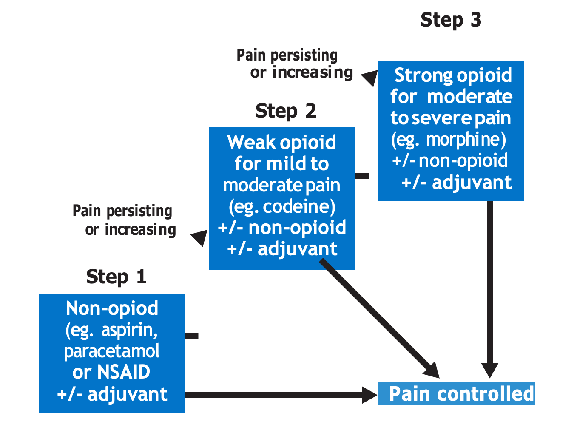

############ 13.1.2.1 Pain Management In Adults

|ANALGESICS|COMMENTS|
|---|---|
|STEP 1: MILD PAIN (NON-OPIOID ± ADJUVANTS)|STEP 1: MILD PAIN (NON-OPIOID ± ADJUVANTS)|
|‰ Paracetamol 1 g every 6  hours (500 mg in elderly) ‰ And/or ‰ Ibuprofen 400 mg every  6- 8 hours (max ‰ 2,400 mg/daily) or ‰ Diclofenac 50 mg every  8 hours|ƒ Continue with step 1 analgesics when moving to step 2 and 3  ƒ Prolonged use of high doses of paracetamol may cause liver toxicity  ƒ Do not use NSAIDS in  renal impairment ƒ Caution when using NSAIDS for more than 10 days|

Uganda Clinical Guidelines 2023CHAPTER 13:Palliative Care

########################## Uganda Clinical Guidelines 2023CHAPTER 13:Palliative Care

|ANALGESICS|COMMENTS|
|---|---|
|STEP 2: MODERATE PAIN (WEAK OPIOID ± NON-OPIOID ± ADJUVANT)|STEP 2: MODERATE PAIN (WEAK OPIOID ± NON-OPIOID ± ADJUVANT)|
|‰ Morphine 2.5-5 mg every 4 hours during day, double dose at night  ‰ Or ‰ Codeine 30-60 mg  every 6 hours (max 240 mg)  ‰ Or ‰ Tramadol 50-100 mg  every 6 hours (max 400 mg)|ƒ Low dose morphine is considered step 2 analgesic and recomended first line if available  ƒ Discontinue step 2 analgesics when starting step 3  ‰ Give Bisacodyl 10-15 mg nocte to prevent constipation except if diarrhoea is present  ‰ Add liquid paraffin 10 ml once a day if Bisacodyl is not enough|
|STEP 3: SEVERE PAIN (STRONG OPIOID ± NON-OPIOID ± ADJUVANT|STEP 3: SEVERE PAIN (STRONG OPIOID ± NON-OPIOID ± ADJUVANT|
|‰ Morphine7.5-10 mg every 4 hours during day and double dose at night  ƒ If breakthrough pain, give equivalent additional dose ƒ Increase dose by ƒ 30-50% as required  to control patient’s pain  ƒ Give additional dose  30 minutes before an activity causing pain (e.g. wound dressing)|ƒ Elderly and renal impairment may require dose adjustment  ƒ Give Bisacodyl 10-15 mg nocte to prevent constipation except if diarrhoea is present  ƒ Add liquid paraffin 10 mL once a day if Bisacodyl not  enough  ‰ If modified release tablets are available, use the same 24-hour dose but given in 1 or 2 doses daily|

|Adjuvants ‰ Amitriptyline 12.5–25 mg nocte for neuropathic pain (max  50-75 mg if tolerated) ‰ Clonazepam 0.5-1 mg nocte for neuropathic pain (second line) ‰ Dexamethasone 4-8 mg once a day for swelling or oedema ‰ Hyoscine 20 mg every 6 hours for smooth muscle spasm ‰ Diazepam 5-20 mg nocte for painful skeletal muscle spasms|Adjuvants ‰ Amitriptyline 12.5–25 mg nocte for neuropathic pain (max  50-75 mg if tolerated) ‰ Clonazepam 0.5-1 mg nocte for neuropathic pain (second line) ‰ Dexamethasone 4-8 mg once a day for swelling or oedema ‰ Hyoscine 20 mg every 6 hours for smooth muscle spasm ‰ Diazepam 5-20 mg nocte for painful skeletal muscle spasms|
|---|---|
|Caution  ƒ Do not use pethidine for chronic pain; accumulates with severe side-effects on the gut. Only use as one off-dose for acute severe pain if morphine not available  ƒ Side effects of NSAIDS: gastritis, renal toxicity, bleeding, bronchospasm|Caution  ƒ Do not use pethidine for chronic pain; accumulates with severe side-effects on the gut. Only use as one off-dose for acute severe pain if morphine not available  ƒ Side effects of NSAIDS: gastritis, renal toxicity, bleeding, bronchospasm|
|ANALGESICS|COMMENTS|
|‰ Avoid amitriptyline in heart disease  ‰ Side effects of opioids: see sections 13.1.2.3| |

Uganda Clinical Guidelines 2023CHAPTER 13:Palliative Care

############ 13.1.2.3 Pain Management In Children

|ANALGESICS|COMMENTS|
|---|---|
|STEP 1: MILD PAIN (NON-OPIOID ± ADJUVANTS)|STEP 1: MILD PAIN (NON-OPIOID ± ADJUVANTS)|
|‰ Paracetamol 10-15 mg/kg every 6 hours And/or  ‰ Ibuprofen 5-10 mg/ kg every 6-8 hours (use only in children >3 months)|w Continue with step 1 analgesics when moving to step 2  w Prolonged use of high doses of paracetamol may cause liver toxicity|

########################## Uganda Clinical Guidelines 2023CHAPTER 13:Palliative Care

|ANALGESICS|COMMENTS|
|---|---|
|STEP 2: MODERATE AND SEVERE PAIN (OPIOID ± NON-OPIOID ± ADJUVANT)|STEP 2: MODERATE AND SEVERE PAIN (OPIOID ± NON-OPIOID ± ADJUVANT)|
|‰ Morphine every 4 hours  1-6 months: 0.01 mg/kg 6-12 months: 0.2 mg/kg  1-2 years: 0.2-0.4 mg/kg 2-12 years: 0.2-0.5 mg/ kg (max 10 mg) Increase the dose slowly, until pain is controlled Increase dose by max 50% every 24 hours |w Codeine and tramadol are  not used in children w Give Bisacodyl  (suppository only) 5 mg nocte to prevent constipation except if diarrhoea is present|
|Adjuvants ‰ Amitriptyline nocte for neu-  ropathic pain  ‰ Child 2-12 years: 0.2-0.5 mg/kg (max 1 mg/kg or 25 mg)  ‰ Or Carbamazepine 5-20 mg/ kg in 2-3 divided doses, increase gradually to avoid side effects (second line)  ‰ Prednisolone 1-2 mg/kg per  day ‰ Hyoscine ‰ 1 month-2 years: 0.5 mg/kg  every 8 hours  ‰ 2-5 years: 5 mg every 8 hours ‰ 6-12 years: 10 mg every 8  hours ‰ Diazepam for associated anxiety ‰ Child 1-6 years: 1 mg/day in 2-3 divided doses ‰ Child 6-14 years: 2-10 mg/ day in 2-3 divided doses| |

General principles in use of opioids ~ Health professionals specially trained in palliative care

should supervise management of chronic pain in advanced or incurable conditions (e.g., cancer, AIDS)

~ Morphine is usually the drug of choice for severe pain. Liquid morphine is available, easy to dose, and is well absorbed from the oral mucosae and can be dripped in the mouth of adults and children

~ In continuous pain, analgesics should be given: ‰ By the clock (i.e. according to a regular dose schedule) ‰ By the patient (i.e. self-administered) ‰ By the mouth (i.e. as oral dose forms) ~ Pain is better controlled using regular oral doses which

control pain. If pain is not controlled, increase the 24-hour dose by 30-50%

‰ Repeated injections are not indicated ~ Consider extra doses when painful procedure is planned

and for breakthrough pain. If using breakthrough doses regularly, then increase the regular dose!

~ Side effects are minor and well-manageable if careful dos-

ing and titration are done Cautions on use of opioids

Opioids need to be effectively managed and administered, considering the associated cautions and side effects below. r Do not use opioids in severe respiratory depression and

head injury

ƒ Use with care in the following conditions ƒ Advanced liver disease (but can be used in hepatocellular

carcinoma when titrated as above) ƒ Acute asthma ƒ Acute abdominal pain (can use while awaiting diagnostic tests;

never leave the patient in pain) ƒ Hypothyroidism

Uganda Clinical Guidelines 2023CHAPTER 13:Palliative Care

Uganda Clinical Guidelines 2023CHAPTER 13:Palliative Care

ƒ Renal failure (reduce starting dose and/or reduce dose

frequency) ƒ Elderly or severely wasted patient (reduce starting dose ƒ and/or reduce dose frequency) ƒ Use with extreme care (i.e., start with small doses and use

small incremental increases) in: ƒ Recurrent or concurrent intake of alcohol or other CNS ƒ depressants

############## Management of Side Effects of Opioids

|SIDE EFFECT|MANAGE AS:|
|---|---|
|Respiratory depression  ƒ Rarely occurs if small oral doses are used and gradually titrated to response ƒ Can occur when morphine used parenterally  ‰ Reverse respiratory depression using naloxone 0.4-2 mg slow  IV every 2-3 minutes according to response Child: 0.01 mg/kg slow IV; repeat 0.1 mg/kg if no response|Respiratory depression  ƒ Rarely occurs if small oral doses are used and gradually titrated to response ƒ Can occur when morphine used parenterally  ‰ Reverse respiratory depression using naloxone 0.4-2 mg slow  IV every 2-3 minutes according to response Child: 0.01 mg/kg slow IV; repeat 0.1 mg/kg if no response|
|Constipation|‰ Give Bisacodyl 10-15 mg nocte to prevent constipation except if diarrhoea is present Child: 5 mg rectally  ‰ Add liquid paraffin 10 ml once a day if bisacodyl is not enough|
|Nausea or Vomiting|‰ Usually occurs in first 5 days and is self-limiting ‰ Vomiting later on may be due to another cause ‰ Give anti-emetic (e.g. ‰ metoclopramide 10 mg ‰ every 8 hours for 3–5 days) Child 9-18 yrs: 5 mg 8 hourly Child 5-9 yrs: 2.5 mg 8 hourly Child 3-9 yrs: 2-2.5 mg 8 hourly Child 1-3 yrs: 1 mg 8 hourly Child <1 yr: 100 micrograms per kg every 12 hours|

|SIDE EFFECT|MANAGE AS:|
|---|---|
|Confusion or Drowsiness|‰ If excessive continuous drowsiness, titrate the opioid dose down slowly|

Referral criteria ~ If pain does not respond to above measures, refer to pal-

liative care specialist ~ Refer for radiotherapy at national referral hospital for severe bone pain not responding to above medications ~ Refer for surgery if the cause of pain is amenable to surgery

13.1.3 Neuropathic Pain

########### Neuropathic pain occurs as a result of damage to nerve tissue. There are two clinical kinds of neuropathic pain, both elements may be combined: ~ Stabbing-type: pain in a nerve distribution with minimal

pain in between (e.g. trigeminal neuralgia) but can occur with any nerve. Responds to Phenytoin

~ Paraesthesia dysaesthesiae, or burning-type pain: (e.g. post-herpetic neuralgia). Responds well to small doses of Amitriptyline

############## Management

|TREATMENT|LOC|
|---|---|
|Trigeminal neuralgia or stabbing-type pain Acute phase ‰ Carbamazepine initially 100 mg every 12 hours  ƒ Increase gradually by 200 mg every 2-3 days  according to response, max 1200 mg ƒ Causes white cell depression|HC3|
|Burning type pain (post-herpetic neuralgia, diabetic neuropathy) ‰ Amitriptyline 12.5-25 mg at night or every ‰ 12 hours depending on response, max 50-75 mg|HC3|

Uganda Clinical Guidelines 2023CHAPTER 13:Palliative Care

Uganda Clinical Guidelines 2023CHAPTER 13:Palliative Care

- 13.1.4 Back or Bone Pain

Includes pain in the lumbar region of the spine or bone pain anywhere within the body. Causes Potential causes of back or bone pain: ~ Disc degeneration (often has a neuropathic element be-

cause of pressure on sciatic or other nerve) ~ Osteoporosis (if collapse of vertebrae or fracture) Infection (e.g. TB, brucellosis, PID, retroperitoneal) ~ Metastatic cancers, renal disease ~ Strain ~ Congenital abnormalities ~ Spondylolisthesis

Clinical Features Each situation will differ depending on the cause of the pain ~ If an infection is present: throbbing and constant pain ~ If sciatica, sciatic nerve roots will be involved

############## Investigations

 Try to establish the cause and type of pain  X-ray: Spine and pelvis

Management of Back or Bone Pain

|TREATMENT|LOC|
|---|---|
|Analgesics ‰ Analgesics (see section 13.1.2 above)  ƒ Give a Step 1 drug for 7 days or as long as required according to patient ƒ NSAIDs are the Step 1 drug of choice in bone pain ƒ May have to add a Step 2 or 3 drug, especially in metastatic disease|HC4|

|TREATMENT|LOC|
|---|---|
|For acute back pain: ‰ Rest the back on a firm but not hard surface For neuropathic element:  ‰ Manage as for neuropathic pain above|HC4|

13.2 OTHER CONDITIONS IN PALLIATIVE CARE In palliative care, other conditions that are commonly encountered are summarised in the table below.

- 13.2.1 Breathlessness ICD10 CODE: R06

########### Due to palliative care conditions or anxiety Management

|TREATMENT|LOC|
|---|---|
|Non-drug treatment ‰ Reassure patient; explore patient’s fears and anxieties;  anxiety worsens condition  ‰ Breathing exercises and relaxation techniques; teach patient how to slow down breathing by pursing their lips and breathe with diaphragm rather than chest  ‰ Pulmonary rehabilitation ‰ Position patient in most comfortable position in bed ‰ Ensure good ventilation (e.g., open windows, use fans,  loosen tight clothing) ‰ Conserve energy (e.g., encourage exertion to breathlessness) ‰ Refer if symptoms persist, in airway obstruction, or  need for pleurodesis Medicines ‰ Oral morphine 2.5-5 mg every 4 hours. Oxygen  if patient is hypoxic. Diazepam if patient is anxious ƒ Diazepam 2.5-5 mg orally; once a day if  breathlessness is associated with panic attacks|HC2  HC4|

Uganda Clinical Guidelines 2023CHAPTER 13:Palliative Care

Uganda Clinical Guidelines 2023CHAPTER 13:Palliative Care

############ 13.2.2 Nausea and Vomiting ICD10 CODE: R11Can be due to disease or medicinesManagement

|TREATMENT|LOC|
|---|---|
|‰ Treat the cause ‰ Vomiting typically relieves nausea If due to gastric stasis or delayed bowel transit time ‰ Give metoclopramide 10–20 mg every 8 hours (30  minutes before meals; same dose SC or IV)  If due to metabolic disturbance (liver/renal failure, medicines e.g., chemotherapy)  ‰ Give haloperidol 1.25 -2.5 mg nocte (PO or SC)  If due to raised intracranial pressure ‰ Dexamethasone 8-16 mg od ‰ If due to visceral stretch or compression f Promethaz-  ine 25 mg every 8 hours or f Hyoscine butylblomide 20-40 mg 8 hourly|HC4 HC4 H  HC3 HC4|

############ 13.2.3 Pressure Ulcer (Decubitus Ulcers) ICD10 CODE: L89

Ulcer of the skin and/or subcutaneous tissue caused by ischaemia secondary to extrinsic pressure or shear

############## Management

|TREATMENT|LOC|
|---|---|
|‰ Non-drug treatment f Debridement of necrotic tissue ‰ Clean with normal saline ‰ If able, encourage patients to raise themselves off the  seat and shift their weight every 15-20 minutes or to take short walks|HC3|

|TREATMENT|LOC|
|---|---|
|‰ Repositioning of those who cannot move themselves  frequently, determined by need and skin status ‰ Inspect skin every time the patient’s position is changed ‰ Maintain optimal hydration and hygiene of skin ‰ Avoid trauma, by not dragging patient ‰ Good nutrition for those with good prognosis to maintain  normal serum albumin  ‰ Educate patient caretakers on risk factors for developing pressure ulcers, how to inspect and care for skin, and inform health care professional  ‰ May need skin grafting and flaps; refer to hospital|HC3|
|Medicines ‰ Give antibiotics if there is evidence of surrounding cellulitis (see  section 22.1.3) ‰ Control pain ‰ Control odour with topical metronidazole ‰ powder or gel until there is no foul smell ‰ If patient has sepsis, give parenteral antibiotics (see section 2.1.7  for treatment of sepsis)|Medicines ‰ Give antibiotics if there is evidence of surrounding cellulitis (see  section 22.1.3) ‰ Control pain ‰ Control odour with topical metronidazole ‰ powder or gel until there is no foul smell ‰ If patient has sepsis, give parenteral antibiotics (see section 2.1.7  for treatment of sepsis)|

Uganda Clinical Guidelines 2023CHAPTER 13:Palliative Care

############ 13.2.4 Fungating WoundsManagement

|TREATMENT|LOC|
|---|---|
|‰ Treat underlying cause ‰ Clean the wound regularly every day with 0.9% saline  (or dissolve 1 teaspoon of salt per pint of cooled boiled water)  ‰ Apply clean dressings daily ‰ Protect the normal skin around the wound with barrier  creams (petroleum jelly) ‰ Give analgesia for pain|HC2|

- Uganda Clinical Guidelines 2023CHAPTER 13:Palliative Care

|TREATMENT|LOC|
|---|---|
|‰ If malodour/exudate: apply metronidazole powder daily  directly to the wound when changing dressing ‰ If cellulitis, give appropriate antibiotic| |

- 13.2.5 Anorexia and Cachexia ICD10 CODE: R63.0 AND R64

########### Anorexia is loss of desire to eat. Cachexia is a complex metabolic syndrome, characterized by profound loss of lean body mass, in terminal illnesses.

Causes ~ Nausea and vomiting, constipation, gastrointestinal ob-

struction ~ Sore mouth, mouth tumours, malodour ~ Hypercalcaemia, hyponatraemia, uraemia, liver failure ~ Medications ~ Depression

############## Management

|TREATMENT|LOC|
|---|---|
|‰ Treat underlying causes if possible. ‰ In cancer patients, give corticosteroids for one week  only, under supervision of specialist  ƒ Prednisolone 15-40 mg once a day for 7 days ƒ Or dexamethasone 2-6 mg in the morning for 7  days Non-medicine treatment ‰ Small amounts of food frequently ‰ Give energy-dense food, and limit fat intake ‰ Avoid extremes in taste and smell ‰ Pleasant environment, nice presentation of food|HC4|

|TREATMENT|LOC|
|---|---|
|‰ Eating is a social habit and people eat better with others ‰ Nutritional counselling ‰ If prognosis <2 months, counsel patient and family to  understand and adjust to reduced appetite as a normal disease process| |
|Caution  ƒ In established cancer and cachexia, aggressive parenteral and enteral nutritional supplementation is of minimal value| |

- 13.2.6 Hiccup ICD10 CODE: R06.6

Repeated involuntary spasmodic diaphragmatic and inspiratory intercostal muscle contractions. Hiccups up to 48 hours are acute, those lasting more than 48 hours are persistent and more than 2 months are intractable.

Causes ~ Gastric distension, GERD, gastritis, diaphragmatic irrita-

tion by supraphrenic metastasis, phrenic nerve irritation ~ Metabolic: uraemia, hypokalaemia, hypocalcaemia, hyper-

glycaemia, hypocapnia ~ Infection: oesophageal candidiasis ~ Brain tumour, stroke, stress Management

|TREATMENT|LOC|
|---|---|
|‰ Most hiccups are short-lived and self-limiting ‰ Treat underlying cause|HC2|

Uganda Clinical Guidelines 2023CHAPTER 13:Palliative Care

Uganda Clinical Guidelines 2023CHAPTER 13:Palliative Care

|Non-medicine treatment ‰ Direct stimulation of the pharynx by swallowing dry  bread or other dry food ‰ Stimulation of vagus nerve by ingesting crushed ice or  valsalva manouvre ‰ Rapidly ingest 2 heaped teaspoons of sugar ‰ Indirect stimulation of the pharynx ‰ – C3-5 dermatome stimulation by tapping or rubbing  the back of the neck| |
|---|---|
|‰ Refer if hiccups persist or are intractable ‰ Medicines ‰ For persistent or intractable hiccups use: ‰ Metoclopramide 10 mg 8 hourly (if the cause is gastric  distension)  ‰ Or Haloperidol 2–5 mg once a day ‰ Or chlorpromazine 25 mg 6 hourly|HC4 HC3|

############ 13.2.7 Dry or Painful Mouth ICD10 CODE: R68.2

Dry mouth, painful mouth and mouth ulcers are caused by infections, drugs, chemotherapy, trauma, dryness, radiotherapy, HIV and opportunistic infections.

|TREATMENT|LOC|
|---|---|
|Non-medicine treatment ‰ Mouth wash with salted water (hourly), frequent sipping  to keep mouth moist ‰ Brush teeth and tongue at least 3 times a day ‰ Suck fresh cold pineapple cubes once or twice daily ‰ Avoid sugary foods and drinks, eat soft food ‰ Apply vaseline to cracked lips ‰ Review medications (dry mouth can be a side effect,  e.g. of amitriptyline)|HC2|

|TREATMENT|LOC|
|---|---|
|Treat appropriate infection: ‰ Candidiasis with fluconazole 200 mg od for 7 days ‰ Herpes simplex with oral acyclovir 200 mg, 5 times a  day for 5–10 days depending on severity| |
|‰ Anaerobic gingivitis, halitosis, with metronidazole mouthwash (mix 50 mL of IV metronidazole with 450 mL of water, plus 50 mL of juice)  Severe mucositis or aphtous ulcers ‰ Consider steroids dexamethasone 8 mg once daily for  5 days ‰ Analgesic gel (Bonjela, Oracure) on ulcers Painful mouth ‰ Oral liquid morphine as above (before swallowing, hold  liquid morphine in the mouth for at least 30 seconds)|HC3 HC4 HC3 |

############ 13.2.8 Other Symptoms

|TREATMENT|LOC|
|---|---|
|Anxiety and muscle spasm ‰ Diazepam 5-10 mg once a day, titrated to three times  a day|HC2|
|Excessive bronchial secretions ‰ Hyoscine 20 mg once a day titrated to 3 times a day  according to response|HC4|
|Intractable cough ‰ Morphine as above (see section 13.1.2)|HC3|

########### 13.2.9 End of Life CareCare in the last days of life.

Uganda Clinical Guidelines 2023CHAPTER 13:Palliative Care

Uganda Clinical Guidelines 2023CHAPTER 13:Palliative Care

ClinicalF eatures Clinical signs at of end of life include (should be considered in those with terminal conditions who have been gradually deteriorating): ~ Patient becomes bed-bound and is increasingly drowsy or

in a semi-conscious state ~ Minimal oral intake; patient not managing oral medication and only able to take sips of fluid ~ The patient’s condition is deteriorating rapidly (e.g. day by

day or hour by hour) ~ Breathing becomes irregular +/- noisy (death rattle) ~ Changes in skin colour and/ or temperature ~ Limited attention span

############## Investigations

 Exclude reversible problems (e.g. drug toxicity, infections, dehydration, biochemical abnormalities)  Before ordering a test, always ask ”will this test change my management plan or the outcome for the patient?”

 It is important to weigh the benefit versus the burden in assessing an intervention, and/or management plan based on the clinical features exhibited by the patient

Management

|TREATMENT|LOC|
|---|---|
|General principles of medicine treatment ‰ Focus on giving medication that will improve the pa-  tient’s quality of life ‰ Treat symptoms of discomfort as in sections above ‰ If the patient is unable to swallow choose an appropriate  route to give necessary medications (e.g., via NG tube, parenteral or rectally)  ‰ Subcutaneous (SC) is recommended when the enteral route is not possible. It is preferred over IV and IM access due to its reduced trauma and pharmacokinetics|HC2|

|TREATMENT|LOC|
|---|---|
|‰ If repeated injections are anticipated or experienced, a butterfly needle can be inserted and used as a route for regular SC injections  ‰ Consider prescribing medications pre-emptively (anticipatory) to combat developing symptoms  ‰ Morphine concentrations can vary depending on the preparation used; remember that SC morphine has twice the potency of oral morphine| |
|Hydration and nutrition ‰ Patients should eat and drink as they wish, and take  sips of water as long as they are able  ‰ Families should be educated that it is normal for patients to lose their appetite, have a sense of thirst and stop feeding towards the end of life.  ‰ They should not feed patients if they are no longer able to swallow as this may cause choking and distress| |
|‰ IV fluids at this stage will not prolong life or prevent thirst. Over-hydration is discouraged as it may contribute to distressing respiratory secretions or generalised oedema; good regular mouthcare is the best way to keep the patient comfortable  ‰ IV dextrose for calorie supplementation is unlikely to be of benefit| |

|‰ If there is a reduced level of consciousness, patients should not be fed due to the risk of aspiration.  ‰ Artificial nutrition is generally discouraged at the end of life| |
|---|---|
|Supportive care  ‰ Keep the patient clean and dry ‰ Regularly clean the mouth with a moist cloth wrapped  round a spoon ‰ Prevent and manage pressure sores appropriately ‰ Manage any associated pain| |

########################## Uganda Clinical Guidelines 2023CHAPTER 13:Palliative Care

########################## Uganda Clinical Guidelines 2023CHAPTER 13:Palliative Care

|TREATMENT|LOC|
|---|---|
|‰ The end of life is an emotional time for all involved and requires health care professionals to be considerate and compassionate. Take time to listen to the concerns of the patient and their family; break bad news sensitively  ‰ Encourage the family to be present, holding a hand or talking to the patient even if there is no visible response; the patient may be able to hear even if they cannot respond  ‰ Consider spiritual support ‰ Consider the best place of death for the patient and their  family; would discharging them to go home be best?| |

# Gynecological Conditions14

#### 14.1.1 DYSMENORRHOEA ICD10 CODE: N94.6

Abdominal pain that occurs just before or during menstruation. Symptoms begin about 12 hours before onset of menses and last for 1–3 days.

Primary dysmenorrhoea occurs more commonly among adolescents and young women. Symptoms usually begin 6–12 months after menarche and occur mainly with ovulatory cycles. Generally, severity of symptoms decreases with age, sexual activity and child birth.

Secondary dysmenorrhoea is usually due to a gynaecological condition such as infection or fibroids, and usually occurs in older women above 30 years.

Causes of primary dysmenorrheaoa ~ Not known Causes of secondary dysmenorrhoea

~ Pelvic inflammatory disease ~ Endometriosis ~ Uterine fibroids

Clinical features ~ Lower abdominal cramping ~ Backache, headache ~ Nausea, vomiting, diarrhoea, fainting, fever, fatigue, diz-

ziness

Uganda Clinical Guidelines 2023CHAPTER 14:Gynecological Conditions

- Uganda Clinical Guidelines 2023CHAPTER 14:Gynecological Conditions

Differential diagnosis ~ Endometriosis ~ Other causes of lower abdominal pain

Management

|TREATMENT|LOC|
|---|---|
|Non-pharmacological ‰ Encourage the patient to rest or sleep ‰ Encourage the patient to do some exercises ‰ Advise the patient to apply a warm compress to the  abdomen ‰ Encourage the patient to wear loose fitting clothes ‰ Advise the patient to have a diet low in fats and supple-  ments such magnesium, vitamin B1, vitamin E and zinc ‰ Pharmacological ‰ Give NSAIDs e.g. ibuprofen 200–400 mg every 8 hours  as required  ‰ Other medications include paracetamol 1 g every 6 hours (in case of mild pain); or diclofenac 50 mg every 8 hours for severe forms  ‰ Review the patient after 5 days and if no response or  if recurrent, refer for specialist management ‰ In secondary dysmenorrhoea, treat cause e.g. PID ‰ with antibiotics|HC2  HC2 HC4|

14.1.2 Pelvic Inflammatory Disease (PID) ICD10 CODE: N70-N73

########### Infection (usually ascending from the vagina) occurring in the uterus, ovary, or uterine tubes and leading to salpingitis, endometritis, pelvic peritonitis or formation of tubal ovarian abscess.

Risk factors ~ Previous pelvic inflammatory disease infections

~ Presence of bacterial vaginosis ~ Multiple or new sexual partners History of STIs in the patient or her partner

~ History of abortion ~ Young age of less than 25 years ~ Postpartum endometritis Causes ~ Often due to multiple pathogens: Neisseria gonorrhoea,

Chlamydia trachomatis, Mycoplasma, Gardnerella, Bacteroids, Gram-negative bacilli, e.g. Escherichia coli

Clinical features ~ Pain in lower abdomen (usually <2 weeks) PLUS ~ Dysuria, fever ~ Vaginal discharge: could be smelly and mixed with pus ~ Painful sexual intercourse (dysperunia) ~ Cervical motion tenderness: vaginal examination will pro-

duce tenderness when the cervix is moved ~ Abnormal uterine bleeding If severe ~ Swellings may be felt if there is pus in the tubes or pelvic

abscess ~ Signs of peritonitis (rebound tenderness) Complications of PID

~ Infertility ~ Ectopic pregnancy ~ Chronic pelvic pain

Uganda Clinical Guidelines 2023CHAPTER 14:Gynecological Conditions

Uganda Clinical Guidelines 2023CHAPTER 14:Gynecological Conditions

|Do Not Treat Chronic Pelvic Pain With Antibiotics|
|---|

Differential diagnosis ~ Ectopic pregnancy, threated abortion ~ Ovulation pain ~ Acute appendicitis ~ Complicated or twisted ovarian cyst ~ Cancer of the cervix Investigations

 Speculum examination  Pregnancy test  Pus swab: For C&S. Thespeculum protects the sampling item;

sample is from endocervix, aspirate from endometrial cavity/ curretings or an aspirate through the posterior pouch

 Ultrasound (if available) for detection of tubo ovarian masses,

free fluid, peritonitis Management

|TREATMENT|LOC|
|---|---|
|Treatment is based on a combination of medicines that cover the multiple microorganisms involved. Outpatient treatment ‰ Ceftriaxone 250 mg IM (or cefixime 400 mg stat if  ceftriaxone is not available)  ‰ Plus doxycycline 100 mg orally every 12 hours for 14 days ‰ Plus metronidazole 400 mg twice daily orally for 14 days ‰ Treat sexual partners as for urethral discharge syndrome  to avoid re-infection| |

|TREATMENT|LOC|
|---|---|
|‰ In pregnancy, use erythromycin 500 mg every 6 hours  for 14 days instead of doxycycline ‰ If severe or not improving after 7 days ‰ Refer for ultrasound scan and parenteral treatment ‰ Ceftriaxone 1 g IV daily plus metronidazole 500 mg IV  every 8 hours until clinical improvement, ‰ then continue oral regimen as above|HC3 HC4|
|Notes  ƒ All women with PID should be tested for HIV ƒ Abstain from sex or use barrier methods during the  course of treatment ƒ Do not take alcohol when taking metronidazole ƒ Avoid sex during menstrual period and for 6 weeks  after an abortion| |
|ƒ In IUD users with PID, the IUD need not be removed. However, if there is no clinical improvement within 48–72 hours of initiating treatment, providers should consider removing the IUD and help patient choose an alternative contraceptive method (see chapter 15)|ƒ In IUD users with PID, the IUD need not be removed. However, if there is no clinical improvement within 48–72 hours of initiating treatment, providers should consider removing the IUD and help patient choose an alternative contraceptive method (see chapter 15)|

14.1.3 Abnormal Uterine Bleeding ICD10 CODE: N39.9

########### Any vaginal bleeding which represents a variation from the normal pattern of regular menstruation.

############## Causes

~ Hormonal abnormalities (ovulatory dysfunction) ~ Abortion, ectopic pregnancy ~ Uterine diseases (fibroids, polyps etc) ~ Cancers (cervical, uterine, rarely vaginal) ~ Infections (STIs) ~ Others (coagulation disorders etc.)

~ Iatrogenic (IUD, hormonal contraceptives)

Uganda Clinical Guidelines 2023CHAPTER 14:Gynecological Conditions

Uganda Clinical Guidelines 2023CHAPTER 14:Gynecological Conditions

Clinical features ~ Abnormal menstrual pattern ~ Continuous or subcontinuous bleeding ~ It can be acute and heavy or light and subcontinuous

############## Investigations

 Pregnancy test to exclude abortion and pregnancy  Haemoglobin level  Vaginal examination (for cervical and vaginal abnormalities

e.g., cervical cancer)  Abdominal ultrasound Management

Management is based on the possible cause.

|CAUSE/ISSUE|TREATMENT|LOC|
|---|---|---|
|General measures|Ferrous sulphate or Fefol 1 tablet once or twice a day|HC2|
|Positive pregnancy test|See section on abortion and ectopic pregnancy (chapter 16)|HC4|
|Bleeding in postmenopausal woman|Refer for specialist assessment (possible endometrial pathology)|RR|
|Lesion (ulcer, growth) in vagina/on cervix|Refer for specialist assessment|RR|
|Suspect fibroid (bulky hard uterus)|Use analgesics, iron supplement, refer for ultrasound scan|H|
|Other signs of infection|Treat as PID and review|HC3|
|Women on family planning|See sections on FP methods and side effects (chapter 15)|HC2|

14.1.4 Menopause ICD10 CODE: Z78.0

Menopause is the cessation of menstruation in a female and usually spontaneously occurs at the age of 45-55 years. Peri- menopause is the time around menopause and can last a few years until the menopause has set in.

Menopause can also be caused by surgical removal of ovaries. Clinical features ~ “Hot flushes” (sudden unanticipated, unpleasant wave of

body heat; can range from mild to intense) ~ Night sweats, palpitations, headaches, insomnia, tiredness ~ Irregular menstruation till cessation ~ Vaginal atrophy and dryness, loss of libido, painful inter-

course ~ Bladder irritability, incontinence, UTIs ~ Weight gain (sometimes) ~ Skin changes: dryness, thinning, loss of head hair, in-

crease or loss of body hair) ~ Mood swings, emotional changes (e.g. depression, irrita-

bility, short temperedness, weepiness) ~ Lack of concentration, failing memory ~ Osteoporosis, denture problem ~ Investigations ~ Exclude pregnancy Management

|TREATMENT|LOC|
|---|---|
|Non-pharmacological ‰ Explain process of menopause to the patient and reas-  sure her it is normal ‰ Suggest lifestyle adjustment| |
|ƒ Follow a healthy diet ƒ Sleep and exercise enough ƒ Wear loose light clothing| |

Uganda Clinical Guidelines 2023CHAPTER 14:Gynecological Conditions

########################## Uganda Clinical Guidelines 2023CHAPTER 14:Gynecological Conditions

|TREATMENT|LOC|
|---|---|
|ƒ Avoid alcohol ƒ Diet low in fats, high in fruit and vegetables ƒ Food rich supplements such as magnesium, vitamin  B1, vitamin E and zinc  ‰ Calcium-rich food (or supplements) such as milk and soya beans and vitamin D supplements|HC2|
|‰ Screen for CVD (hypertension, heart disease) and urine incontinence  ‰ For severe symptoms (severe hot flushes, depression) consider  ƒ Fluoxetine 20 mg daily NB: URGENTLY REFER ANY MENOPAUSAL WOMAN WITH VAGINAL BLEEDING FOR FURTHER ASSESSMENT|HC4 RR|

# Family Planning (FP)15

For further detailed information on Family Planning (FP) and Maternal Health, please refer to “Procedure Manual for Family Planning and Maternal Health Service Delivery MOH, 2016”.

Family planning is a basic human right for an individual and couples to exercise control over their fertility, make informed decision on the number of children they want to have, plan pregnancies, and the space between pregnancies.

FP has health benefits for the mother and the children and economic benefits for the family and the country at large.

15.1 Key steps to be followed in provision of fp services

Icd10 code: z10.0

- 1. Provide information about FP, including preconception care to different groups
- 2. Counsel clients at high risk of unwanted pregnancies to accept/ use FP services
- 3. Counsel clients to make informed choice of FP methods, including dual methods
- 4. Obtain and record client history
- 5. Perform a physical assessment
- 6. Perform a pelvic examination
- 7. Screen for cervical cancer and HIV
- 8. Manage client according to chosen FP method

Uganda Clinical Guidelines 2023CHAPTER 15:Family Planning (FP)

- Uganda Clinical Guidelines 2023CHAPTER 15:Family Planning (FP)

############ 15.1.1 Provide Information about FP including Pre-Conception-Care to Different Groups

The procedures used here are also used in the next step to recruit clients for FP and maternal health services in young child, antenatal, labour and delivery wards, outpatients, outreach, and postpartum clinics and in providing education on specific chosen FP methods.

The objective is to: ~ Create awareness ~ Disseminate correct information to influence people to

change beliefs, attitudes and practices ~ Recruit new clients and offer several FP methods

############ 15.1.2 Counsel High-Risk Clients

Risk factors to look out for in clients include: ~ Recent delivery/abortion ~ >4 pregnancies ~ >35 years old or <20 years old ~ Complicating medical conditions (e.g., diabetes, heart

disease) ~ People living with HIV/AIDS ~ Having children with birth interval <2 years ~ Poor obstetric history, which is likely to recur in future

pregnancies (e.g., postpartum haemorrhage, pre- eclampsia)

Identify eligible women (non-pregnant) while conducting clinics such as: ~ Young child clinics and paediatric wards ~ Maternity and postnatal clinics and wards ~ Outpatient clinics

~ Youths and Adolescent centers ~ HIV/AIDS care centers/ ART clinics ~ Sexual Reproductive Health clinics (e.g. Cervical cancer,

Post abortion care, Adolescent/Youth clinics) ~ Male clinics ~ Gender based violence clinics/ corners You can also identify the eligible women while: ~ Conducting outreaches (Immunisation or Home visits)

|Discuss with clients about reproductive choices and risk factors. Give special consideration to first time parents and adolescents in provision of appropriate information on sexuality, family planning and family planning services: types, benefits, availability and procedures.|
|---|

- 15.1.3 Pre-Conception Care with Clients Who Desire to Conceive

Pre-conception care discussion topics for clients who desire to conceive include:

~ Pregnancy planning and appropriate contraception ~ Folic acid supplementation 3 months preceeding concep-

tion ~ Good diet, risk assessment and management of pre existing conditions and risk factors ~ Benefits of preconception care (e.g., prevention of unin-

tended pregnancies, good maternal and foetal outcomes) ~ Screening for hereditary diseases e.g., sickle cell disease ~ Screening for STI, including HIV and hepatitis

Uganda Clinical Guidelines 2023CHAPTER 15:Family Planning (FP)

Uganda Clinical Guidelines 2023CHAPTER 15:Family Planning (FP)

############ 15.1.4 Discuss with PLW HIV Special Consideration for HIVTransmission

Key areas for discussion include: ~ Prevention of HIV transmission to spouse and child ~ Safer sexual practices and safe conception ~ Education/counseling about perinatal transmission risk ~ Initiation or modification of ART considering toxicity ~ Evaluation of opportunistic infections and offering umma-

rizedn

~ Some ARV drugs may interact and reduce the effect of hormonal contraceptives. It is always ummarize to use additional barrier methods (condoms), which also prevent STIs.

############ 15.1.5 Educate and Counsel Clients to Make Informed Choice ofFP Method

The primary objectives are:

- 9. To dispel any rumours and misconceptions about FP
- 10. To help the client make a voluntary informed choice Procedure

~ Prepare the room/materials needed, ensuring privacy ~ Assess client’s knowledge and experience of FP methods ~ Explain about different FP methods available

‰ Type ‰ Mechanism of action and method of use ‰ Advantages and disadvantages ‰ Indications ‰ Contraindications ‰ Side-effects

‰ Complications/warning signs ‰ Check understanding ‰ Help client choose appropriate method using family

planning medical eligibility criteria wheel (see summary of wheel in section 15.1.10 below)

~ Explain next steps needed

############ 15.1.6 Obtain and Record Client History

The primary objectives are: ~ To obtain client’s personal and social data and information

on health status ~ To identify abnormalities/problems requiring treatment or referral

For FP clients, it is important to pay particular attention to information outlined in the table below:

|HISTORY|INFORMATION NEEDED|
|---|---|
|Social History|~ Smoking? How many ummarized per day?  ~ Drinking? How much alcohol per day?|
|Family Health History|~ Diabetes mellitus, high blood pressure, asthma, heart disease|
|Personal Medical History|~ Excessive weight gain/loss (+/- 5 kg/ year)  ~ Severe headaches (relieved by analgesics?)  ~ Growth on neck (enlarged thyroid)  ~ Current or past diseases: asthma, cardiac disease, high BP, diabetes mellitus, mental illness, epilepsy, thrombophlebitis, varicose veins, unilateral pain in thighs or calves, chronic anaemia (e.g. sickle-cell anaemia), liver disease/jaundice in the last 6 months or during pregnancy|

Uganda Clinical Guidelines 2023CHAPTER 15:Family Planning (FP)

########################## Uganda Clinical Guidelines 2023CHAPTER 15:Family Planning (FP)

|HISTORY|INFORMATION NEEDED|
|---|---|
| |~ TB (on treatment?) ~ Allergies ~ Any medicines being taken and rea-  son|
|Surgical History|~ Any previous or planned operations ~ Where and when operation was per-  formed, or is to be performed|
|Reproductive History|~ Total pregnancies ~ Number and sex of live children ~ Number of abortions/ miscarriages ~ Number of children who died ~ Age of youngest child ~ Type of delivery for her children ~ Any problems in previous pregnancy  or deliveries ~ Number of children desired ~ When does she wish to have next  child ~ Whether breastfeeding|
|Menstrual History|~ Age at onset of menstruation ~ Length of cycles ~ Periods regular or not? ~ Number of days and amount of blood  loss ~ Bleeding after intercourse ~ Date and length of last normal period|

|HISTORY|INFORMATION NEEDED|
|---|---|
|Gynaecological History|~ Vulval sores or warts ~ PID and STI? If yes, which one, wasit  treated and when? ~ Lower abdominal pain ~ Offensive vaginal odour/discharge ~ Pain during intercourse ~ Pain on urination ~ Bleeding between periods|
|Family Planning History|~ How/where first learned about FP ~ Whether new to FP, or used FP before ~ If used before, which method used ~ Age when started using FP|
| |Last FP method used: ~ Duration of using each FP method  used ~ Reasons for discontinuation of FP ~ Currently preferred method|
|Inform Client|~ If chosen method seems suitable or contraindicated  ~ Explain that physical assessment will  confirm suitability of this method ~ Next steps needed|

15.1.7 Perform a Physical Assessment ~ Assess general health status ~ Examine client from head to toe

############# - Especially, look out for alopecia, acne, chloasma, hirsuitism,

Uganda Clinical Guidelines 2023CHAPTER 15:Family Planning (FP)

- Uganda Clinical Guidelines 2023CHAPTER 15:Family Planning (FP)

jaundice, anaemia, enlarged glands, goitre

- - Pay particular attention to breasts (e.g. lumps) and
- - abdomen (enlarged organs, e.g., liver, uterus)

############ 15.1.8 Perform a Pelvic Examination

The following areas need to be investigated: ~ Inspect external genitalia ~ Perform speculum examination ~ Perform cancer cervix screening (VIA, VILI, Pap smear) ~ Perform bimanual examination to determine size of uterus

for comparison later ~ Share findings with the client in simple language ~ Explain next steps needed ~ Advise on when to have next examination (e.g., routine,

annual, follow-up, if problems)

############# 15.1.9 Manage Client for Chosen FP Method~ Take and record client’s BP and weight~ Take and record client’s history

~ Use the table at in the following section 15.1.10 to quickly assess suitability of method considered

~ Provide suitable method, and ensure client understands fully how the method works, and how any medicine for home use is to be taken

~ Advise client on any potential problems with the chosen method and when to immediately return

~ Discuss management of any serious side-effects and complications

~ Arrange for client to return for routine follow-up, and for additional FP supplies

- 15.1.10 Summary of Medical Eligibility for Contraceptives

The tables below contain a ummarized version of the medical eligibility criteria for initiating a patient on contraceptive methods, based on the MOH (2016) and WHO (2020) Medical Eligibility Criteria for Contraceptive Use. It guides family planning providers in recommending safe and effective contraception methods for women with medical conditions or medially-relevant characteristics. For more detailed information, consult the above-named documents.

The tables below include recommendations on initiating use of common types of contraceptive methods:

- 1. Combined oral contraceptive pills (COC)
- 2. Progestogen only pills (POP)
- 3. Progestogen only injectable (POI) e.g., DMPA- IM/SC
- 4. Progestogen only implants (POIM)
- 5. Copper-bearing IUD (CuIUD)
- 6. LAM- Lactational amenorrhoea
- 7. Hormonal IUD
- 8. Condoms
- 9. Fertility Awareness Method (FAM) and standard days methods

######## Interpretation of eligibilty Y- Use method N- Do not use method Drug Interactions

|Drug|Contraceptives|Contraceptives|Contraceptives|Contraceptives|Contraceptives|
|---|---|---|---|---|---|
|Drug|Coc|Pop|Poi|Poim|Cuiud|
|Abacavir|Y|Y|Y|Y|Y|

Uganda Clinical Guidelines 2023CHAPTER 15:Family Planning (FP)

Uganda Clinical Guidelines 2023CHAPTER 15:Family Planning (FP)

|Drug|Contraceptives|Contraceptives|Contraceptives|Contraceptives|Contraceptives|
|---|---|---|---|---|---|
|Drug|Coc|Pop|Poi|Poim|Cuiud|
|Tenofovir|Y|Y|Y|Y|Y|
|Zidovudine|Y|Y|Y|Y|Y|
|Lamivudine|Y|Y|Y|Y|Y|
|Efavirenz|Y|Y|Y|Y|Y|
|Nevirapine|Y|Y|Y|Y|Y|
|Atazanavir/r|Y|Y|Y|Y|Y|
|Lopinavir/r|Y|Y|Y|Y|Y|
|Darunavir/r|Y|Y|Y|Y|Y|
|Raltegravir|Y|Y|Y|Y|Y|
|Dolutegravir|Y|Y|Y|Y|Y|
|Phenytoin|N|N|Y|Y|Y|
|Phenobarbital|N|N|Y|Y|Y|
|Carbamazepine|N|N|Y|Y|Y|
|Broad spectrum antibiotic|Y|Y|Y|Y|Y|
|Rifampicin|N|N|Y|Y|Y|
|Rifabutin|N|N|Y|Y|Y|

############## Medical Conditions and Patient Characteristics

|Condition|Contraceptives|Contraceptives|Contraceptives|Contraceptives|Contraceptives|
|---|---|---|---|---|---|
|Condition|Coc|Pop|Poi|Poim|Cuiud|
|Reproductive Tract Infections And Disorders|Reproductive Tract Infections And Disorders|Reproductive Tract Infections And Disorders|Reproductive Tract Infections And Disorders|Reproductive Tract Infections And Disorders|Reproductive Tract Infections And Disorders|
|Unexplained vaginal bleeding|Y|Y|N|N|N|
|Severe dysmenorrhoea|Y|Y|Y|Y|Y|
|Trophoblastic disease|Y|Y|Y|Y|N|

|Condition|Contraceptives|Contraceptives|Contraceptives|Contraceptives|Contraceptives|
|---|---|---|---|---|---|
|Condition|Coc|Pop|Poi|Poim|Cuiud|
|Uterine fibroids|Y|Y|Y|Y|Y|
|Cervical neoplasia|Y|Y|Y|Y|Y|
|Cervical cancer|Y|Y|Y|Y|N|
|Current pelvic inflammatory disease|Y|Y|Y|Y|Y|
|Post abortion sepsis|Y|Y|Y|Y|N|
|Breast cancer|N|N|N|N|Y|
|Liver Diseases|Liver Diseases|Liver Diseases|Liver Diseases|Liver Diseases|Liver Diseases|
|Acute hepatitis|N|Y|Y|Y|Y|
|Liver tumour|N|N|N|N|Y|
|Venous Thromboembolism (Vte E.g Dvt, Pe)|Venous Thromboembolism (Vte E.g Dvt, Pe)|Venous Thromboembolism (Vte E.g Dvt, Pe)|Venous Thromboembolism (Vte E.g Dvt, Pe)|Venous Thromboembolism (Vte E.g Dvt, Pe)|Venous Thromboembolism (Vte E.g Dvt, Pe)|
|History of VTE|N|Y|Y|Y|Y|
|Acute VTE|N|N|N|N|Y|
|Major surgery with prolonged immobilisation|N|N|Y|Y|Y|
|Cardiovascular Disease|Cardiovascular Disease|Cardiovascular Disease|Cardiovascular Disease|Cardiovascular Disease|Cardiovascular Disease|
|Ischaemic heart disease|N|Y|N|Y|Y|
|Stroke|N|Y|N|Y|Y|
|Multiple risk factors e.g. dyslipidaemias|Y|Y|Y|Y|Y|
|Hypertension, Obesity And Diabetes|Hypertension, Obesity And Diabetes|Hypertension, Obesity And Diabetes|Hypertension, Obesity And Diabetes|Hypertension, Obesity And Diabetes|Hypertension, Obesity And Diabetes|
|BP 140-159/90-99 or adequately controlled|N|Y|Y|Y|Y|
|BP ³160/99 mmHg|N|Y|N|Y|Y|
|BMI ³30 kg/m2| | | | | |

########################## Uganda Clinical Guidelines 2023CHAPTER 15:Family Planning (FP)

########################## Uganda Clinical Guidelines 2023CHAPTER 15:Family Planning (FP)

|Condition|Contraceptives|Contraceptives|Contraceptives|Contraceptives|Contraceptives|
|---|---|---|---|---|---|
|Condition|Coc|Pop|Poi|Poim|Cuiud|
|Diabetes (current)|Y|Y|Y|Y|Y|
|Diabetes with neuro-, retinal or nephropathy|N|Y|N|Y|Y|
|Smoker Age ³35|N|Y|Y|Y|Y|
|Smoker Age <35|Y|Y|Y|Y|Y|
|Headache|Headache|Headache|Headache|Headache|Headache|
|Non-migraine headache|Y|Y|Y|Y|Y|
|Migraine with aura (neurological symptom)|N|N|Y|Y|Y|
|Hiv And Stis|Hiv And Stis|Hiv And Stis|Hiv And Stis|Hiv And Stis|Hiv And Stis|
|HIV Clinical Stage 3 or 4|Y|Y|Y|Y|N|
|Gonorrhoea|Y|Y|Y|Y|Y|
|Chlamydia|Y|Y|Y|Y|Y|
|Other STIs and vaginalis|Y|Y|Y|Y|Y|
|Increased risk of STIs|Y|Y|Y|Y|Y|
|Postpartum And Breastfeeding|Postpartum And Breastfeeding|Postpartum And Breastfeeding|Postpartum And Breastfeeding|Postpartum And Breastfeeding|Postpartum And Breastfeeding|
|<48 hours|N|Y|N|Y|Y|
|48 hours to <4 weeks|N|Y|N|Y|N|
|4 weeks to <6 weeks|N|Y|N|Y|Y|
|6 weeks to <6 months (primary breastfeeding)|N|Y|Y|Y|Y|
|³6 months|Y|Y|Y|Y|Y|

|Condition|Contraceptives|Contraceptives|Contraceptives|Contraceptives|Contraceptives|
|---|---|---|---|---|---|
|Condition|Coc|Pop|Poi|Poim|Cuiud|
|Peurperal sepsis|Y|Y|Y|Y|N|
|Age And Pregnancy History (Parity)|Age And Pregnancy History (Parity)|Age And Pregnancy History (Parity)|Age And Pregnancy History (Parity)|Age And Pregnancy History (Parity)|Age And Pregnancy History (Parity)|
|Adolescents (menarche to age < 18 years)|Y|Y|Y|Y|Y|
|Nulliparity|Y|Y|Y|Y|Y|
|Parous|Y|Y|Y|Y|Y|
|Pregnancy|NA|NA|NA|NA|NA|

############## Notes on continuation

ƒ If venous thromboembolism develops while on hormonal

contraceptives, discontinue ƒ Refer for further management ƒ Recommend another none hormonal family planning method

############## Conditions where all methods can be used

|Category|Conditions|
|---|---|
|Repro- ductive|Benign breast disease or undiagnosed mass, benign ovarian tumours and cysts, dysmenorrhoea, endometriosis, history of gestational diabetes, history of high blood pressure during pregnancy, history of pelvic surgery including caeserean delivery, irregular, heavy prolonged menstrual bleeding (explained), past ectopic pregnancy, past pelvic inflammatory disease, post-abortion (no sepsis), postpartum (all methods except COCs which are given ³6 months)|
|Medical|Depression, epilepsy, HIV asymptomatic (WHO clinical stage 1 or 2), iron-deficiency anaemia, sickle-cell disease, thalassaemia, malaria, mild cirrhosis, schistosomiasis, superficial venous disorders including varicose veins,|

Uganda Clinical Guidelines 2023CHAPTER 15:Family Planning (FP)

Uganda Clinical Guidelines 2023CHAPTER 15:Family Planning (FP)

|Category|Conditions|
|---|---|
| |thyroid disorders, tuberculosis (non-pelvic), uncomplicated heart disease, viral hepatitis (carrier or chronic), cholecystitis, gall stones|
|Others|Adolescents, breast cancer family history, venous thromboembolism (VTE) family history, high risk for HIV, surgery  without prolonged immobilisation, taking antibiotics (except rifampicin or rifabutin)|

############## Methods all couples (except a few) can safely use

Emergency contraceptive pill (for emergency use only) Bilateral Tubal Ligation (BTL) and Vasectomy

Barrier methods (condoms, diaphragm) Lactational amenorrhoea method (LAM)

Fertility awareness (FAM) and Standard days methods

15.2 Overview Of Key Contraceptive Methods

The following sections contain an overview of mainstream contraceptive methods and how to manage side effects

of each (in case they occur). Side effects are one of most common reasons why women stop using contraception, and the health worker should be able to counsel the patient and address her concerns appropriately.

15.2.1 Condom (Male) ICD10 CODE: Z30.018/Z30.49 For example no-logo donation condoms, branded condoms. Indications

~ Couples needing an immediately effective method ~ Where this is preferred FP method by client ~ Couples waiting to rule out suspected pregnancy ~ Protection against exposure to STIs including HIV/AIDS

~ Where back-up method is needed, e.g. when womanis starting or has forgotten to take oral contraceptives

~ Couples where one or both partners have HIV/AIDS,

even if using another FP method Advantages ~ Male plays role in FP ~ Protects against unwanted pregnancy ~ Also protects against STIs and HIV infection Disadvantages ~ Some men may have difficulty maintaining an erection

with condom on ~ May cause insensitivity of the penis ~ Occasional hypersensitivity to latex or lubricants (may re-

sult in a severe allergic reaction) ~ Requires correct use with every act of sex for greatest ef-

############## fectiveness Management

|INSTRUCTIONS|LOC|
|---|---|
|~ Ensure client understands correct use, storage, and disposal of condom  ~ Supply at least 100 condoms to each client for three months, and if available, a water or silicone based lubricant  ~ Advise client to return for more before they are finished  ~ In case of hypersensitivity to latex or lubricants, avoid latex based condoms, and use the female condom or another FP method|HC2|

Uganda Clinical Guidelines 2023CHAPTER 15:Family Planning (FP)

Uganda Clinical Guidelines 2023CHAPTER 15:Family Planning (FP)

- 15.2.2 Condom (Female) ICD10 CODE: Z30.018/Z30.49

For example Femidom, Care and FC2. A soft plastic pre-lubricated sheath with an inner and outer ring which is inserted into the vagina before sexual intercourse. Indications

~ As for condoms (male) above ~ For women whose partners will not use male condom ~ Where the man has allergy/sensitivity to latex condom

Advantages ~ Woman-controlled (but requires partner’s cooperation) ~ Can be inserted hours before intercourse and so does not

interrupt sexual spontaneity ~ Not dependent on male erection and does not require im-

mediate withdrawal after ejaculation ~ Protects against STI and HIV infection ~ No special storage required

Disadvantages and Side-Effects ~ Requires special training and practice to use correctly ~ Relatively new product with limited public awareness ~ In some cases, hypersensitivity to polyurethane female

condoms occurs ~ Requires correct use with every act of sex for greatest ef-

############## fectiveness Management

|INSTRUCTIONS|LOC|
|---|---|
|‰ Ensure client understands correct use, storage, and disposal| |

|INSTRUCTIONS|LOC|
|---|---|
|‰ Supply at least 40 female condoms to each client per month  ‰ Advise client to return for more before they are finished ‰ In case of hypersensitivity, avoid use and change to  another FP method|HC2|

- 15.2.3 Combined Oral Contraceptive Pill (COC) ICD10 CODE: Z30.011/Z30.41

########### Contains an oestrogen plus a progestin, the types and quantities of which may vary in different preparations.

Indications ~ Women <35 years needing highly effective FP method ~ Non-breastfeeding clients, or breastfeeding clients after 6

months postpartum ~ Clients with dysmenorrhoea ~ Clients with heavy periods or ovulation pain ~ Clients concerned by irregular menstrual cycles

Contraindications ~ Diastolic BP >100 mmHg ~ Cardiac disease ~ Thromboembolic disease (e.g. deep vein thrombosis) ~ Active liver disease ~ Less than 6months after childbirth ~ When major surgery is planned within 4 weeks ~ Unexplained abnormal vaginal bleeding ~ Known/suspected cervical cancer Undiagnosed breast lumps or breast cancer ~ Pregnancy (known or suspected)

Uganda Clinical Guidelines 2023CHAPTER 15:Family Planning (FP)

- Uganda Clinical Guidelines 2023CHAPTER 15:Family Planning (FP)

############## Risk factors

If any 2 of the following, recommend progrestogen-only or non-hormonal FP method

~ Smoking (especially if >10 cigarettes/day) ~ Age >35 years ~ Diabetes

Advantages and other potential health benefits/uses ~ Protects against:

‰ Risk of unwanted pregnancy ‰ Cancer of the ovary or lining of uterus ‰ Symptomatic pelvic inflammatory disease ~ Reduces:

‰ Menstrual cramps and bleeding problems ‰ Ovulation pain ‰ Excess hair on body/face, acne ‰ Symptoms of polycystic ovarian syndrome

Disadvantages and common side effects ~ DOES NOT PROTECT AGAINST STIs ~ Spotting, nausea, and vomiting within first few months ~ Changes in bleeding patterns including: fewer days, irregu-

lar, lighter, infrequent, or no monthly bleeding ~ May cause headaches, dizziness, weight gain ~ Effectiveness dependent on regular daily dosage ~ Mood changes ~ Breast tenderness ~ Suppresses lactation ~ Medicine interactions reduce effectiveness including:

‰ Medicines which increase hepatic enzyme activity, e.g., rifampicin (especially), carbamazepine, griseofulvin, nevirapine, phenytoin, phenobarbital

- Short courses of some broad spectrum antibiotics, e.g., ampicillin, amoxicillin, doxycycline

|An additional FP method must be used during course of treatment with these medicines and for at least 7 days after completion.|
|---|

Complications and warning signs ~ Severe headaches, blurred vision ~ Depression ~ Acute severe abdominal pain ~ Chest pain plus dyspnoea (pulmonary embolism) ~ Swelling or pain in calf muscle (Deep vein thrombosis) Management

|INSTRUCTIONS|LOC|
|---|---|
|‰ Give 3 cycles of COC and explain carefully:  ƒ How to take the tablets ƒ Strict compliance is essential|HC2|
|ƒ What to do if doses are missed or there are side-  effects or warning signs If starting COC within 5 days of period ‰ Supply and show how to use back-up FP method ‰ Ask client to return when <7 tablets remain in last cycle| |
|MANAGEMENT OF SIDE EFFECTS OF COCS|MANAGEMENT OF SIDE EFFECTS OF COCS|
|Nausea ~ Assess for pregnancy and malaria|Nausea ~ Assess for pregnancy and malaria|

Uganda Clinical Guidelines 2023CHAPTER 15:Family Planning (FP)

########################## Uganda Clinical Guidelines 2023CHAPTER 15:Family Planning (FP)

|MANAGEMENT OF SIDE EFFECTS OF COCS|
|---|
|~ Suggest taking COCs at bedtime or with food ~ Take pill at same time daily If symptoms continue: ‰ Consider locally available remedies (e.g. eating roasted grains,  roasted cassava, boiled greens)|
|Breast Tenderness ~ Assess for pregnancy ~ Recommend that she wears a supportive bra ~ Examine for cancer symptoms, such as breast infection,  lumps, or nipple discharge|
|If breastfeeding, examine for breast infection ~ If there is infection, use warm compresses. Refer for ap-  propriate evaluation ~ If the examination shows a suspicious lump or discharge,  refer for appropriate evaluation ~ Counsel her on non-hormonal FP methods ~ Try hot or cold compresses ‰ Suggestibuprofen,paracetamol, or other pain relievers Mild Headaches ~ Take proper history (explore when headaches occur,  whether she can continue with her daily tasks, what medicines relieve her headaches)  ~ Take her blood pressure If blood pressure is normal:  ‰ Give pain relievers such as ibuprofen or paracetamol ‰ If headaches get worse or occur more often, refer for appropriate  evaluation|

|MANAGEMENT OF SIDE EFFECTS OF COCS|
|---|
|Palpitations  ~ Rule out anaemia and check blood pressure and weight ~ Reassure that this is common in COC users, and usually  disappears in a few months ~ Evaluate for other causes unrelated to the method, and refer if necessary|
|Chest Pain ~ Evaluate for the cause and refer if necessary|

15.2.4 Progestogen-Only Pill (POP) ICD10 CODE: Z30.011/Z30.41

Pills that contain very low doses of a progestin like the natural hormone progesterone in a woman’s body. Since these pills do not contain oestrogen, they are safe to use throughout breastfeeding, and by women who cannot use methods with oestrogen.

Indications ~ Breastfeeding and non-breastfeeding clients immediately

postpartum ~ Women who cannot take COC but prefer to use pills ~ Women of all ages with desire to use contraceptive pills Contraindications

~ Breast or genital malignancy (known or suspected) ~ Pregnancy (known or suspected) ~ Breast cancer >5 years ago, and it has not recurred ~ Severe liver disease, infection, or tumor

~ Taking barbiturates, carbamazepine, oxcarbazepine, phenytoin, primidone, topiramate, rifampicin, rifabutin, or ritonavir or ritonavir-boosted protease inhibitors. Use a backup contraceptive method as these medications reduce the effectiveness of POPs

Uganda Clinical Guidelines 2023CHAPTER 15:Family Planning (FP)

Uganda Clinical Guidelines 2023CHAPTER 15:Family Planning (FP)

~ Systemic lupus erythematosus with positive (or unknown)

antiphospholipid antibodies ~ Undiagnosed vaginal bleeding ~ Current or history of blood clot ~ High blood presure Disadvantages and common side effects

~ DOES NOT PROTECT AGAINST STIs ~ Spotting, amenorrhoea ~ Unpredictable irregular periods ~ Not as effective as COC ~ Medicine interactions: the effectiveness is educed by med-

icines which increase hepatic enzyme activity Management

|INSTRUCTIONS|LOC|
|---|---|
|‰ Give 3 cycles of POP: Explain carefully how to take the tablets, and what to do if doses are missed, or if there are side-effects  ‰ Supply and show how to use back-up FP method for first 14 days of first packet, e.g. condoms or abstinence from sex  ‰ Ask client to return 11 weeks after starting POP ‰ Use the last pill packet to show when this will be|HC2|

|MANAGEMENT OF SIDE EFFECTS OF POPS|
|---|
|No Monthly Periods  Assess for pregnancy ~ If not pregnant and/or breast-feeding, reassure that itis  normal. Some women using POPs stop having monthly periods, but this is not harmful|

|MANAGEMENT OF SIDE EFFECTS OF POPS|
|---|
|~ If pregnant, reassure that the POPs will not affect her pregnancy, and refer her to ANC|
|Nausea/Dizziness ~ Nausea: suggest taking POPs at bedtime or with food ~ If symptoms continue, consider locally available reme-  dies|
|Migraine/Headaches ~ Without Aura (e.g. hallucinations, hearing voices): able  to continue using POPs voluntarily ~ With Aura: stop POPs and choose a method without hormones|
|Irregular Bleeding ~ Assess for pregnancy/abortion ~ Reassure that many women using POPs get irregular  bleeding whether breast-feeding or not. It is not harmful and should lessen or stop after several months of use  ~ Counsel on how to reduce irregular bleeding, e.g. making up for missed pills after vomiting or diarrhoea If bleeding continues: ~ Give 400–800 mg ibuprofen every 8 hours after meals  for 5 days when irregular bleeding starts ~ Mefenamic acid 500mg three times a day for 5-7days ~ Check for anaemia and treat accordingly  If irregular bleeding persists or starts after several months of normal or no monthly bleeding:  ~ Investigate other reasons (unrelated to POPs) and treat  accordingly ~ Change to another pill formulation for at least 3 months ~ Or help client choose another method of family planning|

########################## Uganda Clinical Guidelines 2023CHAPTER 15:Family Planning (FP)

Uganda Clinical Guidelines 2023CHAPTER 15:Family Planning (FP)

|Heavy or prolonged bleeding (twice as much as usual or longer than 8 days)  ~ Assess for pregnancy/abortion ~ Reassure/comfort the patient ‰ Give 800 mg ibuprofen every 8 hours after meals for 5 days  when irregular bleeding starts ‰ Or other non-steroidal anti-inflammatory drugs (NSAID) ‰ Ferrous salt tablets (60 mg iron) to prevent anaemia ‰ Educate on nutrition If heavy bleeding persists: ~ Investigate other reasons (unrelated to POPs) and treat  accordingly  ~ Change to another pill formulation for at least 3 months ~ Or help client choose another method of family plan-  ning preferably COC if there is no contra-indication|
|---|

15.2.5 Injectable Progestogen-Only Contraceptive

ICD10 CODE: Z30.013/Z30.42

A slowly absorbed depot IM injection or subcutaneous injection, which provides contraceptive protection.

Indications ~ Fertile women requiring contraception ~ Breastfeeding postpartum women ~ Known/suspected HIV positive women who need an effec-

tive FP method ~ Women with sickle-cell disease ~ Women who cannot use COC due to oestrogen content ~ Women who do not want more children but do not (yet)

want voluntary surgical contraception

~ Women awaiting surgical contraception Contraindications ~ As for POP above Advantages and other health benefits/uses

~ Do not require daily action (e.g. taking pills) ~ Do not interfere with sex ~ Private method: no one else can tell that a woman is using

contraception ~ Cause no monthly bleeding (for many women) ~ Injections can be stopped at anytime ~ Reduces:

########### ‰ Cancer of the lining of the uterus (DMPA) ‰ Reduces heavy flow in Uterine fibroids (DMPA)

‰ Iron-deficiency anaemia (NET-EN) Disadvantages and common side-effects ~ DOES NOT PROTECT AGAINST STI ~ Amenorrhoea

- Often after 1st injection and after 9–12 months of use

~ Can cause heavy prolonged vaginal bleeding during first

1-2 months after injection ~ Weight gain ~ Loss of libido ~ May delay return to fertility (Up to 12 months after stop-

ping injection) Complications and warning signs ~ Headaches ~ Heavy vaginal bleeding

Uganda Clinical Guidelines 2023CHAPTER 15:Family Planning (FP)

Uganda Clinical Guidelines 2023CHAPTER 15:Family Planning (FP)

~ Severe abdominal pain ~ Excessive weight gain Management

|INSTRUCTIONS|LOC|
|---|---|
|‰ Medroxyprogesterone acetate depot injection ‰ Give 150 mg deep IM into deltoid or buttock  muscle  - Do not rub the area as this increases absorption and shortens depot effect  ‰ Medroxyprogesterone acetate depot injection  - Inject 104 mg in the fatty tissue (subcutaneous) at the front of the thigh, the back of the upper arm, or the abdomen - This can be administered at community level |HC1|
|If given after day 1–7 of menstrual cycle ‰ Advise client  ƒ To abstain from sex or use a back-up FP method,  e.g., condoms, for the first 7 days after injection ƒ To return for the next dose on a specific date ƒ 12 weeks after the injection (if client returns  >2-4 weeks later than the date advised, client should be certain that she is not pregnant . Rule out pregnancy before giving the next dose)  ƒ On likely side-effects ƒ To return promptly if there are any warning signs|HC1|

|MANAGEMENT OF SIDE EFFECTS OF INJECTABLE POC|
|---|
|No Monthly Period Assess for pregnancy: ~ If pregnant, reassure that the injectable POC will not  affect her pregnancy and refer to ANC  ~ If not pregnant, reassure her that this contraceptive may stop women having monthly periods, but it is not harmful. She can continue with the method or choose another|

|MANAGEMENT OF SIDE EFFECTS OF INJECTABLE POC|
|---|
|Irregular Bleeding Assess for pregnancy/abortion: ~ Reassure that many women using injectable POC have  irregular bleeding. It is not harmful in the first few months and should lessen or stop after a few months  If irregular bleeding continues, immediately:  ‰ Give 400–800 mg ibuprofen 8 hourly when irregular bleeding starts ‰ Or 500 mg mefenamic acid eight hourly after meals for five days Avoid Tranexamic acid for treatment of bleeding as a result of using contraceptives for fear of blood clots.|
|~ If irregular bleeding continues or starts after several months of normal or no monthly bleeding:  ~ Investigate other reasons (unrelated to the contraceptive) and treat accordingly  ~ Help client choose another FP method if necessary|
|Heavy Bleeding  Blood clots, flow interfears with client daily routine, should not be more than 7days, feel of thirst all the time.  If heavy bleeding is between 8–12 weeks of first injection: ~ Assess for pregnancy/ abortion ~ Reassure (as for irregular bleeding) ~ Repeat progestogen-only injection and change return  date to 3 months after the latest injection Heavy bleeding after 2nd injection: ~ Assess for pregnancy/abortion ~ Reassure/comfort ‰ Give 1 COC pill daily for 21 days (1 cycle) Heavy bleeding after 3rd or later injection:|

########################## Uganda Clinical Guidelines 2023CHAPTER 15:Family Planning (FP)

########################## Uganda Clinical Guidelines 2023CHAPTER 15:Family Planning (FP)

|MANAGEMENT OF SIDE EFFECTS OF INJECTABLE POC|
|---|
|~ Assess for pregnancy/abortion ~ Reassure/comfort ‰ Give 1 COC pill daily for 21 days (1 cycle) when irregular  bleeding starts ‰ Or 50 µg ethinyl estradiol daily for 21 days ‰ And ibuprofen 800 mg 8 hourly ‰ Or 500 mg mefenamic acid eight hourly after meals for 5 days ‰ Ferrous salt tablets (60 mg iron) to prevent anaemia If bleeding persists: ~ Investigate other reasons (unrelated to injectable POC)  and treat accordingly ~ Help client choose another FP method if necessary|
|Delayed Return to Fertility ~ A woman should not be worried if she has not become  pregnant even after stopping use for 12 months  ~ Reassure and counsel her about the fertile days; ovulation normally occurs 14 days before the next menstrual period (if woman’s cycle is 28 days and has regular menstruation)|
|Weight Gain ~ Rule out weight gain due to pregnancy  ~ Interview client on diet, exercises, and eating habits promoting weight gain; counsel as needed. Explain to client that all hormonal contraceptives may have a slight effect on weight  ~ If weight gain is more than 2 kg, instruct her on diet and exercises|
|Loss of Libido ~ Take proper history ~ Find out if she has stress, fatigue, anxiety, depression,  and if she is on new medication. Explore if this is due to dry vagina and/or painful intercourse|

|MANAGEMENT OF SIDE EFFECTS OF INJECTABLE POC|
|---|
|~ Explore lifestyle and suggest changes where needed. Advise on foreplay and if possible, involve spouse  ~ Help client choose another FP method if necessary|
|Headache  ~ Explore possible social, financial, health, or physical causes of headaches. Ask her to keep a record of the timing and number of headaches for the next 2 weeks and ask her to come for follow-up|
|~ Evaluate cause of headache (Is blood pressure raised? Does she have sinus infection [purulent nasal discharge and tenderness in the area of sinuses]?)|
|‰ Give pain relievers such as acetylsalicylic acid, ibuprofen, or paracetamol  ~ Regardless of age, a woman who develops migraine headaches with aura or whose migraine headaches becomes worse while using monthly injections should stop using injectable. If migraine headaches are without aura, she can continue using the method if she wishes|

15.2.6 Progestogen-Only Sub-Dermal Implant ICD10 CODE: Z30.017/Z30.46 Flexible progestogen-releasing plastic rods surgically inserted under the skin of the woman’s upper arm which provide contraceptive protection for 3–7 years depending on the type of implant (Implanon: 3 years; Jadelle: 5 years; Femplant: 4 years, Norplant: 5 years: implanon NXT: Levoplan). Indications ~ Women wanting long-term, highly-effective but not per-

manent contraception where alternative FP methods are inappropriate or undesirable

Uganda Clinical Guidelines 2023CHAPTER 15:Family Planning (FP)

Uganda Clinical Guidelines 2023CHAPTER 15:Family Planning (FP)

############## Contraindications ~ As for Progesteron-Only Pills Advantages and Health Benefits

~ Highly effective (only 1-3% failure rate) ~ No delay in return to fertility after removal ~ Long-acting ~ Low user-responsibility (no need for daily action) ~ Protects against symptomatic pelvic inflammatory disease Disadvantages and Common Side Effects

~ DOES NOT PROTECT AGAINST STI ~ Irregular bleeding, spotting, or heavy bleeding in first few

months; amenorrhoea Possibility of local infection at insertion site ~ Must be surgically inserted and removed by specially

trained service provider ~ May not be as effective in women >70kg ~ Warning signs (require urgent return to clinic)

‰ Heavy vaginal bleeding ‰ Severe chest pain ‰ Pus, bleeding, or pain at insertion site on arm Management

|INSTRUCTIONS|LOC|
|---|---|
|‰ Insert the implant subdermally under the skin of the upper arm following recommended procedures|HC2|

|INSTRUCTIONS|LOC|
|---|---|
|‰ Carefully explain warning signs and need to return if they occur  ‰ Advise client to return  ƒ After two weeks: To examine implant site ƒ After three months: For first routine follow-up ƒ Annually until implant removed: routine follow- up|HC2|

|MANAGEMENT OF SIDE EFFECTS OF IMPLANTS|
|---|
|No Monthly Periods Assess for pregnancy: ~ If pregnant, reassure that the implant will not affect her  pregnancy and refer her to ANC  ~ If not pregnant, reassure that implants may stop women from having monthly periods, but this is not harmful. She can continue with the method  If irregular bleeding continues: ‰ Give 400–800 mgibuprofen eight hourly when irregular bleed-  ing starts|
|‰ Or 500 mg mefenamic acid eight hourly after meals for 5 days ‰ Check for anaemia and treat accordingly If bleeding persists:  ‰ Give 1 COC pill daily for 21 days (1 cycle) ‰ Or 50 µg ethinyl estradiol daily for 21 days ‰ Investigate other reasons (unrelated to implants) and treat ac-  cordingly ‰ Help client choose another method of family planning|
|Heavy or prolonged bleeding (twice as much as usual or longer than 8 days)  ~ Assess for pregnancy/abortion ~ Reassure|

########################## Uganda Clinical Guidelines 2023CHAPTER 15:Family Planning (FP)

########################## Uganda Clinical Guidelines 2023CHAPTER 15:Family Planning (FP)

|MANAGEMENT OF SIDE EFFECTS OF IMPLANTS|
|---|
|‰ Give ibuprofen 800 mg eight hourly when irregular bleeding starts ‰ Or 500 mg mefenamic acid eight hourly after meals for five days|
|‰ Give 1 COC pill daily for 21 days (one cycle) ‰ Give ferrous salt tablets (60 mg iron) to prevent anaemia ‰ Educate on nutrition If bleeding persists: ‰ Investigate other reasons (unrelated to implants) and treat ac-  cordingly ‰ Help client choose another method of family planning|
|Weight Gain ~ Manage the same as for Injectable POC|
|Loss of Libido ~ Manage the same as for Injectable POC|
|Infection at the Insertion Site ~ Do not remove the implant ~ Clean the infected area with soap and water or anti-  septic ‰ Give oral antibiotics for 7–10 days like Amoxycillin 500mg 8 hourly If no improvement after the 10days refer ~ Ask the client to return after taking all antibiotics if the  infection does not clear. If infection has not cleared, remove the implant or refer for removal  ~ Expulsion or partial expulsion often follows infection. Ask the client to return if she notices an implant coming out  Migraine Headaches ~ If she has migraine headaches without aura, she can  continue to use implant if she wishes ~ If she has migraine aura, remove the implant. Help her choose a method without hormones|

15.2.7 Emergency Contraception (Pill and IUD)

ICD10 CODE: Z30.012

Emergency Contraception can be used to prevent unwanted pregnancy after unprotected sex, rape, defilement or contraceptive method failure. Methods available include Emergency Contraceptive Pills and IUDs.

Caution: Emergency contraceptive methods do not cause abortion.

Regular Emergency Contraceptive Pill users should be counselled to use routine contraceptive method.

|TYPE|FEATURES|
|---|---|
|Emergency Contraceptive Pill (ECP)|~ The ECP contains a special dose of progestin (Levonorgestrel or LNG): may come as one pill (1.5 mg) or two pills (0.75 mg).|
| |~ The dose (1.5 mg) should be taken as soon as possible within 72 hours, but can be taken up to five days after unprotected sex, or in case of contraceptive method failure, e.g.,  ~ condom burst, failure to take regular FP methods, or in cases of rape|
| |~ ECPs are NOT regular contraceptive pills and should not be used as a family planning method|
|Emergency Contraceptive IUD|~ This IUD should be inserted as soon as possible after penetrative sexual intercourse but within 5 days  ~ It is important to monitor side-effects that may occur, as outlined below|

Uganda Clinical Guidelines 2023CHAPTER 15:Family Planning (FP)

Uganda Clinical Guidelines 2023CHAPTER 15:Family Planning (FP)

Indications ~ All women and adolescents at risk of becoming pregnant

after unprotected sex Advantages ~ Prevents unplanned pregnancy after penetrative sexual

intercourse ~ Safe for all women and have no long-term side effects ~ Do not cause infertility ~ Able to have on hand in case of emergency ~ Controlled by the woman Disadvantages and side effects

~ DOES NOT PROTECT AGAINST STI ~ Potential misuse as a regular contraceptive method ~ Minor, short-term side effects: nausea and vomiting, al-

tered menstrual bleeding, headaches, abdominal pain breast tenderness, dizziness and fatigue

############## Management

|INSTRUCTIONS|LOC|
|---|---|
|‰ Should be taken as soon as possible after unprotected sex where pregnancy is not desired  ‰ Can prevent pregnancy if taken anytime within 5 days after unprotected sex (decreasing efficacy over this 5 day window)  ‰ Safe and suitable for all women at risk of an unplanned pregnancy  ‰ Women on ARVs have to take double dose (levonorgestrel 3 mg = e.g. Postinor 4 tablets)|HC2|

|INSTRUCTIONS|LOC|
|---|---|
|Note  ƒ Warn women against regular/frequent use of emergency contraceptive. Advise them to consider using other long- term methods| |

15.2.8 Intrauterine Device (IUD) ICD10 CODE: Z30.014

Easily reversible long-term FP method effective for up to 10 years, which can be inserted as soon as 6 weeks postpartum:

‰ Non hormonal: Copper loaded ‰ Hormonal : Levonorgestrel loaded Indications

~ Women desiring long-term contraception ~ Breastfeeding mothers ~ When hormonal FP methods are contraindicated ~ Treatment of heavy periods- menorrhagia (for levonorge-

strel) Contraindications ~ Pregnancy (known or suspected) ~ PID or history of this in last 3 months ~ Undiagnosed abnormal uterine bleeding ~ Women at risk of STIs Reduced immunity, e.g., diabetes mellitus, terminal AIDS

~ Known or suspected cancer of pelvic organs ~ Severe anaemia or heavy menstrual bleeding Advantages

~ Prevents unplanned pregnancy after penetrative sexual intercourse

Uganda Clinical Guidelines 2023CHAPTER 15:Family Planning (FP)

Uganda Clinical Guidelines 2023CHAPTER 15:Family Planning (FP)

~ Can be used as an emergency ~ Safe for all women including breast feeding mothers ~ Does not affect libido (copper) ~ Long term ~ 97-99% effective ~ Reduces chances of getting STIs (Lenovorgestrel) ~ It’s recommended for women with NCDs like diabetes,

hypertension ~ Does not increase the risk of STIs Disadvantages and common side effects

~ Mild cramps during first 3-5 days after insertion ~ Longer and heavier menstrual blood loss in first 3 months ~ Vaginal discharge in first 3 months ~ Spotting or bleeding between periods ~ Increased cramping pains during menstruation ~ Threads might prick the spose during sex (cut the treads

shorter) Complications and warning signs ~ Lower abdominal pain and PID ~ Foul-smelling vaginal discharge ~ Missed period ~ Displaced IUD/missing strings ~ Prolonged vaginal bleeding ~ Perforation

############## Management

|INSTRUCTIONS|LOC|
|---|---|
|‰ Insert the IUD closely following recommended procedures; explain each step to the client (ensure the thread is cut short not to cause discomfort)  ‰ Carefully explain possible side-effects and what to do  if they should arise ‰ Advise client  ƒ To avoid vaginal douching ƒ Not to have more than 1 sexual partner ƒ To check each sanitary pad before disposal to ensure  the IUD has not been expelled, in which case to use an alternative FP method and return to the clinic ƒ How to check that the IUD is still in place after each  menstruation|HC3|
|• To report to the clinic promptly if: Late period or pregnancy, abdominal pain during intercourse • Exposure to STI, feeling unwell with chills/fever, • shorter/longer/missing strings, feeling hard part of IUD in vagina or at cervix • To use condoms if any risk of STIs including HIV   ‰ Recommendation for a follow-up visit after 3-6 weeks to check-in on client| |

|MANAGEMENT OF SIDE EFFECTS OF IUD|
|---|
|No Monthly Period Assess for pregnancy: ~ If pregnant, reassure that IUD will not affect her preg-  nancy and refer her to ANC ~ If not pregnant, investigate other reasons for amenorrhea ~ If no pregnancy reassure the client|

Uganda Clinical Guidelines 2023CHAPTER 15:Family Planning (FP)

Uganda Clinical Guidelines 2023CHAPTER 15:Family Planning (FP)

|MANAGEMENT OF SIDE EFFECTS OF IUD|
|---|
|Irregular Bleeding Assess for pregnancy/abortion: ~ Reassure that many women using IUD get irregular  bleeding. It is not harmful and should lessen or stop after several months of use  If bleeding continues: ‰ Give 400-800 mg ibuprofen eight hourly after meals for 5 days  when irregular bleeding starts ‰ Tranexamic acid 500mg 8hourly 5-7days ‰ Check for anaemia and treat accordingly If irregular bleeding persists: ‰ Investigate other reasons (unrelated to IUD) and treat accordingly ‰ Help client choose another FP method if necessary Heavy Bleeding Assess for pregnancy/abortion: ‰ Give ibuprofen 400-800 mg every eight hours after meals for  5 days ‰ Or tranexamic acid 1500 mg every eight hours for 3 days, then  1000 mg once daily for two days ‰ Give ferrous salt tablets (60 mg iron) to prevent anaemia ‰ Educate on nutrition If bleeding persists: ‰ Investigate other reasons (unrelated to IUD) and treat accordingly ‰ Help client choose another FP method if necessary|

- 15.2.9 Natural FP: Cervical Mucus Method (CMM) and Moon Beads ICD10 CODE: Z30.02

CMM is a fertility awareness-based method of FP which relies on the change in the nature of vaginal mucus during the menstrual cycle in order to detect the fertile time. During this time, the couple avoids pregnancy by changing sexual behaviour as follows:

~ Abstaining from sexual intercourse: Avoiding vaginal sex

completely (also called periodic abstinence) ~ Using barriers methods, e.g., condoms, cervical caps ~ Guidance on correct use of the method is only available at

centres with specially trained service providers. Management

|INSTRUCTIONS|LOC|
|---|---|
|‰ Ensure client understands how the method works|HC1|
|‰ Explain how to distinguish the different types of mucus ‰ Show client how to complete the CMM chart, can be used  together with the moon beads ‰ Carry out a practice/trial period of at least 3 cycles ‰ Confirm that the chart is correctly filled ‰ Advise client to  ƒ Always use condoms as well as CMM if there is any risk of  exposure to STIs/HIV ƒ Return on a specific follow-up date after one ƒ menstrual cycle|‰ Explain how to distinguish the different types of mucus ‰ Show client how to complete the CMM chart, can be used  together with the moon beads ‰ Carry out a practice/trial period of at least 3 cycles ‰ Confirm that the chart is correctly filled ‰ Advise client to  ƒ Always use condoms as well as CMM if there is any risk of  exposure to STIs/HIV ƒ Return on a specific follow-up date after one ƒ menstrual cycle|

- 15.2.10 Natural FP: Lactational Amenorrhoea Method (LAM) ICD10 CODE: Z30.02

LAM relies on the suppression of ovulation through exclusive breastfeeding as a means of contraception. Guidance on correct use of the method is only available at centres with trained service providers. LAM requires 3 conditions which must ALL be met:

‰ The mother’s monthly bleeding has not returned ‰ The baby is fully or nearly fully breastfed; and is fed often, day

and night ‰ The baby is less than 6 months old

Uganda Clinical Guidelines 2023CHAPTER 15:Family Planning (FP)

Uganda Clinical Guidelines 2023CHAPTER 15:Family Planning (FP)

Disadvantages ~ DOES NOT PROTECT AGAINST STI ~ Low couple years of protection Management

|INTRUCTIONS|LOC|
|---|---|
|‰ Ensure client understands how the method works ‰ Explain to client that:| |
|‰ Ensure client understands how the method works ‰ Explain to client that:  ƒ She must breastfeed her child on demand on both breasts at least 10-12 times during day and night (including at least once nightly in the first months)  ƒ Daytime feedings should be no >4 hours apart, and  night-time feedings no >6 hours apart ƒ She must not give the child any solid foods or ƒ other liquids apart from breast milk  ‰ Advise the client that LAM will no longer be an effective  FP method IF: ƒ The baby does not feed regularly on demand ƒ Menstruation resumes; she will then need to use  another FP method ‰ Advise the client  ƒ To use condoms as well as LAM if there is any risk of  exposure to STIs/HIV ƒ To return after 3 months for a routine follow-up ƒ or earlier if she has any problem ƒ If she wants to change to another FP method|HC1|

- 15.2.11 Surgical Contraception for Men: Vasectomy ICD10 CODE: Z30.2

This permanent FP method involves a minor operation carried out under local anaesthetic to cut and tie the two sperm-carrying tubes (vas deferens). It is only available at centres with specially trained service providers. There is need to dispel the myths of impotence following vasectomy.

Indications ~ Fully aware, counselled clients who have voluntarily signed

the consent form ~ Males of couples ‰ Who have definitely reached their desired family size and want

no more children ‰ Where the woman cannot risk another pregnancy due to ‰ age or health problems Management

|INSTRUCTIONS|LOC|
|---|---|
|‰ Ensure client understands how the method works and  that it is permanent, not reversible, and highly effective ‰ Explain to client that:  ƒ Vasectomy is not castration and sexual ability/ activity is not affected  ƒ The procedure is not immediately effective and that the client will need to use a condom for at least 15 ejaculations after the operation (or three months)  ‰ After the operation, advise client:  ƒ On wound care ƒ To return for routine follow-up after days days or  earlier if there is fever, excessive swelling, pus, or tenderness at the site of operation ƒ To continue using condoms or other ƒ contraceptive devices for three-months following  the procedure ƒ To use condoms if there is any risk of HIV/STIs|HC4|

- 15.2.12 Surgical Contraception for Women: Tubal Ligation ICD10 CODE: Z30.2

This permanent FP method involves a minor 15-minute operation carried out under local anaesthetic to cut and tie the two egg-carrying

Uganda Clinical Guidelines 2023CHAPTER 15:Family Planning (FP)

Uganda Clinical Guidelines 2023CHAPTER 15:Family Planning (FP)

fallopian tubes. It is only available at centres with specially trained service providers.

Indications ~ As for vasectomy (above) but for females Management

|INSTRUCTIONS|LOC|
|---|---|
|‰ Ensure client understands how the method works and that it is permanent, irreversible, and highly and immediately effective  ‰ Explain to client that:  ƒ There may be some discomfort/pain over the small  wound for a few days ‰ Advise client:  ƒ On wound care ƒ To use condoms if there is any risk of exposure to  STIs/HIV ƒ To return after 7 days for routine follow-up or ƒ earlier if there is fever, excessive swelling, pus, or  tenderness at the site of operation|HC4|

# Obstetric Conditions16

#### 16.1 ANTENATAL CARE (ANC) ICD10 CODE: Z36

Antenatal care is a planned programme of medical care offered to pregnant women by a skilled birth attendant, from the time of conception to delivery, aimed at ensuring a safe and satisfying pregnancy and birth outcome.

The main objective of antenatal care is to give information on: ~ Screening, prevention, and treatment of complications ~ Emergency preparedness ~ Birth planning ~ Satisfying any unmet nutritional, social, emotional, and

physical needs of the pregnant woman ~ Provision of patient education, including successful care

and nutrition of the newborn ~ Identification of high-risk pregnancy ~ Encouragement of male partner involvement in antenatal

care 16.1.1 Goal-Oriented Antenatal Care Protocol Important: Goals are different depending on the timing of the visit. 4 visits are aimed for in an uncomplicated pregnancy.

If a woman books later than in first trimester, preceding goals should be combined and attended to. At all visits address any identified problems, check the BP and measure the Symphysio-Fundal Height (SFH). All women must receive Hb, HIV testing and Syphilis testing (RPR) routinely.

Uganda Clinical Guidelines 2023CHAPTER 16:Obstetric Conditions

########################## Uganda Clinical Guidelines 2023CHAPTER 16:Obstetric Conditions

|Actions|-Give TT1  -Give iron/folic acid -HIV counselling,   testing and post-test  counselling  -If HIV+, begin ART  as soon as identified  as HIV positive  -Treat any illness -Counsel woman -Start IPTp with   SP after 13 weeks  gestation  -Provide ITN (LLINs)|
|---|---|
|Health Promotion|-Educate on ANC visits -Address any observed   or volunteered prob-  lems and illnesses  -Involve husband in  ANC  -Develop emergency  plan  -Teach danger signs  during pregnancy  -Discuss STI/HIV/  AIDS prevention  and care  -After HIV test,  provide counselling.  If HIV-positive, start  ART for eMTCT  immediately  -Discuss pregnancy  discomforts, sexual  relations|
|Laboratory Investi-  gations|-Syphilis test (RPR) -HIV test   -Urinalysis (Urine strip  & microscopy)  -If BP > 140/90,  check urine for  protein  -Hb estimation  -HBsAg testing  -Blood grouping  -If Mother has fever  (Temp above 37.5oC  do RDT/ BS  -If RDT/BS positive,  follow guidelines  -Check for hereditary  conditions if sus-  pected sickling test  G6PD)|
|Examination|-General exam  including evidence  of trauma and  mood,  -Vital observations  (BP, Pulse rate,  respiratory rate)  -SFH (symphys-  io-fundal height)  -Abdominal exam  Vulva exam (spec-  ulum if indicated|
|History  Taking|-Medical  -Surgical  -Obstetric  -LMP  -Confirm  period of  gestation  -Contra-  ceptive  use (type,  duration)  -STI  -Family  history  -Access for  SGBV|
|Goals|-Patient  assessment  -Plan for ANC  -Identify and  manage any  illness  -Develop birth  and emergen-  cy plan  -Give health  education  -Check foetal  growth and  maternal  well-being  -Start  preventive  interventions|
|Timing  Of Visit|Any time  before  14 weeks  gestation|
|Visit|BOOKING  VISIT|

|Actions| |Give TT2  -Refill iron/folic acid -Give IPTp-SP if 1   month has passed  since previous dose  Give mebendazole  -If HIV+, on eMTCT  and refill of ARVs  -Treat any illnesses  problems  Counsel woman  -Health educate on  LLINs use, care and  maintenance|
|---|---|---|
|Health Promotion|-Counsel on ITN use -Discuss the danger of   SGBV in pregnancy  -Emphasise on  hygiene, nutrition  and adherence to  treatment  -Advise on common  discomforts of  pregnancy|Address any observed  or volunteered prob-  lems and illnesses  Update birth and  emergency plan  Review danger signs  in pregnancy  If HIV-positive, coun-  sel on eMTCT  Counsel on ITN use  Advise on common  discomforts of  pregnancy  Discuss the danger of  SGBV in pregnancy  Emphasise on  hygiene, nutrition  and adherence to  treatment|
|Laboratory Investi-  gations| |If BP > 140/90,  check urine for  protein  -Check Hb  -Do OGGT  If Mother has fever  (Temp above 37.5oC  do RDT/ BS  -If RDT/BS positive,  follow guidelines  Repeat HIV test  -Viral load/CD4 for  HIV positive mothers  -For Rhesus Negative  mothers, do anti  body screening|
|Examination| |Measure BP and  weight  -Check for Oedema  and Pallor  -Measure SFH  Abdominal exam:  rule out multiple  pregnancy  -Check foetal  heartbeat  Access for SGBV|
|History  Taking|-Social:  smoking,  alcohol/  drugs  -Social  support|Ask for  any social  problems  and  illnesses  Ask date  of first  foetal  move-  ments  Ask if  there is/  was any  vaginal  bleeding  or dis-  charge|
|Goals| |Give TT  -Exclude  multiple  pregnancy  -Check for  pregnan-  cy-induced  hypertension  (PIH)  -Determine  foetal growth  and move-  ment  -Exclude  anaemia  Screen for  GDM if the  mother is at  risk.|
|Timing  Of Visit| |24-28  weeks|
|Visit| |SECOND  VISIT|

########################## Uganda Clinical Guidelines 2023CHAPTER 16:Obstetric Conditions

########################## Uganda Clinical Guidelines 2023CHAPTER 16:Obstetric Conditions

|Actions|-Refill iron/folic acid -Give IPTp-SP if 1   month has passed  since previous dose  -Treat any problems -If HIV+, eMTCT -Counsel to use dual   protection for FP/  HIV  -Counsel woman -Health educate on   LLINs use, care and  maintenance|
|---|---|
|Health Promotion|-Address any observed  or volunteered prob-  lems and illnesses  -Teach danger signs in  pregnancy/labour  -Discuss labour  -Discuss and update  birth and emergency  plan  -Discuss family  planning  -If HIV-positive, coun-  sel on eMTCT  -Counsel ITN use -Teach about postpar-   tum care  -Teach care of the  newborn: early ex-  clusive breast-feeding  thermal care, cord  care, danger signs  -Discuss the danger of  SGBV in pregnancy  -Emphasise on  hygiene, nutrition  and adherence to  treatment|
|Laboratory Investi-  gations|-If BP > 140/90,  check urine for  protein  -Check Hb  -If Mother has fever  (Temp above 37.5oC  do RDT/ BS  -If RDT/BS positive,  follow guidelines|
|Examination|-Measure BP  -Check for pallor -Measure SFH   -Abdominal exam -Check foetal   heartbeat|
|History  Taking|-Ask for  any social  problems  and  illnesses  -Ask if  there is/  was any  vaginal  bleeding  and dis-  charge|
|Goals|-Determine  foetal growth  -Exclude  anaemia  -Check for  PIH  -Update birth  and emergen-  cy plan|
|Timing  Of Visit|30-32  weeks|
|Visit|THIRD  VISIT|

|Actions|-Refill iron/folic acid -Give IPTp-SP if 1   month has passed  since previous dose  -Treat any problems -If HIV+, eMTCT -Counsel to use dual   protection for FP/  HIV prevention  -Counsel woman -Health educate on   LLINs use, care and  maintenance|
|---|---|
|Health Promotion|-Address any observed  or volunteered prob-  lems and illnesses  -Discuss labour  -update birth and  emergency plan  -Teach eMTCT in  labour, birth, post-  partum  -Counsel on ITN use -Re-discuss FP and   HIV prevention  -Teach about postpar-  tum care  -Teach care of  newborn: danger  signs in newborn,  early and exclusive  breastfeeding, thermal  care, cord care  -Discuss the danger of  SGBV in pregnancy  -Emphasise on  hygiene, nutrition  and adherence to  treatment|
|Laboratory Investi-  gations|-If BP >140/90 check  urine for protein  -Check Hb  -If Mother has fever  (Temp above 37.5oC  do RDT/ BS  -If RDT/BS positive,  follow guidelines|
|Examination|-Measure BP  -Measure SFH  -Count foetal heart  rate  -Abdominal exam -Check lie   -Check presenta-  tion|
|History  Taking|-Ask for  problems  -Ask if any  vaginal  bleeding|
|Goals|-Determine  foetal growth  -Exclude  anaemia  -Check for  PIH  -Check for  preeclampsia  -Exclude  cephalopelvic  disproportion,  abnormal  presenta-  tion/lie  -Explain  symptoms of  labour  -Update birth  and emergen-  cy plan|
|Timing  Of Visit|>36 weeks|
|Visit|FOURTH  VISIT|

########################## Uganda Clinical Guidelines 2023CHAPTER 16:Obstetric Conditions

Uganda Clinical Guidelines 2023CHAPTER 16:Obstetric Conditions

############ 16.1.2 Management of Common Complaints during Pregnancy

|COMPLAINT|ACTION|REMARKS|
|---|---|---|
|Low back ache, and frequency of passing urine|~ Exclude urinary tract infection and local lesion. If none, reassure|Avoid unnecessary medication|
|Morning sickness (nausea & vomiting)|~ Reassure; usually lasts only up to 3 months  ~ Give general advice (frequent small dry meals, avoid spicy and fatty food, take ginger and lemon)  ~ If severe with dehydration, admit for observation and rehydration (using IV RL or NS)  ~ Vitamin B6 (Pyr-  idoxine) 25 mg 2-3 times daily|Avoid anti- emetics in the first trimester.  Anti-emetics may be necessary ONLY in severe forms (see section 16.3.1)|
|Swelling of the feet|~ Check for anaemia, blood pressure, urine protein, and manage appropriately|Advise mother to elevate feet if findings are normal|
|Indigestion (flatulence & constipation)|~ High roughage diet, increase fluids.|Avoid strong laxatives & enemas|
| |~ If severe, treat as constipation| |

|COMPLAINT|ACTION|REMARKS|
|---|---|---|
|Excessive salivation (ptyalism)|~ Reassure ~ Advise mother to use ginger|Avoid anticholinergic drugs|
|Food craving (pica)|~ Ensure balanced diet|Discourage harmful materials, e.g. soil  Soil craving is a sign of iron deficiency anaemia, give ferrous + folic acid|
|Generalised pruritus|~ Reassure. ~ If severe, treat  as skin allergy/ urticaria|Avoid steroids|
|Vulval pruritus with whitish nonfoul smelling discharge Burning sensation on passing urine|~ Treat as for abnormal vaginal discharge (most likely candida)  ~ Use Clotrimazole cream or pessaries  ~ In severe cases, use fluconazole 150 mg stat.  ~ Avoid repeat doses or prolonged use|Avoid douching with antiseptics|
|Cramps|~ Give calcium lactate  ~ 600 mg 8 hourly for 5 days|Avoid giving NSAIDS|
|Fatigue|~ Reassure, bed rest|Avoid drugs|

########################## Uganda Clinical Guidelines 2023CHAPTER 16:Obstetric Conditions

Uganda Clinical Guidelines 2023CHAPTER 16:Obstetric Conditions

- 16.1.3 High Risk Pregnancy (HRP) ICD10 CODE: O09

This is a pregnancy with a higher than average risk of an adverse outcome for the mother or baby, e.g., abortion, intrauterine death, still birth, prematurity, other morbidity or mortality.

High risk criteria: if a woman has history of or current ~ Extremes of reproductive age: <18 and >35 years ~ Primigravida: Especially if too young (<18 years), short

(<150cm), or old (>35 years) ~ High parity: 5+ or short birth-to-pregnancy interval below

2 years ~ Maternal Obesity (BMI >30) ~ History of:

‰ Large infants: 4 kg and over ‰ Prematurity and Low birth weight (LBW) <2.5kg ‰ Obstructed and difficult labours ‰ Instrumental delivery ~ Poor obstetric history, e.g., stillbirths, neonatal deaths,

abortions, caesarean section

~ History of reproductive tract surgery, e.g., VVF repair, repaired (ruptured uterus), surgery on the cervix, myomectomy

~ Genetic or familial diseases, such as sickle cell disease ~ Medical conditions: Diabetes, HIV, cardiac, renal, hyper-

tension, rhesus, those with disabilities

~ Obstetrical conditions, e.g. multiple pregnancy, malpresentations, APH, PPH, DVT, IUGR,(FGR) , IVF, PROM, post dates, CPD, Surrogate Mother

|TREATMENT|LOC|
|---|---|
|Principles of management ‰ Early identification of high risk pregnant women and  referral as appropriate ‰ Preconception care and folic acid supplementation ‰ Prophylaxis and antenatal counselling will prevent  some HRPs ‰ Early start of antenatal care ‰ Close medical supervision during pregnancy ‰ Special investigations to evaluate foetal development  and maternal well-being ‰ Birth preparedness plan ‰ Timely intervention for therapy and delivery ‰ Skilled birth attendance ‰ Early referral to higher level as appropriate|HC3 HC4|

|Note: Skilled attendance at birth remains the most important component of comprehensive emergency obstetric and new-born care.|
|---|

Uganda Clinical Guidelines 2023CHAPTER 16:Obstetric Conditions

#### 16.2 MANAGEMENT OF SELECTED CONDITIONS IN PREGNANCY

- 16.2.1 Anaemia in Pregnancy ICD10 CODE: 099.019

Anaemia is the most frequent and major complication of pregnancy. It may be defined as haemoglobin level below the normal (11 g/dL for pregnant women). For second trimester the cut off is 10.5g/dL.

Uganda Clinical Guidelines 2023CHAPTER 16:Obstetric Conditions

############## Causes

~ Nutritional causes; iron deficiency, folic acid deficiency ~ Infections and infestations; hookworm infestation, malar-

ia, UTI, HIV/AIDS ~ Haemorrhagic causes: bleeding in pregnancy, trauma ~ Haemoglopathies eg. Sickle cell anaemia, thalassemias ~ Malignancies ~ Due to medications from HIV /Cancer treatment ~ Any other causes

Clinical features Mother may give history of ~ Gradual onset of exhaustion or weakness ~ Swelling of the legs ~ Dyspnoea, dizziness, and palpitations On examination ~ Pallor of the conjunctiva, tongue, palm, vagina, etc., of

varying degree, depending on the severity of anaemia ~ Glossitis and stomatitis ~ Oedema of the legs ~ In very severe cases: evidence of heart failure such as en-

gorged neck veins, dyspnoea, hepatomegally, ascites, gallop rhythm, and oedema

############## Complications

~ Untreated anaemia may increase the risk of premature labour, poor intrauterine foetal growth, weak uterine contractions, foetal hypoxia, postpartum haemorrhage, poor lactation, post-partum sepsis

Investigations  Blood ‰ Hb (<11 g/dL is considered abnormal) ‰ Peripheral smear to determine the type of anaemia and presence

of malaria parasites ‰ HB electrophoresis  Stool: ova and cysts of hookworm infestation

|TREATMENT|LOC|
|---|---|
|Prophylaxis ‰ All pregnant women should receive ferrous and folic  acid daily from 12 weeks. Continue supplementation until 6months after delivery.|HC2|
|If severe anaemia(Hb ≤7 g/dL) or patient has heart failure ‰ Refer patient to a well-equipped facility for further  management|HC4|
|If Hb >7 g/dL ‰ Give combination of ferrous and folic acid ‰ once daily(Fe-200mg+400mcg) ‰ Review the mother every 2 weeks (Hb should rise by  0.7-1 g/dL per week)|HC2|
|‰ Emphasise a realistic balanced diet rich in proteins, iron, and vitamins, e.g. beans, peas, millet, sorghum, peanuts, red meat, liver, dark green vegetables, fortified foods, Bananas.  ‰ Treat malaria presumptively with SP and follow up ‰ De-worm the patient with mebendazole 500 mg single  dose in 2nd and 3rd trimesters ‰ Treat any other cause as found from investigations ‰ Advise child spacing with an interval of at least 2 years If not improving, refer to hospital|HC2|
|If mother still anaemic at 36 weeks of gestation, or at time of delivery  ‰ Refer to a well-equipped facility for further management (blood transfusion)|HC4|
|If patient has sickle-cell disease ‰ Refer to higher level for ANC and delivery|HC4|

########################## Uganda Clinical Guidelines 2023CHAPTER 16:Obstetric Conditions

Uganda Clinical Guidelines 2023CHAPTER 16:Obstetric Conditions

Prevention/Health Education / mother selfcare ~ Explain the possible causes of anaemia ~ Advise on nutrition and diet: mother should increase con-

sumption of foods rich in iron and vitamins ~ Instruct patient to use medication as prescribed, and the dangers of not complying ~ Advise on side effects of iron medicines (e.g. darkened stools) ~ Instruct patient to come every 2 weeks for follow-up

16.2.2 Pregnancy and HIV Infection

All HIV services for pregnant mothers are offered in the MCH clinic. After delivery, mother and baby will remain in the MCH postnatal clinic until HIV status of the child is

confirmed, then they will be transferred to the general ART clinic.

|All pregnant mothers and partners should receive routine counselling and testing for HIV.|
|---|

If mother tests negative: ~ Counsel on HIV prevention ~ Repeat test in third trimester/during labour and delivery If mother tests positive or is already known positive but not yet on ART ~ Enroll on HIV care (eMTCT). If mother is already positive and already on ART: ~ Continue on their existing regimen; may not be switched

to ~ Option B+ regimens ~ Perform viral load at first contact

########### For more information on HIV, including clinical diagnosis, management, and psychosocial support, refer to specific HIV/AIDS guidelines (see chapter 3).

16.2.2.1 Care for HIV Positive Women (eMTCT)

ICD10 CODE: 098.719

Ensure the following care is provided during pregnancy, labour, delivery, and postpartum period for all HIV+ women ~ Find out what she has told her partner (degree of disclo-

sure), labour companion, and family support. Respect her choice and desired confidentiality

|During labour: safe obstetric practices  ƒ Avoid episiotomy ƒ Avoid artifical rupture of membranes ƒ Avoid instrumental delivery (vacuum) ƒ Avoid frequent vaginal examination ƒ Do not milk umbilical cord before cutting ƒ Actively manage third stage of labour| |
|---|---|
|Baby (see section 3.1.9.3) ‰ Give infants daily Nevirapine (NVP) for for 6 weeks  (12 weeks for high risk infants) ‰ Give Cotrimoxazole beginning at 6 weeks, continue  until final HIV status is confirmed negative ƒ Offer DNA PCR test at 6 weeks, and again 6  weeks after cessation of breastfeeding|HC3|
|Notes  ƒ TDF and EFV are now considered safe in pregnancy ƒ Those newly diagnosed during labour will receive ƒ sdNVP tablet and begin HAART for life after delivery|Notes  ƒ TDF and EFV are now considered safe in pregnancy ƒ Those newly diagnosed during labour will receive ƒ sdNVP tablet and begin HAART for life after delivery|
|Caution  ƒ In case of low body weight, high creatinine, diabetes, hypertension, chronic renal disease, and concomitant nephrotoxic medications: perform renal investigation before giving TDF|Caution  ƒ In case of low body weight, high creatinine, diabetes, hypertension, chronic renal disease, and concomitant nephrotoxic medications: perform renal investigation before giving TDF|

Uganda Clinical Guidelines 2023CHAPTER 16:Obstetric Conditions

Uganda Clinical Guidelines 2023CHAPTER 16:Obstetric Conditions

|ƒ TDF is contraindicated in advanced chronic renal disease|
|---|

Benefits of Option B + ~ Reduction of new HIV infection in children, by minimizing the risk of HIV transmission from infected pregnant

~ and lactating women, to less than 5% in breastfeeding populations, and to less than 2% in non-breastfeeding populations

~ Improved health, and reduced maternal mortality and morbidity of HIV-infected mothers through lifelong ART

~ Reduction of the risk of HIV transmission to non-HIV- in-

fected sexual partner in discordant relationship ~ Reduction in the number of HIV/AIDS orphans ~ Contribution to the achievement of the 90/90/90 goals

by 2020 ~ Contributes to achievement of the Sustainable Develop-

ment Goals by 2030 16.2.2.2 Counselling for HIV Positive Mothers ~ Give psychosocial support ~ Encourage mothers to enroll in Family Support Groups

(FSG) for peer support ~ Advise on the importance of good nutrition ƒ Talk to family members to encourage the woman to eat enough

and help her avoid hard physical work ƒ Micronutrient supplementation during pregnancy and ƒ breastfeeding; iron + folic acid and multivitamins

~ Advise her that she is more liable to infections, and to seek

medical help as soon as possible ~ Review the birth plan

ƒ Advise her to continue attending ANC ƒ Advise her to deliver in a health facility where appropriate care

can be provided for her and the baby ƒ Advise her to go to the health facility as soon as labour ƒ starts or membranes rupture

During postpartum period ~ Advise on the infectiousness of lochia and blood- stained

sanitary pads, and how to dispose them off safely according to local facilities

~ If not breastfeeding exclusively, advise her to use a family planning method immediately to prevent unwanted pregnancy

~ Linkage of mother-baby pair and her family, for on-going care beyond peurperium

~ Breast care: If not breastfeeding, advise that: ‰ The breasts may be uncomfortable for a while ‰ She should avoid expressing the breast to remove milk (the more

you remove the more it forms) ‰ She should support her breasts with a firm, well-fitting ‰ bra or cloth, and give her paracetamol for painful breasts ‰ Advise her to seek care if breasts become painful, ‰ swollen, red; if she feels ill; or has fever Counselling on infant feeding choice ~ Begin infant feeding counselling before birth when the

pregnant mother has been identified to be HIV positive.

~ The decision on how she will feed the baby should be made before delivery. The mother should then be supported to implement the feeding option she has chosen

~ All mothers are encouraged to breastfeed their babies exclusively for 6 months and then introduce complimentary feeding until 1 year

~ The mother has to continue her ARVs all through breastfeeding

~ The child should continue cotrimoxazole prophylaxis, until status confirmed negative with a PCR at 6 weeks after stopping breastfeeding

Uganda Clinical Guidelines 2023CHAPTER 16:Obstetric Conditions

Uganda Clinical Guidelines 2023CHAPTER 16:Obstetric Conditions

~ If a mother chooses to feed the newborn on replacement feeding from the beginning, the choice of replacement feeds should fulfil the AFASS Criteria (Affordable, Feasible, Available, Sustainable and Safe).

- 16.2.3 Chronic Hypertension in Pregnancy ICD 10 CODE: O10, O13

Blood pressure >140/90 present before the pregnancy or starting before 20 weeks.

Pregnant women with chronic hypertension should continue to follow the lifestyle modifications for controlling hypertension such as:

~ No alcohol ~ Regular moderate exercise, brisk walking for 30 minutes at

least 3 times a week ~ Smoking cessation.

Health worker should: ~ Ask mother about foetal movements at each visit ~ Aim for BP <140/90 mmHg ~ Consider labour if BP is persistently ³160/90 mmHg,

pregnancy ³37 weeks gestation, and if there is maternal or foetal compromise, e.g. poor SFH growth

############## Management

|TREATMENT|LOC|
|---|---|
|Switch chronic antihypertensive medication to or start ‰ Methyldopa 250 mg 8 hourly, increase as necessary,  max 500 mg 6 hourly And/or ‰ Nifedipine 20-40 mg every 12 hours If not controlled or any sign of pre eclampsia: refer to hospital|HC3|

|TREATMENT|LOC|
|---|---|
|Caution  ƒ ACE inhibitors, ARBs are contraindicated in pregnancy ƒ Avoid beta blockers and diuretics| |

- 16.2.4 Malaria in Pregnancy ICD10 CODE: B54

Malaria can contribute to pregnancy complications such as abortion, poor foetal mental development, premature labour, intrauterine growth retardation and foetal death, severe maternal anaemia due to haemolysis, and death.

Complications are more common in mothers of low gravidity (primi- and secundigravidae), HIV positivity, adolescent age, sickle-cell disease, and those from areas of low endemicity,e.g. in Kisoro and Kabale.

. see section 2.5.2 for more information on features and diagnosis of malaria

############## Management of Malaria in Pregnancy

|APPROACH|MANAGEMENT|LOC|
|---|---|---|
|Prophylaxis All pregnant mothers Wexcept those with HIV on cotrimoxazole prophylaxis|‰ Intermittent Preventive Treatment (IPTp) with Sulphadoxine/ pyrimethamine (SP) once a month starting at 13 weeks until delivery|HC2|
|Treatment of Uncomplicated malaria in 1st trimester|‰ Quinine oral 600 mg 8 hourly for 7 days (if Quinine not available, ACT may be used)|HC2|

Uganda Clinical Guidelines 2023CHAPTER 16:Obstetric Conditions

Uganda Clinical Guidelines 2023CHAPTER 16:Obstetric Conditions

|APPROACH|MANAGEMENT|LOC|
|---|---|---|
|Treatment of Uncomplicated malaria in  2nd and 3rd trimesters|First line ‰ Artemether/Lumefantrine ‰ 80/480 mg 12 hourly for 3 days First line alternative ‰ Dihydroartemisinin/ Piperaquine  3 tablets (1080 mg) once daily for 3 days  And if no response ‰ Quinine, oral 600 mg 8 hourly for  7 days|HC2  HC4  HC3|
|Severe malaria All trimesters and lactation|‰ IM/IV Artesunate 2.4 mg/kg at 0, 12 and 24 hours, then once a day until mother can tolerate oral medication. Complete treatment with 3 days of oral ACT  First line alternative  ‰ IM artemether 3.2 mg/kg loading dose then 1.6 mg/ Kg once daily until mother can tolerate oral medication. Complete treatment with 3 days of oral ACT  If artesunate or arthemeter not available, use  ‰ Quinine 10 mg/Kg IV every 8 hours in Dextrose 5%|HC3  HC3|
|Caution  ƒ Quinine is associated with an increased risk of hypoglycaemia in late pregnancy|Caution  ƒ Quinine is associated with an increased risk of hypoglycaemia in late pregnancy|Caution  ƒ Quinine is associated with an increased risk of hypoglycaemia in late pregnancy|

Prevention and control of malaria in pregnancy ~ Use insecticide-treated mosquito nets (ITN) before, during,

and after pregnancy.

~ Give all pregnant women intermittent preventive treatment (IPTp) with sulfadoxine pyrimethamine (SP) – Except in allergy to sulphonamide

~ Prompt diagnosis and effective treatment of malaria in

pregnancy Education messages to mothers and the community ~ Malaria is transmitted by female anopheles mosquitoes ~ Pregnant women and children are at particular risk of ma-

laria ~ If untreated, malaria can cause severe anaemia and death in pregnant women

~ Malaria can lead to anaemia, miscarriage, stillbirth, mentally-retarded children, or low birth weight children, who are more prone to infant/childhood mortality compared to normal weight children

~ It is better and cheaper to prevent than to treat malaria ~ The individual, family, and the community can control ma-

laria by taking appropriate actions ~ Sleeping under an insecticide-treated mosquito netis the best way to prevent malaria ~ It is very important to complete the course of treatment in order to achieve a cure ~ Severe complicated malaria needs special management, therefore refer

16.2.5 Diabetes in Pregnancy ICD10 CODE: O24

########### Diabetes can be pre-existent or presenting during pregnancy: the latter is called gestational diabetes (GDM).

Risk factors (and indication for screening) ~ BMI >35 kg/m2 ~ Age >40 years

Uganda Clinical Guidelines 2023CHAPTER 16:Obstetric Conditions

Uganda Clinical Guidelines 2023CHAPTER 16:Obstetric Conditions

~ GDM in previous pregnancy ~ Family history (8 first degree relatives) of diabetes ~ Previous unexplained third trimester death, macrosomic

baby (weight >4 kg) ~ Polyhydramnios ~ Glycosuria ~ Foetus large for gestational age

############## Diagnostic criteria for gestational diabetes

 Fasting blood sugar >5.6 mmol/L or  Plasma glucose >7.8 mmol/L 2 hours after 75 g glucose tol-

erance test Therapeutic targets ~ Pre prandial blood glucose <5.3 mmol/L ~ 1-hour postprandial glucose <7.8 mmol/L ~ 2-hour postprandial glucose <6.4 mmol/L Management

|TREATMENT|LOC|
|---|---|
|‰ Stop smoking, moderate exercise, dietary advice (see  section 19.1.3) If obese and mild diabetes consider ‰ Metformin 500 mg (start with one tablet a day, increase  by 500 mg per week up to max 2 g per day in divided doses)|HC3|
|If not controlled: ‰ Insulin (see section 8.1.3)|HC4|
|Note  ƒ Mothers with diabetes should be advised to deliver in hospital|Note  ƒ Mothers with diabetes should be advised to deliver in hospital|

16.2.6 Urinary Tract Infections in Pregnancy

ICD10 CODE: O23

Urinary tract infections are common in pregnancy, and maybe associated with adverse consequences.

Clinical features Uncomplicated cystitis

 Low abdominal pain  Frequency and urgency of micturition  Dysuria (pain at micturition) Pyelonephritis

 Fever  Renal angle tenderness  Vomiting, tachycardia Investigations  Urine dipstick (for nitrate and/or leucocytes, also protein and

blood may be present)  Full blood count (raised in pyelonephritis) Management

|TREATMENT|LOC|
|---|---|
|For cystitis| |
|‰ Encourage increased oral fluid intake ‰ Nitrofurantoin 100 mg twice a day for 5 days (avoid in  1st trimester and at term) ‰ Or Amoxicillin 500 mg every 8 hours for 5 days|HC2|

Uganda Clinical Guidelines 2023CHAPTER 16:Obstetric Conditions

Uganda Clinical Guidelines 2023CHAPTER 16:Obstetric Conditions

|TREATMENT|LOC|
|---|---|
|For pyelonephritis ‰ Admit and hydrate ‰ Ceftriaxone 1 g IV daily for 48 hours or until fever  subsides, then switch to ‰ Cefixime 200 mg every 12 hours for 10 days|HC4 H|
|If ceftriaxone not available ‰ Ampicillin 500 mg IV every 6 hours + gentamicin 5-7  mg/kg in 2-3 divided doses IM (max 80 mg/dose) for 10-14 days|HC3|

#### 16.3 ANTENATAL COMPLICATIONS

######## 16.3.1 Hyperemesis Gravidarum ICD10 CODE: O21

########### Excessive vomiting during pregnancy, associated with ketosis, dehydration and weight loss (>5% of pre-pregnancy weight).

Cause Not known but may be common in multiple and molar pregnancy Clinical features  May occur from the 4th week of pregnancy and can continu

beyond the 12th week

 Defining symptoms are nausea and vomiting so severe that

oral intake is compromised

 Patient may develop complications of excessive vomiting,

such as vomiting blood and dehydration Differential diagnosis  Intestinal obstruction  Other causes of vomiting

 Molar pregnancy Investigations

 Blood: complete count, RDT for malaria parasites  Urinalysis: to exclude urinary tract infection  Ultrasound scan: to detect molar or multiple pregnancies Management

|TREATMENT|LOC|
|---|---|
|‰ IV fluids to correct dehydration (see section 1.1.3) and ketosis (give Ringer’s lactate or Normal saline and Glucose 5%)  ‰ Promethazine 25 mg IM or orally every 8 hours prn ‰ Vitamin B6 (Pyridoxine) 1 tablet every 12 hours for 7 days ‰ Or Metoclopramide 10 mg IM or IV or orally every 6-8  hours prn and If not responding to the above ‰ Chlorpromazine 25 mg IM or orally every 6 hours prn  and refer|HC3 HC4   HC3|

- 16.3.2 Vaginal Bleeding in Early Pregnancy/ Abortion ICD10 CODE: O20

This is almost always abnormal, and patients may need to be admitted or referred. The most common causes of bleeding in the first six months (<26 weeks gestation) are abortion and ectopic pregnancy

Abortion (miscarriage) occurs when the foetus is lost before 28 weeks of pregnancy.

Uganda Clinical Guidelines 2023CHAPTER 16:Obstetric Conditions

Uganda Clinical Guidelines 2023CHAPTER 16:Obstetric Conditions

Cause  Not known in the majority of patients  May be intentional (induced abortion)  May be spontaneous (often as a result of fever)  If mother has more than 2 miscarriages, refer for assessment Differential diagnosis

 Pregnancy outside the uterus (ectopic pregnancy)  Other causes of bleeding from the vagina, e.g. cancer  Other causes of lower abdominal pain, e.g. PID Investigations

 Urine: Pregnancy test  Ultrasound  Blood: Complete count

Clinical features, terminology and management

 Depend on the stage of the abortion See table below.

|FEATURES|MANAGEMENT|LOC|
|---|---|---|
|Threatened abortion  Little vaginal bleeding  No or moderate lower abdominal pain  Uterus is of expected size by date  Cervix is closed Pregnancy may still continue|‰ Medical treatment is usually not necessary (hormones and tocolytics will not prevent a miscarriage)  ‰ Observe for 4-6 hours ‰ Paracetamol 1 g every 6-8 hours  prn for 5 days ‰ If bleeding stops: ‰ Avoid strenuous activity and ab-  stain from sex for at least 14 days ‰ Follow up in 2 days in ANC clinic If bleeding persists, refer to HC3|HC2|

|FEATURES|MANAGEMENT|LOC|
|---|---|---|
|Inevitable abortion Process irreversible Products of conception not yet expelled but painful contractions (pain similar to labour pains) and bleeding Cervix proceeds to open|‰ Bed rest ‰ If there are signs of infection,  give antibiotics ‰ Observe for continued bleeding ‰ If patient in shock ‰ Resuscitate with IV fluids (Nor-  mal Saline) ‰ If anaemic ‰ Refer to HC4 for replacement  of blood lost ‰ Establish IV access before referral ‰ Give stat dose of antibiotics before referral|HC3 HC4 |
|Incomplete abortion  Uterine contents not completely passed out  Bleeding sometimes with clots from  the vagina (may be severe) or  Severe lower abdominal cramps  Cervix open Products of conception (POC) may be felt in the cervical canal|If evacuation of uterus is not immediately possible  ‰ Give oral misoprostol 600 microgram sublingual stat (repeat once after 4 hours if necessary)  ‰ If at HC2, refer to HC3 after misoprostol  ‰ Use fingers to remove POC protruding through the cervix Evacuate the uterus by Manual Vacuum  ‰ Aspiration (if pregnancy ‰ <16 weeks) or Dilation and  Curettage ‰ Ensure follow up ‰ Give stat dose of antibiotics  before referral ‰ Treat anaemia|HC2 HC3 HC4 |

########################## Uganda Clinical Guidelines 2023CHAPTER 16:Obstetric Conditions

########################## Uganda Clinical Guidelines 2023CHAPTER 16:Obstetric Conditions

|FEATURES|MANAGEMENT|LOC|
|---|---|---|
| |If signs of infection (fever, foul smelling blood)  ‰ Give a stat dose of IV Ceftriaxone 2 g and IV metronidazole 500 mg  ‰ Amoxicillin 500 mg orally every 6 hours for 7 days  ‰ Plus metronidazole 400 mg orally every 8 hours for 7 days|HC2 HC3 HC4 |
|Complete abortion|‰ Examine to make sure that all products have been passed| |
|All uterine contents have been passed out  Bleeding is decreasing Cervix closed Uterus empty and reduced in size|‰ Follow up for continuous bleeding (it should stop in a few days)|HC3|
|Septic abortion  Incomplete abortion with infection (may follow induced abortion)  Fever Offensive vaginal discharge Lower abdominal pain Tenderness on palpating the abdomen|‰ Give 7-day course of antibiotics as in incomplete abortion (above)  ‰ Evacuate the uterus|HC4|

|FEATURES|MANAGEMENT|LOC|
|---|---|---|
|Post-abortal Sepsis  Patient has signs and symptoms of sepsis following an abortion, but there are no products of conception in the uterus|‰ Give IV antibiotics ceftriaxone 2 g + metronidazole 500  ‰ mg IV 8 hourly for 48 hours, until fever has disappeared, then switch to oral treatment as for septic abortion|HC4|
|Missed abortion Foetus died Contents of the uterus not expelled May be dark blood drops (spotting) from the vagina Uterus smaller than expected by dates/not growing|‰ Refer to hospital for evacuation|H|
|Molar abortion  Abnormal placenta, no foetus, vaginal bleeding, and passing of red material like ripe coffee berries/ white (translucent) grape like material; uterus much bigger than expected; mother feels no foetal movements even after five months|‰ Resuscitate and refer the patient  ‰ Do not attempt to evacuate the uterus unless you have facilities for blood transfusion and oxytocin  ‰ Refer to hospital for further management|H|

16.3.3 Ectopic Pregnancy ICD10 CODE: O00

########### Pregnancy outside the uterus, usually in the uterine tubes; could result in an emergency when the tube ruptures

############## Cause

 Partial blockage of the tube due to a previous infection  Congenital malformation of the fallopian tubes  Excessively long tubes

Uganda Clinical Guidelines 2023CHAPTER 16:Obstetric Conditions

Uganda Clinical Guidelines 2023CHAPTER 16:Obstetric Conditions

Risk factors  History of prior ectopic pregnancy  Prior abdominal or tubal surgery  History of PID, endometriosis, history of infertility  Cigarette smoking  Multiple sexual partners Clinical features  There may be a period of amenorrhoea as in normal

pregnancy

 Lower abdominal pain, often acute and followed by slight

bleeding from the vagina

 If the tube ruptures, the patient may suddenly become

anaemic and go into shock

 Abdomen may be very tender with rebound tenderness and

guarding on palpation  Abdomen may not be moving with normal breathing  Tenderness of moving cervix during vaginal examination  There may be features of free fluid in the abdomen Differential diagnosis  Other causes of acute abdominal pain and vaginal bleeding,

e.g., twisted ovarian cyst  Appendicitis, pelvic inflammatory disease  Incomplete abortion

Investigations  Usually diagnosed clinically

- If the tube ruptures, there may be little time for investigations

but ultrasound could be useful (if the patient is not in shock)  Pregnancy test (to exclude other causes)  Complete blood count, blood grouping and cross-matching

Management

|TREATMENT|LOC|
|---|---|
|‰ Set up IV drip with normal saline and run very slowly just to maintain IV access  ‰ Refer to hospital for surgery|HC3  H|
|Note  DO NOT RUN A LOT OF FLUIDS BEFORE SURGERY, as  this raises blood pressure, which may worsen the patient’s bleeding, and worsen state of shock.|Note  DO NOT RUN A LOT OF FLUIDS BEFORE SURGERY, as  this raises blood pressure, which may worsen the patient’s bleeding, and worsen state of shock.|

16.3.4 Premature Rupture of Membranes (PROM & PPROM)

ICD10 CODE: O42

PROM is a rupture of membranes before the start of labour. It can occur either:

- - When foetus is mature/term at or after 37 weeks (PROM)
- - Or when foetus is immature/preterm between 24-37 weeks of gestation. This is referred to as Pre-term PROM (PPROM).

########### In all cases of PPROM, prematurity and its attendant problems are the principal concerns for the foetus, while infection morbidity and its complications are the primary concerns for the mother.

Risk factors associated with PPROM Low socioeconomic status, tobacco use  Low body mass index  Prior history of PV bleeding during pregnancy  History of preterm labour  Urinary tract infection, chorioamnionitis  Cervical cerclage, amniocentesis Clinical features associated with PROM  Leakage of fluid or vaginal discharge

Uganda Clinical Guidelines 2023CHAPTER 16:Obstetric Conditions

Uganda Clinical Guidelines 2023CHAPTER 16:Obstetric Conditions

 May be with or without vaginal bleeding  Pelvic pressure but no contractions  If ROM has been prolonged, the patient may present with fever,

abdominal pain, and a foul smelling vaginal discharge Investigation  The typical odour of amniotic fluid is diagnostic ‰ Place a vaginal pad over the vulva; examine visually and by smell

after 1 hour ‰ Use a high-level disinfected or sterile speculum for vagina ‰ examination: fluid may be seen coming from the cervix or forming

a pool in the posterior fornix ‰ Ask patient to cough: this may cause a gush of fluid ‰ If membrane rupture is not recent or leakage is gradual, confirming

the diagnosis may be difficult ‰ Abdominal US scan may show absence of or very low ‰ amounts of amniotic fluid ‰ If available, do Nitrazine test and Ferning test

|Caution  ƒ Do NOT do digital vaginal examination – it does not help diagnosis and may cause infection|
|---|

Management of PROM (>37 weeks)  Over 90% of patients with PROM go into spontaneous

labour within 24 hours  Expectant management carries a risk of infection  Induction of labour decreases the risk of infection without

increasing the C/S delivery rate

 Expectant management also carries a risk of neonatal issues, e.g., infection, abruptio placenta, foetal distress, foetal restriction deformities, and death

|MANAGEMENT|LOC|
|---|---|
|‰ Refer all patients to hospital and keep in hospital until delivery  If the membranes have been ruptured for >18 hours and no signs of infection|HC4|
|‰ Give prophylactic antibiotics until delivery to help reduce neonatal group B streptococcus infection: Ampicillin 2 g IV every 6 hours or benzylpenicillin 2 MU IV every 6 hours  ‰ Assess the cervix ‰ Refer to HC4 or above (with facilities for emergency  obstetric management) for induction with oxytocin (see section 16.4.2)|HC4|

Management of PPROM (<37 weeks)  The primary determinant of neonatal morbidity and mortality is gestational age at delivery, hence stressing the need for conservative management whenever possible for Pre-PROM

 All patients with Pre-PROM should receive antenatal steroids

for foetal lung maturity

 All patients with PPROM should receive prophylactic antibi-

otics since there is a high risk of infection

 Administration of tocolytics for 48 hours may allow adminis-

tration of steroids to accelerate lung maturity

 In general, prognosis is good after 34 weeks of gestation  All patients with PPROM should be cared for in a facility

where a Neonatal Intensive Care Unit (NICU) is available

Uganda Clinical Guidelines 2023CHAPTER 16:Obstetric Conditions

########################## Uganda Clinical Guidelines 2023CHAPTER 16:Obstetric Conditions

|TREATMENT|LOC|
|---|---|
|‰ Refer all patients to hospital, and keep in hospital until delivery  If no signs of infection and pregnancy 24-34 weeks (if gestational age is accurate)  ‰ Give dexamethasone 6 mg IM every 12 hours for a total of 4 doses (or betamethasone 12 mg IM, 2 doses 24 hours apart)|H|
|‰ Routine antibiotics: Erythromycin 250 mg every 8 hours plus amoxicillin 500 mg every 8 hours  - Stop them after delivery if no signs of  infection ‰ Deliver at 34 weeks If palpable contractions and blood- stained mucus ‰ Suspect preterm labour ‰ Hydrate with IV fluids before administering nifedipine ‰ Consider administration of tocolytics  - Tocolytics: Nifedipine 10 mg sublingual tablet placed under the tongue every 15 minutes if necessary, up to a maximum of 40 mg in the first hour. Then 60-160 mg daily in 3-4 divided doses, adjusted to uterine activity, for max 48 hours|H|
|If vaginal bleeding with abdominal pain (intermittent or constant) ‰ Suspect and treat as abruptio placentae (see section  16.3.6)| |
|If signs of infection (fever, foul-smelling vaginal discharge) ‰ Give antibiotics as for Amnionitis (section 16.3.5) ‰ Deliver immediately| |
|Caution  ƒ Do not use steroids in presence of infection| |

16.3.5 Chorioamnionitis ICD10 CODE: O41.1 Infection of the chorionic and amniotic membranes/fluid before delivery. Risk factors

 Prolonged rupture of membranes  Prolonged labour  Untreated STI Clinical features

 History of vaginal draining of liquor  Fever >37.8°C  Maternal tachycardia  Foetal tachycardia  Uterine tenderness  Foul-smelling or purulent vaginal discharge  Acute complications: postpartum haemorrhage, puerperal

sepsis, renal failure

 Chronic complications: infertility due to salpingitis, and/ or

uterine sinechie Investigations

 RDT or BS to rule out Malaria  Urinalysis to rule out UTI  Swab (vaginal discharge) for gram stain Management

Care for mother and neonate includes early delivery and antibiotic administration. The risk of neonatal sepsis is increased.

Uganda Clinical Guidelines 2023CHAPTER 16:Obstetric Conditions

Uganda Clinical Guidelines 2023CHAPTER 16:Obstetric Conditions

|TREATMENT|LOC|
|---|---|
|‰ Start antibiotics and refer to hospital  - Ampicillin 2 g IV every 6 hours - Plus gentamicin 5 mg/kg IV every 24 hours   For penicillin allergic patients, give ‰ Clindamycin 300-600 mg IV 12 hourly If patient delivers vaginally ‰ Continue parenteral antibiotics until woman is afebrile  for 48 hours and no foul-smelling discharge|H|
|‰ If the mother comes back with complications, refer  for further care If the woman has a Caesarean section ‰ Continue the above antibiotics, and add metronidazole  500 mg IV every 8 hours  - Continue until 48 hours after fever has gone|H|
|Newborn ‰ Examine the neonate for suspected sepsis before  discharge ‰ If newborn sepsis is suspected manage as in section 2.1.7.1 ‰ Advise the mother on how to recognize danger signs (see section 17.1.1)|H|

16.3.6 Antepartum Haemorrhage (APH) – Abruptio Placentae and Placenta Praevia ICD10 CODE: O44-O46

########### Vaginal bleeding occurring after 28 weeks of pregnancy, and up to second stage of labour.

Causes  Local causes from genital tract  Placenta praevia: All or part of the placenta is found in the

lower segment of the uterus

 Abruptio placentae: Premature separation of a normally

placed placenta

############## Comparison of Clinical features

|SIGN/SYMPTOM|PLACENTA PRAEVIA|ABRUPTIO PLACENTAE|
|---|---|---|
|Abdominal pain|Painless|Severe pain|
|Foetal movements|Foetal movements usually present|Loss of foetal movements common|
|Amount of vaginal bleeding|Significant bleeding from the vagina|Significant bleeding may be absent; only serous fluid in some cases (bleeding is behind the placenta)|
|Maternal general condition|Shock and anaemia if bleeding is heavy|Shock and anaemia, even when no frank bleeding|
|Uterine consistency|Uterus soft and not tender|Uterus hard and tender|
|Position of foetal presenting part|High presenting part (head) or malpresentation (the part in the lower uterus not head)|Foetal parts difficult to feel because of hard uterus|
|Foetal heart sounds|Foetal heart sounds usually heard|Foetal heart sounds often absent|

Uganda Clinical Guidelines 2023CHAPTER 16:Obstetric Conditions

- Uganda Clinical Guidelines 2023CHAPTER 16:Obstetric Conditions

Differential diagnosis  Ruptured uterus especially in a patient with previous caesar-

ean section or grand multipara  Local causes, e.g. cervical cancer Investigations  Ultrasound: To find the site of the placenta and viability of the

baby, this may not be conclusive for AP (take note of clinical signs and symptoms)

 Blood: ‰ Grouping, cross-matching ‰ Haemoglobin, fibrinogen levels ‰ Clotting time and bleeding time

Management

|TREATMENT|LOC|
|---|---|
|‰ Any bleeding in late pregnancy needs immediate referral  to hospital ‰ Give IV normal saline infusion ‰ Admit, inspect the vulva to ascertain colour and amount  of bleeding but DO NOT perform a digital vaginal examination if you suspect placenta praevia  ‰ Correct anaemia and coagulation defects (transfuse blood and fresh frozen plasma)  ‰ In case of confirmed Abruptio Placentae where the baby is dead, and facilities for theatre and blood transfusion are available, with no contraindication to vaginal delivery:  - Rupture membranes and start oxytocin 10 IU in 500 mL of Normal saline to induce labour|H|

Uganda Clinical Guidelines 2023CHAPTER 16:Obstetric Conditions 16.3.7 Pre-Eclampsia ICD10 CODE: O14

|‰ In case of Abruptio Placentae where the baby is alive  - Deliver by emergency caesarean section (ensure - you have enough blood)   ‰ In case of placenta praevia  - Give steroids (as for PPROM) if <34 weeks - Emergency cesarean section if bleeding is uncontrolled, mother’s or baby’s life in danger or pregnancy >37 weeks - If bleeding resolves, keep mother in hospital and - deliver at >37 weeks |H|
|---|---|

Pre-eclampsia is a hypertensive condition of pregnancy usually diagnosed after 20 weeks of gestation and can present as late as 4-6 weeks postpartum.

It is haracterized with hypertension, proteinuria with or without oedema and, may result into maternal fits if not managed appropriately.

It may also be superimposed on chronic hypertension. It is classified as mild to severe pre-eclampsia.

|TYPE OF ECLAMPSIA|DESCRIPTION|
|---|---|
|Mild to moderate pre-eclampsia|A diastolic BP of 90-109 mmHg and/ or systolic BP of 140-159 mmHg, with ³1+ proteinuria; and no organ dysfunction|
|Severe pre- eclampsia|acute severe hypertension (160/110 mmHg) and ³1+ proteinuria OR any degree of hypertension with evidence of organ dysfunction (e.g., renal dysfunction, raised liver enzymes, thrombocytopaenia)|

Clinical features of severe pre-eclampsia  Headache, blurring of vision of new onset  Epigastric or right upper quadrant pain, vomiting

Uganda Clinical Guidelines 2023CHAPTER 16:Obstetric Conditions

 Dyspnoea, weakness or general malaise  Oedema (swelling of hands, face, legs and other parts of the

body), excessive weight gain  Systolic BP >160 mmHg and Diastolic BP >110 mmHg  Urine protein ++, may be oliguria  Pre-elampsia related hypertension usually resolves sponta-

neously after delivery and almost always within 12 weeks from delivery.

Differential diagnosis  Other causes of oedema and hypertension, e.g., renal diease) Investigations

 Urine: for protein  Blood for:

- - LFT & RFT
- - Serum creatinine
- - Clotting time if platelet count is less than 100 X 109
- - Fibrinogen levels  Ultrasound Scan for foetal Estimated Gestational Age and viability Management

Any case of pre-eclampsia has to be referred to hospital, lower facilities can give emergency care (Magnesium sulphate, antihypertensive as available).

Goals of treatment are to:  Prevent convulsions  Control blood pressure  Deliver the baby if indicated

|TREATMENT|LOC|
|---|---|
|General measures ‰ Bed rest, preferably in hospital ‰ Lifestyle adjustment and diet ‰ Monitor BP, urine output, renal and liver function tests,  platelet count, foetal condition ‰ Mother may be hypovolaemic; careful (slow) infusion of IV fluids may be necessary ‰ Consider delivery if risks to mother outweigh risks of prematurity to baby|HC4|
|Mild to moderate pre-eclampsia ‰ Based on BP response ‰ Methyldopa, oral, 250 mg every 8 hours as a starting  dose, increase to 500 mg 6 hourly according to response, Max dose 2 g daily  AND/OR ‰ Nifedipine 20-40 mg every 12 hours|HC3|
|Severe pre-eclampsia (hypertensive emergency) To prevent convulsions ‰ Give IV fluids (Normal saline) very slowly (1 L in 6-8  hours max) ‰ Give IV loading dose of magnesium sulphate injection (4 g of MgSO4)  - Draw 8 mL of a 50% MgSO4 and add 12 mL of water for injection or Normal saline: this is equal to 4 g of 20% MgSO4 - Give the solution as a slow IV bolus over 20 - minutes (the 20-20-20 rule)   ‰ Then give 5 g MgSO4 (10 mL of MgSO4 50%, undiluted) in each buttock deep IM (total 10 g) with 1 mL of 2% lignocaine in the same syringe  ‰ If unable to give IV loading dose, give only the 10 g deep IM|HC3|

########################## Uganda Clinical Guidelines 2023CHAPTER 16:Obstetric Conditions

########################## Uganda Clinical Guidelines 2023CHAPTER 16:Obstetric Conditions

|TREATMENT|LOC|
|---|---|
|Antihypertensives If BP is >95 mmHg diastolic or >160 mmHg systolic ‰ Give hydralazine 5 mg IV bolus every 30 minutes until  diastolic is BP is down to <100 mmHg  - Alternative if hydralazine not available: Nifedipine 20-40 mg orally every 12 hours until delivery|HC4 HC3|
|- Or Labetalol 20 mg IV over 2 minutes, double the dose every 30 minutes until diastolic is <100 mmHg (total dose not to exceed 160 mg/hour)  ‰ Maintenance antihypertensive therapy is necessary after controlling the BP. Maintain the patient on Nifedipine 20 mg 12 hourly until delivery  ‰ Monitor BP every 15 minutes until stable (when systolic BP <160 and Diastolic <100 mmHg|RR|
|Deliver baby ‰ Women with severe pre-eclampsia should be delivered  urgently (vaginally or C/S) regardless of gestational age in the following situations:  - Non-reassuring foetal heart - Ruptured membranes - Uncontrolled BP - Oligohydramnious - Features of IUGR - Oliguria of <500 mL/24 hours - Pulmonary Oedema - Headache that is persistent and severe   After delivery ‰ Monitor BP every 15 minutes for 2 hours ‰ Continue to monitor vital signs (BP, urine protein, etc)  very carefully for at least 48 hours ‰ Continue antihypertensive to mantain diastolic BP less  than 90 mmHg ‰ Send home when BP is stable and no urine protein ‰ Continue antihypertensive according to clinical monitoring  - Hypertension usually resolves with the birth of the baby but may persist (e.g. in case of undiagnosed pre existent hypertension)|H|

|Notes   Do not use ergot-containing medicines  Do not use diuretics or ACE inhibitors|
|---|

16.3.8 Eclampsia ICD10 CODE: O15

Occurrence of generalised tonic-clonic seizures after 20 weeks of pregnancy, associated with hypertension

and proteinuria, without any other neurological cause of seizures. Clinical features  Patient may or may not have had previous clinical features of

severe pre-eclampsia

 Headache that is usually frontal, blurring of vision, aura

(flickering lights)  Generalized tonic-clonic seizures  Right upper quadrant abdominal pain with nausea  BP raised >140/90 mmHg  Oedema of legs and sometimes face and body  Unconsciousness if condition not treated  Amnesia and other mental changes

Differential diagnosis  Other causes of fits, e.g. cerebral malaria, meningitis, epilesy,

poisoning Investigations

 Urine for Protein  CBC, LFT, RFT  Malaria parasites  Urea, electrolytes  Clotting time if platelet count <100x109  Fibrinogen levels

Uganda Clinical Guidelines 2023CHAPTER 16:Obstetric Conditions

- Uganda Clinical Guidelines 2023CHAPTER 16:Obstetric Conditions

############## Principles of Management

Eclampsia is a medical emergency and should be referred to hospital urgently, after first aid measures as available.

Goals of treatment are:  Controlling/preventing convulsions  Controlling blood pressure  Delivering the baby as soon as possible

|TREATMENT|LOC|
|---|---|
|First aid ‰ Protect the airway by placing the patient on her left side  - Prevent patient from hurting herself  ‰ Place padded tongue blade between her teeth to prevent tongue bite, and secure it to prevent aspiration – DO NOT attempt this during a convulsion  ‰ Do not restrict/restrain the patient while fitting ‰ Refer to hospital as soon as possible|HC2|
|Stop and control convulsions ‰ Give IV loading dose of magnesium sulphate ‰ injection (4 g of MgSO4) ‰ Draw 8 mL of a 50% MgSO4 and add 12 mL of water  for injection or Normal saline: this is equal to 4 g of 20% MgSO4  ‰ Give the solution as slow IV bolus over 20 minutes (the 20-20-20 rule)  ‰ Then give 5 g of magnesium sulphate (10 mL of MgSO4 50% solution, undiluted) in each buttock deep IM (total 10 g) with 1 mL of 2% lignocaine in the same syringe|HC3|
|‰ Give IV fluids (Normal saline) very slowly (1 L in 6-8 hours max)  ‰ Monitor BP, pulse, and respiration every 30 minutes; pass indwelling Foley’s catheter for continuous bladder drainage| |

|TREATMENT|LOC|
|---|---|
|‰ Monitor fluid balance|HC3|
|If the facility has capacity, continue with maintenance dose after 4 hours from the loading dose, ONLY IF:  ‰ Urine output >100 mL in 4 hours f Respiratory rate is  >16 per minute f Patellar reflexes (knee jerk) are present Signs of magnesium sulphate toxicity ‰ Respiratory depression, rate <16 breaths per minute ‰ Urine output <30 mL/hour ‰ Depressed patellar reflexes Antidote for magnesium sulphate  ‰ Give calcium gluconate 1 g (10 mL of 10%) slow IV, not exceeding 5 mL per minute. Repeat prn until respiratoty rate gets back to normal (rate >16 breaths per minute)  Maintenance dose  ‰ Magnesium sulphate 5 g IM (10 mL of MgSO4 50% solution) every 4 hours in alternate buttocks for 24 hours from the time of loading dose or after the last convulsion; whichever comes first. Add 1 mL of lignocaine 2% in the same syringe|H|
|If there are further convulsions ‰ Repeat ½ of the loading dose of magnesium sulphate  (2 g of 20% solution given IV, slowly)| |
|ONLY IF magnesium sulphate is not available use ‰ Diazepam 10 mg slow IV over 2 minutes loading dose,  (repeat once if convulsions recur)  ‰ Diazepam 40 mg in 500 mL of normal saline IV infusion to run slowly, keeping the patient sedated but rousable| |
|Note  ƒ Notify the person who will resuscitate the newborn that a benzodiazepine and/or magnesium sulphate has been given to the mother| |
|Control blood pressure: if BP is >110 mmHg diastolic or >170 mmHg systolic  ‰ Give hydralazine 5 mg IV bolus every 30 minutes until|H RR|

########################## Uganda Clinical Guidelines 2023CHAPTER 16:Obstetric Conditions

########################## Uganda Clinical Guidelines 2023CHAPTER 16:Obstetric Conditions

|TREATMENT|LOC|
|---|---|
|diastolic is BP is down to <100 mmHg ‰ Alternative, if hydralazine not available: Nifedipine 20  mg orally every 12 hours until delivery  ‰ Or Labetalol 20 mg IV over 2 minutes, double the dose every 30 minutes until diastolic is <100 mmHg (total dose not to exceed 160 mg/hour)|H  RR|
|‰ Maintenance antihypertensive therapy is necessary after controlling the BP. Maintain the patient on Nifedipine retard 20 mg 12 hourly until delivery  ‰ Monitor BP every 15 minutes until stable (when systolic BP <170 and Diastolic <100 mmHg)|H RR|
|Deliver the baby by the safest and fastest means available within 6-12 hours  ‰ Augment labour if mother is approaching second stage with nor contraindication to vaginal delivery and theatre is nearby|H|
|‰ Perform vacuum extraction if mother is in second stage and there is no contraindication  ‰ Deliver by emergency caesarian section if facilities are available| |
|Post delivery care ‰ Monitor BP every 15 minutes for 2 hours ‰ Continue to monitor vital signs (BP, urine protein, etc)  very carefully for at least 48 hours ‰ Continue antihypertensive to mantain BP diastolic  <90 mmHg ‰ Send home when BP is stable and no urine protein ‰ Continue antihypertensive according to clinical mon-  itoring| |
|Note  ƒ Hypertension usually resolves with birth of the baby, but may persist (e.g. in case of undiagnosed pre existent hypertension)| |

#### 16.4 LABOUR, DELIVERY AND ACUTE COMPLICATIONS

16.4.1 Normal Labour and Delivery ICD10 CODE: O80 Labour is a physiological process by which the uterus expels the foetus

Prevention  Regular attendance of good antenatal care with a skilled

birth attendant, and checking of blood pressure and urine protein.

and other products of conception. Labour can last from between 6 to 18 hours; being longer for first pregnancies.

Normal labour is characterized by:  Onset of regular uterine contractions at term  Progressive cervical dilatation  Expulsion of the foetus

|FIRST STAGE OF LABOUR|
|---|
| From onset of labour to full dilation of the cervix  The presenting part descends well into the midpelvis|
|What to do ‰ Provide rapid counselling and testing for HIV if it was not done  during prenatal period ‰ Make correct diagnosis of labour ‰ Open a partogram for the patient and monitor progress of labour ‰ Vaginal examinations every 2 to 4 hours. Expected rate of cer-  vical dilatation is at least 1 cm/hour. Examine every hour once an 8 cm dilatation has been reached  ‰ Observe change of shape of foetal head (moulding), foetal position, and caput. Descent is assessed by abdominal palpation noting how much of the head you can feel above the pelvis  ‰ Check uterine contractions ‰ Hourly monitoring of mother’s BP, temperature, pulse and res-  piration. Check ketones and proteins in urine, and Hb|

Uganda Clinical Guidelines 2023CHAPTER 16:Obstetric Conditions

########################## Uganda Clinical Guidelines 2023CHAPTER 16:Obstetric Conditions

|‰ Check foetal heart rate (FHR) for 1 minute every 30 minutes. A normal FHR is 120 to 160 beats per minute; FHR >160 or <120 beats per minute indicates foetal distress  ‰ Observe state of membranes and colour of amniotic fluid if membranes are ruptured|
|---|
|Hydration and nourishment ‰ Ensure oral or IV fluid intake especially in prolonged labour, to  avoid dehydration and ketosis ‰ Give normal saline and Dextrose solution as required Analgesia ‰ Provide appropriate analgesia if desired by the patient e.g.  morphine 10 mg IM stat at 4-6 cm dilatation|
|2ND STAGE OF LABOUR|
| From full dilatation to expulsion of the foetus  Contractions become strong and frequent  Patient bears down  Perineum bulges and overlying skin becomes tense and  shiny|
|What to do ‰ Ensure full dilatation of the cervix by vaginal examination ‰ Encourage the mother to bear down with contractions, and  relax in between ‰ Protect the perineum from tearing by supporting with fingers  at crowning ‰ Do an epsiotomy under local anaesthesia if required ‰ Allow the baby’s head to rest when it is born and loose cord from  around the neck if present. If cord is too tight, clamp it with two artery forceps and cut it.  ‰ Support the head during delivery. Anterior shoulder is delivered first followed by posterior.  ‰ Place the baby on mother’s abdomen or arms. Dry the baby, wipe eyes  ‰ If baby not crying, assess breathing. Rub the back 2-3 times. If not breathing resuscitate (see section 16.5.1)|

|‰ After the baby is born, palpate mother’s abdomen to exclude  second baby ‰ Then give Oxytocin 10 IU IM to the mother ‰ Clamp the cord and cut it (1-3 minutes after birth)|
|---|
|3RD STAGE OF LABOUR|
|~ From delivery of the baby to delivery of the placenta|
|What to do: Child ‰ Evaluate baby’s condition using APGAR (Appearance, Pulse,  Grimace, Activity, Respiration) score, and record in the baby’s chart. Resuscitate if necessary  ‰ Give 1 mg IM stat of phytomenadione (Vitamin K) to baby ‰ Clean the eyes with sterile warm water and apply tetracycline  eye ointment to baby’s eyes as prophylaxis against ophthalmia neonatorum  ‰ Give identification tag to baby, wrap in warm towels and give to  the mother to introduce breast feeding ‰ Weigh the baby and compare with chart ‰ Give a full physical examination to the baby f Immunize the baby|
|What to do: Mother ‰ Examine fundal height and palpate uterus lightly to determine  whether it has contracted well and to exclude undiagnosed twins ‰ Ensure oxytocin 10 IU IM was given ‰ Await strong contraction (2-3 minutes) and deliver the placenta  by controlled cord traction. Deliver the  ‰ placenta and examine it for completeness and normalcy. Weigh the placenta. If placenta is not delivered within 30 minutes, see Retained Placenta section 16.4.5  ‰ Massage lower abdomen lightly to stimulate contraction and  expel clots ‰ Examine the perineum, vagina, and cervix for tears. ‰ Repair episiotomy and any tears immediately ‰ Observe for 1 to 2 hours. Monitor BP, temperature, and pulse  rate hourly. Also do uterine palpation, vulva inspection and estimation of degree of blood loss  ‰ Refer to postnatal ward|

########################## Uganda Clinical Guidelines 2023CHAPTER 16:Obstetric Conditions

Uganda Clinical Guidelines 2023CHAPTER 16:Obstetric Conditions

16.4.2 Induction of Labour

Induction of labour may be indicated for medical reasons, like, pre-eclampsia, diabetes, post-term pregnancy.

However, possible risks of induction are: ‰ Failed induction ‰ Hyperstimulation syndrome, requiring emergency caesarean section. Induction is contraindicated in para 5 and above and in patients with a previous scar. In these cases there is indication for caesarean section.

|TREATMENT|LOC|
|---|---|
|Cervix favourable in HIV and Hep B negative mothers ‰ Artifically rupture the membranes (with amniotic hook  or Kocher clamp) followed 2 hours later by ‰ Oxytocin IV 2.5 IU in 500 mL of Normal saline. ‰ Start with 10 drops/minute  ‰ Increase infusion rate by 10 drops every 30 minutes (max 60 minutes) until good contraction pattern is established (3-5 contractions in 10 minutes each lasting >40 secs), and maintain until delivery is complete  ‰ If no good contraction pattern with 60 drops/ minute, increase oxytocin concentration to 5 IU in 500 mL of Dextrose or Normal saline at 30 drops/minute, increase by 10 drops every 30 minutes until maximum of 60 drops/minute  ‰ ONLY IN PRIMIGRAVIDA: if no good contraction pattern established, increase concentration of oxytocin to 10 IU in 500 mL and repeat as above (from 30 to 60 drops/minute)  ‰ DO NOT USE 10 IU in 500 mL in MULTIGRAVIDA or  WOMEN WITH PREVIOUS CAESAREAN SECTION ‰ Refer other cases or primigravida not responding to the  higher concentration for surgical management ‰ NEVER LEAVE THE WOMAN ALONE|H|

|TREATMENT|LOC|
|---|---|
|If >4 contractions in 10 minutes, or contraction longer than 60 secs or foetal distress:  ‰ Stop rate of infusion ‰ Give salbutamol 5 mg in RL or NS 500 mL IV infusion  at 10 drops/minute ‰ Monitor foetal heart rate Cervix not favourable ‰ Ripen cervix using either  ‰ Misoprostol 25 micrograms inserted vaginally every 6 hours for 2 doses, if no response increase to 50 micrograms every 6 hours, max 200 micrograms in 24 hours – stop when in established labour  ‰ Or misoprostol 20 micrograms orally (dissolve 1 200 microgram tablet in 200 mL of water and give 20 mL) every 2 hours until labour starts or max 24 hours|H|
|‰ Or Foley catheter: insert Foley catheter through internal cervical os under sterile technique, inflate bulb with 50 mL of water, and tape catheter under light traction, leave it until contraction begins or up to 12 hours  ‰ If cervical ripening, proceed to cesarean section ‰ If cervix ripens but labour does no start, start oxytocin  induction| |
|Caution  ƒ Do not start oxytocin within 8 hours of using misoprostol ƒ Carefully control oxytocin infusion – do not give rapidly ƒ Monitor uterine contractions and foetal heart rate closely ƒ If foetal distress, do emergency cesarean section| |

########################## Uganda Clinical Guidelines 2023CHAPTER 16:Obstetric Conditions

Uganda Clinical Guidelines 2023CHAPTER 16:Obstetric Conditions

Causes  Cephalopelvic disproportion (CPD)  Large baby  Foetal abnormalities: hydrocephalus, conjoined twins  Small or deformed pelvis  Malpresentation: the presenting part of the foetus is not the

head, e.g. breech presentation, shoulder presentation, face, etc

 Malposition: an abnormal position of the foetal head when

this is the presenting part, e.g. occipito-posterior

 Any barrier that prevents the baby’s descent down the birth

canal Clinical features  Contractions are strong but no evidence of descent of the

presenting part

 Malposition or malpresentation may be felt on abdominal

examination  In a first delivery, the pains will just stop spontaneously  Foetal distress with meconium stained liqour  Fever and dehydration with maternal exhaustion  In late stages, the regular colicky strong pains may stop when

the uterus is ruptured, and be replaced by a dull continuous pain

 Signs of shock if the uterus has ruptured  Physical examination reveals signs of shock, tender uterus,

formation of a Bandl’s ring, vulva may be oedematous, vagi-

########### 16.4.3 Obstructed Labour ICD10 CODE: O64-O66Failure of labour to progress despite good uterine contractions.

na is hot and dry, there’s usually a large caput Management

|TREATMENT|LOC|
|---|---|
|‰ Set up an IV normal saline line and rehydrate the patient to maintain plasma volume and treat dehydration and ketosis|HC3 HC4|
|‰ Start 5-day course of antibiotics: Amoxicillin 500 mg  every 8 hours or erythromycin 500 mg every 6 hours ‰ Plus metronidazole 400 mg every 8 hours ‰ Refer urgently to HC4/Hospital for further management|HC3 HC4 H|
|Note  Every woman with prolonged/obstructed labour should receive  the management protocol for prevention of obstetric fistula (see section 16.6.4)|Note  Every woman with prolonged/obstructed labour should receive  the management protocol for prevention of obstetric fistula (see section 16.6.4)|

Prevention  Careful monitoring of labour using a partogram for early

recognition

 Active management of labour

############ 16.4.4 Ruptured Uterus ICD10 CODE: O71.1

Partial or complete tearing of the uterus, common in:  Multiparous women (i.e. have had >1 live babies)  Women with previous caesarean section

Causes/predisposing factors  Assisted deliveries/obstetric procedures  Neglected obstructed labour  Tearing of a poorly-healed uterine scar during labour  Short interpregnancy interval of less than 18 months after

Caeserean Section

 Previous history of uterine surgery, e.g. myomectomy

Uganda Clinical Guidelines 2023CHAPTER 16:Obstetric Conditions

Uganda Clinical Guidelines 2023CHAPTER 16:Obstetric Conditions

 Damage to uterus due to a blow, e.g. kick or accident  Use of oxytocic herbs

Clinical features  Cessation of regular uterine contractions (labour pains)  Continuous abdominal pain  Vaginal bleeding  Anxiety, anaemia, and shock  Abdomen is irregular in shape  Foetal parts easily felt under the skin if the foetusis outside

uterus and foetal heart is not heard Differential diagnosis  Abruptio placentae  Placenta praevia  Other causes of acute abdomen in late pregnancy  Ruptured spleen  Bowel obstruction

Investigations  Blood: CBC, grouping and cross-matching Management

Mothers with a suspicion of ruptured uterus should be referred immediately to hospital for blood transfusion and surgical management.

|TREATMENT|LOC|
|---|---|
|‰ Set up IV normal saline infusion ‰ Give IV ceftriaxone 2 g and IV metronidazole 500 mg  stat then ‰ Refer to hospital immediately for surgical management (cesarean section ± hysterectomy)|HC3 H|

Prevention  Good ANC and education on early arrival to the facility for

labour and delivery  Skilled birth attendance at all deliveries  Careful monitoring of labour using a partogram  Minimise the use of oxytocin in multiparous women  Do not attempt fundal pressure during labour  DO NOT use misoprostol for induction of labor

16.4.5 Retained Placenta ICD10 CODE: O73 Failure of delivery of placenta within 30 minutes of delivery of the baby. Causes

 Poor management of 3rd stage of labour  Failure of the uterus to contract  Failure of the placenta to separate, e.g. if it is stuck in uterine

muscle; placenta accreta

 Closing of the cervix before the placenta is expelled

Clinical features  The umbilical cord protrudes from the vagina  Bleeding may be present (in partial separation)  Uterus may be poorly contracted and high in the abdomen  May be signs of infection, e.g. fever, unpleasant bloody dis-

charge if the placenta is retained for long Differential diagnosis  Retained second twin  Ruptured uterus

Uganda Clinical Guidelines 2023CHAPTER 16:Obstetric Conditions

Uganda Clinical Guidelines 2023CHAPTER 16:Obstetric Conditions

Investigations  Blood: Hb, grouping and cross-matching Management

|TREATMENT|LOC|
|---|---|
|If woman is bleeding, manage as PPH (section 16.4.6)| |
|If woman not bleeding ‰ Set up IV normal saline infusion ‰ Empty the bladder (voluntarily or catheterise) ‰ Encourage breastfeeding ‰ Repeat controlled cord contraction If placenta is not delivered in another 30 minutes ‰ Perform manual removal of placenta (use ‰ diazepam 10 mg IM/IV) ‰ Repeat Oxytocin 10 IU IM or slow IV injection after  manual removal ‰ If no signs of infection and no obstructed labour Give  ceftriaxone 2 g IV stat ‰ If signs of infection, give antibiotics as in amnionitis ‰ If obstructed labour, give antibiotic prophylaxis as indi-  cated in section 16.4.3|HC3|
|If unable to remove placenta manually ‰ Give ceftriaxone 2 g IV stat ‰ Give oxytocin 20 IU in Normal saline 500 cc at 30  drops per minute during transfer ‰ Refer to HC4 or Hospital|HC4 H|

16.4.6 Postpartum Haemorrhage (PPH) ICD10 CODE: O72

Vaginal bleeding of more than 500 mL after vaginal delivery or >1000 mL after caesarean section.

- - Primary PPH occurs in the first 24 hours after delivery
- - Secondary PPH occurs between 24 hours and six weeks

after delivery PPH is an EMERGENCY. It can occur in any woman and needs prompt recognition and treatment.

Causes  Tone: failure of uterus to contract, precipitated labour  Tissues: such as retained placenta (in part or whole) or

membranes which may lead to atony as well as infection in the uterus

 Tears (e.g. damage to/rupture of the perineum, vagina,

cervix or uterus)

 Thrombotic disorders which may be due to DIC following

abruptio placenta or severe APH High risk patients  History of previous PPH, multiple previous C/S, multiple

pregnancy  Placenta praevia, abruptio placenta  Precipitated labour, prolonged labour, large baby  Patients with hypertensive disorders Clinical features  Bleeding from the genital tract which may be a gush of blood

or a small but persistent trickle of blood (>1 pad soaked in five minutes)

 The uterus may still be large, soft, and not contracted escially

in primary PPH

‰ If uterus is well contracted, look for tears on the perineum, vagina, cervix, or uterus

Uganda Clinical Guidelines 2023CHAPTER 16:Obstetric Conditions

Uganda Clinical Guidelines 2023CHAPTER 16:Obstetric Conditions

 Signs of shock may be present: tachycardia, low BP, cold and

clammy skin

 In secondary PPH, there may be signs of infection, e.g.,

fever, abdominal tenderness Investigations  Hb and blood group should have been already done and recorded

during ANC; if not, do them urgently  Women at high risk of PPH should have blood cross- matched and at least 2 units booked  If time allows (e.g. in secondary PPH), check blood for Hb,

clotting Management The principles of management include two major components:

- 1. Resuscitation and management of obstetric haemorrhage and possibly hypovolemic shock
- 2. Identification and management of underlying causes

|TREATMENT|LOC|
|---|---|
|First aid  ‰ Check uterus to see if contracted f Massage uterus (to expel clots) f Give oxytocin 10 IU IM or IV slowly Give tranexamic acid 1gm IV slowly over 10 mins but within 3 hours after delivery of the baby  ‰ Empty the bladder ‰ Start IV fluids (normal saline) using 2 IV lines using  large bore canulae, run 2L as fast as possible then give 40drops perminute according to patient BP|HC3|

|TREATMENT|LOC|
|---|---|
|‰ If oxytocin not available, give misoprostol 800 micrograms sublingually or ergometrine 0.2mg IM (if a non-hypertensive mother)  Check if placenta has been expelled, and is complete ‰ If yes, expel any clots in the birth canal ‰ If not, perform manual removal or refer ‰ Prophylatic antibiotic: ampicillin 2 g IV stat plus ‰ metronidazole 500 mg IV ‰ If signs of infection, give antibiotics as in puerperal fever|HC3|
|If uterus contracted and placenta expelled ‰ Check for local causes if bleeding continues  - Inspect carefully the lower genital tract for perineal lacerations, haematomas, vaginal and cervical tears  If bleeding not responding, ‰ Repeat oxytocin 10 IUin 0.5L of normal saline run at  60 drops/min ‰ Give misoprostol sublingual 800 micrograms or ergometrine 0.2mg IM (if not given before)  ‰ Repeat tranexamic acid 1gm after 30 mins of the first dose ‰ If bleeding persists, insert Uterine balloon tamponade  (UBT) and apply Non-pneumonic anti-shock garment (NASG)  ‰ Restore blood volume with IV fluids ‰ Refer to higher level for further management with UBT  & NASG in situ ‰ Check for coagulation problems|HC3|
|Caution  ƒ Do not give heat stable carbetocin for treatment of PPH. It is used for prevention of PPH. ƒ Do not give ergomentrine in hypertensive mothers| |

Prevention  Ensure active management of 3rd stage of labour for all

women in labour, and delivery by skilled staff

Uganda Clinical Guidelines 2023CHAPTER 16:Obstetric Conditions

Uganda Clinical Guidelines 2023CHAPTER 16:Obstetric Conditions

 Give heat stable Carbetocin 100mcg IV/IM (single dose) or oxytocin 10 IU IM or misoprostol 600mcg orally to the mother within 1 minute of delivery, after ruling out presence of another baby

 Clamp the cord and cut it (3-5 minutes after birth) or when

the cord stops pulsating.

 Controlled cord traction during a contraction with count-

er-traction to deliver the placenta

 Massage the uterus immediately after delivery of the placenta

to ensure the uterus is contracted  Identify mothers at risk and manage accordingly  Give 5 days’ prophylactic antibiotics in prolonged or ob-

structed labour, or in presence of other risk factors, e.g. rupture of membranes, birth before arrival at health facility, instrument delivery:

|NOTE: Carbetocin should be given as a single dose|
|---|

16.4.7 Puerperal Fever/Sepsis ICD10 CODE: O85 Infection of the female internal genital tract within 6 weeks of childbirth. Signs and symptoms usually occur after 24 hours, although the disease may manifest earlier in settings of prolonged rupture of membranes and prolonged labour without prophylactic antibiotics.

Causes  Ascending infection from contamination during delivery or

abortion

 Bacteria include: Staphylococcus aureus and Gram- negative bacteria from the gut, e.g. Escherichia coli, Bacteroides, Streptococcus pyogenes, clostridium spp, chlamydia, gonococci

 In peurperal sepsis, multiple organisms are likely

Clinical features  Persistent fever >38°C  Chills and general malaise  Pain in the lower abdomen  Persistent bloody/pus discharge (lochia) from genital tract,

which may have an unpleasant smell  Tenderness on palpating the uterus  Uterine sub-involution

Risk factors  Anaemia, malnutrition in pregnancy  Prolonged labour, prolonged rupture of membranes  Frequent vaginal exams  Traumatic delivery (instrumental deliveries, tears)  Retained placenta Differential diagnosis  Other causes of fever after childbirth, e.g. malaria, UTI,

DVT, wound sepsis, mastitis/breast abscess, RTI Investigations ‰ Blood: CBC, C&S, BS for malaria parasites / RDT ‰ Lochia: swab for C&S ‰ Urine: For protein, sugar, microscopy, C&S Management

Puerperal fever carries a high risk of sepsis with a high mortality, and needs immediate attention

Uganda Clinical Guidelines 2023CHAPTER 16:Obstetric Conditions

Uganda Clinical Guidelines 2023CHAPTER 16:Obstetric Conditions

|TREATMENT|LOC|
|---|---|
|Parenteral antibiotic therapy ‰ Ampicillin 500 mg IV or IM every 6 hours ‰ Plus gentamicin 5-7 mg/kg IV or IM daily in 2 divided  doses (every 12 hours) ‰ Plus metronidazole 500 mg IV every 8 hours for at  least 3 doses Alternative ‰ Clindamycin 150 mg IV/IM every 6 hours + gentamicin  as above|HC3 HC4 |
|Supportive/additional therapy ‰ Give IV fluids ‰ Give analgesics ‰ If anaemic, transfuse with blood ‰ Look for retained products and evacuate uterus if  necessary| |

Prevention  Use of clean delivery kits and ensuring clean deliveries,

proper hygiene

 Prophylactic antibiotic when indicated (prolonged labour and premature rupture of membranes, manual removal of placenta)

16.4.8 Care of Mother and Baby Immediately After Delivery

ICD10 CODE: Z39

Provide the following care for the first two hours after complete delivery of the placenta.

############## General measures

 Constant attention; Never leave mother and baby alone  Request the mother or attendant to report any unusual

changes in the mother and baby to the health worker

 Record any findings, treatment, and procedures in the Post-

partum Record

########### For additional information on care of the HIV positive mother, refer to section 16.2.2 above.

- 16.4.8.1 Care of Mother Immediately After Delivery

|TREATMENT|LOC|
|---|---|
|- Take the blood pressure - Rapid assessment for danger signs such as excessive PV bleeding, difficulty in breathing, severe headache - Feel if uterus is hard and round |HC3|
|Monitoring of mother  Check every 15 minutes for 2 hours, then at 3  and 4 hours, then every 4 hours until discharge Assess, classify, and treat  Raised diastolic blood pressure  - >110 mmHg with proteinuria 3+ and signs/ sympotms of eclampsia: manage as severe eclampsia (section 16.3.8) - If 90-110 mmHg with proteinuria: manage as pre - eclampsia (section 16.3.7) - If >90 mmHg with no proteinuria and no symptoms of eclampsia: monitor and treat as hypertension (section 16.6.1.2)    Fever with chills or uterine tenderness or foul smelling discharge, treat as puerperal fever (section 16.4.7)  - If isolated raised temperature, monitor, hydrate - and observe for 12 hours. Treat for pueperal fever if it persists (section 16.4.7)    If bleeding perineal tear  - Suture if trained or refer for further management   If bleeding (If pad soaked in <5 minutes or constant trickle of blood) and uterus not hard and around:  - Treat as PPH (section 16.4.6)|HC3|

Uganda Clinical Guidelines 2023CHAPTER 16:Obstetric Conditions

Uganda Clinical Guidelines 2023CHAPTER 16:Obstetric Conditions

|TREATMENT|LOC|
|---|---|
| Anaemia: monitor for bleeding and look for conjunctival or palmar pallor, check Hb if indicated, manage as appropriate| |
|Care of mother  Encourage mother to pass urine, eat, and drink  Ask the companion to stay with her| |

############ 16.4.8.2 Care of Baby Immediately After Delivery

|TREATMENT|LOC|
|---|---|
|Monitoring of baby  Check every 15 minutes  - Breathing, warmth,pulse, SpO2 - Umbilical cord stump should be well ligatured |HC3|
|Care of baby ‰ Ensure the room is warm ‰ Wipe off blood or meconium with wet cloth  - Do not remove vernix or bathe the baby within the first 24 hours  ‰ Apply an eye antimicrobial e.g. tetracycline eye ointment  - Leave in place and do not wash it away  ‰ Apply chlorhexidine digluconate gel to the cord stump daily after every bath, until the cord falls off. Provide the gel to the mother and teach her how to use it while at home  ‰ Give vitamin K 1 mg IM ‰ Keep baby warm with skin to skin contact If feet are cold or mother and baby are separated Cover baby with blanket; cover baby’s toes and fingers as well as the head with warm clothing ‰ Reassess after 1 hour| |

|TREATMENT|LOC|
|---|---|
|If breathing difficulty  ‰ Examine the baby according to first newborn examination requirements, classify the condition, and treat accordingly (see section 16.5 and section 17.1) Section 17.1)| |

############## Breastfeeding

########### Ensure the mother starts breastfeeding as soon as possible (preferably within the first hour)  Offer mother help to position (attach) the baby correctly onto

the breast to avoid cracked nipples  Counsel and reassure mother If unable to start breastfeeding:  Plan for alternative feeding method

- - Ensure that alternative method is Affordable, Feasible, Acceptable, Sustainable and Safe
- - Do not give artificial feeds, sugar water or local feeds
- - before baby has attempted to initiate natural breastfeeding
- - Consider referral to a higher level

Baby dead or stillborn In case the baby dies or is stillborn  Give supportive care to the mother  Respect local customs; find out if the mother/family would

like to look at or hold the stillborn baby

 Check, identity and give wrapped body to family for dispos-

al/burial according to local customs

 Provide death certificate and complete required reporting

formalities

Uganda Clinical Guidelines 2023CHAPTER 16:Obstetric Conditions

Uganda Clinical Guidelines 2023CHAPTER 16:Obstetric Conditions

|TREATMENT|LOC|
|---|---|
|‰ Advise on postpartum care and hygiene ‰ Advise mother on breast care; wear a firm bra, do not  express the breasts ‰ Give paracetamol if breasts are painful ‰ You may give lactation suppression drugs such as ‰ bromocriptine 2.5 mg once a day for 2 weeks ‰ Counsel on appropriate family planning|HC3|

16.5 ESSENTIAL CARE OF THE NEWBORN 16.5.1 Newborn Resuscitation ICD10 CODE: P22

Start resuscitation within one minute of birth if baby is not breathing or is gasping for breath

 Observe universal hygiene precautions to prevent infection  Prepare for resuscitation at each delivery even where there

are no signs of foetal distress, just in case the baby requires it Minimum preparation for every birth

Ensure that the following equipment is available and in good working order:

 Two warm cotton cloths and a small one to position the head  Heat source to keep the baby warm  Mucus extractor such as a penguin sucker (or bulb syringe)  Ambu bag and new-born masks of varying sizes (0 and 1),

pulse oximeter  Clock or watch  A birth attendant skilled in new-born resuscitation

|MANAGEMENT|LOC|
|---|---|
|‰ Keep the baby warm by drying the baby using the first cotton cloth and change to the second dry cotton cloth. Rub the back 2-3 times  - Clamp and cut the cord if necessary - Transfer the baby to a dry clean warm surface - Tell the mother that the baby is having difficulty starting to breathe and that you will help the baby   ‰ Open the airway  - Position the head so that it is slightly extended - Place a folded towel <2 cm thick under baby’s shoulders - Suction if secretions in mouth or nose and if baby - born through meconium stained amniotic fluid: |HC3|
|suction 5 cm in the mouth, 3 cm in the nose while withdrawing, for max 10 seconds in total.  - Do not suction too deep into the throat as this may  cause the heart to slow down or breathing to stop  ‰ If still not breathing, SELECT APPROPRIATE MASK SIZE TO COVER CHIN, MOUTH AND NOSE, AND VENTILATE  - Form a seal with mask covering chin, mouth and nose - Squeeze bag 5 times - Observe chest | |
|If not rising  - Reposition head, check mask seal, squeeze bag harder  ‰ Once good seal and chest rising, ventilate for one minute at 40 squeezes per minute then stop and look for breathing| |

############## Check for hypertension

|If breathing >30/minute and no severe chest in- drawing ‰ Stop ventilating ‰ Put baby skin-to-skin on mother’s chest ‰ Observe every 15 minutes for breathing and warmth:  take temperature, count breaths, observe for chest-indrawing or grunting respiration.  ‰ Monitor SpO2| |
|---|---|

Uganda Clinical Guidelines 2023CHAPTER 16:Obstetric Conditions

Uganda Clinical Guidelines 2023CHAPTER 16:Obstetric Conditions

|MANAGEMENT|LOC|
|---|---|
|If breathing >30/minute and no severe chest in- drawing ‰ Stop ventilating ‰ Put baby skin-to-skin on mother’s chest ‰ Observe every 15 minutes for breathing and warmth:  take temperature, count breaths, observe for chest-indrawing or grunting respiration.  ‰ Monitor SpO2 ‰ Encourage mother to breastfeed within one hour ‰ DO NOT LEAVE THE BABY ALONE| |
|If breathing <30/minute or severe chest in-drawing ‰ Continue ventilating f Arrange for immediate referral ‰ Give oxygen if available f Reassess every 1-2 minutes ‰ Continue to ventilate during referral  If not gasping or breathing at all after 20 minutes of ventilation  ‰ Stop ventilation, the baby is dead| |
|Notes   Room air is sufficient in the absence of oxygen  Cardiac massage is RARELY required; it is dangerous when  done incorrectly. A slow heart rate almost always responds to good breathing assistance only   Usually, there is no need for drugs if prompt and sufficient ventilation is provided|Notes   Room air is sufficient in the absence of oxygen  Cardiac massage is RARELY required; it is dangerous when  done incorrectly. A slow heart rate almost always responds to good breathing assistance only   Usually, there is no need for drugs if prompt and sufficient ventilation is provided|

############## Harmful and ineffective resuscitation practices

ƒ Routine suction of new-born’s mouth and nose as soon as the head is born ƒ Stimulation of the new-born by slapping or flicking the soles of the feet

ƒ Postural drainage (putting the baby upside down) and slapping

the back ƒ Squeezing the back to remove secretions from airway ƒ Routine giving of sodium bicarbonate to new-borns who are

not breathing.

ƒ Intubation by an unskilled person 16.5.2 General Care of Newborn After Delivery Provide the following care up to the time of discharge:

|TYPE OF CARE AND MONITORING|NOTES|
|---|---|
|Keep baby with mother  - In same bed or within easy reach - Under mosquito net |If baby is in a cot, ensure baby is dressed or well-wrapped: covered with blanket, head is covered and the feet and hands have socks|
|Ensure room is warm (>25°C) and has no cold breeze (draughts)|Do NOT put baby in direct sun or on any cold surface or directly in the line of a cold breeze|
|Advise/teach mother how to:  - Keep the baby warm - Give cord care - Ensure hygiene |- If mother is unable to take care of baby, provide required care or teach her next of kin - Wash hands before and after handling baby - Do not bathe baby for up - 24 hours |
|Support exclusive breastfeeding  on demand, day and night, whenever baby wants|If breastfeeding difficult:  Help mother to position and attach the baby  If breastfeeding not possible: Advise on safe replacement feeding (AFASS)|

Uganda Clinical Guidelines 2023CHAPTER 16:Obstetric Conditions

########################## Uganda Clinical Guidelines 2023CHAPTER 16:Obstetric Conditions

|TYPE OF CARE AND MONITORING|NOTES|
|---|---|
|Ask mother and companion to:  Watch the baby Report breastfeeding or breathing problems, cold feet, bleeding from cord or other bleeding Check every baby at 4 and 8 hours then daily for: Warm feet Normal pink colour Feeding Breathing problems|If feet cold-this is a sign of hypothermia:  Teach mother how to rewarm the baby; apply one to two layers of clothes more than adults, and use of hats/ caps  Reassess in 1 hour; if no improvement, take  temperature and manage accordingly  If breathing problem Assess and manage accordingly If cord tie loose/cord bleeding: Retie cord If bleeding persists, refer urgently|
|Check any baby with warning signs at 2, 4, 8,  and 12 hours:  - Listen for grunting - Look for chest in drawing - Count breaths/ minute - Measure temperature - Observe breastfeeding |Refer urgently if:  - Breathing problem worsens or persists for >8 hours - Temperature <36.5°C - persists or decreases - Not able to feed at 8 hours |
|Give prescribed treatments according to dosage schedule|If referring the baby, write treatments given, when, and why|

|Assess breastfeeding in every baby before planning discharge|Do not discharge if baby is not feeding well|
|---|---|
|Do not discharge baby < 24 hours old|Do not discharge baby < 24 hours old|
|Advise mother:  - When to seek care - When to return if danger signs appear (refusal to feed, excessive crying, bleeding from the cord stump, fever, bulging fontanel, abdominal distension, grunting respiration) |Do NOT plan early discharge if:  - Baby small (LBW or preterm) - Not feeding well |
|Give BCG and polio 0 before discharge|Counsel mother on next routine check in 3-7 days and next immunization in 6 weeks|

16.5.3 Extra Care of Small Babies or Twins in the First Days of

Life Provide the following care for small babies: ‰ Preterm up to 1 month early ‰ Low Birth Weight <2,500 g ‰ Refer very small babies for specialized attention: ‰ Very preterm >1 month early ‰ Very Low Birth Weight <1,500 g

|TYPE OF CARE AND MONITORING|NOTES|
|---|---|
|Ensure room is warm: Teach mother how to keep baby warm|Provide extra blanket for mother and baby if needed|

Uganda Clinical Guidelines 2023CHAPTER 16:Obstetric Conditions

########################## Uganda Clinical Guidelines 2023CHAPTER 16:Obstetric Conditions

|TYPE OF CARE AND MONITORING|NOTES|
|---|---|
|Teach mother how to ensure hygiene for baby|Do not bathe the baby Clean prn with swabs or cloth|
|Give special support for breastfeeding and assess daily|If not breastfeeding well, teach mother alternative feeding methods|
|Assess small baby daily:  - Measure temperature - Feeding progress, weight - Breathing - Jaundice (see section 17.1.2 and 17.2.2) |- If breathing or breastfeeding problem or hypothermia, examine and manage accordingly - If maternal concern, examine and manage the baby accordingly; |
| |- If breastfeeding problem persists >3 days or weight loss - >10% of birth weight and no other problems, refer for breastfeeding counselling and management |
|Keep mother and baby (or twins) longer before discharge. Plan the discharge when:  - Breastfeeding well - Weight gain on 3 consecutive days | |
|- Body temperature - normal for 3 consecutive days - Mother confident in - caring for baby |- If mother & baby not able to stay, ensure daily (home) visits or send to hospital|

############ 16.5.4 Newborn Hygiene at Home

|CATEGORY|CARE|
|---|---|
|Eye care|‰ Explain to mother to seek care if eyes drain pus, and not to apply anything into the eyes|
|Cord care|‰ Wash hands before and after cord care ‰ Put chlorhexidine gel daily (if not available  put nothing) for 7 days  - Keep stump loosely covered with clean clothes - Fold nappy below the stump - If stump soiled, wash with clean water and soap, dry completely with clean cloth - Do not bandage the stump or abdomen - Do not apply anything else to the stump - Avoid touching the stump unnecessarily   If umbilicus red or draining pus or blood ‰ Examine the baby and manage accordingly|
|General baby care hygiene|‰ Wash the face, neck, and under arms daily ‰ Wash the buttocks when soiled and dry  completely  - Use cloth on baby’s bottom to collect - stool - Dispose as for sanitary towels/pads and wash hands - f Bathe when necessary using warm water - Ensure room is warm with no cold - breezes - Dry completely, then dress and cover the baby |

Uganda Clinical Guidelines 2023CHAPTER 16:Obstetric Conditions

Uganda Clinical Guidelines 2023CHAPTER 16:Obstetric Conditions

|Note:   Small babies need specially careful attention  Wash hands before and after baby care|
|---|

#### 16.6 POSTPARTUM CONDITIONS

- 16.6.1 Postpartum Care ICD10 CODE: Z39

The postpartum period, also known as the puerperium, begins with the delivery of the baby and placenta, up to six weeks after delivery.

Healthcare providers should be aware of the medical and psychological needs of the postpartum mother, and sensitive to cultural differences that surround childbirth, which

may involve eating particular foods and restricting certain activities. Postpartum care services

The mother and baby should be seen at 6 hours after birth and again before discharge if in a health facility (and anytime the mother reports concern about herself and her baby) or approximately 6 hours after delivery at home.

The routine follow-up visits are at 6 days and 6 weeks, and have the following components:

 Counselling  Assessment and management of observed or reported prob-

lems. Check for hypertension, anaemia, vaginal bleeding and discharge, uterine infection, puerperal fever, malaria, UTI, urine dribbling, pus or perineal pain, postpartum depression, breast problems, HIV and any other complaint

16.6.1.1 Postpartum Counselling Provide the following counselling at all postpartum visits.

|General counselling  Breastfeeding/breast care  Nutrition, ferrous and folic acid supplements, avoid alcohol  and tobacco|
|---|
|Complications and danger signs for the mother  Danger signs (see next table)  Readiness plan in case of an emergency  - Advise her to have someone near for at least 24 hours after delivery to respond to any change in condition - Discuss emergency issues with her and partner/family: - Where to go if danger signs appear, how to get there, costs involved, family/community support - Advise her to seek help from the community if needed - Advise her to bring any home-based maternal record to the health facility, even for an emergency visit    Self care and other good health practices, personal hygiene, handwashing, genital hygiene (care of the episiotomy or repaired tears)   Pelvic floor exercises  Sleeping under mosquito nets  Postpartum checks (6 days and 6 weeks)|
| Provide information on bonding by encouraging the mother to hold, touch, explore her baby as well as rooming-in (mother and baby sleeping in the same bedHIV testing   Discuss with the couple the need for shared care of the  newborn   Help build confidence by providing reassurance that the  woman is capable of caring for the newborn|

########################## Uganda Clinical Guidelines 2023CHAPTER 16:Obstetric Conditions

Uganda Clinical Guidelines 2023CHAPTER 16:Obstetric Conditions

|Counselling on baby care  Hygiene and care of the baby, (see previous sections)  Danger signs for the baby  Immunization schedule  Let baby sleep on the back or side|
|---|
| Ensure the baby is kept warm without overcovering  Apply chlorhexidine digluconate gel to the cord stump daily  after every bath until the cord falls off. Provide the gel to the mother, and teach her how to use it while at home   Keep baby away from smoke and smokers  Keep baby (especially if small) away from anyone whois ill  Do not share supplies (for example, clothing, feeding uten-  sils) with other babies|

############## Advise mother on danger signs as follows:

|TYPE OF DANGER SIGN|ACTION TO TAKE|
|---|---|
| Vaginal bleeding (>2 pads soaked in 30 minutes after delivery or bleeding increases instead of dcreases after delivery)   Fever or convulsions  Fast or difficult breathing  Too weak to get out of bed|Go to health facility immediately|
| Severe abdominal pain  Severe headache/blurred vision  Pain in the calf (ankle) muscles| |

|TYPE OF DANGER SIGN|ACTION TO TAKE|
|---|---|
|~ Fever; abdominal pain; feels ill; breasts red, tender, swollen; sore nipple; urine dribbling or pain on urination; perineal pain or draining pus; foul-smelling lochia|Go to health facility as soon as possible|

############ 16.5.1.2 Postpartum Examination of the Mother Up to 6 Weeks

|Ask, check record  When and where did you deliver?  How are you feeling?  Any pain or fever or bleeding since delivery?  Do you have any problem with passing urine?  Ask if the woman has started having sex with her partner  Have you decided on any contraception?  How do your breasts feel?  Do you have any other concerns?  Check records fo any complications during delivery, any  treatments she is receiving, HIV status?   Ask about tobacco use and exposure to second-hand  smoke Look, listen feel  Measure blood pressure and temperature  Feel uterus. Is it hard and round?  Look at vulva and perineum for tear, swelling or pus  Look at pad for bleeding and lochia  - Does it smell or is the bleeding profuse? ~ Look for pallor|
|---|

Uganda Clinical Guidelines 2023CHAPTER 16:Obstetric Conditions

Uganda Clinical Guidelines 2023CHAPTER 16:Obstetric Conditions

|Look, listen feel  Measure blood pressure and temperature  Feel uterus. Is it hard and round?  Look at vulva and perineum for tear, swelling or pus  Look at pad for bleeding and lochia  - Does it smell or is the bleeding profuse? ~ Look for pallor|
|---|

Use the table on the next page to examine mother at any postpartum visit

############## Classify and treat as directed below Check for hypertension

|TREAT AND ADVISE|Assess and treat for pre-eclamp-  sia (section 16.3.7). Refer to  hospital  If not pre-eclampsia, give/con-  tinue appropriate antihyperten-  sive as in non-pregnant women  (section 4.1.6)|Assess for pre-eclampsia  If no pre-eclampsia, give/contin-  ue appropriate antihypertensive  as in non-pregnant women (see)  (section 4.1.6)  Review in one week|No additional treatment|
|---|---|---|---|
|CLASSIFY|Severe Hypertension|Moderate Hyper-  tension|Blood Pressure  Normal|
|SIGNS|Diastolic  BP  110  mmHg|Diastolic  BP  90  mmHg  on 2  readings|Diastolic  BP  <90  mmHg  on  2 read-  ings|
|ASSESSMENT|Blood pressure  History of  eclampsia  or pre-ec-  lampsia  Diastolic BP  90 mmHg,  repeat after  an hour|Blood pressure  History of  eclampsia  or pre-ec-  lampsia  Diastolic BP  90 mmHg,  repeat after  an hour|Blood pressure  History of  eclampsia  or pre-ec-  lampsia  Diastolic BP  90 mmHg,  repeat after  an hour|

Uganda Clinical Guidelines 2023CHAPTER 16:Obstetric Conditions

Uganda Clinical Guidelines 2023CHAPTER 16:Obstetric Conditions

############## Check for anaemia

|TREAT AND ADVISE|Give double dose of iron  sulphate 200 mg (or Fe-  fol) : 1 tablet 2-3 times  daily for 3 months  Refer urgently to hospital  Follow up in 2 weeks to  check clinical progress  and compliance with  treatment|Give double dose of  ferrous sulphate 200 mg  (or Fefol) 1 tablet twice  daily for 3 months  Reassess in 4 weeks  If anaemia persists, refer  to hospital|
|---|---|---|
|CLASSIFY|Severe  Anaemia|Moderate  Anaemia|
|SIGNS|Hb <7 g/dL  And/or  Severe palmar  or conjuctival  pallor  Any pallor and any of:  RR >30 breaths  per minute  Tires easily  Breathlessness  at rest|Hb 7-11 g/  dL or  Palmar or con-  juctival pallor|
|ASSESSMENT|Check for anaemia  Check record  for bleeding  in pregnan-  cy, delivery  or after  delivery  Ask any  heavy bleed-  ing since  delivery?  Do you tire  easily?  Are you  breathless  during rou-  tine house-  work?  Measure Hb|Check for anaemia  Check record  for bleeding  in pregnan-  cy, delivery  or after  delivery  Ask any  heavy bleed-  ing since  delivery?  Do you tire  easily?  Are you  breathless  during rou-  tine house-  work?  Measure Hb|

|TREAT AND ADVISE|Give double dose of ferrous sulphate  200 mg (or Fefol) 1 tablet twice daily  for 3 months  Reassess in 4 weeks  If anaemia persists, refer to hospital|~Continue treatment withferrous  sulphate200 mg (orFefol) once daily  to complete treatment duration of 3  months|
|---|---|---|
|CLASSIFY|Moderate  Anaemia|No Anae-  mia|
|SIGNS|Hb 7-11  g/dL or  Palmar  or con-  juctival-  pallor|Hb >11  g/dL  No  pallor|
|ASSESSMENT|Look for  conjuc-  tival and  palmar  pallor  Count  breaths  per min-  ute|Look for  conjuc-  tival and  palmar  pallor  Count  breaths  per min-  ute|

################# Check for vaginal bleeding and possible uterine/urinary tract or febrile infection

|TREATMENT|yGive oxytocin 10 IU IM  Give appropriate IM/IV antibi-  otics  Refer urgently to hospital  See PPH section 16.4.6|Refer urgently to hospital  See PPH section 16.4.6|
|---|---|---|
|CLASSIFY|Postpartum  Bleeding|Postpartum  Bleeding|
|SIGNS|More  than  1 pad  soaked  in 5  minutes|Still  bleeing  6 weeks  after  delivery|
|ASSESSMENT|Heavy vaginal  bleeding|Heavy/ light  vaginal bleed-  ing after 6  weeks|

Uganda Clinical Guidelines 2023CHAPTER 16:Obstetric Conditions

########################## Uganda Clinical Guidelines 2023CHAPTER 16:Obstetric Conditions

|Signs|Classify As|Treat And Advise|
|---|---|---|
| Mother  feeling well   Did not bleed >250 mL   Uterus well contracted and hard   No perineal swelling   Blood pressure, pulse and temperature normal   No pallor  No breast  problem   No fever or pain or concern   No problem with urination|Normal Postpartum| Make sure woman and family know what to watch for and when to seek care   Advise on postpartum care, hygiene, and nutrition   Reinforce counselling on safer sexual practices   Counsel on the importance of birth spacing and family planning   Dispense 3 months iron supply and counsel on compliance   Give any treatment or prophylaxis due, e.g. TT   Promote use of impregnated bednet for the mother and the baby   Advise on when to return to the health facility for the next visit   Advise to avoid use of tobacco, alcohol, drugs, and exposure to second-hand smoke|

|TREATMENT|Insert IV line and give fluids  rapidly  Give appropriate IM/IV  antibiotics  Refer urgently to hospital  (See puerperal fever 16.4.7)|
|---|---|
|CLASSIFY|Uterine Infec-  tion/ Puer-  peral Fever|
|SIGNS|Temperature  >38°C and any of:  Very weak  Abdominal  tenderness  Foul-smell-  ing lochia  Profuse  lochia  Uterus not  well con-  tracted  Lower  abdominal  pain  History of  heavy vag-  inal bleeding|
|ASSESSMENT|Have you  had fever?  Ask for  presence of  foul-smelling  lochia, burn-  ing on urina-  tion or heavy  bleeding  Feel lower  abdomen and  flanks and  tenderness  Look for  abnormal  lochia, stiff  neck and  lethargy  Measure  temperature|

########################## Uganda Clinical Guidelines 2023CHAPTER 16:Obstetric Conditions

Uganda Clinical Guidelines 2023CHAPTER 16:Obstetric Conditions

|TREATMENT|Refer for proper assessment and  management (section 16.6.4)|Check perineal trauma  Assess for urinary tract infection  and treat if appropriate  Recommend pelvic floor exercises  Refer if not improving|
|---|---|---|
|CLASSIFY|Suspect Obstet-  ric Fistula|Urinary Incon-  tinence|
|SIGNS|Continuous leaking  of urine (and/or  faeces)|Non continuous  dribbling or leaking  urine (urge, stress  etc)|
|ASSESSMENT|Ask if dribbling  urine|Ask if dribbling  urine|

Check for perineal trauma/infection

Check for dribbling of urine

|TREATMENT|Refer to hospital|Remove sutures, if present  Clean wound  Counsel on care and hygiene  Give paracetamol for pain  Follow up in 2 days  If no improvement, refer to  hospital|
|---|---|---|
|CLASSIFY|Perineal Trau-  ma|Perineal Infec-  tion or Pain|
|SIGNS|Excessive swelling of  vulva or perineum|-Pus in  perineum  -Pain in  perineum|
|ASSESSMENT|Ask if there is  pus or perineal  pain|Ask if there is  pus or perineal  pain|

############## Check for vaginal discharge 4 weeks after delivery

|TREATMENT|Give appropriate oral  antibiotics to woman  Treat partner with  appropriate oral anti-  biotics  Counsel on safer sex  including use of con-  doms|Give clotrimazole pes-  saries 1 each evening  for 6 days  Counsel on safer sex  including use of con-  doms  If no improvement,  refer  the woman to hospital|
|---|---|---|
|CLASSIFY|Possible  Gonorrhoea  and/or  Chlamydia  Infection  (see section  3.2.2)  Possible Can-  dida Infection  (see section  2.2.1)|Possible  Gonorrhoea  and/or  Chlamydia  Infection  (see section  3.2.2)  Possible Can-  dida Infection  (see section  2.2.1)|
|SIGNS|Abnormal  vaginal dis-  charge, and  partner has  urethral  discharge  or burning  on passing  urine|Curd-like  vaginal  discharge  and/or  Intense  vulval  itching|
|ASSESSMENT|If vaginal discharge 4 weeks  after delivery, ask  Any itching of the  vulva?  Has your partner had  a urinary problem?  If partner is present  in the clinic, ask him  if he has: urethral  discharge or pus,  burning on passing  urine  If partner could not  be approached, ex-  plain importance of  partner assessment  and treatment to  avoid reinfection|If vaginal discharge 4 weeks  after delivery, ask  Any itching of the  vulva?  Has your partner had  a urinary problem?  If partner is present  in the clinic, ask him  if he has: urethral  discharge or pus,  burning on passing  urine  If partner could not  be approached, ex-  plain importance of  partner assessment  and treatment to  avoid reinfection|

Uganda Clinical Guidelines 2023CHAPTER 16:Obstetric Conditions

########################## Uganda Clinical Guidelines 2023CHAPTER 16:Obstetric Conditions

|TREATMENT|Give appropriate IM/IV antibiotics  Refer urgently to hospital (see UTI in  pregnancy 16.2.6)|Give appropriate oral antibiotic (See  UTI in pregnancy 16.2.6)  Encourage her to drink more fluids  Follow up in 2 days|Insert IV line and give fluids rapidly +  glucose  Give appropriate IM/IV antibiotics  (See puerperal fever 16.4.7)Refer  urgently to hospital|Give oral antimalarial (see section  16.2.4)  Follow up in 2 days  Refer if not better in 2 days|
|---|---|---|---|---|
|CLASSIFY|Upper Urinary  Tract Infection|Lower Urinary  Tract Infection|Very Severe  Febrile Disease|Malaria|
|SIGNS|Fever >38 °C and any of:  Burning on  urination  Flank pain|Burning on  urination|Fever >38°C  and any of:  -Stiff neck -Lethargy -RDT   negative|Fever >38°C  RDT or blood  slide for ma-  laria parasites  positive|
|ASSESSMENT|Do RDT  or blood  slide for  malaria  para-  sites|Do RDT  or blood  slide for  malaria  para-  sites| | |

############## Check for breast problems

|TREATMENT|Encourage the mother to  continue breastfeeding  Teach correct positioning  and attachment  Reassess after 2 feeds  (or 1 day). If not better,  teach the mother how to  express breast milk from  the affected breast and  feed baby by cup, and  continue breastfeeding  on the healthy side|Encourage the mother to  continue breastfeeding  Teach correct positioning  and attachment  Advise to feed more  frequently|
|---|---|---|
|CLASSIFY|Nipple  Soreness or  Fissure  Breast  Engorgement|Nipple  Soreness or  Fissure  Breast  Engorgement|
|SIGNS|Nipple sore  or fissured  Baby  not well  attached|Both or  one breasts  are swol-  len, shiny  and patchy  red  Tempera-  ture <38°C|
|ASSESSMENT|Ask  How do your  breasts feel?  Look at the  nipple for  fissure  Look at the  breasts for:  swelling, shini-  ness, redness  Feel gently for  painful part of  the breast  Measure tem-  perature  Observe a  breastfeed if  not yet done|Ask  How do your  breasts feel?  Look at the  nipple for  fissure  Look at the  breasts for:  swelling, shini-  ness, redness  Feel gently for  painful part of  the breast  Measure tem-  perature  Observe a  breastfeed if  not yet done|

Uganda Clinical Guidelines 2023CHAPTER 16:Obstetric Conditions

########################## Uganda Clinical Guidelines 2023CHAPTER 16:Obstetric Conditions

|TREATMENT|Reassess after 2  feeds  (1 day) If not bet-  ter, teach mother  how to express  enough breast  milk before the  feed to relieve  discomfort|See section 16.6.3|
|---|---|---|
|CLASSIFY| |Mastitis|
|SIGNS|Baby not well  attached  Not yet breast-  feeding|Painfulbreast  swollen and red  Temperature  >38°C  Feels ill|
|ASSESSMENT| | |

############## Check for any psychosocial problems

|TREAT|‰See section 16.6.2|~Counsel,  reassure and  review in 2  weeks  ~If persisting  see section  16.6.2|‰Counselling and  refer for specialist  management|
|---|---|---|---|
|CLASSIFY|Possible Postnatal  Depression|Possible Baby  Blues|Possible Psycho-  social Problem|
|SIGNS|2 of the  described  signs/ symp-  toms, for  more than 2  weeks|Any of the  described signs  and symptoms,  during the 1st  week after  delivery| |
|ASSESSMENT|Ask if feeling unhappy or  crying easily, low energy,  sleep problems, lack of con-  cetration, unable to do usual  work or take care of the baby,  negatve feeling towards the  baby or herself, generalized  body pains not otherwise  explained|Ask if feeling unhappy or  crying easily, low energy,  sleep problems, lack of con-  cetration, unable to do usual  work or take care of the baby,  negatve feeling towards the  baby or herself, generalized  body pains not otherwise  explained|Ask if current or previous  smoking, alochol, drug abuse,  previous or current history of  violence|

Uganda Clinical Guidelines 2023CHAPTER 16:Obstetric Conditions

Uganda Clinical Guidelines 2023CHAPTER 16:Obstetric Conditions

|TREATMENT|Give metronidazole 2 g  single dose to woman  Counsel on safer sex in-  cluding use of condoms|
|---|---|
|CLASSIFY|Possible  Bacterial or  Trichomonas  Infection (see  section 3.2.2)|
|SIGNS|Abnor-  mal vag-  inal dis-  charge|
|ASSESSMENT|Separate the  labia and look for  abnormal vaginal  discharge: amount,  colour, odour and  smell  If no discharge is  seen, examine with  a gloved finger  and look at the  discharge on the  glove|

############## Check for HIV infection

|TREATMENT|Counsel on safe sex and staying  negative  Encourage partner testing|Manage mother and baby as per  eMTCT guidelines (see section 16.2.2)|
|---|---|---|
|CLASSIFY|HIV Negative|HIV Positive|
|SIGNS|See chapter3|See chapter3|
|ASSESSMENT|Do counseling and testing if  never tested before|Do counseling and testing if  never tested before|

16.6.2 Postnatal Depression ICD10 CODE: F53

Condition characterized by persistent low mood developing during the puerperium period, usually 1 or 2 weeks following delivery. It needs specialized assessment and treatment.

Mild depressive symptoms (sadness, tearfulness, irritability, anxiety) develop commonly during the first week after

the delivery but resolve within 2 weeks (“baby blues”): it usually needs ONLY counseling and support. Risk factors

 Previous psychiatric history  Recent stressful events  Young age, first baby (primigravida) and associated fear of the

responsibility for the new baby  Poor marital relationship, poor social support Clinical features  Starts soon after delivery and may continue for a year or

more

 Feelings of sadness with episodes of crying, anxiety, marked

irritability, tension, confusion  Guilty feeling of not loving baby enough  Loss of positive feeling towards loved ones  Refusal to breast feed baby  Ideas to harm the baby Postpartum psychosis  Distortions of thinking and perception, as well as inappropriate or narrowed range of emotions (see section 9.1.1.1)

Uganda Clinical Guidelines 2023CHAPTER 16:Obstetric Conditions

Uganda Clinical Guidelines 2023CHAPTER 16:Obstetric Conditions

############## Management

|TREATMENT|LOC|
|---|---|
|‰ Routine assessment for depressive symptoms during post natal visits or at least once at 6 weeks  ‰ Counselling and reassurance at first contact and review after 2 weeks  ‰ If persisting, refer for specialized treatment  - Psychotherapy - Antidepressant (see section 9.2.2)   ‰ If suicidal thoghts, or any risk for mother and/or baby, refer urgently to hospital|HC3  H|

Prevention  Postpartum counselling, support, and follow up  Identification of patients at risk  Male involvement and support

########### 16.6.3 Mastitis/Breast Abscess ICD10 CODE: O91 Infection of the breast usually in a breastfeeding mother. Causes  Usually Staphylococcus aureus enters from the baby’s mouth

through a cracked nipple into an engorged breast. Less frequently Streptococci

Clinical features  Pain in the breast, which is swollen, often shiny, and tender

with enlarged veins  Often in 2nd postpartum week  Fever  May proceed to become an abscess; a collection of pus with-

in the breast tissue ‰ There may be localised erythema (shinny red skin) ‰ Firm lump, felt initially but may later become fluctuant

- May drain pus spontaneously

Complications  Recurrent infection, scarring  Loss of breast size, noticeable breast asymmetry  Mammary duct fistula formation due to reccurrence Differential diagnosis

 Breast engorgement (for mastitis)  Breast lump/cancer (for abscess) Investigations

 Breast milk: For C&S  US scan to rule out breast abscess in patients with recurrent

mastitis Management

|TREATMENT|LOC|
|---|---|
|‰ Stop breastfeeding on the affected breast but express milk and discard to avoid breast engorgement  ‰ Give analagesics such as paracetamol 1 g every 8  hours for 3 days ‰ Apply warm compresses to relieve pain in affected breast ‰ Continue breastfeeding on the normal breast ‰ Give cloxacillin 500 mg 6 hourly for 10 days or - (If not available use amoxicillin 500 mg every  8 hours for 10 days)|HC2 HC3 H |
|‰ If penicillin allergies: erythromycin 500 mg every 6 hours for 10 days  - Or cephalexin 500 mg PO every six hours for 10 days| |
|If not improving ‰ Refer to hospital for utrasound scan and further man-  agement ‰ If clinical or US scan features of breast abscess: incise and drain| |

Uganda Clinical Guidelines 2023CHAPTER 16:Obstetric Conditions

Uganda Clinical Guidelines 2023CHAPTER 16:Obstetric Conditions

Prevention  Proper attachment of baby on the breast  Frequent emptying of the breast  Ensure the baby is sucking on the areolar and not the nipple  Manage breast engorgement if not breastfeeding, or lost baby

(Refer to section on care of the mother and baby immediately after delivery)

16.6.4 Obstetric Fistula ICD10 CODE: 071

Obstetric fistula is an abnormal communication between the birth canal, and either the bladder, ureters, or rectum. It is one of the major causes of maternal morbidity making the women with the condition suffer from constant urinary incontinence which can lead to skin infections, kidney disorder or death if left untreated.

Causes  Obstructed labour (main cause): most fistula develops in 2

weeks after an obstructed labour, causing an often expansive crush injury to the vaginal tissues

 Sexual abuse and rape (Gender-based violence)  Complication of unsafe abortion  Surgical trauma usually following a caesarean section  Gynaecological cancers and radiotheraphy

Predisposing factors  Lack of access to maternity care  Lack of/inadequate skilled care at birth  Lack of facilities for ANC and childbirth  Lack of knowledge to identify danger signs and promptly

respond  Poverty and lack of women empowerment  Early marriage and childbirth

 Inadequate family planning access  Harmful traditional practices such as Female Genital Mutila-

tion Clinical features  Unncontrolled leakage of urine or faeces from vagina Differential diagnosis

 Stress, urge or overflow incontinence  Ureterovaginal fistula (UVF) Investigations

 Speculum examination to visualise leakage; site, size and amount  Confirm by dye test on pelvic examination/speculum examina-

tion, and/or examination under anaesthesia (EUA) Management

|A fundamental part of the management of obstetric fistula is the appropriate standard management of ALL women who have survived prolonged or obstructed labour, since it can prevent fistula formation and cure small ones.|
|---|

Aims of management are to:  Prevent fistula formation  Close the fistula  Make the woman continent and able to resume a full and

active life

Principles of immediate care of women who have survived prolonged/ obstructed labour, or who present immediately after delivery with obstetric fistula

Uganda Clinical Guidelines 2023CHAPTER 16:Obstetric Conditions

########################## Uganda Clinical Guidelines 2023CHAPTER 16:Obstetric Conditions

|TREATMENT|LOC|
|---|---|
|‰ Insert appropriate sized (Foley size 16-18) catheter and leave in situ  ‰ Refer for follow-up care:  - The vagina should be examined by speculum as soon as possible and necrotic tissue gently excised under aseptic conditions - Repeat this until vagina is clean   ‰ The mother can be discharged with the catheter and advised on care and to come back for review and/or removal  ‰ Recommend increase in fluid intake up to 5 litres a day ‰ Perineal Sitz or salt baths twice daily to help the peri-  neum to heal ‰ Treat any intercurrent infection and give prophylaxis against UTI:| |
|- Nitrofurantoin 100 mg 1 tablet in the evening ‰ Remove the catheter:  - After 2 weeks, only if no damage is shown to have occurred - After 4-6 weeks in case of small fistula   ‰ After removing the catheter, if there is no evidence of fistula, discharge with the following advice:  - Avoid sexual intercourse for 3 months. Once it has resumed, it should be gentle and with consideration for the woman - Avoid pregnancy for about 6 months to one year |HC3 HC4|
|- Advise on family planning/contraception and spacing of children, and the importance of good ANC during her next pregnancy - All future babies should be delivered in a unit equipped to undertake caesarean section | |

Management of women who presents with an established obstetric fistula These are women in whom the conservative management described above failed or they presented with an established fistula.

|TREATMENT|LOC|
|---|---|
|‰ Refer to regional level for assessment and appropriate management  ‰ Each woman who has been successfully repaired should receive a card with details of her history, a diagram of the injury and a summary of the operation done which should be presented to every health worker wherever she may go for care|RR|
|Note  Fistula repair has to be performed by a trained doctor|Note  Fistula repair has to be performed by a trained doctor|

Prevention  Provide skilled attendance at births and improve on emer-

gency obstetric care at all levels

 Increase access to accurate and quality family planning infor-

mation and services, especially for adolescents

 Establish appropriate and effective referral system at all levels

(early referrals)

ENSURE ALL WOMEN WHO HAVE SUFFERED OBSTRUCTED LABOUR ARE MANAGED ACCORDING TO THE STANDARD MANAGEMENT PROTOCOL FOR FISTULA PREVENTION

Uganda Clinical Guidelines 2023CHAPTER 16:Obstetric Conditions

Uganda Clinical Guidelines 2023CHAPTER 16:Obstetric Conditions

#### 16.7 INTRAUTERINE FETAL DEMISE (IUFD) OR FETAL DEATH IN UTERO (FDIU)

FISTULA PREVENTION

Fetal demise (fetal death) refers to situations in which the fetus is no longer alive, but the uterus has not yet started to expel its contents and the cervical os remains closed. Intrauterine fetal demise or death refers to babies with no signs of life in utero. “early IUFD” refers to fetal demise before 20 weeks’ gestation and IUFD for demise of a fetus at 20 weeks gestation through to term.

Causes ~ Birth defects (congenital abnormalities of the fetus) ~ Blood transfer from baby to mother (feto-maternal hem-

orrhage) ~ Maternal or fetal infection ~ Genetic abnormality of the fetus ~ Placenta separated from the inner uterine wall (placental

abruption) ~ Umbilical cord issues ~ Uterine rupture Prevention:

This should be done during antenatal and intrapartum to reduce fetal death

~ Detection and treatment of syphilis/ Malaria ~ Detection and management of hypertensive disease of

pregnancy ~ Management of sickle cell disease ~ Detection and management of diabetes ~ Monitoring during labour

############## Diagnosis:

 vaginal bleeding  Absence or cessation of fetal movements—the usual reason

for consultation.

 A uterus that is significantly smaller than the expected size i.e., fundal height too small for gestational age or decrease in fundal height from a prior visit.

 Absence of fetal heart sounds on electronic auscultation  Sometimes, breast engorgement, indicating the end of the

pregnancy.

 The above signs suggest fetal death but are not sufficiently sensitive to justify a hasty, rash decision. Errors are common. Repeat the exam, do not rush.

 Ultrasonography paired with indicative clinical findings is essential for the accurate diagnosis/ confirmation of Intra-uterine Fetal Death (IUFD)

Common etiologies of IUFD <28weeks gestation: ‰ Infection or other medical conditions ‰ Placental abruption or insufficiency/Intrauterine growth restriction ‰ Congenital malformations of the fetus ‰ Umbilical cord accidents or other complications

Uganda Clinical Guidelines 2023CHAPTER 16:Obstetric Conditions

Medical management of IUFD (≥ 14 to ≤ 28 weeks)  IUFD may be managed expectantly or treated surgically (D&E)

or medically (with medications).  Discussions aim to foster shared decision making about the plan for care and support maternal/parental choice.  Supportive social and psychological care should be made available to all bereaved parents  a combination of mifepristone and misoprostol should be the first-line intervention:

Uganda Clinical Guidelines 2023CHAPTER 16:Obstetric Conditions

- • Mifepristone (200mg) administered orally followed 1–2 days later by repeat doses of 400 µg misoprostol administered sublingually or vaginally every 4–6 hours. The minimum recommended interval between use of mifepristone and misoprostol is 24 hours. Between 24 and 48 hours of mifepristone (200mg), the four tablets of misoprostol should be given vaginally, sublingually and can be administered by physician, midwife or woman herself.
- • Alternative regimens: repeat doses of 400 µg misoprostol administered sublingually or vaginally every 4–6 hours. However, research shows that the combination regimen, above is more effective than misoprostol alone.

 Expectant Management of IUFD involves awaiting spontaneous labour (may take up to 3 weeks).

 Recommendations about labour and birth should take into account the mother’s preferences, her medical condition and previous intra-partum history.

 Vaginal birth is the recommended mode of delivery for most women, but caesarean birth may need to be considered in individual cases.

 Pregnancy tissue should be treated in the same way as other biological material unless the individual expresses a desire for it to be managed otherwise.

 If a woman has had a previous caesarean section, a discussion as to the safety and benefits of induction of labour needs to be undertaken by a consultant obstetrician.

 Clinical assessment and evaluation are recommended to assess maternal wellbeing and to determine the cause of death, the chance of recurrence, and of avoiding future pregnancy complications.

 Laboratory tests are recommended to rule out any maternal

disease or risk factor that may have contributed to the IUFD  Fetal karyotyping should be considered in all cases.  Parents should be offered a full postmortem examination of

the baby.

 Postmortem examination should include external examination with birth weight, histology of relevant tissues and plain radiography (skeletal survey)

 Pathological examination of the cord, membranes and placenta is recommended in all cases of IUFD

 Standardized checklists should be used to ensure that all appropriate care options are offered and that each response mark is recorded.

 A standardized dataset should be collected for all IUFDs.  All IUFDs should be reviewed in a multi-professional meeting

using a standardized approach.  All term intra-partum deaths with no evidence of a major congenital anomaly should be investigated locally.

 Staff working with bereaved parents should be provided with an opportunity to develop their knowledge and understanding of perinatal loss, together with the development of skills in working in this area.

 A system should be in place to give clinical and psychological support to staff involved with an IUFD.

 A follow-up appointment with the consultant obstetrician should be arranged and it should be clear who is responsible for making these arrangements.

 Women with a history of IUFD should attend a consultant-led hospital-based antenatal clinic in their next pregnancy and undergo increased antenatal surveillance.

Uganda Clinical Guidelines 2023CHAPTER 16:Obstetric Conditions

Uganda Clinical Guidelines 2023CHAPTER 16:Obstetric Conditions

######## NOTE

Medical management of IUFD with mifepristone and misoprostol combined is contraindicated in any person with a known allergy to either medication, ectopic pregnancy, chronic adrenal failure, or inherited porphyria, and used with caution in women with life-threatening un-stabilized conditions such as uncontrolled cardiac disease, severe anemia, or hemorrhagic disorders, uncontrolled serious asthma or in those with an IUD in place.

############## Medical management of induced abortion

Medical management of induced abortion (for both viable and non-viable pregnancies) at early or later gestational ages involves the use of a single-drug regimen or a combination regimen of medicines used in sequence, with specific dosages and routes of administration.

In Uganda, the following categories of people who can get services for termination of pregnancy:

 severe maternal illnesses threatening the health of a pregnant woman e.g. severe cardiac disease, renal disease, severe pre-eclampsia and eclampsia;

 severe foetal abnormalities which are not compatible with ex-

tra-uterine life e.g. molar pregnancy, anencephaly; cancer cervix.  HIV-positive women requesting for a termination.  Rape, incest, and defilement.

NOTE: Medical termination of pregnancy services can be provided at;

 HC IV  general hospital, and  referral hospital levels. By a medical officer, or gynae/surgeon

############## Management

For medical management of induced abortion at gestation ages < 12 weeks:

 Two-medication regimen: First, the use of 200 mg mifepristone is administered orally, followed 1–2 days later by 800 µg of misoprostol administered vaginally, sublingually, or buccally. The minimum recommended interval between use of mifepristone and misoprostol is 24 hours. These medications can be taken by the person herself, or administered on an outpatient basis by trained health workers.

 Single-medication regimen: 800 µg misoprostol administered buccally, sublingually, or vaginally.

Evidence from clinical studies demonstrates that the combination regimen is more effective than misoprostol alone.

For either regimen: ‰ Repeat doses of misoprostol can be considered when needed to

achieve success of the abortion process. In this guideline we do not provide a maximum number of doses of misoprostol.

‰ All routes are included as options for misoprostol administration, in consideration of patient and provider preference

Medical management of induced abortion at gestational ages ≥ 12 weeks

 Two-medication regimen: 200 mg mifepristone is administered orally, followed 1–2 days later by repeat doses of 400 µg misoprostol administered buccally, sublingually or vaginally every 3 hours.* The minimum recommended interval between use of mifepristone and misoprostol is 24 hours.

 Single-medication regimen: When using misoprostol alone: recommend the use of repeat doses of 400 µg misoprostol administered vaginally, sublingually or buccally every 3 hours.

Uganda Clinical Guidelines 2023CHAPTER 16:Obstetric Conditions

Uganda Clinical Guidelines 2023CHAPTER 16:Obstetric Conditions

############## Pain Management

Should be proactive for medical management of induced abortion at any gestational age. Pain medication should be offered routinely (e.g. non-steroidal anti-inflammatory drugs [NSAIDs]). It should be provided for the individual to use if and when wanted. Acetominophen can be used for pain control when NSAIDS are unavailable. Other methods of pain control, such as certain anti-emetics and epidural anaesthesia can be considered as necessary, with the goal of proactive, patient-centered pain management.

Precaution  Ectopic pregnancy should be excluded, and intra-uterine

gestation confirmed before the medical abortion. The medical abortion regimen will not terminate the ectopic pregnancy

 Fertility can return within two weeks therefore all patients should be given post-abortion contraception where eligible

 Access to appropriate medical care must be assured in case an emergency develops; the patient should be given clear verbal and written instructions on whom she should contact and where to go in case of concerns or suspected complications

This chapter presents the management of sick infant and child up to age 5, following the WHO syndromic approach IMNCI.

Additional information about management of childhood illnesses can be found in specific sections:

|TOPIC|REFERENCE SECTION|
|---|---|
|Care of the new born|See chapter 16|
|Immunisable diseases and other infectious diseases|See chapter 1 INFECTIONS and BODY SYSTEM CHAPTERS|
|HIV care in children|See chapter 3 HIV/AIDS|

|TOPIC|REFERENCE SECTION|
|---|---|
|Immunisation|See chapter 18 IMMUNISATION|
|Manutrition rehabilitation|See chapter 19 NUTRITION|
|Sickle cell disease|See chapter 11 BLOOD DISORDERS|

IMNCI (Integrated Management of Newborn and Childhood Illnesses)

The following guidelines use a syndromic approach to the management of common childhood conditions at Primary Health Care Level and should be followed page-by-page.

The general approach used involves 5 main steps:

- - Assess the child
- - Classify the illness
- - Identify and provide the required treatment
- - Counsel the mother
- - Provide FOLLOW UP support

There are 3 sections, based on age: - Sick newborn (1st week of life)

- - Sick infant (up to 2 months)
- - Sick child (2 months to 5 years)

Uganda Clinical Guidelines 2023CHAPTER 16:Obstetric Conditions

# Childhood Illness17

Uganda Clinical Guidelines 2023CHAPTER 17:Childhood Illness

17.1 SICK NEWBORN 17.1.1 Newborn Examination/Danger Signs

Use the following procedures to examine all newborn babies after delivery, before discharge or if baby is seen as an outpatient for routine, FOLLOW UP, or sick newborn visit during first week of life.

|Ask If first visit ~ How old is the baby? Where  was the baby born?  ~ Who delivered the baby? Check infant record for risk factors  ~ What was birth weight?  LBW? Preterm?Twin?  ~ Any problem at birth? Breech? Difficult birth? Was resuscitation done?  Ask the mother  - Has the baby had any convulsions? - Does the baby have frequent heavy vomiting? - How is the baby feeding? Any feeding problems? - How many times has baby breastfed in last 24 hours? - Is baby satisfied with feeds? Have you fed baby any other food or drinks? - Has baby breastfed in previous hour? - How do your breasts feel? - Do you have any other concerns? |Look, listen, feel ~ Assess breathing (baby  must be calm)  - Count breaths (normal: 30-60/ min) - Assess for grunting/chest in-drawing - Check SpO2 if available   ~ Look at the movements:  normal and symmetrical? ~ Look at the presenting  part for swelling or bruises ~ Check abdomen for pallor  and distetion ~ Look for malformtions ~ Feel the tone: nomal? ~ Feel for warmth and check  temperature ~ Weigh the baby ~ Observe a breastfeed: Is  the baby able to attach? Suckling effectively? Wellpositioned?  ~ Look for ulcers and white patches in the mouth (thrush)|
|---|---|

############## If danger signs present, treat as below

|TREAT|‰Give ampicillin 50 mg/kg IM  every 12 hours plus gentamicin  5 mg/kg every 24 hours (4  mg/kg if preterm)  ‰Refer baby to hospital  ‰If referral not possible continue  treatment for 7 days  ‰Keep baby warm  ‰Clean infected umbilicus and  pustules and apply Gentian  Violet  ‰If risk of staphylococcus infec-  tion, give cloxacillin 50 mg/  Kg IV/IM every 6 hours and  gentamicin 5-7 mg/Kg every  24 hours|
|---|---|
|CLASSIFY|Possible Se-  rious Illness  (see section  2.1.7.1, neo-  natal sepsis,  2.1.5.1 men-  ingitis, 2.1.8.1  tetanus)|
|SIGNS|Any of the following  ~Respiratory rate > 60 or < 30 or  grunting or gasping  ~Severe chest indrawing or cyanosis  ~Not feeding well  ~Convulsions  ~Abdominal overdistension  ~Heart rate constantly > 180 beats  per minutes  ~Floppy or stiff body or no sponta-  neous movements  ~Temperature > 37.5 or < 35.5°C  after warming  ~Umbilicus draining pus, redness/  swelling extended to skin  ~Skin pustules >10 or bullae or skin  swelling and harness  ~Bleeding from stump or cut  ~Pallor|

Uganda Clinical Guidelines 2023CHAPTER 17:Childhood Illness

Uganda Clinical Guidelines 2023CHAPTER 17:Childhood Illness

############## If no danger signs present, classify and treat as below

|MANAGE BY/ADVISE ON|‰Continue exclusive breastfeeding on demand  ‰Ensure warmth, cord care, hygiene, other baby care f Routine visit at  age 3-7 days  ‰Next immunization at 6 weeks f When to return if danger signs f Record  on home-based record  ‰If first visit (baby not delivered in health facilities) give  ‰Vitamin K 1 mg IM  ‰Tetracycline eye ointment|‰Stop other food/drinks  ‰Feed more frequently, day and night. Reassure mother she has enough milk|
|---|---|---|
|CLASSIFY|Well Baby|Feeding  Problem|
|SIGNS|~Feeding well  (suckling  effectively >8  times in 24  hours)  ~Weight  >2,500 g or  small baby  but eating  and gaining  weight well  ~No danger  signs  ~No special  treatment  needs|~Receiving  other foods/  drinks or giv-  en pacifier|

|MANAGE BY/ADVISE ON|‰Ensure correct positioning/ attachment  ‰If thrush: teach how to treat at home (apply gentian violet paint 4 times  daily for 7 days with clean hands, use a soft cloth)|‰FOLLOW UP visit in 2 days, re-check weight  ‰If no improvement: Refer for breastfeeding counselling|‰FOLLOW UP visit in 2 days, re-check weight  ‰If no improvement: Refer for breastfeeding counselling|‰Provide as close to continuous Kangaroo mother care as possible to  prevent hypothermia  ‰Give special support to breastfeed small baby/twins|‰Teach mother how to care for a small baby  ‰Teach alternative feeding method (cup feeding)|
|---|---|---|---|---|---|
|CLASSIFY| |Feeding  Problem|Feeding  Problem|Small Baby| |
|SIGNS|~Breastfeeding  <8 times/ 24  hours  ~Not well  attached/ not  suckling well|~Thrush  ~Poor weight  gain|~Thrush  ~Poor weight  gain|~Preterm|~Preterm  ~Low birth  weight  (LBW)  1,500– 2,500g |

########################## Uganda Clinical Guidelines 2023CHAPTER 17:Childhood Illness

########################## Uganda Clinical Guidelines 2023CHAPTER 17:Childhood Illness

|MANAGE BY/ADVISE ON|‰Assess daily (if admitted) or every 2 days (if outpatient) until  feeding and growing well  ‰If twins, discharge them only when both are fit to go home|‰Refer urgently to hospital for special care  ‰Ensure extra warmth during referral|‰Help mother to express breastmilk (to maintain lactation)  ‰Consider other feeding methods until mother can breastfeed  ‰Ensure warmth using other methods  ‰Cord care and hygiene  ‰Monitor daily|
|---|---|---|---|
|CLASSIFY| |Very Small  Baby|Mother  Unable to  Take Care  of Baby|
|SIGNS|~Twin|~Very Low  Birth  weight <  1,500 g  ~Very  preterm (<  32 weeks)|~Mother  very ill/  receiving  special  treatments  ~Mother  transferred|

############ 17.1.2 Assess for Special Treatment Needs, Local Infection, and Jaundice

|Ask (check records) ~ Has the mother had  (within 2 days of delivery) fever> 38°C and/or infection treated with antibiotic?  ~ Did the mother have membrane ruptured > 18 hours before delivery?  ~ Has the mother tested RPR positive?  ~ Has the mother started TB treatment < 2 months ago?  ~ Is the mother HIV positive? is she on ARVs?  ~ Has anything been applied to the umbilicus?|Look Listen and feel ~ Eyes: Swollen and  draining pus? ~ Umbilicus: Red and draining pus?  ~ Skin: Many or severe pustules? Swelling, hardness or large bullae?  ~ Jaundice: check face if baby < 24 hours, check palms and soles if > 24 hours  ~ Movements: Less than normal? Limbs moving symmetrically?  ~ Presenting part  (head or buttocks): Swelling, bruising?  ~ Any malformation?|
|---|---|

Uganda Clinical Guidelines 2023CHAPTER 17:Childhood Illness

Uganda Clinical Guidelines 2023CHAPTER 17:Childhood Illness

############## Classify and treat as below

|MANAGE BY/ADVISE ON|‰Give ampicillin 50 mg/kg every 12 hours plus  gentamicin 5 mg/kg (4 mg if pre-term) once daily  for 5 days  ‰Assess baby daily|‰Give baby single dose benzathine penicillin 50,000  IU/ kg IM  ‰Ensure mother and partner are treated (see section  3.2.7)  ‰FOLLOW UP every 2 weeks|‰Give baby prophylaxis with isoniazid 5 mg/kg daily  for 6 months  ‰Vaccinate with BCG only after treatment completed  ‰Reassure breastfeeding is safe  ‰FOLLOW UP every 2 weeks|
|---|---|---|---|
|CLASSIFY|Risk of Bacte-  rial Infection|Risk of  Congenital  Syphilis|Risk of TB|
|SIGNS|~Baby <  1 day  old and  membrane  ruptured >  18 hours  ~Mother  with fever  and/or on  antibiotics|~Mother  tested RPR  positive|~Mother  started TB  treatment  <2 months  before  delivery|

|MANAGE BY/ADVISE ON|‰Give ARV prophylaxis as per national guidelines (see section  3.1.9.3)  ‰Counsel on infant feeding  ‰Special counselling if mother breastfeeding  ‰FOLLOW UP every 2 weeks|‰Give ceftriaxone 125 mg IM stat plus azithromycin syrup 20  mg/kg daily for 3 days  ‰Teach mother how to treat eye infection at home (clean eyes  with clean wet cloth and apply tetracycline ointment 3 times day)  ‰Assess and treat mother and partner for possible gonorrhoea  and chlamydia (see section 3.2.1-3.2.2)  ‰FOLLOW UP in 2 days  If no improvement: Refer urgently to hospital|‰Teach mother how to treat at home (wash crust and pus with  boiled cooled water, dry and apply Gentian Violet 0.5% 3  times a day)  ‰FOLLOW UP in 2 days  ‰If not improved, reclassify and treat or refer|
|---|---|---|---|
|CLASSIFY|Risk of HIV|Gonococcal  Eye Infection  (Possible  Chlamydia  Coinfection)  (see section  3.2.9.1)|Local Umbili-  cal Infection|
|SIGNS|~Mother  known  HIV  positive|~Eyes  swol-  len,  drain-  ing pus|~Red  umbili-  cus|

########################## Uganda Clinical Guidelines 2023CHAPTER 17:Childhood Illness

########################## Uganda Clinical Guidelines 2023CHAPTER 17:Childhood Illness

|MANAGE BY/ADVISE ON|‰Teach mother to how to treat infection at home (wash crust  and pus with boiled cooled water, dry and apply Gentian  Violet 0.5% 3 times a day)  ‰Reassess after 2 days  ‰If not improved, reclassify and treat or refer|‰Refer urgently to hospital  -Encourage breastfeeding -If breastfeeding problem, give expressed milk by   cup|‰Explain to parents that it does not hurt the baby and it will  disappear in 1 or 2 weeks by itself  ‰DO NOT force the leg into a different position  ‰Gently handle the limb that is not moving, do not pull|
|---|---|---|---|
|CLASSIFY|Local Skin  Infection|Severe Jaun-  dice|Birth Injury|
|SIGNS|~<10  pustules|~Yellow face  (<24 hours  old) or  ~Yellow  palms and  soles (>24  hours old)|~Bruises or  swelling on  buttocks  ~Swollen  head -  bump on  one or both  sides|

|MANAGE BY/ADVISE ON| |‰Refer for special evaluation and treatment  ‰Help mother breastfeed or teach mother alternative  method if not possible  ‰Cover open tissue with sterile gauze soaked in sterile  saline solution before referral|
|---|---|---|
|CLASSIFY| |Malformation|
|SIGNS|~Abnormal  position of legs  after breech  presentation  ~Asymmetrical  arm movement  or arm does  not move|~Club foot  ~Cleft palate  or lip  ~Odd looking  unusual  appearance  ~Open tissue  on the head/  abdomen/  back/  perineum or  genitalia|

########################## Uganda Clinical Guidelines 2023CHAPTER 17:Childhood Illness

Uganda Clinical Guidelines 2023CHAPTER 17:Childhood Illness

#### 17.2 SICK YOUNG INFANT AGE UP TO 2 MONTHS

~ Ask the mother what the child’s problems are ~ Check if this is an initial or FOLLOW UP visit for this

problem ‰ If FOLLOW UP visit: Check up on previous treatments ‰ If initial visit: Continue as below Assess, classify and treat for the following:

‰ Severe disease and local bacterial infection ‰ Jaundice ‰ Diarrhoea and dehydration ‰ HIV ‰ Feeding and weight problems ‰ Any other problem ‰ Immunization status

Counsel the mother on ‰ Nutrition and breastfeeding of the child ‰ Her own health needs ‰ To return for FOLLOW UP as scheduled ‰ To return immediately at the clinic if the danger signs in the table

below appear:

|DANGER SIGN|RETURN|
|---|---|
|~ Breastfeeding or drinking poorly ~ Becomes more ill ~ Develops fever ~ Fast or difficult breathing ~ Blood in stool|Immediately|

############ 17.2.1 Check for Very Severe Disease and Local Bacterial Infection

|Ask Ask if the infant is having difficulty in feeding?  ~ Has the infant had any convulsions?|Look, listen, feel ~ Count the number of breaths  per minute (INFANT MUST BE CALM)  - Repeat the count if this is > 60 breaths per minute   Look for severe chest indrawing  and nasal flaring  Look and listen for grunting  Look and feel for a bulging fontanel  Look for pus draining from the ear  Look at the umbilicus. Is it red or  draining pus?  Does the redness extend to the skin?   Measure the body temperature (or feel for fever or low body temperature)   Look for skin pustules, if present, are they many or severe?  See if the young infant is lethargic or unconscious  Observe the young infant’s movements  - Are they less than normal? - Observe the young infant for any spasms (differentiate from convulsions) - Check if young infant has stiff neck or lock jaw - Feel the young infants abdomen for rigidity |
|---|---|

Uganda Clinical Guidelines 2023CHAPTER 17:Childhood Illness

Uganda Clinical Guidelines 2023CHAPTER 17:Childhood Illness

############ Classify and treat possible infection as in the table below:

|TREATMENT|‰Give 1st dose of IM antibiotics: ampicillin 50  mg/ kg plus gentamicin 5 mg/kg (if <7 days) or  7.5 mg/kg (if >7 days)  ‰Or if HC2, Benzylpenicillin 50,000 IU/Kg IM  single pre referral dose  ‰Treat to prevent low blood sugar (breastfeed or  give expressed breast milk or sugar water by  cup or NGT)  ‰Advise mother how to keep infant warm on the  way to hospital  ‰Refer URGENTLY to Hospital  If referral not possible,  ‰Continue ampicillin (twice daily if < 7 days, thrice  daily if > 7 days)  ‰Gentamicin once daily for at least 5 days|
|---|---|
|CLASSIFY AS|Very Severe  Disease|
|SIGNS|Any of the following:  ~Not feeding  well or  ~Convulsions or  ~Fast breathing  (>60 breaths/  min) or  ~Severe chest in  drawing or  ~Fever (>37.5°C  or feels hot)  ~Low body  temp (<35.5°C  or feels cold)  ~Movement  when stim-  ulated or no  movements  at all  ~Blood in stool|

|TREATMENT|‰Give appropriate oral antibiotic: amoxicillin  ‰250 mg DT ¼ tab (if below 1 month, 4 kg) or  ½ tab (if 1-2 months, 4-6 kg) every 12 hours  for 5 days  ‰Teach mother to treat local infection at home  (apply  ‰Gentian Violet paint twice daily for five days)  ‰Advise mother on home care for the young infant  f FOLLOW UP in two days:  -If better: praise the mother, advise to  complete  -treatment -If same or worse: refer to hospital |‰Continue assessment of other problems  ‰Advise mother to give home care|Notes  ‰Body temperatures are based on axillary measurement  ‰Rectal readings are approximately 0.5°C higher|
|---|---|---|---|
|CLASSIFY AS|Local Bacterial  Infection|Severe Disease  or Local Infec-  tion Unikely|Notes  ‰Body temperatures are based on axillary measurement  ‰Rectal readings are approximately 0.5°C higher|
|SIGNS|Any of the following:  ~Umbilicus red or  discharging pus  ~Skin pustules|None of the signs of very severe  disease or local bacterial infection|Notes  ‰Body temperatures are based on axillary measurement  ‰Rectal readings are approximately 0.5°C higher|

########################## Uganda Clinical Guidelines 2023CHAPTER 17:Childhood Illness

Uganda Clinical Guidelines 2023CHAPTER 17:Childhood Illness

############ 17.2.2 Check for Jaundice

|If jaundice present, Ask ~ When did the  jaundice appear first?|Look and feel ~ Look for jaundice (yellow  eyes or skin)  ~ Look at the young infant’s palms and soles. Are they yellow?|
|---|---|

Classify jaundice as in the following table

|SIGNS|CLASSIFY AS|TREATMENT|
|---|---|---|
|~ Any jaundice if age less than 24 hours or  ~ yellow palms and soles at any age|Severe Jaudice|‰ Treat to prevent low blood sugar (breastfeed or give expressed breast milk or sugar water by cup or NGT)  ‰ Refer urgently to hospital  ‰ Advise mother to keep infant warm .  ‰ Advise mother to give home care for the young infant  ‰ Advise mother to return immediately if palms and soles appear yellow  ‰ If the young infant is older than 14 days refer to hospital for assessment|

|SIGNS|CLASSIFY AS|TREATMENT|
|---|---|---|
|~ Jaundice appearing after 24 hours of age and  ~ Palms and soles not yellow|Jaundice|‰ FOLLOW UP in one day:  - If palms and soles are yellow, refer to hospital - If palms and soles are not yellow but jaundice has not decreased, advise FOLLOW UP in one day - If jaundice is decreasing, reassure mother and - FOLLOW UP in two weeks - If still there in 2 weeks, refer to hospital |
|~ No jaundice|No Jaundice|‰ Advise mother to give home care for the young infant  ‰ Continue assessment for other problems|

############ 17.2.3 Check for Diarrhoea/Dehydration

|Ask ~ If child has  diarrhoea  ~ If yes, ask for how long it has been present|If yes, Look and feel ~ Infant’s movements  - Does the infant move on his/her own? - Does the infant move when stimulated but then stops? - Does the infant not move at all? - Is the infant restless and irritable? - Check the eyes. Are they sunken? |
|---|---|

Uganda Clinical Guidelines 2023CHAPTER 17:Childhood Illness

Uganda Clinical Guidelines 2023CHAPTER 17:Childhood Illness

| |- Pinch the skin of the abdomen. Does it go back - Very slowly? (takes >2 seconds) - Slowly? (up to 2 seconds) |
|---|---|

############## Classify and treat the dehydration and diarrhoea as in the table below

|CLINICAL FEATURES|CLASSIFY AS|MANAGEMENT|
|---|---|---|
|For dehydration (see also section 1.1.3.1)|For dehydration (see also section 1.1.3.1)|For dehydration (see also section 1.1.3.1)|
|Two of these signs: ~ Move-  ment only when|Severe Dehydration|If infant has no other severe classification:  ‰ Give fluid for severe dehydration (Plan C) OR|
|stimulated or no movement at all ~ Sunken  eyes  ~ Skin pinch goes back very slowly.| |If infant also has another severe classification:  ‰ Refer URGENTLY to hospital with mother giving frequent sips of ORS on the way  ‰ Advise the mother to continue breastfeeding|
|Two of these signs: ~ Restless,  irritable|Some Dehydration|‰ Give Plan B (Give fluid and breast milk for some dehydration)  ‰ Advise mother when to return immediately|

|CLINICAL FEATURES|CLASSIFY AS|MANAGEMENT|
|---|---|---|
|~ Sunken eyes  ~ Skin pinch returns slowly (up to 2 seconds)| |‰ FOLLOW UP in 2 days:  - If better, praise the mother and advice to continue breastfeeding - If not better, reassess and treat accordingly   If infant also has another severe classification:  ‰ Refer URGENTLY to hospital with mother giving frequent sips of ORS on the way  ‰ Advise the mother to continue breastfeeding|

########################## Uganda Clinical Guidelines 2023CHAPTER 17:Childhood Illness

########################## Uganda Clinical Guidelines 2023CHAPTER 17:Childhood Illness

|MANAGEMENT|‰Give fluids to treat diarrhoea at home and continue  breast feeding (Plan A)  ‰Advise mother when to return immediately  ‰FOLLOW UP in two days  -If better, praise the mother and advice to  continue breastfeeding  -If not better, reassess and treat  accordingly|If diarrhoea of > 14 days|‰Refer to hospital  ‰Treat dehydration before referral|Note  ƒWhat is diarrhoea in a young infant?  -A young infant has diarrhoea if the stools have changed from usual pattern and are many  and watery (more water than faecal matter).  -The normally frequent or semi-solid stools of a breastfed baby are not diarrhoea.|
|---|---|---|---|---|
|CLASSIFY AS|No Dehydration|If diarrhoea of > 14 days|Severe Persistent  Diarrhoea|Note  ƒWhat is diarrhoea in a young infant?  -A young infant has diarrhoea if the stools have changed from usual pattern and are many  and watery (more water than faecal matter).  -The normally frequent or semi-solid stools of a breastfed baby are not diarrhoea.|
|CLINICAL FEATURES|~Not enough  signs to  classify  ~as some or  severe  ~dehydration|If diarrhoea of > 14 days|~Diarrhoea  lasting 14  days or more|Note  ƒWhat is diarrhoea in a young infant?  -A young infant has diarrhoea if the stools have changed from usual pattern and are many  and watery (more water than faecal matter).  -The normally frequent or semi-solid stools of a breastfed baby are not diarrhoea.|

17.2.4 Check for HIV Infection Ask ~ Has the mother and/or young infant had an HIV test? IF YES: ~ What is the mother’s HIV status?

- - Serological test POSITIVE or NEGATIVE ~ What is the young infant’s HIV status?
- - Virological test POSITIVE or NEGATIVE - Serological test POSITIVE or NEGATIVE

If mother is HIV positive (or serological test of the child is positive) and NO positive virological test in child ASK:

~ Is the young infant breastfeeding now? ~ Was the young infant breastfeeding at the time of test or

before it? ~ Is the mother and young infant on PMTCT ARV prophy-

laxis? IF NO test: Mother and young infant status unknown  Perform serological HIV test for the mother (or serological test

########### for the child if the mother is not present); if positive, perform virological test for the young infant

Uganda Clinical Guidelines 2023CHAPTER 17:Childhood Illness

Uganda Clinical Guidelines 2023CHAPTER 17:Childhood Illness

############ Classify and treat HIV status (see also section 3.1.4)

|MANAGEMENT|‰Give cotrimoxazole prophylaxis from  age 6 weeks.  ‰Give HIV care and ART  ‰Advise the mother on home care  ‰FOLLOW UP regularly as per national  guidelines|‰Give cotrimoxazole prophylaxis from  6 weeks of age  ‰Start or continue PMTCT ARV  prophylaxis as per national  recommendations  ‰Do virological test at age 6 weeks or  repeat 6 weeks after the child stops  breastfeeding  ‰Advise the mother on home care  ‰FOLLOW UP regularly as per  national guidelines|‰Treat, counsel and FOLLOW UP existing  infections|
|---|---|---|---|
|CLASSIFY AS|Confirmed HIV  Infection|HIV Exposed|HIV Infection  Unlikely|
|CLINICAL FEATURES|~Positive virological  testing in young infant|~Mother HIV positive  AND negative virological  test in young infant  breastfeeding or if only  stopped less than 6  weeks ago.OR  ~Mother HIV positive**,  young infant not yet  tested OR  ~Positive serological test  in infant|~Negative HIV test in  mother  ~or young infant|

17.2.5 Check for Feeding Problem or Low Weight-for-Age

17.2.5.1 All Young Infants Except HIV-exposed Infants Not Breastfed

|If an infant has no indications to refer urgently to hospital:  Ask ~ Is there any difficulty feed-  ing? ~ Is the infant breastfed?  - If yes, how many times in a 24-hour period?  ~ Does the infant usually receive any other foods or drinks, including water?  - If yes, how often?  ~ What do you use to feed the infant?|Look listen and feel ~ Determine  weight for age  - Weigh the child and use the chart at the end of this chapter to determine if the child is low weight for its age in months  ~ Look for ulcers or white patches in the mouth (thrush)|
|---|---|
|Assess breastfeeding ~ Has the infant breastfed in the previous hour?  - If no, ask the mother to put the infant to the breast. - If yes, ask the mother if she can wait and tell you when the infant is willing to feed again   ~ Observe breastfeeding for 4 minutes: is the infant able to attach properly to the breast? For good attachment, the following should be present:  - Chin touching breast - Mouth wide open - Lower lip turned outwards - More areola visible above than below the mouth   ~ Is the infant able to suckle effectively? This means slow, deep sucks with occasional pauses  - Clear a blocked nose if it interferes with breastfeeding|Assess breastfeeding ~ Has the infant breastfed in the previous hour?  - If no, ask the mother to put the infant to the breast. - If yes, ask the mother if she can wait and tell you when the infant is willing to feed again   ~ Observe breastfeeding for 4 minutes: is the infant able to attach properly to the breast? For good attachment, the following should be present:  - Chin touching breast - Mouth wide open - Lower lip turned outwards - More areola visible above than below the mouth   ~ Is the infant able to suckle effectively? This means slow, deep sucks with occasional pauses  - Clear a blocked nose if it interferes with breastfeeding|

Uganda Clinical Guidelines 2023CHAPTER 17:Childhood Illness

Uganda Clinical Guidelines 2023CHAPTER 17:Childhood Illness

############## Classify and treat feeding problems

|MANAGEMENT|‰If not well attached or not suckling effectively,  teach correct positioning and attachment  -If not able to attach well immediately,  teach the mother to express breast  milk and feed by a cup  ‰If breastfeeding less than 8 times in 24 hours,  advise to increase frequency of feeding. Advise  the mother to breastfeed as often and as long  as the infant wants, day and night  ‰If not breastfeeding at all  ‰Advise the mother how to feed and keep the  low weight infant warm at home  ‰If thrush, teach the mother to treat thrush at  home (apply gentian violet paint 4 times daily  for 7 days with clean hands, use a soft cloth)|
|---|---|
|CLASSIFY AS|Feeding Problem or  Low Weight|
|CLINICAL FEATURES|Any of these signs  Feeding  Not well attached to breast  or  Not suckling effectively or  Less than 8 breastfeeds in  24 hours or  Receives other  foods or drinks or  Low weight for age  or  Thrush (ulcers or white  patches in mouth)|

|MANAGEMENT|‰Advise mother to give home care for the  young infant  ‰FOLLOW UP any feeding problem or thrush  in 2 days and reassess.  -Continue FOLLOW UP till  satisfactory feeding. If loosing weight,  refer.  -If thrush is worse, check that  treatment is given correctly. If better,  complete 7-day treatment.  ‰FOLLOW UP low weight for age in 14 days:  -If no longer low weight for age,  praise the mother and encourage to  continue.  -If still low weight for age but feeding  well, praise the  -mother and FOLLOW UP in 14 days -If low weight for age, still feeding   problem or lost weight: refer to  hospital|
|---|---|
|CLASSIFY AS| |
|CLINICAL FEATURES| |

########################## Uganda Clinical Guidelines 2023CHAPTER 17:Childhood Illness

Uganda Clinical Guidelines 2023CHAPTER 17:Childhood Illness

|CLINICAL FEATURES|CLASSIFY AS|MANAGEMENT|
|---|---|---|
|~ Not low weight for age and no other signs of inadequate feeding|No Feeding Problem|‰ Advise mother on home care for young infant  ‰ Praise mother for feeding the infant well|

############ 17.2.5.2 HIV-exposed Non Breastfeeding Infants

|Ask ~ What milk are you giving? ~ How many times during the day and night?  ~ How much is given at each feed?  ~ How are you preparing the milk?  ~ Let mother demonstrate or  explain how a feed is prepared, and how it is given to the infant.  ~ Are you giving any breast milk at all?  ~ What foods and fluids in addition to replacement feeds is given?  ~ How is the milk being given? Cup or bottle?  ~ How are you cleaning the feeding utensils?|Look, listen and feel ~ Determine  weight for age  ~ Look for ulcers or white patches in the mouth (thrush)|
|---|---|

############## Classify and treat feeding problems

|MANAGEMENT|‰Counsel about feeding  ‰Explain the guidelines for safe replacement  feeding f Identify concerns of mother and  family about feeding f If mother is using a  bottle, teach cup feeding f Advise the mother  how to feed and keep infant warm at home  ‰If thrush, teach the mother to treat thrush at  home (apply gentian violet paint 4 times daily  for 7 days with clean hands, use a soft cloth)  ‰Advise mother to give home care for the  young infant  ‰FOLLOW UP any feeding problem or thrush  in 2 days|-Continue FOLLOW UP till  satisfactory feeding. If loosing  weight, refer  -If thrush is worse, check that  treatment is given correctly. If better,  complete 7-day treatment|
|---|---|---|
|CLASSIFY AS|Feeding Problem or  Low Weight| |
|CLINICAL FEATURES|~Milk incor-  rectly or un-  hygienically  prepared or  ~Giving  inappropriate  replacement  feeds or  ~Giving  insufficient  replacement  feeds or  ~An HIV posi-  tive mother|~mixing breast  and other  feeds before  6 months or  Using a feed-  ing bottle or.|

Uganda Clinical Guidelines 2023CHAPTER 17:Childhood Illness

########################## Uganda Clinical Guidelines 2023CHAPTER 17:Childhood Illness

|MANAGEMENT|‰FOLLOW UP low weight for age in 14 days  -If no longer low weight for age,  praise the mother and encourage to  continue.  -If still low weight for age but feeding  well, praise the mother and FOLLOW  UP in 14 days  -If low weight for age, still feeding  problem or lost weight: refer to  hospital|‰Advise mother to give home care for the young  infant  ‰Praise the mother for feeding the infant well|
|---|---|---|
|CLASSIFY AS| |No Feeding  Problem|
|CLINICAL FEATURES|~Low  weight  for age or  Thrush  (ulcers  or white  patches in  mouth)|~Not low  weight for  age and  no other  signs of  inadequate  feeding|

- 17.2.6 Check Young Infant’s Immunization Status Check immunization card and classify

|~ Imunization not up to date according  ~ to national schedule (see chapter 18)|Infant Not Immunized as per Schedule|~ Give all missed doses on this visit (Include sick infants unless being referred)|
|---|---|---|
|~ Immunization upto date as per national schedule|Infant Immunized as Per Schedule|~ Advise caretaker when to return for the next dose|

- 17.2.7 Assess Other Problems

Assess any other presenting problems (e.g. eye problems, rashes) and manage accordingly.

- 17.2.8 Assess Mother’s Health Needs ~ Check for current health problems ~ Check nutritional status and anaemia ~ Check whether family planning help is required ~ Check on tetanus immunization status
- 17.2.9 Summary of IMNCI Medicines Used for Young Infants

|DRUG|DOSE|INDICATION|LOC|
|---|---|---|---|
|Ampicillin|50 mg/kg|Pre referral IM dose in very severe disease|HC3|

Uganda Clinical Guidelines 2023CHAPTER 17:Childhood Illness

Uganda Clinical Guidelines 2023CHAPTER 17:Childhood Illness

|DRUG|DOSE|INDICATION|LOC|
|---|---|---|---|
|Gentamicin|Age < 7 days 5 mg/Kg|Pre referral IM dose in very severe disease|HC3|
|Gentamicin|Age > 7 days 7.5 mg/kg|Pre referral IM dose in very severe disease|HC3|
|Benzyl penicillin|50,000 IU/ Kg IM|Pre referral IM dose in very severe disease if ampicillin/ gentamicin not available|HC2|
|Amoxicillin 250 mg dispersible tablets (DT)|Birth-<1 month (< 4 kg):  ¼ tab every 12 hours for 5 days|In local bacterial infection|HC1|
|Amoxicillin 250 mg dispersible tablets (DT)|1-2 month (4-6 kg): ½ tab every 12 hours for 5 days|In local bacterial infection|HC1|
|Gentian Violet 0.5%|Apply in the mouth 4 times a day for 7 days|In oral thrush|HC2|
|Gentian Violet 0.5%|Apply on skin twice daily for 5 days|Local bacterial infection (skin pustules or umbilical infection)|HC2|
|Cotrimoxazole Tab 120 mg pediatric tablet|1 tab once daily|Prophylaxis in HIV infected or HIV exposed children till  infection can be excluded|HC2|

######## 117.2.10 Counsel the Mother Teach correct positioning and attachment for breast feeding ~ Show mother how to hold the infant: ‰ With the infant’s head and body straight

‰ Facing her breast with infant’s nose opposite the nipple ‰ With infant’s body close to hers ‰ Supporting the infant’s whole body, not just the neck and shoulders ~ Show her how to help the infant attach, she should:

‰ Touch her infant’s lips with her nipple ‰ Wait until her infant’s mouth opens wide ‰ Move her infant quickly onto her breast aiming the infant’s lower

lip well below the nipple ‰ Look for signs of good attachment and effective suckling ‰ If either is not good, try again Advise mother on home care for the young infant ~ Food and fluids: Breastfeed frequently on demand (as of-

ten and for as long as the infant wants) day and night, during sickness and health

~ Warmth: Ensure the young infant is always warm

#### 17.3 SICK CHILD AGE 2 MONTHS TO 5 YEARS Assess, classify, and treat

~ Ask the mother what the child’s problems are ~ Check if this is an initial or FOLLOW UP

- If FOLLOW UP visit: Check up on previous problems, check that the treatment has been given correctly and assess any new problems

~ If initial visit: Continue as below In assessing a sick child, assess for the following:

- General danger signs: URGENT ATTENTION and

ACTION REQUIRED. Then check for:

- Cough or difficult breathing

Uganda Clinical Guidelines 2023CHAPTER 17:Childhood Illness

Uganda Clinical Guidelines 2023CHAPTER 17:Childhood Illness

- - Diarrhoea and dehydration
- - Fever
- - Ear problems
- - Malnutrition and feeding problems
- - Anaemia
- - HIV
- - Immunization, deworming and vitamin A
- - Any other problem

Then counsel the mother on

- - Extra fluids for any sick child
- - Nutrition and breastfeeding of the child
- - How to give home treatments
- - Her own health needs
- - To return for FOLLOW UP as scheduled

########### ‰ To return immediately if any danger sign appear

|DANGER SIGN|RETURN|
|---|---|
|~ Breastfeeding or drinking poorly ~ Becomes more ill| |
|~ Develops fever ~ Fast or difficult breathing ~ Blood in stool|Immediately|

17.3.21 Check for General Danger Signs

|Ask ~ Is the child unable to  drink or breastfeed  ~ Is the child vomiting  everything ~ Has the child had convulsions|Look ~ See if the child  lethargic or unconscious  ~ Is the child convulsing now|
|---|---|

|CLINICAL FEATURE|CLASSIFY AS|MANAGEMENT|
|---|---|---|
|~ Any ~ general  danger sign|Very Severe Disease|‰ Give diazepam if convulsing (rectal diazepam 0.5 mg/kg)  ‰ Quickly complete the assessment  ‰ Give any pre referral treatment immediately  ‰ Treat to prevent low blood sugar (breastfeed or give expressed breast milk breastmilk substitute or sugar water by cup or NGT)  ‰ Keep the child warm REFER URGENTLY|

############ 17.3.2 Check for Cough or Difficult Breathing

|Ask ~ If child  has cough and/or difficulty in breathing  If yes, ask ~ For how  long child has had this?|Look Listen and feel Ensure the child is calm, then ~ Count the number of breaths/  minute ~ Look for chest indrawing  ~ Look/listen for stridor (stridor is an abnormal harsh, highpitched sound caused by obstructed airflow, usually more audible while inhaling)  ~ Look and listen for wheezing ~ If pulse oximeter is available,  determine oxygen saturation. Refer if < 90%  If wheezing with either fast breathing or chest indrawing:|
|---|---|

Uganda Clinical Guidelines 2023CHAPTER 17:Childhood Illness

Uganda Clinical Guidelines 2023CHAPTER 17:Childhood Illness

| |‰ Give a trial of rapid acting inhaled broncodilator (with spacer) for up to 3 times 15-20 min apart. Count the breaths and look for chest indrawing again, and then classify  Fast breathing: ~ Child 2–12 months: 50  breaths per minute ~ Child 1–5 years: 40 breaths per minute|
|---|---|

############## Classify and treat as below

|CLINICAL FEATURES|CLASSIFY AS|MANAGEMENT|
|---|---|---|
|~ Any  general danger sign  ~ Or stridor in calm child  ~ SpO2 <  90%|Severe Pneumonia or Very Severe Disease|‰ Give 1st dose of appropriate antibiotic : ampicillin 50 mg/ Kg IM and gentamicin 7.5 mg/Kg IM  - Or Benzylpenicillin 50,000 IU/Kg IM if at HC2 - Or Amoxicillin DT 40 mg/kg if parenteral antibiotics not available - Refer URGENTLY to HC4/HOSPITAL   If referral not possible ‰ Continue ampicillin 6 hourly and  gentamicin once daily for 5 days  - If strong suspicion of meningitis, dose of ampicillin can be increased 4 times|
|~ Chest  indrawing|Pneumonia|‰ Give amoxicillin DT 40 mg/kg for 5 days as first line treatment|

|CLINICAL FEATURES|CLASSIFY AS|MANAGEMENT|
|---|---|---|
|~ Fast  breathing  – Child 2-12 months: ³ 50 breaths/ minute| |‰ If wheezing give an inhaled bronchodilator for 5 days (salbutamol inhaler every 3-4 hours as necessary)t  ‰ If coughing for more than 14 days or recurrent wheeze, refer for possible TB or asthma assessmen|
| | |‰ If chest in drawing in HIV exposed/infected child, give first dose of amoxicillin DT 40 mg/ kg and refer|
|- Children - 1-5 years: - 40 breaths/ minute | |‰ Soothe throat/relieve cough with safe remedy  ‰ If coughing for more than 14 days or receurrent wheeze refer for possible TB or asthma assesment .  ‰ Advise mother when to return immediately (danger signs)  ‰ FOLLOW UP in 3 days and reassess  - If better (slower breathing, no indrawing, less fever, eating better), praise the mother and advise to complete treatment - If not better or worse, refer urgently to hospital |

########################## Uganda Clinical Guidelines 2023CHAPTER 17:Childhood Illness

Uganda Clinical Guidelines 2023CHAPTER 17:Childhood Illness

|CLINICAL FEATURES|CLASSIFY AS|MANAGEMENT|
|---|---|---|
|No signs of severe disease or pneumonia|Cough or Cold (No pneumonia)  Most likely viral so no antibiotics needed|‰ If wheezing give an inhaled bronchodilator (salbutamol inhaler every 3-4 hours as necessary) for 5 days|
| | |‰ Soothe throat/relieve cough with safe remedy  ‰ If coughing for more than 14 days or recurrent wheezing, refer for possible TB or asthma assesment  ‰ Advise mother when to return immediately (danger signs)  ‰ if not improving, FOLLOW UP in 5 days|
|Note:  Use age-appropriate spacers to administer salbutamol inhaler|Note:  Use age-appropriate spacers to administer salbutamol inhaler|Note:  Use age-appropriate spacers to administer salbutamol inhaler|

############ 17.3.3 Child Has Diarrhoea

|Ask ~ Does the  child have diarrhoea?  ~ If yes, for how long child has had this  ~ Using appropriate local terms, ask if there is blood in the stool|Look and feel ‰ Look at the child’s general condition.  Is the child: ‰ Lethargic or unconscious? ‰ Restless and irritable? ‰ Look for sunken eyes ‰ Offer the child fluid. Is the child: ‰ Unable to drink or drinks poorly? ‰ Thirsty, drinks eagerly? ‰ Pinch the skin of the abdomen. Does  it go back: ‰ Very slowly? (>2 seconds) ‰ Slowly?|
|---|---|

|CLINICAL FEATURES|CLASSIFY AS|MANAGEMENT|
|---|---|---|
|Any 2 of these signs: ~ Lethar-  gic or unconscious  ~ Sunken eyes|Severe Dehydration|‰ If child has no other severe classification, give dehydration Plan C (see section 1.1.3)  ‰ If child also has another severe classification:  - Give pre-referral treatment and refer urgently with mother giving frequent sips of ORS on the way|

|CLINICAL FEATURES|CLASSIFY AS|MANAGEMENT|
|---|---|---|
|~ Unable to drink or drinks poorly  ~ Skin pinch returns very slowly (>2 seconds)| |- Advise mother to continue breastfeeding  ‰ If child is 2 years or older and there is cholera in your area:  ‰ Give 1st dose of erythromycin 125 mg (if child < 2 years) or 250 mg (child 2-5 years) every 6 hours for 3 days  ‰ Educate mother on hygiene and sanitation|
|Any 2 of these signs:  ~ Restless, irritable|Some Dehydration|‰ Give fluid, zinc supplements, and food if possible See Dehydration Plan B (see section 1.1.3)  ‰ If child also has a severe classification:|

########################## Uganda Clinical Guidelines 2023CHAPTER 17:Childhood Illness

########################## Uganda Clinical Guidelines 2023CHAPTER 17:Childhood Illness

|CLINICAL FEATURES|CLASSIFY AS|MANAGEMENT|
|---|---|---|
|~ Sunken eyes Thirsty, drinks eagerly  ~ Skin pinch returns slowly| |- Refer URGENTLY to hospital with mother - Giving frequent sips of ORS on the way - Advise the mother to continue breastfeeding f Advise mother when to return immediately   ‰ FOLLOW UP in 5 days  - If better (diarrhoea stopped, less than 3 loose stools - per day, praise mother and advise her on feeding) - If not better (> 3 loose stools per day), reasses, treat dehydration and refer   ‰ Educate mother on hygiene and sanitation|
|~ Not enough signs to classify as some or severe dehydration|No Dehydration|‰ Give fluid, zinc supplements, and food to treat diarrhoea at home (Plan A) (see section 1.1.3)  ‰ Advise mother when to return immediately|

|CLINICAL FEATURES|CLASSIFY AS|MANAGEMENT|
|---|---|---|
| | |‰ FOLLOW UP in 5 days  - If better (diarrhoea stopped, less than 3 loose stools per day, praise mother and advise her on feeding) - If not better (> 3 loose stools per day), reasses, treat dehydration and refer   ‰ Continue with breast feeding ‰ Educate mother on hygiene  and sanitation|
|~ Blood in stool|Dysentery|‰ Give ciprofloxacin 15 mg/  kg for 3 days for Shigella ‰ FOLLOW UP in 3 days  - If better (fewer stools, less blood in stool, less fever, less abdominal pain, better feeding) praise the mother, complete the ciprofloxacin and advise on feeding - If not better, refer |
|Dehydration present|Severe Persistent Diarrhoea|‰ Give vitamin A  ‰ Treat dehydration before referral (unless child has another severe classification)  ‰ Refer to hospital|

########################## Uganda Clinical Guidelines 2023CHAPTER 17:Childhood Illness

Uganda Clinical Guidelines 2023CHAPTER 17:Childhood Illness

|CLINICAL FEATURES|CLASSIFY AS|MANAGEMENT|
|---|---|---|
|If diarrhoea for 14 days or more:|If diarrhoea for 14 days or more:|If diarrhoea for 14 days or more:|
|No dehydration|Persistent Diarrhoea|‰ Advise mother on feeding child  with PERSISTENT DIARRHOEA ‰ Give vitamin A; multivitamins and  minerals (including zinc) for 14 days ‰ FOLLOW UP in five days  - If better (diarrhoea stopped, less than 3 loose stools per day, praise mother and advise her on feeding) - If not better (> 3 loose stools per day), reasses, treat dehydration and refer - If symptoms are the same or worse, start treating dehydration if present and refer to hospital |
|Note:  ƒ The current recommendation for treatment of diarrhoea is oral rehydration salts (ORS) and zinc salts (Zn sulphate, Zn gluconate or Zn acetate).  - Give zinc for 10 days: Child < 6 months: 10 mg per day; Child > 6 months: 20 mg per day|Note:  ƒ The current recommendation for treatment of diarrhoea is oral rehydration salts (ORS) and zinc salts (Zn sulphate, Zn gluconate or Zn acetate).  - Give zinc for 10 days: Child < 6 months: 10 mg per day; Child > 6 months: 20 mg per day|Note:  ƒ The current recommendation for treatment of diarrhoea is oral rehydration salts (ORS) and zinc salts (Zn sulphate, Zn gluconate or Zn acetate).  - Give zinc for 10 days: Child < 6 months: 10 mg per day; Child > 6 months: 20 mg per day|

############ 17.3.4 Check for Fever

|Ask ~ If the child has fever  - By history, feels hot, or temperature 37.5°C (see note 1 in table below)  ~ If yes, ask for how long child has had this|Look and feel ~ Look/feel for stiff  neck ~ Look for runny nose ~ Look for any  bacterial cause of fever: local|
|---|---|

|- If >7 days, ask if fever has been present every day - Ask if the child has had measles in the last 3 months   ~ DO MALARIA TEST in all fever cases|~ tenderness, oral sores, refusal to use a limb, hot tender swelling, red tender skin or boils, lower abdominal pain or pain on passing urine in older children  ~ Look for signs of  measles: ~ Generalised rash ~ Cough, runny nose,  or red eyes  If child has measles now or had measles in last 3 months  ~ Look for mouth ulcers-are they deep or extensive?  ~ Look for pus draining from the eyes  ~ Look for clouding of the cornea|
|---|---|

############## Classify and treat as below

|CLINICAL FEATURES|CLASSIFY AS|MANAGEMENT|
|---|---|---|
|~ Any  general danger sign  ~ Stiff neck|Very Severe Febrile Disease|‰ Give 1st dose of rectal artesunate (10 mg/kg) or IM/ IV artesunate (3 mg/kg if < 20 kg, 2.4 mg/kg if > 20 kg) (see section 2.5.2)|

Uganda Clinical Guidelines 2023CHAPTER 17:Childhood Illness

########################## Uganda Clinical Guidelines 2023CHAPTER 17:Childhood Illness

|CLINICAL FEATURES|CLASSIFY AS|MANAGEMENT|
|---|---|---|
| | |‰ Give 1st dose of appropriate antibiotic for serious bacterial infection: ampicillin 50 mg/Kg IM and gentamicin 7.5 mg/ Kg IM or  - Benzylpenicillin 50,000 IU/Kg IM if at HC2  ‰ Treat child to prevent low blood sugar (breastfeed or give expressed breast milk or breastmilk substitute or sugar water by cup or NGT)  ‰ Give one dose of paracetamol 10 mg/kg for high fever (38.5°C)  ‰ Refer urgently|
|~ Malaria test positive|Malaria|‰ Give 1st line malaria treatment (oral ACT, see section 2.5.2)  ‰ Give one dose of paracetamol 10 mg/kg for high fever (38.5°C)  ‰ If a bacterial infection is also identified, give appropriate antibiotic treatment  ‰ Advise mother when to return immediately, counsel on use of insecticide treated mosquito nets and educate on environmental sanitation|

|CLINICAL FEATURES|CLASSIFY AS|MANAGEMENT|
|---|---|---|
| | |‰ FOLLOW UP in 3 days if fever persists:  - Do a full reassessment and look for other causes of fever - Check that the child has completed the full course of antimalarials (without vomiting any dose) - Do not repeat RDT if it was positive on the initial visit - If no danger sign, no other apparent cause of fever and antimalarial treatment was given correctly, refer for microscopy and/or second line antimalarial   ‰ If fever every day for >7days, refer for assessment|
|~ Malaria test Negative|Fever No Malaria|‰ Give one dose of paracetamol 10 mg/Kg in child with high fever (38.5oC)  ‰ If a bacterial infection is identified, give appropriate antibiotic treatment  ‰ If no bacterial infection identified, reassure, give paracetamol, advise to come back in 3 days or in case of any problem|

########################## Uganda Clinical Guidelines 2023CHAPTER 17:Childhood Illness

########################## Uganda Clinical Guidelines 2023CHAPTER 17:Childhood Illness

|CLINICAL FEATURES|CLASSIFY AS|MANAGEMENT|
|---|---|---|
| | |‰ Advise mother when to return immediately and counsel on use of insecticide treated mosquito net and educate on environmental sanitation.  ‰ FOLLOW UP in 3 days if fever persists  ‰ Reassess the child for danger signs and other possible causes of fever  - Repeat the malaria test and treat if positive - If no apparent cause of fever, refer - If fever every day for >7days, refer for assessment |

|MANAGEMENT|If measles now or in last 3 months, classify as:|‰Give vitamin A  ‰Give 1st dose of appropriate antibiotic for severe  bacterial infection: ampicillin 50 mg/Kg IM and  gentamicin 7.5 mg/Kg IM or  -Benzylpenicillin 50,000 IU/Kg IM if at HC2  ‰If clouding of cornea or pus draining from eye: apply  tetracycline eye ointment  ‰REFER URGENTLY to hospital|‰Refer to the relevant IMCI sections|
|---|---|---|---|
|CLASSIFY AS|If measles now or in last 3 months, classify as:|Severe Compli-  cated Measles|Complicated  Measles|
|CLINICAL FEATURES|If measles now or in last 3 months, classify as:|~Any general  danger sign  ~Clouding of  cornea  ~Deep or  extensive  mouth ulcers|~Stridor  ~Difficulty in  breathing  ~Diarrhoea  ~Acute  malnutrition  ~Ear problem|

########################## Uganda Clinical Guidelines 2023CHAPTER 17:Childhood Illness

########################## Uganda Clinical Guidelines 2023CHAPTER 17:Childhood Illness

|MANAGEMENT|‰Give vitamin A  ‰If pus draining from eye: Apply tetracycline eye ointment  ‰If mouth ulcers, apply gentian violet paint  ‰FOLLOW UP in three days  ‰If eyes still discharging pus and treatment has been  given correctly, refer. If eyes only red or better, com-  plete treatment  ‰If mouth ulcers/thrush are the same or better, con-  tinue treatment. If worse and/or child has problem  swallowing, refer|‰Give Vitamin A (see section 2.3.3)|Note:  Body temperatures are based on axillary measurement. Rectal readings are approximately 0.5°C  higher  For doses of Vitamin A, Gentian violet and Tetracycline ointment see section 17.3.10.2|
|---|---|---|---|
|CLASSIFY AS|Measles + Eye Or  Mouth  Complications|Measles|Note:  Body temperatures are based on axillary measurement. Rectal readings are approximately 0.5°C  higher  For doses of Vitamin A, Gentian violet and Tetracycline ointment see section 17.3.10.2|
|CLINICAL FEATURES|~Pus draining  from eye  ~Mouth ulcers|~Measles now  or in the  last three  months|Note:  Body temperatures are based on axillary measurement. Rectal readings are approximately 0.5°C  higher  For doses of Vitamin A, Gentian violet and Tetracycline ointment see section 17.3.10.2|

############ 17.3.5 Check for Ear Problem

|Ask ~ Does the child have  an ear problem? ~ If yes, ~ Does the child have  ear pain?  ~ Is there discharge: ~ If yes, ask for how  long|Look and feel ~ Look for pus drain-  ing from the ear ~ Feel for tender swelling behind the ear|
|---|---|

Classify and treat as below

|CLINICAL FEATURES|CLASSIFY AS|MANAGEMENT|
|---|---|---|
|~ Tender swelling behind the ear|Mastoiditis|~ Give 1st dose of appropriate antibiotic ampicillin 50 mg/ Kg IM and gentamicin 7.5 mg/Kg IM or  - Benzylpenicillin 50,000 IU/Kg IM - Amoxicillin DT 40 mg/ kg if parenteral not available f Give 1st dose of paracetamol 10 mg/kg for pain f REFER URGENTLY |
|~ Ear pain ~ Pus seen  draining|Acute Ear Infection|~ Give amoxicillin DT 40 mg/kg every 12 hours for 5 days  ~ Give paracetamol 10  mg/kg for pain  ~ Dry ear by wicking|

Uganda Clinical Guidelines 2023CHAPTER 17:Childhood Illness

Uganda Clinical Guidelines 2023CHAPTER 17:Childhood Illness

############ 17.3.6 Check for Malnutrition and Feeding Problems

|Ask  ~ If child £ 6 m, ask if the child has breasfeeding problem (how many times a day, etc)  ~ If child ³ 6 months, ask if  ~ child is able to finish his portions (appetite)  ~ Ask about usual feeding habits  ~ Which foods are available at home  ~ What does the child eat  ~ How many times a day  ~ Does the child receive his/her own serving|Look and feel  ~ Look for signs of acute malnutrition like  - Oedema on both feet - Determine weight for height/ length (WFH/L) using WHO growth charts standards (see end of this chapter) - As an alternative, determine weight for age (WFA) using WHO growth chart standard - Measure MUAC (Mid Upper Arm Circumference) in children ³ 6 months using MUAC tape   If WFH/L is less than -3 z-scores or MUAC < 115 mm, then  ~ Check for any medical complication present  - Any general danger sign - Any severe classification - Pneumonia or chest indrawing   If no medical complication presents, ~ Child ³ 6 months: assess  child appetite  - offer RUTF (Ready to Use Therapeutic Food) and assess if child able to finish the portion or not  ~ Child £ 6 month: assess breastfeeding|
|---|---|

############## Classify and treat as directed below

|CLINICAL FEATURES|CLASSIFY AS|MANAGEMENT|
|---|---|---|
|~ Oedema of both feet OR  ~ WFH/L less than -3 z scores  or  ~ MUAC less than 115 mm or  ~ Visible severe wasting AND  ~ Any one of the following:  - Medical complication present  OR  - not able to finish RUTF OR - Breastfeeding problem   ~ WFH/L less than -3 z scores OR MUAC less than 115 mm|Complicated Severe Acute Malnutrition Uncomplicated Severe Acute Malnutrition|‰ Give first dose appropriate antibiotic (ampicillin 50 mg/Kg IM and gentamicin 7.5 mg/Kg IM or  - Benzylpenicillin 50,000 IU/Kg IM  ‰ Treat the child to prevent low blood  ‰ sugar (breastfeed or give expressed breast milk or sugar water by cup or NGT)  ‰ Keep the child warm ‰ Refer URGENTLY to  hospital  ‰ Give oral antibiotics amoxicillin DT for 5 days (40 mg/kg twice a day)  ‰ Give ready-to-use therapeutic food (RUTF) for|

Uganda Clinical Guidelines 2023CHAPTER 17:Childhood Illness

########################## Uganda Clinical Guidelines 2023CHAPTER 17:Childhood Illness

|CLINICAL FEATURES|CLASSIFY AS|MANAGEMENT|
|---|---|---|
|~ Or very low weight for age  AND  ~ Able to finish RUTF  ~ WFH/L between  -3 and -2 z-scores  OR ~ MUAC  115 up to 125 mm  ~ Or low weight for age|(SAM)  See section 19.2.2.2 for more details  Moderate Acute Malnutrition (MAM)  See section 19.2.2.1 for more details|‰ a child aged 6 months or more  ‰ Counsel the mother on how to feed the child  ‰ Assess for possible TB infection  ‰ Advise mother when to return immediately  ‰ FOLLOW UP in 7 days  - Reassess child and feeding. If no new problem, review again in 7 days.  ‰ FOLLOW UP in 14 days  - Reassess and reclassify and continue feeding. Keep checking every 14 days ‰ Assess the child’s feeding and counsel the mother on the feeding recommendations  ‰ If feeding problem, counsel and FOLLOW UP in 7 days  ‰ Assess for possible TB infection.  ‰ Advise mother when to return immediately  ‰ FOLLOW UP in 30 days  - Reassess and  reclassify.|

|Clinical Features|Classify As|Management|
|---|---|---|
| | |- teIrf,bpertaise the mother and counsel on nutrition. - If still moderate malnutrition, counsel and   FOLLOW UP in one month  - If worse, loosing weight, feeding problem: refer|
|~ WF-  H/L - 2 z-scores or more  ~ OR MUAC 125 mm or more|no acute Malnutrition|‰ If child is < 2 years old, assess the child’s feeding and counsel the mother on feeding according to the feeding recommendations  ‰ If feeding problem, FOLLOW UP in 7 days  - Reassess and counsel  ‰ If you advise the mother to make significant changes in feeding, ask her to bring the child back again after 30 days to measure the weight|

|Note: ƒ WFH/L is Weight-for-Height or Weight-for-Length  determined by using the WHO growth standards charts ƒ MUAC is Mid-Upper Arm Circumference measured using MUAC tape in all children ³ 6 months|
|---|

########################## Uganda Clinical Guidelines 2023CHAPTER 17:Childhood Illness

Uganda Clinical Guidelines 2023CHAPTER 17:Childhood Illness

|ƒ RUTF is Ready-to-Use Therapeutic Food for conducting the appetite test and feeding children with severe acute malnutrition. For doses and more information see chapter 19.  ƒ RUTF already contains all the necessary vitamins and minerals (folic acid, iron etc) so there is no need of additional supplements|
|---|

############ 17.3.7 Check for Anaemia

|Ask  ~ In appropriate local language, ask if presence of sickle cell anaemia in the family|Look  ~ Look for palmar pal-  lor. Is it ~ Severe palmar pallor? ~ Some palmar pallor?|
|---|---|

Classify and treat as below

|CLINICAL FEATURES|CLASSIFY AS|MANAGEMENT|
|---|---|---|
|~ Severe palmar pallor|Severe Anaemia|‰ Refer URGENTLY to hospital|
|~ Some palmar pallor|Anaemia|‰ Give ferrous sulphate ½ tab/  day if 1-5 years, 1 ml of syrup/ day if 2-12 months   - If child has severe acute malnutrition and is receiving  RUTF, DO NOT give iron because there is already adequate amount of iron in RUTF)  ‰ Give folic acid 2.5 mg/daily in child with sickle cell anaemia|

|CLINICAL FEATURES|CLASSIFY AS|MANAGEMENT|
|---|---|---|
| | |‰ Give mebendazole if child is 1 year or older and has not had a dose in the previous 6 months  ‰ Advise mother when to return immediately  ‰ FOLLOW UP in 14 days:  – Review and give iron tablets every two weeks – If child still has palmar pallor after two months, refer – If better, continue iron treatment for three months after Hb has normalized |
|~ N o palmar pallor|No Anaemia|‰ If child is less than two years old, assess the child’s feeding and counsel the mother according to the feeding recommendation  ‰ If feeding problem, FOLLOW UP in five days|
|Check for HIV Infection|Check for HIV Infection|Check for HIV Infection|
|Ask ~ Is the child already enrolled in HIV care? If not, ask ~ Has the mother or child had an HIV test?|Ask ~ Is the child already enrolled in HIV care? If not, ask ~ Has the mother or child had an HIV test?|Ask ~ Is the child already enrolled in HIV care? If not, ask ~ Has the mother or child had an HIV test?|

########################## Uganda Clinical Guidelines 2023CHAPTER 17:Childhood Illness

########################## Uganda Clinical Guidelines 2023CHAPTER 17:Childhood Illness

|If yes: decide HIV status ~ Mother: POSI-  TIVE or NEGATIVE  ~ Child:  - Virological test POSITIVE or NEGATIVE - Serological test POSITIVE or NEGATIVE |If no, then test ~ Mother and child status  unknown: TEST mother.  ~ Mother HIV positive and child status unknown: TEST child  - If below 18 months: do virological testing - If above 18 months, do serological testing |
|---|---|
|If mother is HIV positive and child is negative or unknown, ASK: ~ Was the child breastfeeding at the time or 6 weeks be-  fore the test? ~ Is the child breastfeeding now? ~ If breastfeeding ASK: Is the mother and child on ARV  prophylaxis?|If mother is HIV positive and child is negative or unknown, ASK: ~ Was the child breastfeeding at the time or 6 weeks be-  fore the test? ~ Is the child breastfeeding now? ~ If breastfeeding ASK: Is the mother and child on ARV  prophylaxis?|
|Note  For HIV testing algorithm and result interpretation in children,  see section 3.1.2|Note  For HIV testing algorithm and result interpretation in children,  see section 3.1.2|

|FEATURES|CLASSIFY AS|MANAGEMENT|
|---|---|---|
|~ Positive virological test in child|Confirmed HIV Infection  (see section 3.1.3)|‰ Initiate ART treatment and HIV care  ‰ Give cotrimoxazole prophylaxis  ‰ Assess the child’s feeding and provide appropriate counselling to the mother.|

|FEATURES|CLASSIFY AS|MANAGEMENT|
|---|---|---|
|OR  ~ Positive serological test in a child 18 months or older| |‰ Advise the mother on home care  ‰ Assess or refer for TB assessment and Isoniazid (INH) preventive therapy (see section 5.2.9.3)  ‰ FOLLOW UP regularly as per national guidelines|
|~ Mother HIVpositive AND negative virological test in a breastfeeding child  or only stopped less than 6 weeks ago OR|HIV Exposed (see section 3.1.4)|‰ Give cotrimoxazole prophylaxis till infection can be excluded by HIV testing after cessation of breastfeeding for at least 6 weeks  ‰ Start or continue ARV prophylaxis as recommended  ‰ Do virological test to confirm HIV status: if negative, repeat 6 weeks after cessation of breastfeeding|
|~ Mother HIVpositive, child not yet tested OR  ~ Positive serological test in a child less than 18 months| |‰ Assess the child’s feeding and provide appropriate counselling to the mother  ‰ Advise the mother on home care  ‰ FOLLOW UP regularly as per national guidelines|
|~ Negative HIV test in mother or child|HIV Infection Unlikely|‰ Treat, counsel and FOLLOW UP on existing infections|

########################## Uganda Clinical Guidelines 2023CHAPTER 17:Childhood Illness

Uganda Clinical Guidelines 2023CHAPTER 17:Childhood Illness

######## 17.3.8 Check Immunization, Vitamin A, DewormingCheck immunization card and classify

|~ Imunization not up to date according  ~ to national schedule (see chapter 18)|Child Not Immunized as Per Schedule|~ Give all missed doses on this visit  ~ (Include sick child unless being referred)  ~ Give vitamin A if not given in the last 6 months  ~ Give mebendazole or albendazole (if age >1 year) if not given in the last 6 months|
|---|---|---|
|~ Immunization up to date as per national schedule|Child Immunized as Per Schedule|~ Praise the mother  ~ Advise the caretaker when to return for the next dose|

############ 17.3.9 Assess Other Problems

Assess any other presenting problems (e.g. eye problems, rashes) and manage accordingly

############ 17.3.10 Summary of Medicines Used

For each medicine ‰ Explain to the mother why the medicine is needed ‰ Calculate the correct dose for the child’s weight or age ‰ Use a sterile needle and syringe for injections ‰ Accurately measure and administer the dose ‰ If referral is not possible, follow the instructions given

############ 17.3.10.1 Medicines Used Only in Health Centers

|DRUG|DOSE|INDICATION|LOC|
|---|---|---|---|
|Ampicillin|50 mg/kg|Pre referral IM dose in very severe disease or severe pneumonia|HC3|
|Gentamicin|7.5 mg/kg|Pre referral IM dose in very severe disease or severe pneumonia|HC3|
|Diazepam rectal (suppository or diluted IV ampoule)|0.5 mg/kg|Pre referral treatment of convulsions|HC2|
|Benzyl penicillin|50,000 IU/kg|Pre referral IM dose in very severe disease or severe pneumonia|HC2|
|Rectal artesunate|10 mg/kg (see section 2.5.2.2)|Pre referral dose for very severe febrile disease|HC1|
|Artesunate parenteral|3 mg/kg if < 20 kg, 2.4 mg/kg if > 20 kg|Pre referral IM dose for very severe febrile disease|HC3|
|Salbutamol inhaler|2 puff|For acute wheezing|HC3|

Uganda Clinical Guidelines 2023CHAPTER 17:Childhood Illness

######## 17.3.10.2 Medicines for Home UseTeach mother/caretaker how to give oral medicines at home~ Determine the correct medicine and dose for the child’s

weight or age

Uganda Clinical Guidelines 2023CHAPTER 17:Childhood Illness

For each medicine ~ Explain the reason for giving the medicine ~ Show how to measure a dose ~ Watch the mother practice this

- - Ask the mother to give the first dose to her child
- - Explain carefully how to give the medicine

~ Include dose, frequency, and duration

|Stress the need to compete the full course of treatment even if the child gets better  If child vomits the medicine within one hour from taking it, REPEAT the dose|
|---|

~ Collect, measure/count, pack, and label it separately ~ Check the mother’s understanding before she leaves

|DRUG|DOSE|INDICATION|LOC|
|---|---|---|---|
|Amoxicillin DT 250 mg|Every 12 hours for 5 days  2-12 months: 250 mg 1-3 years: 500 mg 3-5 years: 750 mg |Pneumonia Acute ear infection|HC1|
|Artemether/ lumefantrine 20/120 mg|Every 12 hours for 3 days  2-12 months: 1 tab 1-3 years: 1 tab 3-5 years: 2 tab |Un-complicated malaria|HC1|

|DRUG|DOSE|INDICATION|LOC|
|---|---|---|---|
|Erythromicin|Every 6 hours for 3 days Child < 2 years: 125 mg 2-5 years: 250 mg|Cholera|HC3|
|Ciprofloxacin|15 mg/kg every 12 hours for 3 days If tab 500 mg: Child< 6 months: ¼ tab Child 6 months-5 years: ½ tab|Dysentery|HC2|
|Folic acid|2.5 mg/daily|Anaemia in child with sickle cell anaemia|HC2|
|Iron ferrous sulphate (with or without folic acid)|Once daily for 14 days, tab  200 mg 1-5 years: ½ tablet Syrup 25 mg/ ml Child < 1 year: 1 ml|Anaemia in non sicklers|HC2|
|Cotri- moxazole 120 mg paediatric tablet|< 6 months: 1 tablet 6 months5 years: 2 tab/ day (or half adult tablet) Once a day|Prophylaxis in HIV positive and HIV exposed|HC2|

########################## Uganda Clinical Guidelines 2023CHAPTER 17:Childhood Illness

########################## Uganda Clinical Guidelines 2023CHAPTER 17:Childhood Illness

|DRUG|DOSE|INDICATION|LOC|
|---|---|---|---|
|Meben- dazole|Child 1-2 years:  250 mg single dose  Child > 2 years: 500 mg single dose|Routine deworming every six months|HC2|
|Albendazole|Child 1-2 years:  200 mg single dose  Child > 2 years: 400 mg single dose|Routine deworming every six months|HC1|
|Paracetamol|Every 6 hours (4 doses/24 hours) monthyears: 125 mg 3-5 years: 250 mg|Fever > 38.5 oC or (ear) pain|HC1|
|Vitamin A|Up to 6 months:  50,000 IU 6–12 months: 100,000 IU 12 months – 5 years: 200,000 IU|Routine every 6 months from  age six months, three doses for persistent diarrhoea, measles at day 0, 1 and four weeks|HC2|

|DRUG|DOSE|INDICATION|LOC|
|---|---|---|---|
|ORS|As per plan A,B,C  See section 1.1.3|Rehydration|HC1|
|Zinc|Daily for 10 days  Child 2-6 months: 10 mg (1/2 tablet) Child> 6 months: 20 mg (1 tablet)|Treatment of diarrhoea|HC1|
|Nystatin syrup|1 ml 4 times daily for 7 days|Oral thrush|HC2|
|Tetracycline eye ointment|5 mm of ointment inside lower lid, 4 times daily till pus discharge resolves|Eye infection|HC2|
|Ciprofloxacin ear drops|1-2 drops three times daily|Chronic otitis| |
|Ready To Use Therapeutic Food RUTF)|See chapter 19|Severe malnutrition|HC1|

########################## Uganda Clinical Guidelines 2023CHAPTER 17:Childhood Illness

- Uganda Clinical Guidelines 2023CHAPTER 17:Childhood Illness

|DRUG|DOSE|INDICATION|LOC|
|---|---|---|---|
|ARVs|See section 3.1.3|HIV prophylaxis and treatment|HC3|

17.3.10.3 Treatment of Local Infections at Home Teach mother/ caretaker how to treat local infections ~ Explain what the treatment is and why it is needed ~ Describe the treatment steps as detailed below ~ Watch the mother do the first treatment in the clinic (ex-

cept cough/sore throat remedy) ~ Explain how often to do the treatment and for how long ~ Provide the required medication for home treatment ~ Check that she understands completely before leaving the

clinic

|INFECTION|TREATMENT|
|---|---|
|Eye infection|‰ Clean both eyes 4 times daily:  - Wash hands - Ask child to close eyes - Use clean cloth with clean water to gently remove pus - Use a different part of the cloth for each eye - Clean each eye from nose-side to ear-side to avoid passing the infection from one eye to the other   ‰ Apply tetracycline eye ointment 1% to each eye 4 times daily after cleaning the eyes  - Ask the child to look up - Squirt a small amount (5 mm length) on the inside of the lower eyelid - Wash hands again   ‰ Continue application until the redness has disappeared  ƒ Do not put anything else into the eye|

|INFECTION|TREATMENT|
|---|---|
|Ear infection|‰ Dry the ear at least 3 times daily  - Roll clean absorbent cloth or soft gauze into a wick|
| |- Place this in the ear and remove when wet - Replace wick with a clean one - Repeat this process until the ear is dry   In chronic ear infection:  - Instill ciprofloxacin ear drops 3 times daily for 3 weeks  ƒ Do not put anything else into the ear|
|Mouth ulcers|‰ Treat these twice daily ‰ Wash hands ‰ Wash child’s mouth with clean soft cloth  moistened with salt water and wrapped around the finger  ‰ Paint the mouth with gentian violet aqueous paint 0.5% (if necessary, dilute 1% with an equal volume of water and provide this for the mother to use at home)  ‰ Wash hands again ‰ Continue giving gentian violet for 48 hours  after ulcers are cured ‰ Give paracetamol for pain relief|
|Oral thrush|‰ Treat for thrush four times daily for seven  days ‰ Wash hands ‰ Wash a clean soft cloth with water and  use to wash the child’s mouth ‰ Instill nystatin 1 ml every six hours ‰ Avoid feeding for 20 minutes after med-  ication|

########################## Uganda Clinical Guidelines 2023CHAPTER 17:Childhood Illness

Uganda Clinical Guidelines 2023CHAPTER 17:Childhood Illness

|INFECTION|TREATMENT|
|---|---|
| |‰ If breastfed, check mother’s breasts for thrush and if present treat with nystatin  ‰ Advice mother to wash breast after feeds ‰ If baby unable to breastfeed advise mother  to feed baby with a cup and spoon . ‰ Give paracetamol of needed for pain|
|Sore throat or cough|‰ Use a safe remedy to soothe the throat and relieve cough:  - Breastmilk (for exclusively breastfed infant) - Warm (lemon) tea with honey ƒ Do not use remedies containing   codeine or antihistamines (e.g. chlorphenamine, promethazine)|

17.3.11 Counsel the Mother

- 17.3.12.1 Feeding Recommendation during Illness

|For any sick child ~ Breastfeed more often and for longer at each feed If not exclusively breastfed ~ Increase fluid intake, e.g. give soup, rice water, yoghurt  drinks or clean water For a child with diarrhoea ~ Giving extra fluid can be lifesaving ~ Give fluid according to Plan A or B, depending on the  state of dehydration of the child|
|---|

- 17.3.12.2 Assessing Appetite and Feeding

~ Ask about the child’s usual feeding habits during the current illness

~ Compare the answers given with the feeding recommendations for the child’s age

|SITUATION|QUESTIONS|
|---|---|
|Breastfeeding|- Do you breastfeed the child? - How many times during the day? - How many times at night? - Do you give the child any other food or fluids? |
|Other food or fluids|- What food or fluids? - How many times daily? - What do you use to feed the child? - What foods are available in the home? |
|If severe or moderate malnutrition or any special concern about growth (e.g. HIV)|- What foods are available at home? - What foods does the child eat? - How large are the servings? - Does the child receive his/her own serving? - Who feeds the child and how? |
|During this illness|- Has the child’s feeding changed? - If yes, how? |
|If HIV exposed child|- If mother and child on ARVs, and child breastfeeding, check on adherence - If child not breastfeeding, check type, quantity and preparation of substitute milk, including cleaning of utensils |

########################## Uganda Clinical Guidelines 2023CHAPTER 17:Childhood Illness

Uganda Clinical Guidelines 2023CHAPTER 17:Childhood Illness

17.3.12.3 Feeding Recommendations These recommendations are for both sick and healthy children

|AGE OF CHILD|FEEDING RECOMMENDATIONS|
|---|---|
|Birth up to 6 months|~ Breastfeed as often as your child wants ~ Look for signs of hunger, such as be-  ginning to fuss, sucking fingers, or moving lips  ~ Breastfeed day and night whenever your baby wants, at least 8 times in 24 hours  ~ Frequent feeding produces more milk ~ Do not give other foods or fluids ~ Breast milk is all your baby needs|
|6-9 months|~ Breastfeed as often as your child wants  Also give thick porridge made with maize, cassava, millet, soya flour, or any mix of these. Add sugar and oil, and mix with milk or pounded groundnuts or mixtures of well mashed foods, e.g.  matooke, potatoes, cassava, posho (maize or millet), rice. Mix these with fish, beans, or pounded groundnuts. Add green vegetables  ~ Give a nutritious snack, e.g. egg, banana, bread: 3 times/day if breastfed or 5 times/ day if not  ~ Including animal source foods and vitamin A-rich fruits and vegetables  ~ Start by giving 2 to 3 tablespoons of food. Gradually increase to ½ cups (1 cup = 250 ml)  ~ Give 2 to 3 meals each day ~ Offer 1 or 2 snacks each day between  meals when the child seems hungry|

|AGE OF CHILD|FEEDING RECOMMENDATIONS|FEEDING RECOMMENDATIONS|
|---|---|---|
|9 to 12 months|9 to 12 months|~ Breastfeed as often as your child  wants  ~ Also give a variety of mashed or finely chopped family food, including animal source foods and vitamin A-rich fruits and vegetables  ~ Give 1/2 cup at each meal (1 cup  ==250 ml) ~ Give 3 to 4 meals each day ~ Offer 1 or 2 snacks between meals.  The child will eat if hungry  ~ For snacks, give small chewable items that the child can hold. Let your child try to eat the snack, but provide help if needed|
|12-24 months|12-24 months|~ Breastfeed as often as your child wants  ~ Also give a variety of mashed or finely chopped family food,including animal source foods and vitamin A-rich fruits and vegetables  ~ Give 3/4 cup at each meal (1 cup ~ = 250 ml) ~ Give 3 to 4 meals each day ~ Offer 1 to 2 snacks between meals ~ Continue to feed your child slowly, pa-  tiently. Encourage but do not force your child to eat  ~ Breastfeed on demand, day and night ~ Give adequate servings of complementa-  ry foods as above except that you may also add meat to mashed foods|

########################## Uganda Clinical Guidelines 2023CHAPTER 17:Childhood Illness

########################## Uganda Clinical Guidelines 2023CHAPTER 17:Childhood Illness

|AGE OF CHILD|FEEDING RECOMMENDATIONS|
|---|---|
|Age 2 years and over|~ Give a variety of family foods to your child, including animal source foods and vitamin A-rich fruits and vegetables  ~ Give at least 1 full cup (250 ml) at each  meal ~ Give 3 to 4 meals each day ~ Offer 1 or 2 snacks between meals ~ If your child refuses a new food, offer  ”tastes” several times. Show that you like the food  ~ Be patient. Talk with your child during a  meal, and keep eye contact|
| |Note:  ~ A good daily diet should be adequate in quantity and include an energy-rich food (for example, thick cereal with added oil); meat, fish, eggs, or pulses; and fruits and vegetables|
|Stopping breast feeding|STOPPING BREASTFEEDING means changing from all breast milk to no breast milk. This  should happen gradually over one month. Plan in advance for a safe transition.  Help Mother Prepare: ~ Mother should discuss and plan in advance with her family, if possible ~ Express milk and give by cup ~ Find a regular supply of formula or milk  e.g full cream cow’s milk  ~ Learn how to prepare and store milk  safely at home|

|AGE OF CHILD|FEEDING RECOMMENDATIONS|
|---|---|
| |Help Mother Make Transition: ~ Teach mother to cup feed (See Counsel  the mother in next section) ~ Clean all utensils with soap and water ~ Start giving only formula or cow’s milk  once baby feeds by cup Stop Breastfeeding Completely: ~ Express and discard enough breast milk  to keep comfortable until lactation stops|
|Child with persistent diarrhoea|If still breastfeeding ~ Give more frequent and longer  feeds day and night If taking other milk, replace ~ With increased breastfeeding ~ With fermented milk products, e.g.  yoghurt OR  ~ Half the milk with nutritious  mashed foods If taking other foods ~ Follow feeding recommendations  above for child’s age|

Uganda Clinical Guidelines 2023CHAPTER 17:Childhood Illness

############ 17.3.12.4 Counselling for Feeding Problems If the child is not being fed as above ~ Counsel the mother accordingly ~ FOLLOW UP in 5-7 days

########################## Uganda Clinical Guidelines 2023CHAPTER 17:Childhood Illness

|PROBLEM|COUNSELLING AND FOLLOW UP|
|---|---|
|Breastfeeding problems|~ Assess breastfeeding ~ As required, show mother correct posi-  tioning and attachment|
|If child <6 months old and taking other milk or foods|~ Build the mother’s confidence that she  can provide all the breast milk needed  ~ Suggest giving more frequent, longer feeds day and night, and gradually reduce other milk or foods|
|If mother is away from the child due to work, etc.|~ Suggest she expresses breast milk to  leave for the baby|
|If other milk needs to be continued|~ Breastfeed as much as possible, including  at night  ~ Make sure that any other milk usedis an appropriate breastmilk substitute, ~ e.g. cow’s milk ~ Correctly and hygienically prepared given  in adequate amounts  ~ Finish any prepared milk within 1 hour|
|If the child is being given diluted milk or thin porridge|~ Remind mother that thick foods rich in energy and nutrients are needed by infants and young children  ~ Advise her not to dilute the milk ~ Advise her to make thicker porridge|
|If the mother is using a bottle to feed the child|~ Recommend using a cup instead of a bot-  tle  ~ Show the mother how to feed the child with a cup: press cup on infant’s lower lip and allow him to take the milk himself, do not pour the milk into infant’s mouth)|

|PROBLEM|COUNSELLING AND FOLLOW UP|
|---|---|
|If the child is not being fed actively|~ Counsel the mother to  - Sit with the child and encourage eating - Give the child an adequate serving in a separate bowl |
|If the mother is not giving foods rich in vitamin A|~ Encourage her to provide these regularly, e.g. eggs, green leafy vegetables, carrots, liver, mangoes, yellow sweet potatoes, and other dark orange fruit|
|If the child is 6 months and appropriate  complementary foods have  not been introduced|~ Gradually introduce thick porridge mixed with available protein (e.g. milk); add sugar and fat  ~ Gradually introduce mashed foods mixed  with relish  ~ Add green leafy vegetables and fat to this ~ Give nutritious snacks 3-5 times daily as in feeding recommendations above|
|If child eats solid food with insufficient nutrient density or variety|~ Give a variety of mashed food mixtures made with local staples and mixed with animal or plant protein relish  ~ Add green leafy vegetables and fat to this ~ Give nutritious snacks 3 - 5 times daily as in feeding recommendations above|

Uganda Clinical Guidelines 2023CHAPTER 17:Childhood Illness

17.3.12.5 Mother’s Health  Counsel mother about her own health  If she is sick, provide care for her or refer for further manage-

ment

 If she has a breast problem (e.g. engorgement, sore nipples,

infection), provide care for her or refer for further help

 Advise her to eat well to keep up her own strength and health

Uganda Clinical Guidelines 2023CHAPTER 17:Childhood Illness

 Check immunization status and give Tetanus Toxoid (TT) if

needed  Make sure each mother has access to: ‰ Family planning services ‰ Counselling on prevention of STIs, HIV/AIDS ‰ Antenatal care (if pregnant)  Give additional counselling if the mother is HIV-positive  Reassure her that with regular FOLLOW UP much can be

done to prevent serious illness, and maintain her and the child’s health

 Emphasize good hygiene, and early treatment of illnesses

#### 17.4 INTEGRATED COMMUNITY CASE MANAGEMENT

Integrated Community Case Management (iCCM) of malaria, pneumonia and diarrhoea is a recently adopted strategy for the treatment of common childhood illness at community level by trained Community Health Workers since 2010. It addresses a gap in delivery of curative services to children below 5 years allowing:

‰ prompt and accessible treatment of uncomplicated malaria, pneu-

monia and diarrhoea ‰ identification of danger signs (convulsions, chest in‰ drawing, unable to feed, vomiting everything, lethargy/ uncon-

sciousness) and pre-referral treatment ‰ monitoring of newborns during the first week of life, ‰ counselling and referral if any problem identified.

Community health workers work in close collaboration with the health unit, to which they report and refer cases and from which they receive supplies and supervision.

Supplies provided to trained community health workers ICCM commodities ~ Respiratory timers and Amoxicillin dispersible tablets for

diagnosis and treatment of pneumonia ~ ORS sachets and Zinc tablets for treatment of diarrhoea ~ RDTs and ACTs for diagnosis and treatment of uncompli-

cated malaria ~ Rectal artesunate for pre referral treatment of complicated

malaria. ~ Examination gloves ~ Dispensing envelopes ~ Registers, referral notes and sick job aids Other commodities for community health workers

~ Other preventive treatments: used in prevention and treatment of common conditions and neglected topical diseases like albendazole, azithromycin syrup and tablets, ivermectin, tetracycline eye ointment, praziquantel, COC.

############## Treatments prescribed by VHTs

|TREATMENT|INDICATION|DOSES|
|---|---|---|
|Amoxicillin DT 250 mg|Pneumonia (cough <  21 days + increased respiratory rate)|2-11 months: 1 tab every 12 hours for 5 days RED PACK 1-5 years: 2 tab every 12 hours for 5 days GREEN PACK|
|Zinc Tablets and ORS|Diarrhoea < 14 days without blood|Zinc 2-6 months: ½ tab once a day for 10 days 6 months to 5 years: 1 tab once a day for 10 days ORS As much as the chid wants but at least ½ cup after each loose stool|

Uganda Clinical Guidelines 2023CHAPTER 17:Childhood Illness

Uganda Clinical Guidelines 2023CHAPTER 17:Childhood Illness

|TREATMENT|INDICATION|DOSES|
|---|---|---|
|ACT|Fever <7 days RDT positive|4 months-2 years: 1 tab every 12 hours for 3 days (YELLOW PACK) 2-5 years: 2 tab every 12 hours for 3 days (BLUE PACK)|
|Rectal Artesunate|Fever and danger signs, prereferral|4-11 months: 1 capsule 1-3 years: 2 capsules 3-5 years: 3 capsules|

#### 17.5 CHILD GROWTH WEIGHT STANDARDS CHARTS

The WHO Child Growth Standards charts are used to identify normal growth for children under 5 years, as well as growth problems or trends that suggest that a child is at risk of a problem.

Weight-for-Age r Used to show if a child is normal weight or underweight for their age. It should not be used to assess obesity and overweight. Disadvantages

- • If a child’s age is unknown, it is of limited use
- • It cannot distinguish between chronic malnutrition (stunting) and acute malnutrition
- • Also, if a child has oedema of both feet, fluid retention increases the child’s weight, masking what may actually be very low weight.

Weight for-Height/Length r Used to diagnose acute malnutrition r The cut-off for severe acute malnutrition is -3 z-scores and be-

low. These children are at a high risk of mortality, but respond quickly and safely to re-feeding using therapeutic foods following recommended guidelines.

r The cut-off for moderate acute malnutrition is -2 to -3 z-scores below.

Mean Upper Arm circumference (MUAC) r Used to diagnose acute malnutrition r The cut off for severe acute malnutrition is 115 mm (11.5 cm)

and below.

Weight-for-age BOYS Birth to 5 years (z-scores)

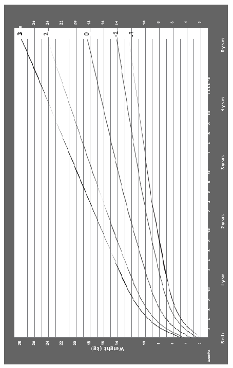

Uganda Clinical Guidelines 2023CHAPTER 17:Childhood Illness

Uganda Clinical Guidelines 2023CHAPTER 17:Childhood Illness

################# Weight-for-age GIRLS Birth to 5 years (z-scores)

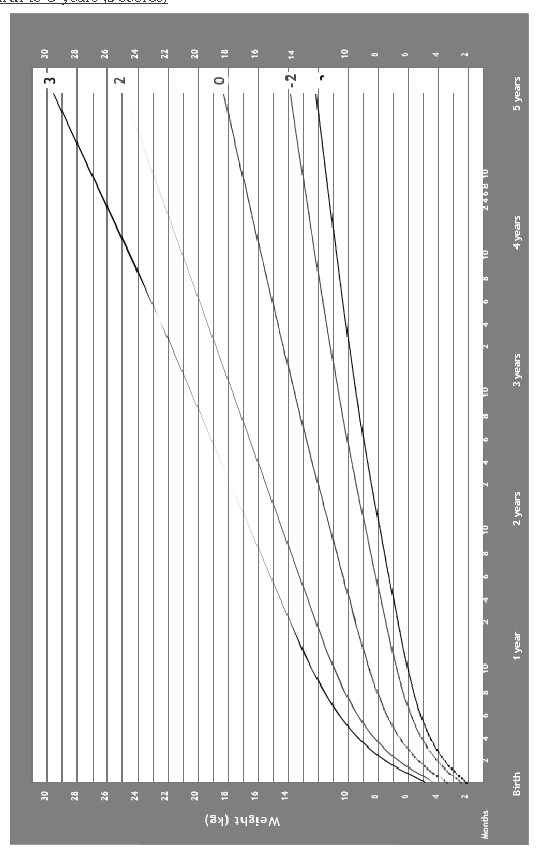

################# Weight-for-Height BOYS 2 to 5 years (z-scores)

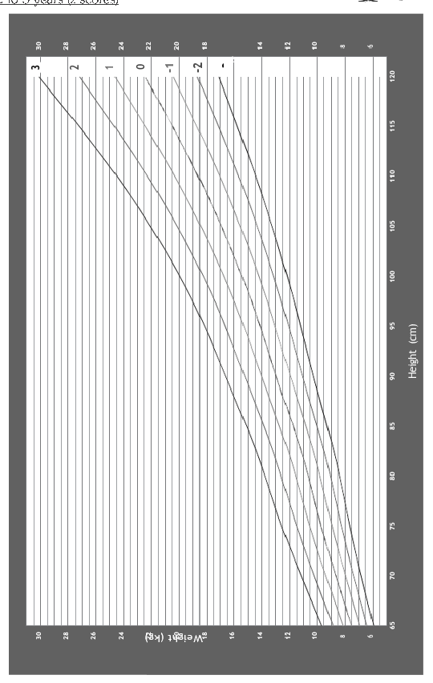

Uganda Clinical Guidelines 2023CHAPTER 17:Childhood Illness

- Uganda Clinical Guidelines 2023CHAPTER 17:Childhood Illness

################# Weight-for-Height GIRLS

- 2 to 5 years (z-scores)

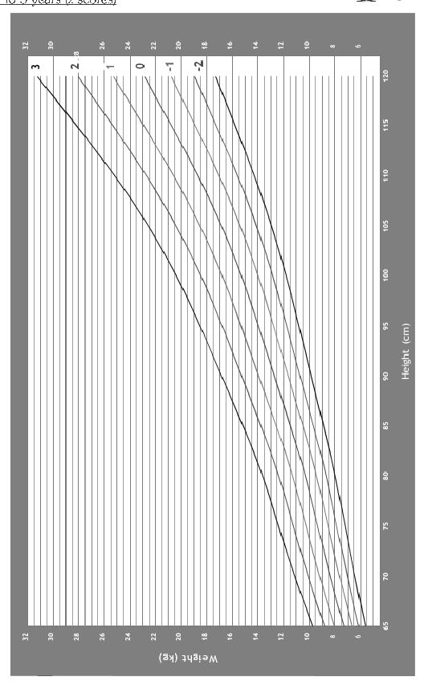

################# Arm circumference-for-age BOYS

- 3 months to 5 years (z-scores)

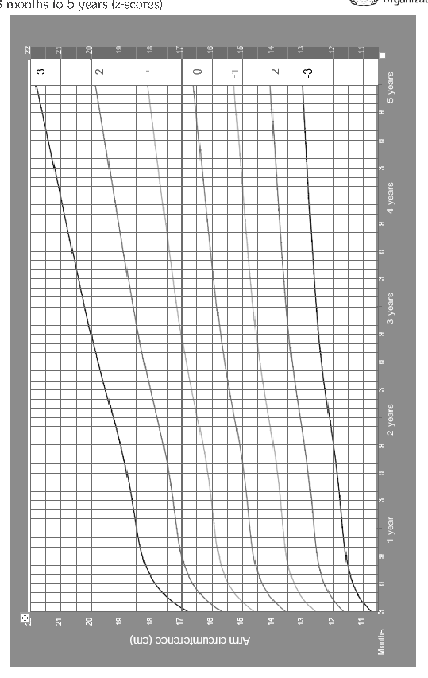

Uganda Clinical Guidelines 2023CHAPTER 17:Childhood Illness

Uganda Clinical Guidelines 2023CHAPTER 17:Childhood Illness

################# Arm circumference-for-age GIRLS 3 months to 5 years (z-scores)

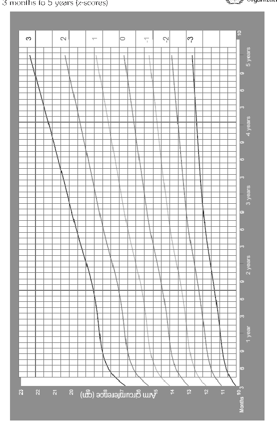

# Immunization18

18.1 ROUTINE CHILDHOOD VACCINATION 18.1.1 National Immunization Schedule Adapted from the UNEPI/MOH Immunization Schedule, 2022

|Vaccine Or Antigen|Age|Dose & Mode Of Administration|Mode Of Administration|Site Of Administration|
|---|---|---|---|---|
|BCG|At birth (or first contact)|0-11 months: 0.05 mL Above 11 months: 0.1 mL|Intradermally|Right Upper Arm|
|Hepatitis B|At birth(first contact within the first 7 days of life)|0.5 ml IM|Intramuscular|Outer aspect of left thigh|
|Oral Polio|4 doses: at birth, 6, 10, and 14 weeks|2 drops|Orally|Mouth|
|Inactivated Polio Vaccine (IPV)|2 doses: At 6 and 14  Weeks of age|0.5 mL|Intramuscular|Outer aspect of right thigh;  2.5 cm away from PCV site|

Uganda Clinical Guidelines 2023CHAPTER 18:Immunization

Uganda Clinical Guidelines 2023CHAPTER 18:Immunization

|Vaccine Or Antigen|Age|Dose & Mode Of Administration|Mode Of Administration|Site Of Administration|
|---|---|---|---|---|
|DPTHepB  + Hib 1|3 doses: at 6, 10 and 14 weeks|0.5 mL|Intramuscular|Outer aspect of left thigh|
|PCV|3 doses: at  6, 10 and  14 weeks|0.5 mL|Intramuscular|Outer aspect of right thigh|
|Rota|2 doses: at 6 and 10 weeks|2 drops|orally|Slow admin on inner aspect of cheek|
|Measles Rubella|2 doses:At 9 and 18 months|0.5 mL|Subcutaneous|Left Upper Arm|
|Yellow fever|At 9 months|0.5 ml|Subcutaneous|Right Upper Arm|
|All girls in primary 4 or 10 year old girls outside school|HPV|Give 2 doses IM 6 months apart|Intramuscular|Left Upper Arm|

General principles of routine childhood immunization ~ The aim is to ensure that all target age groups complete

their immunization schedule as above

~ Age for vaccinations: Give each vaccine at the recommended age or if this is not possible, at any first contact with the child after this age

~ BCG vaccination

- - Give this as early as possible in life, preferably at birth
- - Do NOT give BCG vaccine to any child with clinical signs and symptoms of immunosuppression, e.g. AIDS

~ Use each vaccine with its corresponding pre-cooled diluent from the same manufacturer

~ Polio vaccination (= ‘birth dose’): This is a primer dose of oral polio vaccine (OPV), which should be given ideally at birth but otherwise in the first 2 weeks of life

~ DPT-HepB-Hib vaccine

- - Is a combination of DPT vaccine + hepatitis B vaccine (HepB)

+ haemophilus influenzae type b (Hib) vaccine

- - Minimum interval between each of the doses is 4 weeks

~ Measles rubella vaccination ‰ Given at 9 and 18 months of age or first contact after this age ‰ Can also be given to any unimmunised child of 6-9 months ‰ old who has been exposed to measles patients. Children vaccinated

in this way must have the vaccination repeated at 9 months of age ~ Vaccination of sick children ‰ Admit and treat any child who is severely ill, and vaccinate at the

time of discharge ‰ Minor illness is not a contraindication to vaccination ‰ Screen clients at points of care and administer the due vaccines ‰ Screen clients for vaccine preventable diseases for investigation

and notification Administration and storage of vaccines Storage and transport ~ At health units, vaccines should be stored between +2°C to ~ +8°C ~ At the district and central vaccine stores (static units) where

freezers exist, polio and measles rubella vaccines may be stored for prolonged periods at -20°C

~ Do not freeze DPT-HepB-Hib, PCV, IPV, HPV, hepatitis B, yellow fever and TT vaccines

~ Never freeze the diluents for BCG,yellow fever and measles vaccines

Uganda Clinical Guidelines 2023CHAPTER 18:Immunization

- Uganda Clinical Guidelines 2023CHAPTER 18:Immunization

~ Use conditioned ice packs and sponge method for transport

Carefully follow recommended procedures to maintain the cold chain for all vaccines, e.g.:

‰ Ensure continuous supply of power/gas ‰ Record fridge temperature twice daily (morning and evening,

including weekends/public holidays) ‰ Use sponge method during each immunization session Reconstitution and administration ~ Never use the diluents provided for vaccines to mix other

injectable medicines ~ Never use water for injection as a diluent for vaccine re-

constitution Do not vaccinate in direct sunlight (always carry out immunization in a building or under a shade) ~ Record every vaccination in the child register and on a tally sheet until child has completed all the antigens ~ Use the child register and child health card for tracking

drop outs

~ A child who received any immunization dose during national immunization campaigns should still get the routine vaccination doses

~ Never use any vaccine:

- - After its expiry date
- - When the vaccine vial monitor (VVM) has changed to discard point (stage 3 and 4)
- - If there has been contamination, or contamination is
- - suspected in open vials
- - If the vial labels are lost
- - DPT-HepB-Hib, HebB, PCV,rotavirus vaccine, IPV, HPV, TT/Td that have been frozen

Adhere to the WHO recommended Multi-Dose Vial Policy (MDVP) as below:

|TYPE OF VACCINE|MDVP GUIDELINE|
|---|---|
|OPV and IPV|Do not use vaccine if: Contaminated or has no label The VVM at or beyond discard point (stage 3 & 4) Vials have been opened for 4 weeks Vials opened during outreach Vaccines have not been stored under cold chain conditions|
|DPT-HepBHib, Hep B, TT,PCV|Do not use vaccine if: Contaminated or has no label The VVM is at or beyond discard point Frozen Vials have been opened for 4 weeks or more|
| |Vials opened during out- reach Vaccines have not been stored under cold chain conditions|
|BCG,yellow fever  and Measles Rubella|~ Discard remaining doses in the opened vials of these vaccines after 6 hours  ~ of reconstitution or at the end of the immunization session, whichever comes first|

Common non-serious side effects of vaccines and patient advice

|VACCINE AND SIDE EFFECTS|PATIENT ADVICE|
|---|---|
|BCG ~ Pain at injec-  tion site|~ The ulcer that forms at the injection site is a normal and expected reaction that heals by itself and leaves a permanent scar. It should not be covered with anything|

Uganda Clinical Guidelines 2023CHAPTER 18:Immunization

########################## Uganda Clinical Guidelines 2023CHAPTER 18:Immunization

|VACCINE AND SIDE EFFECTS|PATIENT ADVICE|
|---|---|
|DPT-HepB-Hib, PCV ~ Mild reactions  at injection site: swelling, pain, redness  ~ Fever within 24 hours of the injection  ~ Anaphylactic  reactions ~ Seizures|~ Do not apply anything to the  injection site ‰ Take paracetamol if necessary.  – If fever continues after 2 doses of  paracetamol, report to health facility  ‰ Wiping the child with a cool sponge or cloth (with water at room temperature) is also good for reducing fever  ~ If seizures or severe rash/ difficulty in breathing occurs, return to health facilty immediately|
|Oral Polio and Rotavirus ~ Short-lived gas-  trointestinal symptoms (pain, diarrhoea, irritation)|~ Dispose of the child’s faeces properly as the virus spreads through the oral-faecal route  ~ Wash hands thoroughly after  changing the baby’s nappies|
|Inactivated/Injectable Polio ~ Pain, redness  and swelling at injection site  ~ Fever, headache,  drowsiness, ~ Irritability in  infants  ~ Diarrhoea,  nausea,  ~ vomiting|~ Side effects usually mild and should not cause worry ~ Take paracetamol if necessary ~ If fever continues after 2 doses  of paracetamol, report to health facility  ~ Report any severe reaction to  health worker immediately|
|Measles rubella ~ Pain, swelling,  redness at injection site  ~ Fever and skin rash 5-12 days after the vaccine|~ Child may get a mild skin rash and fever after few days; do not worry  ~ Do not apply anything to the injection site|

|VACCINE AND SIDE EFFECTS|PATIENT ADVICE|
|---|---|
|Yellow fever ~ Pain, swelling,  redness at injection site  ~ Fever and skin rash 5-12 days after the vaccine|~ Side effects may occur within 1–2 days of immunization; they are usually mild and should not cause worry  ~ Report to health worker immediately any severe reaction|
|HPV ~ Injection site  reactions: pain, redness, itching, bruising or swelling  ~ Headaches ~ General body  aches, nausea|~ Side effects usually mild and should not cause worry  ~ Report to health worker immediately any severe reaction|
|Tetanus Toxoid (TT) ~ Irritation at injec-  tion site ~ Fever, malaise|~ Side effects may occur within 1–2 days of immunization; they are usually mild and should not cause worry  ~ Report to health worker immediately any severe reaction|
|Hep B Vaccine ~ Pain, redness and  swelling at injection site  ~ Fatigue ~ Fever|~ If fever develops, give a single dose of paracetamol|

OTHER VACCINATIONS 18.1.2 Hepatitis B Vaccination ~ Since 2005, children are immunised against Hepatitis B in

the routine childhood immunization using the DPT-HepBHib vaccine at 6, 10, and 14 weeks of age

Uganda Clinical Guidelines 2023CHAPTER 18:Immunization

Uganda Clinical Guidelines 2023CHAPTER 18:Immunization

~ For adolescents and adults, it is recommended that the hepatitis B vaccination is given preferably after testing for hepatitis B infection (HBsAg and Anti-HBs). Patients with HIV and pregnant women should be handled on a case by case basis

~ Vaccination is recommended for high risk groups, e.g:

- - Health workers in clinical settings and training
- - Intravenous drugs users
- - Persons who frequently receive blood transfusions
- - Recipients of solid organ transplantation
- - High-risk sexual behaviour
- - Partners and household contacts of HBsAg positive patients
- - Support staff in health facilities

~ The schedule has three doses: at 0, 1 month after 1st dose, and 6 months after first dose (0, 1, 6 months)

~ The storage temperature for the vaccine is 2°C to 8°C

‰ Dose: 0.5 mL given intramuscularly on the deltoid muscle (upper arm) ‰ Do NOT give vaccine on the buttocks because of low immune

response (decreased protective antibody response) and risks of injury to the sciatic nerve

- 18.1.3 Yellow Fever Vaccination

The yellow fever vaccine is live attenuated, and it is reconstituted before use. Ideally, it should be used within 6 hours after reconstitution.

~ Dose: 0.5 mL given intramuscularly on the upper arm as

a single dose ~ The storage temperature for the vaccine is 2°C to 8°C ~ Immunity is life-long and international travel certificateis

issued once and valid for life.

- 18.1.4 Tetanus Prevention

~ All children should be vaccinated against tetanus during routine childhood immunization using the DPT-HepB-Hib vaccine at 6, 10, and 14 weeks of age (see above)

~ Neonatal tetanus is prevented by routinely immunising all

pregnant women/women of child- bearing age (15–45 years) against tetanus with Tetanus Toxoid vaccine (see below)

18.2.3.1 Prophylaxis Against Neonatal Tetanus ~ Ensure hygienic deliveries, including proper cutting and

care of umbilical cords through the use of skilled birth attendants

~ Immunise all pregnant women/women of child- bearing age (15 – 45 years) against tetanus with Tetanus Toxoid with diptheria vaccine (Td)

~ Give TT vaccine 0.5 mL IM into the upper arm as per the recommended schedule below:

RoutineT Tv accine schedule and the period of protection

|TT DOSE|WHEN GIVEN|DURATION AND LEVELS  OF PROTECTION|
|---|---|---|
|Td1|At first contact with woman of childbearing age or as early as possible during pregnancy|None|
|Td2|At least 4 weeks after Td1|3 years; 80% protection|
|Td3|At least 6 months after Td2|5 years; 95% protection|
|Td4|At least 1 year after Td3|10 years; 99% protection|
|Td5|At least 1 year after Td4|30 years; 99% protection|

Vaccination Against Adult Tetanus

~ High risk groups such as farm workers, military personnel, miners, safe male circumcision clients, should be vaccinated as in the table above (if not fully immunized) and given regular boosters every 10 years

Uganda Clinical Guidelines 2023CHAPTER 18:Immunization

Uganda Clinical Guidelines 2023CHAPTER 18:Immunization

~ Patients at risk of tetanus as a result of contaminated wounds, bites, burns, and victims of road traffic accidents be given Antitetanus Immunoglobulin (TIG) and then be vaccinated as indicated in the table below

|TREATMENT|LOC|
|---|---|
|General measures ‰ Ensure adequate surgical toilet and proper care of wounds  Passive immunization: give to any patient at risk, except if fully immunized and having had a booster within the last 10 years  ‰ Give IM tetanus immunoglobulin human (TIG): Child <5 years: 75 IU Child 5-10 years: 125 IU Child >10 years/adult: 250 IU ‰ Double the dose if heavy contamination suspected or if >24 hours  since injury was sustained Alternative - only if TIG not available: ‰ Antitetanus serum (tetanus antitoxin) 1,500 IU deep SC or IM|HC3 HC4 |
|Active immunization Unimmunised or partially immunised patients: ‰ Give a full course of vaccination for those who are not immunized at  all (3 doses 0.5 mL IM at intervals of 4 weeks) Fully immunized patients with booster >10 years before: ‰ Give one booster dose of TT 0.5 mL intramuscularly  Fully immunised patients who have had a booster dose within the last 10 years  ‰ A booster is NOT necessary|HC3|
|Note  ƒ Giving TIG or TT to a fully immunised person may cause an unpleasant reaction, e.g., redness, itching, swelling, and fever, but with a severe injury this is justified|Note  ƒ Giving TIG or TT to a fully immunised person may cause an unpleasant reaction, e.g., redness, itching, swelling, and fever, but with a severe injury this is justified|

18.2.4 Vaccination against COVID-19. Who should be vaccinated? ‰ 12 years and above ‰ for children 5years -12 with parental consent

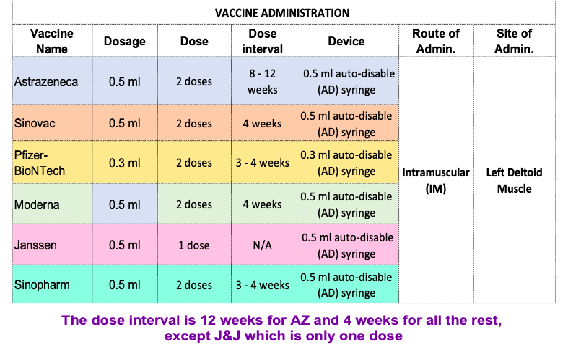

Table showing vaccines and respective dosing and schedules for primary series

~ A booster dose that can be administered at least 6 months after completion of the primary series is recommended for all those aged 50 years and above, health workers, teachers both in pre-primary, primary, secondary, and tertiary institutions, religious leaders, cultural leaders, security personnel, media personnel, drivers and conductors of public transport vehicles, boda boda riders, bar and night club workers, market workers and vendors

Table: COVID Vaccine Matching and mixing (heterologous primary schedules) /Booster dosing

| |First Dose|Second Dose OR Booster|
|---|---|---|
|1|AstraZeneca|Pfizer or Moderna|
|2|Pfizer|AstraZeneca|
|3|Moderna|AstraZeneca|
|4|Sinopharm|AstraZeneca or Pfizer or Moderna|

Uganda Clinical Guidelines 2023CHAPTER 18:Immunization

Uganda Clinical Guidelines 2023CHAPTER 18:Immunization

| |First Dose|Second Dose OR Booster|
|---|---|---|
|5|Sinovac|AstraZeneca or Pfizer or Moderna|
|6|Johnson & Johnson|Pfizer or Moderna|

Nutrition is the intake of food, considered in relation to the body’s dietary needs. Good nutrition – an adequate, well balanced diet combined with regular physical activity – is a cornerstone of good health.

Poor nutrition can lead to reduced immunity, increased susceptibility to disease, impaired physical and mental development, and reduced productivity.

Optimal nutrition means obtaining a balance of macronutrients (carbohydrates, proteins and fats) and micronutrients (vitamins and minerals).

Macronutrients provide energy for organ and tissue functions and growth, and micronutrients are needed in small amounts for chemical processes in the body such as metabolism, growth, and protection against infections.

In addition, plenty of water is needed to build cells and regulate body processes.

# Nutrition19

#### 19.1 NUTRITION GUIDELINES IN SPECIAL POPULATIONS 19.1.1 Infant and Young Child Feeding (IYCF)

- 1. Counsel and support all mothers to initiate breastfeeding within an hour of delivery and exclusively breastfeed their infants for the first six months of life, unless medically contraindicated.
- 2. Teach mother correct positioning and attachment for breastfeeding, how to express and store breast milk hygienically, and how to feed the child by a cup.
- 3. Counsel and support parents to introduce adequate, safe, and appropriate complementary foods at 6 months of age, and to continue breast feeding until the child is 2 years.
- 4. A good diet should be adequate in quantity and include an energy-rich food (e.g. thick cereal with added oil, meat, fish, eggs, legumes, fruits and vegetables)
- 5. Pregnant women and lactating mothers should consume adequate nutritious foods
- 6. Recommend exclusive breastfeeding for infants of HIV-infected women for the first 6 months unless the replacement is acceptable, feasible, affordable, sustainable, and safe (AFASS).
- 7. Malnourished children should be provided with appropriate medical care, nutritional rehabilitation, and follow-up.
- 8. Encourage mothers of low birth weight infants who can suckle to breastfeed. Assist those who cannot breastfeed to express breast milk and feed the baby.
- 9. During illness, children should take increased fluids: breastfeed more often, increase amount of milk given, increase fluid intake (e.g. soups, yoghurt, and drinking water). Extra fluid in diarrhoea is especially life-saving
- 10. For more information on feeding recommendations in infants and young children, see IMCI section 17.3.12.3

Uganda Clinical Guidelines 2023CHAPTER 19:Nutrition

Uganda Clinical Guidelines 2023CHAPTER 19:Nutrition

19.1.2 Nutrition in HIV/AIDS Good nutrition in HIV/AIDS is important as it helps to: ~ Prevent malnutrition and wasting ~ Delay the progress of HIV to AIDS ~ Enhance the body’s ability to fight opportunistic infections ~ Achieve and maintain optimal body weight and strength Relieve complications, e.g., diarrhoea, nausea, vomiting, thrush ~ Improve effectiveness and tolerance of medication ~ Improve quality of life Severe malnutrition is diagnosed when: ~ BMI <16 kg/m2 ~ Weight loss >10% in past 2 months ~ MUAC <185 mm (<210 mm if pregnant or postpartum) ~ Persistent diarrhoea or fever Management

|TREATMENT|LOC|
|---|---|
|If patient has other complications ‰ Admit patient and treat infections and rehydrate If patient has no other medical complications ‰ Treat as an outpatient ‰ Promote weight gain with high-energy foods, protein,  vitamins and minerals  ‰ If ready-to-use therapeutic food is available, give 3 sachets Supplement the patient’s diet with multivitamins and minerals, 1-2 tablets per day e.g, a combination of selenium and molinga has been proven to be beneficial per day in adults, in addition to normal food  - See next section 19.2 for malnutrition in children  ‰ Follow up in 2 weeks, at 1 month, then every 2 months thereafter|HC4 HC3|

19.1.3 Nutrition in Diabetes

People with diabetes should follow normal nutritional guidelines for the general population, and can eat the same foods as the whole family since everyone benefits from healthy eating.

Healthy eating and exercise in diabetics help to: ‰ Maintain the blood glucose close to normal to prevent complications ‰ Control cholesterol levels ‰ Control blood pressure, and reduce the risk of complications such

as heart disease and stroke

In addition, diabetics have to take care to balance their food with insulin and oral antidiabetic medications to help manage their blood glucose levels.

Healthy diet involves eating a variety of foods including vegetables, whole grains, fruits, non-fat dairy products, beans, lean meat, poultry, and fish. These are rich in vitamins, minerals and fibre. Avoid processed foods.

General advice ~ Eat three meals a day. Avoid skipping meals, and space out

breakfast, lunch, and evening meal over the day

~ At each meal, include moderate amount (around 1/3 of the plate) of starchy carbohydrate foods, e.g., bread, pasta, chapatis, potatoes, yams, noodles, rice, and cereals. Eat more slowly absorbed (low glycaemic index) foods, e.g., pasta, rice, sweet potato and yam, porridge oats, bran, and natural muesli

~ Reduce fat in the diet, especially saturated fats. Use unsaturated fats or oils e.g. olive oil, sunflower oil

~ Eat more fruit and vegetables. Aim for at least five portions

a day. Eat more beans and lentils. ~ Limit sugar and sugary foods ~ Reduce salt in the diet to 6 g or less per day ~ Drink alcohol only in moderation: 1 drink (one beer or one

small glass of wine or one shot of spirit) for women and

Uganda Clinical Guidelines 2023CHAPTER 19:Nutrition

Uganda Clinical Guidelines 2023CHAPTER 19:Nutrition

2 for men as a maximum amount daily. Alcohol has some cardioprotective effect. It should be consumed with food to prevent hypoglycaemia ~ Don’t use products marketed as ”diabetic foods, drinks or

herbs” (they are expensive and of no benefit)

~ Routine supplementation with vitamins and minerals without underlying actual deficiency is not beneficial, patients should eat lots of fruits and vegetables e.g, a combination of selenium and molinga has been proven to be beneficial

~ Obese and overweight patients need to be encouraged to reduce weight using exercise and diet modifications 19.2 MALNUTRITION ICD10 CODE: E40-43 19.2.1 Introduction on Malnutrition

Malnutrition is the cellular imbalance between the supply of nutrients and energy and the body’s demand for them to ensure growth, maintenance, and specific functions. It includes both under- and over nutrition.

However, the term “malnutrition” commonly refers to undernutrition, and is used as such in these guidelines.

Although malnutrition can affect all ages, however, the early stages, including, foetus, infants and children, are most vulnerable to the effects of undernutrition during the period of their most rapid physical growth and development during the first two years of life.

Malnutrition is a significant contributor to morbidity and mortality among children under 5 years in Uganda. It also makes the prognosis of other diseases poor.

Note

ƒ Previously, malnutrition was classified into two types: 1) ProteinEnergy Malnutrition (PEM) due to lack of adequate protein and energy in the diet and 2) Micronutrient malnutrition-due to deficiencies in specific micronutrients (vitamins and minerals).

ƒ These causal names are now avoided because protein and energy deficits are likely to be accompanied by deficiencies of other nutrients, and management of malnutrition takes this into consideration.

Causes/contributing factors to malnutrition ~ Immediate causes: diet and disease

‰ Inadequate quantity and quality of food ‰ Lack of knowledge on appropriate foods provided to children,

poor food preparation, food taboos

‰ Infections: reduce appetite, increase energy and nutrient utilisation, and limit the ability to absorb or retain nutrients e.g. in diarrhoea, intestinal parasites

~ Root causes: food insecurity, poor health services, poor environmental sanitation, natural disasters, excessive workload for women, poor weaning practices, culture, inadequate water supply, low literacy levels, low nutrition advocacy/education

~ Underlying causes: poverty, corruption, poor governance,

poor infrastructure. Consequences of malnutrition ~ Impaired growth, physical and mental and development ~ Impaired body resistance/immune system ~ Increased risk of adult chronic diseases ~ Increased risk of mortality ~ Increased risk for the cycle of inter-generational malnutri-

tion ~ Poor economic well-being for the individual and country Differential diagnosis ~ Nephrotic syndrome (nephritis) ~ Liver disease ~ Heart disease ~ Malabsorption syndrome ~ Malignancy (e.g., gastrointestinal tract cancer, liver can-

cer/hepatocellular carcinoma)

Uganda Clinical Guidelines 2023CHAPTER 19:Nutrition

Uganda Clinical Guidelines 2023CHAPTER 19:Nutrition

############ 19.2.1.1 Classification of Malnutrition

|TYPE|DEFINITION OR FEATURES|
|---|---|
|Acute|~ Is an indicator of current nutritional status, reflecting recent weight changes or disruption in nutrient intake  ~ Most appropriate indicator to use in an emergency setting (e.g. due to sudden/ sharp period of food shortage)  ~ Associated with loss of body fat and severe wasting  ~ Children are thinner than their comparable age group of same height  ~ Classified as Moderate or Severe based on anthropometry (measurement of the size, weight and proportions of the human body), biochemistry and clinical assessment|
|Chronic|~ Is an indicator of the nutritional status overtime; chronically malnourished children are shorter (stunted) than their comparable age group|

############## Clinical features of malnutrition

~ Marasmus: severe wasting, old man’s face, excess skin’ hangs around the buttocks, ribs and zygoma bones are prominent, scapular blades and extremities (limbs), eyes are sunken

- Apathetic or irritable, appetite is fairly good, skin is almost normal, hair demonstrates some changes but not as dramatic as in Kwashiorkor, organomegaly is rare (liver and spleen enlargement)

~ Kwashiakor: pitting feet oedema, skin desquamation, hair changes, presence of bilateral pitting oedema (oedema of both feet), moon face

‰ Appears adequately nourished due to excess extra cellular fluid,

but is very miserable, apathetic ‰ Skin changes (dermatosis, flacky paint dermatitis) ‰ Hair changes: Silky, straight, sparsely distributed; easily, painlessly

pluckable ‰ Severe pallor of the conjunctiva, mucous membranes, palms, and

soles, loss of skin turgor (dehydration) ‰ Organomegaly (liver, spleen) is common ~ Marasmus-kwashiakor: most common form, presents with

features of both Marasmus and Kwashiorkor

- 19.2.1.2 Assessing Malnutrition in Children 6 months to 5 years

The 4 key features used to diagnose acute malnutrition are: ‰ Weight-for-Height/Length (WFH/L) using WHO growth standards

charts (see section 15.5). It is the best indicator for diagnosing acute malnutrition.

‰ Mean Upper Arm Circumference (MUAC) in mm using a measuring tape (see section 17.5)

‰ Oedema of both feet (kwashiorkor with or without severe wasting) ‰ Appetite test: ability to finish portion of ready-to-use therapeutic

food (RUTF).

WEIGHT FOR AGE (WFA) reflects both long term (stunting) and short term (wasting) nutritional status, so it is not very useful for diagnosis of acute malnutrition.

It can also miss out oedematous children, who are very malnourished but may have a near-normal weight because of fluid retention.

Uganda Clinical Guidelines 2023CHAPTER 19:Nutrition

Uganda Clinical Guidelines 2023CHAPTER 19:Nutrition

############## Diagnostic criteria

|TYPE|CRITERIA|
|---|---|
|Moderate Acute Malnutrition|~ WFH/L between -3 and -2 z-scores ~ Or MUAC 115 up to 125 mm ~ Or low weight for age|
|Severe Acute Malnutrition|Without complications ~ Oedema of both feet (kwashiorkor  with or without severe wasting) OR ~ WFH/L less than -3 z scores OR ~ MUAC less than 115 mm OR ~ Visible severe wasting AND ~ Able to finish RUTF With complications ~ Oedema of both feet OR ~ WFH/L less than -3 z scores OR ~ MUAC less than 115 mm OR ~ Visible severe wasting AND ~ Any one of the following:  - Medical complication present OR - Not able to finish RUTF |
|Specific micronutrient deficiencies|~ Vitamin A: xerophthalmia ~ Vitamin C: scurvy ~ Vitamin B12 and folic acid: meg-  aloblastic anaemia (see section 11.1.1.2)  ~ Iron: iron-deficiency anaemia (see section 11.1.1.1)|

Investigations

Children with SAM should always be first assessed with a full clinical examination to confirm presence of any danger sign, medical complications, and tested for appetite.

 Assess patient’s history of: ‰ Recent intake of food, loss of appetite, breastfeeding ‰ Usual diet before current illness (compare the answers to the Feeding

Recommendations for the Child’s age (section 17.3.12.3) ‰ Duration, frequency and type of diarrhoea and vomiting ‰ Family circumstances ‰ Cough >2 weeks and contact with TB ‰ Contact with measles ‰ Known or suspected HIV infection/exposure  Initial examination for danger signs and medical complications: ‰ Shock: lethargy or unconscious, cold hands, slow capillary refill (<3

seconds), weak pulse, low blood pressure ‰ Signs of dehydration ‰ Severe palmar pallor ‰ Bilateral pitting oedema ‰ Eye signs of vitamin A deficiency: dry conjunctiva, corneal ulceration,

keratomalacia, photophobia ‰ Local signs of infection: ear, throat, skin, pneumonia ‰ Signs of HIV (see WHO Clinical Staging section 3.1.1) ‰ Fever (³37.5°C) or hypothermia (rectal temp <35.5°C) ‰ Mouth ulcers ‰ Skin changes of kwashiorkor: hypo- or hyperpigmentation, desqua-

mation, ulcerations all over the body, exudative lesions (resembling burns) with secondary infection (including candida)

Uganda Clinical Guidelines 2023CHAPTER 19:Nutrition

- Uganda Clinical Guidelines 2023CHAPTER 19:Nutrition

 Laboratory tests ‰ Blood glucose

- - Complete blood count or Hb, malaria, HIV, electrolytes
- - Stool microscopy for ova and cysts, occult blood, and parasites

‰ Chest X-ray: Look for evidence of tuberculosis or other chest abnormalities

‰ Conduct an appetite test

- Assess all children ³6 months for appetite at the initial visit and at every follow up visit to the health facility

|HOW TO DO APPETITE TEST|
|---|
|~ Arrange a quiet corner where the child and mother can take their time to eat RUTF. Usually the child eats the RUTF portion within 30 minutes|
|Explain to the mother ~ The purpose of assessing the child’s appetite ~ What RUTF is ~ How to give RUTF  - Wash hands before giving RUTF - Sit with child and gently offer RUTF - Encourage child to eat without feeding by force - Offer plenty of water to drink from a cup during RUTF feeding |
|Offer appropriate amount of RUTF to child to eat: ~ After 30 minutes, check if the child was able to finish or not able  to finish the amount of RUTF given and decide:  - Child ABLE to finish at least one third of a packet of RUTF portion (92 g) or 3 teaspoons from a pot within 30 minutes - Child NOT ABLE to eat one-third of a packet of RUTF portion (92 g) or 3 teaspoons from a pot within 30 minutes |

 Determine WFH/L: Measure the child’s height and weight and plot the score on the appropriate chart (boy or girl). Match the value to the z-score on the right y-axis to determine the child’s z-score (see section 17.5)

 Measure MUAC: Using a MUAC tape, measure the circumference

of the child’s upper arm and plot the score on the appropriate chart (boy or girl, section 17.5). Please note: 1 cm=10 mm, so 11.5 cm = 115 mm.

19.2.2 Management of Acute Malnutrition in Children General principles of management ~ Admit all children with any danger sign, medical complica-

tions, pitting oedema or those who fail appetite tests for inpatient care and treatment for complicated SAM.

‰ Keep them in a warm area separated from infectious children, or in a special nutrition area.

~ Children with good appetite and no medical complications can be managed as outpatients for uncomplicated SAM.

~ Adequate facilities and staff to ensure correct preparation of therapeutic foods, and to feed child regularly day and night, should be available.

~ Accurate weighing machines and MUAC tapes should be available

~ Proper records of feeds given and child’s measurements should be kept so that progress can be monitored

~ Explain to patient/care-giver to handle the child gently

############ 19.2.2.1 Management of Moderate Acute Malnutrition

|TREATMENT|LOC|
|---|---|
|‰ Assess the child’s feeding and counsel the mother on the feeding recommendations  ‰ If child has any feeding problem, counsel and follow up in 7 days (see section 17.3.12.4)|HC3|
|‰ Assess for possible TB infection ‰ Advise mother when to return immediately (danger signs)| |

Uganda Clinical Guidelines 2023CHAPTER 19:Nutrition

Uganda Clinical Guidelines 2023CHAPTER 19:Nutrition

|TREATMENT|LOC|
|---|---|
|FOLLOW-UP CARE Follow-up in 30 days ~ Reassess child and re-classify  - If better, praise mother and counsel on nutrition - If still moderate malnutrition, counsel and follow up in 1 month - If worse, loosing weight, or feeding problem: refer | |

############ 19.2.2.2 Management of Uncomplicated Severe AcuteMalnutrition

|TREATMENT|LOC|
|---|---|
|‰ Give oral antibiotics: amoxicillin DT 40 mg/kg twice a day 40 mg/kg for 5 days  ‰ Give ready-to-use therapeutic food (RUTF) for a child aged ³ 6 months (for doses, see next section)  ‰ Counsel the mother on how to feed the child (see  section 17.3.12.3) ‰ Assess for possible TB infection ‰ Advise mother when to return immediately (danger signs)|HC3|
|FOLLOW-UP CARE After 7 days  ƒ Reassess child and feeding. If no new problem,  review again in 7 days After 14 days or during regular follow up: ‰ Do a full reassessment of the child: check WFH/L,  MUAC, oedema of both feet and do another appetite test If the child has complicated SAM ‰ Refer URGENTLY to hospital If the child has uncomplicated SAM| |

|‰ Counsel the mother and encourage her to continue with appropriate RUTF feeding. Ask mother to return again in 14 days  If the child has moderate acute malnutrition: ‰ Advise the mother to continue RUTF. Counsel her  to start other foods according to the age appropriate feeding recommendations (see section 17.3.12.3)  ‰ Tell her to return in 14 days. Continue to see the child every 14 days until the child has no more acute malnutrition  If the child has no acute malnutrition (WFH/L is -2 z-scores or more, or MUAC is 125 mm or more)  ‰ Praise the mother, STOP RUTF and counsel her about age appropriate feeding recommendations| |
|---|---|

############ 19.2.2.3 Management of Complicated Severe Acute Malnutri-tion

In-patient care ~ Refer child to hospital: prevent hypoglycaemia by giving

small sips of sugar water, keep the child warm, first dose of antibiotics (ampicillin + gentamicin)

~ Triage the children to fast-track seriously ill patients for assessment and care: treat shock, hypoglycaemia, and corneal ulceration, immediately

~ General treatment involves 10 steps in two phases: initial stabilisation for 1 week and rehabilitation (for weeks 2-6) as in the table below

|ISSUE|STABILISATION|STABILISATION|REHABILITATION|
|---|---|---|---|
|ISSUE|DAYS 1-2|DAYS 3-7|WEEKS 2-6|
|Hypoglycaemia| | | |
|Hypothermia| | | |
|Dehydration| | | |
|Electrolytes| | | |
|Infection| | | |

Uganda Clinical Guidelines 2023CHAPTER 19:Nutrition

Uganda Clinical Guidelines 2023CHAPTER 19:Nutrition

|ISSUE|STABILISATION|STABILISATION|REHABILITATION|
|---|---|---|---|
|ISSUE|DAYS 1-2|DAYS 3-7|WEEKS 2-6|
|Micronutrients| |No iron|*With iron|
|Initiate feeding| | | |
|Catch-up feeding| | | |
|Sensory stimulation| | | |
|Prepare for follow-up| | | |
|Note  ƒ Iron is given after 2 days on F-100; if patient is taking RUTF, do NOT give iron|Note  ƒ Iron is given after 2 days on F-100; if patient is taking RUTF, do NOT give iron|Note  ƒ Iron is given after 2 days on F-100; if patient is taking RUTF, do NOT give iron|Note  ƒ Iron is given after 2 days on F-100; if patient is taking RUTF, do NOT give iron|

Management of Complications in SAM Hypoglycaemia (Blood sugar <3 mmol/L or <54 mg/dL) ~ All severly malnourished children are at a risk of hypo-

glycaemia, and should be given a feed or 10% glucose or sucrose, immediately on admission

~ Frequent 2 hour feeding is important

|TREATMENT|
|---|
|Immediately on admission ‰ Give 50 ml of glucose or sugar water (one rounded teaspoon of  sugar in 3 tablespoons of water) orally or by NGT, followed by first feed as soon as possible|
|If child is able to drink ~ Give first feed of F-75 therapeutic milk, if available, ev-  ery 30 minutes for 2 hours, then continue with feeds every 2 hours for 24 hours  - Then give feeds every 2 or 3 hours, day and night If child is unconscious ‰ Treat with IV 10% glucose at 5 ml/kg  ‰ If IV access cannot be quickly established, give 10% glucose or sucrose solution by NGT tube. To make 10% solution, dilute 1 part of 50% glucose with 4 parts of water OR 1 part of glucose 50% with 9 parts of glucose 5%|

|TREATMENT|
|---|
|- If IV glucose not available, give 1 teaspoon of sugar moistened with 1-2 drops of water sublingually, and repeat every 20 minutes to prevent relapse - Monitor children for early swallowing which delays - absorption; if it happens, give another dose of sugar - Start on appropriate IV/IM antibiotics |
|Monitoring If initial blood glucose was low, repeat measurement after 30 minutes ‰ If blood glucose falls to <3 mmol/L (<54 mg/dL), repeat the  10% glucose or oral sugar solution, and ensure antibiotics have been given  - If it is higher, change to 3 hourly feeds of F-75  ‰ If rectal tempearture falls to <35.5°C, or if level of consciousness deteriorates, repeat the blood glucose measurement and treat accordingly|
|Prevention ‰ Feed every 2 hours, starting immediately (see below), or if child is  dehydrated, rehydrate first. Continue feeding throught the night|
|‰ Encourage mothers to watch for any deterioration, help feed and keep the child warm  ‰ Check on abdominal distension|

############## Hypothermia (Axillary temperature <35°C and rectal temperature <35.5°C) ~ Often associated with hypoglycaemia or serious infection

|TREATMENT|
|---|
|‰ Feed child immediately as in hypoglycaemia above ‰ Warm the child: make sure the child is well covered, especially  the head, with cloths, hats, and blankets  - If available, use a heater but not pointing directly at the child. DO NOT use hot water bottles or flourescent lamps  ‰ Encourage caretaker/mother to sleep next to her child and kangaroo technique for infants (skin-to-skin contact, direct heat/ warmth transfer from mother to child)|

Uganda Clinical Guidelines 2023CHAPTER 19:Nutrition

- Uganda Clinical Guidelines 2023CHAPTER 19:Nutrition

|TREATMENT|
|---|
|‰ Keep the ward closed during the night and avoid wind drafts inside ‰ Give appropriate IV or IM antibiotics ‰ Change wet nappies, clothes and bedding to keep child and  bed dry  ‰ Quickly clean the patient with a warm wet towel and dry immediately. Avoid washing the baby directly in the first few weeks of admission|
|Monitoring ‰ Take child’s rectal temperature every 2 hours until it rises to  <36.5°C, If using a heater, take it every 30 minutes ‰ Cover the child at all times, especially at night. Keep head cov-  ered with hat to prevent heat loss ‰ Check for hypoglycaemia|

############## Dehydration

~ In both oedema and non-oedematous SAM, the margin of safety between dehydration and over-hydration is very narrow. Exercise care and caution to avoid over-hydration and risk of cardiac failure

‰ Assume that all children with watery diarrhoea or reduced urine output have some dehydration

|TREATMENT|
|---|
|‰ Do NOT use IV route for rehydration, except in cases of shock  ‰ Rehydrate slowly, either orally or by NGT using ReSoMal, a specially prepared rehydration solution for malnutrition, The standard ORS has a high sodium and low potassium content, which is not suitable for SAM, except if profuse diarrhoea is present  ~ Give ReSoMal more slowly than you would when rehydrating a  well-nourished child  - Give 5 ml/kg every 30 minutes for the first 2 hours - Then give 5-10 ml/kg per hour for the next 4-10 hours, with F-75 formula. Exact amount depends on how much the child wants, the volume of stool loss and whether the child is vomiting   If ReSoMal not available:  - Give half strength standard ORS, with added potassium and glucose as per the ReSoMal recipe below, unless the child has cholera or profuse|

|TREATMENT|
|---|
|- watery diarrhoea - If rehydration still required at 10 hours, give starter F-75 - Instead of ReSoMal, at the same times. Give the same volume of starter F-75 as of ReSoMal   If child is unconscious, in shock or severe dehydration ‰ Give IV fluid Darrow’s solution or Ringer’s lactate and 5% glucose (or if not avail-  able, ½ saline and 5% glucose at 15 mL/kg the first hour and reassess|
|- If improving, give 15 mL/kg in second hour - If conscious, give NGT ReSoMal - If not improving, treat for septic shock |
|Monitoring ~ ONLY rehydrate until the weight deficit is corrected and then  STOP, DO NOT give extra fluid to ”prevent recurrence” (from specialist’s notes)  ~ During rehydration, respiration and pulse rate should fall and  urine passing should start  ~ Return of tears, moist mouth, improved skin tugor and less sunken eyes and fontanelle are a sign of rehydration. SAM children will not show these and so weight gain should be measured  ~ Monitor progress of rehydration every 30 minutes for 2 hours,  then every hour for the next 4-10 hours  Be alert for signs of overhydration, which is dangerous and can lead to heart failure. Check for:  - Weight gain (make sure it is not quick or excessive) - If increase in pulse rate by 25/minute, respiratory rate by 5/minute is present, stop ReSoMal. Reassess after 1 hour - Urine frequency (if child urinated since last check) - Enlarging liver size on palpation - Frequency of stools and vomit |
|Prevention ‰ Same as in dehydration in well-nourished child, except that ReSoMal is used  instead of standard ORS. Give 30-50 ml ofReSoMal(for child <2 years) and 100 ml (for child ³2 years) after each watery stool.  - Small, frequent, unformed stools are common in SAM and should not be confused with profuse watery stools, and they do not require treatment|

########################## Uganda Clinical Guidelines 2023CHAPTER 19:Nutrition

- Uganda Clinical Guidelines 2023CHAPTER 19:Nutrition

|‰ Continue breastfeeding ‰ Initiate re-feeding with starter F-75 ‰ Give ReSoMal between feeds to replace stool lossess. Give 50-100 ml after each watery stool|
|---|

Recipe for ReSoMal using the standard WHO ORS

|INGREDIENT|AMOUNT|
|---|---|
|Water|2 litres|
|WHO-ORS|One 1-litre packet|
|Sucrose|50 g|
|Electrolyte/mineral solution|40 ml|

Electrolyte imbalance ~ All SAM children have deficiencies of potassium and mag-

nesium, which may take up to 2 weeks to correct ~ Oedema is partly due to potassium deficiency and sodium

retention ‰ Do not treat oedema with diuretics ‰ Giving high sodium doses could kill the child

|TREATMENT|
|---|
|‰ Give extra potassium (3-4 mmol/kg per day) f Give extra magnesium (0.4-0.6 mmol/kg per day) f Add extra potassium and magnesium to the feeds. If not already pre-mixed, add 20 ml of the combined electrolyte/mineral solution to 1 litre of feed, or use pre- mixed sachets for SAM  ‰ Use ReSoMal to rehydrate ‰ Prepare food without added salt|

Infections ~ In SAM, usual signs of bacterial infection, e.g. fever, are

usually absent, yet multiple infections are common. ~ Assume all SAM cases have an infection, and treat with

antibiotics immediately. Hypoglycaemia and hypothermia are often signs of severe infection

|TREATMENT|
|---|
|Broad spectrum antibiotics ‰ Benzylpenicillin 50,000 IU/kg IM or IV every 6 hours Or ampi-  cillin 50 mg/kg every 6 hours for 2 days f Then, oral amoxicillin 25-40 mg/kg every 8 hours for  ‰ 5 days PLUS ‰ Gentamicin 7.5 mg/kg once a day for 7 days ‰ Measles vaccination ‰ If child is ³ 6 months and not vaccinated, or was vaccinated  before 9 months of age. Delay vaccination if child is in shock Other specific infections ‰ Treat other specific infections if diagnosed as appropriate, e.g.,  malaria, pneumonia, dysentery, soft- tissue infections, mengingitis, TB, HIV  ‰ If parasitic worms are diagnosed, delay treatment until the rehabilitation phase. Give albendazole 200-400 mg single dose  - In endemic areas, give mebendazole orally twice a day - for 3 days to all SAM children 7 days after admission - If HIV diagnosed, start ART as soon as possible after stabilisation of metabolic compilcations   Monitoring ‰ If child is still anorexic after 7 days of antibiotic treatment, continue  for a full 10-day course. If anorexia persists, reassess child fully|

Micronutrient deficiencies ~ All SAM children have vitamin and mineral deficiencies

~ Anaemia is common, but DO NOT give iron initially, instead wait until the child has a good appetite and has started gaining weight, usually in the second week, because iron can make infections worse

~ RUTF already contains adequate iron so do not add. F-100 does not contain iron, so iron supplements are needed

Uganda Clinical Guidelines 2023CHAPTER 19:Nutrition

- Uganda Clinical Guidelines 2023CHAPTER 19:Nutrition

~ F-75, F-100 and RUTF already contain multivitamins (including vitamin A and folic acid) zinc and copper. Additional doses are not needed

~ If there are no eye signs or history of measles, then do not give a high dose of vitamin A as therapeutic foods already contain adequate amounts

Management

|TREATMENT|
|---|
|ONLY IF child has signs of vitamin A deficiency like corneal ulceration or history of measles  ‰ Give Vitamin A on day 1, and repeat on days 2 and 14 Child <6 months: 50,000 IU Child 6-12 months: 100,000 IU Child >12 months: 200,000 IU Note: If a first dose was given in the referring centre, treat on days 1 and 14 only|
|Iron ‰ Give iron in the second week of nutritional rehabilitation  - Do not give in the stabilization phase - Do not give in children receiving RUTF   ‰ Start iron at 3 mg/kg per day after 2 days on F-100 catch- up formula|
|If child is not on any pre-mixed therapeutic foods, give the following micronutrients daily for at least 2 weeks  ‰ Folic acid at 5 mg on day 1; then 1 mg daily Multivitamin syrup 5 ml ‰ Zinc 2 mg/kg per day ‰ Copper at 0.3 mg/kg per day ‰ Other vitamins and minerals e.g, a combination of selenium and moringa has  been proven to be beneficial|

Initial Re-Feeding during Stabilisation Phase In the initial phase, feeding should be gradual. The essential features of initial feeding are:

~ Frequent (every 2-3 hours) oral small feeds of low osmolality and low lactose. Never leave the child alone or forcefeed the child, as this can cause aspiration pneumonia

~ Nasogastric tube feeding if the child is eating £ 80% of the

amount offered at two consecutive feeds ~ Calories at 100 kcal/kg per day (do not exceed) ~ Protein at 1-1.5 g/kg per day ~ Liquid at 130 ml/kg per day or 100 ml/kg per day if child

has severe oedema ~ Milk-based formulas, such as F-75 (with 75 kcal and 0.9 g protein/100 ml), will be satisfactory for most children

- - Starter F-75 formula can be commercially supplied or
- - locally prepared from basic ingredients
- - In children who get osmotic diarrhoea with commercial preparation, prepare a cereal based F75 as in the table overleaf

TREATMENT ‰ If child is breastfeeding, continue breastfeeding but add the prescribed

amounts of the starter formula as in the table below:

|Days|Frequency|Volume/ kg feed|Volume/ kg per day|
|---|---|---|---|
|1-2|2 hours|11 ml|130 ml|
|3-5|3 hours|16 ml|130 ml|
|³6|4 hours|22 ml|130 ml|

‰ Feed from a cup or bowl. Use a spoon, dropper or syringe to feed

very weak children ‰ Teach the mother or caregiver to help with the feeding ‰ Night feeds are essential, since long periods without a feed may

lead to hypoglycaemia and death

Uganda Clinical Guidelines 2023CHAPTER 19:Nutrition

- Uganda Clinical Guidelines 2023CHAPTER 19:Nutrition

‰ If child is vomiting, during or after a feed, estimate amount vomited and offer that amount again. If child keeps vomiting, offer half the amount of feed twice as often (e.g. every 1 hour) until vomiting stops

Monitoring Monitor and record:

- - Amounts of feed offered and left over
- - Vomiting
- - Stool frequency and consistency
- - Daily body weight

Recipe for refeeding formula F-75 and F-100 If pre-mixed formulas are not available, prepare as below

|Ingredient|F-75 (Starter) Cereal-Based*|F-100 (Catch-Up)|
|---|---|---|
|Dried skimmed milk|25 g|80 g|
|Sugar|70 g|50 g|
|Cereal flour|35 g|—|
|Vegetable oil|27 g|60 g|
|Electrolyte/mineral solution mix|20 g|20 g|
|Water: make up to 1000 ml|1000 ml|1000 ml|
|Note  ƒ Cook cereal-based formula for 4 minutes and add mineral/ vitamin mix after cooking|Note  ƒ Cook cereal-based formula for 4 minutes and add mineral/ vitamin mix after cooking|Note  ƒ Cook cereal-based formula for 4 minutes and add mineral/ vitamin mix after cooking|

Transition phase

This phase is designed to prepare the child for phase 2 or outpatient management (catch up growth).

Signs that a child is ready for transition: ~ Return of appetite ~ No episodes of hypoglycaemia (metabolically stable) ~ Reduction in or disappearance of all oedema

Make a transition from starter formula to catch-up formula, gradually over 2–3 days. DO NOT switch at once.

Management

|TREATMENT|
|---|
|‰ Make a gradual transition from starter F-75 to catch-up formula F-100 or RUTF over 2-3 days, as tolerated  ‰ Give RUTF or a milk-based formula, e.g, F-100 containing 100 kcal/100 mL and 2.9 g of protein per 100 ml. Replace starter F-75 with an equal amount of catch- up F-100 for 2 days.  ‰ If RUTF is available ‰ Start with small but regular meals of RUTF and encourage child  to eat often (first, 8 meals per day, and later, 5-6 meals per day)  ‰ If child cannot eat whole amount of RUTF per meal in the transition phase, top-up with F-75 to complete the feed, until child is able to eat a whole RUTF meal  ‰ If child cannot take at least half of the RUTF in 12 hours, stop RUTF and give F-75. Try introducing RUTF again in 1-2 days until the child is able to take adequate amount  ‰ If still breastfeeding, offer breast milk first before each RUTF feed|
|If RUTF is not available or child does not accept it, give F-100  ~ In the first 2 days, give F-100 every 3-4 hours (the same amount of F-75 that they were being given). Do not increase volume for 2 days  ~ On the 3rd day, increase each successive feed by 10 ml until child finishes the meal  ~ If the child does not finish the meal, offer the same amount for the next meal  ~ Keep adding 10 ml until the child leaves a bit of most of his meals (i.e. point at which intake is likely to have reached 200 ml/kg per day)|

Uganda Clinical Guidelines 2023CHAPTER 19:Nutrition

########################## Uganda Clinical Guidelines 2023CHAPTER 19:Nutrition

|TREATMENT|
|---|
|‰ If child is being breasfed, encourage mother to breastfeed in between F-100 rations  ‰ After a gradual transition, give:  - Frequent feeds, unlimited amounts - 150-220 kcal/kg per day - 4-6 g of protein/kg per day |
|Caution  ƒ F-100 should never be given to take home. Transition to RUTF|
|Monitoring ‰ Monitor the child at least every 4 hours during transition ‰ Return child to stabilization phase if:  - Child develops loss of appetite, cannot take 80% of the feeds, develops or increased oedema, medical conditions not improving, any signs of fluid overload, significant refeeding diarrhoea  Avoid causing heart failure Early signs of congestive heart failure (e.g. rapid pulse, fast breath-  ing, basal lung crepitations, enlarging liver, gallop heart rhythm, raised jugular venous pressure|
|If pulse is increased by 25 beats/minute and breathing rate by 5 breaths/minute, and the increase is sustained for two successive 4-hourly readings, then:  - Reduce volume fed to 100 ml/kg per day for 24 hours ~ Then gradually increase as follows:  - 115 ml/kg per day for next 24 hours - 130 ml/kg per day for the following 48 hours   ~ Then, increase each feed by 10 ml as described earlier|

############## Recommended amounts for RUTF

|Child’s Weight (Kg)|Transition Phase|Rehabilitation Phase|Rehabilitation Phase|
|---|---|---|---|
|Child’s Weight (Kg)|Packets Per Day (92 G,  500 Kcal)|Packets Per Day (92 G,  500 Kcal)|Packets Per Week Supply|
|4-4.9|1.5|2|14|
|5-6.9|2.1|2.5|18|
|7-8.4|2.5|3|21|
|8.5-9.4|2.8|3.5|25|
|9.5-10.4|3.1|4|28|
|10.5-11.9|3.6|4.5|32|
|>12kg|4.0|5|35|

Patient instructions on how to give RUTF ~ Wash hands before giving the RUTF ~ Sit with child on the lap and gently offer RUTF ~ Encourage child to eat RUTF without force-feeding ~ Give small, regular meals of RUTF and encourage child to

eat 5-6 meals a day ~ If still breastfeeding, continue offering breast milk first before every RUTF feed

~ Give only the RUTF for 2 weeks, if breastfeeding continue to breastfeed and gradually introduce foods recommended for the age (see section 17.3.12.3)

~ When introducing recommended foods, ensure that the child completes his daily ration of RUTF before giving other foods

~ Offer plenty of clean water, to drink from a cup, when the child is eating the RUTF

Uganda Clinical Guidelines 2023CHAPTER 19:Nutrition

Uganda Clinical Guidelines 2023CHAPTER 19:Nutrition

Catch-up growth or rehabilitation phase Criteria for transfer from transition phase ~ Good appetite (child takes >80% of daily ration of RUTF) ~ Significantly reduced oedema or no oedema ~ Resolved medical complications and completed parenteral

antibiotics ~ Clinically well and alert

After the transition phase

Children with complicated SAM can be transferred to outpatient care during rehabilitation phase. The child will require continuing care as an outpatient to complete rehabilitation and prevent relapse.

~ Carefully assess the child and the available commuinty support

~ Refer the child for rehabilitation in outpatient care or to a community feeding programme if possible, otherwise keep the child admitted

|TREATMENT|
|---|
|If the child cannot be managed as outpatient (e.g. no easily accessible nutritional rehabilitation services where the child lives)|
|‰ Keep the child admitted until full discharge from nutritional program  ‰ Continue with RUTF or F-100, but increase amount as the  child gains weight If the child can be managed as outpatient ‰ Discharge the mother with 2-week supply of RUTF according  to the table above|

|TREATMENT|
|---|
|‰ Counsel caregivers on outpatient treatment and link them to a community nutritional programme if available. Ensure that mother/caregiver:  - Brings back the child for weekly supplements - Is available for child care |

Has received specific counselling on appropriate child feeding practices (types, amount, frequency) and basic hygiene

- Has resources to feed child (if not, give advice on available

support) Monitoring (by rate of weight gain) ~ Weigh child every morning before feeding, and plot the

weight ~ Calculate and record weight gain every 3 days as g/kg per day

|For example Current weight of child = 6300 g Weight 3 days ago = 6000 g Weight gain in grams: 6300-6000 = 300 g Average daily weight gain = 300 g ÷ 3 days = 100 g/day Child’s average weight: (6000 + 6300) ÷ 2 = 6150 g (6.15 kg) Divide by child’s average weight in kg: 100 g/day ÷ 6.15 kg = 16.3 g/kg per day|
|---|

If the weight gain is:

- - Poor (<5 g/kg per day), child needs a full reassessment
- - Moderate (5-10 g/kg per day), check if intake targets are being met or if infection has been overlooked
- - Good (>10 g/kg/day): continue rehabilitation

Sensory stimulation Provide: ~ Tendor loving care ~ A cheerful, stimulating environment

Uganda Clinical Guidelines 2023CHAPTER 19:Nutrition

Uganda Clinical Guidelines 2023CHAPTER 19:Nutrition

~ Structured play therapy for 15-30 minutes/day ~ Physical activity as soon as the child is well enough ~ As much maternal involvement as possible (e.g., comfort-

ing, feeding, bathing, playing) ~ Provide suitable toys and play activities for the child 19.2.2.4 Treatment of Associated Conditions Eye problems

|TREATMENT|
|---|
|If child has signs of vitamin A deficiency like corneal ulceration  ‰ Give vitamin A on day 1, repeat on days 2 and 14 Child <6 months: 50,000 IU Child 6-12 months: 100,000 IU Child >12 months: 200,000 IU  If a first dose was given in the referring centre, treat on days 1 and 14 only  If eyes show corneal clouding or ulceration, give care below to prevent corneal rupture and lens extrusion  ‰ Instil chloramphenicol or tetracycline eye drops 4 times a day, for 3-5 days|
|‰ Instil atropine eye drops, 1 drop 3 times a day for 3-5 days ‰ Cover with saline soaked pads ‰ Bandage the eyes|

Skin lesions in kwashiorkor

Usually due to zinc deficiency. The child’s skin quickly improves with zinc supplementation. In addition:

|TREATMENT|
|---|
|‰ Bathe or soak affected areas for 10 minutes per day in ‰ 0.01% potassium permanganate solution|

|TREATMENT|
|---|
|‰ Apply barrier cream (zinc and castor oil ointment or petroleum jelly) to the raw areas, and gentian violet or nystatin cream to skin sores  ‰ Avoid using nappies so that the perinuem can stay dry|

############## Severe anaemia

|TREATMENT|
|---|
|Severe anaemia ‰ Give blood transfusion in the first 24 hours ONLY IF:  - Hb is <4 g/dL - Hb is 4-6 g/dl, and the child has respiratory distress   ‰ Use smaller volumes and slower transfusion than for a well-nourished child. Give:  - Whole blood, 10 ml/kg over 3 hours - Furosemide, 1 mg/kg at the start of the transfusion   If child has signs of heart failure ‰ Give 10 mL/kg of packed cells, as whole blood may worsen  heart failure Note  ƒ Children with SAM and oedema may have redistribution of fluid leading to apparent low Hb, which does not require transfusion|
|Monitoring ~ Monitor pulse and breathing rates, listen to lung fields,  examine adbomen for liver size, check jugular venous pressure every 15 minutes during transfusion  - If either breathing rate increases by 5 breaths/minute or heart rate increases by 25 beats/minute, transfuse more slowly - If there are basal lung crepitations or an enlarging liver, stop transfusion and give IV furosemide IV at 1 mg/kg |

Uganda Clinical Guidelines 2023CHAPTER 19:Nutrition

Uganda Clinical Guidelines 2023CHAPTER 19:Nutrition

Persistent diarrhoea

|TREATMENT|
|---|
|If Giardiasis suspected or confirmed by stool microscopy ‰ Give metronidazole 7.5 mg/kg every 8 hours for 7 days If due to lactose intolerance (very rare) Diagnosed if profuse watery diarrhoea only occurs after milk-based feeds are begun and stops when they are withdrawn or reduced ‰ Replace feeds with yoghurt or a lactose free infant formula ‰ Reintroduce milk feeds gradually in the rehabilitation phase Osmotic diarrhoea  Suspect if diarrhoea worsens substantially with hyperosmolar F-75 and ceases when sugar and osmolality are reduced  ‰ Use a cereal-based starter F-75, or if necessary, a commercially available isotonic starter  ‰ Introduce catch-up F-100 or RUTF gradually|

19.2.2.5 Discharge from Nutritional Programme Discharge children with SAM from nutritional treatment ONLY IF: ~ Weight-for-height or length is at least ³-2 z score and they

have no oedema for at least 2 weeks, or ~ Mid-upper-arm circumference is ³125 mm and they have no oedema for at least 2 weeks

~ The indicator used at admission should be the same one used during follow-up. If only pitting oedema was used at diagnosis, then either WFH/L or MUAC can be used for follow-up

‰ Percentage weight gain should not be used as a criterion

Feeding after discharge from nutritional programme Counsel the mother on feeding and other issues as in the table below

|Feeding instructions ~ Feed child at least 5 times a day with meals that contain high  energy and high protein content (100 kcal and 2-3 g protein per 100 g of food)  ~ Give high energy snacks between meals (e.g., milk, banana,  bread, biscuits) ~ Assist and encourage child to complete each meal ~ Give food separately to child so their intake can be checked ~ Breastfeed as often as the child wants|
|---|
|Additional instructions ~ How to continue any needed medications at home ~ Danger signs to bring child back for immediate care ~ When and where to go for planned follow-up: at 1 week, 2  weeks, 1 month, 3 months, and 6 months; then twice a year until when the child is 3 years old  ~ Where and when to take child for growth monitoring and pro-  motion on monthly basis up to 2 years ~ When to return for next immunisation, vitamin A, and deworing ~ How to continue stimulating the child at home with play acti  ities|

Uganda Clinical Guidelines 2023CHAPTER 19:Nutrition

Follow-up PlanWhen child is discharged, make a follow-up plan until full recovery, with the appropriate clinic (e.g., OPD, nutrition clinic or local health worker/clinic). ~ Weigh the child weekly after discharge ~ If child fails to gain weight over 2 weeks, loses weight be-

tween 2 measurements, develops loss of appetite or oedema, refer child back to hospital for a full reassessment

Monitor child periodically after discharge from the nutritional programme to prevent relapse: at 1 week, 2 weeks, 1 month, 3 months, and 6 months; then twice a year until when the child is 3 years old

Uganda Clinical Guidelines 2023CHAPTER 19:Nutrition

19.2.3 SAM in Infants Less than 6 Months

########### SAM in infants <6 months is rare. An organic cause or failure to thrive should be considered and treated. Admit the infant with SAM if any of the following are present:

~ General danger signs or serious condition ~ Recent weight loss or failure to gain weight ~ Ineffective breastfeeding (attachment, positioning, or suck-

ling) directly observed for 15-20 minutes Any pitting bilateral oedema of feet ~ Any medical problem needing more assessment ~ Any social issue needing detailed assesssment or intensive

support e.g depression of caretaker Management

|TREATMENT|
|---|
|Initial Phase ‰ Admit child ‰ Give parenteral antibiotics to treat possible sepsis and appropriate  treatment for other medical complications ‰ Re-establish effective breastfeeding by mother or give infant formula, safely prepared and used  ‰ In infants with SAM and oedema, give infant formula (preferably) or if not available, F-75 or diluted F-100 (use 1.5 litres instead of 1 litre)  ‰ For infants with SAM and NO oedema, give expressed breast milk; if not possible, give commercial infant formula, F-75 or diluted F-100 in this order of preference  ‰ Assess the physical and mental health of mothers or caretakers. Provide relevant treatment and support|

|TREATMENT|
|---|
|Discharge ~ Infants can be transferred to outpatient care if:  - All clinical conditions, medical complications and oedema are resolved, or if child is clinically well and alert - Child is breastfeeding effectively or feeding well - Weight gain is satisfactory, e.g., above median WHO growth velocity standards or >5 g/kg per day for 3 successive days   ~ Before discharge, verify immunisation status, link mothers and caregivers with community follow-on support and ensure that child is breastfeeding well, has an adequate weight gain and has WFL ³-2 Z scores|

19.2.4 Obesity and Overweight ICD10 CODE: E66

Overweight and obesity are an abnormal or excessive fat accumulation that presents a risk to health. It is a risk factor for many diseases and is linked to many deaths. Body mass index (BMI) is a simple index of weight-for-height used to classify overweight and obesity in adults.

|BMI = Weight (in kilograms) Height (in metres) squared (m2)|
|---|

Interpretation of BMI values in adults

|CLASSIFICATION|CRITERIA|
|---|---|
|Underweight|BMI <18|
|Healthy body weight|BMI 18 to 25|
|Overweight|BMI 25 to 30 or waist circumference >88 cm (F) or >102 (M)|

Uganda Clinical Guidelines 2023CHAPTER 19:Nutrition

- Uganda Clinical Guidelines 2023CHAPTER 19:Nutrition

|CLASSIFICATION|CRITERIA|
|---|---|
|Obesity|BMI >30 or waist circumference >88 cm (F) or >102 (M)|

In children, age needs to be considered when defining overweight and obesity

|CLASSIFICATION|CRITERIA|
|---|---|
|Underweight|BMI <18|
|Healthy body weight|BMI 18 to 25|
|Overweight|WFH >2 standard deviations above WHO Child Growth Standards median|
|Obesity|WFH >2 standard deviations above WHO Child Growth Standards median|
|For WHO Child Growth Standards Charts, see 17.5|For WHO Child Growth Standards Charts, see 17.5|

Causes ~ High energy (i.e. calorie) intake: eating too much, eating

a lot of fatty food ~ Low expenditure of energy: sedentary lifestyle, no exercise or limited activity ~ Disease: hypothyroidism, diabetes mellitus, pituitary can-

cer Raised BMI is a major risk factor for: ~ Cardiovascular disease: heart disease and stroke ~ Diabetes mellitus ~ Musculoskeletal disorders: osteoarthritis ~ Some cancers: endometrial, breast, ovarian, prostate, liv-

er, kidney, gallbladder, kidney ~ Obstructive sleep apnoea ~ Fatty liver, gallstones

Clinical features  Overweight  Difficulty breathing  Poor sleeping patterns  Joint damage due to weight  Low fertility  Poor self-image, antisocial, depression  In children, also increased risk of fractures, hypertension, car-

diovascular disease, insulin resistance Investigations  Blood pressure  Blood glucose  Cholesterol Management

|TREATMENT|LOC|
|---|---|
|‰ Advise patient to reduce carbohydrate and fat intake and increase fruit, fibre and vegetable intake  ‰ Refer patient to a nutritionist for individualised diet counselling, and to compile a diet plan  ‰ Advise patient to control appetite, participate in hobbies, treat any depression  ‰ Advise patient to increase physical activty and exercise daily. Advise to start slowly and build up gradually  ‰ Warn the patient of their high risk of diabetes, heart disease, hypertension, stroke, and general poor health Encourage patient not to give up even when the weight loss process is slow|HC2|

Uganda Clinical Guidelines 2023CHAPTER 19:Nutrition

Prevention and health education ~ Society and community choices: make healthier food the

most accessible, available, and affordable food, and regular physical activity

Uganda Clinical Guidelines 2023CHAPTER 19:Nutrition

~ Individuals should:

- - Limit energy intake from total fats and sugars: reduce fatty meat, palm cooking oil (replace with sunflower, olive, corn oil)
- - Increase consumption of fruits and vegetables, as well as
- - legumes, whole grains and nuts
- - Engage in regular physical activity (60 minutes a day for children and 150 minutes spread through the week for adults)
- - Stop other habits that increase risk of non-communicable
- - diseases, e.g., tobacco smoking, alcohol abuse

# Eye Conditions20

#### 20.1 INFECTIONS AND INFLAMMATORY EYE CONDITIONS 20.1.1 Notes on Use of Eye Preparations ~ Eye drops: Apply 1 drop every 2 hours until the condition

is controlled, then reduce frequency ~ Eye ointment: If used alone, apply 3-4 times daily; if used with drops, apply at night only ~ Continue treatment for 48 hours after healing

20.1.2 Conjunctivitis (“Red Eye”) ICD10 CODE: H10 Inflammation of the conjunctiva of the eye. Causes ~ Infection: Bacterial or viral ~ Trauma: Chemicals, foreign bodies ~ Smoke, allergy Clinical features

~ Watery discharge (viral or chemicals) ~ Pus discharge (bacteria) ~ Cornea is clear and does not stain with fluorescein ~ Visual acuity is normal ~ Redness (usually both eyes but may start/be worse in one;

usually reddest at outer edge of the eye) ~ Swelling and itching (may be present)

Uganda Clinical Guidelines 2023CHAPTER 20:Eye Conditions

Uganda Clinical Guidelines 2023CHAPTER 20:Eye Conditions

Differential diagnosis ~ Corneal ulcer (tends to be in one eye only, rednessis great-

est near the cornea, pain is often great) Investigations  Clinical features are diagnostic  Pus swab for culture and sensitivity Management

|TREATMENT|LOC|
|---|---|
|Infective conjunctivitis ‰ Apply chloramphenicol or gentamicin eye drops 2  or 3 hourly for 2 days then reduce to 1 drop every 6 hours for 5 days  ‰ Change treatment as indicated by results of culture  and sensitivity where possible Note  NB. Gonococcal conjunctivitis should be treated aggressively and in line with management of Sexually Transmitted Infections (see section 3.2.9)  Allergic conjunctivitis ‰ Cold compresses and facial hygiene ‰ Betamethasone or hydrocortisone eye drops every  1-2 hours until inflammation is controlled then apply 2 times daily  ‰ Limit use of steroid eye drops to short durations|HC2|
|Caution r Do not use steroid preparations unless you are sure of the  diagnosis as they may mask infections|Caution r Do not use steroid preparations unless you are sure of the  diagnosis as they may mask infections|

~ Personal hygiene; daily face washing ~ Avoid irritants and allergens ~

20.1.3 Stye (Hordeolum) ICD10 CODE: H00 A localized infection of the hair follicle of the eyelids Cause ~ Staphylococcus aureus Clinical features ~ Itching in the early stages ~ Swelling, pain and tenderness ~ Pus formation ~ May burst spontaneously Differential diagnosis ~ Other infections of the eyelids ~ Blepharitis Management

|TREATMENT|LOC|
|---|---|
|‰ Usually, the stye will heal spontaneously ‰ Avoid rubbing eye as this might spread the infection ‰ Apply a warm/hot compress to the eye ‰ Apply tetracycline eye ointment 1% 2-4 times daily until 2 days after symptoms have disappeared ‰ Remove the eye lash when it is loose|HC2|

Uganda Clinical Guidelines 2023CHAPTER 20:Eye Conditions

- Uganda Clinical Guidelines 2023CHAPTER 20:Eye Conditions

~ Remove any loose eyelashes ~ Good personal hygiene

20.1.4 Trachoma ICD10 CODE: A71

A chronic infection of the outer eye caused by Chlamydia trachomatis, transmitted though direct personal contact, shared towels and cloths, and flies that have come into contacat with the eyes or nose of an infected person. It is a common cause of blindness.

Clinical features ~ Early stages: reddening of eye, itching, follicles (grain-like

growth) on conjunctiva

~ If repeated untreated infections: scar formation on eyelids causing the upper eyelid to turn inwards (entropion) and the eyelashes to scratch the cornea

~ Scarring of the cornea leading to blindness Differential diagnosis ~ Allergic conjunctivitis (chronic) ~ Other chronic infections of the eye Management

|TREATMENT|LOC|
|---|---|
|Antibiotics ‰ Tetracycline eye ointment 1% twice daily for ‰ 4-6 weeks (until the infection/inflammation has disappeared) ‰ Or erythromycin 500 mg every 6 hours for 14 days ‰ Child: 10-15 mg/kg per dose ‰ Or azithromycin 1 g stat; child 20 mg/kg stat If there are any complications ‰ Refer to specialist ‰ Surgery for the entropion|HC3 HC4 |

~ Good personal hygiene, regular face washing ~ Good hygiene during deliveries ~ Education of public on trachoma, and environmental con-

trol

20.1.5 Keratitis ICD10 CODE: H16 Inflammation of the cornea. Causes ~ Infection: Bacterial, viral, or fungal; leading to corneal ul-

ceration ~ Trauma: Chemical, foreign bodies

Clinical features ~ Redness and tearing ~ Fear of light ~ Cornea is not clear and will stain with fluorescein in the

case of corneal ulcer (pattern of staining depends on the causative agent, for example dendritic in viral keratitis)

~ Visual acuity is usually reduced ~ Condition is often unilateral ~ The eye is painful

Investigations (where facilities are available)  Full ocular examination  Fluorescein stain to confirm diagnosis  Pus swab for gram stain, culture and sensitivity  Corneal scraping for microscopy, culture and sensitivity

Uganda Clinical Guidelines 2023CHAPTER 20:Eye Conditions

Uganda Clinical Guidelines 2023CHAPTER 20:Eye Conditions

Management

|TREATMENT|LOC|
|---|---|
|‰ Admission is mandatory for young children, one- eyed patients, non-improvement after 72 hours of treatment, large ulcers (>4 mm diameter), associated occular complications such as hypopion or scleritis  Treat the specific cause ‰ If bacterial, apply gentamicin eye drops alternately with  chloramphenicol eye drops 1–2 hourly until infection is controlled  ‰ If viral, acyclovir eye ointment 5 times daily for herpes  simplex and viral keratitis ‰ If fungal, natamycin ophthalmic suspension 5% ‰ Or econazole eye drops  - Supportive treatment ‰ Atropine eye drops to relieve pain ‰ Vitamin A capsules for children ‰ Surgery may be necessary in some circumstancesi.e.  conjunctival flap and tarsorrhaphy ‰ Debridement (chemical/mechanical)|H  HC2 HC4 RR  HC4|
|Caution r DO NOT use topical corticosteroids in patients with infective  keratitis|Caution r DO NOT use topical corticosteroids in patients with infective  keratitis|

20.1.6 Uveitis ICD10 CODE: H20

########### Inflammation of the uvea of the eye. It is classified as either anterior (involves iris and ciliary body) or posterior (involves choroid which is the posterior part of the uvea).

Causes ~ Systemic diseases (TB, HIV, lymphoma, autoimmune

diease, leprosy, toxoplasmosis) ~ Cytomegalovirus (CMV) ~ Post-trauma ~ Idiopathic

############## Clinical features

~ Anterior uveitis: Involves the iris and ciliary body, pain, photophobia, ciliary infection, poor vision, small and irregular pupil, cells and flare in the anterior chamber, and keratic precipitates

~ Posterior uveitis: Involves choroid, poor vision, cells in the

vitreous Investigations  Investigation of uveitis is broad and requires a high index of

suspicion  Diagnosis of uveitis requires expertise and can only be confirmed

by slit lamp examinations Management

|TREATMENT|LOC|
|---|---|
|If at HC2 and HC3 ‰ Do not give any medicine ‰ Explain seriousness of the condition to the patient ‰ Refer urgently to a qualified eye health worker Anterior uveitis ‰ Topical steroids eye drops ‰ Periocular steroids may be used in severe anterior uveitis ‰ Atropine eye drops to relieve pain ‰ Refer bilateral cases, and where there is poor vision  and associated ocular complications|HC2  HC4  RR|
|Posterior uveitis ‰ Treat the primary condition if any ‰ Topical, periocular and systemic steroids ‰ Atropine/Cyclopegics to relieve pain in anterior uveitis| |

Prevention ~ Wear protective goggles when hammering, sawing, chop-

ping, grinding etc.

Uganda Clinical Guidelines 2023CHAPTER 20:Eye Conditions

Uganda Clinical Guidelines 2023CHAPTER 20:Eye Conditions

~ Warn children playing with sticks about risk of eye injuries 20.1.7 Orbital Cellulitis ICD10 CODE: H05.01

Orbital cellulitis is a sudden acute inflammation of the tissues around the eye. Causes ~ Children- most common cause is post sinus infection by ~ Haemophilus influenza ~ Adults- common causes are Staphylococcus aureus, Strep-

tococcus pneumonia and beta-haemolytic streptococcus ~ Risk factors ~ Sinus infection, tooth extraction, orbital trauma Clinical features ~ Painful swelling of the eye ~ Pain in the eye especially on eye movements ~ Decreased vision ~ Fever and headache Differential diagnosis ~ Infection - Cavernous sinus thrombosis ~ Endocrine dysfunction - Dysthyroid exophthalmos ~ Idiopathic inflammation - Orbital myositis, orbital pseudo-

tumour, Wegener’s granulomatosis ~ Neoplasm with inflammation, e.g. Burkitt’s lymphoma Investigations  Good history taking and examination Management

|TREATMENT|LOC|
|---|---|
|‰ This is an emergency and needs immediate referral to the ophthalmologist|H|

~ Prompt treatment of sinus and dental infections ~ Complete immunization schedule for children, more es-

pecially Hib vaccine (included in the pentavalent DPT/ HepB/Hib vaccine)

20.1.8 Postoperative Endophthalmitis ICD10 CODE: H44.0

########### Postoperative endophthalmitis is the severe inflammation involving both the anterior and posterior segments of the eye after intraocular surgery.

Cause ~ Perioperative introduction of microbial organisms into the

eye, followed by inflammation Clinical features ~ Decreased vision, and permanent loss of vision ~ Bacterial endophthalmitis: pain, redness, lid swelling, and

decreased visual acuity ~ Fungal endophthalmitis: blurred vision, pain, and de-

creased visual acuity Investigations  Vitreal tapping for gram stain  Culture and sensitivity Management

|TREATMENT|LOC|
|---|---|
|‰ It is a medical emergency and treatment should be instituted within an hour of presentation, especially in severe cases  ‰ Refer to an ophthalmologist immediately ‰ Admit patients with severe endophthalmitis and treat  aggressively with topical, periocular and where possible intravitreal injections of:|H RR|

Uganda Clinical Guidelines 2023CHAPTER 20:Eye Conditions

Uganda Clinical Guidelines 2023CHAPTER 20:Eye Conditions

|TREATMENT|LOC|
|---|---|
|‰ Antibiotics: vancomycin or ceftriaxone  - Atropine to relieve pain|H RR|

Prevention ~ Apply povidone iodine 5% in the conjunctival sac for a

minimum of 3 minutes prior to surgery and 10% povidone iodine painting of the periocular skin

############ 20.1.9 Xerophthalmia ICD10 CODE: E50

Dryness of the part of the eye ball exposed to air and light Cause ~ Vitamin A deficiency Clinical features ~ Starts with night blindness ~ Followed by dryness of the conjunctiva and cornea ~ Eventually the cornea melts away, the eye perforates, and

total blindness occurs Differential diagnosis ~ Trachoma, corneal injury Management

|TREATMENT|LOC|
|---|---|
|‰ Give vitamin A on day 1, repeat on days 2 and 14 Adult and child >1 year: 200,000 IU Child 6-12 months: 100,000 IU Child <6 months: 50,000 IU If eyes show corneal clouding or ulceration, give care below to prevent corneal rupture and lens extrusion ‰ Instil chloramphenicol or tetracycline eye drops 4 times  a day, for 3-5 days ‰ Instil atropine eye drops, one drop 3 times a day for 3-5 days|HC2  HC4|

~ Good balanced diet especially for children, women, and institutionalised persons, e.g., prisoners, long-term hospital in-patients, boarding school students, etc.

~ Routine Vitamin A supplementation ‰ Child <5 years with measles or malnutrition: 100,000 IU ‰ All mothers after delivery: 200,000 IU ‰ A child above one year: 200,000 IU every 6 months

#### 20.2 DECREASED OR REDUCED VISION CONDITIONS

- 20.2.1 Cataract ICD10 CODE: H27

Opacity of the lens inside the eye. It is the most common cause of blindness in Uganda.

Risk factors ~ Old age ~ Diabetes (high blood sugar) ~ Certain drugs e.g. corticosteroids ~ Eye injuries Clinical features ~ Reduced vision ~ Pupil is not the normal black colour but is grey, white,

brown, or reddish in colour ~ Condition is not painful unless caused by trauma ~ Eye is not red unless condition is caused by trauma Management

|TREATMENT|LOC|
|---|---|
|‰ Refer for cataract surgery|HC4|

Uganda Clinical Guidelines 2023CHAPTER 20:Eye Conditions

Uganda Clinical Guidelines 2023CHAPTER 20:Eye Conditions

20.2.1.1 Paediatric Cataract ICD10 CODE: H26.0

########### Cataract in children is unique as it may interfere with the normal development of vision resulting in lazy eye (amblyopia).

Causes ~ Hereditary/genetic disorders ~ Intrauterine infections (TORCHES) ~ Drugs, trauma, metabolic diseases, e.g. Diabetes ~ Unknown Symptoms ~ A white pupil ~ Older children may complain of poor vision ~ “Dancing eyes” (nystagmus), squints Investigations  If at HC2 or HC3, reassure patient and refer to hospital Management

|TREATMENT|LOC|
|---|---|
|‰ Condition is managed surgically under general an-  aesthesia ‰ Surgery can be done as early as one month of age ‰ Patching/occlusion therapy in case of lazy eyes  (amblyopia)  ‰ Aphakic children /those less than one year who are not implanted should be given aphakic glasses or contact lenses|RR|

Prevention ~ Wear protective goggles when hammering, sawing, chop-

ping, grinding, etc. ~ Caution children playing with sticks about risk of eye injuries

20.2.2 Glaucoma ICD10 CODE: H40

Glaucoma is a group of disorders characterised by a loss of visual field associated with cupping of the optic disc and optic nerve damage. Although glaucoma is associated with raised intra-ocular pressure (IOP), it can also occur when this pressure is within the normal range.

Glaucoma is classified as either open-angle or angle-closure glaucoma. Primary open-angle glaucoma is the most common.

Risk factors for open-angle glaucoma ~ Older age, black people, family history, genetics ~ Vascular dys-regulation (migraine, vasospasm, abnormali-

ties in ocular blood flow), low ocular perfusion pressure, diabetes

~ Ocular factors: Raised intra-ocular pressure, myopia, central corneal thickness – thinner corneas associated with increased risk

Clinical features Open angle glaucoma ~ Mostly asymptomatic ~ History of gradual loss of vision in affected eye or loss of

visual field

~ Often suspected after seeing cupping of optic disc on routine fundoscopy or finding elevated intra-ocular pressure on screening

Angle-closure glaucoma ~ Sudden onset of severe eye pain and redness, associated

with nausea, vomiting and headache ~ Loss of vision in the affected eye ~ Coloured halos or bright rings around lights ~ Hazy-looking cornea

Uganda Clinical Guidelines 2023CHAPTER 20:Eye Conditions

Uganda Clinical Guidelines 2023CHAPTER 20:Eye Conditions

~ Fixed, semi-dilated pupil ~ Shallow anterior chamber ~ Severely elevated IOP. When palpated with a finger, the

affected eye feels hard, compared to the other eye ~ If IOP rises more slowly, the patient may be asymptomatic

with gradual loss of vision Management ~ Goal of treatment is to arrest/delay progress of the dis-

ease, not for visual improvement. Therapy is usually life long

~ Angle-closure glaucoma is a medical emergency that re-

quires urgent reduction of intra ocular pressure Refer all suspects to specialist

|TREATMENT|LOC|
|---|---|
|Open-angle glaucoma ‰ Timolol 0.5% eye drops given 1 drop 12 hourly ‰ Angle-closure glaucoma (acute) ‰ For urgent reduction of IOP, give mannitol 20% by  slow IV infusion until IOP is reduced ‰ Reduce intracocular pressure with acetazolamide tablets  500 mg single dose followed by 250 mg every 6 hours ‰ Plus timolol 0.5% drops 1 drop 12 hourly|RR|
|Caution  ƒ Avoid timolol eye drops in patients with asthma, heart  block and uncontrolled heart failure| |

- 20.2.3 Diabetic Retinopathy ICD10 CODE: E10.31, E11.31

########### A disease in which small blood vessels are damaged due elevated blood sugar over a prolonged period of time.

Risk factors for Diabetic Retinopathy ~ Longer duration and poor control of diabetes ~ Hypertension, kidney diseases ~ Pregnancy (associated with rapid disease progression) ~ High Body mass index (BMI), sedentary lifestyle ~ Smoking and alcohol use Clinical features ~ Patients can present either with a sudden painless loss of

vision or gradual and progressive loss of vision. It may also be discovered on routine examination

Investigations  Conduct a thorough eye examination  Other investigations: fundus photography, optical coherence

tomography, fluorescein angiography Management

|TREATMENT|LOC|
|---|---|
|Involves any or a combination of: ‰ Pan retinal photocoagulation (PRP) ‰ Anti-Vascular Endothelial growth factor (VEGF) eye  injections ‰ Posterior Vitrectomy ‰ Low vision rehabilitation|RR|

Prevention  Control of diabetes and other risk factors

Uganda Clinical Guidelines 2023CHAPTER 20:Eye Conditions

- 20.2.4 Refractive Errors ICD10 CODE: H52

This is the inability of images to be focused properly on the retina. The most common refractive errors are long sightedness, short sightedness, presbyopia and astigmatism.

- Uganda Clinical Guidelines 2023CHAPTER 20:Eye Conditions

############## Clinical features

|Refractive Error|Causes|Clinical Features|
|---|---|---|
|Hyperopia, long-sightedness or far-sightedness, also termed hypermetropia can be physiological (axial or refractive) or pathological (mal-development, anatomical or drug-induced) in nature.| Axial etiology (length of the eye, small eyes)   Refractive etiology (power of the eye)   Trauma  Paralysis of ac-  commodation| Blurred vision, eye strain   Lazy eye  Squint/  crossed eye  Headaches|
|Myopia, short-sightedness or near-sightedness It can be simple (length and power), pathological/degenerative (mal-development or  anatomical) in nature, induced or pseudomyopia.  Presbyopia  It is an age-related visual impairment. It results from the gradual decrease in accommodation expected with age and can have multiple effects on quality of vision and quality of life.| Axial etiology (length of the eye, big eyeball)   Refractive etiology (power of the eye)   Ocular disease, e.g. keratoconnus   Trauma  Age (35- 40  years)   Hyperopia (accommodative demand, especially if uncorrected)   Ocular disease/trauma (removal or injury to lens, ciliary body or zonules)| Blurred distance vision   Flashes & floaters (high myopia)   Asthenopia (eyestrain, headaches, etc.)   Blurred  near vision   Difficulty seeing at usual near working distance   Asthenopia (fatigue, eye strain, headaches, etc.)|

|REFRACTIVE ERROR|CAUSES|CLINICAL FEATURES|
|---|---|---|
| | Systemic diseases (diabetes, etc)   Drug side-effect  Occupation  (near vision demands)| Drowsi-  ness   Diplopia (double vision|

Investigations

 History (blurred vision, asthenopia, etc.)  Visual Acuity (distance, near and pinhole)  Refraction  Ocular motility, Binocular Vision and Accommodation  Ocular health assessment (slit lamp, fundus assessment) Management

|TREATMENT|LOC|
|---|---|
|‰ Optical correction with spectacles or contact lenses ‰ Vision therapy/orthoptics (for pseudomyopia) f For presbyopia:  multifocal lenses f Refractive Surgery|HC4|

20.2.5 Low Vision ICD10 CODE: H54

This is a loss of eyesight that makes everyday tasks difficult. A person with low vision finds it difficult or impossible to accomplish activities such as reading, watching television, driving a car or recognizing faces.

When vision cannot be improved with regular eyeglasses, medicine or surgery, people with low vision need rehabilitation to learn how to make the most of their remaining sight and keep their independence.

20.2.25.1 Vision Loss ICD10 CODE: H54 Classification patterns of vision loss include:

Uganda Clinical Guidelines 2023CHAPTER 20:Eye Conditions

- Uganda Clinical Guidelines 2023CHAPTER 20:Eye Conditions

|CLASSIFICATION|FEATURES|
|---|---|
|Central vision|This is the detailed vision we use when we look directly at something. Age-related Macular degeneration (AMD) affects central vision. Diabetic retinopathy can affect central or peripheral vision|
|Peripheral vision|This is the less detailed vision we use to see everything around the edges. Glaucoma affects peripheral vision first. Strokes can affect one side of the peripheral vision|
|Contrast sensitivity|This is the ability to distinguish between objects of similar tones like milk in  a white cup or to distinguish facial features. All eye problems can decrease contrast sensitivity|
|Depth perception|This is the ability to judge the position of objects. New vision loss in one eye can affect depth perception, such as the height of a step|
|Visual processing|The lens in our eye focuses light rays onto our retina. The retina converts these light rays into signals that are sent through the optic nerve to our brain, where they are interpreted as the images we see. A problem with any of these processes affects our vision in various ways|

Causes of vision loss  Congenital (e.g., prenatal or postnatal trauma, genetic or

developmental abnormalities)

 Hereditary (e.g., retinitis pigmentosa or Stargardt’s macular

degeneration)

 Acquired conditions (e.g., ocular infection or disease, trauma,

age-related changes, or systemic disease) Clinical features  Loss of the ability to read standard-sized print  Difficulty performing work-related tasks or leisure activities  Inability to recognise faces or familiar people Investigations

 History, visual Acuity  Refraction  Ocular motility  Binocular Vision Assessment

 Visual Field Assessment  Ocular Health Assessment: external examination, Slit lamp

exam, tonometry, fundoscopy with dilated pupil Management

|TREATMENT|LOC|
|---|---|
|‰ Low vision aids ‰ Mobility instruction and community-based rehabilitation ‰ Co-management with optometrist, low vision worker,  community rehabilitation worker ‰ Counselling services (psychiatric, psychological and social work) ‰ Occupational therapy|HC4|

#### 20.3 TRAUMA AND INJURIES TO THE EYE A common cause of blindness in Uganda.

20.3.1 Foreign Body in the Eye ICD10 CODE: T15 Presence of an external object or substance in the eye. Causes  Solids: dust, insects, metal or wood particles  Liquids: Splashes of irritating fluids Clinical features  Severe pain, tears, or redness  Foreign body (FB) may be visible Differential diagnosis  Other injury or trauma Management

|TREATMENT|LOC|
|---|---|
|‰ Make a thin ‘finger’ of moistened cotton wool, move eyelid out of the way, and gently remove FB|HC2 HC4|

Uganda Clinical Guidelines 2023CHAPTER 20:Eye Conditions

- Uganda Clinical Guidelines 2023CHAPTER 20:Eye Conditions

|TREATMENT|LOC|
|---|---|
|‰ If this fails, refer to an Eye Specialist For irritating fluids in the eye ‰ Wash the eye with plenty of clean water or normal  saline If the cornea is damaged ‰ Apply tetracycline eye ointment 1%, cover the eye,  and refer to an Eye Specialist|HC2 HC4|

20.3.2 Ocular and Adnexa Injuries

An injury to the eye may result in vision loss. It is important to recognize serious eye injuries and give appropriate treatment or refer to a specialist immediately.

Cause  Blunt injury from a blunt object like a ball or a fist  A perforating injury from a sharp object, like, a knife, high

velocity projectiles from explosives  Exposure to chemicals  Thermal injuries

- 20.3.2.1 Blunt Injuries ICD10 CODE: S05.1

A blunt object striking the eye with great force may result in minor or severe injury to the eye.

Different structures of the eye maybe involved. Clinical features

|ANATOMINAL STRUCTURE INVOLVED|CLINICAL FEATURES|
|---|---|
|Lids, cornea, and the conjunctiva|Eyelid swelling and subcutaneous bleeding. The degree of swelling may be mild to severe. There may be corneal abrasions and conjunctival swelling and sub conjunctival haemorrhages|

|ANATOMINAL STRUCTURE INVOLVED|CLINICAL FEATURES|
|---|---|
|Anterior chamber, lens, vitreous or retina|Decreased visual acuity is an indication that the injury involved either the anterior chamber, lens, vitreous, or retina.  All the above will result in poor vision and are potentially blinding conditions.|
|Orbital bones|A blunt injury may cause orbital bone fractures. The commonest is a fracture of the ethmoid bone.  The patient may present with swelling of the eye and proptosis if there is haemorrhage in the orbit or a sunken or retracted eyeball  depending on the site of the fracture. The patient may also complain of double vision (Diplopia|

Management

|TREATMENT|LOC|
|---|---|
|‰ Assess the visual acuity, and if this is normal and there are no signs/symptoms of orbital bone fracture give:  - Gentamicin or chloramphenicol eye drops or - tetracycline eye ointment |HC2|
|- Pain reliever – Paracetamol - A cold compress maybe helpful in lid swelling   ‰ If the visual acuity is poor, pad the eye, give a pan reliever and REFER URGENTLY THE PATIENT TO A SPECIALIST as this is an indication of injury to deeper structures|HC4|

- 20.3.2.2 Penetrating Eye Injuries ICD10 CODE: S05.2-6

########### Penetrating eye injuries are common in children and adults and result from injury by a sharp object.

Uganda Clinical Guidelines 2023CHAPTER 20:Eye Conditions

- Uganda Clinical Guidelines 2023CHAPTER 20:Eye Conditions

Management

|TREATMENT|LOC|
|---|---|
|Eyelid Injuries  ‰ A cut involving the lid margin needs to be repaired under magnification so that the margin is well approximated, otherwise, if not well repaired, it will heal with a coloboma effect  - A cut involving the eye lids may injure the lacrimal system if located in the medial aspect of the lid|HC4|
|Corneal and Scleral Perforations  All perforations of the cornea or sclera are serious injuries and may lead to blindness.  ‰ Apply an eye shield to protect the eye, give a pain reliever and refer the patient immediately to an Ophthalmologist  ‰ At the secondary or tertiary level the treatment of corneal/scleral lacerations is immediate repair with 10/0 sutures under an operating microscope, or if the laceration is extensive, an immediate evisceration of the eye should be performed|HC2  RR|

20.3.2.3 Chemical Injuries to the Eye ICD10 CODE: S05.8

Various chemicals may injure the eye when they come into contact with the eyes or face. The commonest are acidic or alkaline chemical products.

Acids and Alkaline products will cause serious injuries to the lids, cornea, and conjunctivae.

Management

|TREATMENT|LOC|
|---|---|
|First Aid ‰ On exposure to acid or chemical products, the eyes  should be immediately irrigated with copious amounts of water as a first aid treatment|HC2|

|TREATMENT|LOC|
|---|---|
|At health facility ‰ On arrival at a medical centre, continue irrigation with  normal saline to wash out the entire chemical  ‰ After irrigation of the eye, apply tetracycline eye ointment and pad the eye, and refer to an ophthalmologist immediately  ‰ Tear gas, which is used in crowd dispersion can cause the eyes to sting and tear copiously. The individual should irrigate the eyes with plenty of water  - Tear gas injury is usually short lived and does not usually require treatment|HC2  HC4|

20.4 OCULAR TUMOURS 20.4.1 Retinoblastoma ICD10 CODE: C69.2

It is the most common primary cancer of the retina and affects young children mostly under 5 years. It is curable if detected and treated early.

Clinical features  White pupil (leukocoria)  Squint  Redness and swelling of the eye  Glowing in the dark or cat’s eye reflex Management

|TREATMENT|LOC|
|---|---|
|‰ Ocular examination by midwives immediately after birth for early diagnosis  ‰ Refer urgently (within 72 hours) all children suspected to have retinoblastoma to an ophthalmologist|HC3 RR|

Uganda Clinical Guidelines 2023CHAPTER 20:Eye Conditions

Uganda Clinical Guidelines 2023CHAPTER 20:Eye Conditions

20.4.2 Squamous Cell Carcinoma of Conjunctiva

ICD10 CODE: C69.0

Squamous cell carcinoma (SCC) of the conjunctiva is a cancer on the surface of the eye that tends to occur in older people (average age of diagnosis is 60 years), and young adults (30-40 years) with HIV/AIDS.

Clinical features  Eye irritation, discomfort or foreign body sensation  Red eye  Growth/tumour on eyeball that may exhibit the following

features:

########### ‰ Leucoplakic (white), flesh-coloured or red patch

- - Rounded, elevated growth with a gel-like appearance
- - Large dilated blood vessels leading to the tumour
- - In early disease, the tumour often appears in the bulbar conjunctiva nasally, temporally or at the limbus

|NB: Squamous cell carcinoma should be suspected in cases of chronic conjunctivitis that lasts longer than 3 months.|
|---|

Investigations  Excision (total) biopsy for histopathological examination Differential diagnosis  Pterygium, solar keratosis, pinguecula Management

|TREATMENT|LOC|
|---|---|
|‰ Refer patient to ophalmologist and eventually to cancer treatment center|RR|

# Ear, Nose & Throat Conditions21

21.1 EAR CONDITIONS 21.1.1 Foreign Body in the Ear ICD10 CODE: T16

Fungal infection usually confined to the mucous membranes and external layers of skin. Severe forms are usually associated with immunosuppressive conditions, such as HIV/AIDS, diabetes, pregnancy, cancer, prolonged antibiotic use, and steroids.

Causes Common foreign bodies (FB) include: ~ Insects (flies, cockroaches, ants), seeds, beads, stones ~ Children: Usually insert the FB themselves, or their peers may

do it ~ Adults: Usually insects, cotton buds ~ Occasionally the FB may penetrate adjacent parts and lodge in

the middle ear Clinical features ~ Blockage, FB may be seen ~ Noise in the ear if it is a live FB like an insect ~ Hearing loss If attempts have been made to remove the FB: ~ Bleeding/discharge from the ear

Uganda Clinical Guidelines 2023CHAPTER 21 :Ear, Nose & Throat Conditions

Uganda Clinical Guidelines 2023CHAPTER 21 :Ear, Nose & Throat Conditions

Management

|TREATMENT|LOC|
|---|---|
|Smooth round FBs ‰ Syringe the ear with clean lukewarm water ‰ If FB cannot be removed by syringing, remove with a  foreign body hook  - General anaesthesia may be essential in children - and sensitive adults - Do NOT use forceps to try to grasp round objects, as this will only push them further in the ear |HC3|
|Other FBs ‰ If there is an edge to grab, remove with Hartmann (croc-  odile) forceps| |
|Insects ‰ Kill these by inserting clean cooking oil or water into the  ear, then syringe out with warm water  ‰ Cockroaches are better removed by a crocodile forcep since they have hooks on their legs that make removal by syringing impossible|HC3|
|Impacted seeds ‰ Do NOT use syringing with water as the seed may swell  and block the ear  - Refer immediately to ENT specialist if you cannot remove with a hook  ‰ Suction may be useful for certain FBs|HC3|

- 21.1.2 Wax in the Ear ICD10 CODE: H61.2

An accumulation of wax in the external ear. Wax in the ear is normal and usually comes out naturally from time to time. It may accumulate to form a wax plug and cause a problem for the patient.

~ Excessive and/or thick wax production ~ Small, tortuous and/or hairy ear canal ~ Use of ear pads Clinical features ~ Blocked ears ~ Buzzing sound ~ Sometimes mild pain Management

|TREATMENT|LOC|
|---|---|
|General measures  ‰ Soften the wax by inserting drops of Vegetable oil or Glycerine or Sodium bicarbonate into the ear 3 times a day for a few days. After this the wax may fall out on its own  ‰ Syringe the ear carefully with clean warm water when the wax is soft|HC2|
|Caution  Advise the patient not to poke anything into the ear in an attempt to clean it, as this may damage the eardrums  Do not syringe if (a) there is history of discharge and (b) if there is pain|Caution  Advise the patient not to poke anything into the ear in an attempt to clean it, as this may damage the eardrums  Do not syringe if (a) there is history of discharge and (b) if there is pain|

######## 21.1.3 Otitis External ICD10 CODE: H60

Infection of the external ear canal, which may be localised (furunculosis) or generalised (diffuse)

Uganda Clinical Guidelines 2023CHAPTER 21 :Ear, Nose & Throat Conditions

- Uganda Clinical Guidelines 2023CHAPTER 21 :Ear, Nose & Throat Conditions

Bacterial, fungal, viral infections Clinical features ~ Pain, tenderness on pulling the pinna (external ear) ~ Itching (especially for fungal infections) ~ Swelling ~ Pus discharge Differential diagnosis ~ Foreign body ~ Otitis media (especially with pus discharge) ~ Traumatic injury Investigations  Good history and physical examination are important in making

########### a diagnosis  If there is a discharge: Pus swab for microscopy, C&S

- - If discharge is white or black, it is fungal
- - If discharge is yellow, it is bacterial Management

|TREATMENT|LOC|
|---|---|
|‰ Thoroughly clean external ear canal ‰ Apply antibiotic drops, e.g., Chloramphenicol ear drops  0.5% 2 drops into the ear every 8 hours for 14 days ‰ Give analgesics e.g., Paracetamol|HC2|
|If severe ‰ Cloxacillin 250-500 mg every 6 hours for 5-7 days ‰ Child: 12.5-25 mg/kg per dose|HC4|

|TREATMENT|LOC|
|---|---|
|If fungal infection is suspected ‰ Remove any crusting by syringing ‰ Apply Clotrimazole solution once a week for 4-8 weeks ‰ Or fluconazole 200 mg once a day for 10 days|HC3|

######## 21.1.4 Otitis Media (Suppurative) ICD10 CODE: H66

########### An acute or chronic infection of the middle ear occurring mostly in children <2 years

Causes ~ Bacterial infection, e.g., Streptococcus pneumoniae, Haemoph-

ilus influenzae ~ Commonly follows an acute infection of the upper respiratory

tract Clinical features ~ Acute onset of pain in the ear, redness of the ear drum ~ Fever ~ Pus discharge for <14 days ~ Bulging of the eardrum In chronic otitis media ~ On and off pus discharge from one or both ears for >14 days ~ No systemic symptoms Differential diagnosis ~ Foreign body in the ear ~ Otitis externa and media with effusion ~ Referred ear pain, e.g., from toothache

Uganda Clinical Guidelines 2023CHAPTER 21 :Ear, Nose & Throat Conditions

- Uganda Clinical Guidelines 2023CHAPTER 21 :Ear, Nose & Throat Conditions

Investigations  Good history and physical examination are important in making

a diagnosis  Pus swab for microscopy, C&S

Management

|TREATMENT|LOC|
|---|---|
|Acute infection ‰ Amoxicillin 500 mg every 8 hours for 5 days ‰ Child: 15 mg/kg per dose ‰ Or erythromycin 500 mg every 6 hours in penicillin allergy ‰ Child: 10-15 mg/kg per dose ‰ Give analgesics, e.g., Paracetamol as required ‰ Review after 5 days|HC2|
|Chronic infection ‰ Systemic antibiotics are NOT recommended: they are  not useful and can create resistance ‰ Aural irrigation 2-3 times a day  - 1 spoon of hydrogen peroxide in 1/2 glass of clean lukewarm water - Gently irrigate ear using a syringe without needle - Avoid directing the flow towards the tympanic membrane - Gently irrigate ear using a syringe without needle - Avoid directing the flow towards the tympanic membrane |HC3|
|‰ Dry by wicking 3 times daily for several weeks, until the ear stays dry  ‰ Each time after drying, apply 2-4 drops of ciprofloxacin ear drops 0.5% into the ear|HC3|

|TREATMENT|LOC|
|---|---|
|‰ Do NOT allow water to enter the ear|HC3|
|Note  Refer if complications occur, e.g., meningitis, mastoid abscess (behind the ear), infection in adjacent areas, e.g., tonsils, nose|Note  Refer if complications occur, e.g., meningitis, mastoid abscess (behind the ear), infection in adjacent areas, e.g., tonsils, nose|

Prevention ~ Health education, e.g., advising patients on recognizing the dis-

charge of otitis media (believed by some to be “milk in the ear”) ~ Early diagnosis and treatment of acute otitis media and upper

respiratory tract infections ~ Treat infections in adjacent area, e.g., tonsillitis 21.1.5 Glue Ear (Otitis Media with Effusion) ICD10 CODE: H65 A non-suppurative otitis media Causes ~ Blockage of the Eustachian tube by: adenoids, infection in the

tube, thick mucoid fluid and tumours of the postnasal space ~ Unresolved acute otitis media ~ Viral infection of the middle ear ~ Allergy Clinical features ~ Hearing impairment (the main feature) ‰ Often fluctuant, e.g., in children: “this child hears when s/ he wants

to and sometimes ignores you” ~ Presence of non-purulent fluid in middle ear ~ Buzzing noise in ears/head ~ Retracted or bulging ear drum ~ Loss of usual colour of ear drum (dull eardrum)

Uganda Clinical Guidelines 2023CHAPTER 21 :Ear, Nose & Throat Conditions

- Uganda Clinical Guidelines 2023CHAPTER 21 :Ear, Nose & Throat Conditions

############ Management

|TREATMENT|LOC|
|---|---|
|‰ Eliminate known or predisposing causes ‰ Chlorphenamine 4 mg every 12 hours for 10 days  - Child 1-2 years: 1 mg every 12 hours - Child 2-5 years: 1 mg every 6 hours (max: 6 mg daily) - Child 6-12 years: 2 mg every 6 hours (max: 12 mg daily)   ‰ Plus xylometazoline nasal drops 0.1% or ephedrine 2 drops every 8 hours for 2 weeks Child: Use 0.05% drops  ‰ Exercises: Chewing, blowing against closed nose tends  to open the tube If effusion persists >6 weeks in spite of the above: ‰ Refer to ENT specialist|HC4|

21.1.6 Mastoiditis ICD10 CODE: H70.0 Inflammation of the mastoid bone behind the ear Causes ~ Usually a complication of suppurative otitis media Clinical features ~ Severe pain felt over the mastoid bone ~ Swelling in post auricular area (pinna is pushed down and for-

ward) ~ Current or history of pus discharge from the ear ~ Fever ~ Mental confusion is a grave sign of intracranial spread of infec-

tion (Refer to ENT surgeon immediately)

Differential diagnosis ~ Inflamed lymph node behind ear

Investigations  Diagnosis mainly by clinical features  X-ray: Useful in chronic mastoiditis  Blood: Full blood count, shows leucocytosis  Examine ear with otoscope Management

|TREATMENT|LOC|
|---|---|
|‰ Admit urgently; give emergency treatment ‰ Ceftriaxone 2-4 g by IV or deep IM once daily for 10-  14 days  - Child: 50-80 mg/kg once daily - Divide IM doses over 1 g between 2 sites   ‰ Plus metronidazole 400 mg every 8 hours for 10-14 days  - Child: 7.5 mg/kg per dose  ‰ Surgical drainage may be necessary to remove pus if an abscess has formed  ‰ Refer urgently for specialist care|HC4|

21.2 NASAL CONDITIONS 21.2.1 Foreign Body in the Nose ICD10 CODE: T17.0 Usually occurs in children <5 years Causes ~ Seeds, e.g., bean, peas, ground nut

Uganda Clinical Guidelines 2023CHAPTER 21 :Ear, Nose & Throat Conditions

- Uganda Clinical Guidelines 2023CHAPTER 21 :Ear, Nose & Throat Conditions

~ Paper, foam rubber (e.g., mattress foam) ~ Beads, stones, metal objects Clinical features ~ Usually inserted by the child, and therefore mostly found in the

right-hand nasal cavity ~ Foreign body noticed by child/parent ‰ May be visible or felt ‰ Sharp object may cause bleeding ~ Unilateral foul-smelling discharge from the nose Differential diagnosis ~ Infection in the nose, sinuses, or adenoids Investigations  Usually not required (Clinical diagnosis is enough)  X-rays may be helpful in case of metallic objects like wires or

ball bearings

Management

|TREATMENT|LOC|
|---|---|
|‰ Sit the child up or wrap in a blanket First aid ‰ Blow through the mouth while blocking the unaffected  side of the nose Other methods of removal Paper or foam rubber ‰ Grasp firmly and remove with a fine forceps, e.g., Tilley’s  forceps Other objects|HC2|

|TREATMENT|LOC|
|---|---|
|‰ Carefully pass a blunt hook behind the object, and then  gently pull it out If the above fails ‰ Refer to an ENT specialist|HC2  HC2|

Prevention ~ Caution children about placing objects in mouth, nose, and ears

21.2.2 Epistaxis (Nose Bleeding) ICD10 CODE: R04.0 Bleeding from the nostrils, which may be arterial or venous Causes ~ Local: nose-picking, trauma, nose infections, tumours ~ General: hypertension, bleeding disorders, pertussis, Sickle-cell

trait/disease, renal failure, often familial ~ Can also be a symptom of serious disease, e.g., typhoid, malaria,

viral fevers such as Ebola Clinical features ~ On examination, site of bleeding from nose may be seen ~ Signs and symptoms of shock if bleeding is severe ~ Signs and symptoms of predisposing cause Differential diagnosis ~ Clinical assessment to exclude any of above causes Investigations  Blood: Full blood count, platelet count

Uganda Clinical Guidelines 2023CHAPTER 21 :Ear, Nose & Throat Conditions

Uganda Clinical Guidelines 2023CHAPTER 21 :Ear, Nose & Throat Conditions

############ Management

|TREATMENT|LOC|
|---|---|
|First Aid ‰ Sit the patient up (if the patient is not in shock) and tilt  head forward not backwards to avoid pooling of blood in posterior pharynx  ‰ Instruct patient to pinch the nose between the finger and the thumb for 15 minutes, breathe through the mouth, and spit out any blood|HC2|
|If bleeding continues ‰ Impregnate a gauze strip with Soft paraffin or Tetracy-  cline eye ointment and pack into the nose using forceps  ‰ Leave gauze in place for 24-48 hours If bleeding still does not stop after this period ‰ Refer to hospital for further management| |

Prevention ~ Avoid picking the nose ~ Treat/control predisposing conditions

######## 21.2.3 Nasal Allergy ICD10 CODE: J30

########### An abnormal reaction of the nasal tissues to certain allergens, which tends to start in childhood. Vasomotor rhinitis starts in the 20s and 30s.

Causes ~ Predisposing ~ Hereditary: Family history of similar or allied complaints ~ Infections may alter tissue permeability ~ Psychological and emotional factors in vasomotor rhinitis

Precipitating ~ Changes in humidity and temperature ~ Dust mite, infections ~ Certain foods; drugs, e.g. acetylsalicylic acid ~ Alcohol, aerosols, fumes Clinical features ~ Often present in school age children ~ Sometimes preceded or followed by eczema or asthma. Less

common in persons >50 years old ~ Paroxysmal sneezing ~ Profuse watery nasal discharge ~ Nasal obstruction, variable in intensity and may alternate from

side to side ~ Postnasal drip (mucus dripping to the back of the nose) Investigation  Careful history is most important  Large turbinates on examining the nose Differential diagnosis ~ Nasal infection ~ Foreign body ~ Adenoids (in children) Management

|TREATMENT|LOC|
|---|---|
|‰ Avoid precipitating factors (most important) ‰ Reassure the patient|HC2|

Uganda Clinical Guidelines 2023CHAPTER 21 :Ear, Nose & Throat Conditions

Uganda Clinical Guidelines 2023CHAPTER 21 :Ear, Nose & Throat Conditions

|TREATMENT|LOC|
|---|---|
|‰ Antihistamines, e.g., Chlorphenamine 4 mg every 12 hours  for up to 21 days, then as required thereafter if it recurs ‰ Nasal decongestants, e.g., Pseudoephedrine or ‰ xylometazoline ‰ Surgery may be required if there is obstruction of the nose|HC2|
|Caution  Do NOT use vasoconstrictor nasal drops, e.g. Pseudoephedrine and Xylometazoline for >7 days or repeatedly, since they can cause rebound congestion and alter the nasal environment making structures hardened|Caution  Do NOT use vasoconstrictor nasal drops, e.g. Pseudoephedrine and Xylometazoline for >7 days or repeatedly, since they can cause rebound congestion and alter the nasal environment making structures hardened|

21.2.4 Sinusitis (Acute) ICD10 CODE: J01 Inflammation of air sinuses of the skull Causes ~ Allergy ~ Foreign body in the nose ~ Viruses, e.g., rhinovirus, often as a complication of URTI ~ Dental focal infection ~ Bacteria, e.g., Streptococcus pneumoniae, Haemophilus influen-

zae, Streptococcus pyogenes Clinical features ~ Rare in patients <5 years ~ Pain over cheek and radiating to frontal region or teeth, increas-

ing with straining or bending down ~ Redness of nose, cheeks, or eyelids ~ Tenderness to pressure over the floor of the frontal sinus imme-

diately above the inner canthus

~ Referred pain to the vertex, temple, or occiput ~ Postnasal discharge ~ A blocked nose ~ Persistent coughing or pharyngeal irritation ~ Hyposmia Differential diagnosis ~ Common cold, allergic rhinitis ~ Foreign body in the nose ~ Nasal polyps, adenoids rhinitis Invnestigations  C&S of the discharge  X-ray of sinuses Management

|TREATMENT|LOC|
|---|---|
|General measures ‰ Steam inhalation may help clear blocked nose ‰ Analgesics e.g. Paracetamol ‰ Nasal irrigation with normal saline  If there are signs of bacterial infection (symptoms persisting > 1 week, unilateral facial pain, worsening of symptoms after an initial improvement)  ‰ Amoxicillin 500 mg every 8 hours for 7-10 days|HC2|

Uganda Clinical Guidelines 2023CHAPTER 21 :Ear, Nose & Throat Conditions

Uganda Clinical Guidelines 2023CHAPTER 21 :Ear, Nose & Throat Conditions

|TREATMENT|LOC|
|---|---|
|‰ Child: 15 mg/kg per dose If there is a dental focus of infection ‰ Extract the tooth ‰ Give antibiotics e.g. Amoxicillin plus Metronidazole (see Gingivitis, section 23.2.5) ‰ If there is a foreign body in the nose ‰ Refer to hospital for removal|HC2|
|Notes  Do NOT use antibiotics except if there are clear features of bacterial sinusitis, e.g., persistent (> 1 week) purulent nasal discharge, sinus tenderness, facial or periorbital swelling, persistent fever|Notes  Do NOT use antibiotics except if there are clear features of bacterial sinusitis, e.g., persistent (> 1 week) purulent nasal discharge, sinus tenderness, facial or periorbital swelling, persistent fever|

- 21.2.5 Atrophic Rhinitis

########### Chronic infection of the nasal mucosa in which various components become thinner (atrophy) due to fibrosis of the terminal blood vessels.

Cause ~ Unknown but associated with: HIV/AIDS, poor socio- economic

status, syphilis, rhinoscleroma (early stages) Clinical features ~ Tends to affect both nasal cavities ~ Affects females more than males ~ Foul stench not noticed by patient who cannot smell ~ Crusts and bleeding points in the nose ~ Epistaxis when crusts separate ~ Sensation of obstruction in the nose ~ Nasal airway very wide

Investigations  C&S of smear of nasal material  X-ray: To exclude sinusitis  Differential diagnosis  Atrophy from other causes Management

|TREATMENT|LOC|
|---|---|
|‰ Clean nasal cavities twice daily to remove crusts (most  important) ‰ Syringe nose or douche it with warm normal saline ‰ Or sodium bicarbonate solution 5% (dissolve 1 teaspoon  of powder in 100 ml cup of warm water) ‰ Then apply tetracycline eye ointment 1% inside the nose twice daily  - Give amoxicillin 500 mg every 8 hours for 14 daysFor rhinoscleroma: Give 1 g every 8 hours for 6 weeks  If atrophic rhinitis not better or is worse after 2 weeks ‰ Refer to ENT specialist|HC3 HC4 |

Prevention ~ Treat/eliminate known causes, such as syphilis

########## 21.2.6 Adenoid Disease ICD10 CODE: J35.02, J35.2

Enlargement/inflammation of nasopharyngeal tonsil. Common in small children.

Uganda Clinical Guidelines 2023CHAPTER 21 :Ear, Nose & Throat Conditions

Uganda Clinical Guidelines 2023CHAPTER 21 :Ear, Nose & Throat Conditions

Clinical features May be due to enlargement, inflammation, or both ~ Obstruction of the nose leading to mouth breathing, difficulty

eating, snoring, jaw deformities ~ Obstruction of Eustachian tube leading to hearing loss, which

fluctuates due to fluid in middle ear (”Glue ear”) ~ Recurrent otitis ~ Discharge from the nose ~ Recurrent cough ~ Physical and other developmental retardation, e.g. small size for

age Investigations  Diagnosis is usually based on history  X-ray for neck soft tissue: lateral view shows narrowing of the

post-nasal space

Differential diagnosis ~ Other causes of nasal obstruction and discharge, e.g., rhinitis,

FB, deviated septum, sinusitis ~ Dental and jaw diseases or abnormalities Management

|TREATMENT|LOC|
|---|---|
|Mild (If symptoms are not marked) ‰ Give conservative treatment with chlorpheniramine 1-2| |
|mg daily (depending on age) for 7 days ‰ Topical nasal steroids if available|HC2|

|TREATMENT|LOC|
|---|---|
|Moderate and Severe (If symptoms are marked or do not improve on treatment) ~ Refer to ENT surgeon for surgery| |

21.3 THROAT CONDITIONS 21.3.1 Foreign Body (FB) in the Airway ICD10 CODE: T17 Mostly occurs in children <5 years Cause ~ Types of FBs include seeds (groundnuts, beans, maize) plastics,

rubber, metal wires, ball bearings ~ Usually inhaled from the mouth ~ Child is chewing, laughing, or crying or there is a sudden distur-

bance, which opens the vocal cords so the object is inhaled Clinical features ~ Sudden onset of choking followed by stridor (noisy breathing) or ~ Cough, difficulty in breathing, wheezing ~ Hoarseness of voice if FB stuck at the vocal cords ~ Symptoms start suddenly, some symptoms may be transient (may

disappear after a short period), but complications may present few days later (sudden death, intractable pneumonia)

~ Upper airway obstruction as shown by: flaring of the nostrils, recession of the chest inlet and/or below the ribs, rapid chest movements and reduced air entry (usually on the right side)

Investigations  Once the history and examination are suggestive, investigations

can be omitted to save time

Uganda Clinical Guidelines 2023CHAPTER 21 :Ear, Nose & Throat Conditions

Uganda Clinical Guidelines 2023CHAPTER 21 :Ear, Nose & Throat Conditions

###########  Chest x-ray may show lung collapse, hyperinflation, mediastinal shift, shift of heart shadow

Management

|TREATMENT|LOC|
|---|---|
|Child ‰ If chocking, attempt to dislodge it by 3 cycles of 5 back  slaps/5 chest compressions (for infants) or Heimlich manoeuvre (for children)  Do not do blind finger sweeps. If a foreign body is visible in the mouth, remove it with a Magill forceps  ‰ If severe respiratory distress, refer to higher level for airway visualization. Give oxygen if necessary|HC2|
|Adult  ‰ Dislodge large FB, e.g. chunk of meat, from the pharynx by cycles of 5 back slaps and Heimlich manoeuvre (standing behind the patient with both arms around the upper abdomen and giving 5 thrusts)  - If patient pregnant or very obese: Perform 6-10 chest thrusts with patient lying on the back  ‰ If still suspect of FB, refer for airway visualization| |

Prevention

~ Do not give groundnuts or other small hard food items to children <2 years

~ If a child is found with objects in the mouth, leave the child alone to chew and swallow or gently persuade the child to spit out the object

########### ‰ Do not struggle with/force the child

21.3.2 Foreign Body in the Food Passage ICD10 CODE: T18 Causes ~ Types of FBs commonly involved include: ‰ Fish or chicken bones, often lodging in the tonsils, behind the

tongue, or in the pharynx, occasionally in the oesophagus

~ Coins, especally in children. Coins are particularly likely to be ingested. Disc battery is particularly dangerous and requires immediate referral

Clinical features ~ Difficulty and pain in swallowing ‰ Patient winces as he attempts to swallow ~ Drooling of saliva ~ Patient may point to where foreign body is stuck with a finger

(pointing sign) ~ FB may be seen, e.g., in tonsil, pharynx Differential diagnosis ~ Infection in pharynx ~ Trauma by foreign body ~ Medication ulcer (e.g. doxycycline) Investigations  X-ray may reveal radio-opaque FB ‰ Coins may appear on X-rays done for other reasons  Many FBs are radiolucent ‰ Look for a gas shadow if in the oesophagus

Uganda Clinical Guidelines 2023CHAPTER 21 :Ear, Nose & Throat Conditions

- Uganda Clinical Guidelines 2023CHAPTER 21 :Ear, Nose & Throat Conditions

Management ~ The approach depends upon the type of object ingested, the

location of the object, and the patient’s clinical status.

~ If negative radiographs, no symptoms and the FB does not belong to a dangerous category (magnets, disc batteries, sharp long objects, superabsorbent polymer), expectant management is advised.

~ If patient is symptomatic and/or the object is dangerous, immediate referral for further management.

|TREATMENT|LOC|
|---|---|
|‰ Allow only clear fluids ‰ Do NOT try to dislodge/move the FB with solid food  - This may push it into the wall of the oesophagus causing infection and sometimes death  ‰ Give IV infusion if unable to swallow liquids or if oral fluid intake is poor|HC2|
|If FB is invisible on X-ray or symptoms persist >24 hours from time of ingestion  ‰ Refer to hospital with ENT facility If FB is visible in the pharynx, tonsil, etc. ‰ Grasp and remove it with long forceps  If patient tried to push FB with solid food: ‰ Give broad-spectrum antibiotic cover with amoxicillin  500 mg every 8 hours for 5 days| |

Prevention ~ Keep potential FBs out of children’s reach ~ Advise on care in eating, i.e., not taking in too large pieces of

food, chewing thoroughly before swallowing ~ Advise once a FB is stuck to avoid trying to “push” it down with solid food as this may sometimes be fatal

21.3.3 Pharyngitis (Sore Throat) ICD10 CODE: J02 Inflammation of the throat Causes ~ Most cases are viral ~ Bacterial: commonly Group A haemolytic Streptococci, diphthe-

ria in non-immunized children ~ Gonorrhoea (usually from oral sex) ~ May also follow ingestion of undiluted spirits ~ Candida albicans in the immunosuppressed Clinical features ~ Abrupt onset ~ Throat pain ~ Pain on swallowing ~ Mild fever, loss of appetite, general malaise ~ In children: nausea, vomiting, and diarrhoea ~ The presence of runny nose, hoarseness, cough, conjunctivitis,

viral rash, diarrhea suggests viral infection

~ The presence of tonsilar exudates, tender neck glands, high fever, and absence of cough suggest a bacterial pharyngotonsillitis (see section 21.3.4)

Differential diagnosis ~ Tonsillitis, epiglottitis, laryngitis ~ Otitis media if there is referred pain Investigations  Throat examination with torch and tongue depressor  Throat swab for microscopy, C&S

Uganda Clinical Guidelines 2023CHAPTER 21 :Ear, Nose & Throat Conditions

Uganda Clinical Guidelines 2023CHAPTER 21 :Ear, Nose & Throat Conditions

 Blood: Full blood count  Serological test for haemolytic streptococci (ASOT)

|TREATMENT|LOC|
|---|---|
|Supportive care Most cases are viral and do not require antibiotics ‰ Keep the patient warm ‰ Give plenty of (warm) oral fluids e.g., tea ‰ Give analgesics, e.g., Paracetamol for 3 days ‰ Review the patient for progress For Streptococcal pharyngitis: see section 21.3.4|HC2|
|Notes  If not properly treated, streptococcal pharyngitis may lead to acute rheumatic fever and retropharyngeal or peritonsillar abscess  - Therefore ensure that the full 10-day courses of antibiotics are completed where applicable| |

######## 21.3.4 Pharyngo-Tonsillitis ICD10 CODE: J03Inflammation of the tonsils

Cause ~ Streptococcal infection (most common) ~ Viral infection (less common)

Clinical features ~ Sudden onset, most common in children ~ Sore throat ~ Fever, shivering, headache, vomiting ~ Tonsils enlarged and with exudate and cervical lymph nodes

Complications ~ Local: peritonsillar cellulitis and abscess (quinsy),

~ Systemic complications: bacterial endocarditis, glomerulonephritis, rheumatic fever (see section 4.1.9)

############ Differential diagnosis

~ Pharyngitis ~ Submandibular lymphadenitis ~ Investigations ~ Throat swab: For C&S

Management

|TREATMENT|LOC|
|---|---|
|Bacterial pharyngotonsillitis ‰ Phenoxymethylpenicillin 500 mg every 6 hours for 10 days ‰ Child: 10-20 mg/kg per dose ‰ Or Benzathine penicillin 1.2 MU IM single dose ‰ Child: <30 kg: 30,000 IU/kg If allergic to penicillin ‰ Erythromycin 500 mg every 6 hours for 10 days ‰ Child: 12.5 mg/kg per dose Viral pharyngotonsillitis ‰ Treat symptomatically with analgesics and increased  oral fluids|HC2|

########### 21.3.5 Peritonsillar Abscess (Quinsy) ICD10 CODE: J36An abscess between the tonsil capsule and the lateral wall of the pharynx

Cause ~ Follows (often mild) tonsillitis attack

Clinical features ~ Severe throat pain ~ Fever, headache, malaise, rigors may occur ~ Inability to open the mouth; salivation and dribbling

Uganda Clinical Guidelines 2023CHAPTER 21 :Ear, Nose & Throat Conditions

- Uganda Clinical Guidelines 2023CHAPTER 21 :Ear, Nose & Throat Conditions

~ Bad mouth odour ~ Thickened muffled (unclear) speech ~ Ear pain ~ Enlarged cervical lymph nodes ~ Tonsil and soft palate reddish and oedematous ~ Swelling pushing the uvula to opposite side ~ – May be pointing (bulging collection of pus) Differential diagnosis ~ Tumour ~ Tonsillitis ~ Abscess in the pharynx Investigations  Carry out C&S on pus if present or after drainage Management

|TREATMENT|LOC|
|---|---|
|Early stages: Disease of adolescents and adults ‰ Conservative management ‰ Bed rest ‰ Adult: Benzylpenicillin 2 MU IV or IM every 6 hours  for 48 hours then switch to amoxicillin 500 mg every 8 hours to complete a total of 7 days  If not better in 48 hours ‰ Ceftriaxone 1 g IV once daily for 7 days Child: 50 mg/  kg IV| |
|‰ Plus metronidazole 500 mg IV every 8 hours Child: 10  mg/kg IV every 8 hours|HC2|

|TREATMENT|LOC|
|---|---|
|If unable to take oral fluids ‰ Set up an IV drip e.g. Normal saline When swelling is marked ‰ Surgery (which should be done by a trained person)  - Suction facility will be needed - Carry out incision and drainage at the most pointing area with the protected tip of no.11 surgical blade   ‰ 6 weeks later: Refer for tonsillectomy as this condition might recur| |

Prevention ~ Prompt and adequate treatment of tonsillitis

Uganda Clinical Guidelines 2023CHAPTER 21 :Ear, Nose & Throat Conditions

- Uganda Clinical Guidelines 2023CHAPTER 22 :Skin Diseases

# Skin Diseases22

22.1 BACTERIAL SKIN INFECTIONS 22.1.1 Impetigo ICD10 CODE: L01 A very superficial bacterial infection of the epidermis (upper/outer layer of skin), bullous and non bullous impetigo Cause ~ Streptococcus or staphylococcus infection, or both Clinical features ~ Common in children, although it can also occur in adults. ~ Lesions usually on face, head, and hands as bullae, or small

brown crusts on an erythematous base ~ In some cases, large flaccid bullae containing pus and serum are formed commonly in the axilla and groin

Differential diagnosis ~ Pemphigus foliaceus

Investigations  Pus swab for Gram stain  Culture and sensitivity (exudate from unroofed lesion)

|TREATMENT|LOC|
|---|---|
|Cleaning ‰ Clean affected area with chlorhexidine solution 0.05% Antiseptic: if infection mild and localised (<5 lesions) ‰ Apply gentian violet aqueous paint 0.5% every 12 hours  for 3 days  ‰ OR apply silver sulphadiazine 1% cream 12 hourly for 5 days OR apply Mupirocin(supirocin) 2% 8 hourly for 5 to 7 days.  Antiseptic: if infection mild and localised (<5 lesions) ‰ Apply gentian violet aqueous paint 0.5% every 12 hours  for 3 days ‰ OR apply silver sulphadiazine 1% cream 12 hourly for  5 days ‰ Keep skin clean by frequent washing and drying ‰ Use soap and water to soften, and gently remove any  superficial crusts  Systemic antibacterial: if signs of regional or systemic spread, e.g., pyrexia, >5 lesions  ‰ Cloxacillin 250–500 mg every 6 hours before food for 7 days Child: 12.5–25 mg/kg per dose  ‰ Or in penicillin allergy, erythromycin 250-500 mg every 6 hours for 7 days Child: 7.5 mg/kg per dose|HC2|
|Note  Impetigo is contagious until the lesions have dried up Isolate/ separate from other patients – in case of admission|Note  Impetigo is contagious until the lesions have dried up Isolate/ separate from other patients – in case of admission|

########################## Uganda Clinical Guidelines 2023CHAPTER 22 :Skin Diseases

Uganda Clinical Guidelines 2023CHAPTER 22 :Skin Diseases

Prevention ~ Proper hygiene with use of antiseptic soap

######## 22.1.2 Boils (Furuncle)/Carbuncle ICD CODE: L02

########### A boil or furuncle is a deep-seated infection of the hair follicles with a walled-off collection of pus. A carbuncle is a cluster of interconnected furuncles.

Cause ~ Bacterial infection with Staphylococcus aureus, leading to to the

collection of pus

Clinical features ~ Common in people with poor general health, diabetes, to or the

debilitated ~ Painful mass, warm, and tender ~ Swelling becomes fluctuant, may point after 3 days Differential diagnosis ~ Acne ~ Epidermal cyst ~ Lipoma ~ Lymphadenitis Investigations  Pus swab for Gram staining and C&S  If recurrent, check for diabetes mellitus and HIV infection

|TREATMENT|LOC|
|---|---|
|General measures ‰ Intermittent warm compresses to allow lesion to point ‰ Incise and drain when ready (most fluctuant point), then  cover with dressing (pack cavity) Antibiotics ‰ May be useful if instituted early and in carbuncles, lesions  on face and in immunocompromised patients ‰ Cloxacillin 250-500 mg every 6 hours before food for 5 days  - Child: 12.5-25 mg/kg per dose ‰ OR in penicillin allergy patients, erythromycin ‰ 500 mg every 6 hours - Child: 7.5 mg/kg per dose |HC2|

Prevention ~ Personal hygiene with use of antiseptic soap

######## 22.1.3 Cellulitis and Erysipelas ICD10 CODE: L03

########### Cellulitis is an acute inflammation of the skin involving the dermis and subcutaneous tissues, caused mainly by streptococci and staphylococci. Erysipelas has a raised demarcated border, whereas the border is not distinct in cellulitis.

Causes ~ Streptococcus and S. Aureus, in adults ~ Haemophilus influenza type b in children under 3 years

Uganda Clinical Guidelines 2023CHAPTER 22 :Skin Diseases

- Uganda Clinical Guidelines 2023CHAPTER 22 :Skin Diseases

~ Cellulitis is sometimes caused by other organisms e.g, pseudo-

monas picked from bath tubs to a lesser extent Predisposing factors ~ Minor trauma ~ Pre-existing lesion such as ulcer or erosion ~ Iatrogenic, via intra venous therapy (cannulation) and prolonged

hospitalization Clinical features ~ Erythema (reddening) ~ Pain, swelling +/- loss of function, tenderness ~ Acute localised swelling and oedema ~ In erysipelas, lesions are more superficial and have a defined

raised margin ~ Skin becomes tense and shiny in advanced stages ~ Regional lymphadentiis may be present Differential diagnosis ~ Lymphoedema ~ Acute osteomyelitis ~ Deep vein thrombosis (DVT) ~ Blunt trauma/fracture Investigations  Pus swab for Gram staining and culture and sensitivity

NB; Investigations depend on differential diagnosis list, e.g. Xray, Doppler, CBC.etc.

|TREATMENT|LOC|
|---|---|
|‰ Elevate the affected limb ‰ Give an analgesic e.g., paracetamol 1 g every 6-8 hours  as required, Child: 10 mg/kg ‰ Antibiotics: cloxacillin 250-500 mg every 6 hours before food for 7 days  - Child: 12.5-25 mg/kg per dose  ‰ OR in penicillin allergy, erythromycin 500 mg every 6 hours  - Child: 7.5 mg/kg per dose If severe ‰ IV ceftriaxone  - Adult: 1 g every 12 hours for 3 days - Child: 50 mg/kg   ‰ Then oral antibiotics to complete 1 week of antibiotics|HC3|

#### 22.2 VIRAL SKIN INFECTIONS 22.2.1 Herpes Simplex ICD10 CODE: B00

A viral infection transmitted by direct contact, and characterized by a localized primary lesion, latency, and recurrence. Lesions can be oral {lips, oral mucosae – (HSV 1)} or genital- (HSV 2).

Cause ~ Herpes simplex virus types 1 and 2 Clinical features

|TYPE OF HERPES|FEATURES|
|---|---|
|Herpes simplex: Primary infection|~ May be asymptomatic|

Uganda Clinical Guidelines 2023CHAPTER 22 :Skin Diseases

Uganda Clinical Guidelines 2023CHAPTER 22 :Skin Diseases

|TYPE OF HERPES|FEATURES|
|---|---|
|Herpes simplex: Primary infection|~ In some cases, there may be fever, malaise, gingivostomatitis, and vesicular lesions in the oropharynx, commonly on lips.  ~ If genital infection, painful vescicular eruption in the genital area  ~ Meningoencephalitis and eczema herpeticum in patients with atopic eczema, may be the complications|
|Herpes simplex Reactivation of primary infection|~ Recurrent Herpes labialis and genitalis  ~ Severe in the immunosuppressed|

Differential diagnosis ~ Aphthous ulcer ~ Other causes of genital sores, e.g., syphilis ~ Other causes of meningoencephalitis Investigations  No routine investigation necessary. Diagnosis is clinical Management

|TREATMENT|LOC|
|---|---|
|Symptomatic treatment ‰ Clean lesions with antiseptic, e.g. chlorhexidine solution  0.05%  ‰ Or diluted hydrogen peroxide solution 6% f In severe or extensive infection, acyclovir 400 mg every 8 hours by mouth for 7 days  - Child: 100-200 mg 5 times a day for 5-7 days|HC2|

|TREATMENT|LOC|
|---|---|
|Note  Acyclovir only works if it is started within 48 hours of the first symptoms|Note  Acyclovir only works if it is started within 48 hours of the first symptoms|

Prevention Provide health education on ~ Personal hygiene ~ Avoiding direct contact with infected people ~ Use of gloves and condoms as applicable

######## 22.2.2 Herpes Zoster (Shingles) ICD10 CODE: B02

########### An acute cutaneous infection involving primarily the dorsal root ganglia, usually of a single dermatome. It is characterised by a vesicular eruption in areas supplied by peripheral sensory nerves in the affected root ganglia.

Cause

########### ‰ Varicella zoster virus, usually reactivated from the virus that entered the cutaneous nerves during an earlier episode of chicken pox and remained in a latent form. This usually occurs during low immunity.

- For chickenpox, see section 2.3.2 Clinical features ~ Pre-eruptive pain, itching or burning: generally localized to the

dermatome, precedes the eruption by 4-5 days ~ The above are followed by characteristic crops of very painful

vesicles on the side supplied by affected nerve ~ Mild chills, fever, malaise Differential diagnosis ~ Chicken pox ~ Herpes simplex

Uganda Clinical Guidelines 2023CHAPTER 22 :Skin Diseases

Uganda Clinical Guidelines 2023CHAPTER 22 :Skin Diseases

Investigations  Clinical diagnosis is sufficient  Serology test for HIV, if sero-status not known Management

|TREATMENT|LOC|
|---|---|
|Symptomatic and supportive treatment ‰ Clean lesions with antiseptic, e.g. chlorhexidine solution  0.05% ‰ Or diluted hydrogen peroxide solution 6% ‰ Apply calamine lotion 2–3 times daily ‰ Analgesics for neuropathic pain e.g. amitriptyline 25 mg  nocte, or carbamazepine 200 mg nocte as necessary  ‰ Oral aciclovir 800 mg 5 times a day for 7 days can be given, especially if the disease is diagnosed very early or is disseminated  If the lesions involve the eye ‰ Refer to an ophthalmologist (Eye Specialist)|HC2|

Prevention ~ Protect high-risk individuals (e.g., the immuno-suppressed) from

#### direct contact with the disease 22.3 FUNGAL SKIN INFECTIONS 22.3.1 Tineas ICD10 CODE: B35

Superficial infection caused by dermatophytes or malassetia fungi, which invade dead tissue of the skin and its appendages (stratum corneum, nails and hair). They are not very infectious but are usually recurrent. Common in children, 4 – 14 years of age

Causes ~ Microsporum canis- from animal to human (commonest cause

worldwide) or T. rubrum

Clinical features ~ Features (and name of the infection) depend on the body part

affected as in table below:

|Body Part Affected|FEATURES|
|---|---|
|Tinea capitis|~ Alopecia, scaly patches with hairs broken off when very short  ~ The lesion may sometimes be inflamed with multiple pustules-Kerion, (pockets of pus)  ~ Especially in children (4- 14 years and immuno-suppressed|
|Tinea corporis (ringworm)|~ Single or multiple plaques on hairless skin except, palm, sole and groin, especially the face, trunk or limbs.  ~ Well-demarcated, scaly and raised border  with a relatively clear centre ~ Pruritus|
|Tinea (or pityriasis) versicolor|~ A chronic yeast infection caused by malassezia fur fur- a normal flora.  ~ Well-defined round/oval patches on the  chest, upper back, face and arms. ~ Not scaly, but peels off when scratched ~ Rare in children, onset usually around pu-  berty.|

Uganda Clinical Guidelines 2023CHAPTER 22 :Skin Diseases

########################## Uganda Clinical Guidelines 2023CHAPTER 22 :Skin Diseases

|Body Part Affected|FEATURES|
|---|---|
|Tinea (or pityriasis) versicolor|~ Treatment; topical application or shampoo; ketoconazole, clotrimazole, miconazole. In severe form, parental application may be used.  ~ NB: griseofulvin SHOULD not be used cause p. versicolor is an yeast infection – not by dermatophyte hence not effective.|
|Nails (Onycho- mycosis)|~ Thickened, discolored nails; can be white,  yellow, green, or black ~ Brittle nails that break easily|
|Tinea capitis|~ Bald, scaly patches with hairs broken off when very short  ~ The lesion may sometimes be inflamed with multiple pustules (pockets of pus)  ~ Especially in children and mmune- suppressed|
|Tinea corporis (ringworm)|~ Single or multiple plaques on the face, trunk or limbs  ~ Well demarcated, scaly and raised border  with relatively clear centre ~ Pruritus|
|Tinea (or pityriasis) versicolor|~ A chronic fungal infection of large areas  of skin ~ Well-defined round/oval patches ~ Pale or discolored spots on the skin, e.g.,  chest, back, face ~ Not scaly, but peels off when scratched ~ Rare in children, onset usually around pu-  berty|

|Body Part Affected|FEATURES|
|---|---|
|Nails (Onycho- mycosis)|~ Thickened, discolored nails, can be white,  yellow, green, or black ~ Brittle nails that break easily|
|Tinea pedis (Athletes foot)|~ White scaling usually between the 4th and 5th toes or between the 3rd and 4th toes on one foot only  ~ Scales, vesicles, cracks, erosion ~ Burning or itching between toes and un-  der foot especially when shoes and socks are removed  ~ May be secondary bacterial infection|

Differential diagnosis ~ Seborrhoeic dermatitis, eczema, contact dermatitis ~ Alopecia areata ~ Jiggers, hookworm, candida ~ Cellulitis, psoriasis ~ Maceration from tight footwear Investigations  Scales from the active edge of the lesions are scraped off, placed

in 10-20% potassium hydroxide (KOH) for 30 minutes, and examined microscopically for mycelia

 Culture of specimen on Sabouraud’s agar

Uganda Clinical Guidelines 2023CHAPTER 22 :Skin Diseases

Management

|TREATMENT|LOC|
|---|---|
|Tinea capitis| |

########################## Uganda Clinical Guidelines 2023CHAPTER 22 :Skin Diseases

|TREATMENT|LOC|
|---|---|
|‰ Oral griseofulvin 10 mg/kg /day as single dose once daily after meals for 6 weeks  ‰ Do NOT treat with topical antifungal agents; they cannot  get to the site of infection Tinea corporis (ringworm) ‰ Apply Whitfield’s ointment (benzoic acid + salicylic acid)  12 hourly until 2 weeks after lesions clear ‰ Clotrimazole 1% cream twice a day ‰ Or miconazole 2% cream 12 hourly for 2-3 weeks If topical treatment fails ‰ Griseofulvin 10 mg/kg for 3 weeks|HC2  HC2 HC3   HC3|
|Pityriasis versicolor ‰ Apply clotrimazole cream 12 hourly until lesions disappear ‰ Or miconazole 2% cream 12 hourly for 2-3 weeks If topical treatment fails ‰ Fluconazole 300 mg once weekly for 2 weeks NB; Griseofulvin should not be used|HC3|
|Nails (Onychomycosis) ‰ Oral griseofulvin 10 mg/kg per day as single dose once  daily after meals for 6-12 months Tinea pedis (Athletes foot) ‰ Apply clotrimazole cream 12 hourly, continue for 14  days after the lesions have healed ‰ Or miconazole cream as above ‰ Apply powder (not necessarily medicated) to the feet  rather than to the shoes|HC3|

|TREATMENT|LOC|
|---|---|
|‰ For persistent or non-responsive infection, oral griseofulvin 10 mg/kg /day as single dose once daily after meals for 4-8 weeks|HC3|
|Note on griseofulvin Double the dose in severe infections Take with fatty food Do NOT use for tinea versicolor (pityriasis) Advise female patient to not get pregnant while on treatment Men should avoid fathering children while on treatment|Note on griseofulvin Double the dose in severe infections Take with fatty food Do NOT use for tinea versicolor (pityriasis) Advise female patient to not get pregnant while on treatment Men should avoid fathering children while on treatment|

Prevention and health education ~ Clean all contaminated objects, e.g., combs, brushes ~ Avoid sharing contaminated combs, towels, clothes, etc. ~ Advise patient on the need to persist with the long durations of

treatment to completely clear infection ~ Personal foot hygiene is important. Keep feet clean and dry. Wash socks daily ~ If patient has repeat fungal infections, refer him/her for HIV,

diabetes counselling and testing. 22.4 PARASITIC SKIN INFECTIONS 22.4.1 Scabies ICD10 CODE: B86 Contagious skin disease associated with severe itch Cause ~ A parasitic mite, Sarcopterus scabiei hominis ~ Transmitted by direct skin contact with infected person

Uganda Clinical Guidelines 2023CHAPTER 22 :Skin Diseases

Uganda Clinical Guidelines 2023CHAPTER 22 :Skin Diseases

~ Intense itching, especially at night ~ Wheals, papules, vesicles, and thread-like burrows ‰ Common in flexural areas, i.e., wrists and inter-digital creases,

axillae, nipples, buttocks, and genitalia

~ Scratching spreads mites to other areas leading to widespread,

intensely pruritic eruption ~ Secondary infection is common Differential diagnosis ~ Papular urticaria, atopic or seborrhoeic dermatitis ~ Drug eruptions ~ Onchocerciasis ~ Contact dermatitis Investigations  Microscopic identification of mites - diagnosis is largely clinical,

their eggs or faeces obtained from the vesicles or mite burrows.

Management

|TREATMENT|LOC|
|---|---|
|General measures ‰ Close contacts and all family members in the house-  hold-symptomatic and asymptomatic, should be treated ‰ Wash with hot water and iron all linen which has touched  the infected skin|HC2|
|Medicine treatment ‰ Wash (scrub) the body well| |

|TREATMENT|LOC|
|---|---|
|‰ Apply benzyl benzoate lotion 25% to the whole body from the scalp to the soles of the feet but taking care to avoid contact with the eyes. apply at bed time and wash off in the morning. Repeat 2 times except in pregnant women  ‰ Give an antihistamine to relieve itching: tablet chorpheniramine 4 mg every 8 hours for 3 days  - Child: 1- 2 mg per dose - Cetirizine 10mg at bed time for 5 – 7 days-in Adults.   If treatment ineffective or unsuitable ‰ Ivermectin 200 micrograms single dose (avoid in pregnancy, and in children <15 kg or belosw 12 years) ‰ For complete eradication of mites, repeat the dose after  7 days If secondary infection is present ‰ Give an antibiotic as in boils (see section 22.1.2)|HC2 HC3 |

Prevention ~ Personal hygiene (washing clothes and regular bathing) ~ Avoid close contact with infected people

######## 22.4.2 Pediculosis/Lice ICD10 CODE: B85

########### Infestation by lice, usually in the hairy parts of the body. Usually found on the scalp, armpits, chest or pubic area.

Cause ~ Pediculosis humanus (capitis, corporis, pubis) ~ Usually transmitted directly by person-to-person contact but may

also be transmitted indirectly via the clothing, towels, and bedding of infested persons

Uganda Clinical Guidelines 2023CHAPTER 22 :Skin Diseases

- Uganda Clinical Guidelines 2023CHAPTER 22 :Skin Diseases

~ Severe itching of affected areas, scratch marks ~ Nits (white eggs) attached to hairs ~ Direct observation of lice ~ Continued scratching may lead to secondary bacterial infection

and eczemas ~ Differential diagnosis ~ Seborrhoeic dermatitis Investigations  Direct observation of lice/nits Management

|TREATMENT|LOC|
|---|---|
|‰ Shave the affected area ‰ Apply pediculocide to kill lice  - Apply benzyl benzoate lotion 25% and leave on overnight - Child 2-12 years: dilute the lotion with an equal part of water before application - Child <2 years: dilute 1 part of lotion with 3 parts of water, leave on for 12 hours. Apply ONLY once - Comb with a fine toothed comb if not shaved |HC2|
|Note Head lice  Do not use undiluted Benxyl Benzoate A in children <2 years. It is very irritating to the eyes  If the head is not shaved, ensure that the BBA is massaged well into the scalp  Soak all brushes and combs in BBA for at least 2 hours|Note Head lice  Do not use undiluted Benxyl Benzoate A in children <2 years. It is very irritating to the eyes  If the head is not shaved, ensure that the BBA is massaged well into the scalp  Soak all brushes and combs in BBA for at least 2 hours|

|TREATMENT|LOC|
|---|---|
|Pubic lice  Treat all sexual partners at the same time|Pubic lice  Treat all sexual partners at the same time|

Prevention ~ Personal hygiene (washing clothes and regular bathing) ~ Avoid close contact with infected people ~ Treat the whole family ~ Avoid sharing combs, towels, etc

######## 22.4.3 Tungiasis (Jiggers) ICD10 CODE: B88.1

########### An infestation by the burrowing flea Tunga penetrans. Commonly affects the feet, hands, elbows, and sometimes buttocks.

Cause ~ A burrowing sand flea, Tunga penetrans

Risk factors ~ Travel to areas with T. penetrans ~ Walking bare feet ~ Living in same house with domestic animals such as pigs, dogs

and rodents like rats

Clinical features ~ Punctum or ulceration, often described as a white patch with a

black dot on affected area ~ There may be redness and swelling around affected site ~ A serosanguineous exudate may ooze from the central opening,

and eggs may be seen with the naked eye ~ Lesions can be painful and very itchy

Uganda Clinical Guidelines 2023CHAPTER 22 :Skin Diseases

- Uganda Clinical Guidelines 2023CHAPTER 22 :Skin Diseases

Complications ~ Tissue necrosis, suppuration, gangrene ~ Disability, disfigurement Differential diagnosis ~ Cercarial dermatitis, scabies ~ Creeping eruption (ancylostoma species) ~ Tick or flea bite, myiasis Investigations ~ Clinical features are diagnostic Management

|TREATMENT|LOC|
|---|---|
|Self-healing ‰ In many cases tungiasis will heal on its own as the  burrowed flea dies within 2–5 weeks, and naturally sloughs off as the skin sheds  Surgical removal ‰ Physical removal of the flea using sterile forceps, or  needles, or safety pins  Medicine treatment and suffocation of flea Apply Dimethicone oil for treatment of tungiasis  ‰ Wash the feet or the affected part of the body thoroughly  with soap ‰ Let the feet or body part dry ‰ Apply a few drops on the black dot of the identified jiggers ‰ Repeat after 10 minutes|HC2|

|TREATMENT|LOC|
|---|---|
|‰ For severe cases you may require to rubrubbing the oil into the crevises  ‰ A single treatment as above is enough but can be repeated after two weeks in situations of severe infestation Precautions ‰ Avoid contact with eyes. In case of contact, wash the  eye with plenty of clean water ‰ The oil is highly inflammable. Avoid sitting near open  fires after applying Dimeticone. ‰ Store the unused oil away from open fire and children Contraindications: ‰ Do not use dimeticone on people with known hypersen-  sitivity reactions to any of the Dimeticone oils  OR ‰ Apply benzyl benzoate 25% emulsion twice daily to the  affected area for 6 days ‰ Immerse affected area in potassium permanganate 0.05% once a day for 10 minutes for 10 days ‰ Then follow with application of thickpetroleum jelly or  20% salicylated petrolleum jelly vaseline) daily for 7 days If secondary bacterial infection ‰ Treat as per boils (see section 22.1.2)|HC2|
|Note  Health education to prevent secondary bacterial infections such as cellulitis, and tetanus|Note  Health education to prevent secondary bacterial infections such as cellulitis, and tetanus|

########################## Uganda Clinical Guidelines 2023CHAPTER 22 :Skin Diseases

- Uganda Clinical Guidelines 2023CHAPTER 22 :Skin Diseases

Prevention ~ Spray the ground with insecticide such as malathion ~ Protect feet with socks and shoes ~ Dry laundry on a line instead of the ground ~ Do not share housing with animals. Animals such as goats, pigs,

cows can all be infested with jiggers ~ Keep floors clean and dust free ~ Health education

#### 22.5 INFLAMMATORY AND ALLERGIC SKIN CONDITIONS

########## 22.5.1 Acne ICD10 CODE: L70

Acne is a common chronic skin disease caused by blockage and/or inflammation of hair follicles and sebaceous glands. It commonly occurs in puberty and adolescence and is associated with hormonal changes.

Causes

Acne develops as a result of the following four factors: ~ Release of inflammatory mediators into the skin ~ Follicular hyperkeratinization with subsequent plugging ofof the

follicles Causes ~ Acne develops as a result of the following four factors: ~ Release of inflammatory mediators into the skin ~ Follicular hyperkeratinization with subsequent plugging of the

follicles ~ Propionibacterium acnes follicular colonization ~ Excess sebum production

Clinical features ~ Typically affects face, and upper part of chest and back ~ Inflammatory papules, pustules and nodules ~ Infected parts may be painful ~ Cysts and scars in severe cases ~ May worsen during menstruation Differential diagnosis ~ Furuncles ~ Molluscum contagiosum Investigations  Clinical features are largely diagnostic Management

|TREATMENT|LOC|
|---|---|
|General measures ‰ Reassure patient. Inform him or her that diet plays no  role in acne ‰ Drink water regularly ‰ Clean face twice daily with mild soap and water ‰ Do not use strong soap ‰ Commercial facial wash cleansers can decrease skin oiliness ‰ Do not use oil, cream or petroleum jelly ‰ Do not touch or press the foci ‰ Sunshine is helpful, but avoid sunburn ‰ If acne is getting worse or pustular, refer to a dermatologist|HC2|

Uganda Clinical Guidelines 2023CHAPTER 22 :Skin Diseases

- Uganda Clinical Guidelines 2023CHAPTER 22 :Skin Diseases

|TREATMENT|LOC|
|---|---|
|Topical medicine treatment ‰ Benzoyl peroxide 2.5% to 10%, applied at night for not  more than 4 months|HC4|
|Systemic antibacterials ‰ Only use if acne is severe and creams are unavailable ‰ Duration of treatment depends on response. May last 6  months to one year ‰ Doxycycline 100 mg once daily for 6-12 months. ‰ Review treatment monthly to ascertain response ‰ OR erythromycin 500 mg every 6 hours for 1 month,  during pregnancy or breast feeding ‰ Refer to dermatologist if no response occurs|HC2 HC3 |
|Oral contraceptives ‰ Combined oral contraceptive (see Family Planning,  section 15.2.3)|HC4|

######## 22.5.2 Urticaria/Papular Urticari ICD10 CODE: L50

########### An acute, sub-acute or chronic inflammation of the skin, caused by endogenous or exogenous agents. Urticaria is an itchy skin rash.

############ Causes

~ Endogenous: familial, also associated with other allergic diseases ~ Exogenous: agents include sunlight, chemicals, certain foods,

insect bites Clinical features ~ Inflammation of skin: transient itching hives and wheals ~ Papular urticaria: vesicles, redness, oedema, oozing in case of

insect bites

Differential diagnosis ~ Fungal and bacterial infections of the skin ~ Helminth infestations Investigations  No satisfactory investigations for skin allergy  Blood: haemogram to demonstrate eosinophilia  Stool: microscopy to exclude worms

|TREATMENT|LOC|
|---|---|
|Establish the cause and treat accordingly. Identify what the patient is allergic to.  ‰ Give an analgesic e.g., paracetamol for any pain or  discomfort as necessary ‰ Avoid acetylsalicylic acid ‰ Give an antihistamine to relieve itching; chlorphenamine  4 mg every 8 hours Child: 1-2 mg per dose  ‰ Or promethazine 25 mg at night. Increase to every 12 hours if necessary Child: 1 mg/kg daily in 1-2 divided doses  If severe/unresponsive ‰ Prednisolone 1 mg/kg orally once a day for 3-5 days|HC2|

Prevention ~ Avoid contact with known allergens ~ Treat helminth infections

22.5.3 Eczema (Dermatitis) ICD10 CODE: L20, L23 Acute or chronic superficial inflammation of the skin

Uganda Clinical Guidelines 2023CHAPTER 22 :Skin Diseases

Uganda Clinical Guidelines 2023CHAPTER 22 :Skin Diseases

Cause ~ Allergic dermatitis: reaction to food, chemicals, plants, jewellery

or other substances ~ Atopic dermatitis: unknown cause Clinical features ~ Vesicles (acute stage) ~ Itchy rash with dry rough scaly skin especially in flexural areas-(

in Atopic Eczema) ~ Oozing due to secondary bacterial infection, causing regional

lymphadenopathy and fever Differential diagnosis ~ Seborrhoeic dermatitis ~ Tinea corporis ~ Psoriasis Management

|TREATMENT|LOC|
|---|---|
|‰ Remove/avoid cause if known ‰ Apply betamethasone cream 0.1% every 12 hours for 2  weeks on affected parts, EXCEPT the face and genital areas ‰ If face or genitalia affected, apply hydrocortisone cream  1% every 12 hours for 2 weeks ‰ Give an antihistamine to relieve itching; chlorphenamine 4 mg every 8 hours Child: 1-2 mg per dose  ‰ OR promethazine 25 mg at night; increase frequency to every 12 hours if necessary Child: 1 mg/kg daily in 1-2 divided doses|HC2|

|TREATMENT|LOC|
|---|---|
|‰ Moisturizers (eg; Vaseline petroleum jelly) twice daily  after bath to keep the body moist. If evidence of secondary infection, treat according to cause. ‰ Give a systemic antibiotic as in impetigo (section 22.1.1)  If viral or fungal infection, treat as shown in respective sub sections).|HC2  HC4|

Prevention ~ Avoid contact with allergens, Advise on light dressing in hot

weather to avoid sweating, advise on bathing habits like; reduce on frequency of bathing – at most twice daily, use soft sponge.

########## 22.5.4 Psoriasis ICD10 CODE: L40

A chronic recurrent skin disease characterized by scaling, reddened papules or plaques on the scalp, back of the elbows and front of the knees. Psoriasis commonly affects skin and joints plus nails.

The lesions tend to appear at sites of trauma (Koebner’s reaction). Cause ~ Unknown, but usually genetically transmitted ~ About 30% of cases have a family history Clinical features ~ Usually in patients 25-40 years old ~ Gradual onset of distinct, red scaling papules which coalesce to

form plaques ~ Adherent, silvery white scales, which reveal bleeding points

when removed (Ausiptz sign) ~ Worsening psoriasis may lead to total erythroderma ~ Extra articular feature, e.g., pitting or thickening of nail plate

with accumulation of debris under the nail plate

Uganda Clinical Guidelines 2023CHAPTER 22 :Skin Diseases

Uganda Clinical Guidelines 2023CHAPTER 22 :Skin Diseases

Differential diagnosis ~ Fungal infection, lichen planus ~ Mycosis fungoides ~ Seborrhoeic dermatitis ~ Medicine-induced eruptions Investigations  Diagnosis is largely clinical  KOH microscopy to exclude fungal infection  Blood: Serum uric acid, rheumatoid factor, and anti- nuclear

factor and histology to rule out other diseases like rheumatoid arthritis, SLE, skin malignancies etc.

Management

|TREATMENT|LOC|
|---|---|
|‰ Remove scales, then apply medicine as below Mild cases (lesions <10% of the body) ‰ Give high potent topical steroids, e.g. clobetasolo pro-  ponate 0.05% cream applied on the lesions twice a day 2- 4 weeks  ‰ Apply crude coal tar ointment 1% at night for 2 weeks Severe cases (lesions >20% of the body surface area) ‰ Refer for specialist management ‰ Remove scales, then apply medicine as below Mild cases (lesions <20% of the body) ‰ Give topical steroids, e.g. betamethasone cream applied  on the lesions once in the morning|HC4  RR|

|TREATMENT|LOC|
|---|---|
|‰ Apply crude coal tar ointment 1% at night for 2 weeks Severe cases (lesions >20% of the body surface area) ‰ Refer for specialist management|HC4 RR|
|Caution  Drugs that precipitate/exacerbate psoriasis include lithium, beta-blockers, antimalarials and systemic steroids|Caution  Drugs that precipitate/exacerbate psoriasis include lithium, beta-blockers, antimalarials and systemic steroids|

#### 22.6 SKIN ULCERS AND CHRONIC WOUNDS 22.6.1 Leg Ulcers ICD10 CODE: L97

Chronic ulcerative skin lesion caused by various aetiologies and often triggered by a minor trauma

Cause/risk factors ~ Vascular, e.g. venous/arterial insufficiency ~ Bacterial: leprosy, Buruli ulcer (by Parasites: guinea worm, leish-

maniasis, jiggers ~ Parasites: guinea worm, leishmaniasis ~ Diabetes, sickle cell disease, malnutrition Clinical features

~ Often in lower third of the leg ~ Ulcerated lesion with necrotic tissue, slough, discharge, oedema

around the lesion, scarring ~ Features of cellulitis due to secondary infection may be present ~ Features of underlying disease Investigations

 Swab for C&S  X-ray  Blood glucose

Uganda Clinical Guidelines 2023CHAPTER 22 :Skin Diseases

Uganda Clinical Guidelines 2023CHAPTER 22 :Skin Diseases

############ Management

|TREATMENT|LOC|
|---|---|
|‰ Clean the wound  - If exudating/dirty lesions: use chlorhexidine solution 0.05% or hydrogen peroxide solution 6% or povidone iodine 2% - If clean wound: use clean water or normal saline   ‰ Remove necrotic tissue ‰ Elevate and rest the leg ‰ Perform daily dressing  ~ Apply silver sulphadiazine or povidone iodine if the wound is dirty and exudative  - Otherwise use gauze moistened with normal saline ‰ Analgesics for pain if needed If sign of cellulitis ‰ Treat as per guidelines (see section 22.1.3)|HC2 HC3 |

Prevention ~ Ensure personal hygiene ~ Ensure good nutrition ~ Avoid trauma

#### 22.7 DRUG-INDUCED SKIN REACTIONS

22.7.1 Steven-Johnson Syndrome (SJS) and Toxic Epidermal

Necrolysis (TEN) ICD10 CODE: L51

A life threatening hypersensitivity reaction that affects the skin and the mucous membranes: SJS affects up to 10% of the body surface area, while TEN affects >30%. If it is between 10 and 30%, it is SJS/TEN overlap.

Causes Most well-known causes are: ~ Certain medications such as: HIV medication (nevirapine), An-

ti-TB medications, anticonvulsants, e.g., carbamazepine, lamotrigine, sulpha-containg drugs (e.g., co-trimoxazole, allopurinol)

~ Infections, especially in immunocompromised persons Clinical features ~ Dark macular skin rash, progressing to confluence with epider-

mal necrosis and large flaccid blisters which rupture, leaving large areas of denuded skin

~ Usually sparing the scalp but involving mucosa (genitalia, mouth,

anal area, eyes) with multiple erosions ~ General lanning: fever, malaise ~ Complications: dehydration, electrolyte imbalances, hypoalbu-

minemia, secondary infection and sepsis Investigations  Diagnosis is usually clinical  History of medicines taken  Serology for HIV, if status unknown  RFTs, pus swab, C&S if indicated

Uganda Clinical Guidelines 2023CHAPTER 22 :Skin Diseases

|TREATMENT|LOC|
|---|---|
|‰ Remove offending medicine or agent, possibly stop all  medications ‰ Refer all patients to hospital ‰ Management is multi disciplinary and supportively (as in  Burns, section 1.2.3)  - Intravenous rehydration - Care for the skin |H|

Uganda Clinical Guidelines 2023CHAPTER 22 :Skin Diseases

|TREATMENT|LOC|
|---|---|
|- Maintain good hygiene - Adequate nutrition   ‰ If eyes are involved, consult eye specialist f Treat if there is secondary bacterial infection  ‰ There is no strong evidence to support the use of corticosteroids, which also increase risk of infection and catabolism  NB; Avoid unnecessary medication, this may worsen the condition|H|

Prevention ~ Take thorough medicine history ~ Advise patients to avoid self-medication

#### 22.8 CONGENITAL DISORDER

A disorder characterized by complete or partial absence of melanin pigment in the skin hair and eyes- (albinos)

Cause ~ due to absence of defect of tyrosinase enzyme involved in the

production of melanin (skin pigment)

Treatment ~ Apply sun screen whenever moving under the sun. Stay as much

as possible in the shed. ~ Do annual skin assessment to screen skin for cancer or leisons than can lead to skin cancer

# Oral and Dental Conditions23

#### 23.1 DENTAL DISORDERS

23.1.1. Halitosis/Bad Breath ICD 10 CODE: R19.6 Unpleasant odour from the oral cavity Causes ~ Poor brushing techniques ~ Gum disease due to infections in the mouth ~ Tobacco smoking and chewing ~ Systemic conditions or illnesses, such as liver disease, kidney

disease, lung disease etc. ~ Decayed teeth ~ Diet Management

|TREATMENT|LOC|
|---|---|
|‰ Treat underlying condition ‰ Drink plenty of water every day to encourage saliva  production ‰ Use of sugar free gum ‰ Dietary changes, like use of raw carrots, as recommended  by your dentist or nutritionist ‰ Advise on brushing teeth thoroughly at least twice daily ‰ See also section 23.2.1 below|HC2|

Uganda Clinical Guidelines 2023CHAPTER 23 :Oral and Dental Conditions

Uganda Clinical Guidelines 2023CHAPTER 23 :Oral and Dental Conditions

######## 23.1.2. Dentin Hypersensitivity ICD10 CODE: K03.9

This condition is due to wearing off of the enamel, making it thinner leading to exposure of the dentin

Causes ~ Gum recession due to age or improper tooth brushing ~ Acidic beverages that cause enamel erosion and dentin exposure ~ Tooth grinding ~ Chipped or fractured tooth may also expose the dentine ~ Eating disorders, e.g. bulimia nervosa and anorexia nervosa (ex-

posure to vomitus)

Clinical features ~ Sensitivity to hot, cold, sweet or very acidic foods and drinks,

and breathing in cold air Management

|TREATMENT|LOC|
|---|---|
|‰ Topical application of fluoride in form of toothpaste ‰ In severe conditions, refer for root canal therapy ‰ Professional cleaning of teeth|HC2  HC4|

######## 23.1.3. Malocclusion ICD10 CODE: M26.4

########### Malocclusion is any deviation from the normal relation of the teeth in the same arch to each other, and to the teeth in the opposite arch

Causes ~ Aetiology is usually multifactorial ~ Discrepancies in the craniofacial skeleton, dentition, or both

Cases that require treatment ~ The main indications for orthodontic treatment are aesthetics

and function. ~ Crossbites (as associated occlusal interferences may predispose to Temporomandibular Pain Dysfunction Syndrome) ~ Deep traumatic overbite with palatal impingement of the mandibular incisors ~ Large overjets (increased risk of trauma), severe crowding (as this reduces periodontal support for teeth) ~ While severe malocclusion can have a psychologically debilitat-

ing effect, it is often influenced by social and cultural factors Management

|TREATMENT|LOC|
|---|---|
|Mild case ‰ Removable appliance orthodontic therapy in the mixed  dentition, by a dentist Moderate to severe case ‰ Fixed appliance orthodontic therapy in adolescents and  adults, by an orthodontist  ‰ Cases with discrepancies in the craniofacial skeleton may require orthognathic surgery by an oral and maxillofacial surgeon|RR  RR|

- 23.1.4. Fluorosis (Mottling) ICD10 CODE: K003 Brown discolouration of teeth

Cause ~ Occurs due to long-term excess of fluoride. Endemic in areas of

high fluoride occurring naturally in the water.

Uganda Clinical Guidelines 2023CHAPTER 23 :Oral and Dental Conditions

Uganda Clinical Guidelines 2023CHAPTER 23 :Oral and Dental Conditions

Clinical features ~ Varies from white opacities to severe pitting and discolouration

due to incorporation of the excess fluoride in the enamel structure

############ Management

|TREATMENT|LOC|
|---|---|
|~ Tooth coloured (composite) fillings, veneers|RR|

Prevention ~ Monitoring of fluoride levels in drinking water ~ Use of fluoride-free toothpastes in endemic areas

- 23.1.5. False Teeth (“Ebinnyo”)

########### Traditional beliefs in many Ugandan communities attribute diarrhoea, fever, and vomiting in children to the developing dentition with the belief that if the offending teeth or “ebinnyo” are not removed, the child will die.

############ Facts on ebinyo

~ The practice of extraction of ebinnyo/false teeth is based on the belief that rubbing of herbs on the gum (in the region of the canine), or the removal of the primary and/ or permanent canine tooth buds will lead to the relief of childhood fevers and diarrhoea,

########### The procedure is done as early as 1 month and up to 3 years of age. Most studies report a peak age of 4-18 months ~ Whereas infant illnesses may be attributed to the teething pe-

riod, they are in fact a result of the poor health conditions in which these children are raised

~ The term ebinyo encompasses both the child’s ailment, as well

as the treatment offered by traditional healers Consequences of traditional treatment of ebinyo

~ The procedure is aimed at removal of the primary canine, but damage to the surrounding tissues occurs

~ The incisions in the mouth and the herbs can lead to oral sepsis, bacteraemia, anaemia, and death

~ If initial cause of diarrhoea, fever, and vomiting is not addressed, dehydration and death can occur

~ Depending on the extent of damage, malocclusion can result because the permanent canine maybe missing, impacted, or malformed

############ Management

|TREATMENT|LOC|
|---|---|
|‰ Counsel the parent/caretaker ‰ Treat the condition causing the symptoms|HC2|

Prevention ~ Oral health education ~ Sensitise community on dangers of “”ebinnyo” beliefs ~ Appropriate treatment of childhood illnesses ~ Provision of proper nutrition to children

#### 23.2 ORO-DENTAL INFECTIONS

############ 23.2.1. Prevention of Dental Caries and Other Conditions Due toPoor Oral lannin

~ Advise patient to reduce sugary foods and soft drinks, and to have adequate fresh fruit and vegetables in their diet

~ Advise patient to brush their teeth at least twice a day (morning and evening) or preferably after every meal (wait at least 30 minutes if you have consumed acidic food like lemon, oranges, grapes)

Uganda Clinical Guidelines 2023CHAPTER 23 :Oral and Dental Conditions

Uganda Clinical Guidelines 2023CHAPTER 23 :Oral and Dental Conditions

~ Dental flossing at least once a day ~ Tooth strengthening and protection by rinsing with fluoride rins-

es and applying sealants to susceptible sites on teeth ~ Prevention and early management of dental caries ~ Advise patient to have a dental check-up every six months ~ Good nutrition

23.2.2 Dental Caries ICD10 CODE: K02 Sugar-dependent disease resulting into cavities or holes in the teeth. Causes

~ Poor oral hygiene results in bacteria accumulation in a plaque on the tooth surface. Acid produced as a by-product of metabolism of dietary carbohydrate by the plaque bacteria causes demineralization and disintegration of the tooth surface forming a cavity

Clinical features ~ Localized toothache ~ Cavitations in the teeth ~ Tooth sensitivity to hot and cold stimuli ~ Susceptible sites include pits and fissures of the posterior teeth,

interproximal surfaces, and teeth in malocclusion Differential diagnosis ~ Dental abscess ~ Referred pain from ENT infections, commonly sinusitis Management

|TREATMENT|LOC|
|---|---|
|‰ Paracetamol 1 g every 8 hours  - Child: 10-15 mg/kg every 8 hours|HC2|

|TREATMENT|LOC|
|---|---|
|‰ Or ibuprofen 400 mg every 8 hours  - Child: 7-13 mg/kg every 8 hours  ‰ Refer to specialist for filling or extraction|HC4|

############ 23.2.2.1 Nursing Caries

########### These are anterior caries in the pre-school child, due to prolonged and improper feeding habits.

Causes ~ Frequent and prolonged consumption of fluid containing fer-

mentable carbohydrates from a bottle, feeder cup, or on- demand nightly breast feeding after 15 months of age

Clinical features ~ Rapid progression of decay commencing labially and quickly en-

circling the teeth ~ Teeth are affected in order of eruption ~ Lower incisors are rarely affected as they are protected by the

tongue during suckling and directly cleansed by secretions from sublingual and submandibular salivary glands

############ Management

|TREATMENT|LOC|
|---|---|
|‰ Discontinue night feeding ‰ Gently brush teeth with a toothpaste approved for children  (avoid swallowing) ‰ Build-up of the teeth should be done using composites to restore shape and function ‰ Disc affected teeth interproximally to create self- cleansing areas ‰ Regular fluoride applications|HC2  HC4|

Uganda Clinical Guidelines 2023CHAPTER 23 :Oral and Dental Conditions

Uganda Clinical Guidelines 2023CHAPTER 23 :Oral and Dental Conditions

Prevention ‰ Educate care taker to avoid frequent on-demand liquids at night

including breastfeeding, after 15 months

############ 23.2.2.2 Rampant and Radiation Caries

Rapid carious attack involving several teeth including those surfaces that are usually caries-free (e.g. the smooth surface of a tooth)

Causes ~ Frequent ingestion of sugary foods and drinks in individuals with

reduced saliva flow ~ Prolonged and frequent intake of sugar-based syrup medications ~ Untreated nursing caries

~ Radiation caries: Radiation for head and neck cancer may result in fibrosis of salivary glands and subsequent reduction in saliva flow. Patients often resort to sucking sweets to alleviate their dry mouth, which further exacerbates the problem

Management

|TREATMENT|LOC|
|---|---|
|‰ Removal of causative factors as mentioned above ‰ Education, fluoride treatment, tooth restoration, endo-  dontic therapy, extractions|HC4|

- 23.2.3 Pulpitis ICD10 CODE: K04.0 Inflammation of the pulp of a tooth

Causes ~ Commonly presents as a complication of dental caries ~ Thermal, chemical, or traumatic insult to the pulp Clinical features

~ Pulsatile pain that lasts for several hours and worsens at night ~ Thermal sensitivity ~ Tooth is very tender to percussion Differential diagnosis ~ Referred pain of ENT origin, e.g. sinusitis ~ Pain due to temporomandibular joint pain dysfunction syndrome,

or erupting mandibular wisdom teeth ~ Dentine sensitivity due to thermal, tactile, or osmotic stimulus Management

|TREATMENT|LOC|
|---|---|
|‰ Give an analgesic for pain relief ‰ Paracetamol 1 g every 8 hours  - Child: 10-15 mg/kg every 8 hours ‰ Or ibuprofen 400 mg every 8 hours - Child: 7-13 mg/kg every 8 hours   ‰ Refer to dentist pulpotomy, endodontic (root canal) treatment, or extraction|HC2  HC4|

- 23.2.4 Acute Periapical Abscess or Dental Abscess ICD10 CODE: K04.6-7

Infection with pus formation at the root of a tooth as a sequel to pulpitis caused by dental caries or trauma

Causes ~ Mixed bacterial flora but mainly Staphylococcus spp

Clinical features ~ Severe pain that disturbs sleep ~ Facial swelling may be localized in the gum or extend to adjacent

tissues

Uganda Clinical Guidelines 2023CHAPTER 23 :Oral and Dental Conditions

- Uganda Clinical Guidelines 2023CHAPTER 23 :Oral and Dental Conditions

~ Abscesses of the mandibular incisors or molars may discharge

extra orally ~ Affected tooth is mobile and tender to percussion ~ Fever and headache may be present if infection has spread Differential diagnosis ~ Gingivitis ~ Swelling due to trauma ~ Pain due to sinusitis, temporomandibular joint pain dysfunction

syndrome, or erupting wisdom teeth ~ Dentine sensitivity due to thermal, tactile, or osmotic stimulus Management

|TREATMENT|LOC|
|---|---|
|Infections localized to a tooth and its surroundings (swelling limited to the gum and no signs of infection extending to anatomical structures, or general signs of infection)  ‰ Pain relief (paracetamol and/or ibuprofen) ‰ Root canal therapy if possible or extraction of tooth - NO NEED of antibiotics since they cannot reach  the site of infection  If infection is spreading to local adjacent structures (painful gingival and buccal swelling) or systemic signs and symptoms (fever) are present:  ‰ Surgical treatment ‰ Then amoxicillin 500 mg every 8 hours  - Child: amoxicillin dispersible tablets 25 mg/kg (max 250 mg) every 8 hours|HC4|

|TREATMENT|LOC|
|---|---|
|‰ Plus metronidazole 400 mg every 8 hours  - Child: 10-12.5 mg/kg (max 200 mg per dose) ‰ Paracetamol 1 g every 8 hours - Child: 10-15 mg/kg every 8 hours ‰ Or Ibuprofen 400 mg every 8 hours - Child: 7-13 mg/kg every 8 hours | |

############ 23.2.4.1 Post-Extraction Bleeding

########### Bleeding socket can be primary (occurring within first 24 hours post extraction) or secondary (occurring beyond 24 hours post- extraction)

Causes ~ Disturbing the blood clot by the patient through rinsing or inad-

equate compression on the gauze ~ Bony/tooth remnants ~ Physical exercise following extraction ~ Bleeding disorder of patient ~ Medication (e.g. aspirin or anticoagulants) Clinical features ~ Active bleeding from the socket ~ The socket may or may not have a blood clot ~ If patient has lost significant amount of blood; decreased pulse

rate, hypotension, dehydration may be present Traumatic area of surrounding bone of the socket

~ Features of infection or trauma in secondary bleeding

Uganda Clinical Guidelines 2023CHAPTER 23 :Oral and Dental Conditions

- Uganda Clinical Guidelines 2023CHAPTER 23 :Oral and Dental Conditions

|TREATMENT|LOC|
|---|---|
|General measures ‰ Restore airway, breathing and circulation if necessary ‰ Check blood pressure and pulse ‰ Clear any clot present and examine the socket to identify  source of bleeding  ‰ If the bleeding is from soft tissue (which is common) remove any foreign body like bone spicule if found, smoothen any sharp edges  ‰ Suture the wound only if necessary ‰ Check and repack the socket with gauze  - Tell patient to bite on gauze pack for 30 minutes, not to rinse or eat hot foods on that day; at least for 12 hours, and avoid touching the wound|HC4|
|‰ Consider blood transfusion if Hb decreases to <7 g/dL  in an otherwise healthy patient before extraction If bleeding continues after 24 hours ‰ Consult a haematologist or physician for further man-  agement| |

23.2.5. Gingivitis ICD10 CODE: K05.0 Inflammation of the gum, usually as a result of plaque accumulation. Clinical features ~ Gingival redness and swelling ~ Increased tendency of the gingiva to bleed on gentle probing,

during tooth brushing or even on touch

|TREATMENT|LOC|
|---|---|
|‰ Dental check up ‰ Scaling and polishing ‰ See following sections for specific types of gingivitis|HC4|

Prevention ~ Proper oral hygiene

######## 23.2.5.1 Chronic Gingivitis ICD 10 CODE: K05.1

Inflammatory infiltrate in response to the accumulation of undisturbed dental plaque next to the gingival margin

Causes ~ Mixed anaerobic and aerobic oral flora, e.g., Streptococcus vir-

idans, facultative streptococci; fusiform bacteria, spirochaetes, viruses, fungi

~ Chemicals ~ Poor oral hygiene with increase in plaque accumulation Clinical features Swelling and erythema of the gingival margins which bleed on brushing Plaque and calculus (tartar) deposits adjacent to the gingival margins Management

|TREATMENT|LOC|
|---|---|
|General measures Rinse mouth with mouthwash 3 times a day ‰ Warm salt solution (5 ml spoonful of salt in 200 ml  warm water)|HC4|

Uganda Clinical Guidelines 2023CHAPTER 23 :Oral and Dental Conditions

- Uganda Clinical Guidelines 2023CHAPTER 23 :Oral and Dental Conditions

|TREATMENT|LOC|
|---|---|
|‰ Or hydrogen peroxide solution 6%, (add 15 ml to a 200 ml cup of warm water)  ‰ Or chlorhexidine solution 0.2%| |
|Medicine ‰ Paracetamol 1 g every 8 hours  - Child: 10-15 mg/kg every 8 hours ‰ Or Ibuprofen 400 mg every 8 hours - Child: 7-13 mg/kg every 8 hours If systemic signs and symptoms present, give a 5-day course of an antibiotic:   ‰ Metronidazole 400 mg every 8 hours  - Child: 10-12.5 mg/kg (max 200 mg per dose) every 8 hours  ‰ Or Amoxicillin 500 mg every 8 hours  - Child: Amoxicillin Dispersible tablets 25 mg/kg every 8 hours  ‰ Refer to a dentist for scaling, root planing lanning and polishing, to remove plaque and calculus deposits|HC2|
|Caution  Avoid metronidazole in 1st trimester of pregnancy| |

23.2.6. Acute Necrotizing Ulcerative Gingivitis (ANUG)/Peri-

odontitis/Stomatitis ICD10 CODE: A69.0-1

Also known as Vincent’s gingivitis or Vincent’s gingivostomatitis. They are infections characterized by oral ulcerations and necrosis.

Gingivitis only affects the gums, periodontitis involves the surrounding tissue and attaching the teeth.

In stomatitis, there is widespread involvement of mucosa and bone loss, until the most severe form known as noma or cancrum oris, leading to

extensive destruction of facial tissues and bones. Inadequately treated ANUG will lapse into a less symptomatic form known as chronic ulcerative gingivitis. Causes ~ Fusospirochaetal complex together with gram negative anaero-

bic organisms Predisposing factors ~ Associated with poor oral hygiene, stress and smoking ~ Uncontrolled diabetes mellitus, and debilitated patients with

poor hygiene ~ Malnutrition ~ HIV infection Clinical features ~ Swelling and erythema of the gingival margins, which bleed eas-

ily when touched, causing difficulty drinking and eating ~ Painful papillary yellowish-white ulcers ~ Necrosis and sloughing of gum margins ~ Loss of gingiva and support bone around teeth ~ Foul smelling breath ~ Patient complains of metallic taste and the sensation of their

teeth being wedged apart ~ Fever, malaise, and regional lymphadenitis may be present ~ Extensive destruction of the face and jaws in the severe form of

Cancrum Oris or noma (in malnourished patients) Differential diagnosis ~ Dental abscess ~ Swelling due to trauma ~ Acute stomatitis

Uganda Clinical Guidelines 2023CHAPTER 23 :Oral and Dental Conditions

- Uganda Clinical Guidelines 2023CHAPTER 23 :Oral and Dental Conditions

~ Oral thrush ~ Chemical oral ulcers Management

|TREATMENT|LOC|
|---|---|
|General measures ‰ Rinse mouth with mouthwash 3 times a day ‰ Warm salt solution (5 ml spoonful of salt in 200 ml  warm water) ‰ Or hydrogen peroxide solution 6%, (add 15 ml to a 200 ml cup of warm water) ‰ Or chlorhexidine solution 0.2% f Surgical debridement  Manage underlying condition ‰ Metronidazole 400 mg every 8 hours ‰ Child: 10-12.5 mg/kg (max 200 mg per dose) every  8 hours ‰ Refer to dental specialist|HC4|

######## 23.2.7. Periodontitis ICD10 CODE: K05.2-3

########### Periodontitis occurs when inflammation or infection of the gums (gingivitis) occurs and is not treated. Infection and inflammation spreads from the gums (gingiva) to the ligaments and bone that support the teeth. Loss of support causes the teeth to become loose and eventually fall out.

Causes ~ Mixed microbial flora commonly B. gingivalis, B. forsythus, B.

intermedius, Wolinella sp, and Fusobacter

Clinical features ~ Bleeding of gums on probing and brushing

~ Foul smelling breath ~ Presence of periodontal pockets due to apical migration of the

junctional epithelium beyond the enamel-cemental junction of the tooth

~ Tooth sensitivity to thermal changes ~ Presence of sub-gingival calculus with increased tooth mobility Management

|TREATMENT|LOC|
|---|---|
|‰ Give instructions on oral hygiene ‰ Oral rinses with mouthwash consisting of ‰ chlorhexidine solution 0.2% 3 times a day ‰ Refer to a dentist for scaling, root lanning, and polishing,  to remove plaque and calculus deposits|HC2  HC4|

- 23.2.8. Periodontal Abscess ICD10 CODE: K05.21 Localised collection of pus within a periodontal pocket

Causes ~ Entry of virulent organisms into an existing pocket ~ Impact of a foreign body, e.g., a fishbone into healthy periodon-

tal membrane Clinical features ~ Localised, red and tender swelling of gum ~ Need to differentiate it from a dental abscess

Uganda Clinical Guidelines 2023CHAPTER 23 :Oral and Dental Conditions

Uganda Clinical Guidelines 2023CHAPTER 23 :Oral and Dental Conditions

|DENTAL ABSCESS-PERIAPICAL ABSCESS|PERIODONTAL ABSCESS|
|---|---|
|Associated tooth is non-vital|~ Associated tooth is vital|
|Tooth is tender to vertical percussion|~ Tooth is tender to lateral movements|

############ Management

|TREATMENT|LOC|
|---|---|
|‰ Incision and drainage under a local anaesthetic ‰ Debridement of the pocket with a scaler Give an analgesic for 5-7 days ‰ Paracetamol 1 g every 8 hours  - Child: 10-15 mg/kg every 8 hours ‰ Or ibuprofen 400 mg every 8 hours - Child: 7-13 mg/kg every 8 hours ‰ Or diclofenac 50 mg every 8 hours Give antibiotics for 5 days ‰ Amoxicillin 500 mg every 8 hours ‰ Plus Metronidazole 400 mg every 8 hours |HC4|

23.2.9. Stomatitis ICD10 CODE: K12 Inflammation of the epithelial lining of the oral mucosa Causes ~ Nutritional deficiency, e.g. vitamin A ~ Hormonal changes ~ Infections: Spirochaetes, Bacilli, Candida, Measles virus, Herpes

simplex virus

Clinical features ~ Inflammation of the tongue and lining of mouth - tongueis red,

raw, and painful ~ Ulcers on the gum, palate, lips ~ Thrush (in babies and HIV/debilitated patients) ~ Swelling and bleeding of gums Differential diagnosis ~ Allergic reactions, erythema multiforme, pemphigus ~ Lead poisoning ~ Lichen planus ~ Investigations ~ Swab mouth for microscopy, and culture and sensitivity of bac-

teria and fungi (though normal oral flora may give false positives) ~ Blood: For Rapid Plasma Reagin (RPR) test, HIV serology Management

|TREATMENT|LOC|
|---|---|
|‰ Rinse mouth 3 times a day with Salt solution (dissolve 1 teaspoon of salt in a cup of warm water)  ‰ Or Hydrogen peroxide solution 6% (add 15 ml to a  cup/200 ml of warm water) ‰ Or chlorhexidine mouth wash 0.2% ‰ Paracetamol 1 g every 8 hours  - Child: 10-15 mg/kg every 8 hours ‰ Or a topical analgesic ‰ Continue treatment until healing takes place|HC2|

Uganda Clinical Guidelines 2023CHAPTER 23 :Oral and Dental Conditions

Uganda Clinical Guidelines 2023CHAPTER 23 :Oral and Dental Conditions

23.2.9.1 Denture Stomatitis Redness of the palate under a denture with petechial and whitish areas Causes ~ 90% of cases due to Candida albicans, 9% other Candida ~ species, and 1% Klebsiella ~ Poor denture hygiene ~ Night-time wear of dentures ~ Trauma ~ Increased intake of sugary foods Clinical features ~ Mild inflammation and redness under denture ~ Petechial and whitish areas in severe cases ~ Burning sensation but no pain or tenderness Differential diagnosis ~ Acrylic allergy Investigations ~ Exclude diabetes, i.e. blood glucose Management

|TREATMENT|LOC|
|---|---|
|‰ Remove dentures at night  ‰ Improve denture hygiene by soaking in hypochlorite cleanser (10 drops of household bleach in a denture cup or container filled with tap water) and brushing fitting surface with a soft brush  ‰ Replace ill-fitting dentures ‰ Reduce sugar intake ‰ Nystatin suspension 100,000 IU/ml 6 hourly|HC2|

######## 23.2.10. Aphthous Ulceration ICD10 CODE: K12.0

Aphthous ulcers or recurrent aphthous stomatitis (RAS) are painful recurrent mucous membrane ulcerations. Usually affect the non-keratinized oral mucous membrane

Clinical features There are 3 types of aphthous ulcers

Uganda Clinical Guidelines 2023CHAPTER 23 :Oral and Dental Conditions

Uganda Clinical Guidelines 2023CHAPTER 23 :Oral and Dental Conditions

|TYPE|FEATURES|
|---|---|
|Minor aphthous ulcers|~ Small round/oval ulcers (2-4 mm) ~ Surrounded by erythematous ul-  cers ~ Occur in groups of only a few ulcers (i.e., 1-6) at a time  ~ Mainly on the non-keratinized mobile mucosa of the lips, cheeks, floor of the mouth, sulci, or ventrum of the tongue  ~ Heal spontaneously in 7-10 days ~ Leave little or no evidence of  scarring|
|Major aphthous ulcers|~ Painful ulcers on non-keratinized  oral mucous membrane ~ Large (1-3 cm) edged ulcers ~ Several may be present simulta-  neously ~ Marked tissue destruction, sometimes constantly present ~ Healing is prolonged often with scarring|
|Herpetiform ulcers|~ Occur in a group of small (1-5 mm) multiple ulcers and heal within 7-10 days|

Management

########### Goal of treatment: to offer symptomatic treatment for pain and discomfort, especially when ulcers are causing problems with eating.

|TREATMENT|LOC|
|---|---|
|‰ Salt mouth wash for cleansing ‰ Prednisolone 20 mg every 8 hours for 3 days; then taper  dose to 10 mg every 8 hours for 2 days; then 5 mg every 8 hours for 2 days  ‰ Or topical triamcinolone paste applied twice a day ‰ Paracetamol 1 g every 8 hours for 3 days ‰ Refer to specialist if ulcers persist for more than 3 weeks  apart from the treatment|HC4|
|Note  Oral gel containing an anti-inflammatory agent combined with analgesic and antiseptic is ideal treatment|Note  Oral gel containing an anti-inflammatory agent combined with analgesic and antiseptic is ideal treatment|

########## 23.2.11 Pericoronitis ICD10 CODE: K05.30

Inflammation of the operculum covering an erupting tooth occurs more commonly in association with the mandibular wisdom teeth.

Causes ~ Usually associated with partially erupted and/or impacted third

molars ~ Associated trauma from a tooth in the opposing archis usually

present Clinical features ~ Pain, trismus, swelling ~ Halitosis ~ The operculum is swollen, red, and often ulcerated ~ Fever and regional lymphadenitis may be present

Uganda Clinical Guidelines 2023CHAPTER 23 :Oral and Dental Conditions

Uganda Clinical Guidelines 2023CHAPTER 23 :Oral and Dental Conditions

Management

|TREATMENT|LOC|
|---|---|
|Surgery ‰ Operculectomy done under local anaesthesia ‰ Extraction of the third molar associated with the condition ‰ Grinding or extraction of the opposing tooth ‰ Apply caustic agents (trichloracetic acid and glycerine) Treat with analgesic and antibiotic for 5-7 days ‰ Paracetamol 500 mg every 8 hours Child: 10-15 mg/  kg every 8 hours  - Or ibuprofen 400 mg every 8 hours Child: 7-13 mg/kg every 8 hours - Or diclofenac 50 mg every 8 hours   ‰ Amoxicillin 500 mg every 8 hours Child: 25 mg/kg every 8 hours  ‰ Add metronidazole 400 mg every 8 hours if necessary Child:10-12.5 mg/kg per dose|HC4|

23.2.12. Osteomyelitis of the Jaw ICD10 CODE: M27.2

Inflammation of the medullary portion of the jaw bone which extends to involve the periosteum of the affected area. Infection in the bone ends up with pus formation in the medullary cavity or beneath the periosteum, and obstructs the blood supply. The infected bone becomes necrotic following ischaemia.

Clinical features Initial stage ~ Malaise and fever; there is no swelling ~ Enlargement of regional lymphnodes ~ Teeth in affected area become painful and loose, thus causing

difficulty in chewing

Later stage ~ Bone undergoes necrosis and area becomes very painful and

swollen

~ Pus ruptures through the periosteum into the muscular and subcutaneous fascia. Eventually it is discharged on to the skin surface through a sinus

Investigations

 X-ray- Orthopantomograph (OPG) will show characteristic features (e.g., widening of periodontal spaces, changes in bone trabeculation, areas of radiolucency and sequestra formation in chronic stage)

 Culture and sensitivity of pus

Management

|TREATMENT|LOC|
|---|---|
|‰ Incision and adequate drainage of confirmed pus accu-  mulation which is accessible ‰ Amoxicillin 500 mg every 8 hours for 7-10 days ‰ Or cloxacillin 500 mg every 6 hours ‰ Plus metronidazole 400 mg every 8 hours Surgery ‰ Removal of the sequestrum by surgical intervention|H  RR|
|Note  Change medication according to the results of culture and sensitivity testing  Refer to regional referral hospital in case of long- standing pus discharge and sinuses from the jaws|Note  Change medication according to the results of culture and sensitivity testing  Refer to regional referral hospital in case of long- standing pus discharge and sinuses from the jaws|

Uganda Clinical Guidelines 2023CHAPTER 23 :Oral and Dental Conditions

Uganda Clinical Guidelines 2023CHAPTER 23 :Oral and Dental Conditions

#### 23.3 HIV/AIDS ASSOCIATED CONDITIONS

######## 23.3.1 Oral Candidiasis ICD10 CODE: B37.0

Cause ~ Caused primarily by Candida albicans

Clinical features ~ Common in immunosuppressed, infants, and after prolonged

antibiotic treatment ~ In advanced HIV it can present as intractable oral and oesopha-

geal candidiasis. Angular cheilitis is also common Management

|TREATMENT|LOC|
|---|---|
|Oral candidiasis  ‰ Nystatin tablets 500,000-1,000,000 IU every 6 hours for 10 days (chewed then swallowed) Child <5 years: Nystatin oral suspension 100,000 IU every 6 hours for 10 days  - Child 5-12years: 200,000 IU per dose every 6 hours for 10 days|HC2|
|Oropharyngeal candidiasis ‰ Fluconazole loading dose 400 mg, then 150-200 mg  daily for 14-21 days  - Child: loading dose 6 mg/kg, then 3 mg/kg daily|HC3|

########### 23.3.2 Herpes Infections ICD10 CODE: B00Infections caused by virus herpes (simplex and zoster)

Causes ~ Both simplex and zoster infections can affect the face and oral

cavity

~ Herpes simplex: cluster of painful vesicles around the mouth (cold sores or fever blisters). Can be recurrent

~ Herpes zoster: multiple small vesicles (2-3 mm) that ulcerate and coalesce to form larger ulcers on the oral mucosa

- - Commonly on the vermillion border, gingiva, dorsal tongue, and hard palate
- - Always present as a unilateral lesion and never cross the
- - midline
- - Pre-eruption pain followed by the development of painful vesicles on the skin or oral mucosa that rupture to give rise to ulcers or encrusting skin wounds in the distribution outlined above.
- - Post herpetic neuralgia may continue for years

Management

|TREATMENT|LOC|
|---|---|
|Herpes simplex ‰ Reassure, it will resolve in most cases ‰ For severe forms consider acyclovir 400 mg every 8  hours for 5-7 days Herpes Zoster ‰ Acyclovir 800 mg 5 times daily for 5 days ‰ May require antibiotic therapy if the area becomes sec-  ondarily infected ‰ Analgesics, topical anaesthetic (e.g. lidocaine)|HC2  HC4|

- 23.3.3 Kaposi’s Sarcoma ICD10 CODE: C46

A malignancy of vascular endothelium that, until the advent of AIDS, was seen only occasionally in Jews and immune suppressed patients

Uganda Clinical Guidelines 2023CHAPTER 23 :Oral and Dental Conditions

- Uganda Clinical Guidelines 2023CHAPTER 23 :Oral and Dental Conditions

~ Painless purplish swelling on the skin ~ In the mouth, the palate is the most frequent site Investigation  Biopsy to confirm histology Management

|TREATMENT|LOC|
|---|---|
|‰ Refer for chemotherapy|RR|

############ 23.3.4 Hairy Leukoplakia

Benign lesion, usually asymptomatic, associated with HIV immunosuppression, and linked to Epstein Barr Virus infection

Clinical features ~ Adherent white, corrugated plaque, usually found bilaterally on

the borders of the tongue Management

|TREATMENT|LOC|
|---|---|
|‰ Podophyllin resin 25%: Apply to lesion once weekly if necessary  ‰ Manage HIV infection as per national guidelines|RR|

23.4 ORAL TRAUMA Injury to the oral or dental tissues as a result of trauma.

######## 23.4.1 Traumatic lesions I ICD10 CODE: S00.5

|TYPE OF LESION|FEATURES|
|---|---|
|Fibroepithelial polyp  Over-vigorous response to low grade recurrent trauma resulting in fibrous hyperplasia|~ Well-localized sessile or pedunculated lump, usually located on the palate or lateral surface of the tongue|
|Mucocele  Saliva extravasation into the tissues from damage to minor salivary gland ducts. They are commonly seen in the lower labial and ventral lingual mucosa|~ History of trauma and characteristic appearance|
|Ranula  A mucocele that occurs from the sublingual gland|~ Blue, transparent sublingual swelling|

Management

|TREATMENT|LOC|
|---|---|
|Fibroepithelial polyp ‰ Excision biopsy and histological confirmation Mucocele ‰ Surgical removal (recurrence may occur if there is regular  trauma) Ranula ‰ Excision of the sublingual gland|RR|

23.4.2 Traumatic lesions II

########### These simple lesions are often confused for more severe conditions like lichen planus, oral candidiasis, pemphigus, erythema multiforme.

Uganda Clinical Guidelines 2023CHAPTER 23 :Oral and Dental Conditions

########################## Uganda Clinical Guidelines 2023CHAPTER 23 :Oral and Dental Conditions

|TYPE OF LESION|FEATURES|
|---|---|
|Burns  Most Commonest after ingestion of hot foods, and particularly seen on the palate or tongue. Chemical burns are usually due to analgesics positioned next to a painful tooth or chemicals used in restorative dentistry|~ Burns in the palate located in characteristic sites related to eating, restored or painful tooth|
|Sharp teeth and restorations  Trauma from sharp teeth or restorations is often worsened in patients with physical or intellectual disability [What’s this?]|~ Lesion is site specific and is related to a sharp edge|
|Ulceration due to local anaesthetic  lceration due to biting the area of anaesthetised mucosa|~ Ulcer confined to the area of anaesthetised mucosa|

|TREATMENT|LOC|
|---|---|
|Burns ‰ Reassurance that healing will occur without scarring ‰ Topical anaesthetic lidocaine 2% may help Sharp teeth and restorations ‰ Smooth the edge and/or apply a restorative material  to the tooth Sharp teeth and restorations ‰ Smooth the edge and/or apply a restorative material  to the tooth|RR|

|TREATMENT|LOC|
|---|---|
|Ulceration due to local anaesthetic ‰ Reassurance ‰ May require antibiotic therapy if the area becomes sec-  ondarily infected  - Amoxicillin 500 mg every 8 hours for 5-7 days if necessary|RR|

23.4.3 Traumatic lesions III Trauma due to physical injury, e.g., a fall, sports, road traffic accident Management

|TREATMENT|LOC|
|---|---|
|General measures ‰ Give tetanus booster if needed (see section 18.1.4) ‰ Check for facial fractures and/or lacerations ‰ If evidence of head injury (amnesia, loss of consciousness,  neurological signs), transfer patient to hospital immediately (see Trauma and Head injuries, section 1.2.5)  ‰ Intra-oral check: for soft-tissue lacerations, dento-alveolar fractures, and damage to teeth  ‰ Check for the whereabouts of tooth fragments, which  are commonly embedded in the lip ‰ Examine traumatized teeth for mobility ‰ Check occlusion, especially if any teeth have been displaced|RR|
|‰ Refer for radiographs of affected teeth to check for root fracture  ‰ Avulsed permanent teeth should be re-planted immediately. Prognosis is good with immediate treatment, therefore refer the patient to a dentist as soon as possible|HC4|

Uganda Clinical Guidelines 2023CHAPTER 23 :Oral and Dental Conditions

- Uganda Clinical Guidelines 2023CHAPTER 23 :Oral and Dental Conditions

|TREATMENT|LOC|
|---|---|
|‰ Suture soft tissue lacerations in 3/0 resorbable suture ‰ Refer to an oral surgeon for reduction and immobilization  of mobile teeth and alveolar fragments|HC4|
|Medicines ‰ Wash mouth with warm salt solution (dissolve a 5 ml  spoonful of salt in 200 ml of warm water) f Or hydrogen peroxide solution 6% (add 15 ml to  ‰ a cup 200 ml of warm water) f Repeat mouth wash 3 times daily f Paracetamol 1 g every 8 hours f Or ibuprofen 400 mg every 8 hours  Give prophylactic antibiotics if indicated ‰ Amoxicillin 500 mg every 8 hours for 5-7 days f Refer  to a dentist for orthodontics, endodontic ‰ (root canal) treatment, or protection of pulp|HC2|

Prevention ~ Early orthodontic treatment in children with large overjets that

are susceptible to trauma ~ Provision of a mouth guard (made of vacuum formed thermoplastic vinyl) for sports ~ Be alert for evidence of child abuse and notify relevant authorities if any.

#### 23.5 ORAL TUMOURS

23.5.1 Burkitt’s Lymphoma ICD10 CODE: C83.7

Burkitt’s lymphoma (or “Burkitt’s tumour” or “Malignant lymphoma, Burkitt’s type”) is a cancer of the lymphatic system (in particular, B lymphocytes). It is a non-Hodgkin’s lymphoma and recognised as the fastest growing human tumour. Of all cancers involving the same class of blood cell, 2% of cases are Burkitt’s lymphoma.

Causes ~ Associated with Epstein-Barr virus (EBV)

############ Risk factors

~ HIV/AIDS ~ Chronic malaria ~ Low socio-economic status

Clinical features Often presents as a tooth ache in the maxilla Teeth are mobile Extractions do not relieve the swelling Peak incidence at 4-7 years of age and more common among boys Classification Burkitt’s lymphoma is divided into 3 main clinical variants:

~ Endemic variant: occurs in malaria endemic areas. Chronic malaria is believed to reduce resistance to Epstein-Barr virus (EBV), which is usually linked with the disease. The disease characteristically involves the jaw or other facial bone, distal ileum, caecum, ovaries, kidney, or the breast.

~ Sporadic type: (also known as “”non-African”) is usually found outside of Africa

~ Immunodeficiency-associated Burkitt’s lymphoma: usually associated with HIV infection or in post- transplant patients taking immunosuppressive drugs. Burkitt’s lymphoma can be the initial manifestation of AIDS.

Differential diagnosis ~ Other cancer diseases

Investigations ~ Biopsy of the mass

############ Management

|TREATMENT|LOC|
|---|---|
|~ Refer to cancer treatment specialist centres for appropriate management| |

Uganda Clinical Guidelines 2023CHAPTER 23 :Oral and Dental Conditions

########################## Uganda Clinical Guidelines 2023CHAPTER 23 :Oral and Dental Conditions

|TREATMENT|LOC|
|---|---|
|~ Treatment options include: chemotherapy, immunotherapy, bone marrow transplants, surgery, radiotherapy.|RR|

# Anaesthesia24

### Surgery, Radiology and

24.1 SURGERY 24.1.1 Intestinal Obstruction ICD10 CODE: K56

Interruption of the normal flow of intestinal content, due to mechanical obstruction (at small or large bowel level), or due to functional paralysis.

Causes ~ Small bowel mechanical obstruction: tumours, adhesions from

previous surgeries or infections ~ Large bowel obstructions: tumours, volvolus, adhesions, inflam-

matory strictures (e.g. diverticulosis, etc.) Clinical features

~ Small bowel obstruction: cramping abdominal pain, nausea, vomiting, abdominal distention. Due to the accumulation of fuids into the dilated intestinal loops, there is usually a varying degree of dehydration

~ Large bowel obstruction: bloating, abdominal pain, constipation, vomiting and nausea less frequent and mainly in proximal colon obstruction; signs of dehydration and shock come later.

Investigations  Abdominal X-ray (erect or left lateral decubitus, for air- fluid level),

see section 24.2.1 for details

Uganda Clinical Guidelines 2023CHAPTER 24 :Surgery, Radiology and Anaesthesia

Differential diagnosis ~ Paralytic ileus (diffuse functional paralysis of small and large bow-

el due to drugs, biochemical abnormalities, abdominal infections etc)

Uganda Clinical Guidelines 2023CHAPTER 24 :Surgery, Radiology and Anaesthesia

############ Management

|TREATMENT|LOC|
|---|---|
|Pre-operative management ~ IV fluids (normal saline, Ringer’s Lactate)  - To correct fluids deficit and replace ongoing losses plus maintenance fluids - Monitor haemodynamic status (pulse, blood - pressure, skin turgor, level of consciousness, hydration of mucosae, urine output at least 0.5– 1.0 ml/kg/hour) - It may take up to 6 hours to re-hydrate - If not responding to IV fluids, suspect septic shock - Insert urinary catheter to monitor urinary output   ‰ Nasogastric tube decompression  - Pass NGT and connect with a drainage bag to empty the stomach in small bowel obstruction or when clinically indicated - Nil by mouth   ~ Give appropriate antibiotics  - Ceftriaxone 2 g IV once a day - Plus metronidazole 500 mg IV every 8 hours   ‰ If the patient is in severe colicky pain, administer pethidine 50-100 mg IV or IM  ‰ If surgery is indicated and the patient’s parameters are near normal after resuscitation, take the patient to the operating theatre for an appropriate surgical relief of the obstruction|H|
|Intra-operative fluid therapy  - Blood loss, fluid aspirated from the gut and other fluid losses must be replaced - Maintenance fluid should be given: 5 ml/kg/hour | |

|TREATMENT|LOC|
|---|---|
|Post-operative fluid therapy  - Replace all fluid losses - Maintenance fluid - Use normal saline or Ringer’s lactate solution and 5% dextrose in the ratio 1:2 for the first 24-48 hours post-operatively - Monitor for adequate rehydration | |
|Post-operative antibiotics and analgesics ‰ Continue with analgesics in the postoperative period.  (Tramadol, pethidine, diclofenac, paracetamol; morphine may be used)  ‰ Continue with antibiotic treatment where  - clinically indicated (metronidazole + ceftriaxone  +/- gentamycin)| |
|In selective cases, non-operative treatment of intestinal obstruction (in particular small bowel obstructions) can be tried  ‰ Indicated in appendicular mass, acute pyosalpingitis (PID), some patients with adheisions, pseudo obstruction, plastic peritonitis of TB, acute pancreatitis  ‰ Involves NGT decompression, intravenous fluid therapy and antibiotic therapy if indicated  ‰ Monitor clinical progression of obstruction using parameters of: abdominal pain, abdominal girth, amount and colour of NG aspirate, temperature, pulse  ‰ If no improvement after 72 hours or the NG content becomes fecolent, operate the patient|RR|

24.1.2 Internal Haemorrhage

########### Internal bleeding (also called internal haemorrhage) is a loss of blood that occurs from the vascular system into a body cavity or space. It is

Uganda Clinical Guidelines 2023CHAPTER 24 :Surgery, Radiology and Anaesthesia

- Uganda Clinical Guidelines 2023CHAPTER 24 :Surgery, Radiology and Anaesthesia

a serious medical emergency and the extent of severity depends on: ‰ Bleeding rate (hypovolaemic shock) ‰ Location of the bleeding (damage to organs, even with relatively

limited amounts: see specific chapters)

Severe bleeding in a body cavity/space is an emergency condition with unstable vital signs (e.g., ruptured spleen, ruptured tubal pregnancy)

Management

|TREATMENT|LOC|
|---|---|
|Invasive surgical intervention to control bleeding is life saving ‰ Do not delay operation in attempt to stabilise the patient  as this may not be achieved ‰ Prompt resuscitation ‰ Establish IV line and give fluids rapidly ‰ Draw blood for grouping and cross matching for volume  replacement after surgical haemostasis ‰ Surgical intervention  - Rapid sequence induction of general anaesthesia - Use drugs with minimal or no cardiac depression - Laparotomy to achieve surgical haemostasis |RR|

24.1.3 Management of Medical Conditions in Surgical Patient Principle

The medical condition must be stabilised as much as possible before surgery.

Pre-operative management ~ Establish whether condition is stable or unstable ~ If unstable, control or correct the condition

Operative and post-operative management ~ Anaesthesia technique based on condition and nature of surgery ~ Maintain the stable condition

|TREATMENT|LOC|
|---|---|
|Hypertension  - Diastolic of 90 mmHg and systolic of 140 mmHg are acceptable - If hypertension not adequately controlled, there is risk of vasoconstriction, hypovolaemia, exaggerated vasoactive response to stress leading to hypo or hypertension, hypertensive complications during anaesthesia   ‰ Control hypertension pre-operatively ‰ Patient should take antihypertensive medicines on schedule  even on the day of operation ‰ General anaesthesia technique is preferred ‰ Ensure adequate depth of anaesthesia and analgesia Anaemia  Condition of reduced oxygen carrying capacity; patient prone to hypoxia  - Heart failure may occur - Hypotension or hypoxia can cause cardiac arrest   ‰ Correct anaemia to acceptable level depending on urgency  of surgery (see section of anaemia 11.2.2) ‰ Regional anaesthesia is the preferred method ‰ If general anaesthesia is used, avoid myocardial depres-  sant, e.g. thiopental ‰ Use small doses of anaesthetics ‰ Use high oxygen concentration  - Intubate and ventilate except for very short procedures|HC4|

Uganda Clinical Guidelines 2023CHAPTER 24 :Surgery, Radiology and Anaesthesia

######################### Uganda Clinical Guidelines 2023CHAPTER 24 :Surgery, Radiology and Anaesthesia

|TREATMENT|LOC|
|---|---|
|- Replace blood very carefully - Extubate patient when fully awake - Give oxygen in the post-operative period   For sickle cell anaemia, the above also applies, as well as avoiding use of tourniquet|HC4|
|Asthma ‰ Avoid drugs and other factors likely to trigger bronchos-  pasms, e.g., thiopental ‰ Regional anaesthesia is the preferred method Diabetes ‰ Achieve blood glucose control using standard treatment  pre-operatively ‰ If diabetic ketoacidosis:  - Delay surgery even in emergency for 8-12 hours - Correct and control all associated disturbances   ‰ Hyperglycaemia under general anaesthesia is safer than hypoglycaemia  ‰ Patient should be operated on early in the morning and MUST be first on theatre list  ‰ fRegional anaesthesia is the method of choice where  applicable Minor surgery  ‰ Stop usual antidiabetic dose on the morning of surgery ‰ Start infusion of 5% glucose infusion rate of 2 ml/  minute in theatre ‰ Monitor blood sugar ‰ Usual medication is resumed as soon as the patient is  able to take it orally|HC4|

|TREATMENT|LOC|
|---|---|
|Major surgery ‰ Control on sliding scale of insulin ‰ Infusion of 5% glucose started on the morning of surgery,  or glucose insulin potassium infusion ‰ Monitor blood sugar 200 mg/dl|HC4|

24.1.4 Newborn with Surgical Emergencies

########### Babies may be born at lower health facilities with congenital defects that require emergency surgical intervention at tertiary levels:

- - The common surgical emergencies in neonates include: gastroschisis (defect of abdominal wall with intestine sticking outside the body), tracheoesophageal fistula, imperforate anus, and spina bifida
- - If diagnosed in lower level health facilities (HCII, HCIII, HCIV, District Hospital), apply general principles of supportive management of the newborn

########### ‰ The aim should be to avoid hypothermia, inimize risk of infection, ensure adequate hydration, and inimize risk of aspiration and hypoglycaemia

Management

|TREATMENT|LOC|
|---|---|
|‰ Use sterile or clean gauze if available to properly cover the defects which are externally visible.  ‰ For gastroschisis, moisten the gauze using warm saline and use it to properly wrap the exposed intestines  ‰ Properly cover the newborn using a clean thick linen to avoid hypothermia  ‰ Insert IV cannula gauge 24 and administer prophylactic antibiotics preferably IV antibiotics (ampicillin + gentamicin)|HC2|

Uganda Clinical Guidelines 2023CHAPTER 24 :Surgery, Radiology and Anaesthesia

- Uganda Clinical Guidelines 2023CHAPTER 24 :Surgery, Radiology and Anaesthesia

|TREATMENT|LOC|
|---|---|
|‰ Keep the baby well hydrated (see IV fluids in neonates section 1.1.4)|HC3|
|‰ If vomiting or signs of intestinal obstruction, pass a neonatal feeding tube Fr. G 6 or Fr. G. 8 (if available) and aspirate all the stomach contents  ‰ If tracheoesophageal fistula is suspected, insert the tube as above and ensure that the baby is kept in a proppedup position  ‰ Urgently refer the neonate to the nearest regional or national referral hospital for further advanced treatment and care|RR|

24.1.5 Surgical Antibiotic Prophylaxis

########### This is the pre-operative administration of antibiotics to reduce the risk of surgical site infection.

General principles ~ The need of prophylaxis depends on the nature of the expected

wound

- - Wounds that are expected to be clean (no inflammation,
- - And respiratory, genital, urinary and alimentary tract not entered) generally DO NOT require prophylaxis except where the consequences of surgical site infection could be severe (e.g., joint replacements)
- - Prophylaxis is indicated in cases of clean-contaminated wounds (entering respiratory, genital, urinary and alimentary tracts but no unusual contamination)
- - Treatment with a course of antibiotics is indicated in
- - procedures with contaminated wounds (fresh open accidental wounds, operations with major breaks in sterile techniques), dirty or infected wounds (old traumatic wounds with retained necrotic tissue, clinical infection, perforated viscera)

~ Prophylaxis is given <60 minutes before the first incision ~ Refer to institution-specific protocols for details

|Prophylaxis is not recommended for most uncomplicated clean procedures One single dose prior to the procedure is usually sufficient  Routine post-operative antimicrobial administration is NOT recommended for most surgeries as it causes wastage of limited resources, causes unnecessary side effects to the patient and can lead to antimicrobial resistance.|
|---|

#### 24.2 DIAGNOSTIC IMAGING

24.2.1 Diagnostic Imaging: A Clinical Perspective

Medical imaging is an essential part of the diagnosis of many diseases. A diagnostic imaging procedure is indicated when the management of a patient depends on the findings of the procedure. Therefore, before any diagnostic imaging procedure is requested, the question of how the results will influence patient management and care should always be asked.

~ Prior to requesting a procedure, it is useful to determine if the required information is already available from recent procedures, and if the relevant clinical, laboratory, diagnostic imaging, and treatment information is provided.

~ When indicated and available, alternative diagnostic imaging procedures which do not use ionising radiation, e.g. ultrasound, should be chosen first, especially in children.

Questions to be answered to prevent unnecessary use of procedure and radiation

~ Has this procedure been done already? ~ Does the patient need it? ~ Does the patient need it NOW? ~ Is this the best procedure? ~ Are all the investigations I am requesting necessary? ~ Have you provided appropriate clinical information and ques-

tions that the procedure should answer?

Uganda Clinical Guidelines 2023CHAPTER 24 :Surgery, Radiology and Anaesthesia

Uganda Clinical Guidelines 2023CHAPTER 24 :Surgery, Radiology and Anaesthesia

|No procedure should ever be requested in lieu of a thorough clinical assessment or as a means of satisfying a difficult patient.|
|---|

Basic Diagnostic Imaging Modalities ‰ Plain Radiography (Hospital) ‰ Ultrasound scan (HC4 and Hospital)

- Ultrasound is non-invasive and does not use ionising radiation. Therefore, when indicated, it is the most appropriate imaging modality for children and pregnant women.

Other imaging modalities (at RR and NR) ~ Computed tomography ~ Fluoroscopy ~ Magnetic Resonance Imaging ~ Nuclear Medicine ~ Mammography

In the following table, a summary of the clinical indication, the suggested investigation modality and the possible findings are presented, as a guide to request the correct investigation based on the clinical suspicion.

Note

CT scan is the investigation of choice for intracranial pathological processes (severe head trauma, stroke, etc.) but it is only available at referral facilities.

INFORMATION PROVIDED

MODALITY

INDICATIONS

Fractures

Dislocations

Foreign bodies (metallic)

Bone lesions/destruction

Osteomyelitis

Chest infections e.g. bronchopneu-monia, lobar pneumonia, intersti-

tial pneumonia

Pleurisy (pleural effusion)

TB (Lung infiltrates especially inupper lobe, pleural effusion, cav-ities, mediastinal /hilar lymph

nodes)

Trauma complications (pneumo-thorax, fractured ribs, lung contu-

sion, haemothorax)

Lung masses

~

~

~

~

~

~

2 views taken at right angles, include the joint above and belowin case of a fracture

Plain X-rays

Chest X-ray

Cough for >2 weeks not responding to

Monitoring progressof pathologic condi-tions (osteomyelitis

Suspected lesion of bony skull, spine

and extremities

treatment

etc.)

~

~

Haemoptysis

Blunt chest trauma

~

Acute respiratoryinsufficiency/ prob-

lems, asthma

Foreign bodies

~

(metallic, coins)

Uganda Clinical Guidelines 2023CHAPTER 24 :Surgery, Radiology and Anaesthesia

Other lung/bronchial disorders

(COPD)

~

~

~

~

~

~

~

~

~

SYSTEM/

BODY AREA

Musculo- skeletal

pulmonary

Chest/

######################### Uganda Clinical Guidelines 2023CHAPTER 24 :Surgery, Radiology and Anaesthesia

|INFORMATION PROVIDED|~Heart enlargement (cardiomegaly  or pericardial effusion), poorly de-  fined cardiac borders  ~Pulmonary oedema (Kerley B lines)  ~Pleural effusion|~Air-fluid levels, opacification, pol-  yps, mucosal thickening indicating  sinusitis|~Hypertrophied adenoids  ~Compromised airways|
|---|---|---|---|
|MODALITY|Chest X-ray|X-rays of the Parana-  sal sinuses|X-ray of the postnasal  space|
|INDICATIONS|~Palpitation  ~Exertion dyspnoea  ~Difficulty in breath-  ing  ~Peripheral oedema|~Acute uncomplicat-  ed sinusitis  ~Chronic headache  ~Nasal congestion  ~Nasal discharge|~Snoring and diffi-  culty in breathing in  small children|
|SYSTEM/  BODY AREA|Cardio-  vascular|Paranasal  sinuses|Postnasal  space|

|INFORMATION PROVIDED|~Intrauterine or extra-uterine preg-  nancy, ectopic pregnancy, cardiac  activity, number of embryo/foetus,  gestation age|~Foetal presentation, amniotic fluid  volume, cardiac activity, placental  position, foetal biometry, and foe-  tal number, plus an anatomic sur-  vey.  ~Umbilical cord around the neck|
|---|---|---|
|MODALITY|Obstetric ultrasound  scan|Obstetric ultrasound  scan|
|INDICATIONS|~First-Trimester  ~PV bleeding  ~Low abdominal pain  ~Not sure of date  ~Embryo viability  ~Suspected ectopic  pregnancy|~2nd and 3rd trimes-  ter  ~Fundo-height great-  er or less than WOA  ~PV bleeding  ~Loss of foetal move-  ments  ~Foetal anomalies|
|SYSTEM/  BODY AREA|Obstetric  1st trimes-  ter|Obstetric  2nd and  3rd tri-  mesters|

######################### Uganda Clinical Guidelines 2023CHAPTER 24 :Surgery, Radiology and Anaesthesia

######################### Uganda Clinical Guidelines 2023CHAPTER 24 :Surgery, Radiology and Anaesthesia

|INFORMATION PROVIDED|~Uterine Masses (fibroids, polyps)  ~Ovarian masses/cysts  ~Pelvic inflammatory disease (fluid  in the pouch of Douglas)  ~Polycystic ovaries|~Dilated small bowel, presence of >  two air-fluid levels, air-fluid levels  wider than 2.5 cm, and  ~air-fluid levels differing >2 cm in  height from one another within the  same small bowel loop  ~Lumen of the fluid-filled small bow-  el loops dilated to >3 cm, length of  the segment is >10 cm, peristalsis  of the dilated segment is increased,  as shown by the to-and-fro or whirl-  ing motion of the bowel contents|
|---|---|---|
|MODALITY|Pelvic ultrasound  Transvaginal ultra-  sound|Plain abdominal  X-ray (supine and  non- dependent (ei-  ther upright or left  lateral decubitus)  Ultrasound X-Ray|
|INDICATIONS|~Low abdominal pain  ~Abnormal PV bleed-  ing or discharges  ~Amenorrhoea and  irregular periods  ~Pelvic mass(es)  ~Infertility|~Suspected small  bowel obstruction  (SBO)|
|SYSTEM/  BODY AREA|Gynaecol-  ogy|Abdomen|

|INFORMATION PROVIDED|~Examining the area of transition  from the dilated to normal bowel  may identify causes of conditions  e.g. bezoars, intussusception,  Crohn’s disease, hernias and tu-  mours|~Colon dilated >6 cm and the cecum  is not >9 cm in diameter. (Normal  colonic caliber 3-8 cm, with the  largest diameter in the cecum).  -The colon is dilated proximal  to the site of obstruction with a  paucity or absence of gas distal  to the obstruction.  -Air-fluid levels are often seen in  the dilated colon on the upright  or decubitus radiographs.  -This suggests that the cause  of obstruction is more acute  since the colonic fluid has not  been present long enough to be  absorbed|
|---|---|---|
|MODALITY| |Ultrasound|
|INDICATIONS| |~Or suspected large  bowel obstruction|
|SYSTEM/  BODY AREA| | |

######################### Uganda Clinical Guidelines 2023CHAPTER 24 :Surgery, Radiology and Anaesthesia

######################### Uganda Clinical Guidelines 2023CHAPTER 24 :Surgery, Radiology and Anaesthesia

|INFORMATION PROVIDED|~Gut perforation: Free air below the  hemidiaphgram on the CXR indi-  cate pneumoperitoneum|~Gallstones, cholecystitis  ~Hepatomegaly or cirrhosis (fibrotic  liver)  ~Liver masses (tumours)|~Fluids (blood) in peritoneum  ~Liver/spleen rupture/ haematoma  ~Aortic aneurysm  ~Renal trauma/haematoma|~Kidney stones  ~Kidney diseases (cancer, chronic  pyelonephritis, hydronephrosis)  ~Prostate enlargement|
|---|---|---|---|---|
|MODALITY|Abdominal  X-Ray (erect or or left  lateral decubitus)|Ultrasound|Ultrasound|Ultrasound|
|INDICATIONS|~Suspected perfora-  tion|~Liver or gall bladder  disease|~Intra-abdominal  bleeding  ~Abdominal trauma|~Urological diseases|
|SYSTEM/  BODY AREA|Abdomen| | | |

24.3 ANAESTHESIA Main objectives of anaesthesia during surgery are to: ~ Relieve pain ~ Support physiological functions ~ Provide favourable conditions for the operation 24.3.1 General Considerations

|Body Part Affected|Features|
|---|---|
|Equipment|~ Available and in a state of readiness at all  times ~ Appropriate in quality and quantity ~ Compatible with safety|
|Staff|~ Qualified anaesthesia provider ~ An assistant for the anaesthesia provider ~ Adequate assistance in positioning the pa-  tient  ~ Adequate technical assistance to ensure proper functioning and servicing of all equipment|
|Before anaesthesia|~ Read the notes/medical records of the pa-  tient ~ Assess the patient very carefully ~ The drugs, equipment, instruments and materials to be used must be known  ~ Properly prepare workplace and patient|

Uganda Clinical Guidelines 2023CHAPTER 24 :Surgery, Radiology and Anaesthesia

Uganda Clinical Guidelines 2023CHAPTER 24 :Surgery, Radiology and Anaesthesia

|Body Part Affected|Features|
|---|---|
|Before anaesthesia|~ Anaesthesia is administered (induction and maintenance)  ~ The patient must be monitored meticu-  lously to: ~ Ensure his/her well-being ~ Detect dangerous signs as soon as they  arise and appropriately treat them ~ Expertise in resuscitation is obligatory. If in trouble, ask for help  ~ Keep an accurate and legible record of the anaesthetic and all measured vital signs on the anaesthetic chart/form|
|After anaesthesia|~ The patient:  - Recovers from effects of anaesthesia - Has stable vital signs - Is returned to the ward in the fully conscious state   ~ Follow-up patient for next 24 hours|

Types of Anaesthesia Anaesthesia may be produced in a number of ways General anaesthesia ~ Basic elements: Loss of consciousness, analgesia, prevention of

undesirable reflexes, and muscle relaxation Regional or local anaesthesia ~ Sensation of pain is blocked without loss of consciousness. The

conduction of stimulus from a painful site to the brain can be interrupted at one of the many points:

########### ‰ Surface anaesthesia ‰ Infiltration anaesthesia ‰ Intravenous regional anaesthesia ‰ Nerve block/plexus block

- - Epidural anaesthesia
- - Spinal anaesthesia

############ 24.3.1.1 General Anaesthesia

|PREPARATION IN THE OPERATING THEATRE|
|---|
|Should be in a constant state of preparedness for anaesthesia The following should be available, checked, and ready ~ Oxygen source ~ Operating table that is adjustable and with its accessories ~ Anaesthesia machine with accessories ~ Self inflating bag for inflating the lungs with oxygen ~ Appropriate range of face masks ~ Suction machine with range of suction catheters ~ Appropriate range of oropharyngeal airways, endotracheal  tubes, and other airways, e.g., laryngeal mask airway ~ Laryngoscope with suitable range of blades ~ Magill’s forceps ~ Intravenous infusion equipment, appropriate range of cannulae  and fluids (solutions) ~ Equipment for regional anaesthesia ~ Adequate lighting ~ Safe disposal of items contaminated with body fluids, sharps,  and waste glass ~ Refrigeration for storage of fluids, drugs, and blood ~ Anaesthetic drugs: General and local anaesthetic agents ~ Muscle relaxants ~ Appropriate range of sizes of syringes ~ Monitors: stethoscope, sphygmomanometer, pulse oximeter ~ Appropriate protection of staff against biological contami-  nants. This includes: caps, gowns, gloves, masks, footwear and eye shields (personal protective equipment)  ~ Drugs necessary for management of conditions, which may complicate or co-exist with anaesthesia|

Uganda Clinical Guidelines 2023CHAPTER 24 :Surgery, Radiology and Anaesthesia

- Uganda Clinical Guidelines 2023CHAPTER 24 :Surgery, Radiology and Anaesthesia

|PREPARATION IN THE OPERATING THEATRE|
|---|
|PRE-OPERATIVE MANAGEMENT|
|The aim is to make the patient as fit as possible before surgical operation Assessment of the patient  - Identify the patient and establish rapport - A standard history is obtained and an examination done - Emphasis is on the cardio-respiratory systems - Investigations appropriately interpreted e.g., Hb - Health status/condition of the patient - Classify physical status of the patient according to A.S.A. (ASA classification 1-5 with or without E) - Make a plan for anaesthesia based on the information obtained   Preparation of the patient  - Explain the procedure to the patient and ensure that he/ she has understood - Ensure informed consent form is signed - Weight of patient should be taken - Check site and side of the operation - Check period of fasting - Remove: Ornaments/prostheses/dentures that may injure the patient and make-up that may interfere with monitoring - Any other necessary preparation based on patient’s condition and nature of the operation (condition of deficits/ imbalances should be corrected, control chronic conditions) - Ability of the patient to withstand the stresses and adverse effects of anaesthesia and the surgical procedure will depend on how well prepared he/she is |

24.3.1.2 General Anaesthetic Agents Intravenous agents

########### Most anaesthetic agents are included in the specialist essential medicines list meaning that use is restricted to specialised health workers

|TYPE OF LESION|FEATURES|
|---|---|
|Ketamine ~ Solution:50mg/ml,  10 mg/ml ~ Route: IV or IM ~ Dose:  - IV 1-2 mg/kg - IM. 5-7 mg/kg |~ Indication: Induction of anaesthesia, maintenance of anaesthesia (infusion), analgesia  ~ Contraindication: Hypertension, epilepsy,raised intracranial pressure, e.g., head injury  ~ Side effects: Emergency delirium, hallucinations, increased salivation, increased muscle tone  ~ Prevent salivation by atropine premedication, treat emergency delirium by giving diazepam|
|Propofol ~ Solution/emulsion:  1% or ~ mg/ml ~ Route: IV ~ Dose: 1-2.5 mg/ kg  titrated at a rate of 4 ml per second|~ Indications: Induction of anaesthesia, maintenance of anaesthesia  ~ Contraindication: ~ Hypersensitivity, hypotension ~ Side effects: Pain at site of in-  jection|

Inhalational anaesthetic agents

########### Halothane is included in the general essential medicines list but should only be used by health workers confident with the use of this anaesthetic

|MEDICINE|CHARACTERISTICS AND USE|
|---|---|
|Halothane|~ A volatile liquid at room temperature ~ Indications  - Induction of anaesthesia (in children, patients with airway obstruction) - Maintenance of anaesthesia |

Uganda Clinical Guidelines 2023CHAPTER 24 :Surgery, Radiology and Anaesthesia

- Uganda Clinical Guidelines 2023CHAPTER 24 :Surgery, Radiology and Anaesthesia

|MEDICINE|CHARACTERISTICS AND USE|
|---|---|
|Halothane|~ Precaution: Always use at least 30% oxygen with halothane  ~ It is safe to avoid use of adrenaline to pre-  vent high incidence of arrhythmias ~ Adverse effects which may occur include:  - Atony of the gravid uterus - Post-operative shivering - Severe cardiopulmonary depression |

############ 24.3.1.3 Muscle Relaxants

########### They are used to provide muscle relaxation to facilitate a procedure, and used in a patient who is unconscious, e.g. general anaesthesia, or sedated. ~ Precaution before using a muscle relaxant: always have means of

supporting the airway and respiration 24.3.3 Selection of Type of Anaesthesia for the Patient Consider the following factors: ~ Patient factors: medical state, time of last meal, mental state,

wish of patient if applicable

~ Surgical factors: nature of surgery, site of operation, estimated duration of surgery, position in which the surgery is to be performed

~ Anaesthetic factors: availability of drugs, experience and competence of the anaesthetic provider

############ 24.3.3.1 Techniques of General Anaesthesia Requirements for all

- - Take and record baseline vital signs
- - Establish intravenous line and commence infusion

|RAPID SEQUENCE INDUCTION OF GENERAL ANAESTHESIA|
|---|
|Induce anaesthesia by: ~ Intravenous route (adults) or ~ Inhalation route (children, patient with difficult airway) Maintenance ~ Secure a clear airway using an oropharyngeal airway ~ The mask is placed on the face ~ Titrate concentration of inhalation against response of the pa-  tient ~ Monitor, record every 5 minutes or more frequently, BP, pulse,  respiration, colour, oximetry Indication ~ This technique may be used for operations on limbs, perine-  um, superficial wall of chest, and abdomen ~ Suitable for operations lasting less than 30 minutes Induce anaesthesia: ~ Intravenous/inhalation (see above) ~ Tracheal intubation  - When spontaneously breathing for anticipated difficult airway (for children) or - Under relaxation by suxamethonium and laryngoscopy - Confirm correct tube placement by presence of breath sounds on both chest sides - Connect the breathing/delivery system to the endotracheal tube   Maintenance ~ Titrate concentration of inhalation agent against response of  the patient  - A selected, long acting muscle relaxant is given - Intermittent positive pressure ventilation is done |

######################### Uganda Clinical Guidelines 2023CHAPTER 24 :Surgery, Radiology and Anaesthesia

- Uganda Clinical Guidelines 2023CHAPTER 24 :Surgery, Radiology and Anaesthesia

|RAPID SEQUENCE INDUCTION OF GENERAL ANAESTHESIA|
|---|
|- Monitor vital signs (as above)  ~ At the end of the operation when the patient shows signs of respiratory effort, give  - IV. Neostigmine 0.03 to 0.07 mg/kg to reverse the - effects of the long acting muscle relaxant   Indication ~ All operations that require a protected airway and controlled  ventilation, e.g, intraabdominal, intrathoracic, and intracranial operations|
|(Also called crash induction) For patients with “full stomach” and at risk of regurgitation, e.g., emergency surgery, distended abdomen  Crash induction steps ~ Establish an intravenous line and commence infusions ~ Preoxygenation for >3 minutes ~ Induce with selected intravenous anaesthetic agent ~ Assistant applies cricoid pressure ~ IV suxamethonium is given ~ Laryngosopy is done ~ Trachea is intubated and correct tube placement confirmed|
|~ The cuff of the endotracheal tube is inflated, then cricoid pressure released  ~ The position of the tube is fixed by strapping and an airway is inserted  ~ Then connect to breathing circuit/system to maintain anaesthesia|

############ 24.1.1.1 Techniques for Regional Anaesthesia

~ Detailed knowledge of anatomy, technique, and possible complications is important for correct injection placement

~ Preoperative assessment and preparation of the patient should be done

~ Patient refusal and local sepsis are the only absolute contraindications

~ Select the appropriate technique for operation

|PROCEDURE|
|---|
|~ Discuss the procedure with the patient ~ Identify the injection site using appropriate landmarks ~ Observe aseptic conditions ~ Use small bore needle, which causes less pain during injection ~ Select concentration and volume of drug according to the tech-  nique ~ Aspirate before injection to avoid accidental intravascular in-  jection ~ Inject slowly and allow 5-10 minutes for onset of drug action ~ Confirm desired block effect before surgery commences ~ The patient must be monitored throughout the procedure|
|Note  Supplemental agents should be available for analgesia or anaesthesia if technique is inadequate  Resuscitative equipment, drugs, and oxygen must be at hand before administration of any anaesthetic|

Uganda Clinical Guidelines 2023CHAPTER 24 :Surgery, Radiology and Anaesthesia

######################### Uganda Clinical Guidelines 2023CHAPTER 24 :Surgery, Radiology and Anaesthesia

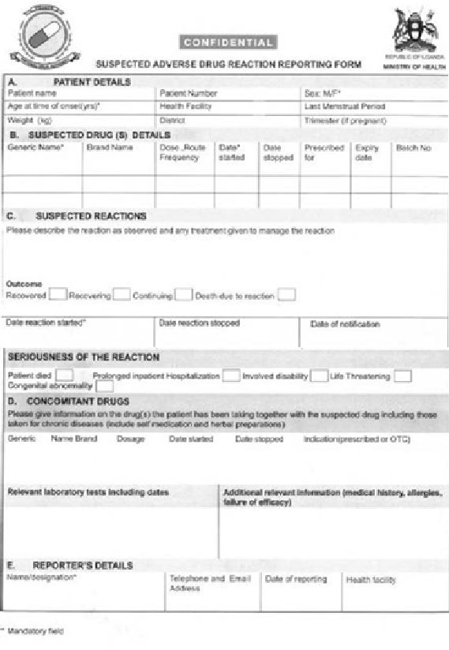

### Appendix 1 Standard Infection Control Precautions

Transmission of infections in health care facilities can be prevented and controlled through the application of basic infection control precautions which can be grouped into:

~ Standard precautions: basic infection control measures which must be applied to all patients at all times, regardless of diagnosis or infectious status. They are designed to reduce the risk of transmission of micro-organisms from both recognized and non-recognized sources.

~ Additional (transmission-based) precautions: measures that are used for patients known or suspected to be infected or colonized with highly transmissible or epidemiological important pathogens for which additional precautions are needed to interrupt transmission in health care facilities.

For more details please refer to Uganda National Infection Prevention and Control Guidelines December 2013.

#### Standard Precautions Hygiene Personal hygiene

Personal Hygiene involves the general cleanliness and care of the whole body: short and clean nails, short or pinned up hair, appropriate clean clothing (uniforms), no jewels on the hands, closed shoes.

Hand washing

Hand washing is a major component of standard precautions and one of the most effective methods to prevent transmission of pathogens associated with health care.

Uganda Clinical Guidelines 2023APPENDIX

Uganda Clinical Guidelines 2023APPENDIX

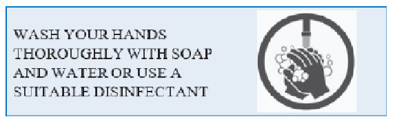

‰ Before and after any direct patient contact and between patients ‰ When any skin area is contaminated with body fluids ‰ Before handling an invasive device or doing any procedures (even

if gloves will be worn!) ‰ After removing gloves ‰ During patient care, when moving from contaminated to a clean

body site of the patient ‰ After contact with inanimate objects in the immediate ‰ vicinity of the patient. ~ Hand wash (40-60 sec) with water and soap, rub all surfacs, dry

with a single use towel or ~ Hand rub (wtih an alcohol based rub) for 20-30 sec, apply enough

product to cover all areas of the hands and rub hands until dry Respiratory hygiene and cough etiquette

~ Patients with respiratory symptoms should cover their mouth and nose with tissue or mask while coughing/ sneezing, dispose of used tissues and masks and perform hand hygiene after contact with respiratory secretions

~ Patients with respiratory symptoms should be placed 1 metre away from others in waiting areas and hand hygiene, tissues and masks made available in common areas

Instrument hygiene (decontamination) Decontamination is the combination of processes, including cleaning,

disinfection and/or sterilisation used to render a re- useable medical device safe for further episodes of use. The level of decontamination depends on the situation involved and the type and use of equipment. ~ Cleaning is the single most important step in making a med-

icaldevicereadyforre-use:byremovingorganicmaterial and reducing the number of micro-organisms present, it is an essential prerequisite of equipment decontamination to ensure effective disinfection or sterilization can be subsequently carried out. It utilizes detergents.

~ Disinfection ‘is a process used to reduce the number of viable micro-organisms, which may not necessarily inactivate some viruses and bacterial spores. Disinfection will not achieve the same reduction in microbial contamination levels as sterilization. It can be carried out by heat (boiling) or by chemical disinfectants.

~ Sterilization is a process used to render the object free from viable micro-organisms, including spores and viruses. Moist Heat via clean steam (autoclaving) is the method of choice. Chemical disinfection may only be used when autoclaving is not possible.

Facility hygiene

A clean environment forms the basis of sound infection prevention and control practices. This is because there is an important link between cleaning of health care facilities and persistence of nosocomial pathogens. ~ The purpose of cleaning the environment is toremove visible

dirt, reduce the level of microorganisms and to minimize the dissemination of infectious agents in the facility, thereby providing an aesthetically pleasing, sanitary and relatively contamination –free environment for patients, staff and visitors

Linen and laundry ~ Ensure proper handling of linen/laundry ‰ Collect clothing/sheets stained with blood/body-fluids while wearing

gloves or using a plastic bag and keep separate from other laundry

– never touch them directly

Uganda Clinical Guidelines 2023APPENDIX

Uganda Clinical Guidelines 2023APPENDIX

‰ Disinfect with hypochlorite if contaminated with body fluids ‰ Wash with soap and boil for 20 minutes Personal Protective equipment (PPE)

Personal Protective Equipment is specialised clothing or equipment worn to protect someone against a hazard or infection. PPE is indicated when health worker-patient interaction indicates that exposure to blood or body fluids is anticipated. They provide a physical barrier between micro- organism and the person.

Gloves

~ Wear clean protective gloves when handling body fluids/secretions, mucous membranes, nonintact skin contaminated waste,soiled bedding or linen instruments, and for when cleaning body fluid spills

~ Change between tasks and procedures on the same patients after contact with potentially infectious material

~ Remove after use, before touching any other surface, and wash hands immediately

~ Wear sterile or high-level disinfected gloves when performing

sterile procedures Other PPE

~ Wear a surgical or procedure mask and eye protection (googles or glasses) or a face shield when performing activities which are likely to generate splashes or sprays of blood, body fluids, secretions or excretions

~ Wear a gown to protect skin and prevent soiling of clothing in

activities as above ~ Use a waterproof bandage to cover wounds ~ Wear protective boots and gloves and where possible, wear a

water-proof apron when working in a heavily contaminated area, e.g., toilets

~ Avoid mouth-to-mouth resuscitation and pipetting by mouth where possible

~ In surgical procedures, use a needle holder and appropriate sized

needle, wear double gloves and eye shield Safe handling of sharps ~ Ensure safe sharps handling and disposal ~ Avoid accidental pricks and cuts with contaminated sharp in-

struments (e.g., needles) by careful handling and proper disposal ~ Use ”hands-free” technique for passing sharp instruments ~ Keep a puncture-resistant container nearby ~ Use safe injection practices:

- - Use a sterile needle and syringe for every injection
- - Do not recap, bend, or break needles after use

~ Drop all used disposable needles, plastic syringes, and blades directly into the sharps container without recapping or passing to another person

~ Empty or send for incineration when container is full Safe waste disposal ~ Separate hazardous (potentially dangerous) from non- hazardous

(routine) waste

- Hazardous waste includes: infectious waste (e.g. soiled bandages), anatomical waste (placenta), sharps, chemical and pharmaceutical waste

~ Use adequate personal protective equipment when handling hazardous waste (boots, gown, water proof apron, gloves, face protection)

~ Practice safe waste disposal as per guidelines (incineration, bury-

##### ing) Additional Precautions These are necessary for patients who are known or suspected to be

Uganda Clinical Guidelines 2023APPENDIX

Uganda Clinical Guidelines 2023APPENDIX

infected or colonized with specific pathogens that are transmitted by airborn, droplet or contact route of transmission.

Airborn precautions

Airborn precautions are designed to prevent transmission of particles < 5 micron in size (e.g. some viruses like measles or chickenpox, M. tubeculosis)

~ Placement of a patient in a well ventilated room with door closed and discharge of air outdoors

~ Use of appropriate respirators (masks with high filtration power)

when entering the room ~ Limitation of contacts (visitors) ~ Use of surgical mask for the patient if leaving the room ~ Adherence to cough etiquette by the patient ~ In particular settings, negative air pressure an be created

Droplet precautions

They are designed to prevent transmission of pathogens transmitted by droplets, released by talking, sneezing and coughing: H. Influenza, N.meningitis, some viruses, pertussis, influenza etc.

~ Place patient in well ventilated room or at least 1 metre distance

from other patients ~ Wear a mask if within 1 metre from the patient ~ Patient to wear a mask when moving. ‰ Closed door and negatve air pressure are not necessary Contact precautions

These precautions are designed to reduce the transmission of organism from an infected or colonized patient through direct or indirect contact. It applies to microorganisms like HIV, hepatitis B, multi-drug resistant

bacteria like MRSA, herpes simplex, varicella and haemorrhagic fevers viruses, skin staphylococcal infections, scabies, lice, other wound infections. ~ Appropriate barrier method must be used

~ Isolate patient, use dedicated equipment if possible ~ Wear gloves before entering the room, change gloves after con-

tact with potentially infected material ~ Remove gloves as soon as leaving the room and wash hands with

an antimicrobial ~ Wear a gown if necessary ~ Minimize patient’s movements outside the room In case of blood borne pathogens (HIV, hepatitis B) ~ Use particular precautions in taking blood samples ~ Decontaminate any body fluid/blood spillage with 0.5/1% hy-

pochlorite solutions

Patients suspected of having hemorrhagic fevers require the strictest infection control procedures (see WHO, 2016. Clinical management of patients with viral hemorrhagic fever. http://www.who.int/csr/resources/ publications/clinical- management-patients/en/)

#### Post-Exposure Prophylaxis

Accidental exposure to blood during medical procedures (needle or other sharp injury, splashes of blood on mucosae) carries the risk of transmission of HIV and/or hepatitis B.

Immunization against hepatitis B is recommended in health workers as an effective protection measure.

Steps for post exposure prophylaxis are described in section 3.1.11.1

Uganda Clinical Guidelines 2023APPENDIX

Uganda Clinical Guidelines 2023APPENDIX

### Appendix 2 Pharmacovigilance and Adverse Drug Reaction Re-

#### porting

Pharmacovigilance and Adverse Drug Reaction Reporting

Pharmacovigilance is defined as the science and activities relating to the detection, assessment, understanding and prevention of adverse effects or any other drug-related problem.

The aims of pharmacovigilance are to enhance patient care and patient safety in relation to the use of medicines; and to support public health programmes by providing reliable, balanced information for the effective assessment of the risk- benefit profile of medicines.

Any medicine may cause unwanted or unexpected adverse reactions, some of which may be life threatening, for example anaphylactic shock or liver failure.

#### Why Should You Report?

Rapid detection and recording of adverse drug reactions (ADR) is of vital importance so that unrecognised hazards are identified promptly and appropriate regulatory action is taken to ensure medicines are used safely and future events are prevented.

#### What Should Be Reported

Suspected adverse events to any medicine, vaccines and herbal products should be reported (including self- medication medicines).

Report all adverse drug reactions such as: ~ ADRs to to any medicine (whether new or old) ~ Serious reactions and interactions ~ ADRs which are not clearly stated in the package insert ~ Unusual or interesting adverse drug reactions

~ All adverse reactions or poisonings to traditional or herbal rem-

edies Report Product Quality Problems such as: ~ Suspected contamination ~ Questionable stability ~ Defective components ~ Poor packaging or labelling ~ Therapeutic failures ~ Non-adherence (may be due to product characteristic) Report medication errors such as: ~ Prescribing errors ~ Dispensing errors ~ Medicine preparation error ~ Administration errors ~ Monitoring error Who should report? ~ All health workers ~ Patients ~ Any member of the public ~ Medical representatives ~ Pharmaceutical Companies, Distributors, Wholesalers and Re-

tailers

Uganda Clinical Guidelines 2023APPENDIX

#### Where and How to Report

Health workers are urged to immediately report suspected ADRs directly to the National Drug Authority Pharmacovigilance Centre using the ADR forms (see example at the end of this section). The forms can

Uganda Clinical Guidelines 2023APPENDIX

also be obtained from the regional pharmacovigilance centres. Encourage your patients to report suspected ADRs to you.

ADRs can also be reported directly online using the following links:

~ www.nda.or.ug ~ https://primaryreporting.who-umc.org/Reporting/ Report-

er?OrganizationID=UG ~ All regional referral hospitals have pharmacovigilance coordina-

tors ~ NDA regional offices The following NDA offices can also be contacted for further information:

|NDA Head Office Plot 46/48 Lumumba Avenue Kampala Tel. 0414255665/0414347391/0414344052 Email: ndaug@nda.or.ug|
|---|
|National Drug Authority South-Western Regional Office House No. 29, Mbaguta Estates Kamukuzi Tel. 0485-421088 MBARARA – UGANDA Eastern Regional Office South Bukedi Cooperative Building Plot No. 6 Busia Road Tel/Fax 045-45185 TORORO – UGANDA Northern Region Office Erute Road Tel./Fax 0473-420652 LIRA – UGANDA South-Eastern Regional Office Stanley Road, Jinja Municipality Tel. 0465-440688 JINJA – UGANDA Central Regional Office Premier Complex Building Tel. 0312-261548 NAKAWA - KAMPALA Western Regional Office Main Road Tel. 0465-440688 HOIMA - UGANDA|

#### What Will Happen When I Report?

When NDA receives your report, they will assess the likelihood that the suspected adverse reaction is actually due to the medicine, using the WHO causality assessment criteria for deciding on the contribution of the medicine towards the adverse event.

Depending on the outcome of the causality assessment, NDA will give feedback in any of the following ways: medicine alerts, media statements, patient information leaflets, newsletters and personal feedback to reporters.

Prevention of Adverse Drug Reactions (ADRs) ~ Never use any medicine without a clear indication ~ If a patient is pregnant, do not use a medicine unless it is abso-

lutely necessary

~ Ask the patient if they have any allergies, hypersensitivity or previous reactions to the medicine or to similar medicines

~ Reduce doses when necessary, for example, in the young, the

elderly, and if liver or renal disease is present ~ Always prescribe as few medicines as possible ~ Carefully explain dose regimes to patients, especially those on

multiple medicines, the elderly, and anyone likely to misunderstand. Check for understanding before patient goes away.

~ Age and liver or kidney disease may affect the way medicines behave in the body so that smaller than usual amounts are needed

~ Ask if patient is taking other medicines including self medication medicines, health supplements, herbal products as interactions can occur

~ If possible, always use medicines with which you are familiar ~ Look out for ADRs when using new or unfamiliar drugs ~ Warn patients about likely adverse effects and advise them on

what to do if they occur

Uganda Clinical Guidelines 2023APPENDIX

Uganda Clinical Guidelines 2023APPENDIX

~ Give patients on certain prolonged treatments, for example anticoagulants, corticosteroids, and insulin, a small card which they can carry with them giving information about the treatment

Note: Please attach additional pages to the ADR reporting form if necessary. Even if you do not know some details in the form, do not be put off reporting the suspected adverse event

### Appendix 3 National Laboratory Test Menu

The test menu was developed by Ministry of Health/Uganda National Health Laboratory Services (UNHLS). It is a list of tests that are available at the specified level of health care. The laboratory system of Uganda is designed to support the minimum health care package for each level of care, with complexity of tests increasing with the level of care.

The laboratory test menu has been included in UCG 2023, in order to guide clinicians about the laboratory services available at each level of health care, and where to refer a patient in need of a particular test.

|The National Laboratory Test Menu|The National Laboratory Test Menu|
|---|---|
|HEALTH CENTER II|HEALTH CENTER II|
|Serology|Pregnancy Test|
|Hepatitis B Test|Syphilis Test|
|HIV testing|Biochemistry|
|Malaria Test|Rapid Blood Sugar|

|ADDITIONAL TESTS FOR HEALTH CENTER III|ADDITIONAL TESTS FOR HEALTH CENTER III|
|---|---|
|Haematology|Urobilinogen|
|Haemoglobin estimation|Glucose|
|Blood film comments|Ketones (Acetoacetic acid)|
|Bleeding Time|Specific Gravity|
|Clotting Time|pH|
|Differential count|Blood|
|Sickle cell test|Protein (Albumin)|
|Sickle cell screening test|Nitrite|
|Plasmin Inhibitor|Leukocytes in urine|
|Erythrocyte sedimentation rate|Microbiology|

Uganda Clinical Guidelines 2023APPENDIX

########################## Uganda Clinical Guidelines 2023APPENDIX

|ADDITIONAL TESTS FOR HEALTH CENTER III|ADDITIONAL TESTS FOR HEALTH CENTER III|
|---|---|
|Blood Transfusion|AFB test|
|ABO grouping|Stool analysis|
|Rh grouping|Urinalysis|
|Serology|Parasitology|
|Cryptoccocal Antigen test|Malaria test|
|Brucella agglutinin test|Filaria test|
|Rheumatoid factor|Leishmania test|
|TB LAM Rapid Test|Trypanosoma test|
|Typhoid test|Skin Snip Test|
|Helicobacter pylori IgG|Immunology /Molecular|
|Hepatitis B rapid test|CD4,CD3,CD8 Counts and Ratios|
|Hepatitis C rapid test|CD3/CD8 %|
|Biochemistry|Referral Tests|
|Rapid Blood Sugar|DNA PCR –EID (Emerging Infectious Diseases)|
|Urine Chemistry|RNA PCR -VL|
|Bilirubin| |

|ADDITIONAL TESTS FOR HC IV|ADDITIONAL TESTS FOR HC IV|
|---|---|
|Haematology|Indirect bilirubin|
|Full blood count|Total protein|
|Coagulation Tests|RFTs|
|Thrombin clotting time (TT)|Urea|
|Prothrombin time (PT)|Creatinine|
|Blood Transfusion|Electrolytes|
|Compatibility testing|Sodium|
|Serology|Potassium|

|ADDITIONAL TESTS FOR HC IV|ADDITIONAL TESTS FOR HC IV|
|---|---|
|Infectious Disease|Chloride|
|HBcAg IgG|Microbiology|
|HBeAg IgG|Swab analysis|
|Biochemistry|High Vaginal Swab (HVS) analysis|
|LFTS|Pus Swab|
|SGOT (AST)|Wound swab analysis|
|SGPT (ALT)|CSF Analysis|
|ALP|Immunology /Molecular|
|Direct bilirubin|Gene Xpert|
|Total Bilirubin| |

|ADDITIONAL TESTS FOR GENERAL DISTRICT HOSPITALS|ADDITIONAL TESTS FOR GENERAL DISTRICT HOSPITALS|
|---|---|
|Haematology|Free T4|
|Blood Film comment|Total T4|
|Coagulation Tests|Total T3|
|Thrombin time in the presence of Protamine Sulphate|TSH (Thyroid Stimulating Hormone)|
|Activated partial Thromboplastin Time (APTT)|Fertility Hormones|
|Fibrinogen test (Modified Clauss Assay)|Follicle Stimulating Hormone (FSH)|
|Plasmin Inhibitor|Luteinizing Hormone (LH)|
|Lupus erythromatosous|Cortisol|
|Platelet function tests|Progesterone|
|Thin film test|Testosterone|
|Blood Transfusion|Oestrogen|
|Blood Transfusion Services|Tumour Markers|
|Direct Coombs test|Alpha fetoprotein|

########################## Uganda Clinical Guidelines 2023APPENDIX

########################## Uganda Clinical Guidelines 2023APPENDIX

|ADDITIONAL TESTS FOR GENERAL DISTRICT HOSPITALS|ADDITIONAL TESTS FOR GENERAL DISTRICT HOSPITALS|
|---|---|
|Indirect Coombs test|Pancreatic function tests|
|Immediate Spin Cross Match (ISCM)|Amylase|
|Serology|Uric Acid|
|Anti Streptolysin O-Test (ASOT)|Lipase|
|Toxoplasma IgG and IgM|Metabolic Profile|
|TB Lam|Iron|
|Infectious Disease|Lactic acid/Lactate|
|Toxo IgG/IgM|CSF Chemistry|
|CMV IgG/IgM|Protein|
|Biochemistry|Glucose|
|LFTs|Globulins|
|Albumin|Microbiology|
|GGT|Bacteriology|
|RFTs|Semen analysis|
|Creatinine Clearance|Occult blood Test|
|Lipid profile|Swab analysis|
|Triglycerides|Throat analysis|
|Total Cholesterol|Eye Swab analysis|
|Low Density Lipoproteins (LDL) LDLc|Nasal swab analysis|
|High Density Lipoproteins (HDL) HDLc|Ear swab|
|Cardiac Profile|Histology/Cytology|
|Creatine Kinase (CK-MB) test|PAP Smear|
|CK- NAC (Total)|HPV Test|
|Lactate dehydrogenase (LDH|Biopsy Tissue|
|Troponins (C,T,I)|Mycology|
|Thyroid Function Tests|KOH|
|Free T3|Lactophenol cotton blue|

|ADDITIONAL TESTS FOR HC IV|ADDITIONAL TESTS FOR HC IV|
|---|---|
|Haematology|Iron|
|Reticulocyte test|Ferritin|
|Reticulocyte count|Transferrin|
|Reticulocyte count(count (RET#)|G6PD|
|Immature RBC haemoglobin (RBC  – HE)|Tumour Markers|
|Plasmin Inhibitor|Prostate antigen (PSA)|
|Erythrocyte sedimentation rate|CA 19-9 Ag|
|D.DIMER|CA 15-3 Ag|
|CRP test|CA 72-4 Ag|
|Peripheral Film Comment|Fertility Hormones|
|Lupus erythromatous test|-Hcg|
|Blood Transfusion|Microbiology|
|Blood Transfusion Services|Bacteriology|
|Du test|Semen analysis|
|Weak D Typing|Swab analysis|
|Serology|Blood culture|
|Measles IgM test|Gastric Aspirate|
|Rubella IgG and IgM Test|Nasopharyngeal/ oropharyngeal swab|
|Biochemistry|Cervical/Endo-cervical swab|
|Extended Electrolytes|Urethral/Rectal Swab|
|Lithium|Catheter Tips|
|Calcium|Bacterial identification tests|
|Magnesium|Bacterial susceptibility testing|
|Cardiac Profile|Lymph Node Aspirate|
|hs-CRP|Corneal scraping|

########################## Uganda Clinical Guidelines 2023APPENDIX

########################## Uganda Clinical Guidelines 2023APPENDIX

|ADDITIONAL TESTS FOR HC IV|ADDITIONAL TESTS FOR HC IV|
|---|---|
|ASO (RHD)|Mycology|
|NT Pro BNP|Mycology Culture and sensitivity|
|Myoglobin|Fungal Identification Tests|
|Bone profile|Parasitology|
|Calcium|Boleria test|
|Phosphates|Skin Snip test|
|Blood gases ABG|Immunology/Molecular|
|HCO3|Molecular|
|PO2|Gene Xpert|
|PCO2|Viral load for HIV Virus|
|Metabolic Tests|Viral load for HEPATITIS B Virus|
|Glycosylated Haemoglobin|TB DNA PCR|
|Lactic acid|LPA|
|Vitamin B12| |

|ADDITIONAL TESTS FOR MULAGO/ BUTABIKA NATIONAL REFERRAL HOSPITAL (NRH)|ADDITIONAL TESTS FOR MULAGO/ BUTABIKA NATIONAL REFERRAL HOSPITAL (NRH)|
|---|---|
|Haematology|Extended Electrolytes|
|Reticulocyte test|Bicarbonate|
|Low Fluorescence Ratio (LFR)|Phosphate|
|Medium Fluorescence Ratio (MFR)|Cardiac Profile|
|High Fluorescence Ratio (HFR)|hs-CRP|
|Reticulocyte haemoglobin (RET-HE)|ASO (RHD)|
|Immature RBC haemoglobin (RBC  – HE)|Troponins (C,T,I)|
|Body fluid analysis|NT Pro BNP|
|Mono Nuclear cell count(MN)|Myoglobin|

|ADDITIONAL TESTS FOR MULAGO/ BUTABIKA NATIONAL REFERRAL HOSPITAL (NRH)|ADDITIONAL TESTS FOR MULAGO/ BUTABIKA NATIONAL REFERRAL HOSPITAL (NRH)|
|---|---|
|Polymorph nuclear cell count (PMN)|Arterial Blood gases (ABG)|
|MN%|Ca2+ (Free & Bound)|
|PMN%|PH|
|Total Cell count (TC-BF#)|Hb|
|PROGENITOR CELL# (HPC)|HCT|
|Sickle cell test|HCO3|
|HB electrophoresis test (Sickle cell)|Metabolic Tests|
|HB – F|Folate|
|HB – S|Thyroid Function Tests|
|HB-A2|TSH|
|HBA|Anti -TSH-IgG|
|Immunotyping (light and heavy chains)|PTHH|
|Platelet function tests|Fertility Hormones|
|Thin film report|-hCG|
|Clot retraction test|Oestrone (E1)|
|Thromboerythrogram|Oestradiol (E2)|
|Coagulation Tests|Oestriol (E3)|
|Fibrinogen Antigen Assay by RIA|DHEA|
|Repitlase Time|DHEA-S|
|Batroxobin|Prolactin|
|Factor Assays(II)|Tumour Markers|
|Factor Assays(V)|CEA (Carcino Embryonic Antigen)|
|Factor Assays(VII)|- h CG|
|Factor Assays(VIII)|-FP (alpha fetoprotein)|
|Factor Assays(IX)|NSE (Neuro Specific Enolase)|

########################## Uganda Clinical Guidelines 2023APPENDIX

########################## Uganda Clinical Guidelines 2023APPENDIX

|ADDITIONAL TESTS FOR MULAGO/ BUTABIKA NATIONAL REFERRAL HOSPITAL (NRH)|ADDITIONAL TESTS FOR MULAGO/ BUTABIKA NATIONAL REFERRAL HOSPITAL (NRH)|
|---|---|
|Factor Assays(X)|S-100|
|One- stage Intrinsic Assay of prekallikren(PKK), and High Molecular Weight Kininogen (HMWK)|Cyfra 21-1|
|Plasmin Inhibitor|Enolase|
|D.DIMER|Microbiology|
|CRP test|Swab analysis|
|Peripheral Film Comment|Gastric Aspirate|
|Lupus erythromatous test|Nasopharyngeal/ oropharyngeal swab|
|ANT THROMBIN(AT)|Cervical /Endo-cervical swab|
|Anti-Thrombin Liquid (AT)|Urethral /Rectal Swab|
|ANTI Xa|Catheter Tips|
|Plasmin Inhibitor (PI)|Lymph Node Aspirate|
|Blood Transfusion|Corneal scraping|
|Blood Transfusion services|Skin/Nail/Hair Scrapping|
|Du test|Special staining identification tests|
|Anti-body typing|Mycology|
|Immediate Spin Cross Match (ISCM)|Toluidine Blue-O for pneumocystis jiroveci|
|Weak D Typing|Mycology Culture and sensitivity|
|Serology|Fungal Identification Tests|
|Infectious Disease|Fungal susceptibility tests|
|Rubella IgG/IgM|Lactophenol cotton blue|
|Measles IgG/IgM|Mycology Grocotts’ silver stain|
|Mumps IgG/IgM|Toluidine Blue-O for pneumocystis jiroveci|

|ADDITIONAL TESTS FOR MULAGO/ BUTABIKA NATIONAL REFERRAL HOSPITAL (NRH)|ADDITIONAL TESTS FOR MULAGO/ BUTABIKA NATIONAL REFERRAL HOSPITAL (NRH)|
|---|---|
|HSV 1 IgG/IgM|KOH|
|HSV 2 IgG/IgM|Histology / Cytology|
|HZV IgG/IgM|PAS|
|Biochemistry|Biopsy Tissue|
|RFTs|Cytological test|
|Inulin Clearance|Histological test|
|Cystatin C| |

|ADDITIONAL TESTS FOR SPECIALISED LABS (NTRL, UBTS, UCI and UHI)|ADDITIONAL TESTS FOR SPECIALISED LABS (NTRL, UBTS, UCI and UHI)|
|---|---|
|Haematology (UHI)|Barbiturates|
|Inhibitor Screening|Benzodiazepines|
|Clotting factor inhibitor screening based on APTT|Cannabinoides|
|Ristocetin cofactor Activity/von willebrand factor Activity (VWF:RCo or VWF: Act)|Cocaine|
|Von willebrand factor Antigen(VWF:Ag)|Ethanol|
|Von willebrand factor Collagen binding assay (VWF:CB)|Methadone|
|Factor VIII binding Assay( VWD Normanday)|Methaqualone|
|VWF Multimer Analysis|Opiates|
|Bethesda assay|Phencyclidine|
|F VIII inhibitor test|Propoxyphene|
|F IX inhibitor test|Tricyclic antidepressants|

########################## Uganda Clinical Guidelines 2023APPENDIX

########################## Uganda Clinical Guidelines 2023APPENDIX

|ADDITIONAL TESTS FOR MULAGO/ BUTABIKA NATIONAL REFERRAL HOSPITAL (NRH)|ADDITIONAL TESTS FOR MULAGO/ BUTABIKA NATIONAL REFERRAL HOSPITAL (NRH)|
|---|---|
|F XIII activity assay|Lysergic Acid Diethylamide|
|Lupus anti-coagulant(LAC) and Phospholipid anti- body(APA) tests|ImmunoHistoChemistry|
|Dilute Russell’s Viper Venom Time (DRVVT)|A Foeto protein|
|ANTI THROMBIN III (AT3)|A1 anti chymotrypsin|
|PROTEIN S|A1 anti trypsin|
|PROTEIN C|ACE mono|
|Other Specialized Tests|ACE mono|
|Protein S(PS)|ACTH|
|Free Protein S (Free PS)|Actine muscle|
|Protein S Activity|Actine muscle lisse|
|Plasminogen (PLG)|Actine muscle spé|
|Activated Protein C Resistance  –Factor test (APCR-V)|Adenovirus|
|Heparin-UHF (HepXa)|ALK Poumon|
|Fibrinogen Clauss (Fib-C)|ALK1|
|α2-Antiplasmin (APL)|Androgen Receptor|
|PFDP (P-FDP)|Annexin|
|Hepatocomplex (HPX)|Arginase-1|
|Chromogenic VIII High (F-VIII Chr H)|B Catenin|
|Proclot SP (P-ClotSP)|B HCG|
|Pro-IL Complex (PCX)|BCA 225|
|Silica Clotting Time (SCT-S, SCT Screen)|BCL2|

|ADDITIONAL TESTS FOR MULAGO/ BUTABIKA NATIONAL REFERRAL HOSPITAL (NRH)|ADDITIONAL TESTS FOR MULAGO/ BUTABIKA NATIONAL REFERRAL HOSPITAL (NRH)|
|---|---|
|Homocysteine (HCY, HCYh)|bcl-2|
|Bone marrow report|BCL6|
|Blood Transfusion services (NBTS)|BerEP4|
|Blood Transfusion services|BG8|
|Serological Testing (Ab, Ag, PCR)|BOB.1|
|IgG Phenotyping: Fya, Fyb, Jka, JKb, S, s, Cellano|BRAF V600E|
|IgM Rh-Kell C, c, E, e, K - Vertical|CDX2|
|High Titer|CD1a,2,3,4,5,7,8,10,13,14,15, 16,20..68|
|Direct Anti globulin Test(DAT)|CA125|
|Antibody screen, commonly known as Antibody detection test (ADT)|CA19.9|
|Group and screen|Cadherin 17|
|Anti globulin cross match|Calcitonin|
|Platelet Compatibility Test|Calcitonin|
|Serological Testing (CMIA, Ab, Ag, PCR)|Caldesmon|
|Serology|Calponin|
|Infectious Disease|Calretinin|
|Helicobacter pylori IgG/IgM|Caveolin-1|
|HBsAg IgG|CD1a, 2,3,4,5,7,8,10,13,14,15|
|,16,20..68| |
|HBcAg IgG|FITC Albumin|
|HBeAg IgG|FITC C1Q|
|Toxo IgG/IgM|FITC C3|
|CMV IgG/IgM|FITC C4|

########################## Uganda Clinical Guidelines 2023APPENDIX

########################## Uganda Clinical Guidelines 2023APPENDIX

|ADDITIONAL TESTS FOR MULAGO/ BUTABIKA NATIONAL REFERRAL HOSPITAL (NRH)|ADDITIONAL TESTS FOR MULAGO/ BUTABIKA NATIONAL REFERRAL HOSPITAL (NRH)|
|---|---|
|HCV IgG/IgM|FITC Fibrinogen|
|Rubella IgG/IgM|FITC IgA|
|Measles IgG/IgM|FITC IgG|
|Mumps IgG/IgM|FITC IgM|
|HSV 1 IgG/IgM|FITC Kappa|
|HSV 2 IgG/IgM|FITC Lambda|
|HZV IgG/IgM|CK 34BE12|
|HIV combi|CK AE1|
|HIV confirmatory|SPECIFIC PROTEINS|
|Anti HBS|ASLO|
|Anti HAV|APOA1|
|Anti HAV-IgM|APO B|
|Other Hormones|C3c|
|G.H (Gonadotrophic Hormone)|C4|
|IGF-4|CRP|
|ACTH|hs CRP|
|Aldosterone|HbA1c|
|Cortisol|Cystatin|
|GnRH (Gonadotropin Realesing Hormone)|Ferritin|
|Vasopressin|Haptoglobin|
|Insulin|IgA|
|Biochemistry (UHI)|IgG|
|Lipid profile|IgM|
|vLDLc|Acid Glycoprotein|

|ADDITIONAL TESTS FOR MULAGO/ BUTABIKA NATIONAL REFERRAL HOSPITAL (NRH)|ADDITIONAL TESTS FOR MULAGO/ BUTABIKA NATIONAL REFERRAL HOSPITAL (NRH)|
|---|---|
|Cardiac Profile|Antitrypsin|
|Digitoxin|Microglobulin a1|
|Digoxin|Microglobulin a2|
|Pro-BNP|Microglobulin B2|
|PCT|Albumin Urine|
|IL-6|Myoglobin|
|Anti-CCP|RF|
|IgE|Transferrin|
|Bone Profile|Soluble Transferrin|
|PTH (Parathyroid Hormone)|Kappa|
|Vitamin D3|Free Kappa|
|B-Crosslaps|Lambda|
|Total P1NP|Free Lambda|
|N-MID-Oesteocalcin|Antithrombin|
|Thyroid Function Tests|D-Dimer|
|TG|Protein Electrophoresis|
|T-Uptake|Serum Protein|
|Anti-TG|Enzyme|
|Anti-TPO|Haemoglobin|
|Fertility Hormones|HbA1C|
|s-Fit-1|Rheumatology Studies|
|SHBG (Sex Hormone Binding Protein)|R.F|
|PIGF|C3|
|G.H|C4|

########################## Uganda Clinical Guidelines 2023APPENDIX

########################## Uganda Clinical Guidelines 2023APPENDIX

|ADDITIONAL TESTS FOR MULAGO/ BUTABIKA NATIONAL REFERRAL HOSPITAL (NRH)|ADDITIONAL TESTS FOR MULAGO/ BUTABIKA NATIONAL REFERRAL HOSPITAL (NRH)|
|---|---|
|IGF-1|CRP|
|ACTH|DsDNA|
|C-Peptide|Anti – CCP|
|Cortisol|ANA (antinuclear antibodies)|
|GnRH|ANCA (anti neutrophil cytoplasmic antibodies)|
|Insulin|CDT(for Alcohol abuse)|
|Tumour Markers|NTRL|
|FPSA|Tuberculosis Culture|
|- h CG-free|Identification of Mycobacteria tuberculosis complex (MTC)|
|Cyfra-21-1|Drug susceptibility testing (DST) methods|
|Drug Abuse|Xpert MTB/RIF test|
|Amphetamines| |

### Appendix 4 References

Ministry of Health Uganda, National Tuberculosis and Leprosy Programme, 2016. Tuberculosis and Leprosy Manual, 3rd Edition

Ministry of Health Uganda, Makerere Palliative Care Unit, 2014. Palliative Care Guidelines

World Health Organisation, 2010. WHO guide for Rabies Pre and Post-Exposure Prophylaxis in Humans. http://www. who.int/rabies/ PEP_prophylaxis_guidelines_June10.pdf Accessed on 25/11/2016

Ministry of Health Uganda, 2013. Uganda National Infection Prevention and Control Guidelines 2013. http://library. health.go.ug/ publications/leadership-and-governance- governance/guidelines/ uganda-national-infection- prevention Accessed on 25/11/2016

Ministry of Health Uganda, 2010. Guidelines for the Syndromic Management of Sexually Transmitted Infections in Uganda.

Ministry of Health Uganda, 2022. Essential Maternal and Newborn Clinical Care Guidelines for Uganda.

Uganda Guidelines for Prevention, Testing, Care and Treatment of Hepatitis B and C Virus Infection, May 2019

Ministry of Health Uganda, 2016. The Uganda Medical Eligibity Criteria for Contraceptive Use, MEC Wheel

Ministry of Health Uganda, 2015. Integrated Community Case Management

Ministry of Health Uganda, 2015. Integrated Management of Malaria Training, 2nd Edition. Facilitator’s Guide

Ministry of Health Uganda, 2015. Practical Guideline for Dispensing for Higher Level Health Centres, 2015.

Ministry of Health Uganda, AIDS Control Programme, 2016. Consolidated Guidelines for Prevention and Treatment of HIV in Uganda.

Uganda Clinical Guidelines 2023APPENDIX

Uganda Clinical Guidelines 2023APPENDIX

Ministry of Health Uganda, 2016. Guidelines for Integrated Management of Nutrition in Uganda.

Uganda Gastroenterology Society, 2016. Pocket Guide: Care and Treatment for Hepatitis B Virus Infection for Clinicains in Uganda

UNAS, CDDEP, GARP-Uganda, Mpairwe, Y., & Wamala S. (2015). Antibiotic Resistance in Uganda: Situation Anaysis and Recommendations. Kampala, Uganda: Uganda National Academy of Sciences; Center for Disease Dynamics, Economics & Policy.

- World Health Organisation, 2015. Integrated Management of Pregnancy and Childbirth. 3rd Edition. http://apps.who.

int/iris/bitstream/10665/249580/1/9789241549356-eng. pdf Accessed on 25/11/2016

World Health Organisation, 2002. The Clinical Use of Blood. http:// www.who.int/bloodsafety/clinical_use/en/ Handbook_EN.pdf Accessed on 25/11/2016

- World Health Organisation, 2013. Pocket Book of Hospital Care for Children, 2nd Edition. http://apps.who.int/iris/ bitstr eam/10665/81170/1/9789241548373_eng.pdf Accessed on 25/11/2016

World Health Organisation, 2007. Managing Complications in Pregnancy and Childbirth: A guide for midwives and doctors.

World Health Organisation and UNICEF 2009. WHO child growth standards and the identification of severe acute malnutrition in infants and children.

- World Health Organisation, 2016. WHO Guidelines for the treatment of Treponema Pallidum (syphilis). http://www. who.int

World Health Organisation, 2016. WHO Guidelines for the treatment of Neisseria Gonorrhoeae. http://www.who.int

World Health Organisation, 2016. WHO Guidelines for the treatment of Chlamydia Trachomatis. http://www.who.int

World Health Organisation 2015. Medical Eligibility Criteria for Contraceptive Use. 5th edition (2015). http://www.who. int/reproductivehealth/en/

- World Health Organisation, 2014. Integrated Management of Childhood Illness Chart Booklet. http://apps.who.int/ iris/bitstre am/10665/104772/16/9789241506823_ Chartbook_eng.pdf Accessed on 25/11/2016
- World Health Organisation, 2015. Guidelines for the Treatment of Malaria, 3rd Edition, 2015. http://apps.who. int/iris/bitstre am/10665/162441/1/9789241549127_eng. pdf Accessed on 25/11/2016

World Health Organisation, 2010. mhGAP Intervention Guide. http://apps.who.int/iris/ bitstream/10665/44406/1/ 9789241548069_eng.pdf Accessed on 25/11/2016

Medecins Sans Frontieres. Clinical Guidelines - Diagnosis and treatment manual. 2016 edition. http://refbooks.msf. org/msf_docs/en/ clinical_guide/cg_en.pdf

Dowell, S. F., Sejvar, J. J., Riek, L., Vandemaele, K. A. H., Lamunu, M., Kuesel, A. C., … Mbonye, A. K. (2013). Nodding Syndrome. Emerging Infectious Diseases, 19(9), 1374–1373. http://doi. org/10.3201/eid1909.130401 Global Inititative for Chronic Obstructive Lung disease, 2015. Pocket Guide to COPD diagnosis, management and prevention. http:// goldcopd.org/pocket-guide-copd- diagnosis-management-prevention-2016/ Accessed on 25/11/2016 BMJ Group and the Royal Pharmaceutical Society of Great Britain,

2014. British National Formulary 66, 2013-2014. London, UK BMJ Group and the Royal Pharmaceutical Society of Great Britain,

2014. British National Formulary for Children 2013-2014. London, UK

Uganda Clinical Guidelines 2023APPENDIX

Uganda Clinical Guidelines 2023APPENDIX

Republic of Namibia. Ministry of Health and Social Services, 2011. Namibia Standard Treatment Guidelines. http://apps.who.int/ medicinedocs/documents/s19260en/ s19260en.pdf Accessed on 25/11/2016

Republic of South Africa. Essential Drugs Programme. Hospital (Adults) Standard Treatment Guidelines and Essential Medicines List. 4th ed. Republic of South Africa: National Department of Health;

2015. http://www. health.gov.za/index.php/component/phocadownload/ category/197/

Republic of South Africa. Essential Drugs Programme. Hospital (Paediatrics) Standard Treatment Guidelines and Essential Medicines List. 3rd ed. Republic of South Africa: National Department of Health;

2013. http://www. health.gov.za/index.php/component/phocadownload/ category/197/

Republic of South Africa. Essential Drugs Programme. Primary Health Care Level. Standard Treatment Guidelines and Essential Medicines List. 5th ed. Republic of South Africa: National Department of Health; 2014. http://www.health.gov.za/index.php/component/ phocadownload/category/197/

Medscape. http://www.medscape.com

SIAPS. 2015. Developing, Implementing, and Monitoring the Use of Standard Treatment Guidelines: A SIAPS How-to Manual. Submitted to the US Agency for International Development by the Systems for Improved Access

to Pharmaceuticals and Services (SIAPS) Program. Arlington, VA: Management Sciences for Health. http:// www.siapsprogram.org/ publication/stg-how-to-manual

African Snakebite Institute. https://www.africansnakebiteinstitute. com/

